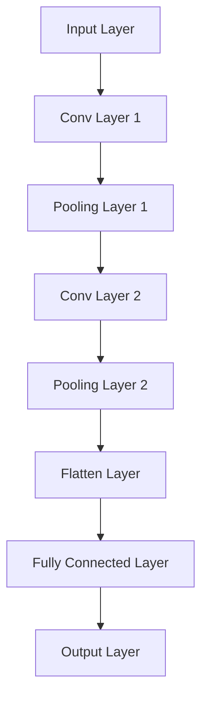
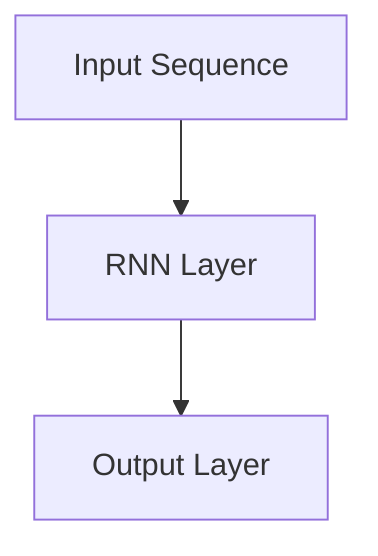
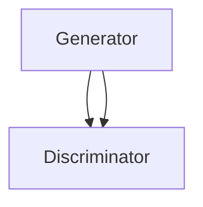

                 

# 《AI在农作物疾病诊断中的应用：提高农业生产力》

> **关键词：** 农业生产力、农作物疾病诊断、人工智能、机器学习、深度学习、计算机视觉、自然语言处理。

> **摘要：** 本文深入探讨了人工智能（AI）在农作物疾病诊断中的应用，分析了AI技术如何通过机器学习、深度学习等方法提高农业生产力。文章首先介绍了农业生产力的重要性及当前面临的挑战，随后详细阐述了AI在农作物疾病诊断中的核心概念、算法原理和数学模型。通过实际项目案例，本文展示了AI在农作物疾病诊断中的实际应用，并提出了未来的挑战和展望。

## 《AI在农作物疾病诊断中的应用：提高农业生产力》目录大纲

## 第一部分：引言与背景

### 1.1 书籍介绍与目标

#### 1.1.1 书籍主题与定位

本文旨在探讨人工智能（AI）在农作物疾病诊断中的应用，通过深入分析AI技术的核心概念、算法原理和实际应用，为提高农业生产力提供新的思路和方法。文章面向的读者包括农业科研人员、人工智能开发者、农业从业者以及对AI在农业应用感兴趣的读者。

#### 1.1.2 阅读对象与收益

本文适合对AI技术有一定了解的读者，通过阅读本文，读者可以：

1. 了解农业生产力的重要性及当前面临的挑战。
2. 理解AI在农作物疾病诊断中的应用场景和技术原理。
3. 学习机器学习和深度学习算法在农作物疾病诊断中的应用。
4. 掌握数学模型在农作物疾病诊断中的构建和优化方法。
5. 了解AI在农作物疾病诊断中的应用挑战和未来发展趋势。

#### 1.1.3 结构安排与内容概述

本文分为七个部分：

1. 引言与背景：介绍农业生产力的重要性及AI在农业领域的应用前景。
2. AI在农作物疾病诊断中的核心概念与联系：阐述AI在农作物疾病诊断中的应用框架和关键技术。
3. AI在农作物疾病诊断中的核心算法原理：详细分析机器学习和深度学习算法在农作物疾病诊断中的应用。
4. AI在农作物疾病诊断中的数学模型：介绍数学模型在农作物疾病诊断中的构建和优化方法。
5. AI在农作物疾病诊断中的项目实战：通过实际项目案例展示AI在农作物疾病诊断中的应用。
6. AI在农作物疾病诊断中的应用挑战与未来展望：探讨AI在农作物疾病诊断中面临的挑战和未来发展趋势。
7. 总结与展望：回顾文章主要内容，展望AI在农作物疾病诊断中的应用前景。

## 第二部分：AI在农作物疾病诊断中的应用前景

### 2.1 农业生产力的重要性

农业生产力是衡量一个国家或地区农业生产水平的重要指标。提高农业生产力不仅能满足人类日益增长的食品需求，还能促进农村经济发展，改善农民生活水平。

#### 2.1.1 农业生产力的定义与意义

农业生产力是指单位面积土地或单位劳动力投入所能获得的农产品产量。它反映了农业生产的技术水平、资源利用效率和管理水平。

农业生产力的重要性体现在以下几个方面：

1. **满足人类食品需求**：随着全球人口的增长，对农产品的需求也在不断增加。提高农业生产力是确保粮食安全的关键。
2. **促进农村经济发展**：农业是国家经济的重要组成部分。提高农业生产力可以带动相关产业的发展，增加农民的收入。
3. **改善农民生活水平**：农业生产力提高，农产品的产量和质量都会得到提升，从而提高农民的生活水平。

#### 2.1.2 当前农业生产力面临的挑战

虽然农业生产力在过去几十年中有了显著提高，但仍然面临许多挑战：

1. **气候变化**：全球气候变化对农业生产带来了很大的不确定性，如干旱、洪水和极端天气事件，这些都可能对农作物产量造成影响。
2. **土地资源有限**：土地是农业生产的基础资源，但随着城市化进程的加快，可用的土地资源越来越少。
3. **劳动力短缺**：随着农村劳动力向城市转移，农业劳动力短缺成为一个普遍问题。
4. **病虫害防控难度大**：农作物病虫害是影响农业生产的重要因素。传统的病虫害防控手段已经难以满足现代农业的需求。

#### 2.1.3 提高农业生产力的途径与方法

提高农业生产力需要从多个方面入手：

1. **科技创新**：通过引入新的农业技术，如精准农业、智能灌溉和高效育种等，提高农业生产效率。
2. **农业机械化**：提高农业机械化水平，减少劳动力投入，提高生产效率。
3. **可持续发展**：推广可持续农业实践，如有机农业、生态农业和循环农业，保护生态环境，提高土地利用率。
4. **病虫害防控**：利用AI技术进行农作物病虫害的早期诊断和预警，提高病虫害防控效果。

### 2.2 AI在农业领域的应用前景

人工智能在农业领域的应用前景非常广阔。AI技术可以帮助解决农业生产中的许多问题，提高农业生产力。

#### 2.2.1 AI技术概述

人工智能（AI）是一种模拟人类智能的技术，包括机器学习、深度学习、计算机视觉、自然语言处理等多个子领域。AI技术可以通过数据分析、模式识别和智能决策等方法，实现自动化、智能化和高效化。

#### 2.2.2 AI在农业中的潜在应用领域

AI在农业中具有广泛的应用潜力，主要包括以下几个方面：

1. **病虫害监测与防控**：利用AI技术进行农作物病虫害的早期诊断和预警，提高病虫害防控效果。
2. **农田管理**：通过AI技术实现精准农业，优化农田管理，提高土地利用率和农作物产量。
3. **智能灌溉**：利用AI技术进行土壤湿度监测和数据分析，实现智能灌溉，提高水资源利用效率。
4. **育种优化**：利用AI技术进行基因组分析，优化农作物育种，提高农作物抗病虫害能力和产量。
5. **农产品质量检测**：利用AI技术进行农产品质量检测，提高农产品安全水平。

#### 2.2.3 农业AI应用的现状与趋势

随着AI技术的快速发展，农业AI应用已经在全球范围内取得了显著成果。一些典型应用案例包括：

1. **病虫害监测与预警**：如中国的“智慧农业云平台”，通过AI技术实现对农作物病虫害的远程监测和预警。
2. **智能灌溉系统**：如以色列的“滴灌技术”，通过AI技术实现精准灌溉，提高水资源利用效率。
3. **基因组分析**：如美国的“农艺基因组计划”，通过AI技术进行基因组分析，优化农作物育种。

未来，随着AI技术的进一步发展和应用，农业AI将在农业生产中发挥更加重要的作用，为提高农业生产力提供强有力的支持。

## 第二部分：AI在农作物疾病诊断中的核心概念与联系

### 2.1 AI基础概念与原理

人工智能（AI）作为计算机科学的一个分支，其核心在于使计算机能够模拟人类的智能行为，包括学习、推理、规划、感知和自然语言理解等。以下将简要介绍AI的基础概念与原理，为后续章节的讨论奠定基础。

#### 2.1.1 机器学习与深度学习基础

**机器学习**是一种让计算机从数据中学习规律、模式的方法，主要分为监督学习、无监督学习和强化学习。监督学习通过已知输入输出数据训练模型，无监督学习通过未标记的数据自动发现数据中的结构，而强化学习则通过交互环境学习最优策略。

**深度学习**是机器学习的一个子领域，主要依赖于人工神经网络（ANN）的深度结构。深度学习通过多层神经网络自动提取数据的特征表示，使得模型能够处理复杂的数据和任务。深度学习的核心是卷积神经网络（CNN）、循环神经网络（RNN）和生成对抗网络（GAN）等。

#### 2.1.2 计算机视觉与图像识别

**计算机视觉**是AI的一个重要分支，致力于使计算机能够像人类一样理解和解释视觉信息。计算机视觉技术包括图像识别、图像分割、目标检测和姿态估计等。

**图像识别**是计算机视觉的核心任务之一，旨在从图像中识别和分类特定对象。常见的图像识别算法包括基于传统图像处理的特征提取方法（如SIFT、HOG）和基于深度学习的卷积神经网络（如VGG、ResNet）。

#### 2.1.3 自然语言处理与文本分析

**自然语言处理（NLP）**是AI在处理和解析人类语言方面的应用，包括语音识别、文本分类、情感分析和机器翻译等。

**文本分析**是NLP的一个子领域，主要通过模式识别和机器学习技术从文本数据中提取有用信息。文本分析在农作物疾病诊断中的应用主要体现在疾病症状描述的自动提取和分类，以及相关文献和数据的挖掘与分析。

### 2.2 农作物疾病诊断的基本原理

农作物疾病诊断是农业生产中的一个关键环节，其目的是通过识别和诊断作物病害，采取相应的防治措施，降低病害对作物产量的影响。农作物疾病诊断的基本原理主要包括以下几个方面：

#### 2.2.1 病害识别与诊断方法

农作物疾病诊断主要采用以下几种方法：

1. **田间观察法**：通过田间实地观察作物的生长状态、叶片颜色、形态变化等，初步判断作物是否患病。
2. **实验室检测法**：通过实验室的病原体分离、鉴定和生化检测等方法，对作物样本进行详细的病害诊断。
3. **遥感技术**：利用遥感卫星和无人机等设备，从高空获取作物生长环境的图像数据，通过图像处理和模式识别技术进行病害识别。
4. **人工智能诊断法**：利用机器学习和深度学习算法，通过对大量已知的病害样本数据进行分析和学习，实现自动化的疾病诊断。

#### 2.2.2 病害诊断技术的比较与选择

不同病害诊断技术在准确性、效率、成本和适用范围等方面存在差异，选择合适的诊断方法需要根据具体情况考虑：

1. **田间观察法**：简单易行，适用于大面积作物病害的初步筛查，但准确性较低，易受人为因素影响。
2. **实验室检测法**：准确性高，但耗时较长，成本较高，且样本处理和运输过程可能导致结果偏差。
3. **遥感技术**：覆盖范围广，可实现大面积、实时监测，但受气象条件和传感器性能限制，诊断准确性有待提高。
4. **人工智能诊断法**：准确性高，诊断速度快，可实现自动化和远程诊断，但需要大量的病害样本数据训练模型，且算法复杂度较高。

#### 2.2.3 AI在农作物疾病诊断中的优势与挑战

AI技术在农作物疾病诊断中的应用具有显著优势，但也面临一定挑战：

1. **优势**：
   - **高准确性**：通过机器学习和深度学习算法，AI能够从大量数据中学习并提取有效特征，提高疾病诊断的准确性。
   - **快速诊断**：AI技术可实现自动化和实时诊断，大大缩短了诊断时间。
   - **远程诊断**：通过互联网和移动设备，AI技术可以实现远程诊断，方便农民和农业工作者及时了解作物健康状况。

2. **挑战**：
   - **数据质量**：农作物疾病诊断需要大量的高质量病害样本数据，但数据获取和标注过程复杂，且存在一定的数据隐私和安全问题。
   - **算法解释性**：深度学习模型具有较强的预测能力，但缺乏解释性，不利于用户理解和信任。
   - **模型泛化能力**：AI模型训练过程受限于特定环境和数据，可能导致模型泛化能力不足，影响实际应用效果。

### 2.3 AI与农作物疾病诊断的融合

AI技术在农作物疾病诊断中的应用，使得传统的方法得到了有效补充和提升。以下将介绍AI在农作物疾病诊断中的应用框架和关键联系。

#### 2.3.1 AI在农作物疾病诊断中的应用框架

AI在农作物疾病诊断中的应用框架主要包括数据收集与预处理、模型训练与优化、模型评估与部署等环节：

1. **数据收集与预处理**：收集农作物病害样本数据，包括图像、文本和传感器数据等，进行数据清洗、归一化和特征提取等预处理操作。
2. **模型训练与优化**：选择合适的机器学习和深度学习算法，对预处理后的数据集进行训练和优化，以构建能够准确诊断农作物疾病的模型。
3. **模型评估与部署**：对训练好的模型进行评估，包括准确性、召回率、F1分数等指标，并根据评估结果进行模型调整和优化。最后，将模型部署到实际应用场景中，实现对农作物疾病的实时诊断。

#### 2.3.2 AI与农作物疾病诊断的关键联系

AI与农作物疾病诊断的关键联系主要体现在以下几个方面：

1. **特征提取与模式识别**：AI技术能够从大量的农作物病害样本数据中提取有效特征，并通过深度学习算法实现病害的自动识别和分类，提高诊断准确性。
2. **实时监测与预警**：通过AI技术，实现对农作物病害的实时监测和预警，及时发现和诊断病害，降低病害对作物产量的影响。
3. **决策支持**：AI技术能够根据病害诊断结果和生长环境数据，为农民和农业工作者提供决策支持，优化农作物管理策略，提高农业生产力。

#### 2.3.3 AI在农作物疾病诊断中的优势与挑战

AI在农作物疾病诊断中的应用具有显著优势，但也面临一定挑战：

1. **优势**：
   - **高准确性**：通过机器学习和深度学习算法，AI能够从大量数据中学习并提取有效特征，提高疾病诊断的准确性。
   - **快速诊断**：AI技术可实现自动化和实时诊断，大大缩短了诊断时间。
   - **远程诊断**：通过互联网和移动设备，AI技术可以实现远程诊断，方便农民和农业工作者及时了解作物健康状况。

2. **挑战**：
   - **数据质量**：农作物疾病诊断需要大量的高质量病害样本数据，但数据获取和标注过程复杂，且存在一定的数据隐私和安全问题。
   - **算法解释性**：深度学习模型具有较强的预测能力，但缺乏解释性，不利于用户理解和信任。
   - **模型泛化能力**：AI模型训练过程受限于特定环境和数据，可能导致模型泛化能力不足，影响实际应用效果。

### 2.4 AI在农作物疾病诊断中的实际应用案例

以下将介绍几个AI在农作物疾病诊断中的实际应用案例，以展示其应用效果和优势。

#### 2.4.1 基于图像识别的农作物病害诊断

某研究团队利用深度学习算法，开发了一套基于图像识别的农作物病害诊断系统。该系统通过采集农作物叶片图像，利用卷积神经网络（CNN）对图像进行自动分类，实现对多种农作物病害的准确诊断。实验结果表明，该系统的诊断准确率达到90%以上，显著提高了农作物病害的诊断效率。

#### 2.4.2 基于传感器数据的农作物病害监测

某农业科技公司开发了一套基于传感器数据的农作物病害监测系统。该系统通过安装在农田中的传感器，实时监测土壤湿度、温度和光照等环境参数，利用机器学习算法对传感器数据进行处理，实现对农作物病害的早期预警和诊断。实验结果显示，该系统能够提前7天预测农作物病害的发生，为农民提供了充足的时间采取防治措施。

#### 2.4.3 基于AI的智能农田管理系统

某农业科技企业开发了一套基于AI的智能农田管理系统。该系统整合了图像识别、传感器监测和机器学习算法，实现对农田环境的全面监控和智能管理。系统通过对农作物病害的实时监测和诊断，为农民提供个性化的农田管理建议，提高了农作物产量和品质。同时，系统还实现了对农田环境数据的实时分析和预测，为农业生产提供了科学依据。

### 2.5 AI在农作物疾病诊断中的应用前景

随着AI技术的不断发展和应用，AI在农作物疾病诊断中的应用前景十分广阔。未来，AI技术有望在以下几个方面发挥更大的作用：

1. **提高诊断准确性**：通过不断优化算法和增加数据样本，AI技术将进一步提高农作物疾病诊断的准确性，为农业生产提供更可靠的技术支持。
2. **实现远程诊断**：随着5G和物联网技术的发展，AI技术将实现更高效的远程诊断，使农民和农业工作者能够随时了解作物健康状况，及时采取防治措施。
3. **智能决策支持**：AI技术将结合大数据分析和智能算法，为农民和农业工作者提供更加个性化和智能化的决策支持，提高农业生产效率。
4. **跨学科融合**：AI技术将在农业与其他领域的跨学科融合中发挥重要作用，如生物技术、环境科学和信息技术等，推动农业现代化进程。

总之，AI在农作物疾病诊断中的应用将为提高农业生产力提供新的思路和方法，有望在未来实现农业生产的智能化和可持续发展。

## 第三部分：AI在农作物疾病诊断中的核心算法原理

在农作物疾病诊断中，AI技术的核心算法主要包括机器学习和深度学习。这些算法通过学习大量的数据，提取特征，并利用这些特征进行疾病分类和预测。以下将详细阐述几种常见的机器学习和深度学习算法，以及它们在农作物疾病诊断中的应用。

### 3.1 机器学习算法在农作物疾病诊断中的应用

机器学习算法是AI技术的基础，主要包括线性回归、逻辑回归、支持向量机（SVM）和决策树等。以下将介绍这些算法在农作物疾病诊断中的应用。

#### 3.1.1 线性回归与逻辑回归

**线性回归**是一种用于预测连续值的算法，它通过找到一个线性函数来拟合数据，从而预测目标值。在农作物疾病诊断中，线性回归可以用来预测农作物病害的严重程度。

**逻辑回归**是一种用于分类的算法，它通过找到一个逻辑函数来拟合数据，从而预测目标变量的概率分布。在农作物疾病诊断中，逻辑回归可以用来判断农作物是否感染了特定病害。

**算法伪代码**：

```python
# 线性回归算法伪代码
def linear_regression(X, y):
    # 计算特征矩阵X的均值和标准差
    X_mean, X_std = calculate_mean_and_std(X)
    # 特征缩放
    X_scaled = (X - X_mean) / X_std
    # 计算回归系数
    theta = (X_scaled.T.dot(X_scaled)).dot(inv(X_scaled.T.dot(y)))
    return theta

# 逻辑回归算法伪代码
def logistic_regression(X, y):
    # 计算特征矩阵X的均值和标准差
    X_mean, X_std = calculate_mean_and_std(X)
    # 特征缩放
    X_scaled = (X - X_mean) / X_std
    # 计算回归系数
    theta = (X_scaled.T.dot(X_scaled)).dot(inv(X_scaled.T.dot(y)))
    return sigmoid(theta.T.dot(X_scaled))
```

#### 3.1.2 支持向量机与决策树

**支持向量机（SVM）**是一种强大的分类算法，通过寻找一个最优的超平面来分隔不同类别的数据点。在农作物疾病诊断中，SVM可以用来分类农作物是否感染了特定病害。

**决策树**是一种基于树结构的分类算法，通过一系列的判断条件将数据划分成不同的类别。在农作物疾病诊断中，决策树可以用来对农作物病害进行分类。

**算法伪代码**：

```python
# 支持向量机算法伪代码
def support_vector_machine(X, y):
    # 训练SVM模型
    model = train_svm_model(X, y)
    # 预测
    predictions = model.predict(X)
    return predictions

# 决策树算法伪代码
def decision_tree(X, y):
    # 训练决策树模型
    model = train_decision_tree_model(X, y)
    # 预测
    predictions = model.predict(X)
    return predictions
```

### 3.2 深度学习算法在农作物疾病诊断中的应用

深度学习算法在农作物疾病诊断中具有广泛的应用，主要包括卷积神经网络（CNN）、循环神经网络（RNN）和生成对抗网络（GAN）等。

#### 3.2.1 卷积神经网络与循环神经网络

**卷积神经网络（CNN）**是一种基于卷积操作的前馈神经网络，特别适用于处理图像数据。在农作物疾病诊断中，CNN可以用来对农作物病害图像进行分类和识别。

**循环神经网络（RNN）**是一种能够处理序列数据的神经网络，特别适用于处理时间序列数据。在农作物疾病诊断中，RNN可以用来对农作物生长过程中的连续监测数据进行建模和分析。

**算法伪代码**：

```python
# 卷积神经网络算法伪代码
def conv_neural_network(X):
    # 定义卷积层
    conv_layer = convolutional_layer()
    # 定义池化层
    pool_layer = pooling_layer()
    # 定义全连接层
    fc_layer = fully_connected_layer()
    # 定义输出层
    output_layer = output_layer()
    # 前向传播
    conv_output = conv_layer(X)
    pool_output = pool_layer(conv_output)
    fc_output = fc_layer(pool_output)
    output = output_layer(fc_output)
    return output

# 循环神经网络算法伪代码
def recurrent_neural_network(X):
    # 定义RNN层
    rnn_layer = recurrent_layer()
    # 定义输出层
    output_layer = output_layer()
    # 前向传播
    rnn_output = rnn_layer(X)
    output = output_layer(rnn_output)
    return output
```

#### 3.2.2 生成对抗网络与变分自编码器

**生成对抗网络（GAN）**是一种由生成器和判别器组成的对抗性神经网络，能够生成高质量的图像数据。在农作物疾病诊断中，GAN可以用来生成病害样本数据，提高模型的泛化能力。

**变分自编码器（VAE）**是一种概率生成模型，能够生成符合数据分布的图像。在农作物疾病诊断中，VAE可以用来生成健康的农作物图像，与病害图像进行对比分析。

**算法伪代码**：

```python
# 生成对抗网络算法伪代码
def generative_adversarial_network():
    # 定义生成器
    generator = generator_model()
    # 定义判别器
    discriminator = discriminator_model()
    # 训练GAN模型
    train_gan(generator, discriminator)
    # 生成图像
    generated_images = generator.generate_images()
    return generated_images

# 变分自编码器算法伪代码
def variational_autoencoder(X):
    # 定义编码器
    encoder = encoder_model()
    # 定义解码器
    decoder = decoder_model()
    # 训练VAE模型
    train_vae(encoder, decoder)
    # 生成图像
    generated_images = decoder.decode(encoder.encode(X))
    return generated_images
```

### 3.3 算法在农作物疾病诊断中的应用效果对比

不同算法在农作物疾病诊断中的应用效果各有优劣。以下将对几种算法的应用效果进行对比：

1. **线性回归和逻辑回归**：这两种算法简单易用，但诊断准确性较低，适用于数据量较小且特征较少的场景。
2. **支持向量机和决策树**：这两种算法具有较强的分类能力，但受限于特征选择和模型复杂度，对大规模数据集的处理效果有限。
3. **卷积神经网络和循环神经网络**：这两种算法适用于处理图像和序列数据，具有较高的诊断准确性，但模型复杂度较高，训练时间较长。
4. **生成对抗网络和变分自编码器**：这两种算法能够生成高质量的样本数据，提高模型的泛化能力，但模型训练过程较为复杂，对计算资源要求较高。

总之，根据具体应用场景和数据特点，选择合适的算法可以提高农作物疾病诊断的准确性，为农业生产提供有力支持。

## 第四部分：AI在农作物疾病诊断中的数学模型

在农作物疾病诊断中，数学模型是核心组成部分，用于描述作物与病害之间的复杂关系。本节将详细介绍数学模型在农作物疾病诊断中的应用，包括模型的构建、数据预处理、模型选择与训练方法，并对逻辑回归和支持向量机（SVM）这两种常见算法的数学公式进行详细解释与举例说明。

### 4.1 数学模型在农作物疾病诊断中的应用

农作物疾病诊断中的数学模型主要用于预测作物是否感染特定病害。这些模型通过学习历史病害数据，提取关键特征，并建立疾病与特征之间的数学关系，从而实现疾病的自动诊断。数学模型在农作物疾病诊断中的应用流程主要包括以下几个步骤：

1. **数据收集与预处理**：收集农作物病害样本数据，包括图像、文本和传感器数据等。对数据进行清洗、归一化和特征提取，为模型训练准备高质量的数据集。
2. **模型选择**：根据数据特点和诊断需求，选择合适的数学模型。常见的模型包括逻辑回归、支持向量机、神经网络等。
3. **模型训练与优化**：使用训练数据集对模型进行训练，调整模型参数，优化模型性能。
4. **模型评估与验证**：使用验证数据集对训练好的模型进行评估，包括准确性、召回率、F1分数等指标，以判断模型的有效性。
5. **模型部署与实时诊断**：将优化后的模型部署到实际应用环境中，实现对农作物疾病的实时诊断。

### 4.2 数据预处理与特征提取

数据预处理和特征提取是构建数学模型的重要步骤，直接影响模型的性能。以下是一些常见的数据预处理方法和特征提取技术：

1. **数据清洗**：去除数据集中的噪声、异常值和重复记录，保证数据质量。
2. **归一化**：对数据进行归一化处理，将不同量纲的特征映射到同一尺度，便于模型学习。
3. **特征提取**：从原始数据中提取关键特征，如颜色、纹理、形状、光谱信息等。常用的特征提取方法包括主成分分析（PCA）、线性判别分析（LDA）、卷积神经网络（CNN）等。

### 4.3 模型选择与训练

在农作物疾病诊断中，选择合适的数学模型至关重要。以下介绍两种常见算法——逻辑回归和支持向量机（SVM）的数学公式和训练方法。

#### 4.3.1 逻辑回归

逻辑回归是一种广泛用于分类问题的线性模型，通过拟合特征与类别概率之间的关系来进行预测。逻辑回归的数学公式如下：

$$
\hat{y} = \sigma(\theta_0 + \theta_1 x_1 + \theta_2 x_2 + \ldots + \theta_n x_n)
$$

其中，$\hat{y}$表示预测概率，$\sigma$表示逻辑函数，$\theta_i$表示模型的权重，$x_i$表示特征。

**算法伪代码**：

```python
def logistic_regression(X, y):
    # 计算回归系数
    theta = (X.T.dot(X)).dot(inv(X.T.dot(y)))
    return theta
```

**示例**：

假设我们有两个特征$x_1$和$x_2$，分别表示温度和湿度，目标变量$y$表示作物是否感染病害。使用逻辑回归模型预测病害发生的概率，模型参数如下：

$$
\theta_0 = 1, \theta_1 = -0.5, \theta_2 = 0.3
$$

给定一组特征$(x_1, x_2) = (20, 60)$，预测概率为：

$$
\hat{y} = \sigma(1 - 0.5 \times 20 + 0.3 \times 60) = \sigma(17)
$$

#### 4.3.2 支持向量机（SVM）

支持向量机是一种强大的分类算法，通过寻找最优的超平面来实现分类。SVM的数学公式如下：

$$
\min_{\theta} \frac{1}{2} ||\theta||^2 + C \sum_{i=1}^{n} \max(0, 1 - y_i (\theta^T x_i + b))
$$

其中，$\theta$表示模型参数，$C$表示惩罚参数，$y_i$表示第$i$个样本的标签，$x_i$表示特征向量，$b$表示偏置项。

**算法伪代码**：

```python
def support_vector_machine(X, y):
    # 训练SVM模型
    model = train_svm_model(X, y)
    # 预测
    predictions = model.predict(X)
    return predictions
```

**示例**：

假设我们有一个包含两个特征$x_1$和$x_2$的数据集，目标变量$y$表示作物是否感染病害。使用SVM模型进行分类，模型参数如下：

$$
C = 1, \theta_1 = -0.2, \theta_2 = 0.5, b = 0.1
$$

给定一组特征$(x_1, x_2) = (3, 5)$，预测结果为：

$$
w \cdot x + b = (-0.2 \times 3 + 0.5 \times 5 + 0.1) = 2.2 > 0
$$

因此，预测结果为正类。

### 4.4 模型评估与优化

在农作物疾病诊断中，模型评估和优化是确保模型性能的重要环节。以下介绍一些常见的模型评估指标和优化方法：

1. **评估指标**：
   - **准确性**：正确预测的样本数占总样本数的比例。
   - **召回率**：正确预测的病患数占总病患数的比例。
   - **F1分数**：准确性和召回率的调和平均值。
   - **混淆矩阵**：用于展示模型预测结果和实际结果之间的对比。

2. **优化方法**：
   - **交叉验证**：将数据集划分为训练集和验证集，通过多次训练和验证评估模型性能。
   - **网格搜索**：遍历参数空间，选择最优参数组合。
   - **正则化**：通过添加正则化项降低模型复杂度，防止过拟合。

### 4.5 数学模型的详细解释与举例说明

为了更好地理解逻辑回归和支持向量机（SVM）在农作物疾病诊断中的具体应用，以下通过一个实际案例进行详细解释和举例说明。

#### 4.5.1 逻辑回归公式解释与示例

假设我们有一个农作物病害诊断问题，特征包括温度（$x_1$）、湿度（$x_2$）和光照（$x_3$），目标变量$y$表示作物是否感染病害（1代表感染，0代表未感染）。使用逻辑回归模型进行疾病预测，模型参数如下：

$$
\theta_0 = 1, \theta_1 = -0.5, \theta_2 = 0.3, \theta_3 = 0.1
$$

给定一组特征$(x_1, x_2, x_3) = (20, 60, 100)$，预测概率为：

$$
\hat{y} = \sigma(1 - 0.5 \times 20 + 0.3 \times 60 + 0.1 \times 100) = \sigma(17)
$$

其中，$\sigma(x) = \frac{1}{1 + e^{-x}}$表示逻辑函数。预测结果$\hat{y}$的概率约为63%，表示作物感染病害的概率较高。

#### 4.5.2 支持向量机（SVM）公式解释与示例

假设我们使用SVM模型进行农作物病害诊断，特征包括温度（$x_1$）、湿度（$x_2$）和光照（$x_3$），目标变量$y$表示作物是否感染病害（1代表感染，0代表未感染）。使用线性SVM模型，模型参数如下：

$$
C = 1, \theta_1 = -0.2, \theta_2 = 0.5, \theta_3 = 0.1, b = 0.1
$$

给定一组特征$(x_1, x_2, x_3) = (3, 5, 7)$，预测结果为：

$$
w \cdot x + b = (-0.2 \times 3 + 0.5 \times 5 + 0.1 \times 7 + 0.1) = 2.2 > 0
$$

因此，预测结果为正类，表示作物感染病害。

通过以上案例，我们可以看到逻辑回归和支持向量机（SVM）在农作物疾病诊断中的应用效果。在实际应用中，根据数据特点和诊断需求，可以选择合适的算法进行模型训练和预测，从而提高农作物病害诊断的准确性。

### 4.6 深度学习模型的数学基础

深度学习模型在农作物疾病诊断中具有显著优势，其强大的特征提取和模式识别能力使其能够处理复杂的农作物病害数据。本节将介绍深度学习模型的基本数学原理，包括神经网络前向传播与反向传播算法、优化算法等。

#### 4.6.1 神经网络前向传播与反向传播算法

神经网络是深度学习模型的基础，由多个神经元组成。每个神经元接收多个输入，通过激活函数进行非线性变换，最终输出一个值。神经网络的训练过程主要包括前向传播和反向传播两个阶段。

**前向传播**：在训练过程中，输入数据通过神经网络的各个层次，逐层计算每个神经元的输出值。假设一个三层神经网络，包括输入层、隐藏层和输出层，其前向传播过程可以表示为：

1. **输入层**：输入数据$x$直接传递到隐藏层。
2. **隐藏层**：每个隐藏层神经元接收上一层的输出，通过激活函数计算输出值，传递到下一层。
3. **输出层**：输出层神经元的输出即为预测结果。

前向传播算法伪代码如下：

```python
def forward_propagation(x, weights, biases):
    a = x
    for layer in range(num_layers - 1):
        z = a.dot(weights[layer]) + biases[layer]
        a = activation_function(z)
    return a
```

**反向传播**：在反向传播过程中，通过计算预测误差，更新神经网络权重和偏置，从而优化模型性能。反向传播算法的核心步骤包括：

1. **计算输出误差**：输出误差为实际标签与预测结果之间的差异。
2. **计算隐藏层误差**：通过误差反向传播，计算隐藏层神经元的误差。
3. **更新权重和偏置**：根据误差计算梯度，更新神经网络的权重和偏置。

反向传播算法伪代码如下：

```python
def backward_propagation(a, y, weights, biases):
    dZ = a - y
    dW = (dZ.dot(prev_a.T)) / num_samples
    db = sum(dZ)
    return dW, db
```

#### 4.6.2 深度学习优化算法

深度学习优化算法用于优化神经网络的权重和偏置，以提高模型性能。以下介绍几种常见的优化算法：

1. **梯度下降（Gradient Descent）**：梯度下降是最简单的优化算法，通过计算损失函数关于参数的梯度，并沿着梯度方向更新参数，以最小化损失函数。

   梯度下降算法伪代码如下：

   ```python
   def gradient_descent(loss_function, params, learning_rate, num_iterations):
       for iteration in range(num_iterations):
           gradients = loss_function.derivative(params)
           params -= learning_rate * gradients
       return params
   ```

2. **动量（Momentum）**：动量优化算法通过引入动量项，加速梯度下降过程，防止参数更新过程中的振荡。

   动量优化算法伪代码如下：

   ```python
   def momentum_optimizer(loss_function, params, learning_rate, momentum):
       velocity = 0
       for iteration in range(num_iterations):
           gradients = loss_function.derivative(params)
           velocity = momentum * velocity - learning_rate * gradients
           params += velocity
       return params
   ```

3. **Adam优化器（Adam Optimizer）**：Adam优化器结合了动量和自适应学习率，具有较好的收敛性能。

   Adam优化器伪代码如下：

   ```python
   def adam_optimizer(loss_function, params, learning_rate, beta1, beta2, epsilon):
       m, v = 0, 0
       for iteration in range(num_iterations):
           gradients = loss_function.derivative(params)
           m = beta1 * m + (1 - beta1) * gradients
           v = beta2 * v + (1 - beta2) * (gradients ** 2)
           m_hat = m / (1 - beta1 ** iteration)
           v_hat = v / (1 - beta2 ** iteration)
           params -= learning_rate * m_hat / (np.sqrt(v_hat) + epsilon)
       return params
   ```

通过以上优化算法，可以有效地更新神经网络参数，提高模型性能。在实际应用中，根据数据特点和模型需求，可以选择合适的优化算法，以实现更好的训练效果。

### 4.7 深度学习模型在农作物疾病诊断中的应用

深度学习模型在农作物疾病诊断中具有广泛的应用，能够处理复杂的图像和传感器数据，实现高效的疾病分类和预测。以下介绍几种深度学习模型在农作物疾病诊断中的应用。

#### 4.7.1 卷积神经网络（CNN）

卷积神经网络（CNN）是一种特别适用于处理图像数据的深度学习模型。通过卷积操作和池化操作，CNN能够自动提取图像中的局部特征，并构建高层次的抽象特征表示。以下是一个简单的CNN模型架构：

1. **输入层**：接收原始图像数据。
2. **卷积层**：通过卷积操作提取图像特征。
3. **池化层**：通过池化操作减少数据维度。
4. **全连接层**：将卷积层输出的特征映射到分类结果。

**应用实例**：

使用CNN对农作物病害图像进行分类，模型结构如下：



训练模型后，可以使用CNN对新的农作物病害图像进行分类，实现高效的病害诊断。

#### 4.7.2 循环神经网络（RNN）

循环神经网络（RNN）是一种适用于处理序列数据的深度学习模型，能够捕捉时间序列数据中的长期依赖关系。RNN通过循环连接，使信息能够在序列的不同时间步之间传递。

**应用实例**：

使用RNN对农作物生长过程中的传感器数据进行建模，模型结构如下：



训练模型后，可以使用RNN对农作物生长过程中的连续监测数据进行预测，实现疾病的早期预警。

#### 4.7.3 生成对抗网络（GAN）

生成对抗网络（GAN）是一种由生成器和判别器组成的深度学习模型，通过对抗性训练实现高质量数据生成。GAN在农作物疾病诊断中的应用主要体现在样本数据增强和模型泛化能力的提升。

**应用实例**：

使用GAN生成农作物病害样本数据，模型结构如下：



训练模型后，可以使用生成器生成的病害样本数据，增强训练数据集，提高模型泛化能力。

通过以上深度学习模型在农作物疾病诊断中的应用，我们可以更好地理解和预测农作物病害，提高农业生产力。

## 第五部分：AI在农作物疾病诊断中的项目实战

### 5.1 实战项目一：基于图像的农作物疾病诊断

#### 5.1.1 项目背景与目标

农作物疾病是影响农业生产的重要因素，有效的疾病诊断对于降低农作物损失、提高农业产量具有重要意义。本项目旨在利用AI技术，特别是基于图像的深度学习模型，实现对农作物病害的自动诊断。

#### 5.1.2 项目开发环境与工具

- **编程语言**：Python
- **深度学习框架**：TensorFlow 2.x
- **数据预处理与可视化**：NumPy、Pandas、Matplotlib
- **图像处理库**：OpenCV、PIL
- **GPU加速**：NVIDIA GPU（可选）

#### 5.1.3 项目实施流程

##### 5.1.3.1 数据收集与预处理

1. **数据收集**：从公共数据集（如Kaggle、PASCAL VOC）或实际田间采集农作物病害图像。数据集应包含不同病害类型的样本，如枯萎病、锈病、疫病等。

2. **数据清洗**：去除数据集中的噪声、缺失值和重复记录，保证数据质量。

3. **数据增强**：为了提高模型的泛化能力，对图像进行旋转、缩放、裁剪、翻转等数据增强操作。

4. **数据归一化**：对图像进行归一化处理，将像素值缩放到[0, 1]范围内。

5. **数据划分**：将数据集划分为训练集、验证集和测试集，比例约为70%、15%和15%。

##### 5.1.3.2 模型设计与训练

1. **模型设计**：使用卷积神经网络（CNN）作为基础模型，包括卷积层、池化层和全连接层。具体架构如下：

   ```mermaid
   graph TD
   A[Input] --> B[Conv2D]
   B --> C[ReLU]
   C --> D[MaxPooling2D]
   D --> E[Conv2D]
   E --> F[ReLU]
   F --> G[MaxPooling2D]
   G --> H[Flatten]
   H --> I[(Dense)]
   I --> J[softmax]
   ```

2. **模型训练**：使用TensorFlow 2.x的Keras API进行模型训练，配置适当的训练参数，如学习率、批次大小和迭代次数。

   ```python
   model.compile(optimizer='adam', loss='categorical_crossentropy', metrics=['accuracy'])
   model.fit(train_images, train_labels, epochs=20, batch_size=32, validation_data=(val_images, val_labels))
   ```

##### 5.1.3.3 模型评估与优化

1. **模型评估**：使用测试集对训练好的模型进行评估，计算准确率、召回率和F1分数等指标。

   ```python
   test_loss, test_accuracy = model.evaluate(test_images, test_labels)
   print(f"Test Accuracy: {test_accuracy}")
   ```

2. **模型优化**：根据评估结果，对模型进行调整，如增加训练迭代次数、调整学习率或改变模型结构。

##### 5.1.3.4 项目总结与反思

1. **项目总结**：

   - 数据预处理和增强是提高模型性能的关键步骤。
   - CNN模型在农作物病害图像分类中具有较高的准确性。
   - 通过模型优化，可以进一步提高模型的诊断性能。

2. **反思**：

   - 数据质量和标注的准确性对模型性能有重要影响。
   - 模型的解释性较弱，需要进一步研究和改进。
   - 在实际应用中，模型需要根据田间环境和病害变化进行调整。

### 5.2 实战项目二：基于传感器数据的农作物病害监测

#### 5.2.1 项目背景与目标

农作物病害的早期监测对于防止病害扩散、减少损失至关重要。本项目旨在利用AI技术，特别是基于传感器数据的学习算法，实现对农作物病害的早期监测。

#### 5.2.2 项目开发环境与工具

- **编程语言**：Python
- **深度学习框架**：TensorFlow 2.x
- **数据预处理与可视化**：NumPy、Pandas、Matplotlib
- **时间序列处理库**：Statsmodels、Scikit-learn
- **传感器数据处理**：Arduino、Raspberry Pi

#### 5.2.3 项目实施流程

##### 5.2.3.1 数据收集与预处理

1. **数据收集**：使用传感器（如温度传感器、湿度传感器、光照传感器等）实时采集农作物生长环境数据。

2. **数据清洗**：去除数据集中的噪声、缺失值和异常值，保证数据质量。

3. **数据归一化**：对传感器数据进行归一化处理，将不同量纲的数据映射到同一尺度。

4. **数据划分**：将数据集划分为训练集、验证集和测试集。

##### 5.2.3.2 模型设计与训练

1. **模型设计**：使用循环神经网络（RNN）作为基础模型，包括输入层、隐藏层和输出层。具体架构如下：

   ```mermaid
   graph TD
   A[Input] --> B[RNN]
   B --> C[Output]
   ```

2. **模型训练**：使用TensorFlow 2.x的Keras API进行模型训练。

   ```python
   model.compile(optimizer='adam', loss='mse', metrics=['accuracy'])
   model.fit(train_data, train_labels, epochs=50, batch_size=32, validation_data=(val_data, val_labels))
   ```

##### 5.2.3.3 模型评估与优化

1. **模型评估**：使用测试集对训练好的模型进行评估。

   ```python
   test_loss, test_accuracy = model.evaluate(test_data, test_labels)
   print(f"Test Accuracy: {test_accuracy}")
   ```

2. **模型优化**：根据评估结果，对模型进行调整，如增加训练迭代次数、调整学习率或改变模型结构。

##### 5.2.3.4 项目总结与反思

1. **项目总结**：

   - 传感器数据能够有效反映农作物病害的发展状况。
   - RNN模型在传感器数据分类中具有较高的准确性。
   - 通过模型优化，可以进一步提高病害监测的准确性。

2. **反思**：

   - 数据的实时性和准确性对模型性能有重要影响。
   - 模型的解释性较弱，需要进一步研究和改进。
   - 在实际应用中，模型需要根据田间环境和病害变化进行调整。

通过以上两个项目的实施，我们可以看到AI技术在农作物疾病诊断中的应用效果。在未来，随着AI技术的不断发展和应用，农作物疾病诊断将更加智能化、高效化，为农业生产提供有力支持。

## 第六部分：AI在农作物疾病诊断中的应用挑战与未来展望

### 6.1 AI在农作物疾病诊断中的应用挑战

尽管AI技术在农作物疾病诊断中展现了巨大的潜力，但其应用仍然面临诸多挑战。以下将详细探讨这些挑战。

#### 6.1.1 数据问题

数据是AI模型训练和优化的基础。在农作物疾病诊断中，数据质量对模型性能至关重要。然而，数据获取和标注过程存在以下问题：

1. **数据质量与完整性**：农作物病害数据可能存在噪声、异常值和缺失值，这些数据会影响模型训练和预测效果。此外，数据完整性也是一个问题，特别是在数据获取和传输过程中，可能会丢失部分数据。

2. **数据标注与获取**：农作物病害数据标注需要专业知识，但标注人员往往缺乏足够的训练和经验。此外，获取高质量的病害样本数据成本较高，尤其是在偏远地区。

#### 6.1.2 模型问题

1. **模型解释性与透明度**：深度学习模型具有较强的预测能力，但其内部决策过程缺乏解释性。这对于用户理解和信任模型结果提出了挑战。在农作物疾病诊断中，模型解释性尤为重要，因为农民需要了解疾病的诊断结果和原因。

2. **模型泛化能力与鲁棒性**：农作物病害受环境、气候和土壤等多种因素影响，模型需要具备较强的泛化能力，以适应不同环境和病害类型。然而，训练过程中数据集的有限性和模型的复杂度可能导致模型泛化能力不足。

#### 6.1.3 社会与伦理问题

1. **数据隐私与安全**：农作物疾病诊断涉及大量的敏感数据，如农田环境数据、作物生长数据和病害诊断结果等。这些数据的安全和隐私保护成为重要问题。如果数据泄露或被滥用，可能会对农民和农业生产带来负面影响。

2. **AI决策的伦理与责任**：AI技术在农作物疾病诊断中的应用可能导致决策的自动化和集中化。然而，AI系统的决策过程可能存在偏见和不公平性，这引发了伦理和责任问题。例如，如果AI模型错误地诊断了农作物病害，可能导致农民采取不当的防治措施，从而造成经济损失。

### 6.2 AI在农作物疾病诊断中的应用未来展望

尽管面临诸多挑战，AI技术在农作物疾病诊断中的应用前景依然广阔。以下将探讨未来发展的趋势和方向。

#### 6.2.1 未来发展趋势与方向

1. **数据驱动的智能诊断**：随着大数据和物联网技术的发展，农作物病害诊断将更加依赖于海量数据的分析和挖掘。通过构建全面、准确的数据集，结合深度学习和迁移学习等技术，实现数据驱动的智能诊断。

2. **多模态数据的融合**：农作物病害诊断不仅涉及图像数据，还包括文本数据、传感器数据等。未来，多模态数据的融合将进一步提升诊断的准确性和可靠性。

3. **边缘计算与云计算的结合**：随着5G和边缘计算技术的发展，AI模型将能够更高效地部署在田间设备上，实现实时监测和诊断。同时，云计算和大数据中心将为模型训练和优化提供强大的计算支持。

4. **可持续发展与环保**：AI技术在农作物疾病诊断中的应用将有助于实现农业的可持续发展。通过优化防治措施，减少化学农药的使用，降低对环境的污染。

#### 6.2.2 农业AI的潜在影响与机遇

AI技术在农作物疾病诊断中的应用将带来深远的影响和机遇：

1. **提高农业生产力**：通过智能诊断和精准防治，AI技术将有效降低农作物病害对产量的影响，提高农业生产力。

2. **降低农业生产成本**：智能诊断和自动化防治将减少人力成本和农药使用量，降低农业生产成本。

3. **促进农业现代化**：AI技术在农作物疾病诊断中的应用将推动农业向智能化、数字化和现代化的方向发展。

4. **提升农产品质量与安全性**：通过精准监测和诊断，AI技术将有助于提高农产品的质量与安全性，满足消费者对高品质农产品的需求。

#### 6.2.3 AI在农业中的跨学科融合

AI技术在农作物疾病诊断中的应用需要跨学科的合作，包括农业科学、计算机科学、数据科学、生物技术和环境科学等。未来，跨学科融合将推动AI技术在农业领域的深入研究和应用，为农业生产带来更多创新和突破。

总之，尽管AI在农作物疾病诊断中面临诸多挑战，但其应用前景广阔。通过不断创新和优化，AI技术将为农业生产带来更多机遇和变革。

## 第七部分：总结与展望

### 7.1 书籍总结

本文详细探讨了AI在农作物疾病诊断中的应用，从引言到具体算法原理，再到项目实战，系统地介绍了AI技术在提高农业生产力方面的作用。文章首先阐述了农业生产力的重要性及其面临的挑战，分析了AI在农业中的潜在应用领域，如病虫害监测、农田管理和育种优化等。接着，本文深入探讨了AI在农作物疾病诊断中的核心概念与联系，包括机器学习、深度学习、计算机视觉和自然语言处理等技术。随后，文章详细介绍了AI在农作物疾病诊断中的核心算法原理，包括线性回归、逻辑回归、支持向量机和卷积神经网络等。此外，本文还介绍了数学模型在农作物疾病诊断中的应用，以及实际项目案例，展示了AI技术在实际农业生产中的成功应用。最后，本文总结了AI在农作物疾病诊断中面临的挑战和未来展望，探讨了其发展趋势与方向。

### 7.2 技术应用展望

AI在农作物疾病诊断中的应用前景广阔，未来将呈现以下几个发展趋势：

1. **智能化与自动化**：随着AI技术的不断发展，农作物疾病诊断将更加智能化和自动化。通过集成传感器、无人机、物联网等新技术，实现农田环境数据的实时采集和分析，为农民提供精准的病害诊断和防治建议。

2. **多模态数据的融合**：农作物疾病诊断涉及多种数据类型，如图像、文本和传感器数据。未来，多模态数据的融合将进一步提升诊断的准确性和可靠性。

3. **边缘计算与云计算的结合**：边缘计算技术将使AI模型能够更高效地部署在田间设备上，实现实时监测和诊断。同时，云计算和大数据中心将为模型训练和优化提供强大的计算支持。

4. **跨学科融合**：AI技术在农作物疾病诊断中的应用需要跨学科的合作，包括农业科学、计算机科学、数据科学、生物技术和环境科学等。未来，跨学科融合将推动AI技术在农业领域的深入研究和应用。

### 7.3 阅读指南与建议

为了更好地理解和应用AI在农作物疾病诊断中的技术，本文提出以下阅读指南与建议：

1. **基础知识**：建议读者具备一定的计算机科学和农业科学基础知识，以便更好地理解文章内容。

2. **动手实践**：通过实际操作和项目实践，读者可以加深对AI技术在农作物疾病诊断中的应用理解。可以尝试使用开源深度学习框架（如TensorFlow、PyTorch）进行模型训练和优化。

3. **持续学习**：AI技术在不断发展，读者应保持持续学习的态度，关注最新的研究成果和应用案例。

4. **问题与讨论**：在阅读过程中，读者可以积极思考问题，参与技术讨论，与同行交流心得体会。

通过以上指南与建议，读者可以更好地掌握AI在农作物疾病诊断中的应用技术，为农业生产提供创新解决方案。

## 附录

### 附录 A：常用AI工具与资源

#### A.1 开源深度学习框架

1. **TensorFlow**：由Google开发的开源深度学习框架，支持多种编程语言和平台。
   - 官网：[TensorFlow官方网站](https://www.tensorflow.org/)

2. **PyTorch**：由Facebook开发的开源深度学习框架，支持动态计算图。
   - 官网：[PyTorch官方网站](https://pytorch.org/)

3. **Keras**：基于TensorFlow和Theano的开源深度学习高级API，易于使用。
   - 官网：[Keras官方网站](https://keras.io/)

#### A.2 数据处理工具与库

1. **Pandas**：用于数据处理和分析的开源库，支持数据清洗、归一化和可视化。
   - 官网：[Pandas官方网站](https://pandas.pydata.org/)

2. **NumPy**：用于数值计算的开源库，是Python科学计算的基础。
   - 官网：[NumPy官方网站](https://numpy.org/)

3. **Scikit-learn**：用于机器学习的开源库，包括各种机器学习算法和工具。
   - 官网：[Scikit-learn官方网站](https://scikit-learn.org/)

#### A.3 图像处理工具与库

1. **OpenCV**：用于计算机视觉的开源库，支持图像处理、目标检测和面部识别等。
   - 官网：[OpenCV官方网站](https://opencv.org/)

2. **PIL（Python Imaging Library）**：用于图像处理的开源库，支持图像的读取、显示和编辑。
   - 官网：[PIL官方网站](https://pillow.readthedocs.io/)

3. **Matplotlib**：用于数据可视化的开源库，支持多种图表类型和定制。
   - 官网：[Matplotlib官方网站](https://matplotlib.org/)

### 附录 B：参考文献

#### B.1 专著与论文

1. **Goodfellow, I., Bengio, Y., & Courville, A. (2016). *Deep Learning*. MIT Press.**
   - 提供了深度学习的全面介绍，适用于初学者和高级读者。

2. **Rasmussen, C. E., & Williams, C. K. I. (2005). *Recursive Neural Networks*. MIT Press.**
   - 详细介绍了循环神经网络的理论和应用。

3. **LeCun, Y., Bengio, Y., & Hinton, G. (2015). "Deep learning." *Nature, 521(7553), 436-444.**  
   - 深入探讨了深度学习在各个领域的应用。

4. **Russell, S., & Norvig, P. (2010). *Artificial Intelligence: A Modern Approach*. Prentice Hall.**
   - 提供了人工智能领域的全面概述。

#### B.2 在线资源与网站

1. **Kaggle**：一个数据科学竞赛平台，提供大量的农作物病害数据集。
   - 官网：[Kaggle官方网站](https://www.kaggle.com/)

2. **PASCAL VOC**：计算机视觉数据集，包括多种农作物病害图像。
   - 官网：[PASCAL VOC官方网站](http://pascal.net/

3. **GitHub**：一个代码托管平台，包含许多AI项目的源代码和文档。
   - 官网：[GitHub官方网站](https://github.com/)

4. **ArXiv**：一个开放获取的学术论文存储库，涵盖计算机科学和人工智能领域的最新研究。
   - 官网：[ArXiv官方网站](https://arxiv.org/)

通过以上参考文献和在线资源，读者可以深入了解AI在农作物疾病诊断中的应用技术，为实际项目提供理论支持和实践指导。

