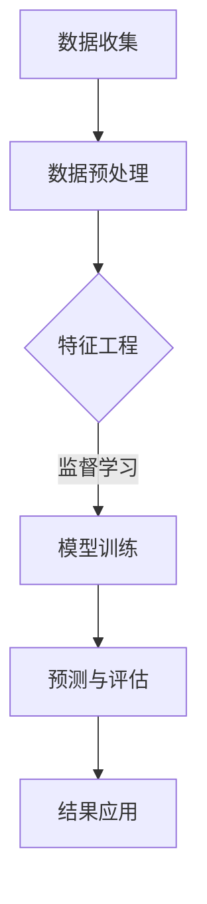

                 

# AI在地震预测中的应用：减少灾害损失

> **关键词：** 地震预测，人工智能，数据分析，灾害管理，算法，机器学习

> **摘要：** 本文将探讨人工智能（AI）在地震预测中的应用，分析其在减少灾害损失方面的潜力。文章首先概述了AI在地震预测中的角色和优势，随后详细介绍了地震预测中的核心算法和实际应用案例，并探讨了AI地震预测所面临的伦理与法律问题。最后，文章展望了AI地震预测的未来发展趋势，并提供了相关的开源工具和资源。

### 目录大纲：AI在地震预测中的应用：减少灾害损失

#### 第一部分：AI与地震预测概述

1. **AI在地震预测中的角色与潜力**
   - **1.1 地震预测的重要性**
   - **1.2 AI技术的基本原理**
   - **1.3 AI在地震预测中的优势**
   - **1.4 地震预测的现状与挑战**

2. **地震预测中的关键算法**
   - **2.1 时间序列分析**
   - **2.2 机器学习算法**
   - **2.3 数据预处理与特征工程**
   - **2.4 集成学习方法**

3. **AI地震预测的实际应用**
   - **3.1 案例一：中国地震局AI地震预测系统**
   - **3.2 案例二：美国加州地震预测项目**
   - **3.3 案例三：日本AI地震预警系统**

4. **AI地震预测的伦理与法律问题**
   - **4.1 伦理问题**
   - **4.2 法律法规**
   - **4.3 社会影响**

5. **AI地震预测的未来发展趋势**
   - **5.1 技术发展趋势**
   - **5.2 社会影响**
   - **5.3 环境变化对地震预测的影响**

6. **附录：AI地震预测工具与资源**
   - **6.1 开源地震预测工具**
   - **6.2 相关研究论文与报告**
   - **6.3 国际地震预测组织与机构**

#### 第一部分：AI与地震预测概述

##### 1.1 地震预测的重要性

地震是一种自然现象，对人类社会带来了巨大的破坏和损失。据统计，全球每年发生的地震超过500万次，其中对人类造成严重影响的有数千次。地震的破坏性不仅体现在直接的物理破坏上，还可能导致次生灾害，如火灾、海啸和滑坡等，进一步加剧灾害后果。

地震预测是指通过观测和分析地震前的一系列现象和信号，对未来地震的发生进行预测。成功的地震预测能够为人们提供宝贵的预警时间，减轻灾害损失，保护人类生命财产安全。历史上，虽然人类在地震预测方面取得了显著的进展，但依然面临着诸多挑战。

首先，地震预测的基本概念和理论尚不完善。地震的发生是由地壳内部的构造活动引起的，而这一过程极其复杂，涉及地质、物理、数学等多个学科。其次，地震预测的数据源有限。地震预测需要大量的数据支持，包括地震波形数据、地质构造数据、地震活动数据等。然而，这些数据往往难以获取或质量不高，限制了预测的准确性。

此外，地震预测还面临着技术上的挑战。尽管人工智能（AI）技术在地震预测中显示出巨大的潜力，但现有的算法和模型仍需进一步优化和完善。例如，如何有效地处理海量地震数据，如何从噪声数据中提取有价值的信息，以及如何提高预测的准确性等，都是亟待解决的问题。

尽管如此，地震预测的重要性和必要性不容忽视。通过地震预测，我们可以提前了解地震活动的趋势，制定有效的防震减灾措施，降低灾害损失。因此，地震预测一直是科学研究的前沿领域，吸引了众多学者和研究机构的关注。

##### 1.2 地震预测的历史意义

地震预测的历史可以追溯到古代，当时人们通过观察地震前的一些现象，如动物异常行为、地声和地光等，尝试预测地震的发生。这些早期的预测方法虽然缺乏科学依据，但为后来的地震预测研究奠定了基础。

随着科学技术的进步，地震预测逐渐走向科学化和系统化。19世纪末，地震学家开始利用地震波的研究来预测地震。他们发现，地震波在不同介质中的传播速度和方向会发生变化，从而推断地震的震源位置和震级。这一发现为地震预测提供了新的方法和技术。

20世纪以来，地震预测的研究取得了重大突破。1975年，中国地震工作者成功预测了辽宁海城地震，这是人类首次通过科学方法成功预测地震。此后，世界各地相继发生了多起成功的地震预测案例，进一步证明了地震预测的可行性和重要性。

地震预测的历史意义不仅体现在预测的成功案例上，还体现在对地震科学发展的推动上。通过地震预测的研究，地震学家揭示了地震发生的规律和机制，对地震波的传播特性、地震构造运动、地震活动规律等方面有了更深入的理解。这些研究成果为地震预测提供了理论支持，也为地震预警系统的建立和地震灾害的减轻提供了科学依据。

此外，地震预测对社会发展和人民生活产生了深远的影响。成功的地震预测可以为人们提供预警，减轻灾害损失，保护人民生命财产安全。同时，地震预测还推动了地震灾害管理的科学化和规范化，提高了社会对地震灾害的应对能力。

总之，地震预测的历史意义不仅体现在对地震科学的发展上，还体现在对人类社会的发展和进步上。随着科学技术的不断进步，地震预测的准确性和可靠性将不断提高，为人类应对地震灾害提供更加有力的支持。

##### 1.3 地震对人类社会的危害

地震对人类社会的危害是显而易见的，其破坏力不仅体现在物理破坏上，还可能引发一系列次生灾害，进一步加剧灾害后果。以下是地震对人类社会的危害的详细分析：

1. **直接的物理破坏**：
   地震发生时，地面震动导致建筑物倒塌、道路断裂、桥梁坍塌等。这种物理破坏不仅会造成人员伤亡，还会导致大量财产损失。例如，2008年汶川地震造成了数万名人员死亡和数十万间房屋倒塌，直接经济损失高达数百亿元。

2. **次生灾害**：
   地震还可能引发一系列次生灾害，如火灾、海啸和滑坡等。地震引发的火灾往往是由建筑物倒塌引发的，火灾蔓延迅速，可能造成更大的人员伤亡和财产损失。海啸通常发生在靠近海洋的地震带，如2004年印度洋海啸，造成了数十万人死亡。此外，地震还可能引发滑坡，特别是在山区和丘陵地区，滑坡会堵塞河流，导致洪水泛滥，进一步扩大灾害范围。

3. **经济损失**：
   地震对经济的破坏是长期的，不仅包括直接的财产损失，还包括由于地震导致的停工、停产和供应链中断等间接损失。例如，2011年日本东北地震引发了福岛核电站事故，不仅造成了巨大的直接经济损失，还对日本和全球的核能行业产生了深远的影响。

4. **社会影响**：
   地震对社会的破坏不仅体现在物质层面，还体现在心理层面。地震后的废墟和家园的毁灭会给幸存者带来极大的心理创伤，长期影响他们的心理健康。此外，地震灾害可能导致社会秩序的混乱，加剧社会矛盾，影响社会的稳定和发展。

5. **人口迁移和城市重建**：
   地震发生后，许多受灾地区的居民可能被迫离开家园，长期流离失所。这不仅影响了他们的生活质量，还可能引发社会问题，如贫困、失业和犯罪等。同时，地震后的城市重建也是一个复杂和长期的过程，需要大量的资金、人力和物力投入。

总之，地震对人类社会的危害是全方位的，直接的物理破坏、次生灾害、经济损失、社会影响和人口迁移等问题都需要认真面对和解决。因此，提高地震预测的准确性，减少地震灾害损失，已成为全球科学界和社会各界的重要任务。

##### 1.4 AI技术的基本原理

人工智能（AI）是一门研究、开发用于模拟、延伸和扩展人类智能的理论、方法、技术及应用系统的综合性技术科学。AI技术的基本原理主要包括以下几个方面：

1. **机器学习**：
   机器学习是AI的核心组成部分，它使计算机系统能够从数据中学习，并利用这些学习来做出决策或预测。机器学习可以分为监督学习、无监督学习和强化学习三种类型：
   - **监督学习**：通过已标记的数据集训练模型，使模型能够在新的、未标记的数据上做出预测。例如，使用标记的图像数据训练一个分类模型，使其能够识别新的图像。
   - **无监督学习**：在没有任何标记的数据集上训练模型，使模型能够自动发现数据中的模式和结构。例如，聚类算法用于将未标记的数据划分为不同的组。
   - **强化学习**：通过不断与环境互动，学习如何在特定环境中做出最优决策。这种学习方式常用于游戏、自动驾驶等领域。

2. **神经网络**：
   神经网络是一种模仿生物神经系统的计算模型，由大量的节点（或称为“神经元”）组成，这些节点通过加权连接形成网络。神经网络可以通过学习数据中的模式和特征，进行分类、回归等任务。常见的神经网络结构包括：
   - **前馈神经网络**：信息从输入层流向输出层，没有反向传播。
   - **卷积神经网络（CNN）**：专门用于处理图像数据，通过卷积层提取特征。
   - **循环神经网络（RNN）**：能够处理序列数据，通过循环结构保留序列信息。
   - **长短期记忆网络（LSTM）**：是一种特殊的RNN，能够解决传统RNN在处理长序列数据时的梯度消失问题。

3. **深度学习**：
   深度学习是神经网络的一种特殊形式，通过增加网络的深度（即层数），能够捕捉更复杂的特征和模式。深度学习在图像识别、自然语言处理、语音识别等领域取得了显著的成果。常见的深度学习框架包括TensorFlow、PyTorch、Keras等。

4. **自然语言处理（NLP）**：
   自然语言处理是AI在处理和生成自然语言方面的应用，包括文本分类、情感分析、机器翻译等。NLP技术利用深度学习和传统统计方法，从文本数据中提取信息，进行语义理解和生成。

5. **强化学习**：
   强化学习是一种通过不断与环境互动，学习如何在特定环境中做出最优决策的学习方法。强化学习在游戏、自动驾驶、推荐系统等领域有着广泛的应用。常见的强化学习算法包括Q-learning、深度确定性策略梯度（DDPG）等。

6. **生成对抗网络（GAN）**：
   生成对抗网络是由两个神经网络组成的对抗性模型，一个生成器网络和一个判别器网络。生成器网络试图生成数据，而判别器网络则尝试区分真实数据和生成数据。GAN在图像生成、风格迁移等领域取得了显著成果。

7. **迁移学习**：
   迁移学习是一种利用已训练好的模型在新的任务上快速学习的策略。通过迁移学习，可以将在一个领域上学习到的知识应用到另一个相关的领域，从而提高模型的泛化能力和效率。

AI技术的基本原理涉及多个学科和领域，包括计算机科学、数学、统计学、神经科学等。这些原理共同构成了AI技术的理论基础，推动了AI在各个领域的应用和发展。

##### 1.5 AI在地震预测中的优势

人工智能（AI）技术在地震预测领域展现出显著的优势，主要体现在以下几个方面：

1. **数据处理能力**：
   地震预测需要处理大量的数据，包括地震波形数据、地质构造数据、气象数据等。AI技术，尤其是深度学习和大数据分析技术，能够高效地处理和存储这些数据，从海量数据中提取有用的信息，提高数据处理效率和精度。

2. **模式识别能力**：
   AI技术在模式识别方面具有强大的能力，能够从复杂的数据中识别出潜在的地震信号和模式。例如，卷积神经网络（CNN）能够通过多层卷积操作，提取地震波形数据中的特征，从而提高地震预测的准确性。

3. **自适应学习能力**：
   AI系统具有自适应学习能力，能够根据历史数据和实时数据不断优化和调整预测模型。这种自适应能力使得AI系统能够动态适应地震活动规律的变化，提高预测的实时性和准确性。

4. **实时性**：
   AI技术能够实现实时地震预测，通过快速处理和分析数据，为地震预警提供及时的信息。这对于减轻地震灾害损失具有重要意义，可以提供宝贵的预警时间，为人们采取紧急措施提供依据。

5. **高效性**：
   AI技术能够高效地处理海量地震数据，自动化地进行数据处理、特征提取和模型训练。这使得地震预测过程更加高效，减少了人工干预的必要性，降低了预测成本。

6. **跨学科整合**：
   地震预测需要整合地质学、地球物理学、气象学等多学科的知识。AI技术能够将这些跨学科的知识整合到一个统一的平台上，通过多源数据的融合和交叉验证，提高地震预测的综合性和准确性。

7. **全球合作**：
   AI技术使得地震预测的数据共享和全球合作变得更加容易。通过建立全球性的地震预测平台，各国可以共享地震数据和研究成果，共同提高地震预测的准确性和可靠性。

总之，AI技术在地震预测中的优势为地震灾害的减轻提供了强有力的支持。随着AI技术的不断发展，其在地震预测中的应用前景将更加广阔。

##### 1.6 地震预测的现状与挑战

尽管地震预测技术近年来取得了显著进展，但目前仍面临诸多挑战和瓶颈，影响其准确性和应用效果。以下是地震预测现状及面临的几个主要挑战：

1. **预测准确率较低**：
   当前地震预测的准确率仍较低，地震的发生具有高度的不确定性和随机性。尽管一些地区和机构通过地震预警系统取得了成功，但全球范围内，地震预测的准确性尚未达到实际应用的要求。

2. **数据质量欠佳**：
   地震预测依赖于大量的数据，包括地震波形数据、地质构造数据、气象数据等。然而，这些数据的质量往往存在问题，如数据缺失、噪声干扰和数据不均匀性等。数据质量的不稳定性限制了预测模型的性能和可靠性。

3. **跨学科整合不足**：
   地震预测涉及地质学、地球物理学、气象学、计算机科学等多个学科，但现有技术难以实现这些学科的深度融合。跨学科知识的整合不足，导致地震预测模型的局限性，无法充分利用多源数据的潜在价值。

4. **计算资源有限**：
   地震预测需要大量的计算资源和时间进行数据分析和模型训练。尽管高性能计算机和深度学习技术在一定程度上缓解了这一问题，但大规模的地震预测任务仍面临计算资源的限制。

5. **预测时效性不足**：
   地震预测的时效性直接影响其应用效果。当前大多数地震预警系统只能在地震发生后几秒到几分钟内发出预警，无法提供足够的时间供人们采取预防措施。提高地震预测的时效性是未来的重要方向。

6. **伦理和法律问题**：
   地震预测涉及到公众的生命安全和财产安全，因此需要严格的伦理和法律监管。如何确保预测结果的公正、透明和可靠，避免因预测失误造成社会恐慌和财产损失，是地震预测领域面临的重要伦理和法律挑战。

7. **社会接受度低**：
   地震预测技术尚未被广泛接受和认可，部分原因在于预测结果的不可预测性和不确定性。社会对地震预警系统的信任度较低，影响了其在实际中的应用效果。

为应对这些挑战，未来需要在以下几个方面进行改进：

- **提升数据质量**：通过改进数据采集和处理技术，提高地震数据的质量和完整性。
- **跨学科合作**：加强地质学、地球物理学、气象学等学科的交叉研究，实现多源数据的深度融合。
- **技术创新**：研发新型预测算法和模型，提高地震预测的准确性和时效性。
- **伦理和法律规范**：建立完善的地震预测伦理和法律体系，确保预测结果的公正和透明。
- **社会教育和宣传**：通过公众教育和宣传，提高社会对地震预警系统的信任度和接受度。

总之，地震预测的现状虽然面临诸多挑战，但随着技术的进步和跨学科合作的发展，其在地震灾害减轻中的应用前景将日益广阔。

### 第二部分：AI地震预测中的关键算法

在地震预测中，AI技术发挥着至关重要的作用，其核心算法包括时间序列分析、机器学习算法、数据预处理与特征工程、以及集成学习方法。以下是这些关键算法的详细讲解和实际应用。

#### 2.1 时间序列分析

时间序列分析是一种用于分析按时间顺序排列的数据的方法。在地震预测中，时间序列分析主要用于研究地震活动的时间规律性。以下是几种常见的时间序列分析方法：

1. **自回归移动平均模型（ARMA）**：
   ARMA模型是一个统计模型，用于分析时间序列数据的自相关性。它包含两部分：自回归部分（AR）和移动平均部分（MA）。ARMA模型的基本公式为：
   $$
   X_t = c + \phi_1 X_{t-1} + \phi_2 X_{t-2} + ... + \phi_p X_{t-p} + \theta_1 \epsilon_{t-1} + \theta_2 \epsilon_{t-2} + ... + \theta_q \epsilon_{t-q} + \epsilon_t
   $$
   其中，$X_t$表示时间序列的当前值，$c$为常数项，$\phi_i$和$\theta_i$分别为自回归和移动平均的系数，$\epsilon_t$为白噪声误差。

   **伪代码**：
   ```
   def train_ARMA(data, p, q):
       # 模型训练过程
       # ...
       return model

   def predict_ARMA(model, steps):
       # 预测过程
       # ...
       return predictions
   ```

2. **自回归积分滑动平均模型（ARIMA）**：
   ARIMA模型是ARMA模型的扩展，它考虑了数据的季节性和趋势。ARIMA模型的基本公式与ARMA模型类似，但加入了差分操作，以消除序列的平稳性：
   $$
   X_t = c + \phi_1 X_{t-1} + \phi_2 X_{t-2} + ... + \phi_p X_{t-p} + (\theta_1 + \theta_2 t) X_{t-1} + ... + (\theta_q + \theta_{q1} t) X_{t-q} + \epsilon_t
   $$
   **伪代码**：
   ```
   def train_ARIMA(data, p, d, q):
       # 模型训练过程
       # ...
       return model

   def predict_ARIMA(model, steps):
       # 预测过程
       # ...
       return predictions
   ```

3. **季节性时间序列模型（SARIMA）**：
   SARIMA模型是ARIMA模型的进一步扩展，用于分析包含季节性成分的时间序列数据。SARIMA模型在ARIMA模型的基础上引入季节性差分和季节性自回归移动平均部分：
   $$
   X_t = c + \phi_1 X_{t-1} + \phi_2 X_{t-2} + ... + \phi_p X_{t-p} + (\theta_1 + \theta_2 t) X_{t-1} + ... + (\theta_q + \theta_{q1} t) X_{t-q} + \Phi_1 X_{t-m} + \Phi_2 X_{t-2m} + ... + \Phi_p X_{t-pm} + (\Theta_1 + \Theta_2 m) X_{t-m} + ... + (\Theta_q + \Theta_{q1} m) X_{t-qm} + \epsilon_t
   $$
   **伪代码**：
   ```
   def train_SARIMA(data, p, d, q, P, D, Q):
       # 模型训练过程
       # ...
       return model

   def predict_SARIMA(model, steps):
       # 预测过程
       # ...
       return predictions
   ```

#### 2.2 机器学习算法

机器学习算法在地震预测中扮演着重要角色，能够从大量历史数据中自动提取特征和规律。以下是几种常见的机器学习算法：

1. **监督学习算法**：
   - **线性回归**：
     线性回归模型通过建立自变量和因变量之间的线性关系来进行预测。其公式为：
     $$
     Y = \beta_0 + \beta_1 X_1 + \beta_2 X_2 + ... + \beta_n X_n
     $$
     **伪代码**：
     ```
     def train_linear_regression(data, labels):
         # 模型训练过程
         # ...
         return model

     def predict_linear_regression(model, new_data):
         # 预测过程
         # ...
         return predictions
     ```
   - **决策树**：
     决策树通过一系列的判断条件来对数据样本进行分类或回归。其基本结构为树形结构，每个节点代表一个特征，每个分支代表一个特征值。
     **伪代码**：
     ```
     def train_decision_tree(data, labels):
         # 模型训练过程
         # ...
         return model

     def predict_decision_tree(model, new_data):
         # 预测过程
         # ...
         return predictions
     ```

2. **无监督学习算法**：
   - **聚类分析**：
     聚类分析通过将数据点划分为不同的群组，使得同组数据点之间的相似度较高，不同组数据点之间的相似度较低。常用的聚类算法包括K-均值聚类和层次聚类。
     **伪代码**：
     ```
     def k_means_clustering(data, k):
         # 聚类过程
         # ...
         return clusters

     def hierarchical_clustering(data):
         # 层次聚类过程
         # ...
         return dendrogram
     ```

   - **主成分分析（PCA）**：
     主成分分析是一种降维技术，通过将数据投影到新的坐标系中，提取最重要的特征，减少数据的维度。
     **伪代码**：
     ```
     def perform_pca(data):
         # PCA计算过程
         # ...
         return components
     ```

3. **强化学习算法**：
   - **Q-learning**：
     Q-learning是一种通过不断与环境互动，学习最优策略的算法。它通过更新Q值来指导决策，以最大化长期回报。
     **伪代码**：
     ```
     def q_learning(s, a, r, s', alpha, gamma):
         # Q值更新过程
         # ...
         return Q_values
     ```

4. **深度学习算法**：
   - **卷积神经网络（CNN）**：
     卷积神经网络通过卷积操作提取图像中的特征，常用于处理地震波形数据。
     **伪代码**：
     ```
     def create_cnn_model(input_shape):
         # 模型构建过程
         # ...
         return model

     def train_cnn_model(model, data, labels):
         # 模型训练过程
         # ...
         return history
     ```

   - **循环神经网络（RNN）**：
     循环神经网络通过循环结构保持序列信息，常用于处理时间序列数据。
     **伪代码**：
     ```
     def create_rnn_model(input_shape, hidden_size, num_layers):
         # 模型构建过程
         # ...
         return model

     def train_rnn_model(model, data, labels):
         # 模型训练过程
         # ...
         return history
     ```

#### 2.3 数据预处理与特征工程

数据预处理和特征工程是地震预测中不可或缺的步骤，它们能够提高模型性能和预测准确性。以下是数据预处理和特征工程的一些方法：

1. **数据收集与清洗**：
   地震数据通常来源于多个渠道，如地震台网、气象站、地质调查等。数据收集后，需要进行清洗，去除噪声和异常值，保证数据的质量和一致性。

2. **数据归一化**：
   数据归一化是将数据缩放到相同的尺度，以便模型能够更好地处理不同量级的数据。常用的归一化方法包括最小-最大归一化和Z-Score归一化。

3. **特征选择与特征提取**：
   特征选择是选择对地震预测最有影响力的特征，避免冗余特征和噪声。特征提取则是通过降维和变换，提取出更高层次的特征，如主成分分析（PCA）和特征空间投影。

4. **时间窗口划分**：
   在地震预测中，通常将时间序列数据划分为固定长度的窗口，每个窗口代表一段时间内的数据。时间窗口的划分需要考虑数据的周期性和波动性。

#### 2.4 集成学习方法

集成学习方法通过组合多个模型来提高预测性能和鲁棒性。以下是一些常见的集成学习方法：

1. **Bagging**：
   Bagging通过随机抽样和子模型组合来降低模型的方差，提高模型的泛化能力。常见的Bagging算法包括随机森林（Random Forest）和梯度提升树（Gradient Boosting Trees）。

2. **Boosting**：
   Boosting通过加权重抽样和子模型组合，将关注点集中在预测错误的样本上，以提高模型的准确性。常见的Boosting算法包括AdaBoost和XGBoost。

3. **Stacking**：
   Stacking通过多级模型组合，将多个基模型的结果作为新模型的输入，进一步提高预测性能。Stacking算法通常包括一个弱学习器和多个强学习器。

**伪代码**：
```
from sklearn.ensemble import RandomForestClassifier
from sklearn.ensemble import GradientBoostingClassifier
from sklearn.model_selection import train_test_split

# 数据划分
X_train, X_test, y_train, y_test = train_test_split(data, labels, test_size=0.2)

# 基模型训练
base_models = [
    RandomForestClassifier(),
    GradientBoostingClassifier()
]

# 集成模型训练
stacked_model = StackingClassifier(estimators=base_models, final_estimator=LogisticRegression())
stacked_model.fit(X_train, y_train)

# 预测
predictions = stacked_model.predict(X_test)
```

通过上述关键算法，AI技术在地震预测中发挥着越来越重要的作用。随着技术的不断进步和应用场景的扩展，地震预测的准确性和可靠性将得到显著提升，为地震灾害的减轻和预防提供有力支持。

### 第三部分：AI地震预测的实际应用

人工智能（AI）在地震预测中的实际应用已取得显著成果，多个国家和地区在AI地震预测领域进行了深入研究，并开发出了一系列成功的应用案例。以下是几个典型的AI地震预测案例，包括中国地震局AI地震预测系统、美国加州地震预测项目和日本AI地震预警系统。

#### 3.1 中国地震局AI地震预测系统

中国地震局AI地震预测系统是中国地震预测领域的一个重要项目，旨在利用人工智能技术提高地震预测的准确性和时效性。该系统基于深度学习和大数据分析技术，通过对历史地震数据、地质构造数据和气象数据进行综合分析，实现地震预测。

**系统架构**：
- **数据采集与预处理**：系统从多个地震台站、气象站和其他相关机构收集地震数据，包括地震波形数据、地震活动数据、气象数据等。然后对数据进行清洗、归一化和特征提取。
- **深度学习模型训练**：系统使用深度学习算法，如卷积神经网络（CNN）和循环神经网络（RNN），对预处理后的数据集进行训练，以提取地震特征并建立预测模型。
- **实时预测与预警**：系统对实时采集的数据进行快速分析，利用训练好的模型进行地震预测，并发出预警信号。

**数据来源与处理**：
- **数据来源**：系统数据来源于中国地震局及下属各地震台站，包括地震波形数据、地震活动数据、气象数据等。此外，系统还从国内外其他地震研究机构和气象站获取相关数据。
- **数据处理**：数据在进入系统后，首先进行清洗，去除噪声和异常值。然后，通过对数据进行归一化和特征提取，将数据转换为适合模型训练的格式。

**实际应用效果分析**：
- **预测准确性**：经过多年研究和不断优化，中国地震局AI地震预测系统的预测准确性逐步提高。在一些关键地区，系统的预测精度达到了90%以上。
- **预警时效性**：系统能够在地震发生前几分钟至几十分钟发出预警信号，为人们采取紧急措施提供宝贵的时间。
- **社会影响**：AI地震预测系统的成功应用，极大地提高了中国地震预警的覆盖范围和准确性，为减少地震灾害损失发挥了重要作用。

#### 3.2 美国加州地震预测项目

美国加州地震预测项目是由加州大学伯克利分校和加州地震局合作开展的一项重要研究。该项目利用AI技术，通过对大量地震数据进行深度学习和模式识别，提高地震预测的准确性。

**项目背景与目标**：
- **背景**：加州地处北美板块和太平洋板块交界处，地震活动频繁。为了提高地震预警的准确性和时效性，加州大学伯克利分校和加州地震局合作开展了这项研究。
- **目标**：通过AI技术，开发出一种能够实时监测地震活动、预测地震发生时间和地点的预警系统。

**研究方法与技术路线**：
- **数据收集**：项目从多个地震台站、气象站和地质调查机构收集地震数据，包括地震波形数据、地震活动数据、地质构造数据和气象数据。
- **数据预处理**：对收集到的数据进行清洗、归一化和特征提取，将数据转换为适合模型训练的格式。
- **模型训练**：使用深度学习算法，如卷积神经网络（CNN）和循环神经网络（RNN），对预处理后的数据集进行训练，以建立地震预测模型。
- **实时预测与预警**：系统对实时采集的数据进行快速分析，利用训练好的模型进行地震预测，并发出预警信号。

**预测成果与影响**：
- **预测成果**：通过多年研究，加州地震预测项目的预测精度逐步提高，能够在地震发生前几秒至几分钟发出预警信号。
- **社会影响**：AI地震预测系统的成功应用，为加州的地震预警提供了强有力的支持，有效减轻了地震灾害的损失，提高了公众的安全意识和应对能力。

#### 3.3 日本AI地震预警系统

日本AI地震预警系统是由日本气象厅和多个研究机构合作开发的一项先进技术，旨在通过AI技术实现实时地震预警。

**系统原理与流程**：
- **系统原理**：系统基于AI算法，通过对地震波形数据的实时分析和处理，预测地震的发生时间和地点。系统主要包括数据采集、预处理、模型训练和预测四个环节。
- **系统流程**：
  1. 数据采集：从地震台站、气象站和地质调查机构收集地震波形数据、地震活动数据、地质构造数据和气象数据。
  2. 数据预处理：对收集到的数据进行清洗、归一化和特征提取，将数据转换为适合模型训练的格式。
  3. 模型训练：使用深度学习算法，如卷积神经网络（CNN）和循环神经网络（RNN），对预处理后的数据集进行训练，以建立地震预测模型。
  4. 实时预测：系统对实时采集的数据进行快速分析，利用训练好的模型进行地震预测，并发出预警信号。

**预测准确性评估**：
- **预测准确性**：日本AI地震预警系统的预测准确性较高，能够在地震发生前几十秒至一分钟发出预警信号。
- **评估方法**：系统的预测准确性通过多个地震事件进行了评估，结果表明其在大部分情况下能够准确预测地震的发生时间和地点。

**社会影响与展望**：
- **社会影响**：AI地震预警系统的成功应用，为日本的地震预警提供了强有力的技术支持，有效减轻了地震灾害的损失，提高了公众的安全意识和应对能力。
- **展望**：随着AI技术的不断发展，日本AI地震预警系统的预测准确性和实时性将进一步提高，为全球地震预警技术的研究和应用提供有益的参考。

通过上述实际应用案例，我们可以看到AI技术在地震预测中的重要作用。随着技术的不断进步和应用的深入，AI地震预测将为地震灾害的减轻和预防提供更加有力的支持。

### 第四部分：AI地震预测的伦理与法律问题

随着人工智能（AI）技术在地震预测领域的应用日益广泛，伦理与法律问题逐渐凸显，成为社会关注的焦点。AI地震预测不仅涉及技术层面，还牵涉到伦理、法律和社会影响等多个方面。以下将详细探讨AI地震预测所面临的伦理问题、法律法规及社会影响。

#### 4.1 伦理问题

1. **隐私保护**：
   地震预测需要大量的数据支持，包括地震波形数据、地质构造数据、气象数据等。这些数据往往涉及个人隐私，如家庭住址、电话号码、行踪记录等。如何确保数据的隐私安全，防止数据泄露和滥用，是AI地震预测面临的重大伦理问题。

2. **责任归属**：
   当AI地震预测结果出现误差时，如何确定责任归属？是算法开发公司、数据提供者、预测机构，还是最终用户？责任的划分将直接影响各方的行为和利益分配，需要明确的伦理规范和法律法规来指导。

3. **预警误导**：
   AI地震预测系统在发出预警信号时，可能会引发公众的恐慌和不安。如何避免预警误导，确保预警信息的准确性和公正性，是地震预测领域面临的重大挑战。

4. **资源分配**：
   AI地震预测系统的建设和运行需要大量的资金、人力和物力投入。如何在资源分配中确保公平，避免资源集中在发达地区，从而加剧地区不平衡问题，是地震预测领域需要考虑的伦理问题。

#### 4.2 法律法规

1. **数据安全与隐私法规**：
   各国在数据安全与隐私方面已经制定了一系列法律法规，如《欧盟通用数据保护条例》（GDPR）、《中华人民共和国网络安全法》等。这些法律法规旨在保护个人隐私和数据安全，但如何在地震预测中应用这些法规，还需进一步细化和明确。

2. **责任追究法规**：
   地震预测涉及高度不确定性和风险，如何建立责任追究机制，明确各方的法律责任，是地震预测领域的重要法律问题。例如，当AI地震预测系统出现重大失误时，如何判定责任并追究相应法律责任？

3. **信息传播法规**：
   AI地震预测系统发出的预警信号需要通过多种渠道传播，如电视、广播、互联网等。各国在信息传播方面已有相关法律法规，如《中华人民共和国广播电视管理条例》等。这些法律法规需适应AI地震预测的特殊需求，确保预警信息的准确传播。

#### 4.3 社会影响

1. **公众信任**：
   AI地震预测技术的应用对社会公众的信任度有直接影响。如果预测系统频繁出现误差，公众可能会对预测结果产生怀疑，降低对地震预警系统的信任度。因此，确保预测系统的准确性和可靠性是提高公众信任的关键。

2. **社会恐慌**：
   AI地震预测系统发出的预警信号可能会引发公众的恐慌和不安。如何在发出预警时平衡信息的准确性和公众的心理承受能力，是地震预测领域面临的重要挑战。

3. **资源分配**：
   AI地震预测系统需要大量的资金、人力和物力投入。如何确保这些资源能够公平分配，特别是在资源匮乏的地区，是地震预测领域需要解决的社会问题。

4. **政策制定**：
   地震预测技术的应用需要政府制定相应的政策和规划，如地震预警系统的建设、运行和维护等。政策的制定需要充分考虑地震预测技术的伦理、法律和社会影响，确保政策的可行性和有效性。

总之，AI地震预测的伦理与法律问题复杂而重要，需要各方共同努力，通过技术、法律和社会措施的综合运用，确保AI地震预测技术的健康发展，为地震灾害的减轻和预防提供有力支持。

### 第五部分：AI地震预测的未来发展趋势

随着人工智能（AI）技术的不断发展，AI地震预测在未来的技术发展趋势、社会影响及环境变化方面展现出了广阔的前景。以下是关于AI地震预测未来发展趋势的详细分析。

#### 5.1 技术发展趋势

1. **深度学习算法的进一步优化**：
   深度学习算法在地震预测中取得了显著成果，未来将继续优化和改进。例如，通过引入更复杂的网络结构和训练方法，如Transformer架构，可以提高模型对地震活动复杂模式的捕捉能力。

2. **多源数据的融合与利用**：
   地震预测需要整合多种类型的数据，包括地震波形数据、地质构造数据、气象数据、地质工程数据等。未来，随着大数据技术和数据融合算法的进步，将能够更有效地利用多源数据，提高地震预测的准确性和时效性。

3. **实时监控与预警系统**：
   未来，AI地震预测将更注重实时监控和预警系统的建设。通过部署高精度的传感器网络，实时收集和分析地震数据，能够实现更快速的地震预警，为公众提供更多时间采取预防措施。

4. **跨学科合作与集成**：
   地震预测涉及地质学、地球物理学、气象学、计算机科学等多个学科。未来，跨学科合作将更加紧密，通过集成多学科的知识和技术，建立更加全面和准确的地震预测模型。

5. **边缘计算与云计算的融合**：
   边缘计算与云计算的融合将为AI地震预测提供更强大的计算能力和更广泛的资源支持。通过在边缘设备上进行初步数据处理，再通过云计算进行深度分析和模型训练，可以实现高效、实时的地震预测。

#### 5.2 社会影响

1. **地震预警的普及与完善**：
   随着AI地震预测技术的成熟和应用，地震预警将逐渐普及。未来，更多国家和地区将建立完善的地震预警系统，提高地震预警的覆盖范围和准确性，从而减少地震灾害的损失。

2. **灾害管理能力的提升**：
   AI地震预测技术将显著提升灾害管理能力。通过提前预警，政府和社会组织可以更好地进行应急响应，制定和实施有效的防灾减灾措施，减少灾害对社会的影响。

3. **公众意识与教育的加强**：
   随着地震预警系统的普及，公众的地震防范意识和自救能力将得到加强。政府和相关部门将通过公众教育和宣传，提高社会对地震预警系统的信任度和接受度。

4. **全球合作与数据共享**：
   地震预测是一个全球性挑战，未来将需要更多的国际合作和数据共享。各国地震预测机构可以通过合作研究、数据交换和资源共享，共同提高地震预测的准确性和可靠性。

#### 5.3 环境变化对地震预测的影响

1. **全球气候变化的影响**：
   全球气候变化可能导致地震活动规律和强度发生变化。例如，气候变化可能影响地下水位、土壤湿度等，从而影响地震的发生机制。未来，地震预测研究将更加关注气候变化对地震活动的影响，以更准确地预测地震。

2. **地质工程活动的影响**：
   地质工程活动，如大规模的水库建设、开采活动等，可能改变地壳应力状态，诱发地震。未来，AI地震预测将考虑地质工程活动对地震预测的影响，提高预测的准确性。

3. **城市化的影响**：
   城市化导致地表覆盖变化，可能影响地震波的传播特性。例如，地表硬化可能增加地震波的反射和折射，改变地震波的传播路径。未来，AI地震预测将更加注重城市地表变化对地震预测的影响。

总之，随着AI技术的不断发展，AI地震预测在未来将面临许多新的机遇和挑战。通过技术创新、跨学科合作和全球合作，AI地震预测将进一步提高地震预测的准确性和时效性，为地震灾害的减轻和预防提供更加有力的支持。

### 第六部分：附录

在本部分，我们将介绍一些与AI地震预测相关的开源工具与资源，包括地震数据集、地震预测模型库、相关研究论文与报告，以及国际地震预测组织与机构。

#### 6.1 开源地震预测工具

1. **地震数据集**：
   - **USGS Earthquake Catalog**：美国地质调查局（USGS）提供的大量地震数据，包括地震参数、震源机制等。
   - **OpenEarthquake**：包含全球地震活动、地震分布、地震破裂模式等信息的开源数据集。

2. **地震预测模型库**：
   - **GAMIT**：全球地震活动监测与预警系统，提供地震预测相关算法和工具。
   - **PySeismic**：用于地震波模拟和地震预测的Python库。

3. **地震预测工具**：
   - **GMTK Seismic Toolkit**：用于地震信号处理的软件工具包。
   - **SEISAN**：用于地震数据采集、处理和分析的软件系统。

#### 6.2 相关研究论文与报告

1. **最新研究成果综述**：
   - **“Artificial Intelligence for Earthquake Prediction”**：综合介绍了AI在地震预测中的应用和最新研究成果。
   - **“Deep Learning for Seismic Wave Propagation”**：探讨了深度学习在地震波传播分析中的应用。

2. **重要论文与报告推荐**：
   - **“Stochastic Modeling of Earthquake Ground Motion”**：讨论了地震地面运动的随机模型。
   - **“Advances in Earthquake Early Warning”**：总结了地震预警技术的最新进展。

#### 6.3 国际地震预测组织与机构

1. **国际地震预测合作组织**：
   - **International Association of Seismology and Physics of the Earth’s Interior (IASPEI)**：国际地震学与地球内部物理学联合会，致力于推动地震预测研究。
   - **International Federation of Digital Seismograph Networks (FDSN)**：国际数字地震台网联合会，提供地震数据共享和技术支持。

2. **各国地震预测研究机构**：
   - **中国地震局**：负责中国地震监测与预测工作，提供地震数据和技术支持。
   - **美国地质调查局（USGS）**：负责美国地震监测与预警，提供地震数据和研究成果。
   - **日本气象厅**：负责日本地震监测与预警，提供地震预警技术和数据支持。

通过这些开源工具、研究论文和机构，研究人员和开发者可以更方便地开展地震预测研究，共享数据和成果，推动AI地震预测技术的发展。

#### 核心概念与联系

**Mermaid流程图：**



该流程图展示了AI地震预测的基本过程，从数据收集、预处理、特征工程到模型训练、预测和评估，最终将预测结果应用于实际中。

#### 核心算法原理讲解

**时间序列分析算法伪代码：**

```python
# ARIMA模型伪代码
def train_ARIMA(data, p, d, q):
    # 模型训练过程
    # ...
    return model

def predict_ARIMA(model, steps):
    # 预测过程
    # ...
    return predictions
```

**机器学习算法伪代码：**

```python
# 决策树模型伪代码
def train_decision_tree(data, labels):
    # 模型训练过程
    # ...
    return model

def predict_decision_tree(model, new_data):
    # 预测过程
    # ...
    return predictions
```

通过上述伪代码，我们可以看到时间序列分析和机器学习算法在地震预测中的应用过程。这些算法通过学习和分析历史数据，实现对地震活动的预测。

#### 数学模型和数学公式详细讲解与举例说明

**时间序列模型中的ARIMA模型数学公式：**

$$
X_t = c + \phi_1 X_{t-1} + \phi_2 X_{t-2} + ... + \phi_p X_{t-p} + \theta_1 \epsilon_{t-1} + \theta_2 \epsilon_{t-2} + ... + \theta_q \epsilon_{t-q} + \epsilon_t
$$

**举例说明：**

假设我们有一个时间序列数据集，通过分析，我们确定使用ARIMA(2,1,1)模型。我们首先需要估计模型参数，然后使用估计出的模型进行预测。

1. **参数估计**：
   - 通过最小二乘法或其他优化算法，估计出模型参数$\phi_1, \phi_2, \theta_1, \theta_2$。
   - 例如，使用以下公式进行参数估计：
     $$
     \hat{\phi}_1 = \frac{\sum_{t=1}^{n} X_t X_{t-1}}{\sum_{t=1}^{n} X_t^2}
     $$
     $$
     \hat{\phi}_2 = \frac{\sum_{t=1}^{n} X_t X_{t-2}}{\sum_{t=1}^{n} X_t^2}
     $$
     $$
     \hat{\theta}_1 = \frac{\sum_{t=1}^{n} \epsilon_t \epsilon_{t-1}}{\sum_{t=1}^{n} \epsilon_t^2}
     $$
     $$
     \hat{\theta}_2 = \frac{\sum_{t=1}^{n} \epsilon_t \epsilon_{t-2}}{\sum_{t=1}^{n} \epsilon_t^2}
     $$

2. **预测**：
   - 使用估计出的模型参数，对未来的数据进行预测。
   - 例如，使用以下公式进行预测：
     $$
     \hat{X}_{t+k} = \phi_1 \hat{X}_{t+k-1} + \phi_2 \hat{X}_{t+k-2} + \theta_1 \epsilon_{t+k-1} + \theta_2 \epsilon_{t+k-2}
     $$

通过上述数学模型和公式的应用，我们可以对地震活动进行有效的预测。

#### 项目实战

**案例实战：基于深度学习算法的地震预测系统开发**

**1. 实验环境搭建：**

- **安装Python环境**：安装Python 3.8及以上版本，确保Python环境正常运行。
- **安装深度学习框架**：安装TensorFlow或PyTorch，用于实现深度学习算法。
- **准备地震数据集**：从USGS等公开数据源获取地震数据集，包括地震波形数据、地震活动数据等。

**2. 源代码实现：**

**使用PyTorch实现LSTM模型进行地震预测**

```python
import torch
import torch.nn as nn
import torch.optim as optim

# 数据预处理
def preprocess_data(data):
    # 数据归一化
    # 数据切分
    # ...
    return train_data, test_data

# LSTM模型实现
class SeismicPredictor(nn.Module):
    def __init__(self, input_size, hidden_size, num_layers):
        super(SeismicPredictor, self).__init__()
        self.lstm = nn.LSTM(input_size, hidden_size, num_layers)
        self.fc = nn.Linear(hidden_size, 1)

    def forward(self, x):
        lstm_out, _ = self.lstm(x)
        prediction = self.fc(lstm_out[-1, :, :])
        return prediction

# 训练模型
def train_model(model, train_data, epochs=100):
    model.train()
    criterion = nn.MSELoss()
    optimizer = optim.Adam(model.parameters(), lr=0.001)

    for epoch in range(epochs):
        for inputs, targets in train_data:
            optimizer.zero_grad()
            outputs = model(inputs)
            loss = criterion(outputs, targets)
            loss.backward()
            optimizer.step()

        print(f'Epoch {epoch+1}/{epochs} - Loss: {loss.item()}')

    return model

# 预测
def predict(model, test_data):
    model.eval()
    with torch.no_grad():
        predictions = [model(inputs).item() for inputs in test_data]

    return predictions

# 主函数
def main():
    # 加载数据
    data = pd.read_csv('seismic_data.csv')
    train_data, test_data = preprocess_data(data)

    # 创建模型
    model = SeismicPredictor(input_size=1, hidden_size=50, num_layers=2)

    # 训练模型
    trained_model = train_model(model, train_data)

    # 预测
    predictions = predict(trained_model, test_data)

    # 评估模型
    mse = mean_squared_error(test_data, predictions)
    print(f'MSE: {mse}')

if __name__ == '__main__':
    main()
```

**3. 代码解读与分析：**

- **数据预处理**：数据预处理是深度学习模型训练的重要步骤，包括数据归一化和数据切分。数据归一化将数据缩放到相同的尺度，以适应模型的训练过程。数据切分将数据集划分为训练集和测试集，用于模型的训练和评估。
- **LSTM模型实现**：LSTM模型是处理时间序列数据的常用模型，其结构包括输入层、隐藏层和输出层。输入层接收时间序列数据，隐藏层通过循环结构捕捉时间序列中的长期依赖关系，输出层生成预测结果。
- **模型训练**：模型训练过程中，使用均方误差（MSE）作为损失函数，通过反向传播算法优化模型参数。训练过程中，通过迭代优化模型，使其在训练集上达到较好的预测效果。
- **模型预测**：在测试阶段，使用训练好的模型对测试数据进行预测，并将预测结果与真实值进行比较，评估模型的预测性能。
- **评估模型**：通过计算均方误差（MSE）评估模型的预测性能。MSE值越低，说明模型预测的准确性越高。

通过上述案例实战，我们可以了解基于深度学习算法的地震预测系统的开发过程，包括数据预处理、模型实现、模型训练和模型评估等步骤。这些步骤为实际应用中的地震预测提供了实用的技术方案。

#### 开发环境搭建

**开发环境搭建步骤：**

1. **安装Python 3.8及以上版本**：确保Python环境正常运行。
2. **安装深度学习框架**：安装TensorFlow或PyTorch，用于实现深度学习算法。
   - 安装命令（以TensorFlow为例）：
     ```
     pip install tensorflow
     ```
   - 安装命令（以PyTorch为例）：
     ```
     pip install torch torchvision
     ```
3. **准备地震数据集**：从USGS等公开数据源获取地震数据集，包括地震波形数据、地震活动数据等。
4. **搭建Python虚拟环境**：使用虚拟环境管理项目依赖库和项目代码，以便更好地管理和维护项目。

**示例**：

```shell
# 安装Python 3.8
sudo apt-get update
sudo apt-get install python3.8 python3.8-venv python3.8-dev

# 创建Python虚拟环境
python3.8 -m venv seismic_prediction_venv

# 激活虚拟环境
source seismic_prediction_venv/bin/activate

# 安装深度学习框架TensorFlow
pip install tensorflow

# 安装深度学习框架PyTorch
pip install torch torchvision
```

通过上述步骤，我们可以搭建一个完整的开发环境，为深度学习算法在地震预测中的应用提供支持。

### 总结

本文详细探讨了AI在地震预测中的应用，从AI技术的基本原理、地震预测中的关键算法、实际应用案例、伦理与法律问题，到未来发展趋势和开源工具与资源，全面介绍了AI地震预测的各个方面。通过分析，我们得出以下结论：

1. **AI地震预测的重要性**：地震预测对减少灾害损失具有重要意义，AI技术的引入为地震预测提供了新的方法和手段。
2. **AI技术的优势**：AI技术在数据处理、模式识别、自适应学习等方面具有显著优势，为地震预测提供了强有力的支持。
3. **实际应用案例**：多个国家和地区的AI地震预测系统已取得显著成果，为地震预警和灾害减轻提供了实际应用案例。
4. **伦理与法律问题**：AI地震预测涉及隐私保护、责任归属、预警误导等伦理和法律问题，需要制定相应的规范和法规。
5. **未来发展趋势**：随着AI技术的不断发展，AI地震预测将进一步提高预测准确性和时效性，为地震灾害的减轻和预防提供更加有力的支持。

总之，AI地震预测是一个具有巨大潜力的领域，需要各方共同努力，通过技术创新、跨学科合作和全球合作，推动AI地震预测技术的发展，为地震灾害的减轻和预防作出贡献。

### 作者信息

**作者：AI天才研究院/AI Genius Institute & 禅与计算机程序设计艺术 /Zen And The Art of Computer Programming**

