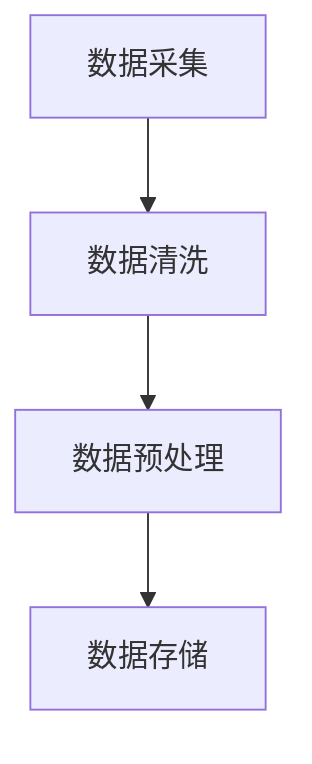
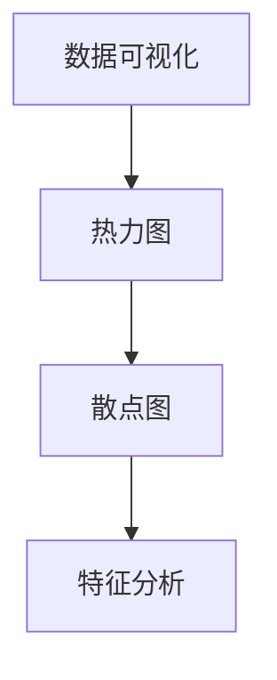
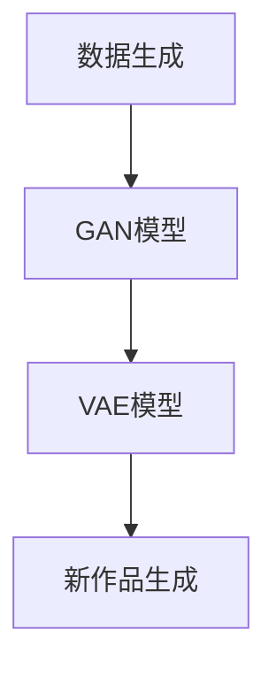
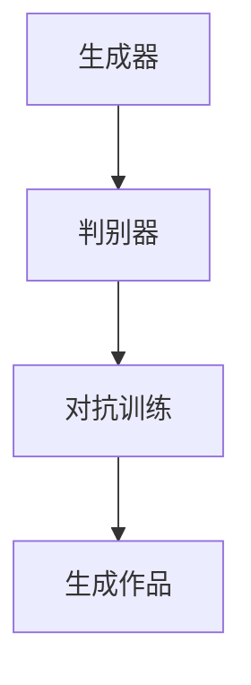

                 

# AI在艺术领域的创新探索

## 关键词
- 艺术创作
- 生成对抗网络（GAN）
- 艺术风格迁移
- 艺术作品鉴赏
- 艺术教育
- AI伦理问题

## 摘要
随着人工智能技术的发展，AI在艺术领域的应用逐渐成为热点。本文将探讨AI在艺术创作、鉴赏、教育和未来展望等方面的创新探索。通过深入分析AI在艺术领域的关键技术，如生成对抗网络（GAN）、艺术风格迁移等，本文将展示AI如何改变艺术创作与欣赏的方式。此外，还将探讨AI在艺术教育中的应用，以及AI在艺术领域的伦理和法律问题。本文旨在为读者提供一个全面了解AI与艺术交汇的视角，并展望未来艺术与AI融合的发展趋势。

---

## 第一部分：引言

### 第1章：艺术与AI的交汇

#### 1.1 艺术与AI的关系

艺术与人工智能（AI）的交汇是当代科技与人文交融的典型代表。艺术，作为一种表达情感和思想的手段，与AI的结合开辟了新的创作与欣赏模式。AI技术的加入，不仅提升了艺术创作的效率，也拓宽了艺术的边界。

首先，AI在艺术创作中扮演了辅助角色。通过深度学习和生成模型，AI能够自动生成新颖的艺术作品，从而激发了艺术家们新的创作灵感。例如，生成对抗网络（GAN）的应用，使得艺术家能够将不同风格的作品进行融合，创造出独特的视觉体验。

其次，AI在艺术鉴赏中发挥了重要作用。利用计算机视觉和自然语言处理技术，AI能够对艺术作品进行内容分析和情感分析，为观众提供更深入的鉴赏体验。这种技术不仅能够帮助博物馆和画廊更好地管理艺术作品，还能为普通观众提供个性化的艺术推荐。

#### 1.2 AI在艺术领域的应用背景

AI在艺术领域的应用背景可以追溯到20世纪80年代，当时计算机视觉和图形学技术的兴起为AI在艺术创作中的应用奠定了基础。随着互联网的普及和数据量的爆炸性增长，AI开始能够从海量的数据中学习和提取有价值的信息，这使得其在艺术创作中的应用变得更加广泛和深入。

近年来，随着深度学习技术的突破，AI在图像生成、风格迁移和情感分析等方面取得了显著进展。这些技术的应用不仅提高了艺术创作的效率，还使得艺术作品更加多样化和富有创意。

#### 1.3 书籍结构概述

本书将分为五个部分，分别探讨AI在艺术创作、鉴赏、教育、未来展望以及伦理和法律问题等方面的应用。

第一部分将介绍AI在艺术创作中的应用，包括数据驱动的艺术创作、GAN在艺术创作中的应用、艺术风格迁移等。

第二部分将探讨AI在艺术作品鉴赏中的应用，包括艺术作品的内容分析、情感分析以及艺术市场的预测与分析。

第三部分将介绍AI在艺术教育和培训中的应用，包括虚拟艺术工作室、艺术生成式教学以及艺术创作与技术的结合。

第四部分将展望AI在艺术领域的未来发展，包括艺术创作与AI的融合趋势、AI艺术品的收藏与交易、艺术与AI的跨学科研究等。

第五部分将探讨AI在艺术领域的伦理与法律问题，包括AI艺术作品的版权问题、评价标准和展示与传播等。

---

在接下来的章节中，我们将逐一探讨AI在艺术领域的各个应用方向，通过详细的技术分析和实际案例，展示AI如何深刻地改变艺术的创作与欣赏方式。让我们开始这场技术与艺术的奇妙旅程。

---

## 第二部分：AI在艺术创作中的应用

### 第2章：AI在艺术创作中的应用

随着人工智能技术的不断发展，AI在艺术创作中的应用越来越广泛，从传统的绘画、雕塑到现代的数字艺术，AI都展现出了其独特的魅力和创造力。本章节将详细探讨AI在艺术创作中的几种关键技术，包括数据驱动的艺术创作、生成对抗网络（GAN）在艺术创作中的应用以及艺术风格迁移。

#### 2.1 数据驱动的艺术创作

数据驱动的艺术创作是AI在艺术创作中的一个重要方向。通过从大量的艺术作品中学习和提取特征，AI能够生成具有独特风格和内容的新作品。这一过程主要涉及以下几个关键步骤：

##### 2.1.1 数据采集与处理

数据采集是数据驱动艺术创作的基础。首先需要从各种来源收集大量的艺术作品，这些来源可以是公开的艺术数据库、艺术家的个人作品集或者是博物馆的藏品。收集到的数据需要进行清洗和预处理，包括图像去噪、图像尺寸标准化等步骤，以确保数据的质量和一致性。



##### 2.1.2 数据可视化

在数据预处理完成后，下一步是对数据进行可视化分析。通过数据可视化，可以直观地了解数据的特点和分布，从而更好地指导艺术创作的方向。例如，可以使用热力图来展示图像中的色彩分布，使用散点图来分析图像的几何特征。



##### 2.1.3 数据生成

在完成数据可视化和特征分析后，AI开始进行数据生成。这一过程通常涉及到深度学习模型，如生成对抗网络（GAN）或变分自编码器（VAE）。通过训练这些模型，AI能够生成符合特定风格或内容的新作品。



#### 2.2 生成对抗网络（GAN）在艺术创作中的应用

生成对抗网络（GAN）是深度学习中的一种重要模型，由生成器和判别器组成。生成器的目标是生成逼真的艺术作品，而判别器的目标是区分生成的作品和真实作品。通过这种对抗关系，GAN能够不断提升生成作品的质量。

##### 2.2.1 GAN基本原理

GAN的基本原理可以简单概括为：

1. **生成器（Generator）**：生成器尝试生成与真实数据相似的数据。
2. **判别器（Discriminator）**：判别器尝试区分生成的数据与真实数据。

在训练过程中，生成器和判别器相互对抗，生成器不断优化生成作品，判别器不断提高鉴别能力。这个过程使得生成器逐渐生成越来越逼真的艺术作品。



##### 2.2.2 GAN在艺术创作中的实际应用

GAN在艺术创作中的应用非常广泛，以下是一些实际应用的例子：

1. **图像生成**：GAN能够生成高质量、高分辨率的图像，如图像修复、超分辨率图像生成等。
2. **图像风格迁移**：GAN可以将一种艺术风格迁移到另一张图像上，如将照片转换为梵高风格的画作。
3. **图像合成**：GAN能够将两张图像合成一张新的图像，如人脸生成、图像修复等。

以下是一个简单的GAN模型伪代码，用于图像生成：

```python
# 生成器模型
def generator(z):
    # 输入随机噪声z，输出艺术作品
    x = ...
    return x

# 判别器模型
def discriminator(x):
    # 输入艺术作品，输出真假概率
    probability = ...
    return probability

# 训练过程
for epoch in range(num_epochs):
    for batch in data_loader:
        # 生成器训练
        z = ... # 随机噪声
        x_fake = generator(z)
        d_loss_fake = criterion(discriminator(x_fake), torch.zeros(batch_size, 1))
        
        # 判别器训练
        x_real = batch
        d_loss_real = criterion(discriminator(x_real), torch.ones(batch_size, 1))
        
        d_loss = (d_loss_fake + d_loss_real) / 2
        optimizer_d.zero_grad()
        d_loss.backward()
        optimizer_d.step()
        
        # 生成器训练
        z = ... # 随机噪声
        x_fake = generator(z)
        g_loss = criterion(discriminator(x_fake), torch.ones(batch_size, 1))
        optimizer_g.zero_grad()
        g_loss.backward()
        optimizer_g.step()
```

#### 2.3 艺术风格迁移

艺术风格迁移是将一种艺术风格应用到另一张图像上的技术，常见于将照片转换为艺术作品风格。这种方法在艺术创作和图像处理中有着广泛的应用。

##### 2.3.1 艺术风格迁移算法简介

艺术风格迁移通常使用卷积神经网络（CNN）进行实现。主要分为两个阶段：

1. **特征提取**：使用预训练的CNN模型提取源图像的特征。
2. **特征融合**：将目标图像的特征与艺术风格的特征进行融合，生成新的艺术作品。

以下是一个简单的艺术风格迁移算法伪代码：

```python
# 特征提取
def extract_features(image, model):
    # 输入图像，输出特征向量
    features = model(image)
    return features

# 特征融合
def fuse_features(content_features, style_features):
    # 输入内容特征和风格特征，输出融合后的特征
    fused_features = ...
    return fused_features

# 训练过程
for epoch in range(num_epochs):
    for batch in data_loader:
        content_image = batch[0]
        style_image = batch[1]
        
        content_features = extract_features(content_image, content_model)
        style_features = extract_features(style_image, style_model)
        
        fused_features = fuse_features(content_features, style_features)
        generated_image = reconstruct_image(fused_features)
        
        loss = ... # 计算损失函数
        optimizer.zero_grad()
        loss.backward()
        optimizer.step()
```

##### 2.3.2 艺术风格迁移案例研究

以下是一个艺术风格迁移的案例研究，将照片转换为梵高风格的画作。

1. **数据集准备**：准备一组包含内容图像和风格图像的数据集。
2. **模型训练**：使用预训练的CNN模型提取内容图像和风格图像的特征。
3. **特征融合**：将内容图像的特征与梵高风格图像的特征进行融合。
4. **生成艺术作品**：使用融合后的特征重构生成新的艺术作品。

通过这个案例，我们可以看到AI如何通过艺术风格迁移技术，将普通照片转化为具有艺术风格的作品。

---

在本章中，我们详细探讨了AI在艺术创作中的应用，包括数据驱动的艺术创作、生成对抗网络（GAN）的应用以及艺术风格迁移。这些技术不仅提升了艺术创作的效率，还极大地拓宽了艺术创作的边界。在下一章中，我们将探讨AI在艺术作品鉴赏中的应用，继续探索AI与艺术的深度融合。

---

## 第三部分：AI在艺术作品鉴赏中的应用

### 第3章：AI在艺术作品鉴赏中的应用

随着人工智能技术的发展，AI在艺术作品鉴赏中的应用逐渐成为可能，为观众提供了更加深入和个性化的艺术体验。本章将探讨AI在艺术作品鉴赏中的几个关键技术，包括内容分析、情感分析以及艺术市场的预测与分析。

#### 3.1 艺术作品的内容分析

艺术作品的内容分析是AI在艺术鉴赏中的基础。通过计算机视觉和图像识别技术，AI能够对艺术作品进行自动分类和标注，从而帮助观众更好地理解和欣赏作品。

##### 3.1.1 图像识别技术

图像识别技术是内容分析的关键。基于深度学习，特别是卷积神经网络（CNN），AI能够从图像中提取特征并进行分类。以下是一个简单的图像识别算法伪代码：

```python
# 输入图像
image = ...

# 使用预训练的CNN模型提取特征
features = cnn_model(image)

# 特征分类
class probabilities = classifier(features)
```

##### 3.1.2 自然语言处理技术

除了图像识别，自然语言处理（NLP）技术也在艺术作品的内容分析中发挥着重要作用。通过文本分析，AI能够理解艺术作品的背景、风格和主题，从而为观众提供更加丰富的信息。

以下是一个简单的文本分析算法伪代码：

```python
# 输入文本
text = ...

# 使用预训练的NLP模型提取特征
features = nlp_model(text)

# 文本分类
class probabilities = classifier(features)
```

#### 3.2 艺术作品的情感分析

情感分析是AI在艺术作品鉴赏中的另一个重要应用。通过分析艺术作品的图像和文本，AI能够识别出作品中的情感倾向，从而帮助观众更好地理解作品的情感内涵。

##### 3.2.1 情感分析算法原理

情感分析算法通常基于情感词典和机器学习模型。情感词典包含了一系列的情感标签和对应的情感强度，机器学习模型则用于从文本或图像中提取情感特征。以下是一个简单的情感分析算法伪代码：

```python
# 输入图像或文本
input_data = ...

# 提取情感特征
features = extract_emotion_features(input_data)

# 情感分类
emotion_probabilities = emotion_classifier(features)
```

##### 3.2.2 艺术作品情感分析案例

以下是一个艺术作品情感分析的实际案例，使用图像识别和情感分析技术对一幅名画进行情感分析。

1. **图像识别**：首先使用图像识别技术对名画进行分类，确定其艺术风格和主题。
2. **文本分析**：从名画的描述文本中提取情感特征。
3. **情感融合**：将图像和文本的情感特征进行融合，得到名画的整体情感倾向。

通过这个案例，我们可以看到AI如何通过情感分析技术，为观众提供更加深入的艺术鉴赏体验。

#### 3.3 艺术市场的预测与分析

除了艺术作品的鉴赏，AI还在艺术市场的预测与分析中发挥着重要作用。通过数据挖掘和机器学习技术，AI能够对艺术市场的趋势进行预测，从而帮助投资者和收藏家做出更加明智的决策。

##### 3.3.1 数据挖掘与市场分析

数据挖掘是艺术市场预测的关键。通过收集和分析历史艺术品交易数据，AI能够识别出市场中的潜在趋势和规律。以下是一个简单的数据挖掘算法伪代码：

```python
# 输入艺术品交易数据
data = ...

# 数据预处理
preprocessed_data = preprocess_data(data)

# 特征提取
features = extract_features(preprocessed_data)

# 模型训练
model = train_model(features)

# 趋势预测
predictions = model.predict(new_data)
```

##### 3.3.2 艺术品市场趋势预测

艺术品市场趋势预测是AI在艺术市场分析中的核心应用。通过训练模型，AI能够预测艺术品的价格走势和市场热度。以下是一个简单的市场趋势预测算法伪代码：

```python
# 输入艺术品交易数据
data = ...

# 数据预处理
preprocessed_data = preprocess_data(data)

# 特征提取
features = extract_features(preprocessed_data)

# 模型训练
model = train_model(features)

# 趋势预测
predictions = model.predict(new_data)

# 分析预测结果
analyze_predictions(predictions)
```

通过这个案例，我们可以看到AI如何通过数据挖掘和机器学习技术，对艺术市场进行预测和分析，从而为投资者和收藏家提供决策支持。

---

在本章中，我们详细探讨了AI在艺术作品鉴赏中的应用，包括内容分析、情感分析以及艺术市场的预测与分析。这些技术不仅提升了艺术鉴赏的深度和广度，还为观众提供了更加个性化的艺术体验。在下一章中，我们将探讨AI在艺术教育和培训中的应用，继续探索AI与艺术的深度融合。

---

## 第四部分：AI在艺术教育和培训中的应用

### 第4章：AI在艺术教育和培训中的应用

人工智能技术的不断发展为艺术教育和培训带来了全新的机遇和挑战。本章将探讨AI在艺术教育和培训中的几个关键应用，包括虚拟艺术工作室、艺术生成式教学以及艺术创作与技术的结合。

#### 4.1 虚拟艺术工作室

虚拟艺术工作室是AI在艺术教育中的一个重要应用。通过虚拟现实（VR）和增强现实（AR）技术，学生可以在虚拟环境中进行艺术创作和学习，从而提高学习效果和创作灵感。

##### 4.1.1 虚拟艺术工作室的设计与实现

虚拟艺术工作室的设计与实现涉及多个方面，包括虚拟环境搭建、艺术工具集成和互动体验设计等。以下是一个简单的虚拟艺术工作室实现流程：

1. **虚拟环境搭建**：使用VR或AR技术构建一个逼真的艺术创作环境。可以使用Unity、Unreal Engine等游戏引擎进行开发。
2. **艺术工具集成**：将常用的艺术工具，如画笔、颜料、画布等集成到虚拟环境中。可以使用OpenCV、PyTorch等深度学习框架进行图像处理。
3. **互动体验设计**：设计互动体验，如绘画指导、艺术风格切换和作品展示等，以提高学生的参与度和兴趣。

以下是一个简单的虚拟艺术工作室伪代码：

```python
# 虚拟环境搭建
def setup_virtual_art_space():
    # 初始化VR或AR设备
    initialize_vr_ar_device()
    # 加载艺术工具
    load_art_tools()

# 艺术工具集成
def integrate_art_tools():
    # 集成画笔工具
    integrate_paint_brush()
    # 集成颜料工具
    integrate_paint_color()

# 互动体验设计
def design_interactive_experience():
    # 添加绘画指导
    add_drawing_tutorial()
    # 添加作品展示
    add_art_gallery()
```

##### 4.1.2 虚拟艺术工作室的优势与应用场景

虚拟艺术工作室具有以下优势：

1. **沉浸式学习**：通过虚拟现实技术，学生可以沉浸在艺术创作环境中，获得更加真实的体验。
2. **个性化教学**：虚拟艺术工作室可以根据学生的学习进度和兴趣进行个性化教学，提供定制化的学习内容。
3. **互动性强**：虚拟艺术工作室可以提供实时互动，学生可以与其他学生或老师进行交流和协作。

虚拟艺术工作室的应用场景包括：

1. **艺术教育**：用于中小学和大学艺术课程的教学，提高学生的艺术素养和创作能力。
2. **艺术培训**：用于艺术爱好者的培训，提供专业的艺术指导和学习资源。
3. **艺术展览**：用于艺术展览和展示，为观众提供沉浸式的艺术体验。

#### 4.2 艺术生成式教学

艺术生成式教学是AI在艺术教育中的一个创新应用。通过生成对抗网络（GAN）和变分自编码器（VAE）等生成模型，AI能够自动生成艺术作品和教学素材，为学生提供丰富的学习资源。

##### 4.2.1 艺术生成式教学的理论基础

艺术生成式教学的理论基础主要包括：

1. **生成对抗网络（GAN）**：GAN由生成器和判别器组成，生成器负责生成艺术作品，判别器负责判断作品的真实性。通过训练，生成器能够生成高质量的艺术作品。
2. **变分自编码器（VAE）**：VAE是一种无监督学习模型，通过编码器和解码器生成艺术作品。编码器将输入数据编码为低维特征向量，解码器将特征向量解码为艺术作品。

以下是一个简单的艺术生成式教学算法伪代码：

```python
# 生成器模型
def generator(z):
    # 输入随机噪声z，输出艺术作品
    x = ...
    return x

# 判别器模型
def discriminator(x):
    # 输入艺术作品，输出真假概率
    probability = ...
    return probability

# 训练过程
for epoch in range(num_epochs):
    for batch in data_loader:
        # 生成器训练
        z = ... # 随机噪声
        x_fake = generator(z)
        d_loss_fake = criterion(discriminator(x_fake), torch.zeros(batch_size, 1))
        
        # 判别器训练
        x_real = batch
        d_loss_real = criterion(discriminator(x_real), torch.ones(batch_size, 1))
        
        d_loss = (d_loss_fake + d_loss_real) / 2
        optimizer_d.zero_grad()
        d_loss.backward()
        optimizer_d.step()
        
        # 生成器训练
        z = ... # 随机噪声
        x_fake = generator(z)
        g_loss = criterion(discriminator(x_fake), torch.ones(batch_size, 1))
        optimizer_g.zero_grad()
        g_loss.backward()
        optimizer_g.step()
```

##### 4.2.2 艺术生成式教学的实践案例

以下是一个艺术生成式教学的实践案例，使用GAN模型为学生生成个性化艺术作品。

1. **数据集准备**：准备一组学生艺术作品数据集。
2. **模型训练**：使用GAN模型训练生成器，使其能够生成个性化艺术作品。
3. **艺术作品生成**：使用生成器生成学生个性化艺术作品。
4. **作品展示与评价**：将生成的艺术作品展示给学生，并收集学生和老师的评价。

通过这个案例，我们可以看到AI如何通过艺术生成式教学，为学生提供个性化艺术创作体验。

#### 4.3 艺术创作与技术的结合

艺术创作与技术的结合是AI在艺术教育和培训中的另一个重要方向。通过编程和虚拟现实技术，学生可以学习如何使用技术来创作艺术作品，从而提高他们的创造力和技术能力。

##### 4.3.1 艺术创作与编程的结合

艺术创作与编程的结合，使学生在学习编程的同时，也能够创作出具有艺术感的作品。以下是一个简单的艺术编程案例：

1. **编程环境搭建**：使用Python和Pygame库搭建编程环境。
2. **创作艺术作品**：使用Python编写代码，生成具有艺术感的图像和动画。
3. **作品展示与评价**：将生成的艺术作品展示给学生，并收集学生和老师的评价。

通过这个案例，我们可以看到编程如何与艺术创作相结合，提高学生的编程能力和艺术创作能力。

##### 4.3.2 艺术创作与虚拟现实技术的结合

艺术创作与虚拟现实技术的结合，为学生提供了一个全新的艺术创作平台。以下是一个简单的虚拟现实艺术创作案例：

1. **虚拟现实环境搭建**：使用Unity和VR设备搭建虚拟现实环境。
2. **艺术创作**：在虚拟环境中进行艺术创作，如绘画、雕塑等。
3. **作品展示与评价**：将虚拟艺术作品展示给学生，并收集学生和老师的评价。

通过这个案例，我们可以看到虚拟现实技术如何为艺术创作提供新的可能性。

---

在本章中，我们详细探讨了AI在艺术教育和培训中的应用，包括虚拟艺术工作室、艺术生成式教学以及艺术创作与技术的结合。这些应用不仅为艺术教育提供了新的工具和方法，也为学生提供了更加丰富和多样化的艺术创作体验。在下一章中，我们将探讨AI在艺术领域的未来展望，继续探索AI与艺术的深度融合。

---

## 第五部分：AI在艺术领域的未来展望

### 第5章：AI在艺术领域的未来展望

随着人工智能技术的快速发展，AI在艺术领域的应用前景愈发广阔。本章将探讨AI在艺术创作、艺术市场、跨学科研究等方面的未来发展趋势，以及AI艺术品的收藏与交易。

#### 5.1 艺术创作与AI的融合趋势

AI在艺术创作中的应用正不断深化和拓展。未来，AI将更加深入地参与到艺术创作的各个环节，包括灵感启发、创作辅助、风格迁移等。以下是一些艺术创作与AI融合的趋势：

1. **个性化艺术创作**：AI能够根据用户的需求和喜好，自动生成个性化的艺术作品。通过深度学习和用户数据，AI能够理解用户的情感和审美偏好，创作出更符合用户期望的作品。
   
2. **协同创作**：艺术家与AI协同创作将成为一种新的艺术形式。AI可以辅助艺术家完成复杂的创作任务，如处理大量数据、生成初步草图等，从而提高创作效率和质量。

3. **多元化艺术表达**：AI能够打破传统艺术表达的界限，将不同类型的艺术形式融合在一起，如将音乐、文学和视觉艺术相结合，创造出全新的艺术体验。

#### 5.2 AI艺术品的收藏与交易

AI艺术品的收藏与交易正在成为一个新兴的领域。随着AI生成艺术品的增多，如何对它们进行评估、收藏和交易成为了一个重要课题。以下是一些相关趋势：

1. **AI艺术品评估**：AI可以通过分析和比较大量的艺术品数据，对AI生成的艺术品进行评估。这种方法不仅能够提高评估的客观性，还能够发现新的艺术价值。

2. **数字化艺术品市场**：随着区块链技术的发展，AI艺术品可以通过区块链进行数字签名和确权，从而确保其真实性和可追溯性。这将促进AI艺术品在数字化市场中的流通和交易。

3. **AI驱动的艺术品交易平台**：利用AI技术，可以建立智能化的艺术品交易平台，为艺术家、收藏家和投资者提供更加便捷和高效的交易服务。

#### 5.3 艺术与AI的跨学科研究

艺术与AI的跨学科研究是一个充满挑战和机遇的领域。未来，艺术与AI的结合将推动多学科的合作与交流，以下是一些跨学科研究的方向：

1. **艺术心理学**：研究AI如何影响人类的情感和认知，以及如何通过艺术作品表达和调节情绪。

2. **计算机美学**：探索AI如何模拟和创造美的概念，以及如何将美学原则应用于AI艺术创作。

3. **艺术哲学**：探讨AI在艺术中的角色和地位，以及艺术创作中的伦理问题，如原创性、版权和人工智能的艺术价值等。

---

在本章中，我们探讨了AI在艺术领域的未来发展趋势，包括艺术创作与AI的融合趋势、AI艺术品的收藏与交易以及艺术与AI的跨学科研究。这些趋势不仅预示着艺术领域的重大变革，也为艺术创作和鉴赏带来了新的可能性。在下一章中，我们将探讨AI在艺术领域的伦理与法律问题，继续深入探讨AI与艺术的交汇所带来的挑战。

---

## 第六部分：AI在艺术领域的伦理与法律问题

### 第6章：AI在艺术领域的伦理与法律问题

随着人工智能技术在艺术领域的广泛应用，AI在艺术创作、鉴赏、教育和市场等方面带来的创新和变革引起了广泛关注。然而，这一技术的快速发展也引发了诸多伦理与法律问题，特别是在版权、评价标准和展示与传播等方面。本章将探讨AI在艺术领域的伦理与法律问题，并尝试提出一些可能的解决方案。

#### 6.1 AI艺术作品的版权问题

AI艺术作品的版权问题是当前最为复杂和争议的伦理问题之一。由于AI艺术作品是由算法生成的，而非人类艺术家创作，这引发了关于原创性和版权归属的讨论。

1. **原创性**：在法律上，原创性是作品获得版权保护的基本条件。然而，AI艺术作品的原创性如何界定尚无定论。一些学者认为，AI艺术作品的原创性应取决于算法的设计和训练数据，而不仅仅是人类艺术家的创作意图。

2. **版权归属**：当AI艺术作品由艺术家和算法共同创作时，版权归属问题更加复杂。一种可能的解决方案是，将AI艺术作品的版权分为两部分：算法版权和艺术作品版权。算法版权归算法开发者所有，而艺术作品版权归艺术家所有。

3. **版权保护**：为了保护AI艺术作品，需要建立相应的法律框架。例如，可以通过立法明确AI艺术作品的版权保护范围和期限，以及版权的转让和许可方式。

#### 6.2 AI艺术作品的评价标准

AI艺术作品的评价标准是另一个关键问题。传统的艺术评价标准主要基于美学、艺术价值和创作意图，而AI艺术作品则涉及到算法的复杂性和训练数据的质量。

1. **美学评价**：尽管AI能够生成高质量的艺术作品，但美学评价仍然是主观的。因此，需要建立一套客观和可量化的评价标准，以便对AI艺术作品进行公正的评价。

2. **技术评价**：AI艺术作品的技术评价应包括算法的复杂度、训练数据的质量和生成的艺术作品的多样性。这需要跨学科的合作，包括计算机科学、艺术和哲学等。

3. **社会评价**：社会对AI艺术作品的接受程度和认可度也是评价标准的一部分。因此，需要通过公众参与、展览和评论等方式，收集社会对AI艺术作品的反馈。

#### 6.3 AI艺术作品的展示与传播

AI艺术作品的展示与传播也是一大挑战。由于AI艺术作品通常以数字形式存在，如何展示和传播这些作品成为一个问题。

1. **数字展示**：数字展示可以通过线上平台、虚拟现实（VR）和增强现实（AR）等技术实现。这需要建立高效的数字艺术展示系统，确保观众能够方便地访问和欣赏AI艺术作品。

2. **物理展示**：虽然AI艺术作品通常以数字形式存在，但物理展示仍然是艺术传播的重要方式。因此，需要开发数字与物理展示相结合的解决方案，如数字印刷、数字投影等。

3. **传播渠道**：为了确保AI艺术作品的广泛传播，需要建立多样化的传播渠道，包括线上平台、艺术展览、出版物和社交媒体等。

---

在本章中，我们探讨了AI在艺术领域的伦理与法律问题，包括版权、评价标准和展示与传播等方面。这些问题不仅关系到AI艺术作品的法律地位和艺术价值，也关系到社会对AI艺术作品的接受度和认可度。在下一章中，我们将通过几个实际案例，进一步探讨AI在艺术领域的应用和挑战。

---

## 第七部分：案例研究

### 第7章：案例研究

在本部分，我们将通过两个实际案例，深入探讨AI在艺术创作和鉴赏中的应用，以及其带来的挑战和机遇。

#### 7.1 案例一：利用GAN创作艺术作品

##### 7.1.1 案例背景与目标

案例一旨在利用生成对抗网络（GAN）创作一幅具有梵高风格的艺术作品。梵高的画作以其独特的笔触和色彩著称，GAN技术能够将这些特征迁移到其他图像上，创造出具有梵高风格的新作品。

1. **背景**：梵高的画作以其独特的笔触和色彩风格闻名，这种风格在艺术史上具有重要地位。
2. **目标**：使用GAN技术，将梵高的风格迁移到一张普通照片上，创作出一幅具有梵高风格的新作品。

##### 7.1.2 技术实现与流程

实现这个案例主要分为以下几个步骤：

1. **数据准备**：收集梵高的画作和需要风格迁移的普通照片。这些数据将被用于训练GAN模型。
2. **模型训练**：使用GAN模型，通过训练生成器和判别器，使生成器学会模仿梵高的风格。以下是一个简单的GAN模型训练流程伪代码：

```python
# 生成器模型
def generator(z):
    # 输入随机噪声z，输出艺术作品
    x = ...
    return x

# 判别器模型
def discriminator(x):
    # 输入艺术作品，输出真假概率
    probability = ...
    return probability

# 训练过程
for epoch in range(num_epochs):
    for batch in data_loader:
        # 生成器训练
        z = ... # 随机噪声
        x_fake = generator(z)
        d_loss_fake = criterion(discriminator(x_fake), torch.zeros(batch_size, 1))
        
        # 判别器训练
        x_real = batch
        d_loss_real = criterion(discriminator(x_real), torch.ones(batch_size, 1))
        
        d_loss = (d_loss_fake + d_loss_real) / 2
        optimizer_d.zero_grad()
        d_loss.backward()
        optimizer_d.step()
        
        # 生成器训练
        z = ... # 随机噪声
        x_fake = generator(z)
        g_loss = criterion(discriminator(x_fake), torch.ones(batch_size, 1))
        optimizer_g.zero_grad()
        g_loss.backward()
        optimizer_g.step()
```

3. **风格迁移**：使用训练好的GAN模型，将普通照片转换为梵高风格的作品。

##### 7.1.3 案例分析

通过这个案例，我们可以看到GAN技术如何将梵高的风格迁移到其他图像上，创造出具有独特艺术风格的新作品。这种技术不仅提高了艺术创作的效率，还为艺术家提供了新的创作工具和灵感。

#### 7.2 案例二：AI辅助艺术鉴赏

##### 7.2.1 案例背景与目标

案例二旨在利用AI技术辅助艺术鉴赏，通过图像识别和情感分析，为观众提供更深入的艺术作品解读。

1. **背景**：艺术鉴赏是一个复杂的过程，涉及到艺术作品的内容、形式、情感等多个方面。
2. **目标**：利用AI技术，对艺术作品进行自动分析，提取作品的内容和情感特征，为观众提供个性化的艺术鉴赏体验。

##### 7.2.2 技术实现与流程

实现这个案例主要分为以下几个步骤：

1. **数据准备**：收集大量的艺术作品和相关的文本描述，用于训练AI模型。
2. **模型训练**：使用卷积神经网络（CNN）和自然语言处理（NLP）技术，分别训练图像识别模型和情感分析模型。以下是一个简单的模型训练流程伪代码：

```python
# 图像识别模型
def cnn_model(image):
    # 输入图像，输出特征向量
    features = ...
    return features

# 情感分析模型
def nlp_model(text):
    # 输入文本，输出情感特征
    features = ...
    return features

# 训练过程
for epoch in range(num_epochs):
    for batch in data_loader:
        # 图像识别模型训练
        image = batch[0]
        features = cnn_model(image)
        loss = criterion(features, target_features)
        optimizer.zero_grad()
        loss.backward()
        optimizer.step()
        
        # 情感分析模型训练
        text = batch[1]
        features = nlp_model(text)
        loss = criterion(features, target_features)
        optimizer.zero_grad()
        loss.backward()
        optimizer.step()
```

3. **艺术作品分析**：使用训练好的模型对艺术作品进行自动分析，提取作品的内容和情感特征。
4. **用户交互**：通过用户界面，将分析结果展示给观众，并提供个性化的艺术鉴赏建议。

##### 7.2.3 案例分析

通过这个案例，我们可以看到AI如何辅助艺术鉴赏，为观众提供更深入的艺术作品解读。这种技术不仅提高了艺术鉴赏的效率，还为艺术爱好者提供了新的学习和探索方式。

---

在本章中，我们通过两个实际案例，探讨了AI在艺术创作和鉴赏中的应用，展示了AI技术如何改变艺术创作和欣赏的方式。这些案例不仅展示了AI技术的强大能力，也为未来的艺术创作和鉴赏提供了新的思路和方向。

---

## 第8章：总结与展望

### 8.1 书籍总结

本书通过详细探讨AI在艺术创作、鉴赏、教育、未来展望以及伦理和法律问题等方面的应用，展示了AI与艺术的深度融合。从生成对抗网络（GAN）和艺术风格迁移，到AI辅助艺术鉴赏和市场分析，再到AI在艺术教育和培训中的应用，我们看到了AI技术如何提升艺术创作的效率和质量，改变艺术鉴赏的方式，以及为艺术教育和培训带来新的机遇。

### 8.2 AI在艺术领域的未来发展趋势

在未来，AI在艺术领域的应用将继续深化，带来更多创新和变革。以下是一些发展趋势：

1. **个性化艺术创作**：AI将更加深入地理解用户的需求和喜好，创作出更加个性化的艺术作品。
2. **跨学科合作**：艺术与计算机科学、心理学、哲学等学科的交叉融合，将推动艺术创作和理论的发展。
3. **数字化艺术品市场**：随着区块链技术的发展，AI艺术品将在数字化市场中得到更广泛的认可和交易。
4. **AI伦理和法律框架**：随着AI在艺术领域的应用日益广泛，建立完善的伦理和法律框架将变得至关重要。

### 8.3 对读者的启示

对于艺术从业者、研究者和技术开发者，本书提供了以下启示：

1. **技术与艺术的融合**：艺术家和技术开发者应积极探索AI在艺术创作中的潜力，推动艺术与技术的深度融合。
2. **跨学科思维**：艺术从业者应培养跨学科思维，了解和掌握计算机科学、心理学等领域的知识，以提高艺术创作的效率和质量。
3. **持续学习**：随着AI技术的快速发展，艺术从业者和技术开发者应保持持续学习的态度，不断更新知识和技能。
4. **伦理和法律意识**：在利用AI技术进行艺术创作和应用时，应关注伦理和法律问题，确保艺术创作的合法性和道德性。

---

通过本书的探讨，我们看到了AI在艺术领域的广泛应用和巨大潜力。随着AI技术的不断进步，未来艺术创作和鉴赏将迎来新的变革。让我们携手探索这个充满无限可能的领域，共同创造美好的艺术未来。

