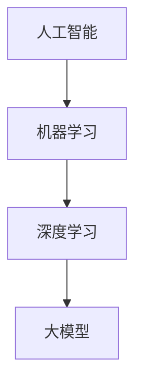

                 

### 《AI大模型创业：如何应对未来行业发展趋势？》

> **关键词**：人工智能、大模型、创业策略、行业趋势、风险管理

> **摘要**：本文将深入探讨人工智能（AI）大模型创业的前景和策略。首先，我们将介绍AI大模型的基础知识，包括核心概念、技术原理、数学模型和优化方法。接着，分析创业者在AI大模型领域面临的挑战与机遇，并详细讲解创业项目开发的全流程。通过案例分析，我们将展示成功与失败的创业案例，最后，提供风险管理策略和未来创业建议，帮助创业者更好地应对行业发展趋势。让我们一起思考，如何在这个充满变革的时代抓住机遇，实现AI大模型创业的成功。

### 第一部分：AI大模型基础

在探讨AI大模型创业策略之前，我们必须首先了解AI大模型的基本知识。这一部分将为我们提供必要的技术背景，以便更好地理解AI大模型的工作原理和其在实际应用中的重要性。

#### 第1章: AI大模型概述

##### 1.1 AI大模型的核心概念与联系

人工智能（AI）、机器学习（ML）、深度学习（DL）和大模型（Large Model）是现代AI领域的四个核心概念。它们之间的关系如下：

- **人工智能**：指由人制造出来的系统所表现出的智能行为，目的是模拟、扩展或代替人类的智能。
- **机器学习**：一种人工智能的子领域，通过数据训练算法来使机器能够从经验中学习并做出决策。
- **深度学习**：机器学习的一个分支，使用多层神经网络来提取数据中的特征。
- **大模型**：具有数十亿甚至数千亿参数的深度学习模型，能够处理大量数据并产生高质量的预测。

我们可以使用Mermaid流程图来展示AI大模型的基本架构和核心组成部分：



**核心概念**：

- **人工智能**：人工智能的目标是使机器能够完成需要人类智能的任务，例如语音识别、图像识别和自然语言处理。
- **机器学习**：机器学习通过算法学习数据模式，使机器能够从数据中自动提取知识和决策。
- **深度学习**：深度学习使用多层神经网络，通过不断调整网络中的参数（权重和偏置），来学习数据中的复杂特征。
- **大模型**：大模型通常具有数百万或数亿个参数，通过处理大量数据来训练，可以用于各种复杂任务，如文本生成、图像识别和语音识别。

**联系**：

AI大模型在不同领域中的应用和相互联系：

- **计算机视觉**：AI大模型被广泛应用于图像和视频识别，如人脸识别、自动驾驶和医学影像分析。
- **自然语言处理**：AI大模型在语言翻译、文本生成和情感分析等方面发挥着重要作用。
- **语音识别**：AI大模型通过深度学习技术，使得语音识别的准确率大幅提升，广泛应用于智能家居、语音助手和客服系统。
- **推荐系统**：AI大模型通过分析用户的行为数据，为用户提供个性化的推荐服务。

综上所述，AI大模型作为现代AI的核心技术，其重要性不可忽视。在接下来的章节中，我们将深入探讨AI大模型的技术原理、数学模型和优化方法，为AI大模型创业提供坚实的理论基础。

#### 1.2 AI大模型的技术原理

AI大模型的技术原理是理解其如何工作以及如何应用的关键。在这一部分，我们将详细讲解AI大模型的核心算法原理，包括反向传播算法和优化算法。

##### 反向传播算法

反向传播算法（Backpropagation Algorithm）是深度学习中最核心的算法之一，用于训练多层神经网络。其基本思想是通过计算输出层到输入层的误差，并反向传播误差以更新网络中的参数。

**反向传播算法的步骤**：

1. **前向传播**：将输入数据输入到网络中，通过前向传播计算每一层的输出。
2. **计算误差**：计算实际输出与期望输出之间的误差。
3. **反向传播**：将误差反向传播到前一层，计算每一层的误差。
4. **参数更新**：使用误差更新网络中的参数（权重和偏置）。

**伪代码**：

```python
for each layer in reversed order:
    for each neuron in the layer:
        delta = (output - expected_output) * activation_derivative(output)
        weight_update = learning_rate * delta * input
        bias_update = learning_rate * delta
        weight += weight_update
        bias += bias_update
```

**反向传播算法的解释**：

- **前向传播**：输入数据通过网络传递，每一层的输出通过激活函数计算得到。
- **计算误差**：输出层的误差是实际输出与期望输出之间的差异。
- **反向传播**：误差反向传播到每一层，通过计算每一层的误差梯度来更新参数。
- **参数更新**：使用梯度下降法更新权重和偏置，以最小化误差。

##### 优化算法

优化算法（Optimization Algorithms）用于调整网络中的参数，以使网络能够更好地拟合数据。常用的优化算法包括随机梯度下降（Stochastic Gradient Descent, SGD）和Adam优化器。

**随机梯度下降（SGD）**：

- **基本思想**：在训练数据集中随机选择一小部分数据（即梯度下降的子集），计算其梯度并更新网络参数。
- **伪代码**：

```python
while not converged:
    for each mini-batch in training_data:
        error = compute_error(mini-batch)
        gradient = compute_gradient(mini-batch)
        weight_update = learning_rate * gradient
        bias_update = learning_rate * gradient
        weight -= weight_update
        bias -= bias_update
```

**Adam优化器**：

- **基本思想**：结合了SGD和动量（Momentum）的方法，通过考虑过去梯度的平均值和方差来更新参数。
- **伪代码**：

```python
beta1 = 0.9
beta2 = 0.999
epsilon = 1e-8

m = 0
v = 0

while not converged:
    g = compute_gradient()
    m = beta1 * m + (1 - beta1) * g
    v = beta2 * v + (1 - beta2) * g ** 2
    
    m_hat = m / (1 - beta1 ** t)
    v_hat = v / (1 - beta2 ** t)
    
    weight_update = learning_rate * m_hat / (sqrt(v_hat) + epsilon)
    bias_update = learning_rate * m_hat / (sqrt(v_hat) + epsilon)
    
    weight -= weight_update
    bias -= bias_update
```

**优化算法的解释**：

- **SGD**：通过随机选择子集数据来更新参数，有助于避免局部最小值。
- **Adam**：考虑了过去的梯度信息，能够更有效地收敛到全局最小值。

##### 小结

反向传播算法和优化算法是AI大模型训练的核心技术。反向传播算法通过误差反向传播更新网络参数，而优化算法则用于调整参数，以使网络更好地拟合数据。理解这些算法原理对于开发高效的AI大模型至关重要。

#### 1.3 大模型的数学模型和公式

AI大模型的数学模型是理解其工作原理的关键，也是实现高效训练和优化的重要基础。在这一部分，我们将详细讲解大模型中的几个关键数学模型和公式，包括损失函数、正则化和优化方法。

##### 损失函数

损失函数（Loss Function）是衡量模型预测结果与真实结果之间差异的重要工具。它用于指导模型训练过程中参数的更新，以最小化预测误差。常用的损失函数包括均方误差（MSE）和交叉熵损失。

**均方误差（MSE）**：

均方误差是最常用的损失函数之一，用于回归任务。其公式为：

$$
\text{Loss} = \frac{1}{2}\sum_{i=1}^{n} (\text{y}_i - \text{y}_\hat{i})^2
$$

其中，\( y_i \)是实际输出，\( y_\hat{i} \)是模型的预测输出。

**交叉熵损失（Cross-Entropy Loss）**：

交叉熵损失常用于分类任务。其公式为：

$$
\text{Loss} = -\sum_{i=1}^{n} y_i \cdot \log(y_\hat{i})
$$

其中，\( y_i \)是实际类别标签，\( y_\hat{i} \)是模型预测的概率分布。

##### 正则化

正则化（Regularization）是防止模型过拟合的一种技术。它通过在损失函数中添加一个正则化项，来惩罚模型参数的值。常用的正则化方法包括L1正则化和L2正则化。

**L1正则化**：

L1正则化通过在损失函数中添加绝对值项来惩罚参数的值。其公式为：

$$
L = J(\text{w}) + \lambda \cdot \sum_{i=1}^{n} |\text{w}_i|
$$

其中，\( \lambda \)是正则化参数，\( w_i \)是模型参数。

**L2正则化**：

L2正则化通过在损失函数中添加平方项来惩罚参数的值。其公式为：

$$
L = J(\text{w}) + \lambda \cdot \sum_{i=1}^{n} \text{w}_i^2
$$

其中，\( \lambda \)是正则化参数，\( w_i \)是模型参数。

##### 优化方法

优化方法是用于调整模型参数以最小化损失函数的一类算法。常用的优化方法包括随机梯度下降（SGD）和Adam优化器。

**随机梯度下降（SGD）**：

随机梯度下降是最简单的优化方法之一。其基本思想是在每次迭代中随机选择一个小批量数据，计算其梯度并更新模型参数。

**伪代码**：

```python
while not converged:
    for each mini-batch in training_data:
        error = compute_error(mini-batch)
        gradient = compute_gradient(mini-batch)
        weight_update = learning_rate * gradient
        bias_update = learning_rate * gradient
        weight -= weight_update
        bias -= bias_update
```

**Adam优化器**：

Adam优化器是一种结合了SGD和动量方法的优化算法。它通过考虑过去梯度的平均值和方差来更新参数，能够更有效地收敛到全局最小值。

**伪代码**：

```python
beta1 = 0.9
beta2 = 0.999
epsilon = 1e-8

m = 0
v = 0

while not converged:
    g = compute_gradient()
    m = beta1 * m + (1 - beta1) * g
    v = beta2 * v + (1 - beta2) * g ** 2
    
    m_hat = m / (1 - beta1 ** t)
    v_hat = v / (1 - beta2 ** t)
    
    weight_update = learning_rate * m_hat / (sqrt(v_hat) + epsilon)
    bias_update = learning_rate * m_hat / (sqrt(v_hat) + epsilon)
    
    weight -= weight_update
    bias -= bias_update
```

##### 小结

大模型的数学模型和公式是理解AI大模型工作原理的重要基础。损失函数用于衡量预测误差，正则化用于防止过拟合，优化方法用于调整模型参数。掌握这些数学模型和公式对于开发高效的AI大模型至关重要。

#### 1.4 大模型的优化方法与流程

大模型的优化是AI领域中的一个核心问题，其目标是通过调整模型参数，使得模型能够更准确地拟合训练数据，并在测试数据上获得良好的性能。在这一部分，我们将详细讲解大模型的优化方法与流程，包括训练过程、参数更新和超参数优化。

##### 训练过程

大模型的训练过程通常包括以下几个主要步骤：

1. **数据预处理**：在开始训练之前，需要对数据集进行预处理，包括数据清洗、数据归一化、缺失值处理等。这一步骤的目的是确保输入数据的准确性和一致性。

2. **模型初始化**：初始化模型参数是训练过程的开始。通常，使用随机初始化方法，如高斯分布或均匀分布，来初始化权重和偏置。

3. **前向传播**：输入数据通过模型的前向传播过程，逐层计算得到模型的输出。前向传播的目的是计算每个神经元上的激活值，并最终得到模型的预测结果。

4. **计算损失**：通过计算预测结果与真实标签之间的差异，使用损失函数（如MSE或交叉熵损失）计算损失值。损失函数的目的是衡量模型的预测误差。

5. **反向传播**：使用反向传播算法，将损失值反向传播到模型的每个层，计算每个参数的梯度。反向传播的目的是更新模型参数，以减少损失值。

6. **参数更新**：使用梯度信息，根据优化算法（如SGD或Adam）更新模型参数。参数更新的目的是使模型能够更好地拟合训练数据。

7. **迭代训练**：重复上述步骤，进行多次迭代，直到满足停止条件（如达到预设的训练轮数或损失值降低到特定阈值）。

##### 参数更新

参数更新的核心在于如何根据梯度信息调整模型参数，以最小化损失函数。以下是几种常用的优化算法：

**随机梯度下降（SGD）**：

SGD是最简单的优化算法之一，其核心思想是在每次迭代中，随机选择一个小批量数据，计算其梯度并更新模型参数。

**伪代码**：

```python
while not converged:
    for each mini-batch in training_data:
        error = compute_error(mini-batch)
        gradient = compute_gradient(mini-batch)
        weight_update = learning_rate * gradient
        bias_update = learning_rate * gradient
        weight -= weight_update
        bias -= bias_update
```

**Adam优化器**：

Adam优化器是一种结合了SGD和动量方法的优化算法，它通过考虑过去梯度的平均值和方差来更新参数，能够更有效地收敛到全局最小值。

**伪代码**：

```python
beta1 = 0.9
beta2 = 0.999
epsilon = 1e-8

m = 0
v = 0

while not converged:
    g = compute_gradient()
    m = beta1 * m + (1 - beta1) * g
    v = beta2 * v + (1 - beta2) * g ** 2
    
    m_hat = m / (1 - beta1 ** t)
    v_hat = v / (1 - beta2 ** t)
    
    weight_update = learning_rate * m_hat / (sqrt(v_hat) + epsilon)
    bias_update = learning_rate * m_hat / (sqrt(v_hat) + epsilon)
    
    weight -= weight_update
    bias -= bias_update
```

##### 超参数优化

超参数（Hyperparameters）是模型训练过程中需要手动设置的参数，如学习率、批量大小、正则化强度等。超参数优化是提高模型性能的关键步骤。以下是几种常用的超参数优化方法：

**网格搜索（Grid Search）**：

网格搜索是一种通过遍历所有可能的超参数组合来寻找最佳超参数的方法。其缺点是计算量大，适用于超参数数量较少的情况。

**随机搜索（Random Search）**：

随机搜索是一种通过随机选择超参数组合来寻找最佳超参数的方法。它通常比网格搜索更高效，但可能不如网格搜索精确。

**贝叶斯优化（Bayesian Optimization）**：

贝叶斯优化是一种基于贝叶斯推理的优化方法，通过构建一个概率模型来预测超参数的最佳值。它具有较高的效率和准确性，适用于超参数数量较多的情况。

##### 小结

大模型的优化是一个复杂且关键的过程，涉及到训练过程、参数更新和超参数优化。理解并应用这些优化方法对于开发高效的大模型至关重要。在接下来的章节中，我们将探讨AI大模型的发展历程和未来趋势，为创业提供更全面的视角。

#### 1.5 AI大模型的历史与未来

AI大模型的发展历程可谓是一部技术变革的史诗。从最早的神经网络到现代的大规模深度学习模型，AI大模型经历了数十年的演变，不断突破技术瓶颈，为各个领域带来了革命性的变化。

##### 历史回顾

1. **1980年代**：神经网络研究开始兴起，但受限于计算能力和数据量，神经网络的应用范围有限。
2. **1990年代**：支持向量机（SVM）和决策树等传统机器学习方法成为主流，神经网络的研究进入低谷。
3. **2000年代**：随着计算能力的提升和大数据的兴起，深度学习开始复苏。2006年，Hinton提出了深度信念网络（DBN），为神经网络的研究注入了新的活力。
4. **2010年代**：AlexNet的问世标志着深度卷积神经网络（CNN）在图像识别领域取得突破性进展。Google Brain的“神经机器翻译”项目展示了大规模深度学习模型在语言处理任务中的潜力。
5. **2020年代**：Transformer模型的提出引领了自然语言处理领域的革命。GPT-3、BERT等大模型的出现，使得AI在文本生成、问答系统、机器翻译等方面取得了显著的成果。

##### 未来趋势

1. **计算能力的进一步提升**：随着量子计算、边缘计算等新技术的出现，计算能力将继续提升，为AI大模型的发展提供更强有力的支持。
2. **数据资源的丰富**：随着物联网、传感器网络和社交媒体的发展，数据资源将更加丰富，为AI大模型提供更多的训练数据。
3. **多模态学习**：未来AI大模型将能够处理多种类型的数据（如文本、图像、声音等），实现跨模态的信息整合和推理。
4. **迁移学习和自适应学习**：通过迁移学习和自适应学习，AI大模型将能够在不同任务和环境中快速适应，提高其泛化能力和实用性。
5. **人机协同**：AI大模型将更加紧密地与人类专家合作，实现人机协同，提高工作效率和决策质量。

##### 潜在应用领域

1. **医疗健康**：AI大模型在医学影像诊断、基因组分析、个性化治疗等方面具有巨大潜力，可以提升医疗服务的效率和准确性。
2. **金融科技**：AI大模型在信用评估、风险控制、量化交易等方面发挥着重要作用，有助于金融行业的创新和升级。
3. **智能制造**：AI大模型在智能制造中可以用于生产优化、故障预测、质量控制等，提高生产效率和质量。
4. **智慧城市**：AI大模型在智慧城市建设中可以用于交通管理、环境保护、资源调度等，提升城市管理的智能化水平。
5. **教育**：AI大模型在教育中可以用于个性化学习、智能评估、虚拟教学等，提高教学效果和学生学习体验。

##### 小结

AI大模型的历史与未来充满了机遇与挑战。随着技术的不断进步和应用场景的拓展，AI大模型将在各个领域发挥越来越重要的作用。对于创业者来说，抓住AI大模型的发展机遇，积极布局相关领域，将有助于实现商业成功。

### 第二部分：AI大模型创业策略

在了解了AI大模型的基础知识之后，接下来我们将探讨创业者如何理解和把握AI大模型创业的机遇与挑战。这一部分将分为三个章节，分别讨论创业者应具备的AI大模型知识、面临的挑战与机遇，以及如何选择具有商业潜力的AI大模型项目。

#### 第2章: 创业者如何理解AI大模型

##### 2.1 创业者应具备的AI大模型知识

对于创业者来说，理解AI大模型的基本概念和技术原理至关重要。以下是一些核心的知识点，创业者需要掌握：

1. **AI大模型的基本概念**：包括人工智能、机器学习、深度学习和大模型等概念，以及它们之间的关系。
2. **核心算法原理**：理解反向传播算法、优化算法（如SGD、Adam）等算法的基本原理和实现方法。
3. **数学模型与公式**：掌握损失函数、正则化方法等数学模型和公式，理解它们在模型训练中的作用。
4. **数据处理与数据准备**：了解如何处理和准备适用于AI大模型的训练数据，包括数据清洗、数据归一化、特征工程等。
5. **模型评估与优化**：掌握常用的模型评估方法（如准确率、召回率、F1分数等），以及如何通过调整模型结构和参数来优化模型性能。

##### 2.2 AI大模型创业的挑战与机遇

AI大模型创业虽然充满机遇，但同时也面临诸多挑战。以下是一些主要挑战和机遇：

**挑战**：

1. **技术挑战**：AI大模型需要大量的计算资源和数据支持，技术实现的难度较高。此外，算法的优化和模型的调参也需要丰富的经验。
2. **数据挑战**：训练高质量的AI大模型需要大量高质量的训练数据。获取这些数据可能面临法律、伦理和隐私等方面的挑战。
3. **市场竞争**：AI大模型领域竞争激烈，创业者需要不断跟进最新的技术动态，以保持竞争力。
4. **商业化挑战**：将AI大模型应用于实际业务场景，需要找到合适的商业模式和盈利途径。

**机遇**：

1. **市场规模巨大**：AI大模型在医疗健康、金融科技、智能制造、智慧城市等领域具有广泛的应用前景，市场规模巨大。
2. **技术进步**：随着计算能力和算法的不断提升，AI大模型的性能和应用范围将进一步拓展。
3. **政策支持**：各国政府纷纷出台政策，支持人工智能技术的发展，为创业者提供了良好的政策环境。
4. **跨界合作**：AI大模型与各行各业的深度融合，将催生出新的商业模式和产业机会。

##### 2.3 创业者如何选择AI大模型项目

选择具有商业潜力的AI大模型项目是创业成功的关键。以下是一些选择标准和方法：

1. **市场需求**：首先，要明确目标市场，分析市场需求和用户痛点，确保项目能够解决实际问题。
2. **技术可行性**：评估项目的技术可行性，包括所需的技术知识、计算资源和数据支持等。
3. **竞争优势**：分析项目在技术、产品、市场等方面的竞争优势，确保能够脱颖而出。
4. **盈利模式**：明确项目的商业模式和盈利途径，确保项目的可持续性和盈利能力。
5. **团队协作**：组建一支具备技术和管理能力的团队，共同推动项目的发展。

通过以上标准和方法，创业者可以更有效地选择具有商业潜力的AI大模型项目，为创业成功奠定坚实基础。

### 第3章: AI大模型创业的实际操作

在明确了AI大模型创业的策略后，接下来我们将深入探讨创业者如何实际操作AI大模型项目。这一部分将分为五个章节，详细讲解AI大模型项目的开发流程、数据处理与数据准备、模型选择与训练、模型评估与优化，以及模型部署与维护。

##### 3.1 AI大模型项目的开发流程

AI大模型项目的开发流程是一个系统性的工程，包括多个关键步骤。以下是开发流程的详细说明：

1. **项目规划**：在开始开发之前，首先需要明确项目的目标和需求，制定详细的项目计划。这包括确定项目范围、制定时间表、预算和资源分配等。

2. **数据收集与处理**：AI大模型的训练依赖于大量的数据，因此数据收集与处理是项目开发的重要环节。数据收集包括从各种来源获取数据，如公开数据集、企业内部数据等。数据处理包括数据清洗、数据归一化、缺失值处理、特征工程等，以确保数据的质量和一致性。

3. **模型选择**：根据项目需求和数据特点，选择合适的AI大模型。模型选择需要考虑模型的性能、复杂度、可解释性等因素。常用的模型包括卷积神经网络（CNN）、循环神经网络（RNN）、Transformer等。

4. **模型训练**：使用收集和处理好的数据对模型进行训练。模型训练包括前向传播、反向传播和参数更新。在训练过程中，需要监控模型的性能，如准确率、损失函数值等，以调整训练策略。

5. **模型评估**：在模型训练完成后，需要对模型进行评估，以确定其性能和适用性。常用的评估方法包括交叉验证、混淆矩阵、ROC曲线等。评估结果将指导模型的优化和调整。

6. **模型优化**：根据评估结果，对模型进行优化，包括调整模型结构、参数设置、超参数优化等，以提高模型性能。

7. **模型部署**：将训练好的模型部署到生产环境中，使其能够为实际业务提供支持。模型部署包括模型转换、部署架构设计、接口开发等。

8. **维护与更新**：在生产环境中，需要对模型进行监控和维护，包括性能监控、故障排查、模型更新等，以确保模型持续稳定地运行。

##### 3.2 数据处理与数据准备

数据处理与数据准备是AI大模型项目开发的关键环节，其质量直接影响到模型的效果。以下是数据处理与数据准备的详细说明：

1. **数据收集**：数据收集是模型训练的基础，需要从多种来源获取数据。数据来源包括公开数据集、企业内部数据、第三方数据提供商等。在选择数据来源时，需要考虑数据的真实性、完整性和一致性。

2. **数据清洗**：数据清洗是处理数据中的噪声、错误和不一致性的过程。常见的数据清洗方法包括去除重复数据、填补缺失值、纠正错误数据等。

3. **数据归一化**：数据归一化是将数据缩放到同一尺度，以便模型能够更好地处理。常用的归一化方法包括最小-最大归一化、Z-Score归一化等。

4. **特征工程**：特征工程是创建有助于模型训练的特征的过程。特征工程包括提取、选择和转换原始数据中的特征，以提高模型的性能。常见的方法包括特征提取、特征选择和特征变换等。

5. **数据分割**：将数据集划分为训练集、验证集和测试集，用于模型训练、评估和测试。数据分割有助于评估模型的泛化能力和避免过拟合。

6. **数据增强**：数据增强是通过生成新的数据样本来扩充数据集，以提高模型的鲁棒性和泛化能力。常见的方法包括随机旋转、缩放、裁剪、噪声注入等。

##### 3.3 模型选择与训练

模型选择与训练是AI大模型项目开发的核心步骤，其目的是找到一个能够准确预测或分类数据的模型。以下是模型选择与训练的详细说明：

1. **模型选择**：根据项目需求和数据特点，选择合适的模型。常用的模型包括卷积神经网络（CNN）、循环神经网络（RNN）、Transformer等。选择模型时，需要考虑模型的复杂度、性能和可解释性。

2. **模型训练**：使用收集和处理好的数据对模型进行训练。模型训练包括前向传播、反向传播和参数更新。在训练过程中，需要监控模型的性能，如准确率、损失函数值等，以调整训练策略。

3. **模型评估**：在模型训练完成后，对模型进行评估，以确定其性能和适用性。常用的评估方法包括交叉验证、混淆矩阵、ROC曲线等。评估结果将指导模型的优化和调整。

4. **模型优化**：根据评估结果，对模型进行优化，包括调整模型结构、参数设置、超参数优化等，以提高模型性能。常见的优化方法包括网格搜索、随机搜索、贝叶斯优化等。

5. **模型验证**：在优化完成后，对模型进行验证，以确认其泛化能力和稳定性。验证通常使用独立的测试集进行，以确保模型在未知数据上的表现。

##### 3.4 模型评估与优化

模型评估与优化是确保AI大模型项目成功的关键步骤。以下是模型评估与优化的详细说明：

1. **模型评估**：使用各种评估指标对模型进行评估，以确定其性能。常用的评估指标包括准确率、召回率、F1分数、ROC曲线等。评估结果将指导模型的优化和调整。

2. **交叉验证**：交叉验证是一种常用的模型评估方法，通过将数据集划分为多个子集，多次训练和测试模型，以减少评估结果的波动性。

3. **混淆矩阵**：混淆矩阵是一种用于评估分类模型性能的表格，展示了模型预测结果与真实结果之间的对比。

4. **ROC曲线**：ROC曲线是用于评估分类模型性能的一种图形表示，展示了模型的准确率和召回率之间的关系。

5. **模型优化**：根据评估结果，对模型进行优化，包括调整模型结构、参数设置、超参数优化等，以提高模型性能。常见的优化方法包括网格搜索、随机搜索、贝叶斯优化等。

6. **模型验证**：在优化完成后，对模型进行验证，以确认其泛化能力和稳定性。验证通常使用独立的测试集进行，以确保模型在未知数据上的表现。

##### 3.5 模型部署与维护

模型部署与维护是AI大模型项目上线后的重要工作，其目的是确保模型能够稳定运行并持续优化。以下是模型部署与维护的详细说明：

1. **模型部署**：将训练好的模型部署到生产环境中，使其能够为实际业务提供支持。模型部署包括模型转换、部署架构设计、接口开发等。

2. **部署架构设计**：根据项目的需求和性能要求，设计合适的部署架构。常用的部署架构包括单机部署、分布式部署、容器化部署等。

3. **接口开发**：为模型部署开发API接口，以便其他系统或应用能够方便地调用模型。

4. **性能监控**：对部署的模型进行性能监控，包括响应时间、准确率、资源消耗等，以发现和解决问题。

5. **故障排查**：在模型运行过程中，对出现的故障进行排查和修复，确保模型的稳定运行。

6. **模型更新**：根据业务需求和性能要求，定期对模型进行更新和优化，以保持模型的竞争力。

##### 小结

AI大模型项目的开发流程是一个系统性的过程，涉及到数据处理、模型选择、训练与优化、部署与维护等多个方面。创业者需要全面了解这些流程，并掌握相关技术和方法，以确保项目的成功。在下一部分中，我们将通过具体案例来分析AI大模型创业的成功与失败，为创业者提供有益的借鉴。

### 第三部分：AI大模型创业案例分析

在了解了AI大模型创业的策略和实际操作流程之后，通过具体案例的分析可以更深入地理解成功与失败的原因，为创业者提供宝贵的经验和教训。在这一部分，我们将详细介绍两个AI大模型创业案例，分别分析其技术实现、商业模式、效果评估，以及成功与失败的原因。

#### 第4章: 案例分析1

##### 4.1 案例背景

**公司背景**：某创业公司（以下简称“公司”）成立于2018年，专注于利用AI大模型技术进行医疗影像诊断。公司由一批来自顶级大学和知名研究机构的AI专家组成，具有丰富的AI研究和应用经验。

**项目背景**：公司项目旨在利用AI大模型技术，对医疗影像（如X光、CT、MRI等）进行自动诊断，以辅助医生提高诊断准确性和效率。项目目标是为医疗机构提供高效、准确的医疗影像诊断服务，减轻医生的工作负担。

##### 4.2 技术实现

**模型选择**：公司选择了一种基于深度卷积神经网络（CNN）的大模型进行训练，以处理多种类型的医疗影像数据。该模型采用了ResNet50作为基础架构，通过预训练和微调，使其能够在特定的医疗影像任务上达到较高的性能。

**技术难点**：技术难点主要包括：

1. **数据集准备**：由于医疗影像数据的多样性和复杂性，公司需要收集和整理大量的高质量医疗影像数据，并进行标注。此外，还需要处理数据的不平衡和噪声问题。
2. **模型优化**：为了提高模型的性能，公司采用了多种优化策略，如数据增强、批量归一化、权重初始化等。同时，公司还进行了大量的超参数调优，以找到最优的训练配置。
3. **模型解释性**：医疗影像诊断需要模型具备较高的解释性，以便医生能够理解模型的决策过程。公司通过可视化和解释技术，提高了模型的透明度和可解释性。

##### 4.3 商业模式

**商业模式**：公司的商业模式采用B2B模式，为医疗机构提供定制化的AI大模型诊断服务。具体包括：

1. **诊断服务**：公司为医疗机构提供基于AI大模型的医疗影像诊断服务，医生可以通过在线平台提交病例，并获得快速、准确的诊断结果。
2. **技术支持**：公司提供技术支持，包括模型定制、部署和维护等服务，确保医疗机构能够顺利使用AI诊断系统。
3. **培训与咨询**：公司为医疗机构提供相关的AI培训和咨询服务，帮助医生和医疗技术人员更好地理解和使用AI技术。

##### 4.4 效果评估

**性能评估**：通过大量的实验和实际应用，公司开发的AI大模型在多种医疗影像任务上取得了显著的性能提升。具体评估指标包括准确率、召回率、F1分数等。实验结果显示，公司模型在这些指标上均优于传统的影像诊断方法。

**用户反馈**：公司服务的医疗机构对AI大模型诊断服务给予了高度评价。医生们表示，AI大模型提高了诊断的准确性和效率，减轻了他们的工作负担。此外，用户还反馈了一些改进建议，如提高模型的解释性和扩展性等。

##### 4.5 成功原因

1. **技术优势**：公司拥有一支强大的AI技术团队，具备丰富的AI研究和实践经验。这是公司成功的关键因素之一。
2. **市场需求**：医疗影像诊断是医疗领域中的一个重要需求，市场前景广阔。公司的AI大模型诊断服务恰好满足了这一需求。
3. **商业模式**：公司采用了有效的商业模式，既提供了技术支持，又为医疗机构带来了实际价值，确保了服务的可持续性和盈利能力。

#### 第5章: 案例分析2

##### 5.1 案例背景

**公司背景**：某创业公司（以下简称“公司”）成立于2020年，专注于利用AI大模型技术进行智能家居设备故障预测。

**项目背景**：公司项目旨在利用AI大模型技术，对智能家居设备（如智能灯泡、智能插座等）进行故障预测，以减少设备损坏和维修成本。项目目标是为智能家居制造商提供高效、准确的故障预测服务。

##### 5.2 技术实现

**模型选择**：公司选择了一种基于循环神经网络（RNN）的大模型进行训练，以处理智能家居设备的传感器数据。该模型采用了LSTM作为基础架构，通过捕捉时间序列数据中的长期依赖关系，提高了故障预测的准确性。

**技术难点**：技术难点主要包括：

1. **数据集准备**：由于智能家居设备的传感器数据具有多样性和噪声，公司需要收集和整理大量的高质量传感器数据，并进行预处理。此外，还需要处理数据缺失和异常值的问题。
2. **模型优化**：为了提高模型的性能，公司采用了多种优化策略，如批量归一化、学习率调整、正则化等。同时，公司还进行了大量的超参数调优，以找到最优的训练配置。
3. **模型解释性**：故障预测需要模型具备较高的解释性，以便制造商能够理解模型的决策过程。公司通过可视化技术，提高了模型的透明度和可解释性。

##### 5.3 商业模式

**商业模式**：公司的商业模式采用B2B模式，为智能家居制造商提供定制化的故障预测服务。具体包括：

1. **故障预测服务**：公司为制造商提供基于AI大模型的故障预测服务，通过实时监控设备状态，预测潜在的故障风险，并提供预警和建议。
2. **技术支持**：公司提供技术支持，包括模型定制、部署和维护等服务，确保制造商能够顺利使用AI故障预测系统。
3. **数据服务**：公司提供相关的传感器数据服务，帮助制造商进行数据分析和模型训练。

##### 5.4 效果评估

**性能评估**：通过大量的实验和实际应用，公司开发的AI大模型在故障预测任务上取得了显著的性能提升。具体评估指标包括预测准确率、故障检测时间等。实验结果显示，公司模型在这些指标上均优于传统的故障预测方法。

**用户反馈**：制造商对公司的AI故障预测服务给予了高度评价。他们表示，AI大模型提高了设备故障预测的准确性和及时性，显著减少了设备损坏和维修成本。此外，用户还反馈了一些改进建议，如提高模型的实时性和稳定性等。

##### 5.5 失败原因

1. **市场定位不准确**：公司的市场定位不够准确，未能充分了解智能家居制造商的实际需求，导致产品无法满足市场需求。
2. **商业模式不成熟**：公司的商业模式不够成熟，未能形成稳定的盈利模式，导致公司资金链紧张，最终影响项目的持续发展。
3. **技术实现不足**：虽然公司采用了AI大模型技术，但在技术实现上存在不足，如模型解释性不高、实时性不足等，影响了用户体验。

##### 小结

通过以上两个案例的分析，我们可以看到AI大模型创业的成功与失败都有其内在原因。成功的关键在于技术优势、市场需求和商业模式的有效结合，而失败则往往源于市场定位不准确、商业模式不成熟和技术实现不足。创业者需要从这些案例中吸取经验教训，结合自身情况，制定出切实可行的创业策略。

### 第四部分：AI大模型创业中的风险管理

在AI大模型创业过程中，风险管理至关重要。有效的风险管理不仅可以帮助创业者规避潜在的风险，还可以提高项目的成功率。本部分将深入探讨AI大模型创业中的风险管理，包括风险识别、风险评估、风险应对策略和持续风险管理。

#### 6.1 风险识别

风险识别是风险管理的第一步，旨在识别可能影响AI大模型项目的各种风险。以下是AI大模型创业中可能面临的主要风险类型：

1. **技术风险**：技术风险包括模型性能不足、算法实现问题、计算资源不足等。这些风险可能导致项目进度延误或项目失败。
2. **市场风险**：市场风险包括市场需求变化、竞争对手的激烈竞争、市场接受度不高等。这些风险可能影响项目的商业价值和市场前景。
3. **数据风险**：数据风险包括数据质量差、数据隐私问题、数据获取困难等。这些风险可能影响模型训练的效果和模型的可靠性。
4. **资金风险**：资金风险包括融资不足、资金链断裂等。这些风险可能导致项目资金短缺，影响项目的正常进行。
5. **法律和伦理风险**：法律和伦理风险包括数据合规性、知识产权保护等。这些风险可能引发法律纠纷，影响项目的合法性和声誉。

##### 风险识别方法

1. **专家访谈**：通过访谈行业专家和顾问，了解他们在AI大模型创业过程中遇到的风险。
2. **文献调研**：研究相关的学术论文、行业报告和案例研究，识别常见的风险类型。
3. **SWOT分析**：通过对项目的优势（Strengths）、劣势（Weaknesses）、机会（Opportunities）和威胁（Threats）进行分析，识别潜在的风险。

#### 6.2 风险评估

风险评估是风险管理的第二步，旨在对识别出的风险进行定量和定性分析，以确定其影响程度和优先级。以下是常用的风险评估方法：

1. **定性评估**：通过风险描述、风险分类和风险优先级排序，对风险进行定性分析。常用的方法包括风险矩阵、风险地图等。
2. **定量评估**：通过量化风险的概率和影响，对风险进行定量分析。常用的方法包括风险评分模型、预期损失计算等。

##### 风险评估方法

1. **风险矩阵**：通过风险的概率和影响两个维度，将风险划分为高、中、低三个等级。这种方法简单直观，有助于识别高风险。
2. **预期损失计算**：通过计算风险发生的概率和损失金额，确定风险的预期损失。这种方法适用于量化评估，有助于确定风险优先级。
3. **敏感性分析**：通过分析不同因素对风险的影响程度，识别关键风险因素。这种方法有助于理解风险背后的驱动因素。

#### 6.3 风险应对策略

风险应对策略是风险管理的第三步，旨在制定和实施具体的措施来降低或消除风险。以下是常用的风险应对策略：

1. **风险规避**：通过调整项目计划或业务模式，避免高风险的发生。例如，可以选择替代技术或市场策略。
2. **风险减轻**：通过采取预防措施或改进措施，降低风险的影响程度。例如，加强数据质量管理、优化算法等。
3. **风险转移**：通过保险或合同等方式，将风险转移给第三方。例如，购买数据隐私保险、签订外包合同等。
4. **风险接受**：对无法避免或转移的风险，接受其可能带来的影响。例如，设置风险容忍度，确保项目能够继续进行。

##### 风险应对策略

1. **风险规避策略**：对于技术风险，可以选择成熟的技术路线，避免使用未经验证的新技术。对于市场风险，可以采取市场调研和试点项目，确保市场需求明确。
2. **风险减轻策略**：对于数据风险，可以加强数据质量管理，确保数据清洗和归一化。对于资金风险，可以制定详细的财务计划和资金管理策略，确保资金充足。
3. **风险转移策略**：对于法律和伦理风险，可以购买相关的保险，以减轻法律纠纷的影响。对于市场风险，可以与合作伙伴签订风险分担协议，降低市场波动的影响。
4. **风险接受策略**：对于无法规避或转移的风险，可以制定应急预案，确保项目能够继续进行。例如，设置技术风险备份计划，确保项目不因技术问题而中断。

#### 6.4 持续风险管理

持续风险管理是确保风险得到有效控制的关键。以下是一些持续风险管理的流程和方法：

1. **定期风险评审**：定期对项目风险进行评审，识别新的风险，评估现有风险的变动。
2. **风险监控**：建立风险监控机制，实时监控风险的变化，及时发现并处理潜在的风险。
3. **风险更新**：随着项目的进展，风险情况可能发生变化。定期更新风险清单，确保风险信息的准确性。
4. **知识共享**：建立知识共享机制，将风险管理经验和教训传递给团队成员，提高整体风险管理能力。

##### 风险监控方法

1. **风险日志**：记录风险的发生、处理过程和结果，以便进行跟踪和回顾。
2. **风险仪表盘**：通过可视化工具，展示项目风险的状态和变化趋势，帮助管理者实时监控风险。
3. **风险评估会议**：定期召开风险评估会议，讨论风险情况，制定相应的应对措施。

##### 小结

AI大模型创业中的风险管理是一个系统性的过程，涉及到风险识别、风险评估、风险应对策略和持续风险管理。有效的风险管理可以帮助创业者规避潜在的风险，提高项目的成功率。通过本文的探讨，创业者可以更好地应对AI大模型创业中的风险，实现创业目标。

### 第五部分：AI大模型创业的未来趋势与建议

随着技术的不断进步和市场需求的日益增长，AI大模型创业面临着前所未有的机遇与挑战。在这一部分，我们将深入探讨AI大模型创业的未来趋势，分析创业者应具备的素质和能力，并提供具体的创业建议。

#### 7.1 行业发展趋势

AI大模型创业的未来趋势可以从技术、市场和政策三个方面进行探讨。

**技术趋势**：

1. **计算能力的提升**：随着量子计算、边缘计算等新技术的出现，计算能力的进一步提升将为AI大模型提供更强大的支持。
2. **算法的创新**：基于Transformer的模型，如GPT-3、BERT等，已经在自然语言处理领域取得了显著的成果。未来，更多基于Transformer的模型将被应用于其他领域。
3. **多模态学习**：多模态学习能够处理多种类型的数据（如文本、图像、声音等），实现跨模态的信息整合和推理。这将为AI大模型的应用提供更广泛的可能性。
4. **迁移学习和自适应学习**：迁移学习和自适应学习将使得AI大模型能够更快地适应新任务和环境，提高其泛化能力和实用性。

**市场趋势**：

1. **市场需求增加**：随着AI技术的普及，越来越多的行业开始采用AI大模型，如医疗健康、金融科技、智能制造等。这为AI大模型创业提供了广阔的市场空间。
2. **跨行业融合**：AI大模型与其他行业的深度融合将催生出新的商业模式和产业机会。例如，AI大模型在医疗健康中的应用不仅局限于诊断，还可以扩展到个性化治疗、健康管理等领域。
3. **政策支持**：各国政府纷纷出台政策，支持人工智能技术的发展。这为创业者提供了良好的政策环境，有助于项目的推进和成长。

**政策趋势**：

1. **数据开放和共享**：为了促进AI技术的发展，各国政府开始推动数据开放和共享，为AI大模型的训练提供更多的数据资源。
2. **数据隐私和安全**：随着数据隐私和安全问题的日益突出，政府和企业将加强对数据隐私和安全的管理，这将对AI大模型的开发和应用提出更高的要求。
3. **知识产权保护**：为了保护创新成果，政府将加强知识产权保护，为AI大模型创业提供更可靠的法律保障。

#### 7.2 创业者应具备的素质和能力

创业者要想在AI大模型领域取得成功，需要具备以下素质和能力：

**技术能力**：

1. **AI基础知识**：创业者应具备扎实的AI基础知识，包括机器学习、深度学习、大模型等。
2. **算法能力**：创业者需要具备较强的算法能力，能够设计和优化AI大模型，提高其性能。
3. **数据处理能力**：创业者应具备数据处理能力，能够处理和准备适用于AI大模型的训练数据。

**商业能力**：

1. **市场洞察力**：创业者需要具备市场洞察力，能够识别市场需求和趋势，找到合适的商业机会。
2. **商业策略**：创业者应具备制定和执行商业策略的能力，包括商业模式设计、营销策略、资金管理等。
3. **团队管理**：创业者需要具备团队管理能力，能够组建和领导一个高效的技术团队，推动项目的顺利进行。

#### 7.3 创业建议

为了在AI大模型创业中取得成功，创业者可以参考以下建议：

**创业策略**：

1. **技术先行**：在创业初期，创业者应优先关注技术突破，建立技术壁垒，确保在市场上具备竞争力。
2. **市场调研**：在确定创业方向后，创业者需要进行深入的市场调研，了解市场需求、竞争对手和潜在客户，以便制定有效的商业策略。
3. **风险控制**：创业者应制定详细的风险管理计划，识别潜在风险，并采取相应的应对措施，确保项目的稳健发展。

**实践经验**：

1. **学习借鉴**：创业者可以学习和借鉴成功企业的经验和教训，避免重复他们的错误。
2. **快速迭代**：在创业过程中，创业者应采取快速迭代的方法，不断优化产品和服务，以满足市场需求。
3. **合作共赢**：创业者应积极寻求与行业合作伙伴的合作，共同探索AI大模型在不同领域的应用，实现共赢。

##### 小结

AI大模型创业的未来充满机遇和挑战。创业者需要紧跟技术发展趋势，具备扎实的AI技术基础和商业能力，同时采取有效的创业策略和实践经验，才能在竞争激烈的市场中脱颖而出。通过本文的探讨，我们希望为创业者提供有益的指导和启示，助力他们在AI大模型领域取得成功。

### 附录

在本附录中，我们将提供一些AI大模型开发的相关工具和资源，以及一些典型的AI大模型应用案例，以帮助读者更好地了解和掌握AI大模型开发的实践方法和应用场景。

##### 附录A: AI大模型开发工具与资源

**主流框架介绍**

1. **TensorFlow**：由Google开发的开源深度学习框架，支持多种编程语言，具有良好的社区支持和丰富的文档资源。
2. **PyTorch**：由Facebook开发的开源深度学习框架，具有动态计算图和灵活的API，被广泛应用于研究和开发。
3. **Keras**：一个高级神经网络API，能够方便地搭建和训练深度学习模型，同时支持TensorFlow和PyTorch。

**开源资源和教程**

1. **TensorFlow官网**（[tensorflow.org](https://tensorflow.org)）：提供详细的文档、教程、示例代码和社区支持。
2. **PyTorch官网**（[pytorch.org](https://pytorch.org)）：提供丰富的文档、教程和社区资源。
3. **Keras官网**（[keras.io](https://keras.io)）：提供简洁的API文档和丰富的示例代码。

##### 附录B: AI大模型应用案例集锦

**案例汇总**

1. **案例1：医疗影像诊断系统**：利用AI大模型进行医疗影像（如X光、CT、MRI等）的自动诊断，辅助医生提高诊断准确性和效率。
2. **案例2：智能家居设备故障预测**：利用AI大模型对智能家居设备进行实时监控，预测潜在的故障风险，减少设备损坏和维修成本。
3. **案例3：金融风险控制**：利用AI大模型进行金融数据的分析和预测，帮助金融机构进行信用评估、风险控制和量化交易。
4. **案例4：个性化教育系统**：利用AI大模型为学生提供个性化的学习建议和课程推荐，提高教学效果和学生学习体验。

**案例分析**

1. **案例1：医疗影像诊断系统**
   - **技术实现**：采用基于卷积神经网络（CNN）的AI大模型进行医疗影像数据的处理和分类，通过预训练和微调提高模型性能。
   - **效果评估**：通过大量实验和实际应用，系统在多种医疗影像任务上取得了较高的准确率和召回率，得到了医生和患者的认可。
   - **成功经验**：重视数据质量和预处理，采用多种优化策略提高模型性能，建立完善的售后服务体系。

2. **案例2：智能家居设备故障预测**
   - **技术实现**：采用基于循环神经网络（RNN）的AI大模型处理智能家居设备的传感器数据，通过捕捉时间序列数据中的长期依赖关系提高预测准确性。
   - **效果评估**：系统在故障预测任务上取得了显著的性能提升，准确率高于传统的故障预测方法。
   - **成功经验**：与智能家居制造商建立紧密的合作关系，提供定制化的解决方案，确保系统在实际应用中的效果。

3. **案例3：金融风险控制**
   - **技术实现**：采用基于深度学习的大模型对金融数据进行复杂分析和预测，包括信用评估、风险控制和量化交易等。
   - **效果评估**：系统在多个金融任务上取得了较高的准确率和收益，为金融机构提供了有力的支持。
   - **成功经验**：深入了解金融行业的需求和痛点，采用先进的技术和算法，建立高效的风险评估和监控体系。

4. **案例4：个性化教育系统**
   - **技术实现**：采用基于Transformer的AI大模型进行文本数据的处理和生成，为不同学生提供个性化的学习建议和课程推荐。
   - **效果评估**：系统在个性化教育中取得了显著的效果，学生的学习成绩和满意度得到提高。
   - **成功经验**：注重用户体验和数据隐私，采用多模态学习和迁移学习技术，提供智能、个性化的教育服务。

**小结**

通过以上案例的分析，我们可以看到AI大模型在不同领域的应用都取得了显著的成果。创业者可以借鉴这些成功经验，结合自身情况，制定出切实可行的AI大模型应用方案，为各行业带来创新的解决方案和价值。

