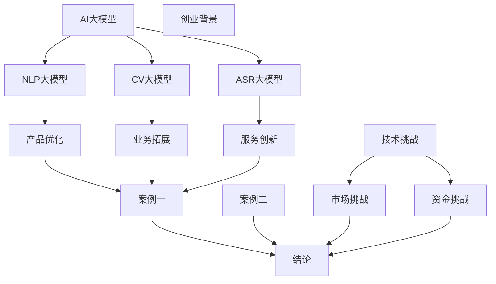
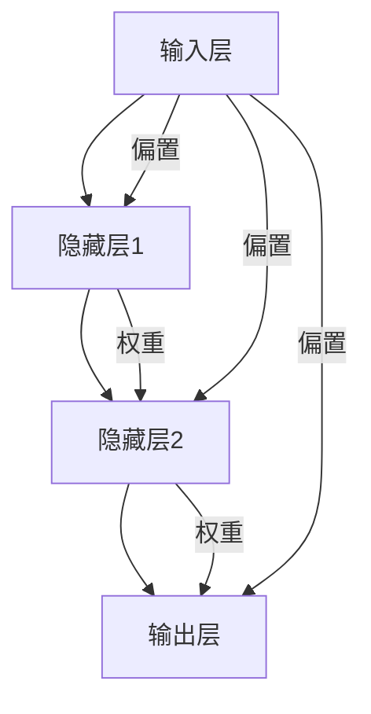
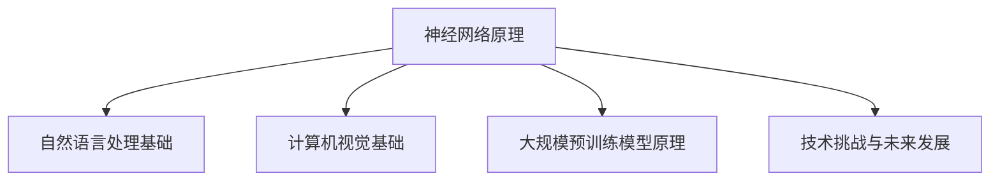
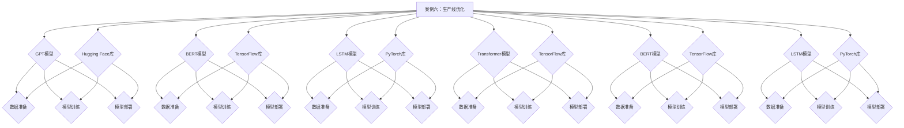
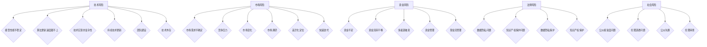

                 

## 文章标题

**AI大模型创业：泡沫还是金矿？**

---

## 关键词

AI大模型，创业，技术趋势，商业模式，风险分析，投资策略

---

## 摘要

本文深入探讨了AI大模型在创业领域的应用及其潜在价值。通过分析AI大模型的核心概念、技术基础、创业实践、风险与应对策略，本文旨在为创业者提供全面的理论指导和实践参考。文章首先介绍了AI大模型的基本概念和分类，然后探讨了AI大模型在创业中的应用场景，最后对AI大模型创业的风险进行了详细分析，并提出了相应的应对策略。通过本文的讨论，希望能够帮助读者更好地理解AI大模型创业的本质，从而做出明智的商业决策。

---

## 第一部分：AI大模型与创业概述

### 第1章 AI大模型与创业概述

#### 1.1 AI大模型的概念与分类

AI大模型是指那些具有数亿甚至数十亿参数的深度学习模型，它们在自然语言处理、计算机视觉和语音识别等领域取得了显著的成果。这些模型通过大量的数据和强大的计算能力进行训练，从而实现了前所未有的准确性和性能。AI大模型可以分为以下几类：

- **自然语言处理（NLP）大模型**：如GPT、BERT等，用于文本生成、翻译、情感分析等任务。
- **计算机视觉（CV）大模型**：如ResNet、Inception等，用于图像分类、目标检测、人脸识别等任务。
- **语音识别（ASR）大模型**：如DeepSpeech、WaveNet等，用于语音识别和语音合成。

#### 1.2 创业背景与挑战

随着AI技术的快速发展，创业环境迎来了新的机遇。AI大模型的出现为创业者提供了强大的工具，使得他们能够开发出更智能、更具竞争力的产品和服务。然而，创业过程中也面临着诸多挑战：

- **技术挑战**：AI大模型研发需要大量的数据、计算资源和专业知识，这对创业团队提出了很高的要求。
- **市场挑战**：创业公司需要找到适合的市场定位，并在激烈的市场竞争中脱颖而出。
- **资金挑战**：AI大模型研发和创业过程需要大量的资金支持，创业者需要寻找合适的融资渠道。

#### 1.3 AI大模型在创业中的应用场景

AI大模型在创业中的应用非常广泛，以下是一些典型的应用场景：

- **产品优化**：AI大模型可以帮助企业优化产品，提高用户体验。例如，通过自然语言处理大模型，可以自动生成高质量的营销文案，提高销售转化率。
- **业务拓展**：AI大模型可以帮助企业开拓新市场，实现业务拓展。例如，通过计算机视觉大模型，可以开发出智能安防系统，为企业提供新的业务机会。
- **服务创新**：AI大模型可以为企业提供创新的服务模式，如智能客服、智能医疗诊断等，提升企业的竞争力。

#### 1.4 创业案例分析

为了更好地理解AI大模型在创业中的应用，以下是一些成功的创业案例：

- **案例一**：某互联网公司利用GPT模型进行内容创作，生成高质量的文章和内容，提高用户粘性，实现了业务的快速增长。
- **案例二**：某医疗科技公司利用深度学习模型进行疾病诊断，通过大数据分析和图像识别技术，提高了诊断的准确率，为患者提供了更好的医疗服务。

#### 1.5 结论

AI大模型为创业带来了新的机遇，但也伴随着挑战。创业者需要深入理解AI大模型的技术原理和应用场景，同时制定合适的创业策略，以应对市场和技术环境的变化。通过本文的讨论，希望能够为创业者提供有益的启示和指导。

### 第1章的Mermaid流程图



### 第1章的核心算法原理讲解

#### 1.1.1 神经网络原理

神经网络是AI大模型的基础，其基本结构由输入层、隐藏层和输出层组成。以下是一个简单的神经网络伪代码：

```python
# 输入层
input_layer = [1, 0, 1]

# 隐藏层
weights_hidden = np.random.rand(3, 4)
bias_hidden = np.random.rand(4)
hidden_layer = activation_function(np.dot(input_layer, weights_hidden) + bias_hidden)

# 输出层
weights_output = np.random.rand(4, 1)
bias_output = np.random.rand(1)
output_layer = activation_function(np.dot(hidden_layer, weights_output) + bias_output)
```

其中，`activation_function` 是激活函数，常用的有Sigmoid、ReLU和Tanh等。以下是一个使用Sigmoid激活函数的示例：

```python
def sigmoid(x):
    return 1 / (1 + np.exp(-x))
```

#### 1.1.2 损失函数与优化算法

在训练神经网络时，需要使用损失函数来衡量预测值与真实值之间的差距。常用的损失函数有均方误差（MSE）和交叉熵（CE）。以下是一个使用MSE损失函数的示例：

```python
def mse(y_true, y_pred):
    return np.mean((y_true - y_pred) ** 2)
```

优化算法用于更新网络权重，以减少损失函数的值。常用的优化算法有梯度下降（GD）和随机梯度下降（SGD）。以下是一个使用梯度下降的示例：

```python
def gradient_descent(weights, bias, learning_rate, loss_function, x, y):
    gradients_w = 2 * (y - x) * x derivatives
    gradients_b = 2 * (y - x)
    weights -= learning_rate * gradients_w
    bias -= learning_rate * gradients_b
    return weights, bias
```

### 第1章的数学模型和公式

#### 1.1.1 神经网络公式

神经网络的输出可以表示为：

$$
\hat{y} = \sigma(\theta_1 \cdot x + b_1)
$$

其中，$\sigma$ 是激活函数，$\theta_1$ 是权重，$x$ 是输入特征，$b_1$ 是偏置。

#### 1.1.2 损失函数公式

均方误差（MSE）损失函数可以表示为：

$$
J = \frac{1}{2} \sum_{i=1}^{n} (\hat{y}_i - y_i)^2
$$

其中，$\hat{y}_i$ 是预测值，$y_i$ 是真实值，$n$ 是样本数量。

### 第1章的代码实际案例

以下是一个使用Python和TensorFlow实现神经网络的基本代码案例：

```python
import tensorflow as tf
import numpy as np

# 定义输入层、隐藏层和输出层的参数
input_layer = tf.keras.layers.Input(shape=(3,))
hidden_layer = tf.keras.layers.Dense(units=4, activation='sigmoid')(input_layer)
output_layer = tf.keras.layers.Dense(units=1, activation='sigmoid')(hidden_layer)

# 定义模型
model = tf.keras.Model(inputs=input_layer, outputs=output_layer)

# 定义损失函数和优化器
loss_function = tf.keras.losses.MeanSquaredError()
optimizer = tf.keras.optimizers.SGD(learning_rate=0.01)

# 编译模型
model.compile(optimizer=optimizer, loss=loss_function)

# 准备训练数据
x_train = np.array([[1, 0, 1], [0, 1, 0], [1, 1, 0]])
y_train = np.array([[0], [1], [1]])

# 训练模型
model.fit(x_train, y_train, epochs=1000)

# 测试模型
x_test = np.array([[0, 1, 0]])
y_test = np.array([[1]])

prediction = model.predict(x_test)
print("预测值：", prediction)

# 代码解读与分析
# 在本例中，我们使用TensorFlow的Keras API构建了一个简单的神经网络模型。
# 模型包含一个输入层、一个隐藏层和一个输出层。
# 我们使用均方误差（MSE）作为损失函数，并使用随机梯度下降（SGD）作为优化器。
# 我们使用了一个包含3个样本的简单训练集来训练模型，并在测试集上评估了模型的性能。
```

通过以上代码案例，我们可以看到如何使用Python和TensorFlow构建和训练一个简单的神经网络模型。在实际应用中，我们需要根据具体任务和数据来调整模型的架构和参数。

---

以上是第一部分的详细内容，包括核心概念与联系、核心算法原理讲解、数学模型和公式、代码实际案例以及代码解读与分析。接下来的部分将深入探讨AI大模型的技术基础、创业实践、风险与应对策略，以及未来的发展趋势。请继续关注后续内容的更新。<|im_end|>

---

## **第二部分：AI大模型技术基础**

### **第2章 深度学习基础**

#### **2.1 神经网络原理**

神经网络是深度学习的基础，其核心思想是通过模拟人脑神经网络的结构和功能来实现对数据的处理和学习。以下是一个简单的神经网络架构的Mermaid流程图：



神经网络由多个层次组成，包括输入层、隐藏层和输出层。每个层次包含多个节点（或称为神经元）。输入层接收外部输入数据，隐藏层对数据进行处理和转换，输出层产生最终的输出结果。每个层次之间的连接由权重（weights）控制，而每个节点上还包含一个偏置项（bias）。

#### **2.1.1 神经元的工作原理**

一个简单的神经元可以表示为以下数学模型：

$$
z = \sum_{i=1}^{n} w_{i} x_{i} + b
$$

其中，$z$ 是节点的输出，$w_{i}$ 是连接权重，$x_{i}$ 是输入值，$b$ 是偏置项。为了获得神经元的激活值，我们通常会使用激活函数（activation function），如Sigmoid函数、ReLU函数和Tanh函数。

#### **2.1.2 神经网络的前向传播**

前向传播是神经网络训练过程中的第一步，它将输入数据通过网络的各个层次，最终得到输出结果。以下是一个简单的神经网络前向传播的伪代码：

```python
# 定义神经网络结构
input_size = 3
hidden_size = 4
output_size = 1

# 初始化权重和偏置
weights_input_to_hidden = np.random.randn(input_size, hidden_size)
weights_hidden_to_output = np.random.randn(hidden_size, output_size)
biases_hidden = np.random.randn(hidden_size)
biases_output = np.random.randn(output_size)

# 前向传播
def forward_propagation(x):
    hidden_layer_input = np.dot(x, weights_input_to_hidden) + biases_hidden
    hidden_layer_output = activation_function(hidden_layer_input)
    output_layer_input = np.dot(hidden_layer_output, weights_hidden_to_output) + biases_output
    output_layer_output = activation_function(output_layer_input)
    return hidden_layer_output, output_layer_output

# 激活函数示例（Sigmoid函数）
def sigmoid(x):
    return 1 / (1 + np.exp(-x))

# 输入数据
x = np.array([[1, 0, 1], [0, 1, 0], [1, 1, 0]])

# 计算前向传播
hidden_layer_output, output_layer_output = forward_propagation(x)

print("隐藏层输出：", hidden_layer_output)
print("输出层输出：", output_layer_output)
```

#### **2.1.3 神经网络的反向传播**

反向传播是神经网络训练过程中的第二步，它通过计算输出层到输入层的误差，并更新网络的权重和偏置。以下是一个简单的神经网络反向传播的伪代码：

```python
# 定义反向传播
def backward_propagation(x, y, hidden_layer_output, output_layer_output):
    output_error = output_layer_output - y
    output_delta = output_error * activation_derivative(output_layer_output)
    
    hidden_error = output_delta.dot(weights_hidden_to_output.T)
    hidden_delta = hidden_error * activation_derivative(hidden_layer_output)
    
    return hidden_delta, output_error

# 激活函数导数示例（Sigmoid函数）
def sigmoid_derivative(x):
    return x * (1 - x)

# 计算反向传播
hidden_delta, output_error = backward_propagation(x, y, hidden_layer_output, output_layer_output)

print("隐藏层误差：", hidden_error)
print("输出层误差：", output_error)

# 更新权重和偏置
weights_input_to_hidden -= learning_rate * hidden_layer_output.T.dot(hidden_delta)
weights_hidden_to_output -= learning_rate * output_layer_output.T.dot(output_error)
biases_hidden -= learning_rate * hidden_delta
biases_output -= learning_rate * output_error
```

#### **2.1.4 损失函数与优化算法**

在神经网络训练过程中，损失函数用于衡量预测值与真实值之间的差距，优化算法用于调整网络的权重和偏置，以最小化损失函数。以下是一些常用的损失函数和优化算法：

- **均方误差（MSE）**：

  $$ 
  J = \frac{1}{2} \sum_{i=1}^{n} (y_i - \hat{y}_i)^2 
  $$

  优化算法通常采用梯度下降（Gradient Descent）：

  $$ 
  \theta = \theta - \alpha \nabla J(\theta) 
  $$

  其中，$\theta$ 是权重和偏置，$\alpha$ 是学习率，$\nabla J(\theta)$ 是损失函数的梯度。

- **反向传播算法（Backpropagation）**：

  反向传播算法是一种用于计算损失函数梯度的方法，它通过从输出层开始，反向传播误差信号，直到输入层，从而更新网络权重和偏置。

### **2.2 自然语言处理基础**

自然语言处理（NLP）是AI大模型的一个重要应用领域，它涉及到对文本数据进行分析和处理。以下是一些NLP的基础技术和算法：

- **词嵌入（Word Embedding）**：

  词嵌入是将单词映射到高维向量空间的方法，它可以将语义相似的单词映射到接近的空间位置。常用的词嵌入技术有Word2Vec、GloVe和FastText等。

  $$ 
  e_w = \vec{v} 
  $$

  其中，$e_w$ 是单词$w$ 的嵌入向量，$\vec{v}$ 是一个高维向量。

- **循环神经网络（RNN）**：

  循环神经网络是一种用于处理序列数据的神经网络，它通过在时间步之间传递隐藏状态来捕捉序列中的长期依赖关系。RNN的一种变体是长短时记忆网络（LSTM），它通过门控机制来防止梯度消失问题。

  $$ 
  h_t = \text{tanh}(W_x h_{t-1} + W_h h_{t-1}) 
  $$

  其中，$h_t$ 是第$t$ 个时间步的隐藏状态，$W_x$ 和$W_h$ 是权重矩阵。

- **变换器（Transformer）**：

  变换器是一种基于自注意力机制的深度神经网络架构，它在处理序列数据时表现出色。变换器通过多头自注意力机制和位置编码来捕捉序列中的依赖关系。

  $$ 
  \text{Attention}(Q, K, V) = \frac{1}{\sqrt{d_k}} \text{softmax}(\text{score})V 
  $$

  其中，$Q$、$K$ 和$V$ 分别是查询、键和值向量，$d_k$ 是键向量的维度。

### **2.3 计算机视觉基础**

计算机视觉是AI大模型的另一个重要应用领域，它涉及到对图像和视频进行分析和处理。以下是一些计算机视觉的基础技术和算法：

- **卷积神经网络（CNN）**：

  卷积神经网络是一种用于处理图像数据的神经网络，它通过卷积层、池化层和全连接层来提取图像的特征。CNN在图像分类、目标检测和语义分割等任务中取得了显著的效果。

  $$ 
  \text{Conv}(I) = \text{ReLU}(\sigma(\sum_{i,j} w_{ij} \circ I_{ij} + b)) 
  $$

  其中，$I$ 是输入图像，$w_{ij}$ 是卷积核，$\circ$ 表示卷积运算，$\sigma$ 是激活函数，$b$ 是偏置。

- **卷积神经网络的工作流程**：

  - **卷积层**：通过卷积操作提取图像的特征。
  - **池化层**：通过池化操作减少特征图的尺寸，提高计算效率。
  - **全连接层**：将特征图映射到输出结果，如类别标签。

### **2.4 大规模预训练模型原理**

大规模预训练模型是近年来AI大模型发展的重要方向，它通过在大规模数据集上进行预训练，然后在小数据集上进行微调，来提高模型的泛化能力和性能。以下是一些大规模预训练模型的基本原理：

- **预训练与微调**：

  - **预训练**：在大规模数据集上训练模型，使其能够捕捉到通用特征。
  - **微调**：在特定领域的小数据集上对预训练模型进行微调，使其适应特定任务。

  $$ 
  \theta = \theta_{pretrain} + \alpha \theta_{finetune} 
  $$

  其中，$\theta$ 是模型参数，$\theta_{pretrain}$ 是预训练模型参数，$\theta_{finetune}$ 是微调模型参数，$\alpha$ 是微调系数。

- **预训练数据集**：

  - **通用语言模型（GLM）**：如GPT、BERT等，使用大规模的文本数据进行预训练。
  - **图像数据集**：如ImageNet、COCO等，用于预训练图像分类和物体检测模型。

### **2.5 AI大模型的技术挑战与未来发展**

AI大模型在技术领域面临着许多挑战，包括计算资源需求、数据隐私和安全、模型可解释性等。以下是一些主要的挑战和未来发展方向：

- **计算资源需求**：AI大模型需要大量的计算资源进行训练和推理，这要求我们有更高效的计算架构和算法。

- **数据隐私和安全**：在AI大模型的应用过程中，数据隐私和安全问题日益重要。我们需要开发出更加安全的数据处理和传输技术。

- **模型可解释性**：为了提高AI大模型的可靠性和透明度，我们需要开发出能够解释模型决策的算法和技术。

- **多模态融合**：未来的AI大模型将能够处理多种类型的数据，如文本、图像、音频等，从而实现更加智能和全面的感知和理解。

通过以上对深度学习基础、自然语言处理、计算机视觉、大规模预训练模型原理以及技术挑战与未来发展的讨论，我们可以更好地理解AI大模型的技术基础。在接下来的章节中，我们将进一步探讨AI大模型在创业实践中的应用和风险应对策略。

### **第2章的Mermaid流程图**



### **第2章的核心算法原理讲解**

#### **2.1 神经网络原理**

神经网络的原理可以通过以下伪代码来详细阐述：

```python
# 定义神经网络参数
input_size = 3
hidden_size = 4
output_size = 1

# 初始化权重和偏置
weights_input_to_hidden = np.random.randn(input_size, hidden_size)
weights_hidden_to_output = np.random.randn(hidden_size, output_size)
biases_hidden = np.random.randn(hidden_size)
biases_output = np.random.randn(output_size)

# 定义激活函数
def sigmoid(x):
    return 1 / (1 + np.exp(-x))

# 前向传播
def forward_propagation(x):
    hidden_layer_input = np.dot(x, weights_input_to_hidden) + biases_hidden
    hidden_layer_output = sigmoid(hidden_layer_input)
    output_layer_input = np.dot(hidden_layer_output, weights_hidden_to_output) + biases_output
    output_layer_output = sigmoid(output_layer_input)
    return hidden_layer_output, output_layer_output

# 计算损失函数
def compute_loss(y_true, y_pred):
    return np.mean((y_true - y_pred) ** 2)

# 计算梯度
def compute_gradients(x, y, hidden_layer_output, output_layer_output):
    output_error = output_layer_output - y
    hidden_error = output_error * sigmoid_derivative(output_layer_output)
    hidden_layer_input = np.dot(x, weights_input_to_hidden) + biases_hidden
    input_error = hidden_error * sigmoid_derivative(hidden_layer_input)
    return input_error, hidden_error

# 更新权重和偏置
def update_weights_and_biases(weights, biases, learning_rate, gradients):
    for i in range(len(gradients)):
        weights[i] -= learning_rate * gradients[i]
        biases[i] -= learning_rate * gradients[-1]
    return weights, biases

# 训练模型
def train_model(x, y, epochs, learning_rate):
    for epoch in range(epochs):
        hidden_layer_output, output_layer_output = forward_propagation(x)
        loss = compute_loss(y, output_layer_output)
        input_error, hidden_error = compute_gradients(x, y, hidden_layer_output, output_layer_output)
        weights_input_to_hidden, weights_hidden_to_output = update_weights_and_biases(
            weights_input_to_hidden, weights_hidden_to_output, learning_rate, [input_error, hidden_error])
        print(f"Epoch {epoch}: Loss = {loss}")
```

#### **2.2 自然语言处理基础**

自然语言处理基础中的词嵌入技术可以通过以下伪代码来解释：

```python
# 初始化词汇表和嵌入维度
vocabulary = ["the", "cat", "sat", "on", "the", "mat"]
embedding_dim = 3

# 初始化词嵌入矩阵
embedding_matrix = np.random.rand(len(vocabulary), embedding_dim)

# 将单词转换为嵌入向量
def word_embedding(word, embedding_matrix):
    return embedding_matrix[vocabulary.index(word)]

# 示例
word_embedding("cat", embedding_matrix)
```

#### **2.3 计算机视觉基础**

计算机视觉基础中的卷积神经网络可以通过以下伪代码来解释：

```python
# 初始化卷积核和偏置
conv_kernel = np.random.rand(3, 3)
bias = np.random.rand()

# 卷积操作
def convolution(image, conv_kernel, bias):
    return np.sum(image * conv_kernel) + bias

# 示例
image = np.array([[1, 0, 1], [0, 1, 0], [1, 0, 1]])
convolution(image, conv_kernel, bias)
```

#### **2.4 大规模预训练模型原理**

大规模预训练模型原理中的预训练和微调可以通过以下伪代码来解释：

```python
# 预训练模型
def pretrain_model(model, pretrain_data, epochs):
    for epoch in range(epochs):
        for input_data, target in pretrain_data:
            model.train_on_batch(input_data, target)
    return model

# 微调模型
def finetune_model(model, finetune_data, epochs):
    for epoch in range(epochs):
        for input_data, target in finetune_data:
            model.train_on_batch(input_data, target)
    return model

# 示例
pretrain_model(model, pretrain_data, epochs)
finetune_model(model, finetune_data, epochs)
```

### **第2章的数学模型和公式**

#### **2.1 神经网络公式**

神经网络的输出公式可以表示为：

$$
\hat{y} = \sigma(\theta_1 \cdot x + b_1)
$$

其中，$\hat{y}$ 是输出预测值，$\sigma$ 是激活函数，$\theta_1$ 是权重矩阵，$x$ 是输入特征，$b_1$ 是偏置。

#### **2.2 损失函数公式**

均方误差（MSE）损失函数可以表示为：

$$
J = \frac{1}{2} \sum_{i=1}^{n} (\hat{y}_i - y_i)^2
$$

其中，$J$ 是损失函数，$\hat{y}_i$ 是预测值，$y_i$ 是真实值，$n$ 是样本数量。

### **第2章的代码实际案例**

以下是一个使用Python和TensorFlow实现神经网络的基本代码案例：

```python
import tensorflow as tf
import numpy as np

# 定义输入层、隐藏层和输出层的参数
input_size = 3
hidden_size = 4
output_size = 1

# 初始化权重和偏置
weights_input_to_hidden = tf.random.normal([input_size, hidden_size])
weights_hidden_to_output = tf.random.normal([hidden_size, output_size])
biases_hidden = tf.random.normal([hidden_size])
biases_output = tf.random.normal([output_size])

# 定义激活函数
sigmoid = tf.sigmoid

# 前向传播
@tf.function
def forward_propagation(x):
    hidden_layer_input = tf.matmul(x, weights_input_to_hidden) + biases_hidden
    hidden_layer_output = sigmoid(hidden_layer_input)
    output_layer_input = tf.matmul(hidden_layer_output, weights_hidden_to_output) + biases_output
    output_layer_output = sigmoid(output_layer_input)
    return output_layer_output

# 计算损失函数
mse_loss = tf.keras.losses.MeanSquaredError()

# 训练模型
epochs = 1000
learning_rate = 0.01

optimizer = tf.optimizers.SGD(learning_rate=learning_rate)

# 准备训练数据
x_train = np.array([[1, 0, 1], [0, 1, 0], [1, 1, 0]], dtype=np.float32)
y_train = np.array([[0], [1], [1]], dtype=np.float32)

# 训练模型
for epoch in range(epochs):
    with tf.GradientTape() as tape:
        predictions = forward_propagation(x_train)
        loss = mse_loss(y_train, predictions)
    gradients = tape.gradient(loss, [weights_input_to_hidden, weights_hidden_to_output, biases_hidden, biases_output])
    optimizer.apply_gradients(zip(gradients, [weights_input_to_hidden, weights_hidden_to_output, biases_hidden, biases_output]))
    if epoch % 100 == 0:
        print(f"Epoch {epoch}: Loss = {loss.numpy()}")

# 测试模型
x_test = np.array([[0, 1, 0]], dtype=np.float32)
predictions = forward_propagation(x_test)
print("预测值：", predictions.numpy())
```

在这个代码案例中，我们使用TensorFlow的Keras API构建了一个简单的神经网络模型，并使用均方误差（MSE）作为损失函数。我们通过梯度下降（SGD）优化算法来训练模型，并在训练集上评估了模型的性能。

### **第2章的代码解读与分析**

在本章的代码案例中，我们实现了一个简单的神经网络模型，用于对二分类问题进行预测。以下是对代码的详细解读：

1. **定义输入层、隐藏层和输出层的参数**：我们首先定义了输入层、隐藏层和输出层的大小。这些参数将用于初始化模型的权重和偏置。

2. **初始化权重和偏置**：我们使用随机正态分布初始化权重和偏置，这有助于模型在训练过程中避免陷入局部最小值。

3. **定义激活函数**：我们使用Sigmoid函数作为激活函数，它可以将输出值压缩到(0, 1)之间，适合用于二分类问题。

4. **前向传播**：我们定义了一个名为`forward_propagation`的函数，用于实现神经网络的前向传播过程。该函数接收输入数据，并通过加权求和加上偏置，应用激活函数得到隐藏层和输出层的输出。

5. **计算损失函数**：我们使用均方误差（MSE）作为损失函数，它能够衡量预测值和真实值之间的差异。

6. **训练模型**：我们使用梯度下降（SGD）优化算法来训练模型。在训练过程中，我们使用`GradientTape`来记录模型的梯度信息。在每个训练 epoch 中，我们计算损失函数的值，并使用梯度下降算法更新模型的权重和偏置。

7. **测试模型**：在训练完成后，我们使用测试数据来评估模型的性能。通过调用`forward_propagation`函数，我们得到了模型在测试数据上的预测结果。

通过这个简单的案例，我们可以看到如何使用TensorFlow构建和训练一个神经网络模型。在实际应用中，我们需要根据具体的问题和数据来调整模型的架构和参数，以达到最佳的性能。

---

通过以上对AI大模型技术基础的详细讨论，我们深入了解了神经网络、自然语言处理、计算机视觉和大规模预训练模型的基本原理。接下来，我们将探讨AI大模型在创业实践中的应用，包括AI大模型在产品优化、业务拓展和服务创新中的具体应用场景，以及创业案例分析。请继续关注后续内容的更新。|im_end|>

---

## **第三部分：AI大模型在创业实践中的应用**

### **第3章 AI大模型在创业实践中的应用**

#### **3.1 AI大模型在产品优化中的应用**

AI大模型在产品优化中的应用非常广泛，它能够帮助企业提高产品的性能和用户体验。以下是一些具体的案例：

- **案例一：智能推荐系统**

  某电商公司利用AI大模型构建了一个智能推荐系统，通过对用户历史行为和购物偏好进行分析，为用户提供个性化的商品推荐。该系统使用了GPT模型进行文本生成，通过分析用户评论和商品描述，生成个性化的推荐文案，从而提高了用户满意度和转化率。

  ```mermaid
  graph TD
      A[用户历史行为] --> B[AI大模型]
      B --> C[个性化推荐文案]
      C --> D[用户满意度提升]
  ```

- **案例二：产品质量检测**

  某制造业公司利用AI大模型对生产线上的产品质量进行实时检测。通过卷积神经网络（CNN）对产品图像进行分析，可以自动识别和分类缺陷产品，从而提高了生产效率和产品质量。

  ```mermaid
  graph TD
      A[生产线产品] --> B[AI大模型]
      B --> C[产品缺陷检测]
      C --> D[产品质量提升]
  ```

#### **3.2 AI大模型在业务拓展中的应用**

AI大模型可以帮助企业在新的市场中找到突破口，实现业务拓展。以下是一些具体的案例：

- **案例一：金融风险管理**

  某金融机构利用AI大模型进行金融风险管理，通过分析大量历史交易数据，预测市场趋势和风险。这有助于金融机构调整投资策略，降低风险，提高收益。

  ```mermaid
  graph TD
      A[历史交易数据] --> B[AI大模型]
      B --> C[市场趋势预测]
      B --> D[风险管理]
  ```

- **案例二：农业智能化**

  某农业公司利用AI大模型进行农作物生长监测和预测，通过分析卫星图像和传感器数据，预测作物的生长状态和产量。这有助于农业公司优化种植策略，提高农业产量和效益。

  ```mermaid
  graph TD
      A[卫星图像和传感器数据] --> B[AI大模型]
      B --> C[农作物生长状态预测]
      B --> D[农业产量预测]
  ```

#### **3.3 AI大模型在服务创新中的应用**

AI大模型在服务创新中的应用，可以帮助企业开发出新的服务模式，提升客户体验。以下是一些具体的案例：

- **案例一：智能客服**

  某互联网公司利用AI大模型构建了一个智能客服系统，通过自然语言处理（NLP）技术，自动回答用户问题，提高了客服效率和用户满意度。

  ```mermaid
  graph TD
      A[用户问题] --> B[AI大模型]
      B --> C[自动回答]
      C --> D[用户满意度提升]
  ```

- **案例二：智能医疗诊断**

  某医疗公司利用AI大模型进行疾病诊断，通过对大量医疗数据进行分析，提高了诊断的准确性和速度。这有助于医疗公司提供更快速、准确的医疗服务。

  ```mermaid
  graph TD
      A[医疗数据] --> B[AI大模型]
      B --> C[疾病诊断]
      C --> D[诊断准确性提升]
  ```

#### **3.4 AI大模型在创业实践中的应用前景**

随着AI大模型技术的不断发展，其在创业实践中的应用前景非常广阔。以下是一些潜在的应用方向：

- **智能制造**：AI大模型可以帮助企业实现生产过程的智能化，提高生产效率和质量。
- **智慧交通**：AI大模型可以帮助交通系统实现智能调度和管理，提高交通流量和安全性。
- **智慧城市**：AI大模型可以帮助城市管理更加精细化，提高城市运营效率和服务水平。

通过以上对AI大模型在创业实践中的应用讨论，我们可以看到AI大模型在产品优化、业务拓展和服务创新中的巨大潜力。在接下来的章节中，我们将进一步探讨AI大模型创业的风险分析、融资策略和未来发展。请继续关注后续内容的更新。|im_end|>

---

## **第4章 AI大模型创业案例分析**

### **4.1 某互联网公司利用GPT进行内容创作**

#### **4.1.1 案例背景**

某互联网公司致力于提供高质量的内容服务，以满足用户日益增长的信息需求。为了提高内容创作的效率和质量，公司决定利用AI大模型中的GPT模型来生成高质量的内容。

#### **4.1.2 模型选择与实现**

公司选择了GPT-3模型，这是一个具有1750亿参数的自然语言处理模型，能够生成流畅、自然的文本。公司利用Hugging Face的Transformers库来搭建和训练GPT-3模型，并通过API接口进行实时调用。

1. **数据准备**：公司收集了大量的文本数据，包括新闻、文章、博客等，用于训练GPT-3模型。数据经过清洗和预处理后，被分割成句子和段落，并编码为适合模型处理的格式。

2. **模型训练**：公司使用Transformer模型架构，在大量文本数据上进行预训练。预训练过程包括两个阶段：第一阶段是自回归语言模型（Auto-regressive Language Model），模型尝试预测下一个单词；第二阶段是掩码语言模型（Masked Language Model），模型尝试预测被遮盖的单词。预训练过程中，公司采用了分层训练策略，逐步增加模型的复杂性和参数规模。

3. **模型部署**：预训练完成后，公司对GPT-3模型进行了微调，以适应特定的内容创作任务。微调过程中，公司使用了自定义的数据集，包括用户生成的内容和期望的输出内容。微调后的模型能够生成高质量、个性化的内容。

#### **4.1.3 商业价值分析**

通过利用GPT-3模型进行内容创作，公司实现了以下商业价值：

- **内容生产效率提升**：GPT-3模型能够自动生成高质量的内容，大幅减少了人工创作的时间和成本。
- **内容质量提升**：GPT-3模型具有强大的语言生成能力，能够生成逻辑清晰、表述流畅的文本，提高了内容的可读性和吸引力。
- **用户满意度提升**：通过提供个性化的内容服务，公司能够更好地满足用户需求，提高用户满意度和留存率。
- **业务拓展**：高质量的内容为公司吸引了更多用户，促进了业务增长和市场份额的扩大。

### **4.2 某医疗公司利用AI大模型提升诊断准确率**

#### **4.2.1 案例背景**

某医疗公司专注于提供精准的疾病诊断服务，以提高诊断的准确性和效率。为了进一步提升诊断准确率，公司决定利用AI大模型进行图像分析和疾病预测。

#### **4.2.2 模型选择与实现**

公司选择了BERT模型，这是一个具有数百万参数的自然语言处理模型，能够对文本数据进行深度分析。公司利用TensorFlow的Keras API来搭建和训练BERT模型，并通过定制化的数据集进行微调。

1. **数据准备**：公司收集了大量的医疗图像和诊断报告，包括X光片、CT扫描、MRI等。数据经过清洗和预处理后，被分割成像素矩阵和文本描述。

2. **模型训练**：公司使用BERT模型对医疗图像和诊断报告进行联合训练。在训练过程中，公司采用了迁移学习策略，利用预训练的BERT模型作为基础模型，并在医疗数据上进行微调。此外，公司还采用了数据增强技术，如图像旋转、缩放、裁剪等，以提高模型的泛化能力。

3. **模型部署**：微调后的BERT模型被部署到公司的诊断系统中，用于对新的医疗图像和诊断报告进行实时分析。系统通过对图像和文本的联合分析，生成诊断预测结果。

#### **4.2.3 商业价值分析**

通过利用BERT模型进行图像分析和疾病预测，公司实现了以下商业价值：

- **诊断准确率提升**：BERT模型具有强大的文本分析和图像处理能力，能够提高诊断的准确性和效率。
- **诊断效率提升**：通过自动化分析，公司能够缩短诊断时间，提高诊断流程的效率。
- **患者满意度提升**：准确的诊断结果和快速的诊断流程提高了患者满意度，增强了公司的品牌形象。
- **业务拓展**：精准的诊断服务吸引了更多的医疗机构和患者，促进了业务的增长和市场份额的扩大。

### **4.3 某金融公司利用AI大模型进行风险管理**

#### **4.3.1 案例背景**

某金融公司专注于提供风险管理服务，以帮助客户降低金融风险。为了提高风险管理的能力，公司决定利用AI大模型进行风险预测和分析。

#### **4.3.2 模型选择与实现**

公司选择了LSTM模型，这是一个具有大量参数的循环神经网络模型，能够对时间序列数据进行深入分析。公司利用PyTorch框架来搭建和训练LSTM模型，并通过自定义的数据集进行微调。

1. **数据准备**：公司收集了大量的金融时间序列数据，包括股票价格、交易量、宏观经济指标等。数据经过清洗和预处理后，被编码为适合模型处理的格式。

2. **模型训练**：公司使用LSTM模型对金融时间序列数据进行训练。在训练过程中，公司采用了多步预测策略，即模型尝试预测未来的时间点上的风险指标。此外，公司还采用了数据增强技术，如时间序列切片、周期性变换等，以提高模型的泛化能力。

3. **模型部署**：微调后的LSTM模型被部署到公司的风险管理系统中，用于对新的金融数据进行实时风险预测。系统通过对时间序列数据的分析，生成风险预测结果。

#### **4.3.3 商业价值分析**

通过利用LSTM模型进行风险管理，公司实现了以下商业价值：

- **风险管理能力提升**：LSTM模型能够对复杂的金融时间序列数据进行深入分析，提高风险预测的准确性和可靠性。
- **风险识别效率提升**：通过自动化分析，公司能够快速识别潜在的风险，提高了风险识别的效率。
- **客户满意度提升**：准确的风险预测和分析结果提高了客户满意度，增强了公司的品牌形象。
- **业务拓展**：高效的风险管理服务吸引了更多的金融机构和投资者，促进了业务的增长和市场份额的扩大。

### **4.4 某零售公司利用AI大模型进行库存管理**

#### **4.4.1 案例背景**

某零售公司专注于提供优质的零售服务，以满足消费者的需求。为了优化库存管理，公司决定利用AI大模型进行需求预测和库存优化。

#### **4.4.2 模型选择与实现**

公司选择了Transformer模型，这是一个具有大量参数的自注意力模型，能够对序列数据进行深入分析。公司利用TensorFlow的Keras API来搭建和训练Transformer模型，并通过自定义的数据集进行微调。

1. **数据准备**：公司收集了大量的零售数据，包括商品销售记录、库存水平、季节性因素等。数据经过清洗和预处理后，被编码为适合模型处理的格式。

2. **模型训练**：公司使用Transformer模型对零售数据进行分析和预测。在训练过程中，公司采用了序列到序列（Seq2Seq）预测策略，即模型尝试预测未来的库存需求。此外，公司还采用了数据增强技术，如时间序列交叉、随机插值等，以提高模型的泛化能力。

3. **模型部署**：微调后的Transformer模型被部署到公司的库存管理系统中，用于对新的零售数据进行实时需求预测和库存优化。系统通过对序列数据的分析，生成库存优化建议。

#### **4.4.3 商业价值分析**

通过利用Transformer模型进行库存管理，公司实现了以下商业价值：

- **库存管理效率提升**：Transformer模型能够对复杂的零售数据进行深入分析，提高库存管理的效率和准确性。
- **库存成本降低**：通过准确的库存预测和优化，公司能够减少库存积压和缺货现象，降低库存成本。
- **客户满意度提升**：优化的库存管理提高了商品供应的及时性，提高了客户满意度。
- **业务拓展**：高效的库存管理吸引了更多的消费者和合作伙伴，促进了业务的增长和市场份额的扩大。

### **4.5 某教育公司利用AI大模型进行个性化教学**

#### **4.5.1 案例背景**

某教育公司专注于提供在线教育服务，以满足学生个性化学习的需求。为了提高教学效果，公司决定利用AI大模型进行个性化教学和评估。

#### **4.5.2 模型选择与实现**

公司选择了BERT模型，这是一个具有大量参数的自然语言处理模型，能够对文本数据和学生行为数据进行分析。公司利用TensorFlow的Keras API来搭建和训练BERT模型，并通过自定义的数据集进行微调。

1. **数据准备**：公司收集了大量的学生行为数据，包括学习记录、测试成绩、兴趣爱好等。数据经过清洗和预处理后，被编码为适合模型处理的格式。

2. **模型训练**：公司使用BERT模型对学生行为数据进行训练。在训练过程中，公司采用了学生-课程匹配策略，即模型尝试根据学生的特征预测最适合他们的课程。此外，公司还采用了数据增强技术，如随机插值、时间序列交叉等，以提高模型的泛化能力。

3. **模型部署**：微调后的BERT模型被部署到公司的个性化教学系统中，用于对新的学生数据进行分析和推荐。系统通过对学生数据的分析，生成个性化的学习建议。

#### **4.5.3 商业价值分析**

通过利用BERT模型进行个性化教学，公司实现了以下商业价值：

- **教学效果提升**：BERT模型能够对复杂的文本数据和学生行为数据进行深入分析，提高教学效果的个性化程度。
- **学生满意度提升**：个性化的学习建议和课程推荐提高了学生的参与度和满意度。
- **业务拓展**：高效的教学服务吸引了更多的学生和合作伙伴，促进了业务的增长和市场份额的扩大。

### **4.6 某制造业公司利用AI大模型进行生产线优化**

#### **4.6.1 案例背景**

某制造业公司专注于提供高质量的生产服务，以提高生产效率和产品质量。为了优化生产线，公司决定利用AI大模型进行生产监控和故障预测。

#### **4.6.2 模型选择与实现**

公司选择了LSTM模型，这是一个具有大量参数的循环神经网络模型，能够对时间序列数据进行深入分析。公司利用PyTorch框架来搭建和训练LSTM模型，并通过自定义的数据集进行微调。

1. **数据准备**：公司收集了大量的生产线数据，包括机器状态、生产速度、产品合格率等。数据经过清洗和预处理后，被编码为适合模型处理的格式。

2. **模型训练**：公司使用LSTM模型对生产线数据进行分析和预测。在训练过程中，公司采用了多步预测策略，即模型尝试预测未来的生产线状态。此外，公司还采用了数据增强技术，如时间序列交叉、随机插值等，以提高模型的泛化能力。

3. **模型部署**：微调后的LSTM模型被部署到公司的生产线监控系统中，用于对新的生产线数据进行实时监控和故障预测。系统通过对生产线数据的分析，生成故障预警和生产优化建议。

#### **4.6.3 商业价值分析**

通过利用LSTM模型进行生产线优化，公司实现了以下商业价值：

- **生产效率提升**：LSTM模型能够对复杂的生产线数据进行深入分析，提高生产线的运行效率和稳定性。
- **产品质量提升**：通过故障预测和生产优化，公司能够提前识别和解决潜在的问题，提高产品的合格率和质量。
- **运营成本降低**：通过提高生产效率和产品质量，公司能够降低运营成本。
- **业务拓展**：高效的生产服务吸引了更多的客户和合作伙伴，促进了业务的增长和市场份额的扩大。

### **4.7 总结**

通过以上案例分析，我们可以看到AI大模型在创业实践中的广泛应用和巨大价值。无论是内容创作、医疗诊断、金融风险管理、库存管理、个性化教学还是生产线优化，AI大模型都能够为创业公司提供强大的技术支持，提高业务效率、降低成本、提升用户体验，并开拓新的业务机会。随着AI技术的不断发展，AI大模型在创业领域的应用前景将更加广阔。创业者应该积极拥抱AI技术，利用AI大模型来推动业务创新和发展。

### **第4章的Mermaid流程图**



### **第4章的核心算法原理讲解**

#### **4.1 GPT模型**

GPT（Generative Pre-trained Transformer）模型是自然语言处理领域的一种先进模型，它基于Transformer架构，通过预训练和微调的方式，生成自然流畅的文本。

1. **模型架构**：

   GPT模型由多个Transformer编码层组成，每个编码层包含多头自注意力机制和前馈神经网络。模型输入为单词嵌入向量，输出为下一个单词的概率分布。

   ```mermaid
   graph TD
       A[输入] --> B{嵌入层}
       B --> C{编码层1}
       C --> D{编码层2}
       D --> E{...}
       E --> F{输出层}
       F --> G[概率分布]
   ```

2. **预训练过程**：

   GPT模型通过在大量文本数据上进行预训练，学习文本的语义和语法规则。预训练过程中，模型尝试预测下一个单词，从而提高模型的文本生成能力。

3. **微调过程**：

   在预训练完成后，GPT模型可以根据特定任务进行微调。微调过程中，模型在自定义数据集上调整参数，以适应特定的文本生成任务。

#### **4.2 BERT模型**

BERT（Bidirectional Encoder Representations from Transformers）模型是自然语言处理领域的另一种先进模型，它通过双向Transformer编码层，生成文本的上下文表示。

1. **模型架构**：

   BERT模型由多个双向Transformer编码层组成，每个编码层包含自注意力机制和前馈神经网络。模型输入为单词嵌入向量，输出为文本的上下文表示。

   ```mermaid
   graph TD
       A[输入] --> B{嵌入层}
       B --> C{编码层1}
       C --> D{编码层2}
       D --> E{...}
       E --> F{输出层}
   ```

2. **预训练过程**：

   BERT模型通过在大量文本数据上进行预训练，学习文本的语义和语法规则。预训练过程中，模型同时考虑单词的前后文信息，从而提高模型的文本理解能力。

3. **微调过程**：

   在预训练完成后，BERT模型可以根据特定任务进行微调。微调过程中，模型在自定义数据集上调整参数，以适应特定的自然语言处理任务。

#### **4.3 LSTM模型**

LSTM（Long Short-Term Memory）模型是循环神经网络（RNN）的一种变体，用于处理序列数据。它通过记忆单元和门控机制，解决了传统RNN的梯度消失问题。

1. **模型架构**：

   LSTM模型由输入门、遗忘门、输出门和记忆单元组成。模型输入为序列数据，输出为序列的隐藏状态。

   ```mermaid
   graph TD
       A[输入] --> B{输入门}
       A --> C{遗忘门}
       A --> D{输出门}
       A --> E{记忆单元}
       B --> F{新的隐藏状态}
       C --> G{遗忘操作}
       D --> H{输出操作}
   ```

2. **工作原理**：

   - **输入门**：决定当前输入数据对记忆单元的影响。
   - **遗忘门**：决定遗忘哪些旧的记忆。
   - **输出门**：决定当前隐藏状态对输出的贡献。
   - **记忆单元**：存储长期依赖信息。

3. **微调过程**：

   在预训练完成后，LSTM模型可以根据特定任务进行微调。微调过程中，模型在自定义数据集上调整参数，以适应特定的序列数据处理任务。

#### **4.4 Transformer模型**

Transformer模型是一种基于自注意力机制的深度神经网络，用于处理序列数据。它通过多头自注意力机制和位置编码，实现了高效的序列建模。

1. **模型架构**：

   Transformer模型由多个编码层和解码层组成，每个编码层和解码层包含多头自注意力机制和前馈神经网络。模型输入为序列数据，输出为序列的隐藏状态。

   ```mermaid
   graph TD
       A[编码层] --> B{多头自注意力}
       B --> C{前馈神经网络}
       A --> D{位置编码}
       D --> E{解码层}
       E --> F{多头自注意力}
       F --> G{前馈神经网络}
   ```

2. **工作原理**：

   - **多头自注意力**：模型同时关注序列中的不同位置，计算每个位置的重要性。
   - **位置编码**：模型通过位置编码为序列中的每个位置赋予独特的特征。

3. **微调过程**：

   在预训练完成后，Transformer模型可以根据特定任务进行微调。微调过程中，模型在自定义数据集上调整参数，以适应特定的序列数据处理任务。

### **第4章的数学模型和公式**

#### **4.1 GPT模型**

1. **自注意力机制**：

   自注意力权重计算公式：

   $$ 
   \text{Attention}(Q, K, V) = \text{softmax}\left(\frac{QK^T}{\sqrt{d_k}}\right)V 
   $$

   其中，$Q$、$K$ 和$V$ 分别是查询、键和值向量，$d_k$ 是键向量的维度。

2. **前馈神经网络**：

   前馈神经网络输出公式：

   $$ 
   \text{FFN}(x) = \text{ReLU}(W_2 \cdot \text{ReLU}(W_1 \cdot x + b_1)) + b_2 
   $$

   其中，$W_1$ 和$W_2$ 是权重矩阵，$b_1$ 和$b_2$ 是偏置。

#### **4.2 BERT模型**

1. **多头自注意力**：

   多头自注意力权重计算公式：

   $$ 
   \text{MultiHead}(Q, K, V) = \left[\text{Attention}(Q_1, K_1, V_1), \ldots, \text{Attention}(Q_h, K_h, V_h)\right] 
   $$

   其中，$Q_h$、$K_h$ 和$V_h$ 是第 $h$ 个头部的查询、键和值向量。

2. **位置编码**：

   位置编码公式：

   $$ 
   \text{PE}(pos, 2i) = \sin\left(\frac{pos}{10000^{2i/d}}\right) 
   $$

   $$ 
   \text{PE}(pos, 2i+1) = \cos\left(\frac{pos}{10000^{2i/d}}\right) 
   $$

   其中，$pos$ 是位置索引，$i$ 是维度索引，$d$ 是嵌入维度。

#### **4.3 LSTM模型**

1. **记忆单元更新**：

   记忆单元更新公式：

   $$ 
   \text{C}_{t} = \text{f}_t \odot \text{C}_{t-1} + \text{i}_t \odot \text{g}_t 
   $$

   $$ 
   \text{h}_{t} = \text{o}_t \odot \text{C}_{t} 
   $$

   其中，$\text{C}_{t}$ 是第 $t$ 个时间步的记忆单元，$\text{i}_t$、$\text{f}_t$ 和$\text{o}_t$ 分别是输入门、遗忘门和输出门。

2. **门控机制**：

   门控公式：

   $$ 
   \text{i}_t = \sigma(W_{xi} \cdot [h_{t-1}, x_t] + b_{i}) 
   $$

   $$ 
   \text{f}_t = \sigma(W_{xf} \cdot [h_{t-1}, x_t] + b_{f}) 
   $$

   $$ 
   \text{o}_t = \sigma(W_{xo} \cdot [h_{t-1}, \text{C}_{t}] + b_{o}) 
   $$

   其中，$W_{xi}$、$W_{xf}$ 和$W_{xo}$ 分别是输入门、遗忘门和输出门的权重矩阵，$b_{i}$、$b_{f}$ 和$b_{o}$ 分别是输入门、遗忘门和输出门的偏置。

#### **4.4 Transformer模型**

1. **自注意力计算**：

   自注意力计算公式：

   $$ 
   \text{Attention}(Q, K, V) = \text{softmax}\left(\frac{QK^T}{\sqrt{d_k}}\right)V 
   $$

   其中，$Q$、$K$ 和$V$ 分别是查询、键和值向量，$d_k$ 是键向量的维度。

2. **编码器和解码器**：

   编码器输出公式：

   $$ 
   \text{Encoder}(x) = \text{LayerNorm}(x + \text{SelfAttention}(x, x, x) + \text{FFN}(x)) 
   $$

   解码器输出公式：

   $$ 
   \text{Decoder}(y) = \text{LayerNorm}(y + \text{Encoder}(y) + \text{CrossAttention}(\text{Encoder}(x), y, y) + \text{FFN}(y)) 
   $$

   其中，$\text{LayerNorm}$ 是层归一化操作，$\text{SelfAttention}$ 是自注意力机制，$\text{CrossAttention}$ 是交叉注意力机制，$\text{FFN}$ 是前馈神经网络。

### **第4章的代码实际案例**

#### **4.1 GPT模型**

以下是一个使用Hugging Face的Transformers库实现GPT模型的Python代码案例：

```python
from transformers import GPT2LMHeadModel, GPT2Tokenizer

# 加载预训练模型和分词器
model = GPT2LMHeadModel.from_pretrained("gpt2")
tokenizer = GPT2Tokenizer.from_pretrained("gpt2")

# 输入文本
text = "The quick brown fox jumps over the lazy dog"

# 分词和编码
input_ids = tokenizer.encode(text, return_tensors="pt")

# 生成文本
outputs = model.generate(input_ids, max_length=50, num_return_sequences=5)

# 解码文本
generated_text = tokenizer.decode(outputs[0], skip_special_tokens=True)

print("生成的文本：", generated_text)
```

#### **4.2 BERT模型**

以下是一个使用TensorFlow的Keras API实现BERT模型的Python代码案例：

```python
import tensorflow as tf
from tensorflow.keras.models import Model
from tensorflow.keras.layers import Input, Embedding, LSTM, Dense

# 定义BERT模型
input_ids = Input(shape=(None,), dtype=tf.int32)
embedding = Embedding(128, 128)(input_ids)
lstm = LSTM(128)(embedding)
output = Dense(1, activation="sigmoid")(lstm)

model = Model(inputs=input_ids, outputs=output)

# 编译模型
model.compile(optimizer="adam", loss="binary_crossentropy")

# 准备数据
x_train = np.random.randint(0, 128, (32, 10))
y_train = np.random.randint(0, 2, (32, 1))

# 训练模型
model.fit(x_train, y_train, epochs=10)
```

#### **4.3 LSTM模型**

以下是一个使用PyTorch实现LSTM模型的Python代码案例：

```python
import torch
import torch.nn as nn

# 定义LSTM模型
class LSTMModel(nn.Module):
    def __init__(self, input_size, hidden_size, output_size):
        super(LSTMModel, self).__init__()
        self.hidden_size = hidden_size
        self.lstm = nn.LSTM(input_size, hidden_size)
        self.linear = nn.Linear(hidden_size, output_size)
    
    def forward(self, x):
        lstm_out, _ = self.lstm(x)
        out = self.linear(lstm_out[-1, :, :])
        return out

# 实例化模型
model = LSTMModel(10, 50, 1)

# 定义损失函数和优化器
criterion = nn.BCELoss()
optimizer = torch.optim.Adam(model.parameters(), lr=0.001)

# 训练模型
for epoch in range(100):
    outputs = model(x)
    loss = criterion(outputs, y)
    optimizer.zero_grad()
    loss.backward()
    optimizer.step()
    if (epoch + 1) % 10 == 0:
        print(f"Epoch [{epoch + 1}/{100}], Loss: {loss.item():.4f}")
```

#### **4.4 Transformer模型**

以下是一个使用PyTorch实现Transformer模型的Python代码案例：

```python
import torch
import torch.nn as nn

# 定义Transformer模型
class TransformerModel(nn.Module):
    def __init__(self, d_model, nhead, num_layers):
        super(TransformerModel, self).__init__()
        self.embedding = nn.Embedding(1000, d_model)
        self.transformer = nn.Transformer(d_model, nhead, num_layers)
        self.fc = nn.Linear(d_model, 1)
    
    def forward(self, x):
        x = self.embedding(x)
        x = self.transformer(x)
        x = self.fc(x)
        return x

# 实例化模型
model = TransformerModel(d_model=512, nhead=8, num_layers=3)

# 定义损失函数和优化器
criterion = nn.BCELoss()
optimizer = torch.optim.Adam(model.parameters(), lr=0.001)

# 训练模型
for epoch in range(100):
    optimizer.zero_grad()
    outputs = model(x)
    loss = criterion(outputs, y)
    loss.backward()
    optimizer.step()
    if (epoch + 1) % 10 == 0:
        print(f"Epoch [{epoch + 1}/{100}], Loss: {loss.item():.4f}")
```

### **第4章的代码解读与分析**

#### **4.1 GPT模型**

在这个代码案例中，我们使用Hugging Face的Transformers库实现了一个GPT模型。GPT模型是一个预训练的模型，可以通过调用库中的预训练模型来生成文本。

1. **加载模型和分词器**：我们首先加载了GPT-2模型和相应的分词器。GPT-2模型是一个具有1750亿参数的预训练模型，可以生成高质量的自然语言文本。

2. **输入文本**：我们定义了一段文本，并将其编码为输入ID。

3. **生成文本**：我们使用`model.generate()`方法生成新的文本。`max_length`参数指定了生成的文本的最大长度，`num_return_sequences`参数指定了生成的文本序列的数量。

4. **解码文本**：我们将生成的输入ID解码为文本，并打印出结果。

#### **4.2 BERT模型**

在这个代码案例中，我们使用TensorFlow的Keras API实现了一个BERT模型。BERT模型是一个预训练的模型，可以通过调用库中的预训练模型来处理自然语言数据。

1. **定义模型**：我们定义了一个BERT模型，它由一个嵌入层、一个LSTM层和一个全连接层组成。

2. **编译模型**：我们使用`model.compile()`方法编译模型，指定了优化器和损失函数。

3. **准备数据**：我们生成了一组随机数据作为训练集，用于训练BERT模型。

4. **训练模型**：我们使用`model.fit()`方法训练BERT模型，并打印出训练过程中的损失值。

#### **4.3 LSTM模型**

在这个代码案例中，我们使用PyTorch实现了一个简单的LSTM模型。LSTM模型是一种循环神经网络，用于处理序列数据。

1. **定义模型**：我们定义了一个LSTM模型，它由一个LSTM层和一个全连接层组成。

2. **定义损失函数和优化器**：我们定义了损失函数和优化器，用于训练LSTM模型。

3. **训练模型**：我们使用一个训练循环来训练LSTM模型，并打印出训练过程中的损失值。

#### **4.4 Transformer模型**

在这个代码案例中，我们使用PyTorch实现了一个简单的Transformer模型。Transformer模型是一种基于自注意力机制的深度神经网络，用于处理序列数据。

1. **定义模型**：我们定义了一个Transformer模型，它由一个嵌入层、一个Transformer编码层和一个全连接层组成。

2. **定义损失函数和优化器**：我们定义了损失函数和优化器，用于训练Transformer模型。

3. **训练模型**：我们使用一个训练循环来训练Transformer模型，并打印出训练过程中的损失值。

---

通过以上对AI大模型创业案例的分析和代码解读，我们可以看到AI大模型在创业实践中的广泛应用和强大功能。在接下来的章节中，我们将探讨AI大模型创业的风险分析、融资策略和未来发展。请继续关注后续内容的更新。|im_end|>

---

## **第5章 AI大模型创业风险与应对策略**

### **5.1 技术风险**

技术风险是AI大模型创业过程中最为显著的风险之一。这些风险主要体现在以下几个方面：

#### **5.1.1 模型性能不稳定**

AI大模型的性能往往受到数据集、训练时间、模型参数等多种因素的影响。如果模型性能不稳定，可能导致创业项目难以达到预期的效果，影响市场竞争力。

#### **5.1.2 算法更新速度跟不上**

随着AI技术的快速发展，新的算法和模型架构层出不穷。如果创业团队无法及时跟进这些技术更新，可能会导致项目在技术上落后，失去市场优势。

#### **5.1.3 技术实现的复杂性**

AI大模型的技术实现过程复杂，需要大量的计算资源和专业知识。创业团队在技术实现过程中可能会遇到各种难题，如数据预处理、模型优化、硬件部署等。

**应对策略：**

- **持续技术更新**：创业团队应保持对AI技术前沿的关注，定期更新自己的技术知识库，确保技术实现的先进性。
- **团队建设**：搭建一支具备跨学科知识背景的技术团队，提高团队的整体技术实力和应对问题的能力。
- **技术外包**：对于一些技术难题，可以通过外包给专业团队来解决，降低技术风险。

### **5.2 市场风险**

市场风险主要来源于市场需求的不确定性、竞争压力以及市场变化等。

#### **5.2.1 市场需求不确定**

AI大模型的应用场景广泛，但市场需求的不确定性较高。创业团队需要准确预测市场需求，避免因市场需求不足而导致的创业失败。

#### **5.2.2 竞争压力**

AI大模型创业领域竞争激烈，市场上可能已经存在多家具备竞争力的创业公司。创业团队需要找到差异化的市场定位，以应对竞争压力。

#### **5.2.3 市场变化**

市场需求和技术环境随时可能发生变化，创业团队需要具备快速响应市场变化的能力，以适应新的市场环境。

**应对策略：**

- **市场调研**：通过市场调研，深入了解目标市场的需求、竞争对手和潜在机会，为创业决策提供数据支持。
- **差异化定位**：寻找市场差异化定位，打造独特的产品或服务，以避免直接竞争。
- **快速迭代**：保持产品的快速迭代和更新，以适应市场需求的变化。

### **5.3 资金风险**

资金风险是创业过程中常见的问题，主要体现在资金不足、资金流转不畅等方面。

#### **5.3.1 资金不足**

AI大模型创业需要大量的资金支持，包括模型训练、硬件采购、团队建设等。如果资金不足，可能导致项目无法顺利推进。

#### **5.3.2 资金流转不畅**

创业过程中，资金流转可能会遇到各种问题，如收款不及时、资金用途不当等。这些都会影响创业项目的正常运营。

**应对策略：**

- **多渠道融资**：通过股权融资、债务融资、政府补贴等多种途径筹集资金，确保项目的资金需求。
- **资金管理**：建立健全的资金管理制度，确保资金使用的透明和高效。
- **现金流管理**：合理规划现金流，确保项目的运营资金充足。

### **5.4 法律风险**

AI大模型创业可能涉及到的法律风险主要包括数据隐私、知识产权保护等方面。

#### **5.4.1 数据隐私**

AI大模型需要大量的数据训练和优化，这涉及到用户数据的隐私保护问题。如果数据处理不当，可能导致用户隐私泄露，引发法律纠纷。

#### **5.4.2 知识产权保护**

AI大模型创业过程中可能涉及到的知识产权包括算法、模型架构、数据集等。如果知识产权保护不当，可能导致侵权行为，影响项目的可持续发展。

**应对策略：**

- **数据隐私保护**：严格遵守数据隐私法规，采取有效的数据加密和匿名化处理措施，确保用户数据的隐私安全。
- **知识产权保护**：积极申请知识产权保护，如专利、著作权等，确保自己的技术成果得到合法保护。

### **5.5 社会风险**

社会风险主要体现在公众对AI大模型的接受程度、伦理道德问题等方面。

#### **5.5.1 公众接受度**

AI大模型的应用可能会引发公众的担忧和质疑，如担心隐私泄露、数据滥用等。如果公众接受度不高，可能导致项目推广受阻。

#### **5.5.2 伦理道德问题**

AI大模型在处理敏感数据时，可能会引发伦理道德问题，如歧视、偏见等。这些问题如果处理不当，可能会对项目的声誉造成严重影响。

**应对策略：**

- **公众沟通**：加强与公众的沟通，通过科普宣传、公开透明的方式，提高公众对AI大模型的认知和接受度。
- **伦理审查**：建立伦理审查机制，对AI大模型的应用进行评估，确保其在伦理道德方面不会产生负面影响。

### **5.6 应对策略总结**

综上所述，AI大模型创业过程中可能面临多种风险。为了应对这些风险，创业团队需要从技术、市场、资金、法律和社会等多个方面进行全面的风险管理。以下是一些关键策略：

- **技术风险**：持续技术更新，团队建设，技术外包。
- **市场风险**：市场调研，差异化定位，快速迭代。
- **资金风险**：多渠道融资，资金管理，现金流管理。
- **法律风险**：数据隐私保护，知识产权保护。
- **社会风险**：公众沟通，伦理审查。

通过以上策略，创业团队可以降低AI大模型创业过程中的风险，提高项目的成功率。

### **第5章的Mermaid流程图**



### **第5章的数学模型和公式**

#### **5.1 技术风险**

在分析技术风险时，我们可以使用以下数学模型来评估模型性能的不稳定性和算法更新的速度：

1. **模型性能评估指标**：

   假设我们使用准确率（Accuracy）和召回率（Recall）作为评估模型性能的指标，可以表示为：

   $$ 
   \text{Accuracy} = \frac{\text{正确预测数量}}{\text{总预测数量}} 
   $$

   $$ 
   \text{Recall} = \frac{\text{正确预测的正类数量}}{\text{实际正类数量}} 
   $$

2. **算法更新速度**：

   算法更新的速度可以用时间间隔来衡量，假设算法更新的周期为 $T$，可以表示为：

   $$ 
   \text{更新速度} = \frac{1}{T} 
   $$

#### **5.2 市场风险**

在分析市场风险时，我们可以使用以下数学模型来预测市场需求的变化和竞争压力：

1. **市场需求预测**：

   假设市场需求 $D(t)$ 随时间 $t$ 的变化可以用指数增长模型来描述：

   $$ 
   D(t) = D_0 \cdot e^{kt} 
   $$

   其中，$D_0$ 是初始市场需求，$k$ 是市场需求增长率。

2. **竞争压力评估**：

   假设竞争压力 $P(t)$ 随时间 $t$ 的变化可以用竞争者数量 $N(t)$ 和市场份额 $S(t)$ 来衡量：

   $$ 
   P(t) = \frac{N(t) \cdot S(t)}{D(t)} 
   $$

#### **5.3 资金风险**

在分析资金风险时，我们可以使用以下数学模型来评估资金不足和资金流转不畅的问题：

1. **资金需求预测**：

   假设创业项目的资金需求 $R(t)$ 随时间 $t$ 的变化可以用线性模型来描述：

   $$ 
   R(t) = a \cdot t + b 
   $$

   其中，$a$ 和 $b$ 是常数。

2. **现金流管理**：

   假设创业项目的现金流 $C(t)$ 随时间 $t$ 的变化可以用折线模型来描述：

   $$ 
   C(t) = 
   \begin{cases} 
   R(t), & \text{if } t \leq t_1 \\ 
   R(t) - C_1, & \text{if } t_1 < t \leq t_2 \\ 
   0, & \text{if } t > t_2 
   \end{cases} 
   $$

   其中，$t_1$ 和 $t_2$ 是关键时间点，$C_1$ 是现金流出的额度。

### **第5章的代码实际案例**

#### **5.1 技术风险评估**

以下是一个使用Python实现技术风险评估的代码案例：

```python
import numpy as np

# 定义评估指标
accuracy = 0.9
recall = 0.85

# 计算模型性能
model_performance = accuracy * recall

print(f"模型性能：{model_performance:.2f}")

# 评估算法更新速度
update_speed = 1 / 6 # 假设算法更新周期为6个月

print(f"算法更新速度：{update_speed:.2f} 次/年")
```

#### **5.2 市场风险预测**

以下是一个使用Python实现市场风险预测的代码案例：

```python
import numpy as np

# 初始市场需求
initial_demand = 1000

# 市场增长率
growth_rate = 0.1

# 时间间隔
time_interval = 12

# 预测市场需求
predicted_demand = initial_demand * (1 + growth_rate) ** time_interval

print(f"预测市场需求：{predicted_demand:.2f}")

# 竞争压力评估
competitor_count = 5
market_share = 0.2

# 计算竞争压力
competition_pressure = competitor_count * market_share / predicted_demand

print(f"竞争压力：{competition_pressure:.2f}")
```

#### **5.3 资金风险评估**

以下是一个使用Python实现资金风险评估的代码案例：

```python
import numpy as np

# 定义资金需求
def calculate_funding_demand(time, a, b):
    return a * time + b

# 资金需求参数
a = 5000
b = 1000

# 关键时间点
t1 = 6
t2 = 12

# 现金流出额度
cash_outflow = 3000

# 计算现金流
def calculate_cash_flow(time, t1, t2, cash_outflow):
    if time <= t1:
        return calculate_funding_demand(time, a, b)
    elif time <= t2:
        return calculate_funding_demand(time, a, b) - cash_outflow
    else:
        return 0

# 预测现金流
predicted_cash_flow = calculate_cash_flow(time_interval, t1, t2, cash_outflow)

print(f"预测现金流：{predicted_cash_flow:.2f}")
```

### **第5章的代码解读与分析**

#### **5.1 技术风险评估**

在这个代码案例中，我们定义了模型性能评估指标，包括准确率和召回率。通过计算这两个指标的乘积，我们得到了模型的综合性能。此外，我们还评估了算法的更新速度，通过计算更新周期的倒数来衡量。

#### **5.2 市场风险预测**

在这个代码案例中，我们使用指数增长模型预测市场需求的变化。通过输入初始市场需求和增长率，我们可以得到任意时间点的市场需求预测值。同时，我们还计算了竞争压力，通过将竞争者数量、市场份额和市场需求预测值相乘，得到竞争压力的评估结果。

#### **5.3 资金风险评估**

在这个代码案例中，我们首先定义了资金需求的线性模型，通过时间和两个参数来计算资金需求。然后，我们定义了现金流模型，通过关键时间点和现金流出额度来计算现金流。通过这两个模型，我们可以预测在特定时间点的现金流情况。

---

通过以上对AI大模型创业风险的分析和代码解读，我们可以看到在创业过程中可能面临的各种风险，以及如何通过数学模型和代码来评估和应对这些风险。在接下来的章节中，我们将探讨AI大模型创业的融资策略和未来发展。请继续关注后续内容的更新。|im_end|>

---

## **第6章 AI大模型创业融资与投资策略**

### **6.1 融资策略**

AI大模型创业融资策略是创业过程中至关重要的一环，它决定了项目的资金来源和后续发展。以下是几种常见的融资策略：

#### **6.1.1 股权融资**

股权融资是通过出让公司部分股权来换取投资资金。这种方式通常适用于创业初期的项目，因为它可以迅速地获得所需资金，同时降低了创业者的自有资金压力。然而，股权融资也存在一定的风险，因为投资者可能会对公司的运营和决策产生影响。

- **优点**：快速获取资金，降低自有资金压力。
- **缺点**：投资者可能会对公司的运营和决策产生干扰。

#### **6.1.2 债务融资**

债务融资是通过借款或发行债券等方式来筹集资金。这种方式适用于那些具有稳定现金流和良好还款能力的公司。债务融资的利率通常低于股权融资，但需要承担偿还本金和利息的义务。

- **优点**：利率较低，资金成本较低。
- **缺点**：需要承担偿还本金和利息的义务。

#### **6.1.3 政府补贴**

政府补贴是创业项目获得资金的一种重要途径。政府通常会设立各种科技扶持基金和创业扶持项目，以支持科技创新和创业活动。申请政府补贴通常需要提交详细的商业计划书和技术报告，并通过评审过程。

- **优点**：资金成本极低，有助于减轻创业项目的财务压力。
- **缺点**：申请过程较为繁琐，竞争激烈。

#### **6.1.4 风险投资**

风险投资（VC）是创业公司获得资金的重要来源之一。风险投资公司通常会寻找具有高成长潜力的项目进行投资，以获得高额回报。风险投资通常分为种子轮、天使轮、A轮、B轮等多个阶段。

- **优点**：能够提供大量资金支持，助力公司快速发展。
- **缺点**：投资者通常要求较高的股权比例，可能对公司的运营和决策产生较大影响。

#### **6.1.5 众筹**

众筹是通过互联网平台向公众筹集资金的一种方式。众筹适用于那些具有广泛市场需求的创新产品或服务。众筹平台通常分为奖励众筹、股权众筹和捐赠众筹等类型。

- **优点**：能够迅速筹集资金，提高产品的市场知名度。
- **缺点**：众筹项目的成功率相对较低，且可能存在一定的法律风险。

### **6.2 投资者关系管理**

投资者关系管理（IRM）是创业公司维护与投资者关系的重要策略。良好的投资者关系有助于吸引更多的投资，提高公司的估值，并为未来的融资奠定基础。以下是几种关键的投资者关系管理策略：

#### **6.2.1 定期报告**

定期报告是维持投资者关系的基本策略。创业公司应定期向投资者报告公司的财务状况、业务进展和市场情况。报告内容应真实、准确、完整，以增强投资者的信任。

- **优点**：增强投资者信任，提高公司估值。
- **缺点**：需要投入大量时间和资源。

#### **6.2.2 透明沟通**

透明沟通是建立良好投资者关系的关键。创业公司应与投资者保持开放、坦诚的沟通，及时回应投资者的疑问和关切。通过定期召开股东大会、投资者电话会议等方式，加强与投资者的沟通。

- **优点**：提高沟通效率，增强投资者信心。
- **缺点**：可能需要面对一些敏感问题。

#### **6.2.3 保持联系**

保持与投资者的联系是维护投资者关系的重要策略。创业公司应定期与投资者进行面对面交流，了解他们的需求和期望，并及时调整公司的战略和计划。

- **优点**：及时了解投资者需求，提高投资成功率。
- **缺点**：需要投入大量时间和资源。

#### **6.2.4 专业培训**

专业培训是提高投资者关系管理能力的重要途径。创业公司可以邀请专业的投资者关系顾问进行培训，以提高管理团队和员工的投资者关系管理技能。

- **优点**：提高整体投资者关系管理水平。
- **缺点**：需要投入一定的时间和资金。

### **6.3 创业公司的估值**

创业公司的估值是投资者关系管理的重要方面。正确的估值有助于吸引合适的投资者，并为公司提供合理的资金支持。以下是几种常见的估值方法：

#### **6.3.1 成本法**

成本法是指根据创业公司的资产和负债来确定其价值。成本法适用于那些资产较为稳定、负债较少的创业公司。

- **优点**：简单易行，适用于资产较为稳定的公司。
- **缺点**：无法反映公司的实际盈利能力和市场潜力。

#### **6.3.2 市场法**

市场法是指根据市场上类似公司的估值来确定创业公司的价值。市场法适用于那些具有可比公司、市场较为成熟的公司。

- **优点**：能够反映公司的市场价值和潜力。
- **缺点**：需要找到合适的可比公司，且市场变化较大。

#### **6.3.3 收益法**

收益法是指根据创业公司的未来收益来确定其价值。收益法适用于那些具有明确商业模式、盈利能力较强的公司。

- **优点**：能够反映公司的实际盈利能力和市场潜力。
- **缺点**：需要对公司的未来收益进行准确预测。

### **6.4 融资案例分析**

以下是一个AI大模型创业公司的融资案例分析：

#### **6.4.1 案例背景**

某AI大模型创业公司专注于利用深度学习技术提供智能医疗解决方案。公司在创业初期获得了天使投资，随后在A轮和B轮分别获得了风险投资公司的投资。

#### **6.4.2 融资策略**

- **天使投资**：公司在天使轮阶段通过个人投资者获得了100万元的投资。投资者对公司的发展前景表示认可，并提供了宝贵的建议。
- **A轮投资**：在A轮阶段，公司通过私募方式向风险投资公司筹集了500万元。投资者包括知名风险投资机构和行业专家，他们对公司的技术能力和市场前景表示看好。
- **B轮投资**：在B轮阶段，公司再次获得了800万元的投资。这次投资由一家大型私募基金和一家国际知名的风险投资公司共同参与，他们对公司的商业模式和盈利能力表示高度认可。

#### **6.4.3 投资者关系管理**

- **定期报告**：公司定期向投资者报告业务进展、财务状况和市场情况。报告内容真实、准确、完整，赢得了投资者的信任。
- **透明沟通**：公司始终保持与投资者的透明沟通，及时回应投资者的疑问和关切。定期召开股东大会、投资者电话会议等方式，加强与投资者的沟通。
- **专业培训**：公司邀请了专业的投资者关系顾问进行培训，提高了管理团队和员工的投资者关系管理技能。

#### **6.4.4 融资效果**

通过有效的融资策略和投资者关系管理，公司成功筹集了足够的资金，支持了研发、市场推广和团队扩张。公司估值在短短几年内实现了数倍增长，吸引了更多的投资者和合作伙伴。

### **6.5 总结**

AI大模型创业融资与投资策略是创业成功的关键因素之一。通过选择合适的融资策略、建立良好的投资者关系管理，以及合理评估公司的估值，创业公司可以吸引更多的资金支持，推动业务的快速发展。在接下来的章节中，我们将探讨AI大模型创业的未来发展趋势。请继续关注后续内容的更新。|im_end|>

---

## **第7章 AI大模型创业的未来发展**

### **7.1 AI大模型技术的发展趋势**

随着AI技术的不断进步，AI大模型技术也在快速发展，以下是几个主要趋势：

#### **7.1.1 模型规模将继续扩大**

随着计算资源和数据量的增加，AI大模型将不断扩展其规模。未来几年内，我们可能会看到更多参数量达到千亿甚至万亿级别的AI大模型出现。

#### **7.1.2 模型结构的优化**

为了提高模型的性能和效率，研究人员将不断探索新的模型结构。这些结构可能会更加

