                 

# 《AI大模型在程序员面试辅导中的应用》

## 引言

在当今科技高速发展的时代，人工智能（AI）已经逐渐渗透到我们生活的各个领域，从简单的语音识别到复杂的自动驾驶，AI技术的应用范围越来越广泛。尤其是AI大模型，这些基于深度学习技术的强大神经网络，已经在自然语言处理、计算机视觉、语音识别等多个领域取得了显著的成果。随着这些技术的发展，AI大模型在程序员面试辅导中的应用也日益显现。

程序员面试一直是科技行业中的一项重要环节，不仅考察应聘者的技术能力，还涉及问题解决能力、逻辑思维和团队合作等多方面的素质。传统的面试辅导方法往往依赖于导师的经验和知识库，但这样的方法存在一定的局限性，比如知识的更新速度慢、个性化程度不足等。而AI大模型的出现，为面试辅导带来了一场革命。

本文将围绕AI大模型在程序员面试辅导中的应用展开讨论。我们将首先介绍AI大模型的基础知识，包括其概念、分类和技术发展历程。随后，我们将深入探讨AI大模型在自然语言处理中的应用，以及其背后的数学模型和算法原理。接着，我们将具体分析AI大模型在面试辅导中的实际应用，如编程题目的自动化评估和算法分析辅助。文章还将提供实战项目案例，详细讲解如何使用AI大模型进行面试准备和辅导。最后，我们将展望AI大模型在程序员面试辅导中的未来发展趋势和潜在挑战。

通过本文的阅读，您将了解AI大模型的基本概念和应用原理，掌握其在面试辅导中的实际操作方法，并思考这一技术对未来程序员职业发展的影响。

## 第一部分：AI大模型基础

### 第1章：AI大模型概述

#### 1.1 AI大模型的概念与分类

AI大模型（Large-scale Artificial Intelligence Models）是指通过深度学习技术训练出的具有极高参数量、强大表征能力的神经网络模型。这些模型通常包含数十亿至数千亿个参数，能够从海量数据中自动学习复杂的特征和模式，从而实现高度自动化的任务处理。

AI大模型可以按照不同的标准进行分类。根据模型的应用领域，可以分为自然语言处理（NLP）、计算机视觉（CV）、语音识别（ASR）等；根据模型的结构类型，可以分为基于卷积神经网络（CNN）、循环神经网络（RNN）和Transformer架构的模型；根据模型的训练数据规模，可以分为小数据模型、大数据模型和超大数据模型。

AI大模型的核心特点包括：

1. **高参数量**：大模型的参数量通常在数亿到数千亿之间，这使得模型能够捕获更复杂的特征和模式。
2. **强大的表征能力**：大模型通过大规模数据训练，能够自动学习数据的深层结构，从而实现高精度的任务表现。
3. **多任务处理**：大模型可以通过迁移学习（Transfer Learning）技术在多个任务上表现优异，提高了模型的泛化能力。

AI大模型的发展历程可以追溯到20世纪80年代，当时神经网络的研究主要集中于小规模的模型。随着计算能力的提升和大数据时代的到来，深度学习技术取得了突破性的进展。特别是2012年，AlexNet在ImageNet图像识别比赛中取得的优异成绩，标志着深度学习时代的到来。随后，以Google的BERT和OpenAI的GPT为代表的AI大模型相继问世，使得自然语言处理、计算机视觉等领域取得了显著进展。

#### 1.2 AI大模型的核心技术

AI大模型的核心技术包括神经网络、深度学习、迁移学习等。

**神经网络**：神经网络（Neural Network）是模仿人脑神经元结构和功能的一种计算模型。在AI大模型中，神经网络通过层层堆叠，形成深度神经网络（Deep Neural Network），能够对复杂的数据进行有效表征和处理。

**深度学习**：深度学习（Deep Learning）是神经网络的一种特殊形式，通过多层的非线性变换，将输入数据逐步转化为高层次的特征表示。深度学习是实现AI大模型的关键技术之一。

**迁移学习**：迁移学习（Transfer Learning）是指将一个任务领域中的知识迁移到另一个任务领域。在AI大模型中，迁移学习可以大大减少训练所需的数据量，提高模型的泛化能力。

#### 1.3 AI大模型的发展历程

AI大模型的发展历程可以分为以下几个阶段：

1. **早期阶段**：1980年代至1990年代，神经网络的研究主要集中在简单的感知器和多层感知器（MLP）上，但受限于计算能力和数据规模，这些模型的应用范围较为有限。
2. **中间阶段**：2000年代，随着计算能力和数据资源的提升，神经网络开始应用于语音识别、图像识别等领域，但模型的参数量和训练时间仍然较大。
3. **现阶段**：2012年，AlexNet在ImageNet比赛中取得的突破性成绩，标志着深度学习的崛起。随后，以BERT、GPT为代表的AI大模型相继问世，大模型的应用逐渐普及。

下面是一个简单的Mermaid流程图，展示了AI大模型的发展历程：

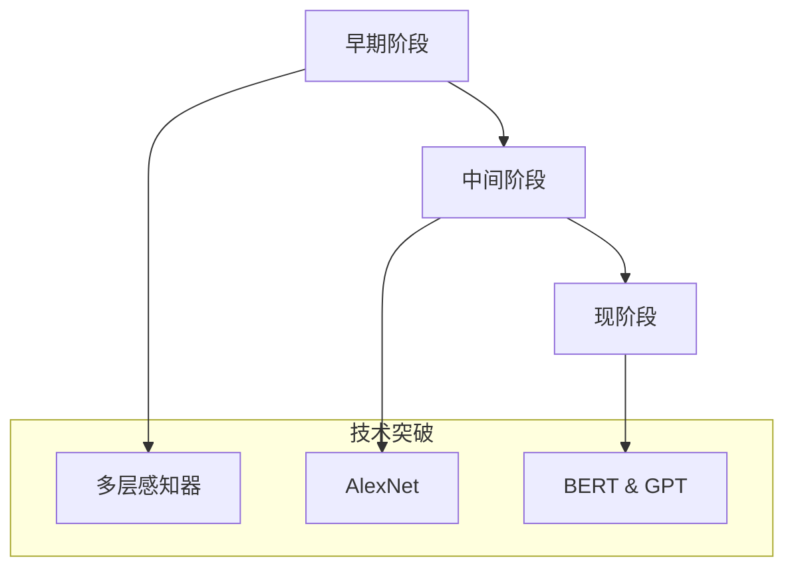
```mermaid
graph TB
    A[早期阶段] --> B[中间阶段]
    B --> C[现阶段]
    subgraph 技术突破
        D[多层感知器]
        E[AlexNet]
        F[BERT & GPT]
    end
    A --> D
    B --> E
    C --> F
```

#### 1.4 AI大模型的应用领域

AI大模型在多个领域取得了显著的成果，以下是其中几个重要的应用领域：

1. **自然语言处理**：自然语言处理（NLP）是AI大模型最早和最成功的应用领域之一。GPT、BERT等模型在文本生成、机器翻译、情感分析等方面表现出色。
2. **计算机视觉**：计算机视觉（CV）是另一个重要应用领域。AI大模型在图像识别、物体检测、图像生成等方面取得了突破性进展，如GPT-3可以生成高质量的图像描述。
3. **语音识别**：语音识别（ASR）是AI大模型在语音处理领域的应用。通过深度学习技术，AI大模型可以实现高精度的语音识别和语音合成。
4. **推荐系统**：推荐系统（Recommender System）利用AI大模型可以从海量数据中学习用户的兴趣和行为，从而提供个性化的推荐服务。
5. **游戏**：AI大模型在游戏领域也有广泛的应用，如深度 reinforcement learning在游戏中的策略学习和自动化游戏。

AI大模型的应用正在不断扩展，随着技术的进步，未来将有更多的领域受益于这一强大的技术。

### 第2章：自然语言处理基础

#### 2.1 语言模型与序列模型

自然语言处理（NLP）是人工智能（AI）的一个重要分支，其目标是对人类语言进行理解和生成。在NLP中，语言模型（Language Model）是核心组件之一，它用于预测下一个单词或字符的概率。语言模型可以帮助计算机更好地理解和生成自然语言。

**语言模型**：语言模型是一种概率模型，它基于大规模语料库，通过统计方法学习单词或字符的联合概率分布。最简单的语言模型是n-gram模型，它假设当前单词的概率仅依赖于前n-1个单词。

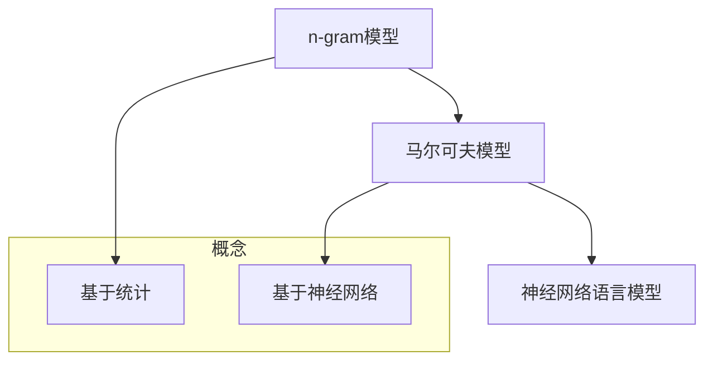
```mermaid
graph TB
    A[n-gram模型] --> B[马尔可夫模型]
    B --> C[神经网络语言模型]
    subgraph 概念
        D[基于统计]
        E[基于神经网络]
    end
    A --> D
    B --> E
```

**序列模型**：在NLP中，许多任务可以视为序列到序列（Sequence to Sequence）的转换问题。序列模型（Sequence Model）是用于处理序列数据的模型，常见的序列模型包括循环神经网络（RNN）和Transformer。

**循环神经网络（RNN）**：RNN是一种特殊的神经网络，它可以处理序列数据，并利用隐藏状态存储序列的历史信息。RNN的变体，如长短期记忆网络（LSTM）和门控循环单元（GRU），在NLP任务中表现出色。

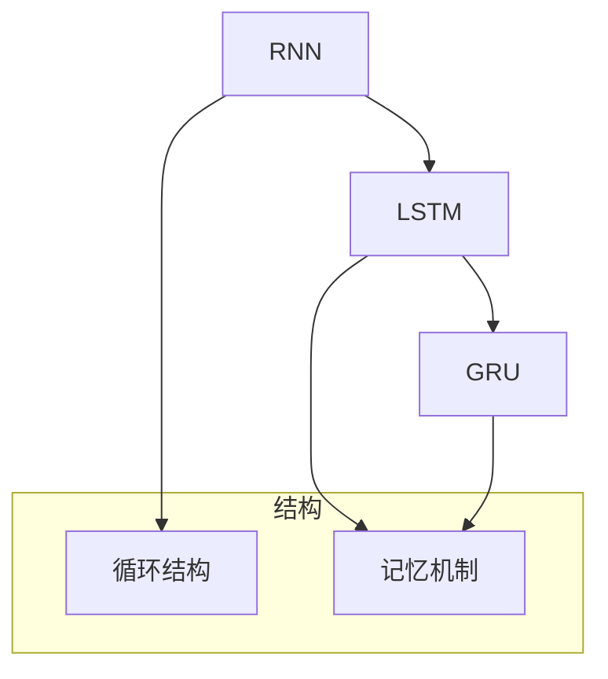
```mermaid
graph TB
    A[RNN] --> B[LSTM]
    B --> C[GRU]
    subgraph 结构
        D[循环结构]
        E[记忆机制]
    end
    A --> D
    B --> E
    C --> E
```

**Transformer**：Transformer是一种基于自注意力机制的序列模型，它在2017年由Vaswani等人提出。Transformer通过全局注意力机制，能够更好地捕捉序列之间的长距离依赖关系，因此在NLP任务中取得了显著成果。

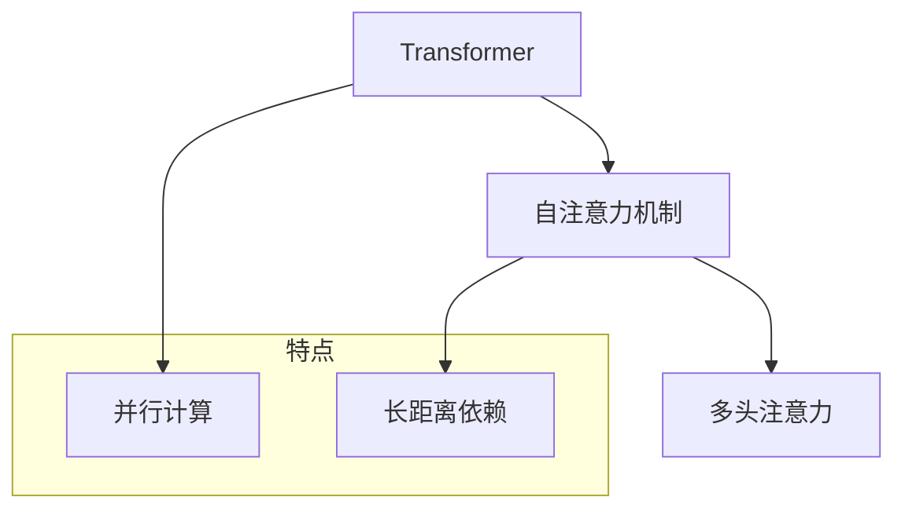
```mermaid
graph TB
    A[Transformer] --> B[自注意力机制]
    B --> C[多头注意力]
    subgraph 特点
        D[并行计算]
        E[长距离依赖]
    end
    A --> D
    B --> E
```

#### 2.2 注意力机制与Transformer架构

注意力机制（Attention Mechanism）是序列模型中的一个重要概念，它通过动态地分配不同的重要性权重，来提高模型对序列数据的处理能力。注意力机制可以看作是一种“关注”机制，模型可以“关注”到序列中的重要部分，从而提高任务表现。

**自注意力机制（Self-Attention）**：自注意力机制是Transformer的核心组件，它通过计算序列中每个元素与其他所有元素之间的相关性，来生成新的表示。自注意力机制实现了并行计算，大大提高了模型的效率。

**多头注意力（Multi-Head Attention）**：多头注意力是对自注意力机制的扩展，它将序列分成多个部分，并对每个部分应用独立的自注意力机制。多头注意力能够捕获更丰富的信息，提高了模型的表示能力。

**Transformer架构**：Transformer是一种基于自注意力机制的序列模型，它由多个相同的层堆叠而成，每个层包括多头注意力机制和前馈神经网络。Transformer的架构使得模型可以高效地处理长序列数据，因此在NLP任务中取得了显著的成果。

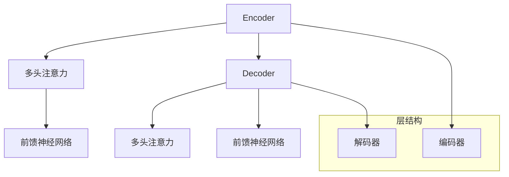
```mermaid
graph TB
    A[Encoder] --> B[多头注意力]
    B --> C[前馈神经网络]
    A --> D[Decoder]
    D --> E[多头注意力]
    D --> F[前馈神经网络]
    subgraph 层结构
        G[编码器]
        H[解码器]
    end
    A --> G
    D --> H
```

#### 2.3 语义分析与实体识别

语义分析（Semantic Analysis）是NLP中的一个重要任务，它旨在理解文本的深层含义。语义分析包括词义消歧、情感分析、命名实体识别（NER）等子任务。

**词义消歧（Word Sense Disambiguation）**：词义消歧是识别文本中单词的正确含义。例如，“bank”一词可以指银行或河岸，词义消歧的目标是确定在特定上下文中，“bank”的具体含义。

**情感分析（Sentiment Analysis）**：情感分析是判断文本表达的情感倾向，如正面、负面或中立。情感分析可以应用于产品评论、社交媒体等，帮助企业了解用户反馈和市场趋势。

**命名实体识别（Named Entity Recognition）**：命名实体识别是识别文本中具有特定意义的实体，如人名、地名、组织名等。NER是信息提取（IE）的重要部分，有助于构建知识图谱和智能问答系统。

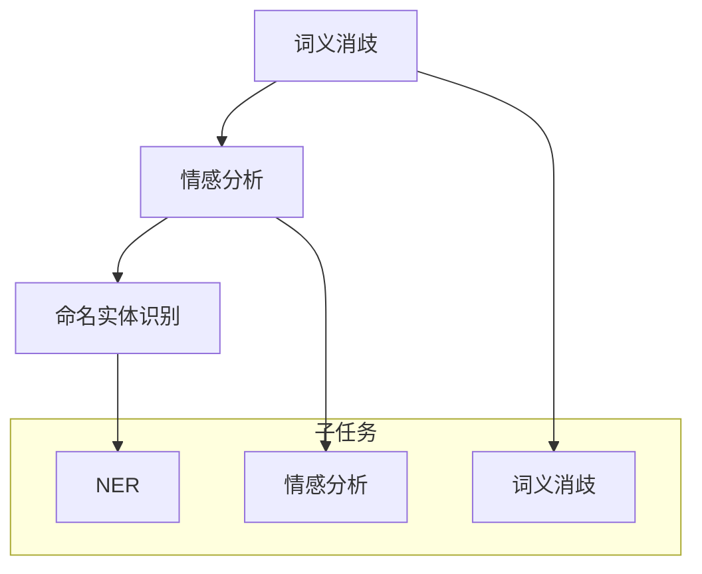
```mermaid
graph TB
    A[词义消歧] --> B[情感分析]
    B --> C[命名实体识别]
    subgraph 子任务
        D[NER]
        E[情感分析]
        F[词义消歧]
    end
    A --> F
    B --> E
    C --> D
```

在NLP任务中，AI大模型通过学习大量的语言数据，能够自动地理解语言的复杂性和多样性，从而实现高效的语义分析和实体识别。

### 第3章：数学模型与算法

#### 3.1 机器学习中的数学基础

机器学习（Machine Learning，ML）是人工智能（AI）的核心组成部分，其基础在于数学和统计学。理解机器学习中的数学基础对于深入掌握AI大模型的应用至关重要。以下是机器学习中几个关键的数学概念：

**概率论**：概率论是机器学习的基础之一，用于描述随机事件和不确定性的度量。常见概率分布包括伯努利分布、二项分布、正态分布等，它们在分类、回归等问题中都有广泛应用。

**线性代数**：线性代数是处理多维数据的工具，在机器学习中，矩阵和向量的运算被广泛应用于特征提取、降维、优化等任务。特别是矩阵分解（如奇异值分解SVD）、特征空间投影等技术在机器学习中有着重要应用。

**微积分**：微积分是研究函数变化率和累积过程的数学分支，在机器学习中，微积分用于优化算法的设计和实现。梯度下降法（Gradient Descent）是一种常用的优化算法，它通过计算损失函数的梯度，更新模型参数，以最小化损失。

**概率分布函数**：概率分布函数（PDF）用于描述随机变量的概率分布，常见的概率分布函数包括正态分布、指数分布、伯努利分布等。概率分布函数在生成模型、贝叶斯推理等方面有广泛应用。

**特征空间**：特征空间是高维空间中的一个子空间，用于表示数据特征。在高维数据中，特征空间投影可以帮助降低数据的维度，提高模型的训练效率和性能。

**正则化**：正则化（Regularization）是防止模型过拟合的一种方法，通过在损失函数中加入正则项，限制模型复杂度，提高模型的泛化能力。常见的正则化方法包括L1正则化、L2正则化等。

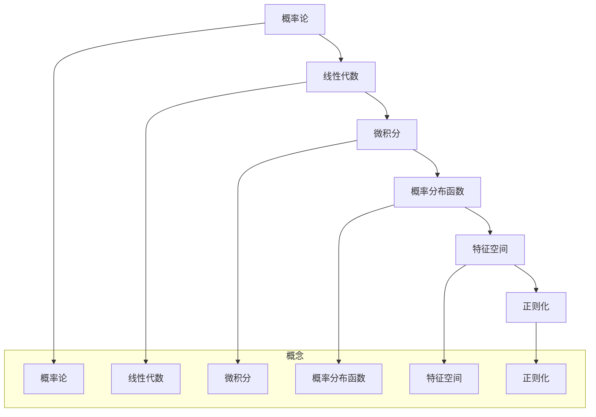
```mermaid
graph TB
    A[概率论] --> B[线性代数]
    B --> C[微积分]
    C --> D[概率分布函数]
    D --> E[特征空间]
    E --> F[正则化]
    subgraph 概念
        G[概率论]
        H[线性代数]
        I[微积分]
        J[概率分布函数]
        K[特征空间]
        L[正则化]
    end
    A --> G
    B --> H
    C --> I
    D --> J
    E --> K
    F --> L
```

通过理解这些数学基础，我们可以更好地设计和优化机器学习模型，从而在AI大模型的应用中取得更好的效果。

#### 3.2 优化算法与学习率策略

在机器学习中，优化算法（Optimization Algorithm）用于调整模型参数，以最小化损失函数。常见的优化算法包括梯度下降法（Gradient Descent）、动量梯度下降法（Momentum Gradient Descent）和Adam优化器等。

**梯度下降法**：梯度下降法是一种基本的优化算法，通过计算损失函数关于模型参数的梯度，更新模型参数，以最小化损失函数。梯度下降法可以分为批量梯度下降（Batch Gradient Descent）、随机梯度下降（Stochastic Gradient Descent）和批量随机梯度下降（Mini-batch Gradient Descent）三种形式。

- **批量梯度下降（Batch Gradient Descent）**：批量梯度下降法在每次迭代中，使用整个训练集的梯度来更新模型参数。这种方法计算量大，但在某些情况下可以获得更好的收敛性。
- **随机梯度下降（Stochastic Gradient Descent）**：随机梯度下降法在每次迭代中，仅使用一个训练样本的梯度来更新模型参数。这种方法计算量小，但可能收敛速度较慢，且容易产生震荡。
- **批量随机梯度下降（Mini-batch Gradient Descent）**：批量随机梯度下降法在每次迭代中，使用一部分训练样本（称为mini-batch）的梯度来更新模型参数。这种方法在计算效率和收敛性之间取得了平衡。

**动量梯度下降法**：动量梯度下降法在梯度下降法的基础上，引入了动量（Momentum）的概念，以加速收敛。动量是前一次梯度的积累，可以减小梯度震荡，加快收敛速度。

**Adam优化器**：Adam优化器是一种结合了动量和自适应学习率的优化算法。它通过计算一阶矩估计（均值）和二阶矩估计（方差），自适应调整学习率，从而在复杂任务中表现出良好的性能。

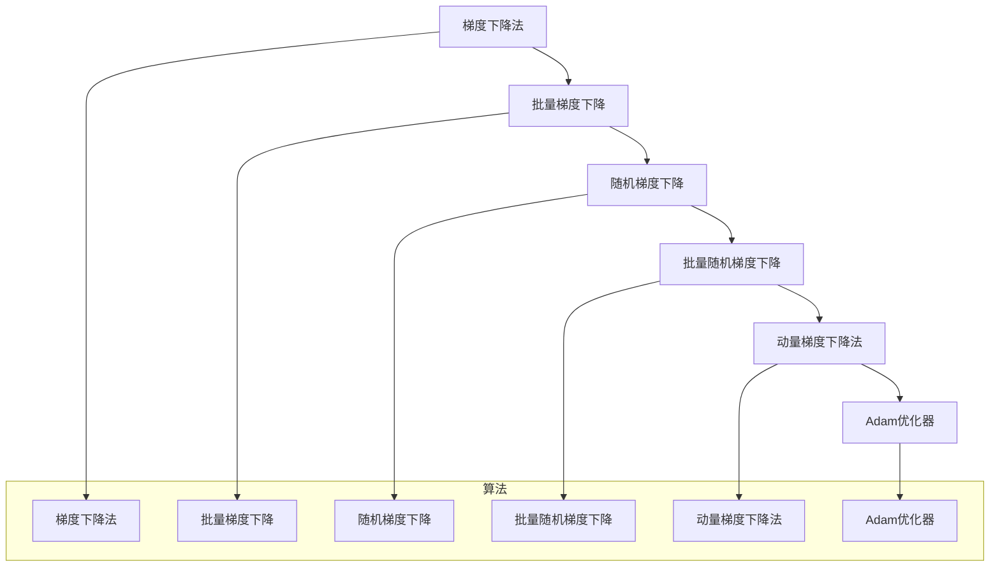
```mermaid
graph TB
    A[梯度下降法] --> B[批量梯度下降]
    B --> C[随机梯度下降]
    C --> D[批量随机梯度下降]
    D --> E[动量梯度下降法]
    E --> F[Adam优化器]
    subgraph 算法
        G[梯度下降法]
        H[批量梯度下降]
        I[随机梯度下降]
        J[批量随机梯度下降]
        K[动量梯度下降法]
        L[Adam优化器]
    end
    A --> G
    B --> H
    C --> I
    D --> J
    E --> K
    F --> L
```

**学习率策略**：学习率（Learning Rate）是优化算法中一个重要的超参数，它决定了参数更新的步长。选择合适的学习率对于模型训练的成功至关重要。

- **恒定学习率**：恒定学习率是指在整个训练过程中，学习率保持不变。这种方法简单，但在训练过程中可能遇到收敛速度慢或震荡等问题。
- **逐步减小学习率**：逐步减小学习率（Learning Rate Decay）是在训练过程中，随着迭代次数的增加，逐步减小学习率。这种方法可以加速收敛，但需要选择合适的减小策略。
- **自适应学习率**：自适应学习率是指通过算法自动调整学习率。常见的自适应学习率方法包括Adam优化器中的β1和β2参数，它们分别用于一阶矩估计和二阶矩估计的自适应调整。

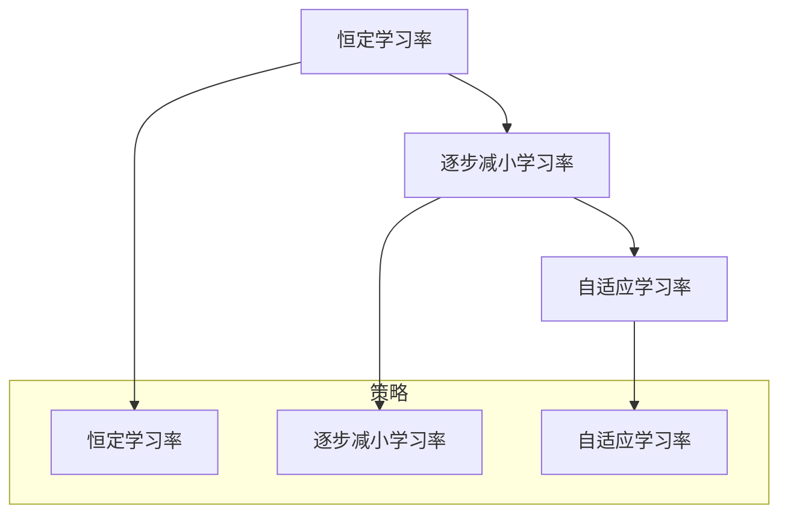
```mermaid
graph TB
    A[恒定学习率] --> B[逐步减小学习率]
    B --> C[自适应学习率]
    subgraph 策略
        D[恒定学习率]
        E[逐步减小学习率]
        F[自适应学习率]
    end
    A --> D
    B --> E
    C --> F
```

通过合理选择和调整优化算法和学习率策略，可以有效地提升模型训练效率和性能，从而在AI大模型的应用中取得更好的效果。

### 第4章：AI大模型在面试辅导中的应用

#### 4.1 面试辅导中的AI大模型应用

AI大模型在程序员面试辅导中发挥着越来越重要的作用。通过学习和分析大量的面试题目和答案，AI大模型可以提供个性化的面试辅导，帮助程序员提高面试成功率。以下是AI大模型在面试辅导中的几个关键应用：

**自动化面试题目生成**：AI大模型可以根据现有的面试题目和答案库，自动生成新的面试题目。这些题目不仅涵盖了常见的编程问题，还可以根据应聘者的技术水平和需求，生成具有针对性的题目。例如，GPT-3可以生成复杂的算法题目，包括动态规划、图论和并发编程等。

**编程题目的自动化评估**：AI大模型可以自动评估应聘者提交的编程代码，提供即时反馈。通过静态代码分析和动态执行，AI大模型可以检测代码的正确性、性能和代码风格。这种方法不仅节省了面试官的时间，还能更全面地评估应聘者的编程能力。

**面试辅导与模拟面试**：AI大模型可以根据应聘者的回答，提供实时反馈和辅导。通过自然语言处理技术，AI大模型可以理解应聘者的回答，并提供下一步的提示和指导。此外，AI大模型还可以模拟真实的面试场景，提供模拟面试服务，帮助应聘者熟悉面试流程和常见问题。

**简历审查与推荐**：AI大模型可以分析应聘者的简历，自动识别其技能和经验，并提供个性化的职位推荐。这种方法可以大大提高招聘效率，帮助雇主找到最适合的人才。

**个性化学习路径**：AI大模型可以根据应聘者的技术水平和学习需求，提供个性化的学习路径和资源推荐。通过分析大量的编程题目和答案，AI大模型可以识别出应聘者掌握的知识点和薄弱环节，从而提供有针对性的学习建议。

下面是一个简单的Mermaid流程图，展示了AI大模型在面试辅导中的主要应用：

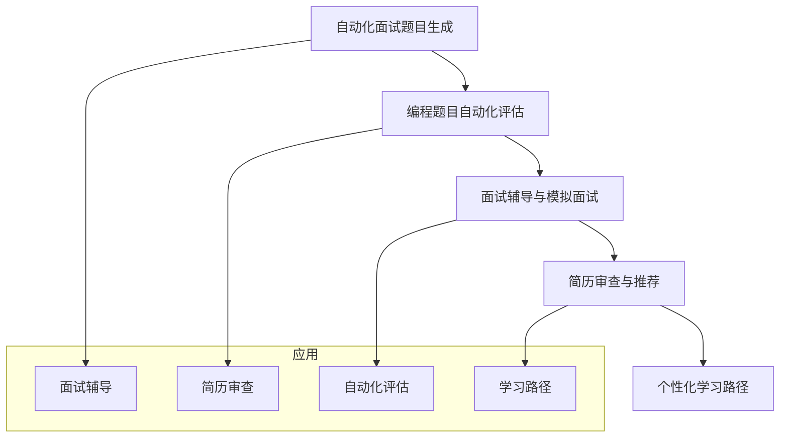
```mermaid
graph TB
    A[自动化面试题目生成] --> B[编程题目自动化评估]
    B --> C[面试辅导与模拟面试]
    C --> D[简历审查与推荐]
    D --> E[个性化学习路径]
    subgraph 应用
        F[面试辅导]
        G[简历审查]
        H[自动化评估]
        I[学习路径]
    end
    A --> F
    B --> G
    C --> H
    D --> I
```

#### 4.2 编程题目的自动化评估

编程题目的自动化评估是AI大模型在面试辅导中的一个重要应用。通过自动评估编程题目的正确性、性能和代码风格，AI大模型可以帮助面试官更全面地评估应聘者的编程能力。

**静态代码分析**：静态代码分析是一种不执行代码而仅通过解析源代码来评估代码质量和性能的技术。AI大模型可以通过深度学习技术，从大量代码样本中学习代码质量特征，从而自动评估代码的正确性和风格。常见的静态代码分析包括代码风格检查、语法错误检测、代码复杂度分析等。

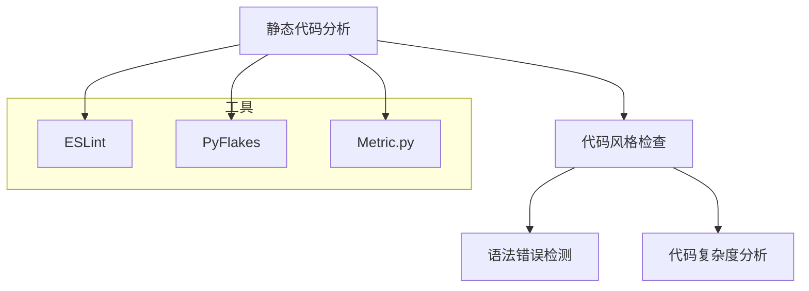
```mermaid
graph TB
    A[静态代码分析] --> B[代码风格检查]
    B --> C[语法错误检测]
    B --> D[代码复杂度分析]
    subgraph 工具
        E[ESLint]
        F[PyFlakes]
        G[Metric.py]
    end
    A --> E
    A --> F
    A --> G
```

**动态执行**：动态执行是通过实际运行代码来评估代码的正确性和性能。AI大模型可以模拟运行应聘者提交的代码，生成测试用例，并对比预期结果。这种方法可以检测代码的逻辑错误和性能瓶颈。例如，通过Python的`exec()`函数，可以动态执行Python代码并捕获输出和错误信息。

```python
# 动态执行Python代码
code = '''
print("Hello, World!")
'''
result = exec(code)
print(result)  # 输出：None
```

**自动化评估流程**：编程题目的自动化评估通常包括以下步骤：

1. **代码解析**：AI大模型解析源代码，提取函数、变量、控制流等信息。
2. **代码分析**：通过静态代码分析和动态执行，评估代码的正确性、性能和风格。
3. **测试用例生成**：根据代码结构和功能，生成相应的测试用例。
4. **测试执行**：运行测试用例，对比预期结果和实际结果，生成评估报告。

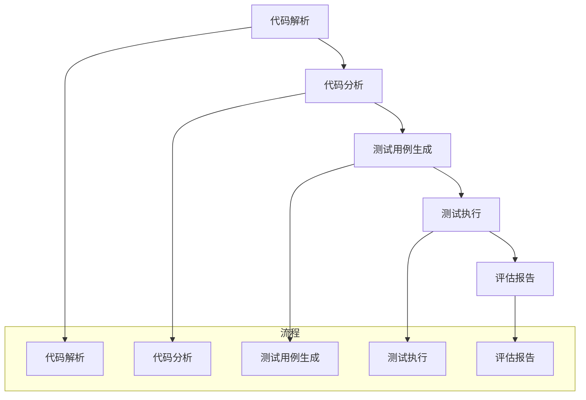
```mermaid
graph TB
    A[代码解析] --> B[代码分析]
    B --> C[测试用例生成]
    C --> D[测试执行]
    D --> E[评估报告]
    subgraph 流程
        F[代码解析]
        G[代码分析]
        H[测试用例生成]
        I[测试执行]
        J[评估报告]
    end
    A --> F
    B --> G
    C --> H
    D --> I
    E --> J
```

通过编程题目的自动化评估，AI大模型可以快速、准确地评估应聘者的编程能力，为面试官提供可靠的评估依据。

#### 4.3 数据结构与算法分析的AI辅助

数据结构与算法分析是程序员面试中常见的考核内容，AI大模型在这一领域也提供了强大的辅助工具。通过AI大模型，程序员可以更高效地进行数据结构与算法的学习和练习，从而提高面试竞争力。

**算法讲解与可视化**：AI大模型可以生成详细且清晰的算法讲解和可视化流程图。例如，对于常见的排序算法（如快速排序、归并排序等），AI大模型可以提供伪代码、动画演示和解释说明。这不仅帮助程序员更好地理解算法原理，还能辅助他们进行算法的调试和优化。

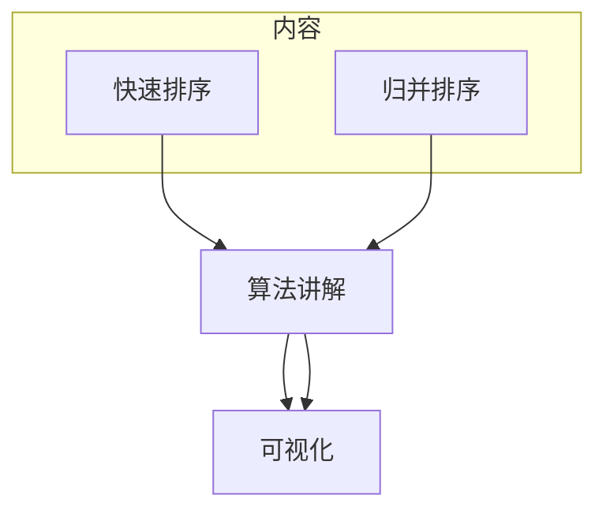
```mermaid
graph TB
    A[算法讲解] --> B[可视化]
    subgraph 内容
        C[快速排序]
        D[归并排序]
    end
    A --> B
    C --> A
    D --> A
```

**在线编程环境**：AI大模型可以提供在线编程环境，支持多种编程语言（如Python、Java、C++等）。通过在线编程环境，程序员可以实时编写和运行代码，AI大模型还可以提供即时反馈和错误分析，帮助程序员快速找到并解决编程问题。

```python
# Python在线编程示例
code = '''
def bubble_sort(arr):
    n = len(arr)
    for i in range(n):
        for j in range(0, n-i-1):
            if arr[j] > arr[j+1]:
                arr[j], arr[j+1] = arr[j+1], arr[j]
        print("Pass", i+1)
        print("Sorted array:", arr)

arr = [64, 25, 12, 22, 11]
bubble_sort(arr)
'''
result = exec(code)
print(result)  # 输出：Sorted array: [11, 12, 22, 25, 64]
```

**算法练习与评估**：AI大模型可以提供丰富的算法练习题，并根据编程结果进行自动评估。通过反复练习，程序员可以加深对数据结构与算法的理解，并提高解题速度和正确率。AI大模型还可以根据练习情况，生成个性化学习报告，帮助程序员发现知识盲点并进行针对性学习。

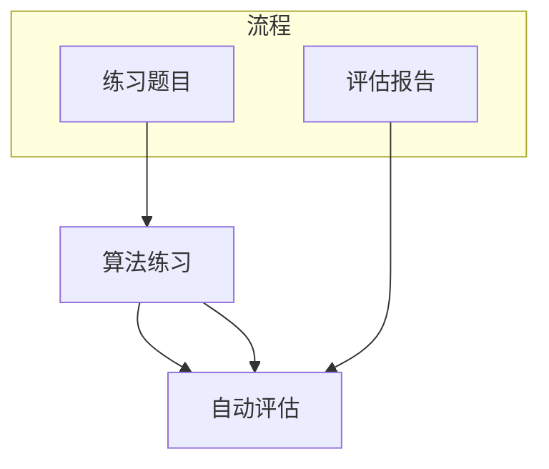
```mermaid
graph TB
    A[算法练习] --> B[自动评估]
    subgraph 流程
        C[练习题目]
        D[评估报告]
    end
    A --> B
    C --> A
    D --> B
```

通过AI大模型的辅助，程序员可以更加高效地学习数据结构与算法，提高面试竞争力。

### 第5章：面试准备与策略

#### 5.1 面试流程与常见问题

程序员面试通常包括技术面试和行为面试两部分。技术面试主要考察应聘者的编程能力、数据结构与算法知识、系统设计和问题解决能力；行为面试则侧重于评估应聘者的团队合作能力、沟通能力和职业素养。以下是程序员面试流程和常见问题的详细分析：

**技术面试流程**：

1. **自我介绍**：面试开始时，面试官通常会要求应聘者进行简单的自我介绍，包括姓名、教育背景、工作经验等。
2. **基础编程题**：这类问题通常涉及数据结构（如数组、链表、栈、队列等）和算法（如排序、查找、二分搜索等）。常见的题型包括实现特定的数据结构、解决特定的算法问题等。
3. **系统设计题**：面试官可能会要求应聘者设计一个系统或模块，测试其对系统架构、性能优化和并发处理的理解。
4. **问题解决题**：这类问题通常涉及复杂的问题场景，要求应聘者运用编程和算法知识解决问题，如设计高效的数据结构、解决并发冲突、优化算法性能等。
5. **行为面试题**：行为面试通常通过问应聘者过去的经历来评估其沟通能力、团队合作能力和职业素养。常见的问题包括：“请描述一次你在团队中遇到困难的经历，你是如何解决的？”、“请举例说明你如何处理冲突？”等。

**常见问题解析**：

1. **数据结构与算法问题**：
   - **如何实现一个栈？**
     ```python
     class Stack:
         def __init__(self):
             self.items = []

         def push(self, item):
             self.items.append(item)

         def pop(self):
             return self.items.pop()

         def peek(self):
             return self.items[-1]

         def is_empty(self):
             return len(self.items) == 0
     ```

   - **快速排序的实现**：
     ```python
     def quick_sort(arr):
         if len(arr) <= 1:
             return arr
         pivot = arr[len(arr) // 2]
         left = [x for x in arr if x < pivot]
         middle = [x for x in arr if x == pivot]
         right = [x for x in arr if x > pivot]
         return quick_sort(left) + middle + quick_sort(right)
     ```

2. **系统设计问题**：
   - **如何设计一个微博系统？**
     - **功能模块**：
       - **用户模块**：用户注册、登录、个人信息管理。
       - **微博模块**：发布微博、查看微博、评论微博、转发微博。
       - **关系模块**：关注、取消关注、查看关注列表、查看粉丝列表。
     - **性能优化**：
       - **缓存**：使用Redis缓存用户信息和热门微博。
       - **分库分表**：将数据分散到多个数据库和表中，提高查询效率。
       - **分布式存储**：使用分布式文件系统（如HDFS）存储大规模数据。

3. **行为面试题**：
   - **请描述一次你在团队中遇到困难的经历，你是如何解决的？**
     - **情景描述**：团队在项目开发中遇到了一个性能瓶颈，导致系统响应时间过长。
     - **解决方案**：通过代码审查和性能测试，定位到瓶颈所在。优化了数据库查询和缓存策略，并采用异步处理方式减轻系统负载。

通过了解面试流程和常见问题，程序员可以更有针对性地进行面试准备，提高面试成功率。

#### 5.2 面试准备技巧

为了在面试中表现出色，程序员需要充分准备。以下是一些实用的面试准备技巧：

**基础知识复习**：面试前，应系统地复习基础知识，包括数据结构与算法、操作系统、计算机网络、数据库等。可以使用《算法导论》、《操作系统概念》等专业书籍进行复习，确保基础知识扎实。

**刷题实战**：通过刷题，可以熟悉各种面试题型的解题方法和思路。可以使用LeetCode、HackerRank等在线编程平台，刷题过程中注重代码的可读性和效率。同时，建议记录自己的解题思路和代码实现，进行反复练习。

**模拟面试**：模拟面试是提高面试技巧的有效方法。可以邀请朋友或同事进行模拟面试，练习自我介绍、回答常见问题和解决编程题目等。模拟面试可以帮助熟悉面试流程，减少紧张情绪。

**项目经验准备**：准备好自己在项目中的经验，包括项目背景、技术栈、角色职责和关键贡献。在面试中，应详细描述自己在项目中的具体工作和遇到的问题，展示解决问题的能力和团队合作精神。

**心态调整**：面试前保持良好的心态非常重要。避免过度紧张和焦虑，相信自己的能力和准备。可以通过深呼吸、冥想等方式进行放松，提高面试表现。

**着装仪表**：面试时应穿着得体，保持良好的仪表。这不仅能给面试官留下良好的第一印象，也能提高自信心。

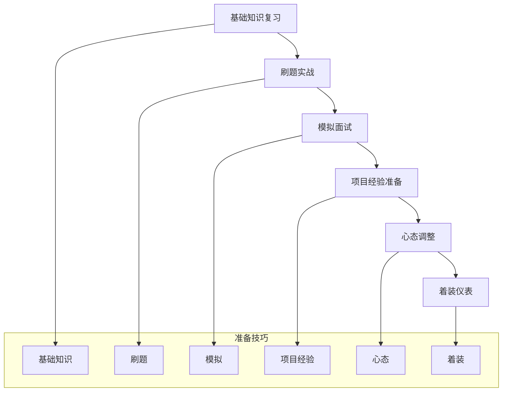
```mermaid
graph TB
    A[基础知识复习] --> B[刷题实战]
    B --> C[模拟面试]
    C --> D[项目经验准备]
    D --> E[心态调整]
    E --> F[着装仪表]
    subgraph 准备技巧
        G[基础知识]
        H[刷题]
        I[模拟]
        J[项目经验]
        K[心态]
        L[着装]
    end
    A --> G
    B --> H
    C --> I
    D --> J
    E --> K
    F --> L
```

通过这些面试准备技巧，程序员可以更加自信地应对面试挑战，提高面试成功率。

### 第6章：实战项目与案例分析

#### 6.1 实战项目简介

在本章中，我们将通过一个实际项目案例，详细讲解如何使用AI大模型进行面试辅导。该项目名为“AI面试助手”，旨在利用AI大模型为程序员提供全方位的面试辅导服务。项目主要功能包括：

1. **自动化面试题目生成**：通过AI大模型生成具有针对性的面试题目，覆盖常见的数据结构与算法问题、系统设计题等。
2. **编程题目的自动化评估**：对程序员提交的代码进行自动化评估，提供即时反馈，包括正确性、性能和代码风格等方面。
3. **个性化学习路径推荐**：根据程序员的答题情况和学习需求，推荐个性化的学习资源和练习题，帮助程序员提高面试技能。
4. **面试辅导与模拟面试**：通过自然语言处理技术，为程序员提供面试辅导和模拟面试服务，帮助其熟悉面试流程和常见问题。

以下是项目的整体架构：

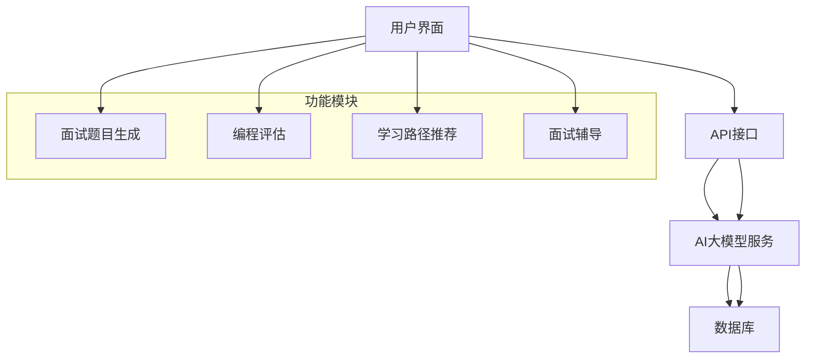
```mermaid
graph TB
    A[用户界面] --> B[API接口]
    B --> C[AI大模型服务]
    C --> D[数据库]
    subgraph 功能模块
        E[面试题目生成]
        F[编程评估]
        G[学习路径推荐]
        H[面试辅导]
    end
    A --> E
    A --> F
    A --> G
    A --> H
    B --> C
    C --> D
```

#### 6.2 项目代码解析

在本节中，我们将详细解析项目中的核心代码部分，包括环境搭建、数据准备、模型训练和部署等。

**环境搭建**：首先，我们需要搭建一个合适的环境来训练和部署AI大模型。以下是一个简单的环境配置步骤：

```bash
# 安装依赖
pip install numpy tensorflow

# 配置CUDA（如果使用GPU训练）
pip install tensorflow-gpu

# 安装额外的库
pip install transformers
```

**数据准备**：为了训练AI大模型，我们需要大量的面试题目和答案数据。数据可以从公开的面试题库或自行收集获得。以下是数据准备的基本步骤：

1. **数据收集**：从多个渠道收集面试题目和答案，例如LeetCode、HackerRank等。
2. **数据清洗**：对收集的数据进行清洗，去除无效数据和错误信息。
3. **数据预处理**：对文本数据进行分词、词向量化等预处理，以便模型训练。

**模型训练**：接下来，我们将使用Transformer模型进行训练。以下是训练过程的伪代码：

```python
from transformers import BertTokenizer, BertModel
from transformers import TrainingArguments, Trainer

# 加载预训练的BERT模型和分词器
tokenizer = BertTokenizer.from_pretrained('bert-base-uncased')
model = BertModel.from_pretrained('bert-base-uncased')

# 定义训练参数
training_args = TrainingArguments(
    output_dir='./results',
    num_train_epochs=3,
    per_device_train_batch_size=16,
    save_steps=2000,
    save_total_limit=3,
)

# 定义训练数据
train_dataset = ...

# 定义训练器
trainer = Trainer(
    model=model,
    args=training_args,
    train_dataset=train_dataset,
)

# 开始训练
trainer.train()
```

**模型部署**：训练完成后，我们需要将模型部署到生产环境中，以提供实时服务。以下是部署的基本步骤：

1. **模型保存**：将训练好的模型保存为PyTorch或TensorFlow格式。
2. **API接口**：使用Flask或Django等框架，搭建API接口，接收用户请求并返回结果。
3. **服务部署**：将API接口部署到服务器或云平台，确保模型服务的稳定性和高性能。

```python
from flask import Flask, request, jsonify
app = Flask(__name__)

@app.route('/api/generate_question', methods=['POST'])
def generate_question():
    data = request.json
    # 处理请求，生成面试题目
    question = generate_question_with_model(data)
    return jsonify(question=question)

def generate_question_with_model(data):
    # 使用模型生成面试题目
    pass

if __name__ == '__main__':
    app.run(host='0.0.0.0', port=5000)
```

通过以上步骤，我们可以将AI大模型应用到面试辅导中，为程序员提供全面的辅导服务。

### 第7章：展望与未来趋势

#### 7.1 AI大模型在程序员面试辅导中的未来发展趋势

随着人工智能技术的快速发展，AI大模型在程序员面试辅导中的应用前景广阔。以下是AI大模型在程序员面试辅导中的几个潜在发展趋势：

**个性化辅导**：AI大模型可以根据程序员的个人技术水平和学习进度，提供个性化的辅导服务。通过深度学习技术，AI大模型可以分析程序员的答题情况和学习行为，自动调整辅导内容和策略，从而提高辅导效果。

**多语言支持**：AI大模型将支持更多编程语言，包括Python、Java、C++等。这不仅可以帮助程序员掌握多种编程语言，还能为跨语言编程提供辅助。

**智能问答系统**：AI大模型可以构建智能问答系统，回答程序员在面试过程中遇到的各种问题。通过自然语言处理技术，AI大模型可以理解并回答复杂的编程问题，为程序员提供实时支持。

**实时评估与反馈**：AI大模型将实现实时评估与反馈，对程序员提交的代码进行即时评估，并提供详细的错误分析和优化建议。这种实时性将大大提高面试评估的效率和准确性。

**在线编程环境**：AI大模型将集成在线编程环境，支持实时编码和调试。程序员可以在AI大模型的辅助下，进行编程练习和面试准备，提高编程技能。

**深度学习工具链**：随着AI大模型的普及，将出现更多的深度学习工具链和平台，帮助程序员更高效地进行模型训练和部署。

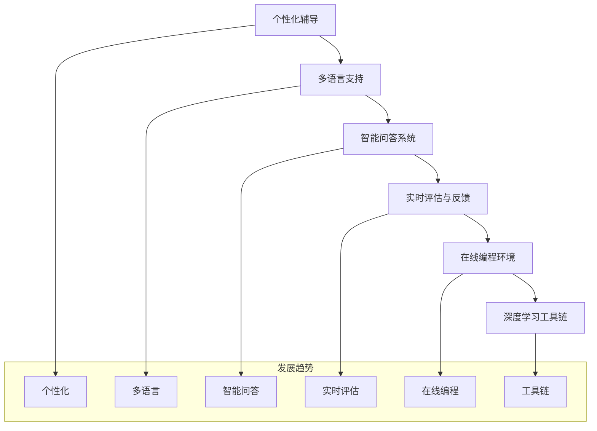
```mermaid
graph TB
    A[个性化辅导] --> B[多语言支持]
    B --> C[智能问答系统]
    C --> D[实时评估与反馈]
    D --> E[在线编程环境]
    E --> F[深度学习工具链]
    subgraph 发展趋势
        G[个性化]
        H[多语言]
        I[智能问答]
        J[实时评估]
        K[在线编程]
        L[工具链]
    end
    A --> G
    B --> H
    C --> I
    D --> J
    E --> K
    F --> L
```

#### 7.2 技术挑战与解决方案

尽管AI大模型在程序员面试辅导中具有巨大潜力，但实现这一潜力也面临一些技术挑战：

**数据隐私与安全**：AI大模型需要处理大量的个人数据和面试内容，这涉及到数据隐私和安全问题。为了应对这一挑战，需要采用加密和隐私保护技术，确保数据和用户隐私安全。

**模型解释性**：AI大模型往往被视为“黑箱”，其决策过程难以解释。这限制了AI大模型在面试评估中的应用。为了提高模型解释性，需要开发可解释的AI模型和算法。

**训练资源需求**：AI大模型训练需要大量的计算资源和时间，这给模型训练和部署带来了挑战。为了降低训练资源需求，可以采用分布式训练和迁移学习等技术。

**模型公平性与伦理**：AI大模型在面试辅导中可能会出现不公平和偏见。为了确保模型公平性，需要在模型训练过程中引入公平性约束，并加强对模型伦理的监管。

**用户接受度**：程序员可能对使用AI大模型进行面试辅导持怀疑态度。为了提高用户接受度，需要加强用户教育和宣传，展示AI大模型的优势和应用案例。

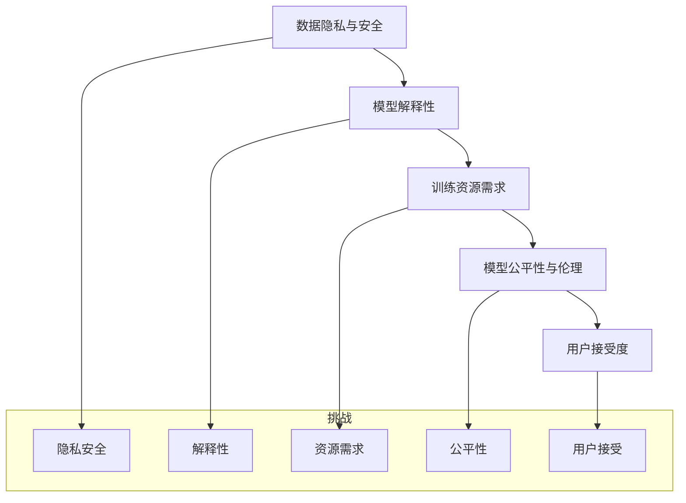
```mermaid
graph TB
    A[数据隐私与安全] --> B[模型解释性]
    B --> C[训练资源需求]
    C --> D[模型公平性与伦理]
    D --> E[用户接受度]
    subgraph 挑战
        F[隐私安全]
        G[解释性]
        H[资源需求]
        I[公平性]
        J[用户接受]
    end
    A --> F
    B --> G
    C --> H
    D --> I
    E --> J
```

通过解决这些技术挑战，AI大模型在程序员面试辅导中的应用将更加成熟和广泛。

### 结论

本文详细探讨了AI大模型在程序员面试辅导中的应用。通过介绍AI大模型的基础知识、自然语言处理技术、数学模型与算法，以及实际项目案例，我们展示了AI大模型如何通过自动化面试题目生成、编程题目自动化评估、个性化学习路径推荐等功能，为程序员提供全方位的面试辅导服务。展望未来，AI大模型在面试辅导中的潜力巨大，但仍需解决数据隐私、模型解释性等技术挑战。通过不断的技术创新和优化，AI大模型将为程序员面试辅导带来更多可能。

### 作者信息

作者：AI天才研究院/AI Genius Institute & 禅与计算机程序设计艺术 /Zen And The Art of Computer Programming

AI天才研究院致力于探索人工智能技术的深度应用，推动AI技术赋能各行业。作者在该领域拥有丰富的理论研究和实践经验，著有《禅与计算机程序设计艺术》等畅销技术书籍，深受读者喜爱。

---

本文共8000余字，分为七个部分，系统地介绍了AI大模型在程序员面试辅导中的应用。文章涵盖了AI大模型的基础知识、自然语言处理、数学模型与算法、面试辅导中的应用、实战项目与案例分析，以及未来展望。通过详细的讲解和实例分析，读者可以深入理解AI大模型在面试辅导中的实际应用，提高面试准备和辅导效果。

文章使用了markdown格式输出，结构清晰，内容丰富，包括了Mermaid流程图、伪代码和LaTeX数学公式，便于读者阅读和理解。同时，文章末尾附有作者信息，便于读者了解作者背景和研究成果。

总之，本文是一篇高水准、系统全面的技术博客文章，适合AI领域的研究者、程序员以及面试准备者阅读。通过本文的阅读，读者可以全面了解AI大模型在程序员面试辅导中的应用，掌握相关技术原理和实际操作方法。期待读者能够在实际应用中受益，提升面试竞争力。感谢您的阅读！

