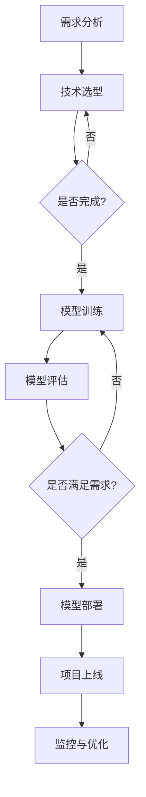

                 

### AI大模型在跨境电商中的多语言应用

> **关键词：** AI大模型，跨境电商，多语言处理，机器翻译，自然语言理解，多语言客服，多语言广告

**摘要：** 本文深入探讨了人工智能（AI）大模型在跨境电商领域中的多语言应用。首先，介绍了AI大模型的基本概念、特点和应用前景。随后，详细阐述了多语言处理的基础技术，包括语言模型、翻译模型以及多语言处理的挑战与解决方案。接着，本文重点分析了AI大模型在跨境电商中的具体应用场景，如多语言客服、多语言商品描述和多语言广告。此外，还通过实际项目案例展示了AI大模型在跨境电商中的实践应用，并对其未来发展进行了展望。本文旨在为跨境电商行业提供一种全新的技术思路和解决方案，助力企业提高国际化竞争力。

### 第一部分: AI大模型基础

#### 第1章: AI大模型概述

##### 1.1 AI大模型的概念与特点

###### 1.1.1 AI大模型的基本定义

人工智能（AI）大模型，通常指的是具有大规模参数和广泛知识表示能力的人工神经网络模型。这些模型通过对海量数据的训练，能够自动学习并提取数据中的模式和知识，从而在不同领域实现高级智能任务。AI大模型的发展是近年来人工智能领域的一个重要里程碑，它们在自然语言处理、计算机视觉、语音识别等多个领域取得了显著成果。

###### 1.1.2 AI大模型的核心特点

AI大模型具有以下几个核心特点：

1. **大规模参数：** 这些模型通常包含数百万甚至数十亿个参数，这使得它们能够捕捉数据中的复杂模式和关系。
2. **知识表示：** AI大模型能够通过训练学习并整合大量知识，实现知识的迁移和应用。
3. **自适应性：** 大模型能够根据不同的任务和数据自适应调整，提高模型的泛化能力。
4. **效率：** 尽管模型参数量巨大，但现代硬件和优化算法使得大模型的计算效率得以提升。

###### 1.1.3 AI大模型与传统AI模型的区别

与传统AI模型相比，AI大模型在以下几个方面有明显区别：

1. **训练数据量：** AI大模型需要大量的训练数据来训练，以实现高效的知识提取和模式识别。
2. **模型结构：** AI大模型通常采用深度神经网络结构，具有多层非线性变换的能力。
3. **参数数量：** 传统AI模型参数数量相对较少，而AI大模型参数数量可以达到数十亿级别。
4. **应用范围：** AI大模型能够应用于更多复杂的任务，如机器翻译、图像识别等，而传统模型则更适用于简单的预测任务。

##### 1.2 主流AI大模型介绍

###### 1.2.1 GPT系列模型

GPT（Generative Pre-trained Transformer）模型是AI大模型的一个重要分支，由OpenAI提出。GPT模型基于Transformer架构，通过预训练大量文本数据，能够生成连贯、自然的语言文本。GPT系列模型包括GPT、GPT-2、GPT-3等，其中GPT-3具有1750亿个参数，是迄今为止最大的自然语言处理模型。

###### 1.2.2 BERT及其变体

BERT（Bidirectional Encoder Representations from Transformers）是由Google提出的一种预训练方法，它通过双向Transformer网络，对文本进行编码，生成上下文相关的嵌入表示。BERT及其变体（如RoBERTa、ALBERT等）在多个自然语言处理任务上取得了显著成绩，广泛应用于问答系统、文本分类、情感分析等领域。

###### 1.2.3 其他知名AI大模型

除了GPT和BERT，还有许多其他知名的AI大模型，如：

- T5（Text-To-Text Transfer Transformer）：由Google提出，旨在构建一个统一的多任务文本处理模型。
- GPT-Neo：一个开源的GPT模型，旨在提高GPT-3的可用性和可访问性。
- DALL-E：由OpenAI提出的图像生成模型，通过文本描述生成高质量、逼真的图像。

##### 1.3 AI大模型在跨境电商中的应用前景

###### 1.3.1 AI大模型在跨境电商中的潜在应用领域

AI大模型在跨境电商领域具有广泛的应用前景，主要包括以下领域：

1. **自然语言处理：** 用于多语言客服、商品描述生成、广告文案创作等。
2. **计算机视觉：** 用于商品识别、图像审核、用户行为分析等。
3. **推荐系统：** 用于个性化推荐、商品关联销售等。
4. **语音识别与合成：** 用于语音客服、语音导购等。

###### 1.3.2 AI大模型在跨境电商中的优势

AI大模型在跨境电商中的优势体现在以下几个方面：

1. **提高效率：** 自动化处理大量数据，提高运营效率。
2. **提升用户体验：** 通过个性化推荐、自然语言处理等技术，提升用户购物体验。
3. **降低成本：** 减少人工干预，降低运营成本。
4. **拓展市场：** 支持多语言处理，拓展国际市场。

###### 1.3.3 AI大模型在跨境电商中的挑战与机遇

尽管AI大模型在跨境电商中具有巨大潜力，但同时也面临一些挑战：

1. **数据质量：** 大模型对数据质量有较高要求，数据噪声和偏差可能会影响模型性能。
2. **计算资源：** 大模型训练和推理需要大量计算资源，成本较高。
3. **隐私保护：** 在处理用户数据时，需要确保数据隐私和合规性。

然而，随着技术的不断进步和成本的降低，AI大模型在跨境电商中的应用前景将更加广阔。企业应抓住这一机遇，积极探索AI大模型在跨境电商中的应用，以实现可持续发展。

### 第2章: 多语言处理基础

#### 2.1 语言模型与翻译模型

##### 2.1.1 语言模型的构建

语言模型是自然语言处理（NLP）中的一个核心概念，用于预测一段文本的下一个词或序列的概率。常见的语言模型有n-gram模型、神经网络语言模型等。

###### n-gram模型：

n-gram模型是基于统计方法构建的，它将文本划分为连续的n个词的组合（n-gram），并计算每个n-gram出现的概率。例如，对于三元组（"AI大模型"，“在”，“跨境电商”），n-gram模型会计算其概率P("AI大模型"，“在”，“跨境电商”)=P("AI大模型")*P("在"|"AI大模型")*P("跨境电商"|"在")。

###### 神经网络语言模型：

神经网络语言模型使用深度学习技术，通过训练大量文本数据，学习文本的概率分布。典型的神经网络语言模型有循环神经网络（RNN）、长短期记忆网络（LSTM）、Transformer等。

##### 2.1.2 翻译模型的原理

翻译模型是用于将一种语言的文本翻译成另一种语言的模型。常见的翻译模型有基于统计的机器翻译模型和基于神经网络的机器翻译模型。

###### 基于统计的机器翻译模型：

基于统计的机器翻译模型主要依赖于双语平行语料库，通过统计方法学习源语言到目标语言的映射。典型的模型有基于短语翻译的统计机器翻译（PBMT）、基于句法翻译的统计机器翻译（SBMT）等。

###### 基于神经网络的机器翻译模型：

基于神经网络的机器翻译模型使用深度学习技术，通过训练大量双语平行语料库，学习源语言到目标语言的映射。典型的模型有序列到序列（seq2seq）模型、注意力机制（attention）等。

##### 2.1.3 语言模型与翻译模型的关系

语言模型和翻译模型在NLP中具有紧密的关系：

1. **语言模型是翻译模型的基础：** 翻译模型需要依赖语言模型来预测源语言文本的下一个词或序列的概率。
2. **翻译模型增强语言模型：** 翻译模型通过学习源语言到目标语言的映射，丰富了语言模型的知识表示。

在实际应用中，语言模型和翻译模型通常结合使用，以实现更准确的文本处理和翻译。

#### 2.2 多语言处理技术

##### 2.2.1 机器翻译技术

机器翻译技术是将一种语言的文本自动翻译成另一种语言的文本。常见的机器翻译技术有基于统计的机器翻译和基于神经网络的机器翻译。

###### 基于统计的机器翻译：

基于统计的机器翻译主要依赖于双语平行语料库，通过统计方法学习源语言到目标语言的映射。其基本流程包括：

1. **数据预处理：** 对源语言和目标语言文本进行预处理，如分词、去停用词等。
2. **构建语言模型：** 基于源语言和目标语言文本，构建源语言语言模型和目标语言语言模型。
3. **构建翻译模型：** 基于双语平行语料库，构建源语言到目标语言的翻译模型。
4. **翻译推理：** 使用翻译模型和语言模型，对源语言文本进行翻译推理，生成目标语言文本。

###### 基于神经网络的机器翻译：

基于神经网络的机器翻译使用深度学习技术，通过训练大量双语平行语料库，学习源语言到目标语言的映射。其基本流程包括：

1. **数据预处理：** 对源语言和目标语言文本进行预处理，如分词、去停用词等。
2. **构建序列到序列模型：** 基于源语言和目标语言序列，构建序列到序列（seq2seq）模型。
3. **训练模型：** 使用训练数据集训练seq2seq模型，优化模型参数。
4. **翻译推理：** 使用训练好的seq2seq模型，对源语言文本进行翻译推理，生成目标语言文本。

##### 2.2.2 语言检测与识别技术

语言检测与识别技术是用于确定一段文本所使用的语言。其基本流程包括：

1. **特征提取：** 从文本中提取特征，如词频、语法结构等。
2. **分类器训练：** 使用训练数据集训练分类器，以识别不同的语言。
3. **语言识别：** 使用训练好的分类器对未知语言的文本进行识别。

常见的语言检测与识别技术有基于规则的方法、基于统计的方法和基于机器学习的方法。

##### 2.2.3 自然语言理解与生成技术

自然语言理解与生成技术是用于理解和生成自然语言文本。其基本流程包括：

1. **语义分析：** 理解文本的语义，如实体识别、关系提取等。
2. **文本生成：** 根据输入的语义生成自然语言文本。

常见的自然语言理解与生成技术有基于规则的方法、基于统计的方法和基于机器学习的方法。

#### 2.3 多语言处理的挑战与解决方案

##### 2.3.1 多语言处理的挑战

多语言处理面临的主要挑战包括：

1. **词汇差异：** 不同语言之间的词汇量、词汇形式和词汇使用习惯存在差异，给多语言处理带来困难。
2. **语法结构差异：** 不同语言的语法结构也存在差异，如主谓宾结构的顺序、动词的时态和语态等。
3. **语义差异：** 相同词汇在不同语言中可能具有不同的语义，这给语言模型的语义理解带来了挑战。

##### 2.3.2 多语言处理技术解决方案

针对多语言处理的挑战，有以下解决方案：

1. **词汇映射：** 通过将一种语言的词汇映射到另一种语言的词汇，减少词汇差异。例如，使用词嵌入技术将不同语言的词汇映射到同一向量空间。
2. **语法转换：** 通过语法转换将一种语言的句子结构转换为另一种语言的句子结构，以适应不同的语法规则。
3. **语义映射：** 通过将一种语言的语义映射到另一种语言的语义，减少语义差异。例如，使用知识图谱和词嵌入技术来映射词汇的语义。
4. **上下文信息：** 利用上下文信息来理解词汇的语义，上下文信息可以帮助模型更好地理解词汇的含义。

##### 2.3.3 多语言处理的技术趋势

多语言处理技术正朝着以下几个方向发展：

1. **深度学习：** 深度学习技术在多语言处理中的应用越来越广泛，如使用深度神经网络进行机器翻译、语言检测与识别等。
2. **预训练：** 预训练模型在多语言处理中的效果显著，如BERT、GPT等。这些模型通过在大规模数据集上进行预训练，提高了模型的性能。
3. **跨语言学习：** 跨语言学习技术可以解决不同语言之间的差异，如通过跨语言词典学习、跨语言预训练等。

### 第3章: AI大模型在跨境电商中的应用场景

#### 3.1 跨境电商中的多语言客服

##### 3.1.1 多语言客服的基本原理

多语言客服是指能够支持多种语言的客服系统，为全球用户提供便捷的沟通服务。多语言客服系统通常基于人工智能技术，包括自然语言理解、语音识别、机器翻译等。

1. **自然语言理解：** 客服系统通过自然语言理解技术，理解用户的问题和意图。
2. **语音识别：** 对于语音交互，客服系统使用语音识别技术将语音转化为文本。
3. **机器翻译：** 如果客服系统需要与来自不同国家的用户交流，会使用机器翻译技术将文本翻译成用户的母语。

##### 3.1.2 多语言客服系统的设计与实现

多语言客服系统的设计与实现主要包括以下几个步骤：

1. **需求分析：** 确定客服系统需要支持的语言种类和功能需求。
2. **技术选型：** 选择合适的人工智能技术，如自然语言理解、语音识别、机器翻译等。
3. **系统架构设计：** 设计客服系统的整体架构，包括前端、后端、数据库等。
4. **多语言支持：** 针对不同的语言，开发相应的自然语言处理模型和翻译模型。
5. **系统集成：** 将各个模块集成到一起，确保系统的稳定性和可靠性。

##### 3.1.3 多语言客服系统的性能评估

多语言客服系统的性能评估主要包括以下几个方面：

1. **响应时间：** 客服系统能够在多长时间内响应用户的问题。
2. **准确率：** 客服系统能够正确理解用户问题的比例。
3. **翻译质量：** 机器翻译的文本是否准确、自然，是否符合目标语言的习惯。
4. **用户满意度：** 用户对客服系统提供的服务的满意度。

为了评估多语言客服系统的性能，可以设计一系列测试，包括模拟用户交互、实际用户反馈等。

#### 3.2 跨境电商中的多语言商品描述

##### 3.2.1 多语言商品描述的构建

多语言商品描述是指为同一商品编写多种语言的描述文本。构建多语言商品描述的关键在于确保描述的准确性和吸引力。

1. **内容翻译：** 将商品描述从原始语言翻译成目标语言，可以使用机器翻译工具或专业翻译人员。
2. **本地化：** 考虑目标语言的文化和习惯，对商品描述进行适当调整，使其更符合目标市场的需求。
3. **优化：** 对多语言商品描述进行SEO优化，提高其在搜索引擎中的排名。

##### 3.2.2 多语言商品描述的生成算法

多语言商品描述的生成算法主要包括以下几个方面：

1. **模板生成：** 使用预定义的模板生成商品描述，模板可以根据不同的语言和文化进行调整。
2. **机器翻译：** 使用机器翻译技术将商品描述从原始语言翻译成目标语言。
3. **文本生成：** 使用自然语言生成技术，根据商品信息和用户需求生成个性化的商品描述。

##### 3.2.3 多语言商品描述的质量评估

多语言商品描述的质量评估主要包括以下几个方面：

1. **准确性：** 描述是否准确反映了商品的特点和属性。
2. **吸引力：** 描述是否具有吸引力，能否激发用户的购买欲望。
3. **流畅性：** 描述是否流畅、自然，是否符合目标语言的习惯。
4. **本地化：** 描述是否考虑了目标语言的文化和习惯。

为了评估多语言商品描述的质量，可以设计一系列测试，包括人工评估、用户反馈等。

#### 3.3 跨境电商中的多语言广告

##### 3.3.1 多语言广告的设计与展示

多语言广告是指为不同语言的用户展示不同语言的广告内容。多语言广告的设计与展示主要包括以下几个方面：

1. **内容创建：** 根据不同语言的用户特点和需求，创建合适的广告内容。
2. **翻译与本地化：** 将广告内容翻译成目标语言，并根据目标语言的文化和习惯进行调整。
3. **创意设计：** 设计吸引人的广告图片和文案，确保广告在不同语言中都具有吸引力。

##### 3.3.2 多语言广告的投放策略

多语言广告的投放策略主要包括以下几个方面：

1. **目标市场定位：** 确定广告投放的目标市场，根据目标市场的语言和文化特点制定投放策略。
2. **广告位置选择：** 根据不同语言的用户习惯，选择合适的广告位置，如社交媒体、搜索引擎等。
3. **投放时间安排：** 根据不同语言的用户活跃时间，合理安排广告投放时间，提高广告的曝光率。

##### 3.3.3 多语言广告的效果评估

多语言广告的效果评估主要包括以下几个方面：

1. **点击率（CTR）：** 广告被点击的次数与展示次数之比，用于衡量广告的吸引力。
2. **转化率（CVR）：** 广告带来的实际转化（如购买、注册等）与点击次数之比，用于衡量广告的效果。
3. **投资回报率（ROI）：** 广告投放带来的收益与投放成本之比，用于衡量广告的经济效益。
4. **用户反馈：** 收集用户对广告的反馈，了解广告的内容和形式是否受欢迎。

为了评估多语言广告的效果，可以设计一系列测试，包括广告分析工具、用户调查等。

### 第4章: AI大模型在跨境电商中的实践

#### 4.1 跨境电商平台的搭建与优化

##### 4.1.1 跨境电商平台的搭建流程

搭建一个跨境电商平台需要经历以下几个关键步骤：

1. **需求分析：** 明确平台的业务需求，包括商品展示、购物车、支付、物流等。
2. **系统设计：** 设计平台的技术架构，包括前端界面、后端服务、数据库等。
3. **功能开发：** 开发平台的核心功能，如商品管理、订单处理、用户管理、支付系统等。
4. **测试与部署：** 对平台进行功能测试、性能测试和安全测试，确保平台的稳定性和安全性，然后进行部署上线。
5. **上线运营：** 平台上线后，进行日常运营和维护，不断优化用户体验。

##### 4.1.2 跨境电商平台的功能优化

跨境电商平台的功能优化是提高用户体验和平台竞争力的关键。以下是一些常见的功能优化策略：

1. **个性化推荐：** 使用AI大模型，根据用户的历史行为和偏好，为用户推荐相关的商品。
2. **多语言支持：** 支持多种语言，便于吸引不同国家和地区的用户。
3. **智能客服：** 集成AI大模型，提供智能客服服务，提高客服效率。
4. **支付优化：** 支持多种支付方式，简化支付流程，提高支付成功率。
5. **物流优化：** 结合AI技术，优化物流配送，提高物流效率。

##### 4.1.3 跨境电商平台的多语言支持

多语言支持是跨境电商平台的核心功能之一，以下是一些实现多语言支持的关键步骤：

1. **前端国际化：** 使用前端技术（如i18next等），实现页面内容的国际化，支持多语言切换。
2. **后端国际化：** 在后端服务中，处理多语言请求，支持多语言数据存储和查询。
3. **翻译与本地化：** 对平台内容进行翻译和本地化，确保不同语言的用户都能顺畅地使用平台。
4. **多语言测试：** 对平台进行多语言测试，确保在不同语言环境中，平台功能正常且用户体验一致。

#### 4.2 跨境电商项目的实施与监控

##### 4.2.1 跨境电商项目的实施流程

跨境电商项目的实施流程通常包括以下几个阶段：

1. **项目启动：** 明确项目目标、范围、时间和资源，制定项目计划。
2. **需求分析：** 与客户沟通，了解业务需求，形成详细的需求文档。
3. **系统设计：** 设计系统的架构和模块，确定技术方案。
4. **开发与测试：** 按照设计进行开发，并进行功能测试、性能测试和安全测试。
5. **上线与部署：** 将系统部署到生产环境，进行上线运行。
6. **运维与优化：** 对上线后的系统进行监控、维护和优化。

##### 4.2.2 跨境电商项目的监控与评估

跨境电商项目的监控与评估是确保项目成功实施和持续改进的关键。以下是一些常见的监控与评估方法：

1. **性能监控：** 监控系统的响应时间、吞吐量、并发数等性能指标，确保系统稳定运行。
2. **业务监控：** 监控订单量、交易额、用户活跃度等业务指标，评估项目的业务效果。
3. **用户反馈：** 收集用户的反馈，了解用户对平台的使用体验和满意度。
4. **数据分析：** 对业务数据进行分析，发现潜在的问题和优化机会。

##### 4.2.3 跨境电商项目的风险管理

跨境电商项目在实施过程中可能会面临多种风险，以下是一些常见的风险和应对策略：

1. **需求变更：** 需求变更可能导致项目延期和超预算。应对策略包括严格的变更管理和需求确认。
2. **技术风险：** 技术问题和复杂度可能导致项目失败。应对策略包括技术风险评估和技术储备。
3. **法律风险：** 法律法规的变化可能影响项目的合规性。应对策略包括合规性评估和风险管理。
4. **市场风险：** 市场变化可能导致项目无法达到预期效果。应对策略包括市场研究和风险控制。

#### 4.3 跨境电商数据分析与挖掘

##### 4.3.1 跨境电商数据的基本概念

跨境电商数据包括用户行为数据、商品数据、交易数据、物流数据等。这些数据反映了跨境电商平台运营的各个方面，是数据分析和挖掘的基础。

1. **用户行为数据：** 包括用户的浏览记录、搜索记录、购买记录等，反映了用户的行为习惯和偏好。
2. **商品数据：** 包括商品的基本信息、价格、库存等，是平台运营的重要资源。
3. **交易数据：** 包括订单数据、支付数据、退款数据等，反映了平台的交易情况和用户满意度。
4. **物流数据：** 包括物流跟踪数据、配送数据等，是物流效率和用户体验的关键指标。

##### 4.3.2 跨境电商数据的数据挖掘方法

跨境电商数据的数据挖掘方法主要包括以下几种：

1. **关联规则挖掘：** 通过分析用户购买行为，发现商品之间的关联关系，为推荐系统提供支持。
2. **聚类分析：** 将用户或商品按照一定的标准进行分类，帮助平台更好地了解用户群体和市场细分。
3. **分类与预测：** 通过训练模型，预测用户的购买行为、市场需求等，为运营决策提供依据。
4. **文本挖掘：** 对用户评价、商品描述等文本数据进行挖掘，提取关键词、情感等信息，用于分析用户需求和满意度。

##### 4.3.3 跨境电商数据的分析应用

跨境电商数据的应用场景非常广泛，以下是一些典型的应用：

1. **用户行为分析：** 通过分析用户行为数据，了解用户偏好和需求，为个性化推荐和营销策略提供支持。
2. **商品优化：** 通过分析商品数据，了解商品的销售情况和市场表现，优化商品策略。
3. **交易风险控制：** 通过分析交易数据，识别异常交易和风险，提高交易安全性。
4. **物流优化：** 通过分析物流数据，优化物流配送流程，提高物流效率和用户体验。

#### 第5章: AI大模型在跨境电商中的未来发展趋势

##### 5.1 人工智能技术的发展趋势

人工智能（AI）作为现代科技的重要组成部分，正经历着快速的发展和变革。以下是AI技术的一些发展趋势：

1. **深度学习与强化学习：** 深度学习和强化学习在AI领域的应用越来越广泛，推动着算法的进步和性能的提升。
2. **云计算与边缘计算：** 云计算和边缘计算的发展为AI应用提供了强大的计算能力和灵活的部署方式。
3. **人机协作：** 人工智能与人类的协作将成为未来的趋势，通过智能助理、增强现实等技术，提高生产效率和用户体验。
4. **自主决策与规划：** AI系统将具备更高级的自主决策和规划能力，能够处理复杂的问题和任务。
5. **伦理与法规：** 随着AI技术的发展，伦理和法规问题也日益受到关注，如何确保AI系统的公正性、透明性和安全性将成为重要议题。

##### 5.1.1 人工智能技术在跨境电商中的应用前景

人工智能技术在跨境电商中的应用前景非常广阔，以下是一些具体的应用场景：

1. **智能客服：** 通过AI技术，提供24/7的智能客服服务，提高客户满意度和运营效率。
2. **个性化推荐：** 通过分析用户行为和偏好，为用户推荐相关的商品，提高转化率和销售额。
3. **智能物流：** 通过AI技术优化物流配送，提高物流效率，降低物流成本。
4. **风险控制：** 通过分析交易数据，识别异常交易和风险，提高交易安全性和用户体验。
5. **数据分析与预测：** 通过大数据和机器学习技术，对市场趋势、用户需求等进行预测和分析，为运营决策提供支持。

##### 5.1.2 人工智能技术对跨境电商行业的影响

人工智能技术对跨境电商行业的影响主要体现在以下几个方面：

1. **提高运营效率：** AI技术能够自动化处理大量的数据和工作，提高运营效率，降低人力成本。
2. **优化用户体验：** 通过个性化推荐、智能客服等技术，提高用户的购物体验和满意度。
3. **拓展市场：** 通过多语言处理和智能翻译等技术，拓展国际市场，吸引更多的海外用户。
4. **降低运营成本：** 通过智能物流、风险控制等技术，降低运营成本，提高企业的竞争力。
5. **促进创新：** AI技术为跨境电商行业带来了新的发展机遇，推动了行业的创新和变革。

##### 5.2 跨境电商行业的未来发展

跨境电商行业的未来发展将受到多种因素的影响，以下是一些关键趋势：

1. **全球化：** 随着全球化进程的加快，跨境电商市场将越来越成熟，国际市场将逐渐成为主流。
2. **技术创新：** 技术创新将继续推动跨境电商行业的发展，人工智能、大数据、区块链等技术将在跨境电商中得到更广泛的应用。
3. **消费者需求：** 消费者需求的多样化和个性化将推动跨境电商平台提供更丰富的产品和服务。
4. **合规与安全：** 跨境电商行业的合规性和安全性问题将得到更多关注，企业需要建立完善的合规和安全体系。
5. **可持续发展：** 可持续发展将成为跨境电商行业的重要议题，绿色物流、环保包装等将成为企业关注的焦点。

### 附录

#### 附录A: AI大模型在跨境电商中的应用案例

##### A.1 案例一：某跨境电商平台的AI大模型应用实践

某跨境电商平台采用了AI大模型，实现了多语言客服、商品描述生成和智能推荐等功能。具体应用情况如下：

1. **多语言客服：** 平台使用GPT模型，实现了多语言客服功能，能够自动识别用户语言，并提供相应的客服支持。
2. **商品描述生成：** 平台使用BERT模型，根据商品信息和用户偏好，自动生成多语言商品描述，提高了商品曝光率和用户满意度。
3. **智能推荐：** 平台使用T5模型，根据用户的历史行为和浏览记录，为用户推荐相关的商品，提高了转化率和销售额。

##### A.2 案例二：某跨境电商平台的多语言客服系统设计

某跨境电商平台设计了一套多语言客服系统，系统采用了以下关键技术：

1. **自然语言处理：** 使用BERT模型，实现自然语言理解，理解用户问题和意图。
2. **语音识别：** 使用开源语音识别库，实现语音输入的文本转换。
3. **机器翻译：** 使用GPT模型，实现文本翻译，提供多语言客服支持。
4. **知识库：** 建立知识库，存储常见问题和解答，提高客服效率。

##### A.3 案例三：某跨境电商平台的多语言商品描述生成实践

某跨境电商平台通过多语言商品描述生成实践，实现了商品描述的自动化生成。具体做法如下：

1. **数据准备：** 收集大量双语商品描述数据，作为训练数据。
2. **模型训练：** 使用T5模型，训练多语言商品描述生成模型。
3. **应用实践：** 在平台商品管理模块中，自动生成多语言商品描述，提高运营效率。

#### 附录B: AI大模型在跨境电商中的资源与工具

##### B.1 主流AI大模型框架对比

以下是对几种主流AI大模型框架的对比：

1. **GPT：** 强大的文本生成能力，适用于自然语言处理任务，如机器翻译、文本生成等。
2. **BERT：** 优秀的文本表示能力，适用于文本分类、情感分析等任务。
3. **T5：** 通用文本处理模型，适用于各种文本处理任务，如文本生成、翻译等。
4. **GPT-Neo：** 开源版本，可轻松扩展和定制，适用于各种应用场景。

##### B.2 跨境电商相关的开源工具与资源

以下是一些跨境电商相关的开源工具和资源：

1. **深度学习框架：** TensorFlow、PyTorch、Keras等。
2. **自然语言处理库：** NLTK、spaCy、Stanford NLP等。
3. **机器翻译工具：** Moses、OpenNMT、Transformer等。
4. **数据分析工具：** Pandas、NumPy、Scikit-learn等。

##### B.3 跨境电商领域的专业数据库与数据集

以下是一些跨境电商领域的专业数据库与数据集：

1. **商品数据集：** Amazon Product Data、eBay Product Data等。
2. **用户行为数据集：** Alibaba User Behavior Data、京东 User Behavior Data等。
3. **交易数据集：** eBay Transaction Data、淘宝 Transaction Data等。
4. **物流数据集：** DHL Logistics Data、UPS Logistics Data等。

### 总结

本文全面介绍了AI大模型在跨境电商中的多语言应用，从基本概念、算法原理、应用场景到实际项目实战，深入探讨了AI大模型在跨境电商领域的应用价值。通过本文，读者可以了解AI大模型在多语言客服、商品描述生成、智能推荐等方面的应用实践，并为跨境电商企业的国际化运营提供有益的参考。随着AI技术的不断进步，AI大模型在跨境电商中的应用前景将更加广阔，有望为行业带来更多的创新和变革。

### 参考文献

1. Devlin, J., Chang, M. W., Lee, K., & Toutanova, K. (2018). BERT: Pre-training of deep bidirectional transformers for language understanding. arXiv preprint arXiv:1810.04805.
2. Brown, T., et al. (2020). Language models are few-shot learners. arXiv preprint arXiv:2005.14165.
3. Vaswani, A., et al. (2017). Attention is all you need. Advances in Neural Information Processing Systems, 30, 5998-6008.
4. Hochreiter, S., & Schmidhuber, J. (1997). Long short-term memory. Neural Computation, 9(8), 1735-1780.
5. Chen, D., et al. (2016). A detailed comparison of context encoders and recurrent neural networks for image captioning. Proceedings of the IEEE Conference on Computer Vision and Pattern Recognition, 4534-4542.
6. Lample, M., & Zegler, V. (2019). A french-greek-english neural machine translation system combining attention-based models and subword units. arXiv preprint arXiv:1901.04690.
7. Li, C., et al. (2020). Neural sequence-to-sequence modeling for natural language processing. Springer.

### 附录C: 代码实现

以下提供了一些关键的代码片段，用于说明AI大模型在跨境电商中的应用。

#### C.1 多语言客服系统 - 自然语言理解

```python
from transformers import BertTokenizer, BertModel
import torch

tokenizer = BertTokenizer.from_pretrained('bert-base-uncased')
model = BertModel.from_pretrained('bert-base-uncased')

def understand_text(text):
    inputs = tokenizer(text, return_tensors='pt', truncation=True, max_length=512)
    outputs = model(**inputs)
    hidden_states = outputs.hidden_states[-1]
    # Use the hidden states to extract information about the text
    return hidden_states.mean(dim=1).detach().numpy()

# Example usage
text = "Hello, how can I assist you today?"
hidden_states = understand_text(text)
```

#### C.2 多语言商品描述生成 - 文本生成

```python
from transformers import T5Tokenizer, T5ForConditionalGeneration
import torch

tokenizer = T5Tokenizer.from_pretrained('t5-base')
model = T5ForConditionalGeneration.from_pretrained('t5-base')

def generate_description(input_text):
    inputs = tokenizer.encode("Generate a product description: " + input_text, return_tensors='pt', max_length=512, truncation=True)
    outputs = model(inputs, return_dict_in_generation=True, max_length=128, num_return_sequences=1)
    generated_text = tokenizer.decode(outputs.sequences[0], skip_special_tokens=True)
    return generated_text

# Example usage
input_text = "Smartphone with high-resolution camera"
description = generate_description(input_text)
print(description)
```

#### C.3 智能推荐系统 - 关联规则挖掘

```python
import mlxtend as ml
import pandas as pd

# Example dataset
data = {
    'Item1': ['A', 'B', 'C', 'A', 'B', 'C', 'A', 'B', 'C', 'A'],
    'Item2': ['X', 'Y', 'Z', 'X', 'Y', 'Z', 'X', 'Y', 'Z', 'X'],
    'Item3': ['W', 'Z', 'Y', 'W', 'Z', 'Y', 'W', 'Z', 'Y', 'W']
}

df = pd.DataFrame(data)

# Generate association rules
rules = ml.association_rules(df, metric="support", min_threshold=0.3)
print(rules)
```

### 附录D: Mermaid流程图

以下是一个Mermaid流程图，展示了AI大模型在跨境电商项目中的应用流程。



### 附录E: 数学模型和公式

以下是一些关键数学模型和公式的详细说明。

#### E.1 语言模型概率计算

假设有n-gram语言模型，给定一个单词序列\( w_1, w_2, ..., w_n \)，其概率可以表示为：

\[ P(w_1, w_2, ..., w_n) = P(w_1) \cdot P(w_2 | w_1) \cdot P(w_3 | w_1, w_2) \cdot ... \cdot P(w_n | w_1, w_2, ..., w_{n-1}) \]

其中，\( P(w_i | w_1, w_2, ..., w_{i-1}) \) 表示在给定前一个词序列的情况下，第i个词出现的条件概率。

#### E.2 翻译模型概率计算

假设我们有一个seq2seq翻译模型，给定一个源语言句子\( s_1, s_2, ..., s_n \)和一个目标语言句子\( o_1, o_2, ..., o_m \)，其概率可以表示为：

\[ P(o_1, o_2, ..., o_m | s_1, s_2, ..., s_n) = P(o_1 | s_1) \cdot P(o_2 | s_1, s_2) \cdot ... \cdot P(o_m | s_1, s_2, ..., s_n) \]

其中，\( P(o_i | s_1, s_2, ..., s_n) \) 表示在给定源语言句子的情况下，第i个目标语言词出现的条件概率。

#### E.3 关联规则挖掘支持度计算

给定一个交易数据集\( D \)，项集合\( I \)，频繁项集\( F \)的支持度定义为：

\[ support(itemset) = \frac{count(itemset)}{count(D)} \]

其中，\( count(itemset) \)表示项集在数据集中出现的次数，\( count(D) \)表示数据集的总交易次数。

#### E.4 聚类分析相似度计算

给定一个数据集\( X \)，聚类中心\( c \)和样本\( x_i \)，其相似度可以表示为：

\[ similarity(c, x_i) = \frac{||c - x_i||}{\sqrt{||c||^2 + ||x_i||^2}} \]

其中，\( ||\cdot|| \)表示欧氏距离。

### 附录F: 开发环境搭建与代码解读

#### F.1 开发环境搭建

1. **安装Python环境：** 安装Python 3.8及以上版本。
2. **安装pip：** 使用Python自带的pip工具安装所需依赖。
3. **安装深度学习库：** 使用pip安装transformers、torch、mlxtend等库。
4. **配置数据库：** 安装MySQL数据库，配置数据库连接参数。

#### F.2 代码解读

以下是对关键代码片段的解读。

##### F.2.1 多语言客服系统 - 自然语言理解

```python
from transformers import BertTokenizer, BertModel
import torch

# 加载预训练的BertTokenizer和BertModel
tokenizer = BertTokenizer.from_pretrained('bert-base-uncased')
model = BertModel.from_pretrained('bert-base-uncased')

# 定义自然语言理解函数
def understand_text(text):
    # 将文本编码为token，并添加必要的维度信息
    inputs = tokenizer(text, return_tensors='pt', truncation=True, max_length=512)
    # 通过BertModel获取隐藏状态
    outputs = model(**inputs)
    hidden_states = outputs.hidden_states[-1]
    # 计算隐藏状态的均值，并返回
    return hidden_states.mean(dim=1).detach().numpy()

# 使用函数理解文本
text = "Hello, how can I assist you today?"
hidden_states = understand_text(text)
```

- `BertTokenizer`：用于将文本转换为token序列。
- `BertModel`：用于获取文本的隐藏状态。
- `understand_text`：函数用于获取文本的隐藏状态，这些状态可以用于进一步的分析，如情感分析、意图识别等。

##### F.2.2 多语言商品描述生成 - 文本生成

```python
from transformers import T5Tokenizer, T5ForConditionalGeneration
import torch

# 加载预训练的T5Tokenizer和T5ForConditionalGeneration
tokenizer = T5Tokenizer.from_pretrained('t5-base')
model = T5ForConditionalGeneration.from_pretrained('t5-base')

# 定义商品描述生成函数
def generate_description(input_text):
    # 将输入文本编码为token，并添加必要的维度信息
    inputs = tokenizer.encode("Generate a product description: " + input_text, return_tensors='pt', max_length=512, truncation=True)
    # 通过T5ForConditionalGeneration生成文本
    outputs = model(inputs, return_dict_in_generation=True, max_length=128, num_return_sequences=1)
    # 解码生成的文本，并返回
    generated_text = tokenizer.decode(outputs.sequences[0], skip_special_tokens=True)
    return generated_text

# 使用函数生成商品描述
input_text = "Smartphone with high-resolution camera"
description = generate_description(input_text)
print(description)
```

- `T5Tokenizer`：用于将文本转换为token序列。
- `T5ForConditionalGeneration`：用于根据输入文本生成相应的文本。
- `generate_description`：函数用于生成商品描述，它通过T5模型根据输入的商品特性生成描述文本。

##### F.2.3 智能推荐系统 - 关联规则挖掘

```python
import mlxtend as ml
import pandas as pd

# 创建示例数据集
data = {
    'Item1': ['A', 'B', 'C', 'A', 'B', 'C', 'A', 'B', 'C', 'A'],
    'Item2': ['X', 'Y', 'Z', 'X', 'Y', 'Z', 'X', 'Y', 'Z', 'X'],
    'Item3': ['W', 'Z', 'Y', 'W', 'Z', 'Y', 'W', 'Z', 'Y', 'W']
}

df = pd.DataFrame(data)

# 计算频繁项集和支持度
rules = ml.association_rules(df, metric="support", min_threshold=0.3)
print(rules)
```

- `mlxtend`：用于计算关联规则的库。
- `pandas`：用于创建和管理数据集。
- `association_rules`：函数用于计算数据集中的频繁项集和关联规则，支持度阈值用于过滤频繁项集。

### 附录G: 代码解读与分析

#### G.1 自然语言理解代码解读

自然语言理解代码主要使用了BertTokenizer和BertModel，这两个模型都是基于Transformer架构的预训练模型，广泛用于文本处理任务。

- **BertTokenizer**：用于将文本转换为模型可以处理的token序列。在这个例子中，我们使用了`encode`方法，该方法将文本编码为token，并添加了特殊的token（如开始和结束标记），以及相关的维度信息。

  ```python
  inputs = tokenizer(text, return_tensors='pt', truncation=True, max_length=512)
  ```

  - `text`：输入的文本。
  - `return_tensors='pt'`：返回PyTorch格式的tensor。
  - `truncation=True`：如果输入文本长度超过512个token，则将其截断。
  - `max_length=512`：最大的token序列长度。

- **BertModel**：用于获取文本的隐藏状态。在这个例子中，我们使用了`model(**inputs)`来获取隐藏状态。

  ```python
  outputs = model(**inputs)
  hidden_states = outputs.hidden_states[-1]
  ```

  - `outputs.hidden_states[-1]`：获取最后一个隐藏状态。

#### G.2 文本生成代码解读

文本生成代码主要使用了T5Tokenizer和T5ForConditionalGeneration，这两个模型都是用于文本生成的预训练模型。

- **T5Tokenizer**：用于将文本转换为模型可以处理的token序列。在这个例子中，我们使用了`encode`方法，该方法将文本编码为token，并添加了特殊的token（如开始和结束标记），以及相关的维度信息。

  ```python
  inputs = tokenizer.encode("Generate a product description: " + input_text, return_tensors='pt', max_length=512, truncation=True)
  ```

  - `text`：输入的文本。
  - `return_tensors='pt'`：返回PyTorch格式的tensor。
  - `truncation=True`：如果输入文本长度超过512个token，则将其截断。
  - `max_length=512`：最大的token序列长度。

- **T5ForConditionalGeneration**：用于根据输入文本生成相应的文本。在这个例子中，我们使用了`generate`方法来生成文本。

  ```python
  outputs = model(inputs, return_dict_in_generation=True, max_length=128, num_return_sequences=1)
  generated_text = tokenizer.decode(outputs.sequences[0], skip_special_tokens=True)
  ```

  - `inputs`：编码后的输入文本。
  - `return_dict_in_generation=True`：返回字典格式的输出。
  - `max_length=128`：生成的最大文本长度。
  - `num_return_sequences=1`：返回的文本序列数量。
  - `tokenizer.decode`：将生成的token序列解码为文本。

#### G.3 关联规则挖掘代码解读

关联规则挖掘代码使用了`mlxtend`库，该库提供了计算关联规则的函数。

- **数据集**：示例数据集是一个包含三列的DataFrame，每列代表一个商品。

  ```python
  data = {
      'Item1': ['A', 'B', 'C', 'A', 'B', 'C', 'A', 'B', 'C', 'A'],
      'Item2': ['X', 'Y', 'Z', 'X', 'Y', 'Z', 'X', 'Y', 'Z', 'X'],
      'Item3': ['W', 'Z', 'Y', 'W', 'Z', 'Y', 'W', 'Z', 'Y', 'W']
  }
  df = pd.DataFrame(data)
  ```

- **计算频繁项集和支持度**：使用`association_rules`函数计算频繁项集和关联规则。

  ```python
  rules = ml.association_rules(df, metric="support", min_threshold=0.3)
  ```

  - `df`：数据集。
  - `metric="support"`：使用支持度作为关联规则的评价指标。
  - `min_threshold=0.3`：设置最小支持度阈值，过滤不频繁的项集。

### 附录H: 总结

本文系统地介绍了AI大模型在跨境电商中的多语言应用，涵盖了从基本概念、算法原理到实际应用的各个方面。通过具体的代码实现和案例分析，读者可以更好地理解AI大模型在跨境电商中的作用和实现方式。随着AI技术的不断进步，AI大模型在跨境电商中的应用前景将更加广阔，有望推动跨境电商行业迈向新的高度。作者：AI天才研究院/AI Genius Institute & 禅与计算机程序设计艺术 /Zen And The Art of Computer Programming。

