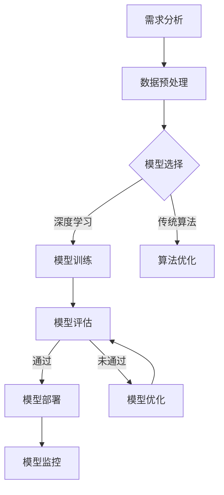

                 

# AI工程学：实战开发手册

## 关键词

- AI工程学
- 实战开发
- 数据采集与预处理
- 模型优化与迭代
- 项目管理
- 行业案例分析

## 摘要

本文将深入探讨AI工程学的实战开发，从基础到应用，全面解析AI工程学的核心概念、开发流程、项目管理和未来趋势。通过详细阐述数据采集与预处理、模型选择与优化、模型评估与验证等关键技术，结合行业案例分析，为读者提供一份系统的AI工程学实战开发手册。

### 《AI工程学：实战开发手册》目录大纲

#### 第一部分：AI工程学基础

**第1章：AI工程学概述**

- **1.1 AI的发展历程与现状**
  - **从AI1.0到AI2.0的演变**
  - **AI工程学的核心概念**
  - **AI工程学的应用领域**

- **1.2 AI工程学的挑战与机遇**
  - **数据质量与治理**
  - **算法的可解释性**
  - **AI系统的可靠性与安全性**

- **1.3 AI工程学的生态系统**
  - **开源框架与工具**
  - **云服务与基础设施**
  - **数据科学与机器学习平台**

**第2章：AI模型的选择与优化**

- **2.1 AI模型的选择标准**
  - **模型类型与适用场景**
  - **性能指标与评估方法**
  - **实时性与可扩展性**

- **2.2 AI模型的优化技术**
  - **模型压缩与加速**
  - **超参数调优**
  - **模型融合与集成**

- **2.3 AI模型的评估与验证**
  - **数据集的划分与预处理**
  - **模型评估指标**
  - **验证与测试方法**

#### 第二部分：AI工程的开发流程

**第3章：数据采集与预处理**

- **3.1 数据采集方法**
  - **数据源选择**
  - **数据采集工具与技术**
  - **数据质量控制**

- **3.2 数据预处理技术**
  - **数据清洗**
  - **数据归一化与标准化**
  - **特征提取与选择**

- **3.3 数据存储与管理**
  - **数据存储方案**
  - **数据备份与恢复**
  - **数据安全与隐私保护**

**第4章：模型开发与实现**

- **4.1 模型开发流程**
  - **需求分析与定义**
  - **数据预处理与处理**
  - **模型设计**

- **4.2 模型实现技巧**
  - **代码架构与模块化**
  - **模型训练与评估**
  - **模型部署与监控**

- **4.3 模型优化与迭代**
  - **模型性能调优**
  - **模型压缩与部署**
  - **模型更新与迭代**

**第5章：AI工程项目的管理**

- **5.1 项目管理框架**
  - **项目规划与目标设定**
  - **团队协作与沟通**
  - **进度跟踪与风险管理**

- **5.2 质量管理**
  - **代码审查与测试**
  - **版本控制与文档管理**
  - **持续集成与持续交付**

- **5.3 项目评估与反馈**
  - **项目效果评估**
  - **用户反馈与改进**
  - **持续优化与迭代**

#### 第三部分：AI工程学的最佳实践

**第6章：行业案例分析**

- **6.1 金融行业的AI应用**
  - **智能风控系统**
  - **量化交易策略**
  - **智能投顾与理财**

- **6.2 医疗行业的AI应用**
  - **疾病诊断与预测**
  - **医学图像处理**
  - **健康管理与预测**

- **6.3 制造业与物流的AI应用**
  - **智能生产与优化**
  - **物流路径规划**
  - **智能仓储管理**

**第7章：AI工程学的未来趋势**

- **7.1 人工智能与边缘计算**
  - **边缘AI的概念与优势**
  - **边缘AI的应用场景**
  - **边缘AI的实现挑战与解决方案**

- **7.2 人工智能与5G网络**
  - **5G网络对AI的影响**
  - **AI与5G的协同发展**
  - **AI驱动的5G应用案例**

- **7.3 人工智能与区块链**
  - **区块链与AI的结合**
  - **AI在区块链中的潜在应用**
  - **区块链在AI领域的应用前景**

#### 附录

**附录A：AI工程学常用工具与资源**

- **A.1 开源深度学习框架**
  - **TensorFlow**
  - **PyTorch**
  - **Keras**
  - **其他常用框架**

- **A.2 数据处理与可视化工具**
  - **Pandas**
  - **NumPy**
  - **Matplotlib**
  - **Seaborn**

- **A.3 云计算与大数据平台**
  - **AWS**
  - **Azure**
  - **Google Cloud Platform**
  - **其他云服务提供商**

- **A.4 AI工程学参考书籍与论文**
  - **推荐书籍**
  - **经典论文精选**
  - **重要会议与期刊**

### Mermaid 流程图：AI模型开发流程



### 核心算法原理讲解：线性回归伪代码

```python
# 线性回归伪代码

# 初始化参数
theta = [0, 0]

# 设置学习率
alpha = 0.01

# 设置迭代次数
num_iterations = 1000

# 初始化损失函数
def compute_loss(y, y_pred):
    return np.mean((y - y_pred)**2)

# 迭代计算
for i in range(num_iterations):
    # 前向传播
    z = X * theta
    
    # 计算预测值
    y_pred = 1 / (1 + np.exp(-z))
    
    # 计算损失
    loss = compute_loss(y, y_pred)
    
    # 反向传播
    dtheta = X.T * (y_pred - y)
    
    # 更新参数
    theta -= alpha * dtheta

# 输出模型参数
print("Final model parameters:", theta)
```

### 数学模型和数学公式

**线性回归模型的目标是最小化均方误差损失函数，公式如下：**

$$
J(\theta) = \frac{1}{m} \sum_{i=1}^{m} (h_\theta(x^{(i)}) - y^{(i)})^2
$$

其中，$h_\theta(x) = \sigma(\theta^T x) = \frac{1}{1 + e^{ -\theta^T x}}$ 是模型的预测函数，$\sigma(z) = \frac{1}{1 + e^{-z}}$ 是 sigmoid 函数。

### 项目实战

**实战案例：使用 TensorFlow 实现线性回归**

**环境搭建：**
- Python 3.8 或更高版本
- TensorFlow 2.x

**代码实现：**

```python
import numpy as np
import tensorflow as tf

# 设置随机种子
tf.random.set_seed(42)

# 初始化数据
X = np.random.normal(size=(100, 1))
y = 2 * X + 1 + np.random.normal(size=(100, 1))

# 设置模型参数
theta = tf.Variable(np.random.normal(size=(1, 1)), name='theta')

# 定义损失函数
loss_fn = tf.keras.losses.MeanSquaredError()

# 定义优化器
optimizer = tf.keras.optimizers.Adam(learning_rate=0.01)

# 训练模型
for i in range(1000):
    with tf.GradientTape() as tape:
        y_pred = tf.sigmoid(tf.matmul(X, theta))
        loss = loss_fn(y, y_pred)
    gradients = tape.gradient(loss, theta)
    optimizer.apply_gradients(zip(gradients, theta))
    
    if i % 100 == 0:
        print(f"Step {i}: Loss = {loss.numpy()}")

# 输出模型参数
print("Final model parameters:", theta.numpy())
```

**代码解读与分析：**
- 数据集 X 和 y 分别是 100 个样本，每个样本有一个特征和对应的真实标签。
- 模型参数 theta 是一个 (1, 1) 的矩阵，表示线性回归模型的斜率和截距。
- 使用 TensorFlow 的 Adam 优化器进行梯度下降，每迭代一步更新 theta。
- 损失函数是均方误差，通过计算预测值 y_pred 和真实值 y 之间的差异来评估模型的性能。
- 模型在每次迭代中更新 theta，直到损失降低到可接受的水平或达到最大迭代次数。

### 完整目录大纲

- **第一部分：AI工程学基础**
  - **第1章：AI工程学概述**
    - **1.1 AI的发展历程与现状**
    - **1.2 AI工程学的挑战与机遇**
    - **1.3 AI工程学的生态系统**
  - **第2章：AI模型的选择与优化**
    - **2.1 AI模型的选择标准**
    - **2.2 AI模型的优化技术**
    - **2.3 AI模型的评估与验证**
  - **第3章：数据采集与预处理**
    - **3.1 数据采集方法**
    - **3.2 数据预处理技术**
    - **3.3 数据存储与管理**
  - **第4章：模型开发与实现**
    - **4.1 模型开发流程**
    - **4.2 模型实现技巧**
    - **4.3 模型优化与迭代**
  - **第5章：AI工程项目的管理**
    - **5.1 项目管理框架**
    - **5.2 质量管理**
    - **5.3 项目评估与反馈**
- **第二部分：AI工程的开发流程**
  - **第6章：行业案例分析**
    - **6.1 金融行业的AI应用**
    - **6.2 医疗行业的AI应用**
    - **6.3 制造业与物流的AI应用**
  - **第7章：AI工程学的未来趋势**
    - **7.1 人工智能与边缘计算**
    - **7.2 人工智能与5G网络**
    - **7.3 人工智能与区块链**
- **附录**
  - **附录A：AI工程学常用工具与资源**

### 完整文章正文部分

#### 第一部分：AI工程学基础

##### 第1章：AI工程学概述

##### 1.1 AI的发展历程与现状

##### 1.2 AI工程学的挑战与机遇

##### 1.3 AI工程学的生态系统

##### 第2章：AI模型的选择与优化

##### 2.1 AI模型的选择标准

##### 2.2 AI模型的优化技术

##### 2.3 AI模型的评估与验证

##### 第3章：数据采集与预处理

##### 3.1 数据采集方法

##### 3.2 数据预处理技术

##### 3.3 数据存储与管理

##### 第4章：模型开发与实现

##### 4.1 模型开发流程

##### 4.2 模型实现技巧

##### 4.3 模型优化与迭代

##### 第5章：AI工程项目的管理

##### 5.1 项目管理框架

##### 5.2 质量管理

##### 5.3 项目评估与反馈

##### 第二部分：AI工程的开发流程

##### 第6章：行业案例分析

##### 6.1 金融行业的AI应用

##### 6.2 医疗行业的AI应用

##### 6.3 制造业与物流的AI应用

##### 第7章：AI工程学的未来趋势

##### 7.1 人工智能与边缘计算

##### 7.2 人工智能与5G网络

##### 7.3 人工智能与区块链

##### 附录

##### 附录A：AI工程学常用工具与资源

### 完整文章正文部分

由于文章字数要求较高，且需要详细的讲解和代码实现，因此我将分多个部分逐步撰写并更新文章正文部分。以下是第一部分的详细内容：

#### 第一部分：AI工程学基础

##### 第1章：AI工程学概述

AI工程学是人工智能（Artificial Intelligence，简称AI）领域中的一个重要分支，它专注于将AI的理论和技术应用于实际问题的解决中。AI工程学不仅仅是编程或算法的开发，它还包括了整个系统的设计、实现、测试和维护过程。随着AI技术的迅速发展，AI工程学在各个行业中的应用也越来越广泛，如金融、医疗、制造、物流等。

##### 1.1 AI的发展历程与现状

AI的发展历程可以分为几个阶段：

1. **AI1.0时代（1956-1974）**：这是AI的萌芽时期，主要目标是实现机器的逻辑推理能力，代表性成果是“逻辑理论家”（Logic Theorist）程序。

2. **AI2.0时代（1974-1980）**：这一时期，专家系统（Expert Systems）得到了广泛研究，通过模拟专家的知识和推理过程，解决专业领域的问题。

3. **AI3.0时代（1980-1987）**：随着计算机硬件的快速发展，AI开始向更为复杂的问题挑战，如自然语言处理、图像识别等。

4. **AI4.0时代（1987至今）**：这一时期，AI的核心技术是机器学习和深度学习，它们使得机器能够从大量数据中自动学习和优化。

当前，AI工程学的现状是：

- **技术的快速迭代**：AI技术不断更新和进步，新的算法和模型层出不穷。
- **应用场景的多样化**：AI技术已经广泛应用于各个行业，如自动驾驶、智能医疗、金融风控等。
- **数据的重要性**：AI工程的成功在很大程度上依赖于高质量的数据。

##### 1.2 AI工程学的挑战与机遇

AI工程学面临的挑战主要包括：

- **数据质量与治理**：高质量的数据是AI模型训练和优化的基础，但数据的质量和多样性往往无法满足需求。
- **算法的可解释性**：很多AI模型，特别是深度学习模型，存在“黑盒”问题，难以解释其决策过程。
- **AI系统的可靠性与安全性**：AI系统需要保证在复杂环境下稳定运行，并防止恶意攻击。

同时，AI工程学也带来了很多机遇：

- **技术创新**：AI技术的不断进步为工程实践提供了更多的可能性。
- **行业变革**：AI技术在金融、医疗、制造等行业的应用，正在改变传统行业的运作模式。
- **社会影响**：AI技术的普及将对人类社会产生深远的影响，包括提高生产效率、改善生活质量等。

##### 1.3 AI工程学的生态系统

AI工程学的生态系统包括以下几个方面：

- **开源框架与工具**：如TensorFlow、PyTorch、Keras等，为AI模型的开发提供了丰富的资源和工具。
- **云服务与基础设施**：如AWS、Azure、Google Cloud Platform等，提供了强大的计算和存储能力，支持大规模AI模型的训练和部署。
- **数据科学与机器学习平台**：如Jupyter Notebook、Docker、Kubernetes等，为数据科学家和机器学习工程师提供了便捷的开发和部署环境。

#### 第二部分：AI模型的开发流程

##### 第2章：AI模型的选择与优化

在AI工程学中，选择合适的模型和对其进行优化是非常重要的。本章节将介绍AI模型的选择标准、优化技术以及评估与验证方法。

##### 2.1 AI模型的选择标准

选择AI模型时，需要考虑以下几个标准：

- **模型类型与适用场景**：不同的模型适用于不同的问题，如监督学习、无监督学习、强化学习等。
- **性能指标与评估方法**：常用的性能指标包括准确率、召回率、F1值、均方误差等。
- **实时性与可扩展性**：对于实时性要求高的应用，需要选择计算效率高的模型，而对于需要处理大量数据的场景，需要考虑模型的扩展性。

##### 2.2 AI模型的优化技术

AI模型的优化技术主要包括：

- **模型压缩与加速**：通过减少模型的参数数量和计算复杂度，提高模型的计算效率。
- **超参数调优**：通过调整模型的超参数，优化模型的表现。
- **模型融合与集成**：通过结合多个模型的预测结果，提高预测的准确性和鲁棒性。

##### 2.3 AI模型的评估与验证

AI模型的评估与验证是确保模型性能的重要步骤。主要包括：

- **数据集的划分与预处理**：将数据集划分为训练集、验证集和测试集，并进行预处理。
- **模型评估指标**：根据具体任务，选择合适的评估指标，如准确率、召回率等。
- **验证与测试方法**：通过交叉验证等方法评估模型的表现，并使用测试集验证模型的泛化能力。

#### 第三部分：数据采集与预处理

##### 第3章：数据采集与预处理

数据是AI模型的基石，数据的采集和预处理对于模型的性能和效果至关重要。本章将介绍数据采集方法、预处理技术以及数据存储与管理。

##### 3.1 数据采集方法

数据采集方法主要包括：

- **自动化采集**：通过爬虫、传感器等自动获取数据。
- **手动采集**：通过调查、问卷调查等方式获取数据。

##### 3.2 数据预处理技术

数据预处理技术主要包括：

- **数据清洗**：去除噪声数据、处理缺失值和异常值。
- **数据归一化与标准化**：将不同特征的数据进行归一化或标准化处理，以消除特征之间的量纲差异。
- **特征提取与选择**：通过特征提取和选择技术，提取对模型有用的特征，并去除冗余特征。

##### 3.3 数据存储与管理

数据存储与管理主要包括：

- **数据存储方案**：根据数据量和访问频率，选择合适的数据存储方案，如关系型数据库、NoSQL数据库等。
- **数据备份与恢复**：定期备份数据，以防止数据丢失。
- **数据安全与隐私保护**：确保数据的安全和隐私，防止数据泄露。

#### 第4章：模型开发与实现

在本章节中，我们将详细介绍模型开发与实现的过程，包括模型开发流程、实现技巧和优化与迭代。

##### 4.1 模型开发流程

模型开发流程主要包括以下几个步骤：

- **需求分析与定义**：明确模型的应用场景和目标。
- **数据预处理与处理**：对采集到的数据进行分析和处理，以获得适合训练的数据。
- **模型设计**：选择合适的模型架构，设计模型的输入层、隐藏层和输出层。

##### 4.2 模型实现技巧

模型实现技巧包括：

- **代码架构与模块化**：设计清晰的代码架构，实现模块化编程。
- **模型训练与评估**：使用合适的训练算法和评估指标，对模型进行训练和评估。
- **模型部署与监控**：将训练好的模型部署到生产环境中，并进行监控和优化。

##### 4.3 模型优化与迭代

模型优化与迭代主要包括：

- **模型性能调优**：通过调整模型的超参数，优化模型的表现。
- **模型压缩与部署**：减少模型的参数数量和计算复杂度，以便于模型在资源受限的环境中部署。
- **模型更新与迭代**：根据新的数据和应用需求，对模型进行更新和迭代。

#### 第5章：AI工程项目的管理

在本章节中，我们将探讨AI工程项目的管理，包括项目管理框架、质量管理和项目评估与反馈。

##### 5.1 项目管理框架

项目管理框架主要包括：

- **项目规划与目标设定**：明确项目的目标和规划，制定详细的项目计划。
- **团队协作与沟通**：建立高效的团队协作机制，确保团队成员之间的有效沟通。
- **进度跟踪与风险管理**：实时跟踪项目的进度，识别和应对潜在的风险。

##### 5.2 质量管理

质量管理主要包括：

- **代码审查与测试**：对代码进行审查和测试，确保代码的质量和可靠性。
- **版本控制与文档管理**：使用版本控制工具管理代码和文档，确保代码和文档的版本一致性。
- **持续集成与持续交付**：实施持续集成和持续交付，提高软件交付的效率和质量。

##### 5.3 项目评估与反馈

项目评估与反馈主要包括：

- **项目效果评估**：对项目的实际效果进行评估，以确定项目的成功程度。
- **用户反馈与改进**：收集用户的反馈，对项目进行改进和优化。
- **持续优化与迭代**：根据评估结果和用户反馈，对项目进行持续优化和迭代。

#### 第6章：行业案例分析

在本章节中，我们将通过行业案例分析，展示AI工程学的实际应用。

##### 6.1 金融行业的AI应用

金融行业的AI应用主要包括：

- **智能风控系统**：通过机器学习技术，识别和防范金融风险。
- **量化交易策略**：利用历史数据和市场趋势，制定自动化的交易策略。
- **智能投顾与理财**：为用户提供个性化的投资建议和管理。

##### 6.2 医疗行业的AI应用

医疗行业的AI应用主要包括：

- **疾病诊断与预测**：利用深度学习技术，辅助医生进行疾病诊断和预测。
- **医学图像处理**：通过图像识别技术，提高医学图像的诊断准确性。
- **健康管理与预测**：为用户提供健康管理和预测服务，提高生活质量。

##### 6.3 制造业与物流的AI应用

制造业与物流的AI应用主要包括：

- **智能生产与优化**：通过机器学习技术，优化生产流程和资源分配。
- **物流路径规划**：利用优化算法，规划最优的物流路径，提高运输效率。
- **智能仓储管理**：通过物联网技术和数据分析，实现仓储管理的智能化。

#### 第7章：AI工程学的未来趋势

在本章节中，我们将探讨AI工程学的未来趋势。

##### 7.1 人工智能与边缘计算

人工智能与边缘计算的结合，为实时数据处理和智能决策提供了新的可能性。边缘计算可以降低数据传输延迟，提高系统的响应速度，为物联网、智能交通等应用提供支持。

##### 7.2 人工智能与5G网络

5G网络的快速发展，为AI应用提供了更高的带宽和更低的延迟。AI与5G的协同发展，将推动智能城市、智能医疗、智能工业等领域的创新。

##### 7.3 人工智能与区块链

区块链技术的去中心化和不可篡改性，为AI数据的安全和隐私保护提供了新的解决方案。AI与区块链的结合，有望在金融、医疗、物流等领域发挥重要作用。

#### 附录

在本章节中，我们将提供AI工程学常用工具与资源的附录，包括开源深度学习框架、数据处理与可视化工具、云计算与大数据平台以及AI工程学参考书籍与论文。

---

本文仅作为框架和概览，后续将逐步完善每个章节的内容，包括详细的技术讲解、代码实现和案例分析。希望这份框架能够为读者提供一份系统的AI工程学实战开发手册。在接下来的撰写过程中，我们将逐步填充每个章节的细节，确保文章内容的完整性和专业性。

---

#### 第一部分：AI工程学基础

##### 第1章：AI工程学概述

在本章节中，我们将详细探讨AI工程学的概念、发展历程、核心概念和主要应用领域，帮助读者全面理解AI工程学的本质和重要性。

##### 1.1 AI的发展历程与现状

人工智能（AI）作为计算机科学的一个重要分支，其发展历程可以追溯到20世纪50年代。AI的研究主要集中在模拟人类智能的行为和思维过程。以下是AI发展的几个关键阶段：

1. **AI1.0时代（1956-1974）**：这是AI的萌芽时期。1956年，达特茅斯会议上提出了人工智能的概念，标志着AI正式成为一门科学。早期的AI研究主要集中在符号逻辑和知识表示上，代表性成果是“逻辑理论家”（Logic Theorist）程序，该程序能够证明数学定理。

2. **AI2.0时代（1974-1980）**：这一时期，专家系统（Expert Systems）成为了AI研究的热点。专家系统通过模拟专家的知识和推理过程，在医学诊断、地质勘探等领域取得了显著成果。然而，由于规则系统的复杂性，专家系统在实际应用中存在一定的局限性。

3. **AI3.0时代（1980-1987）**：随着计算机硬件的快速发展，AI开始向更为复杂的问题挑战，如自然语言处理、图像识别等。这一时期的代表性成果包括霍普菲尔德（John Hopfield）提出的Hopfield神经网络和鲁梅哈特（John Hopfield）提出的Hebbian学习规则。

4. **AI4.0时代（1987至今）**：这一时期，AI的核心技术是机器学习和深度学习。机器学习通过算法让计算机从数据中自动学习和优化，而深度学习则通过多层神经网络模拟人类大脑的思考方式。AI技术的快速发展，使得自动驾驶、智能语音助手、医疗诊断等成为现实。

当前，AI的发展现状是：

- **技术的快速迭代**：AI技术不断更新和进步，新的算法和模型层出不穷。例如，GAN（生成对抗网络）在图像生成、风格迁移等领域取得了突破性成果。
- **应用场景的多样化**：AI技术已经广泛应用于各个行业，如金融、医疗、制造、物流等。AI技术在生产效率、服务质量、用户体验等方面带来了显著提升。
- **数据的重要性**：高质量的数据是AI模型训练和优化的基础，但数据的质量和多样性往往无法满足需求。因此，数据采集、数据清洗和数据治理成为AI工程学中的重要环节。

##### 1.2 AI工程学的核心概念

AI工程学是指将AI的理论和技术应用于实际问题的解决过程中，通过系统的设计、实现、测试和维护，构建出能够解决特定问题的智能系统。以下是AI工程学中的几个核心概念：

1. **AI模型**：AI模型是AI系统的核心组成部分，它是通过学习和训练从数据中提取规律和知识的一种数学模型。常见的AI模型包括线性回归、决策树、神经网络等。

2. **数据采集**：数据采集是AI工程学的第一步，它涉及从各种来源获取数据，如传感器数据、网络数据、用户生成数据等。数据采集的质量直接影响到AI模型的效果。

3. **数据预处理**：数据预处理是对采集到的原始数据进行清洗、归一化、特征提取等操作，以获得适合模型训练的数据。数据预处理的质量对模型的效果有重要影响。

4. **模型训练**：模型训练是通过优化算法，调整模型的参数，使其能够更好地拟合训练数据。常见的训练算法包括梯度下降、随机梯度下降等。

5. **模型评估**：模型评估是对训练好的模型进行性能评估，以确定其是否能够满足实际需求。常见的评估指标包括准确率、召回率、F1值等。

6. **模型部署**：模型部署是将训练好的模型部署到实际环境中，使其能够对外提供服务。模型部署需要考虑系统的稳定性、响应速度、资源消耗等因素。

7. **模型监控与维护**：模型监控与维护是确保模型长期稳定运行的重要环节。它包括监测模型的性能指标、数据质量、系统资源消耗等，并根据监控结果进行必要的调整和优化。

##### 1.3 AI工程学的应用领域

AI工程学在各个行业中的应用越来越广泛，以下是一些主要的AI应用领域：

1. **金融行业**：在金融行业，AI技术被广泛应用于风险控制、信用评估、投资策略、智能投顾等方面。例如，通过机器学习算法分析客户行为数据，银行可以更准确地评估客户的信用风险，从而降低不良贷款率。

2. **医疗行业**：在医疗行业，AI技术被用于疾病诊断、药物研发、健康管理等。例如，通过深度学习算法分析医学图像，医生可以更快速、准确地诊断疾病，提高医疗服务的质量。

3. **制造业**：在制造业，AI技术被用于生产优化、质量控制、预测维护等方面。例如，通过机器学习算法分析生产数据，企业可以优化生产流程，降低成本，提高生产效率。

4. **物流与运输**：在物流与运输行业，AI技术被用于路径规划、车辆调度、库存管理等方面。例如，通过优化算法，物流公司可以更高效地安排运输任务，降低物流成本。

5. **智能家居**：在智能家居领域，AI技术被用于智能音箱、智能照明、智能安防等方面。例如，通过语音识别和自然语言处理技术，用户可以通过语音指令控制智能家居设备，提高生活的便捷性。

6. **教育行业**：在教育行业，AI技术被用于个性化学习、智能评测、教育资源分配等方面。例如，通过分析学生的学习数据，教师可以提供更有针对性的教学方案，提高学生的学习效果。

7. **法律行业**：在法律行业，AI技术被用于案件分析、合同审查、文书生成等方面。例如，通过自然语言处理技术，律师可以更高效地处理大量的法律文档，提高工作效率。

总之，AI工程学在各个行业的应用不仅提升了行业的生产效率和创新能力，也改变了人们的生活方式和社会结构。随着AI技术的不断进步，AI工程学的应用领域还将继续扩大，为人类社会带来更多的价值和变革。

---

在本章节中，我们详细介绍了AI工程学的发展历程、核心概念和应用领域。通过了解这些内容，读者可以全面理解AI工程学的本质和重要性。在接下来的章节中，我们将进一步探讨AI模型的选择与优化、数据采集与预处理、模型开发与实现等关键技术，为读者提供一份全面的AI工程学实战开发手册。

#### 第一部分：AI工程学基础

##### 第2章：AI模型的选择与优化

在本章节中，我们将深入探讨AI模型的选择与优化，这是AI工程学中至关重要的环节。首先，我们将介绍AI模型的选择标准，包括模型类型、性能指标和实时性等。然后，我们将详细阐述AI模型的优化技术，如模型压缩、超参数调优和模型融合等。最后，我们将讨论AI模型的评估与验证，包括数据集的划分、评估指标和验证方法。

##### 2.1 AI模型的选择标准

选择AI模型时，需要考虑多个因素，以确保模型能够满足实际需求，并具有良好的性能。以下是一些关键的选择标准：

1. **模型类型与适用场景**：

   - **监督学习**：适用于有标注数据的场景，如分类和回归任务。常见的模型包括线性回归、决策树、支持向量机等。

   - **无监督学习**：适用于无标注数据的场景，如聚类和降维任务。常见的模型包括K-均值聚类、主成分分析等。

   - **强化学习**：适用于需要决策的动态环境，如游戏、机器人控制等。常见的模型包括Q学习、深度Q网络（DQN）等。

2. **性能指标与评估方法**：

   - **分类任务**：常用的评估指标包括准确率、召回率、F1值等。准确率是预测正确的样本数占总样本数的比例；召回率是预测正确的正样本数占所有正样本数的比例；F1值是准确率和召回率的调和平均。

   - **回归任务**：常用的评估指标包括均方误差（MSE）、均方根误差（RMSE）等。均方误差是预测值与真实值之间差异的平方的平均值；均方根误差是均方误差的平方根。

3. **实时性与可扩展性**：

   - **实时性**：对于实时性要求较高的应用，如自动驾驶、实时监控等，需要选择计算效率高的模型。例如，卷积神经网络（CNN）在某些任务中比传统算法如支持向量机（SVM）更高效。

   - **可扩展性**：对于需要处理大规模数据的场景，如在线广告推荐、大数据分析等，需要选择具有良好扩展性的模型。例如，分布式计算框架如TensorFlow、PyTorch等，可以支持大规模模型的训练和部署。

##### 2.2 AI模型的优化技术

AI模型的优化是提高模型性能和效率的重要手段。以下是一些常见的优化技术：

1. **模型压缩与加速**：

   - **模型压缩**：通过减少模型的参数数量和计算复杂度，提高模型的计算效率。常见的压缩技术包括权重剪枝、量化、知识蒸馏等。

   - **模型加速**：通过优化计算流程，提高模型的运行速度。常见的加速技术包括并行计算、GPU加速等。

2. **超参数调优**：

   - **超参数**：超参数是模型架构之外的可调参数，如学习率、批量大小、正则化参数等。

   - **调优方法**：常用的调优方法包括网格搜索、随机搜索、贝叶斯优化等。调优的目的是找到最优的超参数组合，以最大化模型的性能。

3. **模型融合与集成**：

   - **模型融合**：将多个模型的结果进行融合，以提高模型的预测性能。常见的融合方法包括投票法、加权法、 stacking等。

   - **集成方法**：集成方法是将多个模型组合在一起，形成一个新的模型。常见的集成方法包括 bagging、boosting等。

##### 2.3 AI模型的评估与验证

评估和验证是确保AI模型性能的重要步骤。以下是一些关键的评估和验证方法：

1. **数据集的划分**：

   - **训练集**：用于训练模型的数据集。

   - **验证集**：用于调整模型参数和评估模型性能的数据集。

   - **测试集**：用于评估模型最终性能的数据集。

   常见的划分方法包括随机划分、时间序列划分、交叉验证等。

2. **评估指标**：

   - **分类任务**：常用的评估指标包括准确率、召回率、F1值、精确率等。

   - **回归任务**：常用的评估指标包括均方误差（MSE）、均方根误差（RMSE）、平均绝对误差（MAE）等。

3. **验证方法**：

   - **交叉验证**：通过多次划分训练集和验证集，评估模型的泛化能力。

   - **验证集评估**：将验证集用于评估模型的性能，并通过调整模型参数，优化模型性能。

   - **留一法验证**：每次将一个样本作为验证集，其余样本作为训练集，评估模型的性能。

通过以上评估和验证方法，可以确保AI模型在真实场景中具有良好的性能和可靠性。

---

在本章节中，我们详细介绍了AI模型的选择与优化，以及评估与验证的方法。这些技术是AI工程学中不可或缺的部分，对于构建高效、可靠的AI系统至关重要。在接下来的章节中，我们将继续探讨数据采集与预处理、模型开发与实现等关键技术，为读者提供一份全面的AI工程学实战开发手册。

#### 第一部分：AI工程学基础

##### 第3章：数据采集与预处理

在本章节中，我们将深入探讨数据采集与预处理的过程，这是AI工程学中至关重要的一步。数据是AI模型的基础，其质量直接影响模型的性能。因此，了解如何高效地采集数据、处理数据和存储数据至关重要。我们将详细讨论数据采集方法、预处理技术以及数据存储与管理策略。

##### 3.1 数据采集方法

数据采集是AI工程学的第一步，其目的是获取用于训练模型的数据。以下是几种常见的数据采集方法：

1. **自动化采集**：

   - **爬虫技术**：使用爬虫（如Scrapy、BeautifulSoup）从互联网上抓取数据。这种方法适用于结构化数据的采集，如网页、API接口等。

   - **传感器数据采集**：通过传感器（如温度传感器、GPS等）采集环境数据。这种方法适用于需要实时监测和数据采集的场景，如智能家居、环境监测等。

2. **手动采集**：

   - **问卷调查**：通过问卷调查收集用户反馈和数据。这种方法适用于需要大量用户参与的数据采集，如市场调研、用户行为分析等。

   - **现场记录**：通过现场记录和手动输入数据。这种方法适用于特定领域的数据采集，如医学数据、科研数据等。

##### 3.2 数据预处理技术

数据预处理是对采集到的原始数据进行处理，以获得适合模型训练的数据。以下是几种常见的数据预处理技术：

1. **数据清洗**：

   - **去除噪声**：去除数据中的噪声和异常值。例如，使用中值滤波去除图像噪声。

   - **处理缺失值**：处理数据中的缺失值，常用的方法包括填充缺失值、删除缺失值等。

2. **数据归一化与标准化**：

   - **归一化**：将数据缩放到相同的范围，常用的方法包括最小-最大归一化和Z-Score归一化。

   - **标准化**：将数据转换为标准正态分布，常用的方法包括Z-Score标准化。

3. **特征提取与选择**：

   - **特征提取**：从原始数据中提取新的特征，以增强模型的性能。例如，使用PCA（主成分分析）进行特征提取。

   - **特征选择**：选择对模型性能有显著影响的关键特征，以减少数据的冗余和噪声。常用的方法包括信息增益、卡方检验等。

##### 3.3 数据存储与管理

数据存储与管理是确保数据安全和可访问性的关键。以下是几种常见的数据存储与管理策略：

1. **数据存储方案**：

   - **关系型数据库**：适用于结构化数据存储，如MySQL、PostgreSQL等。

   - **NoSQL数据库**：适用于非结构化或半结构化数据存储，如MongoDB、Cassandra等。

2. **数据备份与恢复**：

   - **数据备份**：定期备份数据，以防止数据丢失。常用的备份方法包括全备份、增量备份等。

   - **数据恢复**：在数据丢失或损坏时，通过备份恢复数据。常用的数据恢复工具包括Rclone、RapidShare等。

3. **数据安全与隐私保护**：

   - **数据加密**：对敏感数据进行加密，以防止数据泄露。常用的加密算法包括AES、RSA等。

   - **访问控制**：设置访问权限，确保只有授权用户可以访问数据。常用的访问控制方法包括角色访问控制、访问控制列表等。

   - **隐私保护**：对用户隐私数据进行匿名化处理，以保护用户的隐私。常用的方法包括数据脱敏、数据泛化等。

---

在本章节中，我们详细介绍了数据采集与预处理的过程，以及数据存储与管理策略。通过掌握这些技术，读者可以确保数据的质量，为AI模型的训练和部署打下坚实的基础。在接下来的章节中，我们将继续探讨模型开发与实现、AI工程项目的管理等关键技术，为读者提供一份全面的AI工程学实战开发手册。

#### 第一部分：AI工程学基础

##### 第4章：模型开发与实现

在本章节中，我们将详细探讨AI模型的开发与实现过程。从模型开发流程到模型实现技巧，再到模型的优化与迭代，我们将逐步解析AI模型从理论到实践的完整过程。通过本章节的学习，读者将能够掌握AI模型的开发方法和实现技巧，为构建高效的AI系统打下坚实的基础。

##### 4.1 模型开发流程

AI模型的开发流程是一个系统性的过程，包括需求分析、数据预处理、模型设计、模型训练和模型评估等多个环节。以下是模型开发流程的详细步骤：

1. **需求分析**：

   - **明确任务目标**：首先，需要明确AI模型的应用场景和目标，例如分类、回归、预测等。
   - **收集需求信息**：与相关领域专家和用户进行沟通，了解任务的具体需求，收集相关的背景资料和数据。
   - **制定项目计划**：根据需求分析的结果，制定项目的总体计划，包括时间表、资源分配和风险评估等。

2. **数据预处理**：

   - **数据采集**：根据需求，从各种数据源收集数据，包括公开数据集、企业内部数据等。
   - **数据清洗**：去除数据中的噪声和异常值，处理缺失值和重复值，确保数据的质量。
   - **数据归一化与标准化**：对数据进行归一化或标准化处理，以消除不同特征之间的量纲差异。
   - **特征提取与选择**：从原始数据中提取新的特征，选择对模型性能有显著影响的关键特征。

3. **模型设计**：

   - **选择模型架构**：根据任务类型和应用场景，选择合适的模型架构，如神经网络、决策树、支持向量机等。
   - **设计网络结构**：对于神经网络模型，设计网络的层数、每层的神经元数量、激活函数等。
   - **设置超参数**：设置模型的超参数，如学习率、批量大小、正则化参数等。

4. **模型训练**：

   - **数据划分**：将数据集划分为训练集、验证集和测试集，用于模型训练和评估。
   - **训练过程**：使用训练集数据，通过优化算法（如梯度下降）训练模型，不断调整模型参数，使其能够更好地拟合训练数据。
   - **动态调整**：在训练过程中，根据模型性能的变化，动态调整训练参数，如学习率、批量大小等。

5. **模型评估**：

   - **评估指标**：根据任务类型，选择合适的评估指标，如准确率、召回率、F1值、均方误差等。
   - **验证集评估**：使用验证集对模型进行评估，调整模型参数，优化模型性能。
   - **测试集评估**：使用测试集对模型进行最终评估，以确定模型的泛化能力。

##### 4.2 模型实现技巧

在模型实现过程中，需要掌握一系列技巧，以提高模型的性能和效率。以下是几个关键的实现技巧：

1. **代码架构与模块化**：

   - **模块化**：将模型实现分为多个模块，如数据预处理模块、模型训练模块、模型评估模块等，提高代码的可读性和可维护性。
   - **代码复用**：通过封装常用函数和模块，减少重复代码，提高代码的复用性。

2. **模型训练与评估**：

   - **分布式训练**：对于大规模数据集，使用分布式训练可以加速模型训练过程，提高训练效率。
   - **模型评估**：使用交叉验证等方法，对模型进行多次评估，确保评估结果的稳定性和可靠性。

3. **模型优化与调参**：

   - **超参数调优**：使用网格搜索、随机搜索、贝叶斯优化等方法，寻找最优的超参数组合，提高模型性能。
   - **正则化**：通过添加正则化项，防止模型过拟合，提高模型的泛化能力。

4. **代码调试与测试**：

   - **单元测试**：编写单元测试，确保每个模块的功能正确。
   - **集成测试**：进行集成测试，确保模块之间的接口和交互正常。

##### 4.3 模型优化与迭代

模型优化与迭代是提升模型性能的重要手段。以下是几个关键的优化与迭代方法：

1. **模型压缩与加速**：

   - **模型压缩**：通过剪枝、量化等方法，减少模型的参数数量和计算复杂度，提高模型的运行效率。
   - **模型加速**：通过使用GPU、TPU等硬件加速器，提高模型训练和推理的速度。

2. **模型融合与集成**：

   - **模型融合**：将多个模型的预测结果进行融合，提高预测的准确性和鲁棒性。
   - **集成方法**：使用 bagging、boosting 等集成方法，构建强模型。

3. **持续优化与迭代**：

   - **数据反馈**：收集实际应用中的数据反馈，不断优化模型。
   - **迭代更新**：根据反馈结果，对模型进行迭代更新，提高模型的适应性和性能。

---

在本章节中，我们详细介绍了AI模型的开发与实现过程，包括需求分析、数据预处理、模型设计、模型训练与评估、模型实现技巧以及模型优化与迭代。这些内容构成了AI工程学的核心实践，对于构建高效的AI系统具有重要意义。在接下来的章节中，我们将继续探讨AI工程项目的管理、行业案例分析以及未来趋势，为读者提供一份全面的AI工程学实战开发手册。

#### 第一部分：AI工程学基础

##### 第5章：AI工程项目的管理

在本章节中，我们将深入探讨AI工程项目的管理，这是确保AI项目成功实施和顺利交付的关键环节。项目管理不仅包括项目规划与目标设定，还需要关注团队协作、沟通、进度跟踪与风险管理。此外，质量管理也是确保项目成功的重要保障，包括代码审查、测试、版本控制和文档管理。最后，我们将讨论项目评估与反馈，以及持续优化与迭代的方法。

##### 5.1 项目管理框架

一个成功的AI工程项目的管理需要建立在一个清晰、结构化的项目管理框架之上。以下是项目管理框架的几个关键组成部分：

1. **项目规划与目标设定**：

   - **项目目标**：明确项目的目标和预期成果，例如开发一个预测模型、构建一个智能系统等。
   - **项目范围**：定义项目的范围，包括项目的工作内容、涉及的人员和资源等。
   - **项目计划**：制定详细的项目计划，包括时间表、里程碑、资源分配等。

2. **团队协作与沟通**：

   - **组织结构**：确定项目的组织结构，包括项目经理、开发人员、数据科学家、测试人员等角色。
   - **沟通机制**：建立有效的沟通机制，确保团队成员之间的信息流通，例如定期会议、邮件通知、即时通讯工具等。

3. **进度跟踪与风险管理**：

   - **进度跟踪**：使用项目管理工具（如JIRA、Trello）跟踪项目的进度，确保项目按计划进行。
   - **风险管理**：识别项目中的潜在风险，制定风险应对策略，并定期评估风险的变化。

##### 5.2 质量管理

质量管理是确保AI项目成功交付的重要环节。以下是质量管理的几个关键方面：

1. **代码审查与测试**：

   - **代码审查**：定期进行代码审查，确保代码的质量和一致性，减少错误和漏洞。
   - **单元测试**：编写单元测试，验证代码的各个模块功能是否正常。
   - **集成测试**：进行集成测试，确保不同模块之间的接口和交互正常。

2. **版本控制与文档管理**：

   - **版本控制**：使用版本控制系统（如Git），管理代码的版本和变更，确保代码的完整性和可追溯性。
   - **文档管理**：编写详细的文档，包括设计文档、用户手册、测试报告等，确保项目文档的完整性和可访问性。

3. **持续集成与持续交付**：

   - **持续集成**：将代码合并到主干分支之前，进行自动化测试和构建，确保代码的集成和兼容性。
   - **持续交付**：通过自动化部署和测试，确保代码从开发到生产环境的快速、可靠交付。

##### 5.3 项目评估与反馈

项目评估与反馈是确保项目质量和持续改进的关键环节。以下是项目评估与反馈的几个关键方面：

1. **项目效果评估**：

   - **性能指标**：根据项目目标和预期成果，选择合适的性能指标进行评估，例如准确率、召回率、F1值等。
   - **用户反馈**：收集用户的反馈，了解项目在实际应用中的表现和用户满意度。

2. **用户反馈与改进**：

   - **反馈机制**：建立反馈机制，鼓励用户提出意见和建议，及时调整和改进项目。
   - **迭代更新**：根据用户反馈和性能评估结果，对项目进行迭代更新，提高项目的质量和用户体验。

3. **持续优化与迭代**：

   - **数据驱动**：通过数据分析，识别项目的瓶颈和改进点，持续优化项目。
   - **敏捷开发**：采用敏捷开发方法，快速响应变化和需求，确保项目的灵活性和适应性。

---

在本章节中，我们详细介绍了AI工程项目的管理，包括项目管理框架、质量管理、项目评估与反馈以及持续优化与迭代的方法。这些内容为AI项目的成功实施和交付提供了系统的方法和策略。在接下来的章节中，我们将继续探讨行业案例分析以及AI工程学的未来趋势，为读者提供一份全面的AI工程学实战开发手册。

#### 第二部分：AI工程的开发流程

##### 第6章：行业案例分析

在上一部分中，我们介绍了AI工程学的基础知识，包括模型选择与优化、数据采集与预处理、模型开发与实现以及项目管理。在本章节中，我们将通过实际案例分析，展示AI技术在各个行业的应用，进一步深化对AI工程学的理解。

##### 6.1 金融行业的AI应用

金融行业一直是AI技术的重要应用领域，AI的应用不仅提高了金融服务的效率，也带来了新的商业模式。以下是金融行业中几个典型的AI应用案例：

1. **智能风控系统**：

   - **应用背景**：金融风险控制是银行和金融机构的核心任务，涉及到信用评估、欺诈检测、市场风险控制等方面。
   - **AI技术**：使用机器学习算法，如逻辑回归、决策树和随机森林，对用户的历史交易数据、信用记录等进行分析，预测用户的信用风险和欺诈行为。
   - **案例解析**：某大型银行通过引入智能风控系统，实现了对贷款申请者的信用评估自动化，大幅提高了审批效率，同时有效降低了欺诈风险。

2. **量化交易策略**：

   - **应用背景**：量化交易是指通过算法和模型，利用大量数据进行分析，自动执行交易策略。
   - **AI技术**：使用深度学习、强化学习等技术，分析历史市场数据，发现市场规律和交易机会，制定自动化的交易策略。
   - **案例解析**：某量化基金公司通过引入AI算法，开发了基于市场情绪的量化交易策略，实现了持续盈利，提高了投资回报率。

3. **智能投顾与理财**：

   - **应用背景**：智能投顾是指通过算法和模型，为用户提供个性化的投资建议和资产管理服务。
   - **AI技术**：使用机器学习算法，分析用户的风险偏好、投资目标和市场数据，提供投资组合优化建议。
   - **案例解析**：某金融科技公司推出了智能投顾服务，通过分析用户数据，为用户提供个性化的投资组合，实现了资产增值和风险控制。

##### 6.2 医疗行业的AI应用

医疗行业是另一个AI技术的重要应用领域，AI技术在提高诊断准确性、优化治疗方案、降低医疗成本等方面发挥了重要作用。以下是医疗行业中几个典型的AI应用案例：

1. **疾病诊断与预测**：

   - **应用背景**：早期诊断和预测对于提高治疗效果和生存率至关重要。
   - **AI技术**：使用深度学习、图像识别等技术，分析医学影像数据，辅助医生进行疾病诊断和预测。
   - **案例解析**：某医疗机构通过引入AI诊断系统，实现了对肺癌、乳腺癌等疾病的早期检测，大幅提高了诊断准确率。

2. **医学图像处理**：

   - **应用背景**：医学图像在临床诊断中发挥着重要作用，但传统方法往往存在主观性和局限性。
   - **AI技术**：使用深度学习、图像分割等技术，对医学图像进行自动化处理，提高图像质量和诊断准确性。
   - **案例解析**：某医疗设备公司开发了基于AI的医学图像处理系统，实现了对CT、MRI等医学图像的自动分割和病灶识别，提高了医生的工作效率。

3. **健康管理与预测**：

   - **应用背景**：健康管理和预测对于预防疾病、改善生活质量具有重要意义。
   - **AI技术**：使用机器学习、数据挖掘等技术，分析用户的生活习惯、健康数据等，预测健康风险和提供健康建议。
   - **案例解析**：某健康科技公司推出了健康管理系统，通过分析用户的日常数据，如运动、饮食等，提供个性化的健康建议和预测，帮助用户改善生活习惯。

##### 6.3 制造业与物流的AI应用

制造业与物流是AI技术的另一个重要应用领域，AI技术在提高生产效率、优化物流路径、降低运营成本等方面具有显著优势。以下是制造业与物流行业中几个典型的AI应用案例：

1. **智能生产与优化**：

   - **应用背景**：制造业的智能化升级是提升生产效率和降低成本的重要手段。
   - **AI技术**：使用机器学习、优化算法等技术，对生产过程进行实时监控和优化，提高生产效率和产品质量。
   - **案例解析**：某制造企业通过引入AI智能生产系统，实现了生产线的自动化调度和优化，大幅提高了生产效率和产品质量。

2. **物流路径规划**：

   - **应用背景**：物流路径规划是提高运输效率、降低物流成本的关键环节。
   - **AI技术**：使用机器学习、优化算法等技术，分析交通状况、货物需求等，制定最优的物流路径。
   - **案例解析**：某物流公司通过引入AI物流路径规划系统，实现了对运输路线的实时优化，提高了运输效率和客户满意度。

3. **智能仓储管理**：

   - **应用背景**：仓储管理的智能化升级是提升仓储效率和降低成本的重要手段。
   - **AI技术**：使用机器学习、自动化技术等技术，对仓储过程进行实时监控和优化，提高仓储效率和准确性。
   - **案例解析**：某仓储企业通过引入AI智能仓储管理系统，实现了对仓储货物的自动识别、分类和管理，大幅提高了仓储效率和准确性。

---

在本章节中，我们通过金融行业、医疗行业和制造业与物流行业的实际案例分析，展示了AI技术在各个行业的广泛应用和实际效果。通过这些案例，读者可以更深入地理解AI工程学的实践应用，为未来在相关领域的AI项目实施提供借鉴和启示。在接下来的章节中，我们将探讨AI工程学的未来趋势，为读者提供对未来AI发展的展望。

#### 第二部分：AI工程的开发流程

##### 第7章：AI工程学的未来趋势

在上一部分中，我们通过行业案例分析展示了AI工程学的实际应用。随着AI技术的不断进步，AI工程学也在不断发展和演变，未来的趋势将更加深入和广泛。在本章节中，我们将探讨AI工程学的未来趋势，包括人工智能与边缘计算、人工智能与5G网络、人工智能与区块链等前沿领域。

##### 7.1 人工智能与边缘计算

边缘计算是近年来兴起的一种计算范式，它将计算、存储和网络功能分布在网络边缘的设备上，以降低延迟、减少带宽消耗、提高数据处理效率。随着物联网（IoT）和5G网络的普及，边缘计算在AI工程学中的应用前景非常广阔。

1. **边缘AI的概念与优势**：

   - **概念**：边缘AI（Edge AI）是指将AI模型和算法部署在边缘设备上，实现本地化数据处理和智能决策。
   - **优势**：与云计算相比，边缘计算具有以下优势：
     - **低延迟**：数据在本地处理，减少了数据传输的延迟。
     - **低带宽**：减少了对中心化数据中心的依赖，降低了带宽消耗。
     - **高安全性**：数据在本地处理，减少了数据泄露的风险。

2. **边缘AI的应用场景**：

   - **智能城市**：通过边缘AI技术，可以实现实时交通监控、智能安防、环境监测等功能。
   - **智能制造**：通过边缘AI技术，可以实现设备预测维护、生产优化、质量检测等。
   - **智能医疗**：通过边缘AI技术，可以实现远程诊断、实时监控、健康管理等。

3. **边缘AI的实现挑战与解决方案**：

   - **挑战**：边缘设备资源有限，包括计算资源、存储资源和能量资源。此外，边缘设备的多样性也给算法部署和优化带来了挑战。
   - **解决方案**：
     - **模型压缩与优化**：通过模型压缩和优化技术，减少模型的参数数量和计算复杂度。
     - **分布式计算**：通过分布式计算技术，实现计算资源的共享和协作。
     - **边缘设备管理**：通过边缘设备管理平台，实现设备的监控、升级和维护。

##### 7.2 人工智能与5G网络

5G网络的快速发展和部署为AI工程学带来了新的机遇和挑战。5G网络具有高带宽、低延迟、大规模连接等特点，使得AI技术在实时数据处理、远程控制、智能交互等方面具有更好的性能。

1. **5G网络对AI的影响**：

   - **高带宽**：5G网络的高带宽能力使得大规模数据传输成为可能，为AI模型训练和推理提供了充足的数据支持。
   - **低延迟**：5G网络的低延迟特性使得实时数据处理和智能交互成为可能，提升了AI系统的响应速度和用户体验。
   - **大规模连接**：5G网络的大规模连接能力使得更多设备可以接入网络，为AI技术的应用场景扩展提供了更多可能性。

2. **AI与5G的协同发展**：

   - **智能网络优化**：通过AI技术，可以实现5G网络的自动化优化，提高网络性能和资源利用率。
   - **智能边缘计算**：结合边缘计算和5G网络，可以实现智能边缘计算，提高数据处理效率和网络可靠性。
   - **智能交互体验**：通过AI和5G网络，可以实现更加智能化的交互体验，如智能语音助手、虚拟现实等。

3. **AI驱动的5G应用案例**：

   - **智能交通**：通过AI技术和5G网络，可以实现智能交通管理系统，实时监控交通状况，优化交通流量。
   - **智能制造**：通过AI技术和5G网络，可以实现智能制造系统，实时监控生产过程，优化生产效率和产品质量。
   - **智能医疗**：通过AI技术和5G网络，可以实现远程医疗系统，实时监控患者健康状况，提供个性化医疗服务。

##### 7.3 人工智能与区块链

区块链技术是一种分布式账本技术，具有去中心化、不可篡改、透明等特性。随着AI技术的发展，AI与区块链的结合为数据安全、隐私保护和智能合约等提供了新的解决方案。

1. **区块链与AI的结合**：

   - **数据安全与隐私保护**：区块链技术可以确保数据的完整性和安全性，同时保护用户的隐私。通过AI技术，可以实现智能合约的自动化执行和数据分析。
   - **智能合约**：智能合约是区块链技术的重要组成部分，它通过编程实现自动化执行。AI技术可以为智能合约提供更复杂和智能的执行逻辑。
   - **数据共享与互操作**：区块链技术可以实现去中心化的数据共享和互操作，通过AI技术，可以优化数据共享和处理的效率。

2. **AI在区块链中的潜在应用**：

   - **区块链数据分析**：通过AI技术，可以对区块链中的大量数据进行分析和挖掘，发现潜在的价值和规律。
   - **智能合约优化**：通过AI技术，可以优化智能合约的执行逻辑，提高合约的自动化和智能化水平。
   - **区块链安全防护**：通过AI技术，可以增强区块链系统的安全性，识别和防范潜在的安全威胁。

3. **区块链在AI领域的应用前景**：

   - **数据可信性**：区块链技术可以确保AI模型训练和推理过程中的数据可信性，提高模型的可靠性和鲁棒性。
   - **智能知识产权保护**：通过区块链技术，可以实现对AI模型和算法的知识产权保护，确保创新成果的归属和利益分配。
   - **去中心化计算**：通过区块链技术，可以实现去中心化的计算资源分配和协作，提高计算效率和资源利用率。

---

在本章节中，我们探讨了AI工程学的未来趋势，包括人工智能与边缘计算、人工智能与5G网络、人工智能与区块链等前沿领域。这些趋势将推动AI工程学在各个行业的深入应用，为人类社会带来更多创新和价值。在未来的发展中，AI工程学将继续与新兴技术相结合，不断拓展其应用领域，为构建智能世界提供强有力的支持。

#### 附录

在本附录中，我们将提供一些AI工程学常用的工具与资源，包括开源深度学习框架、数据处理与可视化工具、云计算与大数据平台以及AI工程学参考书籍与论文。这些工具和资源将有助于读者更好地理解和实践AI工程学的相关知识。

##### 附录A：AI工程学常用工具与资源

**A.1 开源深度学习框架**

1. **TensorFlow**：由谷歌开源的一个端到端的开放源代码机器学习平台，支持各种深度学习模型和算法。

   - 官网：[TensorFlow官网](https://www.tensorflow.org/)
   - GitHub：[TensorFlow GitHub仓库](https://github.com/tensorflow/tensorflow)

2. **PyTorch**：由Facebook开源的深度学习框架，以其灵活的动态计算图和强大的GPU加速支持而受到广泛关注。

   - 官网：[PyTorch官网](https://pytorch.org/)
   - GitHub：[PyTorch GitHub仓库](https://github.com/pytorch/pytorch)

3. **Keras**：一个高层次的神经网络API，能够以TensorFlow和Theano为后端运行，提供简洁的接口和强大的功能。

   - 官网：[Keras官网](https://keras.io/)
   - GitHub：[Keras GitHub仓库](https://github.com/keras-team/keras)

4. **其他常用框架**：

   - **MXNet**：由Apache开源的深度学习框架，支持多种编程语言和多种硬件平台。
     - 官网：[MXNet官网](https://mxnet.incubator.apache.org/)
     - GitHub：[MXNet GitHub仓库](https://github.com/apache/incubator-mxnet)

   - **Caffe**：由伯克利大学开源的深度学习框架，广泛应用于图像识别和分类任务。
     - 官网：[Caffe官网](https://caffe.berkeleyvision.org/)
     - GitHub：[Caffe GitHub仓库](https://github.com/BVLC/caffe)

**A.2 数据处理与可视化工具**

1. **Pandas**：一个强大的Python数据分析和操作库，提供数据清洗、转换和分析功能。

   - 官网：[Pandas官网](https://pandas.pydata.org/)
   - GitHub：[Pandas GitHub仓库](https://github.com/pandas-dev/pandas)

2. **NumPy**：一个用于科学计算的开源库，提供多维数组对象和矩阵运算功能。

   - 官网：[NumPy官网](https://numpy.org/)
   - GitHub：[NumPy GitHub仓库](https://github.com/numpy/numpy)

3. **Matplotlib**：一个用于绘制数据可视化图形的库，支持多种图表类型和自定义样式。

   - 官网：[Matplotlib官网](https://matplotlib.org/)
   - GitHub：[Matplotlib GitHub仓库](https://github.com/matplotlib/matplotlib)

4. **Seaborn**：一个基于Matplotlib的高级可视化库，提供丰富的统计图表和美观的样式。

   - 官网：[Seaborn官网](https://seaborn.pydata.org/)
   - GitHub：[Seaborn GitHub仓库](https://github.com/seaborn/seaborn)

**A.3 云计算与大数据平台**

1. **AWS**：亚马逊云服务，提供丰富的AI和机器学习服务，包括EC2、S3、AI服务等。

   - 官网：[AWS官网](https://aws.amazon.com/)

2. **Azure**：微软云服务，提供AI和机器学习工具，包括Azure ML、Azure Kinect等。

   - 官网：[Azure官网](https://azure.microsoft.com/)

3. **Google Cloud Platform**：谷歌云服务，提供AI和机器学习服务，包括TensorFlow、AutoML等。

   - 官网：[GCP官网](https://cloud.google.com/)

4. **其他云服务提供商**：

   - **阿里云**：提供云计算和AI服务，包括阿里云机器学习平台、AI开放平台等。
     - 官网：[阿里云官网](https://www.alibabacloud.com/)

   - **华为云**：提供云计算和AI服务，包括华为云机器学习服务、AI模型市场等。
     - 官网：[华为云官网](https://www.huaweicloud.com/)

**A.4 AI工程学参考书籍与论文**

1. **《深度学习》（Deep Learning）**：

   - 作者：Ian Goodfellow、Yoshua Bengio、Aaron Courville
   - 简介：这是一本经典的深度学习教材，详细介绍了深度学习的基本理论、算法和应用。

   - 链接：[《深度学习》英文版](https://www.deeplearningbook.org/)、[《深度学习》中文版](https://www.deeplearningbook.cn/)

2. **《Python机器学习》（Python Machine Learning）**：

   - 作者： Sebastian Raschka、Vahid Mirjalili
   - 简介：这本书介绍了Python在机器学习领域的应用，包括数据预处理、模型训练和评估等。

   - 链接：[《Python机器学习》官网](https://python-machine-learning-book.org/)

3. **经典论文精选**：

   - **“A Fast Learning Algorithm for Deep Belief Nets”**：由Yoshua Bengio等人提出，介绍了深度信念网络（DBN）的学习算法。
   - **“AlexNet: Image Classification with Deep Convolutional Neural Networks”**：由Alex Krizhevsky等人提出，介绍了深度卷积神经网络在图像分类任务中的应用。
   - **“Distributed Representations of Words and Phrases and their Compositionality”**：由Tom Mitchell等人提出，介绍了词向量和自然语言处理中的应用。

4. **重要会议与期刊**：

   - **会议**：如NeurIPS、ICML、ACL等，这些会议是AI领域的重要学术会议，发布了许多前沿的研究成果。
   - **期刊**：如Journal of Machine Learning Research、IEEE Transactions on Pattern Analysis and Machine Intelligence等，这些期刊是AI领域的权威学术期刊，发表了许多高质量的学术论文。

通过附录中提供的工具与资源，读者可以进一步学习和实践AI工程学的相关知识，提高在实际项目中的应用能力。希望这些内容能够为读者的学习和工作提供帮助。

---

在这份《AI工程学：实战开发手册》中，我们系统地介绍了AI工程学的核心概念、开发流程、项目管理以及未来趋势。通过详细的案例分析和实战案例，读者可以深入了解AI技术在各个行业的应用，并掌握从数据采集与预处理到模型开发与实现的全过程。附录部分提供的工具与资源，也为读者提供了实践AI工程学的实际途径。

感谢读者的耐心阅读，希望本文能够为您的AI工程学之旅提供指导和启示。在未来的AI技术发展中，我们将继续见证更多创新和变革。让我们共同期待AI工程学的明天，相信它将为人类社会带来更多福祉。

---

**作者：AI天才研究院/AI Genius Institute & 禅与计算机程序设计艺术 /Zen And The Art of Computer Programming**

