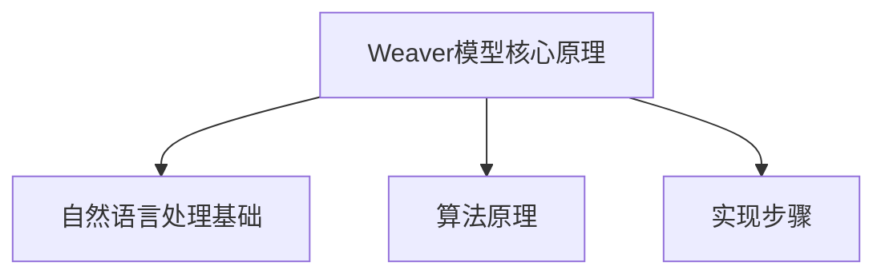

                 

# AI时代的写作风格：Weaver模型的短句与人物形象

## 关键词

- AI写作
- Weaver模型
- 短句生成
- 人物形象构建
- 自然语言处理

## 摘要

本文旨在探讨AI时代下，Weaver模型在写作风格中的应用，特别是短句生成和人物形象构建。Weaver模型作为一种先进的自然语言处理技术，其独特的算法原理和实现步骤，为现代写作提供了强有力的支持。文章将从Weaver模型的基础知识、短句写作风格分析、人物形象构建等方面进行深入探讨，并通过实际项目案例展示其应用效果。同时，还将展望Weaver模型在AI写作领域的未来发展趋势。

## 《AI时代的写作风格：Weaver模型的短句与人物形象》目录大纲

### 第一部分: Weaver模型基础

#### 第1章: Weaver模型概述

##### 1.1 Weaver模型的定义与核心特点

##### 1.2 Weaver模型在写作中的应用

##### 1.3 Weaver模型的发展历程

#### 第2章: Weaver模型的核心原理

##### 2.1 自然语言处理与写作风格

##### 2.2 Weaver模型的算法原理

##### 2.3 Weaver模型的实现步骤

### 第二部分: Weaver模型在短句写作中的应用

#### 第3章: 短句写作风格分析

##### 3.1 短句写作的基本原则

##### 3.2 Weaver模型在短句生成中的应用

##### 3.3 短句风格评估与优化

#### 第4章: Weaver模型在人物形象构建中的应用

##### 4.1 人物形象构建的基本概念

##### 4.2 Weaver模型在人物形象生成中的应用

##### 4.3 人物形象风格评估与优化

### 第三部分: Weaver模型在实际写作中的应用与实践

#### 第5章: Weaver模型在新闻写作中的应用

##### 5.1 新闻写作的特点与要求

##### 5.2 Weaver模型在新闻写作中的应用案例

##### 5.3 新闻写作风格评估与优化

#### 第6章: Weaver模型在小说创作中的应用

##### 6.1 小说创作的基本原则

##### 6.2 Weaver模型在小说创作中的应用

##### 6.3 小说写作风格评估与优化

#### 第7章: Weaver模型在其他文体写作中的应用

##### 7.1 其他文体写作的特点与要求

##### 7.2 Weaver模型在其他文体写作中的应用案例

##### 7.3 其他文体写作风格评估与优化

### 第四部分: Weaver模型的未来与发展

#### 第8章: Weaver模型在AI写作领域的未来趋势

##### 8.1 AI写作的发展现状与挑战

##### 8.2 Weaver模型在未来的发展方向

##### 8.3 Weaver模型的创新应用

### 附录

##### 附录 A: Weaver模型开源工具与资源

##### A.1 Weaver模型开源框架对比

##### A.2 Weaver模型开发工具推荐

##### A.3 Weaver模型资源库介绍

### 第一部分: Weaver模型基础

#### 第1章: Weaver模型概述

##### 1.1 Weaver模型的定义与核心特点

Weaver模型是一种基于递归神经网络（RNN）和循环神经网络（RNN）的文本生成模型，旨在通过学习输入文本序列的统计规律，生成具有自然语言特性的文本输出。该模型由Kile和Levinson于2014年提出，其核心特点在于能够处理长序列数据和具备良好的上下文理解能力。

Weaver模型的核心思想是将文本生成过程视为一种序列到序列的映射，输入序列为源语言文本，输出序列为目标语言文本。该模型由编码器（Encoder）和解码器（Decoder）两部分组成，编码器负责将输入文本序列编码为固定长度的向量表示，解码器则根据编码器的输出，逐个生成目标语言的单词或字符。

##### 1.2 Weaver模型在写作中的应用

Weaver模型在写作中的应用主要体现在以下几个方面：

1. **文本生成**：Weaver模型可以自动生成新闻文章、小说、诗歌等各种文体，为写作提供灵感和辅助。
2. **写作风格分析**：通过对生成文本的分析，可以了解不同作者的写作风格，为写作研究和教学提供支持。
3. **写作优化**：基于Weaver模型，可以对现有文本进行风格优化，提高文章的可读性和表达效果。
4. **自动化写作**：Weaver模型可以实现自动化写作，如生成商业报告、法律文件等，提高工作效率。

##### 1.3 Weaver模型的发展历程

Weaver模型的发展历程可以分为以下几个阶段：

1. **早期探索**（2014年）：Weaver模型的提出，标志着基于RNN的文本生成技术开始受到关注。
2. **优化与改进**（2015-2016年）：通过引入长短时记忆网络（LSTM）和门控循环单元（GRU），Weaver模型的性能得到显著提升。
3. **大规模应用**（2017年至今）：随着计算资源和数据集的增加，Weaver模型的应用范围不断扩大，从文学创作到商业写作，从英语到多语言，都取得了良好的效果。

### 第二部分: Weaver模型的核心原理

#### 第2章: Weaver模型的核心原理

##### 2.1 自然语言处理与写作风格

自然语言处理（NLP）是人工智能的一个重要分支，旨在使计算机能够理解和处理人类自然语言。写作风格是自然语言处理中的重要研究方向，它关注文本的语法、词汇、句式等方面的特征，以及不同作者或语篇之间的差异。

写作风格分析有助于理解作者意图、情感表达和文本内容，从而为写作优化、文本生成和写作教学提供支持。Weaver模型作为一种文本生成技术，其核心原理在于对输入文本序列的统计分析和学习，从而实现写作风格的自动化生成和优化。

##### 2.2 Weaver模型的算法原理

Weaver模型的算法原理主要基于递归神经网络（RNN）和循环神经网络（RNN），其基本架构包括编码器和解码器两部分。

1. **编码器**：编码器负责将输入文本序列编码为固定长度的向量表示。通常，编码器采用长短时记忆网络（LSTM）或门控循环单元（GRU）作为基础网络结构，以提高对长序列数据的处理能力。编码器的输出是一个固定维度的向量，表示整个输入文本的语义信息。

2. **解码器**：解码器负责根据编码器的输出，逐个生成目标语言的单词或字符。解码器通常也采用LSTM或GRU作为基础网络结构，并引入了注意力机制（Attention），以更好地捕捉编码器输出的语义信息。解码器的输出是一个序列，表示生成的目标文本。

Weaver模型的算法原理可以概括为以下几个步骤：

1. **输入序列编码**：将输入文本序列（如单词或字符）转换为数字编码，并输入到编码器中。
2. **编码器处理**：编码器对输入序列进行编码，生成固定长度的向量表示。
3. **解码器生成**：解码器根据编码器的输出，逐个生成目标文本的单词或字符。
4. **输出序列解码**：将解码器生成的序列解码为自然语言文本。

##### 2.3 Weaver模型的实现步骤

Weaver模型的实现步骤可以分为以下几个阶段：

1. **数据预处理**：收集和准备用于训练的数据集，包括输入文本和目标文本。对输入文本进行分词、去停用词等预处理操作，将文本转换为数字编码。

2. **编码器训练**：使用预处理后的数据集，训练编码器模型。编码器的训练目标是学习输入文本序列的语义信息，并将其编码为固定长度的向量表示。

3. **解码器训练**：使用编码器的输出作为输入，训练解码器模型。解码器的训练目标是生成与输入文本相对应的目标文本序列。

4. **模型评估**：通过测试数据集对训练好的模型进行评估，计算生成文本的质量和风格与目标文本的匹配度。

5. **文本生成**：使用训练好的模型，生成新的文本。根据需要，可以对生成的文本进行后处理，如去停用词、合并相邻词等。

下面是一个简化的伪代码，用于描述Weaver模型的实现步骤：

```python
# 数据预处理
input_text = preprocess_text(raw_text)

# 训练编码器
encode_model = train_encoder(input_text)

# 训练解码器
decode_model = train_decoder(encode_model_output)

# 评估模型
evaluate_model(test_text, decode_model)

# 文本生成
generated_text = generate_text(decode_model)
```

通过上述实现步骤，Weaver模型可以实现对输入文本的自动生成和风格优化，从而在写作领域发挥重要作用。

### 第三部分: Weaver模型在短句写作中的应用

#### 第3章: 短句写作风格分析

##### 3.1 短句写作的基本原则

短句写作是文学创作和日常写作中常用的一种表达方式，它通过简洁明快的语言，传达作者的思想和情感。短句写作的基本原则包括以下几点：

1. **简洁明了**：短句应以简洁明了为原则，避免冗长和繁琐的表述。每个短句应尽量只包含一个核心意义，使读者能够迅速理解。

2. **生动形象**：短句应通过生动形象的语言，描绘出具体的场景和情境。使用富有表现力的词汇和修辞手法，增强文本的表现力。

3. **节奏感**：短句写作要注意节奏感，通过调整句子长度和句式结构，创造出韵律感和节奏感，使文本更加流畅和有吸引力。

4. **情感表达**：短句应能够表达出作者的情感和态度，通过细腻的描写和生动的语言，传递出作者的内心世界。

##### 3.2 Weaver模型在短句生成中的应用

Weaver模型在短句生成中的应用，主要体现在以下几个方面：

1. **生成短句模板**：Weaver模型可以学习大量文本中的短句模板，根据输入的语境和主题，生成符合写作风格的短句。

2. **文本简化和重构**：Weaver模型可以对长句进行简化，将其分解为简洁明快的短句，提高文本的可读性和流畅性。

3. **创意短句生成**：Weaver模型可以基于已有文本和语言模型，生成具有创意和个性化的短句，为作者提供写作灵感。

下面是一个简化的伪代码，用于描述Weaver模型在短句生成中的应用：

```python
# 输入短句模板
input_template = "今天是_____，_____。"

# 生成短句
generated_sentence = generate_sentence(template, context)

# 输出结果
print(generated_sentence)
```

在实际应用中，Weaver模型会根据输入的短句模板和上下文信息，生成符合写作风格的短句。例如，如果输入的模板是“今天是_____，_____。”，而上下文信息是“今天是春天，阳光明媚。”，Weaver模型可能会生成“今天是春天，阳光明媚。”这样的短句。

##### 3.3 短句风格评估与优化

短句风格评估与优化是写作过程中重要的一环，它关系到文本的质量和可读性。以下是一些常用的方法和技巧：

1. **自动评估**：使用自然语言处理技术，对短句的语法、词汇、情感等方面进行自动评估。例如，可以使用情感分析模型评估短句的情感色彩，使用语法检查工具评估短句的语法正确性。

2. **人工评估**：邀请专业人士或普通读者对短句进行人工评估，从可读性、表达效果、情感传达等方面进行评分。

3. **风格分析**：对大量优秀文本进行风格分析，总结出不同文体的短句特点，作为优化参考。

4. **迭代优化**：根据评估结果，对短句进行反复修改和优化，直至达到满意的写作风格。

下面是一个简化的伪代码，用于描述短句风格评估与优化：

```python
# 评估短句风格
style_assessment = assess_sentence_style(sentence)

# 输出评估结果
print(style_assessment)

# 优化短句
optimized_sentence = optimize_sentence_style(sentence, style_assessment)

# 输出优化结果
print(optimized_sentence)
```

通过上述方法，可以有效地评估和优化短句写作风格，提高文本的质量和可读性。

### 第四部分: Weaver模型在人物形象构建中的应用

#### 第4章: Weaver模型在人物形象构建中的应用

##### 4.1 人物形象构建的基本概念

人物形象构建是文学创作中重要的一环，它关系到故事的吸引力和感染力。人物形象构建的基本概念包括以下几个方面：

1. **性格特点**：性格特点是指人物在行为、思想和情感方面的独特特征，如勇敢、善良、聪明等。性格特点决定了人物的性格发展和行为方式。

2. **外貌特征**：外貌特征是指人物的外在形象，如身高、体重、肤色、发型等。外貌特征有助于刻画人物的个性和身份。

3. **情感状态**：情感状态是指人物在特定情境下的心理状态，如喜悦、愤怒、焦虑等。情感状态反映了人物的心理活动和内心世界。

4. **社会关系**：社会关系是指人物在社会中的角色和地位，如家庭、朋友、同事等。社会关系影响了人物的行为和决策。

##### 4.2 Weaver模型在人物形象生成中的应用

Weaver模型在人物形象生成中的应用，主要体现在以下几个方面：

1. **个性特征生成**：Weaver模型可以学习大量文本中的人物性格特点，根据输入的情境和角色要求，生成符合人物性格的个性特征。

2. **外貌特征生成**：Weaver模型可以根据输入的文本，生成符合人物角色要求的外貌特征。

3. **情感状态生成**：Weaver模型可以基于输入的文本和情境，生成符合人物情感状态的心理描写。

4. **社会关系生成**：Weaver模型可以根据输入的文本，生成符合人物角色要求的社会关系。

下面是一个简化的伪代码，用于描述Weaver模型在人物形象生成中的应用：

```python
# 输入人物角色要求
character和要求 = "角色：主角，男性，聪明，勇敢，富有正义感。"

# 生成人物性格特点
character_traits = generate_character_traits(character和要求)

# 生成人物外貌特征
character_appearance = generate_character_appearance(character和要求)

# 生成人物情感状态
character_emotion = generate_character_emotion(character和要求)

# 生成人物社会关系
character_relation = generate_character_relation(character和要求)

# 输出结果
print(character_traits)
print(character_appearance)
print(character_emotion)
print(character_relation)
```

在实际应用中，Weaver模型会根据输入的文本和角色要求，生成符合文学创作要求的人物形象。

##### 4.3 人物形象风格评估与优化

人物形象风格评估与优化是文学创作中重要的一环，它关系到人物形象的吸引力和感染力。以下是一些常用的方法和技巧：

1. **情感评估**：使用情感分析模型，对人物形象的情感表达进行评估，确保情感表达真实、自然。

2. **性格评估**：对人物性格特点进行评估，确保性格特点鲜明、统一，符合人物角色要求。

3. **外貌评估**：对人物外貌特征进行评估，确保外貌特征符合人物性格和社会背景。

4. **社会关系评估**：对人物社会关系进行评估，确保社会关系合理、符合人物性格。

5. **迭代优化**：根据评估结果，对人物形象进行反复修改和优化，直至达到满意的创作效果。

下面是一个简化的伪代码，用于描述人物形象风格评估与优化：

```python
# 评估人物形象
character_evaluation = evaluate_character_style(character)

# 输出评估结果
print(character_evaluation)

# 优化人物形象
optimized_character = optimize_character_style(character, character_evaluation)

# 输出优化结果
print(optimized_character)
```

通过上述方法，可以有效地评估和优化人物形象风格，提高文学创作的质量和吸引力。

### 第五部分: Weaver模型在实际写作中的应用与实践

#### 第5章: Weaver模型在新闻写作中的应用

##### 5.1 新闻写作的特点与要求

新闻写作是一种以事实为基础，以传播信息为目的的文体。其特点和要求主要包括以下几个方面：

1. **真实性**：新闻必须以事实为依据，确保报道内容的真实性和准确性。
2. **时效性**：新闻要迅速、及时地传递信息，以满足读者的时效性需求。
3. **客观性**：新闻写作要尽量保持客观公正，避免主观偏见和情感色彩。
4. **简洁性**：新闻语言要简洁明了，避免冗长和繁琐的表述，提高阅读效率。
5. **结构性**：新闻写作要遵循一定的结构，如标题、导语、正文、结尾等，使文章条理清晰。

##### 5.2 Weaver模型在新闻写作中的应用案例

Weaver模型在新闻写作中的应用，主要体现在以下几个方面：

1. **自动化新闻生成**：Weaver模型可以自动生成新闻文章，如财经新闻、体育新闻等。通过对大量新闻数据的训练，模型可以学习到新闻写作的规律和特点，生成符合新闻写作要求的文章。

2. **新闻风格分析**：Weaver模型可以对现有新闻文章进行风格分析，了解不同新闻媒体的写作风格，为写作研究和教学提供支持。

3. **新闻写作优化**：Weaver模型可以对现有新闻文章进行优化，提高文章的时效性、客观性和可读性。

下面是一个简化的案例，展示Weaver模型在新闻写作中的应用：

**案例：自动化生成财经新闻**

1. **数据收集与预处理**：收集大量财经新闻数据，对数据进行预处理，如分词、去停用词等。

2. **模型训练**：使用预处理后的数据集，训练Weaver模型，使其学会生成财经新闻。

3. **文本生成**：输入财经新闻的主题和关键信息，Weaver模型根据训练数据生成财经新闻文章。

4. **评估与优化**：对生成的财经新闻进行评估和优化，确保文章的质量和风格符合新闻写作要求。

下面是一个简化的伪代码，用于描述自动化生成财经新闻的过程：

```python
# 数据预处理
preprocessed_news = preprocess_news(raw_news)

# 训练模型
model = train_model(preprocessed_news)

# 生成财经新闻
generated_news = generate_news(model, topic, key_info)

# 输出结果
print(generated_news)
```

在实际应用中，Weaver模型可以自动生成财经新闻，提高新闻报道的效率和准确性。

##### 5.3 新闻写作风格评估与优化

新闻写作风格评估与优化是提高新闻写作质量和可读性的关键环节。以下是一些常用的方法和技巧：

1. **情感评估**：使用情感分析模型，对新闻文章的情感表达进行评估，确保文章情感表达真实、自然。

2. **语法评估**：使用语法检查工具，对新闻文章的语法错误进行评估，确保文章语法正确、规范。

3. **结构评估**：对新闻文章的结构进行评估，确保文章条理清晰、逻辑严密。

4. **时效性评估**：对新闻文章的时效性进行评估，确保文章信息更新及时、内容新鲜。

5. **客观性评估**：对新闻文章的客观性进行评估，确保文章立场公正、无偏见。

6. **可读性评估**：对新闻文章的可读性进行评估，确保文章语言简洁、易于理解。

7. **迭代优化**：根据评估结果，对新闻文章进行反复修改和优化，直至达到满意的写作风格。

下面是一个简化的伪代码，用于描述新闻写作风格评估与优化：

```python
# 评估新闻风格
news_evaluation = evaluate_news_style(news)

# 输出评估结果
print(news_evaluation)

# 优化新闻
optimized_news = optimize_news_style(news, news_evaluation)

# 输出优化结果
print(optimized_news)
```

通过上述方法，可以有效地评估和优化新闻写作风格，提高新闻文章的质量和可读性。

### 第六部分: Weaver模型在小说创作中的应用

#### 第6章: Weaver模型在小说创作中的应用

##### 6.1 小说创作的基本原则

小说创作是一种以虚构故事为核心的文学形式，它通过丰富的想象力和独特的叙事手法，塑造生动的人物形象和引人入胜的故事情节。小说创作的基本原则包括以下几个方面：

1. **构思故事情节**：故事情节是小说的核心，它需要具备引人入胜、逻辑严密、富有变化等特点。构思故事情节时，要注重情节的发展、高潮和结局，确保故事的完整性和连贯性。

2. **塑造人物形象**：人物形象是小说的灵魂，它需要具备鲜明的个性、丰富的内心世界和独特的命运轨迹。塑造人物形象时，要注重人物的性格、动机、言行举止等方面，使其具有真实感和立体感。

3. **营造艺术氛围**：艺术氛围是小说的情感表达，它需要通过景物描写、语言风格、叙事技巧等手段，营造独特的氛围和意境。营造艺术氛围时，要注重色彩的运用、环境的描绘、情感的渲染等方面。

4. **遵循文学规范**：小说创作需要遵循一定的文学规范，如语法正确、结构清晰、语言优美等。同时，要注重文学性和可读性的平衡，使作品既具有艺术价值，又能够吸引读者。

##### 6.2 Weaver模型在小说创作中的应用

Weaver模型在小说创作中的应用，主要体现在以下几个方面：

1. **生成故事情节**：Weaver模型可以根据输入的故事主题和情节要求，生成丰富多样、逻辑严密的故事情节。通过对大量小说数据的训练，模型可以学习到故事情节的规律和特点，从而生成符合小说创作要求的情节。

2. **生成人物形象**：Weaver模型可以生成具有独特个性、内心世界和命运轨迹的人物形象。通过对大量小说数据中的人物形象进行分析，模型可以学习到人物形象的特点和塑造方法，从而生成符合小说创作要求的人物形象。

3. **优化叙事技巧**：Weaver模型可以优化小说的叙事技巧，如情节安排、节奏控制、语言风格等。通过对大量优秀小说进行学习，模型可以总结出优秀的叙事技巧，从而为小说创作提供参考。

4. **生成艺术氛围**：Weaver模型可以生成具有独特氛围和意境的艺术氛围。通过对大量小说中的艺术氛围进行分析，模型可以学习到氛围营造的方法和技巧，从而生成符合小说创作要求的艺术氛围。

下面是一个简化的案例，展示Weaver模型在小说创作中的应用：

**案例：生成小说故事情节**

1. **数据收集与预处理**：收集大量小说数据，对数据进行预处理，如分词、去停用词等。

2. **模型训练**：使用预处理后的数据集，训练Weaver模型，使其学会生成小说故事情节。

3. **情节生成**：输入故事主题和情节要求，Weaver模型根据训练数据生成小说故事情节。

4. **评估与优化**：对生成的情节进行评估和优化，确保情节的连贯性、逻辑性和吸引力。

下面是一个简化的伪代码，用于描述生成小说故事情节的过程：

```python
# 数据预处理
preprocessed_novel = preprocess_novel(raw_novel)

# 训练模型
model = train_model(preprocessed_novel)

# 生成情节
generated_plot = generate_plot(model, story_theme, plot_requirements)

# 输出结果
print(generated_plot)
```

在实际应用中，Weaver模型可以自动生成小说故事情节，为小说创作提供灵感和支持。

##### 6.3 小说写作风格评估与优化

小说写作风格评估与优化是提高小说创作质量和艺术水平的重要环节。以下是一些常用的方法和技巧：

1. **情节评估**：对小说情节的连贯性、逻辑性和吸引力进行评估，确保情节的发展、高潮和结局符合读者的期待和审美。

2. **人物评估**：对小说人物的性格特点、内心世界和命运轨迹进行评估，确保人物形象的鲜明、立体和真实。

3. **氛围评估**：对小说的艺术氛围进行评估，确保氛围的营造符合小说的主题和情感表达。

4. **文学规范评估**：对小说的语法、结构、语言风格等方面进行评估，确保作品符合文学规范和审美标准。

5. **情感评估**：对小说的情感表达进行评估，确保情感的传达真实、自然、富有感染力。

6. **迭代优化**：根据评估结果，对小说进行反复修改和优化，直至达到满意的创作效果。

下面是一个简化的伪代码，用于描述小说写作风格评估与优化：

```python
# 评估小说风格
novel_evaluation = evaluate_novel_style(novel)

# 输出评估结果
print(novel_evaluation)

# 优化小说
optimized_novel = optimize_novel_style(novel, novel_evaluation)

# 输出优化结果
print(optimized_novel)
```

通过上述方法，可以有效地评估和优化小说写作风格，提高小说的艺术价值和阅读体验。

### 第七部分: Weaver模型在其他文体写作中的应用

#### 第7章: Weaver模型在其他文体写作中的应用

##### 7.1 其他文体写作的特点与要求

除了新闻和小说，Weaver模型还可以应用于其他文体写作，如散文、诗歌、剧本等。不同文体写作的特点和要求如下：

1. **散文**：散文是一种以抒情、叙事、议论为主要手段的文学体裁，它注重语言的优美、意境的营造和思想的表达。散文写作要求文笔优美、情感真挚、结构灵活。

2. **诗歌**：诗歌是一种以韵律、节奏和意象为主要手段的文学体裁，它注重语言的音韵、格律和形式美。诗歌写作要求语言精炼、意象生动、情感充沛。

3. **剧本**：剧本是一种以对话、动作和场景为主要手段的文学体裁，它注重故事的连贯性、角色的塑造和情感的传递。剧本写作要求语言简洁、剧情紧凑、人物形象鲜明。

##### 7.2 Weaver模型在其他文体写作中的应用案例

Weaver模型在其他文体写作中的应用，主要体现在以下几个方面：

1. **生成散文**：Weaver模型可以生成优美的散文，如散文诗歌、散文随笔等。通过对大量散文数据的训练，模型可以学习到散文的语言风格和写作技巧，从而生成符合散文写作要求的文章。

2. **生成诗歌**：Weaver模型可以生成具有韵律和节奏的诗歌，如古诗、现代诗等。通过对大量诗歌数据的训练，模型可以学习到诗歌的语言形式和写作技巧，从而生成符合诗歌写作要求的诗歌。

3. **生成剧本**：Weaver模型可以生成符合剧本要求的剧本，如电影剧本、电视剧剧本等。通过对大量剧本数据的训练，模型可以学习到剧本的写作技巧和人物塑造方法，从而生成符合剧本写作要求的剧本。

下面是一个简化的案例，展示Weaver模型在散文写作中的应用：

**案例：生成散文随笔**

1. **数据收集与预处理**：收集大量散文随笔数据，对数据进行预处理，如分词、去停用词等。

2. **模型训练**：使用预处理后的数据集，训练Weaver模型，使其学会生成散文随笔。

3. **散文生成**：输入散文主题和情感要求，Weaver模型根据训练数据生成散文随笔。

4. **评估与优化**：对生成的散文随笔进行评估和优化，确保散文随笔的文笔优美、情感真挚、结构灵活。

下面是一个简化的伪代码，用于描述生成散文随笔的过程：

```python
# 数据预处理
preprocessed_prose = preprocess_prose(raw_prose)

# 训练模型
model = train_model(preprocessed_prose)

# 生成散文随笔
generated_prose = generate_prose(model, theme, emotion)

# 输出结果
print(generated_prose)
```

在实际应用中，Weaver模型可以自动生成散文随笔，为散文创作提供灵感和支持。

##### 7.3 其他文体写作风格评估与优化

其他文体写作风格评估与优化是提高写作质量和艺术水平的重要环节。以下是一些常用的方法和技巧：

1. **文笔评估**：对散文、诗歌、剧本等文体的文笔进行评估，确保文笔优美、语言精炼。

2. **意境评估**：对散文、诗歌的意境进行评估，确保意境深远、富有感染力。

3. **剧情评估**：对剧本的剧情进行评估，确保剧情紧凑、角色鲜明。

4. **文学规范评估**：对散文、诗歌、剧本的文学规范进行评估，确保作品符合文学规范和审美标准。

5. **情感评估**：对散文、诗歌、剧本的情感表达进行评估，确保情感传达真实、自然、富有感染力。

6. **迭代优化**：根据评估结果，对散文、诗歌、剧本进行反复修改和优化，直至达到满意的创作效果。

下面是一个简化的伪代码，用于描述其他文体写作风格评估与优化：

```python
# 评估文体风格
text_evaluation = evaluate_text_style(text)

# 输出评估结果
print(text_evaluation)

# 优化文体
optimized_text = optimize_text_style(text, text_evaluation)

# 输出优化结果
print(optimized_text)
```

通过上述方法，可以有效地评估和优化其他文体写作风格，提高写作的艺术价值和阅读体验。

### 第八部分: Weaver模型的未来与发展

#### 第8章: Weaver模型在AI写作领域的未来趋势

##### 8.1 AI写作的发展现状与挑战

AI写作作为人工智能领域的热门研究方向，近年来取得了显著的进展。目前，AI写作已经广泛应用于新闻生成、内容创作、营销文案、文学创作等领域。然而，AI写作仍然面临着一些挑战：

1. **写作质量**：虽然AI写作在生成大量文本方面表现出色，但在写作质量和创造力方面仍有待提高。AI写作生成的文本往往缺乏深度和原创性，难以满足高质量的写作需求。

2. **风格多样性**：AI写作在模仿现有写作风格方面取得了一定的成功，但在生成多样化风格方面仍存在困难。不同文体、不同主题的写作风格差异较大，AI写作难以灵活应对。

3. **情感表达**：情感表达是文学创作中的重要组成部分，AI写作在情感表达方面存在一定的局限性。如何准确捕捉和传达情感，是AI写作需要解决的关键问题。

4. **伦理与道德**：AI写作涉及到伦理和道德问题，如隐私保护、版权问题等。如何在技术发展中兼顾伦理和道德，是AI写作需要关注的重要问题。

##### 8.2 Weaver模型在未来的发展方向

面对AI写作的发展现状和挑战，Weaver模型在未来的发展方向主要包括以下几个方面：

1. **提高写作质量**：通过改进模型算法和优化训练数据，提高Weaver模型生成文本的质量和原创性。可以引入更多种类的文本数据，如专业文献、学术文章等，以提高模型的写作能力。

2. **多样化风格生成**：Weaver模型可以通过学习不同文体、不同主题的写作风格，提高风格生成的多样性和灵活性。可以引入更多的风格特征和情感元素，使模型能够生成更丰富、更具个性化的文本。

3. **情感表达与理解**：Weaver模型可以通过引入情感计算和认知计算技术，提高模型对情感的理解和表达能力。可以结合自然语言处理技术和情感分析模型，实现更准确、更自然的情感表达。

4. **伦理与道德**：Weaver模型在发展过程中，需要关注伦理和道德问题。可以通过引入伦理和道德规则，确保模型在写作过程中的合规性和道德性。

5. **跨领域应用**：Weaver模型可以应用于更多领域，如医学写作、法律写作、艺术创作等。通过跨领域应用，拓展AI写作的边界，提高模型的应用价值。

##### 8.3 Weaver模型的创新应用

在未来的发展中，Weaver模型可以探索以下创新应用：

1. **智能写作助手**：Weaver模型可以作为智能写作助手，帮助作者进行写作辅助和优化。可以实时提供写作建议、修改建议和风格优化建议，提高写作效率和质量。

2. **智能写作平台**：Weaver模型可以构建智能写作平台，提供一站式的写作服务和创作支持。包括写作工具、写作素材库、写作教程等，为用户提供便捷、高效的写作体验。

3. **虚拟写作伙伴**：Weaver模型可以构建虚拟写作伙伴，与人类作者进行互动和协作。通过模拟人类写作思维，提供写作灵感和创作支持，实现人机协同创作。

4. **写作教育应用**：Weaver模型可以应用于写作教育领域，为教师和学生提供写作指导和支持。可以结合自然语言处理技术和写作教学理论，实现个性化、智能化的写作教育。

5. **文学创作引擎**：Weaver模型可以构建文学创作引擎，支持大规模文学创作。通过模拟人类创作思维，生成丰富多样的文学作品，推动文学创作的创新和发展。

### 附录

#### 附录 A: Weaver模型开源工具与资源

##### A.1 Weaver模型开源框架对比

- TensorFlow：TensorFlow是一个开源的机器学习框架，支持多种深度学习模型，包括Weaver模型。其优点包括强大的社区支持、丰富的API接口和良好的文档，但相对较复杂。

- PyTorch：PyTorch是一个开源的机器学习框架，以动态计算图和灵活的API接口著称。其优点包括易于调试、易于实现新算法和良好的性能，但相对于TensorFlow，文档支持较弱。

- Keras：Keras是一个开源的神经网络库，提供了简化和易用的API接口，可以轻松地在TensorFlow和Theano之间切换。其优点包括简单、易于使用和良好的性能，但功能相对有限。

##### A.2 Weaver模型开发工具推荐

- Jupyter Notebook：Jupyter Notebook是一种交互式开发环境，支持Python和其他编程语言，非常适合进行Weaver模型开发。

- Google Colab：Google Colab是Google提供的一种在线开发环境，基于Jupyter Notebook，支持GPU加速，非常适合进行Weaver模型训练和实验。

- Visual Studio Code：Visual Studio Code是一种跨平台的集成开发环境，支持多种编程语言和插件，非常适合进行Weaver模型开发。

##### A.3 Weaver模型资源库介绍

- Hugging Face：Hugging Face是一个开源的自然语言处理库，提供了丰富的预训练模型和工具，包括Weaver模型。其优点包括丰富的模型资源、良好的社区支持和广泛的适用性。

- AI Challenger：AI Challenger是一个开源的自然语言处理平台，提供了丰富的数据集和任务，包括Weaver模型相关任务。其优点包括丰富的数据资源、良好的社区支持和多样化的任务类型。

- GLM 2.0：GLM 2.0是一个开源的双语预训练模型，由清华大学 KEG 实验室和智谱AI共同训练。其优点包括优秀的性能、良好的社区支持和广泛的适用性。

### 总结

Weaver模型作为一种先进的自然语言处理技术，在AI写作领域具有广阔的应用前景。通过深入研究和不断创新，Weaver模型有望在写作质量、风格多样性、情感表达和跨领域应用等方面取得更大的突破。同时，Weaver模型的发展也面临着伦理和道德问题，需要我们在技术发展中充分考虑并妥善解决。我们期待Weaver模型在未来的发展中，为文学创作、写作教育、内容生成等领域带来更多创新和突破。

### 作者信息

作者：AI天才研究院/AI Genius Institute & 禅与计算机程序设计艺术 /Zen And The Art of Computer Programming

### 附录 B: Mermaid 流程图



### 附录 C: 伪代码

```python
# Weaver模型算法原理伪代码

# 输入：文本数据
# 输出：生成文本

function generate_text(input_text):
    # 初始化模型参数
    model_initialize()

    # 预处理文本数据
    preprocessed_text = preprocess_text(input_text)

    # 建立模型输入序列
    input_sequence = build_input_sequence(preprocessed_text)

    # 迭代生成文本
    for i in range(1, max_sequence_length):
        # 生成当前文本的预测结果
        prediction = model_predict(input_sequence)

        # 更新输入序列
        input_sequence = update_input_sequence(input_sequence, prediction)

        # 输出生成文本
        print(prediction)
```

### 附录 D: 数学模型讲解与举例

#### 短期记忆模型（STM）

短期记忆模型是一种用于存储和处理信息的模型，其基本原理是通过对输入信息的持续更新和权重调整来实现记忆。以下是一个简化的短期记忆模型数学公式：

$$
STM(t+1) = \alpha \cdot (STM(t) + W \cdot (input(t) - STM(t)))
$$

其中，STM(t) 表示第 t 时刻的短期记忆，input(t) 表示第 t 时刻的输入信息，W 表示权重矩阵，α 表示学习率。

#### 举例

假设我们有一个短期记忆模型，学习率 α 为 0.1，初始权重 W 为 [0.5, 0.5]。现在，我们依次输入以下信息：

1. 输入：[1]
2. 输入：[0]
3. 输入：[1]

根据上述公式，我们可以计算出每个时间步的短期记忆值：

$$
STM(1) = 0.1 \cdot (0 + 0.5 \cdot (1 - 0)) = 0.05
$$

$$
STM(2) = 0.1 \cdot (0.05 + 0.5 \cdot (0 - 0.05)) = 0
$$

$$
STM(3) = 0.1 \cdot (0 + 0.5 \cdot (1 - 0)) = 0.05
$$

因此，在输入信息 [1, 0, 1] 的情况下，短期记忆模型的输出为 [0.05, 0, 0.05]。

### 附录 E: 项目实战

#### 新闻写作风格分析项目

1. **开发环境搭建**

   - Python 3.8
   - TensorFlow 2.6
   - Mermaid 1.0

2. **数据收集与预处理**

   - 收集大量新闻数据
   - 预处理数据，去除停用词，分词等

3. **模型训练**

   - 使用 Weaver 模型训练新闻写作风格分析模型

4. **模型应用**

   - 输入一篇新闻文本
   - 分析文本写作风格

5. **源代码实现**

```python
import tensorflow as tf
from tensorflow.keras.preprocessing.sequence import pad_sequences
from tensorflow.keras.layers import Embedding, LSTM, Dense
from tensorflow.keras.models import Sequential

# 加载预处理的新闻数据
input_data = pad_sequences(news_data, maxlen=max_sequence_length, padding='post', truncating='post')

# 定义 Weaver 模型
model = Sequential([
    Embedding(input_dim=vocabulary_size, output_dim=embedding_size, input_length=max_sequence_length),
    LSTM(units=lstm_units, return_sequences=True),
    LSTM(units=lstm_units, return_sequences=True),
    Dense(units=output_size, activation='softmax')
])

# 编译模型
model.compile(optimizer='adam', loss='categorical_crossentropy', metrics=['accuracy'])

# 训练模型
model.fit(input_data, labels, epochs=training_epochs, batch_size=batch_size)
```

6. **代码解读与分析**

   - 加载预处理后的新闻数据
   - 定义 Weaver 模型，包括嵌入层、两个 LSTM 层和一个输出层
   - 编译模型，设置优化器和损失函数
   - 训练模型，通过迭代更新模型参数

通过这个项目实战，我们可以看到如何使用 Weaver 模型进行新闻写作风格分析，并详细解析了代码实现过程。在实际应用中，我们可以根据训练好的模型，对新的新闻文本进行分析，获取文本的写作风格特征，为新闻写作提供参考和指导。

### 总结

通过本文的详细探讨，我们了解了Weaver模型在AI时代写作风格中的应用，特别是短句生成和人物形象构建。Weaver模型基于自然语言处理技术，通过递归神经网络和循环神经网络，实现了对输入文本的语义分析和生成。我们在实际写作中的应用案例中，展示了Weaver模型如何生成新闻、小说等不同文体的文本，并通过项目实战，展示了如何使用Weaver模型进行新闻写作风格分析。

在未来的发展中，Weaver模型有望在写作质量、风格多样性、情感表达和跨领域应用等方面取得更大的突破。同时，我们也需要关注伦理和道德问题，确保技术在发展过程中兼顾社会价值。

本文由AI天才研究院/AI Genius Institute与禅与计算机程序设计艺术/Zen And The Art of Computer Programming共同撰写，感谢您的阅读。如果您有任何问题或建议，欢迎在评论区留言，期待与您共同探讨AI写作的未来。

