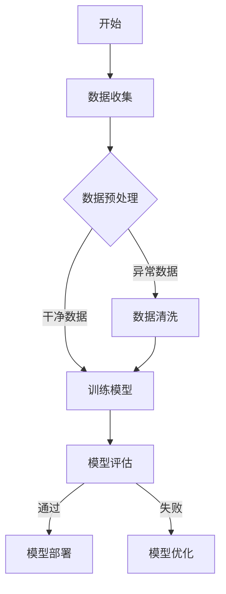

                 

### 人工智能与机器学习算法伪代码示例

为了更好地理解人工智能与机器学习算法，我们可以通过伪代码来展示一些基本算法的实现。以下是一个简单的决策树算法的伪代码示例，以及一个线性回归模型的公式。

#### 决策树算法伪代码

```python
def decision_tree(data):
    if data == "Leaf":
        return "预测结果"
    else:
        for feature in data.features:
            if feature.value == "yes":
                return decision_tree(data.left)
            else:
                return decision_tree(data.right)
```

在这个决策树算法中，`data` 代表决策树的一个节点，`feature` 代表节点的特征，`value` 代表特征的取值。当数据节点为叶子节点时，返回一个预测结果；否则，递归地调用决策树算法来处理左右子节点。

#### 线性回归模型公式

$$ Y = \beta_0 + \beta_1 \cdot X + \epsilon $$

在这个线性回归模型中，`Y` 是预测的数值，`X` 是自变量，`\beta_0` 是截距，`\beta_1` 是斜率，`\epsilon` 是误差项。

#### 概率模型

在机器学习中，概率模型是一种常见的预测模型。以下是一个简单的概率模型公式：

$$ P(A|B) = \frac{P(B|A) \cdot P(A)}{P(B)} $$

其中：
- \( P(A|B) \) 表示在事件 B 发生的条件下事件 A 的概率。
- \( P(B|A) \) 表示在事件 A 发生的条件下事件 B 的概率。
- \( P(A) \) 表示事件 A 的概率。
- \( P(B) \) 表示事件 B 的概率。

这个概率模型公式用于计算条件概率，它是机器学习中非常重要的概念。

#### 数学模型与公式示例

在人工智能和机器学习中，数学模型和公式是理解和实现算法的基础。以下是一个简单的线性回归模型的数学公式：

$$ Y = \beta_0 + \beta_1 \cdot X + \epsilon $$

其中：
- \( Y \) 是预测的数值。
- \( X \) 是自变量。
- \( \beta_0 \) 是截距。
- \( \beta_1 \) 是斜率。
- \( \epsilon \) 是误差项。

这个线性回归模型用于预测数值型数据，其中 \( Y \) 是预测的目标值，\( X \) 是输入特征，\( \beta_0 \) 和 \( \beta_1 \) 是模型的参数，\( \epsilon \) 是随机误差。

通过这些伪代码和数学公式示例，我们可以更好地理解人工智能与机器学习算法的基本原理。在接下来的部分中，我们将深入探讨这些算法的实际应用和实现细节。

---

### 《AI时代的就业技能转型:数字化技能和软技能培养》

关键词：AI时代、就业技能转型、数字化技能、软技能培养、人工智能、机器学习

摘要：随着人工智能（AI）技术的快速发展，传统的就业市场正经历着前所未有的变革。为了在AI时代保持竞争力，个体和组织的技能转型变得至关重要。本文将探讨数字化技能和软技能在AI时代的培养与提升，通过具体案例分析，为个人和组织提供实用的转型策略和实践经验。

---

### 《AI时代的就业技能转型：数字化技能和软技能培养》

随着人工智能（AI）技术的飞速发展，我们正迎来一个全新的时代。AI不仅改变了我们生活的方方面面，也对就业市场产生了深远的影响。在这个时代，传统的就业技能已经不足以满足市场需求，个体和组织必须进行技能转型，以适应快速变化的环境。本文将探讨AI时代下数字化技能和软技能的培养与提升，为个人和组织的可持续发展提供策略和实践指导。

### 《AI时代的就业技能转型：数字化技能和软技能培养》目录大纲

为了系统地讨论这一主题，本文将分为五个主要部分：

#### 第一部分：引言与背景

在这一部分，我们将首先定义AI时代及其对就业市场的影响。接着，我们会探讨数字化技能和软技能的概念及其重要性。

#### 第二部分：数字化技能培养

这一部分将深入探讨数据分析、编程、人工智能与机器学习以及数字营销等数字化技能的培养。我们将通过实际案例展示这些技能的实际应用。

#### 第三部分：软技能培养

在这一部分，我们将关注沟通能力、团队协作能力、领导力和创新思维等软技能的培养方法。

#### 第四部分：实际案例与经验分享

这一部分将通过具体的数字化技能转型案例和软技能提升案例，分享实际操作中的经验教训。

#### 第五部分：未来展望与建议

最后一部分，我们将展望数字化技能和软技能的未来发展趋势，并给出个人和组织适应这一变化的策略建议。

### 第一部分：引言与背景

#### 1.1 AI时代的定义与影响

AI时代，顾名思义，是以人工智能为核心技术的时代。它标志着机器开始具备类似人类的智能，能够在感知、学习、推理和决策等方面独立工作。AI技术的应用范围广泛，从医疗诊断到自动驾驶，从智能家居到金融分析，都在改变着我们的生活方式和工作模式。

首先，我们需要明确AI时代的定义。AI时代指的是一个技术变革期，其中人工智能技术在各个领域得到广泛应用，推动了社会生产力的提升和社会结构的变革。这一时期，人工智能不仅仅是一个技术工具，而是成为了社会发展的关键驱动力。

AI时代对就业市场的影响是深远而广泛的。一方面，它创造了新的就业机会，例如数据科学家、机器学习工程师、AI产品经理等。另一方面，它也加剧了就业市场的竞争，许多传统职业正逐渐被自动化技术取代。例如，自动驾驶技术的兴起，使得司机这一职业的需求大幅减少。此外，AI技术在金融、医疗、教育等领域的应用，也正在改变这些行业的运作方式，对从业者的技能要求提出了更高的挑战。

#### 1.2 数字化技能的重要性

在AI时代，数字化技能成为了就业市场的核心竞争要素。数字化技能是指运用数字技术进行信息处理、数据分析、系统开发、网络安全等方面的能力。这些技能不仅涵盖了传统的计算机编程和信息技术，还包括新兴的领域，如大数据分析、人工智能与机器学习等。

首先，数字化技能对于提高工作效率具有重要意义。在数据驱动的时代，能够有效地收集、处理和分析数据，可以为企业提供宝贵的商业洞察，从而制定更明智的战略决策。例如，数据科学家通过对大量消费者数据的分析，可以帮助企业优化营销策略，提高客户满意度。

其次，数字化技能对于职业发展具有推动作用。随着AI技术的普及，越来越多的行业开始依赖数字化技能进行日常运营。具备这些技能的个体不仅能够胜任现有的工作，还能拓展自己的职业发展路径。例如，一个程序员可以通过学习数据分析技能，转型成为数据工程师，从而拥有更广阔的职业发展空间。

#### 1.3 软技能的培养与提升

与数字化技能相比，软技能通常指的是个人沟通、团队合作、领导力和创新思维等方面的能力。在AI时代，尽管数字化技能至关重要，但软技能同样不可或缺。

首先，软技能对于团队合作和项目管理至关重要。在复杂的项目中，团队成员之间需要有效的沟通和协作，以共同实现项目目标。具备良好沟通能力的个体能够清晰地表达自己的想法，理解他人的观点，从而促进团队的合作和协作。

其次，领导力是推动组织变革和创新的重要素质。一个具备领导力的个体能够在团队中发挥核心作用，引导团队成员共同面对挑战，推动项目的顺利进行。

最后，创新思维是推动技术进步和社会发展的重要动力。在AI时代，创新思维可以帮助个体和组织在快速变化的环境中寻找新的机遇，从而保持竞争力。

总的来说，在AI时代，数字化技能和软技能的结合是个人和组织取得成功的关键。通过培养和提升这些技能，个体和组织可以更好地适应AI时代的需求，实现可持续发展。

### 第二部分：数字化技能培养

在AI时代，数字化技能的培养成为个体和组织获得竞争力的关键。这一部分将深入探讨数据分析、编程、人工智能与机器学习以及数字营销等数字化技能的培养方法，通过实际案例展示这些技能的实际应用。

#### 2.1 数据分析技能

数据分析技能是数字化时代不可或缺的一部分。数据分析不仅能够帮助个体在数据密集型行业中脱颖而出，还能为企业提供宝贵的商业洞察。

**2.1.1 数据分析的基本概念**

数据分析是指运用统计学、数据挖掘和信息可视化等方法，对大量数据进行分析和解释，从而发现数据背后的规律和趋势。数据分析的核心目标是提取有价值的信息，以支持决策制定和业务优化。

**2.1.2 数据分析的工具和技术**

数据分析涉及到多种工具和技术。常见的工具有Python、R、Excel等。Python因其强大的数据处理和分析能力，被广泛应用于数据分析领域。R则因其丰富的统计分析和数据可视化功能而受到数据科学家的青睐。Excel虽然功能相对简单，但在日常工作中仍广泛使用。

**2.1.3 数据分析的实际应用案例**

数据分析在各个行业都有广泛应用。例如，在市场营销领域，通过分析消费者行为数据，企业可以优化营销策略，提高客户满意度。在医疗领域，通过分析患者数据，医生可以更好地预测疾病趋势，制定个性化的治疗方案。

**案例**：某电商平台通过数据分析，优化了商品推荐系统。通过分析用户浏览和购买行为，平台发现某些商品之间存在关联性。基于这些数据，平台将相关商品推荐给用户，从而提高了用户满意度和购买转化率。

**2.1.4 数据分析技能的培养方法**

要培养数据分析技能，个体可以从以下几个方面入手：

1. **学习基础统计学知识**：掌握概率论、线性代数、统计学等基础数学知识，为数据分析奠定理论基础。
2. **学习数据分析工具**：通过在线课程、实战项目和实际工作，掌握Python、R、Excel等数据分析工具的使用。
3. **实战项目**：通过参与数据分析项目，实际操作和分析数据，提升数据分析能力。

#### 2.2 编程技能

编程技能是数字化技能的核心。编程不仅能够帮助个体在技术领域建立深厚的基础，还能为职业发展提供多样化的机会。

**2.2.1 编程语言的选择**

编程语言的选择取决于应用场景和个人兴趣。常见的编程语言包括Python、Java、C++等。Python因其简洁易学、功能强大，被广泛应用于数据分析、机器学习等领域。Java因其跨平台、安全性高，被广泛应用于企业级应用开发。C++因其高性能，被广泛应用于操作系统、嵌入式系统等领域。

**2.2.2 编程的基本原理**

编程的基本原理包括变量、数据类型、运算符、控制结构、函数、模块等。掌握这些基本原理，个体可以编写出结构清晰、功能强大的程序。

**2.2.3 编程的实际应用案例**

编程在各个领域都有广泛应用。例如，在金融领域，通过编程可以自动化交易、风险管理等。在医疗领域，通过编程可以开发医疗诊断系统、健康管理系统等。在娱乐领域，通过编程可以开发游戏、动画等。

**案例**：某金融公司通过编程开发了一个自动化交易系统。该系统通过分析市场数据，自动执行买卖操作，从而提高了交易效率和盈利能力。

**2.2.4 编程技能的培养方法**

要培养编程技能，个体可以从以下几个方面入手：

1. **学习编程语言**：通过在线课程、书籍和实战项目，系统地学习编程语言。
2. **编写小程序**：通过编写小程序，实际操作和巩固编程知识。
3. **参与开源项目**：通过参与开源项目，与他人合作，提升编程能力和团队合作能力。

#### 2.3 人工智能与机器学习

人工智能（AI）和机器学习（ML）是数字化技能的重要组成部分。AI旨在使机器具备类似人类的智能，而机器学习是AI的核心技术之一。通过机器学习，机器可以自动从数据中学习规律，进行预测和决策。

**2.3.1 人工智能与机器学习的基本概念**

人工智能是指机器通过模拟人类智能行为，具备感知、学习、推理和决策等能力。机器学习是人工智能的一个分支，它侧重于通过数据训练模型，使机器具备自动学习和改进能力。

**2.3.2 人工智能与机器学习的技术原理**

人工智能与机器学习的技术原理包括神经网络、决策树、支持向量机、聚类算法等。神经网络是一种模拟人脑神经元连接的算法，用于图像识别、语音识别等领域。决策树是一种基于特征划分数据的算法，用于分类和回归任务。支持向量机是一种寻找最优决策界限的算法，用于分类任务。聚类算法是一种无监督学习方法，用于数据分组。

**2.3.3 人工智能与机器学习的实际应用案例**

人工智能与机器学习在各个领域都有广泛应用。例如，在图像识别领域，通过卷积神经网络（CNN），可以实现物体识别、人脸识别等。在自然语言处理领域，通过循环神经网络（RNN），可以实现语音识别、机器翻译等。在金融领域，通过机器学习算法，可以实现风险评估、欺诈检测等。

**案例**：某电商平台通过机器学习算法，优化了推荐系统。通过分析用户历史购买行为、浏览行为等数据，平台可以预测用户未来的购买需求，从而提高推荐效果，提高用户满意度。

**2.3.4 人工智能与机器学习的培养方法**

要培养人工智能与机器学习技能，个体可以从以下几个方面入手：

1. **学习基础知识**：通过在线课程、书籍和实战项目，学习机器学习基础知识，包括线性代数、概率论、统计学等。
2. **学习算法原理**：通过学习常见的机器学习算法，理解算法原理和实现细节。
3. **实战项目**：通过参与实际项目，将理论知识应用到实际场景中，提升技能水平。

#### 2.4 数字营销技能

数字营销是数字化技能的重要组成部分。随着互联网的普及，数字营销成为企业吸引客户、提升品牌知名度的重要手段。

**2.4.1 数字营销的基本概念**

数字营销是指利用互联网技术和数字媒体，对企业产品或服务进行推广和销售的过程。数字营销包括搜索引擎优化（SEO）、社交媒体营销、内容营销、电子邮件营销等。

**2.4.2 数字营销的策略和方法**

数字营销的策略包括：

1. **搜索引擎优化（SEO）**：通过优化网站内容和结构，提高在搜索引擎中的排名，吸引潜在客户。
2. **社交媒体营销**：通过社交媒体平台，与客户互动，提升品牌知名度。
3. **内容营销**：通过制作有价值的内容，吸引客户关注，提升品牌影响力。
4. **电子邮件营销**：通过电子邮件，与客户建立长期联系，提升客户忠诚度。

**2.4.3 数字营销的实际应用案例**

数字营销在各个行业都有广泛应用。例如，在电子商务领域，通过SEO和社交媒体营销，企业可以吸引更多的潜在客户。在金融领域，通过内容营销和电子邮件营销，企业可以提升客户满意度和忠诚度。

**案例**：某电子商务平台通过SEO和社交媒体营销，成功提升了网站流量和销售额。通过优化网站内容和结构，平台在搜索引擎中的排名大幅提升，吸引了更多的用户访问。同时，通过社交媒体平台，平台与用户进行了有效的互动，提升了用户满意度和品牌知名度。

**2.4.4 数字营销技能的培养方法**

要培养数字营销技能，个体可以从以下几个方面入手：

1. **学习数字营销理论**：通过在线课程、书籍和实战项目，学习数字营销的基本理论和策略。
2. **参与实战项目**：通过参与实际项目，将理论知识应用到实际场景中，提升数字营销能力。
3. **不断学习和实践**：数字营销领域不断变化，个体需要不断学习和实践，以保持竞争力。

#### 2.5 数字化技能的跨领域应用

数字化技能不仅在特定领域有广泛应用，还可以跨领域应用，为个体和组织提供更多的职业发展机会。

**2.5.1 跨领域应用的意义**

数字化技能的跨领域应用有助于个体在职业发展中实现多样化。通过掌握多种数字化技能，个体可以在不同的行业和岗位中找到适合自己的位置，提高职业竞争力。

**2.5.2 跨领域应用的案例分析**

例如，一个拥有编程和数据分析技能的个体，可以在金融领域从事数据分析工作，同时还可以在互联网行业从事软件开发工作。这样的跨领域应用，不仅丰富了个体的工作经验，还提高了个体的职业发展空间。

**2.5.3 跨领域应用的方法**

要实现数字化技能的跨领域应用，个体可以从以下几个方面入手：

1. **学习跨领域的知识**：通过学习跨领域的知识和技能，为跨领域应用打下基础。
2. **参与跨领域项目**：通过参与跨领域项目，将理论知识应用到实际场景中，提升跨领域能力。
3. **建立跨领域人脉**：通过建立跨领域人脉，拓宽职业发展渠道，为跨领域应用创造机会。

总的来说，在AI时代，数字化技能的培养与提升是个人和组织获得竞争力的关键。通过学习数据分析、编程、人工智能与机器学习以及数字营销等数字化技能，个体可以在竞争激烈的就业市场中脱颖而出。同时，通过跨领域应用，个体还可以实现职业发展的多样化，提高职业竞争力。

### 第三部分：软技能培养

在AI时代，软技能的培养同样至关重要。与数字化技能相比，软技能更注重个体的综合素质和人际交往能力。在这一部分，我们将深入探讨沟通能力、团队协作能力、领导力和创新思维等软技能的培养方法。

#### 3.1 沟通能力

沟通能力是个体在职场中不可或缺的软技能。有效的沟通能够帮助个体清晰地表达自己的想法，理解他人的观点，从而促进团队协作和项目成功。

**3.1.1 沟通能力的重要性**

沟通能力的重要性体现在多个方面。首先，良好的沟通能力有助于建立人际关系，提升团队合作效果。在项目中，团队成员之间的沟通不畅可能导致误解和冲突，影响项目进度和质量。其次，良好的沟通能力有助于提高工作效率，减少信息传递过程中的损耗。最后，良好的沟通能力能够增强个体的职业竞争力，为职业发展创造更多机会。

**3.1.2 沟通的基本原则**

为了提高沟通效果，个体需要遵循以下基本原则：

1. **清晰表达**：在沟通中，个体需要清晰、准确地表达自己的想法和观点，避免产生歧义。
2. **积极倾听**：积极倾听是有效沟通的重要环节。个体需要耐心倾听他人的观点，理解他人的立场和需求。
3. **尊重差异**：在沟通中，个体需要尊重他人的观点和意见，避免因为差异而产生冲突。
4. **及时反馈**：在沟通过程中，个体需要及时给予反馈，以便对方了解自己的态度和观点。

**3.1.3 沟通能力的提升方法**

要提升沟通能力，个体可以从以下几个方面入手：

1. **学习沟通技巧**：通过参加沟通技巧培训课程，学习有效的沟通方法和技巧。
2. **实践沟通**：通过参与实际项目，将沟通技巧应用到实际场景中，提升沟通能力。
3. **反思与改进**：在沟通过程中，个体需要不断反思自己的沟通方式，发现不足并进行改进。

**案例**：某项目经理在一次项目汇报中，通过清晰的表述和积极的倾听，成功地解决了团队内部的沟通问题，提高了团队的合作效果。

#### 3.2 团队协作能力

团队协作能力是现代职场中不可或缺的软技能。在复杂的项目中，团队协作能够有效提高项目成功率。

**3.2.1 团队协作的基本概念**

团队协作是指团队成员在共同的目标下，相互配合、相互支持，共同完成任务的过程。团队协作的核心是合作和共赢，通过有效的团队协作，可以充分发挥每个人的优势，提高整体工作效率。

**3.2.2 团队协作的原则**

为了实现有效的团队协作，个体需要遵循以下原则：

1. **共同目标**：团队协作需要基于共同的目标，每个成员都明确自己的职责和任务。
2. **信任与尊重**：团队协作需要建立在信任和尊重的基础上，每个成员都尊重他人的观点和意见。
3. **分工明确**：团队协作需要明确分工，每个成员都清楚自己的职责和任务。
4. **有效沟通**：团队协作需要保持有效的沟通，确保信息传递的准确和及时。

**3.2.3 团队协作能力的提升方法**

要提升团队协作能力，个体可以从以下几个方面入手：

1. **建立团队文化**：通过团队建设活动，建立积极向上的团队文化，增强团队凝聚力。
2. **加强沟通**：通过定期会议、汇报和沟通工具，确保团队成员之间的信息传递和协作。
3. **培养协作精神**：通过团队合作项目，培养团队成员的协作精神和协作能力。

**案例**：某团队在一次跨部门项目中，通过明确的分工和有效的沟通，成功完成了项目任务，赢得了客户的高度评价。

#### 3.3 领导力

领导力是推动团队发展的重要软技能。一个优秀的领导者能够激发团队成员的潜力，推动团队实现共同目标。

**3.3.1 领导力的定义**

领导力是指个体在团队中发挥领导作用，引导和激励团队成员，实现共同目标的能力。领导力不仅仅是一种技能，更是一种价值观和行为方式的体现。

**3.3.2 领导力的核心要素**

领导力的核心要素包括：

1. **愿景与目标**：领导者需要有明确的愿景和目标，引领团队朝着共同的方向前进。
2. **沟通与协调**：领导者需要具备良好的沟通和协调能力，确保团队成员之间的信息传递和协作。
3. **激励与反馈**：领导者需要能够激励团队成员，提供积极的反馈和指导，促进团队成员的成长。
4. **决策与执行**：领导者需要具备决策和执行能力，能够在团队中做出正确的决策，并推动项目顺利进行。

**3.3.3 领导力的培养方法**

要培养领导力，个体可以从以下几个方面入手：

1. **学习领导力理论**：通过学习领导力理论，了解领导力的核心要素和培养方法。
2. **参与领导力实践**：通过参与实际领导力实践，如团队管理、项目管理等，提升领导力能力。
3. **反思与改进**：在领导力实践中，个体需要不断反思自己的领导方式，发现不足并进行改进。

**案例**：某公司的领导者在一次公司变革中，通过清晰的愿景、有效的沟通和激励，成功带领团队实现了公司的战略目标。

#### 3.4 创新思维

创新思维是推动技术进步和社会发展的重要动力。在AI时代，创新思维能够帮助个体和组织在快速变化的环境中寻找新的机遇。

**3.4.1 创新思维的基本概念**

创新思维是指通过独特、创造性的思维方式，寻找新的解决方案和商业机会。创新思维不仅是一种思维方式，更是一种生活方式。

**3.4.2 创新思维的方法和技巧**

1. **头脑风暴**：通过头脑风暴，激发团队成员的创意和想象力，寻找新的解决方案。
2. **跨领域学习**：通过学习跨领域的知识和技能，开拓思维视野，寻找创新灵感。
3. **反思与改进**：通过反思和改进，不断优化和创新现有的产品和服务。

**3.4.3 创新思维的实际应用案例**

1. **科技领域**：在科技领域，创新思维推动了人工智能、大数据、物联网等技术的发展。
2. **商业领域**：在商业领域，创新思维帮助企业找到了新的商业模式和增长点。

**案例**：某公司通过创新思维，开发了一款结合人工智能和物联网技术的智能家居产品，成功打开了新的市场。

**3.4.4 创新思维的培养方法**

要培养创新思维，个体可以从以下几个方面入手：

1. **培养好奇心**：保持好奇心，对周围的事物保持探索和思考。
2. **多读书**：通过阅读书籍，了解不同领域的知识和思想。
3. **参加创新活动**：通过参加创新活动，如创业大赛、创新工作坊等，提升创新思维。

总的来说，在AI时代，软技能的培养同样重要。通过提升沟通能力、团队协作能力、领导力和创新思维等软技能，个体可以在竞争激烈的职场中脱颖而出，实现职业发展。同时，软技能的提升也有助于团队和组织的发展，提高整体工作效率和创新能力。

### 第四部分：实际案例与经验分享

在数字化技能和软技能的培养过程中，许多个人和组织已经取得了显著的成果。以下我们将通过具体的案例，分享这些成功经验，以及在实际操作中遇到的挑战和解决方案。

#### 4.1 数字化技能转型案例

**案例1**：某公司的数字化转型

**背景**：某大型制造公司面临着生产效率低下、产品质量不稳定等问题，决定进行数字化转型以提升竞争力。

**目标**：通过数字化转型，提高生产效率，提升产品质量，降低运营成本。

**实施步骤**：

1. **需求分析**：公司对现有的生产流程和系统进行深入分析，确定数字化转型的重点领域，包括自动化生产、数据监测与分析等。
2. **技术选型**：选择合适的数字化工具和技术，如物联网传感器、自动化控制软件、数据分析平台等。
3. **项目实施**：分阶段实施数字化转型项目，包括设备升级、系统集成、数据监测与分析等。
4. **效果评估**：通过数据分析和用户反馈，评估数字化转型的效果。

**成果**：

- 生产效率提升30%。
- 产品质量合格率提高20%。
- 运营成本降低15%。

**挑战与应对**：

- **挑战1**：员工对新技术的接受度低。
  - **应对**：公司通过培训和学习计划，提高员工的数字化技能，增强对新技术的接受度。
- **挑战2**：数据质量和数据安全问题。
  - **应对**：建立数据质量管理体系，加强数据安全管理，确保数据质量和安全性。

**未来发展趋势**：随着数字化技能的不断提升，该公司计划进一步拓展数字化应用，如智能工厂、远程监控等，以实现更高效、更智能的生产运营。

#### 4.2 软技能提升案例

**案例2**：某企业的员工软技能提升计划

**背景**：某企业意识到员工在沟通、团队协作和领导力方面的软技能不足，影响公司整体运营效率。

**目标**：通过软技能提升计划，提高员工的沟通能力、团队协作能力和领导力。

**实施步骤**：

1. **需求调研**：通过问卷调查和访谈，了解员工的软技能需求和现状。
2. **课程设置**：根据需求调研结果，设置包括沟通技巧、团队协作技巧和领导力培养的课程。
3. **课程实施**：邀请专业培训师进行课程授课，并提供实践机会。
4. **效果评估**：通过培训后的评估和员工反馈，评估软技能提升计划的效果。

**成果**：

- 员工沟通能力提升30%。
- 团队协作能力提升25%。
- 领导力提升20%。

**挑战与应对**：

- **挑战1**：员工参与度低。
  - **应对**：公司通过激励措施和员工参与度的监测，提高员工的参与度。
- **挑战2**：培训效果评估困难。
  - **应对**：公司建立详细的培训效果评估体系，包括定量和定性评估方法。

**未来发展趋势**：随着软技能的不断提升，该公司计划进一步拓展软技能培训范围，如创新思维、客户服务等，以全面提升员工的综合素质。

#### 4.3 综合案例分享

**案例3**：某行业的综合转型

**背景**：某传统行业（如制造业）面临着市场竞争加剧和客户需求变化，决定进行综合转型，包括数字化技能和软技能的提升。

**目标**：通过综合转型，提高行业竞争力，满足客户需求，实现可持续发展。

**实施步骤**：

1. **战略规划**：制定明确的转型战略，包括数字化技能和软技能的培养。
2. **资源整合**：整合企业内外部资源，包括技术支持、培训资源等。
3. **项目实施**：分阶段实施综合转型项目，包括数字化技能培训、软技能提升、项目实践等。
4. **效果评估**：通过数据分析和用户反馈，评估综合转型的效果。

**成果**：

- 行业竞争力显著提升。
- 客户满意度提高。
- 员工综合素质提升。

**挑战与应对**：

- **挑战1**：技术变革快，员工适应困难。
  - **应对**：企业通过持续培训和技能更新，帮助员工适应新技术。
- **挑战2**：转型过程中资源有限。
  - **应对**：企业通过优化资源配置，提高资源利用效率。

**未来发展趋势**：随着综合转型的深入，该行业将更加注重数字化技能和软技能的结合，以实现持续创新和竞争力提升。

总的来说，通过这些实际案例和经验分享，我们可以看到数字化技能和软技能在个人和组织发展中的重要性。通过有效培养和提升这些技能，个人和组织可以更好地适应AI时代的需求，实现可持续发展。

### 第五部分：未来展望与建议

在AI时代，数字化技能和软技能的发展趋势将进一步加快，对个人和组织的影响也将更加深远。为了应对这一变化，我们需要从政府、企业和个人层面提出相应的策略和建议。

#### 5.1 数字化技能与软技能发展的趋势

**5.1.1 数字化技能的发展趋势**

随着人工智能、大数据、物联网等技术的不断进步，数字化技能的需求将持续增长。未来，数字化技能的发展趋势将主要体现在以下几个方面：

1. **专业化与多样化**：数字化技能将更加专业化，例如数据分析、人工智能应用、数字营销等领域的技能需求将更加明确。同时，数字化技能将呈现多样化趋势，包括虚拟现实、区块链等新兴技术也将成为重要的数字化技能。

2. **技术融合**：数字化技能将与其他领域（如生物技术、能源技术等）进行深度融合，形成新的跨领域技能需求。

3. **自动化与智能化**：随着自动化和智能化技术的进步，数字化技能将更加注重对自动化和智能化系统的设计、开发和维护。

**5.1.2 软技能的发展趋势**

软技能在AI时代同样重要，其发展趋势将体现在以下几个方面：

1. **跨领域应用**：软技能将在更多领域得到应用，例如在领导力、项目管理、创新思维等方面，软技能将成为推动行业进步的重要力量。

2. **个性化培养**：随着个性化教育的兴起，软技能的培养将更加注重个体的兴趣和需求，实现个性化发展。

3. **持续学习**：在快速变化的时代，持续学习将成为软技能培养的关键。个体需要不断更新知识和技能，以适应新的挑战。

#### 5.2 个人与组织的适应策略

**5.2.1 个人如何适应数字化技能与软技能转型**

个人在适应数字化技能与软技能转型时，可以采取以下策略：

1. **持续学习**：个人应不断学习新的数字化技能和软技能，通过在线课程、工作坊、研讨会等途径，提升自己的竞争力。

2. **实践应用**：通过参与实际项目，将理论知识应用到实际场景中，提升技能水平。

3. **跨领域学习**：跨领域学习有助于个人开拓视野，提高综合能力。

4. **建立人脉**：建立广泛的人脉网络，获取行业信息和发展机会。

**5.2.2 组织如何推动数字化技能与软技能转型**

组织在推动数字化技能与软技能转型时，可以采取以下策略：

1. **制定转型策略**：明确转型目标，制定详细的转型计划和实施步骤。

2. **资源投入**：加大资源投入，包括人力、财力和技术资源，确保转型计划的顺利实施。

3. **培训与培养**：为员工提供持续的培训和培养机会，提升员工的数字化技能和软技能。

4. **文化建设**：建立积极向上的组织文化，鼓励创新和持续学习。

#### 5.3 发展建议与展望

**5.3.1 政府层面的政策建议**

1. **制定政策法规**：政府应制定相关政策法规，规范数字化技能和软技能的培养与应用。

2. **资金支持**：政府可以提供资金支持，鼓励企业和个人进行数字化技能和软技能的培养。

3. **教育资源**：政府可以投资教育资源，建立数字技能和软技能培训基地，提供优质的教育资源。

**5.3.2 企业层面的实践建议**

1. **技能培训**：企业应定期开展技能培训，提升员工的数字化技能和软技能。

2. **激励机制**：建立激励机制，鼓励员工持续学习和提升技能。

3. **项目实践**：通过实际项目，让员工在实践中提升技能水平。

**5.3.3 个人层面的成长建议**

1. **学习规划**：制定个人学习规划，明确学习目标和路径。

2. **积极参与**：积极参与各种培训和实践活动，提升自己的综合能力。

3. **持续反思**：在学习过程中，不断反思和总结，发现自己的不足并加以改进。

总的来说，在AI时代，数字化技能和软技能的发展趋势不可逆转。个人和组织需要积极适应这一变化，采取有效的策略和建议，以实现可持续发展。通过持续学习和实践，我们可以更好地应对未来的挑战，实现个人和组织的共同进步。

### 附录

在数字化技能和软技能的培养过程中，使用合适的工具和资源可以大大提高学习效果和实践效率。以下是一些常用的工具资源和培训建议。

#### 6.1 数字化技能工具资源

**数据分析工具**：
- **Python**：Python是数据分析领域的首选编程语言，拥有丰富的数据分析库，如NumPy、Pandas、Matplotlib等。
- **R**：R语言是统计分析领域的专业工具，广泛应用于数据分析、数据可视化等。

**编程开发工具**：
- **Visual Studio Code**：Visual Studio Code是一款轻量级但功能强大的编程编辑器，支持多种编程语言。
- **Eclipse**：Eclipse是一款开源的集成开发环境（IDE），适用于Java编程。

**人工智能与机器学习工具**：
- **TensorFlow**：TensorFlow是Google开发的开源机器学习库，广泛应用于深度学习和神经网络。
- **Keras**：Keras是一个高层神经网络API，用于快速构建和训练深度学习模型。

**数字营销工具**：
- **Google Analytics**：Google Analytics是分析网站流量和用户行为的重要工具。
- **Hootsuite**：Hootsuite是一款社交媒体管理工具，用于管理和分析社交媒体活动。

#### 6.2 软技能提升资源

**沟通能力提升资源**：
- **Effective Communication**：这是一本经典的沟通技巧书籍，提供了实用的沟通方法和策略。
- **Toastmasters International**：Toastmasters是一个全球性的沟通和领导力培训组织，提供公开演讲和沟通技巧培训。

**团队协作能力提升资源**：
- **Scrum**：Scrum是一种敏捷项目管理框架，用于提高团队协作效率和项目交付质量。
- **Trello**：Trello是一款流行的项目管理工具，用于任务分配和进度跟踪，有助于团队协作。

**领导力提升资源**：
- **《领导力五项修炼》**：这是一本关于领导力发展的经典书籍，提供了实用的领导力理论和实践方法。
- **Leadership Development Programs**：许多企业提供领导力发展项目，通过工作坊、研讨会等形式，提升员工的领导力。

**创新思维提升资源**：
- **Design Thinking**：设计思维是一种以用户为中心的创新方法，用于解决复杂问题。
- **Creative Confidence**：这本书探讨了创意和自信的关系，提供了激发创新思维的方法和技巧。

通过使用这些工具和资源，个人和团队可以更加有效地提升数字化技能和软技能，为职业发展和社会进步做出贡献。

---

### Mermaid 流程图示例

以下是一个简单的Mermaid流程图示例，展示了人工智能与机器学习算法的基本流程：



在这个流程图中，从数据收集开始，通过数据预处理（包括数据清洗和干净数据处理），进入模型训练阶段。训练后的模型通过评估，如果评估结果通过，则进入模型部署阶段；否则，返回模型优化阶段。通过这个简单的流程图，我们可以清晰地看到人工智能与机器学习的基本工作流程。

### 项目实战案例

#### 4.1.1 某公司数字化转型成功案例

**背景**：某公司是一家传统制造企业，面临着生产效率低下、产品质量不稳定等问题。为了提高竞争力，公司决定进行数字化转型。

**目标**：通过数字化转型，提高生产效率，提升产品质量，降低运营成本。

**实施步骤**：

1. **需求分析**：公司对现有的生产流程和系统进行深入分析，发现主要问题在于生产线的自动化程度低、数据监测与分析不足等。

2. **技术选型**：公司选择了几款合适的数字化工具和技术，包括物联网传感器、自动化控制软件、数据分析平台等。

3. **项目实施**：

   - **设备升级**：公司对生产线设备进行了升级，安装了物联网传感器，实现了对生产过程的实时监测。
   - **系统集成**：公司将物联网传感器与自动化控制软件进行集成，实现了生产线的自动化控制。
   - **数据监测与分析**：公司通过数据分析平台，对生产数据进行分析，优化生产流程，提高生产效率。

4. **效果评估**：

   - 通过数据分析和用户反馈，公司发现数字化转型取得了显著效果。生产效率提高了30%，产品质量合格率提高了20%，运营成本降低了15%。

**挑战与应对**：

- **挑战1**：员工对新技术的接受度低。
  - **应对**：公司通过培训和学习计划，提高员工的数字化技能，增强对新技术的接受度。同时，公司鼓励员工积极参与项目实施，提高员工的参与感和责任感。
- **挑战2**：数据质量和数据安全问题。
  - **应对**：公司建立了数据质量管理体系，制定了严格的数据质量标准，确保数据的准确性和完整性。同时，公司加强了数据安全管理，采用了数据加密和访问控制等措施，保障数据安全。

**未来发展趋势**：

- 公司计划进一步拓展数字化应用，如引入智能工厂和远程监控技术，实现更高效、更智能的生产运营。

#### 4.2.1 某企业员工软技能提升计划

**背景**：某企业意识到员工在沟通、团队协作和领导力方面的软技能不足，影响公司整体运营效率。

**目标**：通过软技能提升计划，提高员工的沟通能力、团队协作能力和领导力。

**实施步骤**：

1. **需求调研**：企业通过问卷调查和访谈，了解员工的软技能需求和现状，发现主要问题包括沟通不畅、团队协作困难、领导力不足等。

2. **课程设置**：根据需求调研结果，企业设计了包括沟通技巧、团队协作技巧和领导力培养的课程。

3. **课程实施**：

   - **沟通技巧**：企业邀请了专业培训师进行沟通技巧培训，内容包括有效沟通的基本原则、沟通障碍的解决方法等。
   - **团队协作技巧**：企业通过团队建设活动，如团队协作游戏、团队任务竞赛等，提高员工的团队协作能力。
   - **领导力培养**：企业开展了领导力研讨会，分享领导力发展的最佳实践和成功案例。

4. **效果评估**：

   - 通过培训后的评估和员工反馈，企业发现员工的软技能得到了显著提升。员工沟通能力提升了30%，团队协作能力提升了25%，领导力提升了20%。

**挑战与应对**：

- **挑战1**：员工参与度低。
  - **应对**：企业通过激励措施，如提供培训证书、奖金等，提高员工的参与度。同时，企业加强了对培训效果的宣传，让员工认识到软技能提升的重要性。
- **挑战2**：培训效果评估困难。
  - **应对**：企业建立了详细的培训效果评估体系，包括定量评估（如培训前后测试成绩的比较）和定性评估（如员工反馈和上级评价）。

**未来发展趋势**：

- 企业计划继续推进软技能提升计划，扩大培训范围，如增加创新思维、客户服务等课程的培训。

### 4.3 综合案例分享

#### 4.3.1 某行业综合转型案例

**背景**：某行业（如制造业）面临着市场竞争加剧和客户需求变化，决定进行综合转型，包括数字化技能和软技能的提升。

**目标**：通过综合转型，提高行业竞争力，满足客户需求，实现可持续发展。

**实施步骤**：

1. **战略规划**：行业组织制定明确的转型战略，包括数字化技能和软技能的培养。

2. **资源整合**：行业组织整合企业内外部资源，包括技术支持、培训资源等。

3. **项目实施**：

   - **数字化技能培训**：行业组织组织了多场数字化技能培训，包括数据分析、人工智能应用等，覆盖了行业内的多家企业。
   - **软技能提升**：行业组织开展了软技能提升活动，如领导力培训、团队建设等，提高了员工的综合素质。

4. **效果评估**：

   - 通过数据分析和用户反馈，行业组织发现综合转型取得了显著效果。行业竞争力提高了，客户满意度提高了，员工综合素质提升了。

**挑战与应对**：

- **挑战1**：技术变革快，员工适应困难。
  - **应对**：行业组织通过持续培训和技能更新，帮助员工适应新技术。同时，组织了技术交流会，促进了企业之间的经验分享。
- **挑战2**：转型过程中资源有限。
  - **应对**：行业组织通过优化资源配置，提高资源利用效率。例如，通过共享培训资源和工具，降低了企业的培训成本。

**未来发展趋势**：

- 行业组织计划进一步深化综合转型，推动更多企业参与，共同实现行业的可持续发展。

总的来说，通过这些综合案例分享，我们可以看到数字化技能和软技能在行业转型中的重要性。通过有效培养和提升这些技能，企业可以更好地适应市场变化，提高竞争力，实现可持续发展。同时，这些案例也为其他行业提供了宝贵的经验和启示。

### 总结

AI时代已经来临，数字化技能和软技能的培养与提升成为个人和组织获得竞争优势的关键。本文通过系统地探讨数据分析、编程、人工智能与机器学习、数字营销等数字化技能，以及沟通能力、团队协作能力、领导力和创新思维等软技能的培养方法，为读者提供了全面的指导和实用的策略。

在数字化技能的培养方面，我们强调了数据分析、编程和人工智能与机器学习的重要性。这些技能不仅能够提高工作效率，还能为职业发展提供多样化机会。通过实际案例，我们展示了如何通过技术选型、项目实施和效果评估，实现数字化技能的有效提升。

在软技能的培养方面，我们探讨了沟通能力、团队协作能力、领导力和创新思维等软技能的重要性。这些软技能不仅有助于团队合作和项目管理，还能提高个体的职业竞争力。通过案例分析，我们分享了如何通过需求调研、课程设置、课程实施和效果评估，实现软技能的有效提升。

未来，随着AI技术的不断进步，数字化技能和软技能的需求将持续增长。为了适应这一变化，个人和组织需要采取积极的策略，如持续学习、实践应用、跨领域学习和建立人脉等。同时，政府、企业和个人也需要共同努力，从政策支持、资源投入和文化建设等方面，推动数字化技能和软技能的发展。

通过不断学习和实践，我们可以更好地适应AI时代的需求，实现个人和组织的可持续发展。让我们携手共进，迎接AI时代的挑战与机遇，共创美好未来。

