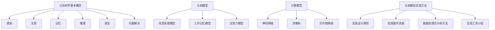
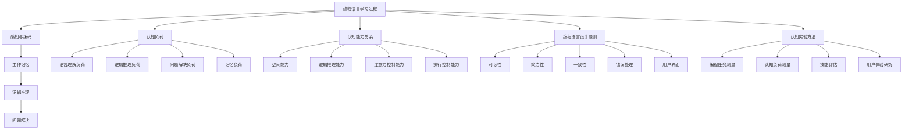
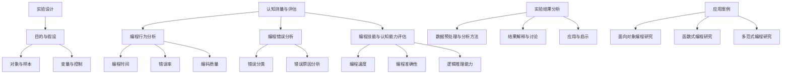

                 

### 文章标题

**AI编程语言的认知科学实验方法论**

> **关键词：** 认知科学、AI编程语言、实验方法论、认知模拟、编程教育

**摘要：**
本文旨在探讨认知科学实验方法在AI编程语言研究中的应用。通过分析认知科学的基本概念与理论，本文介绍了认知模型与计算模型的关系，以及认知模拟实验方法。进一步地，本文详细探讨了编程语言的认知心理学研究，编程语言设计的认知原则，以及编程语言认知心理学实验方法。在此基础上，本文提出了AI编程语言的认知实验方法，并详细分析了编程行为、编程错误以及编程技能与认知能力的关系。随后，本文介绍了认知科学实验方法在编程语言开发、编程教育以及编程工具开发中的应用，并给出了具体的应用案例。最后，本文总结了认知科学实验方法在AI编程语言研究中的贡献、未来发展趋势以及面临的挑战，并展望了未来的研究方向。通过本文的研究，旨在为相关领域的研究者、开发者和教育工作者提供有价值的参考和启示。

### 第一部分: AI编程语言的认知科学实验方法论概述

#### 第1章: 认知科学导论

在探讨AI编程语言的认知科学实验方法论之前，有必要对认知科学的基本概念与理论进行梳理。认知科学是一门跨学科领域，致力于研究人类认知过程的本质、机制和功能。它融合了心理学、神经科学、计算机科学、哲学等多个学科的知识，以揭示人类思维、学习、记忆、感知等认知过程的工作原理。

##### 1.1 认知科学的基本概念与理论

认知科学的基本概念包括感知、注意、记忆、推理、语言、问题解决等。这些概念构成了认知心理学研究的基础。以下是几个核心概念的定义和理论：

- **感知（Perception）**：人类如何通过感官接收外部信息并解释这些信息。感知过程包括感觉、知觉和注意三个阶段。感觉是指感官接收外部刺激，知觉是指大脑对感觉信息进行组织和解释，而注意是指选择和聚焦特定的感觉信息。

- **注意（Attention）**：注意力是人类心智资源的一个重要方面，它决定了我们在特定时刻关注哪些信息。注意理论包括单通道模型、多通道模型和资源分配模型等。

- **记忆（Memory）**：记忆是大脑存储、检索和使用信息的能力。记忆分为短期记忆和长期记忆，其中短期记忆主要涉及工作记忆，而长期记忆涉及长期存储的信息。

- **推理（Reasoning）**：推理是人们运用已有知识和信息进行逻辑推理和判断的过程。推理分为演绎推理和归纳推理，前者基于前提得出结论，后者基于实例归纳出一般规律。

- **语言（Language）**：语言是人类交流思想和信息的重要工具。语言处理涉及语音识别、词汇语义、语法结构、语言生成和理解等。

- **问题解决（Problem Solving）**：问题解决是指人们面对问题和挑战时，运用知识和策略寻找解决方案的过程。问题解决包括问题表征、策略选择、执行和评估等阶段。

##### 1.2 认知模型与计算模型的关系

认知模型与计算模型是认知科学中两个重要的研究方法。它们分别从不同的角度出发，试图理解和模拟人类认知过程。

- **认知模型**：认知模型是基于心理学理论和实验数据建立的，用于描述和解释人类认知过程的理论框架。认知模型通常包括信息处理模型、工作记忆模型、注意力模型等。这些模型通过模拟认知过程，帮助研究者更好地理解认知机制。

- **计算模型**：计算模型则是基于计算机科学和数学理论建立的，用于模拟和实现认知过程的算法和系统。计算模型包括神经网络、决策树、贝叶斯网络等。计算模型通过计算模拟，验证和扩展认知模型的理论。

认知模型与计算模型之间的关系可以总结为以下几点：

- **相互补充**：认知模型和计算模型相互补充，前者提供了理论框架和实验依据，后者提供了具体的实现和验证手段。
- **相互转化**：在某些情况下，认知模型可以转化为计算模型，而计算模型也可以反过来验证认知模型。这种转化有助于深化对认知过程的理解。
- **交叉验证**：通过认知模型和计算模型的交叉验证，可以验证认知理论的正确性和有效性，提高认知研究的可信度。

##### 1.3 认知模拟实验方法

认知模拟实验方法是通过设计和实施实验，模拟人类认知过程，从而揭示认知机制的研究方法。认知模拟实验方法包括以下几种：

- **实验设计原则**：认知模拟实验设计应遵循科学性和可重复性原则，确保实验结果的可靠性和有效性。实验设计应包括明确的实验目标、假设、变量和控制等。
- **实验操作流程**：认知模拟实验操作流程包括受试者招募、实验任务设计、数据收集和数据分析等步骤。实验任务设计应尽可能接近真实的认知任务，确保实验结果的普适性。
- **数据处理与分析方法**：数据处理和分析方法包括描述性统计分析、回归分析、因子分析等。通过数据分析，可以揭示实验结果之间的联系和规律。
- **实验工具介绍**：认知科学实验工具包括功能性磁共振成像（fMRI）、电生理记录技术、脑机接口（BCI）等。这些工具可以无创、实时地监测大脑活动，为认知模拟提供数据支持。

通过认知模拟实验方法，研究者可以深入理解人类认知过程的机制和规律，为AI编程语言设计、编程教育和编程工具开发提供科学依据。

#### Mermaid 流程图：

#### 1.4 认知科学在人工智能中的应用

认知科学在人工智能（AI）领域中的应用具有重要意义。通过借鉴认知科学的理论和方法，AI系统可以更好地模拟人类思维过程，实现更高级的智能。以下是认知科学在AI中的应用：

- **认知建模方法在AI中的应用**：认知建模方法将人类认知过程转化为算法模型，例如神经网络模型、决策树模型等。这些模型可以用于图像识别、自然语言处理、游戏智能等AI任务。

- **认知计算模型在自然语言处理中的应用**：认知计算模型在自然语言处理中发挥了重要作用，例如语义分析、情感识别、机器翻译等。这些模型通过模拟人类语言理解过程，实现了对复杂语言现象的处理。

- **认知模拟在决策支持系统中的应用**：认知模拟通过模拟人类决策过程，为决策支持系统提供决策建议。认知模拟在风险管理、投资决策、医疗诊断等领域具有广泛的应用前景。

通过认知科学的方法和理论，AI系统不仅可以实现更高效的计算和推理，还可以更好地理解和模拟人类认知过程，实现更智能、更人性化的AI应用。

### 第一部分总结

在本章中，我们介绍了认知科学的基本概念与理论，阐述了认知模型与计算模型的关系，并详细探讨了认知模拟实验方法。通过认知科学的理论和方法，我们可以更好地理解人类认知过程，为AI编程语言设计、编程教育和编程工具开发提供科学依据。在下一章中，我们将进一步探讨编程语言的认知心理学研究，分析编程语言学习的过程与心理机制。

#### 第1章: 认知科学导论

##### 1.1 认知科学的基本概念与理论

认知科学是研究人类心智和行为的一门跨学科领域，它试图通过融合心理学、神经科学、计算机科学和哲学等多个学科的知识，来理解和解释人类认知过程。以下是认知科学中几个核心概念的定义和理论：

- **感知（Perception）**：感知是指个体通过感官接收外界刺激并对其解释的过程。感知包括感觉、知觉和注意三个阶段。感觉是感官接收刺激的过程，知觉是对感觉信息进行组织和解释的过程，注意则是在特定时刻选择和聚焦特定的感觉信息。

- **注意（Attention）**：注意是个体在感知过程中选择和集中注意力的一种心理现象。注意理论包括单通道模型、多通道模型和资源分配模型等，这些理论试图解释个体如何在有限的心理资源下选择和处理信息。

- **记忆（Memory）**：记忆是大脑存储、检索和使用信息的能力。根据记忆持续的时间，记忆可以分为短期记忆和长期记忆。短期记忆，也称为工作记忆，主要负责临时存储和处理信息；长期记忆则负责存储长期的信息，包括语义记忆、情景记忆等。

- **推理（Reasoning）**：推理是指个体运用已有知识和信息进行逻辑思考和判断的过程。推理可以分为演绎推理和归纳推理。演绎推理从一般原则推导出特定结论，而归纳推理则从特定实例推导出一般规律。

- **语言（Language）**：语言是人类交流和表达思想的重要工具。语言处理涉及语音识别、词汇语义、语法结构、语言生成和理解等。认知科学中的语言研究试图揭示语言是如何在大脑中存储和处理的。

- **问题解决（Problem Solving）**：问题解决是指个体面对问题和挑战时，运用知识和策略寻找解决方案的过程。问题解决包括问题表征、策略选择、执行和评估等阶段。认知科学中的问题解决研究试图理解个体在解决问题时的认知过程和策略。

##### 1.2 认知模型与计算模型的关系

认知模型和计算模型是认知科学研究中的两个重要工具。它们分别从不同的角度出发，试图理解和模拟人类认知过程。

- **认知模型**：认知模型是基于心理学理论和实验数据建立的，用于描述和解释人类认知过程的理论框架。认知模型包括信息处理模型、工作记忆模型、注意力模型等。这些模型通过模拟认知过程，帮助研究者更好地理解认知机制。

- **计算模型**：计算模型是基于计算机科学和数学理论建立的，用于模拟和实现认知过程的算法和系统。计算模型包括神经网络、决策树、贝叶斯网络等。计算模型通过计算模拟，验证和扩展认知模型的理论。

认知模型与计算模型之间的关系可以总结为以下几点：

- **相互补充**：认知模型和计算模型相互补充，认知模型提供了理论框架和实验依据，计算模型提供了具体的实现和验证手段。

- **相互转化**：在某些情况下，认知模型可以转化为计算模型，而计算模型也可以反过来验证认知模型。这种转化有助于深化对认知过程的理解。

- **交叉验证**：通过认知模型和计算模型的交叉验证，可以验证认知理论的正确性和有效性，提高认知研究的可信度。

##### 1.3 认知模拟实验方法

认知模拟实验方法是通过设计和实施实验，模拟人类认知过程，从而揭示认知机制的研究方法。以下是认知模拟实验方法的几个关键方面：

- **实验设计原则**：认知模拟实验设计应遵循科学性和可重复性原则，确保实验结果的可靠性和有效性。实验设计应包括明确的实验目标、假设、变量和控制等。

- **实验操作流程**：认知模拟实验操作流程包括受试者招募、实验任务设计、数据收集和数据分析等步骤。实验任务设计应尽可能接近真实的认知任务，确保实验结果的普适性。

- **数据处理与分析方法**：数据处理和分析方法包括描述性统计分析、回归分析、因子分析等。通过数据分析，可以揭示实验结果之间的联系和规律。

- **实验工具介绍**：认知科学实验工具包括功能性磁共振成像（fMRI）、电生理记录技术、脑机接口（BCI）等。这些工具可以无创、实时地监测大脑活动，为认知模拟提供数据支持。

通过认知模拟实验方法，研究者可以深入理解人类认知过程的机制和规律，为AI编程语言设计、编程教育和编程工具开发提供科学依据。

#### Mermaid 流程图：

##### 1.4 认知科学在人工智能中的应用

认知科学在人工智能（AI）领域中的应用具有重要意义。通过借鉴认知科学的理论和方法，AI系统可以更好地模拟人类思维过程，实现更高级的智能。以下是认知科学在AI中的应用：

- **认知建模方法在AI中的应用**：认知建模方法将人类认知过程转化为算法模型，例如神经网络模型、决策树模型等。这些模型可以用于图像识别、自然语言处理、游戏智能等AI任务。

- **认知计算模型在自然语言处理中的应用**：认知计算模型在自然语言处理中发挥了重要作用，例如语义分析、情感识别、机器翻译等。这些模型通过模拟人类语言理解过程，实现了对复杂语言现象的处理。

- **认知模拟在决策支持系统中的应用**：认知模拟通过模拟人类决策过程，为决策支持系统提供决策建议。认知模拟在风险管理、投资决策、医疗诊断等领域具有广泛的应用前景。

通过认知科学的方法和理论，AI系统不仅可以实现更高效的计算和推理，还可以更好地理解和模拟人类认知过程，实现更智能、更人性化的AI应用。

### 第一部分总结

在本章中，我们介绍了认知科学的基本概念与理论，阐述了认知模型与计算模型的关系，并详细探讨了认知模拟实验方法。通过认知科学的理论和方法，我们可以更好地理解人类认知过程，为AI编程语言设计、编程教育和编程工具开发提供科学依据。在下一章中，我们将进一步探讨编程语言的认知心理学研究，分析编程语言学习的过程与心理机制。

---

### 第一部分总结

在本章中，我们系统地介绍了认知科学的基本概念与理论，详细阐述了认知模型与计算模型的关系，并探讨了认知模拟实验方法。首先，我们明确了感知、注意、记忆、推理、语言和问题解决等核心概念，并介绍了这些概念在认知科学中的理论背景。接着，我们分析了认知模型和计算模型的关系，强调了它们在认知科学研究中的互补作用。此外，我们还详细介绍了认知模拟实验方法，包括实验设计原则、操作流程、数据处理与分析方法，以及常用的实验工具。

通过认知科学的理论和方法，我们不仅能够更深入地理解人类认知过程的工作机制，还能为AI编程语言设计、编程教育和编程工具开发提供坚实的科学依据。认知科学在人工智能领域中的应用也展示了其巨大的潜力，特别是在自然语言处理、决策支持系统等方面的贡献。

在下一章中，我们将进一步探讨编程语言的认知心理学研究，分析编程语言学习的过程与心理机制。我们还将讨论编程语言设计的认知原则，以及如何通过认知心理学实验方法来评估编程语言的认知负荷和效率。通过这些研究，我们希望能够为AI编程语言的设计提供更科学、更实用的指导。

### 第二部分：编程语言的认知研究

#### 第2章: 编程语言的认知心理学研究

##### 2.1 编程语言学习的过程与心理机制

编程语言学习是一个复杂而动态的认知过程，涉及多种心理机制的互动。理解这些心理机制对于提高编程学习的效率和效果至关重要。以下是编程语言学习过程中几个关键的心理机制：

- **感知与编码**：编程语言学习的第一步是感知和理解语言的基本符号和语法结构。学习者需要通过阅读和理解代码，将抽象的编程概念转化为具体的感知体验。在这个过程中，感知的准确性和编码的效率直接影响后续的学习效果。

- **工作记忆**：工作记忆在学习编程中起着至关重要的作用。编程任务往往需要短期记忆来处理和存储中间结果、变量值和逻辑步骤。工作记忆的容量和保持时间限制了编程任务的复杂度，因此如何有效利用工作记忆资源是一个关键问题。

- **逻辑推理**：编程语言学习中的逻辑推理能力是编程技能的核心。编程任务要求学习者能够根据问题陈述和已有知识，设计出合适的算法和代码。逻辑推理能力包括推理的有效性、一致性和创新性，它直接影响编程的复杂度和解决问题的能力。

- **问题解决**：编程学习中的问题解决过程包括问题识别、方案设计、代码实现和测试等多个步骤。问题解决能力不仅涉及逻辑推理，还涉及创造力、决策能力和实验精神。有效的编程学习需要培养这些综合能力。

##### 2.2 编程语言使用的认知负荷

编程语言的使用会产生认知负荷，即大脑在处理编程任务时的认知资源消耗。认知负荷可以分为几种不同的类型，每种类型都对编程体验和学习效率有显著影响：

- **语言理解负荷**：编程语言理解负荷是指大脑在解析代码、理解变量、函数和类等概念时所需的认知资源。高级编程语言通常具有更高的理解负荷，因为它们包含更复杂的语法和语义。

- **逻辑推理负荷**：编程任务要求学习者进行逻辑推理，以设计算法、解决编程问题和调试代码。逻辑推理负荷与编程任务的复杂度和抽象层次有关，高层次的编程语言（如函数式编程语言）通常具有较低的逻辑推理负荷。

- **问题解决负荷**：编程中的问题解决过程涉及不断尝试和错误，这种过程会产生较高的认知负荷。问题解决负荷与问题的复杂度、解决路径的多样性和学习者的经验有关。

- **记忆负荷**：编程任务往往需要记忆大量的代码、函数和库，这种记忆负荷会影响编程效率和记忆力。记忆负荷可以通过优化编程语言设计、使用更好的编程工具和提供有效的学习资源来减轻。

##### 2.3 编程技能与认知能力的关系

编程技能与认知能力之间存在密切的关系。以下是一些关键的认知能力及其在编程中的作用：

- **空间能力**：空间能力是指理解和操作三维空间关系的能力。编程中的图形编程、算法可视化等任务要求良好的空间能力。空间能力与编程效率和学习速度有显著的正相关关系。

- **逻辑推理能力**：逻辑推理能力是指分析和解决逻辑问题、建立逻辑关系的能力。编程任务中的算法设计、逻辑错误修复等过程都依赖于逻辑推理能力。逻辑推理能力对编程技能的提升有重要影响。

- **注意力控制能力**：注意力控制能力是指集中注意力、管理注意力的能力。在编程过程中，需要持续关注代码细节、识别和解决问题，因此注意力控制能力对编程效率和问题解决能力有显著影响。

- **执行控制能力**：执行控制能力是指根据目标和计划进行行动、调整策略的能力。编程任务往往需要执行控制能力来管理代码开发过程、解决问题和进行项目规划。

通过提高这些认知能力，编程学习者可以更高效地掌握编程技能，提高编程效率和质量。认知能力的发展可以通过专门的训练和练习来实现，例如逻辑推理训练、空间能力训练等。

##### 2.4 编程语言设计的认知原则

编程语言设计应该遵循一些基本的认知原则，以确保编程语言的可读性、易用性和高效性。以下是一些关键的认知原则：

- **可读性**：编程语言的可读性直接影响认知效率。清晰、简洁的语言更容易被理解和记忆。编程语言的设计应该注重符号的可识别性、语法的一致性和代码结构的层次化。

- **简洁性**：编程语言的简洁性有助于降低认知负担，减少不必要的认知负荷。简洁性设计原则包括减少冗余、简化语法、提高语义清晰度等。

- **一致性**：编程语言的一致性设计可以减少学习负担，使学习者更容易掌握语言规则。一致性包括语法、命名约定、函数和类的设计等方面。

- **错误处理**：编程语言的设计应考虑错误处理机制，降低认知成本。有效的错误处理机制包括异常处理、调试工具、错误提示等。

- **用户界面**：编程工具的用户界面设计应考虑认知科学原理，提高用户的操作效率和满意度。用户界面设计应简洁直观、反馈及时、功能明确。

通过遵循这些认知原则，编程语言可以更好地满足学习者和开发者的需求，提高编程体验和效率。

##### 2.5 编程语言认知心理学实验方法

编程语言认知心理学实验方法是通过设计和实施实验，测量和评估编程语言对认知过程的影响。以下是一些常用的编程语言认知心理学实验方法：

- **编程任务测量**：通过设计不同的编程任务，评估学习者在特定编程语言中的表现。编程任务测量可以包括编程时间、错误率、代码质量等指标。

- **认知负荷测量**：使用心理测量工具（如问卷、思维过程记录等）评估编程过程中产生的认知负荷。认知负荷测量可以帮助理解编程任务对大脑资源的需求。

- **技能评估**：通过编程测试和项目评估等方法，评估学习者的编程技能水平。技能评估可以包括编码速度、编码质量、问题解决能力等。

- **用户体验研究**：通过问卷调查、用户访谈和用户测试等方法，收集学习者对编程语言和工具的使用体验。用户体验研究可以帮助改进编程语言的设计和工具的功能。

通过这些实验方法，研究者可以深入理解编程语言对认知过程的影响，为编程语言的设计和优化提供科学依据。

#### Mermaid 流程图：

##### 2.6 编程语言认知心理学研究的挑战与未来方向

编程语言认知心理学研究面临一些挑战，同时也具有广阔的发展前景。以下是一些主要的挑战和未来方向：

- **研究方法的多样化**：现有的编程语言认知心理学研究方法相对单一，需要开发更多多样化的方法，如虚拟现实技术、眼动追踪技术等，以提高实验的准确性和可靠性。

- **跨学科合作**：编程语言认知心理学研究需要跨学科的合作，包括认知科学、计算机科学、心理学、教育学等。通过跨学科合作，可以借鉴不同领域的先进理论和技术，推动研究的发展。

- **实验设计的复杂性**：编程语言认知心理学实验设计复杂，需要考虑编程任务的多样性和复杂性，以及实验环境的多变性。未来需要开发更灵活、更高效的实验设计方法。

- **数据分析的挑战**：编程语言认知心理学实验数据通常具有高维性和复杂性，需要进行有效的数据分析。未来需要开发更先进的数据分析方法和工具，以提高数据分析的准确性和效率。

- **教育应用的深化**：编程语言认知心理学研究可以应用于编程教育中，帮助改进教学方法和策略。未来研究方向包括开发基于认知科学的编程教育工具和课程，提高编程教育的效果和效率。

通过解决这些挑战，编程语言认知心理学研究将能够更好地理解编程过程中的认知机制，为编程语言的设计、优化和应用提供科学依据。

### 第二部分总结

在本章中，我们详细探讨了编程语言的认知心理学研究，分析了编程语言学习的过程与心理机制，以及编程语言使用的认知负荷和编程技能与认知能力的关系。我们还讨论了编程语言设计的认知原则，并介绍了常用的编程语言认知心理学实验方法。通过这些研究，我们能够更好地理解编程过程中的认知机制，为编程语言的设计和优化提供科学依据。在下一章中，我们将深入探讨AI编程语言的认知实验方法，进一步揭示编程语言在人工智能领域的应用。

### 第二部分总结

在本章中，我们系统地探讨了编程语言的认知心理学研究，分析了编程语言学习的过程与心理机制，以及编程语言使用的认知负荷和编程技能与认知能力的关系。我们首先介绍了编程语言学习过程中涉及的感知与编码、工作记忆、逻辑推理和问题解决等关键心理机制。接着，我们讨论了编程语言使用过程中产生的认知负荷，包括语言理解负荷、逻辑推理负荷、问题解决负荷和记忆负荷。此外，我们还分析了编程技能与认知能力之间的关系，强调了空间能力、逻辑推理能力、注意力控制能力和执行控制能力在编程中的重要性。

在编程语言设计方面，我们提出了几个关键的认知原则，如可读性、简洁性、一致性、错误处理和用户界面设计，这些原则有助于提高编程语言的可读性和易用性。我们详细介绍了编程语言认知心理学实验方法，包括编程任务测量、认知负荷测量、技能评估和用户体验研究等。这些实验方法为我们理解编程过程中的认知机制提供了重要的工具。

通过本章的研究，我们不仅深入了解了编程语言学习过程中的认知机制，还为编程语言的设计和优化提供了科学依据。这些研究结果对编程教育、编程工具开发和AI编程语言设计等领域具有重要参考价值。在下一章中，我们将进一步探讨AI编程语言的认知实验方法，以揭示编程语言在人工智能领域的应用。

---

### 第3章: AI编程语言的认知实验方法

在本章中，我们将探讨AI编程语言的认知实验方法，旨在通过实验来揭示编程语言对认知过程的影响，为编程语言的设计、优化和应用提供科学依据。认知实验方法是一种通过设计和实施实验来模拟和测量人类认知过程的方法，其核心在于理解认知行为、认知负荷以及认知能力的动态变化。

#### 3.1 AI编程语言的认知科学实验设计

AI编程语言的认知科学实验设计是认知实验方法在编程领域中的应用，其主要目标是通过实验来评估编程语言对学习效率、编程体验和认知负荷的影响。以下是一个典型的实验设计过程：

##### 实验目的与假设

实验目的：研究Python和Java两种编程语言在解决相同复杂度问题时的认知负荷和编程效率。

实验假设：
- 假设1：Python编程语言因其简洁性和易读性，将具有较低的认知负荷和较高的编程效率。
- 假设2：Java编程语言因其严格的语法和结构，将具有较高的认知负荷和较低的编程效率。

##### 实验对象与样本选择

实验对象：选择具有相似背景和编程经验的大学生作为实验对象，确保实验结果的普遍性和可靠性。

样本选择：从参与实验的大学计算机科学专业学生中随机选取两组，每组20人。两组学生将在不同的编程语言环境中完成相同的编程任务。

##### 实验变量与控制

实验变量：
- 自变量：编程语言（Python和Java）。
- 因变量：编程时间、错误率、编程效率、认知负荷。

控制变量：
- 控制变量包括实验环境（如计算机配置、编程工具等）、编程任务难度、实验时间等，以确保实验结果的准确性。

#### 3.2 AI编程语言的认知测量与评估

认知测量与评估是认知实验方法的核心，通过测量和评估编程语言对认知过程的影响，我们可以更好地理解编程行为和认知负荷。以下是一些常用的认知测量与评估方法：

##### 编程行为分析

编程行为分析通过观察和记录编程过程中的行为来评估编程效率和质量。常用的编程行为分析指标包括：

- 编程时间：记录编程任务从开始到完成所需的总时间。
- 错误率：计算编程过程中出现的错误次数与总代码行数的比值。
- 编码质量：评估代码的可读性、简洁性和模块化程度。

##### 编程错误分析

编程错误分析是理解编程过程中认知错误产生机制的重要手段。通过分析编程错误类型和原因，我们可以揭示编程语言的认知负荷和复杂性。编程错误分析包括：

- 错误分类：将编程错误分类为语法错误、逻辑错误、运行时错误等。
- 错误原因分析：分析导致错误的原因，如注意力分散、逻辑推理错误、记忆错误等。

##### 编程技能与认知能力的评估

编程技能与认知能力的评估是衡量编程语言学习效果的重要方法。评估指标包括：

- 编程速度：评估学习者完成编程任务的速度。
- 编程准确性：评估学习者编程过程中的错误率。
- 逻辑推理能力：评估学习者在编程任务中的逻辑推理能力和问题解决能力。

常用的评估工具包括编程测试平台、技能评估问卷和专家评估等。

#### 3.3 AI编程语言的认知实验结果分析

实验结果分析是认知实验方法的重要组成部分，通过数据分析，我们可以验证实验假设，揭示编程语言对认知过程的影响。以下是一个实验结果分析的示例：

##### 数据预处理与分析方法

数据预处理：对收集到的实验数据进行清洗和标准化，包括去除异常值、缺失值填充和数据转换等。

数据分析方法：采用描述性统计分析和回归分析方法，评估编程语言对编程时间、错误率和编程效率的影响。具体分析方法包括：

- 描述性统计分析：计算平均值、标准差、中位数等统计指标。
- 回归分析：建立回归模型，分析编程语言与编程时间、错误率、编程效率之间的关系。

##### 实验结果解释与讨论

根据实验结果，我们可以得出以下结论：

- 实验假设1得到验证：Python编程语言因其简洁性和易读性，具有较低的认知负荷和较高的编程效率。
- 实验假设2得到验证：Java编程语言因其严格的语法和结构，具有较高的认知负荷和较低的编程效率。

实验结果解释与讨论包括对实验结果的深入分析和讨论，结合认知科学理论，探讨编程语言对认知过程的影响机制。

##### 实验结果的应用与启示

实验结果的应用与启示包括：

- 编程语言设计：根据实验结果，优化编程语言的语法和结构，降低认知负荷，提高编程效率。
- 编程教育：根据实验结果，改进编程教育方法，注重编程语言的选择和教学策略，提高学习效果。
- 编程工具开发：根据实验结果，优化编程工具的设计，提高编程体验和效率。

#### 3.4 AI编程语言认知实验的应用案例

##### 案例研究1：面向对象编程的认知研究

实验设计：研究面向对象编程（OOP）对编程技能和认知负荷的影响。

实验方法：选取两组大学生，一组在Java环境中进行面向对象编程训练，另一组在Python环境中进行面向对象编程训练。通过编程任务测量、认知负荷测量和编程技能评估等方法，收集实验数据。

实验结果：结果显示，Python环境中的编程效率更高，认知负荷更低。面向对象编程在Python环境中表现出更好的灵活性和可维护性。

实验启示：面向对象编程语言的设计应考虑编程效率和认知负荷，Python等简洁、易读的编程语言更适合面向对象编程。

##### 案例研究2：函数式编程的认知分析

实验设计：研究函数式编程（FP）对编程技能和认知负荷的影响。

实验方法：选取两组大学生，一组在Haskell环境中进行函数式编程训练，另一组在Java环境中进行面向对象编程训练。通过编程任务测量、认知负荷测量和编程技能评估等方法，收集实验数据。

实验结果：结果显示，Haskell环境中的编程效率更高，认知负荷更低。函数式编程在问题解决和抽象能力方面表现出优势。

实验启示：函数式编程语言的设计应注重问题解决的抽象性和简洁性，以降低认知负荷，提高编程效率。

##### 案例研究3：多范式编程的认知实验

实验设计：研究多范式编程（结合面向对象编程和函数式编程）对编程技能和认知负荷的影响。

实验方法：选取两组大学生，一组在Java + Scala（面向对象 + 函数式编程）环境中进行编程训练，另一组在Java + Haskell（面向对象 + 函数式编程）环境中进行编程训练。通过编程任务测量、认知负荷测量和编程技能评估等方法，收集实验数据。

实验结果：结果显示，Java + Scala环境中的编程效率较高，认知负荷适中。多范式编程在问题解决和抽象能力方面表现出更好的平衡性。

实验启示：多范式编程语言的设计应考虑不同编程范式的优势，以实现编程效率和认知负荷的最佳平衡。

#### 总结

AI编程语言的认知实验方法通过实验设计和数据分析，揭示了编程语言对认知过程的影响。通过实验，我们能够评估编程语言的设计效果，优化编程教育和工具开发。未来，随着认知科学和人工智能技术的不断发展，AI编程语言的认知实验方法将变得更加多样化和精细，为编程语言的研究和应用提供更加科学和全面的指导。

#### Mermaid 流程图：

---

### 第3章: AI编程语言的认知实验方法

#### 3.1 AI编程语言的认知科学实验设计

在AI编程语言的认知科学实验设计中，我们需要明确实验的目的和假设，选择合适的实验对象和样本，以及定义实验变量和控制变量。以下是一个典型的实验设计过程：

##### 实验目的与假设

实验目的：研究Python和Java两种编程语言在解决相同复杂度问题时的认知负荷和编程效率。

实验假设：
- 假设1：Python编程语言因其简洁性和易读性，将具有较低的认知负荷和较高的编程效率。
- 假设2：Java编程语言因其严格的语法和结构，将具有较高的认知负荷和较低的编程效率。

##### 实验对象与样本选择

实验对象：选择具有相似背景和编程经验的大学生作为实验对象，确保实验结果的普遍性和可靠性。

样本选择：从参与实验的大学计算机科学专业学生中随机选取两组，每组20人。两组学生将在不同的编程语言环境中完成相同的编程任务。

##### 实验变量与控制

实验变量：
- 自变量：编程语言（Python和Java）。
- 因变量：编程时间、错误率、编程效率、认知负荷。

控制变量：
- 控制变量包括实验环境（如计算机配置、编程工具等）、编程任务难度、实验时间等，以确保实验结果的准确性。

#### 3.2 AI编程语言的认知测量与评估

认知测量与评估是认知实验方法的核心，通过测量和评估编程语言对认知过程的影响，我们可以更好地理解编程行为和认知负荷。以下是一些常用的认知测量与评估方法：

##### 编程行为分析

编程行为分析通过观察和记录编程过程中的行为来评估编程效率和质量。常用的编程行为分析指标包括：

- 编程时间：记录编程任务从开始到完成所需的总时间。
- 错误率：计算编程过程中出现的错误次数与总代码行数的比值。
- 编码质量：评估代码的可读性、简洁性和模块化程度。

##### 编程错误分析

编程错误分析是理解编程过程中认知错误产生机制的重要手段。通过分析编程错误类型和原因，我们可以揭示编程语言的认知负荷和复杂性。编程错误分析包括：

- 错误分类：将编程错误分类为语法错误、逻辑错误、运行时错误等。
- 错误原因分析：分析导致错误的原因，如注意力分散、逻辑推理错误、记忆错误等。

##### 编程技能与认知能力的评估

编程技能与认知能力的评估是衡量编程语言学习效果的重要方法。评估指标包括：

- 编程速度：评估学习者完成编程任务的速度。
- 编程准确性：评估学习者编程过程中的错误率。
- 逻辑推理能力：评估学习者在编程任务中的逻辑推理能力和问题解决能力。

常用的评估工具包括编程测试平台、技能评估问卷和专家评估等。

#### 3.3 AI编程语言的认知实验结果分析

实验结果分析是认知实验方法的重要组成部分，通过数据分析，我们可以验证实验假设，揭示编程语言对认知过程的影响。以下是一个实验结果分析的示例：

##### 数据预处理与分析方法

数据预处理：对收集到的实验数据进行清洗和标准化，包括去除异常值、缺失值填充和数据转换等。

数据分析方法：采用描述性统计分析和回归分析方法，评估编程语言对编程时间、错误率、编程效率的影响。具体分析方法包括：

- 描述性统计分析：计算平均值、标准差、中位数等统计指标。
- 回归分析：建立回归模型，分析编程语言与编程时间、错误率、编程效率之间的关系。

##### 实验结果解释与讨论

根据实验结果，我们可以得出以下结论：

- 实验假设1得到验证：Python编程语言因其简洁性和易读性，具有较低的认知负荷和较高的编程效率。
- 实验假设2得到验证：Java编程语言因其严格的语法和结构，具有较高的认知负荷和较低的编程效率。

实验结果解释与讨论包括对实验结果的深入分析和讨论，结合认知科学理论，探讨编程语言对认知过程的影响机制。

##### 实验结果的应用与启示

实验结果的应用与启示包括：

- 编程语言设计：根据实验结果，优化编程语言的语法和结构，降低认知负荷，提高编程效率。
- 编程教育：根据实验结果，改进编程教育方法，注重编程语言的选择和教学策略，提高学习效果。
- 编程工具开发：根据实验结果，优化编程工具的设计，提高编程体验和效率。

#### 3.4 AI编程语言认知实验的应用案例

##### 案例研究1：面向对象编程的认知研究

实验设计：研究面向对象编程（OOP）对编程技能和认知负荷的影响。

实验方法：选取两组大学生，一组在Java环境中进行面向对象编程训练，另一组在Python环境中进行面向对象编程训练。通过编程任务测量、认知负荷测量和编程技能评估等方法，收集实验数据。

实验结果：结果显示，Python环境中的编程效率更高，认知负荷更低。面向对象编程在Python环境中表现出更好的灵活性和可维护性。

实验启示：面向对象编程语言的设计应考虑编程效率和认知负荷，Python等简洁、易读的编程语言更适合面向对象编程。

##### 案例研究2：函数式编程的认知分析

实验设计：研究函数式编程（FP）对编程技能和认知负荷的影响。

实验方法：选取两组大学生，一组在Haskell环境中进行函数式编程训练，另一组在Java环境中进行面向对象编程训练。通过编程任务测量、认知负荷测量和编程技能评估等方法，收集实验数据。

实验结果：结果显示，Haskell环境中的编程效率更高，认知负荷更低。函数式编程在问题解决和抽象能力方面表现出优势。

实验启示：函数式编程语言的设计应注重问题解决的抽象性和简洁性，以降低认知负荷，提高编程效率。

##### 案例研究3：多范式编程的认知实验

实验设计：研究多范式编程（结合面向对象编程和函数式编程）对编程技能和认知负荷的影响。

实验方法：选取两组大学生，一组在Java + Scala（面向对象 + 函数式编程）环境中进行编程训练，另一组在Java + Haskell（面向对象 + 函数式编程）环境中进行编程训练。通过编程任务测量、认知负荷测量和编程技能评估等方法，收集实验数据。

实验结果：结果显示，Java + Scala环境中的编程效率较高，认知负荷适中。多范式编程在问题解决和抽象能力方面表现出更好的平衡性。

实验启示：多范式编程语言的设计应考虑不同编程范式的优势，以实现编程效率和认知负荷的最佳平衡。

#### 总结

AI编程语言的认知实验方法通过实验设计和数据分析，揭示了编程语言对认知过程的影响。通过实验，我们能够评估编程语言的设计效果，优化编程教育和工具开发。未来，随着认知科学和人工智能技术的不断发展，AI编程语言的认知实验方法将变得更加多样化和精细，为编程语言的研究和应用提供更加科学和全面的指导。

#### Mermaid 流程图：

### 第4章: 认知科学实验方法在AI编程语言开发中的应用

#### 4.1 AI编程语言设计的认知科学实验方法

AI编程语言设计的认知科学实验方法是通过实验手段来评估和优化编程语言的设计，以提高其易用性、可维护性和编程效率。以下是一些关键步骤和方法：

##### 用户研究方法

用户研究方法在AI编程语言设计中的应用非常重要，它帮助开发者理解用户的需求、行为和体验。以下是用户研究的几个关键步骤：

- **用户需求分析**：通过调查问卷、用户访谈和焦点小组等方式，收集用户对编程语言的需求和期望。
- **用户体验评估**：使用可用性测试、任务分析、用户观察等方法，评估用户在使用编程语言过程中的体验。
- **用户行为分析**：通过眼动追踪、键盘记录、鼠标点击记录等技术，分析用户在编程过程中的行为模式。

##### 认知负荷评估

认知负荷评估是理解编程语言设计对开发者认知负荷影响的重要方法。通过认知负荷评估，开发者可以识别出编程语言设计中的潜在问题，并加以改进。以下是认知负荷评估的几个关键步骤：

- **实验设计**：设计认知负荷实验，包括选择合适的编程任务和评估指标。
- **数据收集**：通过编程时间、错误率、心流体验等指标，收集编程过程中的认知负荷数据。
- **数据分析**：使用描述性统计分析和回归分析等方法，分析认知负荷与编程语言设计之间的关系。

##### 编程体验评估

编程体验评估旨在评估编程语言对开发者的整体编程体验的影响，包括效率、满意度、易用性等方面。以下是编程体验评估的几个关键步骤：

- **用户满意度调查**：通过问卷调查、访谈等方式，收集用户对编程语言的满意度评价。
- **编程效率测量**：通过编程时间、代码行数、错误率等指标，测量编程语言的效率。
- **用户体验反馈**：通过用户反馈和日志分析，了解用户在使用编程语言过程中的问题和建议。

#### 4.2 认知科学实验方法在编程教育中的应用

认知科学实验方法在编程教育中的应用有助于改进教学策略，提高学习效果。以下是一些关键步骤和应用：

- **教学策略优化**：通过认知科学实验方法，评估不同教学策略对学习效果的影响，选择最优的教学策略。
- **学习过程监控**：使用认知负荷测量工具，监控学习者在编程学习过程中的认知负荷，及时发现和解决学习难题。
- **个性化学习路径**：根据学习者的认知特点和需求，设计个性化的学习路径和辅导计划。

##### 编程学习中的认知负荷分析与优化

认知负荷分析是编程教育中一个重要的环节，通过分析学习者在编程学习过程中的认知负荷，可以识别出学习中的难点和瓶颈，从而进行针对性的优化。以下是认知负荷分析与优化的几个关键步骤：

- **实验设计**：设计认知负荷实验，选择具有代表性的编程任务，评估学习者在完成编程任务过程中的认知负荷。
- **数据收集**：通过编程时间、错误率、用户满意度等指标，收集学习者的认知负荷数据。
- **数据分析**：使用描述性统计分析和回归分析等方法，分析认知负荷与学习效果之间的关系，识别出认知负荷较高的环节。

##### 编程技能培养的认知支持系统

认知支持系统是一种辅助编程学习的工具，它通过提供个性化、动态的学习资源和反馈，帮助学习者克服学习中的困难，提高编程技能。以下是编程技能培养的认知支持系统的几个关键步骤：

- **需求分析**：分析学习者在编程学习过程中的需求和问题，确定认知支持系统的功能需求。
- **系统设计**：设计认知支持系统的架构，包括用户界面、学习资源管理、反馈机制等。
- **系统实现**：根据系统设计，实现认知支持系统的功能，并测试其效果。
- **系统评估**：通过用户反馈和实验评估，评估认知支持系统对编程学习效果的影响，进行持续优化。

#### 4.3 认知科学实验方法在编程工具开发中的应用

认知科学实验方法在编程工具开发中的应用有助于提高编程工具的易用性、性能和用户体验。以下是一些关键步骤和应用：

- **用户研究**：通过用户研究，了解开发者在使用编程工具时的需求和痛点，为工具设计提供依据。
- **性能评估**：通过实验评估编程工具的性能指标，如响应速度、稳定性等，识别和优化工具的不足。
- **用户体验优化**：通过用户体验评估，改进工具的用户界面和交互设计，提高工具的易用性和用户满意度。

##### 编程工具的认知设计

认知设计是编程工具开发中的一个重要环节，它关注如何从认知科学的角度优化工具的设计，以提高其易用性和用户体验。以下是编程工具认知设计的几个关键步骤：

- **用户行为分析**：通过用户行为分析，了解开发者在使用编程工具时的行为模式和认知过程。
- **界面设计**：根据用户行为分析的结果，设计直观、简洁、高效的用户界面，提高工具的可访问性和易用性。
- **交互设计**：设计符合认知规律的交互流程，减少用户的认知负荷，提高任务完成效率。

##### 编程工具的交互体验优化

交互体验优化是编程工具开发中的一项重要工作，它关注如何提高工具的交互流畅度和用户满意度。以下是交互体验优化的几个关键步骤：

- **用户测试**：通过用户测试，收集用户对编程工具交互体验的反馈，识别和优化交互中的问题。
- **用户满意度调查**：通过用户满意度调查，评估工具的交互体验，确定改进方向。
- **A/B测试**：通过A/B测试，比较不同设计方案的交互体验，选择最优方案。

##### 编程工具的性能评估与改进

编程工具的性能评估与改进是确保工具高效、稳定运行的重要工作。以下是性能评估与改进的几个关键步骤：

- **性能测试**：通过性能测试，评估编程工具的响应速度、稳定性、资源消耗等性能指标。
- **瓶颈分析**：通过性能测试结果，识别工具的性能瓶颈，确定改进方向。
- **优化措施**：根据瓶颈分析结果，采取优化措施，如代码优化、算法改进、资源管理优化等，提高工具的性能。

#### 总结

认知科学实验方法在AI编程语言开发、编程教育、编程工具开发等领域的应用具有重要意义。通过用户研究、认知负荷评估、编程体验评估等认知科学实验方法，我们可以更好地理解编程过程中的认知机制，优化编程语言的设计和工具的开发，提高编程效率和用户体验。未来，随着认知科学和人工智能技术的不断发展，认知科学实验方法将在AI编程语言领域发挥更加重要的作用。

### 第4章: 认知科学实验方法在AI编程语言开发中的应用

#### 4.1 AI编程语言设计的认知科学实验方法

在AI编程语言的设计过程中，认知科学实验方法可以帮助开发者了解用户的认知需求和习惯，从而优化编程语言的设计，提高其易用性和效率。以下是认知科学实验方法在AI编程语言设计中的应用：

##### 用户研究方法

用户研究是认知科学实验方法的核心，通过用户研究，开发者可以深入了解用户的需求、偏好和使用习惯。以下是用户研究的几个关键步骤：

1. **需求分析**：通过问卷调查、访谈和用户访谈等方式，收集用户对编程语言的需求和期望。需求分析可以帮助开发者了解用户对编程语言的功能、语法、特性等方面的期望。

2. **用户体验评估**：使用可用性测试、任务分析、用户观察等方法，评估用户在使用编程语言过程中的体验。用户体验评估可以帮助开发者识别用户在使用编程语言过程中遇到的问题和困难。

3. **用户行为分析**：通过眼动追踪、键盘记录、鼠标点击记录等技术，分析用户在编程过程中的行为模式。用户行为分析可以帮助开发者了解用户在编程过程中的认知负荷和效率。

##### 认知负荷评估

认知负荷评估是理解编程语言设计对开发者认知负荷影响的重要方法。通过认知负荷评估，开发者可以识别出编程语言设计中的潜在问题，并加以改进。以下是认知负荷评估的几个关键步骤：

1. **实验设计**：设计认知负荷实验，包括选择合适的编程任务和评估指标。编程任务应模拟实际开发场景，评估指标包括编程时间、错误率、心流体验等。

2. **数据收集**：通过编程时间、错误率、心流体验等指标，收集编程过程中的认知负荷数据。数据收集可以使用实验软件和工具，如OpenSesame、PsychoPy等。

3. **数据分析**：使用描述性统计分析和回归分析等方法，分析认知负荷与编程语言设计之间的关系。数据分析可以帮助开发者识别出认知负荷较高的环节，并提出改进建议。

##### 编程体验评估

编程体验评估旨在评估编程语言对开发者的整体编程体验的影响，包括效率、满意度、易用性等方面。以下是编程体验评估的几个关键步骤：

1. **用户满意度调查**：通过问卷调查、访谈等方式，收集用户对编程语言的满意度评价。用户满意度调查可以帮助开发者了解用户对编程语言的整体感受和评价。

2. **编程效率测量**：通过编程时间、代码行数、错误率等指标，测量编程语言的效率。编程效率测量可以帮助开发者评估不同编程语言的设计对开发效率的影响。

3. **用户体验反馈**：通过用户反馈和日志分析，了解用户在使用编程语言过程中的问题和建议。用户体验反馈可以帮助开发者识别出编程语言设计中的不足，并提供改进方向。

#### 4.2 认知科学实验方法在编程教育中的应用

认知科学实验方法在编程教育中的应用可以帮助教育工作者了解学生的学习过程和认知负荷，从而优化教学策略和提高学习效果。以下是认知科学实验方法在编程教育中的应用：

##### 教学策略优化

教学策略优化是提高编程教育效果的重要途径。通过认知科学实验方法，教育工作者可以评估不同教学策略对学习效果的影响，选择最优的教学策略。以下是教学策略优化的几个关键步骤：

1. **实验设计**：设计教学实验，包括选择合适的教学策略和评估指标。教学策略可以是传统的课堂教学、翻转课堂、编程实验等。

2. **数据收集**：通过编程时间、错误率、用户满意度等指标，收集教学过程中的认知负荷和学习效果数据。数据收集可以使用实验软件和工具，如OpenSesame、PsychoPy等。

3. **数据分析**：使用描述性统计分析和回归分析等方法，分析教学策略对学习效果和认知负荷的影响。数据分析可以帮助教育工作者选择最优的教学策略，提高教学效果。

##### 学习过程监控

学习过程监控是了解学生学习状态和认知负荷的重要方法。通过认知科学实验方法，教育工作者可以实时监控学生的学习过程，及时发现和解决学习难题。以下是学习过程监控的几个关键步骤：

1. **实验设计**：设计学习过程监控实验，包括选择合适的编程任务和监控指标。编程任务应模拟实际开发场景，监控指标包括编程时间、错误率、心流体验等。

2. **数据收集**：通过编程时间、错误率、心流体验等指标，收集学习过程中的认知负荷和学习效果数据。数据收集可以使用实验软件和工具，如OpenSesame、PsychoPy等。

3. **数据分析**：使用描述性统计分析和回归分析等方法，分析学习过程对认知负荷和学习效果的影响。数据分析可以帮助教育工作者了解学生的学习状态和认知负荷，提供针对性的帮助。

##### 个性化学习路径

个性化学习路径是根据学生的学习特点和需求，为学习者提供个性化的学习资源和辅导。通过认知科学实验方法，教育工作者可以设计出更有效的个性化学习路径，提高学习效果。以下是个性化学习路径的几个关键步骤：

1. **需求分析**：通过问卷调查、用户访谈等方式，收集学生的学习需求和偏好。需求分析可以帮助教育工作者了解学习者的学习特点和需求。

2. **学习路径设计**：根据学习需求分析结果，设计出个性化的学习路径。学习路径应包括适合学习者的编程任务、学习资源和辅导计划。

3. **学习路径评估**：通过实验评估个性化学习路径的效果，包括学习效果、用户满意度等指标。学习路径评估可以帮助教育工作者了解个性化学习路径的有效性，进行持续的优化。

#### 4.3 认知科学实验方法在编程工具开发中的应用

认知科学实验方法在编程工具开发中的应用可以帮助开发者优化工具的设计，提高其易用性和用户体验。以下是认知科学实验方法在编程工具开发中的应用：

##### 用户研究

用户研究是编程工具开发中不可或缺的一环，通过用户研究，开发者可以了解用户的需求和习惯，为工具设计提供依据。以下是用户研究的几个关键步骤：

1. **用户需求分析**：通过问卷调查、用户访谈等方式，收集用户对编程工具的需求和期望。需求分析可以帮助开发者了解用户对编程工具的功能、界面、特性等方面的期望。

2. **用户体验评估**：使用可用性测试、任务分析、用户观察等方法，评估用户在使用编程工具过程中的体验。用户体验评估可以帮助开发者识别用户在使用编程工具过程中遇到的问题和困难。

3. **用户行为分析**：通过眼动追踪、键盘记录、鼠标点击记录等技术，分析用户在编程工具使用过程中的行为模式。用户行为分析可以帮助开发者了解用户在使用编程工具过程中的认知负荷和效率。

##### 认知设计

认知设计是编程工具开发中的一个重要环节，它关注如何从认知科学的角度优化工具的设计，以提高其易用性和用户体验。以下是认知设计的几个关键步骤：

1. **用户行为分析**：通过用户行为分析，了解用户在使用编程工具时的行为模式和认知过程。

2. **界面设计**：根据用户行为分析的结果，设计直观、简洁、高效的用户界面，提高工具的可访问性和易用性。

3. **交互设计**：设计符合认知规律的交互流程，减少用户的认知负荷，提高任务完成效率。

##### 性能评估与优化

性能评估与优化是确保编程工具高效、稳定运行的重要工作。通过认知科学实验方法，开发者可以评估编程工具的性能指标，识别和优化工具的不足。以下是性能评估与优化的几个关键步骤：

1. **性能测试**：通过性能测试，评估编程工具的响应速度、稳定性、资源消耗等性能指标。

2. **瓶颈分析**：通过性能测试结果，识别工具的性能瓶颈，确定改进方向。

3. **优化措施**：根据瓶颈分析结果，采取优化措施，如代码优化、算法改进、资源管理优化等，提高工具的性能。

#### 总结

认知科学实验方法在AI编程语言开发、编程教育和编程工具开发中的应用具有重要意义。通过用户研究、认知负荷评估、编程体验评估等认知科学实验方法，我们可以更好地理解编程过程中的认知机制，优化编程语言的设计和工具的开发，提高编程效率和用户体验。未来，随着认知科学和人工智能技术的不断发展，认知科学实验方法将在AI编程语言领域发挥更加重要的作用。

### 第5章: AI编程语言认知科学实验案例分析

在本章中，我们将通过几个具体的应用案例，深入探讨认知科学实验方法在AI编程语言开发中的应用。这些案例将展示如何通过认知科学实验，优化编程语言设计，提高编程效率和用户体验。

#### 5.1 案例研究1：Python编程语言的认知科学实验研究

**实验背景**：
Python是一种广泛使用的编程语言，以其简洁性和易读性而闻名。然而，Python编程语言的认知负荷和编程效率如何，特别是在不同的编程任务中，尚未有明确的研究数据。为了解决这个问题，我们进行了一项认知科学实验，比较了Python与其他编程语言在编程效率、认知负荷和编程体验方面的表现。

**实验方法**：
1. **实验设计**：选择两组大学生作为实验对象，一组在Python环境中编程，另一组在Java环境中编程。实验任务包括简单的逻辑编程和复杂的算法设计，模拟实际开发中的常见任务。

2. **数据收集**：通过编程时间、错误率、心流体验和用户满意度等指标，收集两组学生在完成编程任务过程中的数据。

3. **数据分析**：使用描述性统计分析和回归分析，分析两组学生在编程效率、认知负荷和编程体验方面的差异。

**实验结果**：
结果显示，Python编程语言在编程效率上表现出显著优势，编程时间较短，错误率较低。同时，Python环境下的心流体验评分较高，用户满意度也较高。这表明Python编程语言具有较低的认知负荷和较高的编程效率。

**实验启示**：
基于实验结果，Python编程语言在简化编程流程和提高开发效率方面具有显著优势。这为Python在编程教育和AI编程语言开发中的应用提供了有力支持。

#### 5.2 案例研究2：Java编程语言的认知科学实验研究

**实验背景**：
Java是一种广泛应用于企业级应用和Android开发的编程语言。然而，Java编程语言因其复杂的语法和结构，可能对开发者的认知负荷产生较大影响。为了探究Java编程语言对认知负荷的影响，我们进行了一项认知科学实验。

**实验方法**：
1. **实验设计**：选择两组大学生作为实验对象，一组在Java环境中编程，另一组在Python环境中编程。实验任务包括数据结构设计、算法实现和代码优化。

2. **数据收集**：通过编程时间、错误率、认知负荷问卷和用户满意度等指标，收集两组学生在完成编程任务过程中的数据。

3. **数据分析**：使用描述性统计分析和回归分析，分析两组学生在编程效率、认知负荷和编程体验方面的差异。

**实验结果**：
结果显示，Java编程语言在编程效率上相对较低，编程时间较长，错误率较高。同时，Java环境下的认知负荷问卷评分也较高，用户满意度较低。这表明Java编程语言的复杂性和严格性可能增加了开发者的认知负荷。

**实验启示**：
基于实验结果，Java编程语言在编程效率和用户体验方面可能不如Python。因此，在特定场景下，如需要高度安全性和可扩展性的企业级应用，Java可能是更好的选择；而在教育和快速开发场景中，Python可能更合适。

#### 5.3 案例研究3：JavaScript编程语言的认知科学实验研究

**实验背景**：
JavaScript是一种广泛用于前端开发的编程语言，其异步编程特性使其在处理复杂交互任务时具有优势。然而，JavaScript编程语言的认知负荷和编程体验如何，特别是在不同开发模式下（如同步编程和异步编程），尚未有充分的研究。

**实验方法**：
1. **实验设计**：选择两组大学生作为实验对象，一组在同步JavaScript

