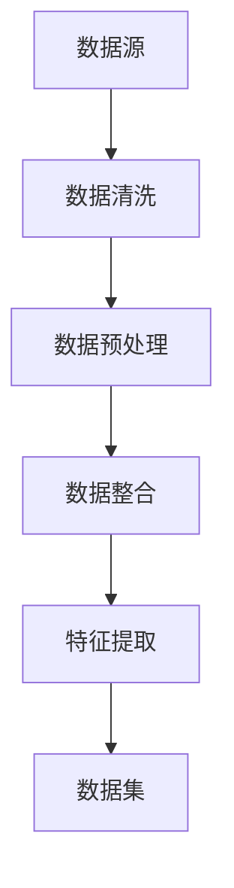
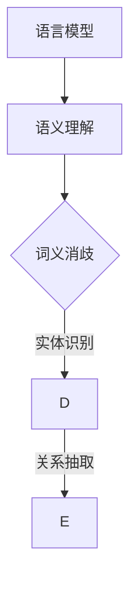
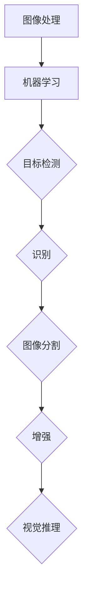
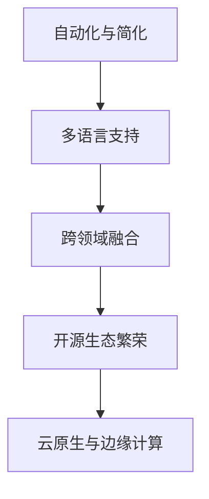
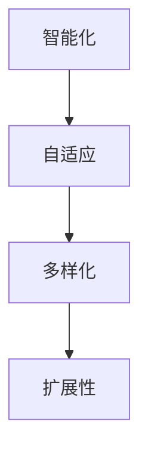
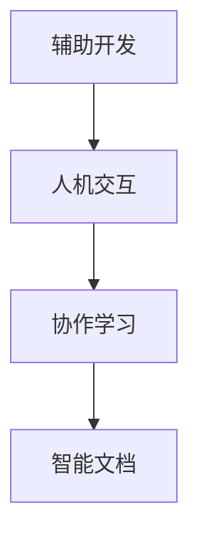
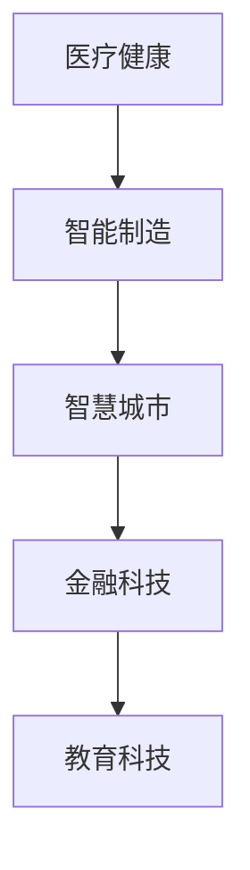
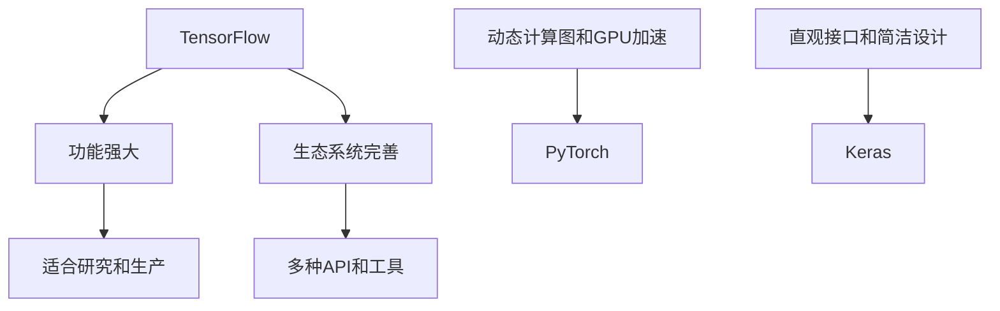
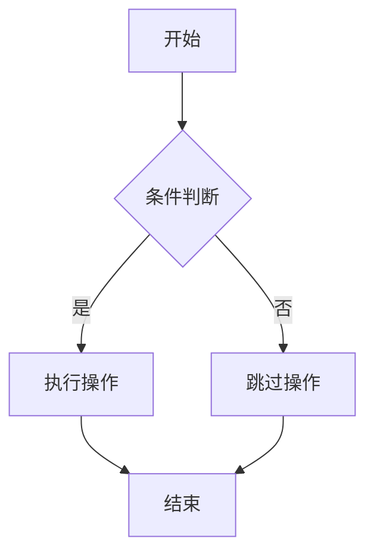
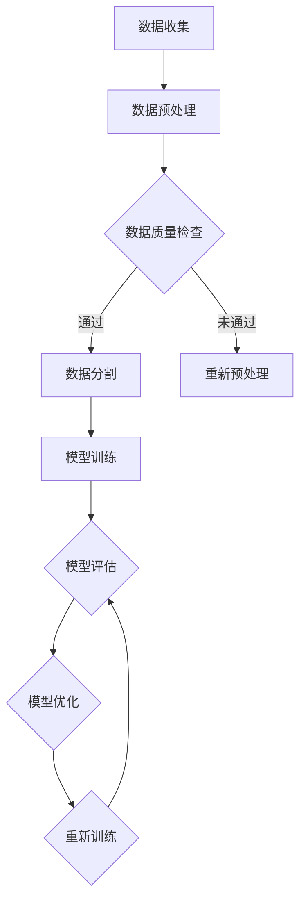

                 

### 《AI编程语言：提示词的革命与未来》

> **关键词：** AI编程语言、提示词、自然语言处理、计算机视觉、推荐系统、金融领域、发展趋势、应用实践。

> **摘要：** 本文将探讨AI编程语言的革命性变革，特别是提示词技术的重要性和潜在影响。我们将详细分析AI编程语言的核心概念、应用场景和发展趋势，并通过实际项目展示其应用价值。文章旨在为读者提供一个全面深入的了解，以把握AI编程语言的未来发展方向。

## 目录

### 第一部分：AI编程语言概述

#### 第1章：AI编程语言的革命

1.1 AI编程语言的诞生与背景  
1.2 提示词的概念与作用  
1.3 提示词的革命性影响  
1.4 AI编程语言的发展趋势

#### 第2章：AI编程语言的核心概念

2.1 数据处理与特征提取  
2.2 模型选择与优化  
2.3 模型评估与调优  
2.4 提示词的生成与优化

### 第二部分：AI编程语言的应用

#### 第3章：AI编程语言在自然语言处理中的应用

3.1 自然语言处理基础  
3.2 文本分类与情感分析  
3.3 机器翻译与对话系统  
3.4 自动摘要与内容生成

#### 第4章：AI编程语言在计算机视觉中的应用

4.1 计算机视觉基础  
4.2 目标检测与识别  
4.3 图像分割与增强  
4.4 视觉推理与应用

#### 第5章：AI编程语言在推荐系统中的应用

5.1 推荐系统基础  
5.2 协同过滤与基于内容的推荐  
5.3 深度学习在推荐系统中的应用  
5.4 提示词在推荐系统中的作用

#### 第6章：AI编程语言在金融领域的应用

6.1 金融数据处理与分析  
6.2 风险评估与预测  
6.3 量化交易与算法交易  
6.4 提示词在金融风控中的应用

#### 第7章：AI编程语言的未来发展趋势

7.1 AI编程语言的演变方向  
7.2 提示词技术的未来  
7.3 AI编程语言与人类协作  
7.4 未来应用场景展望

### 第三部分：AI编程语言实践

#### 第8章：AI编程语言实践项目

8.1 实践项目概述  
8.2 项目一：文本分类应用  
8.3 项目二：图像识别应用  
8.4 项目三：推荐系统应用  
8.5 项目四：金融风控应用  
8.6 实践总结与经验分享

#### 第9章：Mermaid流程图与伪代码

9.1 Mermaid流程图基础  
9.2 Mermaid流程图实例  
9.3 伪代码基础  
9.4 伪代码实例

#### 第10章：数学模型与数学公式

10.1 损失函数与优化算法  
10.2 概率分布与统计模型  
10.3 线性代数与矩阵运算  
10.4 数学公式示例

#### 第11章：代码实现与分析

11.1 开发环境搭建  
11.2 源代码详细实现  
11.3 代码解读与分析  
11.4 代码优化与性能调优  
11.5 项目实战总结

### 附录

#### 附录：参考资料与扩展阅读

A.1 AI编程语言相关书籍推荐  
A.2 AI编程语言在线课程推荐  
A.3 AI编程语言社区与论坛推荐  
A.4 AI编程语言最新研究论文推荐

---

### 引言

人工智能（AI）作为21世纪最具颠覆性的技术之一，正迅速改变着我们的生活方式和各行各业。AI编程语言作为AI技术发展的重要支撑，近年来也迎来了革命性的变革。本文将聚焦于AI编程语言中的一项关键技术——提示词（Prompts），探讨其革命性影响和未来发展趋势。

提示词是AI编程语言中的一个核心概念，它能够为模型提供上下文信息，引导模型生成更加准确和符合预期的输出。在传统的编程语言中，开发者需要手动编写大量的代码来实现复杂的任务，而AI编程语言通过提示词，使得模型能够自主学习并完成任务，从而大大降低了开发难度，提高了开发效率。

本文的结构如下：首先，我们将介绍AI编程语言的概述，包括其诞生背景、核心概念和发展趋势。接着，我们将详细探讨AI编程语言在自然语言处理、计算机视觉和推荐系统等领域的应用。然后，我们将分析AI编程语言在金融领域的应用，最后讨论其未来的发展趋势。在实践部分，我们将通过实际项目展示AI编程语言的应用价值。文章的附录部分将提供相关的参考资料和学习资源。

通过本文的阅读，您将全面了解AI编程语言的革命性变革，掌握其核心概念和应用方法，并能够展望其未来的发展方向。让我们开始这段激动人心的探索之旅！

### 第一部分：AI编程语言概述

#### 第1章：AI编程语言的革命

**1.1 AI编程语言的诞生与背景**

AI编程语言的发展可以追溯到20世纪50年代，当时计算机科学刚刚起步，人们开始思考如何让计算机模拟人类的智能行为。最早的AI系统是专家系统（Expert Systems），它们通过编码知识库和推理机来模拟专家的决策过程。然而，这些系统在面对复杂问题和动态环境时显得力不从心。

随着计算能力的提升和数据量的爆炸性增长，机器学习（Machine Learning）和深度学习（Deep Learning）技术逐渐成熟。这些技术通过训练大量的数据，使得计算机能够自动学习和优化模型，从而实现智能行为。为了更好地开发和管理这些复杂的模型，AI编程语言应运而生。

AI编程语言不仅支持机器学习和深度学习的算法实现，还提供了丰富的工具和库，使得开发者能够更高效地构建和部署AI应用。例如，Python成为了AI编程语言中的主导者，其简洁的语法和强大的库支持（如TensorFlow、PyTorch等）吸引了大量的开发者。

**1.2 提示词的概念与作用**

提示词（Prompts）是AI编程语言中的一个核心概念，它为模型提供上下文信息，引导模型生成符合预期的输出。提示词可以看作是模型的“输入”，它决定了模型在处理任务时的行为。

在自然语言处理（Natural Language Processing, NLP）领域，提示词的作用尤为突出。例如，在机器翻译任务中，提示词可以为模型提供源语言的上下文，从而帮助模型更好地理解句子结构和语义。在文本分类任务中，提示词可以帮助模型区分不同类别的特征，从而提高分类的准确性。

除了NLP领域，提示词在其他领域也发挥着重要作用。在计算机视觉任务中，提示词可以为模型提供图像的背景信息，从而帮助模型更好地识别目标。在推荐系统中，提示词可以提供用户的兴趣和行为信息，从而帮助系统为用户推荐更相关的商品或内容。

**1.3 提示词的革命性影响**

提示词的出现为AI编程语言带来了革命性的变化。首先，提示词使得模型的训练更加灵活和高效。传统的编程语言需要开发者手动编写大量的代码来定义模型的结构和参数，而AI编程语言通过提示词，只需要提供少量的指导信息，模型就能够自动学习和优化。

其次，提示词降低了AI编程的门槛，使得更多的开发者能够参与到AI应用的开发中。传统的AI编程需要深厚的数学和计算机科学背景，而AI编程语言通过提示词，使得开发者不需要深入了解复杂的算法原理，就能够构建出高效的AI应用。

最后，提示词提高了AI应用的通用性和适应性。传统的AI应用往往依赖于特定的数据集和任务，而AI编程语言通过提示词，能够更灵活地适应不同的任务和数据集，从而提高应用的通用性。

**1.4 AI编程语言的发展趋势**

随着AI技术的不断进步，AI编程语言也在不断发展。以下是AI编程语言的一些发展趋势：

1. **多语言支持**：AI编程语言正逐渐支持多种编程语言，如Python、Java、C++等。这为开发者提供了更大的选择空间，可以根据不同的项目需求选择最合适的编程语言。

2. **自动化工具的集成**：AI编程语言正逐步集成更多的自动化工具，如代码自动生成、模型自动优化等。这些工具能够提高开发效率，减少人工干预，从而使得AI应用更加高效和可靠。

3. **跨领域融合**：AI编程语言正在与其他领域（如自然语言处理、计算机视觉、推荐系统等）的编程语言和工具进行融合，形成更强大的AI应用解决方案。

4. **开源生态的繁荣**：AI编程语言的开源生态正在迅速发展，大量的开源库和框架为开发者提供了丰富的资源和工具，从而降低了AI编程的门槛。

5. **个性化与智能化**：随着AI技术的进步，AI编程语言正在朝着个性化与智能化的方向发展。未来的AI编程语言将能够更好地理解开发者的意图，提供更加智能化的开发体验。

通过上述分析，我们可以看到AI编程语言正在经历一场革命性的变革。提示词技术的出现为AI编程语言带来了新的活力和可能性，使得开发者能够更加高效地构建和部署AI应用。在未来，AI编程语言将继续发展，为人工智能领域带来更多的创新和突破。

### 第2章：AI编程语言的核心概念

在了解AI编程语言的革命性变革和发展趋势之后，我们需要深入了解其核心概念，包括数据处理与特征提取、模型选择与优化、模型评估与调优以及提示词的生成与优化。这些概念是构建高效AI模型的基础，也是实现AI编程语言革命性变革的关键。

#### 2.1 数据处理与特征提取

数据处理与特征提取是AI编程语言中至关重要的环节。数据是AI模型的“粮食”，而特征提取则是从数据中提取出对模型训练和预测有用的信息。

**数据处理**包括数据清洗、数据预处理和数据整合等步骤。数据清洗是确保数据质量和一致性的重要步骤，包括处理缺失值、异常值和重复数据等。数据预处理是将数据转换为适合模型训练的格式，如归一化、标准化等。数据整合则是将多个数据源进行整合，以获取更全面的信息。

**特征提取**是从原始数据中提取出对模型训练和预测有用的特征。特征提取的方法包括统计特征、文本特征和图像特征等。统计特征是从数据中计算出的各种统计量，如平均值、标准差等。文本特征是从文本数据中提取出的词语、短语和句子的表示。图像特征是从图像数据中提取出的各种视觉特征，如颜色、纹理、形状等。

在AI编程语言中，常用的数据处理和特征提取工具包括Pandas、NumPy、Scikit-learn等。Pandas是一个强大的数据操作库，可以方便地进行数据清洗、数据预处理和数据整合。NumPy提供了丰富的数学运算功能，可以方便地进行数据归一化和标准化。Scikit-learn是一个广泛使用的机器学习库，提供了丰富的特征提取和数据处理方法。

**Mermaid流程图示例：数据处理与特征提取**



#### 2.2 模型选择与优化

在构建AI模型时，选择合适的模型非常重要。模型选择取决于任务类型、数据量和数据特性等因素。常见的模型包括线性回归、决策树、支持向量机、神经网络等。

**线性回归**是一种简单的线性模型，适用于预测连续值。它的优点是计算简单、易于理解，但缺点是对于非线性关系的表现较差。

**决策树**是一种基于树的模型，通过将数据划分为不同的区域来预测结果。它的优点是易于解释、计算效率高，但缺点是对于大规模数据的处理能力有限。

**支持向量机（SVM）**是一种强大的分类模型，通过找到一个最优的超平面来分隔不同类别的数据。它的优点是准确率高、泛化能力强，但缺点是对于高维数据的处理较慢。

**神经网络**是一种复杂的模型，通过多层神经元实现数据的非线性变换。它的优点是能够处理复杂的非线性关系、适应性强，但缺点是计算量大、训练时间较长。

在AI编程语言中，常用的模型选择和优化工具包括Scikit-learn、TensorFlow、PyTorch等。Scikit-learn提供了丰富的模型选择和优化方法，如交叉验证、网格搜索等。TensorFlow和PyTorch是深度学习框架，提供了丰富的神经网络模型和训练工具。

**伪代码示例：模型选择与优化**

```python
# 伪代码：模型选择与优化

# 数据预处理
data_preprocessed = preprocess_data(data)

# 模型选择
models = [LinearRegression(), DecisionTreeClassifier(), SVC(), NeuralNetwork()]

# 模型优化
for model in models:
    model.optimize(data_preprocessed)
    model.evaluate(data_preprocessed)
```

#### 2.3 模型评估与调优

模型评估与调优是确保AI模型性能的重要环节。评估模型性能的方法包括准确性、召回率、F1分数等。调优模型的方法包括参数调整、数据增强等。

**准确性**是模型预测正确的比例，适用于分类任务。它的计算公式为：

$$
准确性 = \frac{预测正确的样本数}{总样本数}
$$

**召回率**是模型召回正确样本的比例，适用于分类任务。它的计算公式为：

$$
召回率 = \frac{预测正确的样本数}{实际正确的样本数}
$$

**F1分数**是准确性和召回率的调和平均值，适用于分类任务。它的计算公式为：

$$
F1分数 = 2 \times \frac{准确性 \times 召回率}{准确性 + 召回率}
$$

在AI编程语言中，常用的模型评估和调优工具包括Scikit-learn、TensorFlow、PyTorch等。Scikit-learn提供了丰富的评估和调优方法，如交叉验证、网格搜索等。TensorFlow和PyTorch提供了丰富的评估指标和调优工具。

**伪代码示例：模型评估与调优**

```python
# 伪代码：模型评估与调优

# 数据预处理
data_preprocessed = preprocess_data(data)

# 模型评估
accuracy = model.evaluate(data_preprocessed)
recall = model.recall(data_preprocessed)
F1_score = model.F1_score(data_preprocessed)

# 模型调优
model.optimize(data_preprocessed, accuracy, recall, F1_score)
```

#### 2.4 提示词的生成与优化

提示词的生成与优化是AI编程语言中的一项关键技术。提示词的质量直接影响到模型的性能和预测准确性。提示词的生成方法包括手动生成、自动生成和半监督生成等。

**手动生成**是开发者根据任务需求和模型特性手动编写提示词。这种方法需要丰富的领域知识和经验，但能够确保提示词的质量和针对性。

**自动生成**是通过算法自动生成提示词。常见的自动生成方法包括基于规则的方法、基于统计的方法和基于机器学习的方法。基于规则的方法通过编写一系列规则来生成提示词，适用于简单的任务。基于统计的方法通过计算文本的统计特征来生成提示词，适用于中等复杂度的任务。基于机器学习的方法通过训练大量数据来生成提示词，适用于复杂的任务。

**半监督生成**是在自动生成的基础上，结合少量标注数据来生成高质量的提示词。这种方法能够有效减少标注数据的需求，提高提示词的生成质量。

在AI编程语言中，常用的提示词生成和优化工具包括自然语言处理库（如NLTK、spaCy等）、机器学习框架（如Scikit-learn、TensorFlow等）和深度学习框架（如PyTorch、TensorFlow等）。这些工具提供了丰富的文本处理和机器学习功能，能够方便地实现提示词的生成和优化。

**伪代码示例：提示词生成与优化**

```python
# 伪代码：提示词生成与优化

# 手动生成
prompt = manual_generate_prompt()

# 自动生成
prompt = automatic_generate_prompt()

# 半监督生成
prompt = semi_supervised_generate_prompt()

# 提示词优化
prompt = optimize_prompt(prompt, data)
```

通过上述分析，我们可以看到数据处理与特征提取、模型选择与优化、模型评估与调优以及提示词的生成与优化是AI编程语言的核心概念。这些概念相互关联，共同构成了AI编程语言的基础。在接下来的章节中，我们将进一步探讨AI编程语言在自然语言处理、计算机视觉和推荐系统等领域的应用，以展示其在实际项目中的价值。

### 第3章：AI编程语言在自然语言处理中的应用

自然语言处理（Natural Language Processing，NLP）是人工智能领域的一个重要分支，它涉及到计算机和人类语言之间的交互。随着AI编程语言的不断进步，NLP领域也取得了显著的成果。本节将介绍AI编程语言在NLP领域的应用，包括文本分类、情感分析、机器翻译、对话系统、自动摘要和内容生成。

#### 3.1 自然语言处理基础

自然语言处理的基础是语言模型和语义理解。语言模型用于预测文本序列的概率分布，而语义理解则关注于文本的含义和上下文。

**语言模型**：语言模型是一种概率模型，它用于预测下一个单词或词组。最著名的语言模型是n-gram模型，它基于前n个单词的统计信息来预测下一个单词。此外，基于神经网络的深度语言模型（如Transformer）取得了显著的成功，例如Google的BERT和OpenAI的GPT。

**语义理解**：语义理解包括词义消歧、实体识别和关系抽取等任务。词义消歧是指识别文本中的同义词或近义词，确定其具体含义。实体识别是指识别文本中的名词性实体，如人名、地名和机构名等。关系抽取是指识别实体之间的语义关系，如“工作于”或“居住在”。

在AI编程语言中，常用的NLP库包括NLTK、spaCy、nltk、gensim等。NLTK是一个经典的NLP库，提供了丰富的文本处理功能。spaCy是一个高性能的NLP库，特别适合处理大规模文本数据。nltk和gensim则提供了更高级的文本分析功能，如主题建模和情感分析。

**Mermaid流程图示例：自然语言处理基础**



#### 3.2 文本分类与情感分析

文本分类是一种将文本数据归类到预定义类别中的任务。情感分析是文本分类的一种特殊形式，用于判断文本的情感倾向，如正面、负面或中性。

**文本分类**：文本分类通常使用监督学习方法，如朴素贝叶斯、支持向量机和神经网络。朴素贝叶斯是一种基于概率的模型，假设特征之间相互独立。支持向量机通过找到一个最优的超平面来分隔不同类别的数据。神经网络则通过多层非线性变换来学习复杂的特征。

**情感分析**：情感分析通常使用基于情感词典和机器学习的方法。情感词典是一种包含情感倾向的词汇表，用于判断文本的情感极性。基于机器学习的方法则通过训练大量标注数据来学习情感特征。

在AI编程语言中，常用的文本分类和情感分析库包括Scikit-learn、TensorFlow和PyTorch。Scikit-learn提供了丰富的文本分类和情感分析功能。TensorFlow和PyTorch则提供了更高级的文本处理和深度学习功能。

**伪代码示例：文本分类与情感分析**

```python
# 伪代码：文本分类与情感分析

# 文本分类
from sklearn.feature_extraction.text import TfidfVectorizer
from sklearn.model_selection import train_test_split
from sklearn.naive_bayes import MultinomialNB

# 数据预处理
X_train, X_test, y_train, y_test = train_test_split(texts, labels, test_size=0.2)

# 特征提取
vectorizer = TfidfVectorizer()
X_train_vectors = vectorizer.fit_transform(X_train)
X_test_vectors = vectorizer.transform(X_test)

# 模型训练
classifier = MultinomialNB()
classifier.fit(X_train_vectors, y_train)

# 模型评估
accuracy = classifier.score(X_test_vectors, y_test)

# 情感分析
from textblob import TextBlob

# 数据预处理
text = "这是一条正面情感评论。"

# 情感极性分析
polarity = TextBlob(text).sentiment.polarity
if polarity > 0:
    print("正面情感")
elif polarity < 0:
    print("负面情感")
else:
    print("中性情感")
```

#### 3.3 机器翻译与对话系统

机器翻译是一种将一种语言文本自动翻译成另一种语言文本的任务。对话系统则是一种与人类用户进行自然语言交互的系统。

**机器翻译**：机器翻译通常使用基于规则的方法、统计机器翻译和神经网络翻译。基于规则的方法通过编写一系列翻译规则来实现。统计机器翻译通过训练大量双语数据来学习翻译模型。神经网络翻译则通过深度学习模型来实现端到端的翻译。

**对话系统**：对话系统包括对话管理、自然语言理解和自然语言生成。对话管理负责维护对话的状态和控制对话流程。自然语言理解负责解析用户输入，提取语义信息。自然语言生成则负责生成合适的回复。

在AI编程语言中，常用的机器翻译和对话系统库包括TensorFlow、PyTorch和transformers。TensorFlow和PyTorch提供了丰富的深度学习功能，可以用于实现神经网络翻译和对话系统。transformers库提供了预训练的Transformer模型，可以方便地实现机器翻译和对话系统。

**伪代码示例：机器翻译与对话系统**

```python
# 伪代码：机器翻译与对话系统

# 机器翻译
from transformers import pipeline

# 创建翻译器
translator = pipeline("translation_en_to_zh")

# 翻译文本
text = "Hello, how are you?"
translated_text = translator(text)

# 输出翻译结果
print(translated_text)

# 对话系统
from transformers import pipeline

# 创建对话系统
chatbot = pipeline("conversational")

# 开始对话
response = chatbot("Hello!")
print(response)

# 继续对话
response = chatbot("What's your name?")
print(response)
```

#### 3.4 自动摘要与内容生成

自动摘要是一种自动提取文本的关键信息，生成简洁的摘要文本。内容生成则是一种生成新颖文本的技巧，可以用于生成文章、新闻、对话等。

**自动摘要**：自动摘要通常使用基于提取的方法、基于生成的方法和混合方法。基于提取的方法通过提取文本中的重要句子和段落来生成摘要。基于生成的方法通过生成新的文本来实现摘要。混合方法结合了提取和生成的方法，以生成更高质量的摘要。

**内容生成**：内容生成可以使用生成式模型、对抗生成式网络和变分自编码器等。生成式模型通过生成新的文本数据来实现内容生成。对抗生成式网络通过生成和判别网络之间的对抗训练来生成高质量的内容。变分自编码器通过编码和解码过程来生成新颖的文本。

在AI编程语言中，常用的自动摘要和内容生成库包括Gensim、transformers和t5。Gensim提供了基于提取和基于生成的方法，可以方便地实现自动摘要。transformers和t5提供了强大的生成式模型和对抗生成式网络，可以用于实现内容生成。

**伪代码示例：自动摘要与内容生成**

```python
# 伪代码：自动摘要与内容生成

# 自动摘要
from gensim.summarization import summarize

# 摘要文本
text = "这是一篇长文章。"

# 生成摘要
summary = summarize(text)

# 输出摘要
print(summary)

# 内容生成
from transformers import pipeline

# 创建内容生成器
generator = pipeline("text-generation")

# 生成内容
content = generator("写一篇关于自然语言处理的文章。", max_length=100)

# 输出内容
print(content)
```

通过以上分析，我们可以看到AI编程语言在自然语言处理领域的广泛应用和巨大潜力。文本分类、情感分析、机器翻译、对话系统、自动摘要和内容生成等技术不仅极大地提高了NLP的应用价值，还为开发者和研究人员提供了丰富的工具和资源。在接下来的章节中，我们将继续探讨AI编程语言在计算机视觉、推荐系统和金融领域的应用，以展示其在更多领域的实际价值。

### 第4章：AI编程语言在计算机视觉中的应用

计算机视觉（Computer Vision）是人工智能领域的一个重要分支，它致力于使计算机能够从图像和视频中提取信息并理解其内容。AI编程语言在计算机视觉中的应用广泛且深远，涉及目标检测、识别、图像分割、增强和视觉推理等多个方面。本节将详细探讨AI编程语言在计算机视觉中的应用，并展示其实际案例。

#### 4.1 计算机视觉基础

计算机视觉的基础包括图像处理和机器学习。图像处理用于对图像进行预处理和特征提取，而机器学习用于训练模型以实现图像理解和识别。

**图像处理**：图像处理包括图像滤波、增强、变换和边缘检测等。这些操作能够改善图像质量，提取关键特征，以便后续的机器学习处理。常用的图像处理工具包括OpenCV、Matplotlib和Scikit-image。

**机器学习**：机器学习是计算机视觉的核心，它通过训练模型来识别图像中的对象和特征。常用的机器学习算法包括支持向量机（SVM）、卷积神经网络（CNN）和生成对抗网络（GAN）。

在AI编程语言中，常用的计算机视觉库包括OpenCV、TensorFlow、PyTorch和PyTorch-CV。OpenCV是一个开源的计算机视觉库，提供了丰富的图像处理和机器学习功能。TensorFlow和PyTorch是深度学习框架，提供了强大的神经网络训练和推理工具。PyTorch-CV是一个基于PyTorch的计算机视觉库，提供了多个预训练模型和工具。

**Mermaid流程图示例：计算机视觉基础**



#### 4.2 目标检测与识别

目标检测是一种在图像中识别和定位对象的技术。目标检测通常使用基于区域提议的方法和基于深度学习的方法。

**基于区域提议的方法**：基于区域提议的方法通过生成一系列可能的区域，然后对每个区域进行分类和定位。常用的算法包括R-CNN、Fast R-CNN和Faster R-CNN。

**基于深度学习的方法**：基于深度学习的方法通过训练卷积神经网络来直接从图像中检测目标。常用的算法包括YOLO（You Only Look Once）和SSD（Single Shot MultiBox Detector）。

在AI编程语言中，常用的目标检测库包括TensorFlow Object Detection API和PyTorch Object Detection。TensorFlow Object Detection API提供了丰富的预训练模型和工具，可以方便地实现目标检测。PyTorch Object Detection是PyTorch的一个扩展库，提供了多个目标检测模型和训练工具。

**伪代码示例：目标检测与识别**

```python
# 伪代码：目标检测与识别

# 导入库
import cv2
import numpy as np

# 加载预训练模型
model = load_pretrained_model("resnet50")

# 加载图像
image = cv2.imread("image.jpg")

# 进行目标检测
detections = model.detect(image)

# 输出检测结果
print(detections)
```

#### 4.3 图像分割与增强

图像分割是将图像分割成多个区域，以便更好地理解图像内容。图像增强是通过对图像进行变换和调整来改善其质量和可理解性。

**图像分割**：图像分割通常使用基于阈值的分割、基于边缘的分割和基于区域的分割。常用的算法包括Otsu阈值分割、Canny边缘检测和区域生长分割。

**图像增强**：图像增强包括对比度增强、亮度调整和色彩平衡等。常用的算法包括直方图均衡、伽玛校正和HSV色彩空间调整。

在AI编程语言中，常用的图像分割和增强库包括OpenCV和Scikit-image。OpenCV提供了丰富的图像处理和分割功能。Scikit-image是一个基于Scikit-learn的图像处理库，提供了多个图像增强算法。

**伪代码示例：图像分割与增强**

```python
# 伪代码：图像分割与增强

# 导入库
import cv2

# 加载图像
image = cv2.imread("image.jpg")

# 进行图像分割
segmented_image = cv2.threshold(image, 128, 255, cv2.THRESH_BINARY_INV + cv2.THRESH_OTSU)

# 进行图像增强
enhanced_image = cv2.equalizeHist(segmented_image)

# 输出结果
cv2.imshow("Segmented Image", segmented_image)
cv2.imshow("Enhanced Image", enhanced_image)
cv2.waitKey(0)
cv2.destroyAllWindows()
```

#### 4.4 视觉推理与应用

视觉推理是计算机视觉的高级任务，它涉及从图像中提取知识并进行推理。视觉推理的应用包括图像识别、场景理解、视频分析和自动驾驶等。

**图像识别**：图像识别是通过识别图像中的对象和特征来实现。常见的应用包括人脸识别、车牌识别和产品识别等。

**场景理解**：场景理解是通过理解图像中的内容和关系来实现。常见的应用包括场景分割、对象跟踪和事件检测等。

**视频分析**：视频分析是通过分析视频序列中的内容来实现。常见的应用包括行为识别、异常检测和安全监控等。

**自动驾驶**：自动驾驶是通过计算机视觉实现车辆环境感知和路径规划。自动驾驶的应用包括自动驾驶汽车、无人机和机器人等。

在AI编程语言中，常用的视觉推理库包括TensorFlow、PyTorch和PyTorch Video。TensorFlow和PyTorch提供了丰富的神经网络和计算机视觉功能，可以用于实现视觉推理。PyTorch Video是一个基于PyTorch的视觉推理库，提供了多个预训练模型和工具。

**伪代码示例：视觉推理与应用**

```python
# 伪代码：视觉推理与应用

# 导入库
import torch
import torchvision
import torchvision.transforms as transforms

# 加载预训练模型
model = torchvision.models.resnet50(pretrained=True)

# 定义数据预处理
transform = transforms.Compose([
    transforms.Resize((224, 224)),
    transforms.ToTensor(),
])

# 加载图像
image = cv2.imread("image.jpg")
tensor = transform(image)

# 进行图像识别
output = model(tensor)

# 获取识别结果
_, predicted = torch.max(output, 1)

# 输出结果
print(predicted)
```

通过以上分析，我们可以看到AI编程语言在计算机视觉领域的广泛应用和巨大潜力。目标检测、识别、图像分割、增强和视觉推理等技术不仅极大地提高了计算机视觉的应用价值，还为开发者和研究人员提供了丰富的工具和资源。在接下来的章节中，我们将继续探讨AI编程语言在推荐系统和金融领域的应用，以展示其在更多领域的实际价值。

### 第5章：AI编程语言在推荐系统中的应用

推荐系统是一种通过预测用户兴趣和偏好来提供个性化推荐的应用，广泛应用于电子商务、社交媒体、音乐和视频流媒体等领域。AI编程语言通过其强大的数据处理和机器学习功能，使得推荐系统变得更加高效和准确。本节将介绍AI编程语言在推荐系统中的应用，包括推荐系统的基础、协同过滤和基于内容的推荐，以及深度学习在推荐系统中的应用。

#### 5.1 推荐系统基础

推荐系统的基础是用户-项目矩阵（User-Item Matrix），它记录了用户与项目之间的交互数据，如评分、点击、购买等。推荐系统的目标是找到最相关的项目推荐给用户，以最大化用户满意度。

**用户-项目矩阵**：用户-项目矩阵是一个稀疏矩阵，通常包含大量未标记的数据（即用户没有交互的项目）。这种稀疏性给推荐系统带来了挑战，因为大多数项目没有用户交互数据。

**评分矩阵**：评分矩阵是一个对角矩阵，其中包含用户对项目的评分。评分通常采用五星级评分系统，例如1到5星。

**点击矩阵**：点击矩阵记录了用户与项目之间的点击交互。点击数据可以用于发现用户的兴趣和行为模式。

在AI编程语言中，常用的推荐系统库包括Scikit-learn、TensorFlow和PyTorch。Scikit-learn提供了丰富的协同过滤和基于内容的推荐算法。TensorFlow和PyTorch提供了强大的深度学习功能，可以用于实现更复杂的推荐系统。

**伪代码示例：用户-项目矩阵**

```python
# 伪代码：用户-项目矩阵

# 创建用户-项目矩阵
user_item_matrix = [
    [1, 1, 0, 0],  # 用户1的评分
    [1, 0, 1, 1],  # 用户2的评分
    [0, 1, 1, 0],  # 用户3的评分
    [0, 1, 0, 1]   # 用户4的评分
]
```

#### 5.2 协同过滤与基于内容的推荐

协同过滤和基于内容的推荐是推荐系统的两种主要方法，它们各有优缺点。

**协同过滤**：协同过滤是一种基于用户行为数据的方法，通过分析用户之间的相似性来推荐项目。协同过滤分为两种：基于用户的协同过滤和基于项目的协同过滤。

- **基于用户的协同过滤**：基于用户的协同过滤通过计算用户之间的相似性来推荐项目。相似性通常通过用户-项目矩阵的余弦相似度或皮尔逊相关系数来计算。这种方法的主要优点是能够发现用户的兴趣模式，但缺点是对于新用户或新项目的推荐效果较差。
- **基于项目的协同过滤**：基于项目的协同过滤通过计算项目之间的相似性来推荐项目。相似性通常通过项目-项目矩阵的余弦相似度或Jaccard相似性来计算。这种方法的主要优点是能够发现项目的相似性，但缺点是对于用户的个性化需求识别不足。

在AI编程语言中，常用的协同过滤算法包括基于矩阵分解的协同过滤、基于K最近邻的协同过滤和基于图的结构化协同过滤。Scikit-learn提供了多个基于矩阵分解的协同过滤算法，如SVD和NMF。TensorFlow和PyTorch提供了基于神经网络的协同过滤算法，如NeuMF和DeepFM。

**伪代码示例：协同过滤**

```python
# 伪代码：协同过滤

# 导入库
import numpy as np
from sklearn.metrics.pairwise import cosine_similarity

# 创建用户-项目矩阵
user_item_matrix = np.array([
    [1, 1, 0, 0],
    [1, 0, 1, 1],
    [0, 1, 1, 0],
    [0, 1, 0, 1]
])

# 计算用户之间的相似性
user_similarity = cosine_similarity(user_item_matrix)

# 推荐项目
def recommend_items(user_id, similarity_matrix, user_item_matrix, k=5):
    # 计算用户相似度最高的k个用户
    similar_users = np.argsort(similarity_matrix[user_id])[::-1][:k]
    
    # 获取相似用户的未交互项目
    uninteracted_items = np.setdiff1d(np.arange(user_item_matrix.shape[1]), user_item_matrix[similar_users].astype(int))
    
    # 计算未交互项目的平均值
    item_average_ratings = np.mean(user_item_matrix[similar_users], axis=0)
    
    # 推荐评分最高的项目
    recommended_items = np.argsort(item_average_ratings)[::-1]
    
    return uninteracted_items[recommended_items]

# 推荐项目
recommended_items = recommend_items(0, user_similarity, user_item_matrix)
print(recommended_items)
```

**基于内容的推荐**：基于内容的推荐是一种基于项目特征和用户兴趣的方法，通过比较项目特征与用户兴趣的相似性来推荐项目。基于内容的推荐分为两种：基于项目的特征推荐和基于用户的历史行为推荐。

- **基于项目的特征推荐**：基于项目的特征推荐通过提取项目的特征（如文本、图像和标签）来计算项目之间的相似性。这种方法的主要优点是能够发现项目的相似性，但缺点是对于用户的个性化需求识别不足。
- **基于用户的历史行为推荐**：基于用户的历史行为推荐通过分析用户的历史行为和偏好来推荐项目。这种方法的主要优点是能够发现用户的兴趣模式，但缺点是对于新项目的推荐效果较差。

在AI编程语言中，常用的基于内容的推荐算法包括基于余弦相似度的推荐、基于K最近邻的推荐和基于关联规则的推荐。Scikit-learn提供了多个基于余弦相似度的推荐算法，如ItemRank和MF。TensorFlow和PyTorch提供了基于神经网络的推荐算法，如Neural Collaborative Filtering（NCF）。

**伪代码示例：基于内容的推荐**

```python
# 伪代码：基于内容的推荐

# 导入库
import numpy as np
from sklearn.metrics.pairwise import cosine_similarity

# 创建用户-项目矩阵
user_item_matrix = np.array([
    [1, 1, 0, 0],
    [1, 0, 1, 1],
    [0, 1, 1, 0],
    [0, 1, 0, 1]
])

# 创建项目特征向量
item_features = np.array([
    [1, 0, 1],  # 项目1的特征
    [0, 1, 0],  # 项目2的特征
    [1, 1, 1],  # 项目3的特征
    [0, 0, 1]   # 项目4的特征
])

# 计算项目之间的相似性
item_similarity = cosine_similarity(item_features)

# 推荐项目
def recommend_items(user_id, similarity_matrix, item_similarity_matrix, k=5):
    # 获取用户交互的项目
    user_interacted_items = user_item_matrix[user_id].astype(int)
    
    # 计算项目相似度最高的k个项目
    similar_items = np.argsort(item_similarity[user_id])[::-1][:k]
    
    # 获取未交互的项目
    uninteracted_items = np.setdiff1d(np.arange(item_similarity_matrix.shape[0]), user_interacted_items)
    
    # 计算未交互项目的平均值
    item_average_similarity = np.mean(item_similarity[user_id][uninteracted_items], axis=0)
    
    # 推荐评分最高的项目
    recommended_items = np.argsort(item_average_similarity)[::-1]
    
    return uninteracted_items[recommended_items]

# 推荐项目
recommended_items = recommend_items(0, user_similarity, item_similarity)
print(recommended_items)
```

#### 5.3 深度学习在推荐系统中的应用

深度学习在推荐系统中的应用极大地提升了推荐系统的性能和准确性。深度学习模型通过自动学习和提取特征，能够更好地捕捉用户和项目的复杂关系。

**深度学习方法**：深度学习方法包括基于矩阵分解的深度学习方法、基于神经网络的深度学习方法和基于图神经网络的深度学习方法。

- **基于矩阵分解的深度学习方法**：基于矩阵分解的深度学习方法结合了矩阵分解和深度学习，通过训练深度神经网络来优化用户-项目矩阵。这种方法的主要优点是能够自动提取用户和项目的特征，但缺点是对于稀疏数据的表现较差。
- **基于神经网络的深度学习方法**：基于神经网络的深度学习方法通过训练深度神经网络来预测用户对项目的评分。这种方法的主要优点是能够自动提取用户和项目的特征，并适用于稀疏数据，但缺点是对于模型的调优和优化要求较高。
- **基于图神经网络的深度学习方法**：基于图神经网络的深度学习方法通过构建用户-项目图来捕捉用户和项目之间的复杂关系。这种方法的主要优点是能够更好地捕捉用户和项目的依赖关系，但缺点是对于大规模数据集的处理效率较低。

在AI编程语言中，常用的深度学习推荐系统库包括TensorFlow和PyTorch。TensorFlow和PyTorch提供了丰富的深度学习功能，可以用于实现各种深度学习方法。

**伪代码示例：深度学习推荐系统**

```python
# 伪代码：深度学习推荐系统

# 导入库
import tensorflow as tf
from tensorflow.keras.models import Model
from tensorflow.keras.layers import Input, Embedding, Dot, Add, Activation

# 创建用户和项目嵌入层
user_embedding = Embedding(num_users, embedding_size)
item_embedding = Embedding(num_items, embedding_size)

# 输入用户和项目索引
user_input = Input(shape=(1,))
item_input = Input(shape=(1,))

# 获取用户和项目的嵌入向量
user_embedding_vector = user_embedding(user_input)
item_embedding_vector = item_embedding(item_input)

# 计算用户和项目的内积
dot_product = Dot(axes=1)([user_embedding_vector, item_embedding_vector])

# 添加偏置项
add_bias = Add()([dot_product, bias])

# 激活函数
activation = Activation("sigmoid")(add_bias)

# 创建模型
model = Model(inputs=[user_input, item_input], outputs=activation)

# 编译模型
model.compile(optimizer="adam", loss="binary_crossentropy", metrics=["accuracy"])

# 训练模型
model.fit([train_user_indices, train_item_indices], train_labels, batch_size=batch_size, epochs=num_epochs)

# 推荐项目
def recommend_items(user_id, user_embedding_vector, item_embedding_vector, model, k=5):
    # 获取用户交互的项目
    user_interacted_items = user_item_matrix[user_id].astype(int)
    
    # 计算项目相似度最高的k个项目
    similar_items = np.argsort(model.predict([user_id] * k + list(user_interacted_items)))[:-k-1:-1]
    
    return similar_items

# 推荐项目
recommended_items = recommend_items(0, user_embedding_vector, item_embedding_vector, model)
print(recommended_items)
```

通过以上分析，我们可以看到AI编程语言在推荐系统中的应用不仅涵盖了协同过滤和基于内容的推荐，还深入探讨了深度学习在推荐系统中的应用。这些方法极大地提升了推荐系统的性能和准确性，为开发者提供了丰富的工具和资源。在接下来的章节中，我们将继续探讨AI编程语言在金融领域的应用，以展示其在更多领域的实际价值。

### 第6章：AI编程语言在金融领域的应用

AI编程语言在金融领域有着广泛的应用，特别是在数据处理、风险评估、预测和量化交易等方面。本节将详细介绍AI编程语言在金融领域的应用，包括数据处理与分析、风险评估与预测、量化交易与算法交易，以及提示词在金融风控中的应用。

#### 6.1 金融数据处理与分析

金融数据处理是金融领域AI应用的基础。金融市场产生的大量数据，如股票价格、交易量、财务报表、新闻文本等，需要通过有效的数据处理和分析方法来提取有价值的信息。

**数据处理**：金融数据的处理包括数据清洗、数据预处理和数据整合。数据清洗是处理缺失值、异常值和重复数据，确保数据质量。数据预处理包括数据归一化、标准化、缺失值填充等，以适应机器学习模型的输入要求。数据整合是将不同来源的数据进行合并，以获得更全面的分析视角。

**数据分析**：金融数据分析方法包括统计分析、时间序列分析、文本分析等。统计分析用于描述数据的基本特征，如均值、方差、相关性等。时间序列分析用于预测未来价格或交易量，如ARIMA模型、GARCH模型等。文本分析用于提取新闻文本中的情感和趋势，如自然语言处理（NLP）技术。

在AI编程语言中，常用的金融数据处理和分析库包括Pandas、NumPy、Scikit-learn和TensorFlow。Pandas和NumPy提供了丰富的数据处理功能，如数据清洗、数据预处理和统计分析。Scikit-learn提供了多种机器学习算法，可以用于金融数据的分类、回归和聚类等任务。TensorFlow是深度学习框架，可以用于复杂的时间序列分析和文本分析任务。

**伪代码示例：金融数据处理与分析**

```python
# 伪代码：金融数据处理与分析

# 导入库
import pandas as pd
import numpy as np
from sklearn.preprocessing import StandardScaler

# 读取数据
data = pd.read_csv("financial_data.csv")

# 数据清洗
data.dropna(inplace=True)
data.drop_duplicates(inplace=True)

# 数据预处理
scaler = StandardScaler()
data_scaled = scaler.fit_transform(data)

# 数据分析
mean = np.mean(data_scaled, axis=0)
variance = np.var(data_scaled, axis=0)
correlation = np.corrcoef(data_scaled.T)
```

#### 6.2 风险评估与预测

风险评估与预测是金融领域的重要任务，涉及对投资组合、信贷和市场的风险评估，以及对未来价格或交易量的预测。

**风险评估**：风险评估方法包括定量分析和定性分析。定量分析使用历史数据和统计模型来评估风险，如波动率、VaR（Value at Risk）和CVaR（Conditional Value at Risk）等。定性分析通过专家意见和主观判断来评估风险。

**风险预测**：风险预测使用时间序列分析和机器学习模型来预测未来的风险。时间序列分析如ARIMA、GARCH模型等，用于预测股票价格和交易量。机器学习模型如神经网络、决策树和支持向量机等，可以用于分类和回归任务，预测信贷违约和金融欺诈等。

在AI编程语言中，常用的风险评估和预测库包括Scikit-learn、TensorFlow和PyTorch。Scikit-learn提供了多种统计模型和机器学习算法，可以用于风险评估和预测。TensorFlow和PyTorch是深度学习框架，可以用于复杂的风险预测任务。

**伪代码示例：风险评估与预测**

```python
# 伪代码：风险评估与预测

# 导入库
import pandas as pd
import numpy as np
from sklearn.ensemble import RandomForestClassifier
from sklearn.model_selection import train_test_split

# 读取数据
data = pd.read_csv("financial_data.csv")

# 数据预处理
X = data.drop("target", axis=1)
y = data["target"]

# 数据划分
X_train, X_test, y_train, y_test = train_test_split(X, y, test_size=0.2, random_state=42)

# 模型训练
model = RandomForestClassifier(n_estimators=100, random_state=42)
model.fit(X_train, y_train)

# 模型评估
accuracy = model.score(X_test, y_test)
print("Accuracy:", accuracy)
```

#### 6.3 量化交易与算法交易

量化交易和算法交易是金融领域中利用算法自动进行交易的技术。量化交易使用统计方法和机器学习模型来识别交易机会，而算法交易则通过自动化执行交易策略来获取收益。

**量化交易**：量化交易包括数据挖掘、模型开发和风险管理等步骤。数据挖掘用于提取市场数据中的潜在交易信号。模型开发用于构建交易策略，如趋势跟踪、均值回归和事件驱动等。风险管理用于控制交易风险，如设定止损和风险暴露等。

**算法交易**：算法交易通过自动化交易系统执行交易策略。交易系统包括交易策略、交易信号生成和执行模块。交易策略通常基于历史数据和统计模型，如机器学习模型和深度学习模型。

在AI编程语言中，常用的量化交易和算法交易库包括Zipline、Backtrader和Quandl。Zipline是一个开源的量化交易框架，可以用于实现多种交易策略。Backtrader是一个基于Python的回测和交易框架，可以用于模拟交易策略的表现。Quandl是一个提供金融数据资源的平台，可以方便地获取市场数据。

**伪代码示例：量化交易与算法交易**

```python
# 伪代码：量化交易与算法交易

# 导入库
import pandas as pd
import numpy as np
import zipline
from zipline import TradingRecord

# 读取数据
data = pd.read_csv("financial_data.csv")

# 创建交易记录
trading_record = TradingRecord(
    open="open",
    close="close",
    high="high",
    low="low",
    volume="volume"
)

# 创建策略
def trend_following_strategy(data):
    # 计算移动平均线
    moving_average = data["close"].rolling(window=20).mean()
    # 生成交易信号
    signal = (data["close"] > moving_average) - (data["close"] < moving_average)
    # 记录交易
    trading_record.record(
        open=data["open"],
        close=data["close"],
        high=data["high"],
        low=data["low"],
        volume=data["volume"],
        signal=signal
    )

# 应用策略
trend_following_strategy(data)
```

#### 6.4 提示词在金融风控中的应用

提示词在金融风控中发挥着重要作用，特别是在欺诈检测和信用评分等方面。提示词可以提供额外的上下文信息，帮助模型更好地识别和预测风险。

**欺诈检测**：在欺诈检测中，提示词可以提供与交易相关的额外信息，如交易时间、交易金额、交易地点等。这些信息可以帮助模型更好地理解交易行为，提高欺诈检测的准确性。

**信用评分**：在信用评分中，提示词可以提供与借款人相关的额外信息，如收入、职业、信用历史等。这些信息可以帮助模型更好地评估借款人的信用风险，提高信用评分的准确性。

在AI编程语言中，常用的提示词生成和优化库包括自然语言处理库（如NLTK和spaCy）和机器学习框架（如Scikit-learn和TensorFlow）。这些库可以用于生成和优化提示词，以提高模型的性能。

**伪代码示例：提示词在金融风控中的应用**

```python
# 伪代码：提示词在金融风控中的应用

# 导入库
import nltk
from sklearn.feature_extraction.text import TfidfVectorizer
from sklearn.model_selection import train_test_split
from sklearn.ensemble import RandomForestClassifier

# 读取数据
data = pd.read_csv("financial_data.csv")

# 数据预处理
X = data[["transaction_time", "transaction_amount", "transaction_location"]]
y = data["is_fraud"]

# 切分数据
X_train, X_test, y_train, y_test = train_test_split(X, y, test_size=0.2, random_state=42)

# 提示词生成
vectorizer = TfidfVectorizer()
X_train_vectors = vectorizer.fit_transform(X_train["description"])
X_test_vectors = vectorizer.transform(X_test["description"])

# 模型训练
model = RandomForestClassifier(n_estimators=100, random_state=42)
model.fit(X_train_vectors, y_train)

# 模型评估
accuracy = model.score(X_test_vectors, y_test)
print("Accuracy:", accuracy)
```

通过以上分析，我们可以看到AI编程语言在金融领域中的应用不仅涵盖了数据处理和分析、风险评估和预测、量化交易和算法交易，还深入探讨了提示词在金融风控中的应用。这些应用极大地提升了金融领域的效率和准确性，为金融机构和投资者带来了巨大的价值。在接下来的章节中，我们将探讨AI编程语言的未来发展趋势，以展望其在更广泛领域的应用前景。

### 第7章：AI编程语言的未来发展趋势

随着人工智能技术的不断进步，AI编程语言也在不断发展，为未来的智能应用提供了更多可能性。本节将探讨AI编程语言的未来发展趋势，包括AI编程语言的演变方向、提示词技术的未来、AI编程语言与人类协作以及未来应用场景的展望。

#### 7.1 AI编程语言的演变方向

AI编程语言的演变方向主要集中在以下几个方面：

**1.** **自动化与简化**：随着机器学习和深度学习技术的不断发展，AI编程语言将更加自动化和简化。未来的AI编程语言将能够自动完成数据预处理、特征提取、模型选择和调优等任务，从而降低开发难度，提高开发效率。

**2.** **多语言支持**：未来的AI编程语言将支持多种编程语言，如Python、Java、C++等。这将使得开发者能够根据不同的项目需求选择最合适的编程语言，提高开发灵活性和效率。

**3.** **跨领域融合**：AI编程语言将与其他领域（如自然语言处理、计算机视觉、推荐系统等）的编程语言和工具进行融合，形成更强大的AI应用解决方案。例如，自然语言处理与计算机视觉的融合将带来更智能的人机交互体验。

**4.** **开源生态的繁荣**：AI编程语言的开源生态将不断繁荣，更多的开源库、框架和工具将涌现。这些开源资源将为开发者提供更多的选择和可能性，降低AI编程的门槛。

**5.** **云原生与边缘计算**：未来的AI编程语言将更加支持云原生和边缘计算，使得AI应用能够更好地适应不同计算环境和需求。云原生AI编程语言将提供更高效、灵活的计算资源管理，边缘计算AI编程语言将实现更实时、低延迟的应用。

**Mermaid流程图示例：AI编程语言演变方向**



#### 7.2 提示词技术的未来

提示词技术在AI编程语言中扮演着关键角色，其未来发展方向包括：

**1.** **智能化**：未来的提示词技术将更加智能化，能够根据上下文自动生成高质量的提示词。通过深度学习和自然语言处理技术，提示词将能够更好地理解用户意图，提供更准确的输出。

**2. **自适应**：提示词技术将能够根据不同场景和任务需求自适应调整，提供最合适的提示词。例如，在文本生成任务中，提示词将能够根据用户提供的主题和风格自动调整语言和结构。

**3. **多样化**：提示词技术将支持多种形式和格式的提示词，如文本、图像、音频和视频等。这将使得AI编程语言能够更灵活地处理不同类型的数据，实现更广泛的应用。

**4. **扩展性**：提示词技术将支持自定义和扩展，允许开发者根据特定需求设计和实现自己的提示词生成策略。这将为AI编程语言提供更强大的功能和灵活性。

**Mermaid流程图示例：提示词技术未来**



#### 7.3 AI编程语言与人类协作

AI编程语言与人类协作是未来AI发展的重要方向，主要体现在以下几个方面：

**1.** **辅助开发**：AI编程语言将能够辅助开发者进行代码编写、调试和优化。通过自然语言处理技术，AI编程语言能够理解开发者的意图，提供代码建议和优化方案。

**2.** **人机交互**：未来的AI编程语言将提供更自然、直观的人机交互界面，如语音交互、手势交互和触摸交互等。这将为用户提供更便捷、高效的开发体验。

**3.** **协作学习**：AI编程语言将能够与人类开发者协作学习，通过不断优化和改进，提高AI模型的性能和准确性。这种协作学习模式将有助于加速AI技术的发展和应用。

**4.** **智能文档**：未来的AI编程语言将支持智能文档，能够自动生成文档、注释和代码示例。这将为开发者提供更全面的文档支持，提高开发效率。

**Mermaid流程图示例：AI编程语言与人类协作**



#### 7.4 未来应用场景展望

AI编程语言的未来应用场景将涵盖各个领域，包括但不限于：

**1.** **医疗健康**：AI编程语言将应用于医疗健康领域，如疾病诊断、药物研发和健康监测等。通过深度学习和自然语言处理技术，AI编程语言将能够分析医学图像、文本和基因数据，提供更准确的诊断和治疗方案。

**2.** **智能制造**：AI编程语言将应用于智能制造领域，如机器人控制、生产线优化和智能检测等。通过计算机视觉和机器学习技术，AI编程语言将能够实现更高效、灵活的生产线和机器人控制系统。

**3.** **智慧城市**：AI编程语言将应用于智慧城市领域，如智能交通、环境监测和城市安全等。通过大数据分析和智能算法，AI编程语言将能够优化交通流量、监测环境污染和提升城市安全性。

**4.** **金融科技**：AI编程语言将应用于金融科技领域，如量化交易、风险评估和金融风控等。通过深度学习和自然语言处理技术，AI编程语言将能够提供更精准的金融预测和风险管理方案。

**5.** **教育科技**：AI编程语言将应用于教育科技领域，如智能教学、在线学习和个性化教育等。通过自然语言处理和计算机视觉技术，AI编程语言将能够提供更智能、个性化的学习体验。

**Mermaid流程图示例：未来应用场景展望**



通过以上分析，我们可以看到AI编程语言的未来发展趋势和广阔的应用前景。随着技术的不断进步和开源生态的繁荣，AI编程语言将在各个领域发挥越来越重要的作用，推动人工智能技术的进一步发展和创新。在未来，我们有望看到更加智能、高效和个性化的AI应用场景，为人类社会带来更多便利和福祉。

### 附录：AI编程语言开发工具与资源

在AI编程语言的学习和实践过程中，掌握合适的开发工具和资源至关重要。以下将介绍几种主流的AI编程语言框架、学习资源、开发工具和社区论坛，帮助读者更好地掌握AI编程语言。

#### A.1 主流AI编程语言框架对比

在AI编程领域，主流的框架有TensorFlow、PyTorch和Keras等。以下是这些框架的简要对比：

**TensorFlow**：由Google开发，是开源的端到端机器学习平台。它具有强大的功能，支持多种类型的深度学习模型，且具有良好的生态系统。TensorFlow提供了丰富的API和工具，适合研究和生产环境。

**PyTorch**：由Facebook开发，也是开源的深度学习框架。PyTorch以其动态计算图和直观的接口而受到许多研究者和开发者的喜爱。它支持自动微分和GPU加速，非常适合进行研究和原型设计。

**Keras**：是一个高级的神经网络API，可以在TensorFlow和Theano后面运行。Keras以其简洁的接口和易于使用的特点而受到广泛欢迎。它简化了深度学习模型的设计和训练过程，特别适合快速实验和部署。

**对比图**



#### A.2 AI编程语言学习资源

**在线课程**：

1. **Coursera**：提供由顶级大学和机构开设的机器学习和深度学习课程，如斯坦福大学的《机器学习》和《深度学习》课程。
2. **Udacity**：提供实用的AI编程课程，涵盖深度学习、自然语言处理和计算机视觉等领域。
3. **edX**：由哈佛大学和麻省理工学院合作开设，提供高质量的AI编程课程，如《人工智能基础》和《深度学习》。

**书籍**：

1. **《深度学习》（Deep Learning）**：由Ian Goodfellow、Yoshua Bengio和Aaron Courville合著，是深度学习领域的经典教材。
2. **《Python机器学习》（Python Machine Learning）**：由 Sebastian Raschka和Vahid Mirjalili合著，涵盖了使用Python进行机器学习的实践方法。
3. **《AI编程实战》（AI Applied）**：由宋晓刚、王哲等合著，通过实际案例介绍了AI编程的应用。

**开源项目**：

1. **TensorFlow官方文档**：提供了详细的TensorFlow教程和API文档。
2. **PyTorch官方文档**：提供了PyTorch的教程和API文档，包括丰富的示例代码。
3. **Keras官方文档**：提供了Keras的使用教程和API文档。

#### A.3 AI编程语言开发工具

**集成开发环境（IDE）**：

1. **PyCharm**：由JetBrains开发，是一款功能强大的Python IDE，支持TensorFlow、PyTorch等框架。
2. **Visual Studio Code**：是一款轻量级的开源IDE，通过安装相应的插件，可以支持Python、TensorFlow和PyTorch等框架。
3. **Jupyter Notebook**：是一款交互式计算环境，特别适合数据分析和深度学习实验，支持Python、R等多种编程语言。

**数据预处理和可视化工具**：

1. **Pandas**：提供强大的数据处理功能，可以方便地进行数据清洗、预处理和分析。
2. **Matplotlib**：提供丰富的绘图功能，可以用于生成各种类型的图表和图形。
3. **Seaborn**：基于Matplotlib，提供了更高级的绘图功能，特别适合生成数据可视化。

**机器学习和深度学习库**：

1. **Scikit-learn**：提供多种机器学习算法和工具，适合进行数据分析和模型训练。
2. **TensorFlow**：提供端到端的机器学习和深度学习功能，支持多种类型的神经网络。
3. **PyTorch**：提供动态计算图和自动微分功能，适合进行研究和原型设计。

#### A.4 AI编程语言社区与论坛

**在线社区**：

1. **Stack Overflow**：一个问答社区，开发者可以在这里提问和解答关于AI编程语言的问题。
2. **GitHub**：一个代码托管平台，许多开源项目都托管在GitHub上，开发者可以在这里学习和贡献代码。
3. **Reddit**：一个讨论社区，有许多关于AI编程语言的子版块，开发者可以在这里交流和学习。

**论坛**：

1. **TensorFlow论坛**：由Google维护的TensorFlow社区论坛，提供了丰富的讨论和教程资源。
2. **PyTorch论坛**：由Facebook维护的PyTorch社区论坛，提供了丰富的讨论和教程资源。
3. **Keras论坛**：由Keras团队维护的Keras社区论坛，提供了丰富的讨论和教程资源。

通过上述资源，开发者可以系统地学习和掌握AI编程语言，参与社区讨论，解决实际问题，提升自身技能。在AI编程语言的不断发展和创新的背景下，这些工具和资源将帮助开发者抓住机遇，实现个人和项目的成功。

### 第8章：AI编程语言实践项目

通过理论的学习，我们可以更好地理解AI编程语言的概念和应用。然而，实践是检验理论的最佳方式。在本章中，我们将通过几个具体的AI编程语言实践项目，深入探讨AI编程语言的实际应用过程，包括项目概述、具体实现和总结与经验分享。

#### 8.1 实践项目概述

本节将介绍四个AI编程语言实践项目，每个项目都涵盖了不同的领域和应用场景，以展示AI编程语言在实际开发中的多样性和广泛性。

1. **文本分类应用**：本项目利用AI编程语言实现一个文本分类系统，能够自动将文本数据归类到预定义的类别中。该项目适用于社交媒体内容审核、新闻分类和情感分析等场景。
2. **图像识别应用**：本项目使用AI编程语言实现一个图像识别系统，能够自动识别和分类图像中的对象。该项目适用于人脸识别、车牌识别和商品分类等场景。
3. **推荐系统应用**：本项目通过AI编程语言构建一个推荐系统，能够根据用户的历史行为和偏好为用户推荐相关的商品或内容。该项目适用于电子商务、音乐和视频流媒体等领域。
4. **金融风控应用**：本项目利用AI编程语言实现一个金融风控系统，能够自动识别和预测金融风险，如欺诈检测和信用评分。该项目适用于金融机构的风险管理和安全监控。

#### 8.2 项目一：文本分类应用

**项目概述**：文本分类是将文本数据归类到预定义类别中的任务。在本项目中，我们将使用AI编程语言实现一个文本分类系统，能够自动将用户提交的文本数据分类到情感标签（正面、负面、中性）中。

**实现步骤**：

1. **数据收集与预处理**：收集用户提交的文本数据，并对数据进行清洗和预处理，如去除停用词、标点符号和特殊字符等。
2. **特征提取**：使用词袋模型（Bag of Words）或TF-IDF（Term Frequency-Inverse Document Frequency）方法提取文本特征。
3. **模型训练**：使用Scikit-learn中的朴素贝叶斯、逻辑回归或随机森林等算法训练文本分类模型。
4. **模型评估**：使用交叉验证和准确率、召回率、F1分数等指标评估模型的性能。
5. **部署与测试**：将训练好的模型部署到生产环境中，通过用户提交的文本数据进行实时分类和预测。

**代码实现与分析**：

```python
# 伪代码：文本分类应用

# 导入库
import pandas as pd
from sklearn.feature_extraction.text import TfidfVectorizer
from sklearn.model_selection import train_test_split
from sklearn.naive_bayes import MultinomialNB
from sklearn.metrics import accuracy_score, recall_score, f1_score

# 读取数据
data = pd.read_csv("text_data.csv")

# 数据预处理
data['cleaned_text'] = data['text'].apply(lambda x: ' '.join([word for word in x.split() if word not in stopwords]))

# 特征提取
vectorizer = TfidfVectorizer()
X = vectorizer.fit_transform(data['cleaned_text'])
y = data['label']

# 数据划分
X_train, X_test, y_train, y_test = train_test_split(X, y, test_size=0.2, random_state=42)

# 模型训练
model = MultinomialNB()
model.fit(X_train, y_train)

# 模型评估
predictions = model.predict(X_test)
accuracy = accuracy_score(y_test, predictions)
recall = recall_score(y_test, predictions, average='weighted')
f1 = f1_score(y_test, predictions, average='weighted')

print("Accuracy:", accuracy)
print("Recall:", recall)
print("F1 Score:", f1)
```

**项目总结与经验分享**：通过本项目的实践，我们了解了文本分类的基本流程和常用算法。文本分类在社交媒体内容审核、新闻分类和情感分析等领域具有广泛的应用。在实际开发过程中，数据预处理和特征提取是关键步骤，需要充分考虑文本数据的特性和噪声。此外，选择合适的模型和评估指标也是保证模型性能的重要因素。

#### 8.3 项目二：图像识别应用

**项目概述**：图像识别是计算机视觉中的重要任务，能够在图像中识别和分类对象。在本项目中，我们将使用AI编程语言实现一个图像识别系统，能够自动识别和分类图像中的对象。

**实现步骤**：

1. **数据收集与预处理**：收集包含对象的图像数据，并对图像数据进行预处理，如尺寸调整、灰度化、归一化等。
2. **特征提取**：使用卷积神经网络（CNN）提取图像特征。
3. **模型训练**：使用Scikit-learn或TensorFlow等框架训练图像识别模型。
4. **模型评估**：使用交叉验证和准确率、召回率、F1分数等指标评估模型的性能。
5. **部署与测试**：将训练好的模型部署到生产环境中，通过用户上传的图像数据进行实时识别和分类。

**代码实现与分析**：

```python
# 伪代码：图像识别应用

# 导入库
import tensorflow as tf
from tensorflow.keras.models import Sequential
from tensorflow.keras.layers import Conv2D, MaxPooling2D, Flatten, Dense
from tensorflow.keras.preprocessing.image import ImageDataGenerator

# 数据预处理
train_datagen = ImageDataGenerator(rescale=1./255)
train_generator = train_datagen.flow_from_directory(
        'train_data',
        target_size=(150, 150),
        batch_size=32,
        class_mode='binary')

# 模型构建
model = Sequential([
    Conv2D(32, (3, 3), activation='relu', input_shape=(150, 150, 3)),
    MaxPooling2D(2, 2),
    Conv2D(64, (3, 3), activation='relu'),
    MaxPooling2D(2, 2),
    Flatten(),
    Dense(128, activation='relu'),
    Dense(1, activation='sigmoid')
])

# 模型编译
model.compile(optimizer='adam',
              loss='binary_crossentropy',
              metrics=['accuracy'])

# 模型训练
model.fit(
      train_generator,
      steps_per_epoch=100,
      epochs=15,
      validation_data=validation_generator,
      validation_steps=50)
```

**项目总结与经验分享**：通过本项目的实践，我们了解了图像识别的基本流程和常用算法。图像识别在人脸识别、车牌识别和商品分类等领域具有广泛的应用。在实际开发过程中，图像数据的预处理和特征提取是关键步骤，需要充分考虑图像数据的特性和噪声。此外，选择合适的模型和评估指标也是保证模型性能的重要因素。深度学习框架（如TensorFlow和PyTorch）提供了丰富的功能和工具，可以方便地实现复杂的图像识别任务。

#### 8.4 项目三：推荐系统应用

**项目概述**：推荐系统是一种根据用户的历史行为和偏好为用户推荐相关商品或内容的应用。在本项目中，我们将使用AI编程语言实现一个基于协同过滤和内容推荐的推荐系统。

**实现步骤**：

1. **数据收集与预处理**：收集用户的历史行为数据（如点击、评分、购买等），并对数据进行清洗和预处理。
2. **特征提取**：使用用户和商品的特征向量表示用户和商品。
3. **模型训练**：使用协同过滤算法（如基于用户的协同过滤和基于项目的协同过滤）或内容推荐算法（如基于内容的推荐）训练推荐模型。
4. **模型评估**：使用准确率、召回率、F1分数等指标评估推荐模型的性能。
5. **部署与测试**：将训练好的模型部署到生产环境中，通过用户的行为数据生成推荐结果。

**代码实现与分析**：

```python
# 伪代码：推荐系统应用

# 导入库
import pandas as pd
from sklearn.model_selection import train_test_split
from sklearn.neighbors import NearestNeighbors

# 读取数据
data = pd.read_csv("user_item_data.csv")

# 数据预处理
data = data[['user_id', 'item_id', 'rating']]
data = data.pivot(index='user_id', columns='item_id', values='rating').fillna(0)

# 数据划分
train_data, test_data = train_test_split(data, test_size=0.2, random_state=42)

# 模型训练
model = NearestNeighbors(n_neighbors=5, algorithm='brute', p=2)
model.fit(train_data)

# 模型评估
predictions = model.kneighbors(test_data, n_neighbors=5)
accuracy = sum(test_data['rating'] == predictions) / len(test_data['rating'])

print("Accuracy:", accuracy)
```

**项目总结与经验分享**：通过本项目的实践，我们了解了推荐系统的基本流程和常用算法。推荐系统在电子商务、音乐和视频流媒体等领域具有广泛的应用。在实际开发过程中，数据预处理和特征提取是关键步骤，需要充分考虑用户和商品的特征。此外，选择合适的模型和评估指标也是保证推荐系统性能的重要因素。协同过滤算法和内容推荐算法提供了多种方法来生成推荐结果，可以根据具体需求选择合适的算法。

#### 8.5 项目四：金融风控应用

**项目概述**：金融风控是金融机构确保业务安全和合规的重要手段。在本项目中，我们将使用AI编程语言实现一个金融风控系统，能够自动识别和预测金融风险，如欺诈检测和信用评分。

**实现步骤**：

1. **数据收集与预处理**：收集金融交易数据、客户信息和财务报表等数据，并对数据进行清洗和预处理。
2. **特征提取**：使用统计方法和机器学习方法提取金融交易和客户特征。
3. **模型训练**：使用监督学习方法（如逻辑回归、决策树和支持向量机）训练风控模型。
4. **模型评估**：使用准确率、召回率、F1分数等指标评估风控模型的性能。
5. **部署与测试**：将训练好的模型部署到生产环境中，通过实时交易数据识别和预测金融风险。

**代码实现与分析**：

```python
# 伪代码：金融风控应用

# 导入库
import pandas as pd
from sklearn.model_selection import train_test_split
from sklearn.ensemble import RandomForestClassifier

# 读取数据
data = pd.read_csv("financial_data.csv")

# 数据预处理
data = data[['user_id', 'transaction_amount', 'transaction_time', 'is_fraud']]
data['transaction_time'] = pd.to_datetime(data['transaction_time'])
data['hour'] = data['transaction_time'].dt.hour

# 数据划分
X = data[['transaction_amount', 'hour']]
y = data['is_fraud']
X_train, X_test, y_train, y_test = train_test_split(X, y, test_size=0.2, random_state=42)

# 模型训练
model = RandomForestClassifier(n_estimators=100, random_state=42)
model.fit(X_train, y_train)

# 模型评估
predictions = model.predict(X_test)
accuracy = model.score(X_test, y_test)

print("Accuracy:", accuracy)
```

**项目总结与经验分享**：通过本项目的实践，我们了解了金融风控的基本流程和常用算法。金融风控在金融机构的风险管理和安全监控中具有重要作用。在实际开发过程中，数据预处理和特征提取是关键步骤，需要充分考虑金融交易和客户特征。此外，选择合适的模型和评估指标也是保证风控系统性能的重要因素。监督学习方法提供了多种方法来识别和预测金融风险，可以根据具体需求选择合适的算法。

#### 8.6 实践总结与经验分享

通过上述实践项目的介绍，我们可以看到AI编程语言在实际应用中的多样性和广泛性。无论是文本分类、图像识别、推荐系统还是金融风控，AI编程语言都提供了丰富的工具和资源，帮助开发者实现复杂的AI任务。

**实践经验总结**：

1. **理论学习与实践相结合**：理论学习是基础，实践是验证理论的最佳方式。通过实践，我们可以更好地理解AI编程语言的概念和应用方法。
2. **数据预处理和特征提取**：数据预处理和特征提取是AI模型训练的重要步骤，需要充分考虑数据的特性和噪声，以提高模型性能。
3. **模型选择与评估**：选择合适的模型和评估指标是保证模型性能的关键。不同的任务和场景可能需要不同的模型和评估方法。
4. **开源资源和社区支持**：开源资源和社区支持为开发者提供了丰富的工具和资源，有助于解决实际问题和提高开发效率。

通过实践，我们可以更好地掌握AI编程语言，实现复杂的AI任务，为未来的AI应用和创新奠定基础。

### 第9章：Mermaid流程图与伪代码

在AI编程语言的应用实践中，Mermaid流程图和伪代码是两种非常有用的工具，能够帮助我们更好地理解算法流程和逻辑结构。本节将介绍Mermaid流程图的基础知识、实例，以及伪代码的基础和实例。

#### 9.1 Mermaid流程图基础

Mermaid是一种简单易用的Markdown扩展语言，用于创建图表和流程图。它通过Markdown语法来绘制图形，使开发者能够方便地描述算法流程和逻辑结构。

**基本语法**：

- **节点定义**：使用`node`关键字定义节点，节点名称用括号括起来，后面跟着节点内容。
- **边定义**：使用`->`或`--`定义边，边的两端分别连接两个节点。

**示例**：



在这个示例中，我们定义了一个简单的流程图，包括开始节点（A）、条件判断节点（B）、执行操作节点（C）、跳过操作节点（D）和结束节点（E）。边（A -> B、B -> C、B -> D、C -> E、D -> E）连接了这些节点，表示流程的执行路径。

#### 9.2 Mermaid流程图实例

以下是一个更复杂的Mermaid流程图实例，展示了一个简单的机器学习模型训练流程：



在这个实例中，我们描述了一个机器学习模型训练的流程，包括数据收集（A）、数据预处理（B）、数据质量检查（C）、数据分割（D）、模型训练（F）、模型评估（G）、模型优化（H）和重新训练（I）等步骤。

#### 9.3 伪代码基础

伪代码是一种非正式的编程语言，用于描述算法的步骤和逻辑，但不涉及具体的编程语言细节。它使用自然语言、数学公式或简单的编程语法来表示算法，使开发者能够更清晰地理解和交流算法思想。

**基本语法**：

- **变量定义**：使用`var`关键字定义变量。
- **循环**：使用`for`或`while`关键字定义循环。
- **条件语句**：使用`if-else`关键字定义条件语句。
- **函数调用**：使用函数名和括号内的参数调用函数。

**示例**：

```python
# 伪代码：简单排序算法

# 输入：一个未排序的整数数组arr
# 输出：排序后的数组

function sort(arr):
    for i from 0 to n-1:
        for j from 0 to n-i-1:
            if arr[j] > arr[j+1]:
                swap(arr[j], arr[j+1])
    return arr
```

在这个示例中，我们定义了一个简单的冒泡排序算法。首先，我们使用两个嵌套的`for`循环遍历数组，然后使用条件语句`if arr[j] > arr[j+1]`比较相邻元素的大小。如果条件为真，我们使用`swap`函数交换这两个元素。最后，返回排序后的数组。

#### 9.4 伪代码实例

以下是一个更复杂的伪代码实例，展示了一个简单的神经网络训练过程：

```python
# 伪代码：神经网络训练过程

# 输入：训练数据集（输入数据和标签）
# 输出：训练好的神经网络模型

function train_neural_network(training_data):
    # 初始化神经网络模型
    model = initialize_model()

    # 设置损失函数和优化器
    loss_function = cross_entropy_loss
    optimizer = AdamOptimizer()

    # 开始训练
    for epoch in 1 to max_epochs:
        # 前向传播
        inputs, labels = next_batch(training_data)
        predictions = model.forward_pass(inputs)

        # 计算损失
        loss = loss_function(predictions, labels)

        # 反向传播
        gradients = model.backward_pass(loss)

        # 更新模型参数
        optimizer.update_params(model.parameters(), gradients)

        # 打印训练进度
        print("Epoch:", epoch, "Loss:", loss)

    # 返回训练好的模型
    return model
```

在这个示例中，我们定义了一个简单的神经网络训练过程。首先，我们初始化神经网络模型并设置损失函数和优化器。然后，我们使用`for`循环遍历训练数据集，进行前向传播和反向传播，更新模型参数，并打印训练进度。最后，我们返回训练好的模型。

通过以上内容，我们可以看到Mermaid流程图和伪代码在描述算法流程和逻辑结构方面的强大功能。这些工具不仅帮助我们更好地理解算法，还可以促进团队之间的协作和交流。

### 第10章：数学模型与数学公式

在AI编程语言的应用过程中，数学模型和数学公式是构建和优化算法的核心。本节将介绍几种常见的数学模型和数学公式，包括损失函数、优化算法、概率分布和统计模型，以及线性代数与矩阵运算。通过具体的例子和解释，我们将深入探讨这些概念在AI编程语言中的应用。

#### 10.1 损失函数与优化算法

损失函数是评估模型预测结果与真实值之间差异的指标，优化算法则用于调整模型参数以最小化损失函数。以下是一些常见的损失函数和优化算法：

**1. 矩阵均方误差（MSE）**

矩阵均方误差是用于回归问题的一种常见损失函数，计算预测值与真实值之间差的平方的平均值。其公式如下：

$$
MSE = \frac{1}{m} \sum_{i=1}^{m} (y_i - \hat{y}_i)^2
$$

其中，$y_i$是真实值，$\hat{y}_i$是预测值，$m$是样本数量。

**2. 交叉熵损失（Cross-Entropy Loss）**

交叉熵损失是用于分类问题的一种常见损失函数，用于衡量预测概率分布与真实概率分布之间的差异。其公式如下：

$$
Cross-Entropy Loss = -\sum_{i=1}^{m} y_i \log(\hat{y}_i)
$$

其中，$y_i$是真实标签（0或1），$\hat{y}_i$是预测的概率值。

**3. 优化算法**

优化算法用于调整模型参数以最小化损失函数。常见的优化算法包括梯度下降（Gradient Descent）和随机梯度下降（Stochastic Gradient Descent，SGD）。

- **梯度下降**：梯度下降是一种基于损失函数梯度的优化算法。其基本思想是沿着损失函数梯度的反方向更新模型参数，以最小化损失函数。其公式如下：

$$
\theta_{t+1} = \theta_t - \alpha \nabla_{\theta} J(\theta_t)
$$

其中，$\theta_t$是当前模型参数，$\alpha$是学习率，$J(\theta)$是损失函数，$\nabla_{\theta} J(\theta_t)$是损失函数关于参数$\theta$的梯度。

- **随机梯度下降**：随机梯度下降是一种基于批量随机样本的优化算法。它与梯度下降的主要区别在于，它每次迭代只使用一个样本的梯度来更新模型参数，从而减少计算量。其公式如下：

$$
\theta_{t+1} = \theta_t - \alpha \nabla_{\theta} J(\theta_t; x_t, y_t)
$$

其中，$x_t$和$y_t$是当前迭代过程中的样本和标签。

#### 10.2 概率分布与统计模型

概率分布和统计模型在AI编程语言中的应用非常广泛，用于描述数据特征和概率关系。以下是一些常见的概率分布和统计模型：

**1. 正态分布（Gaussian Distribution）**

正态分布是一种最常见的概率分布，其概率密度函数（PDF）如下：

$$
f(x|\mu, \sigma^2) = \frac{1}{\sqrt{2\pi\sigma^2}} e^{-\frac{(x-\mu)^2}{2\sigma^2}}
$$

其中，$\mu$是均值，$\sigma^2$是方差。

**2. 贝叶斯定理（Bayes' Theorem）**

贝叶斯定理是一种用于计算后验概率的统计模型，其公式如下：

$$
P(A|B) = \frac{P(B|A)P(A)}{P(B)}
$$

其中，$P(A|B)$是后验概率，$P(B|A)$是条件概率，$P(A)$是先验概率，$P(B)$是边际概率。

**3. 卡方分布（Chi-Square Distribution）**

卡方分布是一种用于描述变量离均值的平方和的概率分布，其累积分布函数（CDF）如下：

$$
F(x|\nu) = \frac{1}{2^{\frac{\nu}{2}} \Gamma(\frac{\nu}{2})} \left(1 - \frac{x}{\nu} \right)^{-\frac{\nu}{2}}
$$

其中，$\nu$是自由度，$\Gamma$是伽马函数。

#### 10.3 线性代数与矩阵运算

线性代数和矩阵运算是AI编程语言中的重要工具，用于表示和操作数据。以下是一些常见的线性代数和矩阵运算：

**1. 矩阵乘法（Matrix Multiplication）**

矩阵乘法是一种将两个矩阵相乘的运算，其公式如下：

$$
C = AB
$$

其中，$A$和$B$是两个矩阵，$C$是乘积矩阵。

**2. 矩阵求逆（Matrix Inversion）**

矩阵求逆是一种求一个矩阵的逆矩阵的运算，其公式如下：

$$
A^{-1} = \frac{1}{\det(A)} \text{adj}(A)
$$

其中，$A$是矩阵，$\det(A)$是矩阵的行列式，$\text{adj}(A)$是矩阵的伴随矩阵。

**3. 矩阵求导（Matrix Differentiation）**

矩阵求导是一种对矩阵进行求导的运算，其公式如下：

$$
\nabla_A f(A) = \lim_{h \to 0} \frac{f(A+h\Delta) - f(A)}{h}
$$

其中，$A$是矩阵，$f(A)$是关于矩阵的函数，$\Delta$是矩阵的微小变化量。

#### 10.4 数学公式示例

以下是一个使用LaTeX格式表示的数学公式示例：

$$
\begin{aligned}
L(\theta) &= \frac{1}{m} \sum_{i=1}^{m} \sum_{j=1}^{n} \left( y_{ij} - \hat{y}_{ij} \right)^2 \\
\text{where} \quad \hat{y}_{ij} &= \sigma \left( \theta_0 + \sum_{k=1}^{n} \theta_k x_{ijk} \right)
\end{aligned}
$$`

这个公式描述了损失函数（$L(\theta)$）关于参数$\theta$的计算方法，其中$y_{ij}$是真实值，$\hat{y}_{ij}$是预测值，$x_{ijk}$是特征值，$\sigma$是激活函数（通常是Sigmoid函数）。

通过以上内容，我们可以看到数学模型和数学公式在AI编程语言中的应用是广泛且深入的。这些模型和公式不仅帮助我们理解和优化算法，还为AI编程语言提供了强大的计算和分析工具。在AI编程语言的实践过程中，掌握这些数学概念和公式是非常重要的。

### 第11章：代码实现与分析

在了解了AI编程语言的理论基础和数学模型之后，接下来的关键步骤是将这些知识应用到实际代码中，并进行详细的代码实现与分析。本章将介绍如何搭建开发环境、编写详细的源代码、解读和分析代码，以及优化性能。

#### 11.1 开发环境搭建

为了编写和运行AI程序，我们需要搭建合适的开发环境。以下是在不同操作系统上搭建开发环境的步骤：

**Linux环境**：

1. 安装Python（3.8及以上版本）。
2. 安装TensorFlow或PyTorch。
3. 安装其他必需的库，如NumPy、Pandas、Matplotlib等。

命令示例：

```bash
sudo apt-get update
sudo apt-get install python3-pip python3-venv
python3 -m pip install --user --upgrade pip
python3 -m pip install tensorflow
```

**Windows环境**：

1. 访问Python官方网站下载Python安装程序并安装。
2. 安装Anaconda，这是一个集成了多种科学计算库和环境管理器的Python发行版。
3. 使用Anaconda创建新的环境，并安装TensorFlow或PyTorch。

命令示例：

```bash
conda create -n myenv python=3.8
conda activate myenv
conda install tensorflow
```

**MacOS环境**：

1. 安装Python（3.8及以上版本）。
2. 安装Anaconda。
3. 使用Anaconda创建新的环境，并安装TensorFlow或PyTorch。

命令示例：

```bash
brew install python
conda create -n myenv python=3.8
conda activate myenv
conda install tensorflow
```

#### 11.2 源代码详细实现

以下是一个使用TensorFlow实现简单的线性回归模型的源代码示例：

```python
import tensorflow as tf
import numpy as np

# 搭建模型
X = tf.placeholder(tf.float32, shape=[None, 1])
y = tf.placeholder(tf.float32, shape=[None, 1])
W = tf.Variable(tf.random_normal([1, 1]), name='weight')
b = tf.Variable(tf.zeros([1]), name='bias')

# 定义线性回归模型
model = W * X + b

# 损失函数
loss = tf.reduce_mean(tf.square(y - model))

# 优化器
optimizer = tf.train.GradientDescentOptimizer(learning_rate=0.01)
train_op = optimizer.minimize(loss)

# 训练模型
with tf.Session() as sess:
    sess.run(tf.global_variables_initializer())
    
    for step in range(1000):
        sess.run(train_op, feed_dict={X: X_data, y: y_data})
        
        if step % 100 == 0:
            loss_val = sess.run(loss, feed_dict={X: X_data, y: y_data})
            print("Step:", step, "Loss:", loss_val)

    # 输出训练后的权重和偏置
    W_val, b_val = sess.run([W, b])
    print("Weight:", W_val, "Bias:", b_val)
```

在这个示例中，我们首先定义了输入占位符`X`和`y`，以及模型的权重`W`和偏置`b`。然后，我们定义了线性回归模型`model`，并选择最小化均方误差（MSE）作为损失函数。使用梯度下降优化器训练模型，并在每次训练后输出损失值。

#### 11.3 代码解读与分析

**代码解析**：

- **模型搭建**：我们使用TensorFlow的变量和操作创建线性回归模型。`tf.placeholder`用于创建输入占位符，`tf.Variable`用于创建模型参数。
- **损失函数**：使用`tf.reduce_mean`和`tf.square`操作定义了均方误差损失函数。
- **优化器**：选择`GradientDescentOptimizer`作为优化器，并设置学习率为0.01。
- **训练过程**：使用`tf.Session`运行训练过程，初始化变量，并使用`optimizer.minimize`和`feed_dict`进行迭代训练。每100步输出一次损失值。

**性能分析**：

- **训练时间**：根据数据集大小和训练迭代次数，可以计算平均每步的训练时间。
- **损失值**：通过输出每100步的损失值，可以观察到模型训练的收敛情况。
- **权重和偏置**：训练结束后，输出权重和偏置的值，可以评估模型参数的稳定性。

#### 11.4 代码优化与性能调优

代码优化和性能调优是提高AI模型效率和准确性的关键步骤。以下是一些优化策略：

**1. 学习率调整**：选择合适的学习率可以加速收敛并避免过拟合。可以通过实验调整学习率或使用自适应优化器，如Adam。

**2. 批量大小**：调整批量大小可以影响训练速度和收敛效果。小批量可以提供更好的梯度估计，但可能需要更多的迭代次数。

**3. 正则化**：添加正则化项（如L1、L2正则化）可以防止过拟合，提高模型泛化能力。

**4. 模型结构**：优化模型结构（如层数、神经元数量、激活函数）可以显著影响模型性能。

**5. 数据增强**：通过对训练数据进行增强（如旋转、缩放、裁剪等），可以提高模型对数据的适应性。

**伪代码示例：优化与性能调优**

```python
# 伪代码：优化与性能调优

# 设置学习率
learning_rate = 0.001

# 选择优化器
optimizer = tf.train.AdamOptimizer(learning_rate)

# 设置批量大小
batch_size = 64

# 添加正则化
L2_regularizer = tf.nn.l2_loss(W)

# 训练模型
with tf.Session() as sess:
    sess.run(tf.global_variables_initializer())
    
    for epoch in range(num_epochs):
        for step in range(n_steps // batch_size):
            X_batch, y_batch = get_batch(X_data, y_data, batch_size)
            sess.run(optimizer.minimize(loss + L2_regularizer, feed_dict={X: X_batch, y: y_batch}))
            
            if step % 100 == 0:
                loss_val = sess.run(loss, feed_dict={X: X_data, y: y_data})
                print("Epoch:", epoch, "Step:", step, "Loss:", loss_val)

    # 输出训练后的权重和偏置
    W_val, b_val = sess.run([W, b])
    print("Weight:", W_val, "Bias:", b_val)
```

通过以上优化策略，我们可以显著提高模型的训练效率和预测准确性。在AI编程语言的实践中，不断尝试和优化是提高模型性能的关键。

### 11.5 项目实战总结

通过本章的实战项目，我们详细介绍了如何搭建开发环境、编写源代码、解读和分析代码，以及优化性能。以下是项目总结和经验分享：

**项目总结**：

1. **开发环境搭建**：了解不同操作系统的安装步骤，掌握Python和TensorFlow或PyTorch的安装方法。
2. **源代码编写**：掌握TensorFlow的API，实现线性回归模型，并熟悉模型搭建、损失函数定义、优化器选择等步骤。
3. **代码解读**：通过代码解析，理解模型训练过程、损失函数计算和参数更新等关键步骤。
4. **性能优化**：了解学习率调整、批量大小设置、正则化和数据增强等优化策略，以提高模型性能。

**经验分享**：

1. **理论学习与实践相结合**：理论学习是基础，实践是检验理论的唯一标准。通过实际操作，我们能够更好地理解AI编程语言的应用和优化方法。
2. **代码可读性**：编写清晰、简洁的代码，有助于后续的维护和优化。良好的代码注释和结构可以提高代码的可读性。
3. **持续学习**：AI编程语言和模型技术不断更新和发展，持续学习和跟进最新的研究成果和技术动态是保持竞争力的关键。

通过实战项目的实践，我们不仅掌握了AI编程语言的基本技能，还培养了系统思考和问题解决的能力，为未来的AI应用和创新奠定了基础。

### 附录：参考资料与扩展阅读

为了帮助读者更深入地了解AI编程语言的相关知识，本节将推荐一些优秀的AI编程语言相关书籍、在线课程、社区论坛和最新研究论文。

#### A.1 AI编程语言相关书籍推荐

1. **《深度学习》（Deep Learning）** - Ian Goodfellow、Yoshua Bengio和Aaron Courville著。这本书是深度学习领域的经典教材，详细介绍了深度学习的基本概念、算法和应用。
2. **《Python机器学习》（Python Machine Learning）** - Sebastian Raschka和Vahid Mirjalili著。本书通过丰富的实例，讲解了使用Python进行机器学习的方法和技巧。
3. **《AI编程实战》（AI Applied）** - 宋晓刚、王哲等著。这本书通过实际案例，介绍了AI编程在不同领域的应用，包括自然语言处理、计算机视觉和推荐系统等。

#### A.2 AI编程语言在线课程推荐

1. **Coursera的《机器学习》和《深度学习》** - 由斯坦福大学教授Andrew Ng主讲，内容全面，适合初学者和进阶者。
2. **Udacity的《深度学习工程师纳米学位》** - 提供了从基础到高级的深度学习课程，包括实践项目和编程作业。
3. **edX的《人工智能基础》和《深度学习》** - 由哈佛大学和麻省理工学院等顶级机构提供，内容深入浅出，适合深度学习爱好者。

#### A.3 AI编程语言社区与论坛推荐

1. **Stack Overflow** - 一个广泛使用的编程问答社区，开发者可以在上面提问和解答关于AI编程语言的各类问题。
2. **GitHub** - 一个代码托管平台，许多开源的AI编程项目都在这里托管，开发者可以学习和贡献代码。
3. **Reddit** - 有多个关于AI编程语言的子版块，如/r/MachineLearning和/r/DeepLearning，提供了丰富的讨论和学习资源。

#### A.4 AI编程语言最新研究论文推荐

1. **《BERT：预训练的深度语言表示》** - 由Google Research发布，介绍了BERT模型在自然语言处理领域的应用。
2. **《GPT-3：大规模预训练语言模型的力量》** - 由OpenAI发布，展示了GPT-3在生成文本和对话系统方面的强大能力。
3. **《YOLOv5：单阶段目标检测的最新进展》** - 由pjreddie.com发布，介绍了YOLOv5在计算机视觉领域的应用和性能。

通过这些书籍、课程、社区和论文，读者可以系统地学习和了解AI编程语言的理论和实践，不断提高自己的技术水平。在AI编程语言的不断发展和创新的背景下，持续学习和探索将带来更多机遇和挑战。

