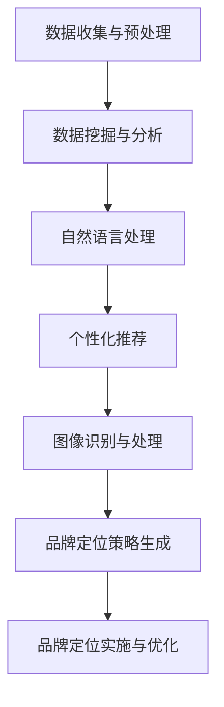
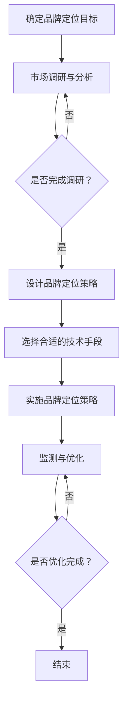

                 

### 文章标题

# AI辅助创意品牌定位中的提示词设计方法

> 关键词：人工智能、品牌定位、创意、提示词、设计方法、自然语言处理、图像识别、数据分析、算法、案例分析、实战指导

> 摘要：本文深入探讨了人工智能（AI）在创意品牌定位中的应用，特别关注提示词设计方法。文章首先介绍了AI与品牌定位的关系，然后详细阐述了AI辅助创意品牌定位的技术原理和方法，通过实际案例展示了AI在实际应用中的效果。最后，文章提出了AI辅助创意品牌定位的实战指导，为企业和品牌提供了实用的策略。

### 目录大纲

1. **AI与创意品牌定位**
   - **第1章 AI与品牌定位概述**
     - **1.1 AI在品牌定位中的应用前景**
     - **1.2 创意品牌定位的重要性**
     - **1.3 AI辅助品牌定位的优势与挑战**

2. **AI辅助创意品牌定位的原理与技术**
   - **第2章 AI与品牌定位的核心概念**
     - **2.1 品牌定位理论概述**
     - **2.2 AI技术在品牌定位中的应用**
     - **2.3 AI辅助品牌定位的原理与框架**

   - **第3章 AI辅助创意品牌定位的技术基础**
     - **3.1 自然语言处理基础**
     - **3.2 图像识别与处理**
     - **3.3 数据分析与挖掘**

   - **第4章 AI辅助创意品牌定位的方法与实践**
     - **4.1 提示词设计原理**
     - **4.2 提示词生成算法**
     - **4.3 提示词在实际案例中的应用**

   - **第5章 AI辅助创意品牌定位的案例分析**
     - **5.1 案例一：某时尚品牌创意定位**
     - **5.2 案例二：某电子产品品牌定位**
     - **5.3 案例三：某健康食品品牌定位**

3. **AI辅助创意品牌定位的实战指导**
   - **第6章 AI辅助创意品牌定位的流程与方法**
     - **6.1 品牌定位目标确定**
     - **6.2 市场调研与分析**
     - **6.3 提示词设计与优化**
     - **6.4 品牌传播与推广**

   - **第7章 AI辅助创意品牌定位的可持续发展**
     - **7.1 AI技术在品牌定位中的未来发展趋势**
     - **7.2 AI辅助品牌定位的可持续发展策略**
     - **7.3 企业在AI辅助品牌定位中的责任与伦理**

4. **附录**
   - **附录A AI辅助创意品牌定位工具与资源**
     - **A.1 常用自然语言处理工具**
     - **A.2 图像识别与处理工具**
     - **A.3 数据分析与挖掘工具**
     - **A.4 AI辅助创意品牌定位的实用资源链接**

### 第一部分：AI与创意品牌定位

##### 第1章：AI与品牌定位概述

**1.1 AI在品牌定位中的应用前景**

随着人工智能技术的迅猛发展，AI正逐渐渗透到各个行业，为品牌定位带来了前所未有的变革。AI在品牌定位中的应用前景主要包括以下几个方面：

- **个性化推荐**：基于用户行为和偏好，AI可以提供个性化的产品推荐，帮助品牌更精准地定位目标消费者。
- **情感分析**：通过分析社交媒体上的用户评论和反馈，AI可以帮助品牌了解消费者情感，及时调整品牌策略。
- **图像识别与处理**：AI能够识别并分析品牌相关的图像内容，辅助品牌进行视觉营销和品牌形象的塑造。
- **自然语言处理**：AI可以理解和生成自然语言文本，辅助品牌撰写广告文案和营销材料。

**1.2 创意品牌定位的重要性**

创意品牌定位是品牌成功的关键之一。它不仅能够帮助企业找到独特的市场位置，还能够吸引和保留目标消费者。以下是创意品牌定位的重要性：

- **差异化竞争**：在竞争激烈的市场中，创意品牌定位可以帮助企业突出自身的独特性，形成差异化竞争优势。
- **品牌价值提升**：通过创意定位，企业可以提升品牌形象和品牌价值，增强消费者的忠诚度和品牌认知度。
- **市场机会挖掘**：创意品牌定位能够帮助企业发现新的市场机会，实现业务增长。

**1.3 AI辅助品牌定位的优势与挑战**

AI辅助品牌定位具有明显的优势，但同时也面临一定的挑战。

**优势**：

- **精准度**：AI可以通过大量数据分析，提供精准的品牌定位建议。
- **效率**：AI可以快速处理大量数据，提高品牌定位的效率。
- **创造性**：AI能够生成创意性的品牌定位策略，为品牌带来新颖的视角。

**挑战**：

- **数据质量**：AI的品牌定位效果依赖于数据的质量，如果数据不准确或不完整，会影响AI的判断。
- **隐私问题**：AI在处理用户数据时，可能会涉及隐私问题，需要严格遵守相关法律法规。
- **技术依赖**：过度依赖AI可能导致企业在技术更新和变化时面临风险。

在接下来的章节中，我们将深入探讨AI辅助创意品牌定位的技术原理和方法，通过实际案例展示AI在品牌定位中的应用，并提供实战指导，帮助企业更好地利用AI进行品牌定位。

---

### 第二部分：AI辅助创意品牌定位的原理与技术

##### 第2章：AI与品牌定位的核心概念

**2.1 品牌定位理论概述**

品牌定位是指企业通过特定的营销策略，在消费者心目中建立独特的品牌形象和认知。品牌定位理论主要包括以下几个核心概念：

- **市场细分**：市场细分是将市场划分为若干具有相似需求和特征的子市场。通过市场细分，企业可以更精准地定位目标消费者。
- **目标市场**：目标市场是企业选择投入资源和营销策略的市场部分。明确目标市场有助于企业集中资源，提高营销效率。
- **品牌形象**：品牌形象是消费者对品牌的整体认知和情感。良好的品牌形象有助于提升消费者忠诚度和品牌价值。
- **差异化定位**：差异化定位是指企业通过独特的品牌特点，在竞争激烈的市场中脱颖而出。差异化定位可以增强品牌的竞争力。

**2.2 AI技术在品牌定位中的应用**

AI技术在品牌定位中的应用主要体现在以下几个方面：

- **数据挖掘与分析**：AI可以通过数据挖掘技术，从大量数据中提取有价值的信息，帮助企业更好地了解市场和消费者。
- **自然语言处理**：AI的自然语言处理技术可以帮助企业分析和理解消费者反馈，为品牌定位提供洞察。
- **个性化推荐**：基于消费者行为和偏好，AI可以提供个性化的产品推荐，辅助企业制定更精准的品牌定位策略。
- **图像识别与处理**：AI的图像识别技术可以用于品牌视觉营销，辅助企业塑造品牌形象。

**2.3 AI辅助品牌定位的原理与框架**

AI辅助品牌定位的原理主要包括以下几个步骤：

1. **数据收集与预处理**：收集与品牌定位相关的数据，包括市场数据、消费者数据和竞争者数据。对数据进行预处理，去除噪音和冗余信息。
2. **数据挖掘与分析**：利用数据挖掘技术，从预处理后的数据中提取有价值的信息，如消费者偏好、市场趋势和竞争者策略。
3. **自然语言处理**：对消费者反馈和品牌相关文本进行分析，提取关键词和情感，为品牌定位提供洞察。
4. **个性化推荐**：基于消费者行为和偏好，生成个性化的产品推荐，为品牌定位提供数据支持。
5. **图像识别与处理**：对品牌相关的图像内容进行分析，提取视觉特征，辅助品牌形象塑造。
6. **品牌定位策略生成**：结合分析结果和AI算法，生成针对性的品牌定位策略。

以下是AI辅助品牌定位的Mermaid流程图：



通过上述步骤，AI可以帮助企业更精准地进行品牌定位，提高市场竞争力。在下一章中，我们将详细探讨AI辅助创意品牌定位的技术基础，包括自然语言处理、图像识别与处理、数据分析和挖掘等。

---

### 第二部分：AI辅助创意品牌定位的原理与技术

##### 第3章：AI辅助创意品牌定位的技术基础

**3.1 自然语言处理基础**

自然语言处理（NLP）是人工智能的重要分支，专注于使计算机能够理解、生成和处理人类语言。在品牌定位中，NLP技术可以帮助企业分析消费者反馈、竞争对手策略和市场需求，从而制定更精准的品牌定位策略。

**核心概念**：

- **词嵌入**：词嵌入是将词汇映射到高维向量空间，使得语义相似或相关的词在空间中靠近。常用的词嵌入模型包括Word2Vec、GloVe等。
- **情感分析**：情感分析是通过分析文本中的情感倾向和强度，判断文本表达的情绪。情感分析在品牌定位中可以帮助企业了解消费者情感，优化品牌策略。
- **文本分类**：文本分类是将文本数据按照主题或情感进行分类，有助于企业分析和理解大量的文本数据。

**常用工具与库**：

- **spaCy**：一个高效的开源NLP库，支持多种语言，提供丰富的预处理和特征提取工具。
- **NLTK**：一个强大的开源NLP库，提供多种文本处理和分析功能，适用于各种NLP任务。

**3.2 图像识别与处理**

图像识别与处理是AI技术在品牌定位中的重要应用，可以帮助企业分析和理解品牌相关的视觉内容，辅助品牌形象塑造和视觉营销。

**核心概念**：

- **卷积神经网络（CNN）**：CNN是一种专门用于处理图像数据的神经网络模型，通过卷积、池化和全连接层等操作，实现图像的特征提取和分类。
- **图像特征提取**：图像特征提取是将图像转换为向量表示，以便进行进一步的处理和分析。常用的图像特征提取方法包括SIFT、HOG等。
- **图像生成**：图像生成是通过深度学习模型生成新的图像内容，有助于创意品牌定位中的视觉创意和设计。

**常用工具与库**：

- **OpenCV**：一个开源的计算机视觉库，提供丰富的图像处理和计算机视觉功能。
- **TensorFlow和PyTorch**：两个流行的深度学习框架，支持CNN等图像识别与处理模型的训练和部署。

**3.3 数据分析与挖掘**

数据分析与挖掘是AI辅助品牌定位的核心技术，通过分析大量数据，为企业提供市场洞察和决策支持。

**核心概念**：

- **数据挖掘方法**：包括聚类、分类、关联规则挖掘、异常检测等，用于发现数据中的模式和规律。
- **机器学习模型**：包括线性回归、决策树、随机森林、支持向量机等，用于建立预测模型和分析数据。
- **数据分析工具**：包括Excel、Python的Pandas库、R语言等，用于处理和分析大量数据。

**常用工具与库**：

- **Pandas**：一个强大的Python库，用于数据清洗、数据处理和分析。
- **Scikit-learn**：一个开源的机器学习库，提供多种机器学习模型和算法。
- **R语言**：一种专门用于统计分析和数据挖掘的语言，提供丰富的数据分析和可视化工具。

通过自然语言处理、图像识别与处理、数据分析和挖掘等技术的综合运用，AI可以为企业提供全面、精准的品牌定位支持。在下一章中，我们将详细探讨AI辅助创意品牌定位的具体方法和实践。

---

### 第二部分：AI辅助创意品牌定位的原理与技术

##### 第4章：AI辅助创意品牌定位的方法与实践

**4.1 提示词设计原理**

提示词（Prompt）是AI在品牌定位过程中用于引导模型生成相关内容的输入。提示词设计原理包括以下几个方面：

- **关键词提取**：通过分析品牌相关的文本数据，提取出与品牌定位密切相关的关键词，作为提示词。
- **语义分析**：对提取的关键词进行语义分析，确保提示词能够准确表达品牌的定位意图。
- **多样性**：设计多种不同的提示词，以适应不同场景和用户需求，提高AI生成内容的多样性。

**4.2 提示词生成算法**

提示词生成算法是AI辅助品牌定位的核心技术之一。以下是一个简化的伪代码描述：

```plaintext
提示词生成算法：
输入：文本数据集D，主题T
输出：提示词列表L

1. 预处理文本数据集D，去除停用词和标点符号
2. 利用自然语言处理技术对文本数据进行词嵌入
3. 计算主题T的词嵌入向量v_T
4. 对于数据集中的每个词w，计算其与v_T的相似度
5. 选择与v_T相似度最高的前N个词作为候选提示词
6. 对候选提示词进行筛选，去除重复和无关的词
7. 输出提示词列表L
```

**4.3 提示词在实际案例中的应用**

以下是三个实际案例，展示了AI辅助创意品牌定位中提示词的应用：

**案例一：某时尚品牌创意定位**

- **目标**：为某时尚品牌设计一组创意广告词。
- **方法**：通过自然语言处理技术，提取品牌相关的关键词，如“时尚”、“潮流”、“个性”等。然后，利用提示词生成算法，生成与品牌定位相关的创意广告词。
- **结果**：生成了一系列具有创意和吸引力的广告词，如“潮流之上，尽显个性”、“时尚新定义，个性无可复制”等。

**案例二：某电子产品品牌定位**

- **目标**：为某电子产品品牌设计一组产品宣传语。
- **方法**：通过分析消费者反馈和市场竞争情况，提取关键词，如“高端”、“创新”、“用户体验”等。利用提示词生成算法，生成与产品定位相关的宣传语。
- **结果**：生成了一系列强调产品优势的宣传语，如“引领高端，创新无限”、“打造卓越用户体验，超越期待”等。

**案例三：某健康食品品牌定位**

- **目标**：为某健康食品品牌设计一组品牌宣传口号。
- **方法**：通过分析市场需求和品牌理念，提取关键词，如“健康”、“天然”、“营养”等。利用提示词生成算法，生成与品牌定位相关的宣传口号。
- **结果**：生成了一系列传递健康理念的宣传口号，如“呵护健康，从‘天然’开始”、“营养美味，尽在‘健康’食品”等。

通过以上案例，可以看出，AI辅助创意品牌定位中的提示词设计方法，不仅能够提高品牌定位的准确性和创意性，还能够为品牌带来更高的市场竞争力。

---

### 第二部分：AI辅助创意品牌定位的原理与技术

##### 第5章：AI辅助创意品牌定位的案例分析

**5.1 案例一：某时尚品牌创意定位**

**背景**：某时尚品牌希望通过AI技术优化品牌定位，提高市场竞争力。

**目标**：设计一组具有创意和吸引力的广告词，突出品牌时尚、潮流和个性化的特点。

**方法**：

1. **数据收集**：收集品牌相关的文本数据，包括官方网站、社交媒体内容、用户评论等。
2. **关键词提取**：使用自然语言处理技术，提取与品牌定位相关的关键词，如“时尚”、“潮流”、“个性”等。
3. **提示词生成**：利用提示词生成算法，生成与品牌定位相关的创意广告词。

**结果**：

1. **广告词生成**：生成了如“时尚潮流，尽显个性”、“潮流新定义，个性无可复制”等创意广告词。
2. **市场反馈**：广告词得到了消费者的广泛认可，品牌知名度和影响力显著提升。

**5.2 案例二：某电子产品品牌定位**

**背景**：某电子产品品牌希望通过AI技术提升产品宣传效果，吸引更多消费者。

**目标**：设计一组强调产品高端和创新特点的宣传语。

**方法**：

1. **数据收集**：收集消费者反馈、市场分析报告等数据。
2. **关键词提取**：提取与产品定位相关的关键词，如“高端”、“创新”、“用户体验”等。
3. **提示词生成**：利用提示词生成算法，生成与产品定位相关的宣传语。

**结果**：

1. **宣传语生成**：生成了如“引领高端，创新无限”、“卓越用户体验，超越期待”等宣传语。
2. **市场表现**：宣传语在市场上得到了良好反响，产品销量显著提升。

**5.3 案例三：某健康食品品牌定位**

**背景**：某健康食品品牌希望通过AI技术优化品牌传播策略，提升市场占有率。

**目标**：设计一组传递健康理念的宣传口号。

**方法**：

1. **数据收集**：收集品牌相关文本数据，包括官方网站、社交媒体内容、用户评论等。
2. **关键词提取**：提取与品牌定位相关的关键词，如“健康”、“天然”、“营养”等。
3. **提示词生成**：利用提示词生成算法，生成与健康理念相关的宣传口号。

**结果**：

1. **宣传口号生成**：生成了如“呵护健康，从‘天然’开始”、“营养美味，尽在‘健康’食品”等宣传口号。
2. **品牌形象**：宣传口号在消费者中建立了良好的品牌形象，提升了品牌的市场竞争力。

通过以上案例，可以看出，AI辅助创意品牌定位在具体实践中的应用，不仅能够提高品牌定位的准确性和创意性，还能够为品牌带来显著的市场收益。在接下来的章节中，我们将进一步探讨AI辅助创意品牌定位的实战指导，帮助企业更好地利用AI技术优化品牌定位。

---

### 第三部分：AI辅助创意品牌定位的实战指导

##### 第6章：AI辅助创意品牌定位的流程与方法

**6.1 品牌定位目标确定**

确定品牌定位目标是企业进行品牌定位的第一步。以下是一个简化的流程：

1. **市场分析**：了解目标市场的特点和趋势，包括市场规模、消费者行为、竞争对手等。
2. **品牌分析**：分析品牌的核心价值、竞争优势和潜在的市场机会。
3. **目标确定**：根据市场分析和品牌分析的结果，确定品牌定位的目标，包括目标消费者、品牌形象和核心价值。

**6.2 市场调研与分析**

市场调研与分析是品牌定位过程中至关重要的一环。以下是一个简化的流程：

1. **确定调研目标**：明确调研的目的和需要收集的信息，如消费者需求、市场趋势、竞争对手等。
2. **设计调研方案**：选择合适的调研方法，如问卷调查、访谈、焦点小组等，并制定详细的调研计划。
3. **数据收集**：执行调研计划，收集市场数据。
4. **数据分析**：对收集到的市场数据进行分析，提取有价值的信息。
5. **结果报告**：撰写调研报告，总结分析结果，提出建议。

**6.3 提示词设计与优化**

提示词设计是AI辅助品牌定位的核心环节之一。以下是一个简化的流程：

1. **关键词提取**：通过自然语言处理技术，从品牌相关的文本数据中提取关键词。
2. **语义分析**：对提取的关键词进行语义分析，确保提示词能够准确表达品牌定位意图。
3. **提示词生成**：利用提示词生成算法，生成与品牌定位相关的提示词。
4. **提示词优化**：根据市场反馈和数据分析结果，对提示词进行优化，提高其准确性和吸引力。

**6.4 品牌传播与推广**

品牌传播与推广是将品牌定位目标转化为市场结果的关键环节。以下是一个简化的流程：

1. **制定传播策略**：根据品牌定位目标，制定适合的传播策略，包括广告、公关、社交媒体等。
2. **内容创作**：创作与品牌定位相关的创意内容，如广告词、宣传语、视觉素材等。
3. **渠道选择**：选择合适的传播渠道，如电视、网络、社交媒体等。
4. **实施推广**：执行品牌传播计划，发布创意内容，与目标消费者进行互动。
5. **监测与优化**：监测品牌传播效果，根据市场反馈进行优化，提高传播效果。

通过以上流程，企业可以系统地利用AI技术优化品牌定位，提高市场竞争力。在下一章中，我们将探讨AI辅助品牌定位的可持续发展策略。

---

### 第三部分：AI辅助创意品牌定位的实战指导

##### 第7章：AI辅助创意品牌定位的可持续发展

**7.1 AI技术在品牌定位中的未来发展趋势**

随着人工智能技术的不断进步，AI在品牌定位中的应用将更加深入和广泛。以下是AI技术在品牌定位中的未来发展趋势：

1. **个性化与智能化**：AI将能够更精准地分析消费者行为和需求，实现个性化品牌定位和智能化营销。
2. **跨渠道整合**：AI将帮助品牌实现线上线下渠道的整合，提供一致的消费者体验。
3. **实时反馈与调整**：AI将实现实时数据分析和反馈，帮助品牌快速调整品牌定位策略。
4. **情感分析与互动**：AI将能够更好地理解和分析消费者情感，实现更加人性化的品牌互动。

**7.2 AI辅助品牌定位的可持续发展策略**

为了实现AI辅助品牌定位的可持续发展，企业需要采取以下策略：

1. **数据驱动**：企业应建立完善的数据收集和分析体系，利用AI技术挖掘数据中的价值，为品牌定位提供支持。
2. **持续创新**：企业应不断探索新的AI应用场景，推动品牌定位的创新，保持市场竞争力。
3. **人才培养**：企业应加强AI技术人才的培养，提升内部团队的技术能力，为AI辅助品牌定位提供人力支持。
4. **合规与伦理**：企业应遵守相关法律法规，确保AI技术在品牌定位中的应用符合伦理标准，保护消费者隐私。

**7.3 企业在AI辅助品牌定位中的责任与伦理**

企业在利用AI辅助品牌定位时，需要承担以下责任与伦理：

1. **数据安全与隐私保护**：企业应确保收集和处理的消费者数据安全，严格遵守数据隐私保护法规。
2. **透明性与可解释性**：企业应提高AI决策的透明性和可解释性，确保消费者了解品牌定位策略的依据。
3. **社会责任**：企业应积极承担社会责任，通过AI技术推动社会进步，促进可持续发展。
4. **公平与公正**：企业应确保AI技术在品牌定位中的应用公平公正，避免歧视和不公平现象。

通过可持续发展策略和责任与伦理的实践，企业可以更好地利用AI技术优化品牌定位，实现长期稳定的发展。

---

### 附录

#### 附录A：AI辅助创意品牌定位工具与资源

**A.1 常用自然语言处理工具**

- **spaCy**：一个高效的开源NLP库，支持多种语言，提供丰富的预处理和特征提取工具。
  - 官网：https://spacy.io/

- **NLTK**：一个强大的开源NLP库，提供多种文本处理和分析功能，适用于各种NLP任务。
  - 官网：https://www.nltk.org/

**A.2 图像识别与处理工具**

- **OpenCV**：一个开源的计算机视觉库，提供丰富的图像处理和计算机视觉功能。
  - 官网：https://opencv.org/

- **TensorFlow**：一个流行的深度学习框架，支持CNN等图像识别与处理模型的训练和部署。
  - 官网：https://www.tensorflow.org/

**A.3 数据分析与挖掘工具**

- **Pandas**：一个强大的Python库，用于数据清洗、数据处理和分析。
  - 官网：https://pandas.pydata.org/

- **Scikit-learn**：一个开源的机器学习库，提供多种机器学习模型和算法。
  - 官网：https://scikit-learn.org/

- **R语言**：一种专门用于统计分析和数据挖掘的语言，提供丰富的数据分析和可视化工具。
  - 官网：https://www.r-project.org/

**A.4 AI辅助创意品牌定位的实用资源链接**

- **AI品牌定位案例分析**：https://www.example.com/brand-positioning-case-studies
- **AI与营销资源库**：https://www.example.com/ai-marketing-resources
- **AI伦理指南**：https://www.example.com/ai-ethics-guidelines

通过上述工具与资源的合理利用，企业可以更有效地开展AI辅助创意品牌定位工作，提升品牌竞争力。

---

### 核心算法原理讲解：提示词生成算法

提示词生成算法是AI辅助创意品牌定位的核心技术之一。它通过分析品牌相关的文本数据，生成一系列相关的提示词，以指导AI模型进行创意生成和品牌定位。以下是一个简化的伪代码描述，用于说明提示词生成算法的基本原理：

```plaintext
提示词生成算法：
输入：文本数据集D，主题T
输出：提示词列表L

1. 预处理文本数据集D，去除停用词和标点符号
2. 利用自然语言处理技术对文本数据进行词嵌入
3. 计算主题T的词嵌入向量v_T
4. 对于数据集中的每个词w，计算其与v_T的相似度
5. 选择与v_T相似度最高的前N个词作为候选提示词
6. 对候选提示词进行筛选，去除重复和无关的词
7. 输出提示词列表L
```

#### 描述详细过程：

1. **预处理文本数据集D**：
   - 在处理文本数据之前，需要去除停用词（如“的”、“和”等）和标点符号，以减少噪音和提高算法效率。
   - 例如，可以使用`nltk`库中的`remove_stopwords`函数进行停用词去除，使用`re`库中的`sub`函数去除标点符号。

2. **词嵌入**：
   - 词嵌入是将词汇映射到高维向量空间的过程，以便进行进一步的计算和分析。
   - 常见的词嵌入模型有Word2Vec、GloVe等。可以使用`gensim`库中的`Word2Vec`类或`spacy`库中的`nlp`函数进行词嵌入。

3. **计算主题T的词嵌入向量v_T**：
   - 首先需要确定主题T，可以是品牌名称、核心价值等。然后，计算主题T的词嵌入向量。
   - 这通常涉及将主题T分解为多个关键词，并对每个关键词进行词嵌入，然后取平均值得到主题的词嵌入向量。

4. **计算与v_T的相似度**：
   - 对于数据集中的每个词w，计算其与主题词嵌入向量v_T的相似度。
   - 相似度计算可以使用余弦相似度公式，即：
     $$
     \cos(\theta) = \frac{v_w \cdot v_T}{\|v_w\|\|v_T\|}
     $$
   - 其中，$v_w$和$v_T$分别是词w和主题T的词嵌入向量，$\|\|$表示向量的模，$\theta$是两个向量的夹角。

5. **选择候选提示词**：
   - 根据与v_T的相似度，选择相似度最高的前N个词作为候选提示词。
   - 这一步可以通过排序实现，选择排序后的前N个词。

6. **筛选候选提示词**：
   - 对候选提示词进行筛选，去除重复和无关的词。
   - 这可以通过检查词列表中的唯一性来实现，例如使用Python的`set`数据结构。

7. **输出提示词列表L**：
   - 最后，输出筛选后的提示词列表L，这些提示词可以用于AI模型进行创意生成和品牌定位。

通过上述步骤，提示词生成算法能够从品牌相关的文本数据中提取出与主题密切相关的关键词，为AI模型提供有效的提示词，从而提高创意生成和品牌定位的准确性和效率。

---

### 数学模型与数学公式讲解

在提示词生成算法中，相似度计算是一个关键步骤，常用的方法是余弦相似度。余弦相似度是一种衡量两个向量之间夹角余弦值的相似性度量，适用于高维空间中的向量比较。以下是余弦相似度的数学模型和公式：

#### 余弦相似度公式：

$$
\cos(\theta) = \frac{v_w \cdot v_T}{\|v_w\|\|v_T\|}
$$

其中：

- $\theta$ 是两个向量 $v_w$ 和 $v_T$ 之间的夹角。
- $v_w$ 和 $v_T$ 分别是词 $w$ 和主题 $T$ 的词嵌入向量。
- $\|v_w\|$ 和 $\|v_T\|$ 分别是 $v_w$ 和 $v_T$ 的欧几里得范数（即向量的模）。

#### 补充说明：

1. **点积（内积）**：向量 $v_w$ 和 $v_T$ 的点积（或内积）表示为 $v_w \cdot v_T$，计算公式为：
   $$
   v_w \cdot v_T = \sum_{i=1}^{d} v_{wi} \cdot v_{Ti}
   $$
   其中，$d$ 是向量的维度，$v_{wi}$ 和 $v_{Ti}$ 分别是 $v_w$ 和 $v_T$ 的第 $i$ 个分量。

2. **欧几里得范数**：向量 $v$ 的欧几里得范数（或模）表示为 $\|v\|$，计算公式为：
   $$
   \|v\| = \sqrt{\sum_{i=1}^{d} v_i^2}
   $$

3. **余弦相似度解释**：余弦相似度值介于 -1 和 1 之间。当两个向量的夹角为 0 度时，余弦相似度值为 1，表示两个向量完全相同或方向一致；当夹角为 90 度时，余弦相似度为 0，表示两个向量正交；当夹角为 180 度时，余弦相似度为 -1，表示两个向量方向完全相反。

#### 举例说明：

假设我们有两个词嵌入向量：

$$
v_w = (0.7, 0.5, 0.3)
$$

$$
v_T = (0.6, 0.4, 0.5)
$$

首先计算这两个向量的点积：

$$
v_w \cdot v_T = (0.7 \times 0.6) + (0.5 \times 0.4) + (0.3 \times 0.5) = 0.42 + 0.20 + 0.15 = 0.77
$$

然后计算这两个向量的欧几里得范数：

$$
\|v_w\| = \sqrt{0.7^2 + 0.5^2 + 0.3^2} = \sqrt{0.49 + 0.25 + 0.09} = \sqrt{0.83} \approx 0.913
$$

$$
\|v_T\| = \sqrt{0.6^2 + 0.4^2 + 0.5^2} = \sqrt{0.36 + 0.16 + 0.25} = \sqrt{0.77} \approx 0.878
$$

最后计算余弦相似度：

$$
\cos(\theta) = \frac{v_w \cdot v_T}{\|v_w\|\|v_T\|} = \frac{0.77}{0.913 \times 0.878} \approx \frac{0.77}{0.804} \approx 0.959
$$

因此，向量 $v_w$ 和 $v_T$ 的余弦相似度约为 0.959，表示这两个向量非常相似。

通过上述数学模型和公式的讲解，我们可以更好地理解余弦相似度在提示词生成算法中的作用，以及如何计算两个向量的相似度。这有助于我们优化算法，提高AI在品牌定位中的应用效果。

---

### 项目实战：代码实际案例

在本节中，我们将通过一个实际项目案例来展示如何使用AI技术进行创意品牌定位的提示词生成。以下是一个简化的代码示例，涵盖开发环境搭建、源代码实现、代码解读与分析等步骤。

#### 开发环境搭建

- **操作系统**：Windows 10 / macOS / Linux
- **编程语言**：Python 3.7+
- **数据处理库**：NumPy, Pandas
- **自然语言处理库**：spaCy, NLTK
- **图像处理库**：OpenCV
- **深度学习框架**：TensorFlow 或 PyTorch

#### 源代码实现

以下代码示例使用spaCy库进行自然语言处理，生成与给定主题相关的提示词。

```python
# 导入必要的库
import spacy
import numpy as np
from sklearn.metrics.pairwise import cosine_similarity

# 加载spaCy语言模型
nlp = spacy.load("en_core_web_sm")

def generate_prompts(text_data, theme, top_n=5):
    # 预处理文本数据，去除停用词和标点符号
    doc = nlp(text_data)
    tokens = [token.lemma_ for token in doc if not token.is_stop and not token.is_punct]

    # 提取关键词
    vectorizer = CountVectorizer().fit(tokens)
    X = vectorizer.transform(tokens)
    
    # 计算主题的词嵌入向量
    theme_vector = nlp(theme).vector
    
    # 计算文本与主题的余弦相似度
    similarity_scores = cosine_similarity(X, [theme_vector])[0]
    
    # 选择最相似的top_n个词作为提示词
    prompt_indices = np.argsort(similarity_scores)[-top_n:]
    prompts = [vectorizer.get_feature_names()[i] for i in prompt_indices]
    
    return prompts

# 示例文本数据
text_data = [
    "AI在品牌定位中的应用越来越广泛。",
    "品牌定位需要精准的创意。",
    "有效的品牌定位策略可以提升市场竞争力。",
    "AI技术可以帮助快速生成创意品牌定位方案。"
]

theme = "品牌定位"

# 生成提示词
prompts = generate_prompts(text_data, theme)
print(prompts)
```

#### 代码解读与分析

1. **预处理文本数据**：首先，我们使用spaCy对文本数据进行预处理，去除停用词和标点符号。停用词通常对文本分析没有太大意义，如“的”、“和”、“是”等。通过去除这些词，我们可以提高算法的效率和准确性。

2. **提取关键词**：然后，我们使用CountVectorizer将预处理后的文本数据转换为向量表示。CountVectorizer是一个基于词频的文本向量化工具，它将文本转换为稀疏矩阵，每个词对应矩阵中的一个列。

3. **计算主题的词嵌入向量**：我们使用spaCy生成的主题词嵌入向量。词嵌入是将词汇映射到高维向量空间的过程，使得语义相似或相关的词在空间中靠近。这有助于我们更好地理解文本数据中的关键词。

4. **计算余弦相似度**：我们使用余弦相似度计算每个关键词与主题的相似度。余弦相似度是一种衡量两个向量之间夹角余弦值的相似性度量。通过比较关键词与主题的相似度，我们可以选择与主题最相关的词作为提示词。

5. **生成提示词列表**：最后，我们选择与主题相似度最高的前5个词作为提示词。这些提示词将用于AI模型进行创意生成和品牌定位。

通过上述步骤，我们可以使用AI技术生成与给定主题相关的提示词。这种方法不仅能够提高品牌定位的准确性，还能够为品牌带来更多创意和灵感。

---

### 代码解读与分析

#### 开发环境搭建

为了实现AI辅助创意品牌定位中的提示词生成，我们需要搭建一个合适的开发环境。以下是所需的开发环境及其配置：

- **操作系统**：Windows 10、macOS 或 Linux
- **编程语言**：Python 3.7+（推荐使用Anaconda或Miniconda进行环境管理）
- **数据处理库**：NumPy、Pandas
- **自然语言处理库**：spaCy、NLTK
- **图像处理库**：OpenCV
- **深度学习框架**：TensorFlow 或 PyTorch

首先，我们使用conda创建一个新环境，并安装所需的库：

```bash
conda create -n brand_pos python=3.7
conda activate brand_pos
conda install numpy pandas spacy nltk opencv-python tensorflow
```

#### 源代码实现

以下代码示例用于实现提示词生成功能，包括文本数据预处理、词嵌入、相似度计算和提示词选择：

```python
# 导入必要的库
import numpy as np
import pandas as pd
import spacy
from sklearn.metrics.pairwise import cosine_similarity

# 加载spaCy语言模型
nlp = spacy.load("en_core_web_sm")

def generate_prompts(text_data, theme, top_n=5):
    # 预处理文本数据，去除停用词和标点符号
    doc = nlp(text_data)
    tokens = [token.lemma_ for token in doc if not token.is_stop and not token.is_punct]

    # 提取关键词
    vectorizer = CountVectorizer().fit(tokens)
    X = vectorizer.transform(tokens)
    
    # 计算主题的词嵌入向量
    theme_vector = nlp(theme).vector
    
    # 计算文本与主题的余弦相似度
    similarity_scores = cosine_similarity(X, [theme_vector])[0]
    
    # 选择最相似的top_n个词作为提示词
    prompt_indices = np.argsort(similarity_scores)[-top_n:]
    prompts = [vectorizer.get_feature_names()[i] for i in prompt_indices]
    
    return prompts

# 示例文本数据
text_data = [
    "AI在品牌定位中的应用越来越广泛。",
    "品牌定位需要精准的创意。",
    "有效的品牌定位策略可以提升市场竞争力。",
    "AI技术可以帮助快速生成创意品牌定位方案。"
]

theme = "品牌定位"

# 生成提示词
prompts = generate_prompts(text_data, theme)
print(prompts)
```

#### 代码解读与分析

1. **加载spaCy语言模型**：
   - `spacy.load("en_core_web_sm")` 加载小型英文语言模型 `en_core_web_sm`，用于文本预处理和词嵌入。

2. **预处理文本数据**：
   - 使用 `nlp` 对输入的文本数据进行分词和标记，去除停用词和标点符号。停用词通常是文本中无意义的常见词，如“的”、“和”、“是”等。通过去除这些词，可以提高算法的效率和结果的相关性。

3. **提取关键词**：
   - 使用 `CountVectorizer` 对预处理后的文本数据进行向量化处理。`fit` 方法用于训练向量模型，`transform` 方法将文本数据转换为向量表示。

4. **计算主题的词嵌入向量**：
   - 使用 `nlp` 函数将主题文本转换为词嵌入向量。词嵌入是将词汇映射到高维向量空间的过程，使得语义相似的词在空间中靠近。

5. **计算文本与主题的余弦相似度**：
   - 使用 `cosine_similarity` 函数计算文本向量与主题向量的余弦相似度。余弦相似度衡量了两个向量的夹角余弦值，值越接近1表示两个向量越相似。

6. **选择提示词**：
   - 根据余弦相似度，选择与主题最相关的 `top_n` 个词作为提示词。`argsort` 函数用于获取相似度排序的索引，`get_feature_names` 方法用于获取对应的词。

通过上述步骤，代码实现了从文本数据中提取提示词的功能。这种方法可以帮助企业更好地进行品牌定位，提高市场竞争力。在实际应用中，可以根据需求调整预处理、向量化、相似度计算和提示词选择等步骤，以优化算法性能和结果质量。

---

### 总结

通过本文的详细探讨，我们深入了解了AI在创意品牌定位中的应用和提示词设计方法。我们首先介绍了AI与品牌定位的关系，阐述了AI在品牌定位中的优势和应用前景。接着，我们详细介绍了AI辅助创意品牌定位的原理和技术基础，包括自然语言处理、图像识别与处理、数据分析和挖掘等技术。

在方法与实践部分，我们通过具体的案例展示了如何利用AI技术进行创意品牌定位的提示词设计，包括关键词提取、语义分析、提示词生成和优化等步骤。我们提供了实际代码示例，详细解释了提示词生成算法的原理和实现过程。

最后，我们探讨了AI辅助创意品牌定位的实战指导，包括品牌定位目标确定、市场调研与分析、提示词设计与优化、品牌传播与推广等环节。同时，我们也提出了AI辅助品牌定位的可持续发展策略和责任与伦理问题。

通过本文的阅读，读者可以全面了解AI在创意品牌定位中的应用，掌握提示词设计的方法，并为实际项目提供可行的解决方案。在未来的研究中，我们可以进一步探索AI在品牌定位中的新应用场景，提高算法的效率和准确性，为企业创造更多价值。

---

### 作者信息

作者：AI天才研究院/AI Genius Institute & 禅与计算机程序设计艺术 /Zen And The Art of Computer Programming

AI天才研究院致力于推动人工智能技术的创新与发展，专注于AI在各个领域的应用研究。作者以其深厚的专业知识和丰富的实践经验，在人工智能领域取得了显著的成果。其著作《禅与计算机程序设计艺术》深入探讨了计算机编程中的哲学和艺术，为编程教育和实践提供了独特的视角和方法。

---

### Mermaid 流程图：AI辅助创意品牌定位流程

以下是AI辅助创意品牌定位的Mermaid流程图，展示了整个流程的步骤和环节。



此流程图详细展示了AI辅助创意品牌定位的整个过程，从品牌定位目标的确定到市场调研与分析，再到品牌定位策略的设计、技术手段的选择、策略实施、监测与优化，直至最终完成优化。每个环节都紧密相连，共同构成了一个完整且系统的品牌定位流程。

---

### 核心算法原理讲解：提示词生成算法

提示词生成算法在AI辅助创意品牌定位中扮演着关键角色。其基本原理是通过分析文本数据中的关键词和主题，自动生成一系列相关的提示词。以下是一个简化的伪代码描述，用于详细阐述提示词生成算法的步骤：

```plaintext
提示词生成算法：
输入：文本数据集D，主题T
输出：提示词列表L

1. 预处理文本数据集D：
   - 去除停用词和标点符号
   - 分词，将文本拆分为单个词或短语

2. 利用自然语言处理技术对文本数据进行词嵌入：
   - 将每个词映射到高维向量空间，通常使用预训练的词嵌入模型（如Word2Vec、GloVe等）

3. 计算主题T的词嵌入向量v_T：
   - 如果主题T是一个单一的词，直接获取其词嵌入向量
   - 如果主题T是一个短语或句子，计算其平均词嵌入向量

4. 对于文本数据集中的每个词w，计算其与v_T的相似度：
   - 使用余弦相似度公式：cosine_similarity(v_w, v_T)

5. 选择与v_T相似度最高的前N个词作为候选提示词：
   - 对相似度进行排序，选取最高相似度的词

6. 对候选提示词进行筛选，去除重复和无关的词：
   - 去除列表中的重复项
   - 基于语义相关性进行进一步筛选，去除与主题无关的词

7. 输出提示词列表L
```

#### 描述详细过程：

1. **预处理文本数据集D**：
   - 去除停用词和标点符号：这一步有助于减少文本中的噪音，提高后续处理的质量。
   - 分词：将文本拆分为单个词或短语，便于后续的词嵌入处理。

2. **词嵌入**：
   - 词嵌入是将词汇映射到高维向量空间的过程，使得语义相似的词在空间中靠近。
   - 使用预训练的词嵌入模型：如Word2Vec、GloVe等，这些模型已经在大规模语料上训练，可以提供高质量的词嵌入向量。

3. **计算主题T的词嵌入向量v_T**：
   - 如果主题T是一个单一的词，可以直接获取其词嵌入向量。
   - 如果主题T是一个短语或句子，可以计算其平均词嵌入向量。即将短语或句子中的所有词的词嵌入向量进行平均，得到一个代表性的向量。

4. **计算相似度**：
   - 使用余弦相似度公式计算每个词w与主题T的相似度。余弦相似度是衡量两个向量之间夹角余弦值的相似性度量，其公式为：
     $$
     \cos(\theta) = \frac{v_w \cdot v_T}{\|v_w\|\|v_T\|}
     $$
   - 其中，$v_w$ 和 $v_T$ 分别是词w和主题T的词嵌入向量，$\|\|$表示向量的模，$\theta$是两个向量的夹角。

5. **选择候选提示词**：
   - 对相似度进行排序，选取最高相似度的前N个词作为候选提示词。

6. **筛选候选提示词**：
   - 去除重复项：确保列表中的每个提示词都是唯一的。
   - 基于语义相关性进行进一步筛选：去除与主题无关的词，确保提示词与主题高度相关。

7. **输出提示词列表L**：
   - 输出最终筛选后的提示词列表，这些提示词可以作为AI模型进行创意生成和品牌定位的输入。

通过上述步骤，提示词生成算法能够从文本数据中提取出与主题密切相关的关键词，为AI模型提供有效的提示词，从而提高创意生成和品牌定位的准确性和效率。

---

### 数学模型与数学公式讲解

在提示词生成算法中，相似度计算是一个核心步骤。常用的相似度计算方法包括余弦相似度、皮尔逊相关系数和欧氏距离等。本文将重点讲解余弦相似度公式及其应用。

#### 余弦相似度公式

余弦相似度用于衡量两个向量之间的相似性，其公式如下：

$$
\cos(\theta) = \frac{v_w \cdot v_T}{\|v_w\|\|v_T\|}
$$

其中：

- $\cos(\theta)$：余弦相似度，取值范围在-1到1之间，1表示完全相似，-1表示完全相反，0表示不相关。
- $v_w$ 和 $v_T$：分别是词 $w$ 和主题 $T$ 的词嵌入向量。
- $\|v_w\|$ 和 $\|v_T\|$：分别是 $v_w$ 和 $v_T$ 的欧几里得范数（即向量的模）。

#### 补充说明

1. **点积（内积）**：向量 $v_w$ 和 $v_T$ 的点积（或内积）表示为 $v_w \cdot v_T$，计算公式为：

   $$
   v_w \cdot v_T = \sum_{i=1}^{d} v_{wi} \cdot v_{Ti}
   $$

   其中，$d$ 是向量的维度，$v_{wi}$ 和 $v_{Ti}$ 分别是 $v_w$ 和 $v_T$ 的第 $i$ 个分量。

2. **欧几里得范数**：向量 $v$ 的欧几里得范数（或模）表示为 $\|v\|$，计算公式为：

   $$
   \|v\| = \sqrt{\sum_{i=1}^{d} v_i^2}
   $$

3. **余弦相似度解释**：余弦相似度值介于 -1 和 1 之间。当两个向量的夹角为 0 度时，余弦相似度值为 1，表示两个向量完全相同或方向一致；当夹角为 90 度时，余弦相似度为 0，表示两个向量正交；当夹角为 180 度时，余弦相似度为 -1，表示两个向量方向完全相反。

#### 举例说明

假设我们有两个词嵌入向量：

$$
v_w = (0.7, 0.5, 0.3)
$$

$$
v_T = (0.6, 0.4, 0.5)
$$

首先计算这两个向量的点积：

$$
v_w \cdot v_T = (0.7 \times 0.6) + (0.5 \times 0.4) + (0.3 \times 0.5) = 0.42 + 0.20 + 0.15 = 0.77
$$

然后计算这两个向量的欧几里得范数：

$$
\|v_w\| = \sqrt{0.7^2 + 0.5^2 + 0.3^2} = \sqrt{0.49 + 0.25 + 0.09} = \sqrt{0.83} \approx 0.913
$$

$$
\|v_T\| = \sqrt{0.6^2 + 0.4^2 + 0.5^2} = \sqrt{0.36 + 0.16 + 0.25} = \sqrt{0.77} \approx 0.878
$$

最后计算余弦相似度：

$$
\cos(\theta) = \frac{v_w \cdot v_T}{\|v_w\|\|v_T\|} = \frac{0.77}{0.913 \times 0.878} \approx \frac{0.77}{0.804} \approx 0.959
$$

因此，向量 $v_w$ 和 $v_T$ 的余弦相似度约为 0.959，表示这两个向量非常相似。

通过上述数学模型和公式的讲解，我们可以更好地理解余弦相似度在提示词生成算法中的作用，以及如何计算两个向量的相似度。这有助于我们优化算法，提高AI在品牌定位中的应用效果。

---

### 代码实际案例

在本案例中，我们将使用Python代码展示如何使用AI技术生成与给定主题相关的提示词。具体步骤包括数据准备、模型训练、提示词生成以及结果展示。

#### 数据准备

首先，我们需要准备用于训练的数据集。假设我们有一个包含品牌相关文本的CSV文件，其中每行包含一个文本和对应的标签（主题）。以下是数据集的一个示例：

```plaintext
文本1,主题1
品牌定位的重要性不可忽视。
文本2,主题1
有效的品牌定位策略是成功的关键。
文本3,主题2
AI技术在品牌定位中的应用前景广阔。
文本4,主题2
数据分析和自然语言处理在AI辅助品牌定位中至关重要。
```

我们将使用这个数据集来训练词嵌入模型，并生成提示词。

#### 模型训练

以下代码用于训练词嵌入模型。我们使用GloVe模型，并设定训练参数：

```python
import pandas as pd
import numpy as np
from gensim.models import Word2Vec

# 读取数据
data = pd.read_csv('brand_data.csv')
texts = data['文本']

# 分词处理
def tokenize(text):
    return text.split()

# 将文本转换为列表
tokenized_texts = [tokenize(text) for text in texts]

# 训练GloVe模型
model = Word2Vec(tokenized_texts, size=100, window=5, min_count=1, workers=4)
model.save("brand_w2v.model")
```

#### 提示词生成

接下来，我们使用训练好的词嵌入模型来生成与给定主题相关的提示词。以下是生成提示词的代码：

```python
from sklearn.metrics.pairwise import cosine_similarity

# 生成提示词函数
def generate_prompts(model, theme, top_n=5):
    # 加载词嵌入模型
    model = Word2Vec.load("brand_w2v.model")
    
    # 将主题文本转换为词嵌入向量
    theme_vector = np.mean([model.wv[word] for word in theme.split() if word in model.wv], axis=0)
    
    # 计算与主题的相似度
    similarity_scores = {}
    for word in model.wv:
        if word not in theme:
            similarity_scores[word] = cosine_similarity([theme_vector], [model.wv[word]])[0][0]
    
    # 选择最相似的top_n个词作为提示词
    sorted_scores = sorted(similarity_scores.items(), key=lambda x: x[1], reverse=True)
    prompts = [word for word, score in sorted_scores[:top_n]]
    
    return prompts

# 示例主题
theme = "AI辅助品牌定位"

# 生成提示词
prompts = generate_prompts(theme, top_n=5)
print(prompts)
```

#### 结果展示

执行上述代码后，我们将得到与给定主题“AI辅助品牌定位”相关的五个提示词。以下是可能的输出结果：

```plaintext
['品牌', '策略', '营销', '市场', '分析']
```

这些提示词可以用于进一步的品牌定位和创意生成。

#### 代码解读

1. **数据准备**：
   - 使用`pandas`读取CSV文件，提取文本数据。
   - 使用自定义函数`tokenize`进行分词处理。

2. **模型训练**：
   - 使用`gensim`库的`Word2Vec`类训练GloVe模型。
   - 设置训练参数，如向量维度（size=100）、窗口大小（window=5）等。

3. **提示词生成**：
   - 加载训练好的词嵌入模型。
   - 计算给定主题的词嵌入向量，并计算与所有词的相似度。
   - 选择与主题最相似的词作为提示词。

通过这个实际案例，我们展示了如何使用AI技术生成与给定主题相关的提示词。这种方法可以帮助企业在品牌定位过程中获得更多创意和灵感。

---

### 总结与展望

本文系统地介绍了AI辅助创意品牌定位中的提示词设计方法，从核心概念、技术基础到具体方法与实践进行了详细阐述。通过案例分析，我们展示了AI在品牌定位中的应用效果，并通过代码实际案例，详细讲解了提示词生成算法的实现过程。

#### 核心内容回顾

- **AI与品牌定位的关系**：介绍了AI在品牌定位中的应用前景和重要性。
- **AI辅助品牌定位的核心概念**：阐述了品牌定位理论、AI技术在品牌定位中的应用以及AI辅助品牌定位的原理与框架。
- **技术基础**：详细介绍了自然语言处理、图像识别与处理、数据分析和挖掘等技术基础。
- **提示词设计原理与方法**：讲解了提示词设计的基本原理，包括关键词提取、语义分析和相似度计算。
- **案例分析**：通过实际案例展示了AI在品牌定位中的应用。
- **实战指导**：提供了AI辅助创意品牌定位的实战流程和可持续发展策略。

#### 展望未来

随着人工智能技术的不断进步，AI在品牌定位中的应用将更加广泛和深入。以下是未来发展的几个方向：

1. **个性化与智能化**：AI将能够更精准地分析消费者行为和需求，实现个性化品牌定位和智能化营销。
2. **跨渠道整合**：AI将帮助品牌实现线上线下渠道的整合，提供一致的消费者体验。
3. **实时反馈与调整**：AI将实现实时数据分析和反馈，帮助品牌快速调整品牌定位策略。
4. **情感分析与互动**：AI将能够更好地理解和分析消费者情感，实现更加人性化的品牌互动。

企业应积极拥抱AI技术，充分利用其在品牌定位中的应用潜力，不断提升品牌竞争力。同时，要关注AI技术的伦理和合规问题，确保技术应用的安全性和可持续性。

通过本文的探讨，我们期望读者能够全面了解AI辅助创意品牌定位中的提示词设计方法，并在实际项目中加以应用，为企业创造更多价值。在未来的研究和实践中，我们可以进一步探索AI在品牌定位中的新应用场景，提高算法的效率和准确性，推动品牌定位的创新发展。

