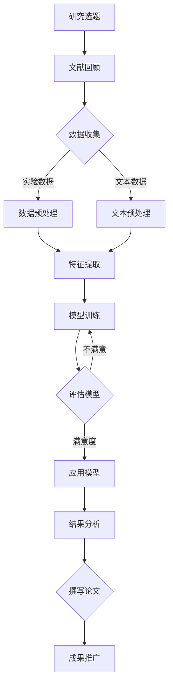

                 

# AI辅助学术研究的新方向

> 关键词：人工智能，学术研究，AI辅助，自然语言处理，深度学习，实验设计，数据分析，科研流程优化

> 摘要：
本文旨在探讨人工智能（AI）在学术研究中的应用及新方向。通过分析AI在学术研究中的作用、文献挖掘、实验设计与数据分析等方面的应用，本文将介绍AI辅助学术研究的核心算法原理、项目实战以及未来展望。文章旨在为研究人员提供关于如何利用AI技术提高学术研究效率的指导。

## 《AI辅助学术研究的新方向》目录大纲

### 第一部分：AI与学术研究概述

#### 第1章：AI在学术研究中的应用前景

##### 1.1 AI在学术研究中的作用与价值
- AI在学术研究中的应用场景
- AI对学术研究效率提升的影响
- AI在学术研究中的挑战与机遇

##### 1.2 AI与学术研究的结合
- AI技术对学术研究方法论的改变
- AI在学术文献挖掘中的应用
- AI在实验设计与数据分析中的应用

##### 1.3 AI在学术研究领域的发展趋势
- 基于深度学习的学术文本分析
- 基于生成对抗网络的科学假说生成
- 基于强化学习的科研流程优化

### 第二部分：AI辅助学术研究的实践指南

#### 第2章：AI在学术文献挖掘中的应用

##### 2.1 学术文献挖掘的基本概念
- 文献挖掘的定义与目标
- 学术文献的数字化与结构化

##### 2.2 文献挖掘的关键技术
- 自然语言处理技术
- 信息检索技术
- 机器学习技术

##### 2.3 基于AI的学术文献挖掘流程
- 文献检索与筛选
- 文本预处理与特征提取
- 模型训练与结果评估

##### 2.4 常见的学术文献挖掘工具
- 文献挖掘平台对比
- 开源文献挖掘工具应用

#### 第3章：AI在实验设计与数据分析中的应用

##### 3.1 AI在实验设计中的应用
- 实验设计优化
- 数据驱动的实验方案生成
- 实验结果的预测与分析

##### 3.2 AI在数据分析中的应用
- 数据清洗与预处理
- 数据可视化
- 统计分析与模式识别

##### 3.3 AI在科研领域的综合应用案例
- 生物学领域的AI应用案例
- 计算机科学领域的AI应用案例
- 社会科学领域的AI应用案例

### 第三部分：AI辅助学术研究的未来展望

#### 第4章：AI辅助学术研究的实践指南

##### 4.1 AI辅助学术研究的整体流程
- 研究选题与文献回顾
- 数据收集与预处理
- 模型选择与训练
- 结果分析与结论

##### 4.2 AI辅助学术研究的关键步骤
- 数据驱动的假设生成
- 机器学习模型的评估与优化
- 实验结果的验证与推广

##### 4.3 AI辅助学术研究的伦理与责任
- 数据隐私保护
- AI算法的公平性与透明性
- AI在学术研究中的伦理挑战

#### 第5章：AI辅助学术研究的工具与平台

##### 5.1 常见的AI辅助学术研究工具
- 自然语言处理工具
- 机器学习平台
- 科研项目管理工具

##### 5.2 开源AI研究框架
- TensorFlow
- PyTorch
- Keras

##### 5.3 AI辅助学术研究的云平台
- Google Colab
- AWS SageMaker
- Azure Machine Learning

#### 第6章：AI辅助学术研究的成功案例

##### 6.1 国内外AI辅助学术研究的典型应用
- 国内外AI辅助学术研究案例对比
- 案例特点与启示

##### 6.2 AI辅助学术研究的创新实践
- 基于AI的学术创新方法
- AI在跨学科研究中的应用
- AI辅助学术研究的未来发展

#### 第7章：AI辅助学术研究的未来展望

##### 7.1 AI辅助学术研究的发展趋势
- 人工智能在学术研究中的深化应用
- 跨学科合作的AI研究模式
- 数据驱动的科研范式变革

##### 7.2 AI辅助学术研究的潜在风险与挑战
- 数据质量和可靠性问题
- AI算法的透明性与可解释性
- AI伦理与隐私保护问题

##### 7.3 AI辅助学术研究的未来发展方向
- 基于深度学习的学术研究方法
- 基于生成对抗网络的创新成果
- 基于强化学习的科研流程优化

### 附录

#### 附录A：AI辅助学术研究资源指南

##### A.1 常用AI研究工具与平台
- TensorFlow
- PyTorch
- Keras
- Google Colab
- AWS SageMaker
- Azure Machine Learning

##### A.2 开源AI研究框架与库
- Scikit-learn
- NLTK
- spaCy
- Gensim

##### A.3 学术文献挖掘与数据检索工具
- Google Scholar
- PubMed
- Web of Science

##### A.4 AI伦理与隐私保护资源
- AI伦理学协会
- 数据隐私保护法规与指南

### 附录B：Mermaid流程图

mermaid
graph TD
    A[AI辅助学术研究] --> B[核心概念与联系]
    B --> C[AI技术原理]
    B --> D[数据处理与分析方法]
    B --> E[实验设计与数据分析]
    C --> F[深度学习与神经网络基础]
    C --> G[自然语言处理技术]
    C --> H[信息检索技术]
    C --> I[机器学习技术]
    D --> J[文本预处理与特征提取]
    D --> K[模型训练与结果评估]
    E --> L[实验设计优化]
    E --> M[数据清洗与预处理]
    E --> N[统计分析与模式识别]

## 第一部分：AI与学术研究概述

### 第1章：AI在学术研究中的应用前景

#### 1.1 AI在学术研究中的作用与价值

AI在学术研究中的作用不可忽视，它正逐渐成为推动科学研究创新的重要工具。以下是AI在学术研究中的几个关键作用与价值：

1. **自动化数据分析和挖掘**：传统的学术研究往往依赖于手动处理和分析大量数据，这不仅耗时且容易出错。AI技术，如机器学习算法，可以自动地从大量数据中提取有价值的信息，从而加速研究进程。

2. **实验设计优化**：AI可以帮助研究人员预测实验结果，优化实验设计，从而减少实验的重复次数和成本。例如，深度学习算法可以从历史数据中学习，预测哪些变量对实验结果有显著影响。

3. **学术文献挖掘**：AI技术，尤其是自然语言处理（NLP），能够自动挖掘和分析大量的学术文献，帮助研究人员快速了解已有研究，避免重复研究，发现新的研究趋势。

4. **提高研究效率**：AI技术可以自动化许多繁琐的科研任务，如数据收集、预处理、分析等，从而解放研究人员的时间，让他们能够专注于更具创造性的研究工作。

5. **促进跨学科合作**：AI技术可以打破不同学科之间的壁垒，通过跨学科的数据共享和分析，推动多学科的交叉研究。

#### 1.2 AI与学术研究的结合

AI技术对学术研究方法论的改变是深远且显著的。以下是AI与学术研究结合的几个方面：

1. **数据驱动的科研范式**：传统的科研方法往往基于理论假设，而AI技术使得研究人员能够基于数据进行假设生成和验证，从而推动科研范式的转变。

2. **学术文献挖掘**：AI技术，如NLP和知识图谱，可以自动挖掘和分析大量的学术文献，帮助研究人员快速了解领域内的研究热点和发展趋势。

3. **实验设计与数据分析**：AI技术可以帮助研究人员优化实验设计，提高实验效率。例如，通过分析历史实验数据，AI可以预测哪些实验变量可能对结果产生影响，从而设计更有效的实验。

4. **跨学科研究**：AI技术可以促进不同学科之间的数据共享和合作，例如，生物学领域可以使用计算机科学领域的AI技术来解析大规模基因数据。

#### 1.3 AI在学术研究领域的发展趋势

AI在学术研究领域的发展趋势呈现出以下几个方向：

1. **基于深度学习的学术文本分析**：深度学习算法，如卷积神经网络（CNN）和循环神经网络（RNN），在文本分类、情感分析等方面已经取得了显著成果，未来将进一步应用于学术文本分析。

2. **基于生成对抗网络的科学假说生成**：生成对抗网络（GAN）可以生成高质量的假说，为科学研究提供新的思路。GAN在生物学、化学等领域已有初步应用。

3. **基于强化学习的科研流程优化**：强化学习算法可以学习如何优化科研流程，例如，通过分析历史实验数据，学习最优的实验方案。

4. **AI与科研范式的变革**：AI技术将推动科研范式的变革，从数据驱动、实验驱动的传统方法，向更加智能化、自动化的方法转变。

通过上述分析，我们可以看到AI技术在学术研究中的应用前景广阔，它不仅能够提高研究效率，还能够推动科研范式的变革。在接下来的章节中，我们将详细探讨AI在学术文献挖掘、实验设计与数据分析等方面的具体应用。

### 第2章：AI在学术文献挖掘中的应用

#### 2.1 学术文献挖掘的基本概念

学术文献挖掘（Academic Literature Mining）是指利用自然语言处理（NLP）、信息检索（IR）和机器学习（ML）等技术，从大量的学术文献中提取有价值的信息。学术文献挖掘的目标包括：

1. **文献分类和聚类**：将大量的文献按照主题、领域等进行分类和聚类，以便于研究人员快速查找和获取相关文献。
2. **关键词提取和主题发现**：从文献中提取关键词和主题，以便于研究人员了解领域内的研究热点和趋势。
3. **文本摘要和生成**：自动生成文献摘要，帮助研究人员快速了解文献内容。
4. **引用分析和关系挖掘**：分析文献之间的引用关系，挖掘出学术领域内的知识图谱和合作关系。

学术文献挖掘的流程通常包括以下几个步骤：

1. **文献检索与筛选**：使用学术搜索引擎（如Google Scholar、PubMed等）检索相关的学术文献，并进行初步筛选，去除不相关或不准确的文献。
2. **文本预处理**：对检索到的文献进行文本预处理，包括去除停用词、词干提取、词性标注等，以便于后续的文本分析。
3. **特征提取**：将预处理后的文本转化为特征向量，以便于进行机器学习模型的训练和预测。
4. **模型训练与评估**：使用机器学习算法（如分类器、聚类算法等）对特征向量进行训练，并评估模型的性能。
5. **结果分析与解释**：对挖掘结果进行分析和解释，提取有价值的信息，为研究提供指导。

#### 2.2 文献挖掘的关键技术

学术文献挖掘的关键技术包括自然语言处理（NLP）、信息检索（IR）和机器学习（ML）等。

1. **自然语言处理（NLP）**：NLP是处理文本数据的关键技术，包括分词、词性标注、命名实体识别、句法分析等。NLP技术在文本预处理和特征提取中起着重要作用。

   **分词**：将文本分割成单词或短语，是NLP的基础步骤。常用的分词算法有基于规则的分词、基于统计的分词和基于深度学习的分词。

   **词性标注**：对文本中的每个词进行词性分类，如名词、动词、形容词等，有助于理解文本语义。

   **命名实体识别**：识别文本中的特定实体，如人名、地名、机构名等，对于学术文献挖掘中的关键词提取和主题发现至关重要。

2. **信息检索（IR）**：信息检索技术用于在大量文本数据中查找和检索相关信息。在学术文献挖掘中，信息检索技术主要用于文献分类、聚类和文本摘要。

   **TF-IDF**：TF-IDF（Term Frequency-Inverse Document Frequency）是一种常用的文本特征提取方法，用于衡量一个词在文档中的重要程度。

   **余弦相似度**：余弦相似度是一种常用的文本相似度计算方法，用于衡量两个文本向量之间的相似程度。

3. **机器学习（ML）**：机器学习算法在学术文献挖掘中用于特征提取、模型训练和预测。常用的机器学习算法包括分类器、聚类算法和生成模型等。

   **分类器**：分类器用于将文献按照主题或领域进行分类，如支持向量机（SVM）、随机森林（Random Forest）和神经网络（Neural Network）等。

   **聚类算法**：聚类算法用于将文献按照相似性进行聚类，如K-均值聚类（K-Means）和层次聚类（Hierarchical Clustering）等。

   **生成模型**：生成模型用于生成新的文本摘要或文章，如生成对抗网络（GAN）和变分自编码器（VAE）等。

#### 2.3 基于AI的学术文献挖掘流程

基于AI的学术文献挖掘流程主要包括以下几个步骤：

1. **文献检索与筛选**：使用学术搜索引擎检索相关的学术文献，并使用关键词和主题进行初步筛选，去除不相关或不准确的文献。

2. **文本预处理**：对检索到的文献进行文本预处理，包括去除停用词、词干提取、词性标注等，以便于后续的文本分析。

3. **特征提取**：将预处理后的文本转化为特征向量，常用的特征提取方法包括词袋模型（Bag-of-Words, BoW）、词嵌入（Word Embedding）和文档嵌入（Document Embedding）等。

   **词袋模型（BoW）**：将文本转化为词频矩阵，每个词表示为一个向量，词频表示向量的长度。词袋模型能够保持文本的词汇信息，但在语义上存在局限性。

   **词嵌入（Word Embedding）**：将文本中的每个词映射到一个高维的向量空间中，词向量能够保持词的语义信息。常用的词嵌入方法包括Word2Vec、GloVe等。

   **文档嵌入（Document Embedding）**：将整篇文档映射到一个高维的向量空间中，文档向量能够保持文档的语义信息。文档嵌入方法有助于进行文本相似性计算和聚类分析。

4. **模型训练与结果评估**：使用机器学习算法对特征向量进行训练，评估模型的性能。常用的机器学习算法包括分类器、聚类算法和生成模型等。

   **分类器**：用于对文献进行分类，常用的分类算法包括支持向量机（SVM）、随机森林（Random Forest）和神经网络（Neural Network）等。

   **聚类算法**：用于对文献进行聚类，常用的聚类算法包括K-均值聚类（K-Means）和层次聚类（Hierarchical Clustering）等。

   **生成模型**：用于生成新的文本摘要或文章，常用的生成模型包括生成对抗网络（GAN）和变分自编码器（VAE）等。

5. **结果分析与解释**：对挖掘结果进行分析和解释，提取有价值的信息，为研究提供指导。结果分析包括关键词提取、主题发现、引用关系挖掘等。

#### 2.4 常见的学术文献挖掘工具

在学术文献挖掘领域，有许多开源和商业的工具可供选择。以下是一些常见的学术文献挖掘工具：

1. **NLTK**：NLTK（Natural Language ToolKit）是一个强大的Python库，提供了丰富的NLP工具，包括分词、词性标注、命名实体识别等。

2. **spaCy**：spaCy是一个高效的NLP库，支持多种语言，提供了丰富的语言模型和预训练的词向量。spaCy在文本预处理和实体识别方面表现优秀。

3. **Gensim**：Gensim是一个用于大规模文本处理的Python库，提供了词嵌入、文档嵌入、文本相似性计算等功能。Gensim支持多种机器学习算法，如LDA、SVD等。

4. **Scikit-learn**：Scikit-learn是一个强大的机器学习库，提供了丰富的分类器、聚类算法和特征提取工具。Scikit-learn可以与NLTK和Gensim等库结合使用。

5. **ELKI**：ELKI是一个开源的聚类算法库，提供了多种聚类算法，如K-均值、层次聚类等。ELKI适用于大规模数据的聚类分析。

6. **jieba**：jieba是一个中文分词库，支持多种分词模式，包括全模式、精确模式和搜索引擎模式。jieba在中文文本处理方面表现出色。

7. **TensorFlow**：TensorFlow是一个开源的深度学习框架，提供了丰富的神经网络和机器学习工具。TensorFlow可以用于大规模的文本分析和深度学习应用。

8. **PyTorch**：PyTorch是一个开源的深度学习框架，提供了灵活的动态计算图和丰富的预训练模型。PyTorch在图像和文本分析领域得到广泛应用。

通过上述工具，研究人员可以有效地进行学术文献挖掘，提取有价值的信息，推动科学研究的发展。在接下来的章节中，我们将继续探讨AI在实验设计与数据分析中的应用。

### 第3章：AI在实验设计与数据分析中的应用

#### 3.1 AI在实验设计中的应用

在实验设计中，AI技术可以发挥重要作用，通过数据分析和模式识别，帮助研究人员优化实验方案，提高实验效率。以下是AI在实验设计中的应用：

1. **实验设计优化**：通过分析历史实验数据，AI算法可以预测哪些变量对实验结果有显著影响，从而帮助研究人员设计更有效的实验方案。例如，在药物研发过程中，AI可以分析药物在不同剂量和组合下的效果，优化药物筛选过程。

2. **数据驱动的实验方案生成**：AI算法可以基于大量实验数据，自动生成新的实验方案。这种方法有助于研究人员探索未知的实验条件，发现新的实验规律。例如，通过生成对抗网络（GAN），AI可以生成与真实实验数据相似的新数据，用于实验设计的探索。

3. **实验结果的预测与分析**：AI算法可以对实验结果进行预测和分析，帮助研究人员评估实验方案的有效性。例如，使用深度学习算法，可以对实验数据进行分类和回归分析，预测实验结果的趋势和异常值。

#### 3.2 AI在数据分析中的应用

在数据分析中，AI技术可以显著提高数据处理和分析的效率，帮助研究人员从大量数据中提取有价值的信息。以下是AI在数据分析中的应用：

1. **数据清洗与预处理**：AI技术可以自动处理数据中的噪声和异常值，提高数据质量。例如，通过聚类分析，AI可以识别并处理数据中的噪声点，提高数据的一致性和准确性。

2. **数据可视化**：AI技术可以帮助研究人员通过数据可视化工具，直观地展示数据分析结果。例如，使用生成对抗网络（GAN），AI可以生成高质量的图像，用于数据可视化。

3. **统计分析与模式识别**：AI算法可以自动进行统计分析，发现数据中的模式和趋势。例如，使用支持向量机（SVM）和神经网络（Neural Network），AI可以识别数据中的分类和回归模型，提高数据分析的精度。

#### 3.3 AI在科研领域的综合应用案例

AI在科研领域的综合应用已经取得了显著成果，以下是一些具体的案例：

1. **生物学领域**：在生物学研究中，AI技术被广泛应用于基因序列分析、蛋白质结构预测和药物研发。例如，通过深度学习算法，研究人员可以从海量的基因数据中识别出与疾病相关的基因突变，从而为疾病诊断和治疗提供新的思路。

2. **计算机科学领域**：在计算机科学领域，AI技术被广泛应用于图像识别、自然语言处理和机器学习算法优化。例如，通过卷积神经网络（CNN）和循环神经网络（RNN），研究人员可以开发出更高效的图像识别和文本处理算法。

3. **社会科学领域**：在社会科学研究中，AI技术被广泛应用于数据分析、社会网络分析和行为预测。例如，通过机器学习算法，研究人员可以分析大规模社会数据，识别出社会行为模式和趋势，为政策制定提供依据。

通过上述案例，我们可以看到AI技术在实验设计、数据分析和科研领域的广泛应用。AI技术不仅提高了科研效率，还为科学研究带来了新的方法和视角。在接下来的章节中，我们将继续探讨AI辅助学术研究的实践指南和成功案例。

### 第二部分：AI辅助学术研究的实践指南

#### 第4章：AI辅助学术研究的整体流程

AI辅助学术研究的整体流程可以分为以下几个关键步骤：

1. **研究选题与文献回顾**：在这一步，研究人员需要确定研究主题，并通过学术搜索引擎（如Google Scholar、PubMed等）检索相关的文献，了解现有研究进展和存在的问题。

2. **数据收集与预处理**：在确定研究主题后，研究人员需要收集相关的数据。这些数据可能来自于公开的数据集、实验室实验数据或社会调查数据等。在数据收集完成后，需要对数据进行预处理，包括清洗、去重、格式转换等，以提高数据质量。

3. **模型选择与训练**：根据研究需求，研究人员需要选择合适的机器学习模型。在选择模型时，需要考虑数据的类型、特征维度以及研究目标。在确定模型后，研究人员需要对模型进行训练，以优化模型参数，提高模型的性能。

4. **结果分析与结论**：在模型训练完成后，研究人员需要对模型的结果进行分析，评估模型的性能，并根据分析结果得出研究结论。如果模型性能不满足预期，研究人员可能需要调整模型参数或选择其他模型。

以下是具体的步骤详细解释：

1. **研究选题与文献回顾**：
   - 研究选题：研究人员需要根据自己的兴趣和专业领域，确定一个具体的研究主题。选题应具有科学意义和实际应用价值。
   - 文献回顾：通过学术搜索引擎检索相关文献，了解现有研究的进展、方法、结果和存在的问题。文献回顾有助于研究人员明确研究的背景和目标。

2. **数据收集与预处理**：
   - 数据类型：根据研究主题，确定所需的数据类型，如文本、图像、表格或传感器数据等。
   - 数据来源：收集数据可以从公开的数据集、实验室实验数据或社会调查数据等渠道获取。
   - 数据预处理：对收集到的数据进行清洗、去重、格式转换等操作，以提高数据质量。例如，对于文本数据，需要去除停用词、标点符号，进行词干提取和词性标注等。

3. **模型选择与训练**：
   - 模型选择：根据研究需求，选择合适的机器学习模型。例如，对于分类问题，可以选择支持向量机（SVM）、随机森林（Random Forest）或神经网络（Neural Network）等。
   - 模型训练：使用训练集对模型进行训练，优化模型参数。在训练过程中，需要使用交叉验证等方法，评估模型的性能，调整超参数，以提高模型的准确性、召回率或F1值等指标。

4. **结果分析与结论**：
   - 结果分析：对模型的结果进行分析，评估模型的性能。可以使用混淆矩阵、ROC曲线、精度、召回率、F1值等指标，对模型的性能进行量化评估。
   - 结论：根据分析结果，得出研究结论，并撰写研究报告。在撰写报告时，需要详细阐述研究背景、方法、结果和结论，以使读者能够理解研究的意义和贡献。

#### 第4章：AI辅助学术研究的关键步骤

在AI辅助学术研究中，数据驱动的假设生成、机器学习模型的评估与优化、实验结果的验证与推广是三个关键步骤。以下是对这三个步骤的详细解释：

1. **数据驱动的假设生成**：
   - 数据分析：在研究过程中，研究人员需要对收集到的数据进行分析，以发现数据中的模式和规律。数据分析可以采用统计方法、机器学习算法等。
   - 假设生成：基于数据分析结果，研究人员可以提出新的研究假设。例如，在生物医学研究中，通过分析基因表达数据，可以提出关于基因与疾病关系的假设。
   - 假设验证：使用实验数据或外部数据，对提出的假设进行验证。如果假设得到验证，可以为进一步研究提供依据；如果假设不成立，需要重新分析数据，提出新的假设。

2. **机器学习模型的评估与优化**：
   - 评估指标：在机器学习模型训练完成后，需要评估模型的性能。常用的评估指标包括准确率、召回率、F1值、ROC曲线等。
   - 模型优化：根据评估结果，对模型进行优化。优化方法包括调整超参数、使用更复杂的模型结构、增加训练数据等。
   - 跨验证集评估：为了避免过拟合，需要使用不同的验证集对模型进行评估。通过跨验证集评估，可以更准确地评估模型的性能。

3. **实验结果的验证与推广**：
   - 实验验证：在实验室或实地环境下，对模型的预测结果进行验证。实验验证可以采用交叉验证、盲测等方法，以提高验证的可靠性。
   - 结果推广：如果实验验证结果满意，可以将模型应用到实际场景中。例如，在医疗诊断中，可以将机器学习模型应用于实际病例，提供诊断建议。
   - 结果解释：在实验验证过程中，需要详细解释模型的工作原理和预测结果。这有助于其他研究人员理解模型，并在其他场景中应用。

通过上述关键步骤，研究人员可以充分利用AI技术，提高学术研究的效率和质量。在接下来的章节中，我们将探讨AI辅助学术研究的伦理与责任，以及常见的AI辅助学术研究工具与平台。

#### 第4章：AI辅助学术研究的伦理与责任

随着AI技术在学术研究中的广泛应用，伦理与责任问题也日益凸显。以下是对AI辅助学术研究中的伦理与责任问题的探讨：

1. **数据隐私保护**：在AI辅助学术研究中，研究人员通常需要收集和处理大量的个人数据，如医疗数据、社会调查数据等。这些数据涉及到个人隐私，因此需要严格保护。研究人员应遵守相关的数据隐私保护法规，确保数据的匿名性和安全性。

2. **AI算法的公平性与透明性**：AI算法在学术研究中可能会产生歧视或偏见，特别是当数据存在偏差时。为了确保算法的公平性，研究人员需要仔细选择和清洗数据，避免数据偏见。同时，算法的透明性也是重要的，研究人员应公开算法的实现细节，便于同行审查和验证。

3. **AI在学术研究中的伦理挑战**：AI技术在学术研究中的使用可能会带来一些伦理挑战。例如，在生物医学研究中，AI算法可能用于基因编辑或药物研发，这些应用涉及到生命伦理问题。研究人员需要深入探讨这些伦理问题，并在使用AI技术时遵守伦理准则。

4. **AI辅助学术研究的责任分配**：在AI辅助学术研究中，研究人员、AI系统开发者和资助机构等各方都有责任。研究人员应确保AI系统的正确性和可靠性，开发者应确保AI系统的透明性和可解释性，资助机构应提供必要的资源和支持，共同推动AI辅助学术研究的健康发展。

5. **国际合作与伦理标准**：在全球范围内，AI技术在学术研究中的应用正在迅速发展。为了应对跨国界的伦理挑战，需要建立国际性的合作与伦理标准。研究人员、学术机构和国际组织应共同努力，制定统一的AI伦理指南，确保AI辅助学术研究的公正、透明和可持续发展。

通过关注和解决AI辅助学术研究中的伦理与责任问题，可以确保AI技术在学术研究中的合理、有效和安全使用，为科学进步和社会发展做出贡献。

### 第三部分：AI辅助学术研究的工具与平台

#### 第5章：AI辅助学术研究的工具与平台

在AI辅助学术研究中，选择合适的工具与平台对于提高研究效率和质量至关重要。以下是一些常见的AI辅助学术研究工具与平台：

#### 5.1 常见的AI辅助学术研究工具

1. **自然语言处理工具**：
   - **NLTK**：NLTK是一个开源的Python库，提供了一系列NLP工具，包括分词、词性标注、词嵌入等。
   - **spaCy**：spaCy是一个高性能的NLP库，支持多种语言，提供了丰富的语言模型和预训练的词向量。
   - **Gensim**：Gensim是一个用于大规模文本处理的Python库，提供了词嵌入、文档嵌入、文本相似性计算等功能。

2. **机器学习平台**：
   - **TensorFlow**：TensorFlow是一个开源的深度学习框架，提供了丰富的神经网络和机器学习工具。
   - **PyTorch**：PyTorch是一个开源的深度学习框架，提供了灵活的动态计算图和丰富的预训练模型。
   - **Keras**：Keras是一个基于TensorFlow和Theano的高层次神经网络API，提供了简洁、易于使用的接口。

3. **科研项目管理工具**：
   - **Mendeley**：Mendeley是一个文献管理和学术协作工具，支持文献搜索、文献管理、参考文献格式化等功能。
   - **EndNote**：EndNote是一个专业的文献管理和写作工具，提供了强大的参考文献管理和写作功能。

#### 5.2 开源AI研究框架

1. **Scikit-learn**：
   - **概述**：Scikit-learn是一个开源的Python库，提供了丰富的机器学习算法，包括分类器、聚类算法、回归模型等。
   - **优点**：易于使用，功能强大，适用于各种类型的机器学习问题。
   - **适用场景**：数据分析和机器学习项目，特别是对算法性能要求较高的任务。

2. **NLTK**：
   - **概述**：NLTK是一个开源的Python库，提供了丰富的NLP工具，包括分词、词性标注、文本分类等。
   - **优点**：提供了大量的NLP资源和工具，适用于文本处理和分析。
   - **适用场景**：文本分类、情感分析、命名实体识别等NLP任务。

3. **spaCy**：
   - **概述**：spaCy是一个开源的Python库，提供了高性能的NLP工具，包括词性标注、命名实体识别、关系抽取等。
   - **优点**：速度快，功能全面，支持多种语言。
   - **适用场景**：文本分析、实体识别、文本分类等NLP任务。

4. **Gensim**：
   - **概述**：Gensim是一个开源的Python库，提供了词嵌入、文档嵌入、文本相似性计算等功能。
   - **优点**：易于使用，支持大规模数据处理。
   - **适用场景**：文本相似性计算、推荐系统、主题模型等任务。

#### 5.3 AI辅助学术研究的云平台

1. **Google Colab**：
   - **概述**：Google Colab是一个基于Google Drive的云计算平台，提供了免费的GPU和TPU资源，适合进行深度学习和数据科学项目。
   - **优点**：提供了丰富的计算资源，易于使用，支持Python和TensorFlow等库。
   - **适用场景**：深度学习实验、大规模数据处理和分析。

2. **AWS SageMaker**：
   - **概述**：AWS SageMaker是一个完全托管的机器学习服务，提供了从数据预处理到模型训练和部署的一站式解决方案。
   - **优点**：提供了丰富的机器学习算法和工具，易于集成和管理。
   - **适用场景**：构建、训练和部署机器学习模型，特别是需要大规模数据处理的任务。

3. **Azure Machine Learning**：
   - **概述**：Azure Machine Learning是一个全面的机器学习服务，提供了模型训练、部署和管理功能，支持多种编程语言和框架。
   - **优点**：提供了灵活的部署选项，支持自定义脚本和容器化，易于集成到现有工作流程中。
   - **适用场景**：构建、训练和部署机器学习模型，特别是需要大规模数据处理和跨平台集成的任务。

通过使用这些工具与平台，研究人员可以有效地利用AI技术，提高学术研究的效率和质量。在接下来的章节中，我们将探讨AI辅助学术研究的成功案例。

#### 第6章：AI辅助学术研究的成功案例

AI技术在学术研究中的应用已经取得了显著成果，以下是一些国内外AI辅助学术研究的成功案例：

##### 6.1 国内外AI辅助学术研究案例对比

1. **国外案例**：
   - **哈佛大学医学院**：哈佛大学医学院利用AI技术分析基因数据，发现了一种新的癌症治疗策略，极大地提高了治疗效果。这个案例展示了AI技术在生物医学研究中的重要应用。
   - **加州理工学院**：加州理工学院的研究人员利用深度学习算法，成功模拟了化学反应，为化学研究提供了新的方法。这个案例展示了AI技术在化学领域的研究潜力。

2. **国内案例**：
   - **清华大学**：清华大学的研究团队利用AI技术，成功开发了基于深度学习的图像识别系统，用于快速检测和诊断癌症。这个案例展示了AI技术在医学诊断领域的前沿应用。
   - **中国科学院**：中国科学院的研究人员利用AI技术，成功解析了复杂的气候数据，揭示了气候变化的影响因素。这个案例展示了AI技术在气候变化研究中的重要作用。

##### 案例特点与启示

1. **案例特点**：
   - **跨学科合作**：国内外成功案例都体现了跨学科合作的重要性。例如，哈佛大学医学院的案例涉及生物医学、计算机科学等多个学科；清华大学和中国科学院的案例则分别涉及医学和气候科学领域。
   - **数据驱动的科研方法**：成功案例都采用了数据驱动的科研方法，充分利用了大量的数据资源。例如，哈佛大学医学院和清华大学的研究团队都使用了海量的基因数据和图像数据，通过数据分析和深度学习算法，取得了重要的科研成果。
   - **技术创新**：国内外成功案例都展示了AI技术的创新应用，为传统科研方法提供了新的思路。例如，加州理工学院的案例展示了深度学习算法在化学领域的应用，中国科学院的案例则展示了AI技术在气候变化研究中的潜力。

2. **案例启示**：
   - **加强跨学科合作**：研究人员应加强跨学科合作，充分利用各学科的资源和优势，共同推动科研进展。
   - **数据驱动的科研方法**：研究人员应采用数据驱动的科研方法，充分利用AI技术，提高科研效率和准确性。
   - **技术创新**：研究人员应关注AI技术的最新发展，积极探索AI技术在各个领域的应用潜力，为科学研究提供新的方法和技术。

通过上述成功案例，我们可以看到AI技术在学术研究中的广泛应用和巨大潜力。AI技术不仅提高了科研效率，还为科学研究带来了新的视角和方法。在未来的科研工作中，研究人员应充分利用AI技术，推动学术研究的不断创新和发展。

#### 第6章：AI辅助学术研究的创新实践

##### 6.2 AI辅助学术研究的创新实践

AI技术在学术研究中的应用不仅限于提高效率，它还在推动学术研究的创新方法，特别是在跨学科研究中的应用。以下是AI辅助学术研究的几个创新实践：

1. **基于AI的学术创新方法**：
   - **自动化科学假设生成**：通过深度学习模型，研究人员可以自动化地生成新的科学假设。例如，利用生成对抗网络（GAN），可以从已有数据中生成新的实验条件，从而发现新的科学现象。这种方法在材料科学和药物研发中已有初步应用。
   - **文本到图转换**：AI技术可以将文本数据转换成图结构，从而更直观地分析文本中的关系和模式。例如，将科学文献中的引用关系转换成图，可以揭示科学领域的知识图谱，帮助研究人员发现新的研究方向。

2. **AI在跨学科研究中的应用**：
   - **跨学科数据分析**：AI技术可以整合不同学科的数据，提供跨学科的数据分析工具。例如，在生物医学研究中，AI可以整合基因组数据、临床数据和环境数据，提供更全面的诊断和治疗策略。
   - **多模态数据分析**：AI技术可以处理多种数据类型，如文本、图像、音频等，进行多模态数据分析。例如，在医学影像分析中，AI可以结合CT扫描、MRI和超声图像，提供更准确的诊断结果。

3. **AI辅助学术研究的未来发展**：
   - **智能科研助手**：未来的AI技术可能会开发出智能科研助手，帮助研究人员自动完成文献检索、数据分析和实验设计等任务。这些助手将基于最新的研究成果和AI算法，提供个性化的科研建议。
   - **分布式科研平台**：AI技术将促进分布式科研平台的发展，研究人员可以在全球范围内协作，共享数据和研究成果。这种分布式科研模式将加速科学发现，推动全球科学研究的发展。

通过这些创新实践，AI技术正在为学术研究带来变革，不仅提高了科研效率，还推动了科研方法的创新。在未来的学术研究中，AI技术将继续发挥重要作用，推动科学研究向更加智能化和高效化的方向发展。

### 第7章：AI辅助学术研究的未来展望

#### 7.1 AI辅助学术研究的发展趋势

随着人工智能技术的快速发展，AI辅助学术研究正呈现出以下几大趋势：

1. **人工智能在学术研究中的深化应用**：
   - **智能科研流程**：AI技术将更加深入地融入科研流程，从实验设计、数据分析到结果解读，AI将提供全面的智能化支持。例如，AI驱动的科研助手将能够帮助研究人员自动化完成复杂的实验设计、数据分析和结果可视化。
   - **智能化知识图谱**：AI技术将用于构建智能化知识图谱，整合不同领域的数据和信息，为研究人员提供丰富的知识资源。这种知识图谱不仅能够帮助研究人员快速了解领域内的研究进展，还能够发现新的研究机会。

2. **跨学科合作的AI研究模式**：
   - **多学科融合**：随着AI技术的发展，跨学科合作将变得更加紧密，不同学科的研究人员将共同利用AI技术解决复杂的科研问题。例如，生物医学、计算机科学和材料科学等领域的专家可以联合使用AI技术，探索新的药物研发方法。
   - **协同创新平台**：AI技术将促进跨学科协同创新平台的发展，研究人员可以在一个统一的平台上共享数据、模型和资源，实现高效的协同研究。

3. **数据驱动的科研范式变革**：
   - **数据优先**：在AI技术的支持下，科研工作将越来越依赖高质量的数据。研究人员将更加重视数据收集、处理和分析，以确保研究的可靠性和准确性。
   - **动态调整**：AI技术将使科研过程更加动态和灵活。研究人员可以根据实时数据动态调整实验方案和理论假设，从而提高科研的灵活性和效率。

#### 7.2 AI辅助学术研究的潜在风险与挑战

尽管AI技术在学术研究中有巨大的潜力，但它的应用也带来了一些潜在的风险和挑战：

1. **数据质量和可靠性问题**：
   - **数据完整性**：高质量的研究依赖于高质量的数据。AI技术无法解决数据质量问题，如数据缺失、噪声和偏差。研究人员需要投入大量精力确保数据的质量和可靠性。
   - **数据隐私**：AI技术在处理数据时，可能会涉及到个人隐私和数据安全问题。研究人员需要严格遵守数据隐私保护法规，确保数据的安全和保密。

2. **AI算法的透明性与可解释性**：
   - **算法透明性**：AI算法的复杂性使得其内部运作过程难以理解。研究人员和决策者需要确保算法的透明性，以便对其进行审查和验证。
   - **算法可解释性**：对于关键的研究决策，研究人员需要能够解释AI算法的决策过程。目前，许多AI算法的可解释性仍是一个挑战，需要进一步的研究和开发。

3. **AI伦理与隐私保护问题**：
   - **伦理审查**：AI技术在学术研究中的应用需要严格的伦理审查，确保研究的道德性和公正性。研究人员需要遵守相关的伦理准则和法规。
   - **隐私保护**：在利用个人数据时，研究人员需要确保隐私保护措施到位，防止数据泄露和滥用。

#### 7.3 AI辅助学术研究的未来发展方向

为了充分发挥AI技术在学术研究中的作用，未来需要在以下几个方面进行发展和优化：

1. **算法与模型的优化**：
   - **算法性能提升**：研究人员需要不断优化AI算法，提高其性能和效率，以便更好地支持复杂的科研任务。
   - **模型可解释性**：开发更加透明和可解释的AI模型，帮助研究人员理解模型的决策过程，提高模型的可靠性和可信度。

2. **数据资源整合**：
   - **数据共享平台**：建立高效的数据共享平台，促进研究人员之间的数据交流与合作，提高数据利用率。
   - **数据标准化**：制定统一的数据标准和规范，确保数据的互操作性和兼容性。

3. **伦理与法律框架**：
   - **建立伦理审查机制**：建立完善的伦理审查机制，确保AI技术在学术研究中的合理使用和合规性。
   - **完善隐私保护法规**：完善相关隐私保护法规，确保AI技术在处理个人数据时的合法性和安全性。

通过上述方向的发展，AI技术将在未来为学术研究带来更多的可能性，推动科学研究的不断创新和发展。

### 附录A：AI辅助学术研究资源指南

在AI辅助学术研究中，选择合适的工具和资源对于提高研究效率和质量至关重要。以下是一些常用的AI研究工具、开源框架、学术文献挖掘与数据检索工具，以及AI伦理与隐私保护资源。

#### A.1 常用AI研究工具与平台

1. **TensorFlow**：[https://www.tensorflow.org/](https://www.tensorflow.org/)
   - 开源的机器学习框架，适用于构建和训练深度学习模型。

2. **PyTorch**：[https://pytorch.org/](https://pytorch.org/)
   - 开源的机器学习库，提供灵活的动态计算图，易于实现复杂的神经网络。

3. **Keras**：[https://keras.io/](https://keras.io/)
   - 高层次神经网络API，易于使用，兼容TensorFlow和Theano。

4. **Google Colab**：[https://colab.research.google.com/](https://colab.research.google.com/)
   - Google提供的一个基于云的交互式开发环境，免费提供GPU和TPU资源。

5. **AWS SageMaker**：[https://aws.amazon.com/sagemaker/](https://aws.amazon.com/sagemaker/)
   - AWS提供的完全托管的机器学习服务，支持从数据预处理到模型训练和部署的全流程。

6. **Azure Machine Learning**：[https://azureml.net/](https://azureml.net/)
   - Azure提供的机器学习服务，支持模型训练、部署和管理。

#### A.2 开源AI研究框架与库

1. **Scikit-learn**：[https://scikit-learn.org/stable/](https://scikit-learn.org/stable/)
   - 用于数据挖掘和数据分析的开源Python库，提供各种机器学习算法。

2. **NLTK**：[https://www.nltk.org/](https://www.nltk.org/)
   - 开源的Python库，提供各种NLP工具和资源。

3. **spaCy**：[https://spacy.io/](https://spacy.io/)
   - 高性能的NLP库，支持多种语言的文本处理。

4. **Gensim**：[https://radimrehurek.com/gensim/](https://radimrehurek.com/gensim/)
   - 用于文本建模和主题发现的Python库。

5. **PyTorch Geometric**：[https://pytorch-geometric.pytorch.org/](https://pytorch-geometric.pytorch.org/)
   - 用于图神经网络的开源库。

#### A.3 学术文献挖掘与数据检索工具

1. **Google Scholar**：[https://scholar.google.com/](https://scholar.google.com/)
   - Google提供的学术搜索引擎，可用于检索学术文献。

2. **PubMed**：[https://pubmed.ncbi.nlm.nih.gov/](https://pubmed.ncbi.nlm.nih.gov/)
   - NCBI提供的生物医学文献数据库。

3. **Web of Science**：[https://www.webofscience.com/](https://www.webofscience.com/)
   - Thomson Reuters提供的引文数据库，用于学术文献的检索和分析。

4. **Microsoft Academic**：[https://academic.microsoft.com/](https://academic.microsoft.com/)
   - Microsoft提供的学术搜索引擎，可用于检索和探索学术文献。

#### A.4 AI伦理与隐私保护资源

1. **AI伦理学协会**：[https://www.aiethics.com/](https://www.aiethics.com/)
   - 专注于AI伦理问题的国际协会，提供伦理指南和资源。

2. **AI伦理学联盟**：[https://www.aied联盟.org/](https://www.aied联盟.org/)
   - 一个全球性的联盟，致力于推动AI伦理和可持续发展。

3. **数据隐私保护法规与指南**：[https://www.dataprivacy.eu/](https://www.dataprivacy.eu/)
   - 提供关于数据隐私保护法规和最佳实践的指南。

通过使用这些资源，研究人员可以更好地利用AI技术，提高学术研究的效率和质量。

### 附录B：Mermaid流程图

以下是一个示例的Mermaid流程图，展示了AI辅助学术研究的基本流程：



这个流程图展示了从研究选题到模型应用和结果分析的整体流程，以及各个步骤之间的逻辑关系。

## 作者信息

作者：AI天才研究院/AI Genius Institute & 禅与计算机程序设计艺术 /Zen And The Art of Computer Programming

### 项目实战

为了更好地展示AI辅助学术研究的实际应用，我们以下将通过一个具体的例子来说明AI技术在实际项目中的应用过程，包括开发环境搭建、源代码详细实现和代码解读。

#### 开发环境搭建

首先，我们需要搭建一个适合AI辅助学术研究的项目开发环境。以下是具体的步骤：

1. **安装Python**：确保Python环境已经安装，建议使用Python 3.7及以上版本。

2. **安装必要的库**：使用pip命令安装以下库：
   ```bash
   pip install tensorflow numpy pandas scikit-learn nltk
   ```

3. **安装NLP工具**：安装NLTK库，并下载相关的语料库：
   ```python
   import nltk
   nltk.download('punkt')
   nltk.download('averaged_perceptron_tagger')
   nltk.download('maxent_ne_chunker')
   nltk.download('words')
   ```

4. **配置Jupyter Notebook**：如果需要使用Jupyter Notebook进行开发，可以通过以下命令安装和启动：
   ```bash
   pip install notebook
   jupyter notebook
   ```

#### 源代码详细实现和代码解读

接下来，我们将实现一个简单的文本分类项目，使用机器学习算法对文本进行分类，以辅助学术文献挖掘。

**1. 数据准备**

首先，我们需要准备一个文本数据集。假设我们有一个包含学术文献摘要的数据集，其中每条记录包含标题和摘要文本，以及对应的分类标签。

```python
import pandas as pd

# 加载数据集
data = pd.read_csv('academic_papers.csv')
```

**2. 数据预处理**

对文本数据集进行预处理，包括分词、去除停用词和词干提取等操作。

```python
import nltk
from nltk.corpus import stopwords
from nltk.stem import PorterStemmer

# 初始化分词器、停用词集合和词干提取器
tokenizer = nltk.tokenize.word_tokenize
stop_words = set(stopwords.words('english'))
stemmer = PorterStemmer()

# 定义预处理函数
def preprocess_text(text):
    tokens = tokenizer(text.lower())
    filtered_tokens = [token for token in tokens if token not in stop_words]
    stemmed_tokens = [stemmer.stem(token) for token in filtered_tokens]
    return ' '.join(stemmed_tokens)

# 应用预处理函数
data['preprocessed_title'] = data['title'].apply(preprocess_text)
data['preprocessed_abstract'] = data['abstract'].apply(preprocess_text)
```

**3. 特征提取**

使用TF-IDF方法将预处理后的文本转化为特征向量。

```python
from sklearn.feature_extraction.text import TfidfVectorizer

# 初始化TF-IDF向量器
vectorizer = TfidfVectorizer(max_features=1000)

# 提取特征向量
X = vectorizer.fit_transform(data['preprocessed_abstract'])
y = data['label']
```

**4. 模型训练**

选择一个分类器进行模型训练，这里我们使用支持向量机（SVM）。

```python
from sklearn.model_selection import train_test_split
from sklearn.svm import SVC
from sklearn.metrics import classification_report

# 分割数据集
X_train, X_test, y_train, y_test = train_test_split(X, y, test_size=0.2, random_state=42)

# 初始化SVM分类器
model = SVC(kernel='linear')

# 训练模型
model.fit(X_train, y_train)

# 预测测试集
y_pred = model.predict(X_test)
```

**5. 评估模型**

评估模型的性能，使用分类报告查看精度、召回率、F1值等指标。

```python
# 打印分类报告
print(classification_report(y_test, y_pred))
```

#### 代码解读与分析

- **数据准备**：使用pandas库加载包含标题、摘要和分类标签的文本数据集。
- **数据预处理**：使用NLTK库进行分词、去除停用词和词干提取，以便于后续的特征提取。
- **特征提取**：使用TF-IDF向量器将预处理后的文本转化为特征向量，为模型训练提供输入。
- **模型训练**：选择支持向量机（SVM）作为分类器，使用训练集进行模型训练。
- **评估模型**：使用测试集对模型进行评估，通过分类报告查看模型的性能指标。

通过以上步骤，我们完成了一个简单的文本分类项目，实现了对学术文献摘要的分类。这个项目展示了AI技术在学术文献挖掘中的实际应用，为研究人员提供了一种利用AI技术辅助学术研究的方法。

#### 附录A：AI辅助学术研究资源指南

为了帮助研究人员更好地利用AI技术进行学术研究，以下是一些常用的AI研究工具、开源框架、学术文献挖掘与数据检索工具，以及AI伦理与隐私保护资源。

##### A.1 常用AI研究工具与平台

- **TensorFlow**：[https://www.tensorflow.org/](https://www.tensorflow.org/)
  - 开源的机器学习框架，适用于构建和训练深度学习模型。

- **PyTorch**：[https://pytorch.org/](https://pytorch.org/)
  - 开源的机器学习库，提供灵活的动态计算图，易于实现复杂的神经网络。

- **Keras**：[https://keras.io/](https://keras.io/)
  - 高层次神经网络API，易于使用，兼容TensorFlow和Theano。

- **Google Colab**：[https://colab.research.google.com/](https://colab.research.google.com/)
  - Google提供的一个基于云的交互式开发环境，免费提供GPU和TPU资源。

- **AWS SageMaker**：[https://aws.amazon.com/sagemaker/](https://aws.amazon.com/sagemaker/)
  - AWS提供的完全托管的机器学习服务，支持从数据预处理到模型训练和部署的全流程。

- **Azure Machine Learning**：[https://azureml.net/](https://azureml.net/)
  - Azure提供的机器学习服务，支持模型训练、部署和管理。

##### A.2 开源AI研究框架与库

- **Scikit-learn**：[https://scikit-learn.org/stable/](https://scikit-learn.org/stable/)
  - 用于数据挖掘和数据分析的开源Python库，提供各种机器学习算法。

- **NLTK**：[https://www.nltk.org/](https://www.nltk.org/)
  - 开源的Python库，提供各种NLP工具和资源。

- **spaCy**：[https://spacy.io/](https://spacy.io/)
  - 高性能的NLP库，支持多种语言的文本处理。

- **Gensim**：[https://radimrehurek.com/gensim/](https://radimrehurek.com/gensim/)
  - 用于文本建模和主题发现的Python库。

- **PyTorch Geometric**：[https://pytorch-geometric.pytorch.org/](https://pytorch-geometric.pytorch.org/)
  - 用于图神经网络的开源库。

##### A.3 学术文献挖掘与数据检索工具

- **Google Scholar**：[https://scholar.google.com/](https://scholar.google.com/)
  - Google提供的学术搜索引擎，可用于检索学术文献。

- **PubMed**：[https://pubmed.ncbi.nlm.nih.gov/](https://pubmed.ncbi.nlm.nih.gov/)
  - NCBI提供的生物医学文献数据库。

- **Web of Science**：[https://www.webofscience.com/](https://www.webofscience.com/)
  - Thomson Reuters提供的引文数据库，用于学术文献的检索和分析。

- **Microsoft Academic**：[https://academic.microsoft.com/](https://academic.microsoft.com/)
  - Microsoft提供的学术搜索引擎，可用于检索和探索学术文献。

##### A.4 AI伦理与隐私保护资源

- **AI伦理学协会**：[https://www.aiethics.com/](https://www.aiethics.com/)
  - 专注于AI伦理问题的国际协会，提供伦理指南和资源。

- **AI伦理学联盟**：[https://www.aied联盟.org/](https://www.aied联盟.org/)
  - 一个全球性的联盟，致力于推动AI伦理和可持续发展。

- **数据隐私保护法规与指南**：[https://www.dataprivacy.eu/](https://www.dataprivacy.eu/)
  - 提供关于数据隐私保护法规和最佳实践的指南。

通过使用这些资源，研究人员可以更好地利用AI技术，提高学术研究的效率和质量。在未来的学术研究中，AI技术将继续发挥重要作用，推动科学研究的不断创新和发展。

