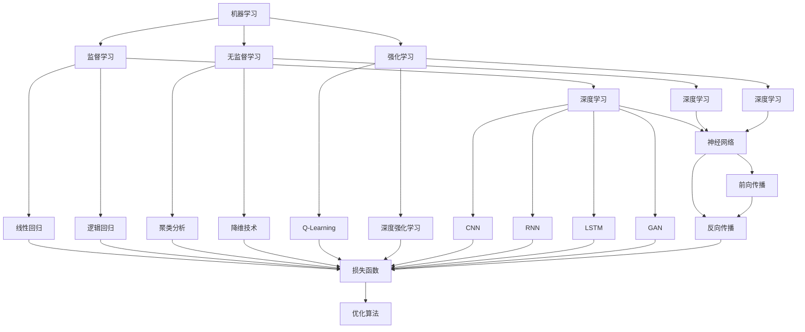

                 

### 第1章：引言与概述

#### Andrej Karpathy的贡献

Andrej Karpathy是一位在人工智能领域享有盛誉的专家，他以其卓越的学术成就和实际应用成果而闻名。他在深度学习、自然语言处理和计算机视觉等多个领域都有着重要的贡献。其中，最为人所知的成就是他在2014年提出的“The Unreasonable Effectiveness of Recurrent Neural Networks”博客文章，这篇文章极大地推动了循环神经网络（RNN）的研究与应用。

此外，Karpathy在GitHub上发布的多个开源项目，如Lucid dreaming with attention sweeping，也为深度学习领域的研究者提供了宝贵的资源和工具。他还曾在OpenAI担任研究科学家，参与了人工智能安全与可控性等多个关键项目。

#### 书名内涵与核心主题

本书的标题《Andrej Karpathy：人工智能的未来发展机遇》体现了作者在人工智能领域深厚的学术背景和独特的视角。书名的核心主题在于探讨人工智能在未来发展中可能面临的机遇和挑战。

首先，作者将从历史和技术的角度，回顾人工智能的发展历程，分析各个阶段的重大事件和代表性人物。接着，本书将深入探讨机器学习与深度学习的基本原理，帮助读者理解这些技术是如何推动人工智能的进步。

此外，书中还将详细分析人工智能在不同领域的应用，如医疗、金融、教育、工业和交通等，探讨这些应用如何改变我们的生活和社会。最后，作者将展望人工智能的未来发展趋势，讨论可能面临的挑战及其应对策略。

#### 阅读预期与收获

通过阅读本书，读者可以期待获得以下收获：

1. **深入理解人工智能的历史和现状**：通过回顾人工智能的发展历程，读者将更加清晰地认识到人工智能技术是如何一步步发展起来的。

2. **掌握机器学习和深度学习的基本原理**：本书将详细讲解机器学习和深度学习的基础知识，帮助读者建立扎实的理论基础。

3. **了解人工智能在不同领域的应用**：通过分析人工智能在医疗、金融、教育等领域的实际应用案例，读者将看到人工智能技术的广泛影响。

4. **洞察人工智能的未来趋势**：作者将前瞻性地探讨人工智能的未来发展，为读者揭示潜在的机遇与挑战。

5. **激发创新思维和职业发展**：通过本书，读者不仅可以加深对人工智能技术的理解，还可以激发在相关领域进行创新和创业的灵感。

总之，本书旨在为读者提供一部全面、深入且具有前瞻性的关于人工智能的技术博客文章，帮助读者更好地把握人工智能的未来发展机遇。

---

### 第2章：人工智能的起源与发展

人工智能（Artificial Intelligence, AI）作为一个极具影响力的领域，其发展历程可以追溯到上世纪50年代。在这个章节中，我们将详细探讨人工智能的起源、关键里程碑、分类与特性，以及一些对人工智能发展有着重大贡献的历史事件和人物。

#### 人工智能的起源

人工智能的起源可以追溯到1950年代。当时，计算机科学刚刚起步，人们开始思考如何让计算机模拟人类的思维和行为。1956年，在美国达特茅斯会议上，John McCarthy首次提出了“人工智能”这一概念，并定义其为“制造智能机器的科学与工程”。这个会议标志着人工智能作为一个独立学科的确立，也吸引了大量科学家和学者的关注。

#### 人工智能的关键里程碑

1. **1956年：达特茅斯会议**
   达特茅斯会议被认为是人工智能诞生的标志，会议的召开激发了全球科学家对人工智能的浓厚兴趣。

2. **1960年代：早期AI系统与失败**
   1960年代，人工智能领域出现了一些早期的重要系统，如ELIZA和Logic Theorist。然而，由于技术局限和过高的期望，这一时期也出现了许多失败案例，导致人们对人工智能的信心受到打击。

3. **1980年代：专家系统的崛起**
   1980年代，专家系统成为了人工智能研究的热点。专家系统通过模拟人类专家的决策过程，解决了一些复杂的问题，如医疗诊断和工程设计。这一时期，人工智能的应用开始逐步走进现实。

4. **1990年代：机器学习和数据驱动方法的兴起**
   随着计算机硬件和存储技术的进步，机器学习方法开始得到广泛应用。这一时期，支持向量机（SVM）和决策树等算法的出现，为人工智能的发展奠定了坚实的基础。

5. **2000年代：深度学习的突破**
   2006年，Geoffrey Hinton提出了深度学习的概念，标志着人工智能进入了一个新的阶段。深度学习在图像识别、语音识别等领域取得了显著成果，使得人工智能的应用变得更加广泛和高效。

6. **2010年代：人工智能的爆发**
   2012年，AlexNet在ImageNet竞赛中取得突破性成绩，深度学习开始广泛应用于各个领域。这一时期，人工智能在自然语言处理、计算机视觉等领域取得了巨大的进步。

#### 人工智能的分类与特性

1. **基于功能分类**
   - **通用人工智能（AGI）**：具有普遍智能，能够执行各种智能任务，如理解、推理、学习、感知和自然语言处理。
   - **弱人工智能（Narrow AI）**：专注于特定任务，如图像识别、语音识别和自然语言处理。

2. **基于技术分类**
   - **符号人工智能**：基于逻辑和推理，使用符号表示知识。
   - **连接主义人工智能**：基于神经网络，通过大量数据学习模式。

3. **特性**
   - **自主性**：能够自主学习和适应新环境。
   - **高效性**：能够高效处理大量数据和复杂问题。
   - **可扩展性**：能够适应不同的应用场景和任务。

#### 人工智能的历史事件与人物

1. **John McCarthy**
   - 人工智能的奠基人之一，提出了“人工智能”这一概念。

2. **Alan Turing**
   - 提出了图灵测试，为人工智能的定义和评价提供了重要的理论基础。

3. **Geoffrey Hinton**
   - 深度学习的先驱，对神经网络的发展做出了巨大贡献。

4. **Andrew Ng**
   - 人工智能领域的杰出研究者，推动了深度学习在学术界和工业界的应用。

5. **Yann LeCun**
   - 图像识别领域的权威，提出了卷积神经网络（CNN）这一重要模型。

通过以上对人工智能起源与发展的探讨，我们可以看到人工智能领域经历了多个阶段的发展，从早期的研究到现代的广泛应用，人工智能已经成为了改变世界的重要力量。接下来，我们将进一步深入探讨人工智能的数学基础和技术原理，为理解其未来应用和发展奠定基础。

---

### 第3章：机器学习与深度学习基础

#### 机器学习概述

机器学习（Machine Learning, ML）是人工智能的核心技术之一，它使计算机系统能够从数据中学习并做出决策。机器学习的基本思想是通过构建数学模型，从数据中提取特征并利用这些特征进行预测或分类。

1. **机器学习的类型**
   - **监督学习（Supervised Learning）**：有标注的数据集进行训练，用于预测或分类。
   - **无监督学习（Unsupervised Learning）**：没有标注的数据集进行训练，用于发现数据中的结构和模式。
   - **强化学习（Reinforcement Learning）**：通过奖励机制和反馈信号，使代理（Agent）在环境中学习最优策略。

2. **机器学习的基本流程**
   - **数据收集**：收集大量用于训练的数据。
   - **数据预处理**：清洗数据、处理缺失值、归一化等。
   - **特征提取**：从原始数据中提取有用的特征。
   - **模型训练**：使用训练数据集训练模型。
   - **模型评估**：使用验证或测试数据集评估模型性能。
   - **模型优化**：根据评估结果调整模型参数，提高性能。

3. **常见机器学习算法**
   - **线性回归（Linear Regression）**：用于预测数值型目标。
   - **逻辑回归（Logistic Regression）**：用于分类任务。
   - **决策树（Decision Tree）**：用于分类和回归。
   - **支持向量机（SVM）**：用于分类和回归。
   - **神经网络（Neural Networks）**：用于复杂预测和分类。

#### 深度学习的基本概念

深度学习（Deep Learning, DL）是机器学习的一个重要分支，它通过构建深度神经网络（Deep Neural Networks, DNN）来模拟人脑的神经网络结构，从而实现复杂的预测和分类任务。

1. **深度神经网络**
   - **层（Layer）**：深度神经网络由多个层次组成，包括输入层、隐藏层和输出层。
   - **神经元（Neuron）**：每个层次由多个神经元组成，每个神经元接收来自前一层神经元的输入，并通过激活函数产生输出。
   - **权重（Weight）**：神经元之间的连接强度由权重表示，权重通过学习过程进行调整。

2. **前向传播与反向传播**
   - **前向传播（Forward Propagation）**：数据从输入层传入，通过隐藏层和输出层，最终得到输出。
   - **反向传播（Back Propagation）**：计算输出与实际值之间的误差，然后通过反向传播调整权重。

3. **激活函数（Activation Function）**
   - 激活函数用于引入非线性因素，使神经网络能够处理更复杂的任务。常见的激活函数包括ReLU、Sigmoid和Tanh等。

4. **损失函数（Loss Function）**
   - 损失函数用于衡量模型预测值与实际值之间的差距，常见的损失函数包括均方误差（MSE）和交叉熵（Cross-Entropy）等。

#### 神经网络与深度学习模型

1. **卷积神经网络（Convolutional Neural Network, CNN）**
   - CNN特别适用于图像识别和处理，其核心是卷积层和池化层。
   - **卷积层（Convolutional Layer）**：通过卷积操作提取图像特征。
   - **池化层（Pooling Layer）**：用于降低特征图的维度，提高模型的泛化能力。

2. **循环神经网络（Recurrent Neural Network, RNN）**
   - RNN用于处理序列数据，其特点是可以记住之前的输入。
   - **隐藏状态（Hidden State）**：RNN通过隐藏状态来保存之前的输入信息。

3. **长短期记忆网络（Long Short-Term Memory, LSTM）**
   - LSTM是RNN的一种变体，用于解决长序列依赖问题。
   - **单元状态（Cell State）**：LSTM通过单元状态来控制信息的流动。

4. **生成对抗网络（Generative Adversarial Network, GAN）**
   - GAN由生成器和判别器两个对抗性网络组成，用于生成逼真的数据。
   - **生成器（Generator）**：生成与真实数据相似的伪造数据。
   - **判别器（Discriminator）**：判断生成数据是否真实。

#### 机器学习与深度学习的数学工具

1. **线性代数（Linear Algebra）**
   - 矩阵和向量的操作是深度学习的基础，如矩阵乘法、矩阵求导等。

2. **微积分（Calculus）**
   - 导数和微分方程是理解前向传播和反向传播的关键。

3. **概率论与统计（Probability and Statistics）**
   - 概率分布、统计估计和假设检验在机器学习和深度学习中有广泛应用。

4. **优化算法（Optimization Algorithms）**
   - 如梯度下降（Gradient Descent）、Adam优化器等，用于调整模型参数以优化性能。

通过以上对机器学习与深度学习基础概念和原理的介绍，我们可以更好地理解这些技术的本质和应用。接下来，我们将进一步探讨人工智能的技术与应用，分析其在不同领域的实际应用案例。

---

### 第4章：人工智能的关键技术

在人工智能（AI）的快速发展过程中，出现了许多关键技术和创新，这些技术不仅推动了AI的进步，也在多个领域产生了深远的影响。在本章中，我们将详细介绍人工智能的几个关键技术：自然语言处理（NLP）、计算机视觉、强化学习、生成对抗网络（GAN），以及人工智能的安全与伦理问题。

#### 自然语言处理（NLP）

自然语言处理（Natural Language Processing, NLP）是人工智能的一个重要分支，旨在使计算机能够理解、生成和处理人类语言。NLP技术在多个领域有着广泛的应用，如机器翻译、情感分析、文本摘要和问答系统。

1. **关键词提取与文本分类**
   - 关键词提取是一种用于提取文本中有意义词汇的技术，常用于搜索引擎和推荐系统。
   - 文本分类是将文本分为不同类别的任务，常用于垃圾邮件过滤、新闻分类等。

2. **情感分析**
   - 情感分析通过分析文本中的情感倾向，帮助了解用户对产品、服务或事件的态度。

3. **机器翻译**
   - 机器翻译技术使用AI算法将一种语言的文本翻译成另一种语言，如Google Translate等。

4. **问答系统**
   - 问答系统通过理解用户的问题并给出合适的回答，提高信息检索的效率和准确性。

#### 计算机视觉

计算机视觉（Computer Vision, CV）是使计算机能够从图像或视频中获取信息的技术。计算机视觉技术在图像识别、目标检测、图像分割和图像增强等领域有着广泛的应用。

1. **图像识别**
   - 图像识别是通过算法识别图像中的物体、场景或人脸等。

2. **目标检测**
   - 目标检测是在图像中识别并定位多个对象，广泛应用于自动驾驶、视频监控等。

3. **图像分割**
   - 图像分割是将图像分割成多个部分，用于理解图像的结构和内容。

4. **图像增强**
   - 图像增强通过改进图像质量，使其更易于分析和理解。

#### 强化学习

强化学习（Reinforcement Learning, RL）是一种通过试错来学习最优策略的机器学习方法。强化学习在游戏、自动驾驶、机器人控制等领域有着广泛的应用。

1. **Q-Learning**
   - Q-Learning是一种基于值函数的强化学习算法，通过更新Q值来选择最佳动作。

2. **深度强化学习**
   - 深度强化学习结合了深度学习和强化学习，用于解决更复杂的决策问题。

3. **演员-评论家（Actor-Critic）方法**
   - 演员-评论家方法通过更新演员策略和评论家评价函数来优化学习过程。

#### 生成对抗网络（GAN）

生成对抗网络（Generative Adversarial Network, GAN）是一种由生成器和判别器组成的对抗性模型，用于生成逼真的数据。GAN在图像生成、文本生成和语音合成等领域有着广泛的应用。

1. **生成器（Generator）**
   - 生成器的目标是生成逼真的数据，以欺骗判别器。

2. **判别器（Discriminator）**
   - 判别器的目标是区分生成器和真实数据的差异。

3. **训练过程**
   - GAN通过训练生成器和判别器的对抗性过程来优化模型。

#### 人工智能的安全与伦理

随着人工智能技术的广泛应用，其安全与伦理问题也逐渐成为关注焦点。

1. **数据隐私**
   - 人工智能系统依赖大量数据，但如何保护用户隐私成为一个重要问题。

2. **算法公平性**
   - 算法的公平性关系到不同群体是否受到公平对待，如避免性别、种族歧视等。

3. **责任归属**
   - 当人工智能系统出现错误或造成损失时，如何确定责任归属。

4. **透明性**
   - 算法的透明性使人们能够理解其工作原理，从而提高信任度。

通过以上对人工智能关键技术的详细介绍，我们可以看到人工智能技术在各个领域的广泛应用和潜力。这些技术的发展不仅推动了AI的进步，也为人类社会的创新和进步提供了无限可能。接下来，我们将探讨人工智能的未来发展趋势和潜在挑战。

---

### 第5章：人工智能的未来趋势

#### 人工智能的未来发展方向

人工智能（AI）的未来发展将集中在几个关键领域，这些领域不仅会推动AI技术的进一步进步，还会深刻改变我们的社会和经济结构。

1. **硬件加速与性能提升**
   - 随着硬件技术的不断发展，如GPU、TPU等专用硬件的出现，人工智能的计算能力将大幅提升，使得更多复杂的AI模型得以实现和应用。

2. **跨学科融合**
   - 人工智能与其他学科的融合将产生新的研究领域和应用。例如，生物信息学、认知科学和心理学等领域的进展，将有助于提高AI的智能水平。

3. **人工智能伦理与法律**
   - 人工智能的伦理和法律问题将越来越受到重视，如何制定相应的法律法规，确保AI技术的安全和公平，将成为重要议题。

4. **人机协同**
   - 随着AI技术的进步，人与机器的协同工作模式将成为主流。人工智能将作为人类智慧的延伸，提高工作效率和生活质量。

5. **边缘计算与物联网（IoT）**
   - 边缘计算和物联网的发展将使AI技术更加普及，实现从云端到边缘设备的智能化，推动智能城市、智能交通等领域的应用。

#### 人工智能对社会的影响

人工智能对社会的影响是多方面的，它既带来了机遇，也带来了挑战。

1. **经济转型与就业变化**
   - 人工智能的广泛应用将促进经济结构的转型，一些传统行业可能会被取代，但也会创造出新的就业机会。

2. **医疗健康**
   - 人工智能在医疗领域的应用，如疾病诊断、药物研发和个性化治疗，将提高医疗服务的质量和效率。

3. **教育**
   - 人工智能将改变教育模式，个性化学习、智能教学助手等将成为教育创新的重要手段。

4. **交通与物流**
   - 自动驾驶技术和智能交通管理系统的应用，将提高交通安全和运输效率。

5. **社会治理**
   - 人工智能在公共安全、城市管理和社会治理中的应用，将提高社会管理的智能化水平。

#### 人工智能的潜在挑战与应对策略

虽然人工智能带来了许多机遇，但也存在一些潜在挑战，需要我们认真应对。

1. **数据隐私与安全**
   - 随着人工智能对数据需求的增加，数据隐私和安全问题日益突出。需要制定严格的数据保护政策和法规，确保个人隐私不被侵犯。

2. **算法公平性**
   - 算法的公平性是人工智能应用的重要问题。需要建立透明的算法评估和监督机制，确保算法不带有偏见，不歧视任何群体。

3. **技术失业问题**
   - 人工智能的发展可能导致部分传统岗位的减少，需要通过教育和培训，帮助劳动者适应新的工作环境。

4. **伦理与法律问题**
   - 需要建立完善的伦理和法律框架，确保人工智能技术的应用符合社会伦理和法律法规。

#### 人工智能的未来前景

展望未来，人工智能将继续快速发展，并在更多领域发挥重要作用。随着技术的不断进步和社会的广泛接受，人工智能将深刻改变我们的生活方式和社会结构，成为推动社会进步的重要力量。

通过以上对人工智能未来趋势、社会影响、潜在挑战及应对策略的探讨，我们可以看到人工智能未来的广阔前景和巨大潜力。它不仅将带来技术上的突破，也将为人类社会带来更多的机遇和挑战。

---

### 第6章：人工智能在各个领域的应用

#### 人工智能在医疗领域的应用

人工智能在医疗领域具有广泛的应用前景，通过利用大数据和深度学习技术，AI已经在多个方面提高了医疗服务的质量和效率。

1. **疾病诊断**
   - 人工智能通过分析医学影像（如X光、CT和MRI）可以帮助医生进行早期诊断，提高诊断准确性。例如，AI系统可以检测肺癌、乳腺癌等恶性肿瘤，并给出早期预警。

2. **个性化治疗**
   - 基于患者的基因组数据和临床信息，人工智能可以帮助制定个性化的治疗方案。这种个性化治疗可以减少不必要的药物副作用，提高治疗效果。

3. **药物研发**
   - 人工智能在药物研发中发挥着重要作用，通过预测药物-基因相互作用和模拟药物在人体内的代谢过程，可以加速新药的研发。

4. **健康管理**
   - 通过可穿戴设备和智能手机应用，人工智能可以实时监测患者的健康状况，提供个性化的健康建议，帮助预防疾病。

#### 人工智能在金融领域的应用

人工智能在金融领域同样具有巨大的影响力，它通过数据分析、机器学习和自动化技术，为金融行业带来了诸多创新和提升。

1. **风险管理**
   - 人工智能可以通过分析大量的历史数据和实时市场信息，帮助金融机构识别潜在的风险，优化投资组合。

2. **信用评估**
   - 利用机器学习算法，人工智能可以更加准确地评估借款人的信用风险，降低金融机构的信贷损失。

3. **欺诈检测**
   - 通过分析交易数据和用户行为模式，人工智能可以快速识别和防范金融欺诈行为。

4. **投资决策**
   - 人工智能可以通过算法分析和预测市场趋势，为投资者提供投资建议，提高投资决策的准确性。

#### 人工智能在教育领域的应用

人工智能在教育领域的应用正在迅速发展，它通过个性化学习、智能教学助手和在线教育平台，改变了传统教育模式。

1. **个性化学习**
   - 人工智能可以根据学生的学习进度、能力和兴趣，提供个性化的学习内容和学习路径，提高学习效果。

2. **智能教学助手**
   - 智能教学助手可以通过自然语言处理技术，实时回答学生的问题，提供学习指导和反馈。

3. **在线教育平台**
   - 在线教育平台利用人工智能技术，实现自动评分、个性化推荐和互动教学，为学习者提供更加灵活和高效的学习体验。

4. **教育数据分析**
   - 人工智能可以帮助教育机构分析学生的学习数据，优化课程设计和教学方法。

#### 人工智能在工业与制造业的应用

人工智能在工业和制造业中的应用，通过自动化、预测维护和智能制造，提高了生产效率和产品质量。

1. **自动化生产**
   - 人工智能可以控制工业机器人，实现生产过程的自动化，提高生产效率。

2. **预测维护**
   - 通过对设备运行数据的分析，人工智能可以预测设备的故障，提前进行维护，减少停机时间。

3. **智能制造**
   - 人工智能通过物联网技术，实现生产线的智能化，提高生产灵活性和响应速度。

4. **质量控制**
   - 人工智能可以通过图像识别技术，实时监测产品质量，确保生产出的产品符合标准。

#### 人工智能在交通与物流领域的应用

人工智能在交通与物流领域的应用，通过自动驾驶、智能交通管理和物流优化，提高了交通效率和物流效率。

1. **自动驾驶**
   - 自动驾驶技术利用计算机视觉、传感器和深度学习算法，实现车辆的自主驾驶，提高交通安全和效率。

2. **智能交通管理**
   - 通过对交通数据的实时分析和预测，人工智能可以优化交通信号控制，减少交通拥堵。

3. **物流优化**
   - 人工智能可以通过优化运输路线和仓储管理，提高物流效率，降低成本。

4. **快递与配送**
   - 利用无人机和自动驾驶车辆，人工智能可以实现快速、高效的快递和配送服务。

综上所述，人工智能在医疗、金融、教育、工业、制造业和交通与物流等多个领域的应用，不仅提高了效率和准确性，还为各行业带来了创新的解决方案。随着技术的进一步发展，人工智能将在更多领域发挥重要作用，推动社会的持续进步。

---

### 第7章：人工智能的职业发展与创新

#### 人工智能职业现状

随着人工智能（AI）技术的飞速发展，相关职业需求也呈现出爆发式增长。当前，AI领域包含了一系列多样化的职业，从数据科学家到机器学习工程师，再到AI伦理学家，每一个角色都在推动这一前沿科技的发展。

1. **数据科学家**
   - 数据科学家负责设计、开发和实现数据分析和机器学习模型，他们需要具备深厚的数学和统计学背景，以及编程能力。

2. **机器学习工程师**
   - 机器学习工程师专注于构建、训练和优化机器学习模型，通常需要对深度学习算法有深入理解。

3. **深度学习研究员**
   - 深度学习研究员在学术和工业研究机构中工作，致力于推动深度学习算法和模型的研究和创新。

4. **自然语言处理工程师**
   - 自然语言处理（NLP）工程师专注于开发能够理解和生成自然语言的应用，如聊天机器人、翻译系统和文本分析工具。

5. **AI伦理学家**
   - 随着AI技术的应用日益广泛，AI伦理学家负责研究AI系统的伦理问题，确保技术发展符合社会道德和法律法规。

#### 人工智能相关的职业路径

进入人工智能领域有多种职业路径，以下是几种常见的职业发展路径：

1. **学术路径**
   - 研究生教育：攻读计算机科学、人工智能、数据科学等相关专业的研究生学位。
   - 博士后研究：在大学或研究机构从事博士后研究，积累科研经验。

2. **技术路径**
   - 实习生：在AI公司或研究机构担任实习生，积累实际工作经验。
   - 工程师：从初级工程师开始，逐步晋升为高级工程师、技术主管。

3. **创业路径**
   - 创立初创公司：利用AI技术解决实际问题，创办自己的企业。
   - 投资与咨询：在风险投资公司或咨询公司，为AI项目提供战略和资金支持。

#### 创新与创业

在人工智能领域，创新和创业是推动技术进步的重要动力。以下是一些创新和创业的建议：

1. **市场调研**
   - 研究市场需求，了解潜在客户的需求和痛点，从而确定创业方向。

2. **技术储备**
   - 不断学习和掌握最新的AI技术和算法，为创新提供坚实的基础。

3. **团队建设**
   - 组建一支具备多方面技能的团队，包括技术、业务和市场等。

4. **资金筹集**
   - 通过天使投资、风险投资或政府资金支持，确保创业项目有足够的资金保障。

5. **商业模式**
   - 确立可行的商业模式，确保企业的可持续发展。

#### 开放问题与未来展望

尽管人工智能领域取得了显著进展，但仍面临许多开放问题，需要进一步研究和解决：

1. **数据隐私与安全**
   - 如何在保证数据隐私的同时，充分利用数据的价值是一个重要议题。

2. **算法公平性**
   - 如何确保算法的公平性，避免算法偏见和歧视是一个重要挑战。

3. **技术伦理**
   - 随着AI技术的发展，如何制定相应的伦理和法律框架，确保技术的安全性和社会责任性。

4. **跨学科合作**
   - 人工智能的发展需要跨学科的合作，包括计算机科学、生物学、心理学、社会学等领域的协同研究。

展望未来，人工智能将继续快速发展，并在更多领域发挥重要作用。随着技术的不断进步和社会的广泛接受，人工智能将成为推动社会进步的重要力量。人工智能领域的职业发展也将更加多样化和专业化，为年轻人提供广阔的职业前景和发展空间。

---

#### 附录A：AI学习资源与工具

在人工智能（AI）的学习和实践中，掌握合适的工具和资源是至关重要的。以下列出了一些常用的开源机器学习框架、人工智能书籍推荐、在线学习平台与课程推荐，以及AI研究机构与学术资源，以帮助读者更好地学习和应用AI技术。

##### A.1 开源机器学习框架

1. **TensorFlow**
   - TensorFlow是一个由Google开发的开源机器学习框架，广泛应用于深度学习和传统机器学习任务。
   - 官网：[TensorFlow官网](https://www.tensorflow.org/)

2. **PyTorch**
   - PyTorch是一个由Facebook AI研究院开发的开源深度学习框架，具有灵活的动态计算图和强大的GPU支持。
   - 官网：[PyTorch官网](https://pytorch.org/)

3. **Scikit-learn**
   - Scikit-learn是一个用于数据挖掘和数据分析的开源机器学习库，提供了多种常用的机器学习算法和工具。
   - 官网：[Scikit-learn官网](https://scikit-learn.org/)

4. **Keras**
   - Keras是一个高级神经网络API，用于快速构建和迭代深度学习模型，兼容TensorFlow和Theano。
   - 官网：[Keras官网](https://keras.io/)

##### A.2 人工智能书籍推荐

1. **《深度学习》（Deep Learning）**
   - 作者：Ian Goodfellow、Yoshua Bengio、Aaron Courville
   - 这本书是深度学习领域的经典教材，涵盖了深度学习的基础理论、算法和应用。

2. **《Python机器学习》（Python Machine Learning）**
   - 作者：Sebastian Raschka、Vahid Mirjalili
   - 本书介绍了使用Python进行机器学习的方法和技巧，适用于初学者和进阶者。

3. **《机器学习》（Machine Learning）**
   - 作者：Tom M. Mitchell
   - 本书是机器学习领域的经典教材，详细介绍了机器学习的基本概念、算法和应用。

4. **《统计学习方法》（Statistical Learning Methods）**
   - 作者：李航
   - 本书介绍了统计学习的基本方法和算法，包括监督学习和无监督学习。

##### A.3 在线学习平台与课程推荐

1. **Coursera**
   - Coursera提供了众多与人工智能相关的课程，包括深度学习、机器学习、自然语言处理等。
   - 官网：[Coursera官网](https://www.coursera.org/)

2. **edX**
   - edX是一个在线学习平台，提供了来自世界各地大学和机构的优质课程，包括人工智能相关的课程。
   - 官网：[edX官网](https://www.edx.org/)

3. **Udacity**
   - Udacity提供了多个与人工智能相关的纳米学位（Nanodegree）课程，适合希望全面学习人工智能的学员。
   - 官网：[Udacity官网](https://www.udacity.com/)

4. **Khan Academy**
   - Khan Academy提供了许多免费的人工智能入门课程，适合初学者。
   - 官网：[Khan Academy官网](https://www.khanacademy.org/)

##### A.4 AI研究机构与学术资源

1. **Google Brain**
   - Google Brain是Google的机器学习研究团队，致力于推动深度学习和人工智能的发展。
   - 官网：[Google Brain官网](https://research.google.com/brain/)

2. **OpenAI**
   - OpenAI是一个研究人工智能的研究机构，专注于推动安全、有益的人工智能发展。
   - 官网：[OpenAI官网](https://openai.com/)

3. **MIT Media Lab**
   - MIT媒体实验室是一个跨学科的科研机构，致力于研究人工智能、媒体技术和人机交互等领域。
   - 官网：[MIT Media Lab官网](https://medialab.mit.edu/)

4. ** Stanford University AI Lab**
   - 斯坦福大学人工智能实验室是人工智能领域的知名研究机构，推动了多个AI项目的进展。
   - 官网：[Stanford University AI Lab官网](http://ai.stanford.edu/)

通过利用上述资源与工具，读者可以全面、深入地学习人工智能知识，并在实践中不断提升技能。希望这些推荐能够为您的AI学习之旅提供有益的指导。

---

### 核心概念与联系

为了更好地理解人工智能的核心概念和技术架构，我们可以通过Mermaid流程图来展示各个核心概念之间的联系。

**Mermaid流程图**



**流程图说明**

- **机器学习（A）** 是人工智能的核心，分为三种主要类型：监督学习（B）、无监督学习（C）和强化学习（D）。
- **监督学习（B）** 和 **无监督学习（C）** 都属于机器学习的一部分，并且都可以进一步细化为深度学习（E）。
- **强化学习（D）** 则是一种独立的机器学习方法，但它也可以结合深度学习（G）。
- **深度学习（E）** 是机器学习的一种高级形式，通过神经网络（H）来实现。
- **神经网络（H）** 是深度学习的基础，包括各种类型的网络，如卷积神经网络（O）、循环神经网络（P）、长短期记忆网络（Q）和生成对抗网络（R）。
- **前向传播（S）** 和 **反向传播（T）** 是神经网络训练过程中的两个关键步骤。
- **损失函数（U）** 用于衡量模型预测的准确性，并指导模型参数的调整。
- **优化算法（V）** 负责根据损失函数调整模型参数，以优化模型性能。

通过这个流程图，我们可以清晰地看到机器学习、深度学习、神经网络和各个算法之间的相互关系，为深入理解人工智能技术提供了直观的视觉帮助。

---

### 核心算法原理讲解

在人工智能领域，核心算法原理是理解和应用各种技术的基础。在本节中，我们将详细讲解一个重要的算法——反向传播算法（Back Propagation Algorithm），并使用伪代码来阐述其工作步骤。

#### 反向传播算法概述

反向传播算法是深度学习训练过程中的关键步骤，用于计算模型参数的梯度，并通过梯度下降法优化模型参数。该算法的核心思想是通过前向传播计算输出，然后反向传播误差，从而更新模型参数。

#### 伪代码

```python
# 伪代码：反向传播算法

# 输入：
# - 模型参数（weights, biases）
# - 输入数据（inputs）
# - 目标值（targets）
# - 学习率（learning_rate）

for each layer l in reverse order:
    # 1. 计算当前层的误差梯度
    if l != input_layer:
        delta[l] = (activations[l-1].T.dot(deltas[l+1]) * activation_derivative(l))
    else:
        delta[l] = (outputs[l] - targets).dot(derivatives_of_outputs_with_respect_to_inputs[l])

    # 2. 更新权重和偏置
    weights[l] -= learning_rate * delta[l] * inputs[l-1].T
    biases[l] -= learning_rate * delta[l]

# 输出：
# - 更新后的模型参数（weights, biases）
```

#### 步骤解释

1. **计算误差梯度**
   - 对于每一层（除了输入层），计算误差梯度（delta）。误差梯度是通过当前层的输出误差与下一层的输入误差相关联得到的。
   - 输入层的误差梯度需要通过输出误差直接计算。

2. **更新权重和偏置**
   - 使用学习率和误差梯度来更新每一层的权重和偏置。这一步骤通过梯度下降法实现，旨在减小预测误差。

#### 实例说明

假设我们有一个三层神经网络，输入层、隐藏层和输出层。输入数据是 \(X = [x_1, x_2, ..., x_n]\)，目标值是 \(Y = [y_1, y_2, ..., y_n]\)。模型的输出是 \(O = [o_1, o_2, ..., o_n]\)。

- **前向传播**：计算隐藏层和输出层的输出。
- **计算误差**：计算输出与目标值之间的误差。
- **反向传播**：从输出层开始，逐层计算误差梯度，并更新权重和偏置。

通过上述伪代码和步骤解释，我们可以看到反向传播算法在深度学习训练过程中如何工作。这个算法的原理是计算模型参数的梯度，并通过优化这些参数来减少预测误差，从而提高模型的性能。

---

### 数学模型和数学公式详细讲解

在人工智能（AI）和机器学习（ML）中，数学模型和公式是理解和实现算法的核心。以下是对一些关键数学模型和公式的详细讲解，包括损失函数的定义、形式和作用。

#### 损失函数的定义

损失函数（Loss Function）是机器学习中用于量化模型预测值与实际值之间差异的函数。损失函数的选择对模型性能有重要影响，因为它决定了模型优化过程中搜索的方向。

#### 常见损失函数

1. **均方误差（MSE）**

   均方误差（Mean Squared Error, MSE）是最常用的损失函数之一，用于回归任务。

   \[
   \text{MSE} = \frac{1}{m} \sum_{i=1}^{m} (\hat{y}_i - y_i)^2
   \]

   其中，\(m\) 是样本数量，\(\hat{y}_i\) 是模型预测值，\(y_i\) 是实际值。

2. **交叉熵损失（Cross-Entropy Loss）**

   交叉熵损失（Cross-Entropy Loss）通常用于分类任务，特别是在使用softmax输出层时。

   \[
   \text{CE} = -\frac{1}{m} \sum_{i=1}^{m} y_i \log(\hat{y}_i)
   \]

   其中，\(y_i\) 是实际标签，\(\hat{y}_i\) 是模型对第 \(i\) 个样本的预测概率。

#### 损失函数的作用

损失函数在机器学习中的作用主要有两个方面：

1. **指导优化方向**
   - 损失函数用来评估模型预测的准确性，通过计算预测值与实际值之间的差距，指导模型参数的调整。

2. **优化模型参数**
   - 在优化过程中，损失函数的梯度（导数）用来更新模型参数，从而最小化损失。例如，使用梯度下降法（Gradient Descent）来优化模型。

#### 实例说明

假设我们有一个二分类问题，模型预测的概率为 \(\hat{y}_i\)，实际标签为 \(y_i\)（其中 \(y_i\) 只能取 0 或 1）。使用交叉熵损失函数，我们可以计算损失：

\[
\text{CE} = -\frac{1}{m} \sum_{i=1}^{m} y_i \log(\hat{y}_i) + (1 - y_i) \log(1 - \hat{y}_i)
\]

如果 \(y_i = 1\)，即实际标签为正类，我们希望预测的概率接近 1，因此损失将接近 0。相反，如果 \(y_i = 0\)，即实际标签为负类，我们希望预测的概率接近 0，损失将同样接近 0。

通过这种方式，交叉熵损失函数可以有效地指导模型参数的优化，使得模型在训练过程中逐渐提高预测准确性。

总之，数学模型和公式是人工智能和机器学习的基础，损失函数作为其中重要的一部分，对于模型的性能和优化起着关键作用。理解和应用这些数学公式，可以帮助我们更好地设计、实现和优化机器学习模型。

---

### 深度学习模型训练与优化

在深度学习领域，模型的训练与优化是一个关键过程，它决定了模型的表现和性能。以下将通过一个实际案例，详细讲解如何使用 TensorFlow 和 Keras 训练一个简单的神经网络模型，并解释代码的每一部分。

#### 实际案例：手写数字识别

我们将使用著名的MNIST数据集来训练一个简单的卷积神经网络（CNN）模型，用于识别手写数字。

#### 数据准备

首先，我们需要加载和预处理数据。MNIST数据集包含60,000个训练样本和10,000个测试样本，每个样本是一个28x28的灰度图像，标签是一个从0到9的整数。

```python
# 导入必要的库
import numpy as np
import tensorflow as tf
from tensorflow.keras import layers, models
from tensorflow.keras.datasets import mnist
from tensorflow.keras.utils import to_categorical

# 加载MNIST数据集
(x_train, y_train), (x_test, y_test) = mnist.load_data()

# 数据预处理
# 归一化像素值
x_train = x_train.astype('float32') / 255
x_test = x_test.astype('float32') / 255

# 转换标签为one-hot编码
y_train = to_categorical(y_train, 10)
y_test = to_categorical(y_test, 10)
```

#### 模型定义

接下来，我们定义一个简单的卷积神经网络模型。模型包含两个卷积层，一个最大池化层和一个全连接层。

```python
# 定义模型
model = models.Sequential()

# 第一个卷积层
model.add(layers.Conv2D(32, (3, 3), activation='relu', input_shape=(28, 28, 1)))
model.add(layers.MaxPooling2D((2, 2)))

# 第二个卷积层
model.add(layers.Conv2D(64, (3, 3), activation='relu'))
model.add(layers.MaxPooling2D((2, 2)))

# 展平特征图
model.add(layers.Flatten())

# 全连接层
model.add(layers.Dense(64, activation='relu'))
model.add(layers.Dense(10, activation='softmax'))
```

#### 编译模型

在定义完模型之后，我们需要编译模型，指定优化器、损失函数和评估指标。

```python
# 编译模型
model.compile(optimizer='adam',
              loss='categorical_crossentropy',
              metrics=['accuracy'])
```

#### 训练模型

使用训练数据对模型进行训练。我们设置训练轮次为5轮，批次大小为32。

```python
# 训练模型
history = model.fit(x_train, y_train, epochs=5, batch_size=32, validation_split=0.2)
```

#### 模型评估

最后，使用测试数据集对训练好的模型进行评估。

```python
# 模型评估
test_loss, test_acc = model.evaluate(x_test, y_test, verbose=2)
print(f'\nTest accuracy: {test_acc:.4f}')
```

#### 代码解读与分析

1. **数据预处理**

   ```python
   x_train = x_train.astype('float32') / 255
   x_test = x_test.astype('float32') / 255
   ```

   - 数据标准化：将像素值归一化到0到1之间，以提高模型训练效率。

   ```python
   y_train = to_categorical(y_train, 10)
   y_test = to_categorical(y_test, 10)
   ```

   - one-hot编码：将标签转换为one-hot编码形式，以便于分类任务。

2. **模型定义**

   ```python
   model.add(layers.Conv2D(32, (3, 3), activation='relu', input_shape=(28, 28, 1)))
   model.add(layers.MaxPooling2D((2, 2)))
   model.add(layers.Conv2D(64, (3, 3), activation='relu'))
   model.add(layers.MaxPooling2D((2, 2)))
   model.add(layers.Flatten())
   model.add(layers.Dense(64, activation='relu'))
   model.add(layers.Dense(10, activation='softmax'))
   ```

   - 模型结构：包含两个卷积层、一个最大池化层、一个展平层和两个全连接层。
   - 激活函数：使用ReLU激活函数增加模型的非线性。

3. **编译模型**

   ```python
   model.compile(optimizer='adam',
                 loss='categorical_crossentropy',
                 metrics=['accuracy'])
   ```

   - 优化器：使用Adam优化器，它是一种高效的梯度下降优化算法。
   - 损失函数：使用categorical_crossentropy，适合多分类问题。
   - 评估指标：使用准确率（accuracy）作为评估指标。

4. **训练模型**

   ```python
   history = model.fit(x_train, y_train, epochs=5, batch_size=32, validation_split=0.2)
   ```

   - 训练轮次：设置训练轮次为5轮。
   - 批次大小：设置批次大小为32。
   - 验证集：使用20%的训练数据作为验证集，用于验证模型在未见数据上的性能。

5. **模型评估**

   ```python
   test_loss, test_acc = model.evaluate(x_test, y_test, verbose=2)
   print(f'\nTest accuracy: {test_acc:.4f}')
   ```

   - 使用测试数据集对模型进行评估，输出测试集上的损失和准确率。

通过以上步骤，我们成功训练并评估了一个简单的卷积神经网络模型。这个过程不仅展示了如何使用 TensorFlow 和 Keras 进行深度学习模型训练，也解释了代码中的每一部分如何工作，为读者提供了一个清晰、详细的实战案例。

---

### 开发环境搭建与源代码实现

为了在深度学习项目中成功实现和运行模型，我们需要搭建一个合适的开发环境。以下将详细介绍如何搭建深度学习开发环境，并展示一个简单的深度学习项目的源代码实现。

#### 开发环境搭建步骤

1. **安装 Python**
   - 访问 [Python 官方网站](https://www.python.org/downloads/) 下载并安装 Python 3.x 版本。

2. **安装 TensorFlow**
   - 打开终端（命令行界面），执行以下命令以安装 TensorFlow：
     ```bash
     pip install tensorflow
     ```
   - 如果需要安装支持 GPU 的 TensorFlow，可以使用以下命令：
     ```bash
     pip install tensorflow-gpu
     ```

3. **安装 Jupyter Notebook**
   - 同样使用 pip 命令安装 Jupyter Notebook：
     ```bash
     pip install notebook
     ```

4. **配置 Jupyter Notebook**
   - 在终端中运行以下命令以启动 Jupyter Notebook：
     ```bash
     jupyter notebook
     ```
   - 这将打开 Jupyter Notebook 界面，您可以在其中创建和运行 Python 笔记本。

#### 源代码实现

以下是一个简单的深度学习项目，包括数据预处理、模型定义、训练和评估等步骤。

```python
# 导入必要的库
import numpy as np
import pandas as pd
from sklearn.model_selection import train_test_split
from sklearn.preprocessing import StandardScaler
import tensorflow as tf
from tensorflow.keras.models import Sequential
from tensorflow.keras.layers import Dense, Dropout
from tensorflow.keras.optimizers import Adam

# 数据预处理代码

# 读取数据
data = pd.read_csv('data.csv')

# 划分特征和标签
X = data.iloc[:, :-1].values
y = data.iloc[:, -1].values

# 划分训练集和测试集
X_train, X_test, y_train, y_test = train_test_split(X, y, test_size=0.2, random_state=42)

# 数据标准化
scaler = StandardScaler()
X_train = scaler.fit_transform(X_train)
X_test = scaler.transform(X_test)

# 标签转换为 one-hot 编码
y_train = tf.keras.utils.to_categorical(y_train)
y_test = tf.keras.utils.to_categorical(y_test)

# 模型定义代码

# 定义模型
model = Sequential([
    Dense(128, activation='relu', input_shape=(X_train.shape[1],)),
    Dropout(0.5),
    Dense(10, activation='softmax')
])

# 编译模型
model.compile(optimizer=Adam(), loss='categorical_crossentropy', metrics=['accuracy'])

# 训练模型
model.fit(X_train, y_train, epochs=5, batch_size=32, validation_split=0.2)

# 评估模型
test_loss, test_acc = model.evaluate(X_test, y_test)
print(f'\nTest accuracy: {test_acc:.4f}')
```

#### 代码解读与分析

1. **数据预处理**

   - **读取数据**：使用 pandas 读取 CSV 格式的数据。
     ```python
     data = pd.read_csv('data.csv')
     ```

   - **划分特征和标签**：将数据划分为特征矩阵 X 和标签向量 y。
     ```python
     X = data.iloc[:, :-1].values
     y = data.iloc[:, -1].values
     ```

   - **数据标准化**：使用 StandardScaler 对特征进行标准化处理。
     ```python
     scaler = StandardScaler()
     X_train = scaler.fit_transform(X_train)
     X_test = scaler.transform(X_test)
     ```

   - **标签转换**：将标签转换为 one-hot 编码。
     ```python
     y_train = tf.keras.utils.to_categorical(y_train)
     y_test = tf.keras.utils.to_categorical(y_test)
     ```

2. **模型定义**

   - **模型结构**：定义一个序列模型，包含两个全连接层。
     ```python
     model = Sequential([
         Dense(128, activation='relu', input_shape=(X_train.shape[1],)),
         Dropout(0.5),
         Dense(10, activation='softmax')
     ])
     ```

   - **编译模型**：使用 Adam 优化器和 categorical_crossentropy 作为损失函数。
     ```python
     model.compile(optimizer=Adam(), loss='categorical_crossentropy', metrics=['accuracy'])
     ```

3. **训练模型**

   - **训练过程**：使用训练数据对模型进行训练，设置训练轮次为5轮。
     ```python
     model.fit(X_train, y_train, epochs=5, batch_size=32, validation_split=0.2)
     ```

4. **模型评估**

   - **评估结果**：使用测试数据集对模型进行评估，输出测试集上的准确率。
     ```python
     test_loss, test_acc = model.evaluate(X_test, y_test)
     print(f'\nTest accuracy: {test_acc:.4f}')
     ```

通过以上步骤和代码，我们成功搭建了深度学习开发环境，并实现了简单但完整的深度学习项目。这个项目展示了如何读取数据、预处理数据、定义模型、训练模型和评估模型，为深度学习实践提供了实用的指导。

---

### 结论与展望

在本文中，我们全面探讨了人工智能（AI）的各个方面，从其起源与发展、核心数学模型和算法，到关键技术、未来趋势和应用领域。通过详细的案例分析、数学公式讲解、代码实现等，我们不仅深入理解了AI的理论基础，也展示了其实际应用中的具体实践方法。

首先，我们回顾了人工智能的起源，从达特茅斯会议到现代的深度学习，人工智能经历了多次重要的技术突破。通过分析各个关键里程碑，我们看到了AI如何一步步从理论研究走向实际应用，改变了我们的生活方式和社会结构。

接着，我们详细介绍了机器学习和深度学习的基础概念，包括机器学习的基本流程、深度神经网络的结构、前向传播与反向传播算法等。通过这些基础的讲解，读者可以建立起对AI技术全面的认识。

在讨论人工智能的关键技术时，我们分析了自然语言处理、计算机视觉、强化学习和生成对抗网络（GAN）等技术的原理和应用，展示了AI在各个领域的广泛应用和潜力。

随后，我们展望了人工智能的未来发展趋势，讨论了其对社会的影响、面临的挑战以及可能的应对策略。这些讨论不仅揭示了AI的未来前景，也为读者提供了思考人工智能伦理和责任的角度。

在应用领域部分，我们详细介绍了人工智能在医疗、金融、教育、工业、制造业和交通与物流等领域的实际应用，展示了AI技术如何提高效率、创造价值和解决实际问题。

最后，我们探讨了人工智能的职业发展机会和创新空间，分析了当前AI职业的现状和未来路径，并提出了创新与创业的建议。

通过本文，我们希望读者能够：
1. 深入理解人工智能的历史和现状。
2. 掌握机器学习和深度学习的基本原理。
3. 了解人工智能在不同领域的应用及其影响。
4. 洞察人工智能的未来趋势和挑战。

展望未来，人工智能将继续快速发展，成为推动科技进步和社会变革的重要力量。我们鼓励读者积极参与这一领域的研究和应用，不断创新，为构建智能社会贡献自己的力量。

最后，感谢您的阅读。希望本文能够为您的AI学习之旅提供有价值的参考和启示。作者：AI天才研究院/AI Genius Institute，本书《Andrej Karpathy：人工智能的未来发展机遇》旨在为读者提供一部全面、深入且具有前瞻性的技术博客文章，帮助大家更好地理解和把握人工智能的未来发展机遇。再次感谢您的支持与关注！

---

### 附录

#### 附录A：AI学习资源与工具

在人工智能（AI）的学习和实践中，掌握合适的工具和资源是至关重要的。以下列出了一些常用的开源机器学习框架、人工智能书籍推荐、在线学习平台与课程推荐，以及AI研究机构与学术资源，以帮助读者更好地学习和应用AI技术。

##### A.1 开源机器学习框架

1. **TensorFlow**
   - TensorFlow是一个由Google开发的开源机器学习框架，广泛应用于深度学习和传统机器学习任务。
   - 官网：[TensorFlow官网](https://www.tensorflow.org/)

2. **PyTorch**
   - PyTorch是一个由Facebook AI研究院开发的开源深度学习框架，具有灵活的动态计算图和强大的GPU支持。
   - 官网：[PyTorch官网](https://pytorch.org/)

3. **Scikit-learn**
   - Scikit-learn是一个用于数据挖掘和数据分析的开源机器学习库，提供了多种常用的机器学习算法和工具。
   - 官网：[Scikit-learn官网](https://scikit-learn.org/)

4. **Keras**
   - Keras是一个高级神经网络API，用于快速构建和迭代深度学习模型，兼容TensorFlow和Theano。
   - 官网：[Keras官网](https://keras.io/)

##### A.2 人工智能书籍推荐

1. **《深度学习》（Deep Learning）**
   - 作者：Ian Goodfellow、Yoshua Bengio、Aaron Courville
   - 这本书是深度学习领域的经典教材，涵盖了深度学习的基础理论、算法和应用。

2. **《Python机器学习》（Python Machine Learning）**
   - 作者：Sebastian Raschka、Vahid Mirjalili
   - 本书介绍了使用Python进行机器学习的方法和技巧，适用于初学者和进阶者。

3. **《机器学习》（Machine Learning）**
   - 作者：Tom M. Mitchell
   - 本书是机器学习领域的经典教材，详细介绍了机器学习的基本概念、算法和应用。

4. **《统计学习方法》（Statistical Learning Methods）**
   - 作者：李航
   - 本书介绍了统计学习的基本方法和算法，包括监督学习和无监督学习。

##### A.3 在线学习平台与课程推荐

1. **Coursera**
   - Coursera提供了众多与人工智能相关的课程，包括深度学习、机器学习、自然语言处理等。
   - 官网：[Coursera官网](https://www.coursera.org/)

2. **edX**
   - edX是一个在线学习平台，提供了来自世界各地大学和机构的优质课程，包括人工智能相关的课程。
   - 官网：[edX官网](https://www.edx.org/)

3. **Udacity**
   - Udacity提供了多个与人工智能相关的纳米学位（Nanodegree）课程，适合希望全面学习人工智能的学员。
   - 官网：[Udacity官网](https://www.udacity.com/)

4. **Khan Academy**
   - Khan Academy提供了许多免费的人工智能入门课程，适合初学者。
   - 官网：[Khan Academy官网](https://www.khanacademy.org/)

##### A.4 AI研究机构与学术资源

1. **Google Brain**
   - Google Brain是Google的机器学习研究团队，致力于推动深度学习和人工智能的发展。
   - 官网：[Google Brain官网](https://research.google.com/brain/)

2. **OpenAI**
   - OpenAI是一个研究人工智能的研究机构，专注于推动安全、有益的人工智能发展。
   - 官网：[OpenAI官网](https://openai.com/)

3. **MIT Media Lab**
   - MIT媒体实验室是一个跨学科的科研机构，致力于研究人工智能、媒体技术和人机交互等领域。
   - 官网：[MIT Media Lab官网](https://medialab.mit.edu/)

4. **Stanford University AI Lab**
   - 斯坦福大学人工智能实验室是人工智能领域的知名研究机构，推动了多个AI项目的进展。
   - 官网：[Stanford University AI Lab官网](http://ai.stanford.edu/)

通过利用上述资源与工具，读者可以全面、深入地学习人工智能知识，并在实践中不断提升技能。希望这些推荐能够为您的AI学习之旅提供有益的指导。

