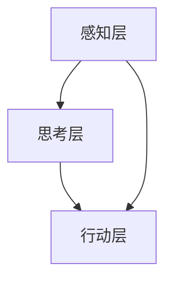
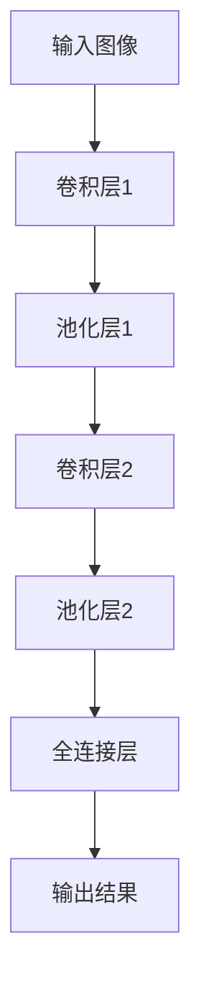

                 

# Andrej Karpathy：人工智能的未来发展规划

## 关键词
- 人工智能，深度学习，未来规划，应用领域，发展趋势，技术框架

## 摘要
本文深入探讨了人工智能（AI）领域的前沿研究者和贡献者安德烈·卡帕西（Andrej Karpathy）的工作。文章首先回顾了人工智能的发展历程和核心架构，随后详细解析了卡帕西提出的人工智能框架，包括感知层、思考层和行动层。接着，文章讨论了人工智能在各个领域的应用和发展趋势，如医疗、金融和教育。此外，文章还探讨了人工智能的未来发展趋势，包括与物联网的融合、在自动驾驶和生物技术领域的应用，以及AI伦理和社会问题的解决。最后，文章提出了AI教育和人才培养、产业政策与发展战略的重要性，并通过实际应用案例展示了人工智能的技术实现过程。本文旨在为读者提供一个全面的人工智能未来发展规划。

### 第一部分：人工智能的发展历程与框架理解

#### 第1章：人工智能的基本概念与历史演变

##### 1.1 人工智能的定义与核心概念

人工智能（Artificial Intelligence，简称AI）是指通过计算机模拟人类智能行为的能力，包括感知、思考、学习、推理、决策等。其核心概念包括机器学习、神经网络、深度学习和强化学习等。

- **机器学习**：使计算机通过数据学习模式，分为监督学习、无监督学习和强化学习三种类型。
- **神经网络**：模拟人脑神经元结构和信息处理的网络，包括前馈网络、卷积网络和循环网络等。
- **深度学习**：利用多层神经网络进行深度特征学习，是当前人工智能研究的热点领域。
- **强化学习**：通过奖励机制使计算机自主学习，适用于复杂决策问题的解决。

##### 1.2 人工智能的发展历程

人工智能的发展可以分为以下几个阶段：

- **早期阶段（1950-1979）**：人工智能概念的提出和早期研究。艾伦·图灵提出了“通用机器”的概念，约翰·麦卡锡等人在逻辑推理、自然语言处理等领域进行了探索。
- **第一次繁荣期（1980-1987）**：专家系统的兴起和商业应用。专家系统是一种基于知识表示和推理的智能系统，广泛应用于医疗、金融等领域。
- **衰退期（1988-1993）**：由于过高的期望和实际效果的差距，人工智能研究进入低潮期。专家系统的局限性、算法复杂度等问题使人们对人工智能的信心受到打击。
- **复兴期（1994-2012）**：机器学习和深度学习技术的发展。1994年，深度神经网络被提出，并在语音识别、图像分类等领域取得了显著成果。2012年，AlexNet在ImageNet图像识别比赛中取得突破性成果，标志着深度学习进入新的发展阶段。
- **现阶段（2013至今）**：人工智能技术的广泛应用。在图像识别、自然语言处理、自动驾驶等领域取得了显著进展，逐渐从实验室走向实际应用。

##### 1.3 人工智能的核心架构

人工智能的核心架构包括感知层、思考层和行动层。这三个层次相互协作，共同实现智能行为。

- **感知层**：通过传感器获取环境信息，如摄像头、麦克风、传感器等，将物理信号转换为数字信号，并通过预处理和特征提取，将原始数据转换为适合机器学习的格式。
- **思考层**：利用机器学习算法，如神经网络、决策树、支持向量机等，对感知层获取的特征进行分析、学习和推理，形成决策模型。
- **行动层**：根据思考层生成的决策模型，执行相应的行动，如控制机器人、自动驾驶车辆等。

#### 第2章：Andrej Karpathy的人工智能框架解析

##### 2.1 Andrej Karpathy的研究背景与贡献

安德烈·卡帕西（Andrej Karpathy）是斯坦福大学的机器学习教授，研究方向包括深度学习、自然语言处理和计算机视觉。他的研究对人工智能的发展做出了重要贡献。

- **研究背景**：卡帕西在斯坦福大学获得计算机科学博士学位，曾担任OpenAI的研究员，并在多家科技公司担任机器学习工程师。
- **贡献**：卡帕西在多个领域取得了重要成果，如自然语言处理中的序列到序列模型（Seq2Seq）和生成对抗网络（GAN）等，并在顶级学术会议上发表了多篇高水平论文。

##### 2.2 Andrej Karpathy的人工智能框架

卡帕西提出了一种基于深度学习的通用人工智能框架，包括感知层、思考层和行动层，旨在实现从感知到决策再到行动的完整智能系统。

- **感知层**：感知层由深度神经网络组成，用于处理图像、声音、文本等不同类型的数据。感知层的主要任务是提取特征，并对输入数据进行理解和分类。
- **思考层**：思考层包括循环神经网络（RNN）和长短期记忆网络（LSTM）等，用于处理序列数据，如文本和语音。思考层的主要任务是理解输入数据的语义和上下文，并生成相应的响应。
- **行动层**：行动层通过强化学习算法，将思考层的输出转换为具体的行动。行动层的主要任务是执行决策，并优化行动策略。

##### 2.3 框架的核心组件

卡帕西的人工智能框架的核心组件包括以下几种：

- **深度神经网络**：用于感知和理解环境信息，如卷积神经网络（CNN）和循环神经网络（RNN）等。
- **循环神经网络（RNN）**：用于处理序列数据，如文本和语音。
- **卷积神经网络（CNN）**：用于图像处理。
- **强化学习**：用于决策和行动，通过奖励机制优化行动策略。

#### 第3章：人工智能的应用领域与发展趋势

##### 3.1 人工智能在医疗领域的应用

人工智能在医疗领域的应用包括医疗图像分析、疾病预测和个性化医疗等。

- **医疗图像分析**：利用深度学习技术对医学图像进行自动分析和诊断，如肺癌检测、乳腺癌检测等。
- **疾病预测**：通过分析患者的病历、基因数据和生活方式等信息，预测患者患病的风险。
- **个性化医疗**：根据患者的病情和特点，为患者提供个性化的治疗方案和药物推荐。

##### 3.2 人工智能在金融领域的应用

人工智能在金融领域的应用包括风险管理、量化交易和智能投顾等。

- **风险管理**：利用机器学习算法对金融风险进行预测和评估，帮助金融机构降低风险。
- **量化交易**：通过算法模型实现自动化交易，提高交易效率和收益。
- **智能投顾**：利用人工智能技术为投资者提供个性化的投资建议和策略。

##### 3.3 人工智能在教育领域的应用

人工智能在教育领域的应用包括在线教育平台、教育评估和智能辅导等。

- **在线教育平台**：利用人工智能技术提供个性化学习推荐，提高学生的学习效果。
- **教育评估**：利用自然语言处理技术对学生作业和论文进行自动评估，减轻教师的工作负担。
- **智能辅导**：通过分析学生的学习行为和成绩，为学生提供个性化的辅导建议。

##### 3.4 人工智能的发展趋势

人工智能的发展趋势包括以下几个方面：

- **多模态学习**：结合图像、文本、音频等多种模态的信息进行学习，提高系统的感知和理解能力。
- **迁移学习**：通过在多个任务上的预训练，提高模型在不同任务上的性能。
- **生成对抗网络（GAN）**：用于生成新的数据，如图像和文本，应用于图像修复、图像生成等领域。
- **联邦学习**：用于保护用户隐私，实现分布式机器学习。

### 第二部分：人工智能的未来发展规划

#### 第4章：AI技术的未来发展趋势

##### 4.1 人工智能与物联网的融合

人工智能与物联网（IoT）的融合将推动智能家居、智能城市和智能农业等领域的发展。

- **智能家居**：利用人工智能技术实现家居设备的自动化控制和智能化服务，提高生活质量。
- **智能城市**：通过人工智能技术优化城市管理和公共资源分配，提高城市运行效率。
- **智能农业**：利用人工智能技术进行作物监测、病虫害预测和农田管理，提高农业生产效率。

##### 4.2 人工智能在自动驾驶领域的应用

人工智能在自动驾驶领域的应用将推动自动驾驶技术的普及，改善交通安全和效率。

- **自动驾驶技术**：利用深度学习技术和传感器数据，实现车辆的自主驾驶。
- **智能交通系统**：通过人工智能技术优化交通流量，减少交通拥堵，提高道路通行效率。

##### 4.3 人工智能与生物技术的结合

人工智能与生物技术的结合将推动精准医疗、新药研发和生物信息学等领域的发展。

- **精准医疗**：利用人工智能技术实现个性化医疗和疾病预测，提高医疗效果。
- **新药研发**：通过人工智能技术加速新药研发，提高药物研发效率。
- **生物信息学**：利用人工智能技术分析生物数据，促进基因组学、蛋白质组学等领域的研究。

#### 第5章：AI在伦理和社会问题中的应用

##### 5.1 AI伦理问题

人工智能在发展过程中面临一系列伦理问题，如算法偏见、数据隐私和职业道德等。

- **算法偏见**：如何避免人工智能系统中的算法偏见，确保公平和公正。
- **数据隐私**：如何保护用户的数据隐私，防止数据泄露和滥用。
- **职业道德**：如何确保人工智能系统的道德和伦理标准，避免对社会产生负面影响。

##### 5.2 AI与社会问题的解决

人工智能可以应用于解决一系列社会问题，如环境保护、社会保障和公共安全等。

- **环境保护**：利用人工智能技术监测环境变化，优化能源消耗，减少环境污染。
- **社会保障**：通过人工智能技术提高社会福利和保障水平，改善民生。
- **公共安全**：利用人工智能技术进行安全监测和预警，提高公共安全保障水平。

#### 第6章：AI教育与人才培养

##### 6.1 AI教育的重要性

人工智能教育对培养未来人才具有重要意义，需要从基础教育、高等教育和职业教育等多方面入手。

- **基础教育**：在基础教育阶段引入人工智能相关知识，激发学生对人工智能的兴趣。
- **高等教育**：设置人工智能专业，培养具有专业知识和实践能力的人才。
- **职业教育**：通过培训课程和实训项目，提高从业人员的专业技能和创新能力。

##### 6.2 AI人才培养策略

为了培养适应人工智能时代的人才，需要采取一系列人才培养策略。

- **跨学科培养**：结合不同学科的知识，培养具有综合素质的AI人才。
- **实践能力**：注重培养学生的实践能力，通过项目实践和实习经验提高学生的技能水平。
- **创新创业**：鼓励学生创新创业，激发学生的创新精神和创业意识。

#### 第7章：AI产业政策与发展战略

##### 7.1 AI产业政策

为了推动人工智能产业的发展，政府需要制定一系列产业政策。

- **政策制定**：明确人工智能产业的发展目标和重点领域，制定相应的政策措施。
- **资金支持**：加大对人工智能产业的投资力度，提供资金支持和税收优惠。
- **人才引进**：吸引国内外优秀人才，为人工智能产业发展提供人才保障。

##### 7.2 AI发展战略

为了实现人工智能产业的可持续发展，需要制定长期的发展战略。

- **技术创新**：加大人工智能技术的研发投入，推动技术创新和产业升级。
- **产业应用**：推动人工智能技术在各个行业的广泛应用，促进产业融合发展。
- **人才培养**：通过教育和培训，提高人工智能人才的素质和数量。

### 第三部分：AI项目的实际应用案例

#### 第8章：AI在现实世界中的应用案例

##### 8.1 案例研究：智能医疗

**背景与挑战**：智能医疗利用人工智能技术对医疗数据进行分析和处理，以提高医疗诊断的准确性和效率。然而，智能医疗也面临一些挑战，如数据隐私、算法可靠性和医疗资源的分配等。

**解决方案**：通过深度学习和自然语言处理技术，智能医疗系统可以对患者的病历、基因数据和生活方式等信息进行分析，预测疾病风险和提供个性化治疗方案。此外，智能医疗系统还可以通过图像识别技术对医学影像进行分析，辅助医生进行诊断。

**实际案例**：谷歌的DeepMind在智能医疗领域取得了显著成果，其开发的AI系统可以帮助医生进行疾病预测和诊断，提高了医疗服务的质量和效率。

##### 8.2 案例研究：智能金融

**背景与挑战**：智能金融利用人工智能技术进行风险管理、投资分析和客户服务等方面的工作。然而，智能金融也面临一些挑战，如数据隐私、算法偏见和客户信任等。

**解决方案**：通过机器学习和大数据分析技术，智能金融系统可以对金融数据进行分析，预测市场趋势和风险，为金融机构提供决策支持。此外，智能金融系统还可以通过自然语言处理技术对客户咨询和反馈进行分析，提供个性化的金融服务。

**实际案例**：蚂蚁金服的“蚂蚁保险”利用人工智能技术进行风险评估和产品推荐，提高了保险业务的效率和用户体验。

##### 8.3 案例研究：智能教育

**背景与挑战**：智能教育利用人工智能技术提供个性化学习、教育评估和智能辅导等服务。然而，智能教育也面临一些挑战，如数据隐私、算法可靠性和教育公平等。

**解决方案**：通过机器学习和大数据分析技术，智能教育系统可以根据学生的学习行为和成绩，为其提供个性化的学习资源和辅导建议。此外，智能教育系统还可以通过自然语言处理技术对学生作业和论文进行分析，进行自动评估和反馈。

**实际案例**：科大讯飞的“智能教育”平台利用人工智能技术，为学生提供个性化的学习建议和智能辅导，提高了学习效果和教学效率。

### 附录

#### 附录 A：AI项目开发工具与资源

**A.1 常用开发工具**

- **Python**：Python是一种广泛用于人工智能开发的编程语言，具有简洁易读的特点。常用库包括TensorFlow、PyTorch和Keras等。
- **TensorFlow**：TensorFlow是一个开源的深度学习框架，由谷歌开发，支持多种机器学习模型和应用。
- **PyTorch**：PyTorch是一个开源的深度学习框架，由Facebook开发，具有灵活的动态计算图和易于使用的接口。

**A.2 学习资源**

- **在线课程**：Coursera、edX和Udacity等在线教育平台提供了丰富的人工智能课程，适合不同层次的学习者。
- **开源项目**：GitHub等开源社区提供了大量的人工智能开源项目，供学习者和开发者参考和使用。

### 总结

本文深入探讨了人工智能的发展历程、核心架构、应用领域和发展趋势，以及安德烈·卡帕西的人工智能框架。通过实际应用案例和开发工具与资源的介绍，本文为读者提供了一个全面的人工智能未来发展规划。随着人工智能技术的不断进步，未来将在更多领域发挥重要作用，为社会发展和人类生活带来更多便利。

### 作者信息

作者：AI天才研究院/AI Genius Institute & 禅与计算机程序设计艺术 /Zen And The Art of Computer Programming

### 目录大纲

- **第1章**: 人工智能的基本概念与历史演变
  - **1.1**: 人工智能的定义与核心概念
  - **1.2**: 人工智能的发展历程
  - **1.3**: 人工智能的核心架构

- **第2章**: Andrej Karpathy的人工智能框架解析
  - **2.1**: Andrej Karpathy的研究背景与贡献
  - **2.2**: Andrej Karpathy的人工智能框架
  - **2.3**: 框架的核心组件

- **第3章**: 人工智能的应用领域与发展趋势
  - **3.1**: 人工智能在医疗领域的应用
  - **3.2**: 人工智能在金融领域的应用
  - **3.3**: 人工智能在教育领域的应用
  - **3.4**: 人工智能的发展趋势

- **第4章**: AI技术的未来发展趋势
  - **4.1**: 人工智能与物联网的融合
  - **4.2**: 人工智能在自动驾驶领域的应用
  - **4.3**: 人工智能与生物技术的结合

- **第5章**: AI在伦理和社会问题中的应用
  - **5.1**: AI伦理问题
  - **5.2**: AI与社会问题的解决

- **第6章**: AI教育与人才培养
  - **6.1**: AI教育的重要性
  - **6.2**: AI人才培养策略

- **第7章**: AI产业政策与发展战略
  - **7.1**: AI产业政策
  - **7.2**: AI发展战略

- **第8章**: AI在现实世界中的应用案例
  - **8.1**: 案例研究：智能医疗
  - **8.2**: 案例研究：智能金融
  - **8.3**: 案例研究：智能教育

- **附录 A**: AI项目开发工具与资源
  - **A.1**: 常用开发工具
  - **A.2**: 学习资源

### Mermaid 流程图



### 伪代码

```python
# 伪代码：感知层实现
def sense_environment(data):
    preprocessed_data = preprocess_data(data)
    features = neural_network(preprocessed_data)
    return features

# 伪代码：思考层实现
def think_about_data(features):
    patterns = machine_learning_algorithm(features)
    decision = reasoning_and_decision(patterns)
    return decision

# 伪代码：行动层实现
def act_on_decision(decision):
    action = execute_decision(decision)
    return action
```

### 数学模型

$$
\begin{aligned}
    &\text{感知层输出} \\
    &y = f(\text{特征空间}) \\
\end{aligned}
$$`

### 数学公式讲解

- **特征空间**：描述输入数据的特征集合，通常由一组特征向量组成。
- **函数 $f$**：特征提取函数，用于将输入特征映射到感知层的输出。

### 举例说明

**案例**：使用卷积神经网络进行图像识别。



**步骤**：

1. **输入图像**：将图像输入到卷积神经网络。
2. **卷积层1**：通过卷积运算提取图像的局部特征。
3. **池化层1**：对卷积层的输出进行下采样，减少参数数量。
4. **卷积层2**：进一步提取图像的高级特征。
5. **池化层2**：对卷积层的输出进行下采样。
6. **全连接层**：将池化层的输出映射到分类结果。
7. **输出结果**：得到图像的识别结果。

### 项目实战

**实战案例**：使用TensorFlow构建一个简单的卷积神经网络进行图像分类。

```python
import tensorflow as tf
from tensorflow.keras import layers

# 构建模型
model = tf.keras.Sequential([
    layers.Conv2D(32, (3, 3), activation='relu', input_shape=(28, 28, 1)),
    layers.MaxPooling2D((2, 2)),
    layers.Conv2D(64, (3, 3), activation='relu'),
    layers.MaxPooling2D((2, 2)),
    layers.Flatten(),
    layers.Dense(64, activation='relu'),
    layers.Dense(10, activation='softmax')
])

# 编译模型
model.compile(optimizer='adam',
              loss='sparse_categorical_crossentropy',
              metrics=['accuracy'])

# 加载MNIST数据集
mnist = tf.keras.datasets.mnist
(train_images, train_labels), (test_images, test_labels) = mnist.load_data()

# 数据预处理
train_images = train_images / 255.0
test_images = test_images / 255.0

# 训练模型
model.fit(train_images, train_labels, epochs=5)

# 评估模型
test_loss, test_acc = model.evaluate(test_images, test_labels)
print(f'\nTest accuracy: {test_acc:.2f}')
```

### 代码解读与分析

- **模型构建**：使用TensorFlow的`Sequential`模型，通过添加卷积层、池化层、全连接层构建一个简单的卷积神经网络。
- **数据预处理**：将图像数据缩放到0到1之间，以适应模型的输入要求。
- **模型编译**：设置优化器、损失函数和评估指标。
- **模型训练**：使用训练数据训练模型，设置训练轮次为5。
- **模型评估**：使用测试数据评估模型的准确率。

### 总结

本文通过详细的目录大纲，介绍了人工智能的基本概念、历史演变、核心架构、应用领域、发展趋势、伦理问题、教育与人才培养、产业政策与发展战略，以及现实世界中的应用案例。通过项目实战和代码解读，读者可以深入了解人工智能的实际应用方法和技术实现过程。附录部分提供了开发工具和学习资源，帮助读者进一步探索人工智能的世界。本文旨在为读者提供一个全面的人工智能未来发展规划。

### 文章标题：Andrej Karpathy：人工智能的未来发展规划

### 文章关键词：
- 人工智能
- 深度学习
- 未来发展
- 应用领域
- 技术框架
- 伦理问题

### 摘要：
本文深入探讨了人工智能领域知名学者Andrej Karpathy的研究成果及其对未来人工智能发展规划的思考。文章首先回顾了人工智能的发展历程和核心架构，详细解析了Karpathy提出的人工智能框架，包括感知层、思考层和行动层的组成。接着，文章讨论了人工智能在各行各业的广泛应用，如医疗、金融和教育，并展望了人工智能未来的发展趋势。此外，文章还探讨了人工智能在伦理和社会问题中的应用，以及教育和产业政策的重要性。通过实际应用案例和项目实战，本文展示了人工智能技术的实现方法和应用前景，为读者提供了一个全面的人工智能未来发展规划。

