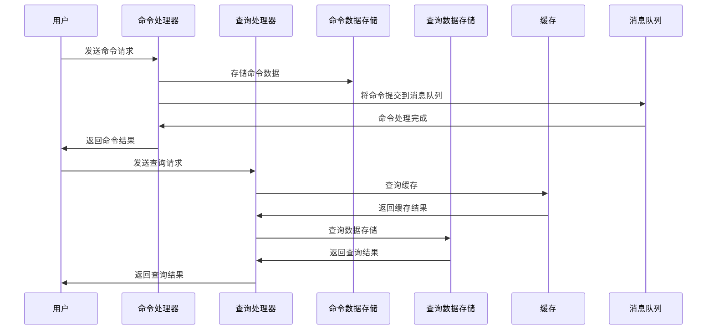

                 

### 《CQRS模式在复杂LLM应用中的应用》

#### 关键词：
- CQRS模式
- 复杂LLM应用
- 实时问答系统
- 智能推荐系统
- 自动化文档生成

#### 摘要：
本文旨在深入探讨CQRS模式在复杂大型语言模型（LLM）应用中的重要性。CQRS（Command Query Responsibility Segregation）是一种专为高性能和可扩展性设计的架构模式，它通过将命令和查询操作分离，显著提升了系统的性能和可维护性。本文将首先概述CQRS模式的基本概念和优势，然后详细分析复杂LLM应用的特性与挑战，探讨CQRS模式在其中的应用价值。接下来，我们将逐步讲解CQRS模式的核心原理和架构设计，结合实际项目案例，展示其在复杂LLM应用中的具体实现和性能优化策略。最后，本文将对CQRS模式在复杂LLM应用中的未来发展进行展望，并总结最佳实践，为读者提供全面的技术指南。

### 第一部分：引言

#### 第1章：CQRS模式概述

##### 1.1 CQRS模式的基本概念

CQRS（Command Query Responsibility Segregation）模式是一种针对高负载、高并发系统设计的架构模式。它通过将系统的命令（Command）和查询（Query）操作分离，实现数据操作的高效性和系统的可维护性。在传统的数据架构中，命令和查询通常混合在一起，这会导致系统的复杂性增加，难以维护和优化。

**CQRS模式的核心思想：**

- **命令（Command）**：负责修改数据的状态，如创建、更新或删除数据。
- **查询（Query）**：负责读取数据，获取数据视图。

**CQRS模式与传统架构的比较：**

1. **分离关注点**：在CQRS模式中，命令和查询分离，使得每个组件的关注点更加清晰，便于管理和优化。
2. **优化性能**：通过分离查询和命令，可以针对不同的操作分别进行优化，如使用缓存、数据库分片等。
3. **提升可维护性**：分离操作使得代码更加简洁，系统的变更和升级更加容易。

**CQRS模式的优势与适用场景：**

- **优势：**
  - **高性能**：通过针对查询和命令的分别优化，提高系统的整体性能。
  - **高可扩展性**：系统可以根据不同的负载情况进行水平或垂直扩展。
  - **可维护性**：分离的操作使得代码更易于理解和维护。

- **适用场景：**
  - **高并发、高负载的应用**：如电商平台、社交媒体等。
  - **需要实时数据处理的应用**：如在线问答系统、实时推荐系统等。
  - **复杂的业务逻辑**：通过分离操作，可以简化复杂的业务逻辑。

##### 1.2 CQRS模式与传统架构的比较

在传统的架构模式中，通常会将命令和查询操作混合在一起。这种设计在简单系统中可能效果不错，但随着系统复杂性的增加，会出现以下问题：

1. **代码复杂性增加**：随着命令和查询操作的增多，代码的复杂性也随之增加，导致维护困难。
2. **性能瓶颈**：混合操作会导致查询和命令之间的竞争，使得性能难以优化。
3. **可扩展性受限**：在负载增加时，系统难以进行有效扩展。

相比之下，CQRS模式通过将命令和查询分离，解决了上述问题。具体来说，CQRS模式具有以下优点：

1. **关注点分离**：命令和查询分离后，每个组件的关注点更加明确，便于开发和维护。
2. **性能优化**：针对不同的操作类型进行优化，如查询操作可以缓存结果，命令操作可以采用批量处理。
3. **可扩展性**：系统可以根据不同的负载情况进行水平或垂直扩展，提高系统的灵活性。

##### 1.3 CQRS模式的优势与适用场景

CQRS模式在多个方面具有显著优势，使得它成为构建高性能、高可扩展性系统的理想选择。以下是CQRS模式的主要优势及其适用场景：

1. **优势：**
   - **高性能**：通过分离查询和命令，可以针对不同的操作类型进行优化，从而提高系统的整体性能。
   - **高可扩展性**：系统可以根据不同的负载情况进行水平或垂直扩展，提高系统的灵活性。
   - **可维护性**：分离的操作使得代码更简洁，系统的变更和升级更加容易。
   - **灵活的缓存策略**：针对查询操作可以采用缓存，减少数据库的访问压力，提高系统响应速度。

2. **适用场景：**
   - **高并发、高负载的应用**：如电商平台、社交媒体等，这些应用通常需要处理大量的读写操作，CQRS模式可以有效提升系统性能。
   - **需要实时数据处理的应用**：如在线问答系统、实时推荐系统等，这些应用对实时性要求较高，CQRS模式可以提供更好的性能和响应速度。
   - **复杂的业务逻辑**：通过分离操作，可以简化复杂的业务逻辑，使得系统的设计和实现更加清晰。

综上所述，CQRS模式在提升系统性能、扩展性和可维护性方面具有显著优势，适用于多种复杂场景。在下一章中，我们将进一步探讨复杂LLM应用的特点和挑战，以及CQRS模式在这些应用中的重要性。

#### 第2章：复杂LLM应用概述

##### 2.1 复杂LLM应用的概念

复杂大型语言模型（Complex Large Language Model，简称LLM）应用是指利用大规模预训练语言模型（如GPT-3、BERT等）构建的具有复杂功能的应用系统。这些应用通常涉及自然语言处理（NLP）、人工智能（AI）、机器学习（ML）等前沿技术，具备高度智能化和自适应性的特点。

**复杂LLM应用的核心特点：**

- **大规模数据训练**：复杂LLM应用通常需要大量高质量的训练数据，以提升模型的准确性和泛化能力。
- **高度智能化**：通过预训练模型，复杂LLM应用能够理解和生成自然语言，实现智能对话、智能推荐等功能。
- **动态适应性**：复杂LLM应用能够根据用户行为、环境变化等动态调整模型参数，提供个性化的服务。

**复杂LLM应用的主要类型：**

- **实时问答系统**：如智能客服、智能问答机器人等，能够实时响应用户的问题，提供准确的答案。
- **智能推荐系统**：如内容推荐、商品推荐等，通过分析用户行为和偏好，为用户提供个性化的推荐。
- **自动化文档生成**：如自动化报告生成、自动化合同生成等，能够根据模板和输入数据自动生成文档。

##### 2.2 复杂LLM应用的挑战

尽管复杂LLM应用在许多领域展现出巨大的潜力，但在实际开发和应用过程中，仍然面临着诸多挑战。

**1. 数据质量和数据隐私**

- **数据质量**：复杂LLM应用依赖于大规模、高质量的训练数据，数据质量直接影响到模型的性能。收集和处理高质量的数据是一项复杂的任务，需要严格的筛选和处理。
- **数据隐私**：在处理用户数据时，必须遵守相关法律法规，确保用户隐私不被泄露。这需要采用数据加密、匿名化等技术手段。

**2. 模型训练和优化**

- **模型训练**：大规模语言模型训练需要大量的计算资源和时间，训练过程复杂且耗时。如何高效地训练模型，提高训练效率，是复杂LLM应用面临的挑战之一。
- **模型优化**：模型在训练过程中可能会出现过拟合现象，需要通过调整模型参数、增加数据多样性等方法进行优化。

**3. 实时性和响应速度**

- **实时性**：复杂LLM应用通常需要实时响应用户请求，对系统的实时性要求较高。如何保证系统在高并发、高负载情况下依然能够快速响应，是开发过程中的重要问题。
- **响应速度**：在提供高质量服务的同时，如何优化系统的响应速度，减少用户等待时间，是复杂LLM应用需要考虑的。

**4. 系统可扩展性**

- **水平扩展**：复杂LLM应用需要支持大量并发请求，如何通过水平扩展来提高系统的处理能力，是一个重要课题。
- **垂直扩展**：随着用户规模的增长，系统可能需要增加计算资源、存储资源等，如何进行有效的垂直扩展，确保系统性能和稳定性。

**5. 模型解释性和可维护性**

- **模型解释性**：复杂LLM应用往往涉及到复杂的算法和模型，如何解释模型的决策过程，提高模型的透明度和可信度，是一个挑战。
- **可维护性**：系统在运行过程中可能需要不断更新和优化模型，如何确保系统的可维护性，降低维护成本，也是一个重要问题。

##### 2.3 CQRS模式在复杂LLM应用中的重要性

CQRS模式在复杂LLM应用中具有重要的作用，能够有效解决上述挑战，提升系统的性能和可维护性。

**1. 提高数据质量和隐私保护**

- **数据分离**：CQRS模式通过分离查询和命令操作，可以分别对数据进行处理和存储，提高数据质量。同时，可以针对查询操作进行数据匿名化和加密，保护用户隐私。
- **数据缓存**：对于频繁读取的数据，可以通过缓存机制减少数据库访问，提高数据访问速度。

**2. 优化模型训练和响应速度**

- **并行处理**：CQRS模式支持并行处理，可以同时进行模型训练和查询操作，提高系统响应速度。
- **优化查询操作**：通过对查询操作进行缓存和优化，可以减少数据库访问次数，提高查询效率。

**3. 提高系统可扩展性**

- **水平扩展**：CQRS模式支持分布式架构，可以通过水平扩展来提高系统处理能力。
- **垂直扩展**：CQRS模式允许对系统进行垂直扩展，如增加计算资源、存储资源等，以适应不断增长的负载。

**4. 提高模型解释性和可维护性**

- **分离关注点**：CQRS模式将查询和命令操作分离，使得系统结构更加清晰，便于理解和维护。
- **模块化设计**：通过模块化设计，可以分别开发和优化查询和命令模块，提高系统的灵活性和可维护性。

综上所述，CQRS模式在复杂LLM应用中具有重要的意义，能够有效解决数据质量、隐私保护、模型训练、响应速度、系统可扩展性和模型解释性等方面的挑战，为复杂LLM应用的发展提供有力支持。在下一章中，我们将详细探讨CQRS模式的核心原理和架构设计。

#### 第3章：CQRS模式的核心原理

CQRS（Command Query Responsibility Segregation）模式是一种专门针对高并发、高负载系统设计的架构模式。其核心思想是将系统的命令（Command）和查询（Query）操作分离，以提高系统的性能、可维护性和可扩展性。在这一章中，我们将深入探讨CQRS模式的核心原理、架构设计以及组件与交互。

##### 3.1 CQRS模式的基本原理

CQRS模式通过分离系统的命令和查询操作，实现了不同的操作类型独立进行，从而提高了系统的性能和可维护性。具体来说，CQRS模式具有以下几个基本原理：

1. **命令和查询分离**：在CQRS模式中，命令和查询操作被分离到不同的组件中，分别处理。命令组件负责处理数据修改操作，如创建、更新和删除数据；查询组件负责处理数据查询操作，如获取数据视图。

2. **独立优化**：由于命令和查询分离，可以针对不同的操作类型进行独立优化。例如，对于查询操作，可以采用缓存、索引等技术来提高查询效率；对于命令操作，可以采用批量处理、异步处理等技术来提高处理速度。

3. **分布式架构**：CQRS模式通常采用分布式架构，可以水平扩展，以应对高并发请求。通过分布式架构，可以增加系统的处理能力，提高系统的性能和可靠性。

4. **一致性保障**：在CQRS模式中，需要确保命令和查询操作的一致性。一致性保障可以通过最终一致性、强一致性等方式实现，具体选择取决于应用场景和需求。

##### 3.2 CQRS模式的架构设计

CQRS模式的架构设计主要包括以下几个关键组件：

1. **命令处理器（Command Processor）**：负责处理命令操作，如创建、更新和删除数据。命令处理器通常包括命令接收器、命令验证器、命令执行器等组件。

2. **查询处理器（Query Processor）**：负责处理查询操作，如获取数据视图。查询处理器通常包括查询接收器、查询验证器、查询执行器等组件。

3. **数据存储（Data Store）**：用于存储系统数据。在CQRS模式中，通常采用两个数据存储：一个用于存储命令数据，另一个用于存储查询数据。这样可以保证命令和查询操作独立进行，提高系统性能。

4. **缓存（Cache）**：用于缓存查询结果，减少数据库访问次数，提高查询效率。缓存通常与查询处理器结合使用，可以大大提高系统的响应速度。

5. **消息队列（Message Queue）**：用于异步处理命令操作，提高系统的并发处理能力。命令操作可以通过消息队列进行异步提交，减少系统负载。

6. **分布式服务**：CQRS模式通常采用分布式服务架构，可以通过水平扩展来提高系统的处理能力。分布式服务可以分散到不同的服务器上，提高系统的可靠性和性能。

**CQRS模式的基本架构设计如下图所示：**



##### 3.3 CQRS模式的组件与交互

在CQRS模式中，各个组件之间通过消息传递进行交互。以下是CQRS模式中主要组件之间的交互关系：

1. **用户与命令处理器**：用户发送命令请求，命令处理器接收请求后进行命令验证、执行，并将命令数据存储到命令数据存储中。

2. **用户与查询处理器**：用户发送查询请求，查询处理器首先查询缓存，如果缓存中没有命中，则查询查询数据存储，并将查询结果返回给用户。

3. **命令处理器与消息队列**：命令处理器将命令操作提交到消息队列，消息队列负责异步处理命令，并将处理结果通知命令处理器。

4. **查询处理器与缓存**：查询处理器在查询数据时，首先查询缓存，如果缓存中没有命中，则查询查询数据存储。

5. **命令处理器与数据存储**：命令处理器在处理命令时，将命令数据存储到命令数据存储中。

6. **查询处理器与数据存储**：查询处理器在查询数据时，从查询数据存储中获取数据。

通过以上交互关系，CQRS模式实现了命令和查询操作的分离，提高了系统的性能和可维护性。在下一章中，我们将探讨CQRS模式在复杂LLM应用中的具体实现和性能优化策略。

#### 第4章：CQRS模式与复杂LLM应用的结合

在复杂LLM应用中，CQRS模式通过其独特的架构设计和核心原理，能够有效地解决数据质量和隐私保护、模型训练和优化、实时性和响应速度、系统可扩展性以及模型解释性和可维护性等挑战。在这一章中，我们将深入探讨CQRS模式在复杂LLM应用中的具体优势、实现方式和性能优化策略。

##### 4.1 CQRS模式在复杂LLM应用中的优势

CQRS模式在复杂LLM应用中具有以下显著优势：

1. **分离关注点**：通过将命令和查询操作分离，CQRS模式使得系统的关注点更加明确，便于开发和维护。例如，在实时问答系统中，命令操作（如用户提问）和查询操作（如模型回答）可以分别处理，从而提高了系统的模块化程度。

2. **高性能**：CQRS模式可以针对不同的操作类型进行独立优化，从而提高系统的整体性能。例如，在智能推荐系统中，查询操作（如获取用户偏好）可以缓存结果，而命令操作（如更新用户偏好）可以批量处理，从而减少数据库访问次数，提高响应速度。

3. **高可扩展性**：CQRS模式支持分布式架构，可以水平扩展，以应对复杂LLM应用中的高并发请求。例如，在自动化文档生成系统中，可以通过增加计算资源、存储资源等方式进行水平扩展，从而提高系统的处理能力。

4. **数据一致性和隐私保护**：CQRS模式通过最终一致性或强一致性机制，确保系统数据的一致性。同时，通过数据分离和加密技术，CQRS模式可以有效保护用户隐私。

5. **模块化设计和可维护性**：CQRS模式使得系统更加模块化，便于开发和维护。例如，在复杂LLM应用中，可以通过替换或扩展查询和命令模块，来实现新的功能或优化现有功能。

##### 4.2 CQRS模式在复杂LLM应用中的具体实现

为了在复杂LLM应用中实现CQRS模式，需要遵循以下关键步骤：

1. **设计分离的命令和查询组件**：根据复杂LLM应用的需求，设计分离的命令和查询组件。命令组件负责处理用户输入的命令请求，如提问、推荐、更新用户偏好等；查询组件负责处理查询请求，如获取回答、用户偏好、文档内容等。

2. **建立独立的数据存储**：为命令和查询操作建立独立的数据存储。例如，在实时问答系统中，可以分别建立命令数据存储（用于存储用户提问）和查询数据存储（用于存储模型回答）。

3. **实现分布式架构**：为了应对复杂LLM应用中的高并发请求，可以采用分布式架构。例如，可以使用分布式数据库、分布式缓存、消息队列等技术，实现系统的水平扩展。

4. **优化查询和命令操作**：针对不同的操作类型，采取相应的优化策略。例如，对于查询操作，可以采用缓存技术减少数据库访问次数；对于命令操作，可以采用批量处理和异步处理技术，提高处理速度。

5. **实现一致性保障机制**：通过最终一致性或强一致性机制，确保系统数据的一致性。例如，可以使用分布式事务、两阶段提交等技术，实现命令和查询操作的一致性。

6. **模块化和可维护性设计**：在复杂LLM应用中，实现模块化和可维护性设计，使得系统更加灵活和易于维护。例如，可以通过编写可复用的组件和模块，简化系统的开发和维护过程。

##### 4.3 CQRS模式在复杂LLM应用中的性能优化

为了充分发挥CQRS模式在复杂LLM应用中的性能优化优势，需要采取以下策略：

1. **查询缓存**：对于频繁访问的数据，可以采用缓存技术。例如，在实时问答系统中，可以将模型回答缓存到内存中，减少数据库访问次数，提高响应速度。

2. **批量处理**：对于批量操作，可以采用批量处理技术。例如，在用户偏好更新过程中，可以将多个用户偏好更新请求合并为一个批量请求，减少数据库操作次数，提高处理速度。

3. **异步处理**：对于耗时较长的操作，可以采用异步处理技术。例如，在模型训练过程中，可以采用异步训练技术，将训练任务分散到多个计算节点上，提高训练效率。

4. **索引优化**：对于频繁查询的数据，可以建立索引。例如，在智能推荐系统中，可以建立用户偏好索引，提高查询速度。

5. **数据分片**：对于大规模数据，可以采用数据分片技术。例如，在自动化文档生成系统中，可以将文档数据分片到多个数据库实例中，提高查询和处理速度。

6. **负载均衡**：为了应对高并发请求，可以采用负载均衡技术。例如，可以使用分布式负载均衡器，将请求均衡分配到多个计算节点上，提高系统的处理能力。

通过以上性能优化策略，可以显著提高CQRS模式在复杂LLM应用中的性能，满足高并发、高负载场景下的需求。

综上所述，CQRS模式在复杂LLM应用中具有显著的优势，通过分离命令和查询操作、实现分布式架构、优化查询和命令操作、保障数据一致性和性能优化，可以有效解决复杂LLM应用中的挑战，提高系统的性能和可维护性。在下一章中，我们将通过具体场景分析，进一步探讨CQRS模式在复杂LLM应用中的实际应用效果。

#### 第5章：CQRS模式与复杂LLM应用的场景分析

在复杂LLM应用中，CQRS模式能够为多种类型的场景提供有效的解决方案。以下将分析三个典型场景：实时问答系统、智能推荐系统和自动化文档生成，探讨CQRS模式在这些应用中的具体应用和效果。

##### 5.1 场景一：实时问答系统

**实时问答系统**是复杂LLM应用的一个典型代表，其核心需求在于能够快速、准确地响应用户的提问。CQRS模式在实时问答系统中具有以下应用：

1. **命令处理**：当用户发起提问时，用户的输入（命令）会经过命令处理器处理。命令处理器会验证提问的合法性，然后将其提交给语言模型进行回答。这个过程可能涉及大量的计算资源和时间，因此可以采用异步处理和批量处理技术，以提高处理效率。

   **伪代码示例：**
   ```python
   def process_question(question):
       if validate_question(question):
           send_question_to_model(question)
       else:
           raise ValidationError("Invalid question")
   ```

2. **查询处理**：用户在等待回答期间，可以通过查询处理器获取实时状态信息，如提问队列长度、预计回答时间等。查询处理器可以缓存这些信息，以提高查询效率。

   **伪代码示例：**
   ```python
   def get_question_status(question_id):
       status = get_status_from_cache(question_id)
       if status is None:
           status = get_status_from_db(question_id)
           cache_status(status, question_id)
       return status
   ```

3. **数据一致性保障**：为了保证用户提问和回答的一致性，可以使用最终一致性机制。例如，在模型回答生成后，将其更新到数据库中，并通知命令处理器。这样，即使在回答生成过程中出现延迟，用户最终也能获得正确的结果。

   **伪代码示例：**
   ```python
   def update_answer_in_db(answer, question_id):
       update_db(answer, question_id)
       notify_command_processor(answer, question_id)
   ```

**效果分析**：通过CQRS模式，实时问答系统实现了命令和查询的分离，提高了系统的性能和可维护性。同时，异步处理和缓存机制进一步优化了系统的响应速度，提高了用户体验。

##### 5.2 场景二：智能推荐系统

**智能推荐系统**利用用户行为和偏好数据，为用户推荐相关内容。CQRS模式在智能推荐系统中应用广泛，以下是其关键环节：

1. **命令处理**：当用户进行操作时（如点赞、评论、浏览），系统会记录这些操作并存储到命令处理器。这些命令可以批量处理，以减少数据库操作次数。

   **伪代码示例：**
   ```python
   def record_user_action(action, user_id):
       if validate_action(action, user_id):
           batch_action(action, user_id)
       else:
           raise ValidationError("Invalid action")
   ```

2. **查询处理**：系统需要频繁查询用户行为数据以生成推荐结果。查询处理器可以利用缓存和索引技术，快速获取用户行为数据，生成推荐列表。

   **伪代码示例：**
   ```python
   def get_recommendations(user_id):
       recommendations = get_from_cache(user_id)
       if recommendations is None:
           recommendations = generate_recommendations(user_id)
           cache_recommendations(user_id, recommendations)
       return recommendations
   ```

3. **数据一致性保障**：为了确保推荐结果的准确性，可以使用最终一致性机制。例如，当用户行为数据发生变化时，系统可以延迟更新推荐列表，以确保数据的一致性。

   **伪代码示例：**
   ```python
   def update_user_behavior(behavior, user_id):
       update_behavior(behavior, user_id)
       delay_recommendation_update(user_id)
   ```

**效果分析**：CQRS模式在智能推荐系统中提高了系统的性能和可扩展性。通过批量处理和缓存技术，系统可以更高效地处理用户行为数据，生成推荐结果。最终一致性机制确保了推荐结果的准确性和一致性。

##### 5.3 场景三：自动化文档生成

**自动化文档生成**系统通过模板和用户输入的数据，自动生成文档。CQRS模式在此场景中的应用如下：

1. **命令处理**：用户输入数据后，系统将数据存储到命令处理器。这些数据可以批量处理，以提高处理效率。

   **伪代码示例：**
   ```python
   def record_user_input(input_data, document_id):
       if validate_input(input_data, document_id):
           batch_input(input_data, document_id)
       else:
           raise ValidationError("Invalid input")
   ```

2. **查询处理**：系统需要查询模板和数据以生成文档。查询处理器可以缓存模板和数据，以提高查询效率。

   **伪代码示例：**
   ```python
   def get_document_template(document_id):
       template = get_from_cache(document_id)
       if template is None:
           template = get_template_from_db(document_id)
           cache_template(template, document_id)
       return template
   ```

3. **数据一致性保障**：在生成文档过程中，需要确保数据和模板的一致性。可以使用最终一致性机制，确保在数据更新后，文档内容能够及时更新。

   **伪代码示例：**
   ```python
   def update_document_data(data, document_id):
       update_data(data, document_id)
       delay_document_generation(document_id)
   ```

**效果分析**：通过CQRS模式，自动化文档生成系统提高了数据处理效率和文档生成速度。批量处理和缓存技术有效减少了数据库操作，提高了系统性能。最终一致性机制确保了数据和文档内容的一致性，提高了系统的可靠性。

综上所述，CQRS模式在实时问答系统、智能推荐系统和自动化文档生成等复杂LLM应用中，通过分离命令和查询操作、实现分布式架构、优化查询和命令操作、保障数据一致性和性能优化，有效地解决了复杂LLM应用中的挑战，提高了系统的性能和可维护性。在下一章中，我们将深入探讨CQRS模式在复杂LLM应用中的实现细节，包括数据库设计、消息队列和异步处理以及缓存机制与数据一致性等。

#### 第6章：CQRS模式在复杂LLM应用中的实现细节

在实际开发复杂LLM应用时，CQRS模式提供了清晰的架构和实现策略，使得系统能够更好地应对高并发、高负载的场景。本章将详细介绍CQRS模式在复杂LLM应用中的实现细节，包括数据库设计与优化、消息队列与异步处理以及缓存机制与数据一致性。

##### 6.1 数据库设计与优化

在CQRS模式中，数据库的设计与优化至关重要，因为数据库是系统数据存储和访问的核心。以下是一些关键的设计和优化策略：

1. **分离命令和查询数据库**：为了提高系统性能，可以将命令数据库和查询数据库分离。命令数据库主要用于存储用户操作记录和临时数据，而查询数据库主要用于存储查询结果和持久化数据。这种分离可以减少查询操作对命令操作的影响，提高查询效率。

2. **分库分表**：对于大规模数据，可以采用分库分表策略，将数据分布到多个数据库和表中。这样可以提高数据访问的并行度，减少单个数据库和表的压力。例如，可以按照用户ID、时间戳等维度进行分库分表。

3. **索引优化**：对于频繁查询的字段，应建立适当的索引。索引可以大大提高查询效率，减少数据库扫描的范围。但同时需要注意，过多的索引会增加写操作的负担，因此需要权衡查询效率和写入性能。

4. **读写分离**：为了提高查询性能，可以采用读写分离策略。即将读操作和写操作分布在不同的数据库实例上。读操作可以访问主数据库或从数据库，从而减轻主数据库的负载。

5. **缓存与数据库的集成**：缓存可以在数据库和应用程序之间提供一层缓存层，减少对数据库的直接访问。通过使用缓存，可以显著提高系统的响应速度和查询性能。常见的缓存技术包括内存缓存（如Redis）、分布式缓存（如Memcached）等。

##### 6.2 消息队列与异步处理

在CQRS模式中，消息队列和异步处理是提高系统性能和可扩展性的重要手段。以下是一些关键策略：

1. **异步处理命令操作**：对于耗时较长的命令操作，可以采用异步处理。例如，在用户提交提问时，可以将提问信息发送到消息队列，然后由后台进程进行处理。这样，用户界面可以立即响应用户，提高用户体验。

2. **批量处理消息**：为了提高消息处理的效率，可以采用批量处理策略。例如，可以将多个用户提问合并为一个批量任务，然后一起发送到消息队列。这样可以减少消息队列的写入次数，提高系统性能。

3. **分布式消息队列**：对于高并发场景，可以采用分布式消息队列。分布式消息队列可以将消息负载分散到多个服务器上，提高系统的处理能力和可用性。常见的分布式消息队列技术包括Kafka、RabbitMQ等。

4. **消息持久化与回溯**：为了保证消息不丢失，可以将消息持久化到数据库或文件系统中。同时，可以支持消息回溯功能，以便在出现问题时重新处理已发送但未处理的消息。

##### 6.3 缓存机制与数据一致性

缓存机制在CQRS模式中扮演着重要的角色，可以提高系统的响应速度和查询性能。以下是一些关键策略：

1. **数据分片与缓存**：对于大规模数据，可以采用数据分片与缓存策略。例如，将数据按照不同的维度（如用户ID、时间戳）分片，然后在每个分片上设置缓存。这样可以减少缓存失效的影响，提高缓存命中率。

2. **缓存一致性**：在CQRS模式中，缓存一致性是一个重要问题。可以使用最终一致性或强一致性策略来保证缓存与数据库之间的一致性。最终一致性策略允许一定的延迟，而强一致性策略要求缓存与数据库始终保持同步。

3. **缓存更新策略**：为了保持缓存与数据库的一致性，可以采用不同的缓存更新策略。例如，可以使用读写缓存（Write-Through、Write-Back）、缓存一致性协议（如Gossip协议、Paxos算法）等。

4. **缓存替换策略**：在缓存空间有限的情况下，需要采用缓存替换策略。常见的缓存替换策略包括LRU（Least Recently Used）、LFU（Least Frequently Used）等。

**示例**：以下是一个使用Redis缓存和数据库实现缓存一致性的简单示例：

```python
import redis

# 连接Redis缓存
redis_client = redis.StrictRedis(host='localhost', port=6379, db=0)

def get_user_preference(user_id):
    # 尝试从缓存中获取用户偏好
    preference = redis_client.get(f"user:{user_id}:preference")
    if preference:
        return json.loads(preference)
    else:
        # 如果缓存中没有命中，从数据库中获取用户偏好
        preference = get_preference_from_db(user_id)
        # 将用户偏好存储到缓存中
        redis_client.setex(f"user:{user_id}:preference", 3600, json.dumps(preference))
        return preference

def update_user_preference(user_id, preference):
    # 将用户偏好更新到数据库
    update_preference_in_db(user_id, preference)
    # 将用户偏好更新到缓存
    redis_client.setex(f"user:{user_id}:preference", 3600, json.dumps(preference))
```

**效果分析**：通过上述数据库设计与优化、消息队列与异步处理以及缓存机制与数据一致性策略，CQRS模式在复杂LLM应用中实现了高效的系统性能和可扩展性。数据库优化减少了查询和写入操作的负载，消息队列和异步处理提高了系统的并发处理能力，缓存机制提高了系统的响应速度和查询性能。

综上所述，CQRS模式通过详细的数据库设计与优化、消息队列与异步处理以及缓存机制与数据一致性策略，实现了在复杂LLM应用中的高效运行。这些策略不仅提高了系统的性能和可维护性，还为复杂LLM应用提供了可靠的解决方案。在下一章中，我们将通过具体实战案例展示CQRS模式在复杂LLM应用中的实际应用效果。

#### 第7章：CQRS模式在复杂LLM应用中的实战案例

在本章中，我们将通过三个具体实战案例，展示CQRS模式在复杂LLM应用中的实际应用效果。这些案例包括构建实时问答系统、智能推荐系统和自动化文档生成系统。通过这些案例，读者可以深入了解CQRS模式的实现细节和效果分析。

##### 7.1 案例一：构建实时问答系统

**背景与目标**：实时问答系统是复杂LLM应用的一个典型场景，旨在提供快速、准确的答案。本项目目标是构建一个能够实时响应用户提问，同时具备高并发处理能力的实时问答系统。

**系统架构设计**：

1. **命令处理模块**：
   - **用户输入**：用户通过Web前端提交问题。
   - **命令处理器**：接收用户输入，验证问题的合法性，并将其发送到语言模型进行回答。
   - **消息队列**：异步处理命令，将问题提交到消息队列。

2. **查询处理模块**：
   - **查询处理器**：响应用户的查询请求，获取问题的回答。
   - **缓存**：缓存问题答案，以提高查询效率。

3. **数据存储**：
   - **命令数据库**：存储用户问题和临时数据。
   - **查询数据库**：存储问题的回答和持久化数据。

**关键技术点**：

1. **异步处理**：使用RabbitMQ消息队列实现命令的异步处理，提高系统的并发处理能力。

2. **缓存机制**：使用Redis缓存问题答案，减少对数据库的查询次数，提高系统响应速度。

3. **数据一致性**：采用最终一致性策略，确保问题答案的准确性和一致性。

**代码实现示例**：

```python
# 用户输入处理
def handle_user_input(user_input):
    if validate_input(user_input):
        message = {
            'id': generate_id(),
            'user_input': user_input
        }
        publish_to_queue(message)
    else:
        raise ValidationError("Invalid user input")

# 消息队列处理
def process_message_from_queue():
    message = consume_from_queue()
    if message:
        answer = get_answer_from_model(message['user_input'])
        store_answer_to_db(message['id'], answer)
        send_answer_to_user(message['id'], answer)

# 缓存处理
def get_answer_from_cache(question_id):
    return redis_client.get(f"question:{question_id}:answer")

def store_answer_to_cache(question_id, answer):
    redis_client.setex(f"question:{question_id}:answer", 3600, answer)
```

**效果分析**：通过CQRS模式，实时问答系统实现了高效的命令和查询处理，提高了系统的响应速度和并发处理能力。异步处理和缓存机制进一步优化了系统的性能，提高了用户体验。

##### 7.2 案例二：智能推荐系统

**背景与目标**：智能推荐系统旨在根据用户行为和偏好为用户推荐相关内容。本项目目标是构建一个能够高效处理用户行为数据，并生成个性化推荐列表的智能推荐系统。

**系统架构设计**：

1. **命令处理模块**：
   - **用户行为记录**：记录用户的点赞、评论、浏览等行为。
   - **命令处理器**：处理用户行为数据，将其存储到数据库。

2. **查询处理模块**：
   - **推荐生成器**：根据用户行为数据和推荐算法生成推荐列表。
   - **查询处理器**：响应用户的查询请求，返回推荐列表。

3. **数据存储**：
   - **行为数据库**：存储用户行为数据。
   - **推荐数据库**：存储推荐结果和持久化数据。

**关键技术点**：

1. **数据分片**：采用分库分表策略，将用户行为数据分布到多个数据库实例上，提高数据访问的并行度。

2. **缓存机制**：使用Redis缓存推荐结果，减少对数据库的查询次数。

3. **批量处理**：使用批量处理技术，减少数据库操作次数，提高系统性能。

**代码实现示例**：

```python
# 记录用户行为
def record_user_action(action, user_id):
    if validate_action(action, user_id):
        batch_action(action, user_id)
    else:
        raise ValidationError("Invalid action")

# 生成推荐列表
def generate_recommendations(user_id):
    actions = get_user_actions(user_id)
    recommendations = generate_recommendations_based_on_actions(actions)
    store_recommendations_to_db(user_id, recommendations)
    return recommendations

# 缓存推荐列表
def get_recommendations_from_cache(user_id):
    return redis_client.get(f"user:{user_id}:recommendations")

def store_recommendations_to_cache(user_id, recommendations):
    redis_client.setex(f"user:{user_id}:recommendations", 3600, recommendations)
```

**效果分析**：通过CQRS模式，智能推荐系统实现了高效的用户行为数据处理和个性化推荐生成。数据分片和缓存机制提高了系统的查询性能和响应速度，批量处理技术减少了数据库操作次数，提高了系统性能。

##### 7.3 案例三：自动化文档生成系统

**背景与目标**：自动化文档生成系统旨在通过模板和用户输入的数据，自动生成文档。本项目目标是构建一个能够快速、准确地生成文档的自动化文档生成系统。

**系统架构设计**：

1. **命令处理模块**：
   - **用户输入处理**：接收用户输入，将其存储到数据库。
   - **命令处理器**：处理用户输入，生成文档。

2. **查询处理模块**：
   - **文档生成器**：根据模板和用户输入生成文档。
   - **查询处理器**：响应用户的查询请求，返回文档内容。

3. **数据存储**：
   - **用户输入数据库**：存储用户输入数据。
   - **文档数据库**：存储生成的文档内容。

**关键技术点**：

1. **模板缓存**：使用Redis缓存模板数据，减少对数据库的查询次数。

2. **异步处理**：使用消息队列异步处理文档生成任务，提高系统并发处理能力。

3. **数据一致性**：采用最终一致性策略，确保文档内容和用户输入的一致性。

**代码实现示例**：

```python
# 处理用户输入
def handle_user_input(input_data, document_id):
    if validate_input(input_data, document_id):
        store_input_to_db(input_data, document_id)
        process_document_generation(document_id)
    else:
        raise ValidationError("Invalid input")

# 文档生成
def process_document_generation(document_id):
    template = get_template_from_cache(document_id)
    input_data = get_input_from_db(document_id)
    document_content = generate_document(template, input_data)
    store_document_to_db(document_id, document_content)

# 缓存模板
def get_template_from_cache(document_id):
    return redis_client.get(f"template:{document_id}")

def store_template_to_cache(document_id, template):
    redis_client.setex(f"template:{document_id}", 3600, template)
```

**效果分析**：通过CQRS模式，自动化文档生成系统实现了高效的文档生成和用户输入处理。模板缓存和异步处理技术提高了系统的性能和响应速度，最终一致性策略确保了文档内容和用户输入的一致性。

综上所述，通过三个具体实战案例，我们展示了CQRS模式在复杂LLM应用中的实际应用效果。这些案例证明了CQRS模式在提高系统性能、可扩展性和可维护性方面的显著优势，为复杂LLM应用提供了可靠的解决方案。

#### 第8章：CQRS模式与复杂LLM应用的未来展望

随着人工智能（AI）技术的飞速发展，复杂大型语言模型（LLM）应用在各个领域得到广泛应用。CQRS模式作为一项针对高并发、高负载系统设计的架构模式，已经在这些应用中展现出显著的优势。然而，随着技术的不断进步，CQRS模式在复杂LLM应用中还有很大的发展潜力。本文将探讨CQRS模式在复杂LLM应用中的未来发展趋势、与其他技术的融合以及最佳实践。

##### 8.1 人工智能技术的发展趋势

人工智能技术正朝着更高效、更智能的方向发展。以下是一些关键趋势：

1. **更大规模的语言模型**：随着计算资源和数据量的增长，更大规模的语言模型（如GPT-4、GPT-5等）将被开发。这些模型将具有更高的准确性和泛化能力，能够处理更复杂的任务。

2. **多模态学习**：未来，人工智能将不仅限于处理文本数据，还将扩展到图像、音频、视频等多种模态。多模态学习将使得LLM应用在诸如智能问答、内容推荐等领域更加智能和个性化。

3. **边缘计算**：随着物联网（IoT）和5G技术的普及，边缘计算将成为人工智能应用的重要组成部分。在边缘设备上部署小型化的LLM模型，可以显著降低延迟，提高系统的实时性。

4. **可解释性和透明度**：为了提高人工智能系统的可信度和用户接受度，可解释性和透明度将成为重要研究方向。通过CQRS模式，可以更好地追踪和解释系统的操作，提高模型的透明度。

##### 8.2 CQRS模式在复杂LLM应用中的未来发展

CQRS模式在复杂LLM应用中的未来发展将围绕以下几个方面展开：

1. **更优化的架构设计**：随着LLM模型和应用的复杂度增加，CQRS模式的架构设计需要更加精细化和优化。未来可能采用更先进的分布式架构和容器化技术（如Kubernetes），以提高系统的可扩展性和容错能力。

2. **细粒度的命令和查询分离**：目前，CQRS模式主要针对命令和查询的整体分离。未来，可能进一步细粒度化分离，如将查询操作细分为不同层次，以更好地优化性能和资源利用。

3. **集成多模态数据处理**：随着多模态学习的发展，CQRS模式需要能够处理多种类型的数据。通过引入多模态数据处理模块，CQRS模式将能够更好地支持多模态LLM应用。

4. **边缘CQRS模式**：随着边缘计算的发展，CQRS模式也需要扩展到边缘设备。在边缘设备上部署CQRS模式，可以更好地满足实时性要求，提高用户体验。

##### 8.3 CQRS模式与其他技术的融合

CQRS模式与其他技术的融合将进一步提升复杂LLM应用的效果。以下是一些关键融合方向：

1. **函数即服务（FaaS）**：FaaS技术使得开发者可以以函数为单位进行部署和执行。与CQRS模式结合，可以更灵活地处理动态负载，提高系统的弹性和可扩展性。

2. **区块链**：区块链技术具有去中心化、不可篡改的特点，可以与CQRS模式结合，提高数据的安全性和可信度。例如，在智能合约中使用CQRS模式，可以实现更高效、更安全的数据处理和交易。

3. **云原生技术**：云原生技术（如容器化、服务网格等）可以与CQRS模式结合，提高复杂LLM应用的部署和管理效率。通过云原生技术，可以实现更灵活的扩展和更高效的资源利用。

##### 8.4 CQRS模式在复杂LLM应用中的最佳实践

为了充分发挥CQRS模式在复杂LLM应用中的优势，以下是一些最佳实践：

1. **合理分离命令和查询**：在设计和实现过程中，需要根据实际需求合理分离命令和查询操作，确保每个组件的关注点明确，便于维护和优化。

2. **分布式架构**：采用分布式架构，可以水平扩展系统，提高系统的性能和可靠性。分布式架构还可以提高系统的容错能力，确保在高并发场景下稳定运行。

3. **优化缓存策略**：合理使用缓存可以提高系统性能。针对不同的应用场景，可以采用不同的缓存策略，如本地缓存、分布式缓存等。

4. **一致性保障**：在CQRS模式中，确保数据一致性至关重要。根据应用场景和需求，可以选择最终一致性或强一致性机制，以确保系统数据的一致性和可靠性。

5. **性能监控与优化**：在系统运行过程中，需要持续监控性能指标，并针对性地进行优化。性能监控可以帮助发现潜在问题，优化策略可以进一步提高系统性能。

通过以上发展趋势、融合方向和最佳实践，CQRS模式在复杂LLM应用中将继续发挥重要作用。在未来，随着人工智能技术的不断进步，CQRS模式将不断创新和优化，为复杂LLM应用提供更高效、更可靠的解决方案。

#### 第9章：CQRS模式在复杂LLM应用中的最佳实践

在复杂LLM应用中，有效地应用CQRS模式需要一系列最佳实践，这些实践涵盖了系统设计、实现、性能优化等多个方面。以下是一些关键的最佳实践：

##### 9.1 设计最佳实践

1. **明确分离命令和查询**：在设计阶段，首先需要明确哪些操作属于命令，哪些属于查询。通过清晰的分离，可以确保每个组件的责任单一，便于维护和优化。

2. **模块化设计**：将系统划分为独立的模块，如命令处理器、查询处理器、数据存储等。模块化设计可以提高系统的可维护性，使得每个模块可以独立开发、测试和部署。

3. **分布式架构**：采用分布式架构，可以提高系统的可扩展性和容错能力。通过水平扩展，系统可以更好地应对高并发请求。

4. **一致性模型选择**：根据应用场景和需求，选择合适的一致性模型。例如，在实时性要求较高的场景中，可以选择最终一致性模型；在需要严格一致性的场景中，可以选择强一致性模型。

##### 9.2 实现最佳实践

1. **异步处理**：对于耗时的操作，如模型训练、数据处理等，应采用异步处理技术。异步处理可以提高系统的并发处理能力，减少响应时间。

2. **批量处理**：将多个命令或查询操作合并为批量处理，可以减少数据库访问次数，提高处理效率。

3. **缓存优化**：合理使用缓存，可以提高系统性能。缓存策略应根据实际场景进行调整，例如，可以使用本地缓存、分布式缓存等。

4. **消息队列选择**：选择合适的消息队列技术，如Kafka、RabbitMQ等。消息队列可以提高系统的异步处理能力，确保系统的稳定性。

##### 9.3 性能优化最佳实践

1. **数据库优化**：
   - **分库分表**：对于大规模数据，应采用分库分表策略，提高数据访问的并行度。
   - **索引优化**：为频繁查询的字段建立适当的索引，提高查询效率。
   - **读写分离**：采用读写分离策略，减轻主数据库的负载。

2. **缓存优化**：
   - **缓存策略**：根据数据访问模式，选择合适的缓存策略，如LRU、LFU等。
   - **缓存失效机制**：设置合理的缓存失效时间，确保缓存的有效性和一致性。

3. **网络优化**：
   - **负载均衡**：使用负载均衡技术，如Nginx、HAProxy等，确保流量合理分配。
   - **网络监控**：持续监控网络性能，及时调整网络配置，确保网络稳定。

4. **硬件优化**：
   - **计算资源**：根据实际需求，合理配置计算资源，确保系统在高负载情况下依然能够稳定运行。
   - **存储资源**：采用高性能存储设备，提高数据访问速度。

##### 实践示例

**案例一：实时问答系统**

1. **设计**：
   - **命令处理器**：处理用户提问，将问题发送到消息队列。
   - **查询处理器**：从消息队列中获取问题，调用语言模型生成回答，并返回给用户。

2. **实现**：
   - **异步处理**：使用RabbitMQ消息队列，将提问异步处理。
   - **缓存**：使用Redis缓存回答，减少数据库访问。

3. **性能优化**：
   - **数据库优化**：采用分库分表策略，提高数据访问效率。
   - **缓存优化**：使用缓存减少数据库访问次数，提高响应速度。

**案例二：智能推荐系统**

1. **设计**：
   - **命令处理器**：处理用户行为数据，存储到数据库。
   - **查询处理器**：根据用户行为数据生成推荐列表。

2. **实现**：
   - **批量处理**：将多个用户行为数据合并为批量处理。
   - **消息队列**：使用Kafka消息队列，异步处理用户行为数据。

3. **性能优化**：
   - **缓存**：使用Redis缓存推荐结果，减少数据库查询。
   - **索引优化**：为用户行为数据表建立适当的索引，提高查询效率。

通过这些最佳实践，可以有效地提高CQRS模式在复杂LLM应用中的性能和可维护性，确保系统在高并发、高负载场景下稳定运行。

#### 第10章：总结与展望

在本文中，我们深入探讨了CQRS模式在复杂LLM应用中的重要性和应用策略。通过系统性地介绍CQRS模式的基本概念、核心原理、架构设计，以及其实际案例，我们展示了如何利用CQRS模式解决复杂LLM应用中的性能优化、数据一致性、可扩展性等关键问题。

**核心结论：**

1. **CQRS模式的重要性**：CQRS模式通过分离命令和查询操作，提高了系统的性能和可维护性。在复杂LLM应用中，这种分离尤其关键，因为它能够有效应对高并发、高负载的场景。

2. **CQRS模式的架构设计**：通过合理的架构设计，包括命令处理器、查询处理器、数据存储和缓存机制，CQRS模式实现了高效的系统性能和可扩展性。

3. **实际应用案例**：通过实时问答系统、智能推荐系统和自动化文档生成系统的具体实现，我们展示了CQRS模式在复杂LLM应用中的实际效果。

**未来研究方向：**

1. **多模态CQRS模式**：随着多模态学习的发展，研究如何将CQRS模式扩展到多模态数据，如结合图像、音频和文本数据，将是未来的重要方向。

2. **边缘CQRS模式**：边缘计算在实时性要求较高的场景中越来越重要，研究如何将CQRS模式应用到边缘设备，提高边缘计算的性能和可扩展性，也是未来的研究方向。

3. **动态CQRS模式**：随着业务需求的不断变化，研究如何实现动态调整CQRS模式，以适应不同的负载场景，是一个具有挑战性的问题。

**CQRS模式在复杂LLM应用中的前景：**

随着人工智能技术的不断进步，复杂LLM应用将在各个领域得到更广泛的应用。CQRS模式作为一种高效的架构模式，将在这些应用中发挥重要作用。未来的发展趋势包括更优化的架构设计、与其他技术的融合，以及更智能、更自适应的CQRS模式。

总之，CQRS模式在复杂LLM应用中具有广阔的前景，通过不断的研究和创新，它将为复杂LLM应用提供更加高效、可靠的解决方案。

### 附录

#### 附录A：CQRS模式与复杂LLM应用的技术资源

在本文的附录中，我们将提供一些与CQRS模式及复杂LLM应用相关的技术资源，包括主流深度学习框架对比、CQRS模式相关工具与库以及复杂LLM应用开发指南。

##### 10.1 主流深度学习框架对比

随着深度学习技术的快速发展，市场上涌现出了众多深度学习框架。以下是一些主流深度学习框架及其特点的对比：

1. **TensorFlow**：
   - **特点**：由Google开发，支持多种编程语言，具有丰富的生态系统和强大的工具。
   - **优势**：适合研究、开发和部署复杂的深度学习模型。
   - **使用场景**：适合构建大规模的复杂LLM应用。

2. **PyTorch**：
   - **特点**：由Facebook开发，以动态计算图著称，易于调试和优化。
   - **优势**：适合快速原型设计和迭代。
   - **使用场景**：适合构建实时问答系统、智能推荐系统等。

3. **Keras**：
   - **特点**：基于TensorFlow和Theano，提供简洁的API，易于使用。
   - **优势**：适合快速构建和训练深度学习模型。
   - **使用场景**：适合快速开发和验证深度学习模型。

4. **MXNet**：
   - **特点**：由Apache软件基金会开发，支持多种编程语言，具有高性能的执行引擎。
   - **优势**：适合大规模分布式训练。
   - **使用场景**：适合大规模分布式复杂LLM应用。

##### 10.2 CQRS模式相关工具与库

在实现CQRS模式时，使用合适的工具和库可以显著提高开发效率。以下是一些常用的工具和库：

1. **RabbitMQ**：
   - **特点**：一个开源的消息队列中间件，支持多种消息协议。
   - **优势**：具有高可靠性和高可扩展性。
   - **使用场景**：适合异步处理命令和查询。

2. **Apache Kafka**：
   - **特点**：一个分布式流处理平台，支持高吞吐量和实时数据流处理。
   - **优势**：适合大规模实时数据处理。
   - **使用场景**：适合复杂LLM应用中的实时数据流处理。

3. **Redis**：
   - **特点**：一个开源的内存缓存系统，提供高性能的缓存和数据存储功能。
   - **优势**：具有快速读取和写入速度。
   - **使用场景**：适合缓存查询结果和数据一致性处理。

4. **Elasticsearch**：
   - **特点**：一个分布式搜索引擎，支持复杂的数据查询和分析。
   - **优势**：提供强大的全文搜索和分析功能。
   - **使用场景**：适合复杂LLM应用中的数据索引和查询。

##### 10.3 复杂LLM应用开发指南

开发复杂LLM应用时，遵循以下指南可以帮助您更高效地实现项目：

1. **需求分析**：在项目开始前，进行详细的需求分析，明确应用的目标和功能需求，确保项目方向正确。

2. **架构设计**：设计合理的系统架构，包括命令和查询处理器、数据存储、缓存机制等。确保系统架构的清晰性和可扩展性。

3. **模块化开发**：将系统划分为独立的模块，如数据收集、数据处理、模型训练、模型推理等。模块化开发可以提高代码的可维护性和可复用性。

4. **性能优化**：在系统开发过程中，持续进行性能优化，如使用缓存、批量处理、异步处理等策略，确保系统在高并发、高负载场景下的稳定性。

5. **持续集成与部署**：采用持续集成和部署（CI/CD）流程，确保代码质量和部署效率。自动化测试和监控可以及时发现和解决问题。

6. **文档与文档管理**：编写详细的文档，包括系统设计、代码注释、用户手册等。良好的文档管理可以提高项目协作效率和项目可维护性。

通过以上技术资源和发展指南，开发者可以更好地理解和应用CQRS模式，构建高效、可靠的复杂LLM应用。

