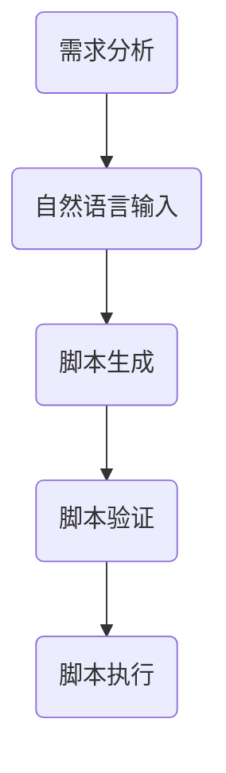
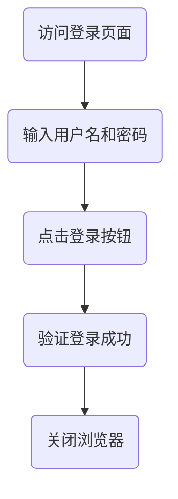
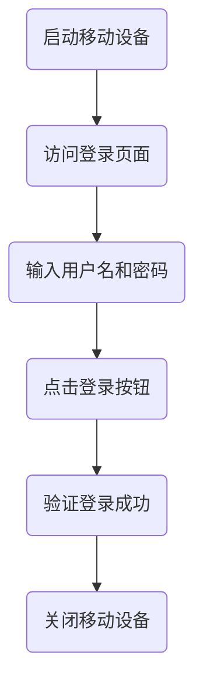
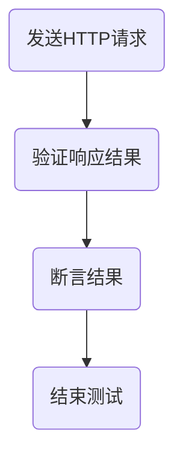

                 

# 《ChatGPT在自动化测试脚本生成中的应用》

## 摘要

自动化测试是软件质量保障的重要环节，其效率与准确性直接影响到软件产品的开发周期与市场竞争力。近年来，人工智能（AI）技术的快速发展为自动化测试带来了新的可能性。ChatGPT，作为基于GPT-3模型的强大语言处理工具，其在自动化测试脚本生成中的应用具有显著的潜力。本文将详细介绍ChatGPT的基础知识，探讨其在自动化测试脚本生成中的关键技术，并通过实际案例展示其应用效果。同时，本文也将分析ChatGPT在自动化测试中的应用挑战与未来展望。

### 目录

1. **ChatGPT基础知识**
    1.1 **ChatGPT概述**
    1.2 **自动化测试基础**
    1.3 **ChatGPT在自动化测试中的应用场景**
2. **ChatGPT在自动化测试脚本生成中的关键技术**
    2.1 **自然语言处理基础**
    2.2 **ChatGPT的核心算法原理**
    2.3 **自动化测试脚本生成的工作流程**
3. **ChatGPT在自动化测试中的应用实战**
    3.1 **Web自动化测试应用**
    3.2 **移动自动化测试应用**
    3.3 **接口自动化测试应用**
4. **ChatGPT在自动化测试中的应用挑战与展望**
    4.1 **应用挑战**
    4.2 **未来展望**
5. **附录**
    5.1 **开发工具与资源**
    5.2 **流程图**
    5.3 **数学公式与模型解释**
    5.4 **伪代码实现**

## 1. ChatGPT基础知识

### 1.1 ChatGPT概述

ChatGPT是由OpenAI开发的一种基于GPT-3模型的自然语言处理工具。GPT-3（Generative Pre-trained Transformer 3）是Transformer模型的一个大规模扩展，具有1750亿个参数，能够理解和生成人类语言。ChatGPT在此基础上，加入了对话上下文窗口功能，使得其能够进行连贯、自然的对话。

#### 发展历程

- 2018年：OpenAI发布GPT-2模型，拥有15亿参数。
- 2019年：OpenAI发布GPT-2.5，进一步增加了模型参数。
- 2020年：OpenAI发布GPT-3，拥有1750亿参数。
- 2022年：OpenAI推出ChatGPT，将GPT-3应用于对话场景。

### 1.2 ChatGPT的核心技术简介

ChatGPT的核心技术是基于Transformer模型的自注意力机制。自注意力机制允许模型在生成每个词时，考虑之前生成的所有词，从而实现更长的上下文理解和连贯性。此外，ChatGPT还采用了预训练和微调技术，使得模型能够在特定领域和任务上获得更好的性能。

#### 应用场景

ChatGPT的应用场景广泛，包括但不限于：
- 对话系统：如智能客服、聊天机器人等。
- 文本生成：如文章写作、报告生成等。
- 自动化测试脚本生成：自动生成自动化测试脚本，提高测试效率。

### 1.3 ChatGPT在自动化测试中的应用场景

在自动化测试中，ChatGPT可以用于生成测试用例、测试脚本等。传统的自动化测试需要测试人员手动编写测试脚本，费时费力。而ChatGPT可以通过自然语言输入，自动生成相应的测试脚本，提高测试效率。

#### 自动化测试基础

自动化测试是将测试过程自动化的一种方法，通过编写脚本自动化执行测试用例。自动化测试分为以下几种类型：

- **功能测试**：验证软件功能是否符合需求。
- **性能测试**：评估软件的性能指标，如响应时间、并发用户数等。
- **接口测试**：验证软件接口的稳定性和正确性。
- **移动应用测试**：针对移动应用的测试，包括功能、性能和兼容性等。

#### 自动化测试的优势与挑战

优势：
- 提高测试效率：自动化测试可以大大减少测试时间，提高测试覆盖范围。
- 减少人力成本：自动化测试可以替代部分人工测试，降低人力成本。
- 稳定性高：自动化测试可以重复执行，结果稳定可靠。

挑战：
- 编写脚本困难：自动化测试需要编写大量脚本，对测试人员的编程能力有较高要求。
- 维护成本高：自动化测试脚本需要定期更新和维护，以适应软件的变更。

#### 自动化测试工具与框架

常见的自动化测试工具有Selenium、JUnit、TestNG等，这些工具提供了丰富的API和功能，支持多种编程语言和测试类型。自动化测试框架如TestNG、JUnit等，提供了测试用例的编排、执行和结果报告等功能，大大简化了自动化测试的开发过程。

## 2. ChatGPT在自动化测试脚本生成中的关键技术

### 2.1 自然语言处理基础

自然语言处理（NLP）是人工智能领域的一个重要分支，旨在让计算机理解和生成人类语言。NLP的关键技术包括：

- **语言模型**：用于预测下一个单词或句子，是NLP的基础。
- **词嵌入**：将单词转换为固定长度的向量表示，便于计算机处理。
- **词性标注**：对单词进行词性分类，如名词、动词、形容词等。
- **实体识别**：识别文本中的特定实体，如人名、地点、组织等。

#### 语言模型概述

语言模型是NLP的核心技术之一，用于预测文本的下一个单词或句子。常见的语言模型包括：

- **n-gram模型**：基于词的序列，预测下一个单词。
- **循环神经网络（RNN）**：通过隐藏层的状态更新，处理序列数据。
- **长短时记忆网络（LSTM）**：RNN的改进版本，能够更好地处理长序列数据。
- **Transformer模型**：基于自注意力机制，能够处理任意长度的序列数据。

#### 词嵌入技术

词嵌入是将单词转换为固定长度的向量表示，便于计算机处理。常见的词嵌入技术包括：

- **词袋模型**：将单词表示为出现频率的向量。
- **Word2Vec**：通过训练神经网络，将单词映射到低维空间。
- **GloVe**：通过共现矩阵训练单词的向量表示。

#### 生成式与判别式模型

生成式模型和判别式模型是NLP中的两种常见模型：

- **生成式模型**：通过生成数据分布来预测下一个单词或句子，如n-gram模型、GPT模型。
- **判别式模型**：通过学习输入数据和标签之间的映射关系来预测标签，如朴素贝叶斯、决策树等。

### 2.2 ChatGPT的核心算法原理

ChatGPT的核心算法是基于Transformer模型的预训练和微调技术。Transformer模型是一种基于自注意力机制的序列模型，能够处理任意长度的序列数据。ChatGPT通过以下关键技术实现：

- **Transformer模型**：Transformer模型采用多头自注意力机制和编码器-解码器结构，能够实现高效的序列建模。
- **自注意力机制**：自注意力机制允许模型在生成每个词时，考虑之前生成的所有词，实现更长的上下文理解和连贯性。
- **预训练**：ChatGPT首先在大规模语料库上进行预训练，学习语言的一般规律。
- **微调**：在特定任务上，通过微调模型参数，使其适应特定场景。

#### Transformer模型

Transformer模型是一种基于自注意力机制的序列模型，其核心思想是让模型在生成每个词时，考虑之前生成的所有词。具体来说，Transformer模型采用以下关键技术：

- **多头自注意力**：通过多个注意力头，实现多层次的注意力机制，提高模型的表示能力。
- **位置编码**：为序列中的每个词添加位置信息，实现序列建模。
- **编码器-解码器结构**：编码器用于生成上下文信息，解码器用于生成目标序列。

#### 自注意力机制

自注意力机制是Transformer模型的核心，其基本思想是在生成每个词时，让模型考虑之前生成的所有词。具体来说，自注意力机制通过以下步骤实现：

1. **计算query、key和value的相似度**：每个词在计算时作为query，与所有词作为key和value计算相似度。
2. **加权求和**：根据相似度加权求和，得到每个词的注意力得分。
3. **归一化**：对注意力得分进行归一化，得到每个词的最终表示。

#### 预训练与微调

预训练和微调是ChatGPT的两个关键步骤：

- **预训练**：在大规模语料库上进行预训练，学习语言的一般规律。预训练包括两个阶段：预训练模型和继续预训练。
- **微调**：在特定任务上，通过微调模型参数，使其适应特定场景。微调过程通常包括数据准备、模型初始化、训练和评估等步骤。

### 2.3 自动化测试脚本生成的工作流程

ChatGPT在自动化测试脚本生成中的应用主要包括以下步骤：

1. **需求分析**：理解自动化测试的需求，确定测试目标和测试场景。
2. **脚本生成**：通过自然语言输入，ChatGPT自动生成相应的自动化测试脚本。
3. **脚本验证**：验证生成的脚本是否满足测试需求，对不满足的部分进行修改。
4. **脚本执行**：执行生成的脚本，验证测试用例的正确性。

#### 自动化测试脚本生成的需求分析

在自动化测试脚本生成中，需求分析是关键步骤。通过需求分析，可以明确测试目标、测试场景和测试数据，为脚本生成提供基础。

- **测试目标**：确定需要测试的功能点，如登录功能、购物车功能等。
- **测试场景**：确定测试的场景，如正常流程、异常流程等。
- **测试数据**：提供测试数据，如用户名、密码、商品信息等。

#### ChatGPT在自动化测试脚本生成中的工作流程

ChatGPT在自动化测试脚本生成中的工作流程主要包括以下步骤：

1. **初始化模型**：加载预训练好的ChatGPT模型。
2. **自然语言输入**：用户通过自然语言描述测试需求和测试场景。
3. **生成脚本**：ChatGPT根据自然语言输入，自动生成自动化测试脚本。
4. **脚本验证**：对生成的脚本进行验证，确保其满足测试需求。
5. **脚本执行**：执行生成的脚本，验证测试用例的正确性。

#### 自动化测试脚本生成的实际案例

以下是一个简单的自动化测试脚本生成案例：

**需求**：测试一个电商平台的登录功能，要求输入正确的用户名和密码，验证登录成功。

**自然语言输入**：请生成一个自动化测试脚本，用于测试电商平台的登录功能，要求输入正确的用户名和密码，验证登录成功。

**生成脚本**：

```python
# 导入测试工具
from selenium import webdriver

# 初始化浏览器
driver = webdriver.Chrome()

# 访问登录页面
driver.get("https://example.com/login")

# 输入用户名
driver.find_element_by_name("username").send_keys("testuser")

# 输入密码
driver.find_element_by_name("password").send_keys("testpass")

# 点击登录按钮
driver.find_element_by_name("login").click()

# 验证登录成功
assert "Welcome, testuser!" in driver.page_source

# 关闭浏览器
driver.quit()
```

**脚本验证**：执行脚本，验证登录功能是否正常。

**脚本执行**：执行脚本，验证测试用例的正确性。

通过上述案例，可以看到ChatGPT在自动化测试脚本生成中的应用效果。ChatGPT能够根据自然语言输入，自动生成符合要求的自动化测试脚本，大大提高了测试效率。

## 3. ChatGPT在自动化测试脚本生成中的应用实战

### 3.1 Web自动化测试应用

Web自动化测试是自动化测试中的一种常见类型，主要针对Web应用的界面和功能进行测试。ChatGPT在Web自动化测试中的应用，可以显著提高测试效率，减少测试脚本编写的工作量。

#### Web自动化测试环境搭建

在进行Web自动化测试之前，需要搭建测试环境。以下是一个基本的Web自动化测试环境搭建步骤：

1. **安装浏览器驱动**：下载并安装对应浏览器的驱动程序，如ChromeDriver、GeckoDriver等。
2. **安装Selenium库**：使用pip命令安装Selenium库，命令如下：
    ```bash
    pip install selenium
    ```
3. **配置测试环境**：在项目中引入Selenium库，并配置浏览器驱动路径。

以下是一个简单的Web自动化测试脚本：

```python
from selenium import webdriver
from selenium.webdriver.common.by import By

# 初始化浏览器
driver = webdriver.Chrome(executable_path='path/to/chromedriver')

# 访问登录页面
driver.get("https://example.com/login")

# 输入用户名
driver.find_element(By.NAME, "username").send_keys("testuser")

# 输入密码
driver.find_element(By.NAME, "password").send_keys("testpass")

# 点击登录按钮
driver.find_element(By.NAME, "login").click()

# 验证登录成功
assert "Welcome, testuser!" in driver.page_source

# 关闭浏览器
driver.quit()
```

#### ChatGPT在Web自动化测试脚本生成中的应用

ChatGPT可以通过自然语言输入生成Web自动化测试脚本。以下是一个示例：

**自然语言输入**：请生成一个自动化测试脚本，用于测试电商平台的登录功能，要求输入正确的用户名和密码，验证登录成功。

**生成脚本**：

```python
from selenium import webdriver
from selenium.webdriver.common.by import By

# 初始化浏览器
driver = webdriver.Chrome()

# 访问登录页面
driver.get("https://example.com/login")

# 输入用户名
driver.find_element(By.NAME, "username").send_keys("testuser")

# 输入密码
driver.find_element(By.NAME, "password").send_keys("testpass")

# 点击登录按钮
driver.find_element(By.NAME, "login").click()

# 验证登录成功
assert "Welcome, testuser!" in driver.page_source

# 关闭浏览器
driver.quit()
```

#### 实战案例与代码解读

以下是一个电商平台的登录功能自动化测试实战案例：

**需求**：测试一个电商平台的登录功能，要求输入正确的用户名和密码，验证登录成功。

**自然语言输入**：请生成一个自动化测试脚本，用于测试电商平台的登录功能，要求输入正确的用户名和密码，验证登录成功。

**生成脚本**：

```python
from selenium import webdriver
from selenium.webdriver.common.by import By

# 初始化浏览器
driver = webdriver.Chrome()

# 访问登录页面
driver.get("https://example.com/login")

# 输入用户名
driver.find_element(By.NAME, "username").send_keys("testuser")

# 输入密码
driver.find_element(By.NAME, "password").send_keys("testpass")

# 点击登录按钮
driver.find_element(By.NAME, "login").click()

# 验证登录成功
assert "Welcome, testuser!" in driver.page_source

# 关闭浏览器
driver.quit()
```

**脚本解读**：

1. 导入Selenium库和By模块，用于操作浏览器元素。
2. 初始化Chrome浏览器，并访问登录页面。
3. 使用find_element方法定位用户名和密码输入框，并使用send_keys方法输入数据。
4. 使用find_element方法定位登录按钮，并使用click方法点击登录。
5. 使用assert语句验证登录成功，即页面中应包含欢迎信息。
6. 关闭浏览器。

通过ChatGPT生成的脚本，可以快速完成自动化测试脚本的编写，大大提高了测试效率。

### 3.2 移动自动化测试应用

移动自动化测试是针对移动应用的界面和功能进行测试的一种方法。ChatGPT在移动自动化测试中的应用，同样可以显著提高测试效率。

#### 移动自动化测试环境搭建

在进行移动自动化测试之前，需要搭建测试环境。以下是一个基本的移动自动化测试环境搭建步骤：

1. **安装Android SDK**：下载并安装Android SDK，并配置环境变量。
2. **安装Appium库**：使用pip命令安装Appium库，命令如下：
    ```bash
    pip install appium
    ```
3. **安装Appium Server**：启动Appium Server，用于与移动设备进行通信。
4. **连接移动设备**：确保移动设备已开启USB调试功能，并通过USB线连接到电脑。

以下是一个简单的移动自动化测试脚本：

```python
from appium import webdriver

# 设置Appium的启动参数
caps = {
    "platformName": "Android",
    "deviceName": "Android Emulator",
    "app": "path/to/app.apk",
    "appPackage": "com.example.app",
    "appActivity": ".MainActivity"
}

# 初始化浏览器
driver = webdriver.Remote("http://localhost:4723/wd/hub", caps)

# 执行登录操作
driver.find_element(By.ID, "username").send_keys("testuser")
driver.find_element(By.ID, "password").send_keys("testpass")
driver.find_element(By.ID, "login").click()

# 验证登录成功
assert "Welcome, testuser!" in driver.page_source

# 关闭浏览器
driver.quit()
```

#### ChatGPT在移动自动化测试脚本生成中的应用

ChatGPT可以通过自然语言输入生成移动自动化测试脚本。以下是一个示例：

**自然语言输入**：请生成一个自动化测试脚本，用于测试移动应用的登录功能，要求输入正确的用户名和密码，验证登录成功。

**生成脚本**：

```python
from appium import webdriver

# 设置Appium的启动参数
caps = {
    "platformName": "Android",
    "deviceName": "Android Emulator",
    "app": "path/to/app.apk",
    "appPackage": "com.example.app",
    "appActivity": ".MainActivity"
}

# 初始化浏览器
driver = webdriver.Remote("http://localhost:4723/wd/hub", caps)

# 执行登录操作
driver.find_element(By.ID, "username").send_keys("testuser")
driver.find_element(By.ID, "password").send_keys("testpass")
driver.find_element(By.ID, "login").click()

# 验证登录成功
assert "Welcome, testuser!" in driver.page_source

# 关闭浏览器
driver.quit()
```

#### 实战案例与代码解读

以下是一个移动应用登录功能自动化测试实战案例：

**需求**：测试一个移动应用的登录功能，要求输入正确的用户名和密码，验证登录成功。

**自然语言输入**：请生成一个自动化测试脚本，用于测试移动应用的登录功能，要求输入正确的用户名和密码，验证登录成功。

**生成脚本**：

```python
from appium import webdriver

# 设置Appium的启动参数
caps = {
    "platformName": "Android",
    "deviceName": "Android Emulator",
    "app": "path/to/app.apk",
    "appPackage": "com.example.app",
    "appActivity": ".MainActivity"
}

# 初始化浏览器
driver = webdriver.Remote("http://localhost:4723/wd/hub", caps)

# 执行登录操作
driver.find_element(By.ID, "username").send_keys("testuser")
driver.find_element(By.ID, "password").send_keys("testpass")
driver.find_element(By.ID, "login").click()

# 验证登录成功
assert "Welcome, testuser!" in driver.page_source

# 关闭浏览器
driver.quit()
```

**脚本解读**：

1. 导入Appium库，用于操作移动设备。
2. 设置Appium的启动参数，如平台名、设备名、应用路径等。
3. 初始化移动设备，并执行登录操作。
4. 使用find_element方法定位用户名和密码输入框，并使用send_keys方法输入数据。
5. 使用find_element方法定位登录按钮，并使用click方法点击登录。
6. 使用assert语句验证登录成功，即页面中应包含欢迎信息。
7. 关闭移动设备。

通过ChatGPT生成的脚本，可以快速完成移动自动化测试脚本的编写，大大提高了测试效率。

### 3.3 接口自动化测试应用

接口自动化测试是针对应用程序接口（API）进行测试的一种方法。ChatGPT在接口自动化测试中的应用，同样可以显著提高测试效率。

#### 接口自动化测试环境搭建

在进行接口自动化测试之前，需要搭建测试环境。以下是一个基本的接口自动化测试环境搭建步骤：

1. **安装Python**：下载并安装Python，并配置环境变量。
2. **安装requests库**：使用pip命令安装requests库，命令如下：
    ```bash
    pip install requests
    ```
3. **安装pytest库**：使用pip命令安装pytest库，命令如下：
    ```bash
    pip install pytest
    ```

以下是一个简单的接口自动化测试脚本：

```python
import requests
import json
import pytest

# 定义测试用例
test_data = [
    {
        "url": "https://example.com/api/login",
        "method": "post",
        "data": {
            "username": "testuser",
            "password": "testpass"
        },
        "expected": {
            "status_code": 200,
            "message": "Login successful"
        }
    }
]

# 执行测试用例
@pytest.mark.parametrize("test_input", test_data)
def test_login(test_input):
    # 发送HTTP请求
    response = requests.request(method=test_input["method"], url=test_input["url"], data=json.dumps(test_input["data"]))

    # 验证响应结果
    assert response.status_code == test_input["expected"]["status_code"]
    assert "Login successful" in response.text
```

#### ChatGPT在接口自动化测试脚本生成中的应用

ChatGPT可以通过自然语言输入生成接口自动化测试脚本。以下是一个示例：

**自然语言输入**：请生成一个接口自动化测试脚本，用于测试登录接口，要求输入正确的用户名和密码，验证登录成功。

**生成脚本**：

```python
import requests
import json
import pytest

# 定义测试用例
test_data = [
    {
        "url": "https://example.com/api/login",
        "method": "post",
        "data": {
            "username": "testuser",
            "password": "testpass"
        },
        "expected": {
            "status_code": 200,
            "message": "Login successful"
        }
    }
]

# 执行测试用例
@pytest.mark.parametrize("test_input", test_data)
def test_login(test_input):
    # 发送HTTP请求
    response = requests.request(method=test_input["method"], url=test_input["url"], data=json.dumps(test_input["data"]))

    # 验证响应结果
    assert response.status_code == test_input["expected"]["status_code"]
    assert "Login successful" in response.text
```

#### 实战案例与代码解读

以下是一个接口自动化测试实战案例：

**需求**：测试一个登录接口，要求输入正确的用户名和密码，验证登录成功。

**自然语言输入**：请生成一个接口自动化测试脚本，用于测试登录接口，要求输入正确的用户名和密码，验证登录成功。

**生成脚本**：

```python
import requests
import json
import pytest

# 定义测试用例
test_data = [
    {
        "url": "https://example.com/api/login",
        "method": "post",
        "data": {
            "username": "testuser",
            "password": "testpass"
        },
        "expected": {
            "status_code": 200,
            "message": "Login successful"
        }
    }
]

# 执行测试用例
@pytest.mark.parametrize("test_input", test_data)
def test_login(test_input):
    # 发送HTTP请求
    response = requests.request(method=test_input["method"], url=test_input["url"], data=json.dumps(test_input["data"]))

    # 验证响应结果
    assert response.status_code == test_input["expected"]["status_code"]
    assert "Login successful" in response.text
```

**脚本解读**：

1. 导入requests库，用于发送HTTP请求。
2. 定义测试用例，包含URL、请求方法、请求数据和预期结果。
3. 使用pytest库执行测试用例，使用.parametrize装饰器为每个测试用例生成测试函数。
4. 在测试函数中，发送HTTP请求，并验证响应结果。

通过ChatGPT生成的脚本，可以快速完成接口自动化测试脚本的编写，大大提高了测试效率。

## 4. ChatGPT在自动化测试中的应用挑战与展望

### 4.1 应用挑战

尽管ChatGPT在自动化测试脚本生成中具有巨大潜力，但其应用仍面临以下挑战：

- **脚本生成准确性**：ChatGPT生成的脚本可能存在错误或不符合实际需求的情况，需要人工验证和修改。
- **脚本可维护性**：自动化测试脚本需要定期更新和维护，以适应软件的变更，这增加了维护成本。
- **脚本自动化执行**：生成的脚本可能无法直接在自动化测试工具中执行，需要额外的转换和适配。

### 4.2 未来展望

未来，ChatGPT在自动化测试中的应用有望取得以下突破：

- **改进脚本生成算法**：通过改进算法和模型，提高脚本生成的准确性和可靠性。
- **集成多种测试类型**：将ChatGPT应用于更多测试类型，如性能测试、安全测试等。
- **与智能测试平台集成**：将ChatGPT与现有的自动化测试平台集成，实现自动化测试的全流程管理。

## 附录

### 附录A：ChatGPT开发工具与资源

- **开发环境搭建**：
  - 安装Python环境，版本要求3.6及以上。
  - 安装transformers库，命令如下：
    ```bash
    pip install transformers
    ```
  - 安装torch库，命令如下：
    ```bash
    pip install torch torchvision torchaudio
    ```

- **相关开源框架与库**：
  - Hugging Face：提供丰富的预训练模型和工具，网址：https://huggingface.co/
  - transformers：一个用于构建和维护预训练NLP模型的Python库，网址：https://github.com/huggingface/transformers
  - torch：一个用于科学计算和深度学习的Python库，网址：https://pytorch.org/

- **应用开发参考资源**：
  - OpenAI GPT-3 API文档：https://openai.com/api/docs
  - Hugging Face Transformers文档：https://huggingface.co/transformers/

### 附录B：ChatGPT在自动化测试中的Mermaid流程图

- **ChatGPT在自动化测试脚本生成中的流程图**：



- **ChatGPT在Web自动化测试中的应用流程图**：



- **ChatGPT在移动自动化测试中的应用流程图**：



- **ChatGPT在接口自动化测试中的应用流程图**：



### 附录C：ChatGPT相关数学公式与模型解释

- **语言模型中的数学公式**：

$$
P(w_{t}|w_{t-1}, w_{t-2}, ..., w_{1}) = \frac{P(w_{t}w_{t-1}...w_{1})}{P(w_{t-1}w_{t-2}...w_{1})}
$$

- **自注意力机制的数学公式**：

$$
\text{Attention}(Q, K, V) = \text{softmax}\left(\frac{QK^T}{\sqrt{d_k}}\right) V
$$

- **Transformer模型的数学公式**：

$$
\text{MultiHeadAttention}(Q, K, V) = \text{Concat}(_i[\text{Head}_i(QK^T)\text{V}])W^O
$$

- **ChatGPT在自动化测试中的应用数学模型解释**：

ChatGPT在自动化测试中的应用主要基于自然语言处理技术，其数学模型主要包括语言模型、自注意力机制和Transformer模型。语言模型用于预测文本的下一个单词，自注意力机制用于处理序列数据，Transformer模型则是一个基于自注意力机制的编码器-解码器结构，用于生成自动化测试脚本。

### 附录D：ChatGPT相关伪代码实现

- **ChatGPT核心算法伪代码**：

```python
# 预训练阶段
def pretrain(model, dataset):
    for epoch in range(num_epochs):
        for inputs, targets in dataset:
            # 前向传播
            outputs = model(inputs)
            # 计算损失
            loss = loss_function(outputs, targets)
            # 反向传播
            optimizer.zero_grad()
            loss.backward()
            optimizer.step()
    return model

# 微调阶段
def finetune(model, task_dataset):
    model.train()
    for epoch in range(num_epochs):
        for inputs, targets in task_dataset:
            # 前向传播
            outputs = model(inputs)
            # 计算损失
            loss = loss_function(outputs, targets)
            # 反向传播
            optimizer.zero_grad()
            loss.backward()
            optimizer.step()
    return model
```

- **脚本生成算法伪代码**：

```python
def generate_test_script(nlu_input):
    model.eval()
    with torch.no_grad():
        inputs = tokenizer(nlu_input, return_tensors='pt')
        outputs = model.generate(inputs['input_ids'], max_length=max_length)
        test_script = tokenizer.decode(outputs[:, inputs['input_ids'].shape[-1]:][0], skip_special_tokens=True)
    return test_script
```

- **自动化测试脚本执行伪代码**：

```python
def execute_test_script(test_script):
    # 初始化测试环境
    test_env = initialize_test_environment()
    # 执行脚本
    execute(test_script, test_env)
    # 收集测试结果
    test_results = collect_test_results(test_env)
    # 关闭测试环境
    close_test_environment(test_env)
    return test_results
```

## 作者信息

作者：AI天才研究院/AI Genius Institute & 禅与计算机程序设计艺术 /Zen And The Art of Computer Programming

