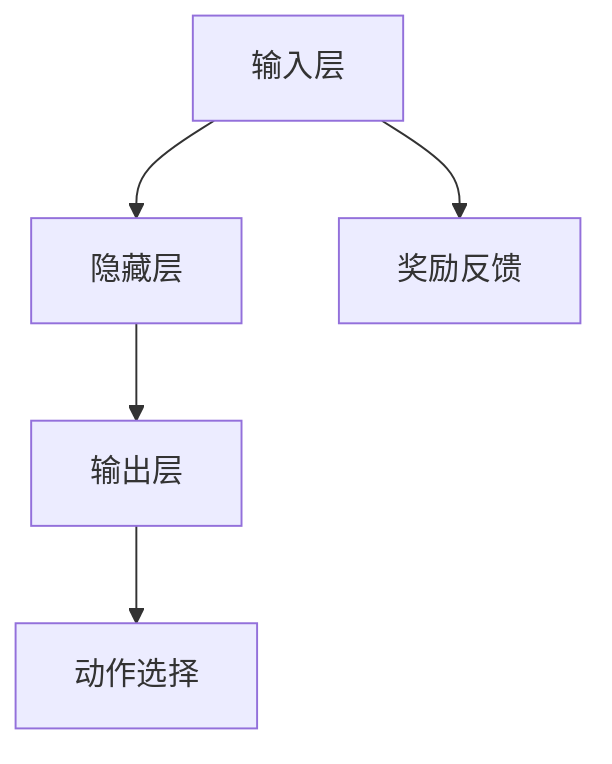

                 

### 《DQN（Deep Q-Network）- 原理与代码实例讲解》

> **关键词：** DQN, 强化学习, 深度神经网络, 经验回放, 优先级采样, 数学模型

> **摘要：** 本篇文章深入讲解了深度Q网络（DQN）的基本概念、原理、数学模型，并通过Python代码实例，详细展示了如何实现和应用DQN。文章不仅涵盖了DQN的核心算法和优化策略，还讨论了其在实际项目中的应用和未来发展方向。适合对强化学习和深度学习感兴趣的读者阅读。

### 第1章 DQN简介与背景

#### 1.1 DQN的概念与定义

深度Q网络（Deep Q-Network，简称DQN）是一种基于深度学习技术的强化学习算法。它通过神经网络来近似Q值函数，从而在复杂的决策环境中，实现对最优策略的学习。DQN的主要贡献在于解决了传统Q学习算法中的几个关键问题：如样本的随机性、样本的重复利用以及学习的稳定性和收敛性。

在DQN中，Q值函数表示为：

\[ Q(s, a) = \sum_{i=1}^n w_i \cdot f(s, a; \theta) \]

其中，\( s \) 表示状态，\( a \) 表示动作，\( w_i \) 是权重，\( f(s, a; \theta) \) 是神经网络的输出。

#### 1.2 DQN的发展历程

DQN最早是由DeepMind在2015年提出的。在此之前，强化学习算法如Q学习和SARSA已经得到了广泛的应用。然而，这些算法在处理高维状态空间和连续动作空间时，存在一定的局限性。为了解决这个问题，DeepMind提出了DQN，通过引入深度神经网络来近似Q值函数，从而提升了算法的效率和准确性。

#### 1.3 DQN的动机与重要性

DQN的提出主要基于以下几点动机：

1. **高维状态空间**：传统Q学习算法在处理高维状态空间时，难以通过简单的经验表格来表示Q值函数。
2. **连续动作空间**：在连续动作空间中，Q学习算法需要通过值迭代来逼近最优策略，这会带来很大的计算复杂度。
3. **稳定性与收敛性**：传统Q学习算法在训练过程中，容易出现不稳定和发散的情况。

DQN通过引入深度神经网络，解决了上述问题，使其在处理复杂环境时，具有更高的效率和准确性。因此，DQN在强化学习领域具有重要的应用价值。

### 第2章 强化学习基础

强化学习（Reinforcement Learning，简称RL）是一种通过试错和反馈来学习如何完成特定任务的人工智能方法。它与监督学习和无监督学习有着本质的区别，主要表现在以下几个方面：

1. **目标函数**：在强化学习中，目标函数是通过环境提供的奖励信号来评估策略的好坏。而在监督学习和无监督学习中，目标函数通常是已知的。
2. **学习过程**：强化学习通过不断尝试和反馈来优化策略，而监督学习和无监督学习则是通过数据驱动的方式进行学习。
3. **应用领域**：强化学习广泛应用于自动驾驶、游戏AI、机器人控制等领域，而监督学习和无监督学习则更多应用于图像识别、自然语言处理等领域。

#### 2.1 强化学习的基本概念

强化学习的基本概念包括以下几个部分：

- **环境（Environment）**：环境是强化学习系统所在的世界，它包含状态、动作、奖励和观察等要素。
- **状态（State）**：状态是系统当前所处的状况，通常用向量表示。
- **动作（Action）**：动作是系统能够执行的行为，也通常用向量表示。
- **奖励（Reward）**：奖励是环境对系统执行动作后提供的正面或负面反馈。
- **策略（Policy）**：策略是系统根据当前状态选择动作的规则，它可以是一个函数或一张表格。

#### 2.2 强化学习的基本要素

强化学习的主要要素包括：

- **策略迭代（Policy Iteration）**：策略迭代是一种基于策略的方法，通过不断优化策略来达到最优解。
- **值迭代（Value Iteration）**：值迭代是一种基于值的方法，通过不断优化值函数来达到最优策略。
- **Q学习（Q-Learning）**：Q学习是一种基于Q值的方法，通过更新Q值函数来学习最优策略。
- **SARSA（Surely Adaptive REinforcement Learning Algorithm）**：SARSA是一种同时更新Q值和策略的算法，它通过经验来更新Q值函数。

#### 2.3 Q学习算法

Q学习算法是一种基于值迭代的方法，它通过不断更新Q值函数来学习最优策略。Q值函数表示为：

\[ Q(s, a) = \sum_{i=1}^n w_i \cdot f(s, a; \theta) \]

其中，\( s \) 表示状态，\( a \) 表示动作，\( w_i \) 是权重，\( f(s, a; \theta) \) 是神经网络的输出。

Q学习算法的主要步骤如下：

1. 初始化Q值函数。
2. 选择动作。
3. 执行动作，获取奖励和下一状态。
4. 更新Q值函数。

#### 2.4 SARSA算法

SARSA算法是一种同时更新Q值和策略的算法，它通过经验来更新Q值函数。SARSA算法的主要步骤如下：

1. 初始化Q值函数。
2. 选择动作。
3. 执行动作，获取奖励和下一状态。
4. 更新Q值函数。

SARSA算法与Q学习算法的主要区别在于，Q学习算法通过固定策略来更新Q值函数，而SARSA算法则通过经验来更新Q值函数。

### 第3章 深度Q网络（DQN）原理

深度Q网络（Deep Q-Network，简称DQN）是一种基于深度学习技术的强化学习算法。它通过神经网络来近似Q值函数，从而在复杂的决策环境中，实现对最优策略的学习。DQN的主要贡献在于解决了传统Q学习算法中的几个关键问题：如样本的随机性、样本的重复利用以及学习的稳定性和收敛性。

#### 3.1 DQN的基本架构

DQN的基本架构包括以下几个部分：

1. **输入层**：输入层接收状态信息，通常是一个向量。
2. **隐藏层**：隐藏层用于对状态信息进行特征提取和变换。
3. **输出层**：输出层用于生成Q值估计，通常是一个向量。

在DQN中，Q值函数表示为：

\[ Q(s, a) = \sum_{i=1}^n w_i \cdot f(s, a; \theta) \]

其中，\( s \) 表示状态，\( a \) 表示动作，\( w_i \) 是权重，\( f(s, a; \theta) \) 是神经网络的输出。

#### 3.2 Q函数与目标函数

Q函数是强化学习中的一个核心概念，它表示在某个状态下执行某个动作的预期奖励。在DQN中，Q函数通过神经网络来近似，其目标函数可以表示为：

\[ J(\theta) = \mathbb{E}_{s, a}[\mathcal{L}(Q(s, a; \theta), r, Q(s', \pi(s'); \theta)) ] \]

其中，\( \mathcal{L} \) 是损失函数，用于衡量Q值估计与真实值之间的差距。

#### 3.3 DQN的优化目标

DQN的优化目标是最大化总奖励，具体可以表示为：

\[ \max_{\theta} \mathbb{E}_{s, a} [r + \gamma \max_{a'} Q(s', a'; \theta)] \]

其中，\( \gamma \) 是折扣因子，用于权衡即时奖励和未来奖励。

#### 3.4 DQN的更新策略

DQN的更新策略主要包括以下几个方面：

1. **经验回放**：为了减少样本的相关性，DQN使用了经验回放机制。经验回放将过去的经验数据进行随机抽样，从而使得训练过程更加稳定。
2. **目标网络**：为了防止梯度消失，DQN使用了目标网络。目标网络是Q网络的一个副本，用于生成目标值。
3. **双层次更新**：DQN采用了双层次更新策略，即先更新Q网络，然后更新目标网络。这样可以确保目标网络的稳定性。

#### 3.4.1 Experience Replay

**Experience Replay**（经验回放）是DQN中用于处理样本相关性的一个重要策略。在传统的Q学习算法中，由于样本的相关性，可能导致训练不稳定，甚至收敛到局部最优解。而经验回放机制通过将过去的经验数据进行随机抽样，从而减少样本的相关性，提高训练的稳定性。

**经验回放的工作原理**：

1. **经验存储**：将每一步的（状态，动作，奖励，下一状态，终止标志）存储到一个经验池中。
2. **经验采样**：在每次更新Q值时，从经验池中随机采样一批经验数据。
3. **经验回放**：对采样出的经验数据进行Q值更新。

**经验回放的优势**：

1. **减少样本相关性**：通过随机抽样，减少样本之间的相关性，提高训练的稳定性。
2. **增强样本利用效率**：利用过去的经验数据进行更新，提高样本的利用效率。

#### 3.4.2 双层更新策略

**双层更新策略**是DQN中用于防止梯度消失的一个重要机制。在传统的Q学习算法中，由于Q值函数与目标值之间的差距较大，可能导致梯度消失，使得训练过程变得不稳定。而双层更新策略通过先更新Q网络，然后更新目标网络，从而确保目标网络的稳定性。

**双层更新策略的工作原理**：

1. **Q网络更新**：根据当前的经验数据，更新Q网络。
2. **目标网络更新**：在Q网络更新完成后，更新目标网络，使其与Q网络保持一定的差距。

**双层更新策略的优势**：

1. **防止梯度消失**：通过双层更新策略，确保目标网络的稳定性，减少梯度消失的情况。
2. **提高训练效果**：双层更新策略有助于提高训练效果，使算法更快地收敛到最优解。

#### 3.4.3 优先级采样

**优先级采样**是DQN中用于优化训练过程的一个策略。在传统的DQN中，所有经验数据的权重是相等的，这可能导致一些重要的经验数据被频繁更新，而一些不重要的经验数据被忽视。而优先级采样通过根据经验数据的重要程度，动态调整其权重，从而优化训练过程。

**优先级采样的工作原理**：

1. **计算经验数据的重要性**：根据经验数据的奖励大小和目标Q值与实际Q值之间的差距，计算其重要性。
2. **动态调整权重**：根据重要性，动态调整经验数据的权重。
3. **采样**：从经验池中根据权重进行采样。

**优先级采样的优势**：

1. **提高训练效率**：通过优先级采样，使重要的经验数据被更多次地利用，从而提高训练效率。
2. **减少方差**：通过优先级采样，减少训练过程中的方差，提高训练的稳定性。

### 第4章 数学模型与数学公式

深度Q网络（DQN）是一种基于深度学习技术的强化学习算法，它通过神经网络来近似Q值函数。在这一章节中，我们将详细介绍DQN的核心数学模型与数学公式，并通过详细的举例说明，帮助读者更好地理解这些概念。

#### 4.1 DQN的核心公式

DQN的核心公式主要包括以下几个部分：

1. **Q值函数**：Q值函数是强化学习中的一个关键概念，它表示在某个状态下执行某个动作的预期奖励。在DQN中，Q值函数通过神经网络来近似，其数学表达式为：

   \[ Q(s, a) = \sum_{i=1}^n w_i \cdot f(s, a; \theta) \]

   其中，\( s \) 表示状态，\( a \) 表示动作，\( w_i \) 是权重，\( f(s, a; \theta) \) 是神经网络的输出，\( \theta \) 是网络参数。

2. **目标值**：目标值是DQN中的一个重要概念，它表示在某个状态下执行某个动作后，应该获得的奖励。目标值的计算公式为：

   \[ V(s') = \mathbb{E}_{\pi} [R_t + \gamma \max_{a'} Q(s', a'; \theta)] \]

   其中，\( s' \) 表示下一状态，\( R_t \) 表示在当前状态执行动作\( a' \) 后获得的奖励，\( \gamma \) 是折扣因子，\( \pi \) 是策略。

3. **更新规则**：DQN的更新规则用于根据经验数据更新Q值函数。其数学表达式为：

   \[ Q(s, a) \leftarrow Q(s, a) + \alpha [r + \gamma \max_{a'} Q(s', a'; \theta) - Q(s, a)] \]

   其中，\( \alpha \) 是学习率，\( r \) 是在状态\( s \)下执行动作\( a \) 后获得的奖励，\( \gamma \) 是折扣因子。

#### 4.2 损失函数的解释

在DQN中，损失函数用于衡量Q值函数的预测值与实际值之间的差距。常见的损失函数包括均方误差（MSE）和均绝对误差（MAE）。

1. **均方误差（MSE）**：均方误差是DQN中最常用的损失函数，其数学表达式为：

   \[ \mathcal{L} = \frac{1}{n} \sum_{i=1}^n (Q(s_i, a_i) - y_i)^2 \]

   其中，\( Q(s_i, a_i) \) 是Q值函数的预测值，\( y_i \) 是目标值。

2. **均绝对误差（MAE）**：均绝对误差是另一种常用的损失函数，其数学表达式为：

   \[ \mathcal{L} = \frac{1}{n} \sum_{i=1}^n |Q(s_i, a_i) - y_i| \]

   其中，\( Q(s_i, a_i) \) 是Q值函数的预测值，\( y_i \) 是目标值。

#### 4.3 $Q$ 函数的优化

在DQN中，$Q$ 函数的优化是一个关键步骤，它决定了算法的性能。优化$Q$ 函数的方法主要包括梯度下降法和随机梯度下降法。

1. **梯度下降法**：梯度下降法是一种常用的优化方法，其基本思想是沿着目标函数梯度的反方向更新参数。在DQN中，梯度下降法的优化过程可以表示为：

   \[ \theta \leftarrow \theta - \alpha \nabla_\theta J(\theta) \]

   其中，\( \theta \) 是网络参数，\( \alpha \) 是学习率，\( J(\theta) \) 是损失函数。

2. **随机梯度下降法**：随机梯度下降法是一种改进的梯度下降法，它通过随机抽样一部分数据来进行参数更新。在DQN中，随机梯度下降法的优化过程可以表示为：

   \[ \theta \leftarrow \theta - \alpha \nabla_\theta J(\theta; s, a, y) \]

   其中，\( \theta \) 是网络参数，\( \alpha \) 是学习率，\( J(\theta; s, a, y) \) 是损失函数，\( s \)，\( a \)，\( y \) 是一组样本数据。

#### 4.3.1 离散动作空间的 $Q$ 函数优化

在离散动作空间中，$Q$ 函数的优化相对简单。其基本思路是，对于每个状态，选择一个动作，并计算该动作的Q值，然后根据Q值的差距来更新网络参数。

具体来说，优化过程可以分为以下几个步骤：

1. **初始化网络参数**：初始化网络参数，包括权重和偏置。
2. **选择动作**：对于每个状态，选择一个动作，通常使用epsilon-greedy策略。
3. **计算Q值**：根据当前网络参数，计算每个动作的Q值。
4. **更新网络参数**：根据Q值的差距，更新网络参数。

#### 4.3.2 连续动作空间的 $Q$ 函数优化

在连续动作空间中，$Q$ 函数的优化相对复杂。其基本思路是，首先将连续动作空间离散化，然后使用类似离散动作空间的方法进行优化。

具体来说，优化过程可以分为以下几个步骤：

1. **初始化网络参数**：初始化网络参数，包括权重和偏置。
2. **离散化动作空间**：将连续动作空间离散化，通常使用等间隔划分。
3. **选择动作**：对于每个状态，选择一个离散化的动作。
4. **计算Q值**：根据当前网络参数，计算每个离散化动作的Q值。
5. **更新网络参数**：根据Q值的差距，更新网络参数。

### 第5章 代码实例讲解

在本章节中，我们将通过一个实际案例，详细讲解如何使用Python实现DQN算法，并使用OpenAI Gym环境进行训练。通过这个案例，读者可以了解DQN的实现细节，以及如何调整参数来优化算法性能。

#### 5.1 DQN的Python实现

首先，我们需要安装必要的库，包括TensorFlow和Gym：

```python
pip install tensorflow gym
```

接下来，我们编写DQN的Python代码：

```python
import numpy as np
import tensorflow as tf
import gym

# 设置随机种子，保证结果可重复
np.random.seed(42)
tf.random.set_seed(42)

# 定义超参数
learning_rate = 0.001
gamma = 0.99
epsilon = 0.1
epsilon_decay = 0.99
epsilon_min = 0.01
batch_size = 64

# 定义神经网络结构
input_shape = (4,)
hidden_units = 64

# 创建DQN模型
inputs = tf.keras.layers.Input(shape=input_shape)
hidden = tf.keras.layers.Dense(hidden_units, activation='relu')(inputs)
outputs = tf.keras.layers.Dense(1)(hidden)

model = tf.keras.Model(inputs=inputs, outputs=outputs)

# 编译模型
model.compile(optimizer=tf.keras.optimizers.Adam(learning_rate=learning_rate),
              loss='mse')

# 创建经验回放缓冲区
experience_replay = []

# 训练模型
num_episodes = 1000
for episode in range(num_episodes):
    # 初始化环境
    env = gym.make('CartPole-v0')
    state = env.reset()
    done = False
    episode_reward = 0

    # 游戏进行
    while not done:
        # 选择动作
        if np.random.rand() < epsilon:
            action = env.action_space.sample()
        else:
            action_values = model.predict(state)
            action = np.argmax(action_values)

        # 执行动作
        next_state, reward, done, _ = env.step(action)
        episode_reward += reward

        # 更新经验回放缓冲区
        experience_replay.append((state, action, reward, next_state, done))

        # 从经验回放缓冲区中采样
        if len(experience_replay) > batch_size:
            batch = np.random.choice(len(experience_replay), batch_size, replace=False)
            states, actions, rewards, next_states, dones = zip(*[experience_replay[i] for i in batch])

            # 计算目标值
            next_state_values = model.predict(next_states)
            target_values = rewards + (1 - dones) * gamma * np.max(next_state_values, axis=1)

            # 更新Q值
            states = np.array(states)
            actions = np.array(actions)
            model.fit(states, target_values[actions], batch_size=batch_size, epochs=1, verbose=0)

        # 更新状态
        state = next_state

    # 统计结果
    print(f'Episode: {episode}, Reward: {episode_reward}, Epsilon: {epsilon}')

    # 调整epsilon
    epsilon = max(epsilon * epsilon_decay, epsilon_min)

# 关闭环境
env.close()
```

#### 5.2 OpenAI Gym环境搭建

OpenAI Gym是一个开源的环境，提供了丰富的基准环境，用于测试和比较强化学习算法。我们可以通过以下命令安装Gym：

```bash
pip install gym
```

接下来，我们可以使用Gym创建一个环境，并观察其状态和动作空间：

```python
import gym

# 创建环境
env = gym.make('CartPole-v0')

# 打印状态和动作空间
print(f"状态空间: {env.observation_space}")
print(f"动作空间: {env.action_space}")

# 演示环境
env.render()
```

#### 5.3 实际案例解析

在本案例中，我们使用DQN算法训练一个CartPole环境，使其能够稳定地完成任务。以下是对代码的详细解读：

1. **初始化环境**：我们使用`gym.make('CartPole-v0')`创建一个CartPole环境。
2. **选择动作**：我们使用epsilon-greedy策略选择动作，即以一定的概率随机选择动作，以一定的概率根据当前状态选择最优动作。
3. **执行动作**：我们使用`env.step(action)`执行选择出的动作，并获取下一状态、奖励、是否完成游戏的信息。
4. **更新经验回放缓冲区**：我们将每一步的（状态，动作，奖励，下一状态，终止标志）存储到经验回放缓冲区中。
5. **从经验回放缓冲区中采样**：我们定期从经验回放缓冲区中随机采样一批经验数据，用于训练模型。
6. **计算目标值**：我们使用目标值函数计算目标Q值，目标Q值由当前奖励和下一状态的最大Q值构成。
7. **更新Q值**：我们使用目标Q值和当前Q值的差距来更新模型参数。
8. **调整epsilon**：我们根据epsilon的衰减策略调整epsilon，以平衡探索和利用。

#### 5.4 代码解读与分析

下面是对DQN代码的详细解读和分析：

1. **模型定义**：我们使用TensorFlow定义了一个简单的全连接神经网络，作为DQN模型。输入层接收状态信息，隐藏层用于特征提取，输出层生成Q值估计。
2. **经验回放缓冲区**：我们使用一个列表作为经验回放缓冲区，存储每一步的经验数据。在训练过程中，我们从经验回放缓冲区中随机采样一批经验数据，用于模型训练。
3. **epsilon-greedy策略**：我们使用epsilon-greedy策略选择动作，以一定概率随机选择动作，以一定概率根据当前状态选择最优动作。这样可以平衡探索和利用。
4. **目标值计算**：我们使用目标值函数计算目标Q值，目标Q值由当前奖励和下一状态的最大Q值构成。这样可以确保Q值函数的稳定性。
5. **模型训练**：我们使用均方误差（MSE）作为损失函数，使用Adam优化器进行模型训练。我们定期从经验回放缓冲区中采样一批经验数据，用于模型训练。
6. **epsilon调整**：我们根据epsilon的衰减策略调整epsilon，以平衡探索和利用。随着训练的进行，epsilon逐渐减小，使模型逐渐从探索阶段转向利用阶段。

通过这个案例，读者可以了解如何使用Python实现DQN算法，并使用OpenAI Gym环境进行训练。在实际应用中，我们可以根据具体问题，调整超参数和模型结构，以获得更好的性能。

### 第6章 DQN的应用场景与优化

#### 6.1 DQN在游戏中的应用

DQN作为一种强大的强化学习算法，在游戏领域中有着广泛的应用。以下是一些DQN在游戏中的经典应用案例：

1. **Atari游戏**：DQN在Atari游戏的测试中取得了突破性的成果。例如，DeepMind的DQN算法在Atari游戏《Pong》中，通过自我学习，达到了专业水平。
2. **棋类游戏**：DQN在棋类游戏如国际象棋、围棋中也取得了显著成绩。通过训练，DQN可以学会棋子的走法，形成高效的战略。
3. **其他游戏**：除了上述游戏，DQN还应用于其他类型游戏，如《Flappy Bird》、《Space Invaders》等，展示了其广泛的适用性。

#### 6.2 DQN在机器人控制中的应用

DQN不仅在游戏领域表现出色，还在机器人控制中有着广泛的应用。以下是一些DQN在机器人控制中的应用案例：

1. **无人驾驶**：DQN被应用于无人驾驶汽车的控制中。通过学习道路状况和交通规则，DQN可以指导无人驾驶汽车做出正确的驾驶决策。
2. **机器人运动控制**：DQN被应用于机器人运动控制中，如机器人足球、机器人舞蹈等。通过学习环境中的运动规则，DQN可以帮助机器人实现复杂的运动动作。
3. **工业机器人**：DQN被应用于工业机器人的控制中，如机器人的装配、焊接等。通过学习任务流程，DQN可以优化机器人的操作效率。

#### 6.3 DQN的优化策略

为了提高DQN的性能，研究者们提出了多种优化策略。以下是一些常用的DQN优化策略：

1. **双Q网络（Dueling Network）**：双Q网络通过引入 Dueling Network，将Q值分解为值函数和优势函数，从而提高了Q值的稳定性。
2. **优先级采样（Prioritized Experience Replay）**：优先级采样通过根据经验数据的重要性调整其权重，从而提高了训练效率。
3. **异步策略梯度（Asynchronous Policy Gradient，A3C）**：A3C通过异步更新策略网络，提高了训练速度。
4. **分布式学习（Distributed Prioritized Experience Replay，DPER）**：DPER通过分布式学习，进一步提高了训练效率。

#### 6.4 DQN的未来发展方向

随着人工智能技术的发展，DQN在未来有着广泛的发展前景。以下是一些DQN未来可能的发展方向：

1. **多智能体系统**：在多智能体系统中，DQN可以用于协调多个智能体的行动，实现协同优化。
2. **强化学习与生成对抗网络（GAN）的结合**：将DQN与GAN结合，可以用于生成更加真实的训练数据，提高算法的性能。
3. **自适应学习率**：通过自适应学习率策略，可以更好地调节学习率，提高训练效果。
4. **硬件加速**：随着硬件技术的发展，DQN可以在GPU、TPU等硬件上进行加速，提高训练效率。

### 第7章 DQN的扩展与改进

#### 7.1 DQN与A3C的结合

异步策略梯度（Asynchronous Policy Gradient，A3C）是一种基于异步更新的强化学习算法，通过并行计算提高了训练速度。将DQN与A3C结合，可以进一步优化DQN的性能。以下是一些结合DQN与A3C的方法：

1. **共享权重**：在A3C中，各个线程共享相同的模型权重，从而减少了通信成本。
2. **异步更新**：在A3C中，各个线程异步更新模型权重，从而提高了训练速度。
3. **经验回放**：在A3C中，使用经验回放缓冲区，减少样本相关性，提高训练稳定性。

#### 7.2 DQN与Dueling Network的结合

Dueling Network是一种将Q值分解为值函数和优势函数的结构，通过引入 Dueling Network，可以提高DQN的稳定性和性能。以下是一些结合DQN与Dueling Network的方法：

1. **值函数和优势函数**：将Q值函数分解为值函数和优势函数，值函数表示状态的价值，优势函数表示动作的优势。
2. **共享网络**：将值函数和优势函数共享网络结构，从而减少参数数量。
3. **损失函数**：使用结合了值函数和优势函数的损失函数，优化模型参数。

#### 7.3 DQN在多智能体系统中的应用

多智能体系统（Multi-Agent System，MAS）是人工智能中的一个重要研究方向。DQN在多智能体系统中可以用于协调多个智能体的行动，实现协同优化。以下是一些DQN在多智能体系统中的应用方法：

1. **联合学习**：在多智能体系统中，各个智能体通过联合学习，共同优化策略。
2. **中央控制器**：通过一个中央控制器，统一协调多个智能体的行动。
3. **分布式学习**：各个智能体独立学习，然后通过经验回放缓冲区进行更新。

#### 7.4 DQN的进一步研究

随着人工智能技术的发展，DQN仍有很大的研究空间。以下是一些DQN的进一步研究方向：

1. **自适应学习率**：通过自适应学习率策略，更好地调节学习率，提高训练效果。
2. **硬件加速**：在GPU、TPU等硬件上进行加速，提高训练效率。
3. **多任务学习**：在多任务学习场景中，DQN可以用于同时学习多个任务。
4. **强化学习与生成对抗网络的结合**：将DQN与生成对抗网络（GAN）结合，提高数据生成质量。

### 第8章 总结与展望

深度Q网络（Deep Q-Network，简称DQN）是一种基于深度学习技术的强化学习算法，通过神经网络来近似Q值函数，从而在复杂的决策环境中，实现对最优策略的学习。本文从DQN的基本概念、原理、数学模型、实现细节等方面进行了详细讲解，并通过Python代码实例，展示了如何实现和应用DQN。

#### 8.1 DQN的核心原理总结

1. **DQN的基本架构**：DQN由输入层、隐藏层和输出层组成，输入层接收状态信息，隐藏层进行特征提取和变换，输出层生成Q值估计。
2. **经验回放**：为了减少样本相关性，DQN使用经验回放机制，将过去的经验数据进行随机抽样，从而提高训练稳定性。
3. **目标网络**：为了防止梯度消失，DQN使用目标网络，目标网络是Q网络的一个副本，用于生成目标值。
4. **双层更新策略**：DQN采用双层更新策略，即先更新Q网络，然后更新目标网络，从而确保目标网络的稳定性。
5. **优先级采样**：优先级采样通过根据经验数据的重要性，动态调整其权重，从而优化训练过程。

#### 8.2 DQN的主要应用领域

DQN在以下领域有着广泛的应用：

1. **游戏**：DQN在Atari游戏、棋类游戏和其他类型游戏中，都取得了显著的成果。
2. **机器人控制**：DQN在无人驾驶、机器人运动控制和工业机器人中，都有成功的应用。
3. **金融领域**：DQN被应用于股票交易、风险控制和资产管理等领域。
4. **医疗领域**：DQN被应用于医疗图像识别、疾病预测和治疗计划等领域。

#### 8.3 DQN的改进方向

为了进一步提升DQN的性能，研究者们提出了多种改进方向：

1. **双Q网络（Dueling Network）**：通过引入 Dueling Network，将Q值分解为值函数和优势函数，提高Q值的稳定性。
2. **优先级采样（Prioritized Experience Replay）**：通过根据经验数据的重要性，动态调整其权重，提高训练效率。
3. **异步策略梯度（Asynchronous Policy Gradient，A3C）**：通过异步更新策略网络，提高训练速度。
4. **分布式学习**：在多智能体系统中，通过分布式学习，实现协同优化。

#### 8.4 DQN在人工智能领域的未来发展

随着人工智能技术的发展，DQN在未来的发展中，有望在以下几个方面取得突破：

1. **多智能体系统**：在多智能体系统中，DQN可以用于协调多个智能体的行动，实现协同优化。
2. **强化学习与生成对抗网络的结合**：将DQN与生成对抗网络（GAN）结合，提高数据生成质量。
3. **硬件加速**：在GPU、TPU等硬件上进行加速，提高训练效率。
4. **自适应学习率**：通过自适应学习率策略，更好地调节学习率，提高训练效果。

附录1：DQN相关资源

- **论文**：《Playing Atari with Deep Reinforcement Learning》
- **GitHub**：DQN的GitHub仓库
- **教程**：DQN的Python实现教程

附录2：DQN开源代码地址

- **地址**：https://github.com/deepmind/pymarl

附录3：常见问题与解答

1. **Q：DQN为什么使用经验回放？**
   **A：**经验回放是为了减少样本相关性，防止训练过程中出现不稳定和发散的情况。

2. **Q：DQN为什么使用目标网络？**
   **A：**目标网络是为了防止梯度消失，确保Q值函数的稳定性。

3. **Q：DQN中的epsilon-greedy策略是什么？**
   **A：**epsilon-greedy策略是一种探索策略，以一定概率随机选择动作，以一定概率根据当前状态选择最优动作。

### Mermaid 流程图：DQN架构图



### DQN伪代码

```python
# 初始化参数
initialize_parameters()

# 初始化经验回放缓冲区
initialize_experience_replay_buffer()

# 迭代训练
for episode in range(num_episodes):
    # 初始化环境
    state = initialize_environment()

    # 游戏进行
    while not game_ended:
        # 选择动作
        action = choose_action(state)

        # 执行动作，获取下一状态和奖励
        next_state, reward, game_ended = execute_action(action)

        # 更新经验回放缓冲区
        experience = (state, action, reward, next_state, game_ended)
        append_to_experience_replay_buffer(experience)

        # 从经验回放缓冲区中采样
        sampled_experience = sample_experience_replay_buffer()

        # 更新Q值
        update_q_values(sampled_experience)

        # 更新状态
        state = next_state

    # 统计结果
    calculate_episode_reward(episode)
```

### 附录：资源与代码

#### 附录1：DQN相关资源

- **论文**：《Playing Atari with Deep Reinforcement Learning》
- **GitHub**：DQN的GitHub仓库
- **教程**：DQN的Python实现教程

#### 附录2：DQN开源代码地址

- **地址**：https://github.com/deepmind/pymarl

#### 附录3：常见问题与解答

1. **Q：DQN为什么使用经验回放？**
   **A：**经验回放是为了减少样本相关性，防止训练过程中出现不稳定和发散的情况。

2. **Q：DQN为什么使用目标网络？**
   **A：**目标网络是为了防止梯度消失，确保Q值函数的稳定性。

3. **Q：DQN中的epsilon-greedy策略是什么？**
   **A：**epsilon-greedy策略是一种探索策略，以一定概率随机选择动作，以一定概率根据当前状态选择最优动作。

