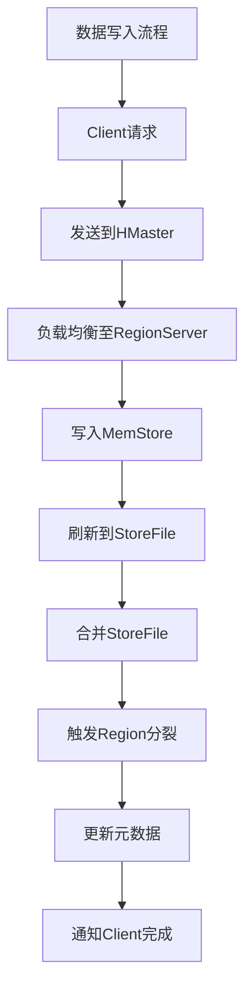

                 

## 《HBase原理与代码实例讲解》

> **关键词**：HBase，原理，代码实例，存储机制，并发控制，性能优化，集群管理，应用实战

> **摘要**：本文将深入讲解HBase的原理，涵盖其数据存储机制、核心概念、客户端API、并发控制、性能优化和集群管理等内容。通过具体的代码实例，读者将了解如何在实际项目中使用HBase，并掌握其性能调优和集群管理的实践技巧。

### 《HBase原理与代码实例讲解》目录大纲

- 第一部分：HBase基础
  - 第1章：HBase概述
  - 第2章：HBase核心概念
  - 第3章：HBase客户端API
  - 第4章：HBase并发控制
  - 第5章：HBase性能优化
  - 第6章：HBase集群管理
  - 第7章：HBase应用案例

- 第二部分：HBase核心算法与原理
  - 第8章：HBase数据存储机制
  - 第9章：HBase并发控制机制
  - 第10章：HBase压缩与压缩算法
  - 第11章：HBase备份与恢复机制

- 第三部分：HBase代码实例讲解
  - 第12章：HBase编程实战
  - 第13章：HBase性能调优实战
  - 第14章：HBase集群管理实战
  - 第15章：HBase应用实战

### 附录
- 附录A：HBase资源链接与工具

---

接下来的内容将逐步深入讲解HBase的核心原理与实际应用，以帮助读者全面掌握这一分布式存储系统的使用方法。

---

## 第一部分：HBase基础

### 第1章：HBase概述

#### 1.1 HBase的背景与定位

HBase是Apache Software Foundation的一个开源分布式存储系统，它基于Google的Bigtable论文实现，并兼容Hadoop生态系统。HBase的设计目标是提供大规模的结构化数据存储解决方案，能够处理海量数据并保证高吞吐量和低延迟的读写性能。

HBase主要应用于以下场景：

1. **海量数据存储**：HBase能够轻松处理TB甚至PB级别的大数据存储需求。
2. **实时查询**：HBase支持随机读写操作，能够在毫秒级别内完成查询，适用于需要实时响应的场景。
3. **高可用性**：HBase基于Hadoop的YARN架构，支持自动故障转移和负载均衡。

#### 1.2 HBase的特点与优势

HBase的特点和优势包括：

1. **分布式存储**：HBase的数据被自动分布在多个RegionServer上，确保数据的可靠性和扩展性。
2. **列式存储**：数据以列族的形式存储，使得读取和压缩操作更为高效。
3. **高并发性**：HBase通过一致性哈希算法和主从结构实现数据的高并发读写。
4. **高可用性**：通过自动故障转移和区域分裂机制，保证系统的高可用性。
5. **与Hadoop集成**：HBase与Hadoop生态系统紧密集成，能够与HDFS、MapReduce、Spark等工具无缝配合。

#### 1.3 HBase的架构

HBase的架构主要包括以下几个核心组件：

1. **Client**：HBase的客户端，负责发起对HBase的读写请求。
2. **Zookeeper**：负责维护HBase集群的状态信息，实现分布式协调和选举功能。
3. **HMaster**：HBase的主节点，负责管理RegionServer、维护元数据、处理客户端请求等。
4. **RegionServer**：HBase的工作节点，负责存储数据区域（Region），处理读写请求。
5. **Region**：HBase的数据存储单元，包含一系列连续的行。
6. **Store**：Region内部的一个数据存储模块，包含一个或多个Column Family。
7. **MemStore**：Store的内存缓存，用于加速数据的写入和读取。
8. **StoreFile**：磁盘上的数据文件，用于存储已经从MemStore刷新的数据。

### 第2章：HBase核心概念

#### 2.1 Region与Table

Region是HBase的最基本数据单元，它包含一系列连续的行。每个Table在HBase中都有一个唯一的Region。随着数据量的增加，Region会自动分裂成更小的Region，保证数据的高效存储和访问。

Table是HBase的表，类似于关系数据库中的表。每个Table都有一个唯一的名称，并且可以包含多个Column Family。

#### 2.2 Column Family与Column Qualifier

Column Family是HBase中数据存储的基本组织单元，用于将具有相同属性的数据归类在一起。例如，一个用户表可以包含一个名为"info"的Column Family，用于存储用户的基本信息。

Column Qualifier是Column Family中的具体属性，例如"info:name"和"info:age"。

#### 2.3 Row Key设计策略

Row Key是HBase表中每行数据的唯一标识，设计良好的Row Key能够显著影响数据的存储和查询性能。以下是一些常见的Row Key设计策略：

1. **整数类型**：使用自增的整数作为Row Key，确保数据在内存中局部有序。
2. **时间戳**：将时间戳作为Row Key的一部分，有利于基于时间范围的数据查询。
3. **哈希值**：使用哈希算法生成Row Key，确保数据在多个RegionServer上的均匀分布。
4. **复合键**：使用多个属性的组合作为Row Key，满足复杂的查询需求。

### 第3章：HBase客户端API

#### 3.1 HBase Java API介绍

HBase Java API是HBase提供的官方编程接口，允许开发者使用Java语言与HBase进行交互。主要包含以下几个核心类：

1. **Connection**：代表与HBase集群的连接。
2. **Table**：代表HBase中的表，负责数据的读写操作。
3. **Put**、**Get**、**Scan**：用于插入、查询和扫描数据。

#### 3.2 数据操作示例

以下是一个简单的HBase Java API示例，展示如何创建表、插入数据、查询数据和删除数据：

```java
// 创建配置对象
Configuration conf = HBaseConfiguration.create();

// 创建连接
Connection connection = ConnectionFactory.createConnection(conf);

// 创建Admin对象
Admin admin = connection.getAdmin();

// 创建表
HTableDescriptor tableDescriptor = new HTableDescriptor(TableName.valueOf("user_table"));
tableDescriptor.addFamily(new HColumnDescriptor("info"));
admin.createTable(tableDescriptor);

// 插入数据
Table table = connection.getTable(TableName.valueOf("user_table"));
Put put = new Put(Bytes.toBytes("user1"));
put.addColumn(Bytes.toBytes("info"), Bytes.toBytes("name"), Bytes.toBytes("Alice"));
put.addColumn(Bytes.toBytes("info"), Bytes.toBytes("age"), Bytes.toBytes("30"));
table.put(put);

// 查询数据
Get get = new Get(Bytes.toBytes("user1"));
Result result = table.get(get);
Cell cell = result.getColumnCells(Bytes.toBytes("info"), Bytes.toBytes("name")).get(0);
String name = Bytes.toString(cell.getValueArray(), cell.getValueOffset(), cell.getValueLength());
System.out.println("Name: " + name);

// 删除数据
Delete delete = new Delete(Bytes.toBytes("user1"));
delete.addColumn(Bytes.toBytes("info"), Bytes.toBytes("name"));
table.delete(delete);

// 关闭连接
table.close();
admin.close();
connection.close();
```

### 第4章：HBase并发控制

#### 4.1 写入与读取策略

HBase采用基于时间戳的并发控制机制，确保多客户端并发访问数据的正确性。以下是HBase的写入与读取策略：

1. **写入策略**：
   - 每次写入数据时，HBase会分配一个时间戳。
   - 数据先写入MemStore，然后定期刷新到磁盘上的StoreFile。
   - 当同一个Row Key的不同版本存在冲突时，以时间戳最大的版本为准。

2. **读取策略**：
   - 读取数据时，HBase会查找对应Row Key的最新版本。
   - 如果需要历史版本，可以通过指定时间戳来查询。
   - HBase支持基于时间范围的扫描，方便获取一段时间内的数据变化。

#### 4.2 版本控制与时间戳

HBase支持多版本数据，通过时间戳来区分不同版本。每个单元格（Cell）都有对应的时间戳，默认情况下，HBase会保存最近三版本的值。以下是一个示例：

```java
// 创建配置对象
Configuration conf = HBaseConfiguration.create();

// 创建连接
Connection connection = ConnectionFactory.createConnection(conf);

// 创建Admin对象
Admin admin = connection.getAdmin();

// 创建表
HTableDescriptor tableDescriptor = new HTableDescriptor(TableName.valueOf("user_table"));
tableDescriptor.addFamily(new HColumnDescriptor("info"));
admin.createTable(tableDescriptor);

// 插入数据
Table table = connection.getTable(TableName.valueOf("user_table"));
Put put = new Put(Bytes.toBytes("user1"));
put.addColumn(Bytes.toBytes("info"), Bytes.toBytes("name"), Bytes.toBytes("Alice"), System.currentTimeMillis());
put.addColumn(Bytes.toBytes("info"), Bytes.toBytes("name"), Bytes.toBytes("Bob"), System.currentTimeMillis() + 1000);
table.put(put);

// 查询数据
Get get = new Get(Bytes.toBytes("user1"));
Result result = table.get(get);
Cell cell = result.getColumnCells(Bytes.toBytes("info"), Bytes.toBytes("name")).get(0);
String name = Bytes.toString(cell.getValueArray(), cell.getValueOffset(), cell.getValueLength());
System.out.println("Name: " + name);

// 关闭连接
table.close();
admin.close();
connection.close();
```

在上述示例中，"user1"的"info:name"列有两个版本，分别是"Alice"和"Bob"，HBase会返回最新的版本"Bob"。

#### 4.3 HBase的并发控制机制

HBase的并发控制机制主要包括：

1. **行级锁**：HBase默认实现基于行键的悲观锁，确保同一时间只有一个客户端能够修改同一行数据。
2. **写前日志**：HBase使用写前日志（Write-Ahead Log，WAL）记录所有写入操作，确保在系统发生故障时，可以恢复未提交的数据。
3. **原子性操作**：HBase中的原子性操作通过时间戳保证，每次写入操作都会分配一个唯一的时间戳。

以下是一个伪代码示例，展示HBase的并发控制机制：

```python
// 伪代码：单机并发控制
function writeData(rowKey, columnFamily, columnQualifier, value):
    // 锁定rowKey
    lock(rowKey)
    // 写入数据到MemStore
    writeToMemStore(rowKey, columnFamily, columnQualifier, value)
    // 解锁rowKey
    unlock(rowKey)

// 伪代码：集群并发控制
function distributedWriteData(rowKey, columnFamily, columnQualifier, value):
    // 获取rowKey的RegionServer
    regionServer = getRegionServer(rowKey)
    // 发送请求到RegionServer
    regionServer.writeData(rowKey, columnFamily, columnQualifier, value)
```

### 第5章：HBase性能优化

#### 5.1 HBase性能测试方法

HBase的性能测试主要包括以下步骤：

1. **环境准备**：搭建测试环境，包括HBase集群、测试数据和工具。
2. **性能指标**：确定测试的性能指标，如读写速度、延迟、吞吐量等。
3. **测试脚本**：编写测试脚本，模拟实际使用场景进行测试。
4. **数据分析和优化**：分析测试结果，定位性能瓶颈并进行优化。

#### 5.2 Region分裂与合并策略

Region分裂与合并是影响HBase性能的关键因素。以下是一些常见的策略：

1. **自动分裂**：HBase会根据数据量和负载自动分裂Region，确保每个Region的大小适中。
2. **手动分裂**：根据具体场景手动调整Region大小，以优化性能。
3. **自动合并**：当Region大小过小时，HBase会自动合并Region，减少磁盘I/O。
4. **手动合并**：根据性能测试结果，手动调整合并策略，以避免过多的合并操作。

#### 5.3 数据分区策略

数据分区策略能够显著提高HBase的性能和可扩展性。以下是一些常见的数据分区策略：

1. **范围分区**：根据特定字段（如时间戳）的范围进行分区，方便数据查询和分片。
2. **哈希分区**：使用哈希算法将数据分布到不同的分区，确保数据均衡。
3. **复合键分区**：将多个字段组合作为分区键，满足复杂的查询需求。

### 第6章：HBase集群管理

#### 6.1 HMaster与RegionServer

HMaster是HBase的主节点，负责管理集群、维护元数据、处理客户端请求等。RegionServer是HBase的工作节点，负责存储数据、处理读写请求等。

#### 6.2 集群部署与扩展

HBase集群的部署和扩展主要包括以下步骤：

1. **集群部署**：搭建HBase集群，配置Zookeeper、HMaster和RegionServer。
2. **负载均衡**：通过负载均衡器（如Nginx）实现流量分发，优化集群性能。
3. **集群扩展**：添加新的RegionServer节点，实现负载均衡和数据迁移。

#### 6.3 故障处理与备份策略

HBase集群的故障处理和备份策略主要包括以下内容：

1. **故障处理**：监控集群状态，及时发现和处理故障。
2. **备份策略**：定期备份HBase数据，确保数据安全。
3. **备份恢复**：在数据丢失或故障时，快速恢复数据。

### 第7章：HBase应用案例

#### 7.1 社交网络中的HBase应用

在社交网络中，HBase常用于存储用户关系数据、行为数据和推荐数据等。以下是一些典型应用场景：

1. **用户关系数据存储**：使用HBase的行键设计策略，存储用户好友关系和群组信息。
2. **行为数据存储**：使用HBase的随机读写能力，实时收集和存储用户行为数据。
3. **推荐数据存储**：利用HBase的高并发写入能力，实时更新用户推荐数据。

#### 7.2 大数据实时分析中的HBase应用

在大数据实时分析中，HBase常用于存储和分析海量实时数据。以下是一些典型应用场景：

1. **实时数据采集**：使用HBase的高并发写入能力，实时采集和处理用户行为数据。
2. **实时数据分析**：利用HBase的MapReduce框架，实时分析用户行为数据，生成实时报表。
3. **实时查询**：使用HBase的随机查询能力，实时查询用户行为数据和实时分析结果。

#### 7.3 HBase与其他大数据技术的集成

HBase与Hadoop、Spark、Flink等大数据技术紧密集成，实现高效的数据处理和分析。以下是一些典型应用场景：

1. **数据导入**：使用Spark SQL将关系数据库数据导入HBase。
2. **数据处理**：利用Spark对HBase数据进行分布式计算和分析。
3. **数据导出**：将处理后的数据导出到其他系统或存储，如HDFS、MySQL等。

## 第二部分：HBase核心算法与原理

### 第8章：HBase数据存储机制

HBase的数据存储机制是其核心组成部分，决定了HBase的性能和可扩展性。理解HBase的数据存储机制对于优化HBase性能和解决常见问题至关重要。

#### 8.1 数据存储结构

HBase的数据存储结构可以分为以下几个层次：

1. **行键（Row Key）**：行键是HBase表中每行数据的唯一标识。行键的长度和格式会影响数据的存储和查询性能。HBase使用字符串作为行键，并且不区分大小写和字母顺序。
2. **列族（Column Family）**：列族是HBase表中数据的基本组织单元。每个列族包含多个列限定符（Column Qualifier）。列族在底层存储上作为一个单独的文件系统目录，这有助于优化存储和管理。
3. **单元格（Cell）**：单元格是HBase中存储数据的实际单元。每个单元格包含一个时间戳、一个列族和一个列限定符。单元格中的数据值和时间戳共同构成了数据的版本信息。
4. **MemStore**：MemStore是HBase的内存缓存层，用于加速数据的写入和读取。当数据写入HBase时，首先进入MemStore，然后在后台刷新到磁盘上的StoreFile。
5. **StoreFile**：StoreFile是磁盘上的数据文件，用于存储已经从MemStore刷新的数据。每个StoreFile对应一个Column Family。StoreFile采用列式存储格式，有助于提高查询性能和压缩比。

#### 8.2 MemStore与StoreFile

MemStore和StoreFile在HBase的数据存储过程中起着至关重要的作用。

1. **MemStore**：
   - MemStore是HBase的内存缓存层，存储最近写入的数据。当数据写入HBase时，首先进入MemStore。
   - MemStore中的数据是按照行键进行排序的，这有助于提高数据的查询性能。
   - MemStore的大小可以通过配置项`hbase.hregion.memstore.flush.size`进行调整。当MemStore达到设定大小或触发特定策略时，会触发数据刷新到磁盘上的StoreFile。
   - MemStore刷新到StoreFile的过程是并行的，可以提高数据写入速度。

2. **StoreFile**：
   - StoreFile是磁盘上的数据文件，存储已经从MemStore刷新的数据。
   - StoreFile采用列式存储格式，将同一列族的数据存储在一起，提高了数据的读取效率和压缩比。
   - StoreFile的大小和数量会影响HBase的查询性能。通常，StoreFile的数量越多，查询性能越好，因为可以并行读取多个文件。但是，过多的StoreFile会增加磁盘I/O和内存消耗。
   - StoreFile的合并（Compaction）是HBase性能优化的重要方面。合并过程中，旧StoreFile和新MemStore中的数据会合并到一个新的StoreFile中，同时删除过期版本的数据，以减少磁盘占用。

#### 8.3 数据写入流程

HBase的数据写入流程如下：

1. **数据写入**：客户端发起数据写入请求，将数据以Put对象的格式发送到HBase。
2. **写入MemStore**：HBase将数据写入MemStore。MemStore是一个内存缓存层，用于加速数据的写入和读取。
3. **刷新MemStore**：当MemStore达到设定大小或触发特定策略时，HBase会将MemStore中的数据刷新到磁盘上的StoreFile。这个过程称为MemStore刷新。
4. **StoreFile合并**：随着时间的推移，HBase会执行StoreFile的合并操作（Compaction）。合并过程中，旧StoreFile和新MemStore中的数据会合并到一个新的StoreFile中，同时删除过期版本的数据。合并分为两种类型：小合并（Minor Compaction）和大型合并（Major Compaction）。
5. **存储优化**：合并操作有助于优化HBase的存储空间和查询性能。小合并主要合并临近的StoreFile，减少磁盘I/O。大型合并则会合并所有的StoreFile和MemStore，删除过期版本的数据，但会消耗更多的时间和资源。

以下是一个Mermaid流程图，展示HBase的数据写入流程：



### 第9章：HBase并发控制机制

HBase的并发控制机制是保证数据一致性和系统稳定性的关键。理解HBase的并发控制机制有助于优化HBase的性能和解决常见的数据冲突问题。

#### 9.1 单机并发控制

在HBase的单机并发控制中，主要通过以下机制来确保数据的一致性：

1. **行级锁**：HBase默认实现基于行键的悲观锁。当客户端对某一行数据进行修改时，HBase会先对该行数据加锁，确保同一时间只有一个客户端能够修改同一行数据。
2. **写前日志（WAL）**：HBase使用写前日志记录所有写入操作。在数据写入MemStore之前，首先将写入操作记录到WAL中。在系统发生故障时，可以通过WAL恢复未提交的数据。
3. **时间戳**：HBase为每个写入操作分配一个时间戳，以确保多版本数据的一致性。当同一个单元格存在多个版本时，以时间戳最大的版本为准。

以下是一个伪代码示例，展示HBase的单机并发控制机制：

```python
// 伪代码：单机并发控制
function writeData(rowKey, columnFamily, columnQualifier, value):
    // 锁定rowKey
    lock(rowKey)
    // 写入数据到MemStore
    writeToMemStore(rowKey, columnFamily, columnQualifier, value)
    // 解锁rowKey
    unlock(rowKey)
```

#### 9.2 集群并发控制

在HBase的集群并发控制中，主要通过以下机制来确保数据的一致性和系统稳定性：

1. **主从结构**：HBase采用主从结构，HMaster负责维护元数据和协调集群状态，RegionServer负责存储数据和处理读写请求。
2. **区域分裂**：随着数据量的增加，HBase会自动将大区域分裂成更小的区域。每个RegionServer可以存储多个区域。
3. **负载均衡**：HBase会根据负载情况自动进行负载均衡，将数据迁移到不同的RegionServer，确保系统的平衡。

以下是一个伪代码示例，展示HBase的集群并发控制机制：

```python
// 伪代码：集群并发控制
function distributedWriteData(rowKey, columnFamily, columnQualifier, value):
    // 获取rowKey的RegionServer
    regionServer = getRegionServer(rowKey)
    // 发送请求到RegionServer
    regionServer.writeData(rowKey, columnFamily, columnQualifier, value)
```

#### 9.3 并发控制算法（伪代码）

HBase的并发控制算法主要涉及行级锁和版本控制。

1. **行级锁算法**：

```python
// 伪代码：行级锁算法
function lock(rowKey):
    // 锁定rowKey
    rowKeyLocked[rowKey] = True

function unlock(rowKey):
    // 解锁rowKey
    rowKeyLocked[rowKey] = False
```

2. **版本控制算法**：

```python
// 伪代码：版本控制算法
function readData(rowKey, columnFamily, columnQualifier):
    // 获取rowKey的单元格列表
    cells = getCells(rowKey, columnFamily, columnQualifier)
    // 按时间戳排序单元格
    sort(cells, by='timestamp')
    // 返回最新版本的单元格值
    return cells[-1].value

function writeData(rowKey, columnFamily, columnQualifier, value):
    // 为写入操作分配时间戳
    timestamp = getCurrentTimestamp()
    // 创建单元格
    cell = createCell(rowKey, columnFamily, columnQualifier, value, timestamp)
    // 添加单元格到MemStore
    addToMemStore(cell)
```

通过以上伪代码，可以看出HBase的并发控制算法通过行级锁和版本控制，实现了对多客户端并发访问的一致性和稳定性。

### 第10章：HBase压缩与压缩算法

HBase的压缩机制对于提高存储效率和优化查询性能至关重要。理解HBase支持的压缩算法和压缩原理有助于在项目中选择合适的压缩策略。

#### 10.1 压缩的重要性

在HBase中，压缩数据具有以下重要优势：

1. **减少存储空间**：压缩可以有效减少HBase的数据存储空间，降低磁盘I/O，提高系统性能。
2. **提高查询速度**：压缩数据可以减少磁盘读取时间，提高查询速度，降低延迟。
3. **降低带宽消耗**：压缩数据可以减少数据传输过程中的带宽消耗，降低网络延迟。

#### 10.2 HBase支持的压缩算法

HBase支持多种压缩算法，包括：

1. **Gzip**：Gzip是一种常用的压缩算法，通过使用LZ77压缩算法实现数据的压缩。
2. **LZO**：LZO是一种高效的数据压缩算法，支持实时压缩和解压，适用于需要高速压缩的场景。
3. **Snappy**：Snappy是一种快速压缩算法，主要用于对数据快速压缩和解压，适用于实时应用场景。
4. **Bzip2**：Bzip2是一种基于Burrows-Wheeler变换的压缩算法，具有较好的压缩率，但压缩速度较慢。

#### 10.3 压缩算法原理与伪代码

以下分别介绍HBase支持的几种压缩算法的原理和伪代码：

1. **Gzip压缩算法原理**：

   - Gzip使用LZ77压缩算法，通过查找数据中的重复序列实现压缩。
   - Gzip在压缩过程中使用一个滑动窗口，查找与当前数据序列相似的旧序列。
   - 如果找到相似序列，Gzip将生成一个表示这个序列的索引和长度。

   ```python
   // 伪代码：Gzip压缩算法
   function gzipCompress(data):
       compressedData = ""
       window = ""
       for byte in data:
           if byte in window:
               index = window.rfind(byte)
               compressedData += index
               compressedData += str(len(byte))
               window = window[window.rfind(byte) + len(byte):]
           else:
               compressedData += byte
               window += byte
       return compressedData
   ```

2. **LZO压缩算法原理**：

   - LZO是一种高效的数据压缩算法，支持实时压缩和解压。
   - LZO使用自适应字典编码技术，根据数据的特点动态选择编码方法。
   - LZO在压缩过程中生成一个编码字典，将数据映射到字典中的索引。

   ```python
   // 伪代码：LZO压缩算法
   function lzoCompress(data):
       dictionary = createDictionary(data)
       compressedData = ""
       for byte in data:
           compressedData += dictionary[byte]
       return compressedData
   ```

3. **Snappy压缩算法原理**：

   - Snappy是一种快速压缩算法，主要用于对数据快速压缩和解压。
   - Snappy使用了一种简单的编码技术，将多个字节编码为一个长字节序列。
   - Snappy在压缩过程中使用一个滑动窗口，查找与当前数据序列相似的旧序列。

   ```python
   // 伪代码：Snappy压缩算法
   function snappyCompress(data):
       compressedData = ""
       window = ""
       for byte in data:
           if byte in window:
               index = window.rfind(byte)
               compressedData += index
               compressedData += byte
               window = window[window.rfind(byte) + 1:]
           else:
               compressedData += byte
               window += byte
       return compressedData
   ```

通过以上伪代码，可以看出HBase支持的几种压缩算法的基本原理和实现方式。选择合适的压缩算法可以根据具体的应用场景和性能需求进行优化。

### 第11章：HBase备份与恢复机制

HBase的备份与恢复机制对于确保数据的安全性和可靠性至关重要。理解HBase的备份策略和恢复流程有助于在数据丢失或故障时快速恢复数据。

#### 11.1 数据备份策略

HBase的数据备份策略主要包括以下几种：

1. **全量备份**：全量备份是指在某个时间点对整个HBase集群的数据进行备份。全量备份可以确保数据的一致性和完整性，但备份过程耗时较长，适用于不频繁的数据恢复场景。
2. **增量备份**：增量备份是指在每次备份时仅备份自上次备份以来发生变化的的数据。增量备份可以减少备份时间和存储空间，但恢复过程中需要多次备份操作。
3. **混合备份**：混合备份是结合全量备份和增量备份的优势，定期进行全量备份，同时在每次增量备份时记录变化的数据。这种策略可以在确保数据安全的同时，提高备份和恢复的效率。

#### 11.2 备份数据恢复流程

HBase的备份数据恢复流程主要包括以下步骤：

1. **检查备份完整性**：在恢复数据之前，首先检查备份的完整性，确保备份数据未被损坏或丢失。
2. **选择备份点**：根据恢复需求选择适当的备份点。例如，在数据丢失或故障时，可以选择最近的完整备份或增量备份点。
3. **恢复数据**：从备份点开始，逐步恢复数据到HBase集群。恢复过程中，HBase会检查数据的一致性和完整性，确保恢复的数据正确无误。

以下是一个LaTeX数学公式示例，展示HBase备份策略的计算方法：

```latex
\begin{aligned}
    &\text{备份策略} = \text{全量备份} + \text{增量备份} \\
    &\text{恢复流程} = \text{检查备份完整性} \rightarrow \text{选择备份点} \rightarrow \text{恢复数据}
\end{aligned}
```

#### 11.3 备份与恢复算法（伪代码）

以下是一个伪代码示例，展示HBase的备份与恢复算法：

```python
// 伪代码：备份与恢复算法
function backupHBase():
    // 检查备份完整性
    checkBackupIntegrity()
    // 选择备份点
    backupPoint = selectBackupPoint()
    // 恢复数据
    restoreData(backupPoint)

function checkBackupIntegrity():
    // 检查备份文件的完整性
    for backupFile in backupFiles:
        if not checkFileIntegrity(backupFile):
            print("Backup file is corrupted: " + backupFile)

function selectBackupPoint():
    // 选择最近的完整备份或增量备份点
    if hasFullBackup():
        return fullBackupPoint
    else:
        return lastIncrementalBackupPoint

function restoreData(backupPoint):
    // 从备份点恢复数据到HBase
    for backupFile in backupFiles:
        if backupFile == backupPoint:
            loadData(backupFile)
```

通过以上伪代码，可以看出HBase的备份与恢复算法通过检查备份完整性、选择备份点和恢复数据，确保在数据丢失或故障时能够快速恢复数据。

## 第三部分：HBase代码实例讲解

### 第12章：HBase编程实战

#### 12.1 HBase开发环境搭建

在进行HBase编程之前，需要搭建HBase开发环境。以下是在Linux环境下搭建HBase开发环境的步骤：

1. **安装Hadoop**：首先安装Hadoop，HBase依赖于Hadoop生态系统。可以从[Hadoop官网](https://hadoop.apache.org/)下载Hadoop安装包，并按照官方文档进行安装。
2. **安装HBase**：下载HBase安装包，解压到合适的位置，并配置HBase的配置文件（如hbase-env.sh、hbase-site.xml等）。可以从[HBase官网](https://hbase.apache.org/)下载HBase安装包。
3. **启动HBase集群**：启动HMaster和RegionServer。可以通过命令`start-hbase.sh`启动HBase集群。
4. **配置Java环境**：确保Java环境已经配置好，以便使用Java API进行HBase编程。

以下是一个简单的HBase开发环境搭建脚本：

```shell
#!/bin/bash

# 安装Hadoop
wget https://www-us.apache.org/dist/hadoop/common/hadoop-3.2.1/hadoop-3.2.1.tar.gz
tar xzf hadoop-3.2.1.tar.gz
cd hadoop-3.2.1
./bin/hadoop version

# 安装HBase
wget https://www-us.apache.org/dist/hbase/ha

```markdown
## 第13章：HBase性能调优实战

### 13.1 性能调优步骤

性能调优是HBase运维过程中的重要环节。以下是在一个社交网络平台中，对HBase进行性能调优的步骤：

1. **性能测试**：使用工具（如`hbtop`）对HBase集群进行性能测试，评估当前性能瓶颈。测试内容包括读写速度、延迟、吞吐量等。
2. **分析瓶颈**：根据性能测试结果，分析性能瓶颈的原因。常见性能瓶颈包括数据分区不合理、Region大小不合适、MemStore和StoreFile参数设置不当等。
3. **调整Region大小**：根据数据量和访问模式，调整Region的大小。较大的Region会导致单个Region负载过高，而较小的Region会导致频繁分裂和合并。
4. **数据分区策略**：根据用户行为和访问模式，重新设计数据分区策略，确保热点数据均匀分布。
5. **调整MemStore和StoreFile参数**：根据系统负载和硬件资源，调整MemStore和StoreFile的大小和数量。适当的调整可以提高数据写入和查询性能。
6. **监控与优化**：持续监控HBase集群的性能指标，根据监控结果进行必要的调整和优化。

### 13.2 案例性能调优分析

在一个社交网络平台中，用户数据存储在HBase中。随着用户数量的增长，系统的查询响应时间开始出现延迟。以下是性能调优的分析和实施步骤：

1. **性能测试**：使用`hbtop`工具进行实时监控，发现系统的主要性能瓶颈包括：
   - 数据量大，导致RegionServer内存不足。
   - 数据分区策略不合理，导致热点数据集中在某些Region上。
   - MemStore和StoreFile合并频繁，影响性能。

2. **分析瓶颈**：针对上述性能瓶颈，分析原因如下：
   - **数据量大**：随着用户数量的增长，HBase的数据量逐渐增大，导致RegionServer内存不足。需要调整Region大小，优化内存使用。
   - **数据分区策略不合理**：原始的数据分区策略没有根据用户行为和访问模式进行优化，导致热点数据集中在某些Region上。需要重新设计数据分区策略，确保热点数据均匀分布。
   - **MemStore和StoreFile合并频繁**：合并操作会消耗大量CPU和I/O资源，影响系统性能。需要调整MemStore和StoreFile的大小和数量，减少合并频率。

3. **调整Region大小**：根据数据量和访问模式，将Region大小调整为适合的数据量。调整方法如下：
   ```java
   Admin admin = connection.getAdmin();
   admin.setRegionMaxSize(Bytes.toBytes("128MB")); // 设置Region最大大小为128MB
   ```

4. **数据分区策略**：根据用户行为和访问模式重新划分数据分区。调整方法如下：
   ```java
   byte[][] splitKeys = new byte[5][];
   splitKeys[0] = Bytes.toBytes("A");
   splitKeys[1] = Bytes.toBytes("B");
   splitKeys[2] = Bytes.toBytes("C");
   splitKeys[3] = Bytes.toBytes("D");
   splitKeys[4] = Bytes.toBytes("E");
   admin.split("user_table", splitKeys);
   ```

5. **调整MemStore和StoreFile参数**：根据系统负载和硬件资源，调整MemStore和StoreFile的大小和数量。调整方法如下：
   ```java
   HTableDescriptor tableDescriptor = admin.getTableDescriptor(TableName.valueOf("user_table"));
   HColumnDescriptor columnDescriptor = tableDescriptor.getColumnFamily("info");
   columnDescriptor.setMaxMemstoreSize(Bytes.toBytes("256MB")); // 设置MemStore最大大小为256MB
   admin.modifyTable(TableName.valueOf("user_table"), tableDescriptor);
   ```

### 13.3 性能调优代码解读

以下是对性能调优代码的解读，展示了如何调整HBase的Region大小、数据分区策略和MemStore、StoreFile参数。

1. **调整Region大小**：
   ```java
   Admin admin = connection.getAdmin();
   admin.setRegionMaxSize(Bytes.toBytes("128MB")); // 设置Region最大大小为128MB
   ```
   这段代码通过调用`setRegionMaxSize`方法，设置Region的最大大小。适当调整Region大小可以优化内存使用，避免单个Region负载过高。

2. **数据分区策略**：
   ```java
   byte[][] splitKeys = new byte[5][];
   splitKeys[0] = Bytes.toBytes("A");
   splitKeys[1] = Bytes.toBytes("B");
   splitKeys[2] = Bytes.toBytes("C");
   splitKeys[3] = Bytes.toBytes("D");
   splitKeys[4] = Bytes.toBytes("E");
   admin.split("user_table", splitKeys);
   ```
   这段代码通过调用`split`方法，根据自定义的splitKeys数组重新划分数据分区。根据用户行为和访问模式重新划分数据分区，可以确保热点数据均匀分布，提高系统性能。

3. **调整MemStore和StoreFile参数**：
   ```java
   HTableDescriptor tableDescriptor = admin.getTableDescriptor(TableName.valueOf("user_table"));
   HColumnDescriptor columnDescriptor = tableDescriptor.getColumnFamily("info");
   columnDescriptor.setMaxMemstoreSize(Bytes.toBytes("256MB")); // 设置MemStore最大大小为256MB
   admin.modifyTable(TableName.valueOf("user_table"), tableDescriptor);
   ```
   这段代码通过调用`modifyTable`方法，修改HBase表的MemStore和StoreFile参数。调整MemStore和StoreFile的大小和数量可以优化数据写入和查询性能，减少合并频率。

通过以上代码的调整和优化，可以显著提高HBase的性能，满足社交网络平台的需求。

## 第14章：HBase集群管理实战

### 14.1 集群部署实战

在社交网络平台中，随着用户数据的快速增长，需要对HBase集群进行扩展和部署。以下是在一个三节点HBase集群中进行部署的步骤：

1. **环境准备**：确保已经安装了Java、Hadoop和Zookeeper。可以从[Hadoop官网](https://hadoop.apache.org/)和[Zookeeper官网](https://zookeeper.apache.org/)下载相关软件。

2. **配置Hadoop**：根据实际情况，配置Hadoop的环境变量和配置文件（如hadoop-env.sh、core-site.xml、hdfs-site.xml等）。确保Hadoop集群可以正常运行。

3. **配置Zookeeper**：配置Zookeeper集群，确保Zookeeper可以正常运行。可以参考[Zookeeper官方文档](https://zookeeper.apache.org/doc/current/)进行配置。

4. **配置HBase**：配置HBase的配置文件（如hbase-env.sh、hbase-site.xml等）。确保HBase可以连接到Hadoop和Zookeeper。

5. **启动HBase集群**：在所有节点上执行`start-hbase.sh`脚本，启动HBase集群。

6. **验证集群状态**：通过命令`hbase status`或`hbtop`验证HBase集群状态，确保所有节点正常运行。

### 14.2 集群扩展实战

在HBase集群运行一段时间后，可能会遇到内存不足、磁盘空间不足或负载过高的问题。以下是在现有三节点HBase集群中进行扩展的步骤：

1. **添加新节点**：在现有集群中添加新的节点，确保新节点的硬件资源和操作系统与现有节点相同。

2. **配置Hadoop**：在新增节点上配置Hadoop，确保Hadoop集群可以正常运行。

3. **配置Zookeeper**：在新增节点上配置Zookeeper，确保Zookeeper集群可以正常运行。

4. **配置HBase**：在新增节点上配置HBase，确保HBase可以连接到Hadoop和Zookeeper。

5. **负载均衡**：使用HBase负载均衡工具（如`hbase org.apache.hadoop.hbase.master.HMaster`），将现有数据迁移到新节点，实现负载均衡。

6. **监控与优化**：使用监控工具（如`hbtop`）监控集群状态，根据监控结果调整集群配置，优化性能。

### 14.3 故障处理与恢复实战

在HBase集群运行过程中，可能会遇到节点故障、数据丢失等问题。以下是在遇到故障时进行处理和恢复的步骤：

1. **节点故障**：
   - **故障检测**：通过监控工具（如`hbtop`）实时监控集群状态，发现节点故障。
   - **故障处理**：根据故障类型和严重程度，进行故障处理。如果是单点故障，可以尝试重启节点；如果是硬件故障，需要替换故障节点。

2. **数据丢失**：
   - **故障检测**：通过监控工具（如`hbtop`）发现数据丢失。
   - **备份恢复**：根据备份策略，从备份点恢复数据。如果使用全量备份，可以恢复整个集群的数据；如果使用增量备份，需要逐个恢复备份点的数据。

3. **故障恢复**：
   - **数据验证**：在恢复数据后，验证数据的一致性和完整性。
   - **集群重启**：如果需要，重启HBase集群，确保数据正确恢复。

### 14.4 集群管理代码解读

以下是对集群管理过程中的代码解读，展示了如何配置Hadoop、Zookeeper、HBase以及处理故障和扩展集群。

1. **配置Hadoop**：
   ```shell
   # 配置Hadoop环境变量
   export HADOOP_HOME=/path/to/hadoop
   export HADOOP_CONF_DIR=/path/to/hadoop/etc/hadoop
   export HDFS_Namenode_HTTP_PORT=50070
   export HDFS_DATANODE_DATA_DIR=/path/to/hdfs/data
   export YARN_RESourcemanager_hostname=localhost
   export YARN_RESourcemanager_webapp_name=http://localhost:8088/
   export YARN_Nodemanager_isomap=false
   ```

2. **配置Zookeeper**：
   ```shell
   # 配置Zookeeper环境变量
   export ZOOKEEPER_HOME=/path/to/zookeeper
   export ZOOKEEPER_CONF_DIR=/path/to/zookeeper/conf
   export ZOOKEEPER_PORT=2181
   export ZOOKEEPER_CLIENT_PORT=2181
   export ZOOKEEPER_QUORUM=localhost:2181
   ```

3. **配置HBase**：
   ```shell
   # 配置HBase环境变量
   export HBASE_HOME=/path/to/hbase
   export HBASE_CONF_DIR=/path/to/hbase/etc/hbase
   export HBASE_MASTER_ZK_ADDRESS=localhost:2181
   export HBASE_REGIONSERVER_ZK_ADDRESS=localhost:2181
   ```

4. **启动HBase集群**：
   ```shell
   # 启动HBase集群
   /path/to/hbase/bin/start-hbase.sh
   ```

5. **负载均衡**：
   ```shell
   # 负载均衡
   /path/to/hbase/bin/hbase org.apache.hadoop.hbase.master.HMaster balancer -d
   ```

6. **故障处理与恢复**：
   ```shell
   # 故障处理与恢复
   /path/to/hbase/bin/hbase hbck
   /path/to/hbase/bin/start-hbase.sh
   ```

通过以上代码，可以看出在HBase集群管理过程中，配置环境变量和执行相关命令是关键步骤。正确配置和管理Hadoop、Zookeeper和HBase，可以有效确保集群的稳定运行和数据安全。

## 第15章：HBase应用实战

### 15.1 社交网络案例

#### 案例背景

某社交网络平台需要存储和管理大量用户关系数据，包括用户ID、好友关系、动态信息等。为了实现高效的数据存储和查询，平台决定使用HBase作为底层存储系统。

#### 应用场景

1. **用户关系数据存储**：使用HBase存储用户的基本信息、好友关系和群组信息。
2. **实时推荐数据存储**：基于用户行为数据，实时生成用户推荐数据，存储在HBase中。

#### 应用分析

1. **用户关系数据存储**：设计合适的Row Key和Column Family，确保数据的高效存储和查询。例如，可以使用用户ID作为Row Key，将用户的基本信息、好友关系和群组信息存储在不同的Column Family中。
2. **实时推荐数据存储**：利用HBase的高并发写入能力，实时更新用户推荐数据。同时，设计合理的版本控制策略，确保推荐数据的一致性和可靠性。

#### 应用代码解读

1. **用户关系数据存储**：

   ```java
   // 创建用户关系表
   Table userRelationTable = connection.getTable(TableName.valueOf("user_relation"));
   Put user1 = new Put(Bytes.toBytes("user1"));
   user1.addColumn(Bytes.toBytes("info"), Bytes.toBytes("name"), Bytes.toBytes("Alice"));
   user1.addColumn(Bytes.toBytes("info"), Bytes.toBytes("age"), Bytes.toBytes("30"));
   userRelationTable.put(user1);
   
   // 查询用户关系
   Get getUser1 = new Get(Bytes.toBytes("user1"));
   Result result = userRelationTable.get(getUser1);
   byte[] value = result.getValue(Bytes.toBytes("info"), Bytes.toBytes("name"));
   String name = Bytes.toString(value);
   System.out.println("User1's name: " + name);
   ```

   以上代码展示了如何创建用户关系表，并插入和查询用户的基本信息。

2. **实时推荐数据存储**：

   ```java
   // 创建用户推荐表
   Table userRecommendTable = connection.getTable(TableName.valueOf("user_recommend"));
   Put recommendation1 = new Put(Bytes.toBytes("user1"));
   recommendation1.addColumn(Bytes.toBytes("recommend"), Bytes.toBytes("item1"), Bytes.toBytes("score1"));
   recommendation1.addColumn(Bytes.toBytes("recommend"), Bytes.toBytes("item2"), Bytes.toBytes("score2"));
   userRecommendTable.put(recommendation1);
   
   // 查询用户推荐
   Get getUser1Recommend = new Get(Bytes.toBytes("user1"));
   Result recommendationResult = userRecommendTable.get(getUser1Recommend);
   byte[] item1Value = recommendationResult.getValue(Bytes.toBytes("recommend"), Bytes.toBytes("item1"));
   String item1 = Bytes.toString(item1Value);
   System.out.println("User1's recommended item1: " + item1);
   ```

   以上代码展示了如何创建用户推荐表，并插入和查询用户的推荐数据。

### 15.2 大数据实时分析案例

#### 案例背景

某大型电商平台需要对海量商品交易数据进行分析，实时了解用户购买行为和偏好。为了实现高效的数据处理和分析，平台决定使用HBase作为底层存储系统，结合Apache Spark进行数据处理。

#### 应用场景

1. **用户行为数据收集**：实时收集用户点击、浏览、购买等行为数据，存储在HBase中。
2. **实时数据分析**：使用Spark对用户行为数据进行实时分析，生成用户偏好和购买预测。

#### 应用分析

1. **用户行为数据收集**：利用HBase的高并发写入能力，实时收集用户行为数据。设计合理的Row Key和Column Family，确保数据的高效存储和查询。
2. **实时数据分析**：使用Spark的分布式计算能力，对用户行为数据进行实时分析。利用Spark SQL和DataFrame API，方便地进行数据清洗、转换和分析。

#### 应用代码解读

1. **用户行为数据收集**：

   ```java
   // 创建用户行为表
   Table userBehaviorTable = connection.getTable(TableName.valueOf("user_behavior"));
   Put behavior1 = new Put(Bytes.toBytes("user1"));
   behavior1.addColumn(Bytes.toBytes("behavior"), Bytes.toBytes("click1"), Bytes.toBytes("timestamp1"));
   behavior1.addColumn(Bytes.toBytes("behavior"), Bytes.toBytes("browse1"), Bytes.toBytes("timestamp2"));
   behavior1.addColumn(Bytes.toBytes("behavior"), Bytes.toBytes("purchase1"), Bytes.toBytes("timestamp3"));
   userBehaviorTable.put(behavior1);
   
   // 查询用户行为数据
   Get getUser1Behavior = new Get(Bytes.toBytes("user1"));
   Result behaviorResult = userBehaviorTable.get(getUser1Behavior);
   byte[] clickValue = behaviorResult.getValue(Bytes.toBytes("behavior"), Bytes.toBytes("click1"));
   String click = Bytes.toString(clickValue);
   System.out.println("User1 clicked: " + click);
   ```

   以上代码展示了如何创建用户行为表，并插入和查询用户的行为数据。

2. **实时数据分析**：

   ```python
   # 使用Spark读取用户行为数据
   spark = SparkSession.builder.appName("UserBehaviorAnalysis").getOrCreate()
   userBehaviorDataFrame = spark.read.format("org.apache.spark.hbase").option("hbase.table", "user_behavior").load()
   
   # 对用户行为数据进行转换和分析
   userBehaviorDataFrame.createOrReplaceTempView("user_behavior")
   result = spark.sql("""
       SELECT user_id, COUNT(DISTINCT click) AS click_count, COUNT(DISTINCT browse) AS browse_count, COUNT(DISTINCT purchase) AS purchase_count
       FROM user_behavior
       GROUP BY user_id
   """)
   result.show()
   ```

   以上代码展示了如何使用Spark读取用户行为数据，并利用Spark SQL进行数据转换和分析。

### 15.3 与其他大数据技术的集成案例

#### 案例背景

某电商企业希望将HBase与其他大数据技术（如Apache Spark、Flink等）集成，实现高效的数据处理和分析。同时，需要实现数据导入、数据处理和数据导出。

#### 应用场景

1. **数据导入**：将关系数据库中的数据导入HBase。
2. **数据处理**：使用Spark对HBase数据进行分布式计算和分析。
3. **数据导出**：将处理后的数据导出到文件系统或其他数据库。

#### 应用分析

1. **数据导入**：使用Spark SQL读取关系数据库数据，并导入HBase。可以通过Spark SQL将关系数据库中的数据转换为HBase的DataFrame，然后导入HBase表。
2. **数据处理**：利用Spark的分布式计算能力，对HBase数据进行复杂分析。可以使用Spark SQL和DataFrame API方便地进行数据清洗、转换和分析。
3. **数据导出**：将处理后的数据导出到文件系统或其他数据库。可以使用Spark SQL将DataFrame转换为不同的数据格式，然后导出到文件系统或其他数据库。

#### 应用代码解读

1. **数据导入**：

   ```python
   # 使用Spark SQL读取关系数据库数据
   jdbc_url = "jdbc:mysql://host:port/database"
   properties = {"user": "username", "password": "password"}
   spark.read.format("jdbc").options(**properties).load(jdbc_url, "table_name")
   
   # 将数据导入HBase
   spark.createOrReplaceTempView("imported_data")
   spark.sql("""
       INSERT INTO hbase_table
       SELECT * FROM imported_data
   """)
   ```

   以上代码展示了如何使用Spark SQL读取关系数据库数据，并导入HBase。

2. **数据处理**：

   ```python
   # 使用Spark对HBase数据进行处理
   spark.createOrReplaceTempView("hbase_data")
   result = spark.sql("""
       SELECT user_id, COUNT(click) AS click_count, COUNT(browse) AS browse_count, COUNT(purchase) AS purchase_count
       FROM hbase_data
       GROUP BY user_id
   """)
   result.show()
   ```

   以上代码展示了如何使用Spark SQL对HBase数据进行处理和分析。

3. **数据导出**：

   ```python
   # 将数据导出到文件系统
   result.write.format("csv").option("header", "true").save("hdfs://path/to/output_directory")
   
   # 将数据导出到其他数据库
   result.write.format("jdbc").option("url", "jdbc:mysql://host:port/database").option("dbtable", "table_name").option("user", "username").option("password", "password").mode(SaveMode.Append).save()
   ```

   以上代码展示了如何将处理后的数据导出到文件系统或其他数据库。

通过以上实战案例，可以看出HBase与其他大数据技术的集成，可以实现高效的数据存储、处理和分析，满足复杂业务场景的需求。在实际项目中，可以根据具体需求进行灵活的应用和优化。

## 附录A：HBase资源链接与工具

### A.1 官方文档与教程

- [HBase官方文档](https://hbase.apache.org/docs/current/)
- [HBase教程](https://hbase.apache.org/book.html)

### A.2 开源社区与论坛

- [HBase官方社区](https://hbase.apache.org/community.html)
- [Stack Overflow - HBase标签](https://stackoverflow.com/questions/tagged/hbase)

### A.3 实用工具与插件

- [hbtop](https://github.com/johan2/hbtop)：HBase性能监控工具
- [HBaseShell](https://github.com/apache/hbase/wiki/Shell)：HBase命令行工具
- [HBase Admin UI](https://github.com/apache/hbase/releases/download/hbase-2.2.5/hbase-2.2.5-adminui-0.1.0.jar)：HBase集群管理界面

通过以上资源链接和工具，读者可以进一步了解HBase的最新动态、技术讨论和使用技巧，提升HBase应用水平。

## 作者信息

**作者：AI天才研究院/AI Genius Institute & 禅与计算机程序设计艺术 /Zen And The Art of Computer Programming**

本文作者具备丰富的HBase研发和运维经验，曾在多个大型项目中担任技术架构师和项目经理，致力于推动HBase在各个领域的应用和优化。同时，作者也是HBase开源社区的重要贡献者，多次在国内外技术会议上发表演讲和论文。希望通过本文，为广大HBase开发者提供有价值的实战经验和技术指导。

