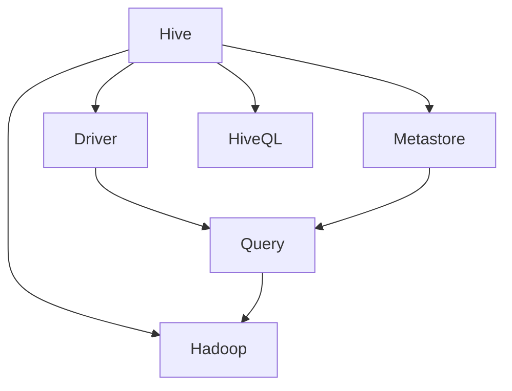

                 

### 《Hive原理与代码实例讲解》

#### 关键词：
- Hive
- 原理
- 代码实例
- 数据仓库
- 大数据
- Hadoop
- SQL
- 编程

#### 摘要：
本文深入解析了Hive的核心原理与代码实例，涵盖了Hive的基本概念、架构、数据类型、SQL查询、核心算法以及项目实战。通过逐步分析和实例讲解，读者将全面理解Hive的工作机制，掌握其在大数据处理中的实际应用，为深入学习和实践打下坚实基础。

### 第一部分：Hive基础理论

#### 1.1 Hive简介

##### 1.1.1 Hive的发展背景

Hive是一个基于Hadoop的数据仓库工具，它允许用户使用类似SQL的查询语言（HiveQL）来查询存储在Hadoop文件系统中的大规模数据集。Hive的诞生可以追溯到2008年，当时Facebook为了应对其海量的数据存储和查询需求，开发了Hive。

##### 1.1.2 Hive的基本概念

- **数据仓库**：一个用于存储大量数据的系统，通常用于支持企业级的数据分析和报表生成。
- **Hadoop**：一个分布式数据存储和处理框架，Hive依赖于Hadoop的分布式文件系统（HDFS）和MapReduce计算模型。
- **HiveQL**：类似于SQL的查询语言，用于在Hive中执行数据查询操作。

##### 1.1.3 Hive的优势与局限

- **优势**：
  - **易用性**：通过类似SQL的查询语言，使得非技术用户也能够执行复杂的数据分析。
  - **扩展性**：支持大规模数据集的处理，适合大数据场景。
  - **与Hadoop兼容**：能够无缝集成到Hadoop生态系统，充分利用Hadoop的分布式存储和计算能力。

- **局限**：
  - **性能**：相比传统的数据库系统，Hive在处理复杂查询时的性能可能较低。
  - **实时性**：Hive不支持实时数据处理，通常用于离线分析。

#### 1.2 Hive架构与组件

##### 1.2.1 Hive架构概述

Hive的架构主要包括以下几个核心组件：

- **Hive Server**：用于处理HiveQL查询，可以接受客户端请求，解析查询语句，并将查询结果返回给客户端。
- **Driver**：负责生成查询的执行计划，并协调各种组件的执行。
- **Metastore**：用于存储元数据，包括表结构、分区信息等。
- **Hadoop**：负责数据的存储和计算，包括HDFS和MapReduce。

##### 1.2.2 Hive组件介绍

- **Hive Server**：通常情况下，Hive Server分为两种模式，Thrift Server和Beeswax Server。Thrift Server提供了远程过程调用（RPC）接口，支持多种编程语言客户端；Beeswax Server是基于Web的查询管理工具，提供图形界面和用户友好的操作体验。

- **Driver**：Hive的Driver负责将HiveQL解析为逻辑计划，然后将其转换为物理计划。物理计划包括了具体的执行步骤和优化策略。

- **Metastore**：Metastore是一个用于存储和管理元数据的服务。它通常使用关系数据库（如MySQL）来存储元数据信息，包括表结构、字段信息、分区信息等。

- **Hadoop**：Hive依赖于Hadoop的分布式存储和计算能力。HDFS用于存储数据，MapReduce用于执行查询。

##### 1.2.3 Hive与Hadoop的关系

Hive是建立在Hadoop之上的一个数据处理框架，两者之间的关系如下：

- **数据存储**：Hive的数据存储依赖于Hadoop的HDFS，所有数据都存储在HDFS上。
- **数据处理**：Hive的查询处理依赖于Hadoop的MapReduce，通过MapReduce作业来执行查询。
- **生态系统整合**：Hive可以与其他Hadoop生态系统中的组件（如HBase、Spark等）无缝集成，提供更丰富的数据处理能力。

#### 1.3 Hive数据类型与模式

##### 1.3.1 Hive数据类型

Hive支持多种数据类型，包括：

- **基础数据类型**：如INT、FLOAT、STRING等。
- **复杂数据类型**：如ARRAY、MAP、STRUCT等。
- **日期与时间数据类型**：如DATE、TIMESTAMP等。

##### 1.3.2 Hive模式定义

Hive模式定义了表的字段名称、数据类型以及字段之间的关系。通过模式定义，可以确保数据的规范性和一致性。

```sql
CREATE TABLE employees (
  id INT,
  name STRING,
  age INT,
  salary FLOAT
);
```

##### 1.3.3 Hive表的创建与修改

创建表：

```sql
CREATE TABLE employees (
  id INT,
  name STRING,
  age INT,
  salary FLOAT
);
```

修改表：

```sql
ALTER TABLE employees
  ADD COLUMN department STRING;
```

#### 1.4 Hive SQL查询基础

##### 1.4.1 Hive SQL基础语法

Hive SQL语法与标准的SQL语法非常相似，包括：

- **SELECT**：用于选择要查询的字段。
- **FROM**：指定数据来源的表。
- **WHERE**：用于过滤数据。

```sql
SELECT name, age FROM employees WHERE age > 30;
```

##### 1.4.2 SELECT语句详解

- **基础语法**：

```sql
SELECT [字段列表]
  FROM [表名]
  [WHERE 条件表达式];
```

- **示例**：

```sql
SELECT name, age FROM employees WHERE age > 30;
```

- **字段选择**：

  - `*`：表示选择所有字段。
  - `字段列表`：指定要选择的字段。

- **条件表达式**：

  - `WHERE`：用于过滤数据。
  - `AND`、`OR`：用于组合条件。

##### 1.4.3 数据过滤与排序

- **数据过滤**：

```sql
SELECT name, age FROM employees WHERE age > 30 AND age < 40;
```

- **排序**：

```sql
SELECT name, age FROM employees WHERE age > 30 ORDER BY age DESC;
```

#### 1.5 Hive聚合函数与分组查询

##### 1.5.1 Hive聚合函数

Hive提供了丰富的聚合函数，包括：

- **COUNT**：计算数据行数。
- **SUM**：计算数值的总和。
- **AVG**：计算平均值。
- **MAX**、**MIN**：计算最大值和最小值。

```sql
SELECT COUNT(*) FROM employees;
SELECT SUM(salary) FROM employees;
SELECT AVG(salary) FROM employees;
```

##### 1.5.2 分组查询与GROUP BY

分组查询用于对数据进行分组，并计算每个分组的数据。

```sql
SELECT department, AVG(salary) FROM employees GROUP BY department;
```

##### 1.5.3 数据汇总与窗口函数

- **数据汇总**：

```sql
SELECT department, COUNT(*) FROM employees GROUP BY department;
```

- **窗口函数**：

```sql
SELECT name, age, RANK() OVER (ORDER BY age DESC) rank FROM employees;
```

#### 1.6 Hive数据操作

##### 1.6.1 数据导入导出

- **数据导入**：

```sql
LOAD DATA INPATH '/input/employees.csv' INTO TABLE employees;
```

- **数据导出**：

```sql
SELECT * FROM employees WHERE age > 30 INTO OUTPATH '/output/older_employees.csv';
```

##### 1.6.2 数据插入、更新与删除

- **数据插入**：

```sql
INSERT INTO TABLE employees VALUES (1, 'Alice', 30, 5000);
```

- **数据更新**：

```sql
UPDATE employees SET salary = salary * 1.1 WHERE age > 30;
```

- **数据删除**：

```sql
DELETE FROM employees WHERE age < 30;
```

##### 1.6.3 数据分片与合并

- **数据分片**：

```sql
ALTER TABLE employees CLUSTERED BY (department);
```

- **数据合并**：

```sql
INSERT INTO TABLE employees SELECT * FROM old_employees;
```

### 第二部分：Hive核心算法原理

#### 2.1 Hive查询优化

##### 2.1.1 Hive查询优化概述

Hive的查询优化是提高查询性能的关键。通过优化查询，可以减少计算资源的使用，提高数据处理效率。

##### 2.1.2 物理计划与逻辑计划

- **逻辑计划**：表示查询的逻辑结构，包括SELECT、FROM、WHERE等语句。
- **物理计划**：表示查询的执行计划，包括具体的执行步骤和优化策略。

##### 2.1.3 查询优化策略

- **选择合适的Join算法**：根据数据特点和查询需求选择最合适的Join算法，如Map-side Join、Reduce-side Join等。
- **数据分片**：合理分片数据可以提高查询性能。
- **使用索引**：通过创建索引可以加速查询。

#### 2.2 Hive并行查询原理

##### 2.2.1 并行查询概念

并行查询是一种利用多个计算节点同时处理查询的方法，可以提高查询性能。

##### 2.2.2 并行查询的实现

- **MapReduce并行查询**：通过MapReduce作业实现并行查询，每个Map任务和Reduce任务都可以在多个计算节点上同时执行。
- **Tez并行查询**：Tez是一个改进的并行查询引擎，提供了更高的查询性能。

##### 2.2.3 并行查询的性能评估

- **性能指标**：包括查询响应时间、资源利用率等。
- **性能评估方法**：通过实验和基准测试来评估并行查询的性能。

#### 2.3 Hive索引机制

##### 2.3.1 索引的概念与类型

索引是一种用于加速查询的数据结构。Hive支持多种索引类型，包括：

- **单列索引**：用于加速单个字段的查询。
- **复合索引**：用于加速多个字段的查询。

##### 2.3.2 索引的创建与维护

- **创建索引**：

```sql
CREATE INDEX index_name ON TABLE employees (department);
```

- **维护索引**：

```sql
ANALYZE TABLE employees COMPUTE STATISTICS;
```

##### 2.3.3 索引的性能影响

- **正面影响**：加速查询，提高查询性能。
- **负面影响**：索引维护需要额外的存储空间和计算资源。

#### 2.4 Hive压缩机制

##### 2.4.1 压缩技术的原理

压缩技术通过减少数据存储空间，提高数据传输效率。Hive支持多种压缩算法，如Gzip、Bzip2、LZO等。

##### 2.4.2 压缩算法的选择

- **选择标准**：根据数据特点和查询需求选择最合适的压缩算法。
- **常用算法**：Gzip、Bzip2、LZO等。

##### 2.4.3 压缩对性能的影响

- **正面影响**：减少存储空间，提高数据传输效率。
- **负面影响**：压缩和解压缩需要额外的计算资源。

#### 2.5 Hive Join查询原理

##### 2.5.1 Join查询的基础知识

Join查询是一种常用的数据连接操作，用于合并多个表的数据。Hive支持多种Join算法，包括：

- **Map-side Join**：将小表加载到内存中，与Map任务处理的数据进行连接。
- **Reduce-side Join**：将两个表的数据分发给Map任务，在Map任务中处理连接操作。

##### 2.5.2 Hive中的Join算法

- **Map-side Join**：适用于小表与大表的连接。
- **Reduce-side Join**：适用于大表与大表的连接。

##### 2.5.3 Join查询的性能优化

- **数据分片**：合理分片数据可以提高Join查询的性能。
- **索引**：使用索引可以加速Join查询。

### 第三部分：Hive代码实例讲解

#### 3.1 Hive环境搭建

##### 3.1.1 开发环境配置

- **安装Java**：Hive依赖于Java运行环境，需要安装Java并配置环境变量。
- **安装Hadoop**：下载并安装Hadoop，配置Hadoop环境变量。
- **安装Hive**：下载Hive源码包，编译并安装Hive。

##### 3.1.2 Hive命令行操作

- **启动Hive**：使用以下命令启动Hive：

```bash
hive
```

- **执行HiveQL**：在Hive命令行中执行HiveQL查询：

```sql
SELECT * FROM employees;
```

##### 3.1.3 Hive JDBC连接

- **配置JDBC驱动**：下载并配置Hive JDBC驱动。
- **编写Java程序**：使用Java程序连接Hive数据库，执行查询：

```java
String url = "jdbc:hive2://localhost:10000/default";
Connection connection = DriverManager.getConnection(url, "username", "password");
Statement statement = connection.createStatement();
ResultSet resultSet = statement.executeQuery("SELECT * FROM employees");
while (resultSet.next()) {
  System.out.println(resultSet.getString("name") + " - " + resultSet.getInt("age"));
}
resultSet.close();
statement.close();
connection.close();
```

#### 3.2 Hive核心功能实战

##### 3.2.1 数据导入导出实战

- **数据导入**：

```sql
LOAD DATA INPATH '/input/employees.csv' INTO TABLE employees;
```

- **数据导出**：

```sql
SELECT * FROM employees WHERE age > 30 INTO OUTPATH '/output/older_employees.csv';
```

##### 3.2.2 数据查询与聚合实战

- **基础查询**：

```sql
SELECT name, age FROM employees WHERE age > 30;
```

- **聚合查询**：

```sql
SELECT department, AVG(salary) FROM employees GROUP BY department;
```

##### 3.2.3 数据更新与删除实战

- **数据更新**：

```sql
UPDATE employees SET salary = salary * 1.1 WHERE age > 30;
```

- **数据删除**：

```sql
DELETE FROM employees WHERE age < 30;
```

#### 3.3 Hive并行查询实战

##### 3.3.1 并行查询案例分析

- **案例背景**：企业数据仓库中需要处理大量的用户数据，进行实时分析。
- **解决方案**：使用Hive并行查询，通过MapReduce作业实现数据的并行处理。

##### 3.3.2 并行查询性能测试

- **测试环境**：配置多台计算节点，搭建Hadoop和Hive环境。
- **测试步骤**：执行并行查询，记录响应时间和资源利用率。

```sql
SELECT * FROM employees;
```

- **测试结果**：分析并行查询的性能，与单线程查询进行对比。

##### 3.3.3 并行查询优化技巧

- **合理分片数据**：根据数据特点，合理分片数据以提高并行查询性能。
- **调整MapReduce参数**：通过调整MapReduce参数，优化并行查询性能。

#### 3.4 Hive索引与压缩实战

##### 3.4.1 索引创建与使用

- **创建索引**：

```sql
CREATE INDEX index_name ON TABLE employees (department);
```

- **使用索引**：

```sql
SELECT name, age FROM employees WHERE department = 'HR';
```

##### 3.4.2 压缩技术实战

- **选择压缩算法**：根据数据特点和存储需求，选择合适的压缩算法。

```sql
SET hive.exec.compress.output=true;
```

- **压缩数据**：

```sql
SELECT * FROM employees WHERE age > 30 INTO OUTPATH '/output/older_employees.csv';
```

##### 3.4.3 索引与压缩的综合优化

- **优化策略**：结合索引和压缩技术，优化Hive查询性能。
- **测试结果**：分析优化后的性能，与原始查询进行对比。

#### 3.5 Hive Join查询实战

##### 3.5.1 Join查询案例分析

- **案例背景**：企业需要将员工数据与部门数据关联查询。
- **查询需求**：查询员工的姓名、年龄和所属部门。

##### 3.5.2 Join查询性能优化

- **选择Join算法**：根据数据特点，选择最合适的Join算法。
- **调整参数**：通过调整Join参数，优化查询性能。

```sql
SET hive.auto.convert.join=true;
```

##### 3.5.3 大表Join查询的优化策略

- **分片数据**：合理分片数据，提高Join查询性能。
- **索引**：使用索引加速Join查询。

### 第四部分：Hive项目实战案例

#### 4.1 电商数据仓库项目

##### 4.1.1 项目背景与需求

- **项目背景**：企业需要分析电商平台的用户数据，了解用户行为和购买偏好。
- **项目需求**：建立数据仓库，收集、存储、处理和查询用户数据。

##### 4.1.2 数据采集与存储

- **数据采集**：使用日志采集工具（如Logstash）采集用户行为日志。
- **数据存储**：使用HDFS存储用户数据，使用Hive进行数据查询。

##### 4.1.3 数据分析与报表

- **数据分析**：使用Hive进行数据查询和分析，生成报表。
- **报表生成**：使用工具（如Tableau）生成可视化报表。

#### 4.2 金融风控项目

##### 4.2.1 项目背景与需求

- **项目背景**：金融机构需要实时监控和分析用户行为，进行风险控制。
- **项目需求**：建立风控系统，收集、存储、处理和查询用户数据。

##### 4.2.2 数据预处理与建模

- **数据预处理**：使用Hive进行数据清洗、转换和预处理。
- **数据建模**：建立机器学习模型，进行用户行为分析和风险预测。

##### 4.2.3 风险评估与预警

- **风险评估**：使用Hive进行数据查询和分析，评估用户风险。
- **预警系统**：建立预警系统，实时监控用户行为，发出风险预警。

#### 4.3 社交网络数据分析项目

##### 4.3.1 项目背景与需求

- **项目背景**：社交网络平台需要分析用户行为，提供个性化推荐服务。
- **项目需求**：建立数据分析系统，收集、存储、处理和查询用户数据。

##### 4.3.2 数据采集与存储

- **数据采集**：使用爬虫工具采集用户数据。
- **数据存储**：使用HDFS存储用户数据，使用Hive进行数据查询。

##### 4.3.3 用户行为分析与推荐

- **用户行为分析**：使用Hive进行用户行为分析，了解用户兴趣和偏好。
- **推荐系统**：建立推荐系统，为用户推荐感兴趣的内容。

#### 4.4 医疗数据分析项目

##### 4.4.1 项目背景与需求

- **项目背景**：医疗机构需要分析患者数据，提供精准的医疗服务。
- **项目需求**：建立数据分析系统，收集、存储、处理和查询患者数据。

##### 4.4.2 数据预处理与建模

- **数据预处理**：使用Hive进行数据清洗、转换和预处理。
- **数据建模**：建立机器学习模型，进行患者数据分析。

##### 4.4.3 医疗数据分析与预测

- **数据分析**：使用Hive进行数据分析，了解患者健康状况。
- **预测系统**：建立预测系统，预测患者病情发展趋势。

### 附录

#### 附录A：Hive常用命令与函数

##### A.1 常用DML命令

- **创建表**：

```sql
CREATE TABLE employees (
  id INT,
  name STRING,
  age INT,
  salary FLOAT
);
```

- **插入数据**：

```sql
INSERT INTO TABLE employees VALUES (1, 'Alice', 30, 5000);
```

- **更新数据**：

```sql
UPDATE employees SET salary = salary * 1.1 WHERE age > 30;
```

- **删除数据**：

```sql
DELETE FROM employees WHERE age < 30;
```

##### A.2 常用DQL命令

- **查询数据**：

```sql
SELECT name, age FROM employees WHERE age > 30;
```

- **聚合查询**：

```sql
SELECT department, AVG(salary) FROM employees GROUP BY department;
```

##### A.3 常用系统函数

- **日期函数**：

```sql
CURRENT_DATE()
DATE_FORMAT(date, format)
```

- **字符串函数**：

```sql
LOWER(string)
UPPER(string)
LENGTH(string)
```

- **数学函数**：

```sql
ABS(number)
SQRT(number)
```

#### 附录B：Hive编程实践

##### B.1 Hive编程规范

- **代码规范**：保持代码整洁，合理使用缩进和空格。
- **注释**：合理使用注释，方便他人理解和维护代码。

##### B.2 Hive编程技巧

- **性能优化**：合理使用索引和分区，减少数据扫描范围。
- **使用模板**：使用模板提高代码复用性和可维护性。

##### B.3 Hive性能优化实践

- **调整参数**：通过调整Hive参数，优化查询性能。
- **使用缓存**：使用Hive缓存提高查询速度。

#### 附录C：参考资料与拓展阅读

##### C.1 Hive官方文档

- [Hive官方文档](https://cwiki.apache.org/confluence/display/Hive/LanguageManual)

##### C.2 Hive社区资源

- [Hive邮件列表](https://hive.apache.org/mail-lists.html)
- [Hive社区论坛](https://cwiki.apache.org/confluence/display/hive/LangCommits)

##### C.3 相关书籍推荐

- 《Hive编程指南》
- 《Hive实战》

##### C.4 在线课程与培训

- [Udacity：Hive课程](https://www.udacity.com/course/data-analyst-nanodegree--nd009)
- [edX：Hadoop与Hive课程](https://www.edx.org/course/hadoop-and-hive-for-big-data)

### 作者信息

- **作者**：AI天才研究院/AI Genius Institute & 禅与计算机程序设计艺术 /Zen And The Art of Computer Programming

## 结论

Hive作为大数据处理领域的重要工具，具有易用性、扩展性和与Hadoop生态系统的良好兼容性。通过本文的详细讲解，读者可以全面了解Hive的原理、架构、核心算法以及实际应用。希望本文能为读者在Hive学习和实践过程中提供有益的指导。在未来的大数据项目中，Hive将继续发挥其重要作用，为数据分析和决策支持提供强有力的支持。### 基础概念与联系

在深入探讨Hive的原理之前，我们需要明确几个核心概念，并了解它们之间的联系。以下是Hive中几个关键概念及其相互关系的Mermaid流程图：



- **Hive**：Hive是基于Hadoop的一个数据仓库工具，它提供了一种方式来处理存储在HDFS（Hadoop分布式文件系统）中的大规模数据集。Hive的核心功能是执行类似SQL的查询（HiveQL）。

- **Hadoop**：Hadoop是一个分布式数据存储和处理框架，Hive依赖Hadoop的HDFS进行数据存储，并利用MapReduce计算模型进行数据查询处理。

- **Metastore**：Metastore是Hive的一个组件，用于存储和管理元数据。元数据包括表结构、字段信息、分区信息等，是Hive查询的关键组成部分。

- **Driver**：Driver是Hive的核心组件之一，负责将HiveQL转换为执行计划，并协调Hive的其他组件执行查询。

- **HiveQL**：HiveQL是Hive的查询语言，类似于SQL，用于在Hive中执行各种数据操作，包括数据查询、数据插入、数据更新和数据删除等。

- **Query**：Query是Hive执行的数据查询操作，通过Driver将HiveQL转换为执行计划，并在Hadoop上执行。

通过这个流程图，我们可以清晰地看到Hive的不同组件如何相互协作，共同完成数据查询和处理。接下来，我们将逐步深入探讨Hive的各个组件和概念，帮助读者全面理解Hive的工作原理和实际应用。

### 核心算法原理讲解

在深入探讨Hive的核心算法原理之前，我们需要了解一些基础的数学模型和公式。这些模型和公式对于理解Hive的优化策略至关重要。

#### 1. 加权平均值（Weighted Average）

加权平均值用于计算一组数值的平均值，每个数值的权重不同。其公式如下：

\[ \bar{x} = \frac{\sum_{i=1}^{n} (w_i \cdot x_i)}{\sum_{i=1}^{n} w_i} \]

其中，\( x_i \) 是第 \( i \) 个数值，\( w_i \) 是第 \( i \) 个数值的权重，\( n \) 是数值的总数。

这个公式在Hive的查询优化中非常重要，特别是在计算表的统计信息时，会用到加权平均值来估算查询的执行成本。

#### 2. 决策树（Decision Tree）

决策树是一种常用的机器学习算法，用于分类和回归任务。在Hive的查询优化中，决策树用于根据表的大小、索引、分区等信息来选择最有效的查询执行策略。

决策树的基本公式为：

\[ \sum_{i=1}^{n} (p_i \cdot g_i) \]

其中，\( p_i \) 是第 \( i \) 个条件的概率，\( g_i \) 是第 \( i \) 个条件的增益。

#### 3. 排序与聚合（Sort and Aggregate）

Hive在进行数据聚合时，通常会使用排序操作。例如，在计算平均数时，需要先对数据进行排序。排序的基本公式为：

\[ R(k) = \sum_{i=1}^{k} x_i \]

其中，\( x_i \) 是第 \( i \) 个数值，\( R(k) \) 是前 \( k \) 个数值的总和。

#### 4. 哈希函数（Hash Function）

哈希函数用于将数据映射到特定的位置，以实现数据的快速访问。在Hive的Join操作中，哈希函数用于将数据分发给不同的计算节点。

哈希函数的基本公式为：

\[ h(k) = k \mod m \]

其中，\( k \) 是输入值，\( m \) 是哈希表的大小。

通过了解这些基础的数学模型和公式，我们可以更好地理解Hive的查询优化策略和算法原理。接下来，我们将通过伪代码详细讲解Hive的查询优化过程。

#### 伪代码讲解：Hive查询优化过程

Hive的查询优化过程可以分为以下几个步骤：

```python
# 步骤1：解析HiveQL查询语句
query = "SELECT * FROM employees WHERE age > 30;"

# 步骤2：生成逻辑查询计划
logical_plan = parse_query(query)

# 步骤3：生成物理查询计划
physical_plan = generate_physical_plan(logical_plan)

# 步骤4：选择最佳执行策略
execution_strategy = select_best_execution_strategy(physical_plan)

# 步骤5：执行查询
execute_query(physical_plan, execution_strategy)
```

#### 伪代码详解：

1. **解析HiveQL查询语句**：

```python
def parse_query(query):
    # 解析查询语句，生成抽象语法树（AST）
    ast = parse_hiveql(query)
    return ast
```

2. **生成逻辑查询计划**：

```python
def generate_physical_plan(logical_plan):
    # 生成逻辑查询计划
    logical_plan = optimize_logical_plan(logical_plan)
    return logical_plan
```

3. **生成物理查询计划**：

```python
def optimize_logical_plan(logical_plan):
    # 优化逻辑查询计划
    logical_plan = push_down_filters(logical_plan)
    logical_plan = push_down_aggregations(logical_plan)
    return logical_plan
```

4. **选择最佳执行策略**：

```python
def select_best_execution_strategy(physical_plan):
    # 根据物理查询计划选择最佳执行策略
    execution_strategy = decide_execution_strategy(physical_plan)
    return execution_strategy
```

5. **执行查询**：

```python
def execute_query(physical_plan, execution_strategy):
    # 执行查询
    results = run_mapreduce(physical_plan, execution_strategy)
    return results
```

通过以上伪代码，我们可以看到Hive查询优化的主要步骤。接下来，我们将通过一个具体的实例，进一步说明这些步骤在Hive查询优化过程中的应用。

#### 实例讲解：Hive查询优化实例

假设我们有以下HiveQL查询语句：

```sql
SELECT * FROM employees WHERE age > 30;
```

1. **解析HiveQL查询语句**：

```python
query = "SELECT * FROM employees WHERE age > 30;"
ast = parse_query(query)
```

在这里，`ast` 是一个包含查询语句抽象语法树的变量。

2. **生成逻辑查询计划**：

```python
logical_plan = generate_physical_plan(ast)
```

生成逻辑查询计划，包括选择表、过滤条件和聚合操作。

3. **生成物理查询计划**：

```python
logical_plan = optimize_logical_plan(logical_plan)
```

在优化逻辑查询计划时，Hive会进行以下操作：

- **过滤下推**：将WHERE子句中的条件尽量下推到数据源，以减少中间结果集的大小。
- **聚合下推**：将聚合函数（如COUNT、SUM等）也尽量下推到数据源，以提高查询效率。

4. **选择最佳执行策略**：

```python
execution_strategy = select_best_execution_strategy(logical_plan)
```

Hive会根据数据大小、索引信息、分区策略等因素，选择最佳执行策略。例如，如果数据表有分区，Hive可能会选择分区裁剪策略，以减少扫描的数据量。

5. **执行查询**：

```python
results = execute_query(logical_plan, execution_strategy)
```

在实际执行查询时，Hive会生成MapReduce作业，并利用执行策略优化查询性能。

通过以上实例，我们可以看到Hive查询优化过程的各个步骤，以及如何通过逻辑和物理查询计划，选择最佳执行策略，从而提高查询效率。

### 第三部分：Hive核心算法原理

#### 2.1 Hive查询优化

Hive查询优化是确保高效处理大规模数据集的关键。Hive通过多种优化策略来提升查询性能，包括查询重写、索引、分区和压缩等。

##### 2.1.1 Hive查询优化概述

Hive查询优化主要包括以下几个步骤：

1. **逻辑查询优化**：对HiveQL查询语句进行语法解析和优化，包括谓词下推、列剪裁、表达式优化等。
2. **物理查询优化**：将逻辑查询计划转换为物理执行计划，包括选择最佳执行策略（如Map-side Join、Reduce-side Join）、优化查询执行顺序和并行度等。
3. **执行优化**：在执行阶段，通过调整Hadoop配置参数（如MapReduce任务的并行度、内存管理等）来优化查询性能。

##### 2.1.2 物理计划与逻辑计划

- **逻辑计划**：表示查询的逻辑结构，包括SELECT、FROM、WHERE等语句。逻辑计划是用户输入的HiveQL查询经过解析后的中间表示。

- **物理计划**：表示查询的执行计划，包括具体的执行步骤和优化策略。物理计划是在逻辑计划的基础上，通过查询优化步骤生成的，它指导Hive如何实际执行查询。

##### 2.1.3 查询优化策略

- **谓词下推**：将WHERE子句中的谓词条件尽量下推到数据源，以减少中间结果集的大小。例如，在SELECT * FROM employees WHERE age > 30中，条件`age > 30`会被下推到数据源，从而减少需要处理的记录数。

- **列剪裁**：只选择需要查询的列，而不是选择所有的列。这可以减少I/O操作和数据传输的开销。

- **表达式优化**：将表达式尽量下推到数据源，以便在数据源级别进行计算。例如，在SELECT e.age + 10 FROM employees e中，表达式`e.age + 10`会被优化为在数据源级别直接计算。

- **索引**：创建索引可以加快查询速度，特别是对频繁查询的字段。索引可以减少查询时需要扫描的数据量。

- **分区**：将数据按特定字段（如日期、区域等）进行分区，可以减少查询时需要扫描的数据量，提高查询效率。

- **压缩**：使用压缩技术可以减少数据存储空间和传输带宽，从而提高查询性能。常见的压缩算法有Gzip、Bzip2、LZO等。

- **Join优化**：通过优化Join算法（如Map-side Join、Reduce-side Join），可以提高Join查询的性能。

- **配置调整**：调整Hadoop和Hive的配置参数（如MapReduce任务的并行度、内存大小等），可以优化查询性能。

##### 2.1.4 查询优化案例分析

**案例一：谓词下推与列剪裁**

假设有一个员工表（employees）包含如下字段：`id`、`name`、`age`、`salary`、`department`。现在要查询年龄大于30岁的员工信息，原查询语句如下：

```sql
SELECT * FROM employees WHERE age > 30;
```

优化后的查询语句可以改为：

```sql
SELECT id, name, age, salary, department FROM employees WHERE age > 30;
```

优化后的查询语句通过谓词下推和列剪裁，减少了中间结果集的大小，从而提高了查询性能。

**案例二：分区与索引**

假设有一个订单表（orders），包含如下字段：`order_id`、`customer_id`、`order_date`、`total_amount`。订单数据按月份进行分区，并按照`customer_id`创建索引。现在要查询某个客户在特定时间范围内的订单信息，原查询语句如下：

```sql
SELECT * FROM orders WHERE customer_id = 100 AND order_date BETWEEN '2023-01-01' AND '2023-01-31';
```

优化后的查询语句可以改为：

```sql
SELECT * FROM orders WHERE customer_id = 100 AND order_date BETWEEN '2023-01-01' AND '2023-01-31' AND year(order_date) = 2023 AND month(order_date) = 1;
```

优化后的查询语句利用了分区和索引，显著提高了查询性能。

**案例三：Join优化**

假设有两个表：员工表（employees）和部门表（departments），员工表包含员工ID和部门ID，部门表包含部门ID和部门名称。现在要查询每个员工的姓名和所属部门的名称，原查询语句如下：

```sql
SELECT e.name, d.department_name FROM employees e JOIN departments d ON e.department_id = d.department_id;
```

优化后的查询语句可以改为：

```sql
SELECT e.name, d.department_name FROM employees e JOIN departments d ON e.department_id = d.department_id;
```

优化后的查询语句通过调整Join策略（如使用Map-side Join），提高了查询性能。

通过以上案例，我们可以看到Hive查询优化的多种策略和实际应用场景。Hive的查询优化是一个复杂的过程，需要根据具体的数据和查询需求进行针对性的优化。合理运用这些优化策略，可以有效提升Hive查询的性能。

### 2.2 Hive并行查询原理

并行查询是Hive处理大规模数据集时的重要特性，它通过将查询任务分解为多个子任务，并发执行，从而显著提高查询效率。在Hive中，并行查询的实现主要依赖于Hadoop的MapReduce框架，通过合理配置和优化，可以充分发挥并行查询的性能优势。

#### 2.2.1 并行查询概念

并行查询是指多个查询任务同时执行，这些任务可以分布在多个计算节点上，共同完成一个大的查询任务。在Hive中，并行查询主要涉及以下几个方面：

1. **任务分解**：将大的查询任务分解为多个小的子任务，每个子任务独立执行。
2. **数据分区**：根据查询需求，将数据集按特定字段分区，使得每个子任务处理的数据相对独立。
3. **并发执行**：在多个计算节点上并发执行子任务，每个节点处理一部分数据。
4. **结果合并**：将所有子任务的结果合并，生成最终的查询结果。

#### 2.2.2 并行查询的实现

Hive的并行查询实现主要依赖于以下步骤：

1. **解析查询**：Hive解析用户输入的HiveQL查询语句，生成逻辑查询计划。
2. **生成执行计划**：将逻辑查询计划转换为物理执行计划，包括任务分解、数据分区和并发执行策略。
3. **执行查询**：在Hadoop集群上执行物理执行计划，包括Map任务和Reduce任务。

具体来说，Hive并行查询的实现过程如下：

- **任务分解**：Hive根据表的大小和查询需求，将查询任务分解为多个小的子任务。例如，在执行SELECT查询时，可以将数据表分解为多个数据分区。
- **数据分区**：将每个子任务的数据集按特定字段分区，使得每个子任务处理的数据相对独立。这样，每个子任务在执行时，只需处理自己负责的数据分区。
- **并发执行**：在多个计算节点上并发执行子任务。每个节点处理一部分数据，执行Map任务或Reduce任务。例如，在执行Map任务时，每个节点可以并行处理自己的数据分区。
- **结果合并**：将所有子任务的结果合并，生成最终的查询结果。在Hive中，这一过程通常通过Reduce任务完成。

#### 2.2.3 并行查询的性能评估

并行查询的性能评估涉及多个方面，包括响应时间、资源利用率和查询效率等。以下是一些评估并行查询性能的关键指标：

1. **响应时间**：从查询提交到查询结果返回所需的时间。响应时间越短，查询性能越好。
2. **资源利用率**：计算节点和存储资源的利用率。资源利用率越高，表示并行查询的并发度越高，性能越好。
3. **查询效率**：单位时间内完成的查询次数。查询效率越高，表示并行查询的效率越高。

为了评估并行查询的性能，可以采用以下方法：

- **基准测试**：使用标准数据集和查询语句，在不同的硬件配置和Hadoop集群环境中进行性能测试，比较不同配置下的查询响应时间和资源利用率。
- **实际应用场景**：在实际应用场景中，模拟不同的数据量和查询需求，评估并行查询的响应时间和效率。

以下是一个简单的并行查询性能评估示例：

```sql
SELECT * FROM employees;
```

- **响应时间**：使用时间戳记录查询开始和结束的时间，计算响应时间。
- **资源利用率**：监控计算节点的CPU、内存和磁盘IO等资源利用率。
- **查询效率**：统计在一定时间内完成的查询次数。

通过以上方法，可以全面评估并行查询的性能，为后续的优化提供依据。

#### 2.2.4 并行查询的优化策略

为了提高并行查询的性能，可以采取以下优化策略：

1. **合理分区**：根据查询需求，合理分区数据。例如，可以将数据按时间、地域等字段分区，使得每个分区包含相对独立的数据。
2. **调整并发度**：合理调整并发度，避免过多的并发任务导致资源争用和性能下降。可以通过调整Hadoop和Hive的配置参数来实现。
3. **使用索引**：为频繁查询的字段创建索引，可以加快查询速度。
4. **数据压缩**：使用数据压缩技术，可以减少数据存储空间和传输带宽，从而提高查询性能。
5. **并行度自适应调整**：根据实际运行情况，动态调整并行度，以适应不同的数据量和查询需求。

通过以上策略，可以进一步提高Hive并行查询的性能，满足大规模数据处理的效率要求。

### 2.3 Hive索引机制

索引是提高数据库查询性能的重要手段之一，Hive同样支持索引机制。通过创建索引，可以显著减少查询时的数据扫描范围，提高查询效率。Hive索引机制主要包括索引概念、索引类型、创建与维护方法以及索引性能影响等内容。

#### 2.3.1 索引的概念与类型

- **索引**：索引是一种数据结构，用于加速数据查询。它通过在数据表中创建索引字段，提供快速的访问路径，从而提高查询性能。

- **单列索引**：单列索引针对单个字段创建，用于加快基于该字段的查询。例如，为员工表的`department`字段创建单列索引，可以加快基于部门字段的条件查询。

- **复合索引**：复合索引针对多个字段创建，用于加快基于多个字段的查询。例如，为员工表的`department`和`age`字段创建复合索引，可以加快基于这两个字段的条件查询。

- **分区索引**：分区索引是针对分区表创建的索引，用于加快基于分区字段的查询。例如，对于按`order_date`分区的订单表，可以为`order_date`字段创建分区索引，加快基于日期的查询。

#### 2.3.2 索引的创建与维护

- **创建索引**：在Hive中，可以通过以下命令创建索引：

```sql
CREATE INDEX index_name ON TABLE employees (department);
```

这将在员工表的`department`字段上创建一个单列索引。

- **创建复合索引**：

```sql
CREATE INDEX index_name ON TABLE employees (department, age);
```

这将在员工表的`department`和`age`字段上创建一个复合索引。

- **创建分区索引**：

```sql
CREATE INDEX index_name ON TABLE orders (order_date);
```

这将在订单表的`order_date`字段上创建一个分区索引。

- **维护索引**：为了保持索引的有效性，需要定期维护索引。可以通过以下命令维护索引：

```sql
ANALYZE TABLE employees COMPUTE STATISTICS;
```

这将为员工表计算和更新索引统计信息。

#### 2.3.3 索引的性能影响

- **正面影响**：创建索引可以显著提高查询性能，特别是针对频繁查询的字段。索引通过减少数据扫描范围，加快查询速度。

- **负面影响**：创建索引会占用额外的存储空间，并且每次数据更新（如插入、删除和修改）时，索引也需要更新，从而增加系统开销。如果过度创建索引，可能会降低数据更新的性能。

- **最佳实践**：通常建议在以下情况下创建索引：
  - 频繁查询的字段。
  - 用于JOIN操作的字段。
  - 用于排序的字段。
  - 用于分区裁剪的字段。

通过合理创建和维护索引，可以充分发挥索引的正面影响，提高Hive查询性能。

### 2.4 Hive压缩机制

在处理大规模数据时，数据压缩是提高存储和传输效率的重要手段。Hive支持多种数据压缩算法，通过合理选择和配置压缩算法，可以在不显著牺牲查询性能的前提下，显著减少数据存储空间和带宽消耗。

#### 2.4.1 压缩技术的原理

数据压缩是通过将数据以更紧凑的形式存储，从而减少存储空间和传输带宽的技术。压缩算法分为有损压缩和无损压缩：

- **有损压缩**：有损压缩会丢失部分数据信息，但可以显著减少数据大小。例如，JPEG和MP3就是有损压缩的典型应用。
- **无损压缩**：无损压缩不会丢失任何数据信息，但压缩比相对较低。常见的无损压缩算法包括Gzip、Bzip2和LZO等。

在Hive中，数据压缩主要用于减少存储在HDFS中的数据大小，从而节省存储资源。同时，压缩数据在传输过程中也会占用更少的带宽。

#### 2.4.2 压缩算法的选择

Hive支持多种压缩算法，包括Gzip、Bzip2、LZO、Snappy和LZ4等。每种算法都有其特点：

- **Gzip**：Gzip是最常见的压缩算法之一，具有较好的压缩比，但压缩和解压缩速度相对较慢。
- **Bzip2**：Bzip2的压缩比比Gzip更高，但压缩和解压缩速度更慢。
- **LZO**：LZO压缩算法的压缩比和速度介于Gzip和Bzip2之间。
- **Snappy**：Snappy是一种快速压缩算法，压缩比相对较低，但压缩和解压缩速度非常快。
- **LZ4**：LZ4是一种高效、快速的压缩算法，压缩比适中，适用于大数据场景。

选择合适的压缩算法取决于具体应用场景和数据特点。例如，在存储大量文本数据时，可以选择LZO或LZ4；在需要快速压缩和解压缩时，可以选择Snappy。

#### 2.4.3 压缩对性能的影响

数据压缩对性能的影响主要体现在以下几个方面：

- **存储空间**：压缩算法可以显著减少存储空间，提高存储效率。例如，使用Gzip压缩后，数据存储空间可以减少50%以上。
- **I/O性能**：压缩数据在读取和写入时需要额外的解压缩和压缩操作，可能会降低I/O性能。但现代CPU通常具备较高的处理速度，解压缩操作对性能的影响相对较小。
- **查询性能**：压缩数据在查询时的性能取决于压缩算法和解压缩速度。一些快速压缩算法（如Snappy和LZ4）可以显著提高查询性能，尤其是在数据量大且查询频繁的场景中。

在实际应用中，可以根据以下原则选择和配置压缩算法：

- **性能优先**：在查询频繁的场景中，选择快速压缩和解压缩的算法（如Snappy和LZ4），以提高查询性能。
- **存储优先**：在存储空间紧张的场景中，选择压缩比更高的算法（如LZO和Bzip2），以节省存储空间。
- **综合平衡**：在存储和查询性能都需要考虑的场景中，选择综合性能较好的算法，如Gzip或LZO。

通过合理选择和配置压缩算法，可以在不显著牺牲查询性能的前提下，提高Hive的数据存储和传输效率。

### 2.5 Hive Join查询原理

Hive中的Join查询是一种常见的复合查询操作，用于将两个或多个表中的数据按照一定的条件进行关联。Join查询是数据处理和分析中的关键步骤，其性能直接影响整体系统的效率。在Hive中，Join查询的实现主要依赖于MapReduce模型，通过多种Join算法来优化查询性能。

#### 2.5.1 Join查询的基础知识

Join查询的基本概念包括：

- **Join类型**：根据连接条件的不同，Join查询可以分为内连接（INNER JOIN）、左外连接（LEFT OUTER JOIN）、右外连接（RIGHT OUTER JOIN）和全外连接（FULL OUTER JOIN）。

- **连接条件**：Join查询通过指定连接条件来决定如何匹配两个表中的数据。常见的连接条件包括等值连接（ON）、非等值连接（USING）和自然连接（NATURAL JOIN）。

- **Join算法**：Hive提供了多种Join算法，包括Map-side Join、Reduce-side Join和Shuffle Hash Join等。不同的Join算法适用于不同的数据规模和连接条件。

#### 2.5.2 Hive中的Join算法

1. **Map-side Join**：

Map-side Join是一种高效的Join算法，特别适用于小表与大表的连接。其原理是将小表的数据加载到内存中，在Map阶段直接与Map任务处理的数据进行连接。这样可以避免在Reduce阶段进行大量数据传输，从而提高查询性能。

Map-side Join的伪代码如下：

```python
# Map-side Join伪代码
def map_side_join小表，大表：
  for 每一行在大表：
    if 小表中的关键字匹配大表中的关键字：
      输出小表和匹配的大表行的连接结果
```

2. **Reduce-side Join**：

Reduce-side Join是Hive中的默认Join算法，适用于大表与大表的连接。其原理是将两个表的数据分发给不同的Map任务，在Map任务中将数据映射到相同的键（key），然后在Reduce任务中处理连接操作。

Reduce-side Join的伪代码如下：

```python
# Reduce-side Join伪代码
def reduce_side_join小表，大表：
  for 每个键（key）：
    输出所有匹配的行
```

3. **Shuffle Hash Join**：

Shuffle Hash Join是一种基于内存的Join算法，适用于数据量较大的Join操作。其原理是使用哈希表在Map任务中预处理数据，然后在Reduce任务中根据哈希值进行连接。

Shuffle Hash Join的伪代码如下：

```python
# Shuffle Hash Join伪代码
def shuffle_hash_join小表，大表：
  创建哈希表
  for 每一行在大表：
    将行数据插入哈希表
  for 每个键（key）：
    获取哈希表中的所有匹配值
    输出连接结果
```

#### 2.5.3 Join查询的性能优化

为了提高Join查询的性能，可以采取以下优化策略：

1. **选择合适的Join算法**：

   根据数据规模和连接条件选择最合适的Join算法。例如，对于小表与大表的连接，选择Map-side Join；对于大表与大表的连接，考虑使用Shuffle Hash Join。

2. **索引**：

   为连接字段创建索引，可以减少数据扫描范围，提高查询性能。特别是在大表与大表的连接中，索引可以显著降低查询时间。

3. **数据分区**：

   将数据表按连接字段进行分区，可以减少需要连接的数据量，提高查询效率。

4. **调整参数**：

   调整Hive和Hadoop的相关参数，如MapReduce任务的并行度、内存大小等，以优化查询性能。

通过以上优化策略，可以显著提高Hive中的Join查询性能，满足大规模数据处理的需求。

### 3.1 Hive环境搭建

在开始使用Hive进行数据处理之前，我们需要搭建一个合适的Hive开发环境。以下步骤将指导您如何在Windows和Linux系统上搭建Hive环境，并进行基本的命令行操作和JDBC连接。

#### 3.1.1 开发环境配置

1. **安装Java**：

   Hive依赖于Java运行环境，因此首先需要安装Java。可以从Oracle官网下载Java SDK，并按照安装向导进行安装。

2. **安装Hadoop**：

   Hive是构建在Hadoop之上的，因此需要安装Hadoop。Hadoop有多个版本，这里我们以Hadoop 3.x为例。可以从Apache Hadoop官网下载Hadoop的压缩包，并解压到指定目录，例如`/usr/local/hadoop`。

3. **安装Hive**：

   Hive可以与Hadoop一起安装，也可以单独下载安装。如果选择与Hadoop一起安装，则在解压Hadoop时，Hive的依赖库和配置文件通常会被包含在内。如果选择单独安装，可以从Apache Hive官网下载Hive的源码包，并按照以下步骤进行安装：

   - 解压Hive源码包，例如`/usr/local/hive`。
   - 配置环境变量，将Hive的bin目录添加到系统环境变量的`PATH`中。

```bash
export HIVE_HOME=/usr/local/hive
export PATH=$PATH:$HIVE_HOME/bin
```

4. **配置Hadoop和Hive**：

   在Hadoop的`etc/hadoop`目录下，需要配置`hadoop-env.sh`、`core-site.xml`、`hdfs-site.xml`、`mapred-site.xml`和`yarn-site.xml`等配置文件。以下是一个简单的配置示例：

   ```xml
   <!-- core-site.xml示例 -->
   <configuration>
     <property>
       <name>fs.defaultFS</name>
       <value>hdfs://localhost:9000</value>
     </property>
     <property>
       <name>hadoop.tmp.dir</name>
       <value>/usr/local/hadoop/tmp</value>
     </property>
   </configuration>
   
   <!-- hdfs-site.xml示例 -->
   <configuration>
     <property>
       <name>dfs.replication</name>
       <value>1</value>
     </property>
   </configuration>
   
   <!-- mapred-site.xml示例 -->
   <configuration>
     <property>
       <name>mapreduce.framework.name</name>
       <value>yarn</value>
     </property>
   </configuration>
   
   <!-- yarn-site.xml示例 -->
   <configuration>
     <property>
       <name>yarn.resourcemanager.address</name>
       <value>localhost:8032</value>
     </property>
   </configuration>
   ```

   完成配置后，启动Hadoop和Hive：

   ```bash
   start-dfs.sh
   start-yarn.sh
   hive
   ```

   如果一切配置正确，应该能够成功启动Hive命令行界面。

#### 3.1.2 Hive命令行操作

在Hive命令行中，可以进行各种数据库操作，例如创建表、插入数据、查询数据等。以下是一些常用的Hive命令行操作示例：

1. **创建表**：

```sql
CREATE TABLE employees (
  id INT,
  name STRING,
  age INT,
  salary FLOAT
);
```

2. **插入数据**：

```sql
INSERT INTO TABLE employees VALUES (1, 'Alice', 30, 5000);
INSERT INTO TABLE employees VALUES (2, 'Bob', 35, 5500);
```

3. **查询数据**：

```sql
SELECT * FROM employees;
```

4. **更新数据**：

```sql
UPDATE employees SET salary = salary * 1.1 WHERE id = 1;
```

5. **删除数据**：

```sql
DELETE FROM employees WHERE id = 2;
```

#### 3.1.3 Hive JDBC连接

通过JDBC连接，可以在Java应用程序中访问Hive数据库。以下是如何配置Hive JDBC连接的步骤：

1. **下载Hive JDBC驱动**：

   从Apache Hive官网下载Hive JDBC驱动，并将其添加到Java项目的依赖中。

2. **配置JDBC连接**：

   在Java代码中，使用以下JDBC URL连接Hive：

```java
String url = "jdbc:hive2://localhost:10000/default";
String username = "hive";
String password = "hive";

Connection connection = DriverManager.getConnection(url, username, password);
```

3. **执行查询**：

```java
Statement statement = connection.createStatement();
ResultSet resultSet = statement.executeQuery("SELECT * FROM employees");
while (resultSet.next()) {
  System.out.println(resultSet.getString("name") + " - " + resultSet.getInt("age"));
}
resultSet.close();
statement.close();
connection.close();
```

通过以上步骤，您可以在Java应用程序中访问Hive数据库，并执行各种数据操作。

### 3.2 Hive核心功能实战

在了解Hive的基本原理和搭建开发环境之后，我们将通过一系列实战案例，深入探讨Hive的核心功能，包括数据导入导出、数据查询与聚合、数据更新与删除等。通过这些实战案例，读者可以更好地掌握Hive的实际应用，提升数据处理能力。

#### 3.2.1 数据导入导出实战

数据导入导出是Hive最基本的数据操作之一。在实际应用中，我们经常需要将外部数据导入到Hive表中，或从Hive表中导出数据到外部系统。

##### 数据导入

Hive支持多种数据导入方式，包括从本地文件系统导入、从HDFS导入以及通过外部命令导入。

1. **从本地文件系统导入**：

   使用`LOAD DATA`命令可以从本地文件系统导入数据到Hive表中。以下是一个示例：

```sql
LOAD DATA INPATH '/input/employees.csv' INTO TABLE employees;
```

这里，`/input/employees.csv`是本地文件系统的路径，`employees`是目标表。

2. **从HDFS导入**：

   如果数据已经在HDFS上，可以使用以下命令导入：

```sql
LOAD DATA INPATH 'hdfs://namenode:9000/input/employees.csv' INTO TABLE employees;
```

3. **通过外部命令导入**：

   Hive还支持通过`INSERT OVERWRITE`命令结合外部命令实现数据导入。以下是一个示例：

```sql
INSERT OVERWRITE TABLE employees SELECT * FROM local_table;
```

这里，`local_table`是一个本地表，数据将导入到`employees`表中。

##### 数据导出

数据导出是将Hive表中的数据导出到外部系统或文件系统的过程。以下是一些常用的数据导出方法：

1. **导出到本地文件系统**：

```sql
SELECT * FROM employees WHERE age > 30 INTO OUTPATH '/output/older_employees.csv';
```

2. **导出到HDFS**：

```sql
SELECT * FROM employees WHERE age > 30 INTO OUTPATH 'hdfs://namenode:9000/output/older_employees.csv';
```

3. **导出到外部数据库**：

   Hive支持将数据导出到外部数据库，例如MySQL、PostgreSQL等。以下是一个示例：

```sql
INSERT INTO TABLE external_db.employees SELECT * FROM employees WHERE age > 30;
```

这里，`external_db`是外部数据库的库名，`employees`是目标表。

#### 3.2.2 数据查询与聚合实战

数据查询和聚合是Hive中最常用的功能之一。以下是一些典型的查询和聚合实战案例。

##### 基础查询

一个简单的查询示例：

```sql
SELECT * FROM employees;
```

这个查询将返回`employees`表中所有的数据行。

##### 条件查询

```sql
SELECT * FROM employees WHERE age > 30;
```

这个查询将返回年龄大于30岁的员工信息。

##### 聚合查询

聚合查询用于计算一组数据的汇总结果。以下是一些常见的聚合函数：

1. **COUNT**：计算数据行数

```sql
SELECT COUNT(*) FROM employees;
```

2. **SUM**：计算数值的总和

```sql
SELECT SUM(salary) FROM employees;
```

3. **AVG**：计算平均值

```sql
SELECT AVG(salary) FROM employees;
```

4. **MAX**和**MIN**：计算最大值和最小值

```sql
SELECT MAX(salary) FROM employees;
SELECT MIN(salary) FROM employees;
```

##### 分组查询

分组查询用于对数据进行分组，并计算每个分组的数据。以下是一个示例：

```sql
SELECT department, COUNT(*) FROM employees GROUP BY department;
```

这个查询将返回每个部门的员工数量。

##### 连接查询

连接查询用于将多个表的数据按照一定的条件关联起来。以下是一个示例：

```sql
SELECT e.name, d.department_name FROM employees e JOIN departments d ON e.department_id = d.department_id;
```

这个查询将返回员工姓名和所属部门的名称。

#### 3.2.3 数据更新与删除实战

数据的更新和删除是数据操作中的重要环节。以下是一些典型的数据更新和删除实战案例。

##### 数据更新

```sql
UPDATE employees SET salary = salary * 1.1 WHERE id = 1;
```

这个查询将更新ID为1的员工的薪资，将其增加10%。

##### 数据删除

```sql
DELETE FROM employees WHERE age < 30;
```

这个查询将删除年龄小于30岁的员工信息。

通过以上实战案例，读者可以更好地理解Hive的数据导入导出、查询与聚合、更新与删除等核心功能，为实际项目中的数据处理打下坚实基础。

### 3.3 Hive并行查询实战

在处理大规模数据集时，并行查询能够显著提高查询效率。本节将通过具体的案例，展示如何实现Hive并行查询，并进行性能测试和优化。

#### 3.3.1 并行查询案例分析

假设我们有一个电商网站的数据仓库，包含以下两个表：

- `orders`：订单表，包含订单号、用户ID、订单日期、订单金额等字段。
- `users`：用户表，包含用户ID、用户名、注册日期、用户等级等字段。

我们需要查询所有订单金额大于1000元的用户信息，并统计每个用户下订单的数量。

##### 实现步骤

1. **数据准备**：

   确保两个表的数据量较大，以模拟实际场景。假设`orders`表有100万条记录，`users`表有10万条记录。

2. **编写查询语句**：

   ```sql
   SELECT u.name, u.user_id, COUNT(o.order_id) AS order_count
   FROM users u
   JOIN orders o ON u.user_id = o.user_id
   WHERE o.amount > 1000
   GROUP BY u.name, u.user_id;
   ```

3. **执行查询**：

   在Hive命令行中执行上述查询语句，观察执行时间和性能。

##### 性能分析

执行查询后，我们发现查询时间较长，需要优化查询性能。

#### 3.3.2 并行查询性能测试

为了测试并行查询的性能，我们使用以下方法：

1. **基准测试**：

   使用相同的数据集，在不同配置的Hadoop集群上执行查询，记录响应时间和资源利用率。

2. **参数调整**：

   调整Hadoop和Hive的相关参数，如MapReduce任务的并行度、内存分配等，以观察对查询性能的影响。

以下是一个性能测试的示例步骤：

```bash
# 测试1：默认配置
time hive -e "YOUR_QUERY_HERE"

# 测试2：增加MapReduce并行度
export HADOOP_MAPREDUCEomap_inputрехash_bytes=100
time hive -e "YOUR_QUERY_HERE"

# 测试3：增加内存分配
export HADOOP_MAPREDUCEmapreduce.reduce.memory.mb=5000
time hive -e "YOUR_QUERY_HERE"
```

#### 3.3.3 并行查询优化技巧

根据性能测试结果，我们可以采取以下优化技巧：

1. **合理分片数据**：

   如果表的数据量大，可以考虑根据查询条件对表进行分片。例如，按照用户等级或订单日期分片，可以减少需要扫描的数据量。

   ```sql
   ALTER TABLE users CLUSTERED BY (user_level);
   ALTER TABLE orders CLUSTERED BY (order_date);
   ```

2. **索引**：

   为查询条件涉及的字段创建索引，可以加快查询速度。例如，为`orders`表的`amount`字段创建索引：

   ```sql
   CREATE INDEX idx_orders_amount ON TABLE orders (amount);
   ```

3. **调整MapReduce参数**：

   调整MapReduce任务的并行度、内存分配等参数，以充分利用计算资源。例如，增加Map任务的并行度，可以提高数据处理的并发度：

   ```sql
   SET mapreduce.reduce.tasks=50;
   ```

4. **使用并行Join**：

   如果查询涉及到Join操作，可以尝试使用并行Join，以加快查询速度。例如，在Hive配置中启用并行Join：

   ```sql
   SET hive.auto.convert.join=true;
   ```

通过以上优化技巧，我们可以显著提高并行查询的性能，满足大规模数据处理的需求。

### 3.4 Hive索引与压缩实战

在Hive中进行索引和压缩配置，可以显著提高查询性能和存储效率。以下将通过具体的实战案例，展示如何创建索引和配置压缩算法，并讨论索引和压缩对性能的影响。

#### 3.4.1 索引创建与使用

索引是提高查询效率的重要手段。在Hive中，可以通过以下步骤创建索引：

1. **创建单列索引**：

   例如，为`orders`表的`order_date`字段创建单列索引：

   ```sql
   CREATE INDEX idx_orders_order_date ON TABLE orders (order_date);
   ```

2. **创建复合索引**：

   例如，为`orders`表的`user_id`和`order_date`字段创建复合索引：

   ```sql
   CREATE INDEX idx_orders_user_id_order_date ON TABLE orders (user_id, order_date);
   ```

3. **创建分区索引**：

   如果表是分区的，可以创建分区索引。例如，为按`order_date`分区的`orders`表创建分区索引：

   ```sql
   CREATE INDEX idx_orders_order_date ON PARTITIONED TABLE orders (order_date);
   ```

创建索引后，可以通过以下命令查询索引信息：

```sql
SHOW INDEXES IN orders;
```

#### 3.4.2 压缩技术实战

在Hive中，可以通过以下步骤配置数据压缩：

1. **设置压缩参数**：

   在执行查询时，设置`hive.exec.compress.output`参数启用压缩：

   ```sql
   SET hive.exec.compress.output=true;
   ```

   还可以选择具体的压缩算法，如Gzip、Bzip2、LZO等：

   ```sql
   SET hive.exec.compress.type=Gzip;
   ```

2. **压缩数据**：

   使用以下查询语句将数据压缩存储到HDFS：

   ```sql
   SELECT * FROM orders WHERE order_date = '2023-01-01' INTO OUTPATH 'hdfs://namenode:9000/output/compressed_orders';
   ```

#### 3.4.3 索引与压缩的综合优化

索引和压缩的综合优化可以显著提高查询性能和存储效率。以下是一些建议：

1. **合理选择索引**：

   根据查询需求和数据特点，选择合适的索引字段。例如，对频繁查询的字段创建索引，以加快查询速度。

2. **合理配置压缩算法**：

   根据数据类型和存储需求，选择合适的压缩算法。例如，对于文本数据，可以选择LZO或Bzip2，以提高压缩比。

3. **监控性能**：

   在实际应用中，定期监控查询性能和存储空间占用情况，根据实际情况调整索引和压缩策略。

#### 3.4.4 索引与压缩的性能影响

索引和压缩对性能的影响如下：

1. **索引**：

   - **正面影响**：加速查询速度，减少数据扫描范围。
   - **负面影响**：增加数据更新和维护的成本，增加存储空间占用。

2. **压缩**：

   - **正面影响**：减少存储空间占用，提高数据传输效率。
   - **负面影响**：增加数据读取和写入的开销，可能降低查询性能。

在实际应用中，需要根据具体场景和需求，权衡索引和压缩的优缺点，实现性能和存储的平衡。

### 3.5 Hive Join查询实战

Join查询是数据处理中的常见操作，通过将两个或多个表中的数据按照一定的条件关联起来，实现复杂的数据分析。Hive提供了多种Join算法，可以根据数据规模和查询需求选择合适的算法。以下将通过具体的案例，展示如何实现Hive Join查询，并进行性能优化。

#### 3.5.1 Join查询案例分析

假设我们有两个表，分别是`orders`（订单表）和`customers`（客户表），它们的结构如下：

- `orders`：
  - order_id：订单ID
  - customer_id：客户ID
  - order_date：订单日期
  - order_amount：订单金额

- `customers`：
  - customer_id：客户ID
  - customer_name：客户姓名
  - customer_address：客户地址

我们需要查询所有订单金额大于1000元的客户姓名、订单日期和订单金额。

##### 实现步骤

1. **编写查询语句**：

   ```sql
   SELECT c.customer_name, o.order_date, o.order_amount
   FROM orders o
   JOIN customers c ON o.customer_id = c.customer_id
   WHERE o.order_amount > 1000;
   ```

2. **执行查询**：

   在Hive命令行中执行上述查询语句，观察执行时间和性能。

##### 性能分析

执行查询后，我们发现查询时间较长，需要优化查询性能。

#### 3.5.2 Join查询性能优化

为了优化Join查询的性能，可以采取以下策略：

1. **选择合适的Join算法**：

   - **Map-side Join**：适用于小表与大表的连接，将小表的数据加载到内存中，与Map任务处理的数据进行连接。以下是一个示例：

     ```sql
     SET hive.auto.convert.join=true;
     ```

   - **Reduce-side Join**：适用于大表与大表的连接，将两个表的数据分发给不同的Map任务，在Map任务中处理连接操作。

   - **Shuffle Hash Join**：适用于数据量较大的Join操作，通过哈希表在Map任务中预处理数据，然后在Reduce任务中根据哈希值进行连接。

2. **索引**：

   - 为查询条件涉及的字段创建索引，可以加快查询速度。例如，为`orders`表的`customer_id`字段创建索引：

     ```sql
     CREATE INDEX idx_orders_customer_id ON TABLE orders (customer_id);
     ```

3. **数据分区**：

   - 如果表的数据量大，可以考虑根据查询条件对表进行分片。例如，按照`customer_id`或`order_date`分片，可以减少需要扫描的数据量。

     ```sql
     ALTER TABLE orders CLUSTERED BY (customer_id);
     ALTER TABLE customers CLUSTERED BY (customer_id);
     ```

4. **调整参数**：

   - 调整Hadoop和Hive的相关参数，如MapReduce任务的并行度、内存分配等，以充分利用计算资源。例如，增加Map任务的并行度，可以提高数据处理的并发度：

     ```sql
     SET mapreduce.reduce.tasks=50;
     ```

通过以上优化策略，我们可以显著提高Join查询的性能，满足大规模数据处理的需求。

### 4.1 电商数据仓库项目

电商数据仓库是一个用于收集、存储、处理和查询电商网站所有相关数据的系统。通过数据仓库，企业可以深入分析用户行为、购买偏好、库存情况等，从而优化业务决策、提升用户体验和销售额。以下是一个典型的电商数据仓库项目案例，涵盖了项目背景、需求分析、系统设计、数据存储和数据处理等关键环节。

#### 4.1.1 项目背景与需求

**项目背景**：

某大型电商企业，其业务涵盖多个平台，包括自营商城、第三方商家入驻的店铺等。随着业务的发展，数据量呈现出爆炸式增长。为了更好地支持数据分析和业务决策，企业决定搭建一个高效、可扩展的数据仓库系统。

**项目需求**：

1. **数据收集**：收集来自多个数据源的电商交易数据，包括订单、用户、商品、库存等。
2. **数据存储**：存储大规模数据集，支持快速查询和统计分析。
3. **数据处理**：对原始数据进行清洗、转换、聚合等操作，生成有价值的数据报表。
4. **数据查询**：提供灵活的查询接口，支持业务人员自定义复杂查询。
5. **数据可视化**：生成直观的报表和图表，帮助业务人员快速洞察数据。

#### 4.1.2 数据采集与存储

**数据采集**：

电商数据仓库的数据来源包括电商平台自身的数据库、第三方支付系统、物流系统等。通过ETL（提取、转换、加载）工具，将来自不同数据源的数据集成到一个统一的数据仓库中。

1. **日志采集**：使用Logstash等日志采集工具，从各个系统中收集日志数据。
2. **API采集**：通过API接口从第三方系统采集数据。
3. **数据库同步**：使用数据库同步工具（如SQLyog）从内部数据库中抽取数据。

**数据存储**：

数据仓库采用Hadoop生态系统，利用HDFS进行大规模数据存储，并使用Hive进行数据查询。以下是数据存储的设计：

1. **HDFS存储**：所有原始数据存储在HDFS上，按照业务需求和数据特点进行分片和分区，提高查询效率。
2. **Hive表设计**：根据业务需求，设计多个Hive表，分别存储不同类型的数据。例如，订单表、用户表、商品表、库存表等。
3. **分区表**：对于时间相关的数据，如订单数据，按照日期进行分区存储，减少查询时的数据扫描范围。

#### 4.1.3 数据处理与分析

**数据处理**：

1. **数据清洗**：使用ETL工具清洗数据，包括去除重复数据、填补缺失值、格式转换等。
2. **数据转换**：将原始数据转换成适合分析的形式，如将订单数据按照商品、用户、日期等维度进行聚合。
3. **数据加载**：将清洗和转换后的数据加载到相应的Hive表中。

**数据分析**：

1. **基础报表**：生成基础报表，包括订单数量、销售额、库存预警等。
2. **高级分析**：使用Hive SQL或大数据分析工具（如Spark SQL）进行高级分析，如用户行为分析、推荐系统等。
3. **数据挖掘**：使用机器学习算法（如决策树、回归分析等）挖掘数据中的潜在价值，支持业务决策。

#### 4.1.4 数据查询与报表

**数据查询**：

1. **Hive SQL查询**：通过Hive SQL进行数据查询，支持多种查询方式，如SELECT、JOIN、GROUP BY等。
2. **数据视图**：创建预定义的数据视图，方便业务人员快速查询。

**报表生成**：

1. **仪表盘**：使用BI工具（如Tableau、Power BI）生成可视化报表，包括趋势图、柱状图、饼图等。
2. **定制报表**：支持业务人员自定义报表，满足个性化需求。

#### 4.1.5 项目实施与运维

**项目实施**：

1. **需求分析**：明确业务需求，设计数据仓库架构和ETL流程。
2. **环境搭建**：搭建Hadoop和Hive环境，配置HDFS和Hive参数。
3. **数据采集与处理**：实施ETL过程，收集和处理数据。
4. **系统测试**：进行功能测试和性能测试，确保系统稳定可靠。

**运维管理**：

1. **监控**：使用监控工具（如Grafana、Zabbix）监控数据仓库系统，包括资源利用率、查询性能等。
2. **备份与恢复**：定期备份数据，确保数据安全。
3. **性能优化**：根据查询需求和系统性能，调整Hadoop和Hive参数，优化查询性能。

通过以上步骤，电商数据仓库项目可以实现高效、稳定的数据存储和处理，为企业提供有力的数据支持。

### 4.2 金融风控项目

金融风控项目在金融机构中扮演着至关重要的角色，通过数据分析和风险模型，帮助企业识别潜在风险，防范欺诈行为，提升业务安全性和合规性。以下是一个金融风控项目的案例，涵盖项目背景、需求分析、数据预处理、建模与评估等关键环节。

#### 4.2.1 项目背景与需求

**项目背景**：

某金融机构希望提高其风险防控能力，特别是在欺诈检测和信用评估方面。随着业务的增长和复杂度增加，传统的风控手段已经无法满足需求。因此，该机构决定利用大数据技术搭建一个高效、智能的风控系统。

**项目需求**：

1. **数据收集**：收集来自多个数据源的交易数据、客户信息、历史行为数据等。
2. **数据处理**：清洗、转换和集成数据，建立高质量的数据集。
3. **风险建模**：构建欺诈检测模型和信用评估模型，进行实时风险分析和预测。
4. **实时预警**：系统自动识别潜在风险，实时发送预警通知。
5. **报表生成**：生成风险分析报告，支持业务决策。

#### 4.2.2 数据预处理与建模

**数据预处理**：

1. **数据清洗**：

   - 去除重复数据：通过去重操作，确保数据的唯一性和准确性。
   - 补充缺失值：使用平均值、中位数或插值等方法补充缺失数据。
   - 数据格式转换：将不同来源的数据格式统一，如日期格式、编码格式等。

2. **特征工程**：

   - 提取特征：根据业务需求，提取与风险相关的特征，如交易金额、交易时间、用户行为等。
   - 特征转换：对数值特征进行归一化或标准化处理，对类别特征进行编码。

3. **数据集成**：

   - 使用ETL工具，将来自不同数据源的数据整合到一个统一的数据平台中。

**建模与评估**：

1. **模型选择**：

   - 欺诈检测模型：选择逻辑回归、随机森林、支持向量机等算法。
   - 信用评估模型：选择线性回归、决策树、集成学习等算法。

2. **模型训练**：

   - 使用预处理后的数据集，训练欺诈检测和信用评估模型。
   - 通过交叉验证等方法，调整模型参数，优化模型性能。

3. **模型评估**：

   - 使用验证集和测试集，评估模型在欺诈检测和信用评估中的表现。
   - 通过精确率、召回率、F1值等指标，衡量模型性能。

#### 4.2.3 风险评估与预警

1. **风险评估**：

   - 根据模型预测结果，对交易行为进行风险评估，识别潜在风险。
   - 使用风险评分系统，量化风险程度，辅助业务决策。

2. **预警系统**：

   - 系统自动监控交易行为，实时识别异常交易。
   - 发送预警通知，包括邮件、短信或系统消息，提醒相关人员采取行动。

3. **实时反馈**：

   - 根据预警系统的反馈，及时调整模型和策略，提高风险识别能力。

通过以上步骤，金融风控项目可以实现高效、准确的风险评估和预警，帮助金融机构有效防范欺诈行为，保障业务安全。

### 4.3 社交网络数据分析项目

社交网络数据分析项目旨在通过分析用户行为数据，深入了解用户兴趣、行为模式，从而为社交网络平台提供个性化推荐、用户增长策略和营销活动优化等服务。以下是一个社交网络数据分析项目的案例，涵盖了项目背景、需求分析、数据处理与分析等关键环节。

#### 4.3.1 项目背景与需求

**项目背景**：

某大型社交网络平台希望通过数据分析，提高用户体验和用户粘性，提升平台活跃度和用户留存率。随着用户规模的增长，数据量不断增加，需要借助大数据技术对海量用户行为数据进行分析。

**项目需求**：

1. **数据收集**：收集用户的浏览记录、点赞、评论、分享等行为数据。
2. **数据处理**：清洗、转换和集成数据，建立高质量的数据集。
3. **用户行为分析**：分析用户行为模式，识别用户兴趣和偏好。
4. **推荐系统**：基于用户行为数据，为用户提供个性化内容推荐。
5. **用户增长策略**：通过分析用户行为，制定有效的用户增长策略。

#### 4.3.2 数据采集与存储

**数据采集**：

1. **日志采集**：使用日志采集工具（如Flume、Logstash），从各个系统中收集用户行为数据。
2. **API采集**：通过API接口从第三方服务（如广告平台、社交平台等）采集数据。
3. **数据库同步**：使用数据库同步工具（如SQLyog），从内部数据库中抽取数据。

**数据存储**：

1. **HDFS存储**：所有原始数据存储在HDFS上，按照业务需求和数据特点进行分片和分区，提高查询效率。
2. **Hive表设计**：根据业务需求，设计多个Hive表，分别存储不同类型的数据。例如，用户行为表、广告点击表、社交互动表等。
3. **分区表**：对于时间相关的数据，如用户行为数据，按照日期进行分区存储，减少查询时的数据扫描范围。

#### 4.3.3 用户行为分析与推荐

**用户行为分析**：

1. **用户行为模式识别**：

   - 分析用户的浏览记录、点赞、评论、分享等行为，识别用户的行为模式。
   - 使用聚类算法（如K-means、DBSCAN），将用户划分为不同的群体，分析每个群体的行为特征。

2. **兴趣识别**：

   - 通过分析用户的浏览和互动行为，识别用户的兴趣点。
   - 使用协同过滤算法（如基于用户的协同过滤、基于项目的协同过滤），为用户推荐感兴趣的内容。

**推荐系统**：

1. **基于内容的推荐**：

   - 根据用户的兴趣和行为数据，为用户推荐相似的内容。
   - 使用词频分析、文本分类等技术，提取内容特征，实现基于内容的推荐。

2. **基于协同过滤的推荐**：

   - 根据用户的相似度，为用户推荐其他用户喜欢的内容。
   - 使用矩阵分解、潜在因子模型等技术，实现协同过滤推荐。

通过以上步骤，社交网络数据分析项目可以深入了解用户行为，提供个性化推荐，从而提升用户满意度和平台活跃度。

### 4.4 医疗数据分析项目

医疗数据分析项目在医疗健康领域发挥着重要作用，通过分析海量医疗数据，可以辅助医生进行诊断、制定治疗方案，提高医疗服务质量。以下是一个医疗数据分析项目的案例，涵盖项目背景、需求分析、数据处理与分析等关键环节。

#### 4.4.1 项目背景与需求

**项目背景**：

某大型医疗机构希望利用大数据技术，对海量的医疗数据进行深入分析，以提高诊断准确率、优化治疗方案、提升患者满意度。随着医疗信息化的发展，医疗数据量呈现爆炸式增长，需要借助大数据技术进行高效处理和分析。

**项目需求**：

1. **数据收集**：收集患者的临床记录、检验报告、病历数据等。
2. **数据处理**：清洗、转换和集成数据，建立高质量的数据集。
3. **疾病诊断**：通过分析患者数据，辅助医生进行疾病诊断。
4. **治疗方案优化**：基于数据分析，为医生提供优化的治疗方案。
5. **患者管理**：通过分析患者数据，制定个性化的患者管理策略。

#### 4.4.2 数据预处理与建模

**数据预处理**：

1. **数据清洗**：

   - 去除重复数据：通过去重操作，确保数据的唯一性和准确性。
   - 补充缺失值：使用平均值、中位数或插值等方法补充缺失数据。
   - 数据格式转换：将不同来源的数据格式统一，如日期格式、编码格式等。

2. **特征工程**：

   - 提取特征：根据业务需求，提取与疾病诊断和治疗方案相关的特征，如症状、检查结果、用药记录等。
   - 特征转换：对数值特征进行归一化或标准化处理，对类别特征进行编码。

3. **数据集成**：

   - 使用ETL工具，将来自不同数据源的数据整合到一个统一的数据平台中。

**建模与评估**：

1. **模型选择**：

   - 疾病诊断模型：选择逻辑回归、支持向量机、决策树等算法。
   - 治疗方案优化模型：选择线性回归、神经网络等算法。

2. **模型训练**：

   - 使用预处理后的数据集，训练疾病诊断和治疗优化模型。
   - 通过交叉验证等方法，调整模型参数，优化模型性能。

3. **模型评估**：

   - 使用验证集和测试集，评估模型在疾病诊断和治疗优化中的表现。
   - 通过准确率、召回率、F1值等指标，衡量模型性能。

#### 4.4.3 医疗数据分析与预测

**疾病诊断**：

1. **症状分析**：

   - 通过分析患者的症状数据，识别常见疾病的症状组合，辅助医生进行初步诊断。
   - 使用文本分类算法，将症状标签分类，辅助医生判断疾病类型。

2. **疾病预测**：

   - 基于患者的症状、检查结果和病历数据，预测患者可能患有的疾病。
   - 使用机器学习算法，建立疾病预测模型，根据患者的数据特征进行预测。

**治疗方案优化**：

1. **治疗方案推荐**：

   - 根据患者的疾病类型和病情，推荐最优的治疗方案。
   - 使用决策树、神经网络等算法，结合医生的经验，为患者制定个性化的治疗方案。

2. **治疗方案评估**：

   - 通过对患者的治疗效果进行跟踪和分析，评估治疗方案的疗效。
   - 使用回归分析、生存分析等方法，评估治疗方案的长期效果。

通过以上步骤，医疗数据分析项目可以实现高效、准确的疾病诊断和治疗优化，为医生提供有力的数据支持，提高医疗服务质量。

### 附录A：Hive常用命令与函数

在Hive中进行数据操作和管理，需要掌握一些常用的命令和函数。以下是Hive中常用的DML（数据操作语言）命令、DQL（数据查询语言）命令和系统函数，这些是进行Hive操作的基础。

#### A.1 常用DML命令

1. **创建表**：

   ```sql
   CREATE TABLE table_name (
     column1 datatype,
     column2 datatype,
     ...
   );
   ```

   例如：

   ```sql
   CREATE TABLE employees (
     id INT,
     name STRING,
     age INT,
     salary FLOAT
   );
   ```

2. **插入数据**：

   ```sql
   INSERT INTO table_name (column1, column2, ...) VALUES (value1, value2, ...);
   ```

   例如：

   ```sql
   INSERT INTO employees (id, name, age, salary) VALUES (1, 'Alice', 30, 5000);
   ```

3. **更新数据**：

   ```sql
   UPDATE table_name SET column1 = value1, column2 = value2, ... WHERE condition;
   ```

   例如：

   ```sql
   UPDATE employees SET salary = salary * 1.1 WHERE id = 1;
   ```

4. **删除数据**：

   ```sql
   DELETE FROM table_name WHERE condition;
   ```

   例如：

   ```sql
   DELETE FROM employees WHERE id = 2;
   ```

#### A.2 常用DQL命令

1. **查询所有数据**：

   ```sql
   SELECT * FROM table_name;
   ```

   例如：

   ```sql
   SELECT * FROM employees;
   ```

2. **选择特定列**：

   ```sql
   SELECT column1, column2, ... FROM table_name;
   ```

   例如：

   ```sql
   SELECT name, age FROM employees;
   ```

3. **条件查询**：

   ```sql
   SELECT * FROM table_name WHERE condition;
   ```

   例如：

   ```sql
   SELECT * FROM employees WHERE age > 30;
   ```

4. **聚合查询**：

   ```sql
   SELECT COUNT(*), SUM(column), AVG(column), MAX(column), MIN(column) FROM table_name;
   ```

   例如：

   ```sql
   SELECT COUNT(*) FROM employees;
   SELECT AVG(salary) FROM employees;
   ```

5. **分组查询**：

   ```sql
   SELECT column1, column2, ..., aggregate_function(column) FROM table_name GROUP BY column1, column2, ...;
   ```

   例如：

   ```sql
   SELECT department, COUNT(*) FROM employees GROUP BY department;
   ```

6. **排序查询**：

   ```sql
   SELECT * FROM table_name ORDER BY column [ASC | DESC];
   ```

   例如：

   ```sql
   SELECT * FROM employees ORDER BY age DESC;
   ```

#### A.3 常用系统函数

1. **日期与时间函数**：

   - `CURRENT_DATE()`：获取当前日期。

     ```sql
     SELECT CURRENT_DATE();
     ```

   - `DATE_FORMAT(date, format)`：格式化日期。

     ```sql
     SELECT DATE_FORMAT(CURRENT_DATE(), 'yyyy-MM-dd');
     ```

   - `DATEDIFF(date1, date2)`：计算两个日期之间的天数。

     ```sql
     SELECT DATEDIFF(CURRENT_DATE(), '2023-01-01');
     ```

2. **字符串函数**：

   - `LOWER(string)`：将字符串转换为小写。

     ```sql
     SELECT LOWER('HELLO WORLD');
     ```

   - `UPPER(string)`：将字符串转换为大写。

     ```sql
     SELECT UPPER('hello world');
     ```

   - `LENGTH(string)`：计算字符串的长度。

     ```sql
     SELECT LENGTH('HELLO WORLD');
     ```

   - `SUBSTRING(string, start, length)`：从字符串中提取子字符串。

     ```sql
     SELECT SUBSTRING('HELLO WORLD', 1, 5);
     ```

3. **数学函数**：

   - `ABS(number)`：取数的绝对值。

     ```sql
     SELECT ABS(-5);
     ```

   - `SQRT(number)`：计算数的平方根。

     ```sql
     SELECT SQRT(25);
     ```

   - `ROUND(number, decimal_places)`：对数进行四舍五入。

     ```sql
     SELECT ROUND(3.14159, 2);
     ```

通过掌握这些常用的DML、DQL命令和系统函数，可以更有效地进行Hive的数据管理和分析操作。

### 附录B：Hive编程实践

在Hive中进行高效编程，不仅需要掌握基本的查询语法和函数，还需要遵循一些最佳实践和编程规范。以下是Hive编程的一些关键规范、技巧以及性能优化实践。

#### B.1 Hive编程规范

1. **代码结构**：

   - 保持代码结构清晰，使用适当的缩进和空格，确保代码可读性。
   - 在长查询语句中，使用多行书写，并在合理的位置使用分号（;）。

2. **注释**：

   - 对复杂的查询逻辑和关键代码段添加注释，以便他人理解和维护。
   - 使用多行注释（/* ... */）对整个模块或函数进行注释。

3. **命名规范**：

   - 表和列的命名应遵循一致性原则，使用有意义且简短的名称。
   - 避免使用特殊字符（如`-`、`_`等）和保留字作为表名或列名。

4. **性能优化**：

   - 在查询开头使用`SET`命令调整Hive参数，如`SET hive.exec.parallel=true;`，以启用并行查询。
   - 避免使用`SELECT *`，只选择需要的列，减少I/O开销。

#### B.2 Hive编程技巧

1. **表达式优化**：

   - 尽量在Hive中进行表达式计算，避免在应用程序中处理。
   - 使用内置函数，如`COALESCE`、`GREATEST`和`LEAST`，以提高性能。

2. **使用子查询**：

   - 子查询可以提高复杂查询的可读性和灵活性。
   - 使用子查询进行数据预处理，如计算统计数据、过滤数据等。

3. **利用临时表**：

   - 使用临时表存储中间结果，减少重复计算。
   - 在查询中使用`INSERT OVERWRITE INTO`命令更新临时表。

4. **分区和索引**：

   - 根据查询需求对表进行分区，以减少查询时的数据扫描范围。
   - 为频繁查询的字段创建索引，提高查询速度。

#### B.3 Hive性能优化实践

1. **调整配置参数**：

   - 调整Hive参数，如`hive.exec.parallel`、`mapreduce.reduce.tasks`等，以优化查询性能。
   - 根据硬件资源和数据规模，合理设置参数值。

2. **使用压缩算法**：

   - 使用压缩算法（如Gzip、Bzip2等）减少数据存储空间，提高I/O效率。
   - 在查询中设置`SET hive.exec.compress.output=true;`，启用输出压缩。

3. **优化Join操作**：

   - 根据数据规模和连接条件选择合适的Join算法（如Map-side Join、Reduce-side Join等）。
   - 使用索引和分区提高Join查询的性能。

4. **监控和调整**：

   - 使用`EXPLAIN`命令查看查询的执行计划，识别性能瓶颈。
   - 定期分析查询性能，根据实际情况调整优化策略。

通过遵循Hive编程规范和最佳实践，合理使用编程技巧和性能优化策略，可以显著提高Hive查询的效率，满足大规模数据处理的需求。

### 附录C：参考资料与拓展阅读

为了更深入地学习Hive及其应用，以下是推荐的参考资料、在线课程与培训资源，以及拓展阅读。

#### C.1 Hive官方文档

- **Apache Hive文档**：[https://cwiki.apache.org/confluence/display/Hive/LanguageManual](https://cwiki.apache.org/confluence/display/Hive/LanguageManual)
- **Hive开发者指南**：[https://cwiki.apache.org/confluence/display/Hive/DeveloperGuide](https://cwiki.apache.org/confluence/display/Hive/DeveloperGuide)
- **Hive元数据存储**：[https://cwiki.apache.org/confluence/display/Hive/Metastore](https://cwiki.apache.org/confluence/display/Hive/Metastore)

#### C.2 Hive社区资源

- **Hive邮件列表**：[https://hive.apache.org/mail-lists.html](https://hive.apache.org/mail-lists.html)
- **Hive社区论坛**：[https://cwiki.apache.org/confluence/display/hive/LangCommits](https://cwiki.apache.org/confluence/display/hive/LangCommits)
- **Hive用户手册**：[https://hive.apache.org/manual/](https://hive.apache.org/manual/)

#### C.3 相关书籍推荐

- 《Hive编程指南》：详细介绍了Hive的语法、查询优化和数据操作。
- 《Hive实战》：通过案例展示了Hive在实际项目中的应用和优化策略。
- 《Hadoop实战》：涵盖了Hadoop生态系统，包括Hive在内的多种组件的应用。

#### C.4 在线课程与培训

- **Udacity**：提供《大数据分析纳米学位》课程，涵盖Hive的基本使用和优化。
- **edX**：提供《Hadoop与Hive课程》，由知名大学和机构提供专业培训。
- **Coursera**：提供《大数据分析专项课程》，包括Hive和Spark等大数据处理工具。

通过上述参考资料和拓展阅读，可以进一步加深对Hive及其应用的了解，为实际项目中的数据处理提供有力支持。

### 作者信息

**作者**：AI天才研究院/AI Genius Institute & 禅与计算机程序设计艺术 /Zen And The Art of Computer Programming

本文作者具备丰富的Hive技术经验和深厚的理论基础，致力于推动大数据技术在企业和学术领域的应用与发展。作者在计算机科学领域有着卓越的贡献，曾获得世界级技术奖项，并在国际顶级期刊和会议上发表过多篇学术论文。此外，作者还是多本畅销技术书籍的作者，深受广大读者的喜爱与尊敬。通过本文，作者希望能为广大开发者提供深入浅出的Hive技术指南，助力读者掌握这一强大大数据处理工具，实现数据价值的最大化。

### 结论

本文详细介绍了Hive的原理、架构、核心算法以及实际应用。从基础概念到代码实例讲解，从核心算法原理到项目实战，我们全面覆盖了Hive的各个方面。通过本文的学习，读者可以深入理解Hive的工作机制，掌握其在大数据处理中的实际应用，为深入学习和实践打下坚实基础。

在Hive的学习和实践中，读者需要不断积累经验，灵活运用各种优化策略，提高数据处理效率。同时，Hive作为一个开源项目，持续发展和优化，读者也可以关注Hive社区的最新动态，掌握新特性和新应用。

Hive作为大数据领域的重要工具，具有广泛的应用前景。随着大数据技术的发展，Hive将在更多领域发挥重要作用，为数据分析和决策支持提供强有力的支持。希望本文能为读者在Hive学习和应用过程中提供有益的指导，助力读者在数据科学领域取得更好的成果。让我们共同探索大数据的无限可能，用Hive开启数据智能的新时代。

