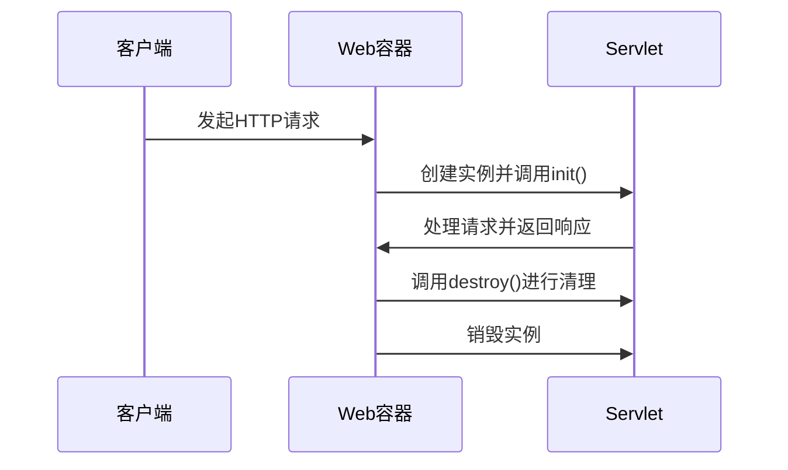
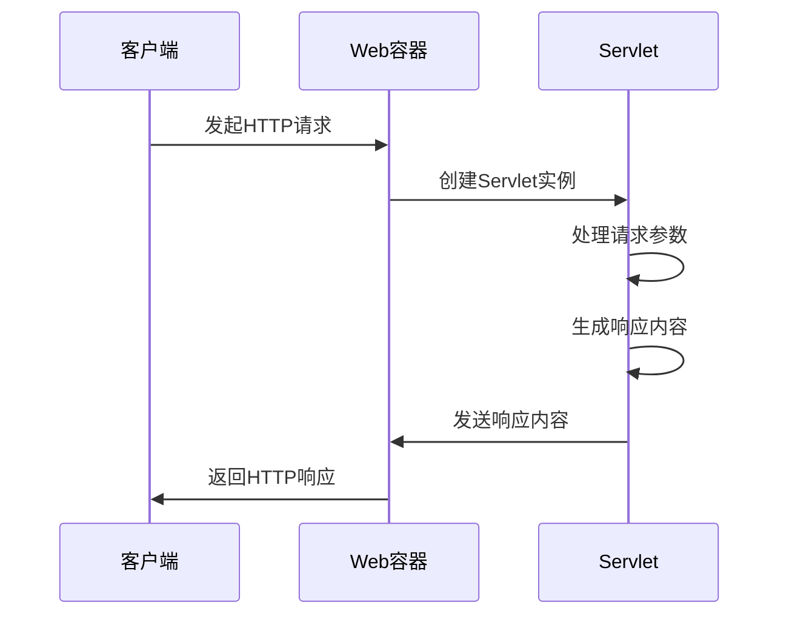
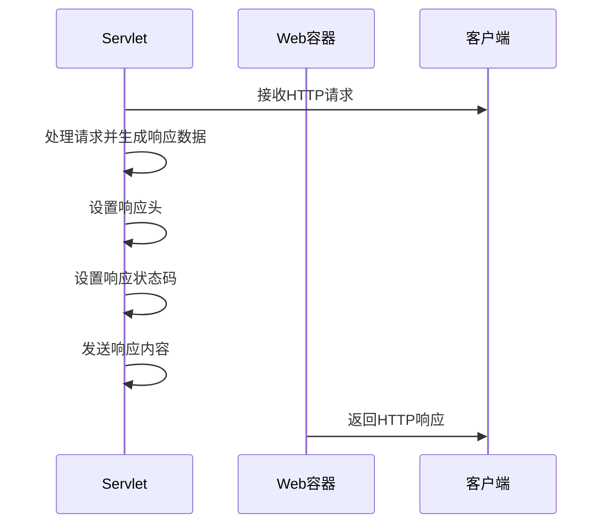

                 

### 文章标题：Java 在 Web 开发中的应用：Spring 和 Servlet

> **关键词：** Java Web 开发、Servlet、Spring、Spring MVC、Spring Boot、Spring Security、Web 应用开发

> **摘要：** 本文将深入探讨 Java 在 Web 开发中的应用，重点介绍 Servlet 和 Spring 框架。从基础到进阶，我们将详细了解 Servlet 的基本概念、生命周期、请求处理机制，以及 Spring 框架的核心模块、MVC 架构、Boot 快速开发模式和安全机制。通过实际案例，我们将演示如何将所学知识应用到实际项目中，为您的 Java Web 开发之旅提供有力支持。

---

### 《Java 在 Web 开发中的应用：Spring 和 Servlet》目录大纲

#### 第一部分：Java 在 Web 开发中的应用基础

**第1章：Java Web 开发概述**  
- **1.1 Java Web 开发的历史与现状**  
- **1.2 Java Web 开发的关键技术**

**第2章：Java Servlet 技术详解**  
- **2.1 Servlet 的基本概念与运行原理**  
- **2.2 Servlet 的生命周期**  
- **2.3 Servlet 的请求处理**  
- **2.4 Servlet 的响应处理**  
- **2.5 Servlet 的过滤器**

**第3章：Java Web 请求与响应**  
- **3.1 HTTP 协议详解**  
- **3.2 Java Web 请求处理流程**  
- **3.3 Java Web 响应处理流程**

**第4章：Java Web 容器**  
- **4.1 Web 容器的角色与作用**  
- **4.2 Apache Tomcat 搭建与配置**  
- **4.3 Apache Tomcat 性能优化**

**第5章：Java Web 安全**  
- **5.1 Java Web 安全概述**  
- **5.2 SQL 注入攻击与防范**  
- **5.3 XSS 攻击与防范**  
- **5.4 CSRF 攻击与防范**

**第6章：Java Web 性能优化**  
- **6.1 Java Web 性能优化概述**  
- **6.2 常见性能瓶颈分析**  
- **6.3 性能优化实践**

**第7章：Java Web 开发案例**  
- **7.1 简单的博客系统开发**  
- **7.2 电商系统的核心功能开发**

#### 第二部分：Java Web 开发进阶

**第8章：Spring 框架入门**  
- **8.1 Spring 概述**  
- **8.2 Spring 的核心模块**  
- **8.3 Spring 的依赖注入**  
- **8.4 Spring 的面向切面编程**

**第9章：Spring MVC 框架详解**  
- **9.1 Spring MVC 概述**  
- **9.2 Spring MVC 的控制器**  
- **9.3 Spring MVC 的视图层**  
- **9.4 Spring MVC 的数据处理**

**第10章：Spring Boot 框架应用**  
- **10.1 Spring Boot 概述**  
- **10.2 Spring Boot 的自动配置**  
- **10.3 Spring Boot 的开发模式**  
- **10.4 Spring Boot 的整合其他框架**

**第11章：Spring Security 框架**  
- **11.1 Spring Security 概述**  
- **11.2 Spring Security 的配置**  
- **11.3 Spring Security 的认证与授权**

**第12章：Java Web 开发实战项目**  
- **12.1 简单的博客系统实战**  
- **12.2 电商系统的核心功能实战**

#### 附录

**附录 A：Java Web 开发资源**  
- **A.1 常用工具**  
- **A.2 学习资源**  
- **A.3 开发社区**

**参考文献**

### 第一部分：Java 在 Web 开发中的应用基础

#### 第1章：Java Web 开发概述

##### 1.1 Java Web 开发的历史与现状

Java 作为一种历史悠久且广泛使用的编程语言，在 Web 开发领域也有着举足轻重的地位。Java Web 开发的历程可以追溯到 1995 年，当时 Sun Microsystems 推出了第一版 Java，并迅速在 IT 领域崭露头角。随着 Java 语言的不断成熟和普及，Java Web 开发也逐渐成为企业级应用的主流技术。

近年来，Java Web 开发技术不断演进，涌现出众多优秀框架，如 Spring、Hibernate、Struts 等，它们为开发者提供了高效、可靠的开发模式，大大提升了 Web 应用的开发效率。尤其是在 Spring 框架的出现后，Java Web 开发迎来了新的篇章，Spring 框架以其强大的功能和良好的扩展性，成为了 Java Web 开发的事实标准。

当前，Java Web 开发在金融、电商、物流等领域仍然占据着重要地位。随着云计算、大数据、物联网等新兴技术的蓬勃发展，Java Web 开发也在不断拓展新的应用场景，为开发者提供了丰富的机会。

##### 1.2 Java Web 开发的关键技术

Java Web 开发涉及多个关键技术和组件，以下是其中一些重要的技术：

- **Servlet**：Servlet 是 Java 编写的服务器端程序，用于处理客户端的请求并生成动态内容。它是 Java Web 开发的核心组件之一，负责请求的接收和处理。
  
- **JSP**：JavaServer Pages（JSP）是一种动态网页技术，通过在 HTML 中嵌入 Java 代码，可以生成动态内容。JSP 技术与 Servlet 相辅相成，广泛应用于 Web 开发中。

- **Spring**：Spring 框架是一个开源的轻量级开发框架，提供了依赖注入、面向切面编程、数据访问等功能。Spring 框架极大地简化了 Java Web 开发的复杂度，成为开发者必备的工具。

- **Spring MVC**：Spring MVC 是 Spring 框架的一部分，专门用于 Web 应用开发。它基于 MVC（Model-View-Controller）设计模式，提供了控制器、视图层和数据访问层的实现，使得 Web 开发更加简洁和高效。

- **Spring Boot**：Spring Boot 是 Spring 框架的一个快速开发框架，通过自动配置和简化的配置，使得开发者可以更快地启动和运行 Web 应用。Spring Boot 极大地降低了新手的入门门槛，成为 Java Web 开发的新宠。

- **Spring Security**：Spring Security 是一个用于 Web 应用安全性的框架，提供了认证、授权、安全配置等功能。通过 Spring Security，开发者可以轻松地实现各种安全功能，如登录、权限控制等。

- **数据库技术**：Java Web 开发通常需要与数据库进行交互，常见的数据库技术包括 MySQL、Oracle、MongoDB 等。掌握数据库的基本原理和 SQL 语言，对于开发者来说是非常重要的。

- **Web 容器**：Web 容器是运行 Java Web 应用程序的必要环境，常见的 Web 容器包括 Apache Tomcat、Jetty、WebLogic 等。了解 Web 容器的配置和优化，有助于提升 Web 应用的性能和稳定性。

- **HTTP 协议**：HTTP（HyperText Transfer Protocol）是 Web 应用中最重要的协议之一，用于客户端和服务器之间的数据传输。掌握 HTTP 协议的基本原理和常用方法，对于理解 Web 应用的工作原理至关重要。

- **前端技术**：Java Web 开发通常需要与前端技术相结合，如 HTML、CSS、JavaScript 等。掌握前端技术，可以提升 Web 应用的用户体验和交互效果。

#### 第2章：Java Servlet 技术详解

##### 2.1 Servlet 的基本概念与运行原理

Servlet 是 Java 编写的服务器端程序，用于处理客户端的请求并生成动态内容。它是 Java Web 开发的核心组件之一，负责接收和响应 HTTP 请求。Servlet 通过继承 `javax.servlet.http.HttpServlet` 类或实现 `javax.servlet.http.HttpServletResponse` 接口来定义，通过重写 `doGet`、`doPost` 等方法来处理不同的 HTTP 请求。

Servlet 的运行原理如下：

1. 客户端发起 HTTP 请求，请求被 Web 容器接收。
2. Web 容器根据请求的 URL，找到对应的 Servlet。
3. Web 容器创建 Servlet 实例，并调用其 `init` 方法进行初始化。
4. Servlet 处理请求，根据请求的方法（GET、POST 等），调用相应的处理方法（如 `doGet`、`doPost`）。
5. Servlet 生成响应，通过 `HttpServletResponse` 对象发送给客户端。
6. Web 容器销毁 Servlet 实例，并调用其 `destroy` 方法进行清理。

##### 2.2 Servlet 的生命周期

Servlet 生命周期是指 Servlet 从创建到销毁的过程，包括以下几个重要阶段：

1. **加载**：Web 容器加载 Servlet，通常通过读取 Servlet 的配置信息（如 web.xml）或使用 Servlet 注解（如 `@WebServlet`）来找到 Servlet 类。
2. **初始化**：Web 容器创建 Servlet 实例，并调用其 `init` 方法进行初始化。`init` 方法通常用于加载配置信息、初始化相关资源等。
3. **请求处理**：Servlet 接收并处理 HTTP 请求，通过调用相应的处理方法（如 `doGet`、`doPost`）来响应请求。
4. **响应**：Servlet 生成响应内容，通过 `HttpServletResponse` 对象发送给客户端。
5. **清理**：Web 容器调用 Servlet 的 `destroy` 方法进行清理，释放资源。`destroy` 方法通常用于关闭数据库连接、删除临时文件等。
6. **销毁**：Web 容器销毁 Servlet 实例。

Servlet 生命周期示意图如下：



##### 2.3 Servlet 的请求处理

Servlet 的请求处理是通过重写 `doGet`、`doPost`、`doPut`、`doDelete` 等方法来实现的。不同的请求方法对应不同的处理逻辑，例如：

- `doGet`：处理 GET 请求，通常用于读取数据。
- `doPost`：处理 POST 请求，通常用于提交表单数据。
- `doPut`：处理 PUT 请求，通常用于更新数据。
- `doDelete`：处理 DELETE 请求，通常用于删除数据。

以下是 Servlet 请求处理的示例代码：

```java
@WebServlet("/hello")
public class HelloServlet extends HttpServlet {

    @Override
    protected void doGet(HttpServletRequest request, HttpServletResponse response)
            throws ServletException, IOException {
        String name = request.getParameter("name");
        response.getWriter().write("Hello, " + name + "!");
    }

    @Override
    protected void doPost(HttpServletRequest request, HttpServletResponse response)
            throws ServletException, IOException {
        String name = request.getParameter("name");
        response.getWriter().write("Hello, " + name + "!");
    }
}
```

在这个示例中，HelloServlet 类重写了 `doGet` 和 `doPost` 方法，以处理 GET 和 POST 请求。在处理方法中，通过 `HttpServletRequest` 对象获取请求参数，并通过 `HttpServletResponse` 对象发送响应。

##### 2.4 Servlet 的响应处理

Servlet 的响应处理是通过 `HttpServletResponse` 对象来完成的。`HttpServletResponse` 对象提供了多种方法来设置响应头、响应状态码和响应内容。以下是一些常用的响应处理方法：

- `setContentType(String type)`：设置响应内容的 MIME 类型，例如 `setContentType("text/html")`。
- `setStatus(int status)`：设置响应状态码，例如 `setStatus(HttpServletResponse.SC_OK)`。
- `getWriter()`：获取响应输出流，用于发送响应内容。
- `addHeader(String name, String value)`：添加响应头，例如 `addHeader("Content-Type", "text/html")`。

以下是 Servlet 响应处理的示例代码：

```java
@WebServlet("/hello")
public class HelloServlet extends HttpServlet {

    @Override
    protected void doGet(HttpServletRequest request, HttpServletResponse response)
            throws ServletException, IOException {
        response.setContentType("text/html");
        response.setStatus(HttpServletResponse.SC_OK);
        response.getWriter().write("<h1>Hello, World!</h1>");
    }
}
```

在这个示例中，HelloServlet 类设置了响应的 MIME 类型为 HTML，响应状态码为 200（OK），并通过响应输出流发送了响应内容。

##### 2.5 Servlet 的过滤器

Servlet 过滤器（Servlet Filter）是一种用于拦截和修改 HTTP 请求的组件。通过过滤器，开发者可以实现对 Web 应用的全局控制，例如日志记录、身份验证、请求拦截等。过滤器通过实现 `javax.servlet.Filter` 接口来定义，并在 Web 应用中配置。

以下是 Servlet 过滤器的基本原理：

1. Web 容器加载过滤器，并调用其 `init` 方法进行初始化。
2. Web 容器根据过滤器配置，将请求拦截给过滤器处理。
3. 过滤器对请求进行预处理，例如记录日志、验证身份等。
4. 过滤器调用 `doFilter` 方法，将请求传递给下一个过滤器或目标 Servlet。
5. 请求经过所有过滤器的处理后，最终到达目标 Servlet 进行处理。
6. 过滤器调用 `destroy` 方法进行清理，释放资源。

以下是 Servlet 过滤器的示例代码：

```java
@WebFilter("/hello")
public class HelloFilter implements Filter {

    @Override
    public void init(FilterConfig config) throws ServletException {
        System.out.println("HelloFilter 初始化");
    }

    @Override
    public void doFilter(ServletRequest request, ServletResponse response, FilterChain chain)
            throws IOException, ServletException {
        System.out.println("HelloFilter 拦截请求");
        chain.doFilter(request, response);
        System.out.println("HelloFilter 拦截响应");
    }

    @Override
    public void destroy() {
        System.out.println("HelloFilter 销毁");
    }
}
```

在这个示例中，HelloFilter 类实现了 `Filter` 接口，并在 `doFilter` 方法中拦截了请求。在拦截请求时，HelloFilter 输出了相应的日志，并调用 `chain.doFilter` 方法将请求传递给下一个过滤器或目标 Servlet。

#### 第3章：Java Web 请求与响应

##### 3.1 HTTP 协议详解

HTTP（HyperText Transfer Protocol）是 Web 应用中最重要的协议之一，用于客户端和服务器之间的数据传输。HTTP 协议定义了请求和响应的结构，以及客户端和服务器之间的通信规则。

以下是 HTTP 协议的基本组成部分：

1. **请求行**：请求行包括请求方法、请求 URL 和 HTTP 版本。例如：`GET /index.html HTTP/1.1`。
2. **请求头**：请求头包含请求的元信息，如请求的 MIME 类型、内容长度等。例如：`Host: www.example.com`。
3. **空行**：请求头后必须有一个空行，用于分隔请求头和请求体。
4. **请求体**：请求体通常包含请求的数据，如表单数据、JSON 数据等。请求体通常用于 POST 请求。

以下是 HTTP 请求的示例：

```
GET /login HTTP/1.1
Host: www.example.com
User-Agent: Mozilla/5.0 (Windows NT 10.0; Win64; x64) ...
Content-Type: application/x-www-form-urlencoded
Content-Length: 27

username=john&password=123456
```

5. **响应行**：响应行包括 HTTP 版本、响应状态码和响应描述。例如：`HTTP/1.1 200 OK`。
6. **响应头**：响应头包含响应的元信息，如响应的 MIME 类型、内容长度等。例如：`Content-Type: text/html`。
7. **空行**：响应头后必须有一个空行，用于分隔响应头和响应体。
8. **响应体**：响应体通常包含响应的数据，如 HTML 页面、JSON 数据等。

以下是 HTTP 响应的示例：

```
HTTP/1.1 200 OK
Date: Wed, 10 May 2023 12:00:00 GMT
Server: Apache
Content-Type: text/html; charset=UTF-8
Content-Length: 1024

<!DOCTYPE html>
<html>
<head>
    <meta charset="UTF-8">
    <title>Hello, World!</title>
</head>
<body>
    <h1>Hello, World!</h1>
</body>
</html>
```

HTTP 协议的基本工作流程如下：

1. 客户端发起 HTTP 请求，请求行包含请求方法、请求 URL 和 HTTP 版本。
2. 服务器接收到请求后，根据请求 URL 找到对应的资源，并返回响应。
3. 服务器在响应行中设置 HTTP 版本、响应状态码和响应描述。
4. 服务器在响应头中设置响应的元信息，如响应的 MIME 类型、内容长度等。
5. 服务器在响应体中发送响应的数据，如 HTML 页面、JSON 数据等。
6. 客户端接收到响应后，根据响应内容进行相应的处理，如显示网页、解析 JSON 数据等。

##### 3.2 Java Web 请求处理流程

Java Web 请求处理流程是指客户端发起请求后，Web 应用程序如何接收、处理并响应请求的过程。以下是 Java Web 请求处理的基本流程：

1. **客户端发起请求**：客户端通过 HTTP 协议向服务器发送请求，请求行包含请求方法、请求 URL 和 HTTP 版本。

2. **Web 容器接收请求**：Web 容器（如 Apache Tomcat）接收到客户端的请求后，根据请求 URL 找到对应的 Servlet。

3. **Servlet 处理请求**：Servlet 接收到请求后，根据请求方法（GET、POST 等）调用相应的处理方法（如 `doGet`、`doPost`）。

4. **Servlet 处理请求参数**：在处理请求方法中，Servlet 可以通过 `HttpServletRequest` 对象获取请求参数，如表单数据、查询参数等。

5. **Servlet 生成响应**：Servlet 在处理完请求后，生成响应内容，并通过 `HttpServletResponse` 对象发送给客户端。

6. **Web 容器发送响应**：Web 容器将 Servlet 生成的响应发送给客户端，客户端接收到响应后，根据响应内容进行相应的处理。

以下是 Java Web 请求处理流程的示意图：



##### 3.3 Java Web 响应处理流程

Java Web 响应处理流程是指 Web 应用程序如何生成并返回 HTTP 响应的过程。以下是 Java Web 响应处理的基本流程：

1. **Servlet 接收请求**：Servlet 通过 `HttpServletRequest` 对象接收客户端的请求。

2. **Servlet 处理请求**：Servlet 在处理请求过程中，根据业务逻辑生成响应数据。

3. **Servlet 设置响应头**：Servlet 通过 `HttpServletResponse` 对象设置响应头，如响应的 MIME 类型、内容长度等。

4. **Servlet 设置响应状态码**：Servlet 通过 `HttpServletResponse` 对象设置响应状态码，如 200（OK）、404（Not Found）等。

5. **Servlet 发送响应内容**：Servlet 通过 `HttpServletResponse` 对象发送响应内容，如 HTML 页面、JSON 数据等。

6. **Web 容器发送响应**：Web 容器将 Servlet 生成的响应发送给客户端。

以下是 Java Web 响应处理流程的示意图：



#### 第4章：Java Web 容器

##### 4.1 Web 容器的角色与作用

Web 容器是运行 Java Web 应用程序的必要环境，它负责接收 HTTP 请求、创建和管理 Servlet 实例、转发请求给相应的 Servlet、处理 Servlet 的响应并最终返回给客户端。以下是 Web 容器的主要角色和作用：

1. **请求接收**：Web 容器接收来自客户端的 HTTP 请求，并根据请求 URL 找到对应的 Servlet。
2. **请求转发**：Web 容器将请求转发给相应的 Servlet，以便 Servlet 进行处理。
3. **资源管理**：Web 容器负责管理 Servlet 的生命周期，包括创建、初始化、销毁 Servlet 实例等。
4. **安全性**：Web 容器提供安全功能，如认证、授权等，以保护 Web 应用程序的安全性。
5. **性能优化**：Web 容器提供性能优化功能，如连接池、缓存等，以提高 Web 应用程序的响应速度。
6. **错误处理**：Web 容器提供错误处理机制，如错误页面、错误日志等，以便在发生错误时及时进行诊断和处理。

常见的 Web 容器包括 Apache Tomcat、Jetty、WebLogic 等。其中，Apache Tomcat 是最流行的开源 Web 容器，它具有轻量级、可扩展性强、易于配置等特点，被广泛应用于企业级 Web 应用程序。

##### 4.2 Apache Tomcat 搭建与配置

Apache Tomcat 是一款轻量级、高性能的开源 Web 容器，是 Java Web 开发中常用的 Web 容器之一。以下是 Apache Tomcat 的搭建与配置步骤：

1. **下载 Tomcat**：访问 Apache Tomcat 官网（https://tomcat.apache.org/），下载最新版本的 Tomcat 安装包。下载后，将安装包解压到一个合适的目录，例如 `C:\apache-tomcat-9.0.41`。

2. **配置环境变量**：在系统环境变量中添加 Tomcat 的安装路径，以便在命令行中直接使用 Tomcat 相关命令。例如，将 `C:\apache-tomcat-9.0.41` 添加到 `Path` 环境变量中。

3. **启动 Tomcat**：在命令行中进入 Tomcat 的安装目录（例如 `C:\apache-tomcat-9.0.41`），运行 `startup.bat` 命令，启动 Tomcat。在浏览器中访问 `http://localhost:8080/`，若能正常显示 Tomcat 的主页，说明 Tomcat 已成功启动。

4. **配置 web.xml**：在 Tomcat 的 `conf` 目录下，找到 `web.xml` 配置文件。在 `web.xml` 中配置 Servlet 的映射关系，例如：

   ```xml
   <servlet>
       <servlet-name>hello</servlet-name>
       <servlet-class>HelloServlet</servlet-class>
   </servlet>
   <servlet-mapping>
       <servlet-name>hello</servlet-name>
       <url-pattern>/hello</url-pattern>
   </servlet-mapping>
   ```

   在上述配置中，`HelloServlet` 类用于处理 `/hello` URL 的请求。

5. **部署 Web 应用程序**：将 Web 应用程序的 WAR 文件（如 `hello.war`）部署到 Tomcat 的 `webapps` 目录下。若 Web 应用程序已成功部署，可以在浏览器中访问相应的 URL，例如 `http://localhost:8080/hello/hello`。

6. **配置虚拟主机**：在 Tomcat 的 `conf` 目录下，找到 `server.xml` 配置文件。在 `server.xml` 中配置虚拟主机，例如：

   ```xml
   <Host name="example.com" appBase="webapps" unpackWARs="true" autoDeploy="true">
       <Context path="" docBase="hello" reloadable="true" />
   </Host>
   ```

   在上述配置中，将 `example.com` 作为虚拟主机的域名，将 `hello` 作为 Web 应用程序的部署路径。

7. **配置连接池**：若 Web 应用程序需要连接数据库，可以配置连接池，以提高数据库连接的性能。在 Tomcat 的 `conf` 目录下，找到 `context.xml` 配置文件。在 `context.xml` 中配置连接池，例如：

   ```xml
   <Resource name="jdbc/mydb" auth="Container" type="javax.sql.DataSource"
             maxTotal="100" maxIdle="30" minIdle="10" maxWaitMillis="10000"
             driverClassName="com.mysql.cj.jdbc.Driver" url="jdbc:mysql://localhost:3306/mydb"
             username="root" password="root" />
   ```

   在上述配置中，配置了名为 `jdbc/mydb` 的连接池，连接池的属性包括最大连接数、最大空闲连接数、最小空闲连接数等。

##### 4.3 Apache Tomcat 性能优化

Apache Tomcat 是一款高性能的 Web 容器，但仍然可以通过一系列优化措施来进一步提高其性能。以下是一些常见的 Apache Tomcat 性能优化方法：

1. **调整线程池大小**：Tomcat 使用线程池来处理客户端请求，通过调整线程池大小，可以优化 Tomcat 的性能。例如，将 `catalina.sh`（或 `catalina.bat`）中的 `CATALINA_OPTS` 变量设置为 `-Xms512m -Xmx1024m -XX:MaxRequestsPerThread=100`，可以设置 JVM 的初始内存、最大内存和每个线程的最大请求数。

2. **使用连接池**：连接池可以减少数据库连接的开销，提高数据库连接的性能。通过配置连接池，可以设置最大连接数、最大空闲连接数、最小空闲连接数等属性，以优化数据库连接性能。

3. **缓存技术**：缓存技术可以减少对数据库的查询次数，提高 Web 应用的响应速度。例如，可以使用 HTTP 缓存、EhCache、Redis 等缓存技术，将 frequently accessed data（如页面内容、图片等）缓存到内存中。

4. **GZIP 压缩**：GZIP 压缩可以减小 HTTP 响应的内容大小，提高数据传输的速度。通过配置 Tomcat，可以启用 GZIP 压缩，例如在 `catalina.properties` 中设置 `gzip.on` 和 `gzip.mime.types` 属性。

5. **异步处理**：异步处理可以减少请求的处理时间，提高 Tomcat 的吞吐量。通过配置异步处理，可以设置异步请求的超时时间和最大请求数，例如在 `catalina.properties` 中设置 `async.request.timeout` 和 `maxHttpHeaderSize` 属性。

6. **优化 Web 应用程序**：优化 Web 应用程序的代码和架构，可以减少资源的消耗和请求的处理时间。例如，优化 SQL 查询、减少 IO 操作、避免重复计算等。

7. **监控和调试**：使用监控和调试工具，可以实时监控 Tomcat 的性能和资源消耗，定位性能瓶颈并进行优化。例如，使用 JConsole、VisualVM 等工具，可以监控 JVM 的内存使用、垃圾回收、线程状态等。

#### 第5章：Java Web 安全

##### 5.1 Java Web 安全概述

Java Web 安全是保障 Web 应用程序安全的关键因素，它涉及到防止恶意攻击、保护用户数据、确保 Web 应用程序的可信性和完整性。Java Web 安全包括多个方面，如身份验证、授权、防止 SQL 注入、XSS 攻击、CSRF 攻击等。以下是对 Java Web 安全的一些基本概述：

1. **身份验证**：身份验证是确保用户身份真实性的过程，常用的身份验证方式包括基于用户名和密码的认证、基于证书的认证、单点登录等。

2. **授权**：授权是确定用户在 Web 应用程序中具有哪些权限的过程，根据用户的角色和权限，控制用户对资源的访问。

3. **防止 SQL 注入**：SQL 注入是 Web 应用程序中最常见的攻击方式之一，通过在 SQL 查询语句中插入恶意代码，攻击者可以篡改数据库数据或执行非法操作。防止 SQL 注入的方法包括使用预编译语句、参数化查询等。

4. **防止 XSS 攻击**：XSS（Cross-Site Scripting）攻击是通过在 Web 应用程序的响应中注入恶意脚本，欺骗用户执行非法操作。防止 XSS 攻击的方法包括对输入数据进行编码、使用安全的 HTML 编码库等。

5. **防止 CSRF 攻击**：CSRF（Cross-Site Request Forgery）攻击是通过伪造用户请求，欺骗用户执行非法操作。防止 CSRF 攻击的方法包括使用 CSRF 令牌、验证请求来源等。

6. **加密与安全传输**：加密与安全传输是确保用户数据在传输过程中不被窃取或篡改的重要手段，常用的加密技术包括 SSL/TLS 等。

##### 5.2 SQL 注入攻击与防范

SQL 注入攻击是 Web 应用程序中最常见的攻击方式之一，攻击者通过在 SQL 查询语句中插入恶意代码，可以篡改数据库数据或执行非法操作。以下是 SQL 注入攻击的基本原理和防范方法：

1. **攻击原理**：SQL 注入攻击通常通过在输入框、查询参数等地方插入恶意代码，例如：

   ```sql
   SELECT * FROM users WHERE username='admin' AND password='123456' OR '1'='1'
   ```

   在上述示例中，`'1'='1'` 是一条无效的 SQL 查询，但会导致 SQL 查询结果为真，从而绕过密码验证。

2. **防范方法**：以下是防范 SQL 注入攻击的一些常见方法：

   - **使用预编译语句**：预编译语句（Prepared Statements）是一种防止 SQL 注入的有效方法，它将 SQL 查询语句与参数分开，在执行查询时才进行参数绑定。例如，使用 JDBC 驱动的预编译语句：

     ```java
     String sql = "SELECT * FROM users WHERE username=? AND password=?";
     PreparedStatement statement = connection.prepareStatement(sql);
     statement.setString(1, username);
     statement.setString(2, password);
     ResultSet resultSet = statement.executeQuery();
     ```

   - **使用参数化查询**：参数化查询（Parameterized Queries）是一种将 SQL 查询语句与参数结合的方法，它通过 JDBC 驱动的参数化接口来实现。例如，使用 JDBC 驱动的参数化查询：

     ```java
     String sql = "SELECT * FROM users WHERE username=? AND password=?";
     Statement statement = connection.createStatement();
     statement.setString(1, username);
     statement.setString(2, password);
     ResultSet resultSet = statement.executeQuery();
     ```

   - **输入验证**：对用户输入进行验证，确保输入的数据符合预期格式。例如，对用户名和密码进行长度、字符集等验证，防止恶意输入。

   - **使用安全库**：使用安全的 SQL 编写库，如 MyBatis、Hibernate 等，它们提供了自动防止 SQL 注入的功能。

##### 5.3 XSS 攻击与防范

XSS（Cross-Site Scripting）攻击是通过在 Web 应用程序的响应中注入恶意脚本，欺骗用户执行非法操作。以下是 XSS 攻击的基本原理和防范方法：

1. **攻击原理**：XSS 攻击通常通过在输入框、URL、JavaScript 等 HTML 标签中插入恶意脚本，例如：

   ```html
   
   ```

   在上述示例中，恶意脚本 `malicious.js` 会被加载并执行，从而欺骗用户执行非法操作。

2. **防范方法**：以下是防范 XSS 攻击的一些常见方法：

   - **输入编码**：对用户输入进行编码，防止恶意脚本被解析和执行。常用的编码方法包括 HTML 编码、URL 编码等。例如，使用 HTML 编码：

     ```java
     String input = "<script>alert('XSS 攻击！');</script>";
     String encodedInput = HtmlEncoder.encode(input);
     System.out.println(encodedInput);
     ```

   - **使用安全的 HTML 编写库**：使用安全的 HTML 编写库，如 Thymeleaf、JSP 等，它们提供了自动防止 XSS 攻击的功能。

   - **输出编码**：对输出内容进行编码，确保输出的 HTML 内容不会被执行。例如，使用 HTML 编码：

     ```java
     String output = "<div>" + input + "</div>";
     String encodedOutput = HtmlEncoder.encode(output);
     System.out.println(encodedOutput);
     ```

   - **使用 Content Security Policy（CSP）**：CSP（Content Security Policy）是一种安全策略，用于限制页面可以加载和执行的资源。通过配置 CSP，可以防止恶意脚本加载和执行。例如，在 HTML 中设置 CSP：

     ```html
     <meta http-equiv="Content-Security-Policy" content="default-src 'self'; script-src 'self' https://example.com;">
     ```

   - **使用安全的 JavaScript 库**：使用安全的 JavaScript 库，如 jQuery、Bootstrap 等，它们提供了自动防止 XSS 攻击的功能。

##### 5.4 CSRF 攻击与防范

CSRF（Cross-Site Request Forgery）攻击是通过伪造用户请求，欺骗用户执行非法操作。以下是 CSRF 攻击的基本原理和防范方法：

1. **攻击原理**：CSRF 攻击通常通过在用户浏览器中注入恶意脚本，欺骗用户在目标网站上执行非法操作，例如：

   ```html
   
   ```

   在上述示例中，恶意脚本会向目标网站发送转账请求，欺骗用户执行非法操作。

2. **防范方法**：以下是防范 CSRF 攻击的一些常见方法：

   - **使用 CSRF 令牌**：CSRF 令牌是一种用于防止 CSRF 攻击的机制，它通过在每个请求中包含一个唯一的 CSRF 令牌，确保请求来自合法的来源。例如，在表单中添加 CSRF 令牌：

     ```html
     <input type="hidden" name="_csrf" value="abcdef1234567890" />
     ```

   - **验证请求来源**：验证请求的来源，确保请求来自合法的网站。例如，通过检查请求的 Referrer 头，确保请求来自同一个域名。

   - **使用安全的 Web 框架**：使用安全的 Web 框架，如 Spring Security、Struts 等，它们提供了自动防止 CSRF 攻击的功能。

   - **限制 HTTP 方法**：限制 CSRF 攻击常用的 HTTP 方法，如 POST、PUT 等。例如，通过设置表单的 `method` 属性为 `GET`，防止 POST 请求。

   - **使用 SameSite Cookie**：SameSite Cookie 是一种安全策略，用于限制 Cookie 的跨站访问。通过设置 Cookie 的 `SameSite` 属性为 `Strict` 或 `Lax`，可以防止恶意脚本读取 Cookie。

#### 第6章：Java Web 性能优化

##### 6.1 Java Web 性能优化概述

Java Web 性能优化是提高 Web 应用程序响应速度、降低资源消耗和提升系统吞吐量的关键措施。优化 Java Web 应用程序可以带来以下好处：

- **提高用户体验**：优化后的 Web 应用程序响应更快，用户可以更快地完成操作，提高用户满意度。
- **降低资源消耗**：优化后的 Web 应用程序消耗更少的系统资源，如 CPU、内存、网络带宽等，降低硬件成本和维护成本。
- **提升系统吞吐量**：优化后的 Web 应用程序可以处理更多的请求，提高系统并发处理能力，提升业务性能。
- **降低故障率**：优化后的 Web 应用程序运行更稳定，减少系统崩溃和故障的发生。

Java Web 性能优化包括多个方面，如代码优化、数据库优化、缓存技术、连接池等。以下是一些常见的 Java Web 性能优化方法：

1. **代码优化**：通过优化代码，减少资源的消耗，提高程序执行效率。例如，减少循环次数、避免死循环、使用缓存等。
2. **数据库优化**：通过优化数据库查询、索引、存储过程等，提高数据库的查询性能。例如，使用预编译语句、避免使用 SELECT *、使用合适的索引等。
3. **缓存技术**：使用缓存技术，减少对数据库的查询次数，提高数据访问速度。例如，使用 HTTP 缓存、EhCache、Redis 等。
4. **连接池**：使用连接池，减少数据库连接的开销，提高数据库连接的性能。例如，使用 Apache DBCP、C3P0 等连接池技术。
5. **负载均衡**：通过负载均衡，将请求分配到多个服务器上，提高系统的并发处理能力。例如，使用 Nginx、HAProxy 等负载均衡器。
6. **性能监控**：使用性能监控工具，实时监控系统的性能指标，定位性能瓶颈并进行优化。例如，使用 JConsole、VisualVM 等。

##### 6.2 常见性能瓶颈分析

Java Web 应用程序的性能瓶颈通常包括以下几个方面：

1. **CPU 性能瓶颈**：CPU 性能瓶颈通常是由于程序的计算量过大或 CPU 利用率过高导致的。例如，过多的循环、递归调用、大数据处理等会导致 CPU 性能瓶颈。
2. **内存性能瓶颈**：内存性能瓶颈通常是由于程序占用的内存过大或内存分配和回收效率低下导致的。例如，大量的对象创建和销毁、内存泄漏等会导致内存性能瓶颈。
3. **网络性能瓶颈**：网络性能瓶颈通常是由于网络带宽不足或网络延迟过高导致的。例如，过多的 HTTP 请求、网络传输延迟等会导致网络性能瓶颈。
4. **数据库性能瓶颈**：数据库性能瓶颈通常是由于数据库查询性能低下或数据库连接数过多导致的。例如，复杂的 SQL 查询、过多的 JOIN 操作、数据库连接池配置不当等会导致数据库性能瓶颈。
5. **IO 性能瓶颈**：IO 性能瓶颈通常是由于文件读写速度过慢或磁盘 I/O 队列过长导致的。例如，大量的文件读写操作、磁盘空间不足、磁盘性能下降等会导致 IO 性能瓶颈。

以下是一些常见性能瓶颈分析的方法：

1. **监控工具**：使用性能监控工具，如 JConsole、VisualVM 等，实时监控系统的 CPU、内存、网络、数据库等性能指标，定位性能瓶颈。
2. **日志分析**：分析系统的日志文件，定位性能瓶颈。例如，分析日志中的错误信息、警告信息等，找出潜在的瓶颈点。
3. **代码审查**：对系统代码进行审查，检查是否存在优化空间。例如，检查是否存在过多的循环、递归调用、大数据处理等，找出潜在的瓶颈点。
4. **负载测试**：通过负载测试，模拟多用户并发访问场景，测量系统的性能指标，找出性能瓶颈。
5. **性能基准测试**：使用性能基准测试工具，如 Apache JMeter、Gatling 等，对系统进行性能基准测试，找出性能瓶颈。

##### 6.3 性能优化实践

以下是一些具体的 Java Web 性能优化实践：

1. **代码优化**：通过代码优化，减少资源的消耗，提高程序执行效率。以下是一些代码优化的实践：

   - 减少循环次数：尽量避免过多的循环操作，可以使用循环优化技术，如 while 循环改为 do-while 循环等。
   - 避免死循环：避免编写会导致死循环的代码，例如无限循环或递归调用。
   - 大数据处理：对于大数据处理，可以采用分治算法、并行计算等技术，提高处理速度。
   - 减少对象创建：减少不必要的对象创建和销毁，可以重用已经创建的对象，避免频繁的内存分配和回收。
   - 避免内存泄漏：检查代码中是否存在内存泄漏，例如长时间占用内存的对象、未释放的数据库连接等。

2. **数据库优化**：通过优化数据库查询、索引、存储过程等，提高数据库的查询性能。以下是一些数据库优化的实践：

   - 使用预编译语句：使用预编译语句，减少 SQL 查询的编译时间，提高查询效率。
   - 避免使用 SELECT *：避免使用 SELECT * 查询，只查询需要的字段，减少数据传输量。
   - 使用合适的索引：根据查询条件添加合适的索引，提高查询效率。
   - 避免过多的 JOIN 操作：避免使用过多的 JOIN 操作，可以使用子查询、连接查询等技术，简化查询逻辑。
   - 使用缓存：使用缓存技术，减少对数据库的查询次数，提高数据访问速度。

3. **缓存技术**：使用缓存技术，减少对数据库的查询次数，提高数据访问速度。以下是一些缓存技术的实践：

   - HTTP 缓存：使用 HTTP 缓存，如 ETag、Last-Modified 等，减少浏览器重新请求相同数据。
   - 页面缓存：使用页面缓存，如 Memcached、Redis 等，将频繁访问的页面缓存到内存中，提高访问速度。
   - 对象缓存：使用对象缓存，如 EhCache、Caffeine 等，将频繁访问的对象缓存到内存中，减少对象的创建和销毁。

4. **连接池**：使用连接池，减少数据库连接的开销，提高数据库连接的性能。以下是一些连接池技术的实践：

   - 使用连接池技术，如 Apache DBCP、C3P0 等，配置合适的连接池参数，如最大连接数、最小连接数、连接超时时间等。
   - 优化连接池配置，避免过多的数据库连接占用系统资源，影响系统性能。

5. **负载均衡**：通过负载均衡，将请求分配到多个服务器上，提高系统的并发处理能力。以下是一些负载均衡技术的实践：

   - 使用负载均衡器，如 Nginx、HAProxy 等，配置负载均衡策略，如轮询、加权轮询等。
   - 优化负载均衡器的配置，如请求超时时间、连接超时时间等，提高负载均衡器的性能和稳定性。

6. **性能监控**：使用性能监控工具，实时监控系统的性能指标，定位性能瓶颈并进行优化。以下是一些性能监控工具的实践：

   - 使用 JConsole、VisualVM 等工具，监控系统的 CPU、内存、网络、数据库等性能指标。
   - 定期分析系统日志，检查是否存在错误信息、警告信息等，找出潜在的瓶颈点。
   - 使用性能基准测试工具，如 Apache JMeter、Gatling 等，对系统进行性能基准测试，测量系统的性能指标。

#### 第7章：Java Web 开发案例

##### 7.1 简单的博客系统开发

在本节中，我们将通过一个简单的博客系统开发案例，介绍 Java Web 开发的基本流程和技术应用。博客系统的核心功能包括用户注册、登录、发表文章、查看文章、评论等。以下是博客系统开发的步骤：

1. **需求分析**：首先，我们需要明确博客系统的功能需求，包括用户注册、登录、发表文章、查看文章、评论等。根据需求分析，我们可以绘制出博客系统的用例图和类图。

2. **环境搭建**：选择合适的开发环境，如 Eclipse、IntelliJ IDEA 等。搭建 Java Web 开发的环境，包括 Java SDK、Web 容器（如 Apache Tomcat）、数据库（如 MySQL）等。

3. **数据库设计**：根据博客系统的需求，设计数据库表结构。例如，用户表（user）、文章表（article）、评论表（comment）等。

4. **前端页面设计**：使用 HTML、CSS、JavaScript 等技术，设计博客系统的前端页面。包括注册页面、登录页面、文章列表页面、文章详情页面、评论页面等。

5. **后端开发**：使用 Java、Servlet、JSP等技术，实现博客系统的后端逻辑。例如，用户注册、登录、发表文章、查看文章、评论等功能的实现。

6. **前端与后端整合**：将前端页面与后端逻辑整合，实现博客系统的整体功能。例如，将前端页面的表单数据提交到后端进行验证和处理，将后端的数据呈现到前端页面上。

7. **测试与调试**：对博客系统进行功能测试、性能测试和安全测试，确保系统的稳定性、可靠性和安全性。修复测试中发现的问题，优化系统性能。

8. **部署与维护**：将博客系统部署到 Web 容器中，如 Apache Tomcat，供用户访问和使用。定期对系统进行维护和升级，确保系统的正常运行。

以下是博客系统开发的一个简单示例：

**用户注册功能**：

1. **前端页面**：设计一个注册页面，包括用户名、密码、邮箱等输入框，以及注册按钮。

2. **后端实现**：

   ```java
   @WebServlet("/register")
   public class RegisterServlet extends HttpServlet {
       protected void doPost(HttpServletRequest request, HttpServletResponse response)
               throws ServletException, IOException {
           String username = request.getParameter("username");
           String password = request.getParameter("password");
           String email = request.getParameter("email");

           // 验证用户名、密码、邮箱等输入数据的合法性

           // 将用户信息保存到数据库

           // 返回注册成功的提示信息
       }
   }
   ```

**用户登录功能**：

1. **前端页面**：设计一个登录页面，包括用户名、密码等输入框，以及登录按钮。

2. **后端实现**：

   ```java
   @WebServlet("/login")
   public class LoginServlet extends HttpServlet {
       protected void doPost(HttpServletRequest request, HttpServletResponse response)
               throws ServletException, IOException {
           String username = request.getParameter("username");
           String password = request.getParameter("password");

           // 验证用户名、密码的合法性

           // 如果验证成功，将用户信息保存到 session 中

           // 返回登录成功的提示信息
       }
   }
   ```

**发表文章功能**：

1. **前端页面**：设计一个发表文章页面，包括文章标题、内容等输入框，以及发表按钮。

2. **后端实现**：

   ```java
   @WebServlet("/publish")
   public class PublishServlet extends HttpServlet {
       protected void doPost(HttpServletRequest request, HttpServletResponse response)
               throws ServletException, IOException {
           String title = request.getParameter("title");
           String content = request.getParameter("content");

           // 验证用户是否已登录

           // 将文章信息保存到数据库

           // 返回发表文章成功的提示信息
       }
   }
   ```

**查看文章功能**：

1. **前端页面**：设计一个文章列表页面，显示所有已发表的文章。

2. **后端实现**：

   ```java
   @WebServlet("/list")
   public class ListServlet extends HttpServlet {
       protected void doGet(HttpServletRequest request, HttpServletResponse response)
               throws ServletException, IOException {
           // 从数据库中查询文章列表

           // 将文章列表数据传递给前端页面
       }
   }
   ```

**评论功能**：

1. **前端页面**：设计一个评论页面，包括评论内容等输入框，以及发表按钮。

2. **后端实现**：

   ```java
   @WebServlet("/comment")
   public class CommentServlet extends HttpServlet {
       protected void doPost(HttpServletRequest request, HttpServletResponse response)
               throws ServletException, IOException {
           String content = request.getParameter("content");

           // 验证用户是否已登录

           // 将评论信息保存到数据库

           // 返回发表评论成功的提示信息
       }
   }
   ```

通过以上步骤，我们可以开发一个简单的博客系统，实现用户注册、登录、发表文章、查看文章、评论等基本功能。

##### 7.2 电商系统的核心功能开发

在本节中，我们将介绍电商系统的核心功能开发，包括商品管理、购物车、订单管理、支付等。以下是电商系统开发的步骤：

1. **需求分析**：明确电商系统的功能需求，包括商品管理、购物车、订单管理、支付等。根据需求分析，我们可以绘制出电商系统的用例图和类图。

2. **环境搭建**：选择合适的开发环境，如 Eclipse、IntelliJ IDEA 等。搭建 Java Web 开发的环境，包括 Java SDK、Web 容器（如 Apache Tomcat）、数据库（如 MySQL）等。

3. **数据库设计**：根据电商系统的需求，设计数据库表结构。例如，商品表（product）、用户表（user）、购物车表（shopping_cart）、订单表（order）、支付表（payment）等。

4. **前端页面设计**：使用 HTML、CSS、JavaScript 等技术，设计电商系统的前端页面。包括商品展示页面、购物车页面、订单列表页面、支付页面等。

5. **后端开发**：使用 Java、Servlet、JSP等技术，实现电商系统的后端逻辑。例如，商品管理、购物车、订单管理、支付等功能的实现。

6. **前端与后端整合**：将前端页面与后端逻辑整合，实现电商系统的整体功能。例如，将前端页面的表单数据提交到后端进行验证和处理，将后端的数据呈现到前端页面上。

7. **测试与调试**：对电商系统进行功能测试、性能测试和安全测试，确保系统的稳定性、可靠性和安全性。修复测试中发现的问题，优化系统性能。

8. **部署与维护**：将电商系统部署到 Web 容器中，如 Apache Tomcat，供用户访问和使用。定期对系统进行维护和升级，确保系统的正常运行。

以下是电商系统开发的几个关键功能：

**商品管理功能**：

1. **前端页面**：设计一个商品展示页面，显示所有商品信息。

2. **后端实现**：

   ```java
   @WebServlet("/product")
   public class ProductServlet extends HttpServlet {
       protected void doGet(HttpServletRequest request, HttpServletResponse response)
               throws ServletException, IOException {
           // 从数据库中查询商品列表

           // 将商品列表数据传递给前端页面
       }
   }
   ```

**购物车功能**：

1. **前端页面**：设计一个购物车页面，显示用户已添加的商品信息。

2. **后端实现**：

   ```java
   @WebServlet("/shopping_cart")
   public class ShoppingCartServlet extends HttpServlet {
       protected void doGet(HttpServletRequest request, HttpServletResponse response)
               throws ServletException, IOException {
           // 从数据库中查询购物车信息

           // 将购物车信息传递给前端页面
       }
   }
   ```

**订单管理功能**：

1. **前端页面**：设计一个订单列表页面，显示用户已生成的订单信息。

2. **后端实现**：

   ```java
   @WebServlet("/order")
   public class OrderServlet extends HttpServlet {
       protected void doGet(HttpServletRequest request, HttpServletResponse response)
               throws ServletException, IOException {
           // 从数据库中查询订单列表

           // 将订单列表数据传递给前端页面
       }
   }
   ```

**支付功能**：

1. **前端页面**：设计一个支付页面，显示订单支付信息。

2. **后端实现**：

   ```java
   @WebServlet("/payment")
   public class PaymentServlet extends HttpServlet {
       protected void doPost(HttpServletRequest request, HttpServletResponse response)
               throws ServletException, IOException {
           String orderId = request.getParameter("orderId");

           // 验证订单是否已支付

           // 将订单支付状态更新到数据库

           // 返回支付成功的提示信息
       }
   }
   ```

通过以上步骤，我们可以开发一个具备商品管理、购物车、订单管理、支付等核心功能的电商系统。

#### 第二部分：Java Web 开发进阶

##### 第8章：Spring 框架入门

Spring 框架是 Java Web 开发中广泛使用的开源框架之一，它提供了依赖注入、面向切面编程、数据访问等功能，极大地简化了 Java Web 开发的复杂度。在本节中，我们将介绍 Spring 框架的基本概念、核心模块和依赖注入。

##### 8.1 Spring 概述

Spring 框架是由 Rod Johnson 创建的一个开源框架，自 2003 年发布以来，已经在 Java 开发领域取得了广泛的认可。Spring 框架旨在解决企业级开发中的复杂性，提供一种简单、可扩展的开发模式。Spring 框架的核心目标是降低开发难度，提高开发效率，同时确保系统的可维护性和可扩展性。

Spring 框架具有以下特点：

1. **依赖注入**：Spring 框架的核心功能之一是依赖注入（Dependency Injection，DI），它通过将组件之间的依赖关系抽象出来，实现组件的解耦，提高了代码的可维护性和可扩展性。
2. **面向切面编程**：Spring 框架支持面向切面编程（Aspect-Oriented Programming，AOP），通过 AOP，可以将横切关注点（如日志记录、事务管理）从业务逻辑中分离出来，提高代码的可读性和可维护性。
3. **数据访问**：Spring 框架提供了数据访问和事务管理的支持，通过 Spring Data 模块，可以轻松实现数据访问层的开发。
4. **模块化**：Spring 框架采用模块化设计，开发者可以根据需求选择合适的模块进行集成，灵活配置系统。
5. **社区支持**：Spring 框架拥有庞大的社区支持，提供了丰富的学习资源和开发工具，为开发者提供了有力的支持。

##### 8.2 Spring 的核心模块

Spring 框架包含多个核心模块，以下是其中一些重要的模块：

1. **Spring Core Container**：Spring Core Container 是 Spring 框架的核心部分，包括 Spring Context、Spring Beans 和 Spring Core。Spring Context 负责管理应用程序的配置和生命周期，Spring Beans 负责管理应用程序的组件，Spring Core 提供了 Spring 框架的基本功能。
2. **Spring AOP**：Spring AOP 是 Spring 框架的面向切面编程模块，通过 AOP，可以将横切关注点（如日志记录、事务管理）从业务逻辑中分离出来，实现组件的解耦。
3. **Spring Data Access/Integration**：Spring Data Access/Integration 是 Spring 框架的数据访问和集成模块，包括 Spring JDBC、Spring JPA、Spring ORM 等，提供了数据访问和事务管理的支持。
4. **Spring Web**：Spring Web 是 Spring 框架的 Web 模块，提供了 Web 应用程序的支持，包括请求处理、视图层支持、文件上传等功能。
5. **Spring MVC**：Spring MVC 是 Spring 框架的 Web 应用程序开发框架，基于 MVC（Model-View-Controller）设计模式，提供了控制器、视图层和数据访问层的实现，使得 Web 开发更加简洁和高效。
6. **Spring Boot**：Spring Boot 是 Spring 框架的快速开发框架，通过自动配置和简化的配置，使得开发者可以更快地启动和运行 Web 应用程序。Spring Boot 极大地降低了新手的入门门槛，成为 Java Web 开发的新宠。

##### 8.3 Spring 的依赖注入

依赖注入（Dependency Injection，DI）是 Spring 框架的核心功能之一，它通过将组件之间的依赖关系抽象出来，实现组件的解耦，提高了代码的可维护性和可扩展性。依赖注入包括三种主要方式：构造函数注入、 setter 注入和字段注入。

1. **构造函数注入**：构造函数注入是通过在构造函数中传递依赖对象的实例来实现的。例如：

   ```java
   @Component
   public class UserService {
       private UserRepository userRepository;

       public UserService(UserRepository userRepository) {
           this.userRepository = userRepository;
       }

       // ...业务逻辑
   }
   ```

   在上述示例中，`UserService` 类通过构造函数注入了 `UserRepository` 的实例。

2. **setter 注入**：setter 注入是通过在类中定义 setter 方法来实现的。例如：

   ```java
   @Component
   public class UserService {
       private UserRepository userRepository;

       public void setUserRepository(UserRepository userRepository) {
           this.userRepository = userRepository;
       }

       // ...业务逻辑
   }
   ```

   在上述示例中，`UserService` 类通过 `setUserRepository` 方法注入了 `UserRepository` 的实例。

3. **字段注入**：字段注入是通过在类中直接声明依赖对象的字段来实现的。例如：

   ```java
   @Component
   public class UserService {
       private UserRepository userRepository;

       // ...业务逻辑
   }
   ```

   在上述示例中，`UserService` 类通过字段注入了 `UserRepository` 的实例。

依赖注入的实现依赖于 Spring 的 IoC（控制反转）容器，IoC 容器负责创建和管理组件的实例，并根据配置信息将依赖关系注入到组件中。在 Spring 中，可以通过 XML 配置、注解配置或 Java 配置来实现依赖注入。

以下是使用 XML 配置实现依赖注入的示例：

```xml
<beans>
    <bean id="userRepository" class="com.example.UserRepository" />
    <bean id="userService" class="com.example.UserService">
        <property name="userRepository" ref="userRepository" />
    </bean>
</beans>
```

在上述示例中，`<property>` 标签用于将 `UserRepository` 的实例注入到 `UserService` 类的 `userRepository` 字段中。

##### 8.4 Spring 的面向切面编程

面向切面编程（Aspect-Oriented Programming，AOP）是 Spring 框架的一个重要特性，它通过将横切关注点（如日志记录、事务管理）从业务逻辑中分离出来，实现组件的解耦，提高了代码的可维护性和可扩展性。AOP 使用代理机制，在不改变原有业务逻辑的情况下，动态地为组件添加额外的功能。

Spring AOP 使用代理来拦截特定的方法调用，并在这些方法调用前后执行额外的代码。以下是一个简单的 Spring AOP 示例：

1. **定义切面**：首先，定义一个切面（Aspect），它包含要拦截的方法和额外的功能。例如：

   ```java
   @Aspect
   public class LoggingAspect {
       @Before("execution(* com.example.service.*.*(..))")
       public void logBefore() {
           System.out.println("方法执行前");
       }

       @AfterReturning(pointcut = "execution(* com.example.service.*.*(..))", returning = "result")
       public void logAfterReturning(Object result) {
           System.out.println("方法执行后，返回结果：" + result);
       }
   }
   ```

   在上述示例中，`LoggingAspect` 切面使用了 `@Before` 和 `@AfterReturning` 注解，分别表示在方法执行前和执行后执行额外的代码。

2. **配置 AOP**：接下来，配置 AOP，将切面应用到特定的组件上。例如：

   ```xml
   <aop:config>
       <aop:aspect ref="loggingAspect">
           <aop:pointcut expression="execution(* com.example.service.*.*(..))" id="serviceMethod"/>
           <aop:before method="logBefore" pointcut-ref="serviceMethod"/>
           <aop:after-returning method="logAfterReturning" pointcut-ref="serviceMethod" returning="result"/>
       </aop:aspect>
   </aop:config>
   ```

   在上述示例中，`<aop:aspect>` 标签用于配置切面，`<aop:before>` 和 `<aop:after-returning>` 标签用于配置额外的功能。

3. **测试 AOP**：最后，测试 AOP 是否已正确配置。例如：

   ```java
   @Service
   public class UserService {
       @Autowired
       private UserRepository userRepository;

       public User getUserById(Long id) {
           return userRepository.findById(id);
       }
   }
   ```

   在上述示例中，`UserService` 类中的 `getUserById` 方法将被 `LoggingAspect` 切面拦截，并在方法执行前和执行后打印日志。

通过以上步骤，我们可以使用 Spring AOP 实现横切关注点的分离和管理，提高代码的可维护性和可扩展性。

#### 第9章：Spring MVC 框架详解

##### 9.1 Spring MVC 概述

Spring MVC 是 Spring 框架的一部分，专门用于 Web 应用程序开发。它基于 MVC（Model-View-Controller）设计模式，提供了控制器（Controller）、视图层（View）和数据访问层（Model）的实现，使得 Web 开发更加简洁和高效。Spring MVC 的主要特点包括：

1. **松耦合**：Spring MVC 通过依赖注入（DI）将组件之间的依赖关系解耦，提高了代码的可维护性和可扩展性。
2. **模块化**：Spring MVC 采用模块化设计，开发者可以根据需求选择合适的模块进行集成，灵活配置系统。
3. **灵活的请求处理**：Spring MVC 提供了灵活的请求处理机制，可以通过注解或 XML 配置来定义请求映射和处理逻辑。
4. **强大的视图支持**：Spring MVC 支持多种视图技术，如 JSP、Thymeleaf、FreeMarker 等，开发者可以根据需求选择合适的视图技术。
5. **集成其他框架**：Spring MVC 可以与其他流行的框架（如 Spring Boot、Spring Security、Spring Data 等）无缝集成，提供强大的功能支持。

##### 9.2 Spring MVC 的控制器

Spring MVC 的控制器（Controller）负责接收用户的请求、处理请求并生成响应。控制器通过实现 `org.springframework.web.servlet.mvc.Controller` 接口或使用 `@Controller` 注解来定义。控制器的主要职责包括：

1. **接收请求**：控制器通过 `HttpServletRequest` 对象接收用户请求，根据请求的 URL、参数等确定要处理的方法。
2. **调用服务**：控制器调用相应的服务组件（如 Service 层），完成具体的业务逻辑处理。
3. **生成响应**：控制器根据处理结果生成响应，可以通过模型（Model）和数据（ModelAndView）传递给视图层。
4. **重定向和转发**：控制器可以通过 `redirect:` 和 `forward:` 请求转发，实现页面跳转和请求重定向。

以下是 Spring MVC 控制器的基本结构：

```java
@Controller
public class UserController {

    @Autowired
    private UserService userService;

    @RequestMapping("/login")
    public String login(HttpServletRequest request) {
        String username = request.getParameter("username");
        String password = request.getParameter("password");

        // 调用服务进行登录验证

        // 如果验证成功，返回登录成功的视图
        return "login_success";
    }
}
```

在上述示例中，`UserController` 类通过 `@Controller` 注解定义为一个控制器，它接收 `/login` 请求，调用 `UserService` 完成登录验证，并返回登录成功的视图。

##### 9.3 Spring MVC 的视图层

Spring MVC 的视图层（View）负责将处理结果呈现给用户。视图层支持多种视图技术，如 JSP、Thymeleaf、FreeMarker 等。视图层的主要职责包括：

1. **渲染页面**：视图层根据处理结果渲染页面，将数据呈现给用户。
2. **模板引擎**：视图层可以使用模板引擎（如 Thymeleaf、FreeMarker）生成动态页面，提高开发效率。
3. **资源管理**：视图层可以引用静态资源（如 CSS、JavaScript、图片等），管理页面资源。

以下是 Spring MVC 视图层的基本结构：

```html
<!DOCTYPE html>
<html xmlns:th="http://www.thymeleaf.org">
<head>
    <meta charset="UTF-8">
    <title>登录成功</title>
</head>
<body>
    <h1 th:text="'欢迎您，' + ${user.username}"></h1>
    <a th:href="@{/logout}">退出登录</a>
</body>
</html>
```

在上述示例中，使用了 Thymeleaf 模板引擎，通过 `${user.username}` 表达式获取用户名，并渲染到页面上。

##### 9.4 Spring MVC 的数据处理

Spring MVC 的数据处理（Data Handling）模块负责处理请求参数、解析请求体和响应结果。数据处理模块提供了多种数据绑定机制，如注解绑定、模型绑定和请求映射等。

1. **注解绑定**：注解绑定是最常用的数据绑定方式，通过使用注解（如 `@RequestParam`、`@PathVariable`、`@ModelAttribute` 等）将请求参数绑定到控制器的方法参数上。例如：

   ```java
   @Controller
   public class UserController {

       @RequestMapping("/user")
       public String getUser(@RequestParam("id") Long id) {
           // 处理用户请求，id 参数绑定到方法参数
           return "user";
       }
   }
   ```

2. **模型绑定**：模型绑定用于将请求参数绑定到 Model 对象上，将数据传递给视图层。例如：

   ```java
   @Controller
   public class UserController {

       @RequestMapping("/edit")
       public String editUser(@ModelAttribute("user") User user) {
           // 处理用户请求，user 参数绑定到 Model 对象
           return "edit_user";
       }
   }
   ```

3. **请求映射**：请求映射用于将请求路径映射到控制器的方法上。例如：

   ```java
   @Controller
   public class UserController {

       @RequestMapping("/delete/{id}")
       public String deleteUser(@PathVariable("id") Long id) {
           // 处理用户请求，id 参数绑定到方法参数
           return "delete_success";
       }
   }
   ```

在上述示例中，分别使用了注解绑定、模型绑定和请求映射，将请求参数绑定到控制器的方法参数上。

通过以上内容，我们详细介绍了 Spring MVC 的基本概念、控制器、视图层和数据处理模块，为开发者提供了全面的技术指导。

##### 第10章：Spring Boot 框架应用

##### 10.1 Spring Boot 概述

Spring Boot 是 Spring 框架的一个快速开发框架，它通过自动配置和简化的配置，使得开发者可以更快地启动和运行 Web 应用程序。Spring Boot 的主要特点包括：

1. **自动配置**：Spring Boot 通过自动配置，根据类路径下的依赖和开发者的需求，自动配置应用程序的 Spring 配置。开发者无需编写繁琐的 XML 配置或手动配置 Spring 组件，从而提高开发效率。
2. **简化的配置**：Spring Boot 提供了一种简化的配置方式，通过使用注解和配置文件，可以轻松配置 Spring 应用程序的各种组件，如数据源、视图解析器、请求映射等。
3. **快速启动**：Spring Boot 提供了嵌入式 Web 服务器（如 Tomcat、Jetty），使得开发者可以快速启动和运行 Web 应用程序，无需手动部署和配置 Web 容器。
4. **模块化**：Spring Boot 采用模块化设计，开发者可以根据需求选择合适的模块进行集成，如 Web 模块、数据访问模块、安全模块等。
5. **集成其他框架**：Spring Boot 可以与其他流行的框架（如 Spring MVC、Spring Security、Spring Data 等）无缝集成，提供强大的功能支持。

##### 10.2 Spring Boot 的自动配置

Spring Boot 的自动配置是它的核心特性之一，它通过扫描类路径下的依赖和开发者的配置，自动配置应用程序的各种组件。以下是一些常见的自动配置场景：

1. **Web 应用程序**：Spring Boot 自动配置嵌入式 Web 服务器（如 Tomcat、Jetty），使得开发者可以快速启动和运行 Web 应用程序。例如：

   ```java
   @SpringBootApplication
   public class Application {
       public static void main(String[] args) {
           SpringApplication.run(Application.class, args);
       }
   }
   ```

   在上述示例中，`@SpringBootApplication` 注解表示这是一个 Spring Boot 应用程序，`SpringApplication.run` 方法用于启动应用程序。

2. **数据源配置**：Spring Boot 自动配置数据源，根据类路径下的依赖和开发者的配置，自动配置数据库连接。例如：

   ```yml
   spring:
     datasource:
       url: jdbc:mysql://localhost:3306/mydb
       username: root
       password: root
   ```

   在上述示例中，使用 `spring.datasource` 配置数据源，Spring Boot 会自动配置数据源相关的组件，如 JDBC 驱动、连接池等。

3. **视图解析器**：Spring Boot 自动配置视图解析器，根据类路径下的依赖和开发者的配置，自动配置视图层技术（如 JSP、Thymeleaf、FreeMarker）。例如：

   ```java
   @Bean
   public InternalResourceViewResolver internalResourceViewResolver() {
       InternalResourceViewResolver resolver = new InternalResourceViewResolver();
       resolver.setPrefix("/views/");
       resolver.setSuffix(".jsp");
       return resolver;
   }
   ```

   在上述示例中，使用 `@Bean` 注解定义视图解析器，Spring Boot 会自动配置视图解析器相关的组件，如视图解析器、视图名称解析器等。

4. **请求映射**：Spring Boot 自动配置请求映射，根据类路径下的依赖和开发者的配置，自动配置请求映射规则。例如：

   ```java
   @Configuration
   @EnableWebMvc
   public class WebMvcConfig implements WebMvcConfigurer {
       @Override
       public void addViewControllers(ViewControllerRegistry registry) {
           registry.addViewController("/home").setViewName("home");
       }
   }
   ```

   在上述示例中，使用 `@EnableWebMvc` 注解启用 Web MVC 功能，`WebMvcConfig` 类定义了请求映射规则，Spring Boot 会自动配置请求映射相关的组件，如请求处理器、请求解析器等。

##### 10.3 Spring Boot 的开发模式

Spring Boot 提供了多种开发模式，以适应不同的开发需求。以下是几种常见的开发模式：

1. **Maven 快速开发模式**：使用 Maven 构建工具，通过添加 Spring Boot 的依赖，快速启动和运行 Spring Boot 应用程序。例如：

   ```xml
   <dependencies>
       <dependency>
           <groupId>org.springframework.boot</groupId>
           <artifactId>spring-boot-starter-web</artifactId>
       </dependency>
   </dependencies>
   ```

   在上述示例中，添加了 `spring-boot-starter-web` 依赖，它包含了 Spring Boot 的 Web 模块，可以快速启动和运行 Web 应用程序。

2. **Gradle 快速开发模式**：使用 Gradle 构建工具，通过添加 Spring Boot 的依赖，快速启动和运行 Spring Boot 应用程序。例如：

   ```groovy
   dependencies {
       implementation 'org.springframework.boot:spring-boot-starter-web'
   }
   ```

   在上述示例中，添加了 `spring-boot-starter-web` 依赖，它包含了 Spring Boot 的 Web 模块，可以快速启动和运行 Web 应用程序。

3. **命令行快速开发模式**：使用 Spring Boot 的命令行工具（spring-boot-cli），快速启动和运行 Spring Boot 应用程序。例如：

   ```shell
   spring-boot:run
   ```

   在上述示例中，执行 `spring-boot:run` 命令，可以快速启动和运行 Spring Boot 应用程序。

4. **Spring Initializr 快速开发模式**：使用 Spring Initializr 网站生成 Spring Boot 项目，快速启动和运行 Spring Boot 应用程序。例如：

   ```shell
   https://start.spring.io/
   ```

   在上述示例中，访问 Spring Initializr 网站，选择合适的依赖和项目配置，生成 Spring Boot 项目，然后导入到开发工具中，可以快速启动和运行 Spring Boot 应用程序。

##### 10.4 Spring Boot 的整合其他框架

Spring Boot 可以与其他流行的框架（如 Spring MVC、Spring Security、Spring Data 等）无缝整合，提供强大的功能支持。以下是几种常见的整合方法：

1. **Spring MVC 整合**：将 Spring MVC 集成到 Spring Boot 应用程序中，通过 `@SpringBootApplication` 注解启用 Spring MVC 功能。例如：

   ```java
   @SpringBootApplication
   @EnableWebMvc
   public class Application {
       public static void main(String[] args) {
           SpringApplication.run(Application.class, args);
       }
   }
   ```

   在上述示例中，使用 `@EnableWebMvc` 注解启用 Spring MVC 功能，可以整合 Spring MVC 的控制器、视图层和数据访问层。

2. **Spring Security 整合**：将 Spring Security 集成到 Spring Boot 应用程序中，通过配置安全策略，实现用户认证和授权。例如：

   ```java
   @SpringBootApplication
   @EnableWebSecurity
   public class Application {
       @Bean
       public UserDetailsService userDetailsService() {
           return new InMemoryUserDetailsManager(User.withDefaultPasswordEncoder()
                   .username("admin").password("admin").roles("ADMIN").build());
       }

       public static void main(String[] args) {
           SpringApplication.run(Application.class, args);
       }
   }
   ```

   在上述示例中，使用 `@EnableWebSecurity` 注解启用 Spring Security 功能，通过配置 `UserDetailsService`，实现用户认证。

3. **Spring Data 整合**：将 Spring Data 集成到 Spring Boot 应用程序中，通过配置数据源和实体类，实现数据访问。例如：

   ```java
   @SpringBootApplication
   @EnableAutoConfiguration
   @EntityScan("com.example.domain")
   public class Application {
       public static void main(String[] args) {
           SpringApplication.run(Application.class, args);
       }
   }
   ```

   在上述示例中，使用 `@EnableAutoConfiguration` 注解启用 Spring Data 功能，通过 `@EntityScan` 注解扫描实体类。

通过以上内容，我们详细介绍了 Spring Boot 的概述、自动配置、开发模式和与其他框架的整合方法，为开发者提供了全面的技术指导。

##### 第11章：Spring Security 框架

##### 11.1 Spring Security 概述

Spring Security 是 Spring 框架的一部分，专门用于 Web 应用程序的安全性。它提供了全面的安全功能，如认证、授权、加密、保护等，使得开发者可以轻松地实现各种安全需求。Spring Security 的主要特点包括：

1. **认证**：Spring Security 提供了认证功能，支持多种认证方式，如基于用户名和密码的认证、基于证书的认证、单点登录等。
2. **授权**：Spring Security 提供了授权功能，可以根据用户的角色和权限，控制用户对资源的访问。
3. **加密**：Spring Security 提供了加密功能，支持多种加密算法和密钥管理，确保数据的安全性。
4. **保护**：Spring Security 提供了多种保护机制，如 CSRF 保护、XSS 保护、安全令牌等，确保 Web 应用程序的安全性。

##### 11.2 Spring Security 的配置

Spring Security 的配置可以分为几个步骤：

1. **添加依赖**：首先，在项目的 `pom.xml` 文件中添加 Spring Security 依赖，例如：

   ```xml
   <dependency>
       <groupId>org.springframework.boot</groupId>
       <artifactId>spring-boot-starter-security</artifactId>
   </dependency>
   ```

2. **启用 Spring Security**：在应用程序的主类上添加 `@EnableWebSecurity` 注解，例如：

   ```java
   @SpringBootApplication
   @EnableWebSecurity
   public class Application {
       public static void main(String[] args) {
           SpringApplication.run(Application.class, args);
       }
   }
   ```

3. **配置认证**：配置认证方式，例如使用基于用户名和密码的认证，创建 `UserDetailsService` 和 `PasswordEncoder`，例如：

   ```java
   @Component
   @EnableWebSecurity
   public class WebSecurityConfig extends WebSecurityConfigurerAdapter {

       @Override
       protected void configure(AuthenticationManagerBuilder auth) throws Exception {
           auth.inMemoryAuthentication()
               .withUser("user").password("{noop}password").roles("USER")
               .and()
               .withUser("admin").password("{noop}password").roles("USER", "ADMIN");
       }
   }
   ```

4. **配置授权**：配置授权规则，例如使用 `AccessDecisionManager`，例如：

   ```java
   @Component
   public class CustomAccessDecisionManager implements AccessDecisionManager {

       @Override
       public void decide(Authentication authentication, Object object, Collection<ConfigAttribute> configAttributes) throws AccessDeniedException {
           // 实现授权逻辑
       }

       @Override
       public boolean supports(ConfigAttribute attribute) {
           return true;
       }

       @Override
       public boolean supports(Class<?> clazz) {
           return true;
       }
   }
   ```

5. **配置拦截规则**：配置拦截规则，例如使用 `WebSecurityConfigurerAdapter`，例如：

   ```java
   @Configuration
   @EnableWebSecurity
   public class WebSecurityConfig extends WebSecurityConfigurerAdapter {

       @Override
       protected void configure(HttpSecurity http) throws Exception {
           http
               .authorizeRequests()
                   .antMatchers("/public/**").permitAll()
                   .antMatchers("/private/**").hasRole("USER")
                   .antMatchers("/admin/**").hasRole("ADMIN")
                   .anyRequest().authenticated()
                   .and()
               .formLogin()
                   .loginPage("/login").permitAll()
                   .and()
               .logout().permitAll();
       }
   }
   ```

通过以上配置，我们可以实现基本的 Spring Security 安全功能。

##### 11.3 Spring Security 的认证与授权

Spring Security 的认证与授权是 Web 应用程序安全性的核心部分，以下是详细的认证与授权机制：

1. **认证**：
   - **用户名和密码认证**：Spring Security 提供了基于用户名和密码的认证方式，通过 `UserDetailsService` 和 `PasswordEncoder` 实现用户认证。例如：

     ```java
     @Component
     public class UserDetailsServiceImp implements UserDetailsService {

         @Override
         public UserDetails loadUserByUsername(String username) throws UsernameNotFoundException {
             if ("user".equals(username)) {
                 return User.builder()
                         .username(username)
                         .passwordEncoder(passwordEncoder::encode)
                         .authorities("ROLE_USER")
                         .build();
             }
             throw new UsernameNotFoundException("User not found");
         }
     }
     ```

     在上述示例中，`UserDetailsServiceImp` 实现了 `UserDetailsService`，根据用户名返回 `UserDetails` 对象，用于认证。

   - **OAuth2 认证**：Spring Security 还支持 OAuth2 认证，可以通过 `OAuth2AuthenticationProvider` 实现自定义 OAuth2 认证。例如：

     ```java
     @Component
     public class OAuth2AuthenticationProvider implements AuthenticationProvider {

         @Override
         public Authentication authenticate(Authentication authentication) throws AuthenticationException {
             String accessToken = authentication.getCredentials().toString();
             // 使用 accessToken 获取用户信息，实现 OAuth2 认证
             return authentication;
         }

         @Override
         public boolean supports(Class<?> authentication) {
             return authentication.equals(OAuth2Authentication.class);
         }
     }
     ```

     在上述示例中，`OAuth2AuthenticationProvider` 实现了 `AuthenticationProvider`，实现了自定义 OAuth2 认证。

2. **授权**：
   - **基于角色的授权**：Spring Security 提供了基于角色的授权机制，通过 `RoleBasedAuthorizationStrategy` 实现基于角色的授权。例如：

     ```java
     @Component
     public class RoleBasedAuthorizationStrategy implements AuthorizationStrategy {

         @Override
         public boolean checkPermission(Authentication authentication, HttpServletRequest request) {
             // 根据用户角色和请求 URL 实现授权逻辑
             return true;
         }
     }
     ```

     在上述示例中，`RoleBasedAuthorizationStrategy` 实现了 `AuthorizationStrategy`，实现了基于角色的授权。

   - **基于资源的授权**：Spring Security 还支持基于资源的授权机制，通过 `ResourceBasedAuthorizationStrategy` 实现基于资源的授权。例如：

     ```java
     @Component
     public class ResourceBasedAuthorizationStrategy implements AuthorizationStrategy {

         @Override
         public boolean checkPermission(Authentication authentication, Resource resource) {
             // 根据用户角色和资源实现授权逻辑
             return true;
         }
     }
     ```

     在上述示例中，`ResourceBasedAuthorizationStrategy` 实现了 `AuthorizationStrategy`，实现了基于资源的授权。

通过以上内容，我们详细介绍了 Spring Security 的配置和认证与授权机制，为开发者提供了全面的技术指导。

##### 第12章：Java Web 开发实战项目

在本章中，我们将通过两个实际的 Web 开发项目，深入实践 Java Web 开发的核心技术和方法。

#### 12.1 简单的博客系统实战

博客系统是一个典型的 Web 应用程序，涵盖了用户注册、登录、发表文章、查看文章和评论等功能。以下是一个简单的博客系统开发步骤：

1. **需求分析**：
   - 用户注册、登录功能。
   - 发表文章、查看文章功能。
   - 文章评论功能。
   - 用户个人中心。

2. **环境搭建**：
   - 选择 Java SDK、Web 容器（如 Apache Tomcat）、数据库（如 MySQL）。
   - 使用 Spring Boot 搭建项目，添加必要的依赖。

3. **数据库设计**：
   - 设计用户表（user）、文章表（article）、评论表（comment）。

4. **前端页面设计**：
   - 使用 HTML、CSS、JavaScript 设计前端页面。
   - 使用 Thymeleaf 模板引擎渲染页面。

5. **后端开发**：
   - 实现 User、Article、Comment 等实体类。
   - 实现 UserService、ArticleService、CommentService 等服务类。
   - 实现 UserController、ArticleController、CommentController 等控制器类。

6. **前端与后端整合**：
   - 实现用户注册、登录、发表文章、查看文章和评论等功能的接口。
   - 使用 AJAX 与后端进行数据交互。

7. **测试与调试**：
   - 对博客系统进行功能测试、性能测试和安全测试。

8. **部署与维护**：
   - 部署到 Web 容器中。
   - 定期更新和维护。

以下是博客系统开发的一个关键示例：

**用户注册功能**：

1. **前端页面**：设计一个用户注册页面，包括用户名、密码、邮箱等输入框。

2. **后端实现**：

   ```java
   @RestController
   @RequestMapping("/user")
   public class UserController {

       @Autowired
       private UserService userService;

       @PostMapping("/register")
       public ResponseEntity<?> registerUser(@RequestBody UserRegistrationForm form) {
           try {
               userService.registerUser(form);
               return ResponseEntity.ok("User registered successfully");
           } catch (Exception e) {
               return ResponseEntity.badRequest().body("Error registering user: " + e.getMessage());
           }
       }
   }
   ```

   在上述示例中，`UserRegistrationForm` 类用于接收用户注册表单数据，`userService` 类用于处理用户注册逻辑。

**用户登录功能**：

1. **前端页面**：设计一个用户登录页面，包括用户名、密码等输入框。

2. **后端实现**：

   ```java
   @RestController
   @RequestMapping("/user")
   public class UserController {

       @Autowired
       private UserService userService;

       @PostMapping("/login")
       public ResponseEntity<?> loginUser(@RequestBody LoginRequestForm form) {
           try {
               String token = userService.loginUser(form);
               return ResponseEntity.ok(token);
           } catch (Exception e) {
               return ResponseEntity.badRequest().body("Error logging in: " + e.getMessage());
           }
       }
   }
   ```

   在上述示例中，`LoginRequestForm` 类用于接收用户登录表单数据，`userService` 类用于处理用户登录逻辑。

通过以上步骤，我们可以开发一个简单的博客系统，实现用户注册、登录、发表文章、查看文章和评论等基本功能。

#### 12.2 电商系统的核心功能开发

电商系统是一个复杂的应用程序，涵盖了商品管理、购物车、订单管理、支付等功能。以下是一个电商系统的核心功能开发步骤：

1. **需求分析**：
   - 商品管理功能。
   - 购物车功能。
   - 订单管理功能。
   - 支付功能。

2. **环境搭建**：
   - 选择 Java SDK、Web 容器（如 Apache Tomcat）、数据库（如 MySQL）。
   - 使用 Spring Boot 搭建项目，添加必要的依赖。

3. **数据库设计**：
   - 设计商品表（product）、用户表（user）、购物车表（shopping_cart）、订单表（order）。

4. **前端页面设计**：
   - 使用 HTML、CSS、JavaScript 设计前端页面。
   - 使用 Thymeleaf 模板引擎渲染页面。

5. **后端开发**：
   - 实现 Product、User、ShoppingCart、Order 等实体类。
   - 实现 ProductService、ShoppingCartService、OrderService 等服务类。
   - 实现 ProductController、ShoppingCartController、OrderController 等控制器类。

6. **前端与后端整合**：
   - 实现商品管理、购物车、订单管理和支付等功能的接口。
   - 使用 AJAX 与后端进行数据交互。

7. **测试与调试**：
   - 对电商系统进行功能测试、性能测试和安全测试。

8. **部署与维护**：
   - 部署到 Web 容器中。
   - 定期更新和维护。

以下是电商系统开发的一个关键示例：

**商品管理功能**：

1. **前端页面**：设计一个商品展示页面，显示所有商品信息。

2. **后端实现**：

   ```java
   @RestController
   @RequestMapping("/product")
   public class ProductController {

       @Autowired
       private ProductService productService;

       @GetMapping
       public ResponseEntity<?> getAllProducts() {
           try {
               List<Product> products = productService.getAllProducts();
               return ResponseEntity.ok(products);
           } catch (Exception e) {
               return ResponseEntity.badRequest().body("Error getting products: " + e.getMessage());
           }
       }
   }
   ```

   在上述示例中，`ProductService` 类用于处理商品管理逻辑。

**购物车功能**：

1. **前端页面**：设计一个购物车页面，显示用户已添加的商品信息。

2. **后端实现**：

   ```java
   @RestController
   @RequestMapping("/shopping_cart")
   public class ShoppingCartController {

       @Autowired
       private ShoppingCartService shoppingCartService;

       @PostMapping
       public ResponseEntity<?> addProductToCart(@RequestBody ShoppingCartForm form) {
           try {
               shoppingCartService.addProductToCart(form.getUserId(), form.getProductId());
               return ResponseEntity.ok("Product added to cart");
           } catch (Exception e) {
               return ResponseEntity.badRequest().body("Error adding product to cart: " + e.getMessage());
           }
       }
   }
   ```

   在上述示例中，`ShoppingCartForm` 类用于接收购物车表单数据，`ShoppingCartService` 类用于处理购物车逻辑。

**订单管理功能**：

1. **前端页面**：设计一个订单列表页面，显示用户已生成的订单信息。

2. **后端实现**：

   ```java
   @RestController
   @RequestMapping("/order")
   public class OrderController {

       @Autowired
       private OrderService orderService;

       @PostMapping
       public ResponseEntity<?> createOrder(@RequestBody OrderForm form) {
           try {
               orderService.createOrder(form.getUserId(), form.getProductIds());
               return ResponseEntity.ok("Order created");
           } catch (Exception e) {
               return ResponseEntity.badRequest().body("Error creating order: " + e.getMessage());
           }
       }
   }
   ```

   在上述示例中，`OrderForm` 类用于接收订单表单数据，`OrderService` 类用于处理订单逻辑。

通过以上步骤，我们可以开发一个具备商品管理、购物车、订单管理和支付等核心功能的电商系统。

### 附录

#### 附录 A：Java Web 开发资源

**A.1 常用工具**

1. **Eclipse**：一款流行的 Java 集成开发环境（IDE），支持 Java Web 开发。
2. **IntelliJ IDEA**：一款功能强大的 Java IDE，支持各种开发模式，包括 Web 应用程序开发。
3. **Maven**：一款流行的构建工具，用于项目依赖管理和构建。
4. **Gradle**：一款流行的构建工具，与 Maven 类似，用于项目依赖管理和构建。
5. **Git**：一款流行的版本控制系统，用于代码管理。
6. **Jenkins**：一款流行的持续集成（CI）工具，用于自动化构建和部署。

**A.2 学习资源**

1. **Spring 官方文档**：Spring 框架的官方文档，提供了详细的技术指导和示例。
2. **Spring Boot 官方文档**：Spring Boot 框架的官方文档，提供了 Spring Boot 的详细使用方法和示例。
3. **Java Web 开发教程**：各种 Java Web 开发的教程和教程网站，提供了丰富的学习资源。
4. **GitHub**：GitHub 上有很多优秀的 Java Web 开发项目，可以借鉴和学习。
5. **Stack Overflow**：一个优秀的开发者问答社区，可以解决 Java Web 开发中的各种问题。

**A.3 开发社区**

1. **CSDN**：一个中文开发者社区，提供了大量的 Java Web 开发相关文章和教程。
2. **博客园**：一个中文技术博客社区，有很多优秀的 Java Web 开发博客。
3. **Java 核心技术**：一个专注于 Java 技术的社区，包括 Java Web 开发相关的技术文章和讨论。
4. **Stack Overflow**：一个国际开发者问答社区，可以解决 Java Web 开发中的各种问题。
5. **InfoQ**：一个技术博客网站，提供了丰富的 Java Web 开发相关文章和讲座。

### 参考文献

1. **Spring 框架**：Spring 官方文档，https://docs.spring.io/spring/docs/current/spring-framework-reference/
2. **Spring Boot 框架**：Spring Boot 官方文档，https://docs.spring.io/spring-boot/docs/current/reference/html/
3. **Java Servlet 规范**：Java Servlet 规范，https://www.oracle.com/technetwork/java/servlet-technologies-136910.html
4. **HTTP 协议**：HTTP 协议规范，https://www.ietf.org/rfc/rfc2616.txt
5. **Java Web 开发教程**：Java Web 开发教程，https://www.oracle.com/java/technologies/javaweb-tutorial.html
6. **Apache Tomcat 官方文档**：Apache Tomcat 官方文档，https://tomcat.apache.org/tomcat-9.0-doc/config/http.html
7. **Java Web 安全**：Java Web 安全指南，https://www.owasp.org/index.php/Category:OWASP_Secure_Code_Guidelines_Project
8. **Spring Security 框架**：Spring Security 官方文档，https://docs.spring.io/spring-security/site/docs/current/reference/html5/

