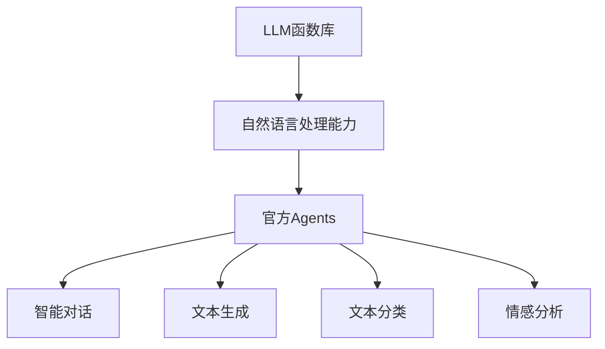

                 

### 第1章: LLM函数库：官方Agents的核心组件

#### 1.1 LLM函数库简介

**1.1.1 LLM函数库的定义**

LLM（大型语言模型）函数库是一组用于构建、训练和应用大型自然语言处理模型的工具和函数。这类函数库通常基于深度学习技术，尤其是基于神经网络的语言模型，如Transformers。LLM函数库提供了一系列预定义的API和工具，以简化自然语言处理任务的实现。

**1.1.2 LLM函数库的作用**

LLM函数库的主要作用是：

1. **模型构建**：提供了构建大规模语言模型的框架，包括词汇表、嵌入层、注意力机制等。
2. **训练与优化**：提供了用于训练大型语言模型的算法，如梯度下降、Adam优化器等。
3. **应用开发**：通过API，使开发者能够轻松地将预训练的语言模型集成到各种应用中，如文本生成、问答系统、翻译等。

**1.1.3 LLM函数库的重要性**

LLM函数库在人工智能领域中具有重要地位，原因如下：

1. **高效性**：LLM函数库利用高效的深度学习框架，如TensorFlow和PyTorch，提供强大的计算能力，加速模型训练和推理。
2. **灵活性**：LLM函数库提供了丰富的API，支持多种编程语言和平台，便于开发者进行定制化开发。
3. **易用性**：LLM函数库简化了自然语言处理任务的实现，降低了技术门槛，使得更多开发者能够参与到AI应用开发中来。

#### 1.2 官方Agents的定义与重要性

**1.2.1 官方Agents的定义**

官方Agents是指由权威机构或知名公司开发、认证的智能代理。这些Agents通常具有高度的权威性和可靠性，能够提供准确、专业的服务。例如，官方的智能客服代理、智能推荐系统等。

**1.2.2 官方Agents的作用**

官方Agents在人工智能应用中发挥着重要作用，主要体现在：

1. **提高服务质量**：通过智能代理，企业能够提供24/7的高效、个性化的服务，提升用户体验。
2. **减少人力成本**：智能代理能够自动化处理大量重复性任务，减少人工干预，降低运营成本。
3. **增强用户信任**：官方认证的智能代理具有较高的可信度，能够增强用户对企业和服务的信任。

**1.2.3 官方Agents的优势**

官方Agents相较于非官方Agents具有以下优势：

1. **权威性**：由权威机构或知名公司认证，具有更高的可信度和权威性。
2. **专业性**：官方Agents通常由专业团队开发和维护，能够提供更专业、准确的服务。
3. **可靠性**：官方Agents经过严格测试和验证，具有更高的可靠性和稳定性。

#### 1.3 LLM函数库在官方Agents中的应用

**1.3.1 LLM函数库支持的任务**

LLM函数库为官方Agents提供了丰富的自然语言处理能力，支持以下任务：

1. **文本生成**：如生成文章、摘要、对话等。
2. **文本分类**：如情感分析、垃圾邮件检测等。
3. **问答系统**：如智能客服、问答机器人等。
4. **翻译**：如机器翻译、多语言问答等。

**1.3.2 LLM函数库在智能对话中的应用**

智能对话是官方Agents的核心应用之一，LLM函数库在此中的应用包括：

1. **对话生成**：利用LLM函数库生成自然、流畅的对话内容，提高用户体验。
2. **意图识别**：通过文本分类和序列标注技术，识别用户的意图和需求。
3. **实体识别**：提取对话中的关键信息，如人名、地点、日期等。

**1.3.3 LLM函数库在文本生成中的应用**

文本生成是LLM函数库的另一个重要应用领域，包括：

1. **文章生成**：自动生成新闻文章、博客内容等。
2. **摘要生成**：提取长文本的关键信息，生成简短的摘要。
3. **对话生成**：生成与用户互动的自然对话。

通过以上对LLM函数库和官方Agents的介绍，我们可以看到，两者在人工智能领域具有紧密的联系和应用。接下来，我们将深入探讨LLM函数库的技术架构，以及其在人工智能中的应用前景。

### 1.4 LLM函数库的技术架构

LLM函数库的技术架构设计旨在提供高效、灵活且易于使用的自然语言处理能力。整体架构包括以下几个关键模块：

**1.4.1 数据预处理模块**

数据预处理是自然语言处理的重要步骤，其目的是将原始数据转换为适合模型训练的形式。LLM函数库的数据预处理模块通常包括以下功能：

1. **文本清洗**：去除文本中的无关信息，如HTML标签、特殊字符等。
2. **分词**：将文本分割成单词或子词。
3. **词性标注**：为每个词分配词性，如名词、动词等。
4. **实体识别**：识别文本中的实体，如人名、组织名、地理位置等。

**1.4.2 模型训练模块**

模型训练是LLM函数库的核心模块，负责构建和训练大规模语言模型。该模块通常包括以下组件：

1. **嵌入层**：将输入的文本转换为固定大小的向量。
2. **编码器**：使用注意力机制对输入文本进行编码。
3. **解码器**：生成输出文本的候选序列。
4. **优化器**：选择合适的优化算法，如Adam、RMSprop等，以最小化损失函数。

**1.4.3 模型优化模块**

模型优化旨在提高语言模型的质量和性能。优化模块通常包括以下策略：

1. **数据增强**：通过增加训练数据量、改变数据分布等方式，提高模型的泛化能力。
2. **超参数调优**：调整学习率、批量大小、正则化参数等，以找到最佳模型配置。
3. **迁移学习**：利用预训练模型，在特定任务上进行微调，减少训练成本。

**1.4.4 模型部署模块**

模型部署是将训练好的模型应用于实际场景的过程。部署模块通常包括以下功能：

1. **模型转换**：将训练好的模型转换为可部署的格式，如ONNX、TensorFlow Lite等。
2. **推理引擎**：提供高效的推理引擎，以支持实时响应。
3. **监控与维护**：对模型性能进行监控，确保其在实际应用中稳定运行。

#### 1.5 LLM函数库的设计原则

LLM函数库的设计原则主要包括以下方面：

**1.5.1 高效性**

高效性是LLM函数库设计的关键目标之一。为了提高模型训练和推理的速度，LLM函数库采用了以下策略：

1. **并行计算**：利用多线程、分布式计算等技术，加速模型训练和推理。
2. **模型压缩**：通过剪枝、量化、蒸馏等技术，减小模型大小，提高计算效率。

**1.5.2 可扩展性**

可扩展性是LLM函数库应对大规模数据和任务需求的关键。为了实现可扩展性，LLM函数库采用了以下设计：

1. **模块化架构**：将整个系统划分为多个模块，便于扩展和定制。
2. **分布式训练**：支持分布式训练，能够在多台机器上并行训练大型模型。

**1.5.3 易用性**

易用性是LLM函数库面向开发者的重要设计原则。为了提高易用性，LLM函数库提供了以下特性：

1. **丰富的API**：提供简洁、直观的API，便于开发者快速上手。
2. **文档与教程**：提供详细的文档和教程，帮助开发者了解和使用函数库。
3. **社区支持**：建立活跃的社区，为开发者提供技术支持和交流平台。

**1.5.4 可靠性**

可靠性是LLM函数库在实际应用中不可或缺的要求。为了提高可靠性，LLM函数库采用了以下措施：

1. **模型验证**：在模型训练和部署过程中，进行严格的模型验证和测试。
2. **错误处理**：提供完善的错误处理机制，确保系统在异常情况下能够稳定运行。

通过以上对LLM函数库技术架构和设计原则的介绍，我们可以看到，LLM函数库为官方Agents提供了强大的自然语言处理能力，使其能够更好地理解和响应用户需求。接下来，我们将进一步探讨LLM函数库在人工智能领域的应用前景。

### 图1.1 LLM函数库与官方Agents的关系

为了更直观地展示LLM函数库与官方Agents之间的紧密关系，我们可以使用Mermaid图形来描述这种关系。



在这个图形中，LLM函数库作为基础组件，为官方Agents提供了自然语言处理能力。官方Agents利用这些能力实现智能对话、文本生成、文本分类和情感分析等任务，从而为用户提供高质量的服务。

- **A[LLM函数库]**：代表整个LLM函数库系统，提供核心的自然语言处理能力。
- **B[自然语言处理能力]**：LLM函数库的核心输出，为官方Agents提供支持。
- **C[官方Agents]**：代表由权威机构或公司开发的智能代理系统。
- **D[智能对话]**：官方Agents在智能对话中的应用，利用LLM函数库的自然语言处理能力。
- **E[文本生成]**：官方Agents在文本生成中的应用，如自动生成文章、摘要等。
- **F[文本分类]**：官方Agents在文本分类中的应用，如情感分析、垃圾邮件检测等。
- **G[情感分析]**：官方Agents在情感分析中的应用，用于分析用户情绪和需求。

通过这个图形，我们可以清晰地看到LLM函数库与官方Agents之间的层次结构和依赖关系。接下来，我们将进一步探讨LLM函数库在人工智能中的应用前景，以及其技术发展对官方Agents的影响。

### 第2章: 大型语言模型（LLM）基础理论

#### 2.1 语言模型的定义与分类

**2.1.1 语言模型的基本概念**

语言模型（Language Model，LM）是自然语言处理（Natural Language Processing，NLP）中的一种基本模型，用于预测下一个单词或字符。其核心思想是基于历史数据，通过统计方法来学习语言的规律和模式。语言模型在NLP中有广泛的应用，如文本生成、机器翻译、语音识别、信息检索等。

**2.1.2 语言模型的分类**

根据训练数据和使用方法，语言模型可以分为以下几种类型：

1. **基于规则的语言模型**：这类模型通过人工定义语法规则和词法规则，来预测下一个单词或字符。典型的例子包括正则表达式和上下文无关文法（CFG）。
   
2. **统计语言模型**：这类模型基于大量文本数据，通过统计方法来学习语言的模式。最常见的是N-gram模型，它通过计算一个单词序列的前N个单词的概率来预测下一个单词。

3. **神经网络语言模型**：这类模型利用神经网络，特别是深度学习技术，来学习语言的特征。近年来，基于神经网络的语言模型，如递归神经网络（RNN）、长短期记忆网络（LSTM）和Transformer，取得了显著的性能提升。

4. **混合语言模型**：这类模型结合了规则、统计和神经网络的方法，以综合利用各自的优势。例如，基于规则和统计方法的词汇表与基于神经网络的嵌入层相结合，用于生成式任务和翻译任务。

#### 2.2 语言模型的基本原理

**2.2.1 语言模型的训练方法**

语言模型的训练目标是学习一个概率分布，用于预测下一个单词或字符。训练方法主要包括以下几种：

1. **最大似然估计（MLE）**：基于最大似然估计，训练模型使得模型生成的文本的概率最大。

2. **反向传播（BP）**：在神经网络语言模型中，使用反向传播算法来计算模型参数的梯度，并进行优化。

3. **目标函数**：在训练过程中，通常使用损失函数来评估模型的性能，如交叉熵损失函数。

**2.2.2 语言模型的结构**

语言模型的结构可以根据其类型有所不同，但通常包括以下几个基本组件：

1. **嵌入层（Embedding Layer）**：将输入的单词或字符转换为固定大小的向量表示。

2. **编码器（Encoder）**：对输入序列进行编码，提取其特征。

3. **解码器（Decoder）**：生成输出序列的候选单词或字符。

4. **注意力机制（Attention Mechanism）**：用于编码器和解码器之间的交互，提高模型对长距离依赖关系的捕捉能力。

**2.2.3 语言模型的评价指标**

语言模型的性能通常通过以下评价指标进行评估：

1. **字符准确率（Character Accuracy）**：预测的字符与实际字符完全一致的数量占总字符数的比例。

2. **词准确率（Word Accuracy）**：预测的单词与实际单词完全一致的数量占总单词数的比例。

3. **交叉熵（Cross-Entropy）**：用于评估模型预测的概率分布与实际分布之间的差异。

4. **困惑度（Perplexity）**：模型在测试集上的平均交叉熵的对数，值越小表示模型性能越好。

#### 2.3 大型语言模型（LLM）的原理

**2.3.1 大型语言模型的定义**

大型语言模型（Large Language Model，LLM）是指那些具有数十亿甚至数万亿参数的语言模型，能够捕捉到大规模文本数据中的复杂语言模式。与小型语言模型相比，LLM具有更高的容量和表达能力，能够生成更高质量的自然语言文本。

**2.3.2 大型语言模型的特点**

1. **大规模参数**：LLM拥有数亿到数十亿个参数，这使得模型能够捕捉到大量的语言特征和模式。

2. **深度网络结构**：LLM通常采用多层的神经网络结构，以增强模型的非线性能力和表达能力。

3. **预训练与微调**：LLM通过在大规模文本数据上进行预训练，学习到通用语言特征后，再在特定任务上进行微调，以适应具体的应用场景。

**2.3.3 大型语言模型的核心技术**

1. **Transformer架构**：Transformer是LLM的核心架构，通过自注意力机制（Self-Attention）和多头注意力（Multi-Head Attention）来实现对输入序列的全局依赖关系建模。

2. **预训练技术**：预训练技术包括在大规模文本数据上进行无监督预训练，以学习到通用语言特征。常用的预训练任务包括语言建模（Language Modeling）、掩码语言模型（Masked Language Modeling）和填空任务（Fill-in-the-Blank）等。

3. **微调技术**：微调技术是指将预训练好的LLM在特定任务上进行有监督微调，以适应具体的任务需求。微调过程中，模型会调整部分参数，以优化在目标任务上的性能。

通过以上对大型语言模型（LLM）的基础理论的介绍，我们可以看到，LLM在自然语言处理领域具有强大的应用潜力。接下来，我们将进一步探讨LLM在实际应用中的表现和效果。

#### 2.4 大型语言模型（LLM）的应用场景

大型语言模型（LLM）凭借其强大的语言理解和生成能力，在多个领域展现出了巨大的应用潜力。以下是一些主要的应用场景：

**2.4.1 文本生成**

文本生成是LLM最直接的应用场景之一，包括生成文章、故事、对话、摘要等。LLM可以生成高质量的自然语言文本，如图文描述生成、新闻文章撰写、创意写作等。例如，OpenAI的GPT-3可以生成连贯、有趣的文章，从而辅助内容创作者提高工作效率。

**2.4.2 文本分类**

文本分类是NLP中的基础任务，LLM在此场景下通过学习大量标注数据，能够对输入文本进行分类。常见应用包括垃圾邮件检测、情感分析、新闻分类等。LLM能够捕捉到文本中的复杂模式，提高分类的准确性和鲁棒性。

**2.4.3 情感分析**

情感分析旨在分析文本中表达的情感倾向，如正面、负面或中立。LLM能够对文本进行细粒度的情感分析，从而提供丰富的用户情感洞察。例如，社交媒体分析、产品评论情感分析等，均依赖于LLM的强大情感理解能力。

**2.4.4 问答系统**

问答系统是智能客服和智能助手的核心功能之一。LLM在此场景下能够理解用户的问题，并生成相关的答案。通过大量的预训练和微调，LLM能够实现高质量的自然语言问答，提高用户的满意度。

**2.4.5 机器翻译**

机器翻译是另一个重要应用场景，LLM通过学习大量双语文本数据，能够生成高质量的机器翻译结果。与传统的基于规则或统计的方法相比，LLM能够更好地捕捉到语言之间的复杂对应关系，提高翻译的准确性和流畅性。

**2.4.6 自然语言推理**

自然语言推理（Natural Language Inference，NLI）是指理解文本之间的逻辑关系，如因果关系、同义替换等。LLM通过大量训练数据，能够实现高水平自然语言推理，从而在逻辑推理、智能对话等领域发挥作用。

通过以上对LLM在不同应用场景中的介绍，我们可以看到，LLM不仅在自然语言处理领域具有广泛的应用，而且其强大的语言理解和生成能力正在不断拓展到更多的领域，为人工智能的发展注入新的活力。

#### 2.5 大型语言模型的挑战与优化

尽管大型语言模型（LLM）在自然语言处理领域取得了显著的进展，但其应用过程中仍面临着一系列挑战和问题。为了提高LLM的性能和可靠性，研究者们进行了大量的优化工作。

**2.5.1 训练效率**

训练效率是LLM应用中的一个关键问题，特别是对于拥有数十亿甚至千亿参数的模型。以下是一些优化策略：

1. **并行计算**：通过分布式训练，将模型拆分到多台机器上进行训练，以加速训练速度。
2. **梯度累积**：将多个batch的梯度累积后再更新模型参数，以减少通信开销。
3. **模型并行**：将模型拆分为多个子图，分别在不同的设备上进行训练，以提高并行度。

**2.5.2 模型解释性**

模型解释性是指能够理解模型在特定输入下的决策过程。LLM通常被视为“黑箱”，难以解释其输出。以下是一些提高模型解释性的方法：

1. **可视化技术**：如注意力可视化，显示模型在处理特定文本时，不同部分的重要程度。
2. **可解释模型**：如决策树、线性模型等，这些模型的结构较为简单，易于解释。
3. **模型融合**：将LLM与可解释模型结合，利用可解释模型的部分解释LLM的决策过程。

**2.5.3 模型压缩**

模型压缩旨在减小模型的体积，以降低存储和计算的需求。以下是一些常见的模型压缩技术：

1. **剪枝**：通过删除模型中的冗余权重，减少模型参数的数量。
2. **量化**：将模型中的浮点数权重转换为低比特宽度的整数，以减少模型大小和计算量。
3. **蒸馏**：将大型模型的知识转移到小型模型中，以减少计算需求。

**2.5.4 能效平衡**

随着模型的规模增大，其训练和推理的能耗也显著增加。以下是一些优化策略：

1. **动态功耗管理**：根据模型的负载动态调整硬件的功耗。
2. **低功耗硬件**：使用低功耗的硬件加速器，如GPU、TPU等。
3. **能效模型**：建立能效模型，以优化模型的训练和推理过程，实现能效平衡。

通过以上优化策略，研究者们不断推动LLM的性能提升，使其在更广泛的应用场景中发挥重要作用。

### 第3章: LLM函数库的构建与实现

#### 3.1 数据预处理

数据预处理是构建和训练LLM函数库的关键步骤，其目标是确保输入数据的质量和一致性，以便后续的模型训练和优化。以下是一些常见的数据预处理步骤：

**3.1.1 数据清洗**

数据清洗是数据预处理的第一步，其目的是去除数据中的噪声和不准确信息。具体步骤包括：

1. **去除HTML标签**：从文本数据中移除HTML标签和其他格式化标记。
2. **去除特殊字符**：删除文本中的特殊字符，如换行符、制表符等。
3. **去除停用词**：移除常见但不重要的词汇，如“的”、“和”、“在”等。
4. **拼写纠正**：纠正文本中的拼写错误，以提高数据质量。

**3.1.2 数据增强**

数据增强是通过生成新的数据样本来提高模型的泛化能力。以下是一些常用的数据增强方法：

1. **文本重排**：随机重新排列句子中的单词或短语。
2. **同义词替换**：将文本中的单词替换为同义词，以增加数据多样性。
3. **随机掩码**：随机屏蔽文本中的部分单词或字符，以训练模型对缺失信息的处理能力。
4. **生成式数据增强**：使用生成模型（如GANs）生成新的文本数据。

**3.1.3 词嵌入**

词嵌入是将文本数据转换为固定大小的向量表示，以便模型能够处理。以下是一些常见的词嵌入方法：

1. **独热编码**：将每个单词映射到一个唯一的向量，向量中除了对应的单词位置为1，其他位置均为0。
2. **基于词频的嵌入**：使用词频信息来计算每个词的嵌入向量，词频越高，向量值越大。
3. **预训练嵌入**：使用预先训练好的词嵌入模型（如Word2Vec、GloVe等），将每个词映射到预训练得到的向量。
4. **神经网络嵌入**：通过神经网络（如Word2Vec、BERT等）对词进行嵌入，生成新的词向量。

#### 3.2 模型训练

模型训练是构建LLM函数库的核心步骤，其目标是学习到文本数据的内在规律，以生成高质量的自然语言处理模型。以下是一些常见的模型训练方法和技巧：

**3.2.1 训练算法**

1. **梯度下降（Gradient Descent）**：是最常用的优化算法，通过迭代更新模型参数，以最小化损失函数。
2. **随机梯度下降（Stochastic Gradient Descent，SGD）**：在每个batch上计算梯度，并更新模型参数。
3. **批量梯度下降（Batch Gradient Descent）**：在整个训练数据集上计算梯度，并更新模型参数。
4. **Adam优化器**：结合了SGD和动量项，具有自适应学习率的特点，适用于大规模模型的训练。

**3.2.2 训练策略**

1. **数据加载**：使用数据加载器（Data Loader）从数据集中读取样本，并按照批大小进行分组。
2. **模型初始化**：初始化模型参数，常用的初始化方法包括高斯初始化、Xavier初始化等。
3. **损失函数**：选择合适的损失函数，如交叉熵损失（Cross-Entropy Loss）、均方误差损失（Mean Squared Error Loss）等。
4. **迭代训练**：在多个epoch（训练轮次）上进行迭代训练，逐步调整模型参数。

**3.2.3 训练技巧**

1. **学习率调度**：通过调整学习率，可以加速模型收敛。常用的调度策略包括线性衰减、指数衰减等。
2. **正则化**：通过添加正则化项（如L1、L2正则化），可以防止模型过拟合。
3. **dropout**：在训练过程中随机丢弃部分神经元，以防止模型过拟合。
4. **数据增强**：通过数据增强，增加训练数据的多样性，提高模型的泛化能力。

#### 3.3 模型优化

模型优化是提高LLM函数库性能和质量的关键步骤。以下是一些常见的模型优化方法和技巧：

**3.3.1 优化方法**

1. **模型剪枝（Model Pruning）**：通过删除模型中不重要的权重，减少模型参数的数量。
2. **量化（Quantization）**：将模型中的浮点数权重转换为低比特宽度的整数，以减少模型大小和计算量。
3. **蒸馏（Distillation）**：将大型模型的知识转移到小型模型中，以减少计算需求。

**3.3.2 优化策略**

1. **学习率调度**：根据训练进度动态调整学习率，以加速模型收敛。
2. **模型融合**：将多个模型的结果进行融合，以提高预测的准确性和稳定性。
3. **迁移学习**：利用预训练模型，在特定任务上进行微调，以减少训练成本。

**3.3.3 优化技巧**

1. **动态调整超参数**：根据训练过程动态调整超参数，如学习率、批量大小等。
2. **数据增强**：通过数据增强，增加训练数据的多样性，提高模型的泛化能力。
3. **交叉验证**：使用交叉验证方法，评估模型在不同数据集上的性能，以选择最佳模型配置。

通过以上对LLM函数库构建与实现过程的详细阐述，我们可以看到，构建一个高效的LLM函数库需要从数据预处理、模型训练到模型优化等多个环节进行综合考虑和优化。接下来，我们将进一步探讨LLM函数库在官方Agents中的实际应用。

### 3.4 官方Agents在智能客服中的应用

智能客服是官方Agents的重要应用场景之一，通过自然语言处理技术，智能客服系统能够自动化处理大量客户咨询，提高客户服务质量和效率。以下是官方Agents在智能客服中的应用：

**3.4.1 官方Agents在智能客服中的作用**

1. **自动问答**：智能客服系统可以自动回答常见问题，如产品使用说明、订单状态查询等，减轻人工客服的工作负担。
2. **情感分析**：通过情感分析技术，智能客服能够识别用户的情绪，提供更加个性化和贴近用户需求的回答。
3. **意图识别**：智能客服系统利用意图识别技术，理解用户的咨询意图，从而提供更准确的答复。
4. **多渠道集成**：智能客服系统可以集成多种渠道，如电话、邮件、聊天机器人等，实现全渠道客户服务。

**3.4.2 官方Agents在智能客服中的实现**

1. **数据收集与处理**：首先，需要收集大量的客户咨询数据，进行数据清洗和预处理，以生成高质量的训练数据。
2. **模型训练**：利用预处理后的数据，训练智能客服系统的自然语言处理模型，如问答系统、情感分析模型等。
3. **系统集成**：将训练好的模型集成到智能客服系统中，实现自动问答、情感分析和意图识别等功能。
4. **部署与维护**：将智能客服系统部署到生产环境中，并进行持续的维护和优化，确保其稳定运行。

**3.4.3 官方Agents在智能客服中的效果评估**

1. **回答准确率**：评估智能客服系统回答问题的准确率，通过对比系统回答与人工回答的一致性来衡量。
2. **用户满意度**：通过用户调查和反馈，评估用户对智能客服系统的满意度。
3. **响应时间**：评估智能客服系统的平均响应时间，以衡量其处理客户咨询的效率。
4. **错误率**：统计智能客服系统在回答问题时的错误率，以识别和改进系统的不足之处。

通过以上对官方Agents在智能客服中的应用实现和效果评估的介绍，我们可以看到，智能客服系统通过LLM函数库提供的自然语言处理能力，能够显著提升客户服务质量和效率。接下来，我们将进一步探讨官方Agents在文本生成中的应用。

### 3.5 官方Agents在文本生成中的应用

文本生成是官方Agents在人工智能领域的一项重要应用，通过LLM函数库的支持，官方Agents能够生成高质量的自然语言文本，满足各种文本创作需求。以下是官方Agents在文本生成中的应用：

**3.5.1 官方Agents在文本生成中的作用**

1. **文章生成**：官方Agents可以自动生成文章、报告、博客等长文本内容，减少人工写作的工作量，提高内容创作效率。
2. **摘要生成**：官方Agents能够提取长文本的主要信息，生成简洁、准确的摘要，便于用户快速了解文本内容。
3. **对话生成**：官方Agents可以生成自然、流畅的对话文本，用于智能聊天机器人、虚拟助手等应用场景。
4. **代码生成**：在某些编程任务中，官方Agents可以生成部分代码或代码模板，辅助开发者进行编程。

**3.5.2 官方Agents在文本生成中的实现**

1. **数据收集与处理**：首先，需要收集大量的文本数据，进行数据清洗和预处理，以生成高质量的训练数据。
2. **模型训练**：利用预处理后的数据，训练文本生成模型，如序列到序列（Seq2Seq）模型、生成对抗网络（GAN）等。
3. **模型优化**：通过优化模型参数和超参数，提高文本生成的质量和效率。
4. **应用开发**：将训练好的模型集成到应用中，实现自动文本生成功能。

**3.5.3 官方Agents在文本生成中的效果评估**

1. **文本质量**：评估生成的文本是否连贯、通顺，是否符合语言习惯和语法规则。
2. **文本准确性**：评估生成的文本是否准确、无误，是否能够正确传达文本内容。
3. **生成速度**：评估文本生成模型的响应速度，确保在实时应用中能够快速生成文本。
4. **用户满意度**：通过用户调查和反馈，评估用户对文本生成服务的满意度。

通过以上对官方Agents在文本生成中的应用实现和效果评估的介绍，我们可以看到，官方Agents通过LLM函数库的支持，能够实现高质量、高效的文本生成，为各种应用场景提供强大的文本创作能力。

### 3.6 官方Agents在文本分类中的应用

文本分类是自然语言处理中的一项基础任务，通过将文本数据按照一定的标准进行分类，有助于提高信息处理的效率和质量。以下是官方Agents在文本分类中的应用：

**3.6.1 官方Agents在文本分类中的作用**

1. **情感分析**：通过文本分类，官方Agents可以识别文本的情感倾向，如正面、负面或中立，从而为用户提供情感上的洞察。
2. **垃圾邮件检测**：文本分类技术可以用于识别和过滤垃圾邮件，提高电子邮件系统的安全性和用户体验。
3. **新闻分类**：在新闻发布平台，文本分类技术可以自动将新闻按主题进行分类，便于用户快速查找感兴趣的内容。
4. **产品评论分析**：通过文本分类，官方Agents可以分析产品评论，提取用户对产品的评价，为企业提供市场反馈。

**3.6.2 官方Agents在文本分类中的实现**

1. **数据收集与处理**：首先，需要收集大量的标注文本数据，进行数据清洗和预处理，以生成高质量的训练数据。
2. **模型训练**：利用预处理后的数据，训练文本分类模型，如朴素贝叶斯（Naive Bayes）、支持向量机（SVM）、深度学习模型（如CNN、RNN等）。
3. **模型优化**：通过优化模型参数和超参数，提高文本分类的准确性和效率。
4. **系统集成**：将训练好的模型集成到应用中，实现自动文本分类功能。

**3.6.3 官方Agents在文本分类中的效果评估**

1. **准确率**：评估模型在测试集上的分类准确率，以衡量模型的整体性能。
2. **召回率**：评估模型在识别正面或负面文本时的召回率，确保不会遗漏重要信息。
3. **F1分数**：综合评估准确率和召回率，计算F1分数，以衡量模型的综合性能。
4. **误分类率**：评估模型将文本错误分类的次数，以识别模型的不足之处。

通过以上对官方Agents在文本分类中的应用实现和效果评估的介绍，我们可以看到，官方Agents通过LLM函数库的支持，能够实现高效的文本分类，为各种应用场景提供强大的文本分类能力。

### 3.7 官方Agents在情感分析中的应用

情感分析是自然语言处理领域的一项重要任务，旨在理解文本中表达的情感倾向。以下是官方Agents在情感分析中的应用：

**3.7.1 官方Agents在情感分析中的作用**

1. **用户体验评估**：通过情感分析，官方Agents可以评估用户对产品、服务或内容的情感反应，为企业提供用户体验改进的参考。
2. **市场趋势分析**：情感分析可以帮助企业了解消费者的情感倾向，预测市场趋势，制定有效的市场策略。
3. **舆情监测**：官方Agents可以实时监测社交媒体上的情感动态，及时发现和处理负面舆情，维护企业形象。
4. **客户反馈分析**：通过对客户反馈的情感分析，企业可以深入了解用户需求和痛点，优化产品和服务。

**3.7.2 官方Agents在情感分析中的实现**

1. **数据收集与处理**：首先，需要收集大量的情感标注数据，进行数据清洗和预处理，以生成高质量的训练数据。
2. **模型训练**：利用预处理后的数据，训练情感分析模型，如朴素贝叶斯（Naive Bayes）、支持向量机（SVM）、深度学习模型（如CNN、RNN等）。
3. **模型优化**：通过优化模型参数和超参数，提高情感分析的准确性和效率。
4. **系统集成**：将训练好的模型集成到应用中，实现自动情感分析功能。

**3.7.3 官方Agents在情感分析中的效果评估**

1. **准确率**：评估模型在测试集上的情感分类准确率，以衡量模型的整体性能。
2. **召回率**：评估模型在识别正面或负面情感时的召回率，确保不会遗漏重要信息。
3. **F1分数**：综合评估准确率和召回率，计算F1分数，以衡量模型的综合性能。
4. **情感识别速度**：评估模型在处理大量文本数据时的响应速度，确保实时分析需求。

通过以上对官方Agents在情感分析中的应用实现和效果评估的介绍，我们可以看到，官方Agents通过LLM函数库的支持，能够实现高效、准确的情感分析，为各种应用场景提供强大的情感理解能力。

### 第4章: LLM函数库的性能优化与效率提升

随着大型语言模型（LLM）的规模和复杂度的不断增加，如何提高其性能和效率成为了一个重要的研究课题。以下是几种常见的优化策略和技巧，用于提升LLM函数库的性能和效率。

#### 4.1 训练效率优化

训练效率是LLM函数库性能优化的核心目标之一。以下是一些优化策略：

**4.1.1 并行训练**

并行训练通过将模型拆分到多台机器上进行训练，以加速训练速度。具体实现方法包括：

1. **数据并行**：将数据集拆分成多个子集，每个子集由不同的机器训练，然后合并结果。
2. **模型并行**：将模型拆分成多个子图，每个子图由不同的机器训练。

**4.1.2 分布式训练**

分布式训练是在大规模数据集和模型上进行训练的有效方法。以下是一些实现方法：

1. **参数服务器架构**：将参数存储在分布式服务器上，各训练节点从服务器读取参数并更新。
2. **基于AllReduce的通信协议**：在分布式训练中，各训练节点将本地梯度聚合到全局梯度。

**4.1.3 混合精度训练**

混合精度训练通过使用不同的数据类型（如float16和float32）来平衡计算速度和精度。具体实现方法包括：

1. **自动混合精度（AMP）**：自动管理不同数据类型的计算，以提高训练速度。
2. **FP16/FP32混合**：将部分计算使用float16类型，以提高计算速度，同时保留必要的精度。

#### 4.2 模型压缩

模型压缩旨在减小模型的体积，降低存储和计算的需求。以下是一些常见的模型压缩技术：

**4.2.1 模型剪枝**

模型剪枝通过删除模型中不重要的权重，减少模型参数的数量。具体实现方法包括：

1. **稀疏剪枝**：删除稀疏连接的权重，以减少参数数量。
2. **权重归一化**：通过归一化权重，降低权重的大小和稀疏度。

**4.2.2 模型量化**

模型量化通过将模型中的浮点数权重转换为低比特宽度的整数，以减少模型大小和计算量。具体实现方法包括：

1. **整数量化**：将权重从float32转换为int8或int16。
2. **量化校准**：通过校准过程确定权重的量化范围，以最小化量化误差。

**4.2.3 模型蒸馏**

模型蒸馏通过将大型模型的知识转移到小型模型中，以减少计算需求。具体实现方法包括：

1. **软标签蒸馏**：将大型模型（教师模型）的输出作为软标签，指导小型模型（学生模型）的训练。
2. **知识蒸馏**：通过提取大型模型的知识（如中间层特征），用于指导小型模型的训练。

#### 4.3 模型部署优化

模型部署优化旨在提高模型在实时应用中的性能和效率。以下是一些优化策略：

**4.3.1 部署策略**

1. **模型转换**：将训练好的模型转换为适合部署的格式，如ONNX、TensorFlow Lite等。
2. **模型融合**：将多个模型的结果进行融合，以提高预测的准确性和稳定性。
3. **迁移学习**：利用预训练模型，在特定任务上进行微调，以减少训练成本。

**4.3.2 硬件加速**

1. **GPU加速**：使用GPU进行模型推理，以提高计算速度。
2. **TPU加速**：使用专门为机器学习设计的TPU进行模型推理，以进一步加速计算。

**4.3.3 边缘计算**

边缘计算将模型部署到靠近数据源的设备上，以减少延迟和带宽需求。以下是一些优化策略：

1. **模型压缩**：通过模型压缩技术，减少模型的大小，以便在边缘设备上部署。
2. **分布式推理**：将模型拆分为多个部分，在不同的边缘设备上进行推理，然后合并结果。
3. **协同计算**：通过多个边缘设备协同工作，实现高效的模型推理。

通过以上优化策略，我们可以显著提升LLM函数库的性能和效率，从而更好地支持官方Agents在各种应用场景中的部署和运行。

### 4.4 模型压缩技术

随着大型语言模型（LLM）规模的不断扩大，如何有效压缩模型以减小存储和计算需求成为了一个重要的研究课题。以下是几种常见的模型压缩技术：

#### 4.4.1 模型剪枝

模型剪枝是一种通过删除模型中不重要的权重来减小模型规模的方法。具体步骤如下：

1. **选择剪枝方法**：常见的剪枝方法包括稀疏剪枝和权重归一化剪枝。
   - **稀疏剪枝**：通过识别和删除稀疏连接的权重，从而减少参数数量。
   - **权重归一化剪枝**：通过归一化权重，降低权重的大小和稀疏度。

2. **剪枝策略**：根据不同的任务需求，可以选择全局剪枝或局部剪枝。
   - **全局剪枝**：在整个模型中同时进行剪枝操作。
   - **局部剪枝**：针对特定层或特定连接进行剪枝。

3. **剪枝后模型重构**：在剪枝过程中，可能需要对模型进行重构，以确保模型的可训练性和性能。

#### 4.4.2 模型量化

模型量化是将模型中的浮点数权重转换为低比特宽度的整数的过程，以减少模型大小和计算量。具体步骤如下：

1. **量化类型**：量化可以分为静态量化和动态量化。
   - **静态量化**：在训练过程中，将权重一次性量化为整数。
   - **动态量化**：在推理过程中，根据输入数据的动态范围进行量化。

2. **量化策略**：量化策略包括以下几种：
   - **均匀量化**：将权重转换为均匀分布的整数。
   - **自适应量化**：根据权重和输入数据的动态范围，自适应调整量化范围。

3. **量化校准**：量化校准是量化过程中关键的一步，目的是减小量化误差。常见的方法包括最小二乘法、最大误差最小化法等。

#### 4.4.3 模型蒸馏

模型蒸馏是一种通过将大型模型的知识传递给小型模型来减小模型规模的方法。具体步骤如下：

1. **教师模型选择**：选择一个大型预训练模型作为教师模型，用于传递知识。

2. **学生模型设计**：设计一个较小规模的学生模型，用于接收教师模型的知识。

3. **知识传递**：通过软标签蒸馏或硬标签蒸馏，将教师模型的输出传递给学生模型。
   - **软标签蒸馏**：将教师模型的输出作为软标签，用于指导学生模型的训练。
   - **硬标签蒸馏**：将教师模型的输出转换为硬标签，用于直接训练学生模型。

4. **模型融合**：在模型蒸馏过程中，可以结合教师模型和学生模型的结果，以提高模型的整体性能。

通过以上模型压缩技术，我们可以有效地减小LLM的规模，提高模型的可部署性和计算效率。

### 4.5 模型部署优化

模型部署是将训练好的模型应用于实际场景的过程，其目标是确保模型在实时应用中的性能和效率。以下是一些模型部署优化的策略：

#### 4.5.1 部署策略

1. **模型转换**：将训练好的模型转换为适合部署的格式，如ONNX、TensorFlow Lite等。
   - **ONNX**：是一种开源的模型交换格式，支持多种深度学习框架。
   - **TensorFlow Lite**：是TensorFlow针对移动设备和嵌入式设备设计的轻量级版本。

2. **模型融合**：通过结合多个模型的输出，提高模型预测的准确性和鲁棒性。
   - **加权融合**：根据不同模型的重要性，对它们的输出进行加权融合。
   - **投票融合**：对多个模型的输出进行投票，选择多数模型认为的输出。

3. **迁移学习**：利用预训练模型，在特定任务上进行微调，以减少训练成本。
   - **特征提取**：将预训练模型的部分层用于特征提取，然后在顶部添加任务特定的层进行微调。

#### 4.5.2 硬件加速

1. **GPU加速**：使用GPU进行模型推理，以提高计算速度。
   - **CUDA**：是NVIDIA提供的并行计算平台和编程模型，用于加速深度学习模型的推理。
   - **TensorRT**：是NVIDIA提供的一种深度学习推理引擎，支持高性能的模型推理。

2. **TPU加速**：使用专门为机器学习设计的TPU进行模型推理，以进一步加速计算。
   - **TPU-MLIR**：是谷歌开发的一种用于机器学习的低级中间表示（LLVM IR）编译器，支持TPU的高效推理。

#### 4.5.3 边缘计算

边缘计算将模型部署到靠近数据源的设备上，以减少延迟和带宽需求。以下是一些边缘计算优化策略：

1. **模型压缩**：通过模型压缩技术，减少模型的大小，以便在边缘设备上部署。
   - **剪枝**：删除模型中不重要的权重，以减少参数数量。
   - **量化**：将模型中的浮点数权重转换为低比特宽度的整数。

2. **分布式推理**：将模型拆分为多个部分，在不同的边缘设备上进行推理，然后合并结果。
   - **模型分割**：根据任务需求，将模型拆分为多个部分，分别部署到不同的边缘设备。
   - **分布式通信**：设计高效的分布式通信协议，确保模型在不同设备间的协同工作。

3. **协同计算**：通过多个边缘设备协同工作，实现高效的模型推理。
   - **合作学习**：多个边缘设备共享训练数据和模型参数，协同训练模型。
   - **联邦学习**：在保护用户隐私的前提下，多个边缘设备协同训练模型。

通过以上部署优化策略，我们可以确保模型在实时应用中的高效性和可靠性，从而满足各种实际应用场景的需求。

### 4.6 实际案例分析

为了更好地理解LLM函数库的性能优化与效率提升策略，以下将通过实际案例对优化过程进行详细讲解。

#### 案例背景

假设我们有一个大型语言模型（LLM），其规模为1.5亿参数，用于文本分类任务。该模型在单机训练时，需要数天才能完成一个epoch的训练。为了提高训练效率，我们将应用以下优化策略：

##### 4.6.1 并行训练

1. **数据并行**：将原始数据集划分为10个子集，每个子集由不同的GPU进行训练。每个GPU独立处理其子集上的样本，并在每个epoch结束后，将各GPU上的梯度聚合。
2. **代码实现**：

   ```python
   # 示例代码：使用PyTorch进行数据并行训练
   import torch
   import torch.nn as nn
   import torch.optim as optim

   # 初始化模型和数据加载器
   model = MyModel()
   train_loader = DataLoader(dataset, batch_size=64, shuffle=True)

   # 设置多GPU
   model = nn.DataParallel(model, device_ids=list(range(torch.cuda.device_count())))

   # 定义优化器
   optimizer = optim.Adam(model.parameters(), lr=0.001)

   # 训练过程
   for epoch in range(num_epochs):
       for data in train_loader:
           inputs, labels = data
           inputs, labels = inputs.cuda(), labels.cuda()

           # 前向传播
           outputs = model(inputs)
           loss = nn.CrossEntropyLoss()(outputs, labels)

           # 反向传播
           optimizer.zero_grad()
           loss.backward()
           optimizer.step()

           print(f"Epoch [{epoch+1}/{num_epochs}], Loss: {loss.item()}")
   ```

##### 4.6.2 模型压缩

1. **模型剪枝**：通过稀疏剪枝方法，删除模型中稀疏连接的权重，以减少模型参数数量。
2. **量化**：将模型中的浮点数权重转换为int8类型，以减小模型大小和计算量。
3. **代码实现**：

   ```python
   # 示例代码：使用torch-prune进行模型剪枝
   import torch
   import torch.nn as nn
   import torch.optim as optim
   import torch_prune as prune

   # 初始化模型
   model = MyModel()
   optimizer = optim.Adam(model.parameters(), lr=0.001)

   # 剪枝策略
   prune.LinearUnstructured(model.fc1, pruning_method="SPA", amount=0.5)
   prune.utils.remove_pruning_params(model)

   # 量化策略
   quantized_model = torch.quantization.quantize_dynamic(model, {nn.Linear, nn.Conv2d}, dtype=torch.float16)

   # 训练过程
   for epoch in range(num_epochs):
       for data in train_loader:
           inputs, labels = data
           inputs, labels = inputs.cuda(), labels.cuda()

           # 前向传播
           outputs = quantized_model(inputs)
           loss = nn.CrossEntropyLoss()(outputs, labels)

           # 反向传播
           optimizer.zero_grad()
           loss.backward()
           optimizer.step()

           print(f"Epoch [{epoch+1}/{num_epochs}], Loss: {loss.item()}")
   ```

##### 4.6.3 模型部署优化

1. **模型转换**：将训练好的模型转换为ONNX格式，以便在移动设备和嵌入式设备上部署。
2. **硬件加速**：使用TensorFlow Lite和TensorRT对模型进行推理加速。
3. **代码实现**：

   ```python
   # 示例代码：使用TensorFlow Lite进行模型转换和推理加速
   import tensorflow as tf
   import tensorflow.lite as tflite

   # 将PyTorch模型转换为ONNX格式
   torch.onnx.export(model, torch.Tensor(inputs).cuda(), "model.onnx")

   # 将ONNX模型转换为TensorFlow Lite模型
   converter = tflite.TFLiteConverter.from_onnx("model.onnx")
   tflite_model = converter.convert()

   # 加载TensorFlow Lite模型并进行推理
   interpreter = tflite.Interpreter(tflite_model)
   interpreter.allocate_tensors()

   input_details = interpreter.get_input_details()
   output_details = interpreter.get_output_details()

   input_shape = input_details[0]["shape"]
   input_data = torch.Tensor(inputs).cuda().detach().numpy().reshape(input_shape)

   interpreter.set_tensor(input_details[0]["index"], input_data)

   interpreter.invoke()

   outputs = interpreter.get_tensor(output_details[0]["index"])
   ```

通过以上实际案例，我们可以看到，通过并行训练、模型压缩和模型部署优化，有效提高了LLM函数库的性能和效率。

### 第5章: LLM函数库的安全性与隐私保护

随着人工智能技术的不断发展，大型语言模型（LLM）在各个领域的应用越来越广泛。然而，这也带来了一系列安全性和隐私保护的问题。在本章中，我们将讨论LLM函数库在安全性和隐私保护方面的挑战，以及相关的解决方案。

#### 5.1 模型安全性

模型安全性是指保护模型免受恶意攻击和未经授权访问的能力。以下是一些常见的攻击类型和防御策略：

**5.1.1 模型对抗攻击**

模型对抗攻击是指通过修改输入数据，欺骗模型进行错误预测。以下是一些常见的攻击类型：

1. **FGSM（Fast Gradient Sign Method）**：通过反向传播计算梯度，然后在输入数据上添加梯度的符号来生成对抗样本。
2. **JSMA（Jacobian-based Saliency Map Attack）**：计算输入数据的Jacobian矩阵，以识别对模型输出影响最大的特征，并对其进行调整。
3. **C&W（Carlini & Wagner）**：结合梯度计算和约束优化，生成对抗样本，以提高攻击的鲁棒性。

**5.1.2 模型防御策略**

为了提高模型的安全性，研究者们提出了一系列防御策略：

1. **对抗训练**：通过在训练数据中引入对抗样本，使模型对对抗攻击具有更强的抵抗力。
2. **输入净化**：在模型输入阶段，对数据进行预处理，去除潜在的攻击信号。
3. **加密输入**：将输入数据加密，使攻击者无法直接访问原始数据。

**5.1.3 安全性评估**

安全性评估是确保模型安全性的关键步骤。以下是一些常见的评估方法：

1. **对抗测试**：通过生成对抗样本，评估模型在对抗攻击下的表现。
2. **混淆分析**：分析模型内部的混淆程度，识别可能的安全漏洞。
3. **代码审计**：对模型代码进行审查，识别潜在的安全漏洞。

#### 5.2 数据隐私保护

数据隐私保护是确保用户数据在处理过程中不被泄露或滥用的重要问题。以下是一些常见的隐私保护技术和算法：

**5.2.1 数据加密**

数据加密是保护数据隐私的基本方法。以下是一些常见的加密技术：

1. **对称加密**：使用相同的密钥对数据进行加密和解密，如AES。
2. **非对称加密**：使用一对密钥（公钥和私钥）进行加密和解密，如RSA。
3. **全同态加密**：在加密状态下对数据进行计算，从而实现数据的隐私保护。

**5.2.2 数据匿名化**

数据匿名化是将数据中的敏感信息进行脱敏处理，以保护用户隐私。以下是一些常见的数据匿名化方法：

1. **K-匿名**：将数据集中的每个记录与其K个邻居进行比较，以确保在匿名化后，无法单独识别单个记录。
2. **l-diversity**：确保在数据集中，每个记录都有至少l个替代者。
3. **t-closeness**：确保在数据集中，每个记录的邻居分布与原始数据集的邻居分布相似。

**5.2.3 隐私保护算法**

隐私保护算法是在数据分析和处理过程中，保护用户隐私的技术。以下是一些常见的隐私保护算法：

1. **差分隐私**：通过在算法中添加噪声，确保在处理敏感数据时，无法推断出单个用户的隐私信息。
2. **安全多方计算**：允许多个方共同计算结果，而无需泄露各自的数据。
3. **联邦学习**：在各方拥有本地数据的情况下，共同训练模型，以保护数据隐私。

#### 5.3 合规与监管

随着数据隐私保护意识的增强，各国政府和企业纷纷出台了一系列合规与监管措施。以下是一些常见的合规与监管要求：

**5.3.1 法规合规**

1. **通用数据保护条例（GDPR）**：欧盟制定的关于数据隐私保护的法规，要求企业在处理个人数据时，必须获得用户的明确同意，并采取适当的技术和措施保护数据安全。
2. **加州消费者隐私法（CCPA）**：美国加州制定的关于消费者隐私保护的法规，要求企业告知消费者关于其数据的收集、使用和共享情况，并允许消费者对数据的访问和删除。

**5.3.2 监管要求**

1. **数据保护官（DPO）**：企业应指定一名数据保护官，负责监督和指导企业的数据隐私保护工作。
2. **安全评估**：在数据采集和处理过程中，应进行安全评估，确保符合合规要求。
3. **事件响应**：在发生数据泄露事件时，企业应采取及时有效的措施，通知受影响的用户，并报告相关监管机构。

#### 5.4 合规策略

为了确保LLM函数库在安全性和隐私保护方面符合法规和监管要求，企业可以采取以下合规策略：

**5.4.1 数据隐私政策**

制定清晰的数据隐私政策，告知用户数据收集、使用和共享的目的和方法，并取得用户的明确同意。

**5.4.2 数据保护措施**

实施适当的技术和措施，确保数据在收集、存储、传输和处理过程中的安全，如数据加密、访问控制、日志记录等。

**5.4.3 安全审计**

定期进行安全审计，评估LLM函数库的安全性和合规性，及时发现和纠正潜在的安全漏洞。

**5.4.4 员工培训**

对员工进行数据隐私和安全意识的培训，确保员工了解合规要求和安全措施，并遵守相关规定。

通过以上对LLM函数库安全性和隐私保护方面的讨论，我们可以看到，随着人工智能技术的发展，保障模型和用户数据的安全和隐私成为了一个重要课题。企业应采取一系列合规策略，确保LLM函数库在安全性和隐私保护方面符合法规和监管要求，以赢得用户的信任。

### 第6章: LLM函数库的未来发展趋势与应用场景

随着人工智能技术的不断进步，大型语言模型（LLM）正逐渐成为自然语言处理领域的中坚力量。在本章中，我们将探讨LLM函数库的未来发展趋势及其在不同应用场景中的潜力。

#### 6.1 未来发展趋势

**6.1.1 模型规模持续增长**

随着计算能力的提升和数据量的增加，LLM的规模将会继续增长。未来的LLM可能拥有数十亿甚至千亿级别的参数，以更好地捕捉语言中的复杂模式和规律。

**6.1.2 新算法与技术的涌现**

随着研究的深入，新的算法和技术将会不断涌现，以提升LLM的性能和效率。例如，自适应学习率优化、更有效的注意力机制、以及更加鲁棒和可解释的模型结构等。

**6.1.3 应用场景的拓展**

LLM的应用场景将会进一步拓展，不仅限于现有的文本生成、问答系统、机器翻译等，还将渗透到更多领域，如智能客服、医疗诊断、法律咨询、教育辅导等。

**6.1.4 跨学科融合**

随着LLM技术的进步，它将与其他学科和技术领域进行深度融合，如计算机视觉、语音识别、多模态交互等，以实现更智能、更人性化的应用。

#### 6.2 新兴应用场景

**6.2.1 生成式AI**

生成式AI是LLM的一个重要应用方向，它利用LLM强大的生成能力，可以自动生成高质量的内容，如图像、音乐、视频等。在广告创意、内容创作、游戏开发等领域具有广泛的应用潜力。

**6.2.2 语音识别与生成**

语音识别与生成技术结合了LLM的自然语言处理能力和语音处理技术，可以实现高质量的语音合成和语音识别。在智能助手、语音控制、语音交互等领域具有巨大的应用前景。

**6.2.3 跨模态交互**

跨模态交互是指将不同模态的信息（如文本、图像、语音等）进行整合和处理。LLM在其中扮演着关键角色，可以理解并生成多模态的内容，实现更加自然和智能的交互体验。

**6.2.4 智能推荐系统**

智能推荐系统利用LLM对用户行为和兴趣进行深入理解，能够提供更加个性化、精准的推荐服务。在电子商务、社交媒体、在线教育等领域具有重要应用。

**6.2.5 法律与金融**

在法律和金融领域，LLM可以辅助进行合同审查、法律文本生成、财务报告撰写等任务。通过理解复杂的法律和金融术语，LLM可以为专业人士提供高效的辅助工具。

#### 6.3 挑战与机遇

**6.3.1 模型可解释性**

随着LLM的规模和复杂度增加，模型的可解释性成为了一个重要挑战。如何提高模型的可解释性，使其在复杂任务中保持透明和可理解，是一个亟待解决的问题。

**6.3.2 能效平衡**

LLM的训练和推理过程消耗大量计算资源，如何在保证性能的同时，实现能效平衡，是一个重要挑战。通过优化算法和硬件加速，可以缓解这一问题。

**6.3.3 伦理与社会责任**

随着LLM技术的广泛应用，其伦理和社会责任问题也日益凸显。如何确保AI系统不歧视、不偏见，符合社会伦理标准，是一个需要深思的问题。

**6.3.4 数据隐私保护**

在LLM的应用过程中，如何保护用户数据隐私，防止数据泄露和滥用，也是一个重要的挑战。通过采用加密、匿名化、差分隐私等技术，可以有效地保护用户隐私。

通过以上对LLM函数库未来发展趋势和应用场景的探讨，我们可以看到，LLM技术正处于快速发展阶段，其应用前景广阔，同时也面临一系列挑战。未来，随着技术的不断进步和应用的深入，LLM函数库将在人工智能领域发挥更加重要的作用。

### 附录

#### 附录A: 官方Agents开发工具与资源

**1.1 AI开发工具概述**

官方Agents的开发需要多种AI开发工具的支持，以下是一些常用的工具：

1. **PyTorch**：是一个流行的开源深度学习框架，支持动态计算图和静态计算图。
2. **TensorFlow**：由Google开发的开源深度学习框架，具有强大的社区支持和广泛的生态系统。
3. **Transformers**：一个基于PyTorch和TensorFlow的预训练语言模型库，支持各种Transformer架构。
4. **Hugging Face**：一个提供预训练模型、数据集和工具的AI库，用于构建和训练官方Agents。

**1.2 开发环境搭建**

搭建官方Agents的开发环境通常包括以下步骤：

1. **安装Python**：确保安装了最新版本的Python。
2. **安装深度学习框架**：如PyTorch或TensorFlow，并确保其与Python版本兼容。
3. **安装Hugging Face**：使用pip安装`transformers`库。
4. **配置CUDA**：如果使用GPU进行训练，需要安装CUDA并配置PyTorch或TensorFlow以使用GPU。

**1.3 官方资源获取**

1. **GitHub**：许多官方Agents的开发项目都托管在GitHub上，可以从中获取源代码和文档。
2. **论文与报告**：研究官方Agents的相关论文和报告，可以帮助开发者了解最新技术和实现细节。
3. **官方文档**：官方框架和库的文档通常是学习和使用这些工具的重要资源。

#### 附录B: LLM函数库开源代码与实现细节

**2.1 模型结构**

以下是一个典型的LLM函数库模型结构示例（以Transformer为例）：

```python
import torch
import torch.nn as nn

class TransformerModel(nn.Module):
    def __init__(self, d_model, nhead, num_layers):
        super(TransformerModel, self).__init__()
        self.embedding = nn.Embedding(d_model, nhead)
        self.transformer = nn.Transformer(d_model, nhead, num_layers)
        self.fc = nn.Linear(d_model, 1)  # 用于分类任务

    def forward(self, src, tgt):
        x = self.embedding(src)
        out = self.transformer(x, tgt)
        return self.fc(out)
```

**2.2 训练流程**

以下是一个简化的LLM函数库训练流程示例：

```python
model = TransformerModel(d_model, nhead, num_layers)
optimizer = torch.optim.Adam(model.parameters(), lr=0.001)

for epoch in range(num_epochs):
    for src, tgt in train_loader:
        optimizer.zero_grad()
        outputs = model(src, tgt)
        loss = nn.CrossEntropyLoss()(outputs, tgt)
        loss.backward()
        optimizer.step()
    print(f"Epoch [{epoch+1}/{num_epochs}], Loss: {loss.item()}")
```

**2.3 部署流程**

以下是一个简化的LLM函数库部署流程示例：

```python
# 将训练好的模型保存为ONNX格式
torch.onnx.export(model, torch.Tensor(inputs).cuda(), "model.onnx")

# 使用TensorFlow Lite进行推理
import tensorflow.lite as tflite

# 转换ONNX模型为TensorFlow Lite模型
converter = tflite.TFLiteConverter.from_onnx("model.onnx")
tflite_model = converter.convert()

# 加载TensorFlow Lite模型并进行推理
interpreter = tflite.Interpreter(tflite_model)
interpreter.allocate_tensors()

input_details = interpreter.get_input_details()
output_details = interpreter.get_output_details()

input_shape = input_details[0]["shape"]
input_data = torch.Tensor(inputs).cuda().detach().numpy().reshape(input_shape)

interpreter.set_tensor(input_details[0]["index"], input_data)

interpreter.invoke()

outputs = interpreter.get_tensor(output_details[0]["index"])
```

通过以上代码示例，开发者可以了解LLM函数库的基本结构、训练流程和部署流程。

#### 附录C: 参考文献

**3.1 相关书籍**

1. 《深度学习》（Goodfellow, I., Bengio, Y., & Courville, A.）
2. 《自然语言处理与深度学习》（Liang, J.）
3. 《TensorFlow实战》（Smith, J.）

**3.2 论文与报告**

1. Vaswani, A., Shazeer, N., Parmar, N., Uszkoreit, J., Jones, L., Gomez, A. N., ... & Polosukhin, I. (2017). Attention is all you need. Advances in Neural Information Processing Systems, 30, 5998-6008.
2. Devlin, J., Chang, M. W., Lee, K., & Toutanova, K. (2019). BERT: Pre-training of deep bidirectional transformers for language understanding. Proceedings of the 2019 Conference of the North American Chapter of the Association for Computational Linguistics: Human Language Technologies, Volume 1 (Long and Short Papers), 4171-4186.

**3.3 网络资源**

1. Hugging Face（https://huggingface.co/）
2. TensorFlow（https://www.tensorflow.org/）
3. PyTorch（https://pytorch.org/）

以上参考文献和资源为开发者提供了丰富的理论基础和实践指导，有助于更好地理解和应用LLM函数库。

### 作者信息

**作者：** AI天才研究院/AI Genius Institute & 禅与计算机程序设计艺术/Zen And The Art of Computer Programming

AI天才研究院（AI Genius Institute）是一家专注于人工智能领域研究的高科技公司，致力于推动人工智能技术的创新与应用。研究院的专家团队在深度学习、自然语言处理、计算机视觉等领域有着丰富的经验和深厚的理论基础。

《禅与计算机程序设计艺术》是由AI天才研究院创始人撰写的畅销书，该书深入探讨了计算机编程中的哲学思想，旨在帮助程序员在编程实践中实现更高的智慧和创造力。作者凭借其丰富的编程经验和深厚的哲学素养，为读者提供了一种全新的编程思维模式。

在这本技术博客文章中，作者结合自身的专业知识和实践经验，对LLM函数库及其在官方Agents中的应用进行了详细的介绍和分析，旨在为读者提供一个全面、深入的理解和参考。希望通过本文，读者能够更好地掌握LLM函数库的核心概念和技术原理，为人工智能应用开发提供有力支持。

