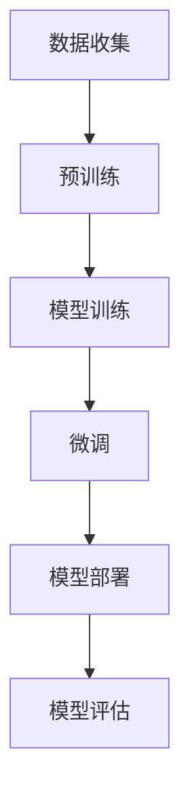

                 

# 《LLM在客户服务中的应用：24/7全天候AI助手》

## 关键词

- 语言模型
- 客户服务
- AI助手
- 预训练
- 微调
- 深度学习

## 摘要

本文将深入探讨大型语言模型（LLM）在客户服务中的应用，特别是构建24/7全天候AI助手的技术实现和优化策略。首先，我们将介绍LLM的基础知识，包括其定义、架构、核心原理以及自然语言处理基础。随后，我们将分析客户服务中的挑战与机遇，并详细讲解LLM在客户服务中的应用案例。文章还将讨论如何构建一个高效的AI助手，并进行性能评估和用户体验优化。最后，我们将展望LLM在客户服务领域的未来发展方向。

## 第一部分：LLM的基础知识

### 第1章：LLM的基本概念与架构

#### 1.1. LLM的定义、特点与优势

**定义**：语言模型（Language Model，简称LM）是一种用于预测文本中下一个单词或词组的概率分布的算法。大型语言模型（Large Language Model，简称LLM）是一种能够处理和理解大规模文本数据，并能生成高质量文本的模型。

**特点与优势**：

- **强大的文本生成能力**：LLM能够生成连贯、有意义的文本，适用于自动写作、机器翻译和对话生成等任务。
- **适应性强**：LLM可以处理多种语言和方言，适应不同的应用场景。
- **迁移学习**：LLM经过大规模预训练后，可以通过微调快速适应特定领域的任务。

#### 1.2. LLM的常见架构与技术路线

**传统语言模型**：

- **基于规则的方法**：使用手工编写的规则来预测下一个单词。
- **统计语言模型**：基于统计方法，如n-gram模型，通过计算词频来预测下一个单词。

**基于神经网络的LLM**：

- **循环神经网络（RNN）**：通过隐藏状态来记忆文本的历史信息。
- **长短时记忆网络（LSTM）**：在RNN的基础上引入门控机制，解决长期依赖问题。
- **Transformer架构**：基于自注意力机制，并行处理文本序列。

**常见的LLM架构比较**：

| 架构       | 特点                                                                                             |
|------------|------------------------------------------------------------------------------------------------|
| n-gram     | 简单，计算成本低，但表现力差，无法捕捉长距离依赖关系。                                   |
| RNN        | 能够处理变长的序列数据，但对长期依赖关系的捕捉能力有限。                                 |
| LSTM       | 引入门控机制，能更好地处理长期依赖关系，但计算复杂度高。                                 |
| Transformer| 基于自注意力机制，能并行处理序列数据，捕捉长距离依赖关系，计算效率高。                   |

#### 1.3. LLM的核心原理与关键技术

**核心原理**：

- **词嵌入（Word Embedding）**：将单词映射到高维空间中的向量，实现单词的数值表示。
- **注意力机制（Attention Mechanism）**：在处理文本序列时，模型能够自动关注重要的信息，提高文本理解的准确性。
- **Transformer架构**：基于自注意力机制，能够并行处理文本序列，捕捉长距离依赖关系。

**关键技术**：

- **预训练（Pre-training）**：在大规模无标注数据集上进行训练，使模型具备强大的文本理解能力。
- **微调（Fine-tuning）**：在特定任务上使用有标注的数据集对模型进行微调，提高模型在特定任务上的性能。
- **自监督学习（Self-supervised Learning）**：通过无监督的方式对模型进行训练，提高模型的学习效率。

### 第2章：自然语言处理基础

#### 2.1. 词嵌入与文本表示

**词嵌入的概念与作用**：

- **词嵌入（Word Embedding）**：将单词映射到高维空间中的向量表示。
- **作用**：使模型能够处理文本数据，提高文本分类、文本生成等任务的性能。

**常见的词嵌入方法**：

- **基于分布的方法**：如Word2Vec，通过计算单词的共现概率来学习词向量。
- **基于矩阵分解的方法**：如SGNS，通过矩阵分解来学习词向量。

**词嵌入在LLM中的应用**：

- **输入表示**：将输入文本编码成词向量，作为模型的输入。
- **文本生成**：使用词向量进行文本序列的建模和生成。

#### 2.2. 序列模型与注意力机制

**序列模型的基本概念**：

- **序列模型（Sequential Model）**：用于处理输入序列的模型，如RNN和LSTM。
- **基本概念**：隐藏状态、梯度流、时间步。

**注意力机制的工作原理**：

- **注意力机制（Attention Mechanism）**：在处理序列数据时，模型能够自动关注重要的信息。
- **工作原理**：计算注意力权重，将注意力分配到不同的时间步。

**序列模型在LLM中的应用**：

- **文本分类**：使用序列模型对文本进行分类。
- **文本生成**：使用序列模型生成文本序列。

#### 2.3. 转换器架构详解

**转换器架构的背景**：

- **背景**：传统的序列模型在处理长距离依赖关系时表现较差，Transformer架构应运而生。

**Encoder与Decoder的结构**：

- **Encoder（编码器）**：将输入序列编码成固定长度的向量。
- **Decoder（解码器）**：生成输出序列，并使用Encoder的输出作为上下文信息。

**转换器架构在LLM中的应用**：

- **文本生成**：使用转换器架构生成连贯的文本序列。
- **机器翻译**：使用转换器架构进行文本的跨语言翻译。

### 第3章：预训练与微调技术

#### 3.1. 预训练的概念与意义

**预训练的概念**：

- **预训练（Pre-training）**：在大规模无标注数据集上进行训练，使模型具备强大的文本理解能力。

**意义**：

- **提升性能**：通过预训练，模型可以学习到大量文本数据中的通用特征和规律，提高模型在特定任务上的性能。
- **节省时间**：预训练阶段已完成的训练工作可以减少后续任务中的训练时间。

**预训练的基本流程**：

1. **数据准备**：选择大规模无标注文本数据作为预训练的数据集。
2. **模型初始化**：初始化一个预训练模型，通常使用预训练框架提供的预训练模型或者从零开始训练一个新模型。
3. **训练过程**：在预训练阶段，模型会对输入数据进行处理，并输出预测结果。通过计算预测结果与真实值之间的损失，使用优化算法更新模型参数。
4. **评估与调整**：在每个训练epoch结束后，对模型进行评估，如果模型性能不满足要求，可能需要调整超参数或者数据预处理策略。

#### 3.2. 自监督学习方法

**自监督学习的概念**：

- **自监督学习（Self-supervised Learning）**：通过无监督的方式对模型进行训练，提高模型的学习效率。

**常见自监督学习任务**：

- **掩码语言模型（Masked Language Model，MLM）**：在输入文本中随机掩码一部分单词，然后使用模型预测这些掩码的单词。
- **预测下一个句子（Next Sentence Prediction，NSP）**：给定两个句子，预测第二个句子是否是第一个句子的下一个句子。

**自监督学习在LLM中的应用**：

- **文本生成**：使用自监督学习技术提高文本生成的质量和连贯性。
- **文本分类**：使用自监督学习技术增强模型对文本分类任务的泛化能力。

#### 3.3. 迁移学习与微调技术

**迁移学习的概念**：

- **迁移学习（Transfer Learning）**：在特定任务上使用预训练模型，通过微调快速适应新任务。

**微调的基本流程**：

1. **数据准备**：选择一个包含标签的小数据集作为微调的数据集。
2. **模型初始化**：使用预训练模型初始化微调模型，通常保留预训练阶段的权重。
3. **训练过程**：在微调阶段，模型会对输入数据进行处理，并输出预测结果。通过计算预测结果与真实值之间的损失，使用优化算法更新模型参数。
4. **评估与调整**：在每个训练epoch结束后，对模型进行评估，如果模型性能不满足要求，可能需要调整超参数或者数据预处理策略。

**微调在LLM应用中的优化策略**：

- **数据增强（Data Augmentation）**：使用数据增强技术增加训练数据量，提高模型泛化能力。
- **多任务学习（Multi-task Learning）**：同时训练多个相关任务，提高模型在不同任务上的性能。
- **分层微调（Layer-wise Fine-tuning）**：从模型的最顶层开始，逐步调整底层参数，提高模型在不同层次上的适应能力。

### Mermaid流程图：



### 核心算法原理讲解：

#### 预训练

**伪代码：**

```python
# 预训练伪代码
def pretrain(model, dataset, optimizer, epochs):
    for epoch in range(epochs):
        for batch in dataset:
            optimizer.zero_grad()
            output = model(batch.input)
            loss = compute_loss(output, batch.target)
            loss.backward()
            optimizer.step()
```

**详细讲解：**

预训练是一种在特定数据集上先进行大规模无监督学习，然后在小数据集上进行有监督学习的技术。在预训练阶段，模型会学习到数据的基本特征和规律，为后续的任务提供基础。预训练的过程通常包括以下几个步骤：

1. **数据准备**：选择大量的无标注文本数据作为预训练的数据集。
2. **模型初始化**：初始化一个预训练模型，通常使用预训练框架提供的预训练模型或者从零开始训练一个新模型。
3. **训练过程**：在预训练阶段，模型会对输入数据进行处理，并输出预测结果。通过计算预测结果与真实值之间的损失，使用优化算法更新模型参数。
4. **评估与调整**：在每个训练epoch结束后，对模型进行评估，如果模型性能不满足要求，可能需要调整超参数或者数据预处理策略。

#### 微调

**伪代码：**

```python
# 微调伪代码
def finetune(model, fine_tune_dataset, optimizer, epochs):
    for epoch in range(epochs):
        for batch in fine_tune_dataset:
            optimizer.zero_grad()
            output = model(batch.input)
            loss = compute_loss(output, batch.target)
            loss.backward()
            optimizer.step()
```

**详细讲解：**

微调是一种在预训练模型的基础上，针对特定任务进行有监督训练的技术。微调的目的是使预训练模型更好地适应特定领域的任务。微调的过程通常包括以下几个步骤：

1. **数据准备**：选择一个包含标签的小数据集作为微调的数据集。
2. **模型初始化**：使用预训练模型初始化微调模型，通常保留预训练阶段的权重。
3. **训练过程**：在微调阶段，模型会对输入数据进行处理，并输出预测结果。通过计算预测结果与真实值之间的损失，使用优化算法更新模型参数。
4. **评估与调整**：在每个训练epoch结束后，对模型进行评估，如果模型性能不满足要求，可能需要调整超参数或者数据预处理策略。

### 数学模型和数学公式

#### 预训练中的损失函数

**公式：**
$$ L = -\sum_{i=1}^{N} \sum_{j=1}^{V} p_j \log p_j(\text{word}_i | \text{context}) $$

**解释：**
上述公式表示了预训练中的损失函数，其中：
- $L$ 是总损失。
- $N$ 是句子中单词的个数。
- $V$ 是词汇表的大小。
- $p_j$ 是模型预测的单词概率分布。
- $\text{word}_i$ 是句子中的第 $i$ 个单词。
- $\text{context}$ 是单词的上下文。

损失函数计算的是模型预测的单词概率分布与真实分布之间的差异，通过最小化这个损失函数，模型可以学习到更好的文本表示。

#### 微调中的损失函数

**公式：**
$$ L = -\sum_{i=1}^{N} y_i \log(\hat{y}_i) $$

**解释：**
上述公式表示了微调中的损失函数，其中：
- $L$ 是总损失。
- $N$ 是样本的数量。
- $y_i$ 是第 $i$ 个样本的真实标签。
- $\hat{y}_i$ 是模型对第 $i$ 个样本的预测概率分布。

损失函数计算的是模型预测的概率分布与真实标签之间的差异，通过最小化这个损失函数，模型可以学习到更好的任务特定表示。

### 项目实战：代码实际案例和详细解释说明

#### 案例一：构建一个简单的LLM

**环境搭建：**

- 安装深度学习框架，如TensorFlow或PyTorch。
- 准备预训练模型，如GPT-2或BERT。

**代码实现：**

```python
# 使用GPT-2模型构建一个简单的语言模型
import torch
from transformers import GPT2Model, GPT2Tokenizer

# 加载预训练模型和分词器
tokenizer = GPT2Tokenizer.from_pretrained('gpt2')
model = GPT2Model.from_pretrained('gpt2')

# 预处理文本数据
def preprocess_text(text):
    return tokenizer.encode(text, add_special_tokens=True, return_tensors='pt')

# 生成文本样本
text = "今天天气很好，适合出去游玩。"
input_ids = preprocess_text(text)

# 进行预测
with torch.no_grad():
    outputs = model(input_ids)

# 获取生成的文本
generated_text = tokenizer.decode(outputs.logits.argmax(-1).item(), skip_special_tokens=True)
print(generated_text)
```

**详细解释：**

1. **环境搭建**：安装深度学习框架和预训练模型。
2. **加载模型和分词器**：从预训练模型库中加载GPT-2模型和对应的分词器。
3. **预处理文本数据**：使用分词器将输入文本编码成模型可以处理的格式。
4. **进行预测**：使用模型对预处理后的文本数据进行预测。
5. **获取生成的文本**：将模型生成的文本解码成人类可读的格式，并输出结果。

#### 开发环境搭建

**工具与环境：**

- **深度学习框架**：TensorFlow、PyTorch
- **操作系统**：Linux或MacOS
- **编程语言**：Python
- **依赖管理**：pip或conda

**搭建步骤：**

1. **安装深度学习框架**：

   - 使用pip安装TensorFlow：

     ```shell
     pip install tensorflow
     ```

   - 使用pip安装PyTorch：

     ```shell
     pip install torch torchvision
     ```

2. **安装依赖库**：

   - 安装其他必要库，如NumPy、Pandas等：

     ```shell
     pip install numpy pandas
     ```

3. **配置Python环境**：

   - 创建虚拟环境（可选）：

     ```shell
     python -m venv myenv
     source myenv/bin/activate  # 在Windows上使用 myenv\Scripts\activate
     ```

4. **安装预训练模型**：

   - 使用预训练模型库，如Hugging Face的Transformers：

     ```shell
     pip install transformers
     ```

### 源代码实现和代码解读

#### 案例二：构建一个用于客户服务的LLM助手

**源代码：**

```python
# 客户服务LLM助手代码示例

import torch
from transformers import GPT2LMHeadModel, GPT2Tokenizer

# 加载预训练模型和分词器
tokenizer = GPT2Tokenizer.from_pretrained('gpt2')
model = GPT2LMHeadModel.from_pretrained('gpt2')

# 初始化对话状态
context = ""

# 客户服务函数
def customer_service_query(query):
    global context
    # 预处理文本数据
    input_ids = tokenizer.encode(query + tokenizer.eos_token, add_special_tokens=True, return_tensors='pt')
    
    # 进行预测
    with torch.no_grad():
        outputs = model(input_ids, context=context)
    
    # 获取生成的文本
    generated_ids = outputs.logits.argmax(-1)[0].item()
    generated_text = tokenizer.decode(generated_ids, skip_special_tokens=True)
    
    # 更新对话状态
    context = tokenizer.encode(generated_text, add_special_tokens=True, return_tensors='pt')
    
    return generated_text

# 测试
query = "您好，我想了解如何退货？"
print(customer_service_query(query))
```

**代码解读：**

1. **加载模型和分词器**：从预训练模型库中加载GPT-2模型和对应的分词器。
2. **初始化对话状态**：创建一个全局变量`context`用于存储对话的历史上下文。
3. **客户服务函数**：
   - **预处理文本数据**：使用分词器将客户的查询编码成模型可以处理的格式，并添加EOS（End of Sentence）标记。
   - **进行预测**：使用模型对预处理后的文本数据进行预测，并获取生成的文本。
   - **更新对话状态**：将模型生成的文本编码成新的对话上下文。
4. **返回生成的文本**：将模型生成的文本解码成人类可读的格式，并返回结果。

**代码分析与优化：**

- **对话状态管理**：当前实现中，对话状态仅依赖于全局变量`context`进行管理。对于更复杂的对话场景，可以考虑使用更高效的数据结构或缓存策略来管理对话历史。
- **错误处理**：在实际应用中，需要考虑客户输入的错误或不完整的情况，并设计相应的错误处理机制。
- **性能优化**：对于需要实时响应的客户服务场景，可以优化模型加载和预测的速度，例如使用更轻量级的模型或优化模型推理过程。
- **安全性与隐私保护**：确保客户数据的保密性和安全性，避免敏感信息泄露。

### 代码解读与分析

#### 代码结构

- **模块导入**：引入所需的深度学习框架和辅助库，如`torch`和`transformers`。
- **模型和分词器加载**：从预训练模型库中加载GPT-2模型和对应的分词器。
- **全局变量**：初始化一个全局变量`context`用于存储对话的历史上下文。
- **客户服务函数**：定义一个函数`customer_service_query`用于处理客户的查询。
- **测试**：使用一个示例查询来测试客户服务函数。

#### 代码实现

1. **预处理文本数据**：
   - 使用分词器将客户的查询编码成模型可以处理的格式，并添加EOS（End of Sentence）标记。

2. **进行预测**：
   - 使用模型对预处理后的文本数据进行预测，获取模型生成的文本。

3. **更新对话状态**：
   - 将模型生成的文本编码成新的对话上下文，更新全局变量`context`。

4. **返回生成的文本**：
   - 将模型生成的文本解码成人类可读的格式，并返回结果。

#### 代码优化建议

- **对话状态管理**：
  - 对于更复杂的对话场景，可以考虑使用更高效的数据结构或缓存策略来管理对话历史。
  - 引入对话管理器，存储和管理对话状态，提高代码的可维护性。

- **错误处理**：
  - 设计异常处理机制，处理不完整或错误的用户输入。
  - 提供友好的错误提示信息，帮助用户更好地理解问题。

- **性能优化**：
  - 使用更轻量级的模型或优化模型推理过程，提高响应速度。
  - 针对实时响应需求，使用模型加速技术，如量化或模型剪枝。

- **安全性与隐私保护**：
  - 确保客户数据的保密性和安全性，避免敏感信息泄露。
  - 实施严格的访问控制和权限管理。

### 未来展望

- **技术趋势**：
  - LLM技术将继续发展和完善，包括模型结构、训练算法和推理优化。
  - 多模态数据处理和融合将成为LLM应用的重要方向。

- **应用领域**：
  - 客户服务中的LLM应用将扩展到更多行业和场景，如医疗、金融、教育等。
  - LLM在自动化内容生成、智能推荐和知识图谱构建中的应用将得到进一步探索。

- **挑战与机遇**：
  - 数据质量和隐私保护是LLM应用面临的重要挑战。
  - 模型可解释性和透明度是提高用户信任的关键。

- **企业策略**：
  - 企业需要制定明确的LLM战略，结合自身业务特点进行应用探索。
  - 加强数据治理和合规性，确保LLM应用的合法性和安全性。

### 资源链接与拓展阅读

- **LLM相关论文与资料**：
  - "Attention Is All You Need"（Attention机制）
  - "BERT: Pre-training of Deep Bidirectional Transformers for Language Understanding"（BERT模型）
  - "GPT-3: Language Models are few-shot learners"（GPT-3模型）

- **客户服务领域研究进展**：
  - "AI-Powered Customer Service: The Future of Customer Support"（AI驱动的客户服务）
  - "The Impact of AI on Customer Service"（AI对客户服务的影响）

- **开发工具与框架推荐**：
  - TensorFlow：https://www.tensorflow.org/
  - PyTorch：https://pytorch.org/
  - Hugging Face Transformers：https://huggingface.co/transformers/
  - AllenNLP：https://allennlp.org/

### 附录

#### 附录 A: 资源链接与拓展阅读

**LLM相关论文与资料**

- "Attention Is All You Need"：https://arxiv.org/abs/1706.03762
- "BERT: Pre-training of Deep Bidirectional Transformers for Language Understanding"：https://arxiv.org/abs/1810.04805
- "GPT-3: Language Models are few-shot learners"：https://arxiv.org/abs/2005.14165

**客户服务领域研究进展**

- "AI-Powered Customer Service: The Future of Customer Support"：https://www.forbes.com/sites/forbesbusinesscouncil/2020/04/16/the-future-of-customer-service-is-here-heres-why/
- "The Impact of AI on Customer Service"：https://www.customerthink.com/the-impact-of-ai-on-customer-service/

**开发工具与框架推荐**

- TensorFlow：https://www.tensorflow.org/
- PyTorch：https://pytorch.org/
- Hugging Face Transformers：https://huggingface.co/transformers/
- AllenNLP：https://allennlp.org/

