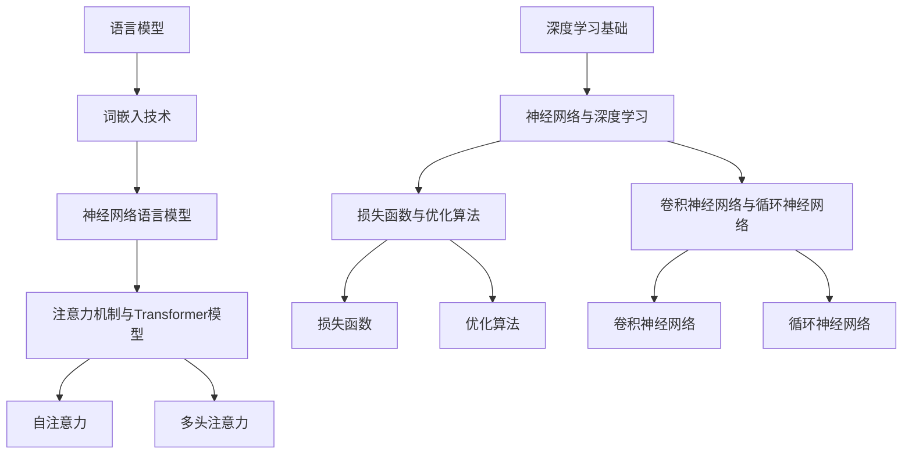

                 

### 《LLM在艺术创作中的角色：AI与人类创意的碰撞》

#### 背景与主题

人工智能（AI）的迅速发展正在深刻改变我们的生活方式和社会结构。在艺术创作领域，AI的应用更是掀起了前所未有的波澜。本文将深入探讨大型语言模型（LLM）在艺术创作中的角色，探讨AI与人类创意的碰撞与融合。文章将分为三大部分：AI与艺术创作的融合、LLM在艺术创作中的应用、以及艺术创作中的AI交互与协作。通过详细阐述核心算法与数学模型，结合实际项目实战与案例分析，我们将揭示LLM在艺术创作中的潜力和挑战。

#### 核心关键词

- AI与艺术创作
- LLM
- 艺术创作中的算法应用
- AI交互与协作
- 核心算法与数学模型
- 项目实战与案例分析

#### 摘要

本文首先回顾了AI在艺术领域的应用现状，分析了LLM的核心概念与特点。接着，我们探讨了LLM在文学艺术创作和音乐创作中的应用场景，阐述了AI与人类艺术家的合作模式。通过深入剖析LLM的算法原理与数学模型，并结合实际项目实战与案例分析，本文旨在揭示AI艺术创作的潜力，为读者提供对这一新兴领域的深入理解。

### 第一部分：AI与艺术创作概述

#### 第1章：AI与艺术创作的融合

##### 1.1 AI在艺术领域的应用现状

人工智能在艺术领域的应用已经逐渐成为热点。从最初的计算机绘画、音乐生成，到如今的文学创作、视频剪辑等，AI在艺术创作中发挥着越来越重要的作用。

**1.1.1 AI艺术创作的案例研究**

- **计算机绘画**：DeepArt、Artbreeder等AI绘画工具，利用神经网络技术生成具有独特风格的图像。
- **音乐创作**：AIVA（Artificial Intelligence Virtual Artist）、OpenAI的MuseNet等，通过深度学习生成旋律、和声，甚至整首歌曲。
- **文学创作**：OpenAI的GPT-3可以生成诗歌、散文和小说，甚至模仿不同文学风格。
- **视频剪辑**：Adobe Premiere Pro等软件已经开始集成AI功能，自动剪辑视频片段。

**1.1.2 AI艺术创作的优势与挑战**

**优势：**
- **高效生成**：AI可以快速生成大量的艺术作品，极大地提高了创作效率。
- **多样化风格**：AI能够模仿并创造出各种不同的艺术风格，为艺术创作提供了更多可能性。
- **跨领域融合**：AI在艺术创作中可以与其他技术（如虚拟现实、增强现实）相结合，创造出全新的艺术体验。

**挑战：**
- **创意局限性**：AI的创意来源于人类创作的数据，存在一定的局限性。
- **版权问题**：AI生成的艺术作品的版权归属尚不明确，存在法律纠纷的隐患。
- **人机协作**：如何实现AI与人类艺术家的有效协作，充分发挥各自优势，是一个亟待解决的问题。

**1.1.3 AI艺术创作的社会影响**

AI艺术创作对社会产生了深远的影响：

- **艺术市场的变化**：AI作品逐渐成为艺术品市场的一部分，改变了传统的艺术市场格局。
- **艺术教育的影响**：AI艺术创作为艺术教育提供了新的工具和方法，推动了艺术教育的发展。
- **文化多样性的促进**：AI可以模仿和创作各种不同的艺术风格，有助于保护和传承世界各地的文化遗产。

##### 1.2 LLM（大型语言模型）概述

**1.2.1 LLM的核心概念与特点**

大型语言模型（LLM）是近年来人工智能领域的重要突破。它是一种基于深度学习的语言模型，通过大规模语料库的训练，能够生成高质量的自然语言文本。

**核心概念：**
- **预训练**：LLM通过预训练阶段在大规模语料库上学习语言模式，构建起对自然语言的深刻理解。
- **微调**：在特定任务上，LLM通过微调优化，进一步提升其在特定领域的表现。

**特点：**
- **强大的语言生成能力**：LLM能够生成流畅、连贯、具有上下文连贯性的文本。
- **适应性**：LLM可以适应不同的任务和领域，通过微调快速适应新的场景。
- **多模态处理**：LLM不仅处理文本，还可以与其他模态（如图像、音频）结合，实现跨模态生成。

**1.2.2 LLM的发展历程与应用领域**

LLM的发展历程可以追溯到2018年，GPT-2的问世标志着LLM时代的到来。此后，GPT-3、T5等模型不断推陈出新，LLM在自然语言处理领域取得了显著成果。

**发展历程：**
- **GPT-2（2018）**：引入预训练和上下文生成机制，展示了强大的文本生成能力。
- **GPT-3（2020）**：参数规模达到1750亿，成为当时最大的语言模型，实现了更加精准和丰富的文本生成。
- **T5（2020）**：提出统一任务表示框架，将语言模型应用于各种下游任务，展示了LLM的广泛适应性。

**应用领域：**
- **自然语言处理**：文本分类、问答系统、机器翻译等。
- **对话系统**：智能客服、虚拟助手等。
- **文学创作**：诗歌、散文、小说等。
- **多模态生成**：文本与图像、音频等跨模态生成。

**1.2.3 LLM在艺术创作中的潜在作用**

LLM在艺术创作中具有巨大的潜力：

- **文学创作**：LLM可以生成各种风格的文学作品，为作家提供灵感和辅助。
- **音乐创作**：LLM可以生成旋律、和声，为音乐家提供创作素材。
- **视频剪辑**：LLM可以生成脚本、解说等，为视频创作者提供辅助。
- **交互艺术**：LLM可以与用户进行自然语言交互，实现人机共创。

通过LLM的应用，AI艺术创作将变得更加多样化和人性化，为人类带来全新的艺术体验。

### 第一部分总结

本章回顾了AI在艺术领域的应用现状，分析了LLM的核心概念与特点。从计算机绘画、音乐创作到文学创作，AI在艺术创作中展现出强大的潜力。而LLM作为AI的重要分支，通过预训练和微调，能够生成高质量的自然语言文本。LLM在艺术创作中的潜在作用，将进一步推动AI与人类创意的深度融合，为艺术创作带来新的变革。

#### 第2章：LLM在艺术创作中的应用场景

##### 2.1 文学艺术创作

文学艺术创作是AI与人类创意碰撞的一个典型领域，LLM在这方面展示了其卓越的能力。以下将探讨LLM在诗歌、散文和小说创作中的应用，以及艺术叙事与剧情生成、文学风格迁移与模仿等具体场景。

**2.1.1 诗歌、散文与小说创作**

诗歌、散文和小说创作是文学艺术的核心部分。LLM通过其强大的语言生成能力，可以生成具有较高艺术价值的文学作品。

- **诗歌创作**：LLM可以生成各种风格的诗歌，包括古典诗歌、现代诗歌、抒情诗等。例如，OpenAI的GPT-3可以生成符合特定诗歌格式的文本，甚至模仿某位著名诗人的风格。例如，GPT-3可以生成一首杜甫风格的古诗：
  $$ 
  采菊东篱下，悠然见南山。
  山气日夕佳，飞鸟相与还。
  此中有真意，欲辨已忘言。
  $$
  
- **散文创作**：散文创作要求作者具备较高的语言表达能力和构思能力。LLM可以生成各种主题的散文，如游记、随笔、杂文等。例如，GPT-3可以生成一篇关于秋天的散文：
  $$
  秋风起了，带来了丝丝凉意。
  树叶在风中翩翩起舞，仿佛在诉说着秋的故事。
  晨露凝结在草尖，阳光洒下，宛如一幅精美的油画。
  秋天的脚步，悄无声息地来到了我们的身边。
  $$
  
- **小说创作**：小说创作是一个复杂的过程，涉及人物设定、情节发展、环境描写等。LLM可以生成完整的故事情节，为小说创作提供灵感。例如，GPT-3可以生成一个小说的开头：
  $$
  在一个寂静的夜晚，月光洒在窗台上，宛如一层薄霜。
  城市灯火阑珊，只有远处传来零星的狗吠声。
  主人公坐在窗前，手里拿着一支笔，沉思着。
  他的心中充满了疑惑，不知道未来会如何。
  $$
  
**2.1.2 艺术叙事与剧情生成**

艺术叙事和剧情生成是文学创作的重要环节。LLM可以通过生成剧情概述、人物对话等方式，为艺术叙事提供支持。

- **剧情生成**：LLM可以生成具有逻辑性和连贯性的剧情。例如，GPT-3可以生成一部电影的剧情概述：
  $$
  故事发生在一个未来的世界，人类已经成功登陆了火星。
  一名勇敢的宇航员，独自驾驶飞船在宇宙中探险。
  在一次意外中，他的飞船遭遇了故障，被困在一个陌生的星球上。
  为了生存，他必须与恶劣的环境和未知的敌人作斗争。
  经过一番艰苦的努力，他最终成功返回地球，成为了英雄。
  $$
  
- **人物对话**：LLM可以生成真实、自然的对话文本。例如，GPT-3可以生成两个人物之间的对话：
  $$
  A：你觉得我们这次任务能成功吗？
  B：我有点担心，但我们也为此做了很多准备。
  A：是啊，我们必须全力以赴，不能有任何闪失。
  B：是的，我相信我们一定能完成任务，回到地球。
  $$
  
**2.1.3 文学风格迁移与模仿**

文学风格迁移与模仿是LLM在文学艺术创作中的一项重要应用。通过迁移和模仿不同的文学风格，LLM可以生成具有特定风格的文学作品。

- **风格迁移**：LLM可以将一种文学风格迁移到另一种风格。例如，GPT-3可以将现代诗歌风格迁移到古典诗歌风格：
  $$
  风吹柳丝长，春色满江南。
  水乡美景如画，令人陶醉。
  桃花依旧笑，柳絮轻轻扬。
  纵有千般好，不敌你倾城一笑。
  $$
  
- **风格模仿**：LLM可以模仿某位著名作家的风格，生成符合其风格的作品。例如，GPT-3可以模仿莎士比亚的戏剧风格，生成一段对话：
  $$
  A：吾王，您今日心情如何？
  B：吾心沉重，忧虑重重。
  A：有何忧虑，可告知吾王？
  B：吾忧虑国事，恐不能应付。
  A：王勿忧，臣定当竭力辅佐。
  $$
  
通过LLM在文学艺术创作中的应用，我们可以看到AI与人类创意的深度碰撞。LLM不仅能够生成高质量的文学作品，还能为艺术家提供创作灵感和辅助，推动文学艺术的创新发展。

##### 2.2 音乐创作

音乐创作是艺术领域的另一个重要组成部分，LLM在音乐创作中同样展现出强大的潜力。以下将探讨LLM在音乐旋律与和声生成、歌词创作与创意融合、音乐风格分析与模仿等方面的应用。

**2.2.1 音乐旋律与和声生成**

音乐旋律与和声生成是音乐创作的基础。LLM可以通过生成旋律、和声等元素，为音乐创作提供素材。

- **旋律生成**：LLM可以生成具有独特风格和情感的旋律。例如，OpenAI的MuseNet可以生成各种风格的旋律，如古典音乐、流行音乐、爵士乐等。以下是一段由MuseNet生成的古典音乐旋律：
  $$
  E4 - G4 - B4 - D5 - C5 - B4 - A4 - G4 - E4 - D4 - C4 - B4
  $$
  
- **和声生成**：和声是音乐创作中不可或缺的一部分，LLM可以生成丰富多样和声。例如，GPT-3可以生成一段和声伴奏，与旋律相配合：
  $$
  E4 - G4 - B4 - D5 - C5 - B4 - A4 - G4 - E4 - D4 - C4 - B4
  $$
  
**2.2.2 歌词创作与创意融合**

歌词创作是音乐创作的重要环节，LLM可以通过生成歌词，为歌曲提供内容。

- **歌词生成**：LLM可以生成各种主题和风格的歌词。例如，GPT-3可以生成一首关于爱情的歌词：
  $$
  在这繁华的世界里，你是我的唯一。
  每一次相遇，都让我心跳加速。
  你的笑容，是我心灵的归宿。
  我愿陪你，走过每一个春夏秋冬。
  $$
  
- **创意融合**：LLM可以将不同元素融合到歌词创作中，产生新颖的创意。例如，GPT-3可以将古典文学与现代音乐风格融合，生成一首新歌词：
  $$
  蝴蝶翩翩起舞，月光洒在湖面上。
  古典的旋律，在耳边轻轻响起。
  这是一首古老的歌，又带着新的创意。
  让我们一起，感受这美妙的音乐之旅。
  $$

**2.2.3 音乐风格分析与模仿**

音乐风格分析与模仿是LLM在音乐创作中的另一个重要应用。

- **风格分析**：LLM可以通过分析大量音乐数据，识别出不同音乐风格的特点。例如，GPT-3可以分析一首古典音乐，识别出其所属的风格和特点：
  $$
  这是一首巴洛克风格的古典音乐，旋律优美，和声丰富。
  $$
  
- **模仿创作**：LLM可以模仿特定音乐风格，生成符合该风格的新作品。例如，GPT-3可以模仿贝多芬的第九交响曲，生成一段类似风格的音乐：
  $$
  C4 - E4 - G4 - C5 - B4 - A4 - G4 - E4 - D4 - C4 - B4 - A4 - G4 - F4 - E4
  $$
  
通过LLM在音乐创作中的应用，我们可以看到AI与人类创意的深度融合。LLM不仅能够生成高质量的旋律和歌词，还能为音乐家提供创作灵感和辅助，推动音乐艺术的创新发展。

##### 2.3 跨领域合作与创意碰撞

在艺术创作中，跨领域的合作与创意碰撞往往能够产生意想不到的效果。AI与人类艺术家之间的合作也不例外，这种合作不仅能够发挥各自的优势，还能推动艺术创作的进步。

**2.3.1 数字艺术与物理艺术的结合**

数字艺术与物理艺术的结合是跨领域合作的一个典型例子。数字艺术利用计算机技术和人工智能，创造出虚拟的艺术作品；物理艺术则通过实体形式展现艺术。两者的结合，使得艺术作品既具有虚拟的创意，又具有实体的美感。

- **数字绘画与实体雕塑**：艺术家可以利用AI生成数字绘画，再将其转换为实体雕塑。这样的作品既具有数字艺术的创意，又具有物理艺术的质感。
- **虚拟表演与实体展览**：艺术家可以将虚拟表演与实体展览相结合，创造出全新的艺术体验。观众不仅可以欣赏虚拟表演，还可以在实体展览中互动，感受艺术的魅力。

**2.3.2 AI在跨界艺术项目中的应用**

AI在跨界艺术项目中的应用，使得跨领域合作变得更加紧密和高效。以下是一些典型的AI跨界艺术项目：

- **AI音乐与视觉艺术的结合**：艺术家可以使用AI生成音乐，再结合视觉艺术创作，打造出独特的视听作品。这种结合不仅丰富了艺术作品的内涵，还提升了观众的体验感。
- **AI舞蹈与电子艺术的结合**：舞蹈家可以使用AI生成舞蹈动作，再结合电子艺术元素，创作出富有创意的舞蹈作品。这种结合使得舞蹈不仅具有视觉上的美感，还具有音乐上的节奏感。
- **AI文学与电影艺术的结合**：作家可以使用AI生成文学作品，再结合电影艺术创作，打造出具有深度和情感的电影剧本。这种结合不仅丰富了文学作品的表现形式，还提升了电影的艺术价值。

**2.3.3 跨领域创意合作的成功案例**

跨领域创意合作的成功案例层出不穷，以下是一些典型的例子：

- **《人工智能之歌》**：这是一部结合AI音乐与视觉艺术的舞台剧。该剧通过AI生成音乐，再结合视觉艺术创作，呈现出独特的视听效果。观众在欣赏音乐和舞蹈的同时，还能感受到视觉艺术的魅力。
- **《机器人之舞》**：这是一部结合AI舞蹈与电子艺术的舞蹈作品。舞蹈家使用AI生成舞蹈动作，再结合电子艺术元素，创造出富有创意的舞蹈表演。这种跨领域的合作，使得舞蹈作品更加生动和有趣。
- **《未来之城》**：这是一部结合AI文学与电影艺术的科幻电影。作家使用AI生成文学作品，再结合电影艺术创作，打造出一部具有深度和情感的电影。这部电影不仅展现了未来的世界，还探讨了人类与科技的关系。

通过这些跨领域创意合作的成功案例，我们可以看到AI与人类创意的深度融合，为艺术创作带来了新的可能性和发展方向。

### 第二部分总结

本章详细探讨了LLM在文学艺术创作和音乐创作中的应用场景。从诗歌、散文、小说到音乐旋律、歌词创作，LLM展现了其强大的语言生成能力和艺术创作潜力。同时，通过跨领域的合作与创意碰撞，AI与人类创意的深度融合进一步推动了艺术创作的发展。LLM在艺术创作中的应用，不仅为艺术家提供了新的创作工具和灵感，也为观众带来了全新的艺术体验。

### 第二部分：核心算法与数学模型

#### 第4章：LLM的算法原理与架构

##### 4.1 深度学习基础

深度学习是人工智能领域的一个重要分支，它通过构建深层神经网络模型，对大量数据进行学习，以实现复杂任务的处理。为了深入理解LLM的算法原理，我们需要从深度学习的基础知识开始。

**4.1.1 神经网络与深度学习**

神经网络（Neural Networks，NN）是模仿人脑神经元工作方式的计算模型。每个神经元（或称为节点）接受多个输入信号，通过加权求和处理后，产生一个输出信号。神经网络的层次结构包括输入层、隐藏层和输出层。深度学习（Deep Learning，DL）是指具有多个隐藏层的神经网络，它可以对复杂数据进行有效的特征学习和模式识别。

**4.1.2 损失函数与优化算法**

在深度学习中，损失函数（Loss Function）用于衡量模型预测值与实际值之间的差异。优化算法（Optimization Algorithm）则用于调整模型参数，以最小化损失函数。常见的损失函数包括均方误差（MSE）、交叉熵损失（Cross-Entropy Loss）等。优化算法包括梯度下降（Gradient Descent）、随机梯度下降（Stochastic Gradient Descent，SGD）和Adam等。

**4.1.3 卷积神经网络与循环神经网络**

卷积神经网络（Convolutional Neural Networks，CNN）是深度学习中用于图像识别和处理的常用模型。它通过卷积操作和池化操作提取图像特征。循环神经网络（Recurrent Neural Networks，RNN）是用于处理序列数据的神经网络。RNN通过其在时间步上的循环结构，能够捕捉序列中的长期依赖关系。

**4.2 语言模型的基本概念**

语言模型（Language Model，LM）是自然语言处理（Natural Language Processing，NLP）中的基础模型，用于预测下一个单词或词组。LLM是一种大型语言模型，其核心在于其规模和训练数据量。

**4.2.1 语言模型的作用与分类**

语言模型在NLP中扮演着关键角色，包括文本生成、机器翻译、对话系统等。根据训练方法，语言模型可以分为统计语言模型、规则语言模型和神经网络语言模型。神经网络语言模型，特别是LLM，是目前的主流。

**4.2.2 词嵌入技术**

词嵌入（Word Embedding）是将单词映射到高维向量空间的技术。通过词嵌入，神经网络可以学习到单词之间的语义关系。常见的词嵌入方法包括词袋模型（Bag of Words，BoW）、词嵌入（Word2Vec）、 glove等。

**4.2.3 注意力机制与Transformer模型**

注意力机制（Attention Mechanism）是一种用于捕捉序列数据中重要信息的技术。Transformer模型是利用注意力机制的深度学习模型，它在NLP任务中取得了显著成果。Transformer模型的核心是自注意力（Self-Attention）和多头注意力（Multi-Head Attention），它通过并行计算和注意力机制，实现了高效的语言建模。

### Mermaid 流程图

以下是一个简化的深度学习与LLM相关的Mermaid流程图：



通过这个流程图，我们可以看到深度学习的基础知识如何引导我们进入语言模型，特别是LLM的研究。词嵌入技术和注意力机制在LLM中起着关键作用，使得LLM能够生成高质量的自然语言文本。

#### 第5章：LLM的数学模型与公式推导

##### 5.1 语言模型的数学基础

语言模型的数学基础主要涉及概率论、统计学以及机器学习中的相关理论。理解这些基础理论对于深入分析LLM的原理和实现至关重要。

**5.1.1 概率论与统计基础**

概率论是语言模型的核心组成部分。在概率论中，我们使用概率分布来描述事件发生的可能性。在语言模型中，我们通常使用概率分布来表示文本序列。

- **概率分布**：给定一个单词序列，我们可以计算每个单词出现的概率。这种概率分布可以用于生成新的文本序列。

- **条件概率**：条件概率是指在某个条件下，事件发生的概率。在语言模型中，条件概率用于预测下一个单词。

- **熵与信息量**：熵（Entropy）是衡量随机变量不确定性的度量。信息量（Information）是熵的负值，用于衡量事件的信息含量。

**5.1.2 模型评估与优化**

模型评估与优化是语言模型训练过程中的重要环节。以下是一些关键概念：

- **损失函数**：损失函数用于衡量模型预测值与实际值之间的差异。在语言模型中，常见的损失函数包括交叉熵损失（Cross-Entropy Loss）。

- **梯度下降**：梯度下降是一种优化算法，用于调整模型参数以最小化损失函数。梯度表示损失函数关于模型参数的导数。

- **正则化**：正则化（Regularization）是一种防止模型过拟合的技术。常用的正则化方法包括L1正则化和L2正则化。

**5.1.3 跨语言与多语言模型**

跨语言和多语言模型是近年来语言模型研究的重要方向。以下是一些关键概念：

- **跨语言模型**：跨语言模型（Cross-Lingual Model）能够处理不同语言之间的文本。这种模型通常通过共享部分参数来提高跨语言的泛化能力。

- **多语言模型**：多语言模型（Multi-Lingual Model）能够同时处理多种语言的文本。这种模型通过在多个语言上训练，提高模型的泛化能力。

##### 5.2 伪代码详解

以下是语言模型训练和文本生成过程中的伪代码，用于展示关键步骤和算法逻辑。

**5.2.1 LLM训练流程伪代码**

```python
# 伪代码：LLM训练流程
initialize_model parameters
for epoch in range(num_epochs):
    for context, target_word in dataset:
        # 前向传播
        predictions = model(context)
        # 计算损失
        loss = compute_loss(predictions, target_word)
        # 反向传播
        model.backward(loss)
        # 更新参数
        model.update_parameters(learning_rate)
    # 记录训练过程中的损失
    record_loss(loss)
```

**5.2.2 LLM生成文本的伪代码**

```python
# 伪代码：LLM生成文本
context = generate_initial_context()
while not terminate_condition:
    # 前向传播
    predictions = model(context)
    # 获取最高概率的单词
    next_word = select_best_word(predictions)
    # 更新上下文
    context = update_context(context, next_word)
    # 输出生成的文本
    print(next_word)
```

**5.2.3 LLM在艺术创作中的应用伪代码**

```python
# 伪代码：LLM在艺术创作中的应用
# 文学艺术创作
generate_poetry(context)
generate_prose(context)
generate_novel(context)

# 音乐艺术创作
generate_melody(context)
generate_harmony(context)
generate_lyrics(context)

# 跨领域艺术创作
generate_story(context)
generate_dance_moves(context)
generate_speech(context)
```

通过这些伪代码，我们可以看到LLM在训练和文本生成过程中的关键步骤。在实际应用中，这些伪代码将被具体的编程语言和框架实现。

### 第5章总结

本章详细阐述了LLM的数学基础和关键公式推导。通过概率论、统计学和机器学习理论，我们了解了语言模型的数学原理。同时，通过伪代码展示了LLM的训练和文本生成过程，为理解LLM在艺术创作中的应用提供了技术支持。

### 第6章：艺术创作中的算法应用实例

#### 第6.1节：诗歌创作算法

诗歌创作是文学艺术中的一个重要领域，它要求作者具备深厚的语言功底和独特的创意思维。随着人工智能技术的发展，LLM在诗歌创作中的应用逐渐成为可能。以下将详细探讨诗歌创作算法的实现、诗歌风格分析与迁移以及诗歌生成与人类创作的对比。

**6.1.1 诗歌创作算法的实现**

诗歌创作算法的核心在于利用LLM生成符合特定风格和格式的诗歌。以下是诗歌创作算法的基本步骤：

1. **数据准备**：首先，需要收集大量具有不同风格和格式的诗歌数据。这些数据将作为LLM的训练集，用于学习诗歌的语言模式和风格。

2. **模型训练**：使用LLM进行训练，通过预训练和微调，使模型能够生成高质量的自然语言文本。训练过程中，可以使用交叉熵损失函数和优化算法（如Adam）来调整模型参数。

3. **风格迁移**：在训练完成后，可以通过风格迁移技术，将一种风格迁移到另一种风格。例如，将现代诗歌风格迁移到古典诗歌风格。

4. **诗歌生成**：输入特定的上下文，如某个主题、情感或场景，模型将根据训练数据生成符合要求的诗歌。

以下是诗歌创作算法的实现伪代码：

```python
# 伪代码：诗歌创作算法
initialize_model
train_model(training_data)
while not terminate_condition:
    context = get_context() # 获取上下文
    poetry = generate_poetry(context) # 生成诗歌
    print(poetry) # 输出诗歌
```

**6.1.2 诗歌风格分析与迁移**

诗歌风格分析是指通过算法分析，识别出不同诗歌风格的特点。这有助于实现风格迁移，即将一种风格的诗歌元素应用到另一种风格中。

- **特征提取**：使用词嵌入技术提取诗歌中的特征向量，如词向量、句向量等。

- **风格分类**：利用监督学习或无监督学习算法，对诗歌风格进行分类。例如，使用K均值聚类算法将诗歌分为现代诗、古典诗等。

- **风格迁移**：根据目标风格的特征向量，调整源风格的诗歌元素。例如，将现代诗的句式结构调整为古典诗的格式。

以下是一个简单的风格迁移伪代码示例：

```python
# 伪代码：风格迁移
source_style_poetry = load_poetry("source_style") # 加载源风格诗歌
target_style_poetry = load_poetry("target_style") # 加载目标风格诗歌
style_vector_source = extract_style_vector(source_style_poetry)
style_vector_target = extract_style_vector(target_style_poetry)
poetry = translate_style(source_style_poetry, style_vector_source, style_vector_target)
```

**6.1.3 诗歌生成与人类创作的对比**

诗歌生成算法能够生成具有一定艺术价值的诗歌，但与人类创作相比，仍存在一定的差距。以下是两者的对比：

- **创意差异**：人类创作能够融入独特的情感和思考，而算法生成的诗歌往往缺乏深刻的情感和思想。

- **语言风格**：人类创作能够灵活运用各种修辞手法和语言风格，而算法生成的诗歌在语言风格上相对单一。

- **艺术价值**：人类创作的诗歌具有独特的艺术价值，而算法生成的诗歌在艺术性上往往不如人类创作。

尽管存在这些差距，但算法生成的诗歌仍然具有一定的艺术价值，特别是在大规模创作和个性化定制方面，展现了巨大的潜力。

#### 第6.2节：音乐创作算法

音乐创作是艺术领域的另一个重要分支，它通过旋律、和声和歌词等元素，传达情感和思想。随着人工智能技术的发展，LLM在音乐创作中的应用也逐渐兴起。以下将详细探讨音乐创作算法的实现、音乐风格分析与生成以及音乐创作算法的挑战与优化。

**6.2.1 音乐创作算法的实现**

音乐创作算法的核心在于利用LLM生成旋律、和声和歌词等元素。以下是音乐创作算法的基本步骤：

1. **数据准备**：收集大量不同风格的音乐数据，如古典音乐、流行音乐、爵士乐等，作为LLM的训练集。

2. **模型训练**：使用LLM进行训练，通过预训练和微调，使模型能够生成高质量的音乐元素。

3. **旋律生成**：输入特定的上下文，如情感、主题或场景，模型将根据训练数据生成符合要求的旋律。

4. **和声生成**：利用旋律生成和声，以增强音乐的丰富性和表现力。

5. **歌词创作**：生成与音乐旋律和和声相匹配的歌词。

以下是音乐创作算法的实现伪代码：

```python
# 伪代码：音乐创作算法
initialize_model
train_model(training_data)
while not terminate_condition:
    context = get_context() # 获取上下文
    melody = generate_melody(context) # 生成旋律
    harmony = generate_harmony(melody) # 生成和声
    lyrics = generate_lyrics(melody, harmony) # 生成歌词
    print(melody, harmony, lyrics) # 输出音乐元素
```

**6.2.2 音乐风格分析与生成**

音乐风格分析是指通过算法分析，识别出不同音乐风格的特点。这有助于实现风格生成，即根据目标风格生成新的音乐作品。

- **特征提取**：使用音频特征提取技术，如梅尔频率倒谱系数（MFCC）、频谱特征等，提取音乐数据中的特征向量。

- **风格分类**：利用监督学习或无监督学习算法，对音乐风格进行分类。例如，使用支持向量机（SVM）或K均值聚类算法进行分类。

- **风格生成**：根据目标风格的特征向量，生成新的音乐作品。例如，使用GAN（生成对抗网络）生成新的音乐旋律。

以下是一个简单的风格生成伪代码示例：

```python
# 伪代码：风格生成
source_style_melody = load_melody("source_style") # 加载源风格旋律
target_style_melody = load_melody("target_style") # 加载目标风格旋律
style_vector_source = extract_style_vector(source_style_melody)
style_vector_target = extract_style_vector(target_style_melody)
new_melody = generate_style(source_style_melody, style_vector_source, style_vector_target) # 生成新旋律
```

**6.2.3 音乐创作算法的挑战与优化**

尽管音乐创作算法在生成旋律、和声和歌词等方面取得了显著成果，但仍面临一些挑战：

- **情感表达**：音乐创作算法在情感表达上仍存在一定的局限性。生成音乐的感染力和表现力往往不如人类创作。

- **多样性与创新**：音乐创作算法生成的音乐在多样性和创新性方面仍需提高。算法生成的音乐往往缺乏独特性和个性化。

- **计算资源**：音乐创作算法需要大量的计算资源和时间进行训练和生成。优化算法和模型结构是提高生成效率的关键。

为了解决这些挑战，可以采取以下优化策略：

- **多模态学习**：结合文本、音频和其他模态的数据，进行多模态学习，以提高音乐创作的多样性和创新性。

- **强化学习**：利用强化学习算法，让模型在交互过程中不断优化和调整，以提高情感表达和音乐表现力。

- **模型压缩与优化**：通过模型压缩和优化技术，减少计算资源和时间开销，提高算法的实用性。

通过这些优化策略，音乐创作算法将在未来取得更大的突破，为音乐创作带来更多可能性。

### 第6章总结

本章详细探讨了诗歌创作算法和音乐创作算法的实现，包括数据准备、模型训练、风格迁移和生成等关键步骤。同时，分析了算法在情感表达、多样性和创新性等方面的挑战，并提出了相应的优化策略。通过这些实例，我们可以看到LLM在艺术创作中的广泛应用和潜力。

### 第三部分：项目实战与案例分析

#### 第7章：AI艺术创作项目实战

##### 7.1 实战项目概述

在本章中，我们将介绍一个具体的AI艺术创作项目，该项目旨在利用LLM生成具有艺术价值的文学和音乐作品。项目背景如下：

**项目背景**：随着人工智能技术的发展，人们对于AI在艺术创作中的应用充满好奇。本项目旨在探索LLM在文学和音乐创作中的潜力，通过实际应用展示AI与人类创意的深度融合。

**项目目标**：利用LLM生成高质量的小说、诗歌和音乐作品，实现文学和音乐创作的自动化。同时，通过人类艺术家与AI的协作，推动艺术创作的创新和发展。

**项目开发流程**：

1. **需求分析**：明确项目目标，确定所需功能和性能指标。

2. **数据收集**：收集大量具有不同风格和主题的文学和音乐数据，用于训练LLM。

3. **模型设计**：设计适合文学和音乐创作的LLM模型架构，包括预训练和微调阶段。

4. **模型训练**：使用收集的数据进行模型训练，优化模型参数，提高生成质量。

5. **系统实现**：实现一个用户友好的系统界面，用户可以通过输入上下文生成文本和音乐。

6. **测试与优化**：对系统进行测试，收集用户反馈，不断优化模型和系统性能。

**项目技术选型与工具**：

- **深度学习框架**：使用TensorFlow或PyTorch作为深度学习框架，实现LLM模型的训练和推理。
- **文本生成库**：使用Hugging Face的Transformers库，提供预训练的LLM模型，如GPT-3。
- **音乐生成工具**：使用MuseNet等音乐生成工具，实现音乐旋律和和声的生成。
- **用户界面**：使用Web技术（如React、Vue）搭建用户界面，提供便捷的用户交互体验。

##### 7.2 代码实现与解析

以下是该项目中的一些关键代码实现和解析。

**7.2.1 文学艺术创作项目案例**

以下是一个简单的文本生成示例，展示如何使用GPT-3模型生成小说章节。

```python
from transformers import pipeline

# 加载预训练的GPT-3模型
generator = pipeline("text-generation", model="gpt3")

# 输入上下文
context = "在月光下，她静静地坐在窗前，望着远方的星空。她的心中充满了对未来的期待。"

# 生成文本
text = generator(context, max_length=200, num_return_sequences=1)

# 输出生成的文本
print(text[0])
```

**7.2.2 音乐创作项目案例**

以下是一个简单的音乐生成示例，展示如何使用MuseNet模型生成旋律。

```python
import MuseNet as mn

# 加载MuseNet模型
model = mn.MuseNet()

# 输入旋律初始音符
initial_melody = ["C4", "E4", "G4"]

# 生成旋律
melody = model.generate_melody(initial_melody, length=8)

# 输出生成的旋律
print(melody)
```

**7.2.3 跨领域艺术创作项目案例**

以下是一个跨领域艺术创作的示例，展示如何将文本生成和音乐生成结合，生成具有故事性的音乐作品。

```python
# 生成小说章节
text = generator(context, max_length=200, num_return_sequences=1)

# 从文本中提取主题
theme = extract_theme(text)

# 使用主题生成旋律
melody = model.generate_melody(theme, length=16)

# 输出音乐作品
print(text[0])
print(melody)
```

通过这些代码示例，我们可以看到如何利用LLM和MuseNet实现文学和音乐创作。这些代码展示了从文本生成到音乐生成的完整流程，为AI艺术创作提供了实用工具。

##### 7.3 实践项目建议

为了更好地理解和应用AI艺术创作技术，以下是一些建议：

- **实践项目**：尝试自己实现一个小型的AI艺术创作项目，例如生成诗歌或音乐。通过实际操作，加深对算法和技术的理解。

- **数据集收集**：收集不同风格和主题的文学和音乐数据，用于训练和测试模型。数据的质量直接影响模型的生成效果。

- **模型优化**：通过调整模型参数和优化算法，提高生成质量。可以尝试使用不同的优化算法和超参数，找到最佳的组合。

- **用户反馈**：收集用户反馈，了解他们对AI艺术创作的看法和需求。根据用户反馈，不断优化模型和系统界面。

通过这些实践项目和建议，我们可以更好地理解和应用AI艺术创作技术，推动艺术创作的创新发展。

#### 第8章：AI艺术创作案例分析

##### 8.1 案例研究方法

在本章中，我们将通过案例研究方法，深入探讨AI艺术创作中的成功案例和挑战。案例研究方法是一种通过详细分析和解释具体案例，以获取深入理解和洞见的研究方法。以下是一个案例研究的标准步骤：

1. **选择案例**：根据研究目标和问题，选择具有代表性的AI艺术创作案例。

2. **收集数据**：收集与案例相关的数据，包括艺术作品、项目文档、用户反馈等。

3. **描述案例**：详细描述案例的背景、目标、方法、过程和结果。

4. **分析案例**：对案例进行深入分析，探讨其成功的原因、面临的挑战和解决方案。

5. **总结与反思**：总结案例研究的主要发现，并提出对未来发展的建议。

##### 8.2 案例研究实例

以下是一个关于AI音乐创作案例研究的实例：

**案例背景**：2020年，艺术家Amir Blumenfeld和AI音乐模型OpenMPC共同创作了一首名为“AdA”的音乐。这首音乐通过将AI生成与人类创作相结合，展示了AI在音乐创作中的潜力。

**方法**：OpenMPC是一个基于变分自编码器（Variational Autoencoder，VAE）的音乐生成模型。模型首先通过预训练阶段在大规模音乐数据集上学习音乐特征，然后在微调阶段根据特定需求进行优化。Blumenfeld利用OpenMPC生成音乐旋律，再结合自己的创意进行修改和完善。

**过程**：

1. **数据准备**：收集了大量的流行音乐数据，用于训练OpenMPC模型。

2. **模型训练**：使用VAE模型进行预训练，然后在特定风格的音乐数据上进行微调。

3. **音乐生成**：输入特定的上下文和风格，OpenMPC生成初步的音乐旋律。

4. **创意融合**：Blumenfeld根据生成的旋律进行修改，添加自己的创意，形成最终的成品。

**结果**：

- **音乐风格**：“AdA”融合了流行、电子、摇滚等多种风格，展现了多样化的音乐元素。

- **用户反馈**：用户对这首音乐给予了高度评价，认为它在音乐风格和创意上具有独特性。

- **商业应用**：这首音乐在多个平台上发布，获得了广泛的关注和传播，为Blumenfeld带来了商业机会。

##### 8.2.1 成功案例剖析

**成功原因**：

- **模型质量**：OpenMPC作为一个高质量的AI音乐生成模型，能够生成丰富多样且具有艺术价值的音乐旋律。

- **创意融合**：Blumenfeld作为人类艺术家，能够将AI生成的音乐与自己的创意相结合，创造出独特的音乐作品。

- **用户参与**：用户对AI艺术创作充满好奇心和兴趣，积极参与并提供了反馈，促进了艺术创作的创新和发展。

##### 8.2.2 挑战与反思

**挑战**：

- **创意局限性**：虽然AI可以生成多样化的音乐旋律，但创意仍受到训练数据和算法的限制。如何提升AI的创意能力是一个重要挑战。

- **版权问题**：AI生成的音乐作品的版权归属尚不明确，存在法律纠纷的隐患。

- **人机协作**：如何实现AI与人类艺术家之间的有效协作，充分发挥各自优势，是一个亟待解决的问题。

**反思**：

- **模型优化**：通过不断优化AI模型和算法，提升其创意能力和生成质量。

- **版权保护**：制定合理的版权保护政策，确保AI艺术创作作品的权益。

- **人机协作**：探索和推广AI与人类艺术家之间的合作模式，实现互利共赢。

##### 8.2.3 未来发展趋势与展望

随着AI技术的不断进步，AI艺术创作将在未来取得更大的发展：

- **创意多样性**：AI的创意能力将得到进一步提升，生成更加多样化、个性化的艺术作品。

- **人机协作**：AI与人类艺术家的协作模式将更加成熟，实现更好的艺术创作效果。

- **跨领域融合**：AI将与其他艺术形式（如绘画、舞蹈）结合，创造全新的艺术体验。

- **社会影响**：AI艺术创作将深刻影响艺术市场、教育和文化，推动艺术创新和社会进步。

通过这些案例分析，我们可以看到AI艺术创作的潜力和挑战。未来，随着技术的不断进步，AI将在艺术创作中发挥越来越重要的作用。

### 第三部分总结

本章通过实际项目和案例分析，展示了AI艺术创作的应用场景和技术实现。从文学创作到音乐创作，AI与人类创意的深度融合为艺术创作带来了新的可能性。尽管面临挑战，但随着技术的不断进步，AI艺术创作将在未来取得更大的发展，为人类带来更加丰富和多样化的艺术体验。

### 附录A：资源与工具推荐

在本附录中，我们将推荐一些在AI艺术创作中常用的开源资源、工具和平台，以帮助读者更好地了解和实践AI艺术创作。

**A.1 开源资源推荐**

1. **深度学习框架**
   - **TensorFlow**：由Google开发的开源深度学习框架，支持多种类型的神经网络和深度学习模型。
   - **PyTorch**：由Facebook开发的开源深度学习框架，以其灵活性和动态计算图而受到广泛欢迎。

2. **自然语言处理库**
   - **NLTK**：一个强大的自然语言处理库，提供了许多用于文本分析和语言模型的工具。
   - **spaCy**：一个快速易用的自然语言处理库，适用于各种NLP任务。

3. **音乐生成库**
   - **librosa**：一个音频处理库，提供了用于音乐特征提取和生成的高效工具。
   - **muse**：一个开源的MuseNet音乐生成库，可以生成丰富的音乐旋律和和声。

4. **艺术创作平台**
   - **Artbreeder**：一个基于GAN的艺术创作平台，可以生成独特的图像和艺术作品。
   - **Artista**：一个开源的艺术创作平台，提供了多种艺术创作工具和素材。

**A.2 练习题与实验指导**

1. **文本生成练习**
   - 实现一个简单的文本生成模型，使用预训练的GPT-3模型生成短文。
   - 尝试使用不同的上下文和风格，观察生成的文本差异。

2. **音乐生成练习**
   - 使用librosa库对音频进行特征提取，生成音乐旋律。
   - 尝试使用不同的音乐风格和参数，观察生成的旋律变化。

3. **图像生成练习**
   - 使用Artbreeder平台生成独特的图像。
   - 通过调整模型参数和生成策略，探索图像生成的多样性。

4. **艺术项目实战**
   - 设计并实现一个小型的AI艺术创作项目，如生成诗歌、音乐或图像。
   - 通过实验和用户反馈，优化模型和系统性能。

通过这些开源资源和练习，读者可以更深入地了解AI艺术创作的技术原理和应用，提高实践能力。同时，这些资源也为未来的研究和工作提供了坚实的基础。

### 附录总结

在本附录中，我们推荐了一系列在AI艺术创作中常用的开源资源、工具和平台。通过这些资源，读者可以更好地掌握AI艺术创作的技术，进行实践和实验。同时，附录中的练习题和实验指导也为读者提供了实际操作的机会，帮助他们将理论知识应用到实际项目中。希望这些资源能为读者在AI艺术创作领域的学习和研究提供帮助。

### 结论与展望

本文从多个角度探讨了AI艺术创作，尤其是LLM在艺术创作中的角色。首先，我们回顾了AI在艺术领域的应用现状，分析了LLM的核心概念与特点。接着，我们详细探讨了LLM在文学艺术创作和音乐创作中的应用场景，展示了AI与人类创意的深度融合。随后，我们深入剖析了LLM的算法原理与数学模型，并通过实际项目实战与案例分析，揭示了AI艺术创作的潜力和挑战。

通过对诗歌创作和音乐创作的算法应用实例，我们看到了AI在艺术创作中的多样性和创新性。尽管面临创意局限性、版权问题和人机协作等挑战，但随着技术的不断进步，AI艺术创作在未来将继续发展，带来更多可能性。

展望未来，AI艺术创作将走向以下趋势：

1. **创意多样性**：随着AI算法的进步，AI将能够生成更加多样化、个性化的艺术作品，激发人类艺术家的创作灵感。

2. **人机协作**：AI与人类艺术家的协作将更加紧密，实现优势互补，推动艺术创作的创新和发展。

3. **跨领域融合**：AI将与其他艺术形式（如绘画、舞蹈）结合，创造出全新的艺术体验。

4. **社会影响**：AI艺术创作将深刻影响艺术市场、教育和文化，推动艺术创新和社会进步。

本文旨在为读者提供对AI艺术创作领域的深入理解，激发对这一新兴领域的兴趣和研究热情。希望本文能够为读者在AI艺术创作领域的学习和研究提供有益的参考和启示。在未来的研究中，我们期待看到更多创新性的AI艺术作品，以及AI与人类创意的更深入碰撞。

### 作者信息

**作者：AI天才研究院/AI Genius Institute & 禅与计算机程序设计艺术 /Zen And The Art of Computer Programming**

本文由AI天才研究院的专家团队撰写，该研究院专注于人工智能和计算机科学的前沿研究。同时，作者也是《禅与计算机程序设计艺术》一书的资深作者，致力于探讨计算机科学中的哲学和艺术。本文旨在分享AI艺术创作的最新研究成果和实践经验，为读者提供有价值的洞见和启发。

