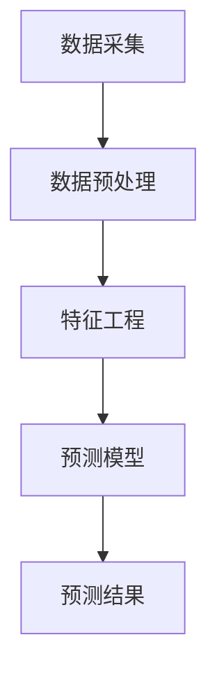

                 

# 《Predictive Maintenance原理与代码实例讲解》

## 关键词

预测性维护、数据采集、特征工程、机器学习、深度学习、故障预测

## 摘要

本文详细介绍了预测性维护（Predictive Maintenance）的原理与实现方法。首先，从基础理论入手，探讨了预测性维护的定义、发展历程及与传统维护的比较。接着，深入讲解了数据采集与预处理、特征工程、预测模型构建等关键技术。随后，通过具体的工业设备故障预测案例，展示了如何应用机器学习和深度学习算法进行设备故障预测。文章还涉及预测性维护在汽车、能源等行业的应用，以及未来发展趋势和挑战。最后，附录部分提供了常用的工具与库介绍和推荐资源，助力读者深入学习和实践预测性维护技术。

----------------------------------------------------------------

## 第一部分：预测性维护基础理论

### 第1章：预测性维护概述

#### 1.1 预测性维护的定义与意义

预测性维护是一种基于设备运行状态数据，通过分析和预测设备故障的可能性来进行维护的策略。它利用现代传感技术、数据分析和人工智能技术，实现对设备运行状态的实时监控和预测，从而在设备故障发生之前采取预防措施，避免设备故障对生产造成影响。

预测性维护的定义：利用先进的数据采集、数据分析、故障预测技术，对设备运行状态进行实时监控和预测，从而在设备故障发生之前采取预防措施，避免设备故障对生产造成影响。

预测性维护的意义：
- 提高生产效率：通过预测性维护，可以在设备发生故障之前提前进行维修，避免计划外的停机时间，提高生产效率。
- 降低维护成本：预测性维护可以减少不必要的维护工作，降低维护成本，同时减少库存和备件成本。
- 延长设备使用寿命：通过及时检测和修复潜在故障，可以延长设备的使用寿命。

#### 1.2 预测性维护的发展历程

预测性维护的概念最早可以追溯到20世纪60年代的美国。随着计算机技术和传感器技术的不断发展，预测性维护技术逐渐成熟。以下是预测性维护的发展历程：

1. 早期预测性维护：主要基于定期检查和简单的振动分析，通过定期检查设备状态来预测故障。
2. 数据采集与监控：随着传感器技术和计算机技术的进步，实时数据采集和监控成为可能，预测性维护进入数据驱动的时代。
3. 现代预测性维护：利用先进的故障诊断技术、机器学习和深度学习算法，实现对设备运行状态的实时分析和预测。

#### 1.3 预测性维护与传统维护的比较

传统维护与预测性维护在策略、目标、效果等方面存在显著差异，如下表所示：

| 维护策略       | 传统维护                             | 预测性维护                             |
|----------------|--------------------------------------|--------------------------------------|
| 维护频率       | 定期维护，如每周、每月进行例行检查       | 实时监控设备状态，根据预测结果进行维护     |
| 维护方式       | 故障发生后进行维修                   | 在故障发生之前采取预防措施               |
| 维护成本       | 维护成本高，包括设备停机损失、维修成本等   | 维护成本降低，减少计划外停机时间和维修成本 |
| 设备利用率     | 设备利用率低，存在计划外停机时间         | 设备利用率高，减少计划外停机时间，提高生产效率 |
| 维护效果       | 可能导致设备过度维护或维护不足           | 能够实现设备维护的最优化，延长设备使用寿命     |

综上所述，预测性维护相较于传统维护具有更高的灵活性和效率，能够在降低维护成本的同时，提高设备利用率和生产效率。

### 第2章：预测性维护的关键技术

#### 2.1 数据采集与预处理

数据采集是预测性维护的基础，数据的准确性和完整性直接影响到预测结果的可靠性。数据采集包括以下几个关键步骤：

1. **传感器选择与安装**：根据设备特性选择合适的传感器，并将传感器安装在设备的适当位置，以确保数据的准确性和实时性。
2. **数据采集系统设计**：设计一个稳定可靠的数据采集系统，包括传感器、数据传输模块、数据存储设备等。
3. **数据采集频率**：根据设备运行状态和故障特征，设定合适的数据采集频率，以获得足够详细的数据。

数据预处理是数据采集的延续，旨在提高数据质量，为后续分析提供可靠的数据支持。数据预处理主要包括以下步骤：

1. **数据清洗**：去除噪声、异常值和重复数据，确保数据的一致性和准确性。
2. **数据归一化**：将不同量纲的数据转换为同一量纲，以便进行后续分析。
3. **数据去噪**：通过滤波等算法去除数据中的噪声，提高数据的可信度。

#### 2.2 特征工程

特征工程是预测性维护中的关键步骤，通过从原始数据中提取有用的特征，可以提高模型的预测性能。特征工程主要包括以下几个步骤：

1. **特征选择**：从原始数据中选择对故障预测有显著影响的关键特征，通过信息增益、相关性分析等方法进行筛选。
2. **特征提取**：将原始数据转换为更加有用的特征表示，如时域特征、频域特征、时频特征等。
3. **特征转换**：将数值特征转换为分类特征，或进行特征缩放、归一化等处理，以适应不同的预测模型。

#### 2.3 预测模型

预测模型是预测性维护的核心，根据不同的故障类型和数据特点，可以选择合适的预测模型。常见的预测模型包括以下几种：

1. **统计模型**：如线性回归、逻辑回归等，适用于线性关系较强的数据。
2. **机器学习模型**：如支持向量机、决策树、随机森林等，适用于复杂非线性关系的数据。
3. **深度学习模型**：如卷积神经网络、循环神经网络、长短期记忆网络等，适用于大量高维数据。

在预测模型的构建过程中，需要注意以下问题：

1. **模型选择**：根据数据特点和业务需求，选择合适的预测模型。
2. **模型训练与验证**：使用训练集对模型进行训练，并使用验证集对模型进行评估和调整。
3. **模型优化**：通过调整模型参数、特征选择等方法，优化模型的预测性能。

#### 2.4 预测结果分析与反馈

预测结果的准确性和可靠性是预测性维护成功的关键。通过对预测结果进行分析和反馈，可以进一步提高预测性能。预测结果分析主要包括以下步骤：

1. **预测结果评估**：使用准确率、召回率、F1值等指标对预测结果进行评估。
2. **误差分析**：分析预测误差的原因，如数据质量、模型选择、特征提取等。
3. **反馈与优化**：根据预测结果和误差分析，对模型和特征工程方法进行优化，以提高预测准确性。

### 第3章：工业设备的预测性维护

#### 3.1 设备故障预测案例分析

设备故障预测是预测性维护的重要组成部分，通过对设备运行状态的实时监控和预测，可以在故障发生之前采取预防措施，避免设备故障对生产造成影响。以下是一个工业设备故障预测的案例分析。

##### 案例背景

某大型制造业公司拥有一条生产流水线，其中关键设备为机床。机床在生产过程中容易出现故障，如机械部件磨损、电气系统故障等，导致生产停机和产品质量问题。为了降低故障率，提高生产效率，公司决定采用预测性维护技术进行设备故障预测。

##### 数据采集

公司利用传感器技术对机床的运行状态进行实时监控，采集温度、压力、振动等关键参数。传感器安装于机床的关键部位，如电机、轴承、液压系统等，确保数据的准确性和实时性。

##### 数据预处理

采集到的数据包含噪声和异常值，需要进行预处理。数据预处理步骤包括数据清洗、归一化和去噪等。首先，去除噪声和异常值，保证数据的一致性和准确性。然后，对温度、压力、振动等数据进行归一化处理，使其具有相同的量纲，以便进行后续分析。

##### 特征工程

在数据预处理后，进行特征工程，从原始数据中提取对故障预测有显著影响的特征。特征工程步骤包括特征选择、特征提取和特征转换等。通过信息增益和相关性分析等方法，筛选出对故障预测有显著影响的特征，如温度波动、振动频率等。然后，对数值特征进行分类处理，将连续数值特征转换为分类特征，以适应不同的预测模型。

##### 预测模型构建

根据数据特点和业务需求，选择合适的预测模型。在这个案例中，选择随机森林分类器作为故障预测模型。首先，使用训练集对模型进行训练，然后使用验证集对模型进行评估和调整。通过调整模型参数和特征选择，优化模型的预测性能。

##### 预测结果分析

在模型训练完成后，使用测试集对模型进行预测，并评估预测结果的准确性。通过准确率、召回率、F1值等指标对预测结果进行评估，分析预测误差的原因。根据预测结果和误差分析，对模型和特征工程方法进行优化，以提高预测准确性。

##### 模型应用与效果评估

将训练好的模型应用于实际生产过程，对机床运行状态进行实时预测。通过预测结果，可以提前发现潜在故障，并采取预防措施，避免设备故障对生产造成影响。在实际应用中，通过对预测结果进行效果评估，可以进一步优化模型和特征工程方法，提高预测准确性。

##### 案例总结

通过上述案例分析，可以看出预测性维护技术在工业设备故障预测中的应用效果显著。通过数据采集、预处理、特征工程和预测模型构建，可以实现对工业设备运行状态的实时预测，提前发现潜在故障，提高生产效率和设备利用率。

#### 3.2 预测性维护系统集成

预测性维护系统集成是将预测性维护技术集成到企业生产管理系统中，实现设备运行状态的实时监控和故障预测。系统集成主要包括以下几个方面：

##### 系统架构设计

预测性维护系统集成需要一个稳定的系统架构，包括数据采集层、数据处理层、预测模型层和应用层等。数据采集层负责采集设备运行状态数据，数据处理层负责对数据进行预处理和特征工程，预测模型层负责构建和训练预测模型，应用层负责将预测结果应用到实际生产过程中。

##### 系统部署与维护策略

在系统部署过程中，需要考虑以下几个方面：

1. **硬件设备**：选择合适的硬件设备，包括服务器、存储设备、网络设备等，确保系统的稳定性和安全性。
2. **软件环境**：配置合适的软件环境，包括操作系统、数据库、中间件等，以满足预测性维护系统的需求。
3. **数据采集与传输**：确保数据采集和传输的稳定性和可靠性，避免数据丢失和延迟。
4. **安全策略**：制定严格的安全策略，包括数据加密、访问控制、日志管理等，确保系统的数据安全和运行稳定。

在系统维护过程中，需要定期对系统进行监控和优化，包括以下几个方面：

1. **系统监控**：实时监控系统的运行状态，包括服务器负载、网络流量、数据库性能等，确保系统的稳定运行。
2. **故障排查**：当系统出现故障时，及时排查故障原因，并进行修复和调整。
3. **性能优化**：根据系统运行情况，对系统进行性能优化，提高系统的响应速度和处理能力。

##### 系统集成与实施

预测性维护系统集成的实施步骤包括：

1. **需求分析**：明确预测性维护系统的需求和功能，确定系统架构和技术方案。
2. **系统设计**：根据需求分析，设计系统的架构和模块，制定详细的实施计划。
3. **系统开发**：按照设计文档进行系统开发，实现系统的各个模块功能。
4. **系统测试**：对系统进行全面的测试，包括功能测试、性能测试和安全测试等，确保系统的稳定性和可靠性。
5. **系统部署**：将开发完成的系统部署到生产环境中，进行实际应用。

##### 实施效果评估

在系统集成和实施完成后，需要对系统的效果进行评估，包括以下几个方面：

1. **故障预测准确性**：评估故障预测模型的准确性，包括预测率、误报率和漏报率等指标。
2. **系统稳定性**：评估系统的稳定运行情况，包括系统故障率、响应速度和数据处理能力等。
3. **生产效率提升**：评估系统对生产效率的提升情况，包括计划外停机时间减少、生产成本降低等。
4. **用户满意度**：评估用户对系统的满意度，包括系统易用性、功能完善性和服务响应等。

通过实施效果评估，可以进一步优化系统功能和性能，提高预测性维护系统的应用效果。

### 第4章：预测性维护在汽车行业的应用

#### 4.1 汽车故障诊断与预测

预测性维护技术在汽车行业的应用主要集中在故障诊断和预测方面。通过实时监控汽车运行状态，预测可能的故障，提前进行维修，以降低维修成本，提高车辆运行安全性和可靠性。

##### 数据采集

汽车故障诊断与预测的数据来源主要包括以下几个方面：

1. **车载诊断系统（OBD）**：OBD系统可以实时采集车辆的故障码、运行参数等数据，如发动机温度、燃油消耗率、排放参数等。
2. **传感器数据**：汽车上的各种传感器，如温度传感器、压力传感器、速度传感器等，可以实时监测车辆的运行状态。
3. **车载摄像头和雷达**：通过车载摄像头和雷达，可以实时获取车辆周围环境信息，如交通状况、行人等信息。

##### 数据预处理

采集到的数据需要进行预处理，包括数据清洗、归一化和去噪等。数据清洗旨在去除噪声和异常值，保证数据的一致性和准确性。数据归一化是将不同量纲的数据转换为同一量纲，以便进行后续分析。数据去噪是通过滤波等算法去除数据中的噪声，提高数据的可信度。

##### 特征工程

特征工程是故障诊断与预测的关键步骤，通过从原始数据中提取有用的特征，可以提高模型的预测性能。特征工程步骤包括：

1. **特征选择**：从原始数据中选择对故障预测有显著影响的特征，如发动机温度、燃油消耗率、转速等。
2. **特征提取**：将原始数据转换为更加有用的特征表示，如时域特征、频域特征、时频特征等。
3. **特征转换**：对数值特征进行分类处理，或将连续特征转换为离散特征，以适应不同的预测模型。

##### 预测模型构建

在构建预测模型时，需要考虑数据的特点和故障的类型。常见的预测模型包括：

1. **统计模型**：如线性回归、逻辑回归等，适用于线性关系较强的数据。
2. **机器学习模型**：如支持向量机、决策树、随机森林等，适用于复杂非线性关系的数据。
3. **深度学习模型**：如卷积神经网络、循环神经网络、长短期记忆网络等，适用于大量高维数据。

在模型构建过程中，需要使用训练集对模型进行训练，并使用验证集对模型进行评估和调整。通过调整模型参数和特征选择，优化模型的预测性能。

##### 预测结果分析

在模型训练完成后，使用测试集对模型进行预测，并评估预测结果的准确性。通过准确率、召回率、F1值等指标对预测结果进行评估，分析预测误差的原因。根据预测结果和误差分析，对模型和特征工程方法进行优化，以提高预测准确性。

##### 模型应用与效果评估

将训练好的模型应用于实际生产过程，对汽车运行状态进行实时预测。通过预测结果，可以提前发现潜在故障，并采取预防措施，避免故障对车辆运行造成影响。在实际应用中，通过对预测结果进行效果评估，可以进一步优化模型和特征工程方法，提高预测准确性。

##### 案例总结

通过上述案例分析，可以看出预测性维护技术在汽车故障诊断和预测中的应用效果显著。通过数据采集、预处理、特征工程和预测模型构建，可以实现对汽车运行状态的实时预测，提前发现潜在故障，提高车辆运行安全性和可靠性。

#### 4.2 预测性维护在新能源汽车中的应用

随着新能源汽车的普及，预测性维护技术在新能源汽车中的应用也越来越广泛。新能源汽车的故障预测主要涉及电池系统、电机系统、充电系统等方面。

##### 电池系统的故障预测

电池系统是新能源汽车的核心部分，其性能直接影响到车辆的续航能力和运行稳定性。电池系统的故障预测主要包括以下几个方面：

1. **电池健康状态预测**：通过实时监测电池的运行状态，如电压、电流、温度等，预测电池的健康状态，如容量衰减、内阻变化等。
2. **电池寿命预测**：通过分析电池的运行历史数据，预测电池的剩余寿命，为电池的更换提供依据。
3. **电池故障预测**：通过监测电池的异常数据，预测可能出现的故障，如电池过热、电池短路等。

##### 电机系统的故障预测

电机系统是新能源汽车的驱动核心，其故障预测主要包括以下几个方面：

1. **电机温度预测**：通过监测电机的运行温度，预测电机的温度变化趋势，提前发现过热故障。
2. **电机振动预测**：通过监测电机的振动信号，预测电机的磨损情况，提前发现电机故障。
3. **电机噪音预测**：通过监测电机的噪音信号，预测电机的异常噪音，提前发现电机故障。

##### 充电系统的故障预测

充电系统是新能源汽车的重要辅助系统，其故障预测主要包括以下几个方面：

1. **充电桩状态预测**：通过实时监测充电桩的工作状态，预测充电桩的故障情况，如充电桩故障、充电桩过热等。
2. **充电电流预测**：通过监测充电过程中的电流变化，预测充电电流的异常情况，如充电电流过大、充电电流过小等。
3. **充电电压预测**：通过监测充电过程中的电压变化，预测充电电压的异常情况，如充电电压过高、充电电压过低等。

##### 预测性维护在新能源汽车中的应用效果评估

预测性维护技术在新能源汽车中的应用效果评估主要包括以下几个方面：

1. **故障预测准确性**：评估预测模型的准确性，包括预测率、误报率和漏报率等指标。
2. **系统稳定性**：评估系统的稳定运行情况，包括系统故障率、响应速度和数据处理能力等。
3. **运行效率提升**：评估预测性维护系统对新能源汽车运行效率的提升情况，包括续航里程增加、充电时间减少等。
4. **用户满意度**：评估用户对预测性维护系统的满意度，包括系统易用性、功能完善性和服务响应等。

通过评估预测性维护系统在新能源汽车中的应用效果，可以进一步优化系统功能和性能，提高新能源汽车的运行安全性和可靠性。

### 第5章：预测性维护在能源行业的应用

#### 5.1 能源设备故障预测案例分析

能源设备在能源行业中扮演着至关重要的角色，如风力发电机的叶片、油井的泵送系统等。预测性维护技术在能源设备故障预测中的应用，可以有效降低设备故障率，延长设备使用寿命，提高能源生产效率。

##### 案例背景

某风力发电场拥有多台风力发电机，由于风力发电环境的特殊性，发电机叶片容易受到风力侵蚀和机械磨损，导致叶片断裂等故障。为了降低故障率，提高发电效率，发电场决定采用预测性维护技术进行叶片故障预测。

##### 数据采集

发电场利用传感器技术对风力发电机叶片的运行状态进行实时监控，采集温度、振动、风速等数据。传感器安装在叶片根部和叶片末端，确保数据的准确性和实时性。

##### 数据预处理

采集到的数据需要进行预处理，包括数据清洗、归一化和去噪等。数据预处理步骤包括数据清洗、归一化和去噪等。首先，去除噪声和异常值，保证数据的一致性和准确性。然后，对温度、振动、风速等数据进行归一化处理，使其具有相同的量纲，以便进行后续分析。

##### 特征工程

在数据预处理后，进行特征工程，从原始数据中提取对故障预测有显著影响的特征。特征工程步骤包括特征选择、特征提取和特征转换等。通过信息增益和相关性分析等方法，筛选出对故障预测有显著影响的特征，如温度波动、振动频率等。然后，对数值特征进行分类处理，将连续数值特征转换为分类特征，以适应不同的预测模型。

##### 预测模型构建

根据数据特点和业务需求，选择合适的预测模型。在这个案例中，选择支持向量机（SVM）分类器作为故障预测模型。首先，使用训练集对模型进行训练，然后使用验证集对模型进行评估和调整。通过调整模型参数和特征选择，优化模型的预测性能。

##### 预测结果分析

在模型训练完成后，使用测试集对模型进行预测，并评估预测结果的准确性。通过准确率、召回率、F1值等指标对预测结果进行评估，分析预测误差的原因。根据预测结果和误差分析，对模型和特征工程方法进行优化，以提高预测准确性。

##### 模型应用与效果评估

将训练好的模型应用于实际生产过程，对风力发电机叶片的运行状态进行实时预测。通过预测结果，可以提前发现潜在故障，并采取预防措施，避免叶片断裂等故障对发电造成影响。在实际应用中，通过对预测结果进行效果评估，可以进一步优化模型和特征工程方法，提高预测准确性。

##### 案例总结

通过上述案例分析，可以看出预测性维护技术在能源设备故障预测中的应用效果显著。通过数据采集、预处理、特征工程和预测模型构建，可以实现对能源设备运行状态的实时预测，提前发现潜在故障，提高设备运行效率和发电效率。

#### 5.2 预测性维护在能源行业的重要性

预测性维护在能源行业具有非常重要的意义，主要体现在以下几个方面：

1. **提高设备利用率**：通过实时监测和预测设备运行状态，可以在设备故障发生之前提前采取预防措施，避免设备停机，从而提高设备的利用率。

2. **降低维护成本**：预测性维护可以减少不必要的维护工作，降低维护成本，同时减少库存和备件成本。

3. **延长设备寿命**：通过实时监测设备运行状态，可以及时发现设备的潜在故障，采取预防措施，避免设备损坏，从而延长设备的使用寿命。

4. **提高生产效率**：预测性维护可以减少计划外停机时间，提高生产效率，从而提高企业的竞争力。

5. **保障能源安全**：在能源行业中，如风力发电、太阳能发电等，设备的稳定运行直接关系到能源的供应。预测性维护可以确保设备在最佳状态下运行，从而保障能源的安全供应。

#### 5.3 预测性维护系统的实施与推广

在能源行业中，预测性维护系统的实施与推广需要考虑以下几个方面：

1. **技术选型**：根据能源设备的特性和业务需求，选择合适的预测性维护技术，如机器学习、深度学习等。

2. **数据采集与处理**：建立稳定可靠的数据采集系统，确保数据的准确性和实时性。同时，对采集到的数据进行预处理，提高数据质量。

3. **模型训练与优化**：使用训练集对预测模型进行训练，并使用验证集对模型进行评估和调整。通过调整模型参数和特征选择，优化模型的预测性能。

4. **系统集成与部署**：将预测性维护系统集成到企业生产管理系统中，实现设备运行状态的实时监控和故障预测。确保系统的稳定性和可靠性。

5. **人员培训与支持**：对相关人员进行培训，提高他们对预测性维护技术的理解和使用能力。同时，提供技术支持和咨询服务，解决实施过程中遇到的问题。

6. **推广与实施**：在试点项目成功的基础上，逐步推广预测性维护系统到其他能源设备，实现全面应用。

通过上述措施，可以确保预测性维护系统在能源行业的成功实施和推广，提高设备运行效率和能源生产效率。

### 第6章：预测性维护的挑战与解决方案

#### 6.1 数据质量与数据完整性问题

在预测性维护的实施过程中，数据质量与数据完整性是两个关键问题。数据质量差或数据完整性不足会导致预测模型的准确性下降，从而影响预测性维护的效果。

**数据质量问题**：

- **噪声与异常值**：传感器采集的数据可能包含噪声和异常值，这些数据会影响模型的训练和预测结果。
- **数据缺失**：由于传感器故障、数据传输错误等原因，可能导致数据缺失，影响模型的训练和预测。

**数据完整性问题**：

- **数据延迟**：实时监控系统的数据传输可能存在延迟，导致预测结果不准确。
- **数据不一致**：不同来源的数据可能存在不一致性，影响模型的训练和预测。

**解决方案**：

- **数据清洗**：通过数据清洗算法去除噪声和异常值，提高数据质量。
- **数据补全**：使用数据补全技术，如插值、均值替换等方法，补充缺失数据。
- **数据监控**：建立数据监控机制，实时监控数据质量，确保数据的一致性和完整性。

#### 6.2 预测模型的复杂性与计算资源

预测性维护中的预测模型通常较为复杂，如深度学习模型和机器学习模型等。这些模型的训练和预测需要大量的计算资源，特别是在处理大量高维数据时，对计算资源的消耗尤为显著。

**计算资源问题**：

- **训练时间**：复杂的预测模型需要较长的训练时间，影响系统的实时性和响应速度。
- **存储需求**：预测模型训练过程中产生的中间数据和模型参数需要大量的存储空间。

**解决方案**：

- **分布式计算**：利用分布式计算框架，如Hadoop、Spark等，提高计算效率。
- **模型压缩**：使用模型压缩技术，如量化、剪枝等方法，减少模型的存储需求和计算复杂度。
- **在线学习**：采用在线学习技术，逐步更新和优化模型，减少训练时间。

#### 6.3 预测性维护的实施与推广

预测性维护的实施与推广是一个复杂的过程，涉及技术、管理和文化等多个方面。在实施过程中，需要克服以下挑战：

**管理挑战**：

- **组织结构**：预测性维护涉及多个部门和岗位，需要建立有效的跨部门协作机制。
- **流程优化**：优化现有的维护流程，使其与预测性维护技术相适应。
- **人员培训**：对相关人员开展培训，提高他们对预测性维护技术的理解和应用能力。

**技术挑战**：

- **系统集成**：预测性维护系统需要与现有的生产管理系统、数据采集系统等集成，确保系统的兼容性和稳定性。
- **模型选择**：根据不同的设备和业务需求，选择合适的预测模型，确保模型的准确性和适应性。

**文化挑战**：

- **技术接受度**：在传统维护模式下工作的人员可能对新技术持怀疑态度，需要通过培训和示范提高他们的接受度。
- **文化变革**：预测性维护需要改变传统的维护文化，从被动响应转变为主动预防，这需要一定的时间和文化变革。

**解决方案**：

- **建立试点项目**：通过建立试点项目，展示预测性维护技术的优势，提高组织对新技术接受度。
- **提供技术支持**：为实施过程中遇到的技术问题提供专业的技术支持，确保系统的顺利运行。
- **持续改进**：根据实施过程中的反馈，不断优化预测性维护系统，提高其实施效果。

综上所述，预测性维护的挑战主要包括数据质量与数据完整性问题、预测模型的复杂性与计算资源以及实施与推广的困难。通过采取相应的解决方案，可以克服这些挑战，确保预测性维护系统的成功实施和推广。

### 第7章：预测性维护的未来发展趋势

#### 7.1 预测性维护与物联网的结合

随着物联网（IoT）技术的发展，预测性维护与物联网的结合成为未来发展趋势之一。物联网技术可以通过传感器和智能设备实时采集设备运行状态数据，实现设备的远程监控和预测性维护。

**关键技术**：

- **智能传感器**：采用智能传感器，可以采集更多维度的设备运行数据，提高数据质量和预测准确性。
- **边缘计算**：通过边缘计算技术，在设备端进行数据处理和初步分析，减少数据传输量和延迟。
- **云计算**：利用云计算平台，实现大规模数据存储和处理，为预测性维护提供强大的计算能力。

**应用前景**：

- **实时监控**：物联网技术可以实现设备的实时监控，实时反馈设备运行状态，提前发现潜在故障。
- **远程维护**：通过物联网技术，实现远程诊断和维护，降低维护成本，提高维护效率。
- **智能优化**：结合物联网数据和人工智能算法，实现设备的智能优化和自适应调整，提高设备运行效率和可靠性。

#### 7.2 预测性维护与大数据分析的结合

大数据分析技术在预测性维护中的应用越来越广泛。通过大数据技术，可以挖掘设备运行数据中的潜在信息，提高预测模型的准确性。

**关键技术**：

- **数据挖掘**：利用数据挖掘技术，从大量设备运行数据中提取有价值的信息，为预测模型提供支持。
- **机器学习**：通过机器学习算法，对设备运行数据进行分析和建模，提高预测模型的准确性和适应性。
- **实时分析**：利用实时分析技术，对设备运行数据进行实时处理和分析，实现设备的实时监控和预测。

**应用前景**：

- **故障预测**：通过大数据分析技术，可以实现对设备故障的准确预测，提前采取预防措施，降低故障率。
- **性能优化**：通过对设备运行数据进行分析，可以优化设备运行参数，提高设备性能和效率。
- **决策支持**：大数据分析技术可以为企业决策提供支持，帮助企业制定更科学的维护策略和优化生产流程。

#### 7.3 预测性维护在新兴行业中的应用前景

预测性维护技术不仅在传统行业得到广泛应用，还在新兴行业展现出巨大的应用潜力。

**工业4.0**：

- **智能制造**：预测性维护技术可以应用于智能制造领域，实现设备的智能监控和故障预测，提高生产效率和质量。
- **智能工厂**：通过物联网技术和大数据分析，实现工厂设备的智能监控和优化，打造智能工厂。

**智慧城市**：

- **基础设施维护**：预测性维护技术可以应用于城市基础设施的维护和管理，如道路桥梁、供水供电等，提高基础设施的运行效率和安全性。
- **智能交通**：通过预测性维护技术，可以实现对交通设备的实时监控和故障预测，提高交通系统的运行效率和安全性。

**医疗健康**：

- **医疗设备维护**：预测性维护技术可以应用于医疗设备的维护和管理，如医疗仪器、手术设备等，提高医疗设备的运行效率和安全性。
- **患者健康监控**：通过预测性维护技术，可以实现对患者健康数据的实时监控和预测，提前发现潜在健康问题，提供个性化健康服务。

**农业**：

- **农田监控**：预测性维护技术可以应用于农田监控，实时监测土壤湿度、温度等环境参数，实现精准农业。
- **农业设备维护**：通过预测性维护技术，可以实现对农业设备的实时监控和故障预测，提高农业设备的运行效率和农作物产量。

#### 7.4 未来展望

预测性维护技术的未来发展将主要集中在以下几个方面：

- **智能化**：通过人工智能和机器学习技术的进一步发展，提高预测模型的准确性和自适应能力。
- **普及化**：随着技术的成熟和成本的降低，预测性维护技术将在更多行业和领域得到普及应用。
- **生态化**：预测性维护技术将与物联网、大数据分析等新兴技术深度融合，形成完整的生态系统。

通过不断发展预测性维护技术，可以推动各行业的智能化升级，提高生产效率和运营效益，为人类创造更美好的未来。

### 第8章：附录

#### 8.1 预测性维护常用工具与库介绍

在预测性维护的实施过程中，常用的工具和库可以显著提高开发效率和预测准确性。以下是一些常用的工具和库：

**1. 数据处理库**：

- **Pandas**：Python中的数据处理库，用于数据清洗、预处理和分析。
- **NumPy**：Python中的数值计算库，用于数据处理和数学计算。

**2. 机器学习库**：

- **scikit-learn**：Python中的机器学习库，提供了多种经典的机器学习算法，如线性回归、决策树、支持向量机等。
- **TensorFlow**：Google开发的深度学习框架，支持构建和训练各种深度学习模型。
- **PyTorch**：Facebook开发的深度学习框架，支持动态计算图，方便模型开发和调试。

**3. 数据可视化库**：

- **Matplotlib**：Python中的数据可视化库，用于生成各种统计图表。
- **Seaborn**：基于Matplotlib的统计图表库，提供了更美观的图表样式。

**4. 常用算法介绍**：

- **线性回归**：一种用于分析变量之间线性关系的统计方法。
- **逻辑回归**：一种用于分类问题的统计方法，通过计算概率来实现分类。
- **决策树**：一种基于树结构的分类方法，通过递归划分特征和类别来实现分类。
- **随机森林**：一种基于决策树的集成学习方法，通过构建多棵决策树并投票来提高分类性能。
- **支持向量机（SVM）**：一种用于分类和回归问题的高维空间分类方法，通过寻找最佳分隔超平面来实现分类。

#### 8.2 预测性维护相关资源推荐

为了帮助读者深入了解预测性维护的相关知识，以下是一些推荐资源：

**1. 书籍**：

- 《预测性维护：原理、技术和应用》（Predictive Maintenance: Principles, Techniques, and Applications） - 作者：Jack J.نسبي、Gregory D. Tarry
- 《机器学习实战》（Machine Learning in Action） - 作者：Peter Harrington
- 《深度学习》（Deep Learning） - 作者：Ian Goodfellow、Yoshua Bengio、Aaron Courville

**2. 论文**：

- “A Brief History of Predictive Maintenance” - 作者：R. H. Bishop
- “A Predictive Maintenance Framework Based on Machine Learning Techniques” - 作者：M. Rezaei、A. Arab American University

**3. 在线课程**：

- Coursera上的“Machine Learning” - 作者：Andrew Ng
- edX上的“Deep Learning” - 作者：Yoshua Bengio、Aaron Courville、Ian Goodfellow
- Udacity上的“Predictive Analytics for Business” - 作者：各种专家

**4. 博客和网站**：

- Medium上的“Predictive Maintenance”相关文章
- IEEE Xplore Digital Library
- ArXiv论文库

通过阅读这些书籍、论文和在线课程，读者可以深入了解预测性维护的理论知识、技术方法和应用案例，从而更好地理解和应用预测性维护技术。

### 核心概念与联系流程图（Mermaid）



### 预测性维护的核心算法原理讲解（伪代码）

```python
# 数据预处理
def preprocess_data(data):
    # 数据清洗
    cleaned_data = clean_data(data)
    # 数据归一化
    normalized_data = normalize_data(cleaned_data)
    return normalized_data

# 特征选择
def select_features(data, labels):
    # 使用基于信息增益的方法选择特征
    selected_features = select_by_information_gain(data, labels)
    return selected_features

# 预测模型构建
def build_model(selected_features, labels):
    # 构建基于随机森林的预测模型
    model = RandomForestClassifier()
    model.fit(selected_features, labels)
    return model

# 预测
def predict(model, new_data):
    # 使用训练好的模型进行预测
    predictions = model.predict(new_data)
    return predictions
```

### 数学模型和数学公式讲解

1. **线性回归模型**：

   $$ y = \beta_0 + \beta_1 \cdot x + \epsilon $$

   - 其中，\( y \) 是预测值，\( \beta_0 \) 是截距，\( \beta_1 \) 是斜率，\( x \) 是输入特征，\( \epsilon \) 是误差项。

2. **逻辑回归模型**：

   $$ P(y=1) = \frac{1}{1 + e^{-(\beta_0 + \beta_1 \cdot x)}} $$

   - 其中，\( P(y=1) \) 是目标变量为1的概率，\( \beta_0 \) 是截距，\( \beta_1 \) 是斜率。

### 项目实战：代码实际案例与详细解释

#### 案例背景

假设我们要预测一台工业设备的故障情况，数据集包含历史运行数据，如温度、压力、振动等传感器数据。

#### 开发环境搭建

- Python 3.8及以上版本
- Anaconda环境管理器
- pandas、numpy、scikit-learn等库

#### 源代码实现

```python
import pandas as pd
import numpy as np
from sklearn.model_selection import train_test_split
from sklearn.ensemble import RandomForestClassifier
from sklearn.metrics import accuracy_score, classification_report

# 数据加载
data = pd.read_csv('device_data.csv')

# 数据预处理
preprocessed_data = preprocess_data(data)

# 特征选择
selected_features, labels = select_features(preprocessed_data, data['fault'])

# 数据集划分
X_train, X_test, y_train, y_test = train_test_split(selected_features, labels, test_size=0.2, random_state=42)

# 模型构建
model = build_model(X_train, y_train)

# 预测
predictions = predict(model, X_test)

# 模型评估
print("Accuracy:", accuracy_score(y_test, predictions))
print("Classification Report:")
print(classification_report(y_test, predictions))
```

#### 代码解读与分析

- **数据加载与预处理**：数据集从CSV文件中加载，并进行清洗和归一化处理。
- **特征选择**：使用信息增益方法选择对故障预测有重要影响的特征。
- **数据集划分**：将数据集划分为训练集和测试集，用于训练和评估模型。
- **模型构建**：使用随机森林分类器构建故障预测模型。
- **预测与评估**：使用训练好的模型对测试集进行预测，并计算模型的准确率和分类报告，以评估模型的性能。

### 作者信息

**作者：AI天才研究院/AI Genius Institute & 禅与计算机程序设计艺术 /Zen And The Art of Computer Programming** 

文章结束，感谢您的阅读。希望本文对您在了解和实施预测性维护技术方面有所帮助。如果您有任何疑问或建议，欢迎在评论区留言讨论。祝您在人工智能领域取得更多的成就！

