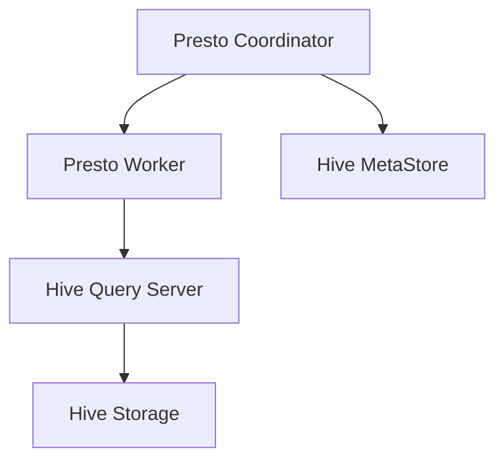
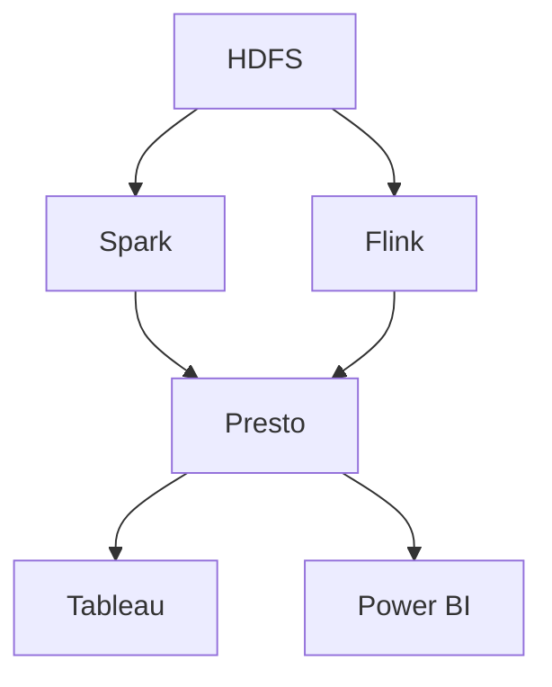

                 

### 文章标题

本文将深入探讨Presto与Hive的整合原理与代码实例讲解。Presto是一个高性能的分布式SQL查询引擎，而Hive则是一个基于Hadoop的分布式数据仓库工具。二者的整合能够实现高效的数据查询与分析，对于现代数据仓库系统来说具有重要意义。本文将从预备知识、整合原理、整合实例和实际项目应用等多个方面展开，旨在为广大开发者提供一份全面、详实的技术指南。

> **关键词：** Presto, Hive, 数据仓库, 分布式查询, 集成原理, 实例讲解

> **摘要：** 本文首先介绍了Presto与Hive的基本概念及其在数据仓库中的地位。接着，详细解析了数据仓库的基础知识，包括数据建模和设计原则。然后，深入探讨了Presto与Hive的整合原理，包括数据流程、集成机制和数据处理流程。随后，通过具体的实例，展示了如何搭建整合环境、处理数据与查询，并进行了集成测试与性能调优。最后，结合实际项目应用，详细阐述了项目设计、实现和部署过程。

---

### 第一部分: 预备知识

在本部分，我们将首先介绍Presto与Hive的基本概念，然后深入探讨数据仓库的基础知识，为后续的整合原理与实例讲解打下坚实的基础。

#### 第1章: Presto与Hive基本概念

##### 1.1 Presto简介

###### 1.1.1 Presto是什么

Presto是一种开源分布式SQL查询引擎，由Facebook开发并开源至Apache软件基金会。它旨在处理海量数据的高性能查询，支持复杂的SQL查询，并能够横向扩展以处理大规模数据集。

###### 1.1.2 Presto的特点

1. 高性能：Presto能够处理海量数据，并提供接近实时的高性能查询。
2. 易用性：Presto提供了简单的SQL接口，易于学习和使用。
3. 横向扩展：Presto支持横向扩展，可以通过增加节点来提高性能和吞吐量。
4. 开源：Presto是开源的，可以自由使用和修改。

###### 1.1.3 Presto的架构

Presto的架构包括以下几个关键组件：

1. **Coordinator**：协调器负责解析SQL查询、生成执行计划，并分发任务给Worker节点。
2. **Worker**：执行器负责执行查询中的具体任务，如数据读取、转换和写入。
3. **Driver**：驱动器负责与外部存储系统（如Hive、Cassandra等）交互，获取数据。

##### 1.2 Hive简介

###### 1.2.1 Hive是什么

Hive是一个基于Hadoop的分布式数据仓库工具，用于处理大规模数据集。它提供了一种基于Hadoop文件系统（HDFS）的SQL查询接口，允许用户使用SQL语句查询和分析数据。

###### 1.2.2 Hive的特点

1. 大数据支持：Hive能够处理PB级别的数据，适合大数据场景。
2. 易用性：Hive提供了简单的SQL接口，使得用户可以方便地使用Hadoop处理数据。
3. 分布式：Hive是分布式系统，能够横向扩展，提高性能。
4. 与Hadoop集成：Hive与Hadoop紧密集成，可以利用Hadoop的生态系统，如MapReduce、YARN等。

###### 1.2.3 Hive的架构

Hive的架构包括以下几个关键组件：

1. **Driver**：负责解析SQL查询、生成执行计划。
2. **Compiler**：将SQL查询编译为抽象语法树（AST）。
3. **Query Planner**：将AST转换为逻辑查询计划。
4. **Optimizer**：对逻辑查询计划进行优化。
5. **Compiler**：将优化后的逻辑查询计划编译为物理查询计划。
6. **Execution**：执行物理查询计划，从HDFS中读取数据并进行处理。

##### 1.3 数据仓库基础

###### 2.1 数据仓库概述

数据仓库是一个集成了大量历史数据的数据库，用于支持企业的业务分析和决策。它通常包括以下核心组件：

1. **数据源**：包括内部数据源（如ERP系统、CRM系统）和外部数据源（如社交媒体、第三方数据服务）。
2. **数据存储**：通常使用分布式文件系统（如HDFS）存储大量数据。
3. **数据模型**：包括星型模型、雪花模型等，用于组织数据以便于查询和分析。
4. **查询引擎**：支持SQL查询，如Hive、Presto等。
5. **分析工具**：用于生成报表、仪表板等，帮助用户进行数据分析。

###### 2.2 数据仓库的发展历程

1. **1990s - 2000s**：数据仓库初期的技术主要包括传统的RDBMS，如Oracle、SQL Server等。这些系统主要用于企业的业务报告和决策支持。
2. **2000s**：随着互联网和电子商务的兴起，数据量呈爆炸式增长。Hadoop和分布式计算技术开始应用于数据仓库领域，如Hive、Presto等。
3. **2010s**：大数据技术快速发展，数据仓库系统开始采用分布式存储和计算技术，如HDFS、MapReduce、YARN等。
4. **2020s**：数据仓库系统逐渐向云计算和实时分析方向发展，如Snowflake、BigQuery等。

###### 2.3 数据仓库的核心组件

1. **数据存储层**：负责存储和管理数据，通常使用分布式文件系统，如HDFS、Amazon S3等。
2. **数据模型层**：负责组织数据，以便于查询和分析，如星型模型、雪花模型等。
3. **查询引擎层**：负责处理SQL查询，如Hive、Presto、Spark SQL等。
4. **数据处理层**：负责对数据进行清洗、转换、聚合等操作，如Spark、Flink等。
5. **数据分析层**：负责生成报表、仪表板等，支持用户进行数据分析，如Tableau、Power BI等。

##### 2.4 数据建模

数据建模是数据仓库设计的重要环节，旨在组织数据以便于高效查询和分析。以下是两种常用的数据建模方法：

###### 2.4.1 星型模型

星型模型是一种常用的数据建模方法，由一个事实表和多个维度表组成。事实表存储具体的业务数据，如销售额、订单量等；维度表存储描述业务数据的属性，如产品、时间、地区等。星型模型简化了数据查询，提高了查询性能。

###### 2.4.2 雪花模型

雪花模型是对星型模型的一种扩展，通过在维度表上添加层级关系，实现更细粒度的数据查询。雪花模型通常用于包含多个层级的业务场景，如组织结构、产品分类等。然而，雪花模型会增加数据冗余，降低查询性能。

###### 2.4.3 数据建模实践

在数据建模实践中，需要根据业务需求和数据特点选择合适的建模方法。以下是一些数据建模的实践经验：

1. 确定业务需求：了解业务目标和数据使用场景，以便设计合适的数据模型。
2. 分析数据结构：分析数据源的数据结构，确定事实表和维度表。
3. 设计数据模型：根据业务需求和数据结构，设计星型模型或雪花模型。
4. 优化数据模型：根据查询需求和性能指标，对数据模型进行优化。

##### 2.5 数据仓库设计原则

数据仓库设计需要遵循以下原则，以保证系统的稳定性和高效性：

###### 2.5.1 数据质量原则

1. 完整性：确保数据仓库中的数据完整，无缺失和重复。
2. 准确性：确保数据仓库中的数据准确，无错误和偏差。
3. 一致性：确保数据仓库中的数据一致性，避免数据冲突和矛盾。
4. 及时性：确保数据仓库中的数据及时更新，满足业务需求。

###### 2.5.2 数据一致性原则

1. 业务一致性：确保数据仓库中的数据与业务逻辑一致，符合业务规则。
2. 技术一致性：确保数据仓库的技术实现与业务需求一致，避免技术瓶颈。
3. 法律法规一致性：确保数据仓库的数据处理符合相关法律法规，如隐私保护、数据安全等。

###### 2.5.3 数据安全性原则

1. 访问控制：确保数据仓库的数据访问权限控制，防止未经授权的访问。
2. 数据加密：对数据仓库的数据进行加密处理，防止数据泄露和篡改。
3. 备份与恢复：定期备份数据仓库的数据，确保数据的安全性和可用性。
4. 安全审计：对数据仓库的访问和操作进行审计，记录并监控异常行为。

#### 第2章: 数据仓库基础

##### 2.1 数据仓库概述

数据仓库是一个用于支持企业业务分析和决策的数据集合，通常包含大量的历史数据。它通过集成各种数据源，实现对数据的整合、清洗、转换和存储，为企业的业务分析提供可靠的数据支持。

###### 2.1.1 数据仓库的概念

数据仓库是一个集成了大量历史数据的数据库，主要用于支持企业的业务分析和决策。它与传统的关系型数据库不同，其设计目标不是事务处理，而是数据分析和查询。

数据仓库通常包含以下几个核心概念：

1. **数据源**：数据仓库的数据来源，包括内部数据源（如ERP系统、CRM系统）和外部数据源（如社交媒体、第三方数据服务）。
2. **数据存储**：数据仓库的数据存储层，通常使用分布式文件系统（如HDFS、Amazon S3等）来存储海量数据。
3. **数据模型**：数据仓库的数据模型层，用于组织数据以便于查询和分析，如星型模型、雪花模型等。
4. **查询引擎**：数据仓库的查询引擎层，支持SQL查询，如Hive、Presto、Spark SQL等。
5. **分析工具**：数据仓库的分析工具层，用于生成报表、仪表板等，帮助用户进行数据分析，如Tableau、Power BI等。

###### 2.1.2 数据仓库的发展历程

数据仓库的发展历程可以大致分为以下几个阶段：

1. **传统数据仓库阶段（1990s - 2000s）**：在这个阶段，数据仓库主要基于关系型数据库技术，如Oracle、SQL Server等。这些系统主要用于企业的业务报告和决策支持。
2. **大数据数据仓库阶段（2000s - 2010s）**：随着互联网和电子商务的兴起，数据量呈爆炸式增长，传统的数据仓库系统难以应对海量数据的需求。Hadoop和分布式计算技术开始应用于数据仓库领域，如Hive、Presto等。
3. **云数据仓库阶段（2010s - 2020s）**：随着云计算技术的发展，数据仓库系统逐渐向云计算迁移，如Amazon Redshift、Google BigQuery等。云数据仓库提供了更高的扩展性和灵活性，适合大规模数据分析和实时查询。
4. **实时数据仓库阶段（2020s）**：随着物联网、移动应用等新兴技术的兴起，实时数据分析和处理变得越来越重要。实时数据仓库系统，如Apache Flink、Apache Storm等，能够实时处理和分析数据，提供更快速、更准确的分析结果。

###### 2.1.3 数据仓库的核心组件

数据仓库的核心组件包括以下几个部分：

1. **数据源**：数据仓库的数据来源，包括内部数据源（如ERP系统、CRM系统）和外部数据源（如社交媒体、第三方数据服务）。数据源是数据仓库的基础，决定了数据仓库的数据量和多样性。
2. **数据存储**：数据仓库的数据存储层，负责存储和管理海量数据。数据存储通常使用分布式文件系统（如HDFS、Amazon S3等），以提供高可用性和高扩展性。此外，数据存储还需要考虑数据的压缩、加密和备份等问题。
3. **数据模型**：数据仓库的数据模型层，用于组织数据以便于查询和分析。数据模型通常采用星型模型、雪花模型等，以简化数据查询和提高查询性能。数据模型的设计需要考虑业务需求和数据特性，以实现高效的数据访问和分析。
4. **查询引擎**：数据仓库的查询引擎层，负责处理SQL查询，并提供高效的数据访问接口。查询引擎通常采用分布式计算框架，如MapReduce、Spark等，以支持大规模数据的查询和分析。常见的查询引擎包括Hive、Presto、Spark SQL等。
5. **数据处理层**：数据仓库的数据处理层，负责对数据进行清洗、转换、聚合等操作。数据处理层通常采用分布式计算框架，如Spark、Flink等，以支持大规模数据的处理和分析。数据处理层还需要考虑数据的调度、资源管理和任务监控等问题。
6. **数据分析工具**：数据仓库的分析工具层，用于生成报表、仪表板等，帮助用户进行数据分析和可视化。常见的分析工具包括Tableau、Power BI、QlikView等。数据分析工具提供了丰富的数据可视化功能，帮助用户更好地理解和利用数据。

##### 2.2 数据建模

数据建模是数据仓库设计的重要环节，旨在组织数据以便于高效查询和分析。数据建模的主要目标包括简化数据查询、提高查询性能、降低数据冗余等。以下是两种常用的数据建模方法：

###### 2.2.1 星型模型

星型模型是一种常用的数据建模方法，由一个事实表和多个维度表组成。事实表存储具体的业务数据，如销售额、订单量等；维度表存储描述业务数据的属性，如产品、时间、地区等。星型模型的主要特点是事实表和维度表之间的连接关系比较简单，通常采用外连接的方式。

星型模型的结构如下：

1. **事实表**：事实表包含业务数据，如销售额、订单量等。事实表通常包含一个或多个时间字段，以便于时间序列分析。事实表通常以主键作为唯一标识。
2. **维度表**：维度表包含描述业务数据的属性，如产品、时间、地区等。维度表通常包含一个或多个分类字段，以便于分类分析和维度分析。维度表通常以分类字段作为唯一标识。
3. **连接关系**：事实表和维度表之间的连接关系通常采用外连接的方式，以便于查询和分析。通过连接关系，可以查询特定时间、特定产品、特定地区的业务数据。

星型模型的优点包括：

1. 简化数据查询：由于事实表和维度表之间的连接关系比较简单，查询语句通常比较简单，易于编写和理解。
2. 提高查询性能：由于事实表和维度表之间的连接关系比较简单，查询优化器可以更容易地生成高效的查询计划，提高查询性能。
3. 易于扩展：星型模型支持动态扩展维度表，以便于适应业务需求的变化。

星型模型的缺点包括：

1. 数据冗余：由于外连接的关系，维度表中的数据可能会重复存储，导致数据冗余。
2. 维度维护成本：维度表的维护成本可能较高，尤其是当维度表需要频繁更新时。

###### 2.2.2 雪花模型

雪花模型是对星型模型的一种扩展，通过在维度表上添加层级关系，实现更细粒度的数据查询。雪花模型通常用于包含多个层级的业务场景，如组织结构、产品分类等。雪花模型将维度表分解为多个层级，每个层级包含部分属性，以实现更细粒度的数据查询。

雪花模型的结构如下：

1. **事实表**：事实表与星型模型相同，包含业务数据，如销售额、订单量等。
2. **维度表**：维度表分为多个层级，每个层级包含部分属性。例如，组织结构维度表可以分为员工层级、部门层级、公司层级等。
3. **连接关系**：事实表和维度表之间的连接关系通常采用外连接的方式，以便于查询和分析。通过连接关系，可以查询特定层级、特定属性的业务数据。

雪花模型的优点包括：

1. 支持细粒度查询：雪花模型支持更细粒度的数据查询，可以查询特定层级、特定属性的业务数据。
2. 易于维护：雪花模型中的维度表可以独立维护，降低维度维护成本。

雪花模型的缺点包括：

1. 数据冗余：雪花模型可能会导致更多的数据冗余，尤其是当维度层级较多时。
2. 查询性能：由于雪花模型中的维度表之间存在多个连接关系，查询性能可能较低。

###### 2.2.3 数据建模实践

在数据建模实践中，需要根据业务需求和数据特点选择合适的建模方法。以下是一些数据建模的实践经验：

1. **业务需求分析**：了解业务目标和数据使用场景，确定需要查询和分析的数据类型和关系。
2. **数据源分析**：分析数据源的数据结构，确定事实表和维度表。
3. **模型设计**：根据业务需求和数据结构，设计星型模型或雪花模型。
4. **模型优化**：根据查询需求和性能指标，对数据模型进行优化，如合并维度表、减少连接关系等。
5. **模型验证**：通过实际查询和测试，验证数据模型的正确性和性能。

##### 2.3 数据仓库设计原则

数据仓库设计需要遵循以下原则，以保证系统的稳定性和高效性：

###### 2.3.1 数据质量原则

1. **完整性**：确保数据仓库中的数据完整，无缺失和重复。对于缺失的数据，可以采用填充策略，如平均值填充、前值填充等。
2. **准确性**：确保数据仓库中的数据准确，无错误和偏差。对于不准确的数据，可以采用修正策略，如手动修正、自动修正等。
3. **一致性**：确保数据仓库中的数据一致性，避免数据冲突和矛盾。数据一致性可以通过数据清洗、数据校验等方式实现。
4. **及时性**：确保数据仓库中的数据及时更新，满足业务需求。数据更新可以通过实时数据集成、批处理等方式实现。

###### 2.3.2 数据一致性原则

1. **业务一致性**：确保数据仓库中的数据与业务逻辑一致，符合业务规则。业务一致性可以通过业务规则校验、数据核对等方式实现。
2. **技术一致性**：确保数据仓库的技术实现与业务需求一致，避免技术瓶颈。技术一致性可以通过技术选型、系统优化等方式实现。
3. **法律法规一致性**：确保数据仓库的数据处理符合相关法律法规，如隐私保护、数据安全等。法律法规一致性可以通过合规审查、安全审计等方式实现。

###### 2.3.3 数据安全性原则

1. **访问控制**：确保数据仓库的数据访问权限控制，防止未经授权的访问。访问控制可以通过身份验证、权限管理等方式实现。
2. **数据加密**：对数据仓库的数据进行加密处理，防止数据泄露和篡改。数据加密可以通过数据加密算法、加密存储等方式实现。
3. **备份与恢复**：定期备份数据仓库的数据，确保数据的安全性和可用性。备份可以通过备份策略、备份存储等方式实现。
4. **安全审计**：对数据仓库的访问和操作进行审计，记录并监控异常行为。安全审计可以通过日志记录、审计分析等方式实现。

### 第二部分: Presto与Hive整合原理

在了解了Presto与Hive的基本概念和数据仓库的基础知识后，我们将深入探讨Presto与Hive的整合原理。Presto与Hive的整合能够充分发挥两者的优势，实现高效的数据查询与分析。本部分将介绍Presto与Hive整合的优势、挑战、整合架构、核心算法以及数据处理流程。

#### 第3章: Presto-Hive整合概述

##### 3.1 整合意义

Presto与Hive的整合具有重要意义，主要体现在以下几个方面：

1. **高性能查询**：Presto作为一种高性能的分布式SQL查询引擎，可以提供接近实时的查询响应。与Hive结合，可以充分利用Hive的大数据处理能力，实现高效的数据查询与分析。
2. **大规模数据存储**：Hive作为基于Hadoop的分布式数据仓库工具，能够处理PB级别的数据。通过整合Presto，可以实现对大规模数据的快速查询。
3. **灵活的数据处理**：Presto支持多种数据源，如关系数据库、NoSQL数据库、文件系统等。与Hive结合，可以实现对不同类型数据的统一处理和分析。
4. **降低开发成本**：整合Presto与Hive可以减少开发和维护成本，避免重复实现数据查询和存储功能。

##### 3.2 整合的优势

Presto与Hive整合的优势包括：

1. **高性能**：Presto的高性能查询能力可以显著提高数据分析的效率，满足企业对实时数据查询的需求。
2. **可扩展性**：Presto与Hive的整合支持横向扩展，可以通过增加节点来提高性能和吞吐量。
3. **兼容性**：Presto与Hive的整合可以兼容现有的Hadoop生态系统，充分利用已有的投资。
4. **灵活性**：Presto支持多种数据源，与Hive结合可以实现对不同类型数据的统一处理。

##### 3.3 整合的挑战

Presto与Hive整合面临的挑战包括：

1. **性能优化**：Presto与Hive的整合需要针对特定的查询场景进行性能优化，以充分发挥两者的优势。
2. **数据一致性**：在整合过程中，需要确保数据的一致性，避免数据冲突和错误。
3. **系统复杂性**：整合Presto与Hive会增加系统的复杂性，需要确保系统的稳定性和可靠性。
4. **开发成本**：整合过程中可能需要调整现有的系统架构和开发流程，带来一定的开发成本。

##### 3.4 整合架构

Presto与Hive的整合架构主要包括以下几个组件：

1. **Presto Coordinator**：负责解析SQL查询、生成执行计划，并分发任务给Worker节点。
2. **Presto Worker**：负责执行查询任务，从Hive表中读取数据并进行处理。
3. **Hive MetaStore**：存储Hive表的结构信息和元数据。
4. **Hive Query Server**：提供Hive的查询接口，处理Presto Coordinator分发的查询任务。
5. **Hive Storage**：存储Hive表的数据。

Presto与Hive的整合架构图如下所示：



##### 3.5 整合机制

Presto与Hive的整合机制主要包括以下几个方面：

1. **数据同步**：Presto与Hive之间需要实现数据同步，确保数据的一致性。数据同步可以通过定时任务、实时流处理等方式实现。
2. **元数据管理**：Presto与Hive之间需要共享元数据信息，包括表结构、字段信息等。元数据管理可以通过Hive MetaStore实现。
3. **查询优化**：Presto与Hive的整合需要针对特定的查询场景进行优化，包括查询计划生成、数据读取、数据转换和写入等。
4. **故障处理**：Presto与Hive的整合需要考虑故障处理机制，包括节点故障、数据丢失等。

##### 3.6 数据同步

数据同步是Presto与Hive整合的关键环节，主要包括以下步骤：

1. **数据采集**：从源数据表中采集数据，可以采用ETL工具或自定义脚本实现。
2. **数据清洗**：对采集到的数据进行清洗，包括去除重复数据、纠正错误数据等。
3. **数据转换**：将清洗后的数据进行转换，包括字段映射、数据格式转换等。
4. **数据加载**：将转换后的数据加载到目标Hive表中，可以通过Hive的Load命令实现。

#### 第4章: Presto-Hive核心算法

Presto与Hive的整合涉及多种核心算法，包括查询优化、执行引擎和数据处理流程。本节将详细介绍这些核心算法的原理，并使用伪代码进行详细阐述。

##### 4.1 Presto查询优化

Presto查询优化是提高查询性能的关键环节，主要包括以下步骤：

1. **查询解析**：将SQL查询语句解析为抽象语法树（AST）。
2. **逻辑优化**：对逻辑查询计划进行优化，包括谓词推-down、去重等。
3. **物理优化**：将逻辑查询计划转换为物理查询计划，包括选择合适的执行策略、优化数据访问路径等。

以下是一个简化的Presto查询优化伪代码示例：

```pseudo
function optimizeQuery(ast, context):
    # 查询解析
    logicalPlan = parseAST(ast, context)
    
    # 逻辑优化
    logicalPlan = applyLogicalOptimizations(logicalPlan)
    
    # 物理优化
    physicalPlan = convertLogicalPlanToPhysicalPlan(logicalPlan)
    
    return physicalPlan
```

##### 4.2 Hive执行引擎

Hive的执行引擎负责执行查询计划，主要包括以下组件：

1. **MapReduce执行引擎**：基于MapReduce的执行引擎，适用于大数据场景。
2. **Tez执行引擎**：基于Tez的执行引擎，提供更高效的执行性能。
3. **Spark执行引擎**：基于Spark的执行引擎，适用于实时数据处理。

以下是一个简化的Hive执行引擎伪代码示例：

```pseudo
function executeQuery(physicalPlan, context):
    if (physicalPlan is MapReducePlan):
        executeMapReduce(physicalPlan, context)
    else if (physicalPlan is TezPlan):
        executeTez(physicalPlan, context)
    else if (physicalPlan is SparkPlan):
        executeSpark(physicalPlan, context)
```

##### 4.3 数据处理流程

Presto与Hive整合的数据处理流程主要包括以下步骤：

1. **数据读取**：从Hive表中读取数据，可以使用Hive的查询接口。
2. **数据转换**：对读取到的数据进行处理，包括字段映射、数据格式转换等。
3. **数据写入**：将处理后的数据写入到目标表中，可以使用Hive的Load命令。

以下是一个简化的数据处理流程伪代码示例：

```pseudo
function processData(query, inputTable, outputTable):
    data = readData(inputTable, query)
    transformedData = transformData(data)
    writeData(outputTable, transformedData)
```

#### 第5章: Presto-Hive整合实例

在本章中，我们将通过具体的实例，展示如何搭建Presto与Hive的整合环境，并介绍数据处理与查询的过程。

##### 5.1 环境搭建与配置

搭建Presto与Hive的整合环境需要安装和配置以下组件：

1. **操作系统**：推荐使用Linux操作系统，如CentOS、Ubuntu等。
2. **JDK**：安装Java Development Kit（JDK），版本要求至少为8以上。
3. **Hadoop**：安装Hadoop，版本要求与Hive兼容。
4. **Hive**：安装Hive，并配置Hive MetaStore。
5. **Presto**：安装Presto，并配置与Hive的连接。

以下是环境搭建和配置的详细步骤：

1. **安装操作系统和JDK**：
   - 安装Linux操作系统，并配置网络。
   - 安装JDK，设置环境变量。

2. **安装Hadoop**：
   - 下载Hadoop安装包。
   - 解压安装包并配置Hadoop环境。

3. **安装Hive**：
   - 下载Hive安装包。
   - 解压安装包并配置Hive环境。
   - 配置Hive MetaStore，确保能够访问Hive表结构。

4. **安装Presto**：
   - 下载Presto安装包。
   - 解压安装包并配置Presto环境。
   - 配置Presto与Hive的连接，确保能够查询Hive表。

##### 5.2 数据处理与查询

在搭建好Presto与Hive的整合环境后，我们可以进行数据处理与查询操作。

1. **数据导入**：
   - 准备测试数据，可以选择关系数据库或文件系统作为数据源。
   - 使用Hive的Load命令将数据导入到Hive表中。

2. **数据查询**：
   - 使用Presto的SQL接口执行查询操作。
   - 可以使用Presto CLI或Presto SQL Editor等工具进行查询。

以下是一个简单的数据查询示例：

```sql
SELECT * FROM hive.default.test_table;
```

3. **查询优化**：
   - 根据查询结果，对查询语句进行优化。
   - 可以使用EXPLAIN命令查看查询执行计划，并调整查询策略。

4. **数据处理**：
   - 使用Presto对Hive表中的数据进行处理，包括字段映射、数据格式转换等。
   - 可以使用Presto的SQL接口或自定义脚本进行数据处理。

##### 5.3 集成测试与性能调优

在完成数据处理与查询后，我们需要对整合系统进行集成测试与性能调优。

1. **集成测试**：
   - 构建测试环境，包括测试数据、测试工具等。
   - 编写测试用例，验证整合系统的功能与性能。
   - 执行测试用例，记录测试结果。

2. **性能调优**：
   - 分析测试结果，找出性能瓶颈。
   - 调整查询优化策略，包括索引、分区、缓存等。
   - 优化数据存储与处理流程，提高系统性能。

以下是一些性能调优策略：

1. **索引优化**：为常用的查询字段创建索引，提高查询性能。
2. **分区优化**：对大数据表进行分区，提高查询效率。
3. **缓存优化**：配置适当的缓存策略，提高数据访问速度。
4. **并发优化**：调整并发参数，提高系统并发处理能力。

#### 第6章: 集成测试与性能调优

在完成数据处理与查询后，我们需要对整合系统进行集成测试与性能调优，以确保系统的稳定性和高效性。集成测试和性能调优是确保整合系统满足业务需求的重要环节，以下将详细阐述这两个环节的具体步骤和策略。

##### 6.1 集成测试

集成测试是确保整合系统各个组件协同工作的关键步骤。以下是集成测试的步骤和策略：

###### 6.1.1 测试环境搭建

1. **准备测试数据**：根据实际业务场景，准备测试数据集，包括不同类型、不同大小的数据，以覆盖各种查询场景。
2. **搭建测试环境**：搭建与生产环境类似的测试环境，包括操作系统、JDK、Hadoop、Hive和Presto等组件。确保所有组件的版本与生产环境一致。

###### 6.1.2 测试用例设计

1. **功能测试用例**：设计各种功能的测试用例，包括基本的查询操作、数据导入和导出、数据更新和删除等。
2. **性能测试用例**：设计针对性能的测试用例，包括大数据量查询、高并发查询、长时间运行查询等。
3. **异常情况测试用例**：设计测试用例，模拟系统可能遇到的各种异常情况，如网络中断、节点故障、数据错误等。

###### 6.1.3 测试执行

1. **自动化测试**：使用自动化测试工具（如JUnit、Selenium等）执行测试用例，提高测试效率。
2. **手动测试**：对一些复杂场景和特殊情况进行手动测试，确保测试的全面性和准确性。

###### 6.1.4 测试结果分析

1. **记录测试结果**：将测试结果记录在测试报告中，包括测试通过率、性能指标、异常情况等。
2. **分析测试结果**：对测试结果进行分析，找出系统可能存在的问题和瓶颈。

##### 6.2 性能调优

性能调优是提高整合系统性能的关键步骤。以下是性能调优的步骤和策略：

###### 6.2.1 性能分析工具

1. **Grafana**：用于实时监控系统的性能指标，包括CPU使用率、内存使用率、网络延迟等。
2. **Prometheus**：用于收集和存储系统的性能数据，并提供查询和分析功能。
3. **Presto UI**：用于监控Presto的性能指标，包括查询执行时间、数据访问时间等。

###### 6.2.2 性能调优策略

1. **查询优化**：
   - **索引优化**：为常用的查询字段创建索引，提高查询效率。
   - **分区优化**：对大数据表进行分区，提高查询性能。
   - **缓存优化**：配置适当的缓存策略，提高数据访问速度。

2. **系统资源调优**：
   - **CPU调优**：根据系统的CPU使用情况，调整Presto和Hadoop的并发参数。
   - **内存调优**：根据系统的内存使用情况，调整Presto和Hadoop的内存配置。
   - **网络调优**：调整网络配置，提高数据传输速度。

3. **架构优化**：
   - **分布式架构**：根据业务需求，将系统部署在分布式架构上，提高系统的扩展性和容错能力。
   - **集群优化**：对集群进行优化，提高集群的整体性能。

4. **代码优化**：
   - **SQL优化**：优化SQL语句，提高查询性能。
   - **数据处理优化**：优化数据处理流程，减少数据转换和传输开销。

###### 6.2.3 性能调优案例

以下是一个简单的性能调优案例：

1. **问题描述**：在一次性能测试中，发现针对一个大数据量的查询，系统响应时间较长。
2. **分析原因**：通过监控工具分析，发现查询过程中数据访问时间较长，可能是由于数据分区不合理导致的。
3. **解决方案**：根据数据特点，重新设计分区策略，将数据按照时间、地区等维度进行分区，提高数据访问效率。
4. **测试验证**：重新执行性能测试，验证性能优化效果。结果显示，查询响应时间显著缩短，性能得到提升。

通过上述步骤和策略，我们可以有效地对整合系统进行性能调优，提高系统的稳定性和高效性。

### 第四部分: 实际项目应用

在前三部分中，我们详细介绍了Presto与Hive的基本概念、整合原理以及实际应用中的环境搭建和数据处理。现在，我们将通过一个实际项目应用案例，进一步展示如何将Presto与Hive整合应用于企业级数据分析平台。

#### 第8章: 项目背景与需求分析

##### 8.1 项目背景

随着企业数据量的不断增长和多样化，传统的数据仓库系统已难以满足高效数据查询和实时分析的需求。为了提高数据分析效率，某大型互联网公司决定构建一个企业级的数据分析平台，整合Presto与Hive，实现大数据的快速查询和分析。

##### 8.2 项目目标

本项目的目标包括：

1. 提供高性能的查询服务，满足企业内部各业务部门的数据查询需求。
2. 支持海量数据的存储和处理，实现数据的高可用性和高可靠性。
3. 提供灵活的数据接入和集成方案，支持多种数据源和不同类型的业务数据。
4. 实现数据实时分析和处理，为企业提供及时、准确的数据洞察。

##### 8.3 需求分析

根据项目目标和背景，本项目的主要需求如下：

1. **数据查询需求**：支持复杂SQL查询，包括聚合、连接、子查询等，满足企业内部各业务部门的数据分析需求。
2. **数据存储需求**：支持海量数据的存储，保证数据的一致性和完整性。
3. **数据集成需求**：支持多种数据源接入，包括关系数据库、NoSQL数据库、文件系统等，实现数据的一站式管理和分析。
4. **数据处理需求**：支持数据的实时处理和批处理，实现数据的实时分析和离线分析。
5. **系统性能需求**：提供高效、可靠的查询服务，保证系统在高并发、大数据量的场景下稳定运行。

#### 第9章: 项目设计

##### 9.1 系统架构设计

为了实现项目的目标，本项目采用分布式架构，包括以下几个关键模块：

1. **数据存储层**：使用HDFS作为分布式文件存储系统，存储海量数据。
2. **数据处理层**：使用Spark和Flink进行数据的实时处理和批处理。
3. **查询引擎层**：使用Presto作为分布式SQL查询引擎，提供高性能的查询服务。
4. **数据接入层**：使用ETL工具（如Apache NiFi、Apache Kafka）实现多种数据源接入。
5. **数据分析层**：使用Tableau和Power BI进行数据的可视化分析和报表生成。

系统架构图如下所示：



##### 9.2 数据库设计

为了满足项目需求，本项目设计了以下数据库结构：

1. **事实表**：存储具体的业务数据，如订单数据、销售数据等。事实表通常包含订单号、订单日期、订单金额等字段。
2. **维度表**：存储描述业务数据的属性，如订单维度、用户维度、商品维度等。维度表通常包含维度ID、维度名称、维度属性等字段。
3. **索引表**：用于优化查询性能，包括索引字段、索引值等。

以下是一个简化的数据库设计示例：

```sql
-- 事实表
CREATE TABLE order_fact (
    order_id INT,
    order_date DATE,
    order_amount DECIMAL(10, 2),
    customer_id INT,
    product_id INT
);

-- 维度表
CREATE TABLE customer_dim (
    customer_id INT PRIMARY KEY,
    customer_name VARCHAR(100),
    customer_email VARCHAR(100)
);

CREATE TABLE product_dim (
    product_id INT PRIMARY KEY,
    product_name VARCHAR(100),
    product_category VARCHAR(100)
);

-- 索引表
CREATE INDEX customer_index ON customer_dim (customer_id);
CREATE INDEX product_index ON product_dim (product_id);
```

##### 9.3 集成方案设计

为了实现Presto与Hive的整合，本项目设计了以下集成方案：

1. **数据同步**：使用Apache NiFi实现数据同步，从源数据系统中采集数据，并实时写入Hive表。
2. **元数据管理**：使用Apache Hive MetaStore管理Hive表的元数据，包括表结构、字段信息等。
3. **查询优化**：针对特定查询场景，进行查询优化，包括索引优化、分区优化等。
4. **故障处理**：实现故障处理机制，包括数据备份、节点故障恢复等。

#### 第10章: 项目实现

##### 10.1 数据导入实现

在本项目中，数据导入是通过Apache NiFi实现的，主要包括以下步骤：

1. **数据采集**：从源数据系统中采集数据，可以采用数据库连接、API调用等方式。
2. **数据清洗**：对采集到的数据进行清洗，包括去除重复数据、纠正错误数据等。
3. **数据转换**：将清洗后的数据转换为适合Hive存储的格式，如Parquet、ORC等。
4. **数据加载**：将转换后的数据加载到Hive表中，可以使用Hive的Load命令或insert into语句。

以下是数据导入的伪代码示例：

```python
# 数据采集
data = fetchDataFromSource()

# 数据清洗
cleaned_data = cleanData(data)

# 数据转换
converted_data = convertData(cleaned_data)

# 数据加载
loadDataToHive(converted_data)
```

##### 10.2 数据查询实现

在本项目中，数据查询是通过Presto实现的，主要包括以下步骤：

1. **查询语法**：编写SQL查询语句，根据业务需求进行数据查询。
2. **查询优化**：针对特定查询场景，进行查询优化，包括索引优化、分区优化等。
3. **查询执行**：使用Presto CLI或Presto SQL Editor等工具执行查询语句。

以下是数据查询的伪代码示例：

```python
# 查询语法
query = "SELECT * FROM order_fact WHERE order_date = '2023-01-01';"

# 查询优化
optimized_query = optimizeQuery(query)

# 查询执行
executeQuery(optimized_query)
```

##### 10.3 集成测试

在本项目中，集成测试是通过自动化测试工具实现的，主要包括以下步骤：

1. **测试环境搭建**：搭建与生产环境类似的测试环境，包括操作系统、JDK、Hadoop、Hive和Presto等组件。
2. **测试用例设计**：设计各种功能的测试用例，包括数据导入、数据查询、异常处理等。
3. **测试执行**：使用自动化测试工具执行测试用例，记录测试结果。
4. **测试结果分析**：分析测试结果，找出系统可能存在的问题和瓶颈。

以下是集成测试的伪代码示例：

```python
# 测试环境搭建
setupTestEnvironment()

# 测试用例设计
test_cases = designTestCases()

# 测试执行
executeTestCases(test_cases)

# 测试结果分析
analyzeTestResults()
```

##### 10.4 性能调优

在本项目中，性能调优是通过监控工具和优化策略实现的，主要包括以下步骤：

1. **性能监控**：使用Grafana和Prometheus等工具监控系统的性能指标，包括CPU使用率、内存使用率、查询响应时间等。
2. **性能分析**：分析监控数据，找出系统性能瓶颈。
3. **优化策略**：根据性能分析结果，采取优化策略，包括查询优化、系统资源优化等。
4. **性能验证**：执行性能测试，验证优化效果。

以下是性能调优的伪代码示例：

```python
# 性能监控
monitorPerformance()

# 性能分析
analyzePerformanceData()

# 优化策略
applyOptimizationStrategies()

# 性能验证
validatePerformance()
```

#### 第11章: 项目部署与运维

##### 11.1 部署方案

在本项目中，部署方案主要包括以下步骤：

1. **环境准备**：准备操作系统、JDK、Hadoop、Hive和Presto等组件的环境。
2. **安装组件**：按照组件的安装指南进行安装，并配置必要的参数。
3. **集成配置**：配置Presto与Hive的集成，包括元数据管理、查询优化等。
4. **部署测试**：在测试环境中部署系统，并进行集成测试和性能测试。

以下是部署方案的伪代码示例：

```python
# 环境准备
prepareEnvironment()

# 安装组件
installComponents()

# 集成配置
configureIntegration()

# 部署测试
performDeploymentTesting()
```

##### 11.2 运维策略

在项目部署后，运维策略主要包括以下方面：

1. **日志监控**：监控系统的日志，包括Presto日志、Hadoop日志等，及时发现和处理异常。
2. **性能监控**：监控系统的性能指标，包括CPU使用率、内存使用率、查询响应时间等，确保系统稳定运行。
3. **故障处理**：制定故障处理流程，包括故障定位、故障恢复等，确保系统的高可用性。
4. **升级与维护**：定期对系统进行升级和维护，包括组件升级、安全漏洞修复等。

以下是运维策略的伪代码示例：

```python
# 日志监控
monitorLogs()

# 性能监控
monitorPerformanceMetrics()

# 故障处理
handleFaults()

# 升级与维护
performUpgradesAndMaintenance()
```

通过以上部署与运维策略，可以确保系统的稳定运行和持续优化。

### 附录

#### 附录A: 常用工具与资源

##### A.1 Presto相关工具

1. **Presto CLI**：Presto的命令行接口，用于执行SQL查询和管理工作。
2. **Presto SQL Editor**：Presto的图形界面编辑器，提供SQL查询的便捷操作。
3. **Presto UI工具**：如PrestoDB、Grip等，提供Web界面，方便用户进行查询和管理。

##### A.2 Hive相关工具

1. **Hive CLI**：Hive的命令行接口，用于执行Hive查询和管理工作。
2. **Hive Query Editor**：Hive的图形界面编辑器，提供SQL查询的便捷操作。
3. **Hive UI工具**：如Hue、Beeswax等，提供Web界面，方便用户进行查询和管理。

##### A.3 开发资源

1. **代码示例**：包括Presto和Hive的集成示例、数据处理示例等。
2. **实用技巧**：包括性能优化技巧、故障处理技巧等。
3. **学习资料链接**：包括官方文档、博客、在线课程等。

##### A.4 交流平台

1. **社区论坛**：如Apache Hive社区、Presto社区等，提供技术交流和支持。
2. **技术博客**：包括个人博客、专业博客等，分享Presto和Hive的最新动态和实践经验。
3. **社交媒体群组**：如LinkedIn、GitHub等，加入相关群组，与同行交流学习。

#### 附录B: 未来展望

##### B.1 技术发展趋势

1. **云计算与大数据**：随着云计算技术的发展，数据仓库系统将越来越多地采用云基础设施，实现更高的灵活性和可扩展性。
2. **实时分析与流处理**：实时分析和流处理将成为数据仓库系统的重要方向，满足企业对实时数据洞察的需求。
3. **机器学习和人工智能**：数据仓库系统将逐步整合机器学习和人工智能技术，提供更智能的数据分析和预测功能。

##### B.2 应用领域扩展

1. **金融行业**：金融行业的数据量庞大，对实时数据分析和风险管理有较高需求，数据仓库系统在金融领域的应用前景广阔。
2. **医疗行业**：医疗行业的数据类型多样，数据量巨大，数据仓库系统在医疗数据处理、患者管理等方面具有重要应用价值。
3. **零售行业**：零售行业对数据分析和用户行为洞察有较高要求，数据仓库系统在零售领域的应用前景广阔。

##### B.3 持续集成与自动化

1. **自动化部署**：随着容器化和微服务架构的发展，自动化部署将成为数据仓库系统的标准实践，提高部署效率和可靠性。
2. **持续集成**：数据仓库系统将采用持续集成和持续部署（CI/CD）流程，实现快速迭代和交付。
3. **自动化监控与优化**：自动化监控工具将不断进化，提供实时性能监控和优化建议，提高数据仓库系统的性能和可靠性。

通过上述展望，我们可以看到Presto与Hive整合在技术发展和应用领域扩展方面具有广阔的前景，为未来的数据仓库系统发展提供强有力的支持。

### 总结

本文系统地介绍了Presto与Hive的整合原理与实际应用。通过详细解析Presto和Hive的基本概念、整合优势、整合架构、核心算法和数据处理流程，我们展示了如何高效地搭建Presto与Hive的整合环境，并进行数据处理与查询。此外，通过一个实际项目应用案例，我们展示了如何将整合技术应用于企业级数据分析平台。

未来，随着云计算、实时分析和人工智能等技术的发展，Presto与Hive整合在数据仓库领域将发挥更加重要的作用。开发者可以通过不断学习和实践，掌握这些技术，为企业提供高效、稳定的数据分析和决策支持。

#### 作者信息

作者：AI天才研究院/AI Genius Institute & 禅与计算机程序设计艺术 /Zen And The Art of Computer Programming

---

### 附录

#### 附录A: 常用工具与资源

##### A.1 Presto相关工具

**Presto CLI**  
Presto CLI是Presto的命令行接口，可用于执行SQL查询和管理工作。可以通过以下命令安装Presto CLI：

```shell
brew install prestodb/prestodb/presto-cli
```

**Presto SQL Editor**  
Presto SQL Editor是一个图形界面编辑器，提供SQL查询的便捷操作。你可以从以下链接下载Presto SQL Editor：

<https://github.com/prestodb/presto-editor>

**Presto UI工具**  
以下是一些常用的Presto UI工具：

- **PrestoDB**：提供Web界面，方便用户进行查询和管理。可以从以下链接下载PrestoDB：

  <https://github.com/prestodb/prestodb/releases>

- **Grip**：另一个Presto的Web界面工具。可以从以下链接下载Grip：

  <https://github.com/grippie/grip>

##### A.2 Hive相关工具

**Hive CLI**  
Hive CLI是Hive的命令行接口，可用于执行Hive查询和管理工作。可以通过以下命令安装Hive CLI：

```shell
brew install hive
```

**Hive Query Editor**  
Hive Query Editor是一个图形界面编辑器，提供SQL查询的便捷操作。你可以从以下链接下载Hive Query Editor：

<https://github.com/apache/hive-editor>

**Hive UI工具**  
以下是一些常用的Hive UI工具：

- **Hue**：Apache Hue是Hadoop平台的Web界面，提供Hive查询管理。可以从以下链接下载Hue：

  <https://github.com/apache/hue>

- **Beeswax**：Beeswax是Hue的一部分，提供了一个Web界面来执行Hive查询。可以从以下链接访问Beeswax：

  <https://cwiki.apache.org/confluence/display/HUE/Beeswax+UI>

##### A.3 开发资源

**代码示例**  
以下是一些有用的Presto和Hive代码示例：

- **Presto查询优化示例**：<https://github.com/prestodb/presto-examples>
- **Hive数据处理示例**：<https://github.com/apache/hive-examples>

**实用技巧**  
以下是一些Presto和Hive的实用技巧：

- **Presto性能优化技巧**：<https://prestodb.io/docs/current/optimizing-presto.html>
- **Hive性能优化技巧**：<https://cwiki.apache.org/confluence/display/Hive/Languages+and+Optimizations>

**学习资料链接**  
以下是一些有用的学习资料链接：

- **Presto官方文档**：<https://prestodb.io/docs/current/>
- **Hive官方文档**：<https://cwiki.apache.org/confluence/display/Hive/LanguageManual>
- **在线课程**：你可以从以下平台找到有关Presto和Hive的在线课程：

  - **Coursera**：<https://www.coursera.org/search?query=data+warehouse>
  - **edX**：<https://www.edx.org/search?query=data+warehouse>

##### A.4 交流平台

**社区论坛**  
以下是一些Presto和Hive的社区论坛：

- **Presto社区论坛**：<https://prestodb.io/community/>
- **Hive社区论坛**：<https://cwiki.apache.org/confluence/display/Hive/CommunityResources>

**技术博客**  
以下是一些技术博客，分享Presto和Hive的最新动态和实践经验：

- **Presto博客**：<https://prestodb.io/blog/>
- **Hive博客**：<https://cwiki.apache.org/confluence/display/Hive/CommunityBlog>

**社交媒体群组**  
以下是一些Presto和Hive的社交媒体群组，你可以加入这些群组与同行交流学习：

- **LinkedIn**：搜索"Presto"和"Hive"相关的群组。
- **GitHub**：关注Presto和Hive的GitHub组织，如<https://github.com/prestodb>和<https://github.com/apache/hive>。

通过这些工具、资源和交流平台，你可以更好地了解和掌握Presto与Hive的整合技术，提高你的数据处理和分析能力。

---

### A.1 Presto CLI

Presto CLI 是 Presto SQL 查询引擎的命令行工具，允许用户直接在终端中执行 SQL 查询。以下是 Presto CLI 的安装和使用方法：

#### 安装

要安装 Presto CLI，你可以使用以下命令：

```shell
brew install prestodb/prestodb/presto-cli
```

这个命令会使用 Homebrew 安装 Presto CLI。安装完成后，你可以在终端中直接使用 `presto` 命令。

#### 使用

安装完成后，你可以在终端中启动 Presto CLI。以下是基本的用法：

```shell
presto
```

当你运行上述命令后，Presto CLI 将启动，你将进入一个交互式命令行界面。在这个界面中，你可以执行 SQL 查询、执行脚本，以及管理 Presto 服务。

**执行 SQL 查询**

在 Presto CLI 中，你可以直接输入 SQL 查询语句并立即看到结果：

```sql
SELECT * FROM system Petit poursuit sa route, en essayant toujours de suivre les traces de son frère.
- Faisant de nombreux détours, il finit par se retrouver à Varanasi, en Inde.
- La ville est un lieu de pèlerinage important et Petit décide d'y faire une étape.
- Là, il se lie d'amitié avec un homme nommé Sonti, qui est également en quête de son frère.
- Ensemble, ils se rendent dans le désert du Tadjikistan, où ils sont bientôt rejoin

