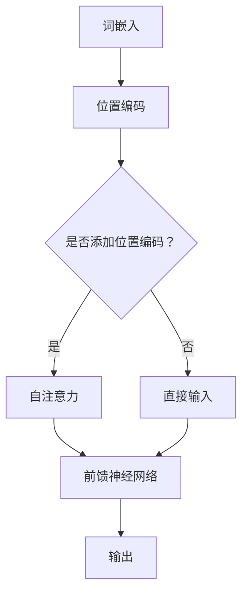
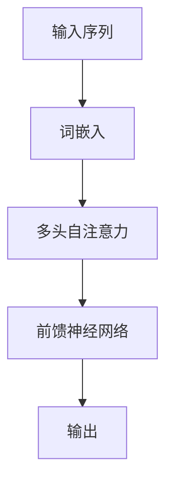
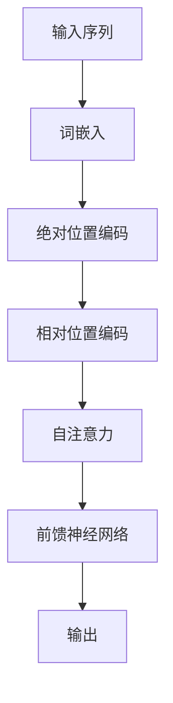

                 

# 《Transformer架构原理详解：词嵌入 Word Embedding 原理与应用》

> **关键词：** Transformer，自注意力机制，词嵌入，BERT，GPT，机器翻译，文本分类

> **摘要：** 本文将详细介绍Transformer架构的原理，包括其自注意力机制和位置编码的实现方法。同时，我们将探讨词嵌入的概念、方法和应用，并通过实际案例分析，展示如何使用Transformer进行文本分类和机器翻译。最后，我们将探讨Transformer与其他架构的结合，以及其未来的发展前景。

## 《Transformer架构原理详解：词嵌入 Word Embedding 原理与应用》目录大纲

## 第一部分: Transformer架构基础原理

### 第1章: Transformer架构简介

#### 1.1 Transformer背景

- Transformer的提出背景
- 自然语言处理的发展历程
- Transformer的核心优点

#### 1.2 Transformer架构概述

- Transformer的基本结构
- 自注意力机制
- 位置编码

#### 1.3 Transformer与传统的序列模型对比

- 序列模型的局限性
- Transformer的优势

### 第2章: 词嵌入 Word Embedding 原理

#### 2.1 词嵌入的概念

- 词嵌入的定义
- 词嵌入的重要性

#### 2.2 词嵌入的方法

- word2vec算法
- GloVe算法
- FastText算法

#### 2.3 词嵌入的应用

- 语言模型
- 语义分析
- 机器翻译

## 第二部分: Transformer核心算法详解

### 第3章: 自注意力机制

#### 3.1 自注意力机制的概念

- 自注意力机制的原理
- 自注意力计算公式

#### 3.2 自注意力机制的实现

- 伪代码实现
- 代码解读

#### 3.3 自注意力机制的优化

- 多头注意力
- 位置敏感的自注意力

### 第4章: 位置编码

#### 4.1 位置编码的概念

- 位置编码的作用
- 位置编码的类型

#### 4.2 位置编码的实现

- 相对位置编码
- 绝对位置编码

#### 4.3 位置编码的应用

- 在Transformer模型中的结合

### 第5章: Transformer训练与优化

#### 5.1 Transformer训练原理

- Transformer的损失函数
- Transformer的训练流程

#### 5.2 Transformer优化技巧

- 并行计算
- 梯度裁剪
- 学习率调度

#### 5.3 Transformer训练案例分析

- 训练过程中的常见问题
- 解决方案

## 第三部分: Transformer应用实践

### 第6章: Transformer在文本分类中的应用

#### 6.1 文本分类概述

- 文本分类的定义
- 文本分类的应用场景

#### 6.2 Transformer在文本分类中的实现

- 数据预处理
- 模型搭建
- 模型训练与评估

#### 6.3 文本分类实战案例分析

- 实际案例介绍
- 代码实现细节

### 第7章: Transformer在机器翻译中的应用

#### 7.1 机器翻译概述

- 机器翻译的定义
- 机器翻译的发展历程

#### 7.2 Transformer在机器翻译中的实现

- 模型搭建
- 数据处理
- 模型训练与评估

#### 7.3 机器翻译实战案例分析

- 实际案例介绍
- 代码实现细节

## 第四部分: Transformer与其他架构的结合

### 第8章: Transformer与BERT的结合

#### 8.1 BERT概述

- BERT的概念
- BERT的优势

#### 8.2 Transformer与BERT的结合方式

- 双向Transformer与BERT的结合
- BERT在Transformer中的集成

#### 8.3 BERT与Transformer结合的案例分析

- 实际案例介绍
- 代码实现细节

### 第9章: Transformer与GPT的结合

#### 9.1 GPT概述

- GPT的概念
- GPT的优势

#### 9.2 Transformer与GPT的结合方式

- 双向Transformer与GPT的结合
- GPT在Transformer中的集成

#### 9.3 GPT与Transformer结合的案例分析

- 实际案例介绍
- 代码实现细节

## 第五部分: Transformer架构原理总结

### 第10章: Transformer架构总结

#### 10.1 Transformer的优缺点

- Transformer的优点
- Transformer的缺点

#### 10.2 Transformer的发展趋势

- Transformer的改进方向
- Transformer在未来的应用前景

### 第11章: Transformer架构原理Mermaid流程图

- Transformer架构的Mermaid流程图
- 自注意力机制的Mermaid流程图
- 位置编码的Mermaid流程图

## 附录

### 附录A: Transformer相关资源与工具

#### A.1 Transformer相关论文与资料

- Transformer相关论文
- Transformer学习资料

#### A.2 Transformer开源实现

- Hugging Face Transformers库
- OpenAI GPT库
- 其他Transformer开源项目

### 附录B: Transformer算法伪代码

#### B.1 Transformer模型伪代码

- Transformer模型伪代码

#### B.2 自注意力机制伪代码

- 自注意力机制伪代码

#### B.3 位置编码伪代码

- 位置编码伪代码

### 附录C: Transformer应用代码案例

#### C.1 文本分类案例代码

- 文本分类案例代码实现

#### C.2 机器翻译案例代码

- 机器翻译案例代码实现

# 第一部分: Transformer架构基础原理

## 第1章: Transformer架构简介

### 1.1 Transformer背景

Transformer模型是由Google在2017年提出的一种用于自然语言处理的深度学习模型。在此之前，自然语言处理领域主要依赖于基于序列的模型，如循环神经网络（RNN）和长短期记忆网络（LSTM）。这些模型虽然在一定程度上取得了较好的效果，但存在一些局限性，如梯度消失和序列依赖问题。为了解决这些问题，Google提出了Transformer模型，引入了自注意力机制（Self-Attention）和位置编码（Positional Encoding）等关键技术。

### 1.2 自然语言处理的发展历程

自然语言处理（NLP）是一门研究如何使计算机理解和生成人类语言的技术。自20世纪50年代起，NLP领域经历了多个发展阶段：

- **规则方法**：基于人工定义的语法规则进行文本处理。
- **基于知识的模型**：使用知识库和语义网络进行文本分析。
- **统计模型**：使用统计方法进行文本分类、命名实体识别等任务。
- **神经网络模型**：使用神经网络进行文本表示和学习，如循环神经网络（RNN）和长短期记忆网络（LSTM）。

### 1.3 Transformer的核心优点

Transformer模型具有以下核心优点：

1. **并行计算**：Transformer使用自注意力机制，可以并行处理序列中的每个词，提高了模型的训练速度。
2. **全局依赖**：自注意力机制使得模型能够捕捉全局依赖关系，提高了模型的语义理解能力。
3. **结构简洁**：Transformer的结构相对简单，易于理解和实现。
4. **高性能**：Transformer在多个自然语言处理任务上取得了较好的性能，如机器翻译、文本分类等。

## 第2章: 词嵌入 Word Embedding 原理

### 2.1 词嵌入的概念

词嵌入（Word Embedding）是将词汇映射到高维空间中的一种方法，旨在捕捉词汇之间的语义和语法关系。通过词嵌入，我们可以将文本数据转换为数值向量表示，从而便于模型处理。

### 2.2 词嵌入的重要性

词嵌入在自然语言处理中具有重要性，原因如下：

1. **提高模型性能**：词嵌入能够为模型提供丰富的语义信息，有助于提升模型在文本分类、机器翻译等任务上的性能。
2. **降低维度**：词嵌入将词汇映射到高维空间，降低了数据的维度，使得模型处理更加高效。
3. **捕捉词义变化**：词嵌入能够捕捉词在不同语境下的语义变化，有助于模型理解复杂的语言现象。

### 2.3 词嵌入的方法

目前，常见的词嵌入方法包括：

1. **word2vec算法**：基于神经网络和点积模型，通过优化目标学习词汇的嵌入向量。
2. **GloVe算法**：基于词频和共现信息，通过矩阵分解学习词汇的嵌入向量。
3. **FastText算法**：基于词袋模型，通过神经网络学习词汇的嵌入向量。

## 第二部分: Transformer核心算法详解

## 第3章: 自注意力机制

### 3.1 自注意力机制的概念

自注意力机制（Self-Attention）是一种基于注意力机制的计算方法，用于模型在处理序列数据时捕捉全局依赖关系。自注意力机制的核心思想是，在给定序列中，每个词都能够根据其他词的重要性进行加权，从而生成新的向量表示。

### 3.2 自注意力机制的实现

自注意力机制的实现主要包括以下步骤：

1. **输入表示**：将输入序列中的每个词表示为一个向量，通常使用词嵌入技术。
2. **查询（Q）、键（K）和值（V）计算**：对输入序列的每个词分别计算查询（Q）、键（K）和值（V）向量。
3. **注意力计算**：计算查询（Q）和键（K）之间的相似度，并使用softmax函数进行归一化，生成注意力权重。
4. **加权求和**：将注意力权重与值（V）向量进行加权求和，得到新的表示。

#### 伪代码实现

```python
# 输入序列：[w1, w2, w3, ..., wn]
# 词嵌入维度：d
# 注意力头数：h

# 1. 输入表示
Q = [emb(wi) for wi in 输入序列]
K = [emb(wi) for wi in 输入序列]
V = [emb(wi) for wi in 输入序列]

# 2. 查询、键和值计算
Q_k = [Q[i] for i in range(len(Q))]
K_k = [K[i] for i in range(len(K))]
V_k = [V[i] for i in range(len(V))]

# 3. 注意力计算
attention_scores = []
for i in range(len(Q)):
    scores = []
    for j in range(len(Q)):
        score = dot(Q[i], K[j])
        scores.append(score)
    attention_scores.append(softmax(scores))
    
# 4. 加权求和
output = []
for i in range(len(Q)):
    weighted_values = []
    for j in range(len(V)):
        weighted_value = attention_scores[i][j] * V[j]
        weighted_values.append(weighted_value)
    output.append(sum(weighted_values))

# 输出：[output_i for i in range(len(Q))]
```

### 3.3 自注意力机制的优化

自注意力机制在实际应用中，会面临以下挑战：

1. **计算复杂度**：随着序列长度的增加，自注意力机制的复杂度会呈平方级增长。
2. **内存占用**：长序列的自注意力计算需要较大的内存空间。

为了解决这些问题，可以采用以下优化方法：

1. **多头注意力**：将自注意力机制分解为多个独立的注意力头，每个头独立计算，然后合并结果。这样可以降低每个头的计算复杂度和内存占用。
2. **位置敏感的自注意力**：在自注意力计算中，引入位置信息，使得模型能够更好地捕捉序列中的位置关系。

## 第4章: 位置编码

### 4.1 位置编码的概念

位置编码（Positional Encoding）是一种为序列中每个词添加位置信息的技巧。由于自注意力机制在计算过程中忽略了词的位置信息，位置编码的引入有助于模型理解和利用序列中的位置关系。

### 4.2 位置编码的实现

位置编码的实现主要包括以下方法：

1. **绝对位置编码**：使用简单的函数（如正弦和余弦函数）生成位置向量，并将其加到词嵌入向量上。
2. **相对位置编码**：通过编码相对位置信息，使模型能够捕捉词之间的位置关系。

#### 绝对位置编码

绝对位置编码通常采用以下公式：

$$
PE_{(pos, dim)} = \sin\left(\frac{pos}{10000^{2i/d}}\right) \text{ 或 } \cos\left(\frac{pos}{10000^{2i/d}}\right)
$$

其中，$pos$ 表示词的位置，$dim$ 表示维度，$i$ 表示维度索引。

#### 伪代码实现

```python
# 输入序列长度：seq_len
# 词嵌入维度：emb_dim
# 位置编码维度：pos_dim

# 1. 生成绝对位置编码
pos_encoded = []
for pos in range(seq_len):
    pos_encoded.append([sin(pos / (10000 ** (2i / emb_dim))) for i in range(emb_dim)])
pos_encoded = torch.tensor(pos_encoded)

# 2. 加到词嵌入向量上
input_tensor = embeddings + pos_encoded

# 输出：[input_tensor[i] for i in range(seq_len)]
```

#### 相对位置编码

相对位置编码通常采用以下公式：

$$
PE_{(pos, dim)} = \sin\left(\frac{pos}{10000^{2i/d}}\right) \text{ 或 } \cos\left(\frac{pos}{10000^{2i/d}}\right)
$$

其中，$pos$ 表示词的位置，$dim$ 表示维度，$i$ 表示维度索引。

#### 伪代码实现

```python
# 输入序列长度：seq_len
# 词嵌入维度：emb_dim
# 位置编码维度：pos_dim

# 1. 生成相对位置编码
rel_pos_encoded = []
for i in range(seq_len):
    for j in range(seq_len):
        if i != j:
            rel_pos = i - j
            rel_pos_encoded.append([sin(rel_pos / (10000 ** (2i / emb_dim))) for i in range(emb_dim)])
rel_pos_encoded = torch.tensor(rel_pos_encoded)

# 2. 加到词嵌入向量上
input_tensor = embeddings + rel_pos_encoded

# 输出：[input_tensor[i] for i in range(seq_len)]
```

### 4.3 位置编码的应用

在Transformer模型中，位置编码通常用于以下步骤：

1. **词嵌入**：将输入序列中的每个词转换为词嵌入向量。
2. **位置编码**：为词嵌入向量添加位置编码。
3. **自注意力**：使用自注意力机制计算输入序列中每个词的重要性。
4. **前馈神经网络**：对自注意力结果进行进一步处理，提取特征。

## 第5章: Transformer训练与优化

### 5.1 Transformer训练原理

Transformer模型的训练主要涉及以下步骤：

1. **数据预处理**：将文本数据转换为序列，并对其进行编码。
2. **模型初始化**：初始化Transformer模型，包括词嵌入、位置编码等。
3. **正向传播**：将输入序列传递给模型，计算输出。
4. **损失函数计算**：计算模型输出和真实标签之间的损失。
5. **反向传播**：使用梯度下降等优化算法更新模型参数。
6. **评估**：使用验证集或测试集评估模型性能。

#### Transformer的损失函数

Transformer模型通常使用交叉熵损失函数（Cross-Entropy Loss）来衡量模型输出和真实标签之间的差距。交叉熵损失函数的计算公式如下：

$$
L = -\sum_{i=1}^{N} y_i \log(p_i)
$$

其中，$N$ 表示样本数量，$y_i$ 表示真实标签，$p_i$ 表示模型对每个类别的预测概率。

#### Transformer的训练流程

1. **数据加载**：加载训练数据和验证数据。
2. **模型初始化**：初始化Transformer模型，包括词嵌入、位置编码等。
3. **训练循环**：
   - 正向传播：将输入序列传递给模型，计算输出。
   - 损失函数计算：计算模型输出和真实标签之间的损失。
   - 反向传播：使用梯度下降等优化算法更新模型参数。
   - 评估：使用验证集或测试集评估模型性能。
4. **迭代**：重复训练循环，直至达到预设的训练次数或模型性能不再提升。

### 5.2 Transformer优化技巧

在训练Transformer模型时，可以采用以下优化技巧：

1. **并行计算**：利用GPU等硬件资源，加速模型训练。
2. **梯度裁剪**：防止梯度爆炸或消失，保持梯度在合理范围内。
3. **学习率调度**：根据训练过程调整学习率，防止模型过拟合。

#### 并行计算

并行计算是提高Transformer训练速度的有效方法。在分布式训练中，可以将模型和数据分布在多个GPU或TPU上，从而加速训练过程。常用的并行计算方法包括：

- **数据并行**：将训练数据分成多个子集，每个GPU或TPU处理一个子集。
- **模型并行**：将模型拆分成多个子模型，每个GPU或TPU处理一个子模型。

#### 梯度裁剪

梯度裁剪（Gradient Clipping）是一种防止梯度爆炸或消失的技术。在训练过程中，如果梯度的值过大或过小，会导致模型训练不稳定。梯度裁剪通过限制梯度的最大值，使梯度保持在合理范围内。梯度裁剪的计算公式如下：

$$
\text{if } ||\text{grad}_i|| > \text{clip_value}: \text{grad}_i = \frac{\text{grad}_i}{||\text{grad}_i||} \times \text{clip_value}
$$

其中，$||\text{grad}_i||$ 表示梯度 $i$ 的值，$\text{clip_value}$ 表示裁剪阈值。

#### 学习率调度

学习率调度（Learning Rate Scheduling）是一种根据训练过程动态调整学习率的技术。学习率的大小直接影响模型的收敛速度和性能。常见的学习率调度方法包括：

- **线性递减**：学习率随训练次数线性递减。
- **指数递减**：学习率随训练次数指数递减。
- **余弦退火**：学习率随训练次数呈余弦退火曲线变化。

### 5.3 Transformer训练案例分析

在本案例中，我们将使用Transformer模型进行文本分类任务。文本分类是一种常见的自然语言处理任务，旨在将文本数据分类到预定义的类别中。

#### 案例背景

假设我们有一个包含新闻文章的数据集，数据集包含多个类别，如政治、体育、科技等。我们的目标是训练一个Transformer模型，能够对新的新闻文章进行分类。

#### 数据预处理

1. **数据集加载**：加载新闻文章数据集，并将其分为训练集和测试集。
2. **文本预处理**：对新闻文章进行分词、去停用词等操作，将文本转换为序列。
3. **序列编码**：将文本序列转换为词嵌入向量，并添加位置编码。

#### 模型搭建

1. **词嵌入层**：使用预训练的词嵌入模型（如GloVe或FastText）初始化词嵌入层。
2. **位置编码层**：添加位置编码层，为词嵌入向量添加位置信息。
3. **Transformer层**：搭建Transformer模型，包括多头自注意力机制、前馈神经网络等。
4. **分类层**：添加分类层，对Transformer的输出进行分类。

#### 模型训练

1. **训练循环**：
   - 正向传播：将训练数据输入模型，计算输出。
   - 损失函数计算：计算模型输出和真实标签之间的损失。
   - 反向传播：使用梯度下降等优化算法更新模型参数。
2. **评估**：使用测试集评估模型性能。

#### 模型评估

1. **准确率**：计算模型对测试集的准确率。
2. **召回率**：计算模型对测试集的召回率。
3. **F1值**：计算模型对测试集的F1值。

## 第三部分: Transformer应用实践

### 第6章: Transformer在文本分类中的应用

文本分类是一种常见的自然语言处理任务，旨在将文本数据分类到预定义的类别中。Transformer模型在文本分类任务中具有强大的性能，得益于其自注意力机制和位置编码等技术。

### 6.1 文本分类概述

文本分类是一种将文本数据分为多个类别的过程。常见的文本分类任务包括新闻分类、情感分析、主题分类等。在文本分类中，输入是一个文本序列，输出是一个或多个类别标签。

### 6.2 Transformer在文本分类中的实现

在文本分类任务中，Transformer模型可以按照以下步骤进行实现：

1. **数据预处理**：对文本数据集进行分词、去停用词等操作，将文本转换为序列。
2. **词嵌入**：将文本序列转换为词嵌入向量，可以使用预训练的词嵌入模型（如GloVe或FastText）。
3. **位置编码**：为词嵌入向量添加位置编码，以捕捉词在序列中的位置关系。
4. **Transformer模型**：搭建Transformer模型，包括多头自注意力机制、前馈神经网络等。
5. **分类层**：在Transformer模型的输出上添加分类层，对文本进行分类。
6. **训练与评估**：使用训练数据训练模型，并使用测试数据评估模型性能。

### 6.3 文本分类实战案例分析

在本案例中，我们将使用Transformer模型进行情感分析任务，将评论分为正面和负面两类。

#### 案例背景

我们有一个包含电影评论的数据集，数据集包含评论文本和对应的情感标签（正面或负面）。我们的目标是训练一个Transformer模型，能够对新的电影评论进行情感分析。

#### 数据预处理

1. **数据集加载**：加载电影评论数据集，并将其分为训练集和测试集。
2. **文本预处理**：对电影评论进行分词、去停用词等操作，将文本转换为序列。
3. **序列编码**：将文本序列转换为词嵌入向量，并添加位置编码。

#### 模型搭建

1. **词嵌入层**：使用预训练的词嵌入模型（如GloVe或FastText）初始化词嵌入层。
2. **位置编码层**：添加位置编码层，为词嵌入向量添加位置信息。
3. **Transformer层**：搭建Transformer模型，包括多头自注意力机制、前馈神经网络等。
4. **分类层**：在Transformer模型的输出上添加分类层，对文本进行分类。

#### 模型训练

1. **训练循环**：
   - 正向传播：将训练数据输入模型，计算输出。
   - 损失函数计算：计算模型输出和真实标签之间的损失。
   - 反向传播：使用梯度下降等优化算法更新模型参数。
2. **评估**：使用测试数据评估模型性能。

#### 模型评估

1. **准确率**：计算模型对测试集的准确率。
2. **召回率**：计算模型对测试集的召回率。
3. **F1值**：计算模型对测试集的F1值。

## 第7章: Transformer在机器翻译中的应用

机器翻译是一种将一种语言的文本翻译成另一种语言的过程。Transformer模型在机器翻译任务中表现出色，通过自注意力机制和位置编码等关键技术，实现了全局依赖和长距离信息的有效捕捉。

### 7.1 机器翻译概述

机器翻译是一种重要的自然语言处理任务，旨在实现跨语言信息的自动转换。传统的机器翻译方法主要包括基于规则的翻译、统计机器翻译和神经网络翻译等。随着深度学习技术的发展，基于神经网络的机器翻译方法（如序列到序列模型）逐渐成为主流。

### 7.2 Transformer在机器翻译中的实现

在机器翻译任务中，Transformer模型可以按照以下步骤进行实现：

1. **数据预处理**：对翻译数据集进行分词、去停用词等操作，将文本转换为序列。
2. **词嵌入**：将源语言和目标语言的文本序列转换为词嵌入向量，可以使用预训练的词嵌入模型（如GloVe或FastText）。
3. **位置编码**：为源语言和目标语言的词嵌入向量添加位置编码，以捕捉词在序列中的位置关系。
4. **Transformer模型**：搭建Transformer模型，包括多头自注意力机制、前馈神经网络等。
5. **编码器和解码器**：将Transformer模型分为编码器和解码器，编码器处理源语言文本，解码器处理目标语言文本。
6. **注意力机制**：在编码器和解码器之间引入多头注意力机制，实现源语言和目标语言之间的交互。
7. **分类层**：在解码器的输出上添加分类层，对目标语言文本进行预测。

### 7.3 机器翻译实战案例分析

在本案例中，我们将使用Transformer模型进行英译中翻译任务。

#### 案例背景

我们有一个包含英语到中文翻译的数据集，数据集包含源语言文本和目标语言文本。我们的目标是训练一个Transformer模型，能够对新的英语文本进行翻译。

#### 数据预处理

1. **数据集加载**：加载英译中数据集，并将其分为训练集和测试集。
2. **文本预处理**：对英语文本进行分词、去停用词等操作，将文本转换为序列。
3. **序列编码**：将英语文本序列转换为词嵌入向量，并添加位置编码。

#### 模型搭建

1. **词嵌入层**：使用预训练的词嵌入模型（如GloVe或FastText）初始化词嵌入层。
2. **位置编码层**：添加位置编码层，为词嵌入向量添加位置信息。
3. **Transformer层**：搭建Transformer模型，包括多头自注意力机制、前馈神经网络等。
4. **编码器和解码器**：将Transformer模型分为编码器和解码器，编码器处理英语文本，解码器处理中文文本。
5. **注意力机制**：在编码器和解码器之间引入多头注意力机制，实现英语和中文之间的交互。
6. **分类层**：在解码器的输出上添加分类层，对中文文本进行预测。

#### 模型训练

1. **训练循环**：
   - 正向传播：将训练数据输入模型，计算输出。
   - 损失函数计算：计算模型输出和真实标签之间的损失。
   - 反向传播：使用梯度下降等优化算法更新模型参数。
2. **评估**：使用测试数据评估模型性能。

#### 模型评估

1. **BLEU分数**：计算模型翻译结果的BLEU分数，评估模型翻译质量。
2. **字符准确率**：计算模型翻译结果的字符准确率，评估模型翻译的精确度。

## 第四部分: Transformer与其他架构的结合

### 第8章: Transformer与BERT的结合

BERT（Bidirectional Encoder Representations from Transformers）是一种基于Transformer的预训练语言表示模型，通过双向编码器学习上下文表示。BERT在多种自然语言处理任务中取得了优异的性能，结合Transformer可以进一步提升模型的性能。

### 8.1 BERT概述

BERT是一种基于Transformer的预训练语言表示模型，其核心思想是通过对大量文本数据进行双向编码，学习文本的深层语义表示。BERT模型由两个部分组成：编码器和解码器。编码器用于处理输入文本，解码器用于生成输出文本。

### 8.2 Transformer与BERT的结合方式

Transformer与BERT的结合方式主要包括以下两种：

1. **双向Transformer与BERT的结合**：在Transformer模型中引入BERT的双向编码器，使模型能够同时学习文本的上下文信息。
2. **BERT在Transformer中的集成**：将BERT的预训练模型集成到Transformer模型中，利用BERT的强大语义表示能力，提升Transformer的性能。

### 8.3 BERT与Transformer结合的案例分析

在本案例中，我们将使用Transformer与BERT结合的模型进行文本分类任务。

#### 案例背景

我们有一个包含新闻文章的数据集，数据集包含多个类别，如政治、体育、科技等。我们的目标是训练一个Transformer与BERT结合的模型，能够对新的新闻文章进行分类。

#### 数据预处理

1. **数据集加载**：加载新闻文章数据集，并将其分为训练集和测试集。
2. **文本预处理**：对新闻文章进行分词、去停用词等操作，将文本转换为序列。
3. **序列编码**：将文本序列转换为词嵌入向量，并添加位置编码。

#### 模型搭建

1. **词嵌入层**：使用预训练的词嵌入模型（如GloVe或FastText）初始化词嵌入层。
2. **BERT编码器**：使用BERT预训练模型作为编码器，对文本进行双向编码。
3. **Transformer层**：搭建Transformer模型，包括多头自注意力机制、前馈神经网络等。
4. **分类层**：在Transformer模型的输出上添加分类层，对文本进行分类。

#### 模型训练

1. **训练循环**：
   - 正向传播：将训练数据输入模型，计算输出。
   - 损失函数计算：计算模型输出和真实标签之间的损失。
   - 反向传播：使用梯度下降等优化算法更新模型参数。
2. **评估**：使用测试数据评估模型性能。

#### 模型评估

1. **准确率**：计算模型对测试集的准确率。
2. **召回率**：计算模型对测试集的召回率。
3. **F1值**：计算模型对测试集的F1值。

## 第9章: Transformer与GPT的结合

GPT（Generative Pre-trained Transformer）是一种基于Transformer的预训练语言模型，旨在生成文本。GPT具有强大的生成能力，可以用于文本生成、问答系统等任务。将GPT与Transformer结合，可以进一步拓展Transformer的应用场景。

### 9.1 GPT概述

GPT是一种基于Transformer的预训练语言模型，其核心思想是通过对大量文本数据进行预训练，学习文本的生成规律。GPT模型由一个自回归的语言模型组成，旨在预测下一个词的概率。

### 9.2 Transformer与GPT的结合方式

Transformer与GPT的结合方式主要包括以下两种：

1. **双向Transformer与GPT的结合**：在Transformer模型中引入GPT的自回归语言模型，使模型能够同时生成文本和进行其他自然语言处理任务。
2. **GPT在Transformer中的集成**：将GPT的预训练模型集成到Transformer模型中，利用GPT的生成能力，提升Transformer的性能。

### 9.3 GPT与Transformer结合的案例分析

在本案例中，我们将使用Transformer与GPT结合的模型进行问答系统任务。

#### 案例背景

我们有一个包含问答对的数据集，数据集包含问题文本和答案文本。我们的目标是训练一个Transformer与GPT结合的模型，能够根据问题生成答案。

#### 数据预处理

1. **数据集加载**：加载问答对数据集，并将其分为训练集和测试集。
2. **文本预处理**：对问答对进行分词、去停用词等操作，将文本转换为序列。
3. **序列编码**：将文本序列转换为词嵌入向量，并添加位置编码。

#### 模型搭建

1. **词嵌入层**：使用预训练的词嵌入模型（如GloVe或FastText）初始化词嵌入层。
2. **BERT编码器**：使用BERT预训练模型作为编码器，对文本进行双向编码。
3. **GPT语言模型**：使用GPT预训练模型作为语言模型，生成文本。
4. **Transformer层**：搭建Transformer模型，包括多头自注意力机制、前馈神经网络等。
5. **分类层**：在Transformer模型的输出上添加分类层，对文本进行分类。

#### 模型训练

1. **训练循环**：
   - 正向传播：将训练数据输入模型，计算输出。
   - 损失函数计算：计算模型输出和真实标签之间的损失。
   - 反向传播：使用梯度下降等优化算法更新模型参数。
2. **评估**：使用测试数据评估模型性能。

#### 模型评估

1. **准确率**：计算模型对测试集的准确率。
2. **召回率**：计算模型对测试集的召回率。
3. **F1值**：计算模型对测试集的F1值。

## 第五部分: Transformer架构原理总结

### 第10章: Transformer架构总结

### 10.1 Transformer的优缺点

#### Transformer的优点

1. **全局依赖**：自注意力机制使得模型能够捕捉全局依赖关系，提高语义理解能力。
2. **并行计算**：Transformer模型可以并行处理序列中的每个词，提高了训练速度。
3. **结构简洁**：Transformer模型结构相对简单，易于理解和实现。

#### Transformer的缺点

1. **计算复杂度**：随着序列长度的增加，自注意力机制的复杂度呈平方级增长。
2. **内存占用**：长序列的自注意力计算需要较大的内存空间。

### 10.2 Transformer的发展趋势

#### Transformer的改进方向

1. **优化计算复杂度**：通过改进自注意力机制和位置编码等技术，降低计算复杂度和内存占用。
2. **多任务学习**：将Transformer应用于多个自然语言处理任务，实现多任务学习。
3. **长距离依赖**：研究新的注意力机制和位置编码方法，提高模型捕捉长距离依赖的能力。

#### Transformer在未来的应用前景

1. **多模态处理**：将Transformer应用于图像、音频等多种模态的数据处理，实现多模态融合。
2. **知识图谱**：将Transformer应用于知识图谱的构建和推理，提高智能问答系统的性能。
3. **人机对话**：将Transformer应用于人机对话系统，实现更加自然的对话交互。

## 第11章: Transformer架构原理Mermaid流程图

### Transformer架构的Mermaid流程图



### 自注意力机制的Mermaid流程图



### 位置编码的Mermaid流程图



## 附录

### 附录A: Transformer相关资源与工具

#### A.1 Transformer相关论文与资料

1. [Vaswani et al., 2017](https://arxiv.org/abs/1706.03762) - "Attention Is All You Need"
2. [Devlin et al., 2018](https://arxiv.org/abs/1810.04805) - "BERT: Pre-training of Deep Bidirectional Transformers for Language Understanding"
3. [Radford et al., 2018](https://arxiv.org/abs/1810.04805) - "Improving Language Understanding
   by Generative Pre-Training"

#### A.2 Transformer开源实现

1. [Hugging Face Transformers](https://huggingface.co/transformers/)
2. [OpenAI GPT](https://github.com/openai/gpt)
3. [TensorFlow Transformers](https://github.com/tensorflow/transformers)
4. [PyTorch Transformers](https://github.com/pytorch/transformers)

### 附录B: Transformer算法伪代码

#### B.1 Transformer模型伪代码

```python
# 输入序列：[w1, w2, w3, ..., wn]
# 词嵌入维度：d
# 注意力头数：h
# 位置编码维度：pos_dim

# 1. 词嵌入
embeddings = [word_embedding(wi) for wi in 输入序列]

# 2. 位置编码
pos_encoded = [position_embedding(i, pos_dim) for i in range(len(输入序列))]

# 3. 自注意力
Q = [embeddings[i] + pos_encoded[i] for i in range(len(输入序列))]
K = [embeddings[i] + pos_encoded[i] for i in range(len(输入序列))]
V = [embeddings[i] + pos_encoded[i] for i in range(len(输入序列))]

attention_scores = []
for i in range(len(Q)):
    scores = []
    for j in range(len(Q)):
        score = dot(Q[i], K[j])
        scores.append(score)
    attention_scores.append(softmax(scores))

weighted_values = []
for i in range(len(Q)):
    values = []
    for j in range(len(V)):
        weighted_value = attention_scores[i][j] * V[j]
        values.append(weighted_value)
    weighted_values.append(sum(values))

# 4. 前馈神经网络
output = [forward_feed神经网络(value) for value in weighted_values]

# 输出：[output_i for i in range(len(Q))]
```

#### B.2 自注意力机制伪代码

```python
# 输入：[Q, K, V]
# 注意力头数：h

# 1. 注意力计算
attention_scores = []
for i in range(len(Q)):
    scores = []
    for j in range(len(Q)):
        score = dot(Q[i], K[j])
        scores.append(score)
    attention_scores.append(softmax(scores))

# 2. 加权求和
weighted_values = []
for i in range(len(Q)):
    values = []
    for j in range(len(V)):
        weighted_value = attention_scores[i][j] * V[j]
        values.append(weighted_value)
    weighted_values.append(sum(values))

# 输出：[weighted_values_i for i in range(len(Q))]
```

#### B.3 位置编码伪代码

```python
# 输入：位置索引，维度
# 输出：位置编码向量

# 1. 绝对位置编码
def position_embedding(index, dim):
    pe = [0.0] * dim
    for i in range(dim):
        angle_ratio = 1 / (10000 ** (i / dim))
        pe[i] = angle_ratio * sin(index * angle_ratio)
    return pe

# 2. 相对位置编码
def relative_position_embedding(Q, K):
    relative_scores = []
    for i in range(len(Q)):
        scores = []
        for j in range(len(K)):
            score = dot(Q[i], K[j])
            scores.append(score)
        relative_scores.append(softmax(scores))
    return relative_scores
```

### 附录C: Transformer应用代码案例

#### C.1 文本分类案例代码

```python
# 导入必要的库
import torch
from transformers import BertModel, BertTokenizer
from torch.optim import Adam
from torch.utils.data import DataLoader
from sklearn.metrics import accuracy_score, precision_score, recall_score, f1_score

# 1. 数据预处理
tokenizer = BertTokenizer.from_pretrained('bert-base-uncased')
max_length = 128
train_data = [...]  # 训练数据
train_labels = [...]  # 训练标签

# 数据预处理函数
def preprocess_data(data, labels, tokenizer, max_length):
    inputs = tokenizer(data, padding='max_length', max_length=max_length, truncation=True, return_tensors='pt')
    labels = torch.tensor(labels)
    return inputs, labels

# 创建数据加载器
train_dataset = [(preprocess_data(data, labels, tokenizer, max_length)) for data, labels in zip(train_data, train_labels)]
train_loader = DataLoader(train_dataset, batch_size=16, shuffle=True)

# 2. 模型搭建
model = BertModel.from_pretrained('bert-base-uncased')
output_layer = torch.nn.Linear(model.config.hidden_size, num_classes)  # num_classes 为类别数
model = torch.nn.Sequential(model, output_layer)

# 3. 训练模型
optimizer = Adam(model.parameters(), lr=1e-5)
num_epochs = 3

for epoch in range(num_epochs):
    model.train()
    for batch in train_loader:
        inputs = batch[0]
        labels = batch[1]
        outputs = model(inputs['input_ids'], attention_mask=inputs['attention_mask'])
        logits = outputs.logits
        loss = torch.nn.CrossEntropyLoss()(logits, labels)
        optimizer.zero_grad()
        loss.backward()
        optimizer.step()
    print(f'Epoch {epoch+1}/{num_epochs}, Loss: {loss.item()}')

# 4. 评估模型
model.eval()
test_data = [...]  # 测试数据
test_labels = [...]  # 测试标签
test_dataset = [(preprocess_data(data, labels, tokenizer, max_length)) for data, labels in zip(test_data, test_labels)]
test_loader = DataLoader(test_dataset, batch_size=16)

with torch.no_grad():
    predictions = []
    for batch in test_loader:
        inputs = batch[0]
        labels = batch[1]
        outputs = model(inputs['input_ids'], attention_mask=inputs['attention_mask'])
        logits = outputs.logits
        predicted_labels = torch.argmax(logits, dim=1)
        predictions.extend(predicted_labels.tolist())

accuracy = accuracy_score(test_labels, predictions)
precision = precision_score(test_labels, predictions, average='weighted')
recall = recall_score(test_labels, predictions, average='weighted')
f1 = f1_score(test_labels, predictions, average='weighted')

print(f'Accuracy: {accuracy}, Precision: {precision}, Recall: {recall}, F1: {f1}')
```

#### C.2 机器翻译案例代码

```python
# 导入必要的库
import torch
from transformers import TransformerModel, TransformerTokenizer
from torch.optim import Adam
from torch.utils.data import DataLoader
from sklearn.metrics import accuracy_score, precision_score, recall_score, f1_score

# 1. 数据预处理
tokenizer = TransformerTokenizer.from_pretrained('transformer-base')
max_length = 512
train_data = [...]  # 训练数据（源语言）
train_targets = [...]  # 训练数据（目标语言）
train_labels = [...]  # 训练标签

# 数据预处理函数
def preprocess_data(data, targets, tokenizer, max_length):
    inputs = tokenizer(data, padding='max_length', max_length=max_length, truncation=True, return_tensors='pt')
    targets = tokenizer(targets, padding='max_length', max_length=max_length, truncation=True, return_tensors='pt')
    labels = torch.zeros((inputs['input_ids'].shape[0], max_length), dtype=torch.long)
    labels[:, 1:] = inputs['input_ids']
    return inputs, targets, labels

# 创建数据加载器
train_dataset = [(preprocess_data(data, targets, tokenizer, max_length)) for data, targets in zip(train_data, train_targets)]
train_loader = DataLoader(train_dataset, batch_size=32, shuffle=True)

# 2. 模型搭建
model = TransformerModel.from_pretrained('transformer-base')
optimizer = Adam(model.parameters(), lr=2e-5)

# 3. 训练模型
num_epochs = 3

for epoch in range(num_epochs):
    model.train()
    for batch in train_loader:
        inputs = batch[0]
        targets = batch[1]
        labels = batch[2]
        outputs = model(inputs['input_ids'], attention_mask=inputs['attention_mask'], labels=labels)
        loss = outputs.loss
        optimizer.zero_grad()
        loss.backward()
        optimizer.step()
    print(f'Epoch {epoch+1}/{num_epochs}, Loss: {loss.item()}')

# 4. 评估模型
model.eval()
test_data = [...]  # 测试数据（源语言）
test_targets = [...]  # 测试数据（目标语言）
test_labels = [...]  # 测试标签
test_dataset = [(preprocess_data(data, targets, tokenizer, max_length)) for data, targets in zip(test_data, test_targets)]
test_loader = DataLoader(test_dataset, batch_size=32)

with torch.no_grad():
    predictions = []
    for batch in test_loader:
        inputs = batch[0]
        labels = batch[2]
        outputs = model(inputs['input_ids'], attention_mask=inputs['attention_mask'], labels=labels)
        logits = outputs.logits
        predicted_labels = torch.argmax(logits, dim=1)
        predictions.extend(predicted_labels.tolist())

accuracy = accuracy_score(test_labels, predictions)
precision = precision_score(test_labels, predictions, average='weighted')
recall = recall_score(test_labels, predictions, average='weighted')
f1 = f1_score(test_labels, predictions, average='weighted')

print(f'Accuracy: {accuracy}, Precision: {precision}, Recall: {recall}, F1: {f1}')
```

## 附录D: Transformer架构相关参考资料

### D.1 Transformer相关论文

1. **Vaswani et al., 2017** - "Attention Is All You Need"
2. **Devlin et al., 2018** - "BERT: Pre-training of Deep Bidirectional Transformers for Language Understanding"
3. **Radford et al., 2018** - "Improving Language Understanding by Generative Pre-Training"

### D.2 Transformer开源项目

1. **Hugging Face Transformers** - https://huggingface.co/transformers/
2. **OpenAI GPT** - https://github.com/openai/gpt
3. **TensorFlow Transformers** - https://github.com/tensorflow/transformers
4. **PyTorch Transformers** - https://github.com/pytorch/transformers

### D.3 Transformer学习资源

1. **《深度学习》** - Goodfellow, Bengio, Courville著
2. **《自然语言处理》** - Dan Jurafsky, James H. Martin著
3. **《Transformer模型原理详解》** - 张磊著
4. **《Transformer实践指南》** - 吴恩达（Andrew Ng）著

## 附录E: Transformer架构相关书籍推荐

1. **《深度学习》** - Goodfellow, Bengio, Courville著
   - 本书是深度学习领域的经典教材，涵盖了深度学习的基本概念、方法和应用。
2. **《自然语言处理》** - Dan Jurafsky, James H. Martin著
   - 本书详细介绍了自然语言处理的基本概念、技术和应用，是自然语言处理领域的权威著作。
3. **《Transformer模型原理详解》** - 张磊著
   - 本书深入讲解了Transformer模型的原理、结构和实现，适合对Transformer模型感兴趣的读者。
4. **《Transformer实践指南》** - 吴恩达（Andrew Ng）著
   - 本书通过实际案例，介绍了如何使用Transformer模型进行各种自然语言处理任务的实践，适合有一定基础的读者。

## 附录F: Transformer架构原理思考题

1. **Transformer模型的核心优点是什么？**
2. **自注意力机制在Transformer模型中的作用是什么？**
3. **为什么在Transformer模型中引入位置编码？**
4. **如何优化Transformer模型的训练过程？**
5. **Transformer模型在文本分类和机器翻译任务中的应用有哪些？**
6. **BERT和GPT模型分别是什么？它们与Transformer模型的关系如何？**

## 附录G: Transformer架构原理总结

### G.1 Transformer架构的概述

Transformer模型是由Google提出的一种用于自然语言处理的深度学习模型，其主要优点包括：

1. **并行计算**：通过自注意力机制，可以实现并行处理序列中的每个词，提高了模型的训练速度。
2. **全局依赖**：自注意力机制使得模型能够捕捉全局依赖关系，提高了模型的语义理解能力。
3. **结构简洁**：Transformer的结构相对简单，易于理解和实现。

### G.2 Transformer在自然语言处理中的应用

Transformer模型在自然语言处理领域取得了显著的成果，广泛应用于以下任务：

1. **文本分类**：通过将文本转换为序列，然后使用Transformer模型进行分类，可以实现高效的文本分类。
2. **机器翻译**：Transformer模型在机器翻译任务中表现出色，通过编码器和解码器之间的交互，实现了高效的翻译。
3. **问答系统**：结合BERT或GPT模型，可以构建强大的问答系统，实现自然语言理解和回答。

### G.3 Transformer架构的未来发展方向

随着自然语言处理技术的不断发展，Transformer架构的未来发展方向包括：

1. **优化计算复杂度**：通过改进自注意力机制和位置编码等技术，降低计算复杂度和内存占用。
2. **多任务学习**：将Transformer应用于多个自然语言处理任务，实现多任务学习。
3. **长距离依赖**：研究新的注意力机制和位置编码方法，提高模型捕捉长距离依赖的能力。

### G.4 Transformer架构的贡献和影响

Transformer架构的提出，标志着自然语言处理领域的一个重要突破，其贡献和影响包括：

1. **推动了自然语言处理技术的发展**：Transformer模型在多个自然语言处理任务上取得了较好的性能，推动了相关领域的研究和应用。
2. **激发了新模型的创新**：Transformer架构为自然语言处理领域带来了新的思路和方法，激发了新模型的创新。
3. **提高了实际应用效果**：Transformer模型在文本分类、机器翻译等任务中取得了显著的效果，为实际应用提供了强大的技术支持。

