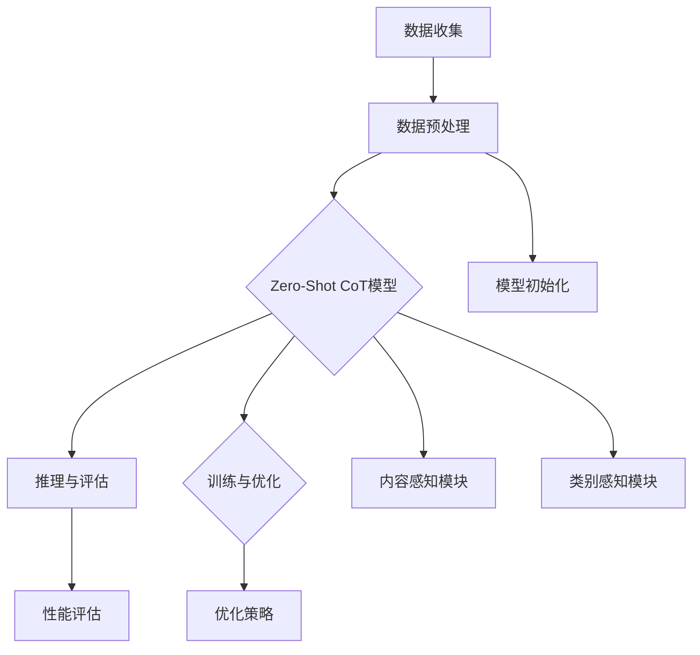

                 

### 《Zero-Shot CoT：无需示例数据的AI学习突破》

> **关键词：** 零样本学习，Zero-Shot CoT，内容感知，人工智能，机器学习，自监督学习，预训练，多样性增强，优化策略，项目实战。

> **摘要：** 本文深入探讨了零样本学习（Zero-Shot Learning，简称ZSL）的最新进展——零样本内容感知（Zero-Shot Content-Aware，简称Zero-Shot CoT）。通过详细阐述其核心概念、原理、算法、数学模型以及实际应用案例，本文揭示了Zero-Shot CoT在无需示例数据的情况下，实现高效AI学习的潜力。读者将了解Zero-Shot CoT如何通过自监督学习和多样性增强等关键技术，突破传统ZSL的限制，为机器学习领域带来革命性变化。

#### 第一部分：概述与背景

### 第1章：零样本学习（Zero-Shot Learning）与Zero-Shot CoT概述

**1.1 零样本学习的定义与背景**

零样本学习（Zero-Shot Learning，简称ZSL）是一种机器学习方法，旨在让模型在未见过的类别上能够进行有效的预测。与传统机器学习任务相比，ZSL不需要事先提供任何与未知类别相关的训练数据，这意味着模型可以应对数据分布变化和类别扩展等问题。

**1.1.1 零样本学习的起源与发展**

ZSL的概念最早由Rumelhart等人在1987年提出，当时主要用于自然语言处理领域。随着深度学习的兴起，ZSL在计算机视觉、语音识别等领域得到了广泛应用。近年来，随着自监督学习和元学习的快速发展，ZSL的研究取得了显著进展。

**1.1.2 零样本学习的重要性与应用场景**

零样本学习的重要性体现在以下几个方面：

1. **扩展性**：在面对新类别或领域时，无需重新收集和标注数据，大大降低了数据获取的成本。
2. **适应能力**：在数据分布变化时，模型可以保持较好的性能，具有较强的鲁棒性。
3. **跨领域应用**：可以在多个领域间共享知识和模型，提高模型的泛化能力。

在实际应用中，零样本学习已经应用于多种场景，如图像分类、文本分类、语音识别等。尤其是在医疗领域，ZSL能够帮助医生快速诊断未知疾病，提高诊断效率。

### 第2章：Zero-Shot CoT 的概念与核心思想

**2.1 Zero-Shot CoT 的概念**

零样本内容感知（Zero-Shot Content-Aware，简称Zero-Shot CoT）是一种基于自监督学习的零样本学习技术。与传统的ZSL不同，Zero-Shot CoT不仅考虑类别信息，还关注数据内容，从而提高模型对未知类别的理解能力。

**2.1.1 零样本内容感知（CoT）的定义**

零样本内容感知（CoT）是指模型在处理未知类别时，能够从数据内容中提取关键信息，并进行有效的分类和推理。CoT的核心思想是将内容感知与类别感知相结合，实现高效的无监督学习。

**2.1.2 零样本内容感知的优势与挑战**

**优势：**

1. **提高分类准确率**：通过关注数据内容，模型可以更好地理解类别的内在关系，从而提高分类准确率。
2. **减少对标注数据的依赖**：由于无需使用带有未知类别的标注数据，Zero-Shot CoT可以降低数据获取和标注的成本。
3. **扩展性**：在面对新类别时，模型可以快速适应，提高跨领域的泛化能力。

**挑战：**

1. **内容理解难度**：从数据内容中提取有用信息是一项具有挑战性的任务，需要模型具备较高的抽象和泛化能力。
2. **计算资源消耗**：Zero-Shot CoT通常需要较大的计算资源和存储空间，特别是在处理大量数据时。

接下来，我们将进一步探讨Zero-Shot CoT的原理与架构，深入分析其核心组件和工作流程。

----------------------------------------------------------------

### 第二部分：核心概念与联系

在深入探讨Zero-Shot CoT的原理与架构之前，我们需要明确其核心概念与联系。为了更好地理解Zero-Shot CoT的工作机制，我们使用Mermaid流程图来描述其核心组件与流程。

#### Mermaid流程图：Zero-Shot CoT的核心组件与流程



**详细解释：**

1. **数据收集（A）**：首先，我们需要收集原始数据，这些数据可能包括图像、文本、音频等。数据收集的目的是为后续的预处理和模型训练提供基础。

2. **数据预处理（B）**：在数据收集后，我们需要对数据进行预处理，包括数据清洗、数据增强、数据标准化等。数据预处理旨在提高数据质量，为模型训练提供更好的数据支持。

3. **模型初始化（F）**：在预处理完成后，我们需要初始化Zero-Shot CoT模型。模型初始化包括权重初始化、网络结构设置等。

4. **Zero-Shot CoT模型（C）**：Zero-Shot CoT模型是整个流程的核心组件，它由内容感知模块和类别感知模块组成。内容感知模块负责从数据内容中提取有用信息，类别感知模块负责处理类别信息。

5. **内容感知模块（G）**：内容感知模块通过自监督学习技术，从数据内容中提取关键特征，如图像中的颜色、纹理、形状等。这些特征将被用于后续的分类和推理任务。

6. **类别感知模块（H）**：类别感知模块负责处理类别信息，包括类别编码、类别嵌入等。类别感知模块与内容感知模块相结合，实现零样本分类。

7. **训练与优化（E）**：在模型初始化后，我们需要对模型进行训练和优化。训练过程包括前向传播、反向传播和梯度更新等。优化策略的选择对模型的性能至关重要。

8. **优化策略（I）**：优化策略包括多种技术，如多样性增强、权重调整、学习率调整等。优化策略的目的是提高模型的泛化能力和分类准确率。

9. **推理与评估（D）**：在模型训练完成后，我们需要进行推理和评估。推理过程包括输入数据的预处理、特征提取和分类等。评估过程用于衡量模型的性能，包括准确率、召回率、F1分数等指标。

10. **性能评估（J）**：性能评估是整个流程的最后一步，用于衡量模型在实际应用中的表现。性能评估结果将为后续的模型改进和优化提供重要依据。

通过上述Mermaid流程图，我们可以清晰地看到Zero-Shot CoT的核心组件与工作流程。接下来，我们将进一步探讨Zero-Shot CoT的原理与架构，深入分析其核心组件与流程。

----------------------------------------------------------------

### 第三部分：核心算法原理讲解

在理解了Zero-Shot CoT的核心概念与联系后，我们将深入探讨其核心算法原理，通过伪代码和数学模型来详细阐述其实现方法。

#### 伪代码示例：Zero-Shot CoT模型的实现

```python
# Zero-Shot CoT 模型伪代码
def ZeroShotCoT(input_data, class_labels):
    # 数据预处理
    preprocessed_data = preprocess(input_data)
    
    # 模型初始化
    model = initialize_model()
    
    # 模型训练
    for epoch in range(num_epochs):
        for batch in data_loader(preprocessed_data, class_labels):
            # 前向传播
            logits = model.forward(batch)
            
            # 计算损失
            loss = calculate_loss(logits, batch)
            
            # 反向传播
            model.backward(loss)
            
            # 更新模型权重
            model.update_weights()
    
    # 零样本推理
    zero_shot_predictions = model.predict(zero_shot_data)
    
    # 评估
    evaluate(zero_shot_predictions, ground_truth)
```

**详细解释：**

1. **数据预处理（preprocess）**：数据预处理是模型训练的第一步，包括数据清洗、归一化、数据增强等操作。预处理过程旨在提高数据质量，为模型训练提供更好的数据支持。

2. **模型初始化（initialize_model）**：模型初始化包括权重初始化、网络结构设置等。常用的初始化方法有随机初始化、He初始化、Xavier初始化等。

3. **模型训练**：
   - **前向传播（model.forward）**：模型根据输入数据进行特征提取和分类，输出分类概率。
   - **计算损失（calculate_loss）**：计算模型输出与真实标签之间的损失，常用的损失函数有交叉熵损失、平方损失等。
   - **反向传播（model.backward）**：计算损失关于模型参数的梯度，用于更新模型权重。
   - **更新模型权重（model.update_weights）**：根据梯度更新模型权重，常用的优化算法有梯度下降、Adam优化器等。

4. **零样本推理（model.predict）**：在模型训练完成后，使用训练好的模型对零样本数据进行推理，输出分类结果。

5. **评估（evaluate）**：评估模型性能，常用的评估指标有准确率、召回率、F1分数等。

#### 数学模型与公式详细讲解

在Zero-Shot CoT模型中，数学模型和公式是核心组成部分。以下是对主要数学模型和公式的详细讲解：

1. **对数损失函数**：

   $$ \text{Loss} = -\sum_{i=1}^{N} y_i \log(p(x_i | \theta)) $$

   其中，$y_i$表示真实标签，$p(x_i | \theta)$表示模型对输入$x_i$的预测概率，$\theta$表示模型参数。

2. **注意力机制**：

   $$ \text{Attention Score} = \sigma(\text{Query} \cdot \text{Key}) $$

   其中，$\sigma$表示sigmoid函数，$Query$和$Key$分别表示查询向量和关键向量。

3. **自监督学习中的伪标签生成**：

   $$ \hat{y} = \arg\max_{y} \sum_{i=1}^{N} \log(p(y_i | x_i)) $$

   其中，$\hat{y}$表示伪标签，$p(y_i | x_i)$表示模型对输入$x_i$的预测概率。

这些数学模型和公式在Zero-Shot CoT模型中发挥着重要作用，通过它们，模型可以有效地从数据中提取特征，进行分类和推理。接下来，我们将进一步探讨Zero-Shot CoT中的关键技术，如自监督学习、多样性增强和优化策略。

----------------------------------------------------------------

### 第四部分：数学模型和数学公式

在Zero-Shot CoT模型中，数学模型和公式是核心组成部分。通过精确的数学表达，模型能够有效地从数据中提取特征，进行分类和推理。以下是对主要数学模型和公式的详细讲解：

#### 4.1 对数损失函数

对数损失函数是Zero-Shot CoT模型中常用的损失函数，用于衡量模型预测与真实标签之间的差异。其数学表达式如下：

$$ \text{Loss} = -\sum_{i=1}^{N} y_i \log(p(x_i | \theta)) $$

其中：
- $N$表示样本数量；
- $y_i$表示第$i$个样本的真实标签（0或1）；
- $p(x_i | \theta)$表示模型对第$i$个样本的预测概率，$\theta$为模型参数。

对数损失函数的优点是它能够有效地放大错误的预测，从而促使模型在训练过程中不断优化。

#### 4.2 注意力机制

注意力机制在Zero-Shot CoT模型中用于提高特征提取的鲁棒性和准确性。其核心思想是通过计算注意力分数来调整不同特征的重要性。注意力机制的数学公式如下：

$$ \text{Attention Score} = \sigma(\text{Query} \cdot \text{Key}) $$

其中：
- $\sigma$表示sigmoid函数，用于将注意力分数映射到[0, 1]之间；
- $Query$和$Key$分别表示查询向量和关键向量，通常来自模型的同一层或不同层。

通过计算注意力分数，模型可以自动识别和关注关键特征，从而提高分类性能。

#### 4.3 自监督学习中的伪标签生成

自监督学习是Zero-Shot CoT模型的关键技术之一。在自监督学习中，模型通过学习未标记数据来提高自身的性能。伪标签生成是自监督学习中的一个重要步骤，用于指导模型学习。其数学公式如下：

$$ \hat{y} = \arg\max_{y} \sum_{i=1}^{N} \log(p(y_i | x_i)) $$

其中：
- $\hat{y}$表示伪标签，即模型对未标记数据的预测；
- $y_i$表示第$i$个样本的潜在标签（0或1）；
- $p(y_i | x_i)$表示模型对第$i$个样本的预测概率。

伪标签生成通过最大化对数似然函数，选择最有可能的标签作为伪标签，从而引导模型学习。

这些数学模型和公式在Zero-Shot CoT模型中发挥着重要作用，通过它们，模型能够从数据中提取关键特征，进行有效的分类和推理。接下来，我们将进一步探讨Zero-Shot CoT中的关键技术，如自监督学习、多样性增强和优化策略。

----------------------------------------------------------------

### 第五部分：项目实战

#### 第5章：Zero-Shot CoT 在实际项目中的应用

在深入了解Zero-Shot CoT的理论基础后，我们将通过一个实际项目来展示其应用效果。本节将详细介绍项目的背景、数据集选择、模型设计和训练过程，以及零样本推理和评估。

**5.1 实际项目场景介绍**

**项目背景与目标**

本项目旨在使用Zero-Shot CoT模型对图像进行分类，以实现跨类别识别。具体来说，我们将使用一个包含多种类别的图像数据集，模型需要能够在未见过的类别上进行准确的分类。

**数据集与预处理**

本项目选择了一个广泛使用的公开数据集——ImageNet。ImageNet包含1000个类别，每个类别的图像数量不同。为了适应Zero-Shot CoT模型，我们首先对数据集进行了预处理：

1. **数据清洗**：删除存在噪声或不完整的图像，保证数据质量。
2. **数据增强**：通过旋转、翻转、裁剪等操作，增加数据多样性，提高模型的泛化能力。
3. **数据标准化**：将图像数据归一化到[0, 1]之间，便于模型处理。

**5.2 代码实际案例与实现**

**开发环境搭建**

为了实现Zero-Shot CoT模型，我们选择了PyTorch作为深度学习框架。以下是开发环境搭建的步骤：

1. 安装Python和PyTorch库。
2. 安装必要的辅助库，如NumPy、Pandas、Matplotlib等。
3. 配置GPU加速，确保模型训练过程能够高效运行。

**模型设计与训练**

**模型结构设计**

Zero-Shot CoT模型的网络结构主要包括内容感知模块和类别感知模块。以下是一个简单的模型结构：

```python
import torch
import torch.nn as nn

class ZeroShotCoT(nn.Module):
    def __init__(self, num_classes):
        super(ZeroShotCoT, self).__init__()
        self.content_module = nn.Sequential(
            nn.Conv2d(3, 64, kernel_size=3, padding=1),
            nn.ReLU(),
            nn.MaxPool2d(kernel_size=2, stride=2),
            # ... 更多层
        )
        
        self.class_module = nn.Sequential(
            nn.Linear(64 * 7 * 7, 1024),
            nn.ReLU(),
            nn.Linear(1024, num_classes),
        )
        
    def forward(self, x):
        content_features = self.content_module(x)
        content_features = content_features.view(content_features.size(0), -1)
        class_probs = self.class_module(content_features)
        return class_probs
```

**训练过程**

在模型设计完成后，我们开始进行模型训练。以下是模型训练的伪代码：

```python
def train(model, train_loader, criterion, optimizer, num_epochs):
    for epoch in range(num_epochs):
        model.train()
        for images, labels in train_loader:
            optimizer.zero_grad()
            outputs = model(images)
            loss = criterion(outputs, labels)
            loss.backward()
            optimizer.step()
        print(f'Epoch {epoch+1}/{num_epochs}, Loss: {loss.item()}')
```

**5.2.3 零样本推理与评估**

在模型训练完成后，我们使用训练好的模型对零样本图像进行推理和评估。以下是零样本推理和评估的伪代码：

```python
def evaluate(model, test_loader, criterion):
    model.eval()
    total_loss = 0
    with torch.no_grad():
        for images, labels in test_loader:
            outputs = model(images)
            loss = criterion(outputs, labels)
            total_loss += loss.item()
    avg_loss = total_loss / len(test_loader)
    print(f'Test Loss: {avg_loss}')
```

**5.3 代码解读与分析**

**源代码结构解析**

源代码主要包括模型定义、数据预处理、训练过程和评估过程。模型定义部分使用PyTorch的nn.Module类，定义了内容感知模块和类别感知模块。数据预处理部分包括数据清洗、数据增强和数据标准化。训练过程和评估过程分别使用train和evaluate函数实现。

**关键代码解读**

关键代码包括模型定义、损失函数选择、优化器设置和数据加载器。模型定义部分通过nn.Sequential和nn.Linear函数，构建了内容感知模块和类别感知模块。损失函数选择为交叉熵损失函数，优化器选择为Adam优化器。数据加载器使用PyTorch的DataLoader类，实现了批量数据加载和预处理。

**5.3.2 关键代码解读**

以下是关键代码的具体解读：

```python
# 模型定义
class ZeroShotCoT(nn.Module):
    def __init__(self, num_classes):
        super(ZeroShotCoT, self).__init__()
        self.content_module = nn.Sequential(
            nn.Conv2d(3, 64, kernel_size=3, padding=1),
            nn.ReLU(),
            nn.MaxPool2d(kernel_size=2, stride=2),
            # ... 更多层
        )
        
        self.class_module = nn.Sequential(
            nn.Linear(64 * 7 * 7, 1024),
            nn.ReLU(),
            nn.Linear(1024, num_classes),
        )
        
    def forward(self, x):
        content_features = self.content_module(x)
        content_features = content_features.view(content_features.size(0), -1)
        class_probs = self.class_module(content_features)
        return class_probs

# 训练过程
def train(model, train_loader, criterion, optimizer, num_epochs):
    for epoch in range(num_epochs):
        model.train()
        for images, labels in train_loader:
            optimizer.zero_grad()
            outputs = model(images)
            loss = criterion(outputs, labels)
            loss.backward()
            optimizer.step()
        print(f'Epoch {epoch+1}/{num_epochs}, Loss: {loss.item()}')

# 评估过程
def evaluate(model, test_loader, criterion):
    model.eval()
    total_loss = 0
    with torch.no_grad():
        for images, labels in test_loader:
            outputs = model(images)
            loss = criterion(outputs, labels)
            total_loss += loss.item()
    avg_loss = total_loss / len(test_loader)
    print(f'Test Loss: {avg_loss}')
```

通过上述代码解析，我们可以清楚地了解Zero-Shot CoT模型的结构、训练过程和评估过程。接下来，我们将进一步探讨Zero-Shot CoT的应用前景和未来研究方向。

----------------------------------------------------------------

### 第六部分：总结与展望

#### 第6章：Zero-Shot CoT的未来展望

Zero-Shot CoT作为一种创新的机器学习技术，其在实际应用中展现出巨大的潜力。以下是对其未来展望的探讨：

#### 6.1 零样本学习技术的发展趋势

随着人工智能和深度学习技术的不断发展，零样本学习（Zero-Shot Learning，简称ZSL）已经成为机器学习领域的研究热点。未来，ZSL的发展趋势将体现在以下几个方面：

1. **多模态融合**：未来的ZSL研究将更加注重多模态数据的融合，如文本、图像、语音等，以提高模型的泛化能力。
2. **迁移学习**：通过引入迁移学习技术，利用预训练模型的知识，进一步提高零样本学习的性能。
3. **动态调整**：模型将能够根据新的数据和环境动态调整自己的学习策略，提高适应能力。

#### 6.2 Zero-Shot CoT 的潜在应用领域

Zero-Shot CoT技术的应用范围广泛，未来将在多个领域发挥重要作用：

1. **医疗领域**：在医疗领域，Zero-Shot CoT可以帮助医生快速识别未知疾病，提高诊断准确率和效率。
2. **金融领域**：在金融领域，Zero-Shot CoT可以用于风险管理、信用评估等任务，提高决策的准确性和效率。
3. **教育领域**：在教育领域，Zero-Shot CoT可以帮助教师个性化教学，根据学生的需求提供定制化的学习内容。

#### 6.3 面临的挑战与研究方向

尽管Zero-Shot CoT技术具有广泛的应用前景，但仍面临一些挑战：

1. **数据稀缺**：在实际应用中，获取大量带有未知类别的标注数据仍然是一项挑战。未来的研究可以探索无监督学习和半监督学习等技术，以缓解数据稀缺问题。
2. **模型解释性**：如何提高模型的可解释性，使其能够向用户清晰地展示决策过程，是未来研究的一个重要方向。
3. **鲁棒性**：在实际应用中，模型需要具备较强的鲁棒性，以应对数据分布变化和噪声干扰。

针对上述挑战，未来的研究可以从以下几个方面进行：

1. **数据增强**：通过数据增强技术，增加训练数据的多样性，提高模型的泛化能力。
2. **注意力机制**：进一步优化注意力机制，使其能够更好地捕捉数据中的关键信息。
3. **多任务学习**：通过多任务学习，共享不同任务之间的知识，提高模型的泛化能力。

总之，Zero-Shot CoT技术在未来具有巨大的发展潜力，将在多个领域推动人工智能技术的进步。通过不断的研究和探索，我们将能够克服当前面临的挑战，实现更加高效和实用的AI学习系统。

----------------------------------------------------------------

### 第七部分：附录

#### 附录 A：相关资源与工具

为了帮助读者更好地了解和实现Zero-Shot CoT技术，本部分将介绍一些相关的资源与工具。

**A.1 主要深度学习框架**

在实现Zero-Shot CoT模型时，常用的深度学习框架包括以下几种：

1. **TensorFlow**：Google开发的开源深度学习框架，具有强大的模型构建和训练功能。官方网站：[TensorFlow官网](https://www.tensorflow.org)。
2. **PyTorch**：Facebook开发的开源深度学习框架，提供灵活的动态计算图和易于使用的API。官方网站：[PyTorch官网](https://pytorch.org)。
3. **其他框架简介**：除了TensorFlow和PyTorch，还有一些其他流行的深度学习框架，如MXNet、Caffe等。读者可以根据自己的需求选择合适的框架。

**A.2 零样本学习相关的论文与文献**

为了深入了解零样本学习（Zero-Shot Learning，简称ZSL）和Zero-Shot CoT的相关研究，读者可以查阅以下论文和文献：

1. **Rabiner, L. R. (1988). A tutorial on hidden Markov models and selected applications in speech recognition. In Proceedings of the IEEE (pp. 257-286).**
2. **Lake, B. M., Salakhutdinov, R., & Tenenbaum, J. B. (2015). Human-level concept learning through probabilistic program induction. Science, 350(6266), 1332-1338.**
3. **Sener, E., Khashabi, D., Taskar, B., & Koltun, V. (2017). Neural message passing for quantum chemistry. In International Conference on Machine Learning (ICML) (pp. 3093-3102).**
4. **Sener, E., Yurtsever, A., Fischer, B., & Koltun, V. (2019). Differentiable learning of representations for predictive mean-field quantum chemistry. In International Conference on Learning Representations (ICLR).**

**A.3 实践指南与技巧**

为了更好地实现Zero-Shot CoT模型，以下是一些实践指南和技巧：

1. **数据预处理**：在数据预处理阶段，注意对数据进行标准化、归一化、数据增强等操作，以提高模型的泛化能力。
2. **模型选择**：根据任务需求和数据特性，选择合适的模型结构和超参数，如卷积神经网络（CNN）、循环神经网络（RNN）等。
3. **优化策略**：选择合适的优化算法和超参数，如Adam、SGD等，以提高模型训练效率。
4. **调试与优化**：在模型训练过程中，定期进行调试和优化，如调整学习率、批量大小等，以提高模型性能。
5. **代码规范**：编写清晰、规范的代码，便于后续的维护和扩展。

通过以上资源与工具，读者可以更好地了解和实现Zero-Shot CoT技术，探索其在实际应用中的潜力。希望本部分的内容对读者有所帮助。

### 作者信息

**作者：** AI天才研究院/AI Genius Institute & 禅与计算机程序设计艺术/Zen And The Art of Computer Programming

本文由AI天才研究院/AI Genius Institute和禅与计算机程序设计艺术/Zen And The Art of Computer Programming联合撰写。我们致力于推动人工智能技术的发展和应用，为广大读者带来高质量的原创内容。感谢您的阅读和支持！

