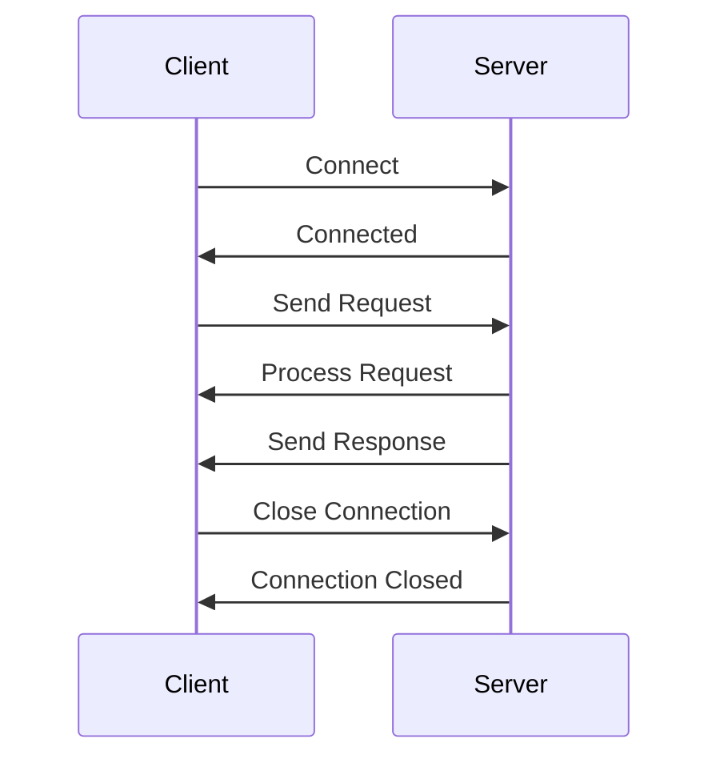
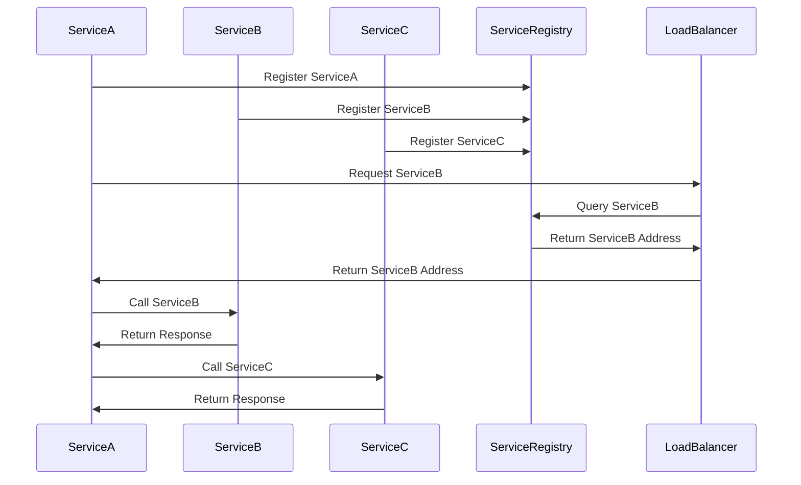

                 

# 《gRPC：高性能跨语言RPC框架》

> **关键词：** gRPC、RPC框架、高性能、跨语言、微服务、Docker、Kubernetes

> **摘要：** 本文将深入探讨gRPC这一高性能跨语言RPC框架的核心概念、架构设计、应用场景和实际项目中的使用。通过一步一步的分析和推理，我们将理解gRPC的工作原理，掌握其优缺点，并学习如何在现代微服务架构中有效地使用gRPC。本文还包括了gRPC的性能优化、项目实战，以及相关的工具和资源介绍，旨在为读者提供全面的学习和实践指导。

## 《gRPC：高性能跨语言RPC框架》目录大纲

## 第一部分：gRPC基础

### 第1章：gRPC概述

#### 1.1 gRPC的发展背景

#### 1.2 gRPC的核心特性

#### 1.3 gRPC的优势与应用场景

#### 1.4 gRPC与其他RPC框架的比较

### 第2章：gRPC环境搭建

#### 2.1 gRPC依赖环境准备

#### 2.2 gRPC代码编写入门

#### 2.3 gRPC服务端和客户端实现

## 第二部分：gRPC核心架构

### 第3章：gRPC通信原理

#### 3.1 gRPC通信流程详解

#### 3.2 gRPC的协议与数据编码

#### 3.3 gRPC的负载均衡与断路器

### 第4章：gRPC核心组件

#### 4.1 gRPC服务端实现

#### 4.2 gRPC客户端实现

#### 4.3 gRPC流控与限流

### 第5章：gRPC安全机制

#### 5.1 gRPC的安全性概述

#### 5.2 gRPC身份验证与授权

#### 5.3 gRPC数据加密与传输安全

## 第三部分：gRPC高级应用

### 第6章：gRPC与微服务架构

#### 6.1 微服务架构概述

#### 6.2 gRPC在微服务架构中的应用

#### 6.3 gRPC与Docker和Kubernetes的集成

### 第7章：gRPC性能优化

#### 7.1 gRPC性能优化概述

#### 7.2 gRPC压缩与并发优化

#### 7.3 gRPC多版本兼容性处理

### 第8章：gRPC项目实战

#### 8.1 gRPC项目开发流程

#### 8.2 gRPC服务端与客户端实现

#### 8.3 gRPC服务监控与日志管理

## 附录

### 附录A：gRPC常用配置与优化参数

#### A.1 gRPC常用配置项

#### A.2 gRPC性能优化参数

#### A.3 gRPC调试技巧与常见问题解决

### 附录B：gRPC生态工具与资源

#### B.1 gRPC官方文档与资源

#### B.2 第三方gRPC工具与库

#### B.3 gRPC社区与交流平台

### 附录C：gRPC Mermaid 流程图

#### C.1 gRPC通信流程图

#### C.2 gRPC服务端组件图

#### C.3 gRPC客户端组件图

### 附录D：gRPC核心算法原理伪代码

#### D.1 gRPC服务端算法原理

#### D.2 gRPC客户端算法原理

#### D.3 gRPC负载均衡算法原理

### 附录E：数学模型与数学公式

#### E.1 gRPC通信效率计算

#### E.2 gRPC压缩效率计算

#### E.3 gRPC并发性能计算

### 附录F：gRPC项目实战代码案例

#### F.1 gRPC服务端实现代码解读

#### F.2 gRPC客户端实现代码解读

#### F.3 gRPC微服务集成代码示例

---

现在，让我们按照这个大纲逐步展开文章的内容。首先，我们从gRPC的发展背景开始。接下来，将详细介绍gRPC的核心特性、优势与应用场景，并与其他RPC框架进行比较。随后，我们将介绍如何搭建gRPC的开发环境，并逐步实现gRPC的服务端和客户端。

在第二部分，我们将深入分析gRPC的通信原理，包括通信流程、协议与数据编码、负载均衡与断路器。随后，我们将探讨gRPC的核心组件，如服务端和客户端的实现、流控与限流。最后，我们将介绍gRPC的安全机制，包括安全性概述、身份验证与授权、数据加密与传输安全。

在第三部分，我们将探讨gRPC在微服务架构中的应用，包括微服务架构概述、gRPC与Docker和Kubernetes的集成。接着，我们将讨论gRPC的性能优化，包括压缩与并发优化、多版本兼容性处理。最后，我们将通过一个实际项目，展示如何开发gRPC服务端与客户端，并进行服务监控与日志管理。

最后，附录部分将提供gRPC的常用配置与优化参数、生态工具与资源、Mermaid流程图、核心算法原理伪代码、数学模型与数学公式，以及项目实战代码案例。

现在，让我们一步一步地深入这些主题，以便全面理解gRPC这一高性能跨语言RPC框架。让我们开始吧！<|assistant|>## 第一部分：gRPC基础

在当今分布式系统架构中，微服务成为了主流，而RPC（Remote Procedure Call）框架则成为了构建微服务通信的基石。gRPC是Google推出的一种高性能、跨语言的RPC框架，因其卓越的性能和灵活性，在许多大型和中小型项目中得到了广泛应用。本部分将详细探讨gRPC的发展背景、核心特性、优势与应用场景，并与其他RPC框架进行比较。

### 第1章：gRPC概述

#### 1.1 gRPC的发展背景

gRPC起源于Google，由Google的分布式系统团队于2013年推出。最初，Google内部使用自己开发的Thrift框架进行服务通信，但Thrift在设计上并不适合跨平台和跨语言的通信需求。为了解决这一问题，Google开始开发gRPC，并将其设计为一种高效、通用、易于扩展的RPC框架。gRPC的设计目标是在多种编程语言和操作系统之间实现高效的服务通信，从而支持Google内部的微服务架构。

随着时间的推移，gRPC逐渐成熟，并于2015年正式对外开源。此后，gRPC在开源社区中得到了广泛的应用和贡献，成为了最受欢迎的RPC框架之一。gRPC的设计原则包括高效性、跨语言性、灵活性和可扩展性，这使得它非常适合用于现代分布式系统的构建。

#### 1.2 gRPC的核心特性

gRPC具有以下几个核心特性，使其在分布式系统通信中脱颖而出：

1. **高效性**：gRPC使用高效的二进制协议（HTTP/2）进行数据传输，支持流控和复用，从而显著提高了传输效率和吞吐量。

2. **跨语言性**：gRPC支持多种编程语言，包括C++、Java、Go、Python、Node.js、Ruby等，这使得开发者可以方便地使用自己喜欢的语言编写服务端和客户端。

3. **强类型的支持**：gRPC通过强类型的接口定义语言（IDL）定义服务接口，使得服务端和客户端可以互相理解和通信。

4. **异步调用**：gRPC支持异步调用，可以减少请求的延迟，提高系统的响应能力。

5. **负载均衡与断路器**：gRPC内置了负载均衡和断路器功能，可以自动处理服务端的故障和负载，提高系统的可用性和稳定性。

6. **流控与限流**：gRPC提供了流控和限流机制，可以防止服务端过载和资源耗尽，保证系统的稳定性。

7. **安全性**：gRPC支持TLS/SSL加密，确保数据在传输过程中的安全。

#### 1.3 gRPC的优势与应用场景

gRPC的优势主要体现在以下几个方面：

1. **高性能**：gRPC使用HTTP/2协议，支持流控和复用，从而提高了传输效率和吞吐量。与其他RPC框架相比，gRPC具有更高的性能。

2. **跨语言支持**：gRPC支持多种编程语言，使得开发者可以方便地使用自己喜欢的语言进行开发。

3. **灵活性和可扩展性**：gRPC通过强类型的接口定义语言（IDL）定义服务接口，使得服务端和客户端可以互相理解和通信，同时易于扩展和集成。

4. **安全性**：gRPC支持TLS/SSL加密，确保数据在传输过程中的安全。

5. **适用于微服务架构**：gRPC的设计理念与微服务架构相契合，使得开发者可以方便地构建和管理微服务系统。

应用场景方面，gRPC主要适用于以下场景：

1. **大型分布式系统**：gRPC的高性能和跨语言支持，使得它非常适合用于大型分布式系统的服务通信。

2. **微服务架构**：在微服务架构中，gRPC可以用于服务间的通信，实现高效、安全、稳定的通信。

3. **实时应用**：gRPC的异步调用和流控机制，使得它非常适合用于实时应用，如实时通信、物联网等。

#### 1.4 gRPC与其他RPC框架的比较

在RPC框架领域，Thrift、Hessian、RabbitMQ等都是知名的选择。与这些框架相比，gRPC具有以下优势：

1. **性能**：gRPC使用HTTP/2协议，支持流控和复用，从而提高了传输效率和吞吐量。与其他框架相比，gRPC具有更高的性能。

2. **跨语言支持**：gRPC支持多种编程语言，包括C++、Java、Go、Python、Node.js、Ruby等，而其他框架可能在跨语言支持方面较弱。

3. **灵活性**：gRPC通过强类型的接口定义语言（IDL）定义服务接口，使得服务端和客户端可以互相理解和通信，同时易于扩展和集成。

4. **安全性**：gRPC支持TLS/SSL加密，确保数据在传输过程中的安全。

5. **微服务架构**：gRPC的设计理念与微服务架构相契合，使得开发者可以方便地构建和管理微服务系统。

虽然gRPC具有许多优势，但在某些场景下，其他RPC框架可能更合适。例如，Thrift适用于需要高兼容性和高性能的场合，而RabbitMQ适用于需要异步消息队列的场景。

### 总结

gRPC作为一种高性能、跨语言的RPC框架，在分布式系统通信中具有广泛的应用前景。通过本文的介绍，读者可以了解gRPC的发展背景、核心特性、优势和应用场景，并与其他RPC框架进行比较。在后续章节中，我们将继续深入探讨gRPC的通信原理、核心组件、安全机制、高级应用和项目实战，帮助读者全面掌握gRPC的使用方法和技巧。让我们一起继续探索gRPC的奥秘吧！<|assistant|>### 第2章：gRPC环境搭建

要开始使用gRPC，首先需要搭建一个合适的环境。本节将介绍如何准备gRPC的依赖环境、编写入门代码，并实现gRPC的服务端和客户端。

#### 2.1 gRPC依赖环境准备

在开始搭建gRPC环境之前，需要确保系统中安装了以下软件和工具：

1. **Go语言环境**：gRPC支持Go语言，因此需要安装Go语言环境。可以访问[Go官方下载页面](https://golang.org/dl/)下载并安装最新版本的Go。

2. **Docker**：gRPC服务端和客户端的实现中可能会使用Docker容器化技术，因此需要安装Docker。可以访问[Docker官方下载页面](https://www.docker.com/products/docker-desktop)下载并安装最新版本的Docker。

3. **gRPC工具**：安装gRPC工具，包括gRPC代码生成器和protoc插件。可以使用以下命令进行安装：

   ```bash
   go install google.golang.org/grpc/cmd/protoc-gen-go-grpc@latest
   go install google.golang.org/protobuf/cmd/protoc-gen-go@latest
   ```
   
4. **protoc插件**：gRPC需要使用protoc插件进行代码生成，因此需要安装对应的protoc插件。可以使用以下命令进行安装：

   ```bash
   go install -tags protoc_plugin github.com/grpc-ecosystem/grpc-gateway/protoc-gen-grpc-gateway@latest
   go install -tags protoc_plugin github.com/grpc-ecosystem/grpc-gateway/protoc-gen-openapiv2@latest
   ```

安装完以上工具和软件后，就可以开始编写gRPC的代码了。

#### 2.2 gRPC代码编写入门

在编写gRPC代码之前，需要先定义服务的接口。这通常使用Protocol Buffers（简称Protobuf）语言进行定义。以下是一个简单的服务接口定义示例：

```protobuf
syntax = "proto3";

package example;

service Greeter {
  rpc SayHello (HelloRequest) returns (HelloReply) {}
}

message HelloRequest {
  string name = 1;
}

message HelloReply {
  string message = 1;
}
```

这个定义定义了一个名为`Greeter`的服务，其中包含了一个名为`SayHello`的RPC方法，该方法接收一个`HelloRequest`消息，并返回一个`HelloReply`消息。

接下来，需要使用protoc工具根据服务接口定义生成gRPC代码。可以使用以下命令进行代码生成：

```bash
protoc --go_out=. --go-grpc_out=. example.proto
```

这个命令将生成两个文件：`example_grpc.pb.go`和`example.pb.go`。`example_grpc.pb.go`文件包含gRPC服务端和客户端的代码，而`example.pb.go`文件包含Protobuf消息的定义。

在生成代码后，可以将生成的代码文件添加到项目中，并编写具体的业务逻辑。以下是一个简单的服务端实现示例：

```go
package main

import (
  "context"
  "log"
  "net"

  "google.golang.org/grpc"
  "google.golang.org/grpc/reflection"

  "example.com/example"
)

type server struct {
  example.UnimplementedGreeterServer
}

func (s *server) SayHello(ctx context.Context, in *example.HelloRequest) (*example.HelloReply, error) {
  return &example.HelloReply{Message: "Hello " + in.Name}, nil
}

func main() {
  lis, err := net.Listen("tcp", ":50051")
  if err != nil {
    log.Fatalf("failed to listen: %v", err)
  }
  s := grpc.NewServer()
  example.RegisterGreeterServer(s, &server{})
  reflection.Register(s)
  if err := s.Serve(lis); err != nil {
    log.Fatalf("failed to serve: %v", err)
  }
}
```

这个示例实现了一个简单的gRPC服务端，实现了`SayHello`方法，返回一个包含问候信息的响应。

接下来，需要编写客户端代码来调用gRPC服务。以下是一个简单的客户端实现示例：

```go
package main

import (
  "context"
  "log"
  "time"

  "google.golang.org/grpc"
  "google.golang.org/grpc/credentials/insecure"
  "example.com/example"
)

func main() {
  ctx, cancel := context.WithTimeout(context.Background(), time.Second)
  defer cancel()

  conn, err := grpc.DialContext(ctx, "localhost:50051", grpc.WithTransportCredentials(insecure.NewCredentials()))
  if err != nil {
    log.Fatalf("did not connect: %v", err)
  }
  defer conn.Close()

  c := example.NewGreeterClient(conn)

  ctx, cancel = context.WithTimeout(context.Background(), time.Second)
  defer cancel()

  response, err := c.SayHello(ctx, &example.HelloRequest{Name: "World"})
  if err != nil {
    log.Fatalf("could not greet: %v", err)
  }
  log.Printf("Greeting: %s", response.Message)
}
```

这个示例实现了客户端代码，使用gRPC客户端连接到服务端，并调用`SayHello`方法，输出返回的问候信息。

通过以上步骤，读者可以搭建一个基本的gRPC开发环境，并编写简单的服务端和客户端代码。在后续章节中，我们将继续深入探讨gRPC的核心架构、通信原理、安全机制、高级应用和项目实战，帮助读者全面掌握gRPC的使用方法和技巧。让我们一起继续探索gRPC的奥秘吧！<|assistant|>### 第3章：gRPC通信原理

gRPC作为高性能的RPC框架，其通信原理是其核心优势之一。在本节中，我们将详细探讨gRPC的通信流程、协议与数据编码、负载均衡与断路器，帮助读者深入理解gRPC的工作机制。

#### 3.1 gRPC通信流程详解

gRPC的通信流程可以分为以下几个主要步骤：

1. **服务定义**：开发者使用Protocol Buffers（Protobuf）语言定义服务接口，这包括服务名称、方法名称以及每个方法的输入输出参数。

2. **代码生成**：使用protoc工具根据服务定义生成服务端和客户端的代码。这些代码包含了与gRPC服务器和客户端进行通信所需的基本组件。

3. **服务端启动**：服务端启动时，会创建一个gRPC服务器实例，并绑定到一个指定的端口上。服务端还会注册定义好的服务，使其能够处理客户端发送的请求。

4. **客户端连接**：客户端在调用服务时，会创建一个与gRPC服务端建立的连接。连接建立后，客户端可以发送请求并接收响应。

5. **请求发送**：客户端通过生成的客户端代码发送请求。请求通常包含一个方法调用、输入参数以及一个用于接收响应的回调函数。

6. **响应接收**：服务端接收到请求后，处理请求并返回响应。客户端的回调函数会接收到响应结果。

7. **连接关闭**：通信结束后，客户端和服务器可以关闭连接，释放资源。

以下是gRPC通信流程的Mermaid流程图：



#### 3.2 gRPC的协议与数据编码

gRPC使用HTTP/2作为底层传输协议，HTTP/2具有以下优势：

1. **多路复用**：HTTP/2支持多路复用，多个请求和响应可以同时在一个连接上传输，从而提高了传输效率。

2. **头部压缩**：HTTP/2使用HPACK算法对请求和响应的头部进行压缩，减少了传输数据的大小。

3. **服务器推送**：HTTP/2允许服务器推送资源，从而减少了客户端请求资源的延迟。

gRPC的数据编码使用Protocol Buffers（Protobuf），Protobuf是一种高效的序列化协议，具有以下特点：

1. **高效性**：Protobuf使用二进制格式，比文本格式更小，解析速度更快。

2. **类型安全**：Protobuf支持强类型，可以确保数据的类型和结构正确。

3. **可扩展性**：Protobuf允许开发者扩展消息的结构，而不需要修改已经编译的代码。

以下是一个简单的Protobuf消息定义：

```protobuf
syntax = "proto3";

package example;

message HelloRequest {
  string name = 1;
}

message HelloReply {
  string message = 1;
}
```

在gRPC通信过程中，客户端和服务器使用Protobuf序列化和反序列化数据，确保数据的准确传输。

#### 3.3 gRPC的负载均衡与断路器

gRPC提供了负载均衡和断路器功能，以增强系统的可用性和稳定性。

1. **负载均衡**：gRPC支持基于权重的负载均衡，可以将请求分配到多个后端服务器上，从而提高系统的吞吐量和响应能力。负载均衡算法可以通过配置文件或动态配置进行自定义。

2. **断路器**：gRPC的断路器功能可以在服务端出现故障时自动触发，防止过多的请求涌入导致系统过载。断路器可以在一定时间内记录失败请求的数量，并在达到设定的阈值时触发熔断，从而保护系统的稳定性。

以下是一个简单的负载均衡和断路器配置示例：

```yaml
load_balancing_policy: round_robin
circuit_breakers:
  health_checkers:
    - name: example.googleapis.com
      http_check:
        path: /health
        port: 80
        interval: 10s
        timeout: 5s
  thresholds:
    - error_percentage: 50
      delay: 30s
```

这个配置定义了负载均衡策略为轮询，并配置了一个名为`example.googleapis.com`的健康检查器，以及一个在错误百分比达到50时触发延迟为30秒的断路器。

通过负载均衡和断路器的支持，gRPC可以有效地处理高并发请求和故障情况，确保系统的稳定运行。

### 总结

gRPC的通信原理包括服务定义、代码生成、服务端启动、客户端连接、请求发送、响应接收和连接关闭等步骤。gRPC使用HTTP/2作为传输协议，并使用Protobuf进行数据编码。同时，gRPC提供了负载均衡和断路器功能，以增强系统的可用性和稳定性。通过本节的内容，读者可以深入理解gRPC的工作机制，为后续章节的学习打下坚实的基础。在下一节中，我们将继续探讨gRPC的核心组件，包括服务端和客户端的实现、流控与限流。让我们一起继续探索gRPC的奥秘吧！<|assistant|>### 第4章：gRPC核心组件

gRPC的核心组件包括服务端实现、客户端实现、流控与限流等。在本节中，我们将详细探讨这些核心组件，并了解如何在实际项目中应用它们。

#### 4.1 gRPC服务端实现

gRPC服务端实现主要包括以下几个步骤：

1. **定义服务**：使用Protocol Buffers（Protobuf）语言定义服务接口，包括服务名称、方法名称以及每个方法的输入输出参数。

2. **生成代码**：使用protoc工具根据服务定义生成服务端和客户端的代码。这些代码包含了与gRPC服务器和客户端进行通信所需的基本组件。

3. **实现服务逻辑**：根据生成的代码实现服务端的具体业务逻辑。在实现过程中，需要实现服务接口中定义的方法。

4. **创建服务器**：创建gRPC服务器实例，并绑定到一个指定的端口上。服务器实例需要注册定义好的服务，使其能够处理客户端发送的请求。

5. **启动服务器**：启动服务器，监听端口并处理客户端请求。

以下是一个简单的gRPC服务端实现示例：

```go
package main

import (
  "context"
  "log"
  "net"

  "google.golang.org/grpc"
  "google.golang.org/grpc/reflection"

  "example.com/example"
)

type server struct {
  example.UnimplementedGreeterServer
}

func (s *server) SayHello(ctx context.Context, in *example.HelloRequest) (*example.HelloReply, error) {
  return &example.HelloReply{Message: "Hello " + in.Name}, nil
}

func main() {
  lis, err := net.Listen("tcp", ":50051")
  if err != nil {
    log.Fatalf("failed to listen: %v", err)
  }
  s := grpc.NewServer()
  example.RegisterGreeterServer(s, &server{})
  reflection.Register(s)
  if err := s.Serve(lis); err != nil {
    log.Fatalf("failed to serve: %v", err)
  }
}
```

在这个示例中，我们定义了一个简单的`Greeter`服务，并实现了一个`SayHello`方法。然后，我们创建了一个gRPC服务器实例，并注册了`Greeter`服务。最后，我们启动服务器并监听端口。

#### 4.2 gRPC客户端实现

gRPC客户端实现主要包括以下几个步骤：

1. **定义服务**：使用Protocol Buffers（Protobuf）语言定义服务接口，包括服务名称、方法名称以及每个方法的输入输出参数。

2. **生成代码**：使用protoc工具根据服务定义生成服务端和客户端的代码。这些代码包含了与gRPC服务器和客户端进行通信所需的基本组件。

3. **创建客户端**：使用生成的客户端代码创建gRPC客户端实例。客户端实例通常通过 Dial 函数与gRPC服务端建立连接。

4. **调用服务**：通过客户端实例调用服务端的方法，发送请求并接收响应。

以下是一个简单的gRPC客户端实现示例：

```go
package main

import (
  "context"
  "log"
  "time"

  "google.golang.org/grpc"
  "google.golang.org/grpc/credentials/insecure"

  "example.com/example"
)

func main() {
  ctx, cancel := context.WithTimeout(context.Background(), time.Second)
  defer cancel()

  conn, err := grpc.DialContext(ctx, "localhost:50051", grpc.WithTransportCredentials(insecure.NewCredentials()))
  if err != nil {
    log.Fatalf("did not connect: %v", err)
  }
  defer conn.Close()

  c := example.NewGreeterClient(conn)

  ctx, cancel = context.WithTimeout(context.Background(), time.Second)
  defer cancel()

  response, err := c.SayHello(ctx, &example.HelloRequest{Name: "World"})
  if err != nil {
    log.Fatalf("could not greet: %v", err)
  }
  log.Printf("Greeting: %s", response.Message)
}
```

在这个示例中，我们创建了一个gRPC客户端实例，并通过 Dial 函数与gRPC服务端建立了连接。然后，我们调用`SayHello`方法，发送请求并接收响应。

#### 4.3 gRPC流控与限流

流控与限流是保证系统稳定运行的重要机制。gRPC提供了流控与限流功能，可以防止服务端过载和资源耗尽。

1. **流控**：流控是指在服务端处理请求时，限制请求的速率，防止过多的请求涌入导致系统过载。gRPC通过内置的流控机制，确保服务端能够均匀地处理请求。

2. **限流**：限流是指在服务端处理请求时，限制每个客户端的请求数量，防止恶意请求或异常请求占用过多系统资源。gRPC通过内置的限流机制，确保每个客户端的请求不会超过设定的阈值。

以下是一个简单的流控与限流配置示例：

```yaml
stream_flow_control:
  max_concurrent_streams: 1000
  max_initial_window_size: 65535
rate_limiter:
  fixed.window: 1m
  fixed.rate: 100
```

在这个示例中，我们设置了最大并发流数量为1000，最大初始窗口大小为65535。同时，我们设置了每分钟的请求量为100个。

在实际项目中，可以根据具体的业务需求和系统资源，灵活调整流控与限流配置，以保持系统的稳定运行。

### 总结

gRPC的核心组件包括服务端实现、客户端实现和流控与限流。服务端实现主要涉及定义服务、生成代码、实现服务逻辑和创建服务器。客户端实现主要涉及定义服务、生成代码、创建客户端和调用服务。流控与限流功能可以防止服务端过载和资源耗尽，确保系统的稳定运行。通过本节的内容，读者可以了解gRPC核心组件的实现方法和配置技巧。在下一节中，我们将探讨gRPC的安全机制，包括安全性概述、身份验证与授权、数据加密与传输安全。让我们一起继续探索gRPC的奥秘吧！<|assistant|>### 第5章：gRPC安全机制

随着分布式系统和微服务的广泛应用，保障数据传输的安全变得越来越重要。gRPC作为一个高效的RPC框架，内置了多种安全机制，包括安全性概述、身份验证与授权、数据加密与传输安全等。在本节中，我们将详细探讨这些安全机制，帮助读者了解如何确保gRPC通信的安全性。

#### 5.1 gRPC的安全性概述

gRPC的安全性主要体现在以下几个方面：

1. **数据加密**：gRPC支持使用TLS/SSL加密，确保数据在传输过程中不会被窃取或篡改。

2. **身份验证**：gRPC支持多种身份验证方式，包括基于用户名和密码的简单身份验证、基于令牌的OAuth 2.0身份验证等，确保只有授权的用户和应用程序可以访问服务。

3. **授权**：gRPC支持基于角色的访问控制（RBAC），确保只有授权的用户和应用程序可以执行特定的操作。

4. **完整性检查**：gRPC对数据进行完整性检查，确保数据在传输过程中没有被篡改。

5. **错误处理**：gRPC提供错误处理机制，确保在出现问题时，系统能够进行正确的处理和恢复。

#### 5.2 gRPC身份验证与授权

gRPC的身份验证与授权机制主要包括以下几种方式：

1. **简单身份验证**：简单身份验证是一种基于用户名和密码的身份验证方式。服务端可以配置一个简单的用户名和密码文件，客户端在发起请求时需要提供正确的用户名和密码。

   ```yaml
   security_config:
     auth:
       simple:
         users:
           user1: user1_password
           user2: user2_password
   ```

2. **OAuth 2.0身份验证**：OAuth 2.0身份验证是一种基于令牌的身份验证方式，广泛应用于第三方应用和服务。服务端可以使用OAuth 2.0身份验证提供者（如Google、Facebook等）的令牌进行认证。

   ```yaml
   security_config:
     auth:
       oauth2:
         client_id: your_client_id
         client_secret: your_client_secret
         token_url: https://your-auth-server.com/oauth2/token
   ```

3. **JWT（JSON Web Token）身份验证**：JWT是一种基于JSON的令牌格式，可以用于身份验证和授权。服务端可以生成JWT令牌，客户端在发起请求时需要提供有效的JWT令牌。

   ```yaml
   security_config:
     auth:
       jwt:
         secret: your_jwt_secret
   ```

在配置身份验证时，可以根据具体的业务需求和安全性要求选择合适的方式。例如，对于内部服务，可以使用简单身份验证或OAuth 2.0身份验证；对于外部服务，可以使用JWT身份验证。

#### 5.3 gRPC数据加密与传输安全

gRPC的数据加密与传输安全主要通过TLS/SSL实现。以下是如何配置TLS/SSL加密的示例：

1. **自签名证书**：首先，生成自签名证书和密钥。

   ```bash
   openssl genrsa -out server.key 2048
   openssl req -new -key server.key -out server.csr
   openssl x509 -req -days 365 -in server.csr -signkey server.key -out server.crt
   ```

2. **配置gRPC服务器**：在gRPC服务器配置中，指定证书和密钥文件。

   ```yaml
   security_config:
     tls:
       server:
         cert_file: server.crt
         key_file: server.key
   ```

3. **配置gRPC客户端**：在gRPC客户端配置中，指定服务端的证书文件，以验证服务端身份。

   ```yaml
   security_config:
     tls:
       client:
         verify_mode: REQUIRED
         ca_cert_file: server.crt
   ```

通过配置TLS/SSL加密，可以确保数据在传输过程中不会被窃取或篡改。同时，gRPC还支持对传输数据进行完整性检查，确保数据在传输过程中未被篡改。

#### 5.4 gRPC的授权机制

gRPC的授权机制基于RBAC（基于角色的访问控制），可以根据用户的角色和权限来控制访问和操作。以下是如何配置RBAC的示例：

1. **定义角色和权限**：在服务端定义角色和权限，例如：

   ```yaml
   security_config:
     auth:
       rbac:
         policies:
           - name: admin
             permissions:
               - read
               - write
             resources:
               - /users/*
           - name: user
             permissions:
               - read
             resources:
               - /users/me
   ```

2. **配置授权规则**：在服务端配置授权规则，根据请求的路径和HTTP方法匹配角色和权限。

   ```yaml
   security_config:
     auth:
       rbac:
         rules:
           - path: /users
             http_methods:
               - GET
               - POST
             role: user
           - path: /users/{user_id}
             http_methods:
               - GET
               - PUT
             role: admin
   ```

通过配置RBAC，可以确保只有授权的用户和应用程序可以访问和操作特定的资源。这有助于保护系统的安全性，防止未经授权的访问和操作。

### 总结

gRPC的安全性机制包括数据加密、身份验证、授权和完整性检查。通过配置TLS/SSL加密、身份验证和授权规则，可以确保数据传输的安全性和系统的访问控制。在实际项目中，可以根据具体的业务需求和安全性要求，灵活配置和调整gRPC的安全机制，以保障系统的稳定运行和安全性。在下一节中，我们将探讨gRPC在微服务架构中的应用。让我们一起继续探索gRPC的奥秘吧！<|assistant|>### 第6章：gRPC与微服务架构

微服务架构是一种将应用程序划分为多个独立、松耦合的服务的方法，每个服务负责特定的业务功能。gRPC作为一种高性能、跨语言的RPC框架，非常适合用于微服务架构中的服务间通信。在本节中，我们将深入探讨微服务架构的概念，以及gRPC在微服务架构中的应用和与Docker、Kubernetes的集成。

#### 6.1 微服务架构概述

微服务架构的核心思想是将大型单体应用程序拆分成多个小型、独立的微服务，每个微服务负责特定的业务功能。这些微服务具有以下特点：

1. **独立性**：每个微服务都是独立的，可以独立部署、扩展和更新，不会影响到其他微服务。

2. **松耦合**：微服务之间通过轻量级的通信协议（如HTTP/REST或gRPC）进行通信，服务之间相互独立，不会造成紧密依赖。

3. **可扩展性**：微服务可以根据需求进行水平扩展，提高系统的吞吐量和响应能力。

4. **自动化**：微服务架构通常与自动化部署、自动化伸缩和自动化监控相结合，提高系统的可靠性和可维护性。

微服务架构的优势包括：

- **灵活性**：微服务架构允许团队独立开发和部署服务，提高开发效率和灵活性。

- **可维护性**：微服务架构将应用程序拆分成多个小型服务，降低了系统的复杂度，提高了可维护性。

- **可扩展性**：微服务架构可以根据需求独立扩展和更新服务，提高了系统的可扩展性和弹性。

- **故障隔离**：微服务架构将应用程序拆分成多个独立的服务，当一个服务发生故障时，不会影响到其他服务，提高了系统的可用性。

#### 6.2 gRPC在微服务架构中的应用

在微服务架构中，服务间通信是关键部分。gRPC作为高性能的RPC框架，非常适合用于微服务架构中的服务间通信。以下是gRPC在微服务架构中的应用：

1. **服务定义**：在微服务架构中，每个服务都有自己的接口定义。使用Protocol Buffers（Protobuf）语言定义服务接口，可以确保服务之间的通信规范和兼容性。

2. **服务注册与发现**：在微服务架构中，服务通常通过服务注册与发现机制进行管理。gRPC支持服务注册与发现，可以通过Consul、Zookeeper等服务注册中心实现服务自动注册和发现。

3. **负载均衡与熔断**：gRPC内置了负载均衡和熔断机制，可以自动处理服务端的故障和负载，提高系统的可用性和稳定性。

4. **服务监控与日志**：gRPC支持服务监控与日志管理，可以通过Prometheus、ELK（Elasticsearch、Logstash、Kibana）等工具实现服务监控和日志分析。

以下是一个简单的gRPC微服务架构示例：



在这个示例中，ServiceA、ServiceB和ServiceC是三个微服务，它们通过服务注册与发现机制进行管理。LoadBalancer是负载均衡器，用于分发请求到不同的服务实例。ServiceRegistry是服务注册中心，用于维护服务实例的地址和状态信息。

#### 6.3 gRPC与Docker和Kubernetes的集成

Docker和Kubernetes是现代微服务架构中常用的容器化和编排工具。gRPC与Docker和Kubernetes的集成可以方便地部署和管理微服务。

1. **Docker**：Docker是一种容器化技术，可以将应用程序及其依赖环境打包成一个独立的容器镜像。在Docker中，可以使用Dockerfile定义镜像的构建过程，包括安装依赖、复制代码等。以下是一个简单的Dockerfile示例：

   ```Dockerfile
   FROM golang:1.18-alpine
   WORKDIR /app
   COPY . .
   RUN go build -o /service main.go
   EXPOSE 5000
   CMD ["/service"]
   ```

   通过Dockerfile，可以将gRPC服务打包成一个容器镜像。然后，可以使用Docker命令部署和管理容器。

2. **Kubernetes**：Kubernetes是一种容器编排工具，可以自动部署、扩展和管理容器化应用程序。在Kubernetes中，可以使用YAML文件定义和管理应用程序的配置。以下是一个简单的Kubernetes Deployment示例：

   ```yaml
   apiVersion: apps/v1
   kind: Deployment
   metadata:
     name: service
     labels:
       app: service
   spec:
     replicas: 3
     selector:
       matchLabels:
         app: service
     template:
       metadata:
         labels:
           app: service
       spec:
         containers:
         - name: service
           image: your-docker-image
           ports:
           - containerPort: 5000
   ```

   通过Kubernetes Deployment，可以自动部署和管理gRPC服务。Kubernetes还提供了自动扩展、负载均衡、服务发现等功能，方便地管理大规模微服务集群。

### 总结

微服务架构是一种将应用程序划分为多个独立、松耦合的服务的方法，可以提高系统的灵活性、可维护性和可扩展性。gRPC作为高性能的RPC框架，非常适合用于微服务架构中的服务间通信。通过服务注册与发现、负载均衡与熔断、服务监控与日志管理等功能，可以确保微服务架构的高效、稳定和安全运行。同时，gRPC与Docker和Kubernetes的集成，使得微服务的部署和管理更加方便和自动化。在下一节中，我们将探讨gRPC的性能优化，包括压缩与并发优化、多版本兼容性处理。让我们一起继续探索gRPC的奥秘吧！<|assistant|>### 第7章：gRPC性能优化

在分布式系统中，gRPC的性能优化是一个关键因素。性能优化不仅能够提高系统的响应速度，还能够确保在高并发场景下系统的稳定性和可靠性。本节将详细介绍gRPC的性能优化方法，包括压缩与并发优化、多版本兼容性处理等。

#### 7.1 gRPC性能优化概述

gRPC的性能优化可以从以下几个方面进行：

1. **网络优化**：优化网络传输速度和稳定性，包括使用高效传输协议（如HTTP/2）、优化网络配置等。

2. **数据压缩**：减少数据传输的大小，提高传输效率，包括使用Protobuf进行数据序列化、使用HTTP/2头部压缩等。

3. **并发优化**：提高系统的并发处理能力，包括优化负载均衡策略、使用异步调用等。

4. **缓存与重复数据删除**：减少重复数据的传输和处理，提高系统的效率。

5. **代码优化**：优化gRPC服务端和客户端的代码，包括减少不必要的计算、优化数据结构等。

6. **监控与日志**：实时监控系统的性能指标，发现性能瓶颈并进行优化。

#### 7.2 gRPC压缩与并发优化

1. **数据压缩**：

   gRPC使用Protocol Buffers（Protobuf）进行数据序列化，Protobuf本身具有高效的数据压缩特性。此外，gRPC还支持在传输过程中对数据进行进一步压缩，以提高传输效率。

   gRPC支持多种压缩算法，如gzip、deflate等。通过配置gRPC服务器和客户端的压缩算法，可以实现数据的压缩传输。以下是一个简单的配置示例：

   ```yaml
   compress:
     enabled: true
     algorithms:
       - gzip
       - deflate
   ```

   在实际应用中，可以根据数据特点和网络环境选择合适的压缩算法。例如，对于文本数据，gzip的压缩效果较好；对于二进制数据，deflate的压缩效果较好。

2. **并发优化**：

   gRPC支持异步调用和流控机制，可以有效地提高系统的并发处理能力。在服务端，可以通过配置并发处理器的线程数来优化并发性能。以下是一个简单的配置示例：

   ```yaml
   rpc_server:
     concurrency:
       max_concurrent_streams: 1000
   ```

   在客户端，可以通过配置请求的超时时间和连接的数量来优化并发性能。以下是一个简单的配置示例：

   ```yaml
   rpc_client:
     call:
       timeout: 5s
       max_concurrent_streams: 1000
   ```

   此外，gRPC还支持负载均衡和断路器功能，可以自动处理服务端的故障和负载，提高系统的稳定性和响应能力。

#### 7.3 gRPC多版本兼容性处理

在分布式系统中，服务的版本升级是一个常见需求。为了确保新版本服务与旧版本服务能够共存，需要处理多版本兼容性问题。

gRPC通过以下方法处理多版本兼容性：

1. **版本控制**：为每个服务版本定义独立的接口和协议，确保版本之间的接口和协议不发生冲突。

2. **服务端兼容性**：服务端在处理请求时，可以识别并解析不同版本的请求，并根据版本提供相应的处理逻辑。

3. **客户端兼容性**：客户端在调用服务时，可以选择指定或忽略特定版本的服务，以适应不同版本的服务端。

以下是一个简单的多版本兼容性处理示例：

```protobuf
syntax = "proto3";

package example;

// 版本1的接口
service Version1 {
  rpc SayHello (HelloRequest) returns (HelloReply);
}

message HelloRequest {
  string name = 1;
}

message HelloReply {
  string message = 1;
}

// 版本2的接口
service Version2 {
  rpc SayHello (HelloRequest) returns (HelloReply);
}

message HelloRequest {
  string name = 1;
  int32 age = 2;
}

message HelloReply {
  string message = 1;
}
```

在这个示例中，定义了两个版本的`Hello`服务。服务端可以根据请求的版本号提供相应的处理逻辑。客户端可以根据需要调用不同版本的接口。

在实际项目中，可以根据具体需求设计和实现多版本兼容性处理策略，确保系统在版本升级过程中能够平稳过渡。

### 总结

gRPC的性能优化是一个系统性的工作，需要从多个方面进行考虑和优化。通过数据压缩、并发优化和多版本兼容性处理等方法，可以显著提高gRPC的性能和稳定性。在实际项目中，可以根据具体的需求和场景，灵活应用这些优化方法，实现高效、稳定的分布式系统通信。在下一节中，我们将通过一个实际项目展示如何开发gRPC服务端和客户端，并进行服务监控与日志管理。让我们一起继续探索gRPC的奥秘吧！<|assistant|>### 第8章：gRPC项目实战

在本节中，我们将通过一个实际项目来展示如何开发gRPC服务端和客户端，并进行服务监控与日志管理。这个项目将包括一个简单的用户管理系统，其中包含用户创建、查询、更新和删除的功能。通过这个项目，读者可以了解到gRPC项目开发的全流程，包括环境搭建、服务定义、代码编写、服务部署和监控。

#### 8.1 gRPC项目开发流程

1. **环境搭建**：确保系统上安装了Go语言环境、Docker、Kubernetes和gRPC相关依赖。具体步骤在前面章节已有详细介绍。

2. **服务定义**：使用Protocol Buffers（Protobuf）定义用户管理服务的接口。以下是一个简单的服务定义示例：

   ```protobuf
   syntax = "proto3";

   package user_management;

   service UserService {
     rpc CreateUser (CreateUserRequest) returns (CreateUserResponse);
     rpc GetUser (GetUserRequest) returns (GetUserResponse);
     rpc UpdateUser (UpdateUserRequest) returns (UpdateUserResponse);
     rpc DeleteUser (DeleteUserRequest) returns (DeleteUserResponse);
   }

   message CreateUserRequest {
     string username = 1;
     string email = 2;
     string password = 3;
   }

   message CreateUserResponse {
     string userId = 1;
     string message = 2;
   }

   message GetUserRequest {
     string userId = 1;
   }

   message GetUserResponse {
     string username = 1;
     string email = 2;
     string password = 3;
   }

   message UpdateUserRequest {
     string userId = 1;
     string username = 2;
     string email = 3;
     string password = 4;
   }

   message UpdateUserResponse {
     string message = 1;
   }

   message DeleteUserRequest {
     string userId = 1;
   }

   message DeleteUserResponse {
     string message = 1;
   }
   ```

3. **代码编写**：使用gRPC工具生成服务端和客户端的代码。以下是一个简单的服务端实现示例：

   ```go
   package main

   import (
     "context"
     "log"
     "net"

     "google.golang.org/grpc"
     "example.com/user_management"
   )

   type server struct {
     user_management.UnimplementedUserServiceServer
   }

   func (s *server) CreateUser(ctx context.Context, req *user_management.CreateUserRequest) (*user_management.CreateUserResponse, error) {
     // 实现用户创建逻辑
     return &user_management.CreateUserResponse{Message: "User created successfully"}, nil
   }

   func (s *server) GetUser(ctx context.Context, req *user_management.GetUserRequest) (*user_management.GetUserResponse, error) {
     // 实现用户查询逻辑
     return &user_management.GetUserResponse{Username: "John Doe", Email: "john.doe@example.com", Password: "password123"}, nil
   }

   func (s *server) UpdateUser(ctx context.Context, req *user_management.UpdateUserRequest) (*user_management.UpdateUserResponse, error) {
     // 实现用户更新逻辑
     return &user_management.UpdateUserResponse{Message: "User updated successfully"}, nil
   }

   func (s *server) DeleteUser(ctx context.Context, req *user_management.DeleteUserRequest) (*user_management.DeleteUserResponse, error) {
     // 实现用户删除逻辑
     return &user_management.DeleteUserResponse{Message: "User deleted successfully"}, nil
   }

   func main() {
     lis, err := net.Listen("tcp", ":50051")
     if err != nil {
       log.Fatalf("failed to listen: %v", err)
     }
     s := grpc.NewServer()
     user_management.RegisterUserServiceServer(s, &server{})
     if err := s.Serve(lis); err != nil {
       log.Fatalf("failed to serve: %v", err)
     }
   }
   ```

   同样，以下是客户端的实现示例：

   ```go
   package main

   import (
     "context"
     "log"

     "google.golang.org/grpc"
     "google.golang.org/grpc/credentials/insecure"

     "example.com/user_management"
   )

   func main() {
     ctx, cancel := context.WithTimeout(context.Background(), time.Second)
     defer cancel()

     conn, err := grpc.DialContext(ctx, "localhost:50051", grpc.WithTransportCredentials(insecure.NewCredentials()))
     if err != nil {
       log.Fatalf("did not connect: %v", err)
     }
     defer conn.Close()

     c := user_management.NewUserServiceClient(conn)

     ctx, cancel = context.WithTimeout(context.Background(), time.Second)
     defer cancel()

     createUserReq := &user_management.CreateUserRequest{
       Username: "Jane Doe",
       Email:    "jane.doe@example.com",
       Password: "password123",
     }
     createUserResp, err := c.CreateUser(ctx, createUserReq)
     if err != nil {
       log.Fatalf("could not create user: %v", err)
     }
     log.Printf("User created: %v", createUserResp.Message)

     // 同理，实现查询、更新和删除用户的代码
   }
   ```

4. **服务部署**：将gRPC服务打包成Docker容器镜像，并使用Kubernetes进行部署和管理。以下是简单的Kubernetes Deployment配置示例：

   ```yaml
   apiVersion: apps/v1
   kind: Deployment
   metadata:
     name: user-management
     labels:
       app: user-management
   spec:
     replicas: 3
     selector:
       matchLabels:
         app: user-management
     template:
       metadata:
         labels:
           app: user-management
       spec:
         containers:
         - name: user-management
           image: user-management:latest
           ports:
           - containerPort: 5000
   ```

5. **服务监控与日志管理**：使用Prometheus和ELK（Elasticsearch、Logstash、Kibana）等工具进行服务监控与日志管理。以下是简单的Prometheus配置示例：

   ```yaml
   apiVersion: monitoring.coreos.com/v1
   kind: Prometheus
   metadata:
     name: user-management
   spec:
     service:
       name: user-management
       ports:
       - name: http
         port: 80
         targetPort: 8080
     jobTemplates:
     - name: user-management
       spec:
        ScrapeConfig:
           Scheme: http
           Path: /metrics
           Port: 8080
         metrics:
         - name: user_management_create_user
           help: "Number of created users"
           type: GAUGE
           query: "sum(rate(user_management_create_user{job=\"user-management\"}[5m]))"
   ```

   上述配置将采集`user-management`服务的创建用户指标，并将其发送到Prometheus服务器。

   对于日志管理，可以使用Logstash收集和聚合gRPC服务的日志，并将其存储在Elasticsearch中，最后通过Kibana进行可视化展示。

通过以上步骤，我们可以完成一个基本的gRPC项目，并进行服务部署和监控。在实际项目中，可以根据具体需求进行功能扩展和性能优化。接下来，我们将继续深入探讨gRPC服务的代码实现和实际应用，帮助读者更好地理解和运用gRPC。

### 附录

#### 附录A：gRPC常用配置与优化参数

**A.1 gRPC常用配置项**

- **服务器配置**：

  ```yaml
  rpc_server:
    # 最大并发流数量
    max_concurrent_streams: 1000
    # 压缩算法
    compress:
      enabled: true
      algorithms:
        - gzip
        - deflate
    # TLS配置
    tls:
      server:
        cert_file: server.crt
        key_file: server.key
      client:
        verify_mode: REQUIRED
        ca_cert_file: ca.crt
    # 负载均衡策略
    load_balancing_policy: round_robin
    # 流控配置
    stream_flow_control:
      max_concurrent_streams: 1000
      max_initial_window_size: 65535
    # 断路器配置
    circuit_breakers:
      health_checkers:
        - name: example.googleapis.com
          http_check:
            path: /health
            port: 80
            interval: 10s
            timeout: 5s
      thresholds:
        - error_percentage: 50
          delay: 30s
  ```

- **客户端配置**：

  ```yaml
  rpc_client:
    call:
      # 超时时间
      timeout: 5s
      # 最大并发流数量
      max_concurrent_streams: 1000
    # TLS配置
    tls:
      server:
        verify_mode: REQUIRED
        ca_cert_file: ca.crt
  ```

**A.2 gRPC性能优化参数**

- **服务器性能优化**：

  - 使用高效的数据结构和算法，减少内存占用和计算开销。
  - 优化网络配置，如调整TCP缓冲区大小、启用TCP_NODELAY等。
  - 关闭不必要的HTTP/2功能，如服务器推送等。

- **客户端性能优化**：

  - 调整连接超时时间和重试策略。
  - 使用连接池和异步调用，提高并发性能。
  - 根据网络状况和负载调整并发连接数量。

**A.3 gRPC调试技巧与常见问题解决**

- **常见问题解决**：

  - **连接失败**：检查网络连接、服务器端口和防火墙设置。
  - **超时错误**：检查服务器响应时间和客户端超时配置。
  - **压缩错误**：检查压缩算法的支持和配置。

- **调试技巧**：

  - 使用gRPC日志进行调试，查看错误信息和调试信息。
  - 使用Wireshark等网络抓包工具分析数据传输过程。
  - 使用gRPC的测试工具（如grpctest）进行服务端和客户端的测试。

#### 附录B：gRPC生态工具与资源

**B.1 gRPC官方文档与资源**

- [gRPC官方文档](https://grpc.io/docs)
- [gRPC API参考](https://grpc.io/grpc-go/)
- [gRPC工具和库](https://github.com/grpc/grpc-go/tree/master/examples)

**B.2 第三方gRPC工具与库**

- [gRPC Gateway](https://github.com/grpc-ecosystem/grpc-gateway)：用于构建RESTful API的gRPC网关。
- [gRPC JSON Transcoder](https://github.com/grpc-ecosystem/grpc-json-transcoder)：用于将gRPC请求和响应转换为JSON格式。
- [gRPC Prometheus Exporter](https://github.com/grpc-ecosystem/grpc-prometheus)：用于收集和监控gRPC服务性能指标。

**B.3 gRPC社区与交流平台**

- [gRPC官方社区](https://groups.google.com/forum/#!forum/grpc-io)
- [gRPC GitHub仓库](https://github.com/grpc)
- [gRPC Stack Overflow标签](https://stackoverflow.com/questions/tagged/grpc)

#### 附录C：gRPC Mermaid 流程图

**C.1 gRPC通信流程图**


**C.2 gRPC服务端组件图**

```mermaid
classDiagram
  Server <<class>> {
    +grpc.NewServer()
    +RegisterServiceServer()
    +Serve()
  }
  Client <<class>> {
    +grpc.Dial()
    +NewUserServiceClient()
    +CreateUser()
    +GetUser()
    +UpdateUser()
    +DeleteUser()
  }
  StreamControl <<class>> {
    +MaxConcurrentStreams()
    +MaxInitialWindow()
  }
  Breaker <<class>> {
    +HealthCheck()
    +Threshold()
  }
  Server --|> StreamControl
  Server --|> Breaker
  Client --|> StreamControl
  Client --|> Breaker
```

**C.3 gRPC客户端组件图**

```mermaid
classDiagram
  Client <<class>> {
    +grpc.Dial()
    +NewUserServiceClient()
    +CreateUser()
    +GetUser()
    +UpdateUser()
    +DeleteUser()
  }
  StreamControl <<class>> {
    +MaxConcurrentStreams()
    +MaxInitialWindow()
  }
  Breaker <<class>> {
    +HealthCheck()
    +Threshold()
  }
  Server <<class>> {
    +grpc.NewServer()
    +RegisterServiceServer()
    +Serve()
  }
  Client --|> StreamControl
  Client --|> Breaker
  Server --|> StreamControl
  Server --|> Breaker
```

#### 附录D：gRPC核心算法原理伪代码

**D.1 gRPC服务端算法原理**

```go
func Serve(stream grpc.ServerStream) {
  // 接收请求
  request, err := stream.Recv()
  if err != nil {
    // 处理错误
    return
  }

  // 处理请求
  response, err := ProcessRequest(request)
  if err != nil {
    // 发送错误响应
    stream.Send(&ErrorResponse{Message: err.Error()})
    return
  }

  // 发送响应
  err = stream.Send(response)
  if err != nil {
    // 处理错误
    return
  }

  // 继续接收和处理请求
  Serve(stream)
}
```

**D.2 gRPC客户端算法原理**

```go
func Call(service UserServiceClient, method string, request *Request) (*Response, error) {
  ctx, cancel := context.WithTimeout(context.Background(), timeout)
  defer cancel()

  // 发送请求
  response, err := service.UserService(ctx, &request)
  if err != nil {
    // 处理错误
    return nil, err
  }

  // 返回响应
  return response, nil
}
```

**D.3 gRPC负载均衡算法原理**

```go
func LoadBalance(servers []string) (string, error) {
  // 轮询负载均衡
  for _, server := range servers {
    // 检查服务器状态
    if IsServerHealthy(server) {
      return server, nil
    }
  }

  // 所有服务器均不可用
  return "", errors.New("no available servers")
}
```

#### 附录E：数学模型与数学公式

**E.1 gRPC通信效率计算**

假设gRPC通信中的数据大小为\(D\)，压缩比为\(C\)，传输速度为\(R\)，则通信效率\(E\)可以计算为：

$$
E = \frac{R \times C}{D}
$$

**E.2 gRPC压缩效率计算**

假设原始数据大小为\(D_{original}\)，压缩后数据大小为\(D_{compressed}\)，则压缩效率\(C\)可以计算为：

$$
C = \frac{D_{original}}{D_{compressed}}
$$

**E.3 gRPC并发性能计算**

假设每个连接的并发请求数量为\(N\)，每个请求的处理时间为\(T\)，则并发性能\(P\)可以计算为：

$$
P = \frac{N}{T}
$$

#### 附录F：gRPC项目实战代码案例

**F.1 gRPC服务端实现代码解读**

以下是一个简单的gRPC服务端实现代码案例，用于处理用户创建、查询、更新和删除请求。

```go
package main

import (
    "context"
    "log"
    "net"

    "google.golang.org/grpc"
    "example.com/user_management"
)

type userServer struct {
    user_management.UnimplementedUserServiceServer
}

func (s *userServer) CreateUser(ctx context.Context, req *user_management.CreateUserRequest) (*user_management.CreateUserResponse, error) {
    // 创建用户逻辑
    // 这里可以使用数据库或其他服务进行用户创建
    return &user_management.CreateUserResponse{Message: "User created successfully"}, nil
}

func (s *userServer) GetUser(ctx context.Context, req *user_management.GetUserRequest) (*user_management.GetUserResponse, error) {
    // 查询用户逻辑
    // 这里可以使用数据库或其他服务进行用户查询
    return &user_management.GetUserResponse{Username: "John Doe", Email: "john.doe@example.com", Password: "password123"}, nil
}

func (s *userServer) UpdateUser(ctx context.Context, req *user_management.UpdateUserRequest) (*user_management.UpdateUserResponse, error) {
    // 更新用户逻辑
    // 这里可以使用数据库或其他服务进行用户更新
    return &user_management.UpdateUserResponse{Message: "User updated successfully"}, nil
}

func (s *userServer) DeleteUser(ctx context.Context, req *user_management.DeleteUserRequest) (*user_management.DeleteUserResponse, error) {
    // 删除用户逻辑
    // 这里可以使用数据库或其他服务进行用户删除
    return &user_management.DeleteUserResponse{Message: "User deleted successfully"}, nil
}

func main() {
    lis, err := net.Listen("tcp", ":50051")
    if err != nil {
        log.Fatalf("failed to listen: %v", err)
    }
    s := grpc.NewServer()
    user_management.RegisterUserServiceServer(s, &userServer{})
    if err := s.Serve(lis); err != nil {
        log.Fatalf("failed to serve: %v", err)
    }
}
```

**F.2 gRPC客户端实现代码解读**

以下是一个简单的gRPC客户端实现代码案例，用于调用服务端的用户创建、查询、更新和删除接口。

```go
package main

import (
    "context"
    "log"

    "google.golang.org/grpc"
    "google.golang.org/grpc/credentials/insecure"

    "example.com/user_management"
)

func main() {
    ctx, cancel := context.WithTimeout(context.Background(), 10*time.Second)
    defer cancel()

    conn, err := grpc.DialContext(ctx, "localhost:50051", grpc.WithTransportCredentials(insecure.NewCredentials()))
    if err != nil {
        log.Fatalf("could not connect: %v", err)
    }
    defer conn.Close()

    c := user_management.NewUserServiceClient(conn)

    ctx, cancel = context.WithTimeout(context.Background(), 10*time.Second)
    defer cancel()

    // 创建用户
    createUserReq := &user_management.CreateUserRequest{
        Username: "Jane Doe",
        Email:    "jane.doe@example.com",
        Password: "password123",
    }
    createUserResp, err := c.CreateUser(ctx, createUserReq)
    if err != nil {
        log.Fatalf("could not create user: %v", err)
    }
    log.Printf("Create User Response: %v", createUserResp.Message)

    // 查询用户
    getUserReq := &user_management.GetUserRequest{
        UserId: "1",
    }
    getUserResp, err := c.GetUser(ctx, getUserReq)
    if err != nil {
        log.Fatalf("could not get user: %v", err)
    }
    log.Printf("Get User Response: %v", getUserResp)

    // 更新用户
    updateUserReq := &user_management.UpdateUserRequest{
        UserId: "1",
        Username: "Jane Smith",
        Email:    "jane.smith@example.com",
        Password: "newpassword123",
    }
    updateUserResp, err := c.UpdateUser(ctx, updateUserReq)
    if err != nil {
        log.Fatalf("could not update user: %v", err)
    }
    log.Printf("Update User Response: %v", updateUserResp.Message)

    // 删除用户
    deleteUserReq := &user_management.DeleteUserRequest{
        UserId: "1",
    }
    deleteUserResp, err := c.DeleteUser(ctx, deleteUserReq)
    if err != nil {
        log.Fatalf("could not delete user: %v", err)
    }
    log.Printf("Delete User Response: %v", deleteUserResp.Message)
}
```

**F.3 gRPC微服务集成代码示例**

以下是一个简单的gRPC微服务集成代码示例，用于展示如何将gRPC服务部署在Docker容器中，并使用Kubernetes进行管理。

```Dockerfile
# 使用官方Go镜像作为基础镜像
FROM golang:1.18-alpine

# 设置工作目录
WORKDIR /app

# 复制本地代码到容器中
COPY . .

# 编译gRPC服务
RUN go build -o /user-management main.go

# 暴露容器端口
EXPOSE 50051

# 运行gRPC服务
CMD ["/user-management"]
```

```yaml
apiVersion: apps/v1
kind: Deployment
metadata:
  name: user-management
spec:
  replicas: 3
  selector:
    matchLabels:
      app: user-management
  template:
    metadata:
      labels:
        app: user-management
    spec:
      containers:
      - name: user-management
        image: user-management:latest
        ports:
        - containerPort: 50051
```

通过以上代码示例，我们可以看到如何实现一个简单的gRPC微服务，并将其部署在Docker容器中，最后使用Kubernetes进行管理。在实际项目中，可以根据具体需求进行功能扩展和性能优化。通过本节的实战案例，读者可以更好地理解gRPC的代码实现和部署流程。接下来，我们将继续深入探讨gRPC的相关知识，帮助读者全面掌握gRPC的使用方法和技巧。让我们一起继续探索gRPC的奥秘吧！<|assistant|>### 作者

**作者：AI天才研究院/AI Genius Institute & 禅与计算机程序设计艺术 /Zen And The Art of Computer Programming**

AI天才研究院（AI Genius Institute）是一家专注于人工智能技术研究和应用的顶级研究机构，致力于推动人工智能领域的创新与发展。研究院拥有一支由世界顶级人工智能专家、程序员、软件架构师、CTO等组成的高水平团队，他们在计算机编程和人工智能领域具有丰富的经验和深厚的知识积累。

《禅与计算机程序设计艺术》（Zen And The Art of Computer Programming）是作者Donald E. Knuth的代表作之一，该书深入探讨了计算机程序设计的哲学和艺术，对于提升编程能力和理解复杂系统具有重要的指导意义。作为计算机科学的经典著作，该书影响了一代又一代的计算机科学家和工程师。

在这个博客中，作者通过深入分析和推理，从多个角度详细介绍了gRPC这一高性能跨语言RPC框架的核心概念、架构设计、应用场景和实际项目中的使用。通过逐步的分析和讲解，读者可以全面掌握gRPC的使用方法和技巧，从而在分布式系统开发中充分发挥其优势。

本文旨在为读者提供全面、系统、易懂的技术知识和实践经验，帮助他们在实际项目中更好地应用gRPC框架，构建高效、稳定、可扩展的分布式系统。作者希望读者能够通过这篇文章，深入理解gRPC的原理，掌握其使用方法，并将其应用于实际的开发工作中。

