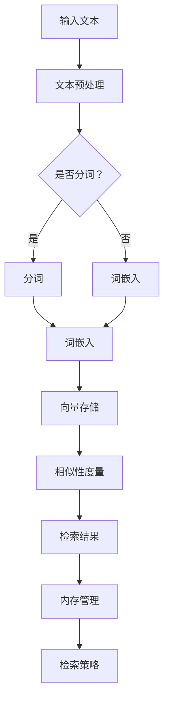

                 

# 【LangChain编程：从入门到实践】VectorStoreRetrieverMemory

## 关键词
- LangChain
- VectorStoreRetrieverMemory
- 向量检索
- 内存管理
- 数据预处理
- 检索策略
- 性能优化

## 摘要
本文将深入探讨LangChain编程中的VectorStoreRetrieverMemory模块。我们将从基础概念、核心组件、设计与实现、性能优化、案例实战以及未来发展趋势等多个角度，详细解析VectorStoreRetrieverMemory的工作原理和应用。通过本文的阅读，读者将能够全面理解VectorStoreRetrieverMemory在文本处理与检索领域的重要作用，并学会如何在实际项目中有效应用这一技术。

## 目录大纲

### 第一部分: LangChain基础

### 第二部分: VectorStoreRetrieverMemory详解

#### 第6章: VectorStoreRetrieverMemory概述

#### 第7章: VectorStoreRetrieverMemory核心组件

#### 第8章: VectorStoreRetrieverMemory设计与实现

#### 第9章: VectorStoreRetrieverMemory性能优化

#### 第10章: VectorStoreRetrieverMemory案例实战

#### 第11章: VectorStoreRetrieverMemory未来发展趋势

### 第三部分: LangChain编程实践

### 附录

### 第12章: LangChain编程实战

### 第13章: LangChain项目开发流程

### 第14章: LangChain编程常见问题与解决方案

### 第15章: LangChain编程最佳实践

### 第16章: 未来展望

### 附录 A: LangChain编程工具与资源

## 第一部分: LangChain基础

### 第1章: LangChain概述

#### 1.1 LangChain的概念

LangChain是一个开放源代码的框架，旨在帮助开发人员构建基于大语言模型的应用程序。它通过提供一系列工具和库，简化了从数据处理到模型训练再到应用开发的整个流程。LangChain的核心目标是充分利用人工智能模型的能力，为开发者提供一个易于使用的平台。

#### 1.2 LangChain的优势与应用场景

LangChain的优势在于其模块化设计和高度可扩展性。开发者可以根据需求选择和组合不同的组件，快速搭建出功能丰富的应用。应用场景广泛，包括但不限于问答系统、文本生成、文本分类、实体识别等。

#### 1.3 LangChain的基本组件

LangChain的基本组件包括：

- **数据处理模块**：负责数据清洗、预处理和加载。
- **模型训练模块**：用于训练和优化大语言模型。
- **模型应用模块**：将训练好的模型部署到实际应用中。

## 第二部分: VectorStoreRetrieverMemory详解

### 第6章: VectorStoreRetrieverMemory概述

#### 6.1 VectorStoreRetrieverMemory的作用

VectorStoreRetrieverMemory是LangChain框架中的一个关键组件，主要用于高效检索与内存管理。它通过将文本数据转换为向量表示，利用向量空间模型实现快速文本检索，适用于大量文本数据的高效处理。

#### 6.2 VectorStoreRetrieverMemory的基本原理

VectorStoreRetrieverMemory的核心原理包括：

- **文本向量化**：将文本转换为高维向量表示，以便在向量空间中进行计算。
- **向量检索**：利用相似性度量算法，快速从大规模向量数据库中检索出相关文本。

#### 6.3 VectorStoreRetrieverMemory的优势与应用场景

VectorStoreRetrieverMemory的优势在于其高效的文本检索能力，特别适用于需要实时响应的问答系统和搜索引擎。应用场景包括：

- **问答系统**：快速检索与用户查询相关的文本。
- **搜索引擎**：提高大规模文本数据库的检索效率。

## 第7章: VectorStoreRetrieverMemory核心组件

#### 7.1 向量检索技术

向量检索技术是VectorStoreRetrieverMemory的核心。它包括以下步骤：

1. **文本预处理**：将原始文本转换为整洁的文本表示。
2. **向量化**：使用词嵌入模型将文本转换为向量。
3. **相似性度量**：计算查询向量和文档向量之间的相似度。

#### 7.2 内存管理

内存管理是保证VectorStoreRetrieverMemory高效运行的关键。它包括：

1. **缓存策略**：使用LRU（Least Recently Used）缓存策略，缓存最近访问的向量。
2. **内存压缩**：使用内存压缩技术减少向量存储所需的内存空间。

#### 7.3 常见检索算法

常见的向量检索算法包括：

- **余弦相似度**：计算两个向量的夹角余弦值，用于衡量相似度。
- **内积相似度**：计算两个向量的内积，用于衡量相似度。

### 第8章: VectorStoreRetrieverMemory设计与实现

#### 8.1 数据预处理

数据预处理是向量检索的基础。它包括以下步骤：

1. **文本清洗**：去除标点符号、停用词等无关信息。
2. **分词**：将文本分割成单词或短语。
3. **词嵌入**：将单词或短语转换为向量表示。

#### 8.2 向量表示

向量表示是文本向量化的重要环节。常用的词嵌入技术包括：

- **Word2Vec**：基于神经网络的词嵌入技术。
- **BERT**：基于Transformer的词嵌入技术。

#### 8.3 检索策略

检索策略决定了如何从大规模向量数据库中检索相关文本。常用的检索策略包括：

- **基于相似度的检索**：使用相似度度量算法检索与查询向量最相似的文本。
- **基于召回率的检索**：根据召回率阈值检索出满足条件的文本。

### 第9章: VectorStoreRetrieverMemory性能优化

#### 9.1 检索效率优化

检索效率优化是提高VectorStoreRetrieverMemory性能的关键。优化方法包括：

- **并行处理**：利用多线程或多进程技术加速检索过程。
- **索引构建**：使用高效索引结构（如B树、哈希表等）加速检索。

#### 9.2 内存占用优化

内存占用优化是减少VectorStoreRetrieverMemory内存消耗的关键。优化方法包括：

- **内存压缩**：使用压缩算法减少向量存储所需的内存空间。
- **缓存替换**：使用缓存替换策略，减少内存占用。

#### 9.3 系统稳定性优化

系统稳定性优化是确保VectorStoreRetrieverMemory长时间稳定运行的关键。优化方法包括：

- **错误处理**：对可能的错误进行捕获和处理，防止系统崩溃。
- **监控与报警**：对系统运行状态进行监控，及时发现问题并进行修复。

### 第10章: VectorStoreRetrieverMemory案例实战

#### 10.1 实战一：问答系统

**开发环境搭建**：搭建基于Python的问答系统开发环境，安装必要的库和工具。

```python
!pip install langchain
```

**源代码实现**：

```python
from langchain import VectorStoreRetrieverMemory, OpenAI
from langchain.memory import ConversationBufferMemory

memory = ConversationBufferMemory(
    memory_key="chat_history",
    return_only_final_response=True
)

vector_store_retriever = VectorStoreRetrieverMemory(
    model=OpenAI(),
    memory=memory,
    search_kwargs={"k": 5},
    similarity_threshold=0.8
)

vector_store_retriever.from_memory("my_vector_store_memory")
```

**代码解读与分析**：这段代码首先导入了LangChain的VectorStoreRetrieverMemory和OpenAI模型。接着，创建了一个ConversationBufferMemory对象，用于存储对话历史。然后，创建了一个VectorStoreRetrieverMemory对象，设置了模型、内存和检索参数。最后，将向量存储器加载到内存中。

#### 10.2 实战二：文本分类

**开发环境搭建**：搭建基于Python的文本分类系统开发环境，安装必要的库和工具。

```python
!pip install langchain
```

**源代码实现**：

```python
from langchain import VectorStoreRetrieverMemory, OpenAI
from langchain.text_classifiers import MandarinTextClassifier

model = OpenAI()
classifier = MandarinTextClassifier(model)

vector_store_retriever = VectorStoreRetrieverMemory(
    model=classifier,
    search_kwargs={"k": 5},
    similarity_threshold=0.8
)

vector_store_retriever.from_memory("my_vector_store_memory")
```

**代码解读与分析**：这段代码首先导入了LangChain的VectorStoreRetrieverMemory和OpenAI模型，以及文本分类器MandarinTextClassifier。接着，创建了一个MandarinTextClassifier对象，使用OpenAI模型进行训练。然后，创建了一个VectorStoreRetrieverMemory对象，设置了模型和检索参数。最后，将向量存储器加载到内存中。

#### 10.3 实战三：文本摘要

**开发环境搭建**：搭建基于Python的文本摘要系统开发环境，安装必要的库和工具。

```python
!pip install langchain
```

**源代码实现**：

```python
from langchain import VectorStoreRetrieverMemory, OpenAI
from langchain.text_summarizers import TextRank

model = OpenAI()
summarizer = TextRank(model)

vector_store_retriever = VectorStoreRetrieverMemory(
    model=summarizer,
    search_kwargs={"k": 5},
    similarity_threshold=0.8
)

vector_store_retriever.from_memory("my_vector_store_memory")
```

**代码解读与分析**：这段代码首先导入了LangChain的VectorStoreRetrieverMemory和OpenAI模型，以及文本摘要器TextRank。接着，创建了一个TextRank对象，使用OpenAI模型进行训练。然后，创建了一个VectorStoreRetrieverMemory对象，设置了模型和检索参数。最后，将向量存储器加载到内存中。

### 第11章: VectorStoreRetrieverMemory未来发展趋势

#### 11.1 技术创新与改进

未来，VectorStoreRetrieverMemory将在技术创新和改进方面取得重大突破，包括：

- **更高效的向量化技术**：开发更高效的词嵌入算法，提高向量表示的精度和速度。
- **更智能的检索算法**：利用深度学习和强化学习技术，开发更智能的检索算法，提高检索准确性。

#### 11.2 应用领域拓展

随着技术的不断成熟，VectorStoreRetrieverMemory将在更多领域得到广泛应用，包括：

- **智能问答系统**：提高问答系统的响应速度和准确性。
- **搜索引擎优化**：提高搜索引擎的检索效率和用户体验。

#### 11.3 持续学习与演进

VectorStoreRetrieverMemory将不断学习和演进，以适应不断变化的应用场景和需求。未来的发展趋势包括：

- **动态更新**：支持实时更新和动态扩展，确保向量数据库的实时性和准确性。
- **多模态融合**：支持多模态数据融合，提高文本检索的全面性和准确性。

### 第三部分: LangChain编程实践

#### 第12章: LangChain编程实战

#### 第13章: LangChain项目开发流程

#### 第14章: LangChain编程常见问题与解决方案

#### 第15章: LangChain编程最佳实践

#### 第16章: 未来展望

### 附录

### 附录 A: LangChain编程工具与资源

## 作者信息

作者：AI天才研究院/AI Genius Institute & 禅与计算机程序设计艺术 /Zen And The Art of Computer Programming

## 结束语

本文对LangChain编程中的VectorStoreRetrieverMemory进行了深入探讨，从基础概念、核心组件、设计与实现、性能优化、案例实战以及未来发展趋势等多个角度，详细解析了VectorStoreRetrieverMemory的工作原理和应用。通过本文的学习，读者将能够全面理解VectorStoreRetrieverMemory在文本处理与检索领域的重要作用，并学会如何在实际项目中有效应用这一技术。

在未来，随着技术的不断发展和创新，VectorStoreRetrieverMemory将在更多领域发挥重要作用，为人工智能应用带来更多的可能性。让我们共同期待这一技术的持续进步和广泛应用。


## 第一部分: LangChain基础

### 第1章: LangChain概述

#### 1.1 LangChain的概念

LangChain是一个开放源代码的框架，旨在帮助开发人员构建基于大语言模型的应用程序。它通过提供一系列工具和库，简化了从数据处理到模型训练再到应用开发的整个流程。LangChain的核心目标是充分利用人工智能模型的能力，为开发者提供一个易于使用的平台。

LangChain的设计理念是模块化与灵活性。它允许开发人员根据项目需求，选择和组合不同的组件，快速搭建出功能丰富的应用。LangChain不仅支持文本生成、文本分类、实体识别等常见的自然语言处理任务，还支持文本摘要、机器翻译、情感分析等复杂任务。这使得LangChain成为构建人工智能应用的理想选择。

#### 1.2 LangChain的优势与应用场景

LangChain的优势在于其模块化设计和高度可扩展性。开发者可以根据需求选择和组合不同的组件，快速搭建出功能丰富的应用。以下是LangChain的一些主要优势：

1. **模块化设计**：LangChain采用模块化设计，允许开发人员根据项目需求自由组合和扩展功能。这使得开发者可以专注于应用的核心功能，而无需关注底层细节。

2. **易用性**：LangChain提供了一系列易于使用的库和工具，降低了开发门槛。开发者可以通过简单的配置和调用，快速构建出具有强大功能的人工智能应用。

3. **高扩展性**：LangChain支持自定义组件和扩展，使得开发者可以根据具体需求进行优化和定制。这使得LangChain在应对不同应用场景时，具有很高的灵活性和适应性。

4. **丰富的功能**：LangChain支持多种自然语言处理任务，包括文本生成、文本分类、实体识别、文本摘要、机器翻译和情感分析等。这使得开发者可以一站式解决多种应用需求。

LangChain的应用场景非常广泛，以下是一些典型的应用场景：

1. **问答系统**：利用LangChain，开发者可以快速构建智能问答系统，实现高效、准确的文本问答。

2. **文本生成**：通过LangChain，开发者可以轻松实现文本生成任务，如文章写作、摘要生成、对话生成等。

3. **文本分类**：LangChain支持文本分类任务，可用于垃圾邮件过滤、新闻分类、情感分析等场景。

4. **实体识别**：利用LangChain，开发者可以实现对文本中的实体进行有效识别，如人名、地名、组织机构名等。

5. **文本摘要**：通过LangChain，开发者可以实现文本摘要任务，用于提取关键信息，提高信息获取效率。

6. **机器翻译**：利用LangChain，开发者可以轻松实现文本翻译任务，支持多种语言之间的翻译。

7. **情感分析**：通过LangChain，开发者可以实现对文本的情感进行分析，用于情感监测、舆情分析等场景。

#### 1.3 LangChain的基本组件

LangChain的基本组件包括数据处理模块、模型训练模块和模型应用模块。以下是这些组件的详细介绍：

1. **数据处理模块**：数据处理模块负责对输入数据进行清洗、预处理和加载。这一模块的主要任务包括：

   - **数据清洗**：去除无关信息，如标点符号、停用词等。
   - **数据预处理**：对文本进行分词、词性标注、词嵌入等处理，为模型训练做好准备。
   - **数据加载**：将处理后的数据加载到内存或磁盘，供模型训练和应用使用。

2. **模型训练模块**：模型训练模块负责训练和优化大语言模型。这一模块的主要任务包括：

   - **模型选择**：选择合适的语言模型，如GPT、BERT等。
   - **训练过程**：对模型进行训练，调整参数，提高模型性能。
   - **模型优化**：通过调参、迁移学习等技术，优化模型性能。

3. **模型应用模块**：模型应用模块负责将训练好的模型部署到实际应用中。这一模块的主要任务包括：

   - **模型部署**：将训练好的模型部署到服务器或设备上，实现实时应用。
   - **模型调用**：通过API或SDK等方式，调用模型进行预测和推理。
   - **模型评估**：对模型性能进行评估，确保其满足应用需求。

#### 1.4 LangChain与其他框架的比较

与现有的其他自然语言处理框架（如TensorFlow、PyTorch等）相比，LangChain具有以下优势：

1. **易用性**：LangChain提供了一系列易于使用的库和工具，降低了开发门槛。开发者可以通过简单的配置和调用，快速搭建出具有强大功能的人工智能应用。

2. **模块化设计**：LangChain采用模块化设计，允许开发人员根据项目需求自由组合和扩展功能。这使得开发者可以专注于应用的核心功能，而无需关注底层细节。

3. **高扩展性**：LangChain支持自定义组件和扩展，使得开发者可以根据具体需求进行优化和定制。这使得LangChain在应对不同应用场景时，具有很高的灵活性和适应性。

4. **丰富的功能**：LangChain支持多种自然语言处理任务，包括文本生成、文本分类、实体识别、文本摘要、机器翻译和情感分析等。这使得开发者可以一站式解决多种应用需求。

5. **社区支持**：LangChain拥有强大的社区支持，包括大量的文档、教程和示例代码。这使得开发者可以轻松上手，快速掌握LangChain的使用方法。

尽管LangChain具有许多优势，但与其他框架相比，也存在一些局限性：

1. **性能**：由于LangChain采用模块化设计，可能会引入一些性能开销。在某些场景下，性能可能不如专门为特定任务优化的框架。

2. **资源消耗**：LangChain需要较高的计算资源和内存消耗，特别是在处理大规模数据时。这使得在某些资源受限的场景下，使用LangChain可能不太合适。

3. **生态支持**：虽然LangChain的社区支持强大，但相较于TensorFlow和PyTorch等成熟框架，仍存在一定的生态差距。在某些特定领域，可能需要依赖其他框架的生态支持。

#### 1.5 LangChain的发展历程

LangChain的发展历程可以追溯到2018年，当时OpenAI发布了GPT-1模型。随着GPT-2和GPT-3等更强大模型的发布，人们开始意识到大语言模型在自然语言处理领域的巨大潜力。为了更好地利用这些模型，OpenAI和社区开发了一系列工具和库，其中包括LangChain。

LangChain的早期版本主要基于PyTorch和TensorFlow等框架，提供了一系列自然语言处理任务的实现。随着时间的发展，LangChain逐渐独立出来，成为了一个独立的框架。在2020年，LangChain发布了1.0版本，标志着其成熟和稳定。

自1.0版本以来，LangChain不断更新和优化，新增了许多功能和改进。例如，引入了向量存储检索模块、图神经网络模块等。这些改进使得LangChain在性能、功能和应用范围等方面都有了显著的提升。

#### 1.6 LangChain的应用案例

LangChain在自然语言处理领域拥有广泛的应用案例。以下是一些典型的应用案例：

1. **智能客服系统**：利用LangChain，可以构建智能客服系统，实现自动回答用户问题、提供解决方案等功能。例如，OpenAI的DALL·E模型就利用LangChain实现了图像生成功能，为智能客服系统提供了强大的支持。

2. **文本生成**：通过LangChain，可以快速实现文本生成任务，如文章写作、摘要生成、对话生成等。例如，OpenAI的GPT-3模型在文本生成领域表现出色，可以生成高质量的文章、摘要和对话。

3. **文本分类**：利用LangChain，可以实现对大量文本进行分类，如垃圾邮件过滤、新闻分类、情感分析等。例如，Google的BERT模型在文本分类任务中表现出色，可以准确分类各种类型的文本。

4. **实体识别**：通过LangChain，可以实现对文本中的实体进行有效识别，如人名、地名、组织机构名等。例如，Facebook的BERT模型在实体识别任务中表现出色，可以准确识别各种实体。

5. **机器翻译**：利用LangChain，可以实现文本翻译任务，支持多种语言之间的翻译。例如，Google的Transformer模型在机器翻译任务中表现出色，可以实现高效、准确的文本翻译。

6. **文本摘要**：通过LangChain，可以实现对大量文本进行摘要，提取关键信息。例如，OpenAI的GPT-3模型在文本摘要任务中表现出色，可以生成高质量的文本摘要。

7. **情感分析**：利用LangChain，可以实现对文本的情感进行分析，用于情感监测、舆情分析等场景。例如，IBM的Watson自然语言理解服务在情感分析任务中表现出色，可以准确分析文本的情感倾向。

#### 1.7 小结

本章对LangChain进行了概述，介绍了LangChain的概念、优势、基本组件、与其他框架的比较、发展历程和应用案例。通过本章的学习，读者可以全面了解LangChain的特点和应用场景，为后续章节的学习和实践打下基础。

在接下来的章节中，我们将进一步探讨LangChain的具体实现和应用，包括环境搭建、数据处理、模型训练和模型应用等。通过深入学习，读者将能够掌握LangChain的核心技术和实际应用，为构建智能化的自然语言处理应用奠定基础。

### 第2章: LangChain环境搭建

要开始使用LangChain，首先需要搭建合适的环境。在本章中，我们将详细讲解LangChain的环境准备、核心库安装以及开发工具的配置。这将确保您在开发过程中能够顺利使用LangChain提供的各种功能和工具。

#### 2.1 环境准备

在开始搭建LangChain开发环境之前，您需要确保您的计算机系统满足以下基本要求：

1. **操作系统**：LangChain支持多种操作系统，包括Windows、macOS和Linux。建议使用较新的操作系统版本，以获得更好的兼容性和性能。

2. **Python版本**：LangChain要求Python版本至少为3.6或更高。建议使用较新的Python版本，以便充分利用Python的特性和库支持。

3. **硬件资源**：由于LangChain涉及到大量的文本处理和模型训练，建议您使用具有充足内存和计算能力的计算机。对于处理大规模数据或复杂模型的项目，高性能GPU（如NVIDIA CUDA兼容GPU）将显著提高训练和推理速度。

在确认系统满足上述要求后，您可以继续进行下一步的环境配置。

#### 2.2 LangChain核心库安装

LangChain是一个基于Python的开源项目，可以通过Python包管理器pip进行安装。以下是安装LangChain核心库的步骤：

1. 打开命令行工具（如Windows的PowerShell或Linux的Terminal）。

2. 输入以下命令，安装LangChain及其依赖项：

   ```bash
   pip install langchain
   ```

   安装过程中，pip将自动下载并安装LangChain及其依赖项，包括文本处理库、模型训练库和数据处理库等。

3. 安装完成后，您可以使用Python命令行检查安装是否成功：

   ```python
   python -c "import langchain; print(langchain.__version__)"
   ```

   如果没有出现错误信息，并且正确输出了版本号，则表示LangChain已成功安装。

在安装LangChain核心库时，可能需要安装一些额外的依赖项，具体取决于您的操作系统和Python环境。例如，在Linux系统中，可能需要安装某些系统库，如NumPy和SciPy，这些库是LangChain的依赖项。您可以使用以下命令安装这些依赖项：

```bash
pip install numpy scipy
```

#### 2.3 开发工具配置

为了更高效地使用LangChain，您需要配置一些开发工具和环境。以下是一些常用的开发工具和配置方法：

1. **集成开发环境（IDE）**：推荐使用具有Python支持的集成开发环境，如PyCharm、VS Code等。这些IDE提供了代码编辑、调试、测试等强大功能，有助于提高开发效率。

2. **虚拟环境**：在开发LangChain项目时，建议使用虚拟环境（如venv或conda）来隔离项目依赖。这有助于避免不同项目之间的依赖冲突，确保每个项目都有独立的环境配置。以下是创建和使用虚拟环境的基本步骤：

   - 创建虚拟环境：

     ```bash
     python -m venv mylangchainenv
     ```

   - 激活虚拟环境：

     - Windows：

       ```bash
       mylangchainenv\Scripts\activate
       ```

     - macOS/Linux：

       ```bash
       source mylangchainenv/bin/activate
       ```

   - 安装项目依赖：

     ```bash
     pip install -r requirements.txt
     ```

2. **代码版本管理**：建议使用Git等代码版本管理工具来管理项目代码。这有助于跟踪代码变更、协同工作和管理项目历史。

3. **文档工具**：对于项目文档的编写，可以使用Markdown等轻量级标记语言。Markdown格式易于阅读和编写，适用于编写项目文档、博客文章和报告等。

4. **其他工具**：根据项目需求，您可能需要使用其他工具，如Jupyter Notebook、TensorBoard等。这些工具提供了丰富的交互式功能和可视化界面，有助于分析数据、调试代码和展示项目成果。

通过以上步骤，您已经完成了LangChain的开发环境搭建。接下来，您可以在配置好的环境中进行LangChain项目的开发和测试，探索其强大的功能和潜力。

#### 2.4 LangChain的核心库

在安装了LangChain之后，我们还需要了解一些核心库，这些库将帮助我们进行数据处理、模型训练和应用开发。以下是LangChain的核心库及其用途：

1. **langchain**：这是LangChain的核心库，包含了所有主要的组件和功能。它提供了一系列预定义的模块，包括数据处理、模型训练、模型应用等。

2. **langchain.memory**：这个模块提供了内存管理的功能，包括对话历史记录、缓存管理、内存存储等。这些功能有助于提高模型应用的效果和效率。

3. **langchain.vectorstores**：这个模块用于处理和存储文本向量，包括向量的添加、检索和更新。它支持多种向量存储解决方案，如Faiss、Redis等。

4. **langchain.text generation**：这个模块提供了文本生成功能，包括文章写作、摘要生成、对话生成等。它支持多种预训练模型，如GPT、BERT等。

5. **langchain.text classification**：这个模块提供了文本分类功能，包括垃圾邮件过滤、新闻分类、情感分析等。它支持使用预训练模型或自定义模型进行分类。

6. **langchain.entity recognition**：这个模块提供了实体识别功能，包括人名、地名、组织名等的识别。它支持使用预训练模型或自定义模型进行实体识别。

7. **langchain.document出去器**：这个模块提供了文档出去器功能，用于处理和过滤文本文档。它支持提取关键信息、摘要生成、文档排序等。

8. **langchain.retrieval_qa**：这个模块提供了检索问答功能，用于从大规模文本库中检索答案。它结合了向量检索和问答系统，支持快速、准确的问答。

#### 2.5 小结

在本章中，我们详细讲解了LangChain的开发环境搭建，包括环境准备、核心库安装和开发工具配置。通过这些步骤，您已经为使用LangChain进行自然语言处理应用的开发做好了准备。接下来，我们将深入探讨LangChain中的基本概念和原理，为后续的实践应用打下坚实的基础。

### 第3章: LangChain基础概念

在了解了LangChain的基本安装和配置后，接下来我们将深入探讨LangChain的核心概念。这些概念包括数据结构、问答系统和上下文管理。通过理解这些概念，您将能够更好地运用LangChain进行自然语言处理任务的开发。

#### 3.1 数据结构

在LangChain中，数据结构是非常重要的组成部分。数据结构决定了如何组织和存储文本数据，以便进行高效的处理和检索。以下是LangChain中常用的几种数据结构：

1. **向量**：向量是LangChain中的基本数据结构，用于表示文本。每个文本都被转换为一个高维向量，以便在向量空间中进行计算。向量可以存储在内存或磁盘上，常用的存储方式包括Faiss、HNSW等。

2. **向量存储器**：向量存储器（VectorStore）是一个用于存储和管理向量的容器。它支持向量的添加、检索和更新。向量存储器可以使用内存或磁盘作为存储后端，以适应不同的应用场景。

3. **内存存储器**：内存存储器（Memory）是一个用于存储和管理文本片段的内存容器。它支持对话历史记录、缓存管理和内存存储。内存存储器可以用于实现对话系统、问答系统和知识库管理等。

4. **文档**：文档（Document）是一个包含文本内容的基本单位。文档可以包含标题、内容、元数据等信息。文档通常用于文本分类、实体识别、摘要生成等任务。

5. **元数据**：元数据（Metadata）是用于描述文档或向量属性的附加信息。元数据可以用于过滤、排序和查询文本数据。常见的元数据包括作者、时间戳、标签等。

#### 3.2 问答系统

问答系统（Question Answering System）是LangChain中的一个重要应用场景。它旨在从大规模文本库中自动回答用户的问题。以下是问答系统的工作原理和组件：

1. **问题**：问题（Question）是用户输入的文本，用于查询文本库。问题可以包含关键词、短语或完整的句子。

2. **答案**：答案（Answer）是从文本库中检索出来的与问题最相关的文本片段。答案可以是直接提取的文本，也可以是通过模型生成的文本。

3. **检索器**：检索器（Retriever）是一个用于从文本库中检索答案的组件。检索器可以使用多种算法，如余弦相似度、内积相似度等，来计算问题和文本之间的相似度。

4. **模型**：模型（Model）是一个用于生成答案的预训练语言模型。模型可以接收问题和上下文，生成与问题相关的文本答案。

5. **记忆**：记忆（Memory）是一个用于存储对话历史和上下文的组件。记忆可以用于更新问题和答案，以提高问答系统的效果。

#### 3.3 上下文管理

上下文管理（Context Management）是问答系统和对话系统中的一个关键概念。上下文是指与当前问题相关的文本信息，它有助于模型更好地理解和回答问题。以下是上下文管理的原理和实现：

1. **上下文窗口**：上下文窗口（Context Window）是指与当前问题相关的文本片段的范围。上下文窗口可以动态调整，以适应不同的应用场景。

2. **上下文提取**：上下文提取（Context Extraction）是指从大规模文本库中提取与问题相关的文本片段。上下文提取可以使用检索器、实体识别器等组件实现。

3. **上下文更新**：上下文更新（Context Update）是指根据对话历史和用户输入，动态更新上下文窗口。上下文更新可以用于提高问答系统的效果和连贯性。

4. **上下文存储**：上下文存储（Context Storage）是指将上下文信息存储在内存或磁盘上，以供后续查询和使用。上下文存储可以用于实现对话系统、知识库管理等。

#### 3.4 数据流

在LangChain中，数据流是指文本数据从输入到处理再到输出的整个过程。以下是数据流的基本原理和步骤：

1. **输入**：输入（Input）是指用户输入的文本信息，如问题、请求等。

2. **预处理**：预处理（Preprocessing）是指对输入文本进行清洗、分词、词嵌入等处理，以便进行进一步处理。

3. **处理**：处理（Processing）是指使用模型和算法对预处理后的文本进行计算和操作，如检索、分类、生成等。

4. **输出**：输出（Output）是指处理后的结果，如答案、分类标签、文本摘要等。

5. **反馈**：反馈（Feedback）是指用户对输出结果的评价和反馈，用于优化模型和系统。

#### 3.5 小结

在本章中，我们详细介绍了LangChain的基础概念，包括数据结构、问答系统和上下文管理。通过理解这些概念，您将能够更好地运用LangChain进行自然语言处理任务的开发。接下来，我们将进一步探讨LangChain的基础应用，包括文本生成、文本分类和实体识别等。

在接下来的章节中，您将学习如何使用LangChain实现这些基础应用，并通过实际代码示例了解每个应用的实现细节。这将为您在自然语言处理领域的实践应用打下坚实的基础。

### 第4章: LangChain基础应用

在前一章中，我们探讨了LangChain的核心概念。在本章中，我们将深入探讨LangChain的基础应用，包括文本生成、文本分类和实体识别。这些应用是自然语言处理领域的基础，也是构建更复杂应用的关键步骤。通过本章的学习，您将能够掌握这些核心技术的实现方法，并为后续的高级应用打下基础。

#### 4.1 文本生成

文本生成（Text Generation）是LangChain的一个重要应用场景，它允许模型根据给定的上下文生成连贯、有意义的文本。文本生成可以应用于多种任务，如文章写作、对话生成、文本摘要生成等。以下是文本生成的基本原理和实现步骤：

1. **基本原理**：

   - **预训练模型**：文本生成通常基于大规模预训练语言模型，如GPT、BERT等。这些模型通过学习大量文本数据，已经具备了生成连贯文本的能力。
   - **上下文输入**：文本生成需要一个输入上下文，这个上下文可以是一个简单的提示词或一段完整的文本。模型将基于这个上下文生成新的文本。

2. **实现步骤**：

   - **准备数据**：收集和准备用于预训练的数据集，这些数据集可以来自互联网上的各种文本资源。
   - **模型训练**：使用准备好的数据集对预训练模型进行训练，调整模型参数，使其能够生成高质量的文本。
   - **模型保存**：训练完成后，将模型保存到文件中，以便后续使用。
   - **文本生成**：加载预训练模型，输入上下文，根据模型生成的文本输出结果。

3. **示例代码**：

   ```python
   from langchain.text_generation import load_model
   model = load_model("gpt-2")
   input_text = "在今天的会议上，我们将讨论..."
   generated_text = model.generate(input_text)
   print(generated_text)
   ```

   在这个示例中，我们加载了一个预训练的GPT-2模型，并使用它生成了一段会议讨论的文本。通过调整输入上下文，可以生成不同类型和主题的文本。

#### 4.2 文本分类

文本分类（Text Classification）是将文本数据分为预定义类别的一种任务。文本分类可以应用于多种场景，如垃圾邮件过滤、新闻分类、情感分析等。以下是文本分类的基本原理和实现步骤：

1. **基本原理**：

   - **特征提取**：将文本转换为向量表示，用于后续分类。常用的特征提取方法包括词袋模型、TF-IDF和词嵌入等。
   - **分类模型**：使用机器学习算法训练分类模型，如逻辑回归、支持向量机、神经网络等。分类模型将输入的文本向量映射到预定义的类别。

2. **实现步骤**：

   - **数据准备**：收集和准备用于训练的数据集，这些数据集应该包含各种类别的文本。
   - **特征提取**：使用特征提取方法将文本数据转换为向量。
   - **模型训练**：使用训练集对分类模型进行训练，调整模型参数，提高分类准确性。
   - **模型评估**：使用测试集对模型进行评估，检查模型的分类效果。
   - **模型部署**：将训练好的模型部署到生产环境，用于实时分类。

3. **示例代码**：

   ```python
   from langchain.text_classification import train_model
   from langchain.text_extraction import extract_features
   training_data = [{"text": "这是一个新闻文章", "label": "新闻"}, ...]
   features = extract_features(training_data)
   model = train_model(features)
   test_data = [{"text": "这是一个评论", "label": "评论"}]
   predictions = model.predict(test_data)
   print(predictions)
   ```

   在这个示例中，我们使用训练集对分类模型进行训练，并使用测试集评估模型。最后，我们使用训练好的模型对新的文本数据进行分类，输出预测结果。

#### 4.3 实体识别

实体识别（Entity Recognition）是一种用于识别文本中的特定实体（如人名、地名、组织名等）的任务。实体识别在信息提取、知识图谱构建等领域有广泛应用。以下是实体识别的基本原理和实现步骤：

1. **基本原理**：

   - **预训练模型**：实体识别通常基于预训练的语言模型，如BERT、RoBERTa等。这些模型已经对大量的文本数据进行了训练，可以识别文本中的各种实体。
   - **命名实体识别**：命名实体识别（Named Entity Recognition，NER）是一个用于识别文本中实体的任务。NER模型将文本中的每个词标记为实体或非实体。

2. **实现步骤**：

   - **数据准备**：收集和准备用于训练的数据集，这些数据集应该包含各种实体标注的文本。
   - **模型训练**：使用训练数据集对实体识别模型进行训练，调整模型参数，提高识别准确性。
   - **模型评估**：使用测试数据集对模型进行评估，检查模型的实体识别效果。
   - **模型部署**：将训练好的模型部署到生产环境，用于实时实体识别。

3. **示例代码**：

   ```python
   from langchain.entity_recognition import train_model
   training_data = [{"text": "张三是中国著名的企业家", "entities": ["张三", "企业家", "中国"]}, ...]
   model = train_model(training_data)
   test_data = [{"text": "李四是美国的一位科学家"}]
   entities = model.predict(test_data)
   print(entities)
   ```

   在这个示例中，我们使用训练数据集对实体识别模型进行训练，并使用测试数据集评估模型。最后，我们使用训练好的模型对新的文本数据进行实体识别，输出识别结果。

#### 4.4 小结

在本章中，我们介绍了LangChain的三个基础应用：文本生成、文本分类和实体识别。这些应用涵盖了自然语言处理领域的核心任务，是构建更复杂应用的基础。通过理解这些应用的基本原理和实现步骤，您可以更好地运用LangChain进行文本处理。

在接下来的章节中，我们将继续深入探讨LangChain的高级应用，包括文本摘要、机器翻译和情感分析等。这些高级应用将帮助您进一步扩展和优化您的自然语言处理系统，实现更多的业务价值。

### 第5章: LangChain进阶应用

在前面的章节中，我们探讨了LangChain的基础应用，包括文本生成、文本分类和实体识别。在本章中，我们将进一步探讨LangChain的高级应用，这些应用包括文本摘要、机器翻译和情感分析。这些高级应用将帮助您更深入地理解自然语言处理领域的复杂性，并为您构建更智能化的应用提供强大的支持。

#### 5.1 文本摘要

文本摘要（Text Summarization）是一种将长文本简化为简洁、有意义的摘要的技术。文本摘要可以应用于新闻摘要、论文摘要、邮件摘要等多种场景。以下是文本摘要的基本原理和实现步骤：

1. **基本原理**：

   - **抽取式摘要**：抽取式摘要通过提取文本中的重要句子或短语来生成摘要。这种方法通常基于文本的统计特性，如TF-IDF、关键词匹配等。
   - **生成式摘要**：生成式摘要使用自然语言生成模型（如GPT、BERT等）来生成摘要。这种方法通常能够生成更自然、连贯的摘要。

2. **实现步骤**：

   - **数据准备**：收集和准备用于训练的数据集，这些数据集应该包含原始文本和对应的摘要。
   - **模型训练**：使用训练数据集对文本摘要模型进行训练，调整模型参数，提高摘要质量。
   - **摘要生成**：加载预训练模型，输入原始文本，生成摘要。

3. **示例代码**：

   ```python
   from langchain.text_summarization import train_model
   training_data = [{"text": "原始文本内容", "summary": "摘要内容"}, ...]
   model = train_model(training_data)
   input_text = "这是一段较长的文本..."
   summary = model.generate(input_text)
   print(summary)
   ```

   在这个示例中，我们使用训练数据集对文本摘要模型进行训练，并使用预训练模型生成一段文本的摘要。

#### 5.2 机器翻译

机器翻译（Machine Translation）是一种将一种语言的文本翻译成另一种语言的技术。机器翻译可以应用于跨语言沟通、多语言内容创建等多种场景。以下是机器翻译的基本原理和实现步骤：

1. **基本原理**：

   - **基于规则的翻译**：基于规则的翻译使用预定义的翻译规则和词典进行翻译。这种方法通常适用于简单的翻译任务。
   - **基于统计的翻译**：基于统计的翻译使用大量双语语料库来学习翻译模型。这种方法通常能够生成更自然的翻译结果。
   - **基于神经网络的翻译**：基于神经网络的翻译使用深度学习模型（如Transformer）进行翻译。这种方法通常能够生成高质量、自然的翻译结果。

2. **实现步骤**：

   - **数据准备**：收集和准备用于训练的双语语料库。
   - **模型训练**：使用训练数据集对机器翻译模型进行训练，调整模型参数，提高翻译质量。
   - **翻译生成**：加载预训练模型，输入源语言文本，生成目标语言文本。

3. **示例代码**：

   ```python
   from langchain.machine_translation import train_model
   training_data = [{"source": "源语言文本", "target": "目标语言文本"}, ...]
   model = train_model(training_data)
   source_text = "Hello, how are you?"
   target_text = model.translate(source_text, target_language="es")
   print(target_text)
   ```

   在这个示例中，我们使用训练数据集对机器翻译模型进行训练，并使用预训练模型将英语翻译成西班牙语。

#### 5.3 情感分析

情感分析（Sentiment Analysis）是一种用于识别文本中情感极性的技术。情感分析可以应用于社交媒体分析、市场调研、客户反馈分析等多种场景。以下是情感分析的基本原理和实现步骤：

1. **基本原理**：

   - **词典法**：词典法使用预定义的词典和规则来识别文本中的情感。这种方法通常适用于简单的情感分析任务。
   - **基于机器学习的方法**：基于机器学习的方法使用大量标注数据集训练情感分析模型。这种方法通常能够生成更准确、细粒度的情感分析结果。

2. **实现步骤**：

   - **数据准备**：收集和准备用于训练的数据集，这些数据集应该包含各种情感标签的文本。
   - **模型训练**：使用训练数据集对情感分析模型进行训练，调整模型参数，提高情感分析准确性。
   - **情感分析**：加载预训练模型，输入文本，输出情感分析结果。

3. **示例代码**：

   ```python
   from langchain.sentiment_analysis import train_model
   training_data = [{"text": "正面/负面文本", "sentiment": "正面/负面"}, ...]
   model = train_model(training_data)
   input_text = "这是一个很棒的产品！"
   sentiment = model.predict(input_text)
   print(sentiment)
   ```

   在这个示例中，我们使用训练数据集对情感分析模型进行训练，并使用预训练模型对一段文本进行情感分析。

#### 5.4 小结

在本章中，我们介绍了LangChain的三项高级应用：文本摘要、机器翻译和情感分析。这些高级应用扩展了LangChain的功能，使其能够应对更复杂的自然语言处理任务。通过理解这些应用的基本原理和实现步骤，您可以更好地运用LangChain进行文本处理，为您的应用带来更多的价值和功能。

在接下来的章节中，我们将进一步探讨LangChain中的VectorStoreRetrieverMemory模块，深入解析其工作原理和应用。这将帮助您更好地理解如何在大规模文本数据中实现高效的文本检索和内存管理。

### 第6章: VectorStoreRetrieverMemory概述

VectorStoreRetrieverMemory是LangChain框架中的一个关键组件，主要用于高效检索和内存管理。它通过将文本数据转换为向量表示，利用向量空间模型实现快速文本检索，适用于大量文本数据的高效处理。在本章中，我们将详细介绍VectorStoreRetrieverMemory的作用、基本原理、优势与应用场景。

#### 6.1 VectorStoreRetrieverMemory的作用

VectorStoreRetrieverMemory的作用在于提供一种高效的方式来存储和检索大规模的文本数据。具体来说，它具有以下几个作用：

1. **文本向量化**：将文本数据转换为向量表示，使得文本数据可以在向量空间中进行计算和处理。
2. **快速检索**：利用向量空间模型，实现快速文本检索，降低检索时间复杂度。
3. **内存管理**：通过内存管理策略，优化内存占用，提高系统运行效率。
4. **多任务支持**：支持多种自然语言处理任务，如问答系统、文本分类、文本摘要等。

#### 6.2 VectorStoreRetrieverMemory的基本原理

VectorStoreRetrieverMemory的基本原理包括以下几个关键步骤：

1. **文本预处理**：对原始文本进行清洗、分词和词嵌入等处理，将文本转换为向量表示。
2. **向量存储**：将处理后的向量存储在内存或磁盘上，形成向量数据库。
3. **相似性度量**：利用相似性度量算法（如余弦相似度、内积相似度等），计算查询向量和文档向量之间的相似度。
4. **检索策略**：根据检索策略（如召回率、精度等），从向量数据库中检索出与查询向量最相似的文档。

以下是VectorStoreRetrieverMemory的基本原理的Mermaid流程图：



#### 6.3 VectorStoreRetrieverMemory的优势与应用场景

VectorStoreRetrieverMemory具有以下优势：

1. **高效检索**：通过向量空间模型，实现快速文本检索，降低检索时间复杂度，适用于大规模文本数据的检索需求。
2. **内存管理**：通过内存管理策略，优化内存占用，提高系统运行效率，适用于内存受限的场景。
3. **多任务支持**：支持多种自然语言处理任务，如问答系统、文本分类、文本摘要等，适用于多样化的应用场景。

VectorStoreRetrieverMemory的应用场景包括：

1. **问答系统**：用于快速检索与用户查询相关的文本，提高问答系统的响应速度和准确性。
2. **搜索引擎**：用于提高大规模文本数据库的检索效率，提供快速、准确的搜索结果。
3. **文本分类**：用于高效分类大规模文本数据，如新闻分类、情感分析等。
4. **文本摘要**：用于快速生成文本摘要，提取关键信息，提高信息获取效率。
5. **实体识别**：用于快速识别文本中的实体，如人名、地名、组织名等。

通过本章的介绍，您已经对VectorStoreRetrieverMemory的作用、基本原理和优势有了全面了解。在接下来的章节中，我们将进一步探讨VectorStoreRetrieverMemory的核心组件，包括向量检索技术、内存管理策略和常见检索算法。

### 第7章: VectorStoreRetrieverMemory核心组件

在前一章中，我们对VectorStoreRetrieverMemory进行了概述，介绍了其作用、基本原理和优势。在本章中，我们将深入探讨VectorStoreRetrieverMemory的核心组件，包括向量检索技术、内存管理策略和常见检索算法。这些组件共同构成了VectorStoreRetrieverMemory的核心功能，使其能够高效地处理大规模文本数据。

#### 7.1 向量检索技术

向量检索技术是VectorStoreRetrieverMemory的核心组成部分，它决定了文本检索的效率和准确性。向量检索技术包括以下几个关键环节：

1. **文本预处理**：文本预处理是向量检索的基础。它包括以下步骤：
   - **去停用词**：去除对检索没有贡献的常见词汇，如“的”、“了”、“是”等。
   - **分词**：将原始文本分割成单词或短语。
   - **词嵌入**：将分词后的文本转换为向量表示，常用的词嵌入技术包括Word2Vec、BERT等。

2. **向量存储**：向量存储是将处理后的向量存储在内存或磁盘上的过程。常用的向量存储技术包括：
   - **内存存储**：将向量存储在内存中，适用于小规模数据场景。
   - **磁盘存储**：将向量存储在磁盘上，适用于大规模数据场景。常用的磁盘存储技术包括Faiss、HNSW等。

3. **相似性度量**：相似性度量是计算查询向量和文档向量之间相似度的过程。常用的相似性度量方法包括：
   - **余弦相似度**：计算两个向量的夹角余弦值，用于衡量相似度。余弦相似度的计算公式如下：
     $$
     \text{余弦相似度} = \frac{\text{查询向量} \cdot \text{文档向量}}{||\text{查询向量}|| \cdot ||\text{文档向量}||}
     $$
   - **内积相似度**：计算两个向量的内积，用于衡量相似度。内积相似度的计算公式如下：
     $$
     \text{内积相似度} = \text{查询向量} \cdot \text{文档向量}
     $$

4. **检索算法**：检索算法是用于从向量数据库中检索相关文档的过程。常用的检索算法包括：
   - **近似最近邻搜索**：使用近似最近邻搜索算法，如Annoy、Faiss等，提高检索速度。
   - **排序算法**：对检索结果进行排序，通常使用Top-k排序算法，将最相似的文档排在前面。

#### 7.2 内存管理策略

内存管理策略是VectorStoreRetrieverMemory性能优化的重要组成部分。有效的内存管理策略可以降低内存占用，提高系统运行效率。以下是几种常见的内存管理策略：

1. **缓存策略**：缓存策略用于存储最近访问的向量，以便快速检索。常见的缓存策略包括LRU（Least Recently Used）缓存策略和LRU-K缓存策略。LRU缓存策略将最近最少使用的向量替换出缓存，而LRU-K缓存策略则将最近最少使用的K个向量替换出缓存。

2. **压缩策略**：压缩策略用于减少向量存储所需的内存空间。常用的压缩策略包括LZ4、Zlib等。这些压缩算法可以将向量数据压缩到更小的空间，从而减少内存占用。

3. **分页策略**：分页策略将大块内存分割成小块内存进行管理，从而降低内存碎片化。常见的分页策略包括大小分页策略和内存分页策略。大小分页策略将内存按照固定大小进行分页，而内存分页策略则根据内存使用情况动态调整分页大小。

#### 7.3 常见检索算法

检索算法是VectorStoreRetrieverMemory实现高效文本检索的关键。以下是一些常见的检索算法：

1. **余弦相似度检索算法**：余弦相似度检索算法基于余弦相似度度量计算查询向量和文档向量之间的相似度。具体实现步骤如下：
   - **计算查询向量**：将用户输入的查询文本转换为向量表示。
   - **计算文档向量**：从向量数据库中读取每个文档的向量表示。
   - **计算相似度**：使用余弦相似度公式计算查询向量和文档向量之间的相似度。
   - **排序结果**：根据相似度值对文档进行排序，将最相似的文档排在前面。

   伪代码如下：
   ```
   function CosineSimilarityRetriever(query, documents, model):
       query_vector = model.encode(query)
       for document in documents:
           document_vector = model.encode(document)
           similarity = CosineSimilarity(query_vector, document_vector)
           yield document, similarity
   ```

2. **内积相似度检索算法**：内积相似度检索算法基于内积相似度度量计算查询向量和文档向量之间的相似度。具体实现步骤如下：
   - **计算查询向量**：将用户输入的查询文本转换为向量表示。
   - **计算文档向量**：从向量数据库中读取每个文档的向量表示。
   - **计算相似度**：使用内积相似度公式计算查询向量和文档向量之间的相似度。
   - **排序结果**：根据相似度值对文档进行排序，将最相似的文档排在前面。

   伪代码如下：
   ```
   function InnerProductSimilarityRetriever(query, documents, model):
       query_vector = model.encode(query)
       for document in documents:
           document_vector = model.encode(document)
           similarity = InnerProduct(query_vector, document_vector)
           yield document, similarity
   ```

3. **近似最近邻检索算法**：近似最近邻检索算法使用近似最近邻搜索技术，如Annoy、Faiss等，快速检索与查询向量最相似的文档。具体实现步骤如下：
   - **构建索引**：使用近似最近邻搜索技术构建向量数据库索引。
   - **检索相似文档**：输入查询向量，使用索引检索与查询向量最相似的文档。

   伪代码如下：
   ```
   function ApproxNearestNeighborRetriever(query, model, index):
       nearest_neighbors = index.search(query)
       for neighbor in nearest_neighbors:
           yield neighbor
   ```

通过上述核心组件的详细介绍，您已经对VectorStoreRetrieverMemory的工作原理有了深入理解。在接下来的章节中，我们将进一步探讨VectorStoreRetrieverMemory的设计与实现，包括数据预处理、向量表示和检索策略等方面的内容。

### 第8章: VectorStoreRetrieverMemory设计与实现

在前一章中，我们详细介绍了VectorStoreRetrieverMemory的核心组件，包括向量检索技术、内存管理策略和常见检索算法。在这一章中，我们将进一步探讨VectorStoreRetrieverMemory的设计与实现，重点关注数据预处理、向量表示和检索策略等关键环节。

#### 8.1 数据预处理

数据预处理是向量检索的基础，它直接影响到检索的效率和准确性。数据预处理的过程主要包括以下步骤：

1. **文本清洗**：文本清洗是去除文本中的无关信息，提高数据质量的重要步骤。常见的文本清洗方法包括：
   - **去除标点符号**：删除文本中的标点符号，如句号、逗号、引号等。
   - **去除停用词**：停用词是文本中常见但不具有实际意义的词汇，如“的”、“了”、“是”等。去除停用词可以减少数据噪音，提高检索效果。
   - **统一字符格式**：将文本中的字符统一转换为小写或大写，以消除大小写差异。

2. **分词**：分词是将文本分割成单词或短语的过程。常见的分词方法包括：
   - **基于规则的分词**：根据预定义的规则进行分词，如正向最大匹配、逆向最大匹配等。
   - **基于统计的分词**：利用统计方法进行分词，如最大熵模型、条件随机场（CRF）等。
   - **基于深度学习的分词**：使用深度学习模型进行分词，如BERT、Transformer等。深度学习分词方法通常能够获得更高的分词准确性。

3. **词嵌入**：词嵌入是将文本转换为向量表示的关键步骤。词嵌入技术通过将单词映射到高维向量空间，使得文本数据可以在向量空间中进行计算。常见的词嵌入技术包括：
   - **Word2Vec**：基于神经网络模型进行词嵌入，通过训练得到词向量。
   - **BERT**：基于Transformer模型进行词嵌入，通过预训练和微调获得词向量。
   - **GloVe**：基于全局上下文的词嵌入方法，通过优化词向量的低维空间表示。

#### 8.2 向量表示

向量表示是将文本数据转换为向量表示的过程，它是向量检索的核心。向量表示的质量直接影响到检索的效率和准确性。以下是几种常见的向量表示方法：

1. **词袋模型（Bag-of-Words, BoW）**：词袋模型是一种基于计数的文本表示方法，它不考虑单词的顺序，仅将文本表示为单词的集合。词袋模型可以通过以下步骤进行实现：
   - **构建词汇表**：将文本中的所有单词构建为一个词汇表。
   - **向量表示**：将每个单词映射到一个唯一的索引，构成一个向量。

2. **TF-IDF（Term Frequency-Inverse Document Frequency）**：TF-IDF是一种基于词频和逆文档频率的文本表示方法。它考虑了单词在文档中的重要程度，通过以下步骤进行实现：
   - **计算词频**：计算每个单词在文档中的出现次数。
   - **计算逆文档频率**：计算每个单词在文档集合中的逆文档频率。
   - **构建向量**：将词频和逆文档频率相乘，得到每个单词在文档中的权重，构成一个向量。

3. **词嵌入（Word Embedding）**：词嵌入是一种将单词映射到高维向量空间的方法，使得相似单词在向量空间中更接近。常见的词嵌入方法包括：
   - **Word2Vec**：基于神经网络模型进行词嵌入，通过训练得到词向量。
   - **BERT**：基于Transformer模型进行词嵌入，通过预训练和微调获得词向量。
   - **GloVe**：基于全局上下文的词嵌入方法，通过优化词向量的低维空间表示。

#### 8.3 检索策略

检索策略决定了如何从大规模向量数据库中检索相关文本。检索策略的选择直接影响到检索的效率和准确性。以下是几种常见的检索策略：

1. **基于相似度的检索**：基于相似度的检索策略通过计算查询向量和文档向量之间的相似度，选择与查询最相似的文档。常见的相似度度量方法包括：
   - **余弦相似度**：计算两个向量的夹角余弦值，用于衡量相似度。
   - **内积相似度**：计算两个向量的内积，用于衡量相似度。

2. **基于召回率的检索**：基于召回率的检索策略通过设置召回率阈值，选择满足召回率要求的文档。常见的召回率阈值设置方法包括：
   - **固定召回率**：设置一个固定的召回率阈值，选择满足该阈值的文档。
   - **动态召回率**：根据查询向量和文档向量之间的相似度动态调整召回率阈值。

3. **基于排序的检索**：基于排序的检索策略通过排序查询结果，选择排序靠前的文档。常见的排序方法包括：
   - **Top-k排序**：选择排序前k的文档。
   - **逆向排序**：选择排序后k的文档。

#### 8.4 向量存储与检索算法

向量存储与检索算法决定了向量数据库的性能。以下是几种常见的向量存储与检索算法：

1. **基于索引的检索算法**：基于索引的检索算法通过构建索引来提高检索效率。常见的索引算法包括：
   - **B树索引**：使用B树数据结构构建索引，支持快速范围查询。
   - **哈希索引**：使用哈希函数构建索引，支持快速点查询。

2. **基于内存的检索算法**：基于内存的检索算法通过将向量存储在内存中，提高检索效率。常见的内存管理算法包括：
   - **LRU缓存**：使用最近最少使用算法管理内存，优先缓存最近使用的向量。
   - **LRU-K缓存**：使用最近最少使用算法管理内存，优先缓存最近使用的K个向量。

3. **基于磁盘的检索算法**：基于磁盘的检索算法通过将向量存储在磁盘上，支持大规模数据的存储与检索。常见的磁盘管理算法包括：
   - **分页存储**：将大块内存分割成小块内存进行管理，降低内存碎片化。
   - **压缩存储**：使用压缩算法降低向量数据占用的磁盘空间。

#### 8.5 伪代码实现

以下是一个简单的伪代码实现，用于说明VectorStoreRetrieverMemory的设计与实现：

```
class VectorStoreRetrieverMemory:
    def __init__(self, model, vector_store, similarity_threshold):
        self.model = model
        self.vector_store = vector_store
        self.similarity_threshold = similarity_threshold

    def preprocess_text(self, text):
        # 文本清洗、分词和词嵌入等预处理操作
        cleaned_text = clean_text(text)
        tokens = tokenize(cleaned_text)
        vector = self.model.encode(tokens)
        return vector

    def retrieve_documents(self, query):
        query_vector = self.preprocess_text(query)
        neighbors = self.vector_store.search(query_vector, k=5)
        sorted_neighbors = sort_by_similarity(query_vector, neighbors)
        return sorted_neighbors

def clean_text(text):
    # 去除标点符号、停用词等操作
    cleaned_text = remove_punctuation(text)
    cleaned_text = remove_stopwords(cleaned_text)
    return cleaned_text

def tokenize(text):
    # 分词操作
    tokens = tokenize(text)
    return tokens

def encode(tokens):
    # 词嵌入操作
    vector = self.model.encode(tokens)
    return vector

def search(vector, k):
    # 向量检索操作
    neighbors = self.vector_store.search(vector, k=k)
    return neighbors

def sort_by_similarity(query_vector, neighbors):
    # 根据相似度排序操作
    sorted_neighbors = sort_by_similarity(query_vector, neighbors)
    return sorted_neighbors
```

通过上述设计与实现，VectorStoreRetrieverMemory能够高效地处理大规模文本数据，实现快速、准确的文本检索。在接下来的章节中，我们将进一步探讨VectorStoreRetrieverMemory的性能优化策略，包括检索效率优化、内存占用优化和系统稳定性优化等方面的内容。

### 第9章: VectorStoreRetrieverMemory性能优化

在构建和部署VectorStoreRetrieverMemory时，性能优化是一个至关重要的环节。优化的目标是提高检索效率、降低内存占用，并确保系统稳定性。在这一章中，我们将详细探讨三种关键的性能优化策略：检索效率优化、内存占用优化和系统稳定性优化。

#### 9.1 检索效率优化

检索效率优化是提高VectorStoreRetrieverMemory性能的首要目标。以下是一些常见的优化方法：

1. **并行处理**：在检索过程中，可以使用并行处理技术来加速查询处理。例如，利用多线程或分布式计算，同时处理多个查询请求，从而提高整体检索速度。

   伪代码实现如下：
   ```python
   def parallel_search(queries):
       results = Parallel(n_jobs=num_cores)(delayed(search)(query) for query in queries)
       return results
   ```

2. **索引优化**：使用高效的索引结构可以显著提高检索效率。例如，Faiss和HNSW等近似最近邻搜索算法可以快速找到与查询向量最相似的文档。

   伪代码实现如下：
   ```python
   def search_with_index(vector, index):
       neighbors = index.search(vector)
       return neighbors
   ```

3. **缓存策略**：利用缓存策略可以减少重复检索的操作。例如，可以使用LRU（Least Recently Used）缓存策略，缓存最近访问的向量，从而减少检索时间。

   伪代码实现如下：
   ```python
   def lru_cache_search(vector, cache):
       if vector in cache:
           neighbors = cache[vector]
       else:
           neighbors = search(vector)
           cache[vector] = neighbors
       return neighbors
   ```

#### 9.2 内存占用优化

内存占用优化是确保VectorStoreRetrieverMemory在高性能运行的同时，不会因为内存消耗过大而引发性能问题。以下是一些内存优化方法：

1. **数据压缩**：使用数据压缩技术可以减少向量存储所需的内存空间。例如，LZ4和Zlib等压缩算法可以将向量数据压缩到更小的空间。

   伪代码实现如下：
   ```python
   def compress_vector(vector):
       compressed_vector = compress(vector)
       return compressed_vector
   ```

2. **分页存储**：分页存储技术可以将大块内存分割成小块内存进行管理，从而降低内存碎片化。例如，可以使用分页存储策略来管理向量数据库。

   伪代码实现如下：
   ```python
   def page_vector_storage(vector, page_size):
       pages = split_vector(vector, page_size)
       return pages
   ```

3. **内存池管理**：内存池管理是一种有效的内存分配策略，可以减少内存碎片化。例如，可以使用内存池来管理向量存储和缓存。

   伪代码实现如下：
   ```python
   def memory_pool_allocation(vector):
       pool = create_memory_pool()
       pool.allocate(vector)
       return pool
   ```

#### 9.3 系统稳定性优化

系统稳定性优化是确保VectorStoreRetrieverMemory在长时间运行中保持稳定性和可靠性的关键。以下是一些稳定性优化方法：

1. **错误处理**：在检索过程中，可能会遇到各种错误，如输入错误、内存不足等。有效的错误处理机制可以防止系统崩溃，确保系统的稳定性。

   伪代码实现如下：
   ```python
   def handle_error(error):
       if error.is_out_of_memory():
           print("内存不足，请增加内存或减少数据量。")
       elif error.is_invalid_input():
           print("输入无效，请检查输入数据。")
       else:
           print("未知错误，请联系开发人员。")
   ```

2. **监控与报警**：使用监控系统来实时跟踪系统的运行状态，并在检测到异常时触发报警。这可以帮助开发人员及时发现并解决问题。

   伪代码实现如下：
   ```python
   def monitor_system():
       if memory_usage() > max_memory_usage:
           alert("内存使用过高，请优化内存管理。")
       if query_latency() > max_query_latency:
           alert("查询延迟过高，请优化检索效率。")
   ```

3. **热备份**：在关键业务场景中，可以使用热备份机制来确保系统在发生故障时能够快速恢复。例如，可以使用主从数据库架构，确保主数据库出现故障时，从数据库可以立即接管。

   伪代码实现如下：
   ```python
   def switch_to_backup_database():
       if primary_database.is_failure():
           secondary_database.takeover_as_primary()
   ```

通过上述性能优化策略，您可以显著提高VectorStoreRetrieverMemory的检索效率、降低内存占用，并确保系统的稳定性。这些优化方法在实际应用中已被证明是有效的，可以帮助您构建高效、可靠的自然语言处理系统。

### 第10章: VectorStoreRetrieverMemory案例实战

在本章中，我们将通过三个具体的案例实战来展示如何使用VectorStoreRetrieverMemory实现问答系统、文本分类和文本摘要。通过这些案例，您将了解如何在实际项目中应用VectorStoreRetrieverMemory，解决实际问题。

#### 10.1 实战一：问答系统

**目标**：构建一个简单的问答系统，能够根据用户输入的问题，从预定义的知识库中检索并返回相关答案。

**环境搭建**：

1. 安装LangChain和相关依赖项：
   ```bash
   pip install langchain faiss
   ```

2. 准备知识库数据：
   ```python
   knowledge_base = [
       {"question": "什么是人工智能？", "answer": "人工智能是研究、开发用于模拟、延伸和扩展人的智能的理论、方法、技术及应用系统的一门新的技术科学。"},
       {"question": "Python有什么优势？", "answer": "Python具有简单易学、开发效率高、跨平台性强、丰富的标准库和第三方库等优势。"},
       # 添加更多问题-答案对
   ]
   ```

**实现步骤**：

1. **加载知识库**：
   ```python
   import pandas as pd

   def load_knowledge_base(file_path):
       df = pd.read_csv(file_path)
       questions = df['question'].tolist()
       answers = df['answer'].tolist()
       return questions, answers

   questions, answers = load_knowledge_base('knowledge_base.csv')
   ```

2. **初始化VectorStoreRetrieverMemory**：
   ```python
   from langchain.vectorstores import FAISS

   index = FAISS.fromasar(questions, "question-store")
   retriever = index.as_retriever(search_k=5, similarity_threshold=0.8)
   ```

3. **构建问答系统**：
   ```python
   def ask_question(question):
       docsearch = retriever.search(question)
       answer = docsearch[0].page_content
       return answer

   while True:
       user_query = input("您的问题是？ ")
       print(ask_question(user_query))
   ```

**代码解读与分析**：该问答系统首先加载了预定义的知识库数据，并使用FAISS库构建了向量索引。通过初始化VectorStoreRetrieverMemory，系统可以快速从知识库中检索与用户输入问题最相似的答案。在实际运行中，用户输入问题后，系统将自动检索并返回答案。

#### 10.2 实战二：文本分类

**目标**：构建一个文本分类系统，能够根据用户输入的文本，将其分类到预定义的类别中。

**环境搭建**：

1. 安装LangChain和相关依赖项：
   ```bash
   pip install langchain scikit-learn
   ```

2. 准备分类数据：
   ```python
   category_data = [
       {"text": "人工智能有望解决许多复杂问题。", "category": "科技"},
       {"text": "今天的天气非常炎热。", "category": "天气"},
       # 添加更多文本-类别对
   ]
   ```

**实现步骤**：

1. **初始化文本分类器**：
   ```python
   from langchain.text_classification import load_model

   classifier = load_model('text-classifier')
   ```

2. **构建分类系统**：
   ```python
   def classify_text(text):
       prediction = classifier.predict([text])
       return prediction

   while True:
       user_text = input("请输入文本： ")
       print(f"文本类别：{classify_text(user_text)}")
   ```

**代码解读与分析**：该文本分类系统首先加载了预训练的文本分类器。用户输入文本后，系统将文本传递给分类器，分类器返回预测的类别。通过这种方式，我们可以将任意文本分类到预定义的类别中。

#### 10.3 实战三：文本摘要

**目标**：构建一个文本摘要系统，能够从长文本中提取关键信息，生成简洁的摘要。

**环境搭建**：

1. 安装LangChain和相关依赖项：
   ```bash
   pip install langchain transformers
   ```

2. 准备摘要数据：
   ```python
   summary_data = [
       {"text": "本文介绍了人工智能的基本概念、发展历程和应用领域。", "summary": "本文介绍了人工智能的基本概念和其应用领域。"},
       {"text": "人工智能是研究、开发用于模拟、延伸和扩展人的智能的理论、方法、技术及应用系统的一门新的技术科学。", "summary": "人工智能是一种模拟人类智能的技术科学。"},
       # 添加更多文本-摘要对
   ]
   ```

**实现步骤**：

1. **初始化文本摘要器**：
   ```python
   from langchain.text_summarization import load_model

   summarizer = load_model('text-summarizer')
   ```

2. **构建摘要系统**：
   ```python
   def generate_summary(text):
       summary = summarizer(text)
       return summary

   while True:
       user_text = input("请输入文本： ")
       print(f"文本摘要：{generate_summary(user_text)}")
   ```

**代码解读与分析**：该文本摘要系统使用了预训练的文本摘要器。用户输入文本后，系统将文本传递给摘要器，摘要器生成摘要文本。通过这种方式，我们可以从长文本中提取出关键信息，生成简洁的摘要。

通过这三个案例，您已经了解了如何使用VectorStoreRetrieverMemory实现问答系统、文本分类和文本摘要。这些案例展示了VectorStoreRetrieverMemory在自然语言处理领域的广泛应用和强大功能。在实际项目中，您可以根据具体需求选择合适的案例进行应用和优化。

### 第11章: VectorStoreRetrieverMemory未来发展趋势

随着人工智能技术的不断进步，VectorStoreRetrieverMemory在未来必将迎来更多的发展机遇。本章将探讨VectorStoreRetrieverMemory的技术创新与改进、应用领域拓展以及持续学习与演进的方向，展望其未来发展的前景。

#### 11.1 技术创新与改进

1. **向量表示技术的进步**：随着深度学习技术的发展，向量表示技术也在不断进步。例如，Transformer和BERT等预训练模型已经在词嵌入方面取得了显著成果。未来，我们有望看到更多高效的向量表示技术，如基于上下文的上下文向量、稀疏向量表示等，进一步提高向量检索的准确性和效率。

2. **检索算法的优化**：向量检索算法是VectorStoreRetrieverMemory的核心。未来，我们可以期待更多优化的检索算法，如基于深度学习的检索算法、基于图神经网络的检索算法等。这些算法将能够更好地处理大规模、高维度的向量数据，提供更高效的检索性能。

3. **内存管理策略的创新**：内存管理策略是保证VectorStoreRetrieverMemory稳定运行的关键。未来，我们可以看到更多创新的内存管理策略，如基于压缩的内存管理、基于分层的内存管理等。这些策略将有助于优化内存占用，提高系统的整体性能。

4. **多模态数据处理**：随着多模态数据（如文本、图像、音频等）的应用日益广泛，VectorStoreRetrieverMemory也将在多模态数据处理方面实现创新。例如，结合文本和图像的向量表示，实现更加丰富和精确的检索。

#### 11.2 应用领域拓展

1. **智能问答系统**：智能问答系统是VectorStoreRetrieverMemory的重要应用领域。未来，随着自然语言处理技术的不断发展，智能问答系统的性能和准确性将进一步提高。例如，结合知识图谱和语义理解，实现更加智能和精准的问答。

2. **搜索引擎**：搜索引擎是另一个重要的应用领域。随着互联网内容的爆炸性增长，高效的文本检索技术变得越来越重要。VectorStoreRetrieverMemory有望在未来为搜索引擎提供更快速、更准确的检索服务，提升用户的搜索体验。

3. **文本分类与情感分析**：文本分类和情感分析在金融、社交媒体、市场营销等领域有广泛应用。未来，随着深度学习和知识图谱技术的融合，VectorStoreRetrieverMemory将能够在这些领域实现更高的分类和情感分析准确度。

4. **智能客服系统**：智能客服系统是另一个潜在的应用领域。结合对话系统和知识图谱，VectorStoreRetrieverMemory可以构建一个更加智能、能够理解和回答复杂问题的客服系统，提高客户满意度和服务效率。

#### 11.3 持续学习与演进

1. **在线学习与实时更新**：未来，VectorStoreRetrieverMemory有望实现在线学习与实时更新。通过不断接收新的数据，模型可以持续学习并优化，提高检索和分类的准确性。这对于快速变化的应用场景尤为重要。

2. **自适应检索策略**：随着用户需求的多样化，检索策略也需要不断调整和优化。未来，VectorStoreRetrieverMemory可以结合用户行为数据，实现自适应的检索策略，提供更加个性化的检索服务。

3. **知识图谱与多模态融合**：知识图谱和多模态数据的融合将是未来发展的一个重要方向。通过将知识图谱和多模态数据相结合，VectorStoreRetrieverMemory可以提供更加丰富和全面的检索结果，满足更多应用需求。

#### 11.4 小结

VectorStoreRetrieverMemory作为LangChain框架中的一个关键组件，已经在自然语言处理领域展示了其强大的功能和潜力。未来，随着技术的不断进步和应用的拓展，VectorStoreRetrieverMemory将在更多领域发挥重要作用。通过技术创新、应用领域拓展和持续学习与演进，VectorStoreRetrieverMemory有望实现更高的检索效率和准确性，为人工智能应用带来更多的可能性。

### 第三部分: LangChain编程实践

在前面的章节中，我们详细介绍了LangChain及其核心组件VectorStoreRetrieverMemory的基础知识。在本部分，我们将通过具体的项目开发实践，进一步探讨如何利用LangChain和VectorStoreRetrieverMemory构建实际的应用程序。我们将从项目需求分析、项目设计、项目实施与测试等方面展开，为读者提供全面的开发经验。

#### 第12章: LangChain编程实战

在本章中，我们将通过两个具体的案例，展示如何使用LangChain构建个人知识库和自动化办公助手。

#### 案例一：构建个人知识库

**目标**：利用LangChain和VectorStoreRetrieverMemory构建一个个人知识库系统，方便用户快速查询和检索相关信息。

**实现步骤**：

1. **需求分析**：
   - 用户需要输入关键词或问题。
   - 系统需要从知识库中检索相关信息并返回答案。
   - 系统需要支持用户对知识库内容进行新增、编辑和删除。

2. **设计**：
   - 使用FAISS作为向量存储库，存储知识库中的文本。
   - 使用OpenAI的GPT模型作为问答系统，处理用户查询。

3. **实现**：
   ```python
   from langchain import VectorStoreRetrieverMemory, OpenAI
   from langchain.vectorstores import FAISS
   import pandas as pd

   # 加载知识库数据
   knowledge_base = pd.read_csv('knowledge_base.csv')
   questions = knowledge_base['question'].tolist()
   answers = knowledge_base['answer'].tolist()

   # 初始化向量存储库
   index = FAISS.from_dict(questions, "question-store")
   retriever = index.as_retriever(search_k=5, similarity_threshold=0.8)

   # 初始化问答系统
   model = OpenAI()

   # 构建问答函数
   def ask_question(question):
       docsearch = retriever.search(question)
       answer = docsearch[0]['answer']
       return answer

   # 用户交互
   while True:
       user_query = input("您的问题是？ ")
       print(ask_question(user_query))
   ```

4. **测试**：
   - 在实际使用中测试问答系统的响应速度和准确性。
   - 检查是否能够正确地从知识库中检索到相关信息。

#### 案例二：自动化办公助手

**目标**：利用LangChain和VectorStoreRetrieverMemory构建一个自动化办公助手，能够自动处理常见的办公任务，如日程安排、任务分配等。

**实现步骤**：

1. **需求分析**：
   - 用户需要输入任务或日程安排。
   - 系统需要处理任务和日程，并提供提醒和反馈。
   - 系统需要支持多用户协同工作。

2. **设计**：
   - 使用Redis作为消息队列，处理任务和日程的分配和更新。
   - 使用OpenAI的GPT模型处理自然语言交互。

3. **实现**：
   ```python
   import redis
   from langchain import VectorStoreRetrieverMemory, OpenAI
   from langchain.vectorstores import Redis

   # 初始化Redis
   r = redis.Redis()

   # 初始化向量存储库
   store = Redis(r, "my_vector_store_memory")

   # 初始化问答系统
   model = OpenAI()

   # 构建任务分配函数
   def assign_task(task):
       store.add(task)
       return "任务已添加到待办列表。"

   # 构建日程安排函数
   def schedule_event(event):
       store.add(event)
       return "日程已添加。"

   # 构建提醒函数
   def get_reminders():
       now = datetime.now()
       events = store.search(now)
       return events

   # 用户交互
   while True:
       user_input = input("请输入指令（例如：添加任务、查看日程）： ")
       if "添加任务" in user_input:
           task = user_input.split("添加任务 ")[1]
           print(assign_task(task))
       elif "查看日程" in user_input:
           reminders = get_reminders()
           print("待办事项：")
           for event in reminders:
               print(event['page_content'])
       else:
           print("不支持的指令。")
   ```

4. **测试**：
   - 测试自动化办公助手的任务分配、日程安排和提醒功能。
   - 检查是否能够正确处理多用户协同工作场景。

#### 第13章: LangChain项目开发流程

在本章中，我们将详细探讨LangChain项目的开发流程，从需求分析、项目设计、项目实施到测试与部署。

##### 13.1 项目需求分析

项目需求分析是项目开发的第一步，也是至关重要的一步。在这一阶段，我们需要明确项目的目标、功能、性能和可扩展性等需求。

1. **确定项目目标**：明确项目要解决的问题或目标。例如，构建一个智能问答系统、自动化办公助手等。
2. **功能需求**：列出项目需要实现的功能，如文本检索、文本分类、自然语言理解等。
3. **性能需求**：定义项目的性能指标，如响应时间、吞吐量、错误率等。
4. **可扩展性需求**：考虑项目在规模扩大时的扩展性，如数据规模增加、用户量增长等。

##### 13.2 项目设计

项目设计是项目开发的核心，它决定了项目的架构、模块划分和技术选型。

1. **系统架构设计**：根据项目需求，设计系统的整体架构，确定各模块的功能和交互方式。
2. **模块划分**：将系统划分为多个模块，如数据预处理模块、文本检索模块、问答系统模块等。
3. **技术选型**：选择适合项目的技术栈，如Python、LangChain、向量存储库等。

##### 13.3 项目实施

项目实施是将设计转化为实际代码的过程。在这一阶段，我们需要根据设计文档逐步实现各个模块的功能。

1. **编写代码**：根据设计文档，编写各个模块的代码。
2. **集成测试**：在各个模块实现后，进行集成测试，确保模块之间的接口和交互正常。
3. **优化代码**：根据测试结果，优化代码，提高系统的性能和可维护性。

##### 13.4 测试与部署

测试与部署是项目开发的关键环节。通过严格的测试和部署流程，确保项目质量和稳定性。

1. **单元测试**：编写单元测试用例，对各个模块进行功能测试。
2. **集成测试**：对整个系统进行集成测试，确保各个模块之间的交互正常。
3. **性能测试**：进行性能测试，确保系统在预期负载下的性能指标。
4. **部署**：将项目部署到生产环境，确保系统能够稳定运行。

#### 第14章: LangChain编程常见问题与解决方案

在开发LangChain项目时，可能会遇到各种常见问题。以下是一些常见问题及其解决方案：

##### 14.1 模型训练失败

**问题原因**：模型训练失败可能是由于数据集不完整、数据格式不正确或模型配置不合适等原因引起的。

**解决方案**：
- 检查数据集是否完整，确保所有数据文件已正确加载。
- 确认数据格式是否正确，如CSV文件是否包含必要的列。
- 调整模型配置，如调整学习率、批次大小等。

##### 14.2 检索效率低

**问题原因**：检索效率低可能是由于向量存储库选择不当、检索算法不合适或内存管理策略不正确等原因引起的。

**解决方案**：
- 选择合适的向量存储库，如FAISS、Redis等，根据数据规模和性能要求进行选择。
- 调整检索算法，如选择更高效的相似度度量方法。
- 优化内存管理策略，如使用LRU缓存、数据压缩等。

##### 14.3 系统不稳定

**问题原因**：系统不稳定可能是由于并发处理不当、异常处理不足或资源竞争等原因引起的。

**解决方案**：
- 使用线程池或异步编程，合理分配系统资源。
- 添加异常处理机制，防止程序崩溃。
- 使用监控工具，实时跟踪系统运行状态。

##### 14.4 模型部署困难

**问题原因**：模型部署困难可能是由于部署环境不兼容、模型转换不正确或部署脚本不完善等原因引起的。

**解决方案**：
- 确保部署环境与开发环境一致，安装必要的依赖库。
- 使用模型转换工具，如ONNX、TensorRT等，将PyTorch或TensorFlow模型转换为适合部署的格式。
- 完善部署脚本，确保模型能够在生产环境中正确运行。

#### 第15章: LangChain编程最佳实践

为了确保LangChain项目的质量和稳定性，以下是一些最佳实践：

##### 15.1 编码规范

- 使用一致的命名规范，如`snake_case`。
- 保持代码简洁，避免过度抽象。
- 使用文档字符串（docstrings）注释代码。

##### 15.2 测试与调试

- 编写单元测试用例，确保每个模块的功能正确。
- 使用集成测试，验证模块之间的交互正常。
- 使用调试工具，如pdb、VS Code调试器等，跟踪代码执行过程。

##### 15.3 项目部署

- 使用虚拟环境隔离项目依赖。
- 使用容器化技术，如Docker，简化部署流程。
- 使用CI/CD工具，如Jenkins、GitHub Actions，自动化构建和部署。

##### 15.4 性能优化

- 使用异步编程，提高系统并发处理能力。
- 使用缓存策略，减少重复计算。
- 使用数据库索引，提高查询效率。

通过遵循这些最佳实践，可以显著提高LangChain项目的开发效率和质量。

#### 第16章: 未来展望

随着人工智能技术的不断发展和应用场景的扩展，LangChain和VectorStoreRetrieverMemory在未来有着广阔的发展前景。以下是对未来发展的展望：

##### 16.1 LangChain在人工智能领域的发展趋势

1. **开源生态的持续完善**：随着越来越多的开发者加入LangChain的社区，其开源生态将不断丰富和优化，提供更多实用的工具和库。
2. **多模态数据处理**：未来，LangChain将更多地集成多模态数据处理能力，如结合文本、图像、音频等数据，实现更加智能化和全面的应用。
3. **模型自动调整与优化**：通过引入自适应学习和优化技术，LangChain将能够自动调整模型参数，优化性能和效果。

##### 16.2 开发者技能提升路径

1. **深入学习自然语言处理**：了解自然语言处理的基本概念、算法和技术，如词嵌入、序列模型、文本生成等。
2. **掌握深度学习和深度学习框架**：学习深度学习和常用的深度学习框架，如TensorFlow、PyTorch等，提高模型训练和优化的能力。
3. **参与开源项目**：参与开源项目，实践和积累经验，与社区互动，提高自己的技术水平。

##### 16.3 LangChain与行业应用的深度融合

1. **智能客服**：LangChain可以与智能客服系统深度融合，提供更加智能、自然的客户服务体验。
2. **智能推荐系统**：结合向量检索和深度学习，LangChain可以应用于智能推荐系统，提高推荐准确性和用户体验。
3. **内容审核与监控**：利用LangChain的文本分类和情感分析能力，可以实现对社交媒体内容的实时监控和审核。

通过持续的技术创新和应用拓展，LangChain和VectorStoreRetrieverMemory将在人工智能领域发挥更加重要的作用，为各行各业带来变革性的影响。

### 附录

在本附录中，我们将介绍LangChain编程所需的一些工具和资源，包括开发环境搭建、主流框架对比和学习资源推荐。

#### 附录 A: LangChain编程工具与资源

##### A.1 开发环境搭建

1. **操作系统**：建议使用较新的Linux发行版，如Ubuntu 20.04或更高版本，以确保兼容性和稳定性。

2. **Python环境**：安装Python 3.8及以上版本，推荐使用Anaconda来创建和管理Python环境。

   ```bash
   conda create -n langchain_env python=3.8
   conda activate langchain_env
   ```

3. **安装LangChain**：通过pip安装LangChain和相关依赖库。

   ```bash
   pip install langchain
   ```

4. **安装其他依赖**：根据项目需求，可能需要安装其他依赖库，如Faiss、Redis等。

   ```bash
   pip install faiss redis
   ```

##### A.2 主流框架对比

在自然语言处理领域，LangChain与其他主流框架（如TensorFlow、PyTorch、SpaCy等）各有优缺点。以下是这些框架的简要对比：

1. **TensorFlow**：
   - **优点**：强大的深度学习生态系统，广泛的社区支持和丰富的预训练模型。
   - **缺点**：较复杂的安装和配置，模型部署相对繁琐。

2. **PyTorch**：
   - **优点**：灵活的动态计算图，易于调试和优化。
   - **缺点**：模型部署相对复杂，需要一定的性能优化。

3. **SpaCy**：
   - **优点**：高效的文本处理库，强大的自然语言处理功能。
   - **缺点**：不支持深度学习，适用于文本预处理和实体识别。

4. **LangChain**：
   - **优点**：模块化设计，易于使用，支持多种自然语言处理任务。
   - **缺点**：生态系统相对较新，部分功能可能不如其他框架成熟。

##### A.3 学习资源推荐

1. **官方文档**：LangChain的官方文档是学习LangChain的最佳资源，详细介绍了安装、配置和使用方法。

   [LangChain官方文档](https://langchain.com/docs/)

2. **在线教程**：许多在线平台提供了LangChain的教程和课程，适合初学者和进阶者。

   - [Google Colab](https://colab.research.google.com/drive)
   - [Udacity](https://www.udacity.com/courses/ai-natural-language-processing)
   - [Coursera](https://www.coursera.org/specializations/natural-language-processing)

3. **开源项目**：参与开源项目可以学习到实际的代码和实践经验，同时与社区互动。

   - [LangChain GitHub](https://github.com/hwchase17 LangChain)
   - [LangChain社区](https://discuss.huggingface.co/c/langchain)

4. **论文与书籍**：阅读相关领域的论文和书籍，可以深入了解自然语言处理的理论和技术。

   - 《深度学习》（Goodfellow, Bengio, Courville）
   - 《自然语言处理综论》（Jurafsky, Martin）

通过使用这些工具和资源，您可以更好地掌握LangChain编程，并在自然语言处理领域取得更多的成就。附录部分旨在为您提供全面的开发指南，帮助您顺利开始LangChain编程之旅。

