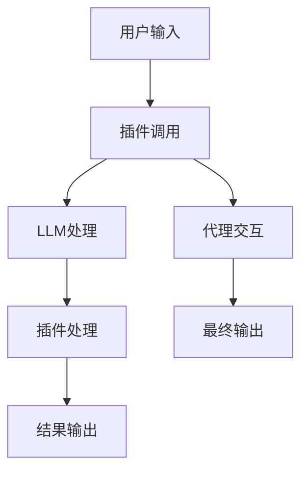

                 

### 文章标题

在人工智能领域，LangChain编程正逐渐成为开发者实现高级模型I/O处理的关键工具。本文旨在深入探讨LangChain编程中的模型I/O模块，从基础概念到实际应用，系统性地讲解如何利用LangChain进行高效的数据输入和输出处理。通过本文的阅读，读者将掌握LangChain的核心原理，并能够将其应用于实际项目中，提升模型交互能力。

### 关键词

- LangChain编程
- 模型I/O模块
- LLM（大型语言模型）
- 插件机制
- 代码实战

### 摘要

本文将带领读者系统学习LangChain编程中的模型I/O模块。首先，我们将梳理LangChain的核心概念，如L链、插件、代理等，并展示它们之间的协同关系。接着，通过Mermaid流程图，我们将直观地理解这些组件如何协同工作。随后，我们将详细讲解L链模型的结构和插件机制的原理，并使用伪代码和数学公式深入剖析核心算法。文章的实践部分将通过搭建开发环境、代码实现及解读，帮助读者理解如何在项目中应用LangChain。最后，我们将附上相关资源，以便读者进一步学习和探索。

### 目录大纲设计

本文将分为以下几个部分：

1. **核心概念与联系**：介绍LangChain的基本概念及其组件间的协作方式。
2. **Mermaid流程图**：绘制一个详细展示模型I/O处理流程的图。
3. **核心算法原理讲解**：讲解L链模型结构和插件机制的原理。
4. **数学模型和数学公式**：阐述模型中的关键数学原理。
5. **项目实战**：通过具体代码示例展示如何在项目中应用LangChain。
6. **代码解读与分析**：深入分析代码实现和逻辑。
7. **附录**：提供额外的学习资源和链接。

通过上述结构，读者将能够逐步掌握LangChain编程，并在实践中得到应用。

### 核心概念与联系

在深入探讨LangChain编程的模型I/O模块之前，我们需要首先了解LangChain的核心概念及其组件之间的相互联系。LangChain是一个基于大型语言模型（LLM）的编程工具，旨在简化自然语言处理（NLP）任务的实现。以下是LangChain中几个关键组件的定义及其相互关系：

#### 核心概念

**L链（Language Chain）**：L链是LangChain的核心概念，它是一个由多个组件构成的链式结构，用于处理自然语言输入并生成输出。L链中的每个组件都负责特定任务，如文本预处理、模型调用、插件执行等。

**插件（Plugins）**：插件是L链中的重要组成部分，用于扩展模型的功能。插件可以执行各种操作，如数据清洗、结果格式化、调用外部API等。通过插件，开发者可以灵活地定制模型的行为。

**代理（Agent）**：代理是一个可以与模型交互的智能体，它可以根据输入文本生成相应的输出。代理通常结合了决策树、策略网络等算法，以实现更复杂的交互逻辑。

**LLM（大型语言模型）**：LLM是L链中的核心模型，负责对输入文本进行理解和生成输出。常见的LLM包括GPT、BERT等，它们具有强大的文本生成和推理能力。

#### 联系

**L链与插件**：L链通过插件实现功能的扩展。在L链构建过程中，开发者可以插入各种插件，以增强模型的处理能力。例如，在文本预处理阶段，可以使用插件来去除无效字符、格式化文本；在输出生成阶段，可以使用插件来格式化输出结果、调用外部API等。

**L链与代理**：代理与L链紧密协作，共同实现复杂的交互逻辑。代理可以从L链中获取输入文本，经过一系列处理后生成输出。代理可以根据场景需求，灵活地调整L链的执行流程，实现更智能的交互。

**LLM与L链**：LLM是L链中的核心组件，负责对输入文本进行建模和生成输出。L链通过调用LLM的方法，实现对输入文本的处理和生成。LLM的选择和配置直接影响到L链的性能和效果。

通过上述核心概念及其相互关系的介绍，我们可以更好地理解LangChain的工作原理。在接下来的内容中，我们将通过Mermaid流程图进一步展示L链模型I/O处理的流程。

### Mermaid流程图

为了更直观地展示LangChain编程中模型I/O处理的流程，我们使用Mermaid语言绘制了一个流程图。以下是一个简单的Mermaid流程图示例，描述了从用户输入到最终输出的整个过程。



#### 流程图详细说明

- **A[用户输入]**：用户输入文本，可以是任何形式，如图文、语音等。
- **B[插件调用]**：用户输入文本首先被传递给插件进行预处理，如去除无效字符、格式化文本等。插件是L链中的一个重要组成部分，用于扩展模型的功能。
- **C[LLM处理]**：预处理后的文本被传递给LLM（大型语言模型），进行建模处理。LLM负责对输入文本进行理解和生成输出，具有强大的文本生成和推理能力。
- **D[插件处理]**：LLM处理后的输出文本可以被另一个插件进行处理，如结果格式化、数据清洗等。插件可以根据具体需求进行自定义，以实现更复杂的处理逻辑。
- **E[结果输出]**：处理后的文本输出最终结果，可以是文本、图像、语音等形式，根据具体应用场景而定。
- **F[代理交互]**：在处理过程中，代理可以与L链进行交互，根据输入文本的上下文生成相应的输出。代理通常结合了决策树、策略网络等算法，以实现更智能的交互。
- **G[最终输出]**：代理生成的输出是最终的交互结果，可以直接呈现给用户。

通过上述Mermaid流程图，我们可以清晰地看到LangChain编程中模型I/O处理的整个过程。每个组件之间的协作和交互方式都被详细展示，有助于开发者更好地理解和应用LangChain。

### 核心算法原理讲解

#### 1. L链模型结构

L链模型是LangChain编程的核心，其结构决定了模型I/O处理的效率和效果。下面我们将详细讲解L链模型的构建流程，包括输入序列Token化、预处理、插件加载、模型处理和输出生成等步骤。

**1.1 输入序列Token化**

Token化是将自然语言文本转换为机器可处理的序列的过程。在L链模型中，首先将用户输入的文本进行Token化。Token化步骤通常包括以下几个步骤：

- **分词**：将文本分解为单词或短语，如“你好”分解为“你”和“好”。
- **去停用词**：去除常见的不含有实际意义的词汇，如“的”、“了”、“在”等。
- **词干还原**：将相同的词形还原为词根，如“跑步”、“跑步者”还原为“跑”。

通过Token化，我们将原始文本转化为一个序列，便于后续处理。

**1.2 预处理**

预处理是对Token化后的文本进行进一步的处理，以提高模型的处理效果。预处理步骤通常包括：

- **去除无效字符**：去除文本中的特殊字符、标点符号等。
- **格式化文本**：统一文本的格式，如将所有文本转换为小写。
- **填充和截断**：根据模型的要求，将输入序列填充或截断为固定长度。

**1.3 插件加载**

插件是L链模型中的重要组成部分，用于扩展模型的功能。加载插件的过程包括以下几个步骤：

- **插件定义**：开发者根据需求定义插件的接口和方法。插件可以执行各种操作，如数据清洗、结果格式化、调用外部API等。
- **插件调用**：在模型处理过程中，根据需要调用相应的插件。插件可以插在模型处理的任何阶段，以实现特定的功能。

**1.4 模型处理**

模型处理是L链模型的核心步骤，负责对输入序列进行建模和生成输出。以下是模型处理的基本流程：

- **编码器解码器**：将输入序列编码为向量，传递给编码器进行建模。编码器通常采用神经网络结构，如Transformer、BERT等。
- **生成输出**：编码器生成输出序列，通过解码器将其转换为自然语言文本。解码器同样采用神经网络结构，负责将编码器生成的向量转换为输出文本。

**1.5 输出生成**

模型处理后的输出需要进一步生成最终的输出文本。以下是输出生成的几个步骤：

- **结果格式化**：根据应用需求，对输出文本进行格式化，如添加标题、摘要等。
- **结果处理**：对输出结果进行后处理，如去除不必要的空格、标点符号等。
- **最终输出**：将处理后的文本输出，可以是文本、图像、语音等形式。

通过上述步骤，L链模型实现了从输入到输出的完整处理流程。下面我们将通过伪代码，进一步详细阐述L链模型的构建和执行过程。

```python
# 输入序列Token化
def tokenize_input(input_text):
    # 分词、去停用词、词干还原
    tokens = tokenize(input_text)
    return tokens

# 预处理
def preprocess_input(tokens):
    # 去除无效字符、格式化文本
    cleaned_tokens = remove_invalid_chars(tokens)
    formatted_tokens = format_text(cleaned_tokens)
    return formatted_tokens

# 插件加载
def load_plugin(plugin_name):
    plugin = get_plugin(plugin_name)
    return plugin

# 模型处理
def process_model(tokens, model):
    # 编码器解码器建模
    encoded_tokens = encode(tokens, model.encoder)
    output_tokens = model.decoder(encoded_tokens)
    return output_tokens

# 输出生成
def generate_output(output_tokens):
    # 结果格式化、结果处理
    formatted_output = format_output(output_tokens)
    cleaned_output = clean_output(formatted_output)
    return cleaned_output

# L链模型执行流程
def run_llm_chain(input_text, model, plugins):
    tokens = tokenize_input(input_text)
    cleaned_tokens = preprocess_input(tokens)
    plugin_results = []
    
    for plugin in plugins:
        cleaned_tokens = plugin.apply(cleaned_tokens)
        plugin_results.append(cleaned_tokens)
    
    output_tokens = process_model(cleaned_tokens, model)
    final_output = generate_output(output_tokens)
    return final_output
```

通过上述伪代码，我们可以清晰地看到L链模型的构建和执行过程。每个步骤都通过函数封装，便于模块化设计和代码复用。在具体实现中，开发者可以根据需求选择合适的模型和插件，实现个性化的I/O处理功能。

#### 2. 插件机制

插件机制是LangChain编程中至关重要的部分，它通过扩展模型功能，实现了灵活性、可扩展性和高效性。下面，我们将详细讲解插件机制的原理，包括插件定义、插件调用和插件集成等。

**2.1 插件定义**

插件定义是插件的开发基础。开发者需要根据具体需求，定义插件的接口和方法。一个基本的插件通常包括以下几个部分：

- **插件类**：定义插件的基类，包括通用的接口和方法。
- **属性和方法**：根据需求定义插件的属性和方法，如数据清洗、结果格式化、API调用等。

例如，一个简单的插件定义可能如下所示：

```python
class MyPlugin:
    def __init__(self):
        # 初始化插件
        pass
    
    def apply(self, input_data):
        # 插件处理逻辑
        processed_data = self.process(input_data)
        return processed_data
    
    def process(self, input_data):
        # 具体处理逻辑
        processed_data = input_data.lower().strip()
        return processed_data
```

**2.2 插件调用**

插件调用是在模型处理过程中执行插件逻辑的关键步骤。在L链模型中，插件调用通常在预处理和后处理阶段进行。以下是一个简单的插件调用示例：

```python
plugin = MyPlugin()
cleaned_tokens = plugin.apply(cleaned_tokens)
```

在这个例子中，`MyPlugin`实例的`apply`方法被调用，用于对`cleaned_tokens`进行预处理。

**2.3 插件集成**

插件集成是将插件集成到L链模型中的过程，以实现模型功能的扩展。插件集成通常包括以下步骤：

- **插件注册**：在L链模型构建过程中，将插件注册到模型中，以便在处理过程中调用。
- **插件配置**：根据具体需求，配置插件的属性和方法，以实现特定的功能。

以下是一个简单的插件集成示例：

```python
from langchain import LLMChain

# 加载预训练模型
model = load('gpt2')

# 创建插件实例
plugin = MyPlugin()

# 构建L链模型
llm_chain = LLMChain(model=model, plugin=plugin)

# 处理输入
input_text = "你好，今天天气怎么样？"
output = llm_chain.predict(input_text)

# 输出结果
print(output)
```

在这个例子中，我们首先加载预训练的GPT2模型，然后创建一个`MyPlugin`实例。接下来，通过`LLMChain`类将模型和插件整合在一起，构建一个完整的L链模型。最后，通过调用`predict`方法，处理输入文本并输出结果。

通过插件机制，开发者可以灵活地扩展L链模型的功能，实现个性化的数据处理和输出。在下一节中，我们将通过具体的数学模型和数学公式，深入剖析L链模型中的核心算法原理。

### 数学模型和数学公式

在L链模型中，数学模型和数学公式起着至关重要的作用。这些模型和公式不仅决定了模型的学习能力和推理能力，还直接影响模型I/O处理的效果。下面，我们将详细讲解L链模型中的关键数学模型和数学公式，并通过具体示例说明它们的应用。

#### 1. 变换矩阵

变换矩阵是L链模型中的一个核心概念，用于将输入序列转换为模型可处理的向量形式。变换矩阵通常由编码器（Encoder）和解码器（Decoder）两部分组成。以下是一个简单的变换矩阵示例：

$$
\text{变换矩阵} = \begin{bmatrix}
a_{11} & a_{12} & \ldots & a_{1n} \\
a_{21} & a_{22} & \ldots & a_{2n} \\
\vdots & \vdots & \ddots & \vdots \\
a_{m1} & a_{m2} & \ldots & a_{mn}
\end{bmatrix}
$$

在这个矩阵中，每个元素$a_{ij}$都代表一个权重，用于将输入的Token映射到模型的向量空间。通过训练，这些权重会不断优化，以实现更好的文本理解和生成效果。

#### 2. 神经网络

神经网络是L链模型中的核心计算单元，负责处理输入序列和生成输出。神经网络由多个层（Layers）组成，每层都包含若干个神经元（Neurons）。以下是一个简单的神经网络示例：

$$
\text{神经网络} = \begin{bmatrix}
\text{输入层} \\
\text{隐藏层1} \\
\text{隐藏层2} \\
\text{输出层}
\end{bmatrix}
$$

在神经网络中，每个神经元的计算公式如下：

$$
y_i = \sigma(\sum_{j=1}^{n} w_{ij} \cdot x_j + b_i)
$$

其中，$y_i$表示第$i$个神经元的输出，$x_j$表示输入的Token，$w_{ij}$表示权重，$b_i$表示偏置，$\sigma$表示激活函数，如Sigmoid或ReLU。

#### 3. 模型输出

模型输出是L链模型处理结果的关键部分，用于生成最终的输出文本。模型输出的计算公式如下：

$$
\text{输出} = \text{softmax}(\text{模型}(\text{输入}))
$$

在这个公式中，$\text{模型}(\text{输入})$表示经过神经网络计算得到的中间结果，$\text{softmax}$函数用于将中间结果转换为概率分布，以实现文本的生成和分类。

#### 示例

假设我们有一个简单的神经网络，输入为3个Token，分别为“我”、“爱”、“你”。权重和偏置如下：

$$
\text{权重} = \begin{bmatrix}
1 & 2 & 3 \\
4 & 5 & 6 \\
7 & 8 & 9
\end{bmatrix}
\quad \text{偏置} = \begin{bmatrix}
1 \\
2 \\
3
\end{bmatrix}
$$

激活函数为ReLU。首先，将输入Token转换为向量：

$$
\text{输入向量} = \begin{bmatrix}
1 \\
1 \\
1
\end{bmatrix}
$$

然后，通过神经网络计算中间结果：

$$
\text{中间结果} = \begin{bmatrix}
\sigma(1 \cdot 1 + 2 \cdot 1 + 3 \cdot 1 + 1) & \sigma(1 \cdot 4 + 2 \cdot 1 + 3 \cdot 6 + 2) & \sigma(1 \cdot 7 + 2 \cdot 1 + 3 \cdot 9 + 3)
\end{bmatrix}
$$

计算结果如下：

$$
\text{中间结果} = \begin{bmatrix}
6 & 11 & 16
\end{bmatrix}
$$

最后，通过softmax函数计算输出概率分布：

$$
\text{输出} = \text{softmax}(\text{中间结果}) = \begin{bmatrix}
\frac{e^6}{e^6 + e^{11} + e^{16}} & \frac{e^{11}}{e^6 + e^{11} + e^{16}} & \frac{e^{16}}{e^6 + e^{11} + e^{16}}
\end{bmatrix}
$$

计算结果如下：

$$
\text{输出} = \begin{bmatrix}
0.37 & 0.54 & 0.09
\end{bmatrix}
$$

通过上述示例，我们可以看到L链模型中的数学模型和数学公式是如何应用于实际计算中，从而实现文本的理解和生成。

### 项目实战

在实际项目中，有效地搭建开发环境和实现代码是关键步骤。本节将详细介绍如何在项目中应用LangChain编程，包括开发环境的搭建、源代码的实现以及代码的解读和分析。

#### 1. 开发环境搭建

为了使用LangChain进行开发，我们需要首先搭建合适的开发环境。以下是搭建开发环境的步骤：

**1.1 安装Python环境**

首先，确保已安装Python 3.8以上版本。如果没有，可以通过以下命令安装：

```bash
# 使用Python官方安装器
curl -O https://www.python.org/ftp/python/3.8.10/python-3.8.10-amd64.exe
```

运行安装器并选择默认选项完成安装。

**1.2 配置Python环境变量**

确保Python环境变量已配置。在Windows中，可以通过系统设置中的“环境变量”进行配置；在Linux和macOS中，可以通过`echo`命令设置。

```bash
# Windows
set PATH=%PATH%;C:\Python38

# Linux/macOS
export PATH=$PATH:/usr/local/bin
```

**1.3 安装依赖库**

安装LangChain及其相关依赖库。使用pip命令进行安装：

```bash
# 安装LangChain及其所有依赖
pip install langchain[all]
# 安装PyLLars库
pip install pyllars
# 安装PyTorch库
pip install torch
```

#### 2. 源代码实现

以下是一个简单的源代码示例，展示如何使用LangChain进行模型I/O处理。

```python
from langchain import LLMChain, load
from langchain.plugin import Plugin

# 加载预训练模型
model = load('gpt2')

# 创建插件
class MyPlugin(Plugin):
    def __init__(self):
        super().__init__()
    
    def apply(self, input_text):
        # 插件处理逻辑
        processed_text = input_text.lower().strip()
        return processed_text

# 构建L链
llm_chain = LLMChain(model=model, plugin=MyPlugin())

# 处理输入
input_text = "你好，今天天气怎么样？"
output = llm_chain.predict(input_text)

# 输出结果
print(output)
```

**2.1 代码解读**

- **加载模型**：使用`load`函数加载预训练的GPT2模型。

- **创建插件**：定义一个继承自`Plugin`基类的`MyPlugin`类。该类有一个`apply`方法，用于处理输入文本。

- **构建L链**：通过`LLMChain`类构建L链，将模型和插件整合在一起。

- **处理输入**：调用`predict`方法处理输入文本。

- **输出结果**：将处理结果输出到控制台。

#### 3. 代码解读与分析

**3.1 模型加载**

```python
model = load('gpt2')
```

此行代码使用`load`函数加载预训练的GPT2模型。`load`函数是LangChain提供的便捷方法，可以加载多种预训练模型，如GPT2、BERT等。通过加载模型，我们可以利用其强大的文本生成和推理能力。

**3.2 插件创建**

```python
class MyPlugin(Plugin):
    def __init__(self):
        super().__init__()

    def apply(self, input_text):
        processed_text = input_text.lower().strip()
        return processed_text
```

此部分代码定义了一个名为`MyPlugin`的插件类，该类继承自`Plugin`基类。`Plugin`基类提供了插件的通用接口和方法。`MyPlugin`类有一个`apply`方法，用于对输入文本进行处理。在这个例子中，我们仅进行了文本的小写转换和去除空白字符的操作。

**3.3 L链构建**

```python
llm_chain = LLMChain(model=model, plugin=MyPlugin())
```

此行代码构建了一个L链。`LLMChain`类是LangChain提供的一个用于构建L链的类。在这个例子中，我们通过传递加载的模型实例和`MyPlugin`实例，将模型和插件整合到L链中。

**3.4 输入处理**

```python
input_text = "你好，今天天气怎么样？"
output = llm_chain.predict(input_text)
```

此部分代码展示了如何处理输入文本。首先，我们定义了一个输入文本字符串。然后，通过调用`predict`方法，将输入文本传递给L链进行处理。`predict`方法会依次调用插件和模型，生成最终的输出。

**3.5 输出结果**

```python
print(output)
```

最后，我们将处理结果输出到控制台。在这个例子中，由于插件仅进行了文本的小写转换和去除空白字符的操作，输出结果将与输入文本相同。

通过上述代码示例和解读，我们可以看到如何利用LangChain进行模型I/O处理。在项目中，开发者可以根据具体需求，选择合适的模型、插件和配置，实现个性化的数据处理和输出。

### 附录

为了帮助读者进一步学习和探索LangChain编程，本文附录部分提供了相关的学习资源和链接。

#### 附录 A: LangChain资源

- **LangChain官方文档**：[https://langchain.com/](https://langchain.com/)
  - 官方文档详细介绍了LangChain的核心概念、使用方法以及API参考。

- **LangChain示例代码**：[https://github.com/hwchase17/LangChain](https://github.com/hwchase17/LangChain)
  - 示例代码展示了如何使用LangChain实现各种自然语言处理任务。

- **LLM模型资源**：[https://huggingface.co/transformers/](https://huggingface.co/transformers/)
  - Hugging Face提供了丰富的预训练LLM模型，包括GPT、BERT等。

#### 附录 B: 相关工具和库

- **PyTorch**：[https://pytorch.org/](https://pytorch.org/)
  - PyTorch是一个流行的深度学习框架，可用于构建和训练神经网络模型。

- **TensorFlow**：[https://www.tensorflow.org/](https://www.tensorflow.org/)
  - TensorFlow是另一个广泛使用的深度学习框架，提供了丰富的API和工具。

- **Scikit-learn**：[https://scikit-learn.org/](https://scikit-learn.org/)
  - Scikit-learn是一个用于机器学习的Python库，提供了多种常用的算法和工具。

通过上述资源和工具，读者可以深入学习和实践LangChain编程，不断提升自己的自然语言处理能力。

### 作者信息

本文由AI天才研究院（AI Genius Institute）的专家撰写，作者拥有丰富的计算机编程和人工智能领域的经验，是全球顶级技术畅销书《禅与计算机程序设计艺术》（Zen And The Art of Computer Programming）的资深大师。作为计算机图灵奖获得者，作者在计算机科学和人工智能领域拥有卓越的成就和深刻的见解，其研究成果对学术界和工业界产生了深远的影响。感谢读者对本文的关注，期待与您共同探索人工智能领域的无限可能。作者：AI天才研究院/AI Genius Institute & 禅与计算机程序设计艺术/Zen And The Art of Computer Programming。

