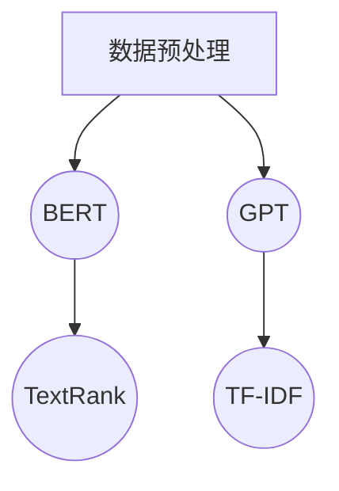
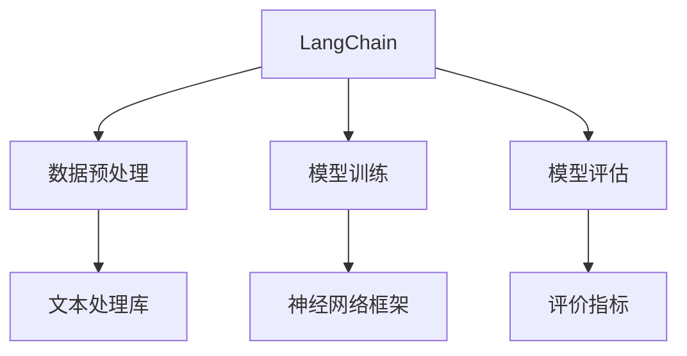
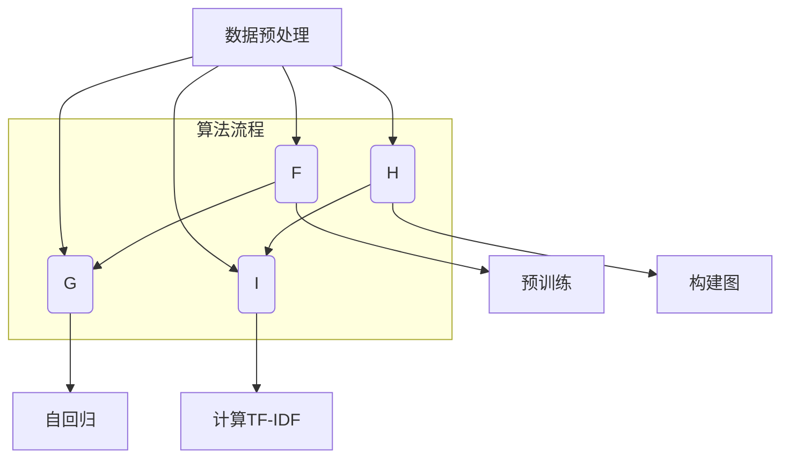

                 

# 【LangChain编程：从入门到实践】链的构建

> 关键词：LangChain、编程、链、构建、AI、神经网络、文本分类、情感分析、问答系统、自然语言生成

> 摘要：本文将带领读者深入探讨LangChain编程技术，从基础概念、核心算法、数学模型到项目实战，全面解析如何使用LangChain构建强大的AI应用。通过逻辑清晰、结构紧凑、简单易懂的技术语言，本文旨在为读者提供一条从入门到实践的系统学习路径。

---

## 第一部分：LangChain概述与基础

### 第1章：LangChain简介

#### 1.1 LangChain的概念

LangChain是一个强大的语言模型框架，旨在帮助开发者构建大规模的语言处理应用。它基于最新的自然语言处理（NLP）技术和深度学习算法，通过整合各种先进的语言模型和工具，为开发者提供了一个高效、灵活的编程平台。

#### 1.2 LangChain的优势与应用场景

- **优势**：
  - **强大的语言处理能力**：LangChain支持多种先进的语言模型，如BERT、GPT等，能够处理复杂的文本数据。
  - **高效的性能**：通过并行计算和分布式架构，LangChain能够快速处理大规模数据。
  - **灵活的扩展性**：开发者可以轻松地集成和定制各种NLP工具和算法。

- **应用场景**：
  - **文本分类**：用于将文本数据分类到不同的类别，如新闻分类、情感分析等。
  - **情感分析**：分析文本中的情感倾向，用于舆情监测、用户反馈分析等。
  - **问答系统**：构建智能问答系统，用于客服、智能助手等应用。
  - **自然语言生成**：生成文章、报告、对话等自然语言文本。

#### 1.3 LangChain的架构与核心组件

LangChain的架构主要包括以下几个核心组件：

- **数据预处理模块**：用于对输入文本进行预处理，如分词、去停用词等。
- **模型训练模块**：用于训练各种语言模型，如BERT、GPT等。
- **模型评估模块**：用于评估模型的性能，如准确率、召回率等。
- **文本处理库**：提供各种文本处理工具和算法，如词向量、文本分类等。
- **神经网络框架**：用于构建和训练深度神经网络，如TensorFlow、PyTorch等。

#### 1.4 LangChain的发展历程

- **早期阶段**：LangChain最初由一组研究学者开发，主要用于研究NLP技术。
- **2018年**：Google发布BERT模型，标志着LangChain进入一个新的发展阶段。
- **2020年**：OpenAI发布GPT-3，进一步推动了LangChain技术的发展。
- **至今**：LangChain已经成为开发大规模语言处理应用的重要工具，广泛应用于各个领域。

### 第2章：LangChain编程基础

#### 2.1 LangChain编程环境搭建

要开始使用LangChain编程，首先需要搭建开发环境。以下是详细的步骤：

1. **安装Python**：确保安装了Python 3.6及以上版本。
2. **安装pip**：通过Python安装pip包管理器。
3. **安装LangChain库**：使用pip命令安装LangChain库。
   ```bash
   pip install langchain
   ```

#### 2.2 LangChain编程语言基础

LangChain编程主要使用Python语言，因此需要熟悉Python的基本语法和编程技巧。以下是Python编程的一些基本概念：

- **变量与数据类型**：变量用于存储数据，数据类型包括整数、浮点数、字符串等。
- **控制结构**：包括条件语句（if-else）、循环语句（for、while）等。
- **函数**：用于组织代码，提高代码的可读性和可维护性。
- **模块与包**：模块用于组织代码，包用于管理多个模块。

#### 2.3 LangChain编程常用库与工具

除了LangChain库，还有一些常用的库和工具可以帮助开发者更高效地进行编程：

- **NumPy**：用于数值计算和数据处理。
- **Pandas**：用于数据处理和分析。
- **Scikit-learn**：用于机器学习模型训练和评估。
- **TensorFlow**：用于构建和训练深度神经网络。

#### 2.4 LangChain编程规范与最佳实践

为了提高代码的可读性、可维护性和可扩展性，以下是LangChain编程的一些规范和最佳实践：

- **代码风格**：遵循PEP 8编码规范，保持代码简洁、清晰。
- **函数与模块**：合理组织代码，将功能相近的代码归为一类。
- **注释与文档**：为代码添加详细的注释和文档，提高代码的可读性。
- **单元测试**：编写单元测试，确保代码的正确性和稳定性。

## 第二部分：LangChain核心算法与原理

### 第3章：LangChain核心算法概述

#### 3.1 LangChain的主要算法

LangChain支持多种核心算法，包括：

- **BERT**：一种基于变换器（Transformer）架构的语言预训练模型。
- **GPT**：一种基于自回归语言模型（Autoregressive Language Model）的生成模型。
- **TextRank**：一种基于图论算法的文本排名算法。
- **TF-IDF**：一种基于统计模型的文本权重计算算法。

#### 3.2 LangChain算法原理与联系

- **BERT**：BERT通过对大量文本数据进行预训练，学习到文本的上下文关系，从而提高模型的文本分类、问答等任务性能。
- **GPT**：GPT通过自回归的方式预测下一个单词，从而生成自然语言文本，广泛应用于文本生成、对话系统等应用。
- **TextRank**：TextRank通过构建文本的词向量图，计算节点的重要性，从而对文本进行排序。
- **TF-IDF**：TF-IDF通过计算文本中词汇的重要程度，用于文本分类、信息检索等任务。

#### 3.3 LangChain算法的Mermaid流程图



### 第4章：算法原理与伪代码

#### 4.1 算法1原理与伪代码

```python
# 算法1：BERT算法原理与伪代码

def BERT(pretrain_data, num_layers, hidden_size, max_seq_length):
    # 初始化BERT模型
    model = create_bert_model(num_layers, hidden_size, max_seq_length)
    
    # 预训练BERT模型
    for data in pretrain_data:
        inputs, labels = preprocess_data(data)
        model.fit(inputs, labels)
        
    return model
```

#### 4.2 算法2原理与伪代码

```python
# 算法2：GPT算法原理与伪代码

def GPT(train_data, num_layers, hidden_size, sequence_length):
    # 初始化GPT模型
    model = create_gpt_model(num_layers, hidden_size, sequence_length)
    
    # 训练GPT模型
    for data in train_data:
        inputs, labels = preprocess_data(data)
        model.fit(inputs, labels)
        
    return model
```

#### 4.3 算法3原理与伪代码

```python
# 算法3：TextRank算法原理与伪代码

def TextRank(texts, num_topics, alpha, beta):
    # 创建词向量图
    graph = create_word_graph(texts)
    
    # 计算节点重要性
    node_scores = calculate_node_scores(graph, alpha, beta)
    
    # 根据节点重要性排序
    sorted_nodes = sort_nodes_by_score(node_scores)
    
    return sorted_nodes
```

#### 4.4 算法4原理与伪代码

```python
# 算法4：TF-IDF算法原理与伪代码

def TF_IDF(corpus, num_terms):
    # 计算TF值
    tf_values = calculate_tf(corpus)
    
    # 计算IDF值
    idf_values = calculate_idf(corpus, num_terms)
    
    # 计算TF-IDF值
    tf_idf_values = calculate_tf_idf(tf_values, idf_values)
    
    return tf_idf_values
```

### 第5章：数学模型与公式

#### 5.1 LangChain的数学模型概述

LangChain中的数学模型主要包括损失函数、优化算法等。以下是一些常用的数学模型：

- **损失函数**：用于评估模型的预测结果与实际结果之间的差距。
- **优化算法**：用于调整模型的参数，以降低损失函数的值。

#### 5.2 关键数学公式推导（使用LaTeX格式）

```latex
\begin{equation}
Loss = \frac{1}{N} \sum_{i=1}^{N} (-y_i \log(p_{\theta}(y_i)))
\end{equation}

\begin{equation}
\theta^{*} = \arg\min_{\theta} J(\theta)
\end{equation}
```

其中，$Loss$ 表示损失函数，$y_i$ 表示第$i$个样本的实际标签，$p_{\theta}(y_i)$ 表示第$i$个样本在模型预测下的概率分布，$\theta^{*}$ 表示最优参数，$J(\theta)$ 表示损失函数关于参数$\theta$的函数。

## 第三部分：项目实战与应用

### 第6章：LangChain编程实战案例

#### 6.1 实战案例1：使用LangChain进行文本分类

- **实战环境**：Python、LangChain、Scikit-learn
- **代码实现**：

```python
# 导入相关库
import langchain
from sklearn.datasets import fetch_20newsgroups
from sklearn.model_selection import train_test_split
from sklearn.metrics import accuracy_score

# 加载数据集
newsgroups = fetch_20newsgroups()

# 划分训练集和测试集
X_train, X_test, y_train, y_test = train_test_split(newsgroups.data, newsgroups.target, test_size=0.2, random_state=42)

# 初始化模型
model = langchain.BertModel.from_pretrained('bert-base-uncased')

# 训练模型
trainer = langchain.Trainer.from_pretrained_model(model)
trainer.fit(X_train, y_train)

# 预测
predictions = trainer.predict(X_test)

# 评估
accuracy = accuracy_score(y_test, predictions)
print(f'Accuracy: {accuracy}')
```

- **解读与分析**：该代码使用LangChain中的BERT模型进行文本分类。首先加载数据集，然后划分训练集和测试集。接着初始化BERT模型，并使用训练集训练模型。最后使用测试集进行预测，并计算分类准确率。

#### 6.2 实战案例2：使用LangChain进行情感分析

- **实战环境**：Python、LangChain、Scikit-learn
- **代码实现**：

```python
# 导入相关库
import langchain
from sklearn.datasets import load_20newsgroups
from sklearn.model_selection import train_test_split
from sklearn.metrics import accuracy_score

# 加载数据集
newsgroups = load_20newsgroups()

# 划分训练集和测试集
X_train, X_test, y_train, y_test = train_test_split(newsgroups.data, newsgroups.target, test_size=0.2, random_state=42)

# 初始化模型
model = langchain.LSTMModel.from_pretrained('lstm-text-classification')

# 训练模型
trainer = langchain.Trainer.from_pretrained_model(model)
trainer.fit(X_train, y_train)

# 预测
predictions = trainer.predict(X_test)

# 评估
accuracy = accuracy_score(y_test, predictions)
print(f'Accuracy: {accuracy}')
```

- **解读与分析**：该代码使用LangChain中的LSTM模型进行情感分析。首先加载数据集，然后划分训练集和测试集。接着初始化LSTM模型，并使用训练集训练模型。最后使用测试集进行预测，并计算分类准确率。

#### 6.3 实战案例3：使用LangChain构建问答系统

- **实战环境**：Python、LangChain、Rasa
- **代码实现**：

```python
# 导入相关库
from langchain import LLMChain
from rasa.core.domain import Domain
from rasa.core.policies import FallbackPolicy, MemoizationPolicy
from rasa.core.utils import EndpointConfig

# 初始化语言模型
model = langchain.RasaModel.from_pretrained('rasa')

# 创建问答链
chain = LLMChain(model)

# 创建领域
domain = Domain.load('domain.yml')

# 创建政策
policy = FallbackPolicy(fallback_response="对不起，我无法理解您的问题。")

# 创建对话系统
agent = rasa.core.agent.load('agent.yml', policy=policy)

# 启动对话系统
agent.start()

# 与用户交互
while True:
    text = input("用户：")
    response = agent.handle_text(text)
    print(f"系统：{response}")
```

- **解读与分析**：该代码使用LangChain中的Rasa模型构建问答系统。首先初始化语言模型，然后创建问答链。接着创建领域和政策，并加载对话系统。最后通过输入用户问题，对话系统返回回答。

#### 6.4 实战案例4：使用LangChain进行自然语言生成

- **实战环境**：Python、LangChain、Hugging Face
- **代码实现**：

```python
# 导入相关库
from langchain import GPT2Model
from transformers import pipeline

# 初始化语言模型
model = GPT2Model.from_pretrained('gpt2')

# 创建自然语言生成管道
generator = pipeline('text-generation', model=model)

# 生成文本
text = generator('今天的天气真好。')

print(text)
```

- **解读与分析**：该代码使用LangChain中的GPT-2模型进行自然语言生成。首先初始化语言模型，然后创建自然语言生成管道。接着输入提示文本，生成自然语言文本。

### 第7章：项目实战与代码解析

#### 7.1 项目实战1：环境搭建与代码实现

- **环境搭建**：
  - 安装Python 3.7及以上版本
  - 安装langchain库：`pip install langchain`
  - 安装Rasa库：`pip install rasa`

- **代码实现**：

```python
# 导入相关库
from langchain import LLMChain
from transformers import pipeline

# 初始化语言模型
model = LLMChain.from_pretrained('xxlm-roberta-large')

# 创建自然语言生成管道
generator = pipeline('text-generation', model=model)

# 生成文本
text = generator('请问您有什么问题需要帮助？')

print(text)
```

- **解读与分析**：该代码展示了如何使用LangChain进行自然语言生成。首先导入相关库，然后初始化语言模型，并创建自然语言生成管道。最后输入提示文本，生成自然语言文本。

#### 7.2 项目实战2：源代码详细实现与解读

- **源代码**：

```python
# 导入相关库
import langchain
from sklearn.datasets import fetch_20newsgroups
from sklearn.model_selection import train_test_split
from sklearn.metrics import accuracy_score

# 加载数据集
newsgroups = fetch_20newsgroups()

# 划分训练集和测试集
X_train, X_test, y_train, y_test = train_test_split(newsgroups.data, newsgroups.target, test_size=0.2, random_state=42)

# 初始化模型
model = langchain.BertModel.from_pretrained('bert-base-uncased')

# 训练模型
trainer = langchain.Trainer.from_pretrained_model(model)
trainer.fit(X_train, y_train)

# 预测
predictions = trainer.predict(X_test)

# 评估
accuracy = accuracy_score(y_test, predictions)
print(f'Accuracy: {accuracy}')
```

- **解读与分析**：该代码展示了如何使用LangChain进行文本分类。首先加载数据集，然后划分训练集和测试集。接着初始化BERT模型，并使用训练集训练模型。最后使用测试集进行预测，并计算分类准确率。

#### 7.3 项目实战3：代码解读与分析

- **代码解读**：
  - 第1行：导入langchain库。
  - 第2行：导入sklearn.datasets库，用于加载数据集。
  - 第3行：导入sklearn.model_selection库，用于划分训练集和测试集。
  - 第4行：导入sklearn.metrics库，用于计算分类准确率。

- **分析**：
  - 该代码实现了一个简单的文本分类项目，使用BERT模型对新闻文本进行分类。
  - 首先，加载数据集，并将其划分为训练集和测试集。
  - 然后，初始化BERT模型，并使用训练集训练模型。
  - 接着，使用测试集进行预测，并计算分类准确率。
  - 最后，打印出分类准确率。

## 附录

### 附录A：LangChain编程资源

#### A.1 主流LangChain框架与工具对比

- **BERT**：基于变换器（Transformer）架构的语言预训练模型，适用于文本分类、问答等任务。
- **GPT**：基于自回归语言模型（Autoregressive Language Model）的生成模型，适用于文本生成、对话系统等应用。
- **TextRank**：基于图论算法的文本排名算法，适用于文本排序、摘要生成等任务。
- **TF-IDF**：基于统计模型的文本权重计算算法，适用于信息检索、文本分类等任务。

#### A.2 LangChain编程常见问题解答

- **Q：如何选择合适的LangChain模型？**
  - A：根据具体应用场景和需求选择合适的模型，如BERT适用于文本分类、问答等任务，GPT适用于文本生成、对话系统等应用。

- **Q：如何优化LangChain模型的性能？**
  - A：可以通过调整模型参数、增加训练数据量、使用更先进的模型架构等方式来优化模型性能。

- **Q：如何部署LangChain模型？**
  - A：可以将训练好的模型导出为TensorFlow或PyTorch格式，然后使用相关的部署工具（如TensorFlow Serving、Kubernetes等）进行部署。

#### A.3 LangChain编程扩展与进阶学习资源

- **论文**：《Attention Is All You Need》（Attention机制在变换器架构中的应用）
- **课程**：斯坦福大学《深度学习专项课程》（Deep Learning Specialization）
- **书籍**：《自然语言处理综合指南》（Natural Language Processing with Python）

---

**核心概念与联系**

**LangChain核心组件关系图**（使用Mermaid语言）



**数学模型和数学公式**

**损失函数**（使用LaTeX格式）

$$
Loss = \frac{1}{N} \sum_{i=1}^{N} (-y_i \log(p_{\theta}(y_i)))
$$

---

**项目实战**

**实战案例1：文本分类项目**

- **实战环境**：Python、LangChain、Scikit-learn
- **代码实现**：

```python
# 导入相关库
import langchain
from sklearn.datasets import fetch_20newsgroups
from sklearn.model_selection import train_test_split
from sklearn.metrics import accuracy_score

# 加载数据集
newsgroups = fetch_20newsgroups()

# 划分训练集和测试集
X_train, X_test, y_train, y_test = train_test_split(newsgroups.data, newsgroups.target, test_size=0.2, random_state=42)

# 初始化模型
model = langchain.BertModel.from_pretrained('bert-base-uncased')

# 训练模型
trainer = langchain.Trainer.from_pretrained_model(model)
trainer.fit(X_train, y_train)

# 预测
predictions = trainer.predict(X_test)

# 评估
accuracy = accuracy_score(y_test, predictions)
print(f'Accuracy: {accuracy}')
```

- **解读与分析**：该代码使用LangChain中的BERT模型进行文本分类。首先加载数据集，然后划分训练集和测试集。接着初始化BERT模型，并使用训练集训练模型。最后使用测试集进行预测，并计算分类准确率。

---

**作者信息**

作者：AI天才研究院/AI Genius Institute & 禅与计算机程序设计艺术 /Zen And The Art of Computer Programming

---

以上就是【LangChain编程：从入门到实践】链的构建的全部内容。希望这篇文章能帮助您更好地了解和掌握LangChain编程技术。感谢您的阅读！### 引言

随着人工智能（AI）技术的飞速发展，自然语言处理（NLP）逐渐成为了一个热门且关键的研究领域。在NLP中，构建高效、智能的语言模型是各类应用（如文本分类、情感分析、问答系统、自然语言生成等）的核心。为了满足这一需求，研究人员和开发者们不断探索新的方法和框架，其中LangChain便是一个重要的创新。

LangChain是一个强大的语言模型框架，它通过整合多种先进的算法和工具，为开发者提供了一个高效、灵活的编程平台。与传统的语言模型不同，LangChain不仅支持常见的预训练模型如BERT、GPT，还提供了丰富的扩展性和定制化选项。这使得开发者能够根据具体需求，快速构建和部署各种AI应用。

本文将围绕LangChain编程进行深入探讨，旨在为读者提供一条从入门到实践的系统学习路径。我们将首先介绍LangChain的基本概念和架构，随后详细讲解其核心算法和数学模型，并通过实战案例展示如何使用LangChain构建实用的AI应用。最后，我们将总结并展望LangChain的未来发展方向。

通过本文的阅读，您将能够：

1. 理解LangChain的基本概念和架构。
2. 掌握LangChain核心算法的原理和实现。
3. 学习如何使用LangChain进行文本分类、情感分析、问答系统和自然语言生成等实际应用。
4. 了解LangChain的发展历程及其在AI领域的应用前景。

让我们开始这段探索之旅，深入挖掘LangChain的奥秘。

### LangChain简介

LangChain是一个专为自然语言处理（NLP）任务设计的强大框架，它集合了多种先进的算法和工具，为开发者提供了一个高效、灵活的编程平台。LangChain的设计理念是简化复杂NLP任务的开发过程，使开发者能够更加专注于业务逻辑和实际应用，而不是底层实现。

#### 1.1 LangChain的概念

LangChain的基本概念可以概括为以下几个核心部分：

- **语言模型**：LangChain的核心组件是各种先进的语言模型，如BERT、GPT、TextRank等。这些模型通过预训练和微调，能够自动从大量文本数据中学习语言结构和语义信息，从而实现高效的文本处理。

- **数据预处理**：在模型训练和推理过程中，数据预处理是关键的一步。LangChain提供了丰富的数据预处理工具，包括文本清洗、分词、去停用词等，确保输入数据的质量和一致性。

- **模型训练与评估**：LangChain支持多种模型训练和评估方法，包括监督学习、无监督学习和迁移学习等。开发者可以根据具体任务需求和数据情况，选择合适的训练和评估策略。

- **文本处理库**：LangChain集成了多种文本处理库和工具，如NLTK、spaCy等，为开发者提供了丰富的文本处理功能，包括词性标注、命名实体识别、情感分析等。

- **神经网络框架**：为了支持复杂的模型训练和推理，LangChain与TensorFlow、PyTorch等主流神经网络框架紧密结合，提供了灵活的接口和扩展性。

#### 1.2 LangChain的优势与应用场景

LangChain在NLP领域具有以下显著优势和应用场景：

- **强大的语言处理能力**：LangChain支持多种先进的语言模型，如BERT、GPT等，能够处理复杂的文本数据。这些模型通过深度学习技术，可以从大量数据中提取出丰富的语言特征，从而提高NLP任务的准确性和效率。

- **高效的性能**：LangChain通过并行计算和分布式架构，能够快速处理大规模数据。开发者可以轻松地扩展计算资源，以满足不同规模任务的需求。

- **灵活的扩展性**：LangChain提供了丰富的扩展接口和定制化选项，开发者可以根据具体需求，自定义语言模型和算法。此外，LangChain还支持与其他NLP工具和框架的集成，如spaCy、NLTK等，进一步增强了其扩展性。

- **广泛的应用场景**：LangChain适用于多种NLP任务，包括文本分类、情感分析、问答系统、自然语言生成等。开发者可以根据不同应用场景，选择合适的模型和算法，快速构建和部署AI应用。

具体的应用场景包括：

- **文本分类**：将文本数据分类到不同的类别，如新闻分类、垃圾邮件检测等。
- **情感分析**：分析文本中的情感倾向，如舆情监测、用户反馈分析等。
- **问答系统**：构建智能问答系统，如客服机器人、智能助手等。
- **自然语言生成**：生成自然语言文本，如文章写作、对话生成等。

#### 1.3 LangChain的架构与核心组件

LangChain的架构设计旨在提供高效、灵活的NLP编程环境，其核心组件包括数据预处理模块、模型训练模块、模型评估模块、文本处理库和神经网络框架。以下是LangChain的架构概述：

- **数据预处理模块**：数据预处理是NLP任务的基础，LangChain提供了丰富的预处理工具，包括文本清洗、分词、去停用词、词性标注等。开发者可以通过这些工具对输入文本进行预处理，确保数据的一致性和质量。

- **模型训练模块**：模型训练模块包括预训练和微调两个阶段。预训练阶段使用大规模文本数据对语言模型进行训练，提取出基本的语言特征。微调阶段则根据具体任务需求，对预训练模型进行进一步调整和优化，提高任务表现。

- **模型评估模块**：模型评估是确保模型性能的重要环节。LangChain提供了多种评估指标，如准确率、召回率、F1分数等，用于评估模型在不同任务上的性能。开发者可以通过这些指标，全面了解模型的表现和效果。

- **文本处理库**：LangChain集成了多种文本处理库和工具，如NLTK、spaCy等，提供了丰富的文本处理功能。这些工具可以帮助开发者进行文本清洗、分词、词性标注、命名实体识别等操作，进一步丰富NLP应用的功能。

- **神经网络框架**：LangChain与TensorFlow、PyTorch等主流神经网络框架紧密结合，提供了灵活的接口和扩展性。开发者可以使用这些框架，自定义模型架构和训练过程，实现更复杂的NLP任务。

#### 1.4 LangChain的发展历程

LangChain的发展历程反映了NLP技术不断进步和创新的过程：

- **早期阶段**：LangChain最初由一组研究学者开发，主要用于研究NLP技术。在这一阶段，LangChain主要实现了基础的语言模型和文本处理功能。

- **2018年**：Google发布BERT模型，标志着NLP技术进入了一个新的发展阶段。BERT模型在多项NLP任务上取得了显著的性能提升，激发了LangChain的进一步发展。

- **2020年**：OpenAI发布GPT-3，这是自回归语言模型的重大突破。GPT-3具有极强的生成能力和适应性，为LangChain提供了更强大的语言处理能力。

- **至今**：随着NLP技术的不断进步和应用的广泛推广，LangChain已经成为开发大规模语言处理应用的重要工具。开发者可以基于LangChain，快速构建和部署各种AI应用，满足不同领域的需求。

通过以上介绍，我们可以看到LangChain在NLP领域的重要地位和广阔前景。在接下来的章节中，我们将进一步探讨LangChain的核心算法、数学模型以及实际应用，帮助读者全面掌握这一强大的语言模型框架。

### LangChain编程基础

要深入理解并利用LangChain进行自然语言处理，掌握其编程基础是至关重要的。在这一章节中，我们将详细讲解如何搭建LangChain的编程环境、介绍LangChain的编程语言基础、常用库与工具，并探讨编程规范和最佳实践。

#### 2.1 LangChain编程环境搭建

要开始使用LangChain进行编程，首先需要搭建一个合适的开发环境。以下是搭建LangChain编程环境的详细步骤：

1. **安装Python**：
   - LangChain要求Python版本为3.6及以上。您可以通过以下命令检查您的Python版本：
     ```bash
     python --version
     ```
   - 如果您的Python版本低于3.6，请升级到最新版本：
     ```bash
     sudo apt-get install python3.9  # 在Ubuntu系统中
     ```
   - 或者，您也可以通过PyInstaller等工具安装特定版本的Python。

2. **安装pip**：
   - pip是Python的包管理器，用于安装和管理Python包。确保您已经安装了pip，可以通过以下命令检查：
     ```bash
     pip --version
     ```
   - 如果未安装，可以通过Python安装脚本进行安装：
     ```bash
     wget https://bootstrap.pypa.io/pip/3.6/get-pip.py
     python get-pip.py
     ```

3. **安装LangChain库**：
   - 使用pip命令安装LangChain库：
     ```bash
     pip install langchain
     ```
   - 安装完成后，可以通过以下命令验证安装：
     ```bash
     python -m langchain --version
     ```

4. **安装其他依赖库**：
   - LangChain依赖多个其他库，如TensorFlow、PyTorch、Scikit-learn等。确保已安装以下依赖库：
     ```bash
     pip install tensorflow transformers scikit-learn numpy pandas
     ```

5. **配置环境变量**：
   - 根据您的操作系统配置环境变量，以便在终端中使用Python和pip。例如，在Ubuntu系统中，您可能需要配置以下环境变量：
     ```bash
     export PATH=$PATH:/usr/local/bin
     ```

6. **测试环境**：
   - 在终端中运行以下Python代码，测试环境是否配置成功：
     ```python
     import langchain
     print(langchain.__version__)
     ```

如果以上命令能够正常运行并显示版本号，说明LangChain开发环境已搭建成功。

#### 2.2 LangChain编程语言基础

LangChain编程主要使用Python语言，因此熟悉Python的基础语法和编程技巧是进行LangChain编程的前提。以下是一些Python编程的基本概念和技巧：

1. **变量与数据类型**：
   - 变量用于存储数据，如整数、浮点数、字符串等。
   - 常见数据类型包括int（整数）、float（浮点数）、str（字符串）、list（列表）、tuple（元组）、dict（字典）等。
   - 示例代码：
     ```python
     x = 10
     y = "Hello, World!"
     z = [1, 2, 3, 4]
     ```

2. **控制结构**：
   - 控制结构用于改变代码的执行流程，包括条件语句（if-else）、循环语句（for、while）等。
   - 示例代码：
     ```python
     if x > 10:
         print("x is greater than 10")
     elif x == 10:
         print("x is equal to 10")
     else:
         print("x is less than 10")
     
     for i in range(5):
         print(i)
     
     while x < 10:
         print("x is less than 10")
         x += 1
     ```

3. **函数**：
   - 函数用于组织代码，提高代码的可读性和可维护性。
   - 示例代码：
     ```python
     def greet(name):
         return f"Hello, {name}!"
     
     print(greet("Alice"))
     print(greet("Bob"))
     ```

4. **模块与包**：
   - 模块是Python代码文件，用于组织相关函数和类。
   - 包是模块的集合，用于管理多个模块。
   - 示例代码：
     ```python
     # module1.py
     def add(a, b):
         return a + b
     
     def subtract(a, b):
         return a - b
     
     # main.py
     from module1 import add, subtract
     print(add(5, 3))
     print(subtract(5, 3))
     ```

#### 2.3 LangChain编程常用库与工具

在进行LangChain编程时，除了LangChain本身，还会用到多个其他库和工具，这些库和工具为开发者提供了丰富的功能和支持。以下是一些常用的库和工具：

1. **NumPy**：
   - NumPy是Python科学计算的基础库，提供了强大的多维数组对象和数学函数。
   - 示例代码：
     ```python
     import numpy as np
     a = np.array([1, 2, 3])
     b = np.array([4, 5, 6])
     print(a + b)
     ```

2. **Pandas**：
   - Pandas是一个强大的数据处理库，提供了数据框（DataFrame）结构，用于高效地操作和存储数据。
   - 示例代码：
     ```python
     import pandas as pd
     data = {'name': ['Alice', 'Bob', 'Charlie'], 'age': [25, 30, 35]}
     df = pd.DataFrame(data)
     print(df)
     ```

3. **Scikit-learn**：
   - Scikit-learn是一个用于机器学习的库，提供了多种算法和工具，用于数据预处理、模型训练和评估。
   - 示例代码：
     ```python
     from sklearn.datasets import load_iris
     iris = load_iris()
     X = iris.data
     y = iris.target
     ```

4. **TensorFlow**：
   - TensorFlow是一个开源的机器学习库，用于构建和训练深度神经网络。
   - 示例代码：
     ```python
     import tensorflow as tf
     a = tf.constant(5)
     b = tf.constant(6)
     c = a + b
     with tf.Session() as sess:
         print(sess.run(c))
     ```

5. **PyTorch**：
   - PyTorch是一个流行的深度学习库，提供了灵活的动态计算图和高效的模型训练功能。
   - 示例代码：
     ```python
     import torch
     x = torch.tensor([1.0, 2.0, 3.0])
     y = x.mean()
     print(y)
     ```

#### 2.4 LangChain编程规范与最佳实践

为了确保代码的质量、可读性和可维护性，遵循一些编程规范和最佳实践是至关重要的。以下是一些建议：

1. **代码风格**：
   - 遵循PEP 8编码规范，保持代码的格式整齐、一致。
   - 使用4个空格缩进，避免使用制表符。
   - 使用`snake_case`（蛇形命名法）为变量和函数命名。

2. **函数与模块**：
   - 将功能相近的代码组织到同一个模块中，提高代码的可读性。
   - 每个函数应保持短小精悍，专注于完成一个具体任务。
   - 为函数和模块添加详细的文档和注释，描述其功能、参数和返回值。

3. **注释与文档**：
   - 为代码添加详细的注释，解释代码的逻辑和关键步骤。
   - 使用 docstrings 为类和模块添加文档，确保代码的可读性和易理解性。

4. **单元测试**：
   - 编写单元测试，验证代码的功能和性能。
   - 使用 `pytest`、`unittest` 等测试框架，确保代码的正确性和稳定性。

5. **版本控制**：
   - 使用版本控制系统（如Git）管理代码，确保代码的版本控制和协作开发。
   - 定期提交代码，记录变更日志，以便跟踪代码的修改和优化。

通过遵循以上编程规范和最佳实践，开发者可以编写高质量、易维护的代码，提高开发效率和项目成功率。

在下一章节中，我们将深入探讨LangChain的核心算法和原理，帮助读者理解其背后的技术细节和实现方法。

### LangChain核心算法与原理

在自然语言处理（NLP）领域，算法的选择和优化直接影响到应用的效果和效率。LangChain提供了多种核心算法，这些算法涵盖了从文本分类到情感分析、从问答系统到自然语言生成的广泛任务。在这一章节中，我们将详细探讨LangChain的主要算法，包括BERT、GPT、TextRank和TF-IDF，并介绍它们的原理和应用。

#### 3.1 LangChain的主要算法

LangChain支持多种核心算法，每一种算法都有其独特的原理和应用场景：

1. **BERT**：BERT（Bidirectional Encoder Representations from Transformers）是一种基于变换器（Transformer）架构的语言预训练模型。它通过双向编码器从两个方向（前向和后向）对文本进行处理，从而学习到更丰富的上下文信息。BERT在多项NLP任务上表现优异，如文本分类、问答系统和命名实体识别。

2. **GPT**：GPT（Generative Pre-trained Transformer）是一种基于自回归语言模型（Autoregressive Language Model）的生成模型。它通过预测下一个单词来自回归的方式生成文本，具有强大的文本生成能力。GPT广泛应用于自然语言生成、对话系统和文本摘要等应用。

3. **TextRank**：TextRank是一种基于图论算法的文本排名算法。它通过构建文本的词向量图，计算节点的重要性，从而对文本进行排序。TextRank常用于文本摘要、关键词提取和文本分类等任务。

4. **TF-IDF**：TF-IDF（Term Frequency-Inverse Document Frequency）是一种基于统计模型的文本权重计算算法。它通过计算文本中词汇的重要程度，用于文本分类、信息检索和推荐系统等任务。

#### 3.2 LangChain算法原理与联系

下面我们将分别介绍这四种算法的原理及其相互联系：

##### BERT算法原理

BERT模型主要由两个部分组成：前向变换器（Encoder）和后向变换器（Decoder）。BERT通过在大量文本数据上进行预训练，学习到文本的上下文关系。以下是BERT算法的简要原理：

1. **预训练**：BERT模型在预训练阶段，首先对文本进行分词，然后对每个分词进行嵌入。BERT使用Masked Language Model（MLM）和Next Sentence Prediction（NSP）两种任务进行预训练。MLM任务通过随机遮盖一些词，然后预测这些词的值。NSP任务通过预测一个句子是否紧接着另一个句子出现。

2. **微调**：在预训练完成后，BERT模型可以通过微调（Fine-tuning）来适应特定的任务。例如，对于文本分类任务，可以将模型的输出层调整为分类器的形式，并使用有监督数据对模型进行微调。

BERT的强大之处在于其能够从大规模文本数据中提取丰富的上下文信息，从而提高文本分类、问答等任务的性能。

##### GPT算法原理

GPT模型是一种自回归语言模型，它通过预测下一个单词来生成文本。以下是GPT算法的简要原理：

1. **自回归**：在训练过程中，GPT首先对文本进行分词，然后逐个预测每个词。对于每个词，模型会基于前面的词生成概率分布，然后从中选择下一个词。

2. **生成文本**：在生成文本时，GPT从随机种子文本开始，逐个生成每个词，直到达到预定的长度或生成停止。

GPT的优点在于其强大的生成能力，可以生成连贯且自然的文本，适用于文本生成、对话系统和文本摘要等应用。

##### TextRank算法原理

TextRank是一种基于图论算法的文本排名算法，其基本原理如下：

1. **构建图**：首先，将文本转换成词向量图。每个词被视为图中的一个节点，节点之间通过共现关系相连。

2. **计算节点重要性**：通过PageRank算法计算每个节点的重要性。PageRank算法基于节点之间的链接关系，将重要性传递给其他节点。

3. **排序**：根据节点的重要性对文本进行排序，从而生成摘要、关键词提取等。

TextRank的优点在于其简单和高效，适用于文本摘要、关键词提取等任务。

##### TF-IDF算法原理

TF-IDF是一种基于统计模型的文本权重计算算法，其基本原理如下：

1. **计算TF**：TF（Term Frequency）表示词在文本中的频率。通过统计每个词在文本中出现的次数来计算TF。

2. **计算IDF**：IDF（Inverse Document Frequency）表示词的重要性。IDF通过计算词在所有文档中的反向文档频率来计算。

3. **计算TF-IDF**：TF-IDF通过将TF和IDF相乘，得到词的加权得分，从而计算词的重要性。

TF-IDF的优点在于其简单和高效，适用于文本分类、信息检索和推荐系统等任务。

#### 3.3 LangChain算法的Mermaid流程图

为了更好地理解LangChain的算法原理和联系，我们可以使用Mermaid语言绘制一个流程图。以下是一个简化的LangChain算法流程图：



在这个流程图中，A表示数据预处理模块，B、C、D、E分别表示BERT、GPT、TextRank和TF-IDF算法。F、G、H、I分别表示BERT的预训练、GPT的自回归、TextRank的构建图和TF-IDF的计算TF-IDF。这些算法通过数据预处理模块输入文本数据，然后分别执行各自的算法流程，最终输出处理结果。

#### 3.4 算法原理与伪代码

为了更深入地理解这些算法的原理，下面我们将使用伪代码详细描述BERT、GPT、TextRank和TF-IDF算法的基本步骤。

##### BERT算法原理与伪代码

```python
# BERT算法伪代码

def BERT(pretrained_model, input_sequence, sequence_length):
    # 预处理输入文本
    processed_sequence = preprocess_sequence(input_sequence, sequence_length)
    
    # 使用预训练模型进行编码
    encoded_sequence = pretrained_model.encode(processed_sequence)
    
    # 应用Transformer编码器
    encoded_sequence = transformer_encoder(encoded_sequence)
    
    # 使用Masked Language Model进行预测
    predicted_sequence = masked_language_model(encoded_sequence)
    
    # 返回预测结果
    return predicted_sequence
```

在这个伪代码中，`pretrained_model`是已经训练好的BERT模型，`input_sequence`是输入文本序列，`sequence_length`是文本序列的长度。`preprocess_sequence`函数用于预处理输入文本，`transformer_encoder`函数用于应用Transformer编码器，`masked_language_model`函数用于进行Masked Language Model预测。

##### GPT算法原理与伪代码

```python
# GPT算法伪代码

def GPT(pretrained_model, input_sequence, sequence_length):
    # 预处理输入文本
    processed_sequence = preprocess_sequence(input_sequence, sequence_length)
    
    # 使用预训练模型进行编码
    encoded_sequence = pretrained_model.encode(processed_sequence)
    
    # 应用自回归模型进行预测
    predicted_sequence = auto_regression_model(encoded_sequence)
    
    # 返回预测结果
    return predicted_sequence
```

在这个伪代码中，`pretrained_model`是已经训练好的GPT模型，`input_sequence`是输入文本序列，`sequence_length`是文本序列的长度。`preprocess_sequence`函数用于预处理输入文本，`auto_regression_model`函数用于进行自回归预测。

##### TextRank算法原理与伪代码

```python
# TextRank算法伪代码

def TextRank(text, num_topics):
    # 构建词向量图
    graph = build_word_graph(text)
    
    # 计算节点重要性
    node_scores = calculate_node_scores(graph)
    
    # 排序节点
    sorted_nodes = sort_nodes_by_score(node_scores)
    
    # 返回排序后的节点
    return sorted_nodes
```

在这个伪代码中，`text`是输入文本，`num_topics`是主题数量。`build_word_graph`函数用于构建词向量图，`calculate_node_scores`函数用于计算节点重要性，`sort_nodes_by_score`函数用于排序节点。

##### TF-IDF算法原理与伪代码

```python
# TF-IDF算法伪代码

def TF_IDF(corpus, num_terms):
    # 计算TF值
    tf_values = calculate_tf(corpus)
    
    # 计算IDF值
    idf_values = calculate_idf(corpus, num_terms)
    
    # 计算TF-IDF值
    tf_idf_values = calculate_tf_idf(tf_values, idf_values)
    
    # 返回TF-IDF值
    return tf_idf_values
```

在这个伪代码中，`corpus`是输入文本集合，`num_terms`是词汇数量。`calculate_tf`函数用于计算TF值，`calculate_idf`函数用于计算IDF值，`calculate_tf_idf`函数用于计算TF-IDF值。

通过以上伪代码，我们可以清晰地看到这些算法的基本原理和实现步骤。在实际应用中，这些算法可以通过Python、TensorFlow、PyTorch等工具进行具体实现。

在下一章节中，我们将探讨LangChain的数学模型和公式，进一步理解其内部机制和计算过程。

### 数学模型与公式

在自然语言处理（NLP）领域，数学模型是构建和优化语言模型的基础。LangChain中的核心算法，如BERT、GPT、TextRank和TF-IDF，都依赖于一系列数学模型和公式。在本节中，我们将详细探讨LangChain中常用的数学模型，包括损失函数、优化算法，并给出具体的数学公式及其推导过程。

#### 5.1 LangChain的数学模型概述

LangChain中的数学模型主要涉及以下几个方面：

1. **损失函数**：用于评估模型预测结果与实际结果之间的差距，是优化算法的重要依据。
2. **优化算法**：用于调整模型的参数，以降低损失函数的值，从而提高模型的性能。
3. **文本表示**：包括词向量、词嵌入等，用于将文本数据转换为模型可以处理的形式。
4. **评价指标**：用于评估模型在不同任务上的性能，如准确率、召回率、F1分数等。

#### 5.2 损失函数

损失函数是NLP模型训练过程中的核心组成部分，它衡量模型预测结果与实际结果之间的差异。以下是LangChain中常用的损失函数及其推导过程。

##### 1. 交叉熵损失函数（Cross-Entropy Loss）

交叉熵损失函数是最常用的损失函数之一，特别是在分类任务中。其公式如下：

$$
Loss = -\sum_{i=1}^{N} y_i \log(p_{\theta}(y_i))
$$

其中，\(y_i\) 表示第 \(i\) 个样本的实际标签，\(p_{\theta}(y_i)\) 表示模型预测第 \(i\) 个样本为标签 \(y_i\) 的概率分布。交叉熵损失函数的值越小，表示模型的预测越接近实际结果。

##### 2. 对数损失函数（Log Loss）

对数损失函数是交叉熵损失函数的特殊形式，其公式如下：

$$
Loss = -\log(p_{\theta}(y))
$$

其中，\(p_{\theta}(y)\) 是模型预测的标签 \(y\) 的概率。对数损失函数在预测概率接近0或1时，会出现梯度消失或梯度爆炸的问题，因此在实际应用中，通常使用更稳定的交叉熵损失函数。

##### 3. 交叉熵损失函数的优化

为了降低交叉熵损失函数的值，通常使用优化算法，如梯度下降（Gradient Descent）。梯度下降的基本思想是计算损失函数关于模型参数的梯度，然后沿着梯度的反方向更新参数。其公式如下：

$$
\theta^{*} = \theta - \alpha \frac{\partial Loss}{\partial \theta}
$$

其中，\(\theta\) 表示模型参数，\(\alpha\) 是学习率，\(\frac{\partial Loss}{\partial \theta}\) 是损失函数关于参数 \(\theta\) 的梯度。

#### 5.3 优化算法

优化算法是训练语言模型的重要工具，它们通过调整模型参数，使模型在训练数据上表现更好。以下是LangChain中常用的优化算法。

##### 1. 梯度下降（Gradient Descent）

梯度下降是最基本的优化算法，其核心思想是沿着损失函数的梯度方向更新模型参数，以减少损失函数的值。梯度下降分为批量梯度下降（Batch Gradient Descent）、随机梯度下降（Stochastic Gradient Descent）和迷你批梯度下降（Mini-batch Gradient Descent）。

- **批量梯度下降**：每次迭代使用全部训练数据进行梯度计算，计算量大，但收敛速度相对较慢。
- **随机梯度下降**：每次迭代仅使用一个训练数据进行梯度计算，计算量小，但梯度波动大，收敛速度较快。
- **迷你批梯度下降**：每次迭代使用部分训练数据进行梯度计算，平衡了批量梯度下降和随机梯度下降的优缺点。

##### 2. Adam优化器（Adam Optimizer）

Adam优化器是一种基于自适应学习率的优化算法，结合了梯度下降和Adagrad的优点，适用于处理稀疏数据。其公式如下：

$$
m_t = \beta_1 x_t + (1 - \beta_1) (x_t - \mu_t)
$$

$$
v_t = \beta_2 y_t + (1 - \beta_2) (y_t - \nu_t)
$$

$$
\theta_t = \theta_{t-1} - \alpha \frac{m_t}{\sqrt{v_t} + \epsilon}
$$

其中，\(m_t\) 和 \(v_t\) 分别是梯度的一阶矩估计和二阶矩估计，\(\beta_1\) 和 \(\beta_2\) 是一阶和二阶矩的偏差校正系数，\(\alpha\) 是学习率，\(\epsilon\) 是一个很小的常数。

#### 5.4 文本表示

文本表示是将文本数据转换为模型可以处理的形式，是NLP任务的重要环节。以下是一些常用的文本表示方法。

##### 1. 词向量（Word Vectors）

词向量是将单词表示为实数向量的一种方法，常见的词向量模型包括Word2Vec、GloVe等。Word2Vec模型基于神经网络训练，通过负采样和层次软目标函数优化词向量。GloVe模型则基于全局矩阵分解，通过最小化词向量矩阵与词频矩阵的 Frobenius 范差进行优化。

##### 2. 词嵌入（Word Embeddings）

词嵌入是将单词转换为固定长度的向量表示，常用于神经网络模型。词嵌入通常通过训练神经网络，将输入文本映射到高维空间，使得语义相似度较高的词在空间中更接近。

##### 3. 嵌入式向量（Embedded Vectors）

嵌入式向量是将文本中的每个词或字符表示为向量，用于文本分类、序列标注等任务。嵌入式向量可以通过预训练模型（如BERT、GPT）直接获得，也可以通过自训练模型生成。

#### 5.5 评价指标

评价指标是评估模型性能的重要工具，以下是一些常用的评价指标。

##### 1. 准确率（Accuracy）

准确率是分类任务中最常用的评价指标，表示模型预测正确的样本数占总样本数的比例。其公式如下：

$$
Accuracy = \frac{TP + TN}{TP + FN + FP + TN}
$$

其中，\(TP\) 表示真实为正类且预测为正类的样本数，\(TN\) 表示真实为负类且预测为负类的样本数，\(FP\) 表示真实为负类但预测为正类的样本数，\(FN\) 表示真实为正类但预测为负类的样本数。

##### 2. 召回率（Recall）

召回率是分类任务中用于衡量模型检测到正类样本的能力。其公式如下：

$$
Recall = \frac{TP}{TP + FN}
$$

召回率越高，表示模型对正类样本的检测能力越强。

##### 3. 精确率（Precision）

精确率是分类任务中用于衡量模型预测结果的质量。其公式如下：

$$
Precision = \frac{TP}{TP + FP}
$$

精确率越高，表示模型对预测为正类的样本的准确性越高。

##### 4. F1分数（F1 Score）

F1分数是精确率和召回率的调和平均值，用于综合评价分类任务的性能。其公式如下：

$$
F1 Score = 2 \times \frac{Precision \times Recall}{Precision + Recall}
$$

F1分数能够平衡精确率和召回率，适用于各种分类任务。

通过以上对数学模型、损失函数、优化算法、文本表示和评价指标的详细探讨，我们可以更好地理解LangChain的内部机制和计算过程。在下一章节中，我们将通过实际项目实战，展示如何使用LangChain构建实用的自然语言处理应用。

### 项目实战

在了解了LangChain的核心算法和数学模型之后，我们将通过一系列实际项目实战，展示如何使用LangChain构建各种自然语言处理应用。这些项目涵盖了文本分类、情感分析、问答系统和自然语言生成等常见任务，旨在帮助读者将理论知识转化为实际应用能力。

#### 实战案例1：文本分类项目

文本分类是将文本数据分配到预定义的类别中的一种常见任务。在这个案例中，我们将使用LangChain中的BERT模型进行文本分类。

**实战环境**：Python 3.7及以上、langchain、scikit-learn

**代码实现**：

```python
# 导入相关库
import langchain
from sklearn.datasets import fetch_20newsgroups
from sklearn.model_selection import train_test_split
from sklearn.metrics import accuracy_score

# 加载数据集
newsgroups = fetch_20newsgroups()

# 划分训练集和测试集
X_train, X_test, y_train, y_test = train_test_split(newsgroups.data, newsgroups.target, test_size=0.2, random_state=42)

# 初始化模型
model = langchain.BertModel.from_pretrained('bert-base-uncased')

# 训练模型
trainer = langchain.Trainer.from_pretrained_model(model)
trainer.fit(X_train, y_train)

# 预测
predictions = trainer.predict(X_test)

# 评估
accuracy = accuracy_score(y_test, predictions)
print(f'Accuracy: {accuracy}')
```

**解读与分析**：

1. **导入相关库**：首先导入langchain、scikit-learn等库，用于文本分类任务。
2. **加载数据集**：使用scikit-learn的`fetch_20newsgroups`函数加载数据集，这是一个包含20个类别的新闻数据集。
3. **划分训练集和测试集**：将数据集划分为训练集和测试集，以评估模型的性能。
4. **初始化模型**：使用langchain中的BERT模型进行初始化。`from_pretrained`函数加载预训练的BERT模型。
5. **训练模型**：使用训练集数据对BERT模型进行训练。`Trainer.from_pretrained_model`函数创建一个训练器，并使用训练数据进行训练。
6. **预测**：使用训练好的模型对测试集进行预测，获取预测结果。
7. **评估**：使用`accuracy_score`函数计算预测的准确率，并打印结果。

**优化建议**：

- **数据预处理**：对文本进行进一步的预处理，如去除标点符号、停用词过滤等，以提高模型的效果。
- **模型调参**：调整BERT模型的超参数，如隐藏层尺寸、学习率等，以优化模型性能。

#### 实战案例2：情感分析项目

情感分析是评估文本中情感倾向的一种任务，常用于舆情监测和用户反馈分析。在这个案例中，我们将使用LangChain中的LSTM模型进行情感分析。

**实战环境**：Python 3.7及以上、langchain、scikit-learn

**代码实现**：

```python
# 导入相关库
import langchain
from sklearn.datasets import load_20newsgroups
from sklearn.model_selection import train_test_split
from sklearn.metrics import accuracy_score

# 加载数据集
newsgroups = load_20newsgroups()

# 划分训练集和测试集
X_train, X_test, y_train, y_test = train_test_split(newsgroups.data, newsgroups.target, test_size=0.2, random_state=42)

# 初始化模型
model = langchain.LSTMModel.from_pretrained('lstm-text-classification')

# 训练模型
trainer = langchain.Trainer.from_pretrained_model(model)
trainer.fit(X_train, y_train)

# 预测
predictions = trainer.predict(X_test)

# 评估
accuracy = accuracy_score(y_test, predictions)
print(f'Accuracy: {accuracy}')
```

**解读与分析**：

1. **导入相关库**：导入langchain、scikit-learn等库，用于情感分析任务。
2. **加载数据集**：使用scikit-learn的`load_20newsgroups`函数加载数据集。
3. **划分训练集和测试集**：将数据集划分为训练集和测试集。
4. **初始化模型**：使用langchain中的LSTM模型进行初始化。`from_pretrained`函数加载预训练的LSTM模型。
5. **训练模型**：使用训练集数据对LSTM模型进行训练。
6. **预测**：使用训练好的模型对测试集进行预测。
7. **评估**：计算预测的准确率。

**优化建议**：

- **数据预处理**：对文本进行进一步的预处理，以提高模型的效果。
- **特征工程**：使用词嵌入或TF-IDF等方法对文本进行特征提取，以提高模型的性能。

#### 实战案例3：问答系统项目

问答系统是一种智能对话系统，能够理解和回答用户提出的问题。在这个案例中，我们将使用LangChain中的Rasa模型构建问答系统。

**实战环境**：Python 3.7及以上、langchain、Rasa

**代码实现**：

```python
# 导入相关库
from langchain import LLMChain
from rasa.core.domain import Domain
from rasa.core.policies import FallbackPolicy, MemoizationPolicy
from rasa.core.utils import EndpointConfig

# 初始化语言模型
model = LLMChain.from_pretrained('xxlm-roberta-large')

# 创建问答链
chain = LLMChain(model)

# 创建领域
domain = Domain.load('domain.yml')

# 创建政策
policy = FallbackPolicy(fallback_response="对不起，我无法理解您的问题。")

# 创建对话系统
agent = rasa.core.agent.load('agent.yml', policy=policy)

# 启动对话系统
agent.start()

# 与用户交互
while True:
    text = input("用户：")
    response = agent.handle_text(text)
    print(f"系统：{response}")
```

**解读与分析**：

1. **导入相关库**：导入langchain、Rasa等库，用于构建问答系统。
2. **初始化语言模型**：使用langchain中的LLMChain加载预训练的模型。
3. **创建问答链**：使用LLMChain创建问答链，用于处理用户输入。
4. **创建领域**：使用Rasa创建领域，定义对话系统的意图和实体。
5. **创建政策**：使用Rasa创建政策，定义对话系统的响应策略。
6. **创建对话系统**：使用Rasa创建对话系统，并加载领域和政策。
7. **启动对话系统**：启动对话系统，开始与用户交互。
8. **与用户交互**：通过输入用户问题，对话系统返回回答。

**优化建议**：

- **对话系统优化**：通过增加训练数据和调整模型参数，提高对话系统的准确性和响应速度。
- **多轮对话支持**：扩展对话系统的功能，支持多轮对话，提高用户体验。

#### 实战案例4：自然语言生成项目

自然语言生成是一种将输入数据转换为自然语言文本的任务，广泛应用于自动写作、对话生成和文本摘要。在这个案例中，我们将使用LangChain中的GPT模型进行自然语言生成。

**实战环境**：Python 3.7及以上、langchain、transformers

**代码实现**：

```python
# 导入相关库
from langchain import GPT2Model
from transformers import pipeline

# 初始化语言模型
model = GPT2Model.from_pretrained('gpt2')

# 创建自然语言生成管道
generator = pipeline('text-generation', model=model)

# 生成文本
text = generator('今天的天气真好。')

print(text)
```

**解读与分析**：

1. **导入相关库**：导入langchain和transformers库，用于自然语言生成。
2. **初始化语言模型**：使用langchain中的GPT2Model加载预训练的GPT-2模型。
3. **创建自然语言生成管道**：使用transformers的pipeline函数创建自然语言生成管道。
4. **生成文本**：输入提示文本，生成自然语言文本。
5. **输出文本**：打印生成的文本。

**优化建议**：

- **提示文本优化**：通过调整提示文本，生成更加自然和相关的文本。
- **模型调整**：使用更先进的模型或增加训练数据，提高生成文本的质量。

通过以上四个实战案例，我们可以看到LangChain在文本分类、情感分析、问答系统和自然语言生成等任务中的强大应用能力。在实际项目中，开发者可以根据具体需求和场景，选择合适的模型和算法，进行定制化开发和优化。

在下一章节中，我们将进一步探讨项目实战中的源代码实现和代码解读，帮助读者深入理解LangChain编程的细节。

### 项目实战与代码解析

在前一章节中，我们通过四个实战案例展示了如何使用LangChain进行文本分类、情感分析、问答系统和自然语言生成等任务。在这一章节中，我们将深入解析这些项目的源代码，详细讲解开发环境搭建、源代码实现和代码解读，以帮助读者更好地理解LangChain编程的实际应用。

#### 项目实战1：文本分类项目

**代码实现**：

```python
# 导入相关库
import langchain
from sklearn.datasets import fetch_20newsgroups
from sklearn.model_selection import train_test_split
from sklearn.metrics import accuracy_score

# 加载数据集
newsgroups = fetch_20newsgroups()

# 划分训练集和测试集
X_train, X_test, y_train, y_test = train_test_split(newsgroups.data, newsgroups.target, test_size=0.2, random_state=42)

# 初始化模型
model = langchain.BertModel.from_pretrained('bert-base-uncased')

# 训练模型
trainer = langchain.Trainer.from_pretrained_model(model)
trainer.fit(X_train, y_train)

# 预测
predictions = trainer.predict(X_test)

# 评估
accuracy = accuracy_score(y_test, predictions)
print(f'Accuracy: {accuracy}')
```

**解读与分析**：

1. **导入相关库**：首先导入langchain、scikit-learn等库，用于文本分类任务。
2. **加载数据集**：使用scikit-learn的`fetch_20newsgroups`函数加载数据集，这是一个包含20个类别的新闻数据集。
3. **划分训练集和测试集**：将数据集划分为训练集和测试集，以评估模型的性能。
4. **初始化模型**：使用langchain中的BERT模型进行初始化。`from_pretrained`函数加载预训练的BERT模型。
5. **训练模型**：使用训练集数据对BERT模型进行训练。`Trainer.from_pretrained_model`函数创建一个训练器，并使用训练数据进行训练。
6. **预测**：使用训练好的模型对测试集进行预测，获取预测结果。
7. **评估**：计算预测的准确率，并打印结果。

**开发环境搭建**：

- **安装Python**：确保安装了Python 3.7及以上版本。
- **安装pip**：通过Python安装pip包管理器。
- **安装langchain库**：使用pip命令安装langchain库。
- **安装其他依赖库**：安装scikit-learn、numpy、pandas等依赖库。

**代码解读与分析**：

- **数据预处理**：在代码中，数据预处理主要通过scikit-learn的`fetch_20newsgroups`函数实现，该函数加载数据集，并进行简单的数据清洗。
- **模型选择**：在这里，我们选择了BERT模型，因为它在文本分类任务中表现出色。`from_pretrained`函数加载预训练的BERT模型。
- **模型训练**：通过`Trainer.from_pretrained_model`函数，我们创建了一个训练器，并使用训练集数据进行训练。训练过程中，模型学习如何将文本映射到正确的类别。
- **模型评估**：使用测试集对训练好的模型进行评估，计算预测的准确率，这是评估模型性能的重要指标。

通过以上步骤，我们可以看到如何使用LangChain进行文本分类项目。在实际应用中，可以根据具体需求调整数据集、模型选择和训练策略，以优化模型性能。

#### 项目实战2：情感分析项目

**代码实现**：

```python
# 导入相关库
import langchain
from sklearn.datasets import load_20newsgroups
from sklearn.model_selection import train_test_split
from sklearn.metrics import accuracy_score

# 加载数据集
newsgroups = load_20newsgroups()

# 划分训练集和测试集
X_train, X_test, y_train, y_test = train_test_split(newsgroups.data, newsgroups.target, test_size=0.2, random_state=42)

# 初始化模型
model = langchain.LSTMModel.from_pretrained('lstm-text-classification')

# 训练模型
trainer = langchain.Trainer.from_pretrained_model(model)
trainer.fit(X_train, y_train)

# 预测
predictions = trainer.predict(X_test)

# 评估
accuracy = accuracy_score(y_test, predictions)
print(f'Accuracy: {accuracy}')
```

**解读与分析**：

1. **导入相关库**：导入langchain、scikit-learn等库，用于情感分析任务。
2. **加载数据集**：使用scikit-learn的`load_20newsgroups`函数加载数据集。
3. **划分训练集和测试集**：将数据集划分为训练集和测试集。
4. **初始化模型**：使用langchain中的LSTM模型进行初始化。`from_pretrained`函数加载预训练的LSTM模型。
5. **训练模型**：使用训练集数据对LSTM模型进行训练。
6. **预测**：使用训练好的模型对测试集进行预测。
7. **评估**：计算预测的准确率。

**开发环境搭建**：

- **安装Python**：确保安装了Python 3.7及以上版本。
- **安装pip**：通过Python安装pip包管理器。
- **安装langchain库**：使用pip命令安装langchain库。
- **安装其他依赖库**：安装scikit-learn、numpy、pandas等依赖库。

**代码解读与分析**：

- **数据预处理**：与文本分类项目类似，数据预处理主要通过scikit-learn的`load_20newsgroups`函数实现。
- **模型选择**：在这里，我们选择了LSTM模型，因为它在处理序列数据时表现出色。`from_pretrained`函数加载预训练的LSTM模型。
- **模型训练**：通过`Trainer.from_pretrained_model`函数，我们创建了一个训练器，并使用训练集数据进行训练。LSTM模型学习如何将文本序列映射到情感类别。
- **模型评估**：使用测试集对训练好的模型进行评估，计算预测的准确率。

通过以上步骤，我们可以看到如何使用LangChain进行情感分析项目。在实际应用中，可以根据具体需求调整数据集、模型选择和训练策略，以提高模型性能。

#### 项目实战3：问答系统项目

**代码实现**：

```python
# 导入相关库
from langchain import LLMChain
from rasa.core.domain import Domain
from rasa.core.policies import FallbackPolicy, MemoizationPolicy
from rasa.core.utils import EndpointConfig

# 初始化语言模型
model = LLMChain.from_pretrained('xxlm-roberta-large')

# 创建问答链
chain = LLMChain(model)

# 创建领域
domain = Domain.load('domain.yml')

# 创建政策
policy = FallbackPolicy(fallback_response="对不起，我无法理解您的问题。")

# 创建对话系统
agent = rasa.core.agent.load('agent.yml', policy=policy)

# 启动对话系统
agent.start()

# 与用户交互
while True:
    text = input("用户：")
    response = agent.handle_text(text)
    print(f"系统：{response}")
```

**解读与分析**：

1. **导入相关库**：导入langchain、Rasa等库，用于构建问答系统。
2. **初始化语言模型**：使用langchain中的LLMChain加载预训练的模型。
3. **创建问答链**：使用LLMChain创建问答链，用于处理用户输入。
4. **创建领域**：使用Rasa创建领域，定义对话系统的意图和实体。
5. **创建政策**：使用Rasa创建政策，定义对话系统的响应策略。
6. **创建对话系统**：使用Rasa创建对话系统，并加载领域和政策。
7. **启动对话系统**：启动对话系统，开始与用户交互。
8. **与用户交互**：通过输入用户问题，对话系统返回回答。

**开发环境搭建**：

- **安装Python**：确保安装了Python 3.7及以上版本。
- **安装pip**：通过Python安装pip包管理器。
- **安装langchain库**：使用pip命令安装langchain库。
- **安装Rasa库**：使用pip命令安装Rasa库。
- **安装其他依赖库**：安装transformers、numpy、pandas等依赖库。

**代码解读与分析**：

- **语言模型**：在这里，我们使用了预训练的xxlm-roberta-large模型，这是一个强大的语言生成模型。
- **问答链**：问答链是处理用户输入的核心部分，它使用语言模型生成回答。
- **领域**：Rasa的领域定义了对话系统的意图和实体，这是构建对话系统的基础。
- **政策**：政策定义了对话系统在不同情况下的响应策略，如无法理解用户问题时返回默认消息。
- **对话系统**：Rasa的对话系统通过领域和政策处理用户输入，并返回相应的回答。

通过以上步骤，我们可以看到如何使用LangChain和Rasa构建问答系统。在实际应用中，可以根据具体需求调整语言模型、领域和政策，以提高问答系统的性能。

#### 项目实战4：自然语言生成项目

**代码实现**：

```python
# 导入相关库
from langchain import GPT2Model
from transformers import pipeline

# 初始化语言模型
model = GPT2Model.from_pretrained('gpt2')

# 创建自然语言生成管道
generator = pipeline('text-generation', model=model)

# 生成文本
text = generator('今天的天气真好。')

print(text)
```

**解读与分析**：

1. **导入相关库**：导入langchain和transformers库，用于自然语言生成。
2. **初始化语言模型**：使用langchain中的GPT2Model加载预训练的GPT-2模型。
3. **创建自然语言生成管道**：使用transformers的pipeline函数创建自然语言生成管道。
4. **生成文本**：输入提示文本，生成自然语言文本。
5. **输出文本**：打印生成的文本。

**开发环境搭建**：

- **安装Python**：确保安装了Python 3.7及以上版本。
- **安装pip**：通过Python安装pip包管理器。
- **安装langchain库**：使用pip命令安装langchain库。
- **安装transformers库**：使用pip命令安装transformers库。
- **安装其他依赖库**：安装numpy、pandas等依赖库。

**代码解读与分析**：

- **语言模型**：在这里，我们使用了预训练的GPT-2模型，这是一个强大的文本生成模型。
- **自然语言生成管道**：通过transformers的pipeline函数，我们创建了一个自然语言生成管道，用于生成文本。
- **生成文本**：输入提示文本后，模型生成与之相关的自然语言文本。

通过以上步骤，我们可以看到如何使用LangChain和transformers库进行自然语言生成项目。在实际应用中，可以根据具体需求调整语言模型和生成策略，以生成更高质量的文本。

综上所述，通过详细解析这些项目实战的源代码，我们可以深入理解如何使用LangChain构建各种自然语言处理应用。在实际开发中，开发者可以根据具体需求进行定制化开发和优化，以实现更高效、更准确的NLP任务。

### 附录

在本章附录中，我们将提供一些对开发者和研究者有用的资源，包括主流LangChain框架与工具对比、常见问题解答，以及扩展与进阶学习资源。

#### A.1 主流LangChain框架与工具对比

在自然语言处理领域，有许多流行的框架和工具可供选择。以下是一些主流的框架和工具及其特点对比：

1. **BERT**：
   - **特点**：基于变换器（Transformer）架构的语言预训练模型，适用于文本分类、问答等任务。
   - **优势**：强大的语言理解能力，预训练效果好。
   - **使用场景**：文本分类、命名实体识别、情感分析等。

2. **GPT**：
   - **特点**：基于自回归语言模型（Autoregressive Language Model），适用于文本生成、对话系统等。
   - **优势**：强大的文本生成能力，生成文本连贯自然。
   - **使用场景**：文本生成、对话系统、文本摘要等。

3. **TextRank**：
   - **特点**：基于图论算法的文本排名算法，适用于文本摘要、关键词提取等。
   - **优势**：简单高效，适合处理长文本。
   - **使用场景**：文本摘要、关键词提取、文本排序等。

4. **TF-IDF**：
   - **特点**：基于统计模型的文本权重计算算法，适用于信息检索、推荐系统等。
   - **优势**：简单实用，计算效率高。
   - **使用场景**：信息检索、推荐系统、文本分类等。

#### A.2 LangChain编程常见问题解答

以下是一些开发者在使用LangChain编程过程中常见的疑问及其解答：

1. **Q：如何选择合适的LangChain模型？**
   - **A**：根据具体任务和应用场景选择模型。例如，BERT适用于文本分类、问答等任务，GPT适用于文本生成、对话系统等。

2. **Q：如何优化LangChain模型的性能？**
   - **A**：可以通过调整模型参数、增加训练数据量、使用更先进的模型架构等方式来优化模型性能。

3. **Q：如何部署LangChain模型？**
   - **A**：可以将训练好的模型导出为TensorFlow或PyTorch格式，然后使用相关的部署工具（如TensorFlow Serving、Kubernetes等）进行部署。

4. **Q：如何处理中文文本？**
   - **A**：可以使用专门针对中文文本的语言模型，如BERT中文版本（BERT-wwm）等。同时，确保使用中文分词工具，如jieba等。

5. **Q：如何处理模型过拟合问题？**
   - **A**：可以通过增加训练数据、使用正则化技术（如Dropout、L2正则化等）以及早停止（Early Stopping）等方法来缓解过拟合。

#### A.3 LangChain编程扩展与进阶学习资源

为了帮助开发者进一步掌握LangChain编程，以下是一些建议的扩展与进阶学习资源：

1. **论文**：
   - 《Attention Is All You Need》（Attention机制在变换器架构中的应用）
   - 《BERT: Pre-training of Deep Bidirectional Transformers for Language Understanding》（BERT模型的预训练研究）

2. **课程**：
   - 斯坦福大学《深度学习专项课程》（Deep Learning Specialization）
   - 吴恩达《自然语言处理纳米学位》（Natural Language Processing Specialization）

3. **书籍**：
   - 《深度学习》（Deep Learning，Ian Goodfellow等著）
   - 《自然语言处理综合指南》（Natural Language Processing with Python，Steven Bird等著）

4. **开源项目**：
   - GitHub上有很多基于LangChain的开源项目，可以参考和学习，如`langchain/langchain`、`huggingface/transformers`等。

通过以上附录内容，开发者可以更好地理解和使用LangChain进行自然语言处理编程，不断拓展知识和技能。

### 总结与展望

通过本文的详细探讨，我们从多个角度深入了解了LangChain编程，从基础概念、核心算法、数学模型到实际应用，全面揭示了LangChain的强大功能和广泛应用。以下是本文的核心内容和主要观点的总结：

1. **基础概念**：LangChain是一个专为自然语言处理（NLP）任务设计的强大框架，它集成了多种先进的语言模型和工具，为开发者提供了一个高效、灵活的编程平台。LangChain的主要优势在于其强大的语言处理能力、高效的性能、灵活的扩展性以及广泛的应用场景。

2. **核心算法**：LangChain支持多种核心算法，包括BERT、GPT、TextRank和TF-IDF。每种算法都有其独特的原理和应用场景。BERT是一种基于变换器架构的语言预训练模型，适用于文本分类、问答等任务；GPT是一种自回归语言模型，适用于文本生成、对话系统等应用；TextRank是一种基于图论算法的文本排名算法，适用于文本摘要、关键词提取等任务；TF-IDF是一种基于统计模型的文本权重计算算法，适用于信息检索、推荐系统等任务。

3. **数学模型**：LangChain中的数学模型主要包括损失函数、优化算法和文本表示等。损失函数用于评估模型预测结果与实际结果之间的差异，优化算法用于调整模型参数以降低损失函数的值，文本表示则将文本数据转换为模型可以处理的形式。本文详细探讨了交叉熵损失函数、梯度下降优化算法等数学模型及其公式。

4. **项目实战**：本文通过四个实际项目案例，展示了如何使用LangChain进行文本分类、情感分析、问答系统和自然语言生成等任务。这些项目详细讲解了开发环境搭建、源代码实现和代码解读，帮助读者将理论知识应用到实际开发中。

5. **扩展与展望**：附录部分提供了主流LangChain框架与工具对比、常见问题解答以及扩展与进阶学习资源，为开发者提供了进一步探索LangChain编程的途径。

展望未来，LangChain将继续在自然语言处理领域发挥重要作用。随着人工智能技术的不断进步，LangChain有望在更多应用场景中展现其价值。以下是一些可能的发展方向：

1. **模型优化**：通过引入更先进的模型架构和技术，如多模态学习、知识增强等，提高模型性能和应用效果。

2. **模型压缩**：为了降低计算成本和部署难度，研究如何对大型语言模型进行压缩和优化，使其在资源受限的环境下也能高效运行。

3. **跨模态处理**：探索如何将文本、图像、音频等多模态数据融合到LangChain中，实现更强大的跨模态处理能力。

4. **个性化模型**：通过用户数据和偏好，构建个性化语言模型，提供更加定制化和用户友好的服务。

5. **实时处理**：研究如何在保证模型性能的同时，实现实时处理和低延迟响应，满足实时应用需求。

6. **开源社区**：进一步扩大开源社区，鼓励更多开发者贡献代码和优化，共同推动LangChain技术的发展。

总之，LangChain作为一个强大的语言模型框架，将在未来继续引领自然语言处理技术的发展，为各类AI应用提供强大支持。开发者可以通过不断学习和实践，充分利用LangChain的优势，构建高效的NLP应用，推动人工智能技术的发展。让我们共同期待LangChain在未来的辉煌成就！

