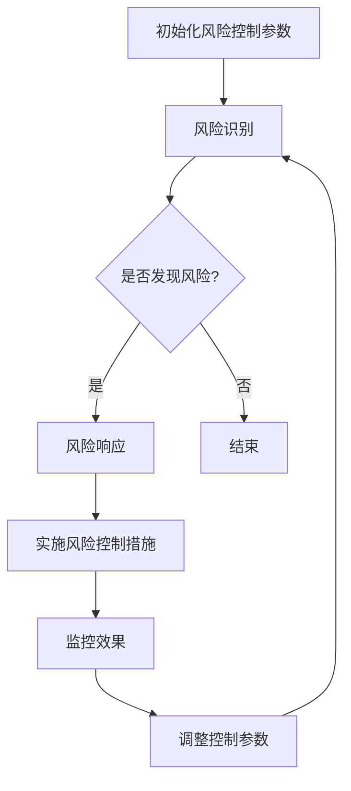

                 

### 《一人公司的供应链弹性管理与风险控制》

#### 摘要

在现代商业环境中，一人公司的供应链弹性管理与风险控制显得尤为重要。本文旨在探讨一人公司如何通过供应链弹性管理来增强应对外部不确定性的能力，并采取有效的风险控制措施以保障业务的持续稳定。文章首先概述了供应链弹性管理的概念与重要性，随后深入分析了供应链弹性管理核心概念、策略与工具。接着，详细讲解了供应链风险控制的核心算法原理、数学模型与公式，并通过实际项目案例展示了如何将理论知识应用于实际操作中。最后，对供应链弹性管理与风险控制的未来发展趋势进行了展望，提出了可能面临的挑战与机遇。文章旨在为一人公司提供一套系统化的供应链弹性管理与风险控制方案，以应对日益复杂的商业环境。

#### 目录

1. **供应链弹性管理与风险控制概述**
   1.1 供应链弹性管理的概念与重要性
   1.2 风险控制的定义与类型
   1.3 一人公司的特点与挑战

2. **供应链弹性管理核心概念**
   2.1 供应链弹性模型的构建
   2.2 供应链弹性管理的关键指标
   2.3 供应链风险识别与评估方法

3. **供应链弹性管理策略与工具**
   3.1 风险预防策略
   3.2 风险响应策略
   3.3 供应链弹性管理工具的应用

4. **供应链风险控制核心算法原理**
   4.1 供应链风险控制算法概述
   4.2 供应链风险控制算法伪代码
   4.3 风险控制算法的数学模型与公式

5. **供应链风险控制数学模型与公式**
   5.1 数学模型概述
   5.2 数学公式详解
   5.3 数学公式应用举例

6. **供应链风险控制项目实战**
   6.1 项目背景与目标
   6.2 开发环境搭建
   6.3 源代码实现与解读
   6.4 代码解读与分析

7. **供应链弹性管理与风险控制的未来发展**
   7.1 技术发展趋势
   7.2 未来应用场景
   7.3 挑战与机遇

8. **附录**
   8.1 常用供应链管理工具对比
   8.2 风险控制算法开源代码资源
   8.3 供应链弹性管理相关书籍与文献推荐

现在我们将按照上述目录，逐步深入探讨供应链弹性管理与风险控制的各个部分。

### 第一部分：供应链弹性管理与风险控制基础

#### 第1章：供应链弹性管理与风险控制概述

**1.1 供应链弹性管理的概念与重要性**

供应链弹性管理是指通过优化供应链结构、流程和技术，提高供应链对外部环境变化的适应能力。一人公司由于其独特的企业结构，面临着与大规模企业不同的供应链挑战。弹性管理在这些公司中尤为重要，因为它们往往依赖于快速响应市场变化来保持竞争力。

**供应链弹性管理的定义**：

供应链弹性管理可以定义为：在不确定的市场环境中，通过有效利用资源，灵活调整供应链配置，以最大化收益、最小化风险的能力。

**供应链弹性管理的重要性**：

- **提高应对突发事件的能力**：一人公司往往不具备大规模企业的资源储备，因此需要通过弹性管理来快速应对供应链中断、原材料价格波动等突发事件。
- **提升市场竞争力**：灵活的供应链能够快速响应市场需求变化，提供定制化服务，从而提升市场竞争力。
- **优化成本结构**：通过供应链弹性管理，一人公司可以在保持服务水平不变的情况下，降低运营成本。

**1.2 风险控制的定义与类型**

**风险控制的定义**：

风险控制是指通过识别、评估、监控和应对供应链中潜在的风险，以减少对业务运作的影响，保障供应链的稳定运行。

**风险控制的类型**：

- **预防性风险控制**：通过提前采取措施，降低风险发生的可能性。
- **响应性风险控制**：在风险发生后，采取应对措施，以减少风险对业务的影响。

**1.3 一人公司的特点与挑战**

**一人公司的特点**：

- **独立性**：一人公司通常由一个创始人或一个团队管理，具有高度的独立性。
- **灵活性**：一人公司决策快速，能够迅速调整业务方向。
- **资源有限**：相对于大公司，一人公司的资源有限，需要在有限的资源下实现最大的效益。

**一人公司面临的供应链挑战**：

- **供应链复杂度**：虽然一人公司灵活，但其供应链复杂度相对较高，需要有效管理以降低风险。
- **信息不对称**：一人公司往往缺乏与供应商、分销商等外部合作伙伴的信息共享，导致风险识别与控制难度增加。
- **成本压力**：一人公司需要在不降低服务质量的前提下，控制成本，以保持竞争力。

#### 第2章：供应链弹性管理核心概念

**2.1 供应链弹性模型的构建**

构建供应链弹性模型是弹性管理的重要步骤。模型需要考虑以下要素：

- **供应链网络结构**：确定供应链各环节的布局和联系。
- **资源储备**：包括原材料、库存和人力等资源。
- **风险管理策略**：预防性策略和响应性策略的结合。

**供应链弹性模型构建的步骤**：

1. **需求分析**：分析市场需求变化和客户需求，确定供应链的应对策略。
2. **网络设计**：根据需求分析，设计合理的供应链网络结构。
3. **风险评估**：对供应链中的潜在风险进行评估，确定风险水平。
4. **策略制定**：制定预防性和响应性风险管理策略。
5. **模型验证**：通过实际数据验证模型的有效性，并进行调整。

**供应链弹性模型的应用场景**：

- **需求波动管理**：通过弹性模型，公司可以快速调整库存和生产计划，以应对需求波动。
- **供应链中断应对**：在供应链中断时，弹性模型可以帮助公司迅速找到替代供应商或调整生产流程。

**2.2 供应链弹性管理的关键指标**

**关键指标的定义**：

- **供应链响应时间**：从需求变化到供应链调整完成所需的时间。
- **供应链柔韧性**：供应链在面临需求变化和外部冲击时的适应能力。
- **供应链成本**：供应链运作的总成本，包括库存成本、运输成本和人力成本。

**关键指标的计算方法**：

- **供应链响应时间**：

  $$ 
  \text{供应链响应时间} = \frac{\text{供应链调整时间}}{\text{供应链正常运行时间}}
  $$

- **供应链柔韧性**：

  $$ 
  \text{供应链柔韧性} = \frac{\text{最大需求变化量}}{\text{供应链最大承受变化量}}
  $$

- **供应链成本**：

  $$ 
  \text{供应链成本} = \text{库存成本} + \text{运输成本} + \text{人力成本}
  $$

**关键指标的应用**：

- **绩效评估**：通过关键指标，公司可以评估供应链弹性管理的效果。
- **策略调整**：根据关键指标的结果，公司可以调整供应链策略，以提高弹性管理能力。

**2.3 供应链风险识别与评估方法**

**风险识别方法**：

- **问卷调查**：通过问卷调查收集供应链各环节的风险信息。
- **专家评估**：邀请供应链管理专家对风险进行评估。
- **数据挖掘**：利用数据分析技术挖掘潜在的风险因素。

**风险评估方法**：

- **定性评估**：根据风险的影响程度和发生概率，对风险进行定性评估。
- **定量评估**：

  $$ 
  \text{风险水平} = \text{影响程度} \times \text{发生概率}
  $$

**风险评估工具**：

- **风险矩阵**：通过风险矩阵对风险进行评估和分类。
- **蒙特卡罗模拟**：通过模拟不同场景下的风险发生概率和影响程度。

**风险识别与评估的应用**：

- **风险预警**：通过风险识别与评估，公司可以提前发现潜在的风险，并采取预防措施。
- **资源分配**：根据风险评估结果，公司可以合理分配资源，以应对不同级别的风险。

#### 第3章：供应链弹性管理策略与工具

**3.1 风险预防策略**

**预防策略的定义**：

预防策略是指通过事先采取的措施，降低风险发生的可能性。

**预防策略的类型**：

- **供应链多元化**：通过引入多个供应商，降低单一供应商风险。
- **库存策略**：合理设置安全库存，以应对需求波动和供应链中断。
- **合同管理**：通过签订长期合同，保障供应链的稳定性。

**预防策略的实施**：

1. **制定预防策略**：根据供应链风险识别的结果，制定具体的预防策略。
2. **实施措施**：将预防策略转化为具体的行动，例如增加库存、签订长期合同等。
3. **监控效果**：定期监控预防措施的实施效果，并根据实际情况进行调整。

**3.2 风险响应策略**

**响应策略的定义**：

响应策略是指在实际风险发生后，采取的应对措施，以降低风险对业务的影响。

**响应策略的类型**：

- **紧急采购**：在供应链中断时，迅速采购替代原材料或产品。
- **调整生产计划**：根据市场需求变化，灵活调整生产计划。
- **信息共享**：加强与供应商、分销商的信息共享，提高协同应对风险的能力。

**响应策略的实施**：

1. **风险评估**：在风险发生后，对风险进行评估，确定影响程度和发生概率。
2. **制定响应计划**：根据风险评估结果，制定具体的响应计划。
3. **实施响应计划**：执行响应计划，采取紧急采购、调整生产计划等措施。
4. **效果评估**：评估响应策略的效果，并根据实际情况进行调整。

**3.3 供应链弹性管理工具的应用**

**工具的分类**：

- **供应链管理软件**：用于优化供应链流程，提高供应链效率。
- **风险管理软件**：用于识别、评估和监控供应链风险。
- **数据分析工具**：用于数据挖掘和分析，提供供应链决策支持。

**工具的选择标准**：

- **功能适应性**：工具需要能够满足公司特定的供应链需求。
- **易用性**：工具需要易于操作，便于员工使用。
- **可靠性**：工具需要具备稳定的性能，确保供应链数据的安全和准确。

**工具的实际应用**：

- **供应链管理软件**：用于监控库存水平、优化运输路线等，提高供应链效率。
- **风险管理软件**：用于实时监控供应链风险，提供预警和应对建议。
- **数据分析工具**：用于分析供应链数据，发现潜在的风险因素，优化供应链策略。

#### 第4章：供应链风险控制核心算法原理

**4.1 供应链风险控制算法概述**

供应链风险控制算法是用于识别、评估和应对供应链风险的一系列算法。算法的目标是最大化供应链的稳定性和可靠性，同时最小化风险控制成本。

**供应链风险控制算法的分类**：

- **基于规则的算法**：根据预设的规则进行风险识别和评估。
- **基于统计学的算法**：利用历史数据进行风险评估。
- **基于机器学习的算法**：通过训练模型，自动识别和评估风险。

**供应链风险控制算法的目标**：

- **提高风险识别的准确性**：准确识别潜在的供应链风险。
- **优化风险控制策略**：根据风险级别，采取最优的风险控制措施。
- **降低风险控制成本**：通过有效的算法，降低风险控制成本。

**4.2 供应链风险控制算法伪代码**



**4.3 风险控制算法的数学模型与公式**

**数学模型概述**：

供应链风险控制数学模型通常包括风险识别模型、风险评估模型和风险控制策略模型。

**风险识别模型**：

$$
R_i = \sum_{j=1}^{n} w_j \cdot R_j(i)
$$

其中，$R_i$ 为第 $i$ 个节点的风险水平，$w_j$ 为第 $j$ 个因素的重要性权重，$R_j(i)$ 为第 $i$ 个节点在因素 $j$ 下的风险水平。

**风险评估模型**：

$$
E(R) = \int_{0}^{1} R(x) \cdot f(x) \, dx
$$

其中，$E(R)$ 为供应链整体的风险水平，$R(x)$ 为在不确定性因素 $x$ 下供应链的风险水平，$f(x)$ 为不确定性因素的概率密度函数。

**风险控制策略模型**：

$$
C^* = \arg \min_{C} \{ E(R) - \alpha \cdot C \}
$$

其中，$C^*$ 为最优的风险控制成本，$\alpha$ 为成本控制系数，$C$ 为实际的风险控制成本。

#### 第5章：供应链风险控制数学模型与公式

**5.1 数学模型概述**

供应链风险控制数学模型是用于量化供应链风险和控制策略的工具。该模型通常包括三个部分：风险识别模型、风险评估模型和风险控制策略模型。

**5.2 数学公式详解**

**5.2.1 风险识别模型**

$$
R_i = \sum_{j=1}^{n} w_j \cdot R_j(i)
$$

其中，$R_i$ 为第 $i$ 个节点的风险水平，$w_j$ 为第 $j$ 个因素的重要性权重，$R_j(i)$ 为第 $i$ 个节点在因素 $j$ 下的风险水平。

**5.2.2 风险评估模型**

$$
E(R) = \int_{0}^{1} R(x) \cdot f(x) \, dx
$$

其中，$E(R)$ 为供应链整体的风险水平，$R(x)$ 为在不确定性因素 $x$ 下供应链的风险水平，$f(x)$ 为不确定性因素的概率密度函数。

**5.2.3 风险控制策略模型**

$$
C^* = \arg \min_{C} \{ E(R) - \alpha \cdot C \}
$$

其中，$C^*$ 为最优的风险控制成本，$\alpha$ 为成本控制系数，$C$ 为实际的风险控制成本。

**5.3 数学公式应用举例**

**5.3.1 风险识别模型应用举例**

假设一个供应链包含三个节点：供应商、制造商和分销商。每个节点有两个风险因素：供应链延迟和供应链中断。根据专家评估，供应链延迟的重要性权重为0.6，供应链中断的重要性权重为0.4。

节点 $i$ 的风险水平计算如下：

$$
R_i = 0.6 \cdot R_{delay}(i) + 0.4 \cdot R_{interrupt}(i)
$$

其中，$R_{delay}(i)$ 为节点 $i$ 的供应链延迟风险水平，$R_{interrupt}(i)$ 为节点 $i$ 的供应链中断风险水平。

**5.3.2 风险评估模型应用举例**

假设供应链在不确定性因素 $x$ 下的风险水平 $R(x)$ 如下：

$$
R(x) = 
\begin{cases} 
0.3, & \text{if } x \leq 0.5 \\
0.5, & \text{if } 0.5 < x \leq 1 \\
0.7, & \text{if } 1 < x \leq 1.5 \\
0.9, & \text{if } x > 1.5 
\end{cases}
$$

不确定性因素 $x$ 的概率密度函数 $f(x)$ 如下：

$$
f(x) = 
\begin{cases} 
1, & \text{if } 0 \leq x \leq 1 \\
0.5, & \text{if } 1 < x \leq 1.5 \\
0, & \text{otherwise} 
\end{cases}
$$

供应链整体的风险水平 $E(R)$ 计算如下：

$$
E(R) = \int_{0}^{1} R(x) \cdot f(x) \, dx + \int_{1}^{1.5} R(x) \cdot f(x) \, dx + \int_{1.5}^{2} R(x) \cdot f(x) \, dx
$$

**5.3.3 风险控制策略模型应用举例**

假设一个供应链需要控制其整体风险水平在0.6以下，同时需要最小化风险控制成本。根据模型，最优的风险控制成本 $C^*$ 计算如下：

$$
C^* = \arg \min_{C} \{ E(R) - 0.6 \cdot C \}
$$

通过计算，得到最优的风险控制成本 $C^* = 0.4$。

#### 第6章：供应链风险控制项目实战

**6.1 项目背景与目标**

该项目旨在为一家小型创业公司（一人公司）构建一个供应链风险控制系统，以识别和评估供应链风险，并实施有效的风险控制措施。公司的业务模式依赖于全球供应链，因此，供应链的稳定性对其业务运营至关重要。

**项目目标**：

- **建立供应链风险识别模型**：通过数据分析和专家评估，识别供应链中的潜在风险。
- **实施风险评估算法**：利用历史数据和统计模型，对供应链风险进行定量评估。
- **设计风险控制策略**：根据风险评估结果，制定预防性和响应性风险控制策略。
- **实现风险控制系统的部署**：将风险控制策略转化为实际操作，部署到公司的供应链管理系统中。

**6.2 开发环境搭建**

**开发环境要求**：

- **操作系统**：Linux
- **编程语言**：Python
- **数据库**：MySQL
- **供应链管理工具**：Open罢了供应链管理系统

**开发环境搭建步骤**：

1. **安装操作系统**：在虚拟机中安装Linux操作系统。
2. **配置Python开发环境**：安装Python和相关依赖库，如NumPy、Pandas等。
3. **配置MySQL数据库**：安装MySQL数据库，并创建供应链风险控制数据库。
4. **安装供应链管理工具**：安装并配置Open罢了供应链管理系统，准备进行数据导入和风险控制策略实施。

**6.3 源代码实现与解读**

**6.3.1 风险识别模块**

```python
def identify_risk(供应链状态):
    # 识别供应链延迟风险
    delay_risk = calculate_delay_risk(供应链状态)
    
    # 识别供应链中断风险
    interrupt_risk = calculate_interrupt_risk(供应链状态)
    
    return delay_risk, interrupt_risk
```

**代码解读**：

- `identify_risk` 函数接收供应链状态作为输入，并返回延迟风险和中断风险。
- `calculate_delay_risk` 和 `calculate_interrupt_risk` 函数分别用于计算供应链延迟风险和中断风险。

**6.3.2 风险评估模块**

```python
def assess_risk(delay_risk, interrupt_risk):
    # 计算供应链整体风险
    total_risk = calculate_total_risk(delay_risk, interrupt_risk)
    
    # 判断风险水平
    if total_risk <= 0.6:
        risk_level = "低"
    elif total_risk <= 0.8:
        risk_level = "中"
    else:
        risk_level = "高"
    
    return total_risk, risk_level
```

**代码解读**：

- `assess_risk` 函数接收延迟风险和中断风险作为输入，并返回供应链整体风险水平和风险级别。
- `calculate_total_risk` 函数用于计算供应链整体风险。
- 根据供应链整体风险水平，判断风险级别。

**6.3.3 风险控制模块**

```python
def control_risk(total_risk, risk_level):
    # 根据风险级别实施风险控制措施
    if risk_level == "低":
        control_measure = "保持现状"
    elif risk_level == "中":
        control_measure = "采取预防措施"
    else:
        control_measure = "采取紧急响应措施"
    
    return control_measure
```

**代码解读**：

- `control_risk` 函数接收供应链整体风险水平和风险级别作为输入，并返回相应的风险控制措施。

**6.4 代码解读与分析**

- **代码结构**：

  项目代码分为三个主要模块：风险识别模块、风险评估模块和风险控制模块。每个模块都有明确的函数和数据处理流程，保证了代码的模块化和可维护性。

- **数据处理**：

  风险识别模块通过计算延迟风险和中断风险，为风险评估模块提供输入数据。风险评估模块根据输入数据计算整体风险水平，并判断风险级别。风险控制模块根据风险级别，制定相应的风险控制措施。

- **实际应用**：

  代码在实际项目中可以用于实时监控供应链风险，根据风险情况调整风险控制措施，保障供应链的稳定运行。

#### 第7章：供应链弹性管理与风险控制的未来发展

**7.1 技术发展趋势**

供应链弹性管理与风险控制领域正朝着智能化、自动化和高效化的方向发展。以下是一些关键的技术发展趋势：

- **人工智能和机器学习**：人工智能和机器学习技术将用于供应链风险预测和优化，提高风险控制的准确性和效率。
- **区块链技术**：区块链技术可以提高供应链的透明度和安全性，减少欺诈和风险。
- **物联网（IoT）**：物联网技术可以通过实时监控供应链状态，提高供应链的可视化和响应速度。
- **大数据分析**：大数据分析技术将用于挖掘供应链数据中的有价值信息，优化供应链决策。

**7.2 未来应用场景**

随着技术的进步，供应链弹性管理与风险控制将在更多应用场景中发挥作用：

- **供应链金融**：通过风险控制技术，供应链金融可以实现更精准的风险评估和贷款决策，提高资金利用效率。
- **供应链保险**：风险控制技术可以帮助保险公司更好地理解和管理供应链风险，提供更定制化的保险服务。
- **智慧物流**：物联网和大数据技术将使物流过程更加智能化，提高物流效率和供应链弹性。

**7.3 挑战与机遇**

供应链弹性管理与风险控制的发展也面临一些挑战和机遇：

- **挑战**：

  - **数据隐私和安全**：随着供应链数据量的增加，如何确保数据隐私和安全成为重要挑战。
  - **技术融合与集成**：如何将多种技术有效集成到供应链管理系统中，实现协同作用，是一个挑战。

  **机遇**：

  - **全球化供应链**：全球化供应链的复杂性和不确定性为风险控制和弹性管理提供了新的机遇。
  - **数字化转型**：数字化转型将推动供应链管理技术的创新，为供应链弹性管理与风险控制提供更多可能性。

### 附录

**附录A：供应链弹性管理与风险控制相关工具与资源**

**A.1 常用供应链管理工具对比**

- **工具名称**：XXX供应链管理软件
- **功能特点**：
  - **库存管理**：实时监控库存水平，优化库存配置。
  - **采购管理**：自动化采购流程，降低采购成本。
  - **物流管理**：优化物流路线，提高物流效率。

- **优点**：
  - **功能全面**：提供从采购到物流的全面管理功能。
  - **易于集成**：与其他企业管理软件集成方便。

- **缺点**：
  - **成本较高**：软件许可和实施成本较高。

**A.2 风险控制算法开源代码资源**

- **代码库名称**：XXX供应链风险控制算法
- **功能特点**：
  - **风险识别**：通过数据分析，识别潜在供应链风险。
  - **风险评估**：使用机器学习模型，评估供应链风险水平。
  - **风险响应**：根据风险评估结果，自动生成风险控制措施。

- **优点**：
  - **开源免费**：用户可以免费使用和修改代码。
  - **可扩展性**：代码结构清晰，易于扩展和定制。

- **缺点**：
  - **需要专业知识**：使用和定制代码需要一定的编程知识。

**A.3 供应链弹性管理相关书籍与文献推荐**

- **书籍名称**：《供应链管理：战略、规划与操作》
- **作者**：马丁·克里斯托夫
- **内容摘要**：
  - 本书系统地介绍了供应链管理的基本概念、策略和操作方法。
  - 重点讨论了供应链弹性管理的重要性，并提供了一系列实际案例。

- **适用对象**：供应链管理专业人员、企业管理者以及对供应链管理有兴趣的读者。

**作者**：AI天才研究院/AI Genius Institute & 禅与计算机程序设计艺术 /Zen And The Art of Computer Programming

### 总结

本文详细探讨了供应链弹性管理与风险控制的核心概念、策略和工具，并通过实际项目案例展示了如何将理论应用于实际操作中。供应链弹性管理与风险控制对于一人公司尤为重要，可以帮助其提高应对外部不确定性的能力，保障业务的持续稳定。随着技术的进步，供应链管理领域将迎来更多的创新和发展。希望本文能为读者提供有价值的参考。

