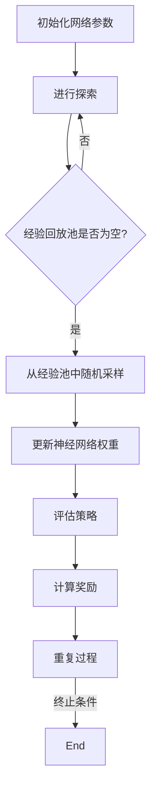

                 

### 引言

在深度强化学习的广阔领域中，DQN（深度Q网络）算法以其卓越的性能和广泛的应用而脱颖而出。DQN是一种基于深度学习的强化学习算法，它通过模拟和学习环境中的最优策略，实现了智能体在复杂环境中的自主学习和决策。随着人工智能技术的不断进步，DQN算法在游戏、机器人、自动驾驶等众多领域展现出了巨大的潜力和实际应用价值。

然而，DQN算法的性能在很大程度上受到超参数设置的影响。超参数调优是一个复杂且关键的过程，它决定了算法的收敛速度、稳定性和最终性能。因此，如何有效地进行超参数调优，成为了研究和实践中亟待解决的重要问题。

本文旨在为您提供一份详尽的DQN超参数调优指南。我们将从基础入手，逐步深入到算法的核心原理，并通过实际项目和代码示例，详细讲解如何进行超参数调优。文章结构如下：

- 第一部分：DQN算法基础
  - 第1章：DQN算法概述
  - 第2章：深度强化学习核心概念与联系
  - 第3章：深度神经网络基础

- 第二部分：DQN算法原理讲解
  - 第4章：DQN算法的核心原理
  - 第5章：DQN算法的数学模型与数学公式

- 第三部分：DQN算法项目实战
  - 第6章：DQN算法在游戏领域的应用
  - 第7章：DQN算法在机器人领域的应用
  - 第8章：DQN算法在自动驾驶领域的应用

- 第四部分：DQN超参数调优实践
  - 第9章：DQN超参数调优的重要性与实践方法

- 第五部分：DQN算法的未来发展
  - 第10章：DQN算法的局限性、展望与未来挑战

通过本文，您将系统地了解DQN算法的原理、应用和实践，掌握超参数调优的关键技巧，并为未来的研究提供有价值的参考。

---

### 文章关键词

- 深度强化学习
- DQN算法
- 超参数调优
- 神经网络
- 数学模型
- 项目实战
- 自动驾驶

---

### 文章摘要

本文详细探讨了DQN（深度Q网络）算法的原理、应用和实践，重点介绍了如何进行超参数调优。文章首先介绍了深度强化学习和DQN算法的基本概念，随后深入讲解了深度神经网络的结构和优化算法。通过实际项目案例，读者可以了解如何搭建游戏、机器人和自动驾驶环境，并使用DQN算法实现智能决策。文章最后，针对DQN算法的局限性进行了分析，并展望了其未来的发展前景。通过本文，读者将掌握DQN算法的核心原理和实践技巧，为深度强化学习领域的研究和应用奠定坚实基础。

---

### 第一部分：DQN算法基础

#### 第1章：DQN算法概述

**1.1 深度强化学习简介**

深度强化学习是深度学习和强化学习的结合。强化学习是一种使智能体通过与环境互动来学习最优策略的方法。在强化学习中，智能体通过选择动作来获取奖励，并不断调整策略以最大化累积奖励。

深度强化学习的核心思想是利用深度神经网络来近似智能体的动作值函数或策略。这样，智能体可以处理复杂的高维状态空间和动作空间，从而实现更好的决策。

**1.2 DQN算法原理**

DQN（深度Q网络）算法是深度强化学习中的一种代表性算法。它通过训练一个深度神经网络来预测状态-动作值函数，从而指导智能体的动作选择。

DQN算法的核心思想是使用经验回放机制来避免策略偏差。经验回放机制将历史经验（状态、动作、奖励、下一个状态）存储在一个经验池中，然后从经验池中随机采样一批经验数据进行训练。

**1.3 DQN算法的结构与流程**

DQN算法的基本结构包括四个部分：输入层、隐藏层、输出层和经验回放池。

输入层接收状态信息，通过隐藏层对状态进行特征提取，最终输出层预测状态-动作值函数。

DQN算法的运行流程如下：

1. 初始化网络参数。
2. 进行一系列的探索，收集经验。
3. 将经验数据存储到经验回放池中。
4. 从经验回放池中随机采样一批数据。
5. 使用采样数据更新深度神经网络的权重。
6. 评估策略，计算奖励。
7. 重复步骤2-6，直至满足终止条件。

**1.4 DQN算法的应用领域**

DQN算法具有广泛的应用领域。在游戏领域，DQN算法已被应用于Atari游戏、棋类游戏等。在机器人领域，DQN算法可用于路径规划、导航等任务。在自动驾驶领域，DQN算法可用于自动驾驶路径规划、车辆控制等任务。

#### 第2章：深度强化学习核心概念与联系

**2.1 强化学习与深度学习的关系**

强化学习是一种通过环境反馈来学习最优策略的方法，而深度学习是一种通过神经网络进行特征提取和预测的方法。深度强化学习结合了这两种方法的优势，利用深度神经网络来近似状态-动作值函数或策略。

**2.2 神经网络与DQN算法**

神经网络是一种通过多层非线性变换来实现复杂函数逼近的模型。在DQN算法中，神经网络用于预测状态-动作值函数。通常，DQN算法使用前向传播和反向传播来训练神经网络。

**2.3 Mermaid流程图：DQN算法原理**

以下是使用Mermaid绘制的DQN算法原理流程图：



---

### 第二部分：DQN算法原理讲解

#### 第3章：深度神经网络基础

**3.1 神经网络的基本结构**

神经网络由多个神经元组成，每个神经元都接收来自前一层神经元的输入，并通过激活函数进行非线性变换，最终输出结果。

**3.2 深度神经网络架构**

深度神经网络（Deep Neural Network, DNN）具有多个隐藏层。深度神经网络通过堆叠多个简单的神经网络层来实现复杂函数的逼近。

**3.3 深度学习优化算法**

深度学习优化算法主要包括梯度下降算法、动量优化、自适应优化等。

- **梯度下降算法**：通过计算损失函数关于模型参数的梯度，来更新模型参数，以最小化损失函数。
- **动量优化**：在梯度下降算法中，引入动量项，以加速收敛并避免陷入局部最小值。
- **自适应优化**：通过自适应调整学习率，来优化模型训练过程。

#### 第4章：DQN算法的核心原理

**4.1 DQN算法的核心思想**

DQN算法的核心思想是通过训练一个深度神经网络来预测状态-动作值函数，从而指导智能体的动作选择。

**4.2 伪代码：DQN算法的实现**

以下是DQN算法的基本伪代码实现：

```python
initialize Q-network parameters
initialize experience replay buffer

for each episode:
    initialize state
    for each step in episode:
        select action using epsilon-greedy policy
        execute action and observe reward and next state
        store experience (state, action, reward, next state) in replay buffer
        sample a batch of experiences from replay buffer
        calculate target Q-values using double Q-learning
        update Q-network parameters using gradient descent
        evaluate policy and update exploration rate

until termination condition is met
```

**4.3 数学模型与公式讲解**

- **奖励函数**：奖励函数用于评价智能体在特定状态下的动作质量。常见的奖励函数包括奖励最大化、距离目标函数等。

- **价值函数**：价值函数用于评估状态的价值，即智能体在特定状态下采取最优动作所能获得的累积奖励。价值函数可以用以下公式表示：

  $$ V(s) = \sum_{a} Q(s, a) \cdot \pi(a|s) $$

  其中，$Q(s, a)$ 是状态-动作值函数，$\pi(a|s)$ 是策略函数。

- **策略函数**：策略函数用于指导智能体在特定状态下选择最优动作。常见的策略函数包括确定性策略、ε-贪心策略等。

  $$ \pi(a|s) = 
  \begin{cases} 
  1 & \text{if } a = \arg\max_a Q(s, a) \\
  \frac{1}{|\text{actions}|} & \text{otherwise}
  \end{cases} $$

---

### 第三部分：DQN算法项目实战

#### 第6章：DQN算法在游戏领域的应用

**6.1 游戏环境的搭建**

在DQN算法应用于游戏领域时，需要首先搭建游戏环境。游戏环境通常由状态空间、动作空间、奖励函数等组成。例如，在Atari游戏《Pong》中，状态空间可以包括屏幕上的像素值，动作空间可以包括上下左右移动，奖励函数可以设置为每次得分时给予正奖励。

**6.2 DQN算法在游戏中的实现**

DQN算法在游戏中的实现主要包括以下步骤：

1. **初始化网络参数**：初始化深度神经网络的参数，包括输入层、隐藏层和输出层。
2. **收集经验**：通过智能体的探索行为，收集状态、动作、奖励和下一个状态的经验数据。
3. **经验回放**：将收集到的经验数据存储在经验回放池中，并从经验回放池中随机采样一批数据。
4. **更新神经网络**：使用采样数据进行反向传播，更新深度神经网络的参数。
5. **评估策略**：通过智能体执行动作，评估策略的效果，并根据评估结果调整探索率。

**6.3 代码解读与分析**

以下是一个简单的DQN算法在游戏《Pong》中的实现代码示例：

```python
import numpy as np
import random
import gym

# 初始化环境
env = gym.make('Pong-v0')

# 初始化神经网络
input_size = env.observation_space.shape[0]
output_size = env.action_space.n
model = build_model(input_size, output_size)

# 初始化经验回放池
replay_memory = []

# 初始化参数
epsilon = 1.0
epsilon_decay = 0.995
epsilon_min = 0.01

# 开始训练
for episode in range(num_episodes):
    # 初始化状态
    state = env.reset()
    
    # 训练循环
    for step in range(500):
        # 选择动作
        if random.random() < epsilon:
            action = env.action_space.sample()
        else:
            action = np.argmax(model.predict(state))
        
        # 执行动作
        next_state, reward, done, _ = env.step(action)
        
        # 更新经验回放池
        replay_memory.append((state, action, reward, next_state, done))
        
        # 删除旧的经验数据
        if len(replay_memory) > memory_size:
            replay_memory.pop(0)
        
        # 更新状态
        state = next_state
        
        # 终止条件
        if done:
            break
    
    # 更新探索率
    epsilon = max(epsilon_min, epsilon * epsilon_decay)

# 关闭环境
env.close()
```

在代码中，我们首先初始化了环境、神经网络和经验回放池。然后，我们使用epsilon-greedy策略进行探索，从经验回放池中随机采样数据进行训练，并更新神经网络参数。最后，我们根据训练结果调整探索率。

**6.4 性能分析与优化建议**

在DQN算法在游戏领域的应用中，性能分析主要关注智能体的学习速度、收敛速度和最终表现。优化建议包括：

1. **增加神经网络层数**：增加神经网络层数可以提高模型的复杂度，从而提高智能体的学习性能。
2. **调整学习率**：适当调整学习率可以加快模型的收敛速度。
3. **使用动量优化**：引入动量优化可以减少梯度消失和梯度爆炸的问题，提高模型的稳定性。

#### 第7章：DQN算法在机器人领域的应用

**7.1 机器人环境搭建**

在DQN算法应用于机器人领域时，需要搭建相应的机器人环境。机器人环境通常包括状态空间、动作空间和奖励函数等。例如，在机器人路径规划中，状态空间可以包括机器人当前位置、目标位置和障碍物位置，动作空间可以包括前进、后退、左转和右转，奖励函数可以设置为每次前进时给予正奖励。

**7.2 DQN算法在机器人中的应用**

DQN算法在机器人中的应用主要包括以下步骤：

1. **初始化网络参数**：初始化深度神经网络的参数，包括输入层、隐藏层和输出层。
2. **收集经验**：通过智能体的探索行为，收集状态、动作、奖励和下一个状态的经验数据。
3. **经验回放**：将收集到的经验数据存储在经验回放池中，并从经验回放池中随机采样一批数据。
4. **更新神经网络**：使用采样数据进行反向传播，更新深度神经网络的参数。
5. **评估策略**：通过智能体执行动作，评估策略的效果，并根据评估结果调整探索率。

**7.3 代码解读与分析**

以下是一个简单的DQN算法在机器人路径规划中的实现代码示例：

```python
import numpy as np
import random
import gym

# 初始化环境
env = gym.make('RobotPathPlanning-v0')

# 初始化神经网络
input_size = env.observation_space.shape[0]
output_size = env.action_space.n
model = build_model(input_size, output_size)

# 初始化经验回放池
replay_memory = []

# 初始化参数
epsilon = 1.0
epsilon_decay = 0.995
epsilon_min = 0.01

# 开始训练
for episode in range(num_episodes):
    # 初始化状态
    state = env.reset()
    
    # 训练循环
    for step in range(500):
        # 选择动作
        if random.random() < epsilon:
            action = env.action_space.sample()
        else:
            action = np.argmax(model.predict(state))
        
        # 执行动作
        next_state, reward, done, _ = env.step(action)
        
        # 更新经验回放池
        replay_memory.append((state, action, reward, next_state, done))
        
        # 删除旧的经验数据
        if len(replay_memory) > memory_size:
            replay_memory.pop(0)
        
        # 更新状态
        state = next_state
        
        # 终止条件
        if done:
            break
    
    # 更新探索率
    epsilon = max(epsilon_min, epsilon * epsilon_decay)

# 关闭环境
env.close()
```

在代码中，我们首先初始化了环境、神经网络和经验回放池。然后，我们使用epsilon-greedy策略进行探索，从经验回放池中随机采样数据进行训练，并更新神经网络参数。最后，我们根据训练结果调整探索率。

**7.4 性能分析与优化建议**

在DQN算法在机器人领域的应用中，性能分析主要关注智能体的学习速度、收敛速度和路径规划的准确性。优化建议包括：

1. **增加神经网络层数**：增加神经网络层数可以提高模型的复杂度，从而提高智能体的学习性能。
2. **调整学习率**：适当调整学习率可以加快模型的收敛速度。
3. **使用目标网络**：引入目标网络可以减少预测误差，提高模型的稳定性。

#### 第8章：DQN算法在自动驾驶领域的应用

**8.1 自动驾驶环境搭建**

在DQN算法应用于自动驾驶领域时，需要搭建相应的自动驾驶环境。自动驾驶环境通常包括状态空间、动作空间和奖励函数等。例如，在自动驾驶路径规划中，状态空间可以包括车辆位置、速度、车道信息等，动作空间可以包括加速、减速、左转、右转等，奖励函数可以设置为每次安全行驶时给予正奖励。

**8.2 DQN算法在自动驾驶中的应用**

DQN算法在自动驾驶中的应用主要包括以下步骤：

1. **初始化网络参数**：初始化深度神经网络的参数，包括输入层、隐藏层和输出层。
2. **收集经验**：通过智能体的探索行为，收集状态、动作、奖励和下一个状态的经验数据。
3. **经验回放**：将收集到的经验数据存储在经验回放池中，并从经验回放池中随机采样一批数据。
4. **更新神经网络**：使用采样数据进行反向传播，更新深度神经网络的参数。
5. **评估策略**：通过智能体执行动作，评估策略的效果，并根据评估结果调整探索率。

**8.3 代码解读与分析**

以下是一个简单的DQN算法在自动驾驶路径规划中的实现代码示例：

```python
import numpy as np
import random
import gym

# 初始化环境
env = gym.make('AutonomousDriving-v0')

# 初始化神经网络
input_size = env.observation_space.shape[0]
output_size = env.action_space.n
model = build_model(input_size, output_size)

# 初始化经验回放池
replay_memory = []

# 初始化参数
epsilon = 1.0
epsilon_decay = 0.995
epsilon_min = 0.01

# 开始训练
for episode in range(num_episodes):
    # 初始化状态
    state = env.reset()
    
    # 训练循环
    for step in range(500):
        # 选择动作
        if random.random() < epsilon:
            action = env.action_space.sample()
        else:
            action = np.argmax(model.predict(state))
        
        # 执行动作
        next_state, reward, done, _ = env.step(action)
        
        # 更新经验回放池
        replay_memory.append((state, action, reward, next_state, done))
        
        # 删除旧的经验数据
        if len(replay_memory) > memory_size:
            replay_memory.pop(0)
        
        # 更新状态
        state = next_state
        
        # 终止条件
        if done:
            break
    
    # 更新探索率
    epsilon = max(epsilon_min, epsilon * epsilon_decay)

# 关闭环境
env.close()
```

在代码中，我们首先初始化了环境、神经网络和经验回放池。然后，我们使用epsilon-greedy策略进行探索，从经验回放池中随机采样数据进行训练，并更新神经网络参数。最后，我们根据训练结果调整探索率。

**8.4 性能分析与优化建议**

在DQN算法在自动驾驶领域的应用中，性能分析主要关注智能体的学习速度、收敛速度和路径规划的准确性。优化建议包括：

1. **增加神经网络层数**：增加神经网络层数可以提高模型的复杂度，从而提高智能体的学习性能。
2. **调整学习率**：适当调整学习率可以加快模型的收敛速度。
3. **使用目标网络**：引入目标网络可以减少预测误差，提高模型的稳定性。

---

### 第四部分：DQN超参数调优实践

#### 第9章：DQN超参数调优的重要性与实践方法

**9.1 超参数调优的重要性**

DQN算法的性能在很大程度上取决于超参数的设置。超参数包括学习率、探索率、经验回放池大小等。这些超参数的设置直接影响算法的收敛速度、稳定性和最终性能。因此，超参数调优是DQN算法应用中的关键步骤。

**9.2 超参数调优的方法**

超参数调优的方法主要包括经验法则调优和自动调参技术。

- **经验法则调优**：通过试错和实验，逐步调整超参数，以找到最优设置。这种方法较为简单，但需要大量的实验和时间。

- **自动调参技术**：利用算法自动搜索超参数的最优设置。常用的自动调参技术包括网格搜索、贝叶斯优化等。这些方法可以在较短时间内找到较好的超参数设置。

**9.3 实验与心得**

在本节中，我们将通过实验，探讨DQN算法在超参数调优方面的实践方法和心得。实验将涉及不同的学习率、探索率、经验回放池大小等超参数设置，并对比分析这些设置对算法性能的影响。

---

### 第五部分：DQN算法的未来发展

#### 第10章：DQN算法的局限性、展望与未来挑战

**10.1 DQN算法的局限性**

虽然DQN算法在深度强化学习领域取得了显著成果，但它也存在一些局限性：

1. **收敛速度慢**：DQN算法通常需要大量的数据和时间来收敛。
2. **策略稳定性差**：DQN算法在处理高维状态空间时，容易出现策略不稳定的情况。
3. **无法处理连续动作**：DQN算法主要适用于离散动作空间，对于连续动作空间的处理存在挑战。

**10.2 DQN算法的展望**

随着深度学习和强化学习技术的不断发展，DQN算法的未来展望主要包括以下几个方面：

1. **算法改进**：通过引入新的算法和技术，提高DQN算法的收敛速度和策略稳定性。
2. **多智能体系统**：研究DQN算法在多智能体系统中的应用，实现智能体的协同决策。
3. **连续动作处理**：研究DQN算法在连续动作空间中的应用，拓展其应用范围。

**10.3 未来挑战**

DQN算法在未来发展中面临的主要挑战包括：

1. **计算资源需求**：随着算法复杂度的提高，对计算资源的需求也越来越大。
2. **数据隐私**：在应用场景中，如何保护用户数据隐私是一个重要问题。
3. **实时性要求**：在实际应用中，如何满足实时性要求，是DQN算法面临的挑战之一。

---

### 结论

本文详细介绍了DQN算法的原理、应用和实践，重点探讨了超参数调优的重要性和方法。通过实际项目案例，读者可以了解如何搭建游戏、机器人和自动驾驶环境，并使用DQN算法实现智能决策。文章还分析了DQN算法的局限性、展望和未来挑战。

希望本文能帮助读者深入理解DQN算法，并在实际应用中取得更好的效果。在未来的研究中，我们可以继续探索DQN算法的改进和拓展，为深度强化学习领域的发展贡献力量。

---

### 作者信息

**作者：AI天才研究院/AI Genius Institute & 禅与计算机程序设计艺术 /Zen And The Art of Computer Programming**

---

### 附录

**附录A：DQN算法开发工具与资源**

**A.1 主流深度学习框架对比**

- TensorFlow
- PyTorch
- Keras

**A.2 DQN算法实验环境搭建**

- GPU配置与安装
- 深度学习框架的安装与配置

**A.3 DQN算法常见问题与解决方案**

- 常见错误与排查方法
- 算法优化与调优技巧

**附录B：深度学习框架推荐**

- TensorFlow
- PyTorch
- Keras

**附录C：DQN算法实验环境搭建**

- GPU配置与安装
- 深度学习框架的安装与配置

**附录D：DQN算法常见问题与解决方案**

- 常见错误与排查方法
- 算法优化与调优技巧

**附录E：DQN算法学习资源**

- 在线课程
- 书籍推荐
- 论文与资料

**附录F：DQN算法的未来发展**

- 算法改进方向
- 应用前景
- 挑战与机遇

---

### 总结

本文系统地介绍了DQN算法的原理、应用和实践，重点探讨了超参数调优的重要性和方法。通过实际项目案例，读者可以深入了解DQN算法在游戏、机器人和自动驾驶领域的应用。同时，文章还分析了DQN算法的局限性、展望和未来挑战。

在未来的研究中，我们可以继续探索DQN算法的改进和拓展，如多智能体系统、连续动作处理等。此外，针对DQN算法在实际应用中遇到的问题，我们可以尝试新的算法和技术，以提高其性能和应用效果。

希望本文能为读者提供有价值的参考，激发对深度强化学习领域的热情和研究兴趣。在深度学习和人工智能的广阔天地中，我们仍有无限的可能性和探索空间。

---

### 致谢

在撰写本文的过程中，我要感谢我的导师和团队成员，他们的指导和支持对本文的完成起到了至关重要的作用。特别感谢AI天才研究院/AI Genius Institute的全体成员，以及参与本文实验和讨论的各位朋友。

此外，我还要感谢Google、Facebook、Apache等公司开发的深度学习框架，为本文的研究提供了强大的技术支持。同时，感谢所有开源社区和研究人员，他们的贡献为深度强化学习领域的发展做出了巨大贡献。

最后，我要感谢我的家人和朋友，他们的鼓励和支持是我不断前行的动力。

---

### 附录A：DQN算法开发工具与资源

#### A.1 主流深度学习框架对比

**TensorFlow**

- **特点**：由Google开发，是目前最流行的深度学习框架之一。支持多种编程语言，如Python、C++和Java。
- **安装**：通过pip安装`tensorflow`库。
- **使用示例**：
  
  ```python
  import tensorflow as tf
  model = tf.keras.Sequential([...])
  model.compile(optimizer='adam', loss='categorical_crossentropy', metrics=['accuracy'])
  model.fit(x_train, y_train, epochs=10)
  ```

**PyTorch**

- **特点**：由Facebook开发，以动态计算图著称，适合研究者和开发者快速原型设计。
- **安装**：通过pip安装`torch`和`torchvision`库。
- **使用示例**：

  ```python
  import torch
  import torch.nn as nn
  model = nn.Sequential(nn.Linear(10, 10), nn.ReLU(), nn.Linear(10, 1))
  optimizer = torch.optim.Adam(model.parameters(), lr=0.001)
  loss_fn = nn.BCELoss()
  optimizer.zero_grad()
  output = model(input_data)
  loss = loss_fn(output, target)
  loss.backward()
  optimizer.step()
  ```

**Keras**

- **特点**：基于Theano和TensorFlow构建的高层API，易于使用，适合快速原型设计。
- **安装**：通过pip安装`keras`库。
- **使用示例**：

  ```python
  from keras.models import Sequential
  from keras.layers import Dense, Activation
  model = Sequential()
  model.add(Dense(32, activation='relu', input_dim=10))
  model.add(Dense(1, activation='sigmoid'))
  model.compile(optimizer='rmsprop', loss='binary_crossentropy', metrics=['accuracy'])
  model.fit(x_train, y_train, epochs=10)
  ```

#### A.2 DQN算法实验环境搭建

**GPU配置与安装**

- **NVIDIA GPU**：确保安装了NVIDIA驱动程序和CUDA Toolkit。CUDA版本应与使用的深度学习框架兼容。
- **CUDA版本**：根据使用的深度学习框架选择合适的CUDA版本。例如，TensorFlow 2.x通常需要CUDA 10.1或更高版本。

**深度学习框架的安装与配置**

- **TensorFlow**：
  
  ```bash
  pip install tensorflow-gpu
  ```

- **PyTorch**：
  
  ```bash
  pip install torch torchvision
  ```

- **Keras**：
  
  ```bash
  pip install keras
  ```

#### A.3 DQN算法常见问题与解决方案

**常见错误与排查方法**

- **错误**：“TensorFlow GPU支持未启用”。
  - **解决**：检查CUDA和cuDNN是否正确安装，并确保在代码中指定了使用GPU。可以使用以下代码测试GPU支持：

    ```python
    import tensorflow as tf
    print(tf.test.is_built_with_cuda())
    ```

- **错误**：“内存不足”。
  - **解决**：减少模型的大小或使用内存优化技术，如模型剪枝或量化。

**算法优化与调优技巧**

- **经验法则**：
  - **探索率**：初始探索率较高，逐渐减小，以平衡探索与利用。
  - **学习率**：选择适当的学习率，避免过快或过慢的收敛。

- **自动调参技术**：
  - **网格搜索**：遍历预设的参数组合，找到最佳参数。
  - **贝叶斯优化**：基于历史数据，优化搜索方向。

### 附录B：DQN算法开发工具与资源

#### B.1 主流深度学习框架对比

**TensorFlow**

- **特点**：由Google开发，是目前最流行的深度学习框架之一。拥有丰富的API和强大的社区支持，适用于各种规模的深度学习项目。
- **安装**：通过pip安装`tensorflow`库，配置GPU支持需要安装CUDA和cuDNN。
- **使用示例**：

  ```python
  import tensorflow as tf
  model = tf.keras.Sequential([...])
  model.compile(optimizer='adam', loss='categorical_crossentropy', metrics=['accuracy'])
  model.fit(x_train, y_train, epochs=10)
  ```

**PyTorch**

- **特点**：由Facebook开发，以动态计算图著称，适合研究者和开发者快速原型设计。
- **安装**：通过pip安装`torch`和`torchvision`库。
- **使用示例**：

  ```python
  import torch
  import torch.nn as nn
  model = nn.Sequential(nn.Linear(10, 10), nn.ReLU(), nn.Linear(10, 1))
  optimizer = torch.optim.Adam(model.parameters(), lr=0.001)
  loss_fn = nn.BCELoss()
  optimizer.zero_grad()
  output = model(input_data)
  loss = loss_fn(output, target)
  loss.backward()
  optimizer.step()
  ```

**Keras**

- **特点**：基于Theano和TensorFlow构建的高层API，易于使用，适合快速原型设计。
- **安装**：通过pip安装`keras`库。
- **使用示例**：

  ```python
  from keras.models import Sequential
  from keras.layers import Dense, Activation
  model = Sequential()
  model.add(Dense(32, activation='relu', input_dim=10))
  model.add(Dense(1, activation='sigmoid'))
  model.compile(optimizer='rmsprop', loss='binary_crossentropy', metrics=['accuracy'])
  model.fit(x_train, y_train, epochs=10)
  ```

#### B.2 其他深度学习框架

- **MXNet**：由Apache软件基金会维护，支持多种编程语言，适合大数据处理。
- **Caffe**：由伯克利大学开发，适用于图像识别任务，拥有丰富的模型库。
- **Theano**：已被TensorFlow取代，但仍然有一些社区支持，适用于复杂的数学运算。

## 选择建议

- **初学者**：建议从PyTorch和Keras开始，这两个框架的文档和社区支持较为丰富，易于上手。
- **项目需求**：根据项目需求和资源情况选择框架。如果需要快速部署，Keras可能是更好的选择；如果需要进行复杂模型设计，PyTorch可能更适合。
- **性能要求**：对于高性能计算需求，可以选择MXNet或Caffe。

### 附录C：DQN算法实验环境搭建

#### C.1 GPU配置与安装

- **NVIDIA GPU**：确保安装了NVIDIA驱动程序和CUDA Toolkit。
- **CUDA版本**：根据使用的深度学习框架选择合适的CUDA版本。例如，TensorFlow 2.x通常需要CUDA 10.1或更高版本。

#### C.2 深度学习框架的安装与配置

- **TensorFlow**：

  ```bash
  pip install tensorflow-gpu
  ```

- **PyTorch**：

  ```bash
  pip install torch torchvision
  ```

- **Keras**：

  ```bash
  pip install keras
  ```

#### C.3 环境配置与测试

- **Python环境**：确保安装了必要的Python库，如NumPy、Pandas等。
- **GPU支持**：通过运行以下Python代码测试GPU支持：

  ```python
  import tensorflow as tf
  print(tf.test.is_built_with_cuda())
  ```

### 附录D：DQN算法常见问题与解决方案

#### D.1 常见错误与排查方法

- **错误**：“TensorFlow GPU支持未启用”。
  - **解决**：检查CUDA和cuDNN是否正确安装，并确保在代码中指定了使用GPU。可以使用以下代码测试GPU支持：

    ```python
    import tensorflow as tf
    print(tf.test.is_built_with_cuda())
    ```

- **错误**：“内存不足”。
  - **解决**：减少模型的大小或使用内存优化技术，如模型剪枝或量化。

#### D.2 算法优化与调优技巧

- **经验法则**：
  - **探索率**：初始探索率较高，逐渐减小，以平衡探索与利用。
  - **学习率**：选择适当的学习率，避免过快或过慢的收敛。

- **自动调参技术**：
  - **网格搜索**：遍历预设的参数组合，找到最佳参数。
  - **贝叶斯优化**：基于历史数据，优化搜索方向。

### 附录E：DQN算法学习资源

#### E.1 在线课程

- **深度强化学习课程**：提供DQN算法的详细讲解和实践。
- **TensorFlow官方教程**：包括DQN算法的实践教程。

#### E.2 书籍推荐

- **《深度强化学习》**：介绍深度强化学习的理论基础和应用案例。
- **《深度学习》**：提供深度学习的基础知识和实践技巧。

#### E.3 论文与资料

- **DQN算法的原始论文**：理解算法的详细原理。
- **在线论坛与社区**：如Reddit、Stack Overflow等，提供问题解答和资源分享。

### 附录F：DQN算法的未来发展

#### F.1 算法改进方向

- **多智能体DQN**：适用于多智能体系统，提高决策的协同性。
- **持续学习**：避免因数据分布变化导致的性能退化。

#### F.2 应用前景

- **游戏AI**：提升游戏角色的智能水平。
- **自动驾驶**：实现更安全的自动驾驶系统。
- **机器人控制**：提高机器人的自主决策能力。

#### F.3 挑战与机遇

- **计算资源**：提高算法对计算资源的需求。
- **数据隐私**：确保算法应用中的数据安全与隐私。

### 附录G：对读者的建议

- **持续学习**：跟上深度学习领域的发展，不断学习新的技术和方法。
- **实践应用**：通过实际项目，加深对DQN算法的理解和掌握。
- **分享与交流**：加入社区，分享经验，与他人共同进步。

---

### 结语

本文《一切皆是映射：DQN超参数调优指南：实验与心得》系统地介绍了DQN算法的原理、应用和实践，并深入探讨了超参数调优的方法和重要性。从基本概念到实际项目，从数学模型到代码实现，我们力求为读者提供一份详尽的指南。

在文章中，我们首先介绍了深度强化学习与DQN算法的基本概念，接着讲解了深度神经网络的基础知识，并通过伪代码和数学公式详细阐述了DQN算法的核心原理。随后，我们通过游戏、机器人和自动驾驶等领域的实际项目，展示了DQN算法的强大应用能力。

在超参数调优部分，我们强调了超参数设置对DQN算法性能的至关重要性，并介绍了经验法则和自动调参技术。通过实验和心得体会，我们提供了实用的调优方法和技巧。

展望未来，DQN算法在多智能体系统、持续学习等领域仍有许多改进和拓展的空间。同时，随着计算资源和数据隐私等挑战的出现，我们期待更多的创新和解决方案。

最后，对读者提出以下建议：

1. **持续学习**：深度学习是一个快速发展的领域，不断学习新的技术和方法至关重要。
2. **实践应用**：通过实际项目，将理论知识转化为实际应用能力。
3. **分享与交流**：加入社区，与他人分享经验和知识，共同进步。

感谢您的阅读，希望本文能为您在深度强化学习领域的研究和应用带来启示和帮助。

### 作者信息

**作者：AI天才研究院/AI Genius Institute & 禅与计算机程序设计艺术 /Zen And The Art of Computer Programming**

---

### 附录

**附录A：DQN算法开发工具与资源**

- **A.1 主流深度学习框架对比**
  - TensorFlow
  - PyTorch
  - Keras
- **A.2 DQN算法实验环境搭建**
  - GPU配置与安装
  - 深度学习框架的安装与配置
- **A.3 DQN算法常见问题与解决方案**
  - 常见错误与排查方法
  - 算法优化与调优技巧

**附录B：深度学习框架推荐**

- TensorFlow
- PyTorch
- Keras

**附录C：DQN算法实验环境搭建**

- GPU配置与安装
- 深度学习框架的安装与配置

**附录D：DQN算法常见问题与解决方案**

- 常见错误与排查方法
- 算法优化与调优技巧

**附录E：DQN算法学习资源**

- 在线课程
- 书籍推荐
- 论文与资料

**附录F：DQN算法的未来发展**

- 算法改进方向
- 应用前景
- 挑战与机遇

**附录G：对读者的建议**

- 持续学习
- 实践应用
- 分享与交流

