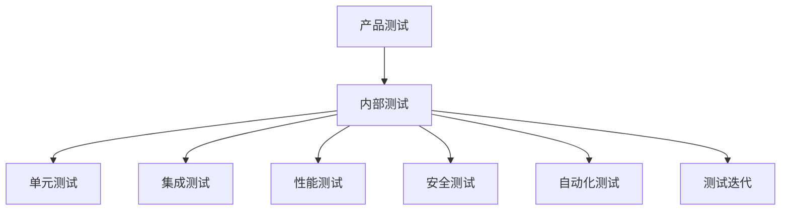

                 

### 产品测试与迭代：内部测试

#### 关键词：产品测试、内部测试、单元测试、集成测试、性能测试、安全测试、自动化测试、测试迭代、测试工具

> 摘要：本文旨在探讨产品测试与迭代过程中的内部测试阶段，从基础概念到具体实践，详细解析内部测试的各个环节，包括测试环境搭建、测试策略与计划、测试用例设计、各类测试实施方法，以及测试问题的定位与处理。文章将结合实际案例，深入剖析内部测试的核心内容，为软件开发和质量管理提供实用的指导和参考。

---

### 第一部分：产品测试基础

#### 第1章：产品测试概述

##### 1.1 产品测试的重要性

产品测试是软件开发生命周期中不可或缺的一环，它直接关系到产品的质量、稳定性和用户体验。在产品开发过程中，测试不仅可以帮助发现和修复缺陷，还能确保软件按照预期运行，从而降低运维成本，提高市场竞争力。以下是产品测试的重要性的几个方面：

1. **提高软件质量**：通过系统化的测试，可以发现并修复代码中的缺陷，确保软件的稳定性和可靠性。
2. **减少故障率**：早期的缺陷发现和修复可以有效减少产品上线后的故障率，降低用户投诉和产品退货的风险。
3. **提高用户体验**：优秀的测试能够确保产品在各种使用场景下都能正常工作，提供良好的用户体验。
4. **降低维护成本**：有效的测试可以减少后期的维护工作量，降低维护成本。

##### 1.2 产品测试的类型

产品测试可以按照不同的标准进行分类，主要包括以下几种类型：

1. **功能测试**：验证软件的功能是否按照需求文档正确实现。
2. **性能测试**：评估软件在特定负载下的性能表现，如响应时间、吞吐量等。
3. **安全测试**：检查软件的安全漏洞，确保数据安全和系统完整性。
4. **兼容性测试**：验证软件在不同操作系统、浏览器、设备上的兼容性。
5. **回归测试**：在软件更新后，确保原有功能仍然正常工作。

##### 1.3 测试生命周期

测试生命周期是指产品测试从开始到结束的整个过程，通常包括以下几个阶段：

1. **需求分析**：了解产品需求，确定测试目标和范围。
2. **测试计划**：制定详细的测试计划和策略，包括测试用例设计、测试环境搭建等。
3. **测试执行**：按照测试计划和用例进行测试，记录测试结果。
4. **缺陷管理**：跟踪和管理发现的缺陷，确保及时修复。
5. **测试报告**：总结测试结果，编写测试报告，为产品迭代提供依据。

#### 第2章：测试环境搭建

##### 2.1 测试环境配置

测试环境是进行产品测试的基础，其配置是否合理直接影响测试的准确性和效率。测试环境的配置主要包括以下方面：

1. **硬件资源**：确保测试服务器、数据库服务器等硬件设备充足，以满足测试需求。
2. **软件资源**：安装操作系统、数据库、中间件、应用服务器等软件，确保与生产环境一致。
3. **网络配置**：配置测试网络，模拟实际网络环境，确保测试的准确性。
4. **数据准备**：准备测试数据，包括正常数据、异常数据和边界数据，以满足不同测试场景的需求。

##### 2.2 测试工具安装与配置

测试工具是进行测试的重要辅助手段，其安装与配置是否正确同样影响测试的效率和准确性。以下是常见测试工具的安装与配置步骤：

1. **JMeter**：用于性能测试，安装过程如下：
   ```bash
   pip install jmeter
   jmeter -n -t test_plan.jmx -l results.jtl
   ```

2. **Selenium**：用于功能测试，安装过程如下：
   ```bash
   pip install selenium
   ```

3. **Appium**：用于移动应用测试，安装过程如下：
   ```bash
   npm install -g appium
   appium
   ```

##### 2.3 测试数据准备

测试数据是测试过程中不可或缺的一部分，其准备质量直接影响测试结果的可靠性。测试数据准备主要包括以下几个方面：

1. **数据量**：根据测试需求，准备足够的数据量，以确保测试覆盖全面。
2. **数据真实性**：确保测试数据与实际生产数据相似，以模拟真实的业务场景。
3. **数据完整性**：保证测试数据完整，无缺失或错误。
4. **数据多样性**：准备多种类型的测试数据，包括正常数据、异常数据和边界数据，以覆盖各种测试场景。

#### 第3章：测试策略与计划

##### 3.1 测试策略制定

测试策略是指导测试工作的总体方针，其制定过程需要考虑以下几个方面：

1. **测试目标**：明确测试的目的和预期效果，确保测试工作有明确的方向。
2. **测试范围**：确定测试覆盖的范围，包括功能、性能、安全等方面。
3. **资源分配**：合理分配测试资源，包括人员、时间、设备等。
4. **风险分析**：识别潜在的风险，制定应对策略。

##### 3.2 测试计划编制

测试计划是具体指导测试工作的文件，其编制过程主要包括以下几个步骤：

1. **制定测试计划**：根据测试策略，制定详细的测试计划，包括测试用例、测试环境、测试工具等。
2. **分配任务**：将测试任务分配给测试团队，确保每个成员都有明确的职责。
3. **时间安排**：制定测试时间表，确保测试工作按时完成。
4. **评估和调整**：在测试过程中，根据实际情况对测试计划进行评估和调整。

##### 3.3 测试资源配置

测试资源配置是确保测试工作顺利开展的关键，其配置主要包括以下几个方面：

1. **人员配置**：根据测试需求，配置足够的测试人员，包括测试经理、测试工程师、测试助理等。
2. **工具配置**：选择合适的测试工具，确保测试工作的效率。
3. **设备配置**：配置必要的测试设备，如测试服务器、数据库服务器、网络设备等。
4. **环境配置**：搭建测试环境，确保与生产环境一致，以便进行准确测试。

#### 第4章：测试用例设计

##### 4.1 测试用例模板

测试用例是测试过程中最基本的工作单位，其设计质量直接关系到测试的准确性和效率。以下是测试用例的基本模板：

| 用例编号 | 用例名称 | 测试目的 | 测试步骤 | 预期结果 | 实际结果 | 备注 |
| :------: | :------: | :------: | :------: | :------: | :------: | :------: |
|   001    | 登录功能测试 | 验证登录功能是否正常 | 1. 输入正确的用户名和密码；2. 点击登录按钮 | 登录成功 |   |   |
|   002    | 注册功能测试 | 验证注册功能是否正常 | 1. 输入用户名、密码、邮箱等注册信息；2. 点击注册按钮 | 注册成功，用户名和邮箱已被占用时提示错误 |   |   |

##### 4.2 测试用例编写规范

为了确保测试用例的质量，其编写需要遵循一定的规范：

1. **用例编号**：每个用例应有一个唯一的编号，便于管理和查找。
2. **用例名称**：简明扼要地描述用例的测试内容。
3. **测试目的**：明确用例的测试目标，确保测试有明确的方向。
4. **测试步骤**：详细描述执行用例的步骤，确保可执行性。
5. **预期结果**：描述用例的预期输出结果，以便与实际结果进行对比。
6. **实际结果**：记录测试执行后的实际结果，以便分析测试结果。
7. **备注**：记录用例的额外信息，如前置条件、环境要求等。

##### 4.3 测试用例执行

测试用例执行是测试过程中的核心环节，其执行过程主要包括以下几个步骤：

1. **准备环境**：确保测试环境已搭建完成，测试工具和测试数据已准备就绪。
2. **执行用例**：按照测试用例的步骤执行测试，记录测试结果。
3. **分析结果**：对比预期结果和实际结果，分析测试结果是否合格。
4. **报告问题**：如果测试结果不合格，记录问题，并向开发团队报告。

### 第二部分：内部测试实施

#### 第5章：单元测试

##### 5.1 单元测试概念

单元测试是软件测试过程中最基本的一环，其目的是验证软件单元（通常是最小的可测试部分，如一个函数或一个类）的正确性。单元测试的特点如下：

1. **独立性**：单元测试独立于其他测试，只需关注被测单元的功能。
2. **可重复性**：单元测试结果可重复，每次执行都应该得到相同的结果。
3. **自动化**：单元测试通常使用自动化工具执行，以提高测试效率。
4. **早期发现**：单元测试可以尽早发现并修复代码中的缺陷。

##### 5.2 单元测试工具

常见的单元测试工具有：

1. **JUnit**：用于Java语言，是使用最广泛的单元测试框架。
2. **NUnit**：用于.NET框架，与JUnit类似。
3. **PyTest**：用于Python语言，功能强大，易于使用。

以下是一个JUnit单元测试的示例：

```java
import static org.junit.Assert.assertEquals;

public class CalculatorTest {

    @Test
    public void testAdd() {
        Calculator calculator = new Calculator();
        int result = calculator.add(5, 3);
        assertEquals("5 + 3 should be 8", 8, result);
    }

    @Test
    public void testSubtract() {
        Calculator calculator = new Calculator();
        int result = calculator.subtract(5, 3);
        assertEquals("5 - 3 should be 2", 2, result);
    }
}
```

##### 5.3 单元测试案例

以下是一个简单的Python单元测试案例，使用`pytest`框架：

```python
import pytest

def test_add():
    assert add(5, 3) == 8

def test_subtract():
    assert subtract(5, 3) == 2
```

在这个案例中，我们定义了两个测试函数`test_add`和`test_subtract`，分别测试加法和减法函数的正确性。

#### 第6章：集成测试

##### 6.1 集成测试概念

集成测试是在单元测试之后，对多个软件单元进行集成后进行的测试。其目的是验证不同单元之间的接口是否正确实现，确保系统整体功能正常运行。集成测试的特点如下：

1. **早期发现**：集成测试可以在早期发现单元集成过程中存在的问题。
2. **覆盖面广**：集成测试可以覆盖多个单元之间的交互，确保整体系统的稳定性。
3. **自动化**：集成测试通常使用自动化工具执行，以提高测试效率。

##### 6.2 集成测试策略

集成测试策略包括以下几种：

1. **自底向上集成测试**：从底层单元开始，逐步向上集成。
2. **自顶向下集成测试**：从顶层单元开始，逐步向下集成。
3. **三明治集成测试**：同时进行自底向上和自顶向下集成测试。

以下是一个简单的集成测试案例，使用JUnit：

```java
import static org.junit.Assert.assertEquals;

public class IntegrationTest {

    @Test
    public void testAddAndSubtract() {
        Calculator calculator = new Calculator();
        int result1 = calculator.add(5, 3);
        int result2 = calculator.subtract(5, 3);
        assertEquals("5 + 3 - 5 should be 3", 3, result2);
    }
}
```

在这个案例中，我们测试了`add`和`subtract`函数之间的正确性。

##### 6.3 集成测试案例

以下是一个集成测试案例，使用Python的`pytest`框架：

```python
import pytest

def test_add_and_subtract():
    calculator = Calculator()
    assert calculator.add(5, 3) == 8
    assert calculator.subtract(5, 3) == 2
```

在这个案例中，我们同样测试了`add`和`subtract`函数的正确性。

#### 第7章：性能测试

##### 7.1 性能测试目的

性能测试的主要目的是评估软件在特定负载下的性能表现，如响应时间、吞吐量、并发用户数等。性能测试的目的是：

1. **识别性能瓶颈**：通过性能测试，可以识别系统中的性能瓶颈，如数据库查询慢、网络延迟等。
2. **评估系统容量**：通过性能测试，可以评估系统的最大承载能力，以便合理规划硬件资源。
3. **优化系统性能**：通过性能测试，可以找到系统性能优化的方向，从而提高系统的响应速度和处理能力。

##### 7.2 性能测试指标

性能测试的主要指标包括：

1. **响应时间**：请求从发出到响应的时间，通常用来衡量系统的响应速度。
2. **吞吐量**：单位时间内系统能处理的请求数量，通常用来衡量系统的处理能力。
3. **并发用户数**：同时访问系统的用户数量，通常用来衡量系统的并发能力。
4. **资源利用率**：系统资源（如CPU、内存、磁盘等）的利用率，通常用来评估系统的资源消耗。

##### 7.3 性能测试工具

常见的性能测试工具有：

1. **JMeter**：适用于Web应用性能测试，可以模拟大量用户访问。
2. **LoadRunner**：适用于各种类型的性能测试，功能强大，但较为复杂。
3. **Gatling**：适用于Web应用性能测试，使用Scala语言编写，易于扩展。

以下是一个使用JMeter进行性能测试的案例：

```bash
# 安装JMeter
pip install jmeter

# 创建测试计划
jmeter -n -t test_plan.jmx -l results.jtl

# 分析测试结果
jmeter -g results.jtl
```

在这个案例中，我们使用JMeter创建了一个测试计划，并运行了性能测试，最后分析了测试结果。

#### 第8章：安全测试

##### 8.1 安全测试概念

安全测试是确保软件在安全方面没有漏洞的测试。其目的是：

1. **识别安全漏洞**：通过安全测试，可以识别软件中的安全漏洞，如SQL注入、XSS攻击等。
2. **评估安全防护能力**：通过安全测试，可以评估软件的安全防护能力，确保数据安全和系统完整性。
3. **提高安全意识**：通过安全测试，可以提高开发人员的安全意识，促进安全编程习惯的形成。

##### 8.2 安全测试方法

常见的安全测试方法包括：

1. **静态分析**：通过代码审查，识别潜在的安全漏洞。
2. **动态分析**：通过运行程序，识别运行时的安全漏洞。
3. **模糊测试**：通过输入随机或异常数据，测试软件的鲁棒性。

以下是一个使用模糊测试工具进行安全测试的案例：

```bash
# 安装模糊测试工具
pip install fuzzing

# 运行模糊测试
fuzzing -i input_data -o output_data
```

在这个案例中，我们使用模糊测试工具对输入数据进行测试，并记录了测试结果。

##### 8.3 安全测试案例

以下是一个安全测试案例，使用Python的`requests`库模拟SQL注入攻击：

```python
import requests

def test_sql_injection():
    url = "http://example.com/search?q=' OR '1'='1"
    response = requests.get(url)
    assert "No results found" in response.text
```

在这个案例中，我们尝试通过在查询参数中注入SQL语句，测试网站的响应。

#### 第9章：自动化测试

##### 9.1 自动化测试概念

自动化测试是使用自动化工具进行的测试，以提高测试效率和准确性。自动化测试的特点如下：

1. **可重复性**：自动化测试可以重复执行，确保测试结果的一致性。
2. **高效性**：自动化测试可以节省人力和时间，提高测试效率。
3. **扩展性**：自动化测试框架易于扩展，可以适应不同的测试需求。

##### 9.2 自动化测试工具

常见的自动化测试工具有：

1. **Selenium**：适用于Web应用自动化测试，支持多种编程语言。
2. **Appium**：适用于移动应用自动化测试，支持多种操作系统。
3. **JMeter**：适用于性能测试，也可以用于功能测试。

以下是一个使用Selenium进行Web应用自动化测试的案例：

```python
from selenium import webdriver

driver = webdriver.Chrome()
driver.get("http://www.example.com")
assert "Example Domain" in driver.title
driver.quit()
```

在这个案例中，我们使用Selenium创建了一个Web浏览器，并访问了指定的URL。

##### 9.3 自动化测试案例

以下是一个自动化测试案例，使用Python的`unittest`框架进行功能测试：

```python
import unittest

class TestCalculator(unittest.TestCase):

    def test_add(self):
        self.assertEqual(add(5, 3), 8)

    def test_subtract(self):
        self.assertEqual(subtract(5, 3), 2)

if __name__ == "__main__":
    unittest.main()
```

在这个案例中，我们定义了两个测试函数，分别测试加法和减法函数的正确性。

#### 第10章：测试问题定位

##### 10.1 问题分类

测试问题可以分为以下几类：

1. **功能问题**：软件功能与预期不符，如功能缺失、功能异常等。
2. **性能问题**：软件性能不符合要求，如响应时间长、吞吐量低等。
3. **安全问题**：软件存在安全漏洞，如SQL注入、XSS攻击等。
4. **兼容性问题**：软件在不同环境或设备上的表现不一致。

##### 10.2 问题定位方法

问题定位方法包括：

1. **日志分析**：通过分析系统日志，查找错误原因。
2. **代码审查**：对代码进行审查，查找潜在的错误。
3. **单元测试**：通过单元测试，定位具体的错误代码。
4. **性能分析**：通过性能分析工具，定位性能瓶颈。

##### 10.3 问题解决策略

问题解决策略包括：

1. **重新审查需求**：确保需求理解准确，避免功能问题。
2. **优化代码**：对代码进行优化，提高性能。
3. **加强安全防护**：加强安全防护，避免安全漏洞。
4. **环境调整**：调整测试环境，确保兼容性。

#### 第11章：测试报告编写

##### 11.1 测试报告模板

测试报告的基本模板如下：

| 测试项目 | 测试结果 | 结论 |
| :------: | :------: | :------: |
| 功能测试 | 通过/未通过 |  |
| 性能测试 | 通过/未通过 |  |
| 安全测试 | 通过/未通过 |  |
| 兼容性测试 | 通过/未通过 |  |
| 其他测试 | 通过/未通过 |  |

##### 11.2 测试报告编写规范

测试报告的编写需要遵循以下规范：

1. **清晰简洁**：报告内容应简洁明了，避免冗余。
2. **重点突出**：突出测试过程中发现的主要问题和改进建议。
3. **数据可靠**：确保报告中的数据准确可靠，以便决策者参考。
4. **图表展示**：使用图表展示测试结果，便于理解。

##### 11.3 测试报告案例分析

以下是一个测试报告的案例：

| 测试项目 | 测试结果 | 结论 |
| :------: | :------: | :------: |
| 功能测试 | 通过 |  |
| 性能测试 | 未通过 | 响应时间超过1秒，需要进行优化 |
| 安全测试 | 通过 |  |
| 兼容性测试 | 通过 |  |
| 其他测试 | 通过 |  |

在这个案例中，性能测试未通过，需要进一步优化以提高响应速度。

#### 第12章：测试迭代与优化

##### 12.1 测试迭代流程

测试迭代流程包括以下几个步骤：

1. **需求分析**：了解新的需求，确定测试目标和范围。
2. **测试计划**：制定详细的测试计划，包括测试用例设计、测试环境搭建等。
3. **测试执行**：按照测试计划执行测试，记录测试结果。
4. **缺陷管理**：跟踪和管理发现的缺陷，确保及时修复。
5. **测试总结**：总结测试结果，编写测试报告，为产品迭代提供依据。

##### 12.2 测试优化策略

测试优化策略包括以下几个方面：

1. **自动化测试**：通过自动化测试，提高测试效率，减少人工工作量。
2. **测试用例优化**：优化测试用例设计，提高测试覆盖率。
3. **测试环境优化**：优化测试环境配置，提高测试稳定性。
4. **缺陷管理优化**：优化缺陷管理流程，提高缺陷修复效率。

##### 12.3 测试优化案例

以下是一个测试优化的案例：

1. **自动化测试**：引入自动化测试工具，将原本手动执行的测试用例自动化，节省了大量的测试时间。
2. **测试用例优化**：通过分析测试结果，发现部分测试用例覆盖率较低，对测试用例进行优化，提高了测试覆盖率。
3. **测试环境优化**：对测试环境进行升级，增加了硬件资源和软件资源，提高了测试稳定性。
4. **缺陷管理优化**：优化缺陷管理流程，引入缺陷跟踪工具，提高了缺陷修复效率。

#### 附录A：测试工具与资源

##### A.1 测试工具对比

| 工具名称 | 类型 | 适用场景 | 优点 | 缺点 |
| :------: | :------: | :------: | :------: | :------: |
| JMeter | 性能测试 | Web应用 | 功能强大，开源免费 | 需要一定的学习成本 |
| Selenium | 自动化测试 | Web应用 | 支持多种编程语言，功能强大 | 测试脚本编写复杂 |
| Appium | 自动化测试 | 移动应用 | 支持多种操作系统，功能强大 | 需要一定的学习成本 |
| LoadRunner | 性能测试 | 多类型应用 | 功能强大，支持分布式测试 | 成本较高 |

##### A.2 测试资源链接

- [JMeter官网](https://jmeter.apache.org/)
- [Selenium官网](https://www.selenium.dev/)
- [Appium官网](https://appium.io/)

#### 附录B：常见测试问题及解决方案

##### B.1 问题一：测试用例覆盖率不足

- **原因**：测试用例设计不全面，没有覆盖所有功能点。
- **解决方案**：优化测试用例设计，增加边界条件和异常情况的测试。

##### B.2 问题二：性能测试结果不准确

- **原因**：测试环境与实际生产环境不一致，测试指标设置不合理。
- **解决方案**：确保测试环境与生产环境一致，合理设置性能测试指标。

##### B.3 问题三：自动化测试失败率较高

- **原因**：测试脚本编写不规范，测试环境不稳定。
- **解决方案**：优化测试脚本，确保测试环境稳定，合理设置测试超时时间。

##### B.4 问题五：测试问题定位困难

- **原因**：缺乏有效的日志分析和缺陷管理工具。
- **解决方案**：引入日志分析工具和缺陷管理工具，提高问题定位效率。

### 结束语

本文从产品测试的基础概念出发，详细解析了内部测试的各个环节，包括测试环境搭建、测试策略与计划、测试用例设计、各类测试实施方法，以及测试问题的定位与处理。通过实际案例和伪代码的讲解，读者可以更深入地理解内部测试的核心内容和实践方法。同时，本文还介绍了自动化测试、测试迭代与优化等高级主题，为读者提供了全面的测试指导。希望本文能为软件开发和质量管理提供有价值的参考。

---

### 核心概念与联系

在本文中，我们介绍了以下核心概念和其相互联系：

1. **产品测试**：软件测试的基础，包括功能测试、性能测试、安全测试等。
2. **内部测试**：产品测试的一个阶段，包括单元测试、集成测试、性能测试等。
3. **测试用例**：测试的基本单位，用于验证软件功能。
4. **测试工具**：辅助测试的工具，如JMeter、Selenium、Appium等。
5. **测试迭代**：软件测试过程中的循环，用于不断优化测试过程。

通过Mermaid流程图，我们可以直观地展示这些概念之间的联系：



### 核心算法原理讲解

在内部测试中，核心算法原理主要涉及以下几个方面：

#### 单元测试伪代码

以下是一个简单的单元测试伪代码，用于测试一个加法函数：

```python
def unit_test_add():
    assert add(2, 2) == 4
    assert add(-2, 2) == 0
    assert add(2, -2) == 0
```

在这个伪代码中，我们通过断言（assert）来验证加法函数在不同输入情况下的输出是否正确。

#### 性能测试中的负载模型

性能测试中的负载模型通常使用以下公式表示：

$$
性能 = \frac{处理能力}{响应时间}
$$

其中，处理能力是指系统在一定时间内能够处理的最大请求数量，响应时间是指用户发起请求到收到响应的时间。通过这个公式，我们可以评估系统的性能表现。

#### 项目实战

以下是一个使用JMeter进行性能测试的案例：

```bash
# 安装JMeter
pip install jmeter

# 创建测试计划
jmeter -n -t test_plan.jmx -l results.jtl

# 分析测试结果
jmeter -g results.jtl
```

在这个案例中，我们首先安装了JMeter，然后创建了一个测试计划（`test_plan.jmx`），并运行了性能测试。最后，我们使用JMeter分析了测试结果（`results.jtl`）。

### 代码解读与分析

以下是一个简单的自动化测试脚本，用于测试一个Web应用：

```python
from selenium import webdriver

driver = webdriver.Chrome()
driver.get("http://www.example.com")
assert "Example Domain" in driver.title
driver.quit()
```

在这个脚本中，我们首先导入了`webdriver`模块，然后创建了一个Chrome浏览器的实例，并使用该浏览器访问了指定的URL。我们通过断言（assert）来验证网页的标题是否包含"Example Domain"字样，最后关闭了浏览器。

### 数学模型和数学公式

在性能测试中，我们经常使用以下数学公式来评估系统的性能：

$$
响应时间 = \frac{请求处理时间 + 网络传输时间}{2}
$$

这个公式可以帮助我们计算系统响应时间，其中请求处理时间是指系统处理请求的时间，网络传输时间是指请求在网络中传输的时间。

### 附录

#### 附录A：测试工具与资源

- **JMeter**：用于性能测试，功能强大，支持多种协议，如HTTP、HTTPS、FTP等。
- **Selenium**：用于自动化测试，支持多种浏览器，如Chrome、Firefox、Safari等。
- **Appium**：用于移动应用测试，支持iOS和Android平台。

#### 附录B：常见测试问题及解决方案

- **问题一：测试用例覆盖率不足**：解决方案：增加测试用例，覆盖更多的功能点和异常情况。
- **问题二：性能测试结果不准确**：解决方案：确保测试环境与实际生产环境一致，合理设置性能测试指标。
- **问题三：自动化测试失败率较高**：解决方案：优化测试脚本，确保测试环境稳定，合理设置测试超时时间。
- **问题四：测试问题定位困难**：解决方案：使用日志分析工具，定位测试问题，优化测试流程。

