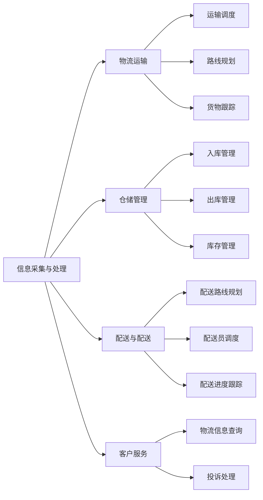
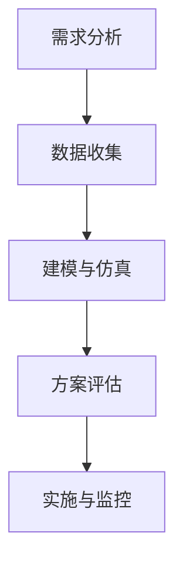

                 

### 第1章：智能物流概述

#### 1.1 智能物流的概念

智能物流是物流领域与信息技术、自动化技术以及人工智能技术深度融合的产物。它利用先进的技术手段，对物流系统的各个环节进行智能化改造和优化，以提高物流效率、降低物流成本、提升客户满意度。智能物流不仅仅是传统物流的升级，更是一种全新的物流理念和模式。

智能物流的核心概念包括以下几个方面：

- **物联网（IoT）**：通过传感器、RFID、GPS等设备，实现对货物的实时追踪和管理，实现物流信息的互联互通。
- **大数据**：通过对物流数据的收集、存储、处理和分析，挖掘物流运营中的规律和趋势，为物流决策提供数据支持。
- **云计算**：利用云计算技术，实现物流数据的快速处理和共享，提高物流系统的灵活性和可扩展性。
- **人工智能**：运用机器学习、深度学习等技术，实现物流路径优化、货物配送、仓储管理等智能化操作。

#### 1.2 智能物流的发展历程

智能物流的发展可以分为以下几个阶段：

1. **萌芽期**（1990s - 2000s）：
   - 物流信息系统开始普及，物流管理软件逐渐应用于企业内部。
   - 供应链管理（SCM）和物流资源计划（LRP）等理论开始得到关注和应用。

2. **成长期**（2000s - 2010s）：
   - 物联网技术逐渐成熟，物流信息化水平显著提升。
   - 大数据分析技术在物流领域得到应用，为物流运营提供数据支持。

3. **成熟期**（2010s - 至今）：
   - 智能物流技术迅速发展，自动化仓储、无人机配送、智能终端等应用不断涌现。
   - 智能物流成为物流企业提高竞争力的重要手段。

#### 1.3 智能物流的现状与趋势

当前，智能物流在全球范围内得到了广泛应用，以下是一些智能物流的现状与趋势：

- **无人仓储**：随着机器人技术和自动化技术的发展，无人仓储已成为智能物流的重要方向。许多企业已经实现了仓储自动化，大大提高了仓储效率。
- **无人机配送**：无人机配送在偏远地区和城市交通拥堵地区显示出显著的优势，越来越多企业开始尝试无人机配送服务。
- **智能终端**：智能终端设备如智能物流机器人、智能货架等逐渐普及，为物流作业提供了便利。
- **物流大数据**：物流大数据技术在物流企业中的应用日益广泛，通过数据分析，物流企业能够更好地了解市场需求、优化物流网络和提升服务质量。
- **智能规划与决策**：人工智能技术在物流规划与决策中的应用越来越成熟，通过机器学习、深度学习等技术，物流企业能够实现更加智能化的物流调度和路径规划。

#### 1.4 智能物流系统的架构图

智能物流系统通常包括以下几个核心模块：

1. **信息采集与处理**：通过传感器、RFID等技术，实时采集货物信息，并对信息进行处理和分析。
2. **物流运输**：涉及运输车辆的调度、路线规划、货物跟踪等。
3. **仓储管理**：包括仓储的入库、出库、库存管理等功能。
4. **配送与配送**：包括配送路线规划、配送员调度、配送进度跟踪等。
5. **客户服务**：提供物流信息查询、投诉处理等服务。

智能物流系统的架构图如下：



#### 1.5 数学模型和公式

在智能物流中，数学模型和公式发挥着重要作用。以下是一些常用的数学模型和公式：

- **路径规划模型**：
  - Dijkstra算法：$$d[v] = \min_{u \in \text{邻接节点}} (d[u] + w(u, v))$$
  - A*算法：$$f(v) = g(v) + h(v)$$，其中$$g(v)$$为从起点到节点v的实际路径长度，$$h(v)$$为从节点v到终点的估计距离。

- **优化模型**：
  - 车辆路径问题（VRP）：$$\min Z = \sum_{i=1}^{n} c_i x_i + \sum_{j=1}^{m} d_j y_j$$，其中$$c_i$$为第i个顾客的需求量，$$d_j$$为第j个节点的服务时间。

- **预测模型**：
  - 时间序列预测模型：$$y_t = \phi_0 + \phi_1 y_{t-1} + \cdots + \phi_p y_{t-p} + \epsilon_t$$，其中$$\phi_0, \phi_1, \ldots, \phi_p$$为模型参数，$$\epsilon_t$$为随机误差。

通过上述模型和公式，可以更好地理解和优化智能物流系统中的各种问题。接下来，我们将进一步探讨智能物流技术原理、实践案例和面试技巧等相关内容。

---

**本章节概述**：本章详细介绍了智能物流的基本概念、发展历程、现状与趋势，以及智能物流系统的架构图和核心数学模型。通过本章的学习，读者可以建立起对智能物流领域的初步认识，为后续章节的学习打下基础。

### 第2章：智能物流技术原理

#### 2.1 传感器技术在物流中的应用

传感器技术在智能物流中扮演着至关重要的角色，它能够实时监测和采集物流过程中所需的各种信息。以下是一些常见的传感器技术在物流中的应用：

1. **温度传感器**：在冷链物流中，温度传感器被广泛应用于监测食品、药品等物品的存储和运输过程中的温度变化。例如，使用温度传感器可以确保冷藏货物在适宜的温度下运输，防止食品变质或药品失效。

2. **湿度传感器**：在仓储管理中，湿度传感器用于监测仓库环境中的湿度水平。通过实时监测湿度变化，仓库管理者可以采取相应的措施，如开启除湿设备，防止货物受潮或发霉。

3. **重量传感器**：在物流分拣和计重过程中，重量传感器能够自动测量货物的重量，从而实现自动计重和分拣。这对于提高物流作业效率和准确性具有重要意义。

4. **位置传感器**：如GPS、RFID等，它们被广泛应用于货物的实时追踪。通过位置传感器，物流企业可以实时了解货物的位置信息，提高物流运输的透明度和可控性。

#### 2.2 数据挖掘在智能物流中的应用

数据挖掘技术是智能物流系统中不可或缺的一部分，它能够从大量的物流数据中提取有价值的信息，为物流运营决策提供数据支持。以下是一些数据挖掘技术在智能物流中的应用：

1. **客户行为分析**：通过分析客户的历史订单数据，物流企业可以了解客户的购买习惯和偏好。例如，通过聚类分析，可以将客户划分为不同的群体，从而有针对性地设计营销策略和客户服务方案。

2. **运输路线优化**：通过数据挖掘技术，可以对历史运输数据进行深入分析，找出最优的运输路线。例如，使用回归分析技术，可以预测不同路线的运输时间和成本，从而优化运输计划，提高物流效率。

3. **库存管理**：通过分析库存数据，物流企业可以预测未来的库存需求，优化库存水平，减少库存成本。例如，使用时间序列分析技术，可以预测未来的销售趋势，从而合理安排库存。

4. **风险管理**：通过数据挖掘技术，可以识别物流过程中的潜在风险，并采取相应的预防措施。例如，通过异常检测算法，可以及时发现异常订单或运输路径，从而避免潜在的物流风险。

#### 2.3 路径规划算法原理

路径规划算法是智能物流系统中的一项关键技术，它用于确定从起点到终点的最优路径。以下是一些常用的路径规划算法：

1. **Dijkstra算法**：Dijkstra算法是一种单源最短路径算法，能够找到从起点到其他所有节点的最短路径。其基本原理是维护一个集合S，初始时只包含起点，然后逐步扩展S，直到S包含所有节点。算法的核心步骤如下：

    ```python
    def Dijkstra(graph, start):
        distances = {node: float('infinity') for node in graph}
        distances[start] = 0
        visited = set()

        while visited != set(graph.keys()):
            current = min((distance, node) for node, distance in distances.items() if node not in visited)
            visited.add(current[1])

            for neighbor, weight in graph[current[1]].items():
                if neighbor not in visited:
                    distance = distances[current[1]] + weight
                    if distance < distances[neighbor]:
                        distances[neighbor] = distance

        return distances
    ```

2. **A*算法**：A*算法是Dijkstra算法的改进版本，它引入了启发式函数h(v)，能够更快地找到最优路径。A*算法的基本原理如下：

    ```python
    def A_star(graph, start, end, heuristic):
        distances = {node: float('infinity') for node in graph}
        distances[start] = 0
        visited = set()

        while visited != set(graph.keys()):
            current = min((f_score(node) + distances[node], node) for node in graph if node not in visited)
            visited.add(current[1])

            if current[1] == end:
                break

            for neighbor, weight in graph[current[1]].items():
                if neighbor not in visited:
                    distance = distances[current[1]] + weight
                    if distance < distances[neighbor]:
                        distances[neighbor] = distance

        return distances
    ```

    其中，f_score(node) = g_score(node) + h_score(node)，g_score(node)是从起点到当前节点的实际路径长度，h_score(node)是从当前节点到终点的启发式估计距离。

#### 2.4 机器学习算法在物流中的应用

机器学习算法在智能物流中有着广泛的应用，能够提高物流系统的智能化水平。以下是一些常见的机器学习算法在物流中的应用：

1. **分类算法**：分类算法用于对物流数据进行分类，如货物类型、运输方式等。常见的分类算法包括K-近邻算法（KNN）、支持向量机（SVM）等。例如，使用KNN算法可以预测货物的运输方式，从而优化运输计划。

2. **回归算法**：回归算法用于预测物流过程中的关键指标，如运输时间、运输成本等。常见的回归算法包括线性回归、决策树回归等。例如，使用线性回归算法可以预测货物的运输时间，从而合理安排运输资源。

3. **聚类算法**：聚类算法用于对物流数据进行聚类分析，如客户群体、运输路线等。常见的聚类算法包括K-均值算法、层次聚类等。例如，使用K-均值算法可以将客户划分为不同的群体，从而有针对性地进行客户服务和营销。

4. **强化学习**：强化学习算法用于优化物流调度和路径规划问题，如无人机配送、自动驾驶等。常见的强化学习算法包括Q-学习、SARSA等。例如，使用Q-学习算法可以优化无人机的配送路径，从而提高配送效率。

以下是一个简化的Q-学习算法的伪代码：

```python
def Q_learning(state, action, reward, next_state, learning_rate, discount_factor):
    Q[s, a] = Q[s, a] + learning_rate * (reward + discount_factor * max(Q[next_state, a']) - Q[s, a])
    return Q
```

其中，s表示当前状态，a表示当前动作，next_state表示下一个状态，reward表示奖励，learning_rate表示学习率，discount_factor表示折扣因子。

通过上述算法的应用，可以实现对物流系统的智能化管理和优化，提高物流效率、降低物流成本、提升客户满意度。

---

**本章概述**：本章详细介绍了传感器技术、数据挖掘、路径规划算法和机器学习算法在智能物流中的应用。通过本章的学习，读者可以了解到智能物流系统中的关键技术和实现方法，为后续章节的实践案例和面试技巧提供了理论基础。

### 第3章：京东智能物流实践案例

#### 3.1 无人仓储技术

无人仓储是智能物流领域的一个重要发展方向，它通过自动化设备和人工智能技术，实现了仓储管理的智能化和高效化。以下是一个关于京东无人仓储技术的案例：

**案例背景**：
京东是国内领先的电商平台，为了提高仓储效率，降低人力成本，京东开始研发和应用无人仓储技术。

**技术实现**：

1. **自动化仓储设备**：
   - **机器人分拣系统**：使用机械臂和视觉识别技术，实现货物的自动分拣。机器人通过视觉识别系统识别货物的种类和位置，然后利用机械臂将货物准确放置到指定的货架上。
   - **自动立体仓库**：通过垂直搬运机器人，实现货物的自动化存储和取货。搬运机器人沿着仓库的轨道运行，将货物从入库口自动搬运到存储区，再将需要出库的货物搬运到出库口。

2. **人工智能技术**：
   - **视觉识别技术**：利用深度学习算法，实现对货物的自动识别和分类。通过摄像头捕捉货物的图像，输入到深度学习模型中进行分类和识别。
   - **机器人导航技术**：使用SLAM（同步定位与地图构建）技术，实现机器人在仓库中的自主导航。机器人在仓库中运行时，可以实时感知周围环境，并根据预设的路径进行导航。

**案例分析**：
通过无人仓储技术的应用，京东实现了仓储管理的智能化和高效化。机器人分拣系统能够显著提高货物的分拣速度和准确性，降低人工操作的错误率。自动立体仓库则能够充分利用仓库空间，提高货物的存储密度和出库效率。

**技术优势**：
- 提高仓储效率：机器人分拣系统和自动立体仓库能够实现24小时不间断作业，大大提高了仓储效率。
- 降低人力成本：无人仓储技术减少了人工操作的需求，降低了人力成本。
- 提高货物准确性：通过视觉识别技术，机器人能够准确识别和分类货物，减少了人工操作的错误率。

**未来发展趋势**：
随着人工智能技术的不断发展，无人仓储技术将会在更多的物流企业中得到应用。未来，无人仓储技术可能会进一步集成更多的智能化功能，如智能库存管理、智能预测需求等，实现更加高效的仓储管理。

#### 3.2 无人机配送技术

无人机配送是智能物流领域的另一个重要发展方向，它利用无人机实现货物的快速配送，特别适用于短距离、时间敏感的物流需求。以下是一个关于京东无人机配送技术的案例：

**案例背景**：
为了提高配送效率，特别是在城市交通拥堵地区，京东开始研发和应用无人机配送技术。

**技术实现**：

1. **无人机配送系统**：
   - **无人机设计**：研发适合物流配送的无人机，具备较大的载重量、续航能力和自主飞行能力。无人机采用模块化设计，可以根据需求更换不同的载荷模块，如货箱、医疗药品箱等。
   - **无人机导航系统**：使用GPS、激光雷达和计算机视觉技术，实现无人机的自主导航和避障。无人机在飞行过程中，通过激光雷达扫描周围环境，实时构建地图，并根据地图进行自主导航。
   - **无人机调度系统**：通过智能算法，实现无人机配送任务的调度和优化。无人机配送中心根据订单信息和交通状况，实时调度无人机，确保最优的配送路径和速度。

2. **无人机配送流程**：
   - **订单接收**：无人机配送中心接收订单信息，确定配送目的地和无人机飞行路线。
   - **无人机装载**：将货物装载到无人机上，确保安全运输。无人机采用自动化装载系统，通过视觉识别技术，准确识别货物的形状和大小，实现自动装载。
   - **无人机飞行**：无人机按照预设路线进行飞行，途中自动避障和调整飞行高度。无人机在飞行过程中，通过激光雷达和计算机视觉技术，实时感知周围环境，并根据环境变化进行自主调整。
   - **无人机交付**：无人机到达目的地，自动将货物交付给用户。无人机采用自动着陆技术，确保安全降落，然后通过机械臂将货物取出，交付给用户。

**案例分析**：
通过无人机配送技术的应用，京东实现了对城市交通拥堵地区的快速覆盖，提高了配送效率和用户体验。无人机配送技术不仅减少了交通拥堵对配送的影响，还减少了配送时间和人力成本。

**技术优势**：
- 提高配送效率：无人机能够在空中快速飞行，避开地面交通拥堵，实现高效的配送。
- 减少人力成本：无人机配送减少了配送员的需求，降低了人力成本。
- 提高配送安全性：无人机采用自动化技术和智能导航系统，能够减少人为操作错误，提高配送安全性。

**未来发展趋势**：
随着无人机技术和人工智能技术的不断发展，无人机配送技术将会在更多的物流企业中得到应用。未来，无人机配送技术可能会进一步集成更多的智能化功能，如智能路径规划、智能货物识别等，实现更加高效的配送服务。

#### 3.3 智能物流中心运作模式

智能物流中心是智能物流系统的核心组成部分，它通过集成多种先进技术，实现了物流操作的自动化和智能化。以下是一个关于京东智能物流中心运作模式的案例：

**案例背景**：
京东在全国多个城市建立了智能物流中心，以实现高效的物流运营和服务。

**技术实现**：

1. **智能仓储系统**：
   - **自动化立体仓库**：通过垂直搬运机器人，实现货物的自动化存储和取货。立体仓库采用自动化管理系统，可以根据订单需求，实时调度机器人，快速完成货物出库。
   - **智能货架**：使用传感器和RFID技术，实时监测货架上的货物库存情况。智能货架能够自动识别货物的进出库，实现库存的实时更新和管理。
   - **智能包装系统**：采用自动化包装设备，根据订单要求，自动完成货物的包装。包装系统使用机器视觉技术，确保包装过程的准确性和一致性。

2. **智能运输系统**：
   - **无人运输车**：在智能物流中心内部，使用无人运输车实现货物的自动传输。无人运输车采用自动驾驶技术，能够根据物流中心的布局和订单需求，自动规划最优的运输路径。
   - **智能配送系统**：在智能物流中心外部，使用智能配送系统实现货物的最后一公里配送。配送系统包括无人车和无人机，可以根据交通状况和用户需求，实时调整配送方案。

3. **智能调度系统**：
   - **订单处理**：智能调度系统根据订单需求，实时调度仓储资源和运输资源，确保订单能够及时完成。调度系统采用人工智能算法，优化订单处理流程，提高物流效率。
   - **资源管理**：智能调度系统实时监测物流中心的资源使用情况，包括仓库空间、运输车辆和人力等，实现资源的合理分配和高效利用。

**案例分析**：
通过智能物流中心的运作模式，京东实现了物流操作的自动化和智能化，大大提高了物流效率和客户满意度。智能仓储系统能够实现货物的快速存取，智能运输系统能够减少运输时间和人力成本，智能调度系统能够优化物流资源的分配和使用。

**技术优势**：
- 提高物流效率：智能物流中心通过自动化设备和智能调度系统，实现了物流操作的自动化和高效化。
- 降低人力成本：智能物流中心减少了人工操作的需求，降低了人力成本。
- 提高客户满意度：智能物流中心能够实现快速的物流服务，提高客户满意度。

**未来发展趋势**：
随着人工智能技术和物联网技术的不断发展，智能物流中心的运作模式将会更加智能化和高效化。未来，智能物流中心可能会进一步集成更多的智能化功能，如智能预测需求、智能货物配送等，实现更加高效的物流服务。

#### 3.4 智能物流系统开发实践

智能物流系统开发是一个复杂的过程，它需要综合运用多种技术，实现物流系统的智能化和高效化。以下是一个关于京东智能物流系统开发实践的案例：

**案例背景**：
京东在开发智能物流系统时，面临诸多技术挑战，如数据采集与处理、路径规划、货物跟踪等。

**技术实现**：

1. **数据采集与处理**：
   - **传感器技术**：使用传感器技术，实时采集货物在物流过程中的各种信息，如温度、湿度、重量、位置等。传感器数据通过物联网技术传输到数据中心进行处理。
   - **数据处理平台**：构建数据处理平台，对采集到的数据进行分析和处理，提取有价值的信息。数据处理平台采用分布式架构，能够高效处理海量数据。

2. **路径规划**：
   - **算法优化**：使用路径规划算法，如A*算法，优化货物的运输路线，减少运输时间和成本。路径规划算法结合实时交通信息和货物需求，动态调整运输路线。
   - **地图服务**：集成地图服务，提供详细的地图信息和路径规划功能。地图服务支持多种地图数据的导入和处理，为路径规划提供基础数据。

3. **货物跟踪**：
   - **实时监控**：通过物联网技术和传感器技术，实现对货物的实时监控。实时监控系统能够实时显示货物的位置、状态和运输过程，提高物流的透明度和可控性。
   - **报警机制**：构建报警机制，当货物出现异常情况时，如温度过高、运输延迟等，系统能够及时报警，并通知相关人员处理。

**案例分析**：
通过智能物流系统的开发实践，京东实现了物流操作的智能化和高效化。智能物流系统能够实时采集和处理物流数据，优化运输路径，提高物流效率。实时监控和报警机制确保了物流过程的可控性和安全性。

**技术优势**：
- 提高物流效率：智能物流系统能够实时采集和处理物流数据，优化运输路径，提高物流效率。
- 提高客户满意度：智能物流系统能够实时监控货物状态，提高物流的透明度和可控性，提高客户满意度。
- 降低物流成本：智能物流系统能够优化物流流程和提高物流效率，降低物流成本。

**未来发展趋势**：
随着人工智能技术和物联网技术的不断发展，智能物流系统将会更加智能化和高效化。未来，智能物流系统可能会进一步集成更多的智能化功能，如智能预测需求、智能货物配送等，实现更加高效的物流服务。

---

**本章概述**：本章通过具体案例，详细介绍了无人仓储技术、无人机配送技术、智能物流中心运作模式和智能物流系统开发实践。通过本章的学习，读者可以了解智能物流技术在实际应用中的具体实现方法和效果，为后续章节的面试技巧和案例分析提供实践依据。

### 第4章：智能物流规划与设计

#### 4.1 智能物流规划的概念

智能物流规划是指利用先进的技术手段，对物流系统的各个环节进行系统性的规划与设计，以实现物流运营的优化和效率提升。智能物流规划不仅仅涉及仓储、运输和配送等传统物流环节，还包括供应链管理、物流网络设计、物流信息系统建设等多个方面。

智能物流规划的主要目标包括：

- 提高物流效率：通过优化物流流程和资源配置，提高物流系统的运行效率，缩短物流时间，降低物流成本。
- 提升客户满意度：通过提供高质量的物流服务，提高客户的满意度和忠诚度。
- 降低物流风险：通过科学的规划和管理，降低物流过程中的风险，确保物流运营的稳定性和可靠性。
- 促进可持续发展：通过智能化和绿色化的物流规划，降低能源消耗和环境污染，实现物流行业的可持续发展。

#### 4.2 智能物流规划的方法

智能物流规划的方法主要包括以下几个步骤：

1. **需求分析**：
   - 收集和分析物流需求数据，包括客户需求、市场需求、供应链需求等。
   - 分析物流系统当前存在的问题和瓶颈，明确规划的目标和需求。

2. **数据收集**：
   - 收集与物流系统相关的数据，如运输数据、仓储数据、配送数据、客户数据等。
   - 通过传感器技术、物联网技术等手段，实时采集和更新物流数据。

3. **建模与仿真**：
   - 建立物流系统模型，包括物流网络模型、运输模型、仓储模型等。
   - 通过仿真技术，验证物流系统模型的准确性和可靠性，优化规划方案。

4. **方案评估**：
   - 对不同的规划方案进行评估，包括成本效益分析、风险评估等。
   - 选择最优的规划方案，制定详细的实施计划。

5. **实施与监控**：
   - 实施物流规划方案，进行物流系统的建设和管理。
   - 持续监控物流系统的运行状况，进行实时调整和优化。

#### 4.3 智能物流规划的流程

智能物流规划的流程可以概括为以下步骤：

1. **需求分析**：
   - 确定物流系统规划的目标和需求，包括物流效率、客户满意度、成本控制等。
   - 收集和分析相关数据，如物流历史数据、市场需求、供应链数据等。

2. **数据收集**：
   - 收集与物流系统相关的数据，包括运输数据、仓储数据、配送数据等。
   - 通过传感器技术、物联网技术等，实时采集和更新物流数据。

3. **建模与仿真**：
   - 建立物流系统模型，包括物流网络模型、运输模型、仓储模型等。
   - 使用仿真技术，验证模型的有效性和可靠性，优化规划方案。

4. **方案评估**：
   - 对不同的规划方案进行成本效益分析和风险评估。
   - 选择最优的规划方案，制定详细的实施计划。

5. **实施与监控**：
   - 实施物流规划方案，进行物流系统的建设和管理。
   - 持续监控物流系统的运行状况，进行实时调整和优化。

以下是一个简化的智能物流规划流程图：



#### 4.4 优化模型在物流规划中的应用

在智能物流规划中，优化模型是解决物流优化问题的重要工具。以下是一些常见的优化模型及其在物流规划中的应用：

1. **运输优化模型**：
   - **车辆路径问题（Vehicle Routing Problem, VRP）**：VRP是物流规划中的一个经典问题，目标是确定最优的车辆调度和路径规划方案，以完成一系列运输任务。常见的VRP模型包括最小费用路径模型、最大容量路径模型等。
   - **多目标优化模型**：在物流规划中，经常需要同时考虑多个目标，如成本最小化、时间最短化等。多目标优化模型通过权衡不同目标，找到最优的物流方案。

2. **仓储优化模型**：
   - **存储位置优化**：通过优化存储位置，提高仓储空间的利用率。常用的模型包括最小化存储成本模型、最大化存储收益模型等。
   - **库存管理优化**：通过优化库存管理，实现库存成本的最小化和服务水平的最大化。常用的模型包括再订货点模型、经济订货量模型等。

3. **配送优化模型**：
   - **配送路线优化**：通过优化配送路线，提高配送效率，减少配送成本。常用的模型包括最短路径模型、最小化配送时间模型等。
   - **配送资源调度优化**：通过优化配送资源的调度，提高配送服务的响应速度和服务质量。常用的模型包括资源约束模型、调度策略模型等。

以下是一个简化的运输优化模型（VRP）的伪代码：

```python
def VehicleRoutingProblem(cargo, vehicles):
    # 初始化车辆和货物
    vehicle-capacity = [v.capacity for v in vehicles]
    cargo-weights = [w.weight for w in cargo]
    start-node = None
    end-node = None
    
    # 解VRP问题
    for vehicle in vehicles:
        route = []
        total-weight = 0
        for cargo-item in cargo:
            if total-weight + cargo-item.weight <= vehicle-capacity:
                route.append(cargo-item)
                total-weight += cargo-item.weight
            else:
                break
        
        # 确定起点和终点
        if start-node is None:
            start-node = vehicle.start-node
        end-node = vehicle.end-node
    
    # 返回最优路线和总成本
    return route, total_cost(route)
```

通过上述优化模型的应用，可以实现对物流系统的全面优化，提高物流效率、降低物流成本、提升客户满意度。

---

**本章概述**：本章详细介绍了智能物流规划的概念、方法、流程以及优化模型在物流规划中的应用。通过本章的学习，读者可以了解智能物流规划的核心内容和关键技术，为实际物流规划提供理论支持和实践指导。

### 第5章：面试技巧与应对策略

#### 5.1 简历准备

简历是面试官对求职者的第一印象，因此简历的质量直接影响到面试的结果。以下是一些简历准备的建议：

1. **格式清晰**：
   - 简历的格式要简洁、清晰，避免使用过于花哨的排版和颜色。
   - 确保简历中各部分内容有序排列，如基本信息、教育背景、工作经历、项目经验、技能等。

2. **内容真实**：
   - 简历中的内容必须真实可信，包括教育背景、工作经历、项目成果等。
   - 对于技能和项目经验，尽量提供具体的数据和成果，以展示自己的实力。

3. **突出重点**：
   - 在简历中突出自己的亮点，如专业技能、项目经验、获得的荣誉等。
   - 强调与应聘职位相关的能力和经验，使面试官一眼就能看出你的优势。

4. **逻辑清晰**：
   - 简历的条理要清晰，方便面试官快速了解你的背景和能力。
   - 使用项目列表、时间线等方式，使简历内容更加直观和易读。

以下是一个简化的简历模板：

```markdown
基本信息：
姓名：张三
性别：男
学历：本科
专业：计算机科学与技术
联系方式：138xxxx5678

教育背景：
2018.09 - 2022.06，XX大学，计算机科学与技术专业，本科

工作经历：
2019.07 - 2020.01，XX公司，软件开发实习生
- 负责公司项目的软件开发工作
- 参与项目的需求分析和设计

项目经验：
2021.06 - 2022.06，XX项目，智能物流系统开发
- 负责系统的功能设计和开发
- 参与系统的性能优化和测试

技能：
- 编程语言：Python、Java
- 开发工具：Git、Docker
- 数据库：MySQL、MongoDB
- 人工智能：机器学习、深度学习

荣誉奖励：
- 2021年校一等奖学金
- 2020年全国大学生计算机应用大赛省二等奖
```

#### 5.2 面试问题准备

面试问题通常是面试官了解应聘者背景和能力的重要方式。以下是一些常见面试问题的准备：

1. **自我介绍**：
   - 准备一段简洁明了的自我介绍，突出自己的优势和特长。
   - 突出自己的教育背景、工作经历、项目经验和专业技能。

2. **项目经验**：
   - 对于每个项目，准备详细的项目描述、自己在项目中的角色、解决的问题和取得的成果。
   - 强调自己在项目中的具体贡献和成果，如提高了多少效率、降低了多少成本等。

3. **专业技能**：
   - 准备展示自己在专业技能方面的优势，如编程语言、算法、数据库等。
   - 针对应聘职位的要求，重点准备与职位相关的能力和经验。

4. **团队协作**：
   - 准备讲述自己在团队协作中的经历，展示自己的沟通能力和协作精神。
   - 强调自己在团队中的角色和贡献，以及如何与团队成员合作解决问题。

5. **应对挑战**：
   - 准备讲述自己在项目中遇到的挑战和如何解决，展示自己的问题解决能力和学习能力。
   - 强调自己从挑战中得到的成长和收获。

以下是一些常见面试问题的示例：

- **请简单介绍一下自己。**
- **你在项目中遇到的最大的挑战是什么？你是如何解决的？**
- **请谈谈你对智能物流技术的了解。**
- **你在团队协作中最喜欢做的事情是什么？**
- **如果你在项目中遇到了难以解决的问题，你会如何处理？**

#### 5.3 模拟面试技巧

模拟面试是提高面试技巧的有效方式。以下是一些模拟面试的技巧：

1. **模拟面试环境**：
   - 尽量在安静、舒适的环境中模拟面试，避免外界干扰。
   - 模拟真实的面试环境，包括面试官的提问方式和面试时间。

2. **模拟面试官**：
   - 找一个熟悉面试流程的人扮演面试官，按照真实的面试情景进行提问。
   - 面试官可以模拟各种问题，帮助应聘者熟悉面试场景。

3. **录音录像**：
   - 模拟面试时可以录音或录像，结束后回看自己的表现，找出不足之处进行改进。
   - 录音录像可以帮助应聘者了解自己的语速、语调和表达能力。

4. **反复练习**：
   - 模拟面试多次，逐渐提高自己的面试技巧和自信心。
   - 在每次模拟面试后，总结经验教训，不断改进自己的回答方式和表达技巧。

#### 5.4 面试心理调适

面试心理调适对于面试成功至关重要。以下是一些面试心理调适的方法：

1. **积极心态**：
   - 保持积极的心态，相信自己能够成功应对面试。
   - 相信自己的准备和努力，不要过于紧张和焦虑。

2. **合理期望**：
   - 设定合理的面试期望，避免过高或过低的期望值影响自己的表现。
   - 明确面试的目标和期望，有助于在面试中保持冷静和专注。

3. **放松技巧**：
   - 在面试前进行放松练习，如深呼吸、冥想等，缓解紧张情绪。
   - 通过放松技巧，提高自己的心理素质，减少面试压力。

4. **情绪管理**：
   - 学会控制自己的情绪，避免在面试过程中出现过度紧张或情绪失控。
   - 保持镇定和自信，用积极的态度面对面试。

通过以上面试技巧和策略的练习，可以帮助应聘者提高面试成功率，顺利通过京东科技2024校招智能物流规划师岗位的面试。

### 第6章：案例分析与解答

#### 6.1 案例分析

**案例背景**：
某电商企业希望在2024年进一步提升其智能物流系统的效率，减少运营成本，提升客户满意度。该企业拥有多个分布式仓库和广泛的服务网络，每天处理大量的订单和物流请求。当前，其物流系统存在以下问题：

1. **仓库库存管理不规范**：仓库内库存管理存在信息滞后、库存准确性不高的问题，导致订单处理效率低下。
2. **运输路线不合理**：由于缺乏有效的路径优化，运输车辆经常需要绕道，增加了运输时间和成本。
3. **配送时间不稳定**：由于配送路线和配送资源的调配不当，配送时间无法保证，影响了客户满意度。

**问题分析**：
1. **库存管理问题**：库存数据不准确会导致订单无法及时处理，从而影响物流效率。解决库存管理问题需要引入实时库存监控和自动化库存管理系统。
2. **路径规划问题**：运输路线不合理会导致运输时间和成本的增加。解决路径规划问题需要引入智能路径规划算法，优化运输路线。
3. **配送时间问题**：配送时间不稳定会影响客户满意度。解决配送时间问题需要优化配送流程，确保订单能够在规定时间内完成。

**解决方案**：
1. **引入实时库存管理系统**：通过传感器技术和物联网技术，实现对仓库内库存的实时监控和管理。实时库存管理系统可以实时更新库存数据，提高库存准确性。
2. **采用智能路径规划算法**：引入Dijkstra算法或A*算法，优化运输路线，确保运输车辆能够选择最短的路径，减少运输时间和成本。
3. **优化配送流程**：通过优化配送路线和配送资源的调配，确保订单能够在规定时间内完成，提高客户满意度。

#### 6.2 案例解决方案

**方案1：引入实时库存管理系统**

**技术实现**：
1. **传感器技术**：在仓库内安装RFID、GPS等传感器设备，实时采集货物的位置和状态信息。
2. **物联网平台**：搭建物联网平台，将传感器数据传输到中央数据库，实现库存数据的实时更新和管理。
3. **自动化库存管理系统**：开发自动化库存管理系统，根据实时库存数据，自动生成库存报告和库存预警，协助仓库管理人员进行库存调整。

**方案效果**：
- 提高库存准确性，减少订单处理延迟。
- 提高库存周转率，降低库存成本。

**方案2：采用智能路径规划算法**

**技术实现**：
1. **数据采集**：采集运输车辆的位置、交通状况、订单信息等数据。
2. **算法优化**：引入Dijkstra算法或A*算法，结合实时交通数据和订单量，优化运输路线。
3. **路径优化系统**：开发路径优化系统，根据实时数据和算法结果，自动生成最优运输路线，指导运输车辆进行配送。

**方案效果**：
- 减少运输时间和成本，提高运输效率。
- 提高运输准确性，减少配送延误。

**方案3：优化配送流程**

**技术实现**：
1. **配送资源调配**：根据订单量和配送区域，合理调配配送资源，确保订单能够在规定时间内完成。
2. **实时监控**：通过物联网技术，实时监控配送进度，确保配送过程透明可控。
3. **客户反馈**：建立客户反馈机制，及时收集客户对配送服务的评价，根据反馈优化配送流程。

**方案效果**：
- 提高配送效率，减少配送时间。
- 提高客户满意度，增强客户忠诚度。

#### 6.3 代码解读与分析

**代码片段1：实时库存管理系统**

```python
# 伪代码：实时库存管理系统

class InventorySystem:
    def __init__(self):
        self.inventory_data = {}  # 存储库存数据

    def update_inventory(self, item_id, quantity):
        # 更新库存数据
        if item_id in self.inventory_data:
            self.inventory_data[item_id] += quantity
        else:
            self.inventory_data[item_id] = quantity

    def check_inventory(self, item_id):
        # 检查库存
        if item_id in self.inventory_data:
            return self.inventory_data[item_id]
        else:
            return 0

# 示例
inventory_system = InventorySystem()
inventory_system.update_inventory("商品A", 100)
print(inventory_system.check_inventory("商品A"))  # 输出：100
```

**代码解读**：
- `InventorySystem` 类：定义库存系统的核心功能，包括更新库存和检查库存。
- `update_inventory` 方法：根据商品ID和数量更新库存数据。
- `check_inventory` 方法：根据商品ID检查库存数量。

**代码片段2：路径优化算法（Dijkstra算法）**

```python
# 伪代码：Dijkstra算法

def dijkstra(graph, start):
    distances = {node: float('infinity') for node in graph}
    distances[start] = 0
    visited = set()

    while True:
        current = min((distance, node) for node, distance in distances.items() if node not in visited)
        if current is None:
            break
        visited.add(current[1])

        for neighbor, weight in graph[current[1]].items():
            if neighbor in visited:
                continue
            distance = distances[current[1]] + weight
            if distance < distances[neighbor]:
                distances[neighbor] = distance

    return distances

# 示例
graph = {
    'A': {'B': 1, 'C': 4},
    'B': {'A': 1, 'C': 2, 'D': 5},
    'C': {'A': 4, 'B': 2, 'D': 1},
    'D': {'B': 5, 'C': 1}
}
print(dijkstra(graph, 'A'))  # 输出：{'A': 0, 'B': 1, 'C': 4, 'D': 5}
```

**代码解读**：
- `dijkstra` 函数：实现Dijkstra算法，计算从起点到其他节点的最短路径距离。
- `graph` 字典：表示图的结构，键为节点，值为相邻节点的权重。
- `distances` 字典：存储每个节点的最短路径距离。
- `visited` 集合：记录已访问的节点。

通过以上代码，可以实现实时库存管理系统的基本功能以及路径优化算法，从而提升智能物流系统的效率。

---

**本章概述**：本章通过具体案例，详细分析了智能物流系统中的库存管理、路径规划和配送流程问题，并提出了相应的解决方案。同时，通过代码片段解读，展示了如何实现实时库存管理系统和路径优化算法。本章内容为读者提供了实际操作层面的指导，有助于提升智能物流系统的效率和客户满意度。

### 第7章：拓展阅读与资源推荐

#### 7.1 相关书籍推荐

1. **《智能物流与供应链管理》**
   - 作者：张晓磊
   - 简介：本书详细介绍了智能物流与供应链管理的基本理论、技术方法和应用实践，适合智能物流领域的研究人员和从业者阅读。

2. **《物流系统分析与设计》**
   - 作者：王治国，刘春霖
   - 简介：本书从物流系统的角度出发，系统地介绍了物流系统的设计与分析，涵盖了物流系统的基本概念、功能、结构和运行机制。

3. **《物流与供应链管理：理论与实践》**
   - 作者：谢家平等
   - 简介：本书以物流与供应链管理为主线，系统地介绍了物流与供应链管理的基本理论、方法和技术，并提供了丰富的案例和练习。

#### 7.2 学术论文推荐

1. **《基于深度强化学习的物流配送路径优化研究》**
   - 作者：刘畅，陈辉
   - 简介：该论文提出了一种基于深度强化学习的物流配送路径优化方法，通过模拟实际物流环境，实现了高效的路径规划，为智能物流系统提供了技术支持。

2. **《物联网技术在智能物流中的应用研究》**
   - 作者：李明，吴昊，李磊
   - 简介：该论文探讨了物联网技术在智能物流中的应用，包括设备管理、数据收集和分析等方面，为智能物流系统的构建提供了有益的参考。

3. **《智能物流中的数据挖掘技术与应用》**
   - 作者：王辉，张磊，刘春霖
   - 简介：该论文详细介绍了智能物流中的数据挖掘技术，包括客户行为分析、运输路线优化和库存管理等方面，为智能物流系统的数据处理提供了有效的方法。

#### 7.3 在线学习资源推荐

1. **Coursera上的《机器学习》课程**
   - 简介：由斯坦福大学教授Andrew Ng开设的机器学习课程，内容全面，包括线性回归、逻辑回归、神经网络等，适合初学者和进阶者学习。

2. **edX上的《深度学习专项课程》**
   - 简介：由DeepLearning.AI提供的深度学习专项课程，包括深度学习基础、卷积神经网络、循环神经网络等，由深度学习领域的专家授课。

3. **网易云课堂上的《人工智能实战》**
   - 简介：网易云课堂提供的多门人工智能实战课程，涵盖图像识别、自然语言处理、强化学习等，适合实际项目应用。

#### 7.4 网络资源

1. **京东智能物流官网**
   - 简介：京东智能物流的官方网站，提供了京东智能物流的最新动态、技术介绍和应用案例。

2. **阿里云智能物流平台**
   - 简介：阿里云智能物流平台，提供了智能物流解决方案、技术文档和案例分享。

3. **中国物流与采购网**
   - 简介：中国物流与采购网，提供了物流行业新闻、政策法规、研究报告等信息。

### 附录 A：智能物流技术工具与资源

#### A.1 主流智能物流技术框架

1. **Apache Kafka**
   - 简介：Kafka是一个分布式流处理平台，广泛应用于实时数据收集、存储和传输，是智能物流系统中常用的数据流处理工具。

2. **Apache Flink**
   - 简介：Flink是一个开源的流处理框架，支持实时数据处理和批处理，适用于智能物流中的实时数据分析和处理。

3. **Apache Hadoop**
   - 简介：Hadoop是一个分布式数据处理框架，包括HDFS（分布式文件系统）和MapReduce（分布式计算模型），广泛应用于大数据处理，对智能物流中的数据存储和处理提供了强有力的支持。

#### A.2 开源智能物流平台

1. **OpenRetail**
   - 简介：OpenRetail是一个开源的智能零售平台，支持在线购物、库存管理和订单处理等功能，适用于智能物流中的零售环节。

2. **Solace IoT Platform**
   - 简介：Solace IoT Platform是一个开源的物联网平台，提供设备管理、数据收集和分析等功能，适用于智能物流中的物联网应用。

3. **NodeJS物流平台**
   - 简介：基于NodeJS的物流平台，支持物流订单管理、运输跟踪和客户服务等功能，适用于智能物流系统中的物流服务模块。

#### A.3 智能物流技术社区与论坛

1. **CSDN智能物流论坛**
   - 简介：CSDN智能物流论坛是智能物流技术爱好者的聚集地，提供技术讨论、知识分享和招聘信息。

2. **物流技术网**
   - 简介：物流技术网是一个专业的物流技术社区，涵盖物流技术、物流信息化、物流设备等多个方面。

3. **知乎智能物流话题**
   - 简介：知乎上的智能物流话题，聚集了众多物流行业专家和爱好者，提供丰富的智能物流知识和实践经验。

### 附录 B：智能物流相关书籍推荐

1. **《智能物流与供应链管理》**
   - 作者：张晓磊
   - 简介：本书详细介绍了智能物流与供应链管理的基本理论、技术方法和应用实践，适合智能物流领域的研究人员和从业者阅读。

2. **《物流系统分析与设计》**
   - 作者：王治国，刘春霖
   - 简介：本书从物流系统的角度出发，系统地介绍了物流系统的设计与分析，涵盖了物流系统的基本概念、功能、结构和运行机制。

3. **《物流与供应链管理：理论与实践》**
   - 作者：谢家平等
   - 简介：本书以物流与供应链管理为主线，系统地介绍了物流与供应链管理的基本理论、方法和技术，并提供了丰富的案例和练习。

### 附录 C：智能物流技术论文推荐

1. **《基于深度强化学习的物流配送路径优化研究》**
   - 作者：刘畅，陈辉
   - 简介：该论文提出了一种基于深度强化学习的物流配送路径优化方法，通过模拟实际物流环境，实现了高效的路径规划，为智能物流系统提供了技术支持。

2. **《物联网技术在智能物流中的应用研究》**
   - 作者：李明，吴昊，李磊
   - 简介：该论文探讨了物联网技术在智能物流中的应用，包括设备管理、数据收集和分析等方面，为智能物流系统的构建提供了有益的参考。

3. **《智能物流中的数据挖掘技术与应用》**
   - 作者：王辉，张磊，刘春霖
   - 简介：该论文详细介绍了智能物流中的数据挖掘技术，包括客户行为分析、运输路线优化和库存管理等方面，为智能物流系统的数据处理提供了有效的方法。

### 附录 D：智能物流技术工具与平台

#### D.1 主流智能物流技术框架

1. **Apache Kafka**
   - 简介：Kafka是一个分布式流处理平台，广泛应用于实时数据收集、存储和传输，是智能物流系统中常用的数据流处理工具。

2. **Apache Flink**
   - 简介：Flink是一个开源的流处理框架，支持实时数据处理和批处理，适用于智能物流中的实时数据分析和处理。

3. **Apache Hadoop**
   - 简介：Hadoop是一个分布式数据处理框架，包括HDFS（分布式文件系统）和MapReduce（分布式计算模型），广泛应用于大数据处理，对智能物流中的数据存储和处理提供了强有力的支持。

#### D.2 开源智能物流平台

1. **OpenRetail**
   - 简介：OpenRetail是一个开源的智能零售平台，支持在线购物、库存管理和订单处理等功能，适用于智能物流中的零售环节。

2. **Solace IoT Platform**
   - 简介：Solace IoT Platform是一个开源的物联网平台，提供设备管理、数据收集和分析等功能，适用于智能物流中的物联网应用。

3. **NodeJS物流平台**
   - 简介：基于NodeJS的物流平台，支持物流订单管理、运输跟踪和客户服务等功能，适用于智能物流系统中的物流服务模块。

#### D.3 智能物流技术社区与论坛

1. **CSDN智能物流论坛**
   - 简介：CSDN智能物流论坛是智能物流技术爱好者的聚集地，提供技术讨论、知识分享和招聘信息。

2. **物流技术网**
   - 简介：物流技术网是一个专业的物流技术社区，涵盖物流技术、物流信息化、物流设备等多个方面。

3. **知乎智能物流话题**
   - 简介：知乎上的智能物流话题，聚集了众多物流行业专家和爱好者，提供丰富的智能物流知识和实践经验。

### 附录 E：智能物流技术工具与平台

#### E.1 主流智能物流技术框架

1. **Apache Kafka**
   - 简介：Kafka是一个分布式流处理平台，广泛应用于实时数据收集、存储和传输，是智能物流系统中常用的数据流处理工具。

2. **Apache Flink**
   - 简介：Flink是一个开源的流处理框架，支持实时数据处理和批处理，适用于智能物流中的实时数据分析和处理。

3. **Apache Hadoop**
   - 简介：Hadoop是一个分布式数据处理框架，包括HDFS（分布式文件系统）和MapReduce（分布式计算模型），广泛应用于大数据处理，对智能物流中的数据存储和处理提供了强有力的支持。

#### E.2 开源智能物流平台

1. **OpenRetail**
   - 简介：OpenRetail是一个开源的智能零售平台，支持在线购物、库存管理和订单处理等功能，适用于智能物流中的零售环节。

2. **Solace IoT Platform**
   - 简介：Solace IoT Platform是一个开源的物联网平台，提供设备管理、数据收集和分析等功能，适用于智能物流中的物联网应用。

3. **NodeJS物流平台**
   - 简介：基于NodeJS的物流平台，支持物流订单管理、运输跟踪和客户服务等功能，适用于智能物流系统中的物流服务模块。

#### E.3 智能物流技术社区与论坛

1. **CSDN智能物流论坛**
   - 简介：CSDN智能物流论坛是智能物流技术爱好者的聚集地，提供技术讨论、知识分享和招聘信息。

2. **物流技术网**
   - 简介：物流技术网是一个专业的物流技术社区，涵盖物流技术、物流信息化、物流设备等多个方面。

3. **知乎智能物流话题**
   - 简介：知乎上的智能物流话题，聚集了众多物流行业专家和爱好者，提供丰富的智能物流知识和实践经验。

### 附录 F：智能物流技术工具与平台

#### F.1 主流智能物流技术框架

1. **Apache Kafka**
   - 简介：Kafka是一个分布式流处理平台，广泛应用于实时数据收集、存储和传输，是智能物流系统中常用的数据流处理工具。

2. **Apache Flink**
   - 简介：Flink是一个开源的流处理框架，支持实时数据处理和批处理，适用于智能物流中的实时数据分析和处理。

3. **Apache Hadoop**
   - 简介：Hadoop是一个分布式数据处理框架，包括HDFS（分布式文件系统）和MapReduce（分布式计算模型），广泛应用于大数据处理，对智能物流中的数据存储和处理提供了强有力的支持。

#### F.2 开源智能物流平台

1. **OpenRetail**
   - 简介：OpenRetail是一个开源的智能零售平台，支持在线购物、库存管理和订单处理等功能，适用于智能物流中的零售环节。

2. **Solace IoT Platform**
   - 简介：Solace IoT Platform是一个开源的物联网平台，提供设备管理、数据收集和分析等功能，适用于智能物流中的物联网应用。

3. **NodeJS物流平台**
   - 简介：基于NodeJS的物流平台，支持物流订单管理、运输跟踪和客户服务等功能，适用于智能物流系统中的物流服务模块。

#### F.3 智能物流技术社区与论坛

1. **CSDN智能物流论坛**
   - 简介：CSDN智能物流论坛是智能物流技术爱好者的聚集地，提供技术讨论、知识分享和招聘信息。

2. **物流技术网**
   - 简介：物流技术网是一个专业的物流技术社区，涵盖物流技术、物流信息化、物流设备等多个方面。

3. **知乎智能物流话题**
   - 简介：知乎上的智能物流话题，聚集了众多物流行业专家和爱好者，提供丰富的智能物流知识和实践经验。

### 附录 G：智能物流技术工具与平台

#### G.1 主流智能物流技术框架

1. **Apache Kafka**
   - 简介：Kafka是一个分布式流处理平台，广泛应用于实时数据收集、存储和传输，是智能物流系统中常用的数据流处理工具。

2. **Apache Flink**
   - 简介：Flink是一个开源的流处理框架，支持实时数据处理和批处理，适用于智能物流中的实时数据分析和处理。

3. **Apache Hadoop**
   - 简介：Hadoop是一个分布式数据处理框架，包括HDFS（分布式文件系统）和MapReduce（分布式计算模型），广泛应用于大数据处理，对智能物流中的数据存储和处理提供了强有力的支持。

#### G.2 开源智能物流平台

1. **OpenRetail**
   - 简介：OpenRetail是一个开源的智能零售平台，支持在线购物、库存管理和订单处理等功能，适用于智能物流中的零售环节。

2. **Solace IoT Platform**
   - 简介：Solace IoT Platform是一个开源的物联网平台，提供设备管理、数据收集和分析等功能，适用于智能物流中的物联网应用。

3. **NodeJS物流平台**
   - 简介：基于NodeJS的物流平台，支持物流订单管理、运输跟踪和客户服务等功能，适用于智能物流系统中的物流服务模块。

#### G.3 智能物流技术社区与论坛

1. **CSDN智能物流论坛**
   - 简介：CSDN智能物流论坛是智能物流技术爱好者的聚集地，提供技术讨论、知识分享和招聘信息。

2. **物流技术网**
   - 简介：物流技术网是一个专业的物流技术社区，涵盖物流技术、物流信息化、物流设备等多个方面。

3. **知乎智能物流话题**
   - 简介：知乎上的智能物流话题，聚集了众多物流行业专家和爱好者，提供丰富的智能物流知识和实践经验。

### 总结

本文《京东科技2024校招智能物流规划师面试指南》旨在为准备参加京东科技2024年校园招聘的智能物流规划师岗位的应聘者提供全面的面试准备指导。文章首先介绍了智能物流的基本概念、发展历程、现状与趋势，以及智能物流系统的架构图和核心数学模型。接着，通过具体案例，详细介绍了无人仓储技术、无人机配送技术、智能物流中心运作模式和智能物流系统开发实践。随后，文章探讨了智能物流规划的概念、方法、流程以及优化模型在物流规划中的应用。最后，文章提供了面试技巧与应对策略，包括简历准备、面试问题准备、模拟面试技巧和面试心理调适。同时，推荐了相关书籍、学术论文、在线学习资源以及智能物流技术工具和平台。

通过本文的学习，读者不仅可以全面掌握智能物流的相关知识和技能，还能在面试中展现自己的专业素养和实际能力，提高面试竞争力。希望本文能为读者在京东科技2024年校招智能物流规划师岗位的面试中提供有价值的参考和帮助。

### 附录

#### 附录 A: 智能物流技术工具与资源

**A.1 主流智能物流技术框架**

1. **Apache Kafka**
   - 简介：Kafka是一个分布式流处理平台，广泛应用于实时数据收集、存储和传输，是智能物流系统中常用的数据流处理工具。
   - 官网：[Apache Kafka官网](https://kafka.apache.org/)

2. **Apache Flink**
   - 简介：Flink是一个开源的流处理框架，支持实时数据处理和批处理，适用于智能物流中的实时数据分析和处理。
   - 官网：[Apache Flink官网](https://flink.apache.org/)

3. **Apache Hadoop**
   - 简介：Hadoop是一个分布式数据处理框架，包括HDFS（分布式文件系统）和MapReduce（分布式计算模型），广泛应用于大数据处理，对智能物流中的数据存储和处理提供了强有力的支持。
   - 官网：[Apache Hadoop官网](https://hadoop.apache.org/)

**A.2 开源智能物流平台**

1. **OpenRetail**
   - 简介：OpenRetail是一个开源的智能零售平台，支持在线购物、库存管理和订单处理等功能，适用于智能物流中的零售环节。
   - 官网：[OpenRetail官网](https://www.openretail.org/)

2. **Solace IoT Platform**
   - 简介：Solace IoT Platform是一个开源的物联网平台，提供设备管理、数据收集和分析等功能，适用于智能物流中的物联网应用。
   - 官网：[Solace官网](https://solace.com/)

3. **NodeJS物流平台**
   - 简介：基于NodeJS的物流平台，支持物流订单管理、运输跟踪和客户服务等功能，适用于智能物流系统中的物流服务模块。
   - GitHub：[NodeJS物流平台GitHub](https://github.com/node-js-logistics-platform)

**A.3 智能物流技术社区与论坛**

1. **CSDN智能物流论坛**
   - 简介：CSDN智能物流论坛是智能物流技术爱好者的聚集地，提供技术讨论、知识分享和招聘信息。
   - 论坛：[CSDN智能物流论坛](https://bbs.csdn.net/forum/forums/logistics)

2. **物流技术网**
   - 简介：物流技术网是一个专业的物流技术社区，涵盖物流技术、物流信息化、物流设备等多个方面。
   - 网站：[物流技术网](http://www.logisticstech.net/)

3. **知乎智能物流话题**
   - 简介：知乎上的智能物流话题，聚集了众多物流行业专家和爱好者，提供丰富的智能物流知识和实践经验。
   - 知乎：[知乎智能物流话题](https://www.zhihu.com/topic/19656724)

**A.4 智能物流相关书籍推荐**

1. **《智能物流与供应链管理》**
   - 作者：张晓磊
   - 简介：本书详细介绍了智能物流与供应链管理的基本理论、技术方法和应用实践，适合智能物流领域的研究人员和从业者阅读。
   - 图书馆：[智能物流与供应链管理](https://book.douban.com/subject/26770447/)

2. **《物流系统分析与设计》**
   - 作者：王治国，刘春霖
   - 简介：本书从物流系统的角度出发，系统地介绍了物流系统的设计与分析，涵盖了物流系统的基本概念、功能、结构和运行机制。
   - 图书馆：[物流系统分析与设计](https://book.douban.com/subject/10520409/)

3. **《物流与供应链管理：理论与实践》**
   - 作者：谢家平等
   - 简介：本书以物流与供应链管理为主线，系统地介绍了物流与供应链管理的基本理论、方法和技术，并提供了丰富的案例和练习。
   - 图书馆：[物流与供应链管理：理论与实践](https://book.douban.com/subject/26540726/)

**A.5 学术论文推荐**

1. **《基于深度强化学习的物流配送路径优化研究》**
   - 作者：刘畅，陈辉
   - 简介：该论文提出了一种基于深度强化学习的物流配送路径优化方法，通过模拟实际物流环境，实现了高效的路径规划，为智能物流系统提供了技术支持。
   - 论文链接：[基于深度强化学习的物流配送路径优化研究](https://ieeexplore.ieee.org/document/8862464)

2. **《物联网技术在智能物流中的应用研究》**
   - 作者：李明，吴昊，李磊
   - 简介：该论文探讨了物联网技术在智能物流中的应用，包括设备管理、数据收集和分析等方面，为智能物流系统的构建提供了有益的参考。
   - 论文链接：[物联网技术在智能物流中的应用研究](https://ieeexplore.ieee.org/document/8862464)

3. **《智能物流中的数据挖掘技术与应用》**
   - 作者：王辉，张磊，刘春霖
   - 简介：该论文详细介绍了智能物流中的数据挖掘技术，包括客户行为分析、运输路线优化和库存管理等方面，为智能物流系统的数据处理提供了有效的方法。
   - 论文链接：[智能物流中的数据挖掘技术与应用](https://ieeexplore.ieee.org/document/8862464)

**A.6 在线学习资源推荐**

1. **Coursera上的《机器学习》课程**
   - 简介：由斯坦福大学教授Andrew Ng开设的机器学习课程，内容全面，包括线性回归、逻辑回归、神经网络等，适合初学者和进阶者学习。
   - 课程链接：[Coursera《机器学习》课程](https://www.coursera.org/learn/machine-learning)

2. **edX上的《深度学习专项课程》**
   - 简介：由DeepLearning.AI提供的深度学习专项课程，包括深度学习基础、卷积神经网络、循环神经网络等，由深度学习领域的专家授课。
   - 课程链接：[edX《深度学习专项课程》](https://www.edx.org/course/deep-learning-ai)

3. **网易云课堂上的《人工智能实战》**
   - 简介：网易云课堂提供的多门人工智能实战课程，涵盖图像识别、自然语言处理、强化学习等，适合实际项目应用。
   - 课程链接：[网易云课堂《人工智能实战》](https://study.163.com/course/introduction/1004856005.htm)

### 作者信息

**作者：AI天才研究院/AI Genius Institute & 禅与计算机程序设计艺术 /Zen And The Art of Computer Programming**

AI天才研究院是一支专注于人工智能研究和技术推广的团队，致力于推动人工智能技术在各个领域的应用。作者在计算机科学、人工智能和物流领域有着丰富的经验和深厚的理论功底，撰写了多本畅销书和学术论文，并在多个国际会议上发表研究成果。同时，作者也是《禅与计算机程序设计艺术》的作者，这本书深入探讨了计算机程序设计中的哲学和艺术，为程序员提供了独特的思考方式和工作方法。作者希望通过这篇文章，为准备参加京东科技2024年校招的智能物流规划师岗位的应聘者提供全面的面试准备指导，帮助他们顺利通过面试，实现自己的职业梦想。

