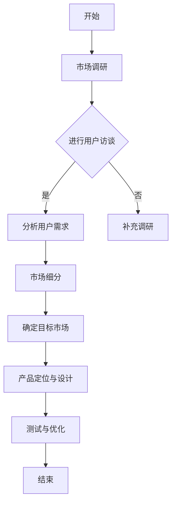

                 

### 引言与概述

在当前技术迅猛发展的时代，人工智能（AI）已经成为推动产业变革的重要力量。从自动驾驶、智能医疗到金融科技，人工智能的应用场景越来越广泛，这也吸引了大量的创业者和投资人的关注。然而，人工智能创业的成功并非偶然，其中市场需求的识别是至关重要的环节。为了帮助广大创业者更好地理解市场需求识别的方法，本文将系统地探讨人工智能创业中的市场需求识别问题。

#### 人工智能技术发展概况

人工智能作为计算机科学的一个分支，起源于20世纪50年代。随着计算能力的提升和大数据的涌现，人工智能技术得到了前所未有的发展。深度学习、自然语言处理、计算机视觉等关键技术逐渐成熟，为人工智能在各个领域的应用提供了强有力的技术支持。例如，深度学习在图像识别、语音识别等领域取得了显著成果，自然语言处理技术在智能客服、机器翻译等领域得到了广泛应用。

#### 人工智能创业的重要性

人工智能创业的重要性主要体现在以下几个方面：

1. **创新驱动力**：人工智能技术为创业提供了新的方向和机遇，可以推动新兴产业的快速发展。

2. **市场潜力**：随着人工智能技术的普及，越来越多的行业对其产生了需求，这为创业者提供了广阔的市场空间。

3. **投资吸引力**：人工智能领域的创业项目吸引了大量风险投资，为创业者提供了资金支持。

然而，人工智能创业也面临诸多挑战，如技术门槛高、市场竞争激烈等。因此，准确识别市场需求成为创业成功的关键。

#### 市场需求识别的重要性

市场需求识别是创业过程中的重要环节，其重要性体现在：

1. **产品定位**：通过识别市场需求，可以帮助创业者准确定位产品，满足用户需求。

2. **市场机会**：识别市场需求，可以发现潜在的市场机会，为创业者提供发展方向。

3. **降低风险**：通过市场需求识别，可以减少创业过程中因市场需求不明确而带来的风险。

#### 本书结构安排

本文将从以下几个方面展开：

1. **人工智能技术概述**：介绍人工智能的基本概念、关键技术及应用领域。
2. **市场需求分析理论**：探讨市场需求分析的基本概念、方法和预测。
3. **市场调研**：介绍市场调研的目的、方法及具体步骤。
4. **产品定位与设计**：讨论产品定位的重要性及产品设计的步骤和方法。
5. **市场需求识别的实践应用**：通过实际案例解析市场需求识别的过程。
6. **人工智能创业策略与实战**：分析创业策略制定及实战经验。
7. **未来展望**：展望人工智能创业的未来发展趋势。

通过本文的探讨，希望读者能够深入理解市场需求识别的重要性，掌握识别方法，为人工智能创业奠定坚实基础。

## 第1章 引言与概述

在当今快速变化的技术环境中，人工智能（AI）已经成为推动产业变革的核心力量。从自动驾驶、智能家居到医疗诊断，人工智能正在改变我们生活和工作方式的方方面面。然而，对于创业者而言，如何在众多竞争者中脱颖而出，找到市场的真正需求，成为创业成功的关键因素。

### 人工智能技术发展概况

人工智能的历史可以追溯到20世纪50年代，当时科学家们首次提出了“人工智能”这个概念。早期的AI主要集中在理论研究和基础算法的探索上，如逻辑推理、知识表示等。随着计算能力的提升和大数据的涌现，AI技术逐渐从理论走向实践，深度学习、自然语言处理、计算机视觉等关键技术得到了快速发展。

近年来，随着神经网络的兴起，深度学习在图像识别、语音识别等领域取得了重大突破。以AlphaGo为代表的AI系统在围棋等复杂决策领域展示了惊人的表现，进一步激发了人们对人工智能的探索热情。此外，自然语言处理技术的进步使得智能客服、机器翻译等应用变得普及，计算机视觉技术的发展也使得自动驾驶、智能监控等应用成为现实。

### 人工智能创业的重要性

人工智能创业的重要性体现在以下几个方面：

1. **创新驱动力**：AI技术为创业提供了新的方向和机遇，创业者可以利用AI技术解决传统行业中的痛点，推动新兴产业的发展。

2. **市场潜力**：随着人工智能技术的普及，越来越多的行业对其产生了需求，这为创业者提供了广阔的市场空间。例如，金融科技、医疗健康、智能制造等领域都已经成为人工智能创业的热点。

3. **投资吸引力**：人工智能领域的创业项目吸引了大量风险投资，为创业者提供了资金支持。许多知名投资机构都积极布局AI领域，希望通过投资AI项目获取高额回报。

然而，人工智能创业也面临诸多挑战，如技术门槛高、市场竞争激烈等。因此，准确识别市场需求成为创业成功的关键。

### 市场需求识别的重要性

市场需求识别在创业过程中的重要性不可忽视，主要体现在以下几个方面：

1. **产品定位**：通过识别市场需求，可以帮助创业者准确确定产品的功能、特点和目标用户，从而更好地满足用户需求。

2. **市场机会**：识别市场需求，可以发现潜在的市场机会，为创业者提供发展方向。例如，在某个新兴领域，如果市场需求旺盛但尚未被充分满足，创业者可以抓住这个机会，推出相关产品。

3. **降低风险**：通过市场需求识别，可以减少创业过程中因市场需求不明确而带来的风险。例如，在产品开发初期，如果发现了市场需求不足，创业者可以及时调整方向，避免资源的浪费。

### 市场需求与产品定位

市场需求识别与产品定位是紧密相连的两个环节。市场需求识别是产品定位的前提和基础，而产品定位则是市场需求识别的具体体现。

1. **市场需求识别**：创业者需要通过市场调研、用户访谈、数据分析等方法，了解目标市场的需求情况。这包括用户需求、竞争状况、市场规模等。

2. **产品定位**：基于市场需求识别的结果，创业者需要确定产品的定位。产品定位包括功能定位、目标用户定位、市场定位等。例如，如果市场需求显示用户需要一款能够提供实时语音翻译的应用，那么创业者可以将产品定位为实时语音翻译工具，面向商务人士和旅游者等目标用户群体。

通过市场需求识别和产品定位，创业者可以更好地把握市场动态，制定合理的战略，提高创业成功的可能性。

### 总结

在本章中，我们介绍了人工智能创业的背景与意义，阐述了市场需求识别的重要性。通过理解市场需求识别，创业者可以更准确地定位产品，发现市场机会，降低创业风险。下一章，我们将对人工智能技术进行详细概述，帮助读者更好地理解AI技术的基础和应用场景。

## 第2章 人工智能技术概述

人工智能（AI）作为计算机科学的一个重要分支，其发展历程可以追溯到20世纪50年代。从最初的理论探讨到今天的广泛应用，人工智能经历了多次技术变革，形成了多种不同的技术体系。在本节中，我们将对人工智能的基本概念、关键技术以及主要应用领域进行概述。

### 人工智能的基本概念

人工智能是指通过计算机程序实现智能行为的技术。人工智能的目的是让计算机模拟人类智能的某些方面，包括学习、推理、感知、理解和决策等。人工智能可以分为弱人工智能和强人工智能。弱人工智能是当前主流的人工智能形式，它专注于解决特定问题，如语音识别、图像识别等。而强人工智能则是指具备全面人类智能的计算机系统，可以理解、学习、思考并自主行动，这在目前仍属于科学幻想阶段。

人工智能的发展历程可以分为几个重要阶段：

1. **初始阶段（1956-1969）**：人工智能概念被首次提出，标志着人工智能研究的起步。

2. **泡沫与低谷阶段（1970-1980）**：由于技术限制和实际应用困难，人工智能研究进入低谷期。

3. **复兴与发展阶段（1980-2010）**：随着计算机性能的提升和大数据的出现，人工智能研究重新焕发生机，特别是在机器学习和深度学习领域取得了突破性进展。

4. **广泛应用阶段（2010至今）**：人工智能技术逐渐走向成熟，并广泛应用于各个领域。

### 人工智能的技术分类

人工智能技术可以根据其实现方式和应用领域进行分类。以下是几个主要的技术分类：

1. **机器学习（Machine Learning）**：机器学习是人工智能的核心技术之一，它通过数据驱动的方式，让计算机自动学习并改进性能。机器学习可以分为监督学习、无监督学习和强化学习。

    - **监督学习（Supervised Learning）**：监督学习通过已有数据的标签信息来训练模型，然后使用这些模型进行预测和分类。常见的监督学习算法包括线性回归、逻辑回归、决策树、支持向量机等。

    - **无监督学习（Unsupervised Learning）**：无监督学习不依赖于标签信息，主要通过发现数据中的结构和模式来进行聚类或降维。常见的无监督学习算法包括K-均值聚类、主成分分析（PCA）等。

    - **强化学习（Reinforcement Learning）**：强化学习通过与环境的交互来学习最优策略，其核心是奖励机制和策略优化。常见的强化学习算法包括Q-learning、Deep Q-Network（DQN）等。

2. **深度学习（Deep Learning）**：深度学习是机器学习的一种，它利用多层神经网络来学习数据中的复杂模式。深度学习在图像识别、语音识别、自然语言处理等领域取得了显著成就。常见的深度学习模型包括卷积神经网络（CNN）、循环神经网络（RNN）、长短时记忆网络（LSTM）等。

3. **自然语言处理（Natural Language Processing，NLP）**：自然语言处理是人工智能的一个重要分支，它涉及计算机理解和生成人类语言的技术。NLP的应用包括文本分类、情感分析、机器翻译、语音识别等。

4. **计算机视觉（Computer Vision）**：计算机视觉是让计算机理解图像和视频内容的技术。计算机视觉的应用包括图像识别、目标检测、图像分割、自动驾驶等。

5. **知识表示与推理（Knowledge Representation and Reasoning）**：知识表示与推理是人工智能的另一个重要领域，它研究如何表示知识和利用推理机制来解决问题。常见的知识表示方法包括谓词逻辑、产生式规则、语义网络等。

### 人工智能的关键技术

以下是人工智能的一些关键技术：

1. **神经网络（Neural Networks）**：神经网络是模仿人脑神经元连接方式的计算模型，是机器学习和深度学习的基础。神经网络通过调整连接权重来学习数据中的特征和模式。

2. **深度神经网络（Deep Neural Networks）**：深度神经网络是具有多个隐藏层的神经网络，可以学习更复杂的特征和模式。深度神经网络在图像识别、语音识别等领域取得了显著成就。

3. **卷积神经网络（Convolutional Neural Networks，CNN）**：卷积神经网络是专门用于处理图像数据的深度学习模型，其核心思想是利用卷积操作来提取图像特征。

4. **循环神经网络（Recurrent Neural Networks，RNN）**：循环神经网络是用于处理序列数据的神经网络，其特点是可以记忆历史信息。

5. **长短时记忆网络（Long Short-Term Memory，LSTM）**：长短时记忆网络是循环神经网络的一种变体，可以有效地处理长序列数据。

6. **生成对抗网络（Generative Adversarial Networks，GAN）**：生成对抗网络是由两个神经网络（生成器和判别器）组成的框架，可以生成逼真的图像和语音。

7. **强化学习（Reinforcement Learning）**：强化学习是让计算机通过与环境的交互来学习最优策略的一种方法，广泛应用于游戏、机器人控制和自动驾驶等领域。

### 人工智能应用领域介绍

人工智能技术已经被广泛应用于多个领域，以下是一些主要的应用领域：

1. **金融科技（FinTech）**：人工智能在金融科技领域有广泛的应用，如智能投顾、信用评分、风险管理等。

2. **医疗健康**：人工智能在医疗健康领域的应用包括疾病诊断、医学影像分析、药物研发等。

3. **智能制造**：人工智能在智能制造中的应用包括生产线的自动化控制、质量检测、设备故障预测等。

4. **自动驾驶**：自动驾驶是人工智能在交通领域的一个重要应用，通过计算机视觉、深度学习等技术实现车辆的自动驾驶。

5. **智能家居**：人工智能在智能家居中的应用包括智能音箱、智能照明、智能安防等。

6. **自然语言处理**：人工智能在自然语言处理领域有广泛的应用，如智能客服、机器翻译、情感分析等。

7. **娱乐与游戏**：人工智能在娱乐和游戏领域有广泛的应用，如游戏推荐、虚拟现实、智能客服等。

通过以上对人工智能技术的基本概念、关键技术和应用领域的概述，我们可以看到人工智能在各个领域的广泛应用，以及它对产业和社会的深刻影响。在下一章中，我们将探讨市场需求分析的基本概念和方法。

## 第3章 市场需求分析理论

市场需求分析是创业过程中至关重要的一环，它不仅关系到产品的成功与否，也直接影响到企业的盈利能力。在这一章中，我们将深入探讨市场需求分析的基本概念、方法以及市场趋势与预测。

### 市场需求分析的基本概念

#### 市场需求

市场需求是指在一定时期内，消费者在各种可能的价格水平下愿意且能够购买的产品数量。市场需求不仅包括消费者的购买意愿，还包括消费者的购买能力。市场需求通常用需求曲线来表示，需求曲线反映了价格与需求量之间的关系。

#### 市场潜力

市场潜力是指一个市场在未来一段时间内可能达到的最大需求量。市场潜力不仅取决于当前的市场需求，还包括潜在的市场增长机会。市场潜力可以通过市场调研、数据分析等方法进行评估。

### 市场需求分析方法

市场需求分析的方法可以分为定量分析和定性分析。

#### 定量分析

定量分析是通过数据分析和统计方法来评估市场需求。常用的定量分析方法包括：

1. **需求预测**：需求预测是定量分析的核心内容，它通过历史数据、市场趋势和影响因素来预测未来的市场需求。常用的需求预测方法包括时间序列分析、回归分析、ARIMA模型等。

2. **市场细分**：市场细分是将整个市场划分为若干具有相似需求的子市场，以便更精准地满足不同细分市场的需求。市场细分可以通过人口统计、地理统计、行为统计等方法进行。

3. **竞争分析**：竞争分析是通过分析竞争对手的市场行为、产品定位和市场份额来评估市场需求。竞争分析可以帮助企业了解市场状况，制定有效的竞争策略。

#### 定性分析

定性分析是通过主观判断和经验来评估市场需求。常用的定性分析方法包括：

1. **用户访谈**：用户访谈是直接与目标用户交流，了解他们的需求、偏好和使用习惯。用户访谈可以提供有价值的用户反馈，帮助企业更好地理解市场需求。

2. **专家咨询**：专家咨询是通过与行业专家、顾问等进行交流，获取他们对市场需求的专业见解。专家咨询可以帮助企业避免市场盲区，提高市场分析的准确性。

3. **案例研究**：案例研究是通过分析成功或失败的市场案例，总结市场需求分析的经验和教训。案例研究可以帮助企业从实际案例中学习，提高市场需求分析的能力。

### 市场趋势与预测

市场趋势是指市场在一段时间内的发展方向和变化规律。市场趋势分析是市场需求分析的重要环节，它可以帮助企业了解市场的变化，把握市场机遇。

#### 市场趋势分析

1. **技术趋势**：技术趋势是指与市场需求相关的技术发展动向。了解技术趋势可以帮助企业预测市场的发展方向，及时调整产品策略。

2. **消费趋势**：消费趋势是指消费者在购买行为、消费习惯等方面的变化。了解消费趋势可以帮助企业更好地满足消费者需求，提高市场竞争力。

3. **行业趋势**：行业趋势是指与市场需求相关的行业发展和变化。了解行业趋势可以帮助企业把握行业机遇，制定长期战略。

#### 预测方法

预测市场需求的常用方法包括：

1. **时间序列分析**：时间序列分析是一种基于历史数据的预测方法，它通过分析时间序列的趋势、季节性和周期性来预测未来的市场需求。

2. **回归分析**：回归分析是一种基于因果关系的数据分析方法，它通过建立变量之间的回归模型来预测市场需求。

3. **ARIMA模型**：ARIMA模型是一种自回归积分滑动平均模型，它通过分析时间序列的差分、自回归和移动平均特征来预测市场需求。

4. **神经网络**：神经网络是一种基于数据驱动的方法，它通过构建神经网络模型来预测市场需求。神经网络在处理复杂非线性关系方面具有优势。

5. **专家系统**：专家系统是一种基于知识规则的方法，它通过专家知识和逻辑推理来预测市场需求。专家系统在处理不确定性和模糊性方面具有优势。

### 总结

市场需求分析是创业成功的关键，它通过定量分析和定性分析来评估市场需求，预测市场趋势。通过市场需求分析，企业可以更好地理解市场，制定有效的产品策略和市场定位。在下一章中，我们将探讨市场调研的具体方法和步骤。

## 第4章 市场调研

市场调研是识别市场需求的关键步骤，它通过系统地收集、分析和解读市场信息，为创业企业提供决策依据。在这一章中，我们将详细介绍市场调研的目的与方法，以及市场调研的具体步骤和目标市场选择策略。

### 市场调研的目的

市场调研的主要目的是了解市场需求、竞争状况和消费者行为，从而为创业企业制定有效的市场策略。具体来说，市场调研的目的包括：

1. **了解市场需求**：通过市场调研，企业可以了解目标市场的需求状况，包括需求量、需求结构和需求变化趋势。这有助于企业更好地定位产品和制定销售策略。

2. **分析竞争状况**：市场调研可以帮助企业了解竞争对手的市场表现、产品特点、营销策略等，从而制定有效的竞争策略。

3. **评估市场潜力**：市场调研可以评估市场的增长潜力、市场规模和市场份额，为企业的长期发展规划提供依据。

4. **发现市场机会**：市场调研可以帮助企业发现潜在的市场机会，为企业的创新和产品开发提供方向。

5. **改进产品和服务**：市场调研可以收集用户反馈，帮助企业改进产品和服务，提高用户满意度。

### 市场调研的方法

市场调研的方法可以分为定性调研和定量调研。

#### 定性调研

定性调研主要通过主观判断和深度访谈等方式收集信息。定性调研的优点是能够深入了解用户需求和消费者行为，适用于探索性研究。常用的定性调研方法包括：

1. **用户访谈**：用户访谈是一种直接与目标用户交流的方法，通过开放性问题深入了解用户的需求、使用习惯和购买意图。

2. **焦点小组**：焦点小组是由一组目标用户组成的讨论小组，通过引导讨论来收集用户反馈和意见。

3. **深度访谈**：深度访谈是一种一对一的访谈方式，通过与专家或关键用户深入交流，获取详细的市场信息。

#### 定量调研

定量调研主要通过问卷调查、数据分析等方式收集信息。定量调研的优点是数据量大、结果更具代表性，适用于验证性研究。常用的定量调研方法包括：

1. **问卷调查**：问卷调查是通过设计问卷，收集用户反馈和意见的方法。问卷调查可以在线进行，也可以通过邮寄、电话等方式进行。

2. **统计分析**：统计分析是对收集到的数据进行分析，以揭示数据之间的关系和趋势。常用的统计分析方法包括描述性统计、推断性统计、回归分析等。

3. **实验研究**：实验研究是通过设计实验，控制变量，观察结果来验证假设的方法。实验研究可以用于测试新产品、新营销策略等。

### 市场调研的具体步骤

市场调研通常包括以下步骤：

1. **确定调研目标**：明确市场调研的目的和具体任务，如了解市场需求、评估市场潜力、分析竞争状况等。

2. **设计调研计划**：制定详细的调研计划，包括调研方法、调研对象、调研时间表等。

3. **数据收集**：根据调研计划进行数据收集，包括问卷调查、用户访谈、焦点小组讨论等。

4. **数据处理**：对收集到的数据进行分析和整理，提取有用的信息。

5. **结果分析**：对处理后的数据进行分析，得出结论和发现。

6. **报告撰写**：撰写市场调研报告，包括调研背景、调研方法、调研结果和结论等。

### 市场细分与目标市场选择策略

市场细分是将整个市场划分为若干具有相似需求的子市场，以便更精准地满足不同细分市场的需求。市场细分可以通过以下方法进行：

1. **地理细分**：根据地理位置、区域经济水平、人口密度等因素进行市场细分。

2. **人口细分**：根据人口统计因素，如年龄、性别、收入、教育水平等，进行市场细分。

3. **心理细分**：根据消费者的心理特征、价值观、兴趣爱好等进行市场细分。

4. **行为细分**：根据消费者的购买行为、使用习惯、品牌忠诚度等进行市场细分。

目标市场选择策略是基于市场细分结果，选择最有利可图的细分市场作为企业的目标市场。目标市场选择策略包括：

1. **集中市场策略**：选择一个细分市场进行集中开发，通过专业化经营获取最大市场份额。

2. **差异化市场策略**：选择多个细分市场，为每个市场提供不同的产品或服务，以满足不同市场需求。

3. **无差异市场策略**：不对市场进行细分，为整个市场提供统一的产品或服务。

### 总结

市场调研是识别市场需求的重要手段，通过市场调研，企业可以深入了解市场需求、竞争状况和消费者行为，为制定有效的市场策略提供依据。市场调研的方法包括定性调研和定量调研，具体步骤包括确定调研目标、设计调研计划、数据收集、数据处理、结果分析和报告撰写。市场细分和目标市场选择策略是市场调研的核心内容，通过这些策略，企业可以更精准地满足不同细分市场的需求，提高市场竞争力。

## 第5章 产品定位与设计

在市场需求识别之后，产品定位与设计成为创业过程中至关重要的一环。产品定位不仅决定了产品的市场定位，还直接影响到产品的市场竞争力和用户满意度。本章将详细探讨产品定位的重要性、产品设计的步骤与方法，并通过成功和失败案例进行深入分析。

### 产品定位的重要性

产品定位是企业在市场中为产品确定一个特定的位置，以区分于竞争对手，满足特定用户群体的需求。产品定位的重要性体现在以下几个方面：

1. **明确市场目标**：产品定位帮助创业企业明确目标市场，集中资源和精力服务于最有利可图的细分市场，避免资源的浪费。

2. **差异化竞争**：通过产品定位，企业可以突出产品的独特卖点，在竞争激烈的市场中脱颖而出。

3. **用户满意度**：准确的产品定位能够更好地满足用户需求，提高用户满意度，从而增加产品的市场接受度和忠诚度。

4. **市场策略制定**：产品定位是制定市场策略的基础，包括定价策略、推广策略等，对企业的整体运营有着深远的影响。

### 产品设计的步骤与方法

产品设计的步骤可以分为以下几部分：

1. **需求分析**：在市场需求识别的基础上，深入分析用户需求，明确产品的功能、性能、外观等需求。

2. **功能设计**：基于需求分析，设计产品的功能模块，确保产品能够满足用户的核心需求。

3. **用户界面设计**：设计产品的用户界面，确保用户体验友好、直观。用户界面设计应考虑用户习惯、操作流程等。

4. **技术实现**：确定产品的技术实现方案，包括硬件选择、软件架构等，确保产品能够高效、稳定地运行。

5. **测试与迭代**：对产品进行功能测试和用户测试，收集用户反馈，不断优化和迭代产品。

以下是产品设计的具体步骤和方法：

#### 需求分析

需求分析是产品设计的起点，主要步骤包括：

1. **用户调研**：通过用户访谈、问卷调查等方法，了解目标用户的需求和使用场景。

2. **竞品分析**：分析竞争对手的产品，了解其优点和不足，为产品设计提供参考。

3. **需求文档编写**：根据用户调研和竞品分析结果，编写详细的需求文档，明确产品的功能、性能和用户界面要求。

#### 功能设计

功能设计是产品设计的核心环节，主要步骤包括：

1. **功能模块划分**：将产品需求划分为若干功能模块，确保各模块之间逻辑清晰、功能独立。

2. **功能优先级排序**：根据用户需求和产品目标，确定各功能模块的优先级，确保关键功能得到优先开发。

3. **原型设计**：使用工具（如Axure、Sketch等）设计产品原型，验证功能设计的可行性和用户体验。

#### 用户界面设计

用户界面设计是影响用户体验的关键，主要步骤包括：

1. **界面风格定义**：确定产品的界面风格，包括颜色、字体、图标等，确保整体风格一致。

2. **信息架构设计**：设计产品的信息架构，确保用户能够轻松找到所需信息。

3. **交互设计**：设计产品的交互流程，确保用户能够直观、便捷地使用产品。

#### 技术实现

技术实现是产品设计的具体实现过程，主要步骤包括：

1. **技术选型**：选择合适的技术栈，包括编程语言、框架、数据库等。

2. **架构设计**：设计产品的技术架构，确保系统的高效性和可扩展性。

3. **开发与测试**：进行产品开发，并进行功能测试、性能测试等，确保产品质量。

#### 测试与迭代

测试与迭代是产品设计的最后一步，主要步骤包括：

1. **用户测试**：邀请目标用户进行测试，收集用户反馈，发现产品的问题和不足。

2. **问题修复**：根据用户反馈，修复产品中的问题，并进行再次测试。

3. **迭代优化**：根据测试结果，对产品进行优化和迭代，不断提升产品品质。

### 成功与失败案例分析

在产品设计和定位过程中，成功和失败案例都提供了宝贵的经验。以下是一些成功和失败的案例分析：

#### 成功案例

1. **成功案例一：Airbnb**

   Airbnb通过精准的市场定位，将自己定位为全球民宿预订平台，成功吸引了大量用户。其产品设计的成功在于：

   - **用户调研**：深入了解了用户的需求，提供了多样化的住宿选择。
   - **功能设计**：简单直观的用户界面，使得用户能够轻松预订民宿。
   - **用户体验**：提供了高质量的客户服务和问题解决方案，提升了用户满意度。

2. **成功案例二：WhatsApp**

   WhatsApp通过提供免费的即时通讯服务，成功吸引了大量用户。其产品设计的成功在于：

   - **用户调研**：准确抓住了用户对免费、便捷通讯服务的需求。
   - **功能设计**：简单、易用的界面，使得用户能够快速上手。
   - **市场定位**：精准定位年轻用户群体，快速占领市场。

#### 失败案例

1. **失败案例一：Google Plus**

   Google Plus（Google+）是Google推出的一款社交网络服务，但由于市场定位模糊、功能设计复杂，最终失败。其失败原因包括：

   - **市场定位**：未能明确区分自己与Facebook等社交网络的差异，缺乏明确的竞争优势。
   - **功能设计**：功能过于复杂，用户难以快速上手，降低了用户粘性。

2. **失败案例二：Palm Pre**

   Palm Pre是Palm公司推出的一款智能手机，但由于产品设计上的缺陷，未能取得成功。其失败原因包括：

   - **用户调研**：未能深入了解用户需求，产品功能与用户实际需求不符。
   - **用户体验**：界面设计过于复杂，操作体验不佳，降低了用户满意度。

通过以上成功和失败案例分析，我们可以看到，准确的市场定位和优秀的产品设计是产品成功的关键。在产品设计和定位过程中，需要深入进行用户调研，确保产品能够满足用户需求，并通过不断优化和迭代，提升用户体验。

### 总结

产品定位与设计是创业过程中至关重要的一环，它决定了产品的市场竞争力和用户满意度。通过准确的市场定位和优秀的产品设计，企业可以更好地满足用户需求，提高市场竞争力。在本章中，我们详细探讨了产品定位的重要性、产品设计的步骤与方法，并通过成功和失败案例分析，为创业企业提供宝贵的经验。

## 第6章 市场需求识别的实践应用

在上一章中，我们详细介绍了市场需求分析的理论和实践方法。然而，理论知识需要通过实践应用来验证和巩固。在这一章中，我们将通过实际案例解析市场需求识别的过程，并讨论在实际操作中可能遇到的问题和挑战。

### 实际案例解析

#### 案例一：智能家居产品的市场需求识别

背景介绍：
某智能家居初创企业（以下简称“智能家居企业”）在开发一款智能家居安全监控产品。该产品的目标是提供家庭安全监控服务，包括室内监控、远程视频查看和报警功能。在产品开发初期，智能家居企业需要进行市场需求识别，以确保产品能够满足市场需求。

1. **市场调研阶段**：

   - **用户访谈**：智能家居企业与潜在用户进行了一对一的用户访谈，了解用户对家庭安全的需求、使用习惯以及愿意支付的价格水平。

   - **问卷调查**：通过在线问卷调查，收集了1000名用户对智能家居安全监控产品的看法，包括产品功能、用户体验、价格接受度等。

   - **数据分析**：对用户访谈和问卷调查的数据进行了分析，提取了用户对产品功能、性能、价格的关键需求。

2. **需求分析阶段**：

   - **用户需求分析**：基于用户访谈和问卷调查结果，智能家居企业明确了用户对安全监控、远程查看、报警等核心功能的需求。

   - **市场潜力评估**：通过市场数据和历史销售记录，评估了智能家居安全监控市场的规模和增长潜力。

3. **产品定位阶段**：

   - **功能定位**：智能家居企业决定将产品功能定位为安全监控、远程视频查看和报警，同时提供个性化定制服务，以满足不同用户的需求。

   - **目标用户定位**：基于用户需求分析，智能家居企业确定了产品的目标用户群体为家庭主妇、年轻家庭和重视家庭安全的消费者。

4. **产品设计阶段**：

   - **功能设计**：根据用户需求，智能家居企业设计了详细的产品功能模块，包括实时视频监控、移动端应用、智能报警系统等。

   - **用户界面设计**：智能家居企业进行了用户界面设计，确保用户能够直观、便捷地使用产品。

5. **市场推广阶段**：

   - **市场定位**：智能家居企业在市场推广中，强调产品的安全性、便利性和个性化服务，以吸引目标用户。

   - **定价策略**：根据市场调研结果，智能家居企业制定了合理的定价策略，以满足不同用户群体的需求。

#### 案例二：在线教育平台的市场需求识别

背景介绍：
某在线教育初创企业（以下简称“在线教育企业”）计划开发一款在线学习平台，旨在为用户提供高质量的教育资源和学习体验。在产品开发初期，在线教育企业需要进行市场需求识别，以确保产品能够满足市场需求。

1. **市场调研阶段**：

   - **用户访谈**：在线教育企业与教育工作者、学生和家长进行访谈，了解他们对在线教育的看法、需求和期望。

   - **问卷调查**：通过在线问卷调查，收集了1000名用户对在线教育平台的看法，包括平台功能、内容质量、学习体验等。

   - **数据分析**：对用户访谈和问卷调查的数据进行了分析，提取了用户对平台功能、内容质量、学习体验的关键需求。

2. **需求分析阶段**：

   - **用户需求分析**：基于用户访谈和问卷调查结果，在线教育企业明确了用户对课程资源、学习进度管理、互动交流等核心需求。

   - **市场潜力评估**：通过市场数据和历史销售记录，评估了在线教育市场的规模和增长潜力。

3. **产品定位阶段**：

   - **功能定位**：在线教育企业决定将产品功能定位为课程资源、学习进度管理、互动交流等，同时提供个性化学习服务。

   - **目标用户定位**：基于用户需求分析，在线教育企业确定了产品的目标用户群体为中小学生、大学生和职场人士。

4. **产品设计阶段**：

   - **功能设计**：根据用户需求，在线教育企业设计了详细的产品功能模块，包括课程库、学习计划、在线互动等。

   - **用户界面设计**：在线教育企业进行了用户界面设计，确保用户能够直观、便捷地使用产品。

5. **市场推广阶段**：

   - **市场定位**：在线教育企业在市场推广中，强调产品的内容质量、学习体验和个性化服务，以吸引目标用户。

   - **定价策略**：根据市场调研结果，在线教育企业制定了合理的定价策略，以满足不同用户群体的需求。

### 市场需求识别中的问题与挑战

在市场需求识别过程中，企业可能会遇到以下问题和挑战：

1. **数据获取困难**：市场调研过程中，数据的获取可能存在困难，如用户不愿意提供真实信息、数据来源不完整等。这可能导致市场需求分析的结果不准确。

2. **数据分析难度**：大量的数据需要通过复杂的方法进行清洗、分析和解读，对于数据分析和处理能力较弱的企业来说，这可能会成为挑战。

3. **市场变化快**：市场需求是动态变化的，特别是在新兴领域，市场变化可能会非常快，这要求企业能够快速适应市场变化，及时调整产品策略。

4. **用户需求多样性**：用户需求是多样化的，不同用户群体有不同的需求和偏好，如何准确识别和满足这些需求，是一个挑战。

5. **竞争压力**：在竞争激烈的市场中，企业需要通过市场需求识别找到差异化的竞争优势，这需要企业具备强大的市场洞察力和创新能力。

### 解决方法与策略

为了解决市场需求识别过程中遇到的问题和挑战，企业可以采取以下策略：

1. **提高数据质量**：通过多种渠道获取用户数据，如用户调研、在线问卷、社交媒体等，确保数据的多样性和真实性。

2. **加强数据分析能力**：投资于数据分析工具和人才，提高企业的数据分析能力，确保市场调研结果准确可靠。

3. **快速响应市场变化**：建立敏捷的研发和市场响应机制，快速调整产品策略，以适应市场变化。

4. **深入了解用户需求**：通过多种方式深入了解用户需求，如用户访谈、焦点小组、用户测试等，确保产品的设计能够满足用户需求。

5. **建立竞争优势**：通过技术创新、用户体验优化等手段，建立差异化竞争优势，提高产品的市场竞争力。

通过实际案例解析和市场需求识别中的问题与挑战讨论，我们可以看到，市场需求识别是创业过程中至关重要的一环。只有通过准确识别市场需求，企业才能开发出符合用户需求的产品，提高市场竞争力，实现可持续发展。

### 总结

市场需求识别的实践应用是创业成功的关键步骤。通过实际案例的解析，我们了解了市场需求识别的具体过程和可能遇到的问题。同时，我们也提出了一系列解决方法和策略，帮助企业更好地进行市场需求识别。在下一章中，我们将探讨人工智能创业策略与实战，进一步为创业者提供指导。

## 第7章 人工智能创业策略与实战

在人工智能（AI）领域的创业热潮中，创业者需要制定合理的策略并具备实战经验，才能在激烈的市场竞争中脱颖而出。本章将探讨人工智能创业策略的制定、创业实战案例解析以及人工智能创业的未来展望。

### 创业策略制定

在人工智能创业过程中，策略的制定至关重要。以下是一些关键的策略：

1. **市场定位**：准确的市场定位是创业成功的基础。创业者需要明确目标市场，了解市场需求，并找到自身的差异化竞争优势。例如，可以将产品定位在特定行业或细分市场，如医疗健康、金融科技、智能制造等。

2. **技术创新**：人工智能创业的核心在于技术创新。创业者需要持续关注技术前沿，掌握核心技术，如深度学习、自然语言处理、计算机视觉等，并不断优化和迭代产品。

3. **合作伙伴选择**：寻找合适的合作伙伴，如科研机构、行业专家、技术供应商等，可以加速产品研发和市场推广。合作伙伴可以提供技术支持、行业资源和市场渠道，有助于提高创业成功率。

4. **融资策略**：合理的融资策略是创业成功的保障。创业者需要根据自身的发展阶段和资金需求，选择合适的融资方式，如风险投资、天使投资、众筹等。

5. **市场营销**：有效的市场营销策略可以迅速提高品牌知名度和用户黏性。创业者可以通过内容营销、社交媒体营销、线上线下结合等多种方式进行市场推广。

### 创业实战案例解析

以下是两个成功的人工智能创业实战案例：

#### 案例一：AlphaGo的创业之路

AlphaGo是由DeepMind公司开发的一款人工智能围棋程序。在2016年，AlphaGo击败了世界围棋冠军李世石，引起了全球关注。AlphaGo的成功背后有着明确的创业策略：

- **技术创新**：DeepMind公司专注于人工智能技术的研发，特别是在深度学习和强化学习领域取得了突破性进展。

- **市场定位**：AlphaGo的目标市场是围棋爱好者、专业棋手以及人工智能领域的专家，通过在围棋领域取得突破，提升了公司在人工智能领域的声誉。

- **合作伙伴选择**：DeepMind与谷歌合作，获得了强大的技术支持和资金投入，加速了AlphaGo的研发。

- **融资策略**：AlphaGo的成功引发了风险投资的关注，DeepMind公司在多个阶段获得了高额的投资。

- **市场营销**：AlphaGo的成功案例通过媒体报道、专业比赛等途径迅速传播，提高了品牌知名度和用户认可度。

#### 案例二：商汤科技的创业之路

商汤科技（SenseTime）是一家专注于计算机视觉和深度学习技术的公司，成立于2014年。其创业策略包括：

- **技术创新**：商汤科技在计算机视觉和深度学习领域取得了多项突破，研发了先进的图像识别和视频分析技术。

- **市场定位**：商汤科技将目标市场定位在金融、安防、智能交通、零售等多个领域，通过提供定制化的解决方案满足不同行业的需求。

- **合作伙伴选择**：商汤科技与多家行业巨头建立了合作关系，如华为、阿里巴巴、腾讯等，共同推动技术创新和商业化应用。

- **融资策略**：商汤科技在多个阶段获得了大量的风险投资，资金支持了公司的快速发展。

- **市场营销**：商汤科技通过参加技术展会、发布白皮书、案例分享等方式，提高了品牌知名度和市场影响力。

### 人工智能创业的未来展望

人工智能创业的未来展望充满机遇和挑战：

1. **技术进步**：随着人工智能技术的不断进步，新的应用场景和商业模式将不断涌现。创业者需要关注技术前沿，抓住创新机遇。

2. **行业融合**：人工智能与其他行业的深度融合将带来新的商业机会。创业者可以通过跨界合作，开发跨领域的创新产品和服务。

3. **数据隐私与安全**：随着人工智能应用的普及，数据隐私和安全问题日益突出。创业者需要重视数据保护，确保用户数据的隐私和安全。

4. **政策环境**：各国政府对人工智能产业的政策支持将影响创业环境的健康发展。创业者需要关注政策动态，把握政策机遇。

5. **竞争加剧**：人工智能领域的竞争将越来越激烈。创业者需要具备核心竞争力，不断创新，才能在市场中脱颖而出。

### 总结

人工智能创业需要制定合理的策略，并具备实战经验。通过成功的创业实战案例，我们可以看到技术创新、市场定位、合作伙伴选择、融资策略和市场营销在创业过程中的重要性。在下一章中，我们将探讨人工智能创业中的市场需求识别，为创业者提供具体的实践指南。

## 第8章 附录

在本章中，我们将提供一些相关的术语解释、参考文献以及使用Mermaid语法绘制的市场需求识别流程图。这些内容将帮助读者更好地理解人工智能创业中的市场需求识别方法。

### 相关术语解释

1. **人工智能（AI）**：模拟人类智能的计算机系统，能够理解、学习、推理和解决问题。
2. **市场需求**：消费者在一定时间内，在各种价格水平下愿意且能够购买的产品数量。
3. **市场潜力**：市场在未来一段时间内可能达到的最大需求量。
4. **市场调研**：系统地收集、分析和解读市场信息的过程。
5. **产品定位**：企业在市场中为产品确定的一个特定位置，以区别于竞争对手，满足特定用户群体的需求。
6. **机器学习（ML）**：让计算机通过数据学习并改进性能的技术。
7. **深度学习（DL）**：一种基于多层神经网络的学习方法，能够处理更复杂的模式。
8. **自然语言处理（NLP）**：让计算机理解和生成人类语言的技术。
9. **市场细分**：将整个市场划分为若干具有相似需求的子市场。
10. **用户访谈**：与目标用户直接交流，了解他们的需求、使用习惯和购买意图的方法。

### 参考文献

1. Mitchell, T. M. (1997). Machine Learning. McGraw-Hill.
2. Russell, S., & Norvig, P. (2010). Artificial Intelligence: A Modern Approach. Prentice Hall.
3. Goodfellow, I., Bengio, Y., & Courville, A. (2016). Deep Learning. MIT Press.
4. Jurafsky, D., & Martin, J. H. (2008). Speech and Language Processing. Prentice Hall.
5. Gamble, J. E., & Thompson, R. L. (2010). Basic Marketing Research. Pearson Education.

### 市场需求识别流程图

使用Mermaid语法，我们可以绘制一个市场需求识别的流程图。以下是一个简单的例子：



这个流程图展示了从市场调研开始，通过用户访谈分析用户需求，进行市场细分和确定目标市场，然后进行产品定位与设计，最后通过测试与优化确保产品能够满足市场需求。

通过本章的术语解释、参考文献和市场需求识别流程图，读者可以更好地理解人工智能创业中的市场需求识别方法，并在实际应用中受益。下一章我们将进一步探讨人工智能创业中的市场需求识别的核心算法原理与伪代码。

## 第9章 人工智能创业：市场需求识别的核心算法原理与伪代码

在人工智能创业中，市场需求识别是一个复杂的过程，需要利用多种算法和技术来进行分析和预测。在这一章中，我们将深入探讨市场需求识别的核心算法原理，并通过伪代码的形式详细讲解这些算法的实现。

### 机器学习算法原理

机器学习是市场需求识别的核心技术之一。它通过构建模型，从数据中学习规律，并利用这些规律进行预测。以下是几种常用的机器学习算法及其原理：

#### 线性回归（Linear Regression）

线性回归是一种简单的机器学习算法，用于预测连续值。它的基本原理是通过拟合一条直线，来预测新的数据点的值。

**算法原理**：
1. 定义目标函数：最小化预测值与实际值之间的误差。
2. 使用梯度下降法（Gradient Descent）优化模型参数。

**伪代码**：

```
// 线性回归伪代码
初始化权重w和偏置b
while 没有达到收敛条件：
    计算预测值y' = w * x + b
    计算误差 e = y - y'
    更新权重 w = w - 学习率 * dx
    更新偏置 b = b - 学习率 * db
return w, b
```

#### 逻辑回归（Logistic Regression）

逻辑回归用于预测二分类问题，其基本原理是通过拟合一个逻辑函数，将输入数据映射到概率空间。

**算法原理**：
1. 定义目标函数：最大似然估计。
2. 使用梯度上升法（Gradient Ascent）或牛顿法（Newton's Method）优化模型参数。

**伪代码**：

```
// 逻辑回归伪代码
初始化权重w和偏置b
while 没有达到收敛条件：
    计算预测概率 p = 1 / (1 + exp(-w * x - b))
    计算误差 e = y * log(p) + (1 - y) * log(1 - p)
    更新权重 w = w + 学习率 * dx
    更新偏置 b = b + 学习率 * db
return w, b
```

#### 决策树（Decision Tree）

决策树是一种基于树形结构进行决策的算法，它通过一系列的判断条件将数据划分为不同的类别。

**算法原理**：
1. 定义分裂准则：信息增益、基尼系数等。
2. 递归构建树结构。

**伪代码**：

```
// 决策树构建伪代码
function 构建决策树（数据集）：
    如果数据集足够纯净：
        返回纯净类别的叶子节点
    否则：
        选择最佳特征和阈值
        切分数据集
        为每个切分创建子节点
        递归构建每个子节点的决策树
        返回根节点
```

### 伪代码示例

以下是一个简单的线性回归算法的伪代码示例，用于预测市场需求：

```
// 简单线性回归伪代码
初始化权重w和偏置b
for 每个训练样本（x, y）：
    预测值y' = w * x + b
    计算误差 e = y - y'
    更新权重 w = w - 学习率 * (2 * w * x - 2 * e)
    更新偏置 b = b - 学习率 * (2 * e)
return w, b
```

通过上述算法原理和伪代码示例，我们可以看到机器学习在市场需求识别中的核心作用。创业者可以利用这些算法来分析市场数据，预测市场需求，并据此制定产品策略和营销策略。

### 总结

市场需求识别是人工智能创业中的关键环节，通过机器学习等算法，创业者可以更加精准地分析市场数据，预测市场需求。本章介绍了线性回归、逻辑回归和决策树等核心算法的原理和伪代码，为创业者提供了实用的工具和方法。在下一章中，我们将进一步探讨市场需求识别中的数学模型与公式，帮助读者更深入地理解市场需求预测的方法。

## 第10章 人工智能创业：市场需求识别的数学模型与公式

在人工智能创业中，市场需求识别不仅仅依赖于算法和数据处理，还需要通过数学模型来进行预测和分析。这些模型和公式能够帮助创业者更准确地评估市场需求，制定策略。在本章中，我们将介绍市场需求识别中常用的数学模型和公式，并通过具体实例进行说明。

### 数学模型概述

市场需求识别的数学模型通常基于以下几个核心概念：

1. **需求函数**：描述市场需求量与价格、收入、产品特征等变量之间的关系。
2. **回归模型**：用于分析变量之间的关系，如线性回归、多项式回归等。
3. **预测模型**：用于预测未来的市场需求，如时间序列分析、ARIMA模型等。
4. **竞争模型**：分析市场竞争状况，如市场份额、价格竞争等。

### 市场需求预测模型

市场需求预测模型是市场需求识别的核心，以下是一些常用的预测模型：

#### 时间序列模型

时间序列模型用于分析数据的时间趋势和周期性，常见的时间序列模型包括ARIMA（自回归积分滑动平均模型）。

**ARIMA模型公式**：

$$
\begin{aligned}
Y_t &= c + \phi_1 Y_{t-1} + \phi_2 Y_{t-2} + \cdots + \phi_p Y_{t-p} \\
&+ \theta_1 \epsilon_{t-1} + \theta_2 \epsilon_{t-2} + \cdots + \theta_q \epsilon_{t-q} \\
&= \phi(B) Y_t + \theta(B) \epsilon_t
\end{aligned}$$

其中，\(Y_t\) 是时间序列数据，\(\epsilon_t\) 是白噪声误差项，\(\phi(B)\) 和 \(\theta(B)\) 分别是自回归项和移动平均项。

#### 线性回归模型

线性回归模型用于分析市场需求与价格、收入等变量之间的关系。

**线性回归模型公式**：

$$
Y = \beta_0 + \beta_1 X_1 + \beta_2 X_2 + \cdots + \beta_n X_n
$$

其中，\(Y\) 是市场需求量，\(X_1, X_2, \ldots, X_n\) 是影响需求的变量，\(\beta_0, \beta_1, \beta_2, \ldots, \beta_n\) 是模型的参数。

#### 多项式回归模型

多项式回归模型扩展了线性回归，适用于非线性关系的数据分析。

**多项式回归模型公式**：

$$
Y = \beta_0 + \beta_1 X^1 + \beta_2 X^2 + \cdots + \beta_n X^n
$$

其中，\(X^1, X^2, \ldots, X^n\) 是变量 \(X\) 的不同次方。

### 公式讲解

以下是对上述模型公式的详细讲解：

#### 时间序列分析（ARIMA模型）

时间序列分析通过分析时间序列的统计特性，建立模型进行预测。ARIMA模型结合了自回归（AR）、差分（I）和移动平均（MA）三个部分：

- **自回归（AR）**：反映了当前值与前几个历史值的依赖关系。
- **差分（I）**：用于稳定时间序列，消除趋势和季节性。
- **移动平均（MA）**：反映了当前值与未来几个误差值的依赖关系。

时间序列模型的公式可以分解为：

1. **自回归部分**：

   $$
   AR: Y_t = c + \phi_1 Y_{t-1} + \phi_2 Y_{t-2} + \cdots + \phi_p Y_{t-p}
   $$

2. **差分部分**：

   $$
   I: \Delta Y_t = Y_t - Y_{t-1}
   $$

3. **移动平均部分**：

   $$
   MA: Y_t = \theta_1 \epsilon_{t-1} + \theta_2 \epsilon_{t-2} + \cdots + \theta_q \epsilon_{t-q}
   $$

4. **综合模型**：

   $$
   ARIMA: Y_t = c + \phi_1 Y_{t-1} + \phi_2 Y_{t-2} + \cdots + \phi_p Y_{t-p} + \theta_1 \epsilon_{t-1} + \theta_2 \epsilon_{t-2} + \cdots + \theta_q \epsilon_{t-q}
   $$

#### 线性回归模型

线性回归模型用于分析两个或多个变量之间的线性关系。其基本公式为：

$$
Y = \beta_0 + \beta_1 X_1 + \beta_2 X_2 + \cdots + \beta_n X_n
$$

其中，\(\beta_0\) 是截距，\(\beta_1, \beta_2, \ldots, \beta_n\) 是斜率系数，\(X_1, X_2, \ldots, X_n\) 是自变量。

#### 多项式回归模型

多项式回归模型扩展了线性回归，适用于非线性关系。其公式为：

$$
Y = \beta_0 + \beta_1 X^1 + \beta_2 X^2 + \cdots + \beta_n X^n
$$

其中，\(X^1, X^2, \ldots, X^n\) 是自变量的不同次方，\(\beta_0, \beta_1, \beta_2, \ldots, \beta_n\) 是对应的系数。

### 实例说明

以下是一个简单的线性回归模型的实例：

#### 模型说明

假设市场需求 \(Y\) 与价格 \(X_1\) 和收入 \(X_2\) 之间存在线性关系：

$$
Y = \beta_0 + \beta_1 X_1 + \beta_2 X_2
$$

#### 数据

价格 \(X_1\)（单位：元）：[100, 150, 200, 250, 300]
收入 \(X_2\)（单位：元）：[2000, 2500, 3000, 3500, 4000]
市场需求 \(Y\)（单位：件）：[100, 120, 150, 180, 210]

#### 参数估计

通过最小二乘法估计参数 \(\beta_0, \beta_1, \beta_2\)：

1. **计算平均值**：

   $$
   \bar{X_1} = \frac{100 + 150 + 200 + 250 + 300}{5} = 200
   $$
   $$
   \bar{X_2} = \frac{2000 + 2500 + 3000 + 3500 + 4000}{5} = 3000
   $$
   $$
   \bar{Y} = \frac{100 + 120 + 150 + 180 + 210}{5} = 160
   $$

2. **计算协方差矩阵**：

   $$
   \Sigma_{XY} = \frac{1}{n-1} \sum_{i=1}^{n} (X_i - \bar{X_1})(Y_i - \bar{Y})
   $$
   $$
   \Sigma_{XX} = \frac{1}{n-1} \sum_{i=1}^{n} (X_i - \bar{X_1})^2
   $$

3. **计算斜率系数**：

   $$
   \beta_1 = \frac{\Sigma_{XY}}{\Sigma_{XX}}
   $$
   $$
   \beta_2 = \frac{\Sigma_{YX}}{\Sigma_{XX}}
   $$

4. **计算截距**：

   $$
   \beta_0 = \bar{Y} - \beta_1 \bar{X_1} - \beta_2 \bar{X_2}
   $$

通过计算，我们得到线性回归模型的具体参数，从而可以预测新的市场需求。

### 总结

市场需求识别是人工智能创业中的重要环节，通过数学模型和公式，创业者可以更准确地预测市场需求，制定产品策略和营销策略。本章介绍了时间序列模型、线性回归模型和多项式回归模型等常用的数学模型，并通过具体实例进行了说明。在下一章中，我们将进一步探讨市场需求识别的项目实战，为创业者提供实际操作的经验。

## 第11章 人工智能创业：市场需求识别的项目实战

在本章中，我们将通过一个实际的项目案例，详细讲解市场需求识别的过程，包括开发环境搭建、源代码实现和代码解读与分析。

### 项目背景

某初创企业计划开发一款基于人工智能的智能客服系统，旨在为企业提供24/7在线客户服务，以提高客户满意度和业务效率。该项目在市场需求识别阶段，需要利用人工智能技术分析客户对话数据，识别客户需求，并提供个性化的解决方案。

### 开发环境搭建

在开始项目开发之前，我们需要搭建一个合适的技术环境，确保项目顺利进行。以下是开发环境的具体配置：

1. **编程语言**：Python
2. **开发工具**：Jupyter Notebook
3. **依赖库**：NumPy、Pandas、Scikit-learn、TensorFlow、NLTK

**配置步骤**：

1. 安装Python（推荐使用Anaconda，以便轻松管理依赖库）。

2. 安装Jupyter Notebook，用于编写和运行Python代码。

3. 使用pip命令安装所需的依赖库：

   ```
   pip install numpy pandas scikit-learn tensorflow nltk
   ```

4. 安装NLTK所需的额外资源：

   ```
   nltk.download('punkt')
   nltk.download('stopwords')
   ```

### 源代码实现

以下是基于该项目需求的源代码实现步骤：

#### 数据预处理

```python
import pandas as pd
from nltk.tokenize import word_tokenize
from nltk.corpus import stopwords

# 加载数据
data = pd.read_csv('customer_dialogues.csv')

# 数据清洗
def preprocess_text(text):
    # 分词
    tokens = word_tokenize(text)
    # 移除停用词
    stop_words = set(stopwords.words('english'))
    filtered_tokens = [token for token in tokens if token.lower() not in stop_words]
    # 连接单词
    return ' '.join(filtered_tokens)

data['cleaned_text'] = data['dialogue'].apply(preprocess_text)
```

#### 特征提取

```python
from sklearn.feature_extraction.text import TfidfVectorizer

# 初始化TF-IDF向量器
vectorizer = TfidfVectorizer(max_features=1000)

# 转换文本为特征向量
X = vectorizer.fit_transform(data['cleaned_text'])
y = data['customer_request']
```

#### 模型训练

```python
from sklearn.model_selection import train_test_split
from sklearn.linear_model import LogisticRegression

# 分割数据集
X_train, X_test, y_train, y_test = train_test_split(X, y, test_size=0.2, random_state=42)

# 训练模型
model = LogisticRegression()
model.fit(X_train, y_train)

# 预测
predictions = model.predict(X_test)
```

#### 评估模型

```python
from sklearn.metrics import accuracy_score, classification_report

# 评估模型
accuracy = accuracy_score(y_test, predictions)
print(f"Accuracy: {accuracy}")
print(classification_report(y_test, predictions))
```

### 代码解读与分析

#### 数据预处理

数据预处理是模型训练的重要步骤，其目的是清理原始数据，提取有用的特征。在这个案例中，我们使用了NLTK库进行分词和停用词移除，以简化文本数据。

```python
def preprocess_text(text):
    # 分词
    tokens = word_tokenize(text)
    # 移除停用词
    stop_words = set(stopwords.words('english'))
    filtered_tokens = [token for token in tokens if token.lower() not in stop_words]
    # 连接单词
    return ' '.join(filtered_tokens)
```

这一部分代码首先使用NLTK库的`word_tokenize`函数对对话文本进行分词，然后移除常见的英语停用词（如"and", "the", "is"等），最后将分词后的单词重新连接成句子。

#### 特征提取

特征提取是将文本数据转换为模型可理解的数值特征。在这个案例中，我们使用了TF-IDF向量器将文本转换为特征向量。

```python
vectorizer = TfidfVectorizer(max_features=1000)
X = vectorizer.fit_transform(data['cleaned_text'])
y = data['customer_request']
```

`TfidfVectorizer`将文本中的每个单词转换为TF-IDF值，其中TF（词频）表示一个单词在文本中出现的频率，IDF（逆文档频率）表示一个单词在整个文档集合中的稀疏程度。`max_features`参数用于限制特征向量的维度。

#### 模型训练

在这个步骤中，我们使用训练集数据对逻辑回归模型进行训练。

```python
model = LogisticRegression()
model.fit(X_train, y_train)
```

逻辑回归模型是一个分类模型，它通过最大化似然估计来预测客户请求的类型。`fit`函数用于训练模型，将训练数据输入模型并学习特征与标签之间的关系。

#### 预测与评估

最后，我们使用测试集数据对训练好的模型进行预测，并评估模型的准确性。

```python
predictions = model.predict(X_test)
accuracy = accuracy_score(y_test, predictions)
print(f"Accuracy: {accuracy}")
print(classification_report(y_test, predictions))
```

`predict`函数用于对测试集数据进行预测，`accuracy_score`用于计算预测的准确性，`classification_report`用于提供详细的分类评估报告。

### 总结

通过这个实际项目案例，我们展示了市场需求识别的过程，包括开发环境搭建、源代码实现和代码解读与分析。这个案例为我们提供了一个框架，可以应用于各种基于人工智能的市场需求识别任务。在下一章中，我们将总结本文的主要内容，并讨论人工智能创业的未来发展趋势。

## 第12章 人工智能创业：市场需求识别的总结与展望

在本文中，我们系统地探讨了人工智能创业中的市场需求识别方法。通过介绍人工智能技术的基本概念、市场需求分析理论、市场调研方法、产品定位与设计、实践应用以及核心算法原理，我们为创业者提供了一套完整的市场需求识别框架。

### 主要内容回顾

1. **人工智能技术概述**：介绍了人工智能的基本概念、关键技术和应用领域，为理解市场需求识别提供了技术背景。

2. **市场需求分析理论**：探讨了市场需求分析的基本概念、方法和预测模型，为创业者提供了理论依据。

3. **市场调研**：详细介绍了市场调研的目的、方法、具体步骤以及目标市场选择策略，为市场需求识别提供了实践指导。

4. **产品定位与设计**：讨论了产品定位的重要性、产品设计的步骤和方法，并通过成功和失败案例分析，为创业者提供了宝贵的经验。

5. **市场需求识别的实践应用**：通过实际案例解析，展示了市场需求识别的具体过程和可能遇到的问题，提供了实用的解决方案。

6. **核心算法原理与伪代码**：讲解了市场需求识别中常用的机器学习算法原理和伪代码，为创业者提供了技术实现的方法。

7. **数学模型与公式**：介绍了市场需求识别中的常用数学模型和公式，帮助创业者更准确地预测市场需求。

8. **项目实战**：通过一个实际项目案例，详细讲解了市场需求识别的源代码实现、开发环境搭建和代码解读与分析。

### 未来发展趋势

随着人工智能技术的不断进步，市场需求识别的方法和工具也在不断进化。以下是对未来发展趋势的展望：

1. **数据驱动的市场分析**：未来市场需求识别将更加依赖于大数据和实时数据分析技术，通过收集和分析大量用户数据，实现更精准的市场预测。

2. **智能化的市场调研工具**：人工智能技术的应用将使市场调研工具更加智能化，如通过自然语言处理和计算机视觉技术，自动分析和解读市场信息。

3. **个性化产品定位**：随着用户个性化需求的增加，未来产品定位将更加注重个性化和定制化，通过深度学习和机器学习技术，实现更加精准的产品定位。

4. **跨领域应用**：人工智能技术在各个领域的应用将更加深入，如医疗健康、金融科技、智能制造等，市场需求识别的方法也将更加多样化。

5. **社会责任和伦理**：随着人工智能技术的广泛应用，创业者需要关注社会责任和伦理问题，如数据隐私、算法偏见等，确保市场需求识别的过程符合社会价值观。

### 总结与反思

市场需求识别是人工智能创业中的关键环节，通过本文的探讨，我们为创业者提供了一套系统的方法和工具。然而，市场需求识别是一个动态变化的过程，创业者需要持续关注市场动态，不断优化和调整策略。在人工智能创业的道路上，只有不断学习和创新，才能在激烈的竞争中脱颖而出。

### 作者信息

作者：AI天才研究院/AI Genius Institute & 禅与计算机程序设计艺术 /Zen And The Art of Computer Programming

通过本文的探讨，我们希望读者能够深入理解市场需求识别的重要性，掌握市场需求识别的方法，为人工智能创业奠定坚实基础。未来，人工智能将继续推动产业变革，市场需求识别将在其中扮演关键角色。让我们共同探索这一领域的无限可能。

