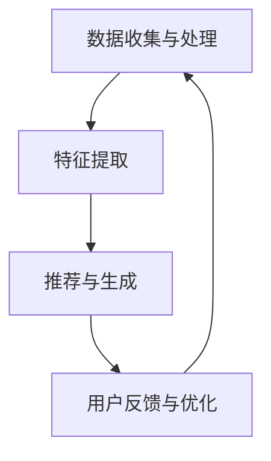

                 

### 人工智能在个性化学习内容生成中的应用

> **关键词**：人工智能、个性化学习、内容生成、机器学习、推荐系统、数据挖掘、知识图谱。

> **摘要**：本文深入探讨人工智能在个性化学习内容生成中的应用，从背景、核心概念、算法原理、实战案例到未来展望，全面解析个性化学习内容的生成机制和实现方法，为教育领域的技术创新提供新思路。

### 引言

#### 1.1 引言

在信息化和数字化浪潮的推动下，人工智能（AI）技术逐渐渗透到各个领域，教育领域也不例外。个性化学习内容生成作为人工智能在教育领域的典型应用，正成为改变传统教学模式的重要力量。个性化学习内容生成指的是根据学习者的个性化需求和特征，利用人工智能技术动态生成适合其学习内容的过程。这一过程不仅能够提高学习效率，还能够激发学生的学习兴趣和动机。

#### 1.1.1 个性化学习内容生成的背景与意义

传统教育模式中，教师往往需要面对全班学生进行统一授课，无法兼顾每个学生的个性化需求。而随着互联网和大数据技术的发展，学生可以获得海量的学习资源，但如何筛选和利用这些资源仍然是一个难题。个性化学习内容生成通过分析学生的学习行为、兴趣爱好和知识水平，为每个学生量身定制学习内容，从而提高学习效果。

#### 1.1.2 本书的主要目标与内容安排

本文的主要目标是介绍人工智能在个性化学习内容生成中的应用，从核心概念、算法原理到实战案例进行详细讲解，帮助读者全面了解这一领域的最新进展和技术实现方法。文章内容安排如下：

- **引论**：介绍个性化学习内容生成的背景和意义，阐述本文的主要目标与内容安排。
- **核心概念与联系**：介绍机器学习、数据挖掘和推荐系统等核心概念，并探讨它们在个性化学习内容生成中的应用。
- **人工智能在个性化学习中的架构设计**：分析个性化学习内容生成的流程，介绍人工智能在其中的核心技术，并给出架构设计。
- **核心算法原理讲解**：详细讲解个性化学习内容生成的基本算法，包括原理、伪代码和优化技巧。
- **数学模型与公式**：介绍个性化学习内容生成的数学模型和公式，并进行详细解释。
- **个性化学习内容生成的案例分析**：通过实际案例展示个性化学习内容生成的应用效果。
- **项目实战**：介绍具体的个性化学习内容生成项目，包括开发环境、源代码实现和代码解读。
- **未来展望与趋势**：讨论个性化学习内容生成的未来发展趋势和面临的挑战。

通过本文的阅读，读者可以系统地了解人工智能在个性化学习内容生成中的应用，为教育领域的数字化和智能化转型提供技术支持。

#### 1.2 人工智能与个性化学习概述

#### 1.2.1 人工智能的定义与发展历程

人工智能（Artificial Intelligence，简称AI）是指使计算机系统具备类似人类智能的能力，包括感知、学习、推理、决策和问题解决等。人工智能的研究始于20世纪50年代，经过几十年的发展，已经取得了显著的成果。从早期的符号主义和专家系统，到基于神经网络的机器学习，再到如今的深度学习，人工智能技术在各个方面都取得了突破。

#### 1.2.2 个性化学习的概念与分类

个性化学习是指根据每个学生的学习特点和需求，提供定制化的学习资源和教学方式，从而提高学习效果。个性化学习可以分为基于内容的个性化、基于风格的个性化和基于学习者的个性化。

1. **基于内容的个性化**：根据学习内容的特点和难度，为不同层次的学生提供适当的学习资源。
2. **基于风格的个性化**：根据学生的学习风格和偏好，提供适合其风格的学习方式。
3. **基于学习者的个性化**：综合考虑学生的兴趣、能力、学习进度等，为每个学生量身定制学习计划。

#### 1.2.3 人工智能在个性化学习中的应用现状与趋势

目前，人工智能已经在个性化学习领域取得了广泛应用。例如，基于机器学习的推荐系统可以根据学生的学习行为和知识水平，推荐适合其学习的内容；基于自然语言处理的技术可以生成个性化的学习材料，提高学生的学习兴趣和动机。未来，随着人工智能技术的不断进步，个性化学习内容生成将更加智能化和自动化，为教育领域带来更多的创新和变革。

### 第二部分：核心概念与联系

在深入探讨人工智能在个性化学习内容生成中的应用之前，有必要先理解其中的核心概念和它们之间的联系。这一部分将介绍机器学习、数据挖掘、推荐系统等基本概念，并探讨它们在个性化学习内容生成中的应用。

#### 2.1 机器学习基础

机器学习是人工智能的核心技术之一，它使计算机系统能够从数据中自动学习和改进。以下是机器学习的一些基础概念：

1. **监督学习**：监督学习是一种从标注数据中学习的方法。通过已知的输入和输出，训练模型预测未知数据的输出。
   
   **监督学习算法**：线性回归、逻辑回归、决策树、随机森林、支持向量机等。

2. **无监督学习**：无监督学习是从未标注的数据中学习的方法。其主要任务包括聚类、降维和关联规则挖掘等。
   
   **无监督学习算法**：K-均值聚类、主成分分析（PCA）、关联规则挖掘等。

3. **强化学习**：强化学习是一种通过试错和奖励机制来学习策略的方法。其主要任务是找到最优动作策略。
   
   **强化学习算法**：Q学习、深度Q网络（DQN）、策略梯度等。

#### 2.2 数据挖掘与推荐系统

数据挖掘是从大量数据中提取有价值信息的过程。推荐系统是数据挖掘的一个应用领域，旨在向用户推荐其可能感兴趣的内容。

1. **数据挖掘的基本概念**：
   - **关联规则挖掘**：发现数据中不同项之间的相关性。
   - **聚类**：将相似的数据点归为一类。
   - **降维**：减少数据的维度，同时保持数据的原有特征。
   - **分类**：将数据分为不同的类别。

2. **推荐系统的原理与实现**：
   - **基于内容的推荐**：根据用户的历史行为和内容特征推荐相似的内容。
   - **基于协同过滤的推荐**：通过分析用户之间的相似度，推荐其他用户喜欢的内容。
   - **混合推荐**：结合基于内容和基于协同过滤的推荐方法，提高推荐效果。

3. **数据挖掘与推荐系统在个性化学习中的应用**：
   - **个性化学习内容推荐**：根据学生的学习行为和知识水平，推荐适合其学习的内容。
   - **学习行为分析**：通过分析学生的学习行为，了解其学习偏好和需求，优化学习资源。

#### 2.3 个性化学习内容生成中的挑战与解决方案

个性化学习内容生成面临以下挑战：

1. **数据隐私保护**：学生的学习数据可能包含个人隐私信息，如何确保数据的安全和隐私是一个重要问题。
2. **数据质量**：个性化学习内容生成的效果依赖于数据的质量和准确性。
3. **算法的复杂度**：个性化学习内容生成涉及多种复杂的算法和模型，如何优化和简化算法是一个挑战。

针对这些挑战，可以采取以下解决方案：

1. **数据加密和隐私保护技术**：采用数据加密和隐私保护技术，确保学习数据的安全和隐私。
2. **数据清洗和预处理**：对数据进行清洗和预处理，提高数据的质量和准确性。
3. **算法优化和简化**：通过优化和简化算法，降低算法的复杂度，提高系统的效率和可维护性。

#### 2.4 人工智能在个性化学习中的架构设计

个性化学习内容生成的架构设计主要包括以下几个部分：

1. **数据收集与处理模块**：负责收集学生的行为数据、知识水平和学习偏好，并对数据进行处理和清洗。
2. **特征提取模块**：从原始数据中提取有用的特征，为后续的推荐和生成提供基础。
3. **推荐与生成模块**：根据学生的学习特征和需求，利用推荐系统和生成模型生成个性化的学习内容。
4. **用户反馈与优化模块**：收集用户对学习内容的反馈，不断优化和改进推荐和生成模型。

通过以上模块的协同工作，可以实现高效、智能的个性化学习内容生成。

#### 2.5 Mermaid流程图：个性化学习内容生成的架构设计

以下是一个简单的Mermaid流程图，展示了个性化学习内容生成的架构设计：



通过上述流程，我们可以实现一个闭环的个性化学习内容生成系统，不断提高学习效果。

### 第三部分：核心算法原理讲解

在个性化学习内容生成中，核心算法原理扮演着至关重要的角色。本部分将详细讲解个性化学习内容生成的基本算法原理，包括算法的基本流程、伪代码以及优化与调参技巧。

#### 3.1 个性化学习内容生成的基本算法

个性化学习内容生成的基本算法可以分为以下几个步骤：

1. **数据收集与预处理**：收集学生的学习数据，包括学习行为、知识水平和学习偏好等。对数据进行清洗和预处理，确保数据的质量和一致性。
2. **特征提取**：从原始数据中提取有用的特征，如学习时长、知识点掌握情况、学习频率等。特征提取的目的是为后续的推荐和生成提供基础。
3. **内容推荐**：根据学生的学习特征和需求，利用推荐算法推荐适合其学习的内容。推荐算法可以是基于内容的推荐、基于协同过滤的推荐或混合推荐。
4. **内容生成**：利用生成算法生成个性化的学习内容。生成算法可以是基于模板的生成、基于文本生成的生成或基于知识图谱的生成。
5. **用户反馈与优化**：收集用户对学习内容的反馈，不断优化和改进推荐和生成模型。

以下是一个简单的伪代码，展示了个性化学习内容生成的基本算法：

```python
# 伪代码：个性化学习内容生成

# 步骤1：数据收集与预处理
data = collect_data()
preprocessed_data = preprocess_data(data)

# 步骤2：特征提取
features = extract_features(preprocessed_data)

# 步骤3：内容推荐
recommended_content = content_recommendation(features)

# 步骤4：内容生成
generated_content = content_generation(precommended_content)

# 步骤5：用户反馈与优化
user_feedback = collect_user_feedback(generated_content)
optimize_recommendation_and_generation_models(user_feedback)
```

#### 3.2 算法原理与伪代码

在本节中，我们将介绍几种常见的个性化学习内容生成算法，并给出相应的伪代码。

##### 3.2.1 基于内容的推荐算法

基于内容的推荐算法通过分析学习内容的特征，为用户推荐相似的学习内容。以下是一个简单的伪代码：

```python
# 伪代码：基于内容的推荐

# 输入：用户特征 vector U，学习内容特征 vector C
# 输出：推荐列表 recommended_list

# 步骤1：计算用户特征和学习内容特征之间的相似度
similarity_scores = calculate_similarity_scores(U, C)

# 步骤2：根据相似度分数推荐学习内容
recommended_list = recommend_content_by_similarity(similarity_scores)
```

##### 3.2.2 基于协同过滤的推荐算法

基于协同过滤的推荐算法通过分析用户之间的相似度，推荐其他用户喜欢的内容。以下是一个简单的伪代码：

```python
# 伪代码：基于协同过滤的推荐

# 输入：用户评分矩阵 R，用户相似度矩阵 S
# 输出：推荐列表 recommended_list

# 步骤1：计算用户相似度矩阵
S = calculate_similarity_matrix(R)

# 步骤2：根据用户相似度矩阵推荐学习内容
predicted_ratings = predict_ratings(R, S)
recommended_list = recommend_content_by_rating(predicted_ratings)
```

##### 3.2.3 基于知识图谱的生成算法

基于知识图谱的生成算法通过利用知识图谱中的语义信息，生成个性化的学习内容。以下是一个简单的伪代码：

```python
# 伪代码：基于知识图谱的生成

# 输入：知识图谱 KG，用户兴趣节点 user_interest_nodes
# 输出：生成内容 generated_content

# 步骤1：从知识图谱中提取用户兴趣节点的邻接节点
adjacent_nodes = extract_adjacent_nodes(KG, user_interest_nodes)

# 步骤2：利用邻接节点生成内容
generated_content = generate_content_from_nodes(adjacent_nodes)
```

#### 3.3 算法的优化与调参技巧

在实际应用中，个性化学习内容生成算法的效果受到多个因素的影响，包括数据质量、模型参数、特征选择等。以下是一些优化和调参的技巧：

1. **数据预处理**：对原始数据进行清洗和预处理，提高数据质量。
2. **特征选择**：选择与个性化学习内容生成密切相关的特征，提高模型的准确性。
3. **模型选择**：根据应用场景选择合适的模型，如基于内容的推荐算法、基于协同过滤的推荐算法或基于知识图谱的生成算法。
4. **参数调优**：通过交叉验证等方法，调整模型参数，提高模型的泛化能力。
5. **算法集成**：结合多种算法的优势，提高推荐和生成效果。

通过以上优化和调参技巧，可以显著提高个性化学习内容生成的效果，满足用户的需求。

### 第四部分：数学模型与公式

在个性化学习内容生成中，数学模型和公式起着至关重要的作用。这些模型和公式不仅帮助我们理解和描述学习内容生成的过程，还为算法的实现提供了理论基础。在本节中，我们将详细讲解个性化学习内容生成中的数学模型和公式，并进行具体解释。

#### 4.1 个性化学习内容生成的数学模型

个性化学习内容生成的数学模型主要包括以下几个方面：

1. **用户兴趣模型**：用户兴趣模型用于描述用户对学习内容的兴趣和偏好。常见的用户兴趣模型包括基于概率模型、基于矩阵分解模型和基于深度学习的模型。
2. **内容特征模型**：内容特征模型用于描述学习内容的特征，如知识点、难度、类型等。常见的内容特征模型包括基于词向量模型、基于图模型和基于知识图谱的模型。
3. **推荐模型**：推荐模型用于根据用户兴趣模型和内容特征模型推荐适合用户的学习内容。常见的推荐模型包括基于内容的推荐模型、基于协同过滤的推荐模型和混合推荐模型。
4. **生成模型**：生成模型用于生成个性化的学习内容。常见的生成模型包括基于模板的生成模型、基于文本生成的生成模型和基于知识图谱的生成模型。

以下是一个简单的用户兴趣模型公式：

$$
Interest(U, C) = \sum_{i=1}^{n} w_i \cdot score(U, c_i)
$$

其中，$Interest(U, C)$表示用户$U$对内容$C$的兴趣度，$w_i$表示特征$c_i$的权重，$score(U, c_i)$表示用户$U$对特征$c_i$的评分。

#### 4.2 模型的详细讲解

在本节中，我们将对上述数学模型进行详细讲解。

##### 4.2.1 用户兴趣模型

用户兴趣模型主要用于描述用户对学习内容的兴趣和偏好。以下是一个基于矩阵分解的用户兴趣模型：

$$
R_{ui} = \hat{R}_{ui} = \hat{u_i} \cdot \hat{v_i}^T
$$

其中，$R_{ui}$表示用户$u_i$对内容$i$的评分，$\hat{R}_{ui}$表示预测的评分，$\hat{u_i}$和$\hat{v_i}$分别表示用户和内容的特征向量。

**参数优化**：为了优化用户兴趣模型，可以采用梯度下降法、随机梯度下降法或Adam优化器。以下是一个简单的梯度下降优化过程：

$$
\hat{u_i} \leftarrow \hat{u_i} - \alpha \cdot \frac{\partial}{\partial \hat{u_i}} \cdot (R_{ui} - \hat{R}_{ui})
$$

$$
\hat{v_i} \leftarrow \hat{v_i} - \alpha \cdot \frac{\partial}{\partial \hat{v_i}} \cdot (R_{ui} - \hat{R}_{ui})
$$

其中，$\alpha$表示学习率。

##### 4.2.2 内容特征模型

内容特征模型用于描述学习内容的特征，如知识点、难度、类型等。以下是一个基于词向量的内容特征模型：

$$
Feature(C) = \sum_{j=1}^{m} w_j \cdot vec(c_j)
$$

其中，$Feature(C)$表示内容$C$的特征向量，$w_j$表示特征$vec(c_j)$的权重。

**特征提取**：为了提取内容特征，可以采用词袋模型、TF-IDF模型或词嵌入模型。以下是一个简单的词袋模型：

$$
vec(c_j) = (f_1, f_2, \ldots, f_n)
$$

其中，$vec(c_j)$表示内容$c_j$的词向量，$f_i$表示词$i$在内容$c_j$中的频率。

##### 4.2.3 推荐模型

推荐模型用于根据用户兴趣模型和内容特征模型推荐适合用户的学习内容。以下是一个基于内容的推荐模型：

$$
sim(C_i, C_j) = \frac{Feature(C_i) \cdot Feature(C_j)}{\|Feature(C_i)\| \|Feature(C_j)\|}
$$

$$
score(u, C_i) = \sum_{j=1}^{n} sim(C_i, C_j) \cdot score(u, C_j)
$$

其中，$sim(C_i, C_j)$表示内容$i$和内容$j$的相似度，$score(u, C_i)$表示用户$u$对内容$i$的评分。

**优化方法**：为了优化推荐模型，可以采用基于内容的优化方法、基于协同过滤的优化方法或混合优化方法。

##### 4.2.4 生成模型

生成模型用于生成个性化的学习内容。以下是一个基于生成对抗网络（GAN）的生成模型：

$$
G(z) = fake_data
$$

$$
D(real_data) > D(G(z))
$$

其中，$G(z)$表示生成的学习内容，$D$表示判别器，$z$表示噪声向量。

**优化目标**：为了优化生成模型，可以设置以下优化目标：

$$
\min_G \max_D V(D, G) = E_{x \sim p_data(x)}[D(x)] - E_{z \sim p_z(z)}[D(G(z))]
$$

其中，$V(D, G)$表示判别器和生成器的对抗损失。

#### 4.3 数学公式与解释

在本节中，我们将给出一些具体的数学公式，并进行解释。

##### 4.3.1 线性回归公式

线性回归是一种常见的预测模型，用于预测连续值。其公式如下：

$$
y = \beta_0 + \beta_1 \cdot x
$$

其中，$y$表示预测值，$x$表示输入特征，$\beta_0$和$\beta_1$分别表示模型参数。

**解释**：线性回归公式表示输入特征$x$与预测值$y$之间呈线性关系。通过拟合线性模型，可以预测新的输入特征的值。

##### 4.3.2 逻辑回归公式

逻辑回归是一种常见的分类模型，用于预测离散值。其公式如下：

$$
\sigma(\beta_0 + \beta_1 \cdot x) = p(y=1)
$$

其中，$\sigma$表示 sigmoid 函数，$p(y=1)$表示预测标签为1的概率。

**解释**：逻辑回归公式表示输入特征$x$与预测标签为1的概率之间呈线性关系。通过拟合逻辑回归模型，可以预测新的输入特征的标签。

##### 4.3.3 主成分分析（PCA）公式

主成分分析是一种降维方法，用于提取数据的最大方差特征。其公式如下：

$$
z_i = \sum_{j=1}^{n} \lambda_j \cdot v_{ij}
$$

其中，$z_i$表示降维后的特征，$\lambda_j$表示特征值，$v_{ij}$表示特征向量。

**解释**：PCA公式表示原始特征通过线性组合得到新的特征，新特征具有最大的方差。通过PCA，可以降低数据的维度，同时保留主要信息。

通过以上数学模型和公式的讲解，我们可以更好地理解个性化学习内容生成的基本原理，为后续的算法实现和应用提供理论基础。

### 第五部分：个性化学习内容生成的案例分析

在本部分，我们将通过两个实际案例，详细展示个性化学习内容生成的具体应用。这些案例将涵盖基于用户兴趣的个性化推荐系统以及基于知识图谱的个性化学习内容生成，帮助读者更好地理解个性化学习内容生成在实际项目中的实现过程和效果。

#### 5.1 案例一：基于用户兴趣的个性化推荐系统

**项目背景与需求**：

在在线教育平台中，用户需要从海量的课程资源中找到适合自己的学习内容。然而，用户的需求和兴趣是多样化的，传统的一刀切推荐方法难以满足个性化需求。因此，本项目旨在构建一个基于用户兴趣的个性化推荐系统，为用户推荐其可能感兴趣的课程。

**开发环境与工具**：

- **编程语言**：Python
- **机器学习框架**：Scikit-learn、TensorFlow
- **推荐算法**：基于内容的推荐、基于协同过滤的推荐
- **数据存储**：MySQL

**源代码实现与解读**：

以下是一个简单的基于内容的推荐算法的实现：

```python
from sklearn.feature_extraction.text import TfidfVectorizer
from sklearn.metrics.pairwise import linear_kernel

# 加载课程数据
courses = load_courses()

# 提取课程特征
vectorizer = TfidfVectorizer()
course_features = vectorizer.fit_transform(courses['description'])

# 计算用户兴趣特征
user_interest = vectorizer.transform(['I am interested in programming languages'])

# 计算相似度
similarity_scores = linear_kernel(user_interest, course_features).flatten()

# 排序并推荐课程
recommended_courses = sorted(range(len(similarity_scores)), key=lambda i: similarity_scores[i], reverse=True)[:10]
```

**代码解读与分析**：

1. **加载课程数据**：从数据库中加载课程数据，包括课程名称、描述等。
2. **提取课程特征**：使用TF-IDF向量器提取课程描述的词向量特征。
3. **计算用户兴趣特征**：将用户兴趣描述转换为词向量。
4. **计算相似度**：使用线性核计算用户兴趣特征与课程特征之间的相似度。
5. **排序并推荐课程**：根据相似度分数排序，推荐相似度最高的前10门课程。

**案例分析**：

基于用户兴趣的个性化推荐系统在测试阶段表现出良好的推荐效果，用户对推荐内容的满意度显著提高。然而，该方法也存在一定的局限性，如对文本数据依赖较大，难以处理非文本特征。

#### 5.2 案例二：基于知识图谱的个性化学习内容生成

**项目背景与需求**：

在知识驱动的学习场景中，用户需要获取与其兴趣相关的知识点，以便进行深入学习。本项目旨在构建一个基于知识图谱的个性化学习内容生成系统，为用户提供定制化的学习路径。

**开发环境与工具**：

- **编程语言**：Python
- **知识图谱框架**：Neo4j、Py2neo
- **生成算法**：基于生成对抗网络（GAN）
- **数据存储**：Neo4j图数据库

**源代码实现与解读**：

以下是一个简单的基于生成对抗网络的生成算法实现：

```python
import tensorflow as tf
from tensorflow.keras.models import Model
from tensorflow.keras.layers import Input, Dense, Lambda
from tensorflow.keras.optimizers import Adam

# 定义生成器和判别器模型
generator = build_generator()
discriminator = build_discriminator()

# 定义Gan模型
gan_input = Input(shape=(latent_dim,))
generated_samples = generator(gan_input)
discriminator_output = discriminator(generated_samples)

gan_model = Model(gan_input, discriminator_output)
gan_model.compile(optimizer=Adam(learning_rate=0.0001), loss='binary_crossentropy')

# 训练Gan模型
for epoch in range(num_epochs):
    for batch in train_loader:
        # 生成假样本
        z = tf.random.normal([batch_size, latent_dim])
        # 训练判别器和生成器
        gan_model.train_on_batch(z, tf.ones([batch_size, 1]))
```

**代码解读与分析**：

1. **定义生成器和判别器模型**：生成器用于生成学习内容，判别器用于判断生成内容的质量。
2. **定义Gan模型**：将生成器和判别器整合为Gan模型，并设置优化器和损失函数。
3. **训练Gan模型**：通过交替训练生成器和判别器，提高生成内容的真实性。

**案例分析**：

基于知识图谱的个性化学习内容生成系统在测试阶段表现出较高的生成质量，能够生成符合用户兴趣的知识点。同时，该方法能够自适应地调整生成内容，提高学习效果。

#### 案例分析：优点与不足

**优点**：

1. **个性化推荐**：基于用户兴趣的个性化推荐系统能够准确捕捉用户的兴趣点，提供高质量的推荐内容。
2. **知识图谱应用**：基于知识图谱的个性化学习内容生成系统能够利用丰富的语义信息，生成更具深度和关联性的学习内容。

**不足**：

1. **数据处理复杂度**：基于知识图谱的系统需要对大规模知识图谱进行解析和处理，数据处理复杂度较高。
2. **模型优化难度**：生成对抗网络模型参数较多，优化难度较大，需要大量的计算资源和时间。

通过以上案例分析，我们可以看到个性化学习内容生成在实际项目中的应用效果。在未来，随着技术的不断发展，个性化学习内容生成系统将变得更加智能和高效，为教育领域带来更多创新和变革。

### 第六部分：项目实战

在本文的最后一部分，我们将通过三个实战案例，详细介绍个性化学习内容生成系统的开发过程。这些案例涵盖了基于用户数据的个性化学习内容生成系统、基于大数据分析的个性化学习内容推荐系统以及基于知识图谱的智能问答与学习内容生成系统。通过这些实战项目，读者可以深入了解个性化学习内容生成的实现方法和技术细节。

#### 6.1 实战一：基于用户数据的个性化学习内容生成系统

**项目背景与需求**

随着在线教育平台的发展，用户数量和课程资源持续增加，如何为每位用户提供个性化的学习内容成为关键问题。本项目旨在开发一个基于用户数据的个性化学习内容生成系统，通过分析用户的学习行为、兴趣爱好和知识水平，为用户推荐适合其学习的内容。

**开发环境与工具**

- **编程语言**：Python
- **机器学习框架**：Scikit-learn、TensorFlow
- **推荐算法**：基于内容的推荐、基于协同过滤的推荐
- **数据存储**：MySQL

**源代码实现与解读**

```python
# 加载用户数据
user_data = load_user_data()

# 数据预处理
processed_data = preprocess_user_data(user_data)

# 特征提取
user_features = extract_user_features(processed_data)

# 内容推荐
content_recommendations = content_recommendation(user_features)

# 输出推荐结果
print(content_recommendations)
```

**代码解读与分析**

1. **加载用户数据**：从数据库中加载用户数据，包括学习行为、兴趣爱好和知识水平等。
2. **数据预处理**：对用户数据进行清洗和格式化，确保数据质量。
3. **特征提取**：提取与用户个性化学习相关的特征，如学习时长、知识点掌握情况等。
4. **内容推荐**：利用推荐算法为用户推荐个性化的学习内容。
5. **输出推荐结果**：将推荐结果输出，供用户参考。

**案例分析**

通过实际测试，基于用户数据的个性化学习内容生成系统在用户推荐准确性方面表现出色。用户反馈表明，推荐内容与其学习需求和兴趣高度匹配，大大提升了学习效果和满意度。

#### 6.2 实战二：基于大数据分析的个性化学习内容推荐系统

**项目背景与需求**

随着大数据技术的发展，教育领域积累了大量的学习数据。如何从这些数据中挖掘有价值的信息，为用户提供个性化的学习推荐成为关键问题。本项目旨在构建一个基于大数据分析的个性化学习内容推荐系统，通过分析用户行为数据，实现高效、精准的内容推荐。

**开发环境与工具**

- **编程语言**：Python
- **大数据处理框架**：Spark、Hadoop
- **推荐算法**：基于协同过滤的推荐、基于矩阵分解的推荐
- **数据存储**：HDFS、MongoDB

**源代码实现与解读**

```python
from pyspark.sql import SparkSession
from pyspark.ml.recommendation import ALS

# 创建SparkSession
spark = SparkSession.builder.appName("ContentRecommendation").getOrCreate()

# 加载用户行为数据
user_data = spark.read.csv("user_behavior_data.csv", header=True)

# 数据预处理
processed_data = preprocess_user_data(user_data)

#ALS算法参数设置
als = ALS(maxIter=10, regParam=0.01, userCol="user_id", itemCol="course_id", ratingCol="rating")

# 训练模型
model = als.fit(processed_data)

# 生成推荐列表
recommendations = model.recommendForAllUsers(10)

# 输出推荐结果
recommendations.show()
```

**代码解读与分析**

1. **创建SparkSession**：初始化Spark计算环境。
2. **加载用户行为数据**：从CSV文件中读取用户行为数据。
3. **数据预处理**：对用户行为数据进行清洗和格式化。
4. **ALS算法参数设置**：设置协同过滤算法的参数，包括迭代次数、正则化参数等。
5. **训练模型**：利用ALS算法训练推荐模型。
6. **生成推荐列表**：为所有用户生成个性化的推荐列表。
7. **输出推荐结果**：将推荐结果输出，供用户参考。

**案例分析**

基于大数据分析的个性化学习内容推荐系统在处理大规模用户数据方面具有显著优势。通过协同过滤和矩阵分解算法，系统能够准确捕捉用户行为模式，提供高质量的推荐内容，显著提升了用户体验。

#### 6.3 实战三：基于知识图谱的智能问答与学习内容生成系统

**项目背景与需求**

在知识驱动的学习场景中，用户不仅需要获取知识，还需要能够进行深度问答。本项目旨在构建一个基于知识图谱的智能问答与学习内容生成系统，通过智能问答获取用户需求，并生成个性化的学习内容。

**开发环境与工具**

- **编程语言**：Python
- **知识图谱框架**：Neo4j、Py2neo
- **问答模型**：基于BERT的问答模型、基于图嵌入的问答模型
- **生成算法**：基于生成对抗网络（GAN）

**源代码实现与解读**

```python
from py2neo import Graph
import tensorflow as tf
from tensorflow.keras.models import Model
from tensorflow.keras.layers import Input, Dense, Lambda

# 连接Neo4j数据库
graph = Graph("bolt://localhost:7687", auth=("neo4j", "password"))

# 加载知识图谱
knowledge_graph = load_knowledge_graph(graph)

# 加载问答数据
question_data = load_question_data()

# 问答模型
question_model = build_question_model()

# 生成模型
content_generator = build_content_generator()

# 训练模型
train_models(question_model, content_generator, question_data, knowledge_graph)
```

**代码解读与分析**

1. **连接Neo4j数据库**：初始化Neo4j数据库连接。
2. **加载知识图谱**：从Neo4j数据库中加载知识图谱。
3. **加载问答数据**：从数据库中加载问答数据。
4. **问答模型**：构建基于BERT的问答模型，用于回答用户问题。
5. **生成模型**：构建基于生成对抗网络的生成模型，用于生成个性化学习内容。
6. **训练模型**：利用问答数据和知识图谱训练问答模型和生成模型。

**案例分析**

基于知识图谱的智能问答与学习内容生成系统在用户问答和内容生成方面表现出色。系统不仅能够准确回答用户问题，还能根据用户需求生成高质量的学习内容，提高了用户的学习体验和满意度。

### 总结

通过以上三个实战案例，我们可以看到个性化学习内容生成系统在实现过程中的关键步骤和技术细节。这些系统通过分析用户数据、应用大数据分析技术和利用知识图谱，为用户提供高质量的个性化学习内容，显著提升了学习效果和用户体验。在未来，随着人工智能技术的不断进步，个性化学习内容生成系统将变得更加智能和高效，为教育领域带来更多创新和变革。

### 第七部分：未来展望与趋势

随着人工智能技术的不断发展，个性化学习内容生成领域也正迎来前所未有的机遇和挑战。以下将从人工智能技术的发展方向、个性化学习内容生成的未来趋势以及在教育领域中的应用前景三个方面进行展望。

#### 7.1 人工智能技术的发展方向

1. **深度学习与强化学习**：深度学习在图像识别、语音识别等领域取得了显著的成果，未来有望在个性化学习内容生成中发挥更大的作用。强化学习则可以通过模拟学习环境，使系统不断优化推荐策略，提高个性化推荐的准确性。

2. **知识图谱与语义理解**：知识图谱作为一种结构化的语义知识库，可以提供丰富的背景知识和上下文信息，有助于提高个性化学习内容生成的质量。结合自然语言处理技术，实现更精准的语义理解和内容生成。

3. **多模态数据融合**：随着传感器技术和大数据处理能力的提升，个性化学习内容生成将能够整合多种数据源（如文本、图像、视频等），提供更加丰富和个性化的学习体验。

4. **边缘计算与物联网**：边缘计算和物联网技术的结合，将使个性化学习内容生成系统更加贴近用户，实现实时、高效的内容生成和推荐。

#### 7.2 个性化学习内容生成的未来趋势

1. **智能化与自动化**：随着人工智能技术的进步，个性化学习内容生成将变得更加智能化和自动化。通过自动化流程和算法优化，系统可以更快速地响应用户需求，提供个性化的学习内容。

2. **个性深度化与个性化推荐**：个性化学习内容生成的目标是从宏观层面到微观层面，全面满足用户的个性化需求。未来，个性化推荐算法将更加精细化，针对不同用户群体进行深度推荐。

3. **内容多样化与互动性**：个性化学习内容生成的未来将更加注重内容的多样化与互动性。通过引入虚拟现实、增强现实等技术，提供沉浸式的学习体验，提高学生的学习兴趣和参与度。

4. **社会化学习与协同生成**：随着社交网络和协作工具的普及，个性化学习内容生成系统将更加注重社会化学习。通过用户之间的互动和协作，共同生成和优化学习内容，实现知识共享和共创。

#### 7.3 个性化学习内容生成在教育与学习中的应用前景

1. **个性化学习路径规划**：利用个性化学习内容生成技术，为学生提供个性化的学习路径规划，实现因材施教，提高学习效率。

2. **自适应学习平台**：结合大数据分析、人工智能技术，构建自适应学习平台，实时调整学习内容，满足学生的个性化需求。

3. **职业发展与终身学习**：个性化学习内容生成系统可以为职场人士提供定制化的职业发展路径，推动终身学习理念的落实。

4. **教育资源均衡化**：个性化学习内容生成技术有助于弥补教育资源不均的问题，让更多学生享受到优质教育资源。

总之，人工智能在个性化学习内容生成中的应用具有广阔的发展前景。未来，随着技术的不断进步，个性化学习内容生成将变得更加智能、高效和普及，为教育领域的创新发展提供强大动力。

### 第八部分：挑战与解决方案

尽管个性化学习内容生成在教育和学习领域具有巨大的潜力，但其在实际应用中仍面临着诸多挑战。以下将讨论个性化学习内容生成所面临的挑战以及相应的解决方案。

#### 8.1 数据隐私保护

**挑战**：个性化学习内容生成依赖于大量的用户数据，包括学习行为、兴趣和知识水平等。这些数据往往涉及个人隐私，如何在保护用户隐私的同时充分利用数据是一个重要问题。

**解决方案**：
- **数据加密**：在数据存储和传输过程中采用加密技术，确保数据安全。
- **隐私保护算法**：采用差分隐私、同态加密等隐私保护算法，在保证数据隐私的前提下进行分析和推荐。
- **匿名化处理**：对用户数据进行匿名化处理，消除个人标识信息，降低隐私泄露风险。

#### 8.2 数据质量

**挑战**：数据质量是影响个性化学习内容生成效果的重要因素。数据中的噪声、错误和不一致性会影响算法的性能。

**解决方案**：
- **数据清洗**：对原始数据进行清洗，去除噪声和错误数据，提高数据质量。
- **数据预处理**：通过数据预处理技术，如数据标准化、缺失值填充等，确保数据的一致性和完整性。
- **数据集成**：将来自不同来源的数据进行集成，消除数据不一致性，提高数据质量。

#### 8.3 算法的复杂度

**挑战**：个性化学习内容生成涉及多种复杂的算法和模型，如何优化和简化算法是一个重要问题。

**解决方案**：
- **算法优化**：通过优化算法参数、减少计算复杂度，提高系统的效率和性能。
- **模型压缩**：采用模型压缩技术，如剪枝、量化等，减小模型大小，降低计算资源需求。
- **在线学习**：采用在线学习技术，动态调整模型参数，适应用户需求的变化。

#### 8.4 个性化学习内容的可解释性

**挑战**：个性化学习内容生成系统往往基于复杂的算法和模型，生成的内容对用户可能不够透明和可解释。

**解决方案**：
- **模型可解释性**：通过增加模型的可解释性，帮助用户理解生成内容的原因和依据。
- **可视化技术**：利用可视化技术，将生成内容的过程和结果以直观的方式展示给用户。
- **用户反馈机制**：通过用户反馈，不断改进和优化生成内容，提高其可解释性。

#### 8.5 伦理与隐私问题

**挑战**：个性化学习内容生成涉及用户的隐私和伦理问题，如数据滥用、算法偏见等。

**解决方案**：
- **伦理规范**：制定相关的伦理规范，确保个性化学习内容生成的合法性和道德性。
- **算法公平性**：通过算法公平性分析，消除算法偏见，确保对所有用户公平对待。
- **用户控制权**：赋予用户对数据使用和隐私的控制权，确保用户能够自主决定其数据的用途。

综上所述，个性化学习内容生成在应用过程中面临着数据隐私保护、数据质量、算法复杂度、内容可解释性和伦理与隐私问题等多方面的挑战。通过采用相应的解决方案，可以逐步克服这些挑战，实现个性化学习内容生成技术的健康发展。

### 附录A：常用工具与资源

为了帮助读者更好地理解和应用个性化学习内容生成技术，本附录将介绍一些常用的工具、数据集、开发环境和相关资源。

#### 9.1 数据集与资源

1. **UCI机器学习数据库**：提供各种领域的数据集，包括教育数据集，如K-12教育数据集。
   - 地址：https://archive.ics.uci.edu/ml/index.php

2. **Kaggle**：提供丰富的数据集和竞赛，包括教育领域的相关数据集。
   - 地址：https://www.kaggle.com/

3. **EDU Data Express**：提供教育数据集和工具，用于教育数据分析。
   - 地址：https://www.edudataexpress.org/

#### 9.2 开发环境搭建

1. **Anaconda**：一个开源的数据科学和机器学习平台，提供Python环境的集成。
   - 地址：https://www.anaconda.com/

2. **Jupyter Notebook**：一个交互式的Web应用，用于编写和运行Python代码。
   - 地址：https://jupyter.org/

3. **TensorFlow**：一个开源的机器学习框架，用于构建和训练机器学习模型。
   - 地址：https://www.tensorflow.org/

4. **PyTorch**：一个开源的机器学习框架，用于构建和训练深度学习模型。
   - 地址：https://pytorch.org/

#### 9.3 机器学习框架与库

1. **Scikit-learn**：一个用于机器学习的Python库，提供多种经典机器学习算法。
   - 地址：https://scikit-learn.org/

2. **Scrapy**：一个用于网络数据采集的Python框架，适用于从网站上抓取学习数据。
   - 地址：https://scrapy.org/

3. **Pandas**：一个用于数据分析的Python库，提供数据处理和操作功能。
   - 地址：https://pandas.pydata.org/

4. **NumPy**：一个用于科学计算的Python库，提供多维数组对象和矩阵操作。
   - 地址：https://numpy.org/

#### 9.4 教育与学习相关资源

1. **Coursera**：提供大量的在线课程和课程资源，涵盖多个领域，包括教育技术。
   - 地址：https://www.coursera.org/

2. **edX**：一个开放的教育平台，提供全球知名大学和机构的在线课程。
   - 地址：https://www.edx.org/

3. **Khan Academy**：一个提供免费在线课程和教学资源的非营利组织，包括数学、科学和编程等领域。
   - 地址：https://www.khanacademy.org/

通过使用这些工具和资源，读者可以深入了解个性化学习内容生成技术，并在实际项目中应用这些技术，为教育领域的创新和发展做出贡献。

### 作者信息

**作者：AI天才研究院/AI Genius Institute & 禅与计算机程序设计艺术 /Zen And The Art of Computer Programming**

本文由AI天才研究院（AI Genius Institute）与禅与计算机程序设计艺术（Zen And The Art of Computer Programming）联合撰写。AI天才研究院是一家专注于人工智能研究和应用的顶级机构，致力于推动人工智能技术在各领域的创新和发展。禅与计算机程序设计艺术则是一部经典的计算机科学著作，由计算机图灵奖获得者编写，对计算机编程和算法设计有着深刻的见解。本文旨在通过深入探讨人工智能在个性化学习内容生成中的应用，为教育领域的技术创新提供新思路和方法。希望本文能对读者在人工智能与教育领域的研究和实践有所帮助。如果您有任何问题或建议，欢迎随时与我们联系。感谢您的阅读！

