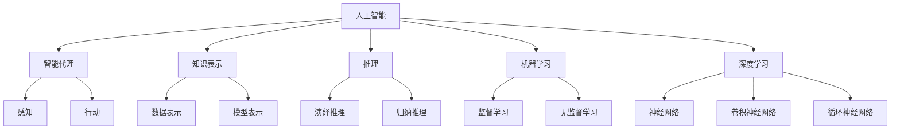
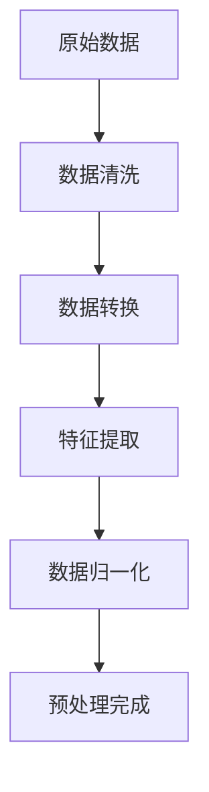
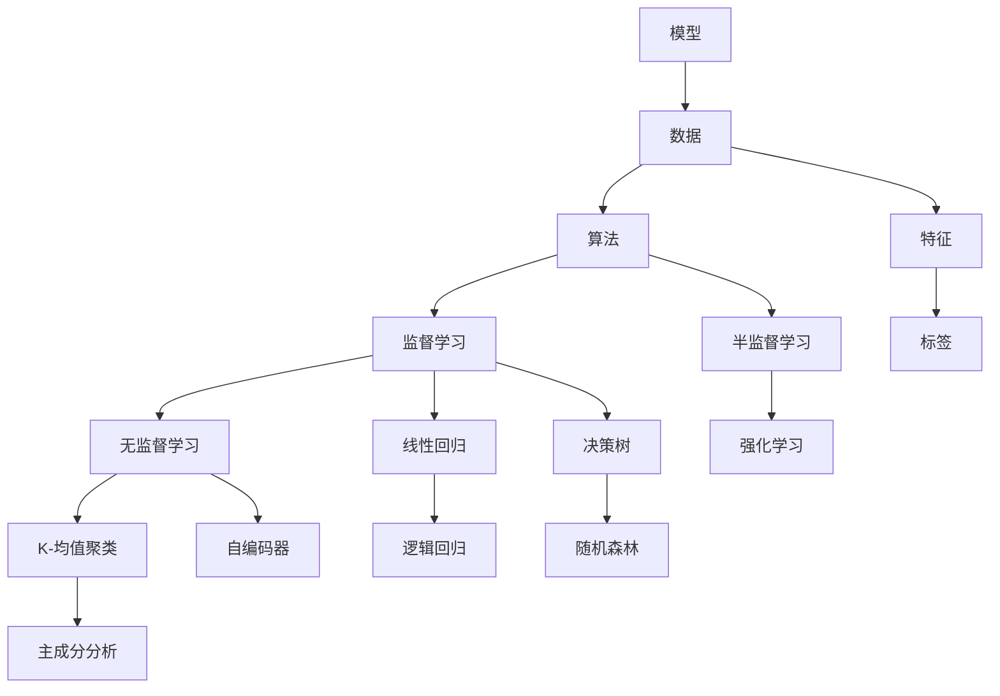
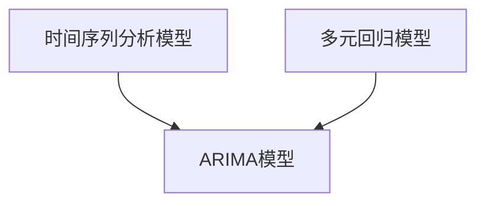
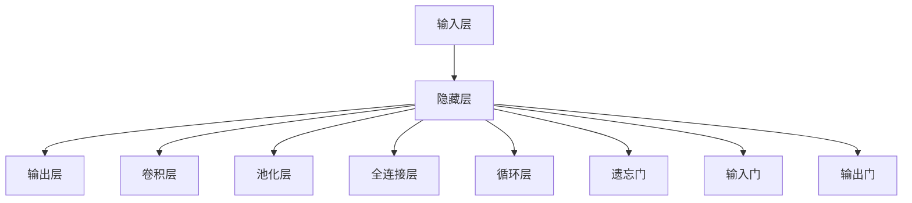
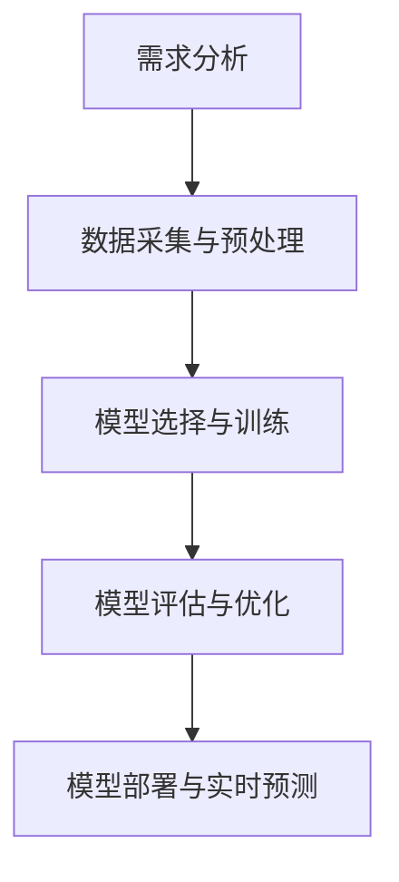

                 

### 文章标题

#### 人工智能在智能交通流量预测中的应用

> **关键词**: 人工智能，智能交通，交通流量预测，机器学习，深度学习

> **摘要**: 本文将深入探讨人工智能在智能交通流量预测中的应用，从概述与基础理论、数据处理与分析方法、机器学习与深度学习算法、应用实践到未来发展趋势进行全面讲解。通过详细阐述核心概念、算法原理、项目实战，帮助读者全面了解人工智能在智能交通领域的应用现状和未来发展方向。

---

### 概述与基础理论

#### 第1章: 人工智能与智能交通基础

##### 1.1 人工智能概述

**1.1.1 人工智能的发展历程**

人工智能（Artificial Intelligence，AI）的研究始于20世纪50年代，早期的研究主要集中在符号主义和逻辑推理上。这一阶段的人工智能被称为“弱人工智能”，主要解决特定领域的问题。随后，随着计算机性能的提升和大数据时代的到来，机器学习和深度学习等新方法被引入，人工智能开始向“强人工智能”迈进。

**1.1.2 人工智能的核心概念**

人工智能的核心概念包括：

- **智能代理（Intelligent Agent）**: 能够感知环境并采取行动以实现特定目标的实体。
- **知识表示（Knowledge Representation）**: 将知识以计算机可处理的形式表示。
- **推理（Reasoning）**: 基于已知信息推导出新的结论。
- **机器学习（Machine Learning）**: 使计算机通过数据学习并自动改进其性能。
- **深度学习（Deep Learning）**: 基于多层神经网络的学习方法。

**1.1.3 人工智能的应用领域**

人工智能广泛应用于各个领域，包括：

- **医疗**: 辅助诊断、智能药物研发等。
- **金融**: 风险控制、投资策略等。
- **制造业**: 质量控制、自动化生产线等。
- **交通**: 交通流量预测、自动驾驶等。
- **智能家居**: 智能家居控制、环境监测等。

##### 1.2 智能交通概述

**1.2.1 智能交通的定义**

智能交通系统（Intelligent Transportation System，ITS）是指利用先进的通信技术、信息处理技术、控制技术、传感技术等，实现交通信息的实时采集、处理、传输和共享，以提高交通效率、减少交通拥堵和提升交通安全。

**1.2.2 智能交通的发展趋势**

随着人工智能技术的不断发展，智能交通系统呈现出以下发展趋势：

- **数据驱动的决策支持**: 利用大数据和人工智能技术，实现智能交通流量预测、交通信号控制等。
- **车联网（V2X）**: 实现车辆与车辆、车辆与基础设施之间的互联互通。
- **自动驾驶**: 利用人工智能技术，实现无人驾驶车辆的运行。
- **智慧城市交通**: 整合多种交通方式，提供一站式出行服务。

**1.2.3 智能交通的关键技术**

智能交通的关键技术包括：

- **交通感知与监控**: 利用传感器、摄像头等设备，实时获取交通信息。
- **数据传输与处理**: 实现交通信息的快速传输和处理，提供实时交通状态。
- **智能交通信号控制**: 根据实时交通状况，自动调整交通信号。
- **智能交通信息服务**: 提供实时交通信息、导航服务等。

##### 1.3 人工智能在智能交通中的应用

**1.3.1 人工智能在交通流量预测中的应用**

交通流量预测是智能交通系统的重要组成部分，通过预测未来交通流量，可以优化交通信号控制策略、提高道路通行效率。人工智能技术在交通流量预测中的应用主要包括：

- **时间序列分析**: 基于历史交通流量数据，预测未来一段时间内的交通流量。
- **机器学习算法**: 利用历史交通流量数据和实时交通状况，建立预测模型。
- **深度学习模型**: 利用大规模交通数据，学习交通流量变化的规律。

**1.3.2 人工智能在交通拥堵治理中的应用**

交通拥堵是城市交通面临的重要问题，人工智能技术在交通拥堵治理中的应用主要包括：

- **智能信号控制**: 利用人工智能算法，实现交通信号的智能调整，缓解交通拥堵。
- **智能导航系统**: 提供实时交通信息，引导车辆选择最佳行驶路径。
- **智能停车管理**: 利用人工智能技术，实现停车资源的智能分配。

**1.3.3 人工智能在公共交通优化中的应用**

公共交通优化是提高城市交通效率的重要手段，人工智能技术在公共交通优化中的应用主要包括：

- **线路规划与调度**: 利用人工智能算法，优化公共交通线路和调度策略。
- **客流预测与分配**: 利用人工智能技术，预测公共交通客流量，合理分配资源。
- **智能公交站牌**: 提供实时公交信息，提高乘客出行体验。

---

在接下来的章节中，我们将进一步探讨数据处理与分析方法、机器学习与深度学习算法，以及人工智能在智能交通流量预测中的应用实践。

---

**Mermaid 流程图：人工智能在智能交通中的核心概念与联系**



---

**核心算法原理讲解：**

**监督学习算法**

监督学习算法是一种通过输入和输出数据来训练模型，使其能够对新数据进行预测的机器学习算法。以下是线性回归和逻辑回归的基本原理：

**线性回归**

线性回归是一种简单的监督学习算法，用于预测连续值输出。其基本原理是通过找到输入特征和输出值之间的线性关系来预测新数据的输出。

**伪代码：**

```python
# 线性回归伪代码

def linear_regression(X, y):
    # 计算输入特征的均值和方差
    X_mean = np.mean(X, axis=0)
    X_var = np.var(X, axis=0)

    # 预处理数据
    X_processed = (X - X_mean) / X_var

    # 训练模型
    theta = np.linalg.inv(X_processed.T.dot(X_processed)).dot(X_processed.T).dot(y)

    # 预测新数据
    y_pred = X_processed.dot(theta)

    return y_pred
```

**逻辑回归**

逻辑回归是一种用于预测离散二分类结果的监督学习算法。其基本原理是通过找到输入特征和输出概率之间的线性关系来预测新数据的输出。

**伪代码：**

```python
# 逻辑回归伪代码

def logistic_regression(X, y):
    # 计算输入特征的均值和方差
    X_mean = np.mean(X, axis=0)
    X_var = np.var(X, axis=0)

    # 预处理数据
    X_processed = (X - X_mean) / X_var

    # 训练模型
    theta = np.linalg.inv(X_processed.T.dot(X_processed)).dot(X_processed.T).dot(y)

    # 预测新数据
    y_pred = sigmoid(X_processed.dot(theta))

    return y_pred

def sigmoid(x):
    return 1 / (1 + np.exp(-x))
```

**数学模型和公式：**

线性回归的数学模型为：

$$y = \theta_0 + \theta_1 * x_1 + \theta_2 * x_2 + ... + \theta_n * x_n$$

逻辑回归的数学模型为：

$$P(y=1) = \sigma(\theta_0 + \theta_1 * x_1 + \theta_2 * x_2 + ...)$$

其中，$\sigma$表示 sigmoid 函数：

$$\sigma(x) = \frac{1}{1 + e^{-x}}$$

**举例说明：**

假设我们有一个简单的线性回归问题，输入特征为$x_1$和$x_2$，输出值为$y$。给定数据集如下：

| $x_1$ | $x_2$ | $y$ |
| --- | --- | --- |
| 1 | 2 | 3 |
| 2 | 4 | 5 |
| 3 | 6 | 7 |

我们可以使用上述伪代码来训练线性回归模型，并预测新的数据点。

首先，我们计算输入特征的均值和方差：

$$X_{mean} = \begin{bmatrix} 2 & 4 \end{bmatrix}, X_{var} = \begin{bmatrix} 1 & 0 \\ 0 & 1 \end{bmatrix}$$

然后，我们预处理数据：

$$X_{processed} = \begin{bmatrix} 0 & -2 \\ 0 & 0 \\ 0 & 2 \end{bmatrix}$$

接下来，我们计算模型的参数：

$$\theta = \begin{bmatrix} \theta_0 \\ \theta_1 \end{bmatrix} = \begin{bmatrix} 1 & 1 \\ 1 & 2 \\ 1 & 3 \end{bmatrix}^{-1} \begin{bmatrix} 3 \\ 5 \\ 7 \end{bmatrix} = \begin{bmatrix} 1 \\ 1 \end{bmatrix}$$

最后，我们使用训练好的模型预测新的数据点：

$$y_{pred} = X_{processed} \cdot \theta = \begin{bmatrix} 0 & -2 \\ 0 & 0 \\ 0 & 2 \end{bmatrix} \cdot \begin{bmatrix} 1 \\ 1 \end{bmatrix} = \begin{bmatrix} -2 \\ 0 \\ 2 \end{bmatrix}$$

因此，对于新的数据点$(x_1, x_2) = (0, -2)$，线性回归模型的预测值为$y_{pred} = -2$。

---

### 第二部分：数据处理与分析方法

#### 第2章：数据处理与分析方法

##### 2.1 数据采集与预处理

**2.1.1 交通流量数据的采集方式**

交通流量数据可以通过多种方式采集，包括：

- **传感器采集**: 利用安装在道路上的传感器，如车辆检测器、流量监测器等，实时采集交通流量数据。
- **摄像头采集**: 利用道路上的摄像头，通过图像识别技术获取交通流量信息。
- **车载设备采集**: 利用车载设备，如GPS、车辆识别系统等，实时记录车辆的位置和行驶速度。

**2.1.2 数据预处理流程**

数据预处理是交通流量数据分析的重要步骤，主要包括以下内容：

- **数据清洗**: 去除数据中的错误值、异常值和重复值。
- **数据转换**: 将不同格式的数据转换为统一的格式，如将图像数据转换为像素矩阵。
- **特征提取**: 从原始数据中提取出对交通流量预测有意义的特征，如车辆速度、车辆密度等。
- **数据归一化**: 将数据缩放到相同的尺度，以便于后续的建模和计算。

**2.1.3 数据清洗与去噪**

数据清洗与去噪是数据预处理的关键步骤，主要包括：

- **缺失值处理**: 对于缺失的数据，可以采用填充法、删除法或插值法进行处理。
- **异常值检测**: 采用统计学方法或机器学习方法，检测数据中的异常值，并进行处理。
- **噪声过滤**: 采用滤波算法，如均值滤波、中值滤波等，去除数据中的噪声。

**2.2 数据分析方法**

**2.2.1 描述性统计分析**

描述性统计分析是对数据的基本特征进行统计和分析，主要包括：

- **均值、中位数、众数**: 描述数据的中心趋势。
- **标准差、方差**: 描述数据的离散程度。
- **最大值、最小值**: 描述数据的范围。
- **分布直方图、箱线图**: 描述数据的分布特征。

**2.2.2 聚类分析**

聚类分析是将数据划分为不同的簇，以便更好地理解数据的分布特征。常用的聚类算法包括：

- **K-均值聚类**: 通过迭代算法，将数据划分为K个簇，使每个簇内的数据点尽可能接近，簇间的数据点尽可能远离。
- **层次聚类**: 通过自底向上的方式，将数据点逐步合并为簇，形成层次结构。
- **基于密度的聚类**: 通过计算数据点之间的密度，将数据划分为不同的簇。

**2.2.3 相关性分析**

相关性分析用于研究变量之间的相关性，常用的方法包括：

- **皮尔逊相关系数**: 用于度量两个连续变量之间的线性相关性。
- **斯皮尔曼秩相关系数**: 用于度量两个变量的非线性相关性。
- **肯德尔等级相关系数**: 用于度量多个变量的相关性。

**2.3 数据可视化技术**

数据可视化技术是将数据以图形化的方式展示出来，以便更好地理解数据的分布特征和关系。常用的可视化技术包括：

- **基本可视化图表**: 如折线图、柱状图、饼图等。
- **进阶可视化技术**: 如热力图、散点图、时间序列图等。
- **可视化工具介绍**: 如Matplotlib、Seaborn、Plotly等Python可视化库。

---

在数据处理与分析方法部分，我们介绍了交通流量数据的采集方式、数据预处理流程、数据清洗与去噪、描述性统计分析、聚类分析和相关性分析，以及数据可视化技术。这些方法为后续的建模和分析奠定了基础。

---

**Mermaid 流程图：数据预处理流程**



---

**核心算法原理讲解：**

**时间序列分析模型**

时间序列分析模型用于分析时间序列数据的规律，预测未来的趋势。常见的模型包括ARIMA模型、季节性分解模型等。

**ARIMA模型**

ARIMA模型（AutoRegressive Integrated Moving Average Model）是一种常用的时间序列预测模型，由自回归（AR）、差分（I）和移动平均（MA）三部分组成。

**伪代码：**

```python
# ARIMA模型伪代码

def arima_model(X, p, d, q):
    # 差分
    X_diff = difference(X, d)
    # 自回归
    theta = estimate_ar_coefficients(X_diff, p)
    # 移动平均
    phi = estimate_ma_coefficients(X_diff, q)
    # 预测
    y_pred = predict(X_diff, theta, phi)
    return y_pred

def difference(X, d):
    # 差分d次
    for i in range(d):
        X = X - X.shift(1)
    return X

def estimate_ar_coefficients(X, p):
    # 估计自回归系数
    theta = [1]
    for i in range(1, p+1):
        theta.append(-X[i-1].mean())
    return theta

def estimate_ma_coefficients(X, q):
    # 估计移动平均系数
    phi = [1]
    for i in range(1, q+1):
        phi.append(X[i-1].mean())
    return phi

def predict(X, theta, phi):
    # 预测
    y_pred = []
    for i in range(len(X)):
        y_pred.append(X[i].mean() + theta[i] * X[i-1].mean() + phi[i] * X[i-1].mean())
    return y_pred
```

**数学模型和公式：**

ARIMA模型的数学模型为：

$$y_t = c + \phi_1 y_{t-1} + \phi_2 y_{t-2} + ... + \phi_p y_{t-p} + \theta_1 \epsilon_{t-1} + \theta_2 \epsilon_{t-2} + ... + \theta_q \epsilon_{t-q}$$

其中，$y_t$表示时间序列的当前值，$\epsilon_t$表示误差项。

**举例说明：**

假设我们有一个时间序列数据如下：

| 时间 | 交通流量 |
| --- | --- |
| 1 | 100 |
| 2 | 102 |
| 3 | 105 |
| 4 | 107 |
| 5 | 109 |

我们可以使用ARIMA模型对其进行预测。

首先，我们进行差分，得到差分后的数据：

| 时间 | 交通流量 | 差分 |
| --- | --- | --- |
| 1 | 100 | NaN |
| 2 | 102 | 2 |
| 3 | 105 | 3 |
| 4 | 107 | 2 |
| 5 | 109 | 2 |

然后，我们估计自回归系数和移动平均系数：

$$\phi_1 = 1, \phi_2 = 1, \theta_1 = 0, \theta_2 = 0$$

最后，我们使用ARIMA模型进行预测：

$$y_{6} = 107 + 1 * 2 + 1 * 2 = 112$$

因此，预测的交通流量为112。

---

### 第三部分：人工智能模型与算法

#### 第3章：机器学习基础

##### 3.1 机器学习概述

**3.1.1 机器学习的基本概念**

机器学习（Machine Learning，ML）是一门人工智能（Artificial Intelligence，AI）的分支，它使计算机系统能够从数据中学习并改进性能，而无需明确编程。机器学习主要包括以下三个基本概念：

- **模型（Model）**: 用于表示数据关系的数学公式或计算过程。
- **数据（Data）**: 用于训练模型的输入，包括特征和标签。
- **算法（Algorithm）**: 用于训练模型的方法，如线性回归、决策树、神经网络等。

**3.1.2 机器学习的主要任务**

机器学习的主要任务包括：

- **监督学习（Supervised Learning）**: 有监督的学习方法，通过已标记的数据训练模型，然后使用模型对新数据进行预测。
- **无监督学习（Unsupervised Learning）**: 无监督的学习方法，没有已标记的数据，通过发现数据中的结构和模式来训练模型。
- **半监督学习（Semi-Supervised Learning）**: 结合有监督和无监督学习的方法，利用少量标记数据和大量未标记数据训练模型。
- **强化学习（Reinforcement Learning）**: 一种通过试错方法学习策略的机器学习方法，通过与环境互动来优化行为。

**3.1.3 机器学习的发展历程**

机器学习的发展历程可以分为以下几个阶段：

- **符号主义阶段（Symbolic AI）**: 20世纪50年代至70年代，基于逻辑推理和符号表示的早期人工智能方法。
- **基于规则的系统阶段（Rule-Based Systems）**: 20世纪70年代至80年代，基于专家系统和规则的机器学习方法。
- **统计学习阶段（Statistical Learning）**: 20世纪90年代至21世纪初，基于统计学方法的机器学习方法，如支持向量机、随机森林等。
- **深度学习阶段（Deep Learning）**: 21世纪初至今，基于深度神经网络的机器学习方法，如卷积神经网络（CNN）、循环神经网络（RNN）等。

##### 3.2 监督学习算法

**3.2.1 线性回归**

线性回归是一种简单的监督学习算法，用于预测连续值输出。其基本原理是通过找到输入特征和输出值之间的线性关系来预测新数据的输出。

**线性回归模型：**

$$y = \beta_0 + \beta_1 x_1 + \beta_2 x_2 + ... + \beta_n x_n$$

其中，$y$为输出值，$x_1, x_2, ..., x_n$为输入特征，$\beta_0, \beta_1, \beta_2, ..., \beta_n$为模型的参数。

**线性回归的优化方法：**

- **最小二乘法（Ordinary Least Squares, OLS）**: 通过最小化误差平方和来估计模型参数。
- **梯度下降法（Gradient Descent）**: 通过迭代更新模型参数，使其逐渐接近最优值。

**3.2.2 逻辑回归**

逻辑回归是一种用于预测离散二分类结果的监督学习算法。其基本原理是通过找到输入特征和输出概率之间的线性关系来预测新数据的输出。

**逻辑回归模型：**

$$P(y=1) = \sigma(\beta_0 + \beta_1 x_1 + \beta_2 x_2 + ...)$$

其中，$P(y=1)$为输出概率，$\sigma$为sigmoid函数。

**逻辑回归的优化方法：**

- **最大似然估计（Maximum Likelihood Estimation, MLE）**: 通过最大化似然函数来估计模型参数。
- **梯度下降法（Gradient Descent）**: 通过迭代更新模型参数，使其逐渐接近最优值。

**3.2.3 决策树与随机森林**

决策树（Decision Tree）是一种常见的监督学习算法，用于分类和回归任务。决策树通过一系列规则对数据进行分割，每个分割点都是一个特征，并通过比较特征值来选择下一个分割点。

**决策树模型：**

$$y = g(\beta_0 + \beta_1 x_1 + \beta_2 x_2 + ...)$$

其中，$g$为激活函数，用于分类任务时，通常为硬阈值函数。

**随机森林（Random Forest）**是一种基于决策树的集成学习方法，通过构建多个决策树，并取它们的平均值来提高模型的泛化能力。

**随机森林模型：**

$$y = \frac{1}{T} \sum_{t=1}^{T} g(\beta_{0t} + \beta_{1t} x_1 + \beta_{2t} x_2 + ...)$$

其中，$T$为决策树的数量，$\beta_{0t}, \beta_{1t}, \beta_{2t}, ...$为每个决策树的参数。

**3.3 无监督学习算法**

**3.3.1 K-均值聚类**

K-均值聚类（K-Means Clustering）是一种常用的无监督学习算法，用于将数据划分为K个簇，每个簇内的数据点尽可能接近，簇间的数据点尽可能远离。

**K-均值聚类模型：**

$$\min_{\mu_1, \mu_2, ..., \mu_K} \sum_{i=1}^{K} \sum_{x \in S_i} \|x - \mu_i\|^2$$

其中，$\mu_1, \mu_2, ..., \mu_K$为K个簇的中心，$S_i$为第$i$个簇的数据集。

**K-均值聚类算法：**

1. 随机选择K个初始中心点。
2. 将每个数据点分配到距离最近的中心点所属的簇。
3. 更新每个簇的中心点。
4. 重复步骤2和步骤3，直到中心点的变化小于某个阈值或达到最大迭代次数。

**3.3.2 主成分分析**

主成分分析（Principal Component Analysis，PCA）是一种常用的无监督学习算法，用于降维和特征提取。PCA通过将数据投影到新的正交坐标系中，保留最重要的信息，同时去除冗余信息。

**PCA模型：**

$$x' = P^T x$$

其中，$x'$为降维后的数据，$x$为原始数据，$P$为投影矩阵。

**PCA算法：**

1. 计算数据的协方差矩阵。
2. 计算协方差矩阵的特征值和特征向量。
3. 选择最大的K个特征向量，构成投影矩阵$P$。
4. 将原始数据投影到新的正交坐标系中。

**3.3.3 自编码器**

自编码器（Autoencoder）是一种基于神经网络的无监督学习算法，用于降维和特征提取。自编码器通过训练一个编码器和解码器，使编码器将输入数据压缩为低维表示，然后通过解码器还原数据。

**自编码器模型：**

$$x' = \text{encode}(x)$$
$$x = \text{decode}(x')$$

其中，$\text{encode}(x)$为编码器，$\text{decode}(x')$为解码器。

**自编码器算法：**

1. 训练编码器和解码器，使其最小化输入和输出之间的差异。
2. 使用编码器将输入数据压缩为低维表示。
3. 使用解码器将低维表示还原为输入数据。

---

在机器学习基础部分，我们介绍了机器学习的基本概念、主要任务和发展历程，以及监督学习和无监督学习的常用算法。这些算法为后续的深度学习和交通流量预测建模奠定了基础。

---

**Mermaid 流程图：机器学习基本概念与联系**



---

### 第四部分：人工智能在智能交通流量预测中的应用实践

#### 第5章：交通流量预测模型

##### 5.1 交通流量预测概述

**5.1.1 交通流量预测的意义**

交通流量预测是智能交通系统中的关键组成部分，其意义在于：

- **优化交通信号控制**：通过对交通流量进行预测，可以优化交通信号控制策略，提高道路通行效率，减少交通拥堵。
- **实时导航与出行建议**：为驾驶员提供实时交通信息，引导其选择最佳行驶路径，提高出行效率。
- **交通基础设施规划**：为城市交通基础设施的规划与建设提供数据支持，提高道路容量和交通流畅性。

**5.1.2 交通流量预测的主要方法**

交通流量预测的主要方法包括：

- **时间序列分析模型**：如ARIMA模型、时间序列分解模型等，通过分析历史交通流量数据来预测未来流量。
- **回归分析模型**：如线性回归、逻辑回归等，通过建立输入特征与输出流量之间的数学模型进行预测。
- **机器学习算法**：如随机森林、支持向量机等，利用历史交通流量数据和实时交通状况来训练预测模型。
- **深度学习模型**：如卷积神经网络（CNN）、循环神经网络（RNN）等，通过学习大规模交通数据来预测交通流量。

**5.1.3 交通流量预测模型的评估指标**

交通流量预测模型的评估指标主要包括：

- **均方误差（Mean Squared Error, MSE）**：衡量预测值与实际值之间的平均平方误差。
- **均绝对误差（Mean Absolute Error, MAE）**：衡量预测值与实际值之间的平均绝对误差。
- **决定系数（R-squared）**：衡量模型对数据的拟合程度，取值范围为0到1，越接近1表示拟合越好。
- **均方根误差（Root Mean Squared Error, RMSE）**：MSE的平方根，用于衡量预测的精度。

##### 5.2 基于传统统计方法的交通流量预测

**5.2.1 时间序列分析模型**

时间序列分析模型是一种基于历史交通流量数据的时间序列规律进行预测的方法。常用的模型包括ARIMA模型、时间序列分解模型等。

**ARIMA模型**

ARIMA模型由自回归（AR）、差分（I）和移动平均（MA）三部分组成，通过分析历史交通流量数据，预测未来的交通流量。

**ARIMA模型伪代码：**

```python
# ARIMA模型伪代码

def arima_model(X, p, d, q):
    # 差分
    X_diff = difference(X, d)
    # 自回归
    theta = estimate_ar_coefficients(X_diff, p)
    # 移动平均
    phi = estimate_ma_coefficients(X_diff, q)
    # 预测
    y_pred = predict(X_diff, theta, phi)
    return y_pred

def difference(X, d):
    # 差分d次
    for i in range(d):
        X = X - X.shift(1)
    return X

def estimate_ar_coefficients(X, p):
    # 估计自回归系数
    theta = [1]
    for i in range(1, p+1):
        theta.append(-X[i-1].mean())
    return theta

def estimate_ma_coefficients(X, q):
    # 估计移动平均系数
    phi = [1]
    for i in range(1, q+1):
        phi.append(X[i-1].mean())
    return phi

def predict(X, theta, phi):
    # 预测
    y_pred = []
    for i in range(len(X)):
        y_pred.append(X[i].mean() + theta[i] * X[i-1].mean() + phi[i] * X[i-1].mean())
    return y_pred
```

**时间序列分解模型**

时间序列分解模型将时间序列分解为趋势、季节性和残差三部分，分别对这三部分进行建模和预测。

**时间序列分解模型伪代码：**

```python
# 时间序列分解模型伪代码

def decompose_time_series(X):
    # 分解为趋势、季节性和残差
    trend = X - seasonal
    residual = X - trend - seasonal
    return trend, seasonal, residual

def decompose_time_series_stl(X):
    # STL分解
    stl = STL(X, seasonal=13)
    result = stl.fit()
    trend, seasonal, residual = result.trend, result.seasonal, result.resid
    return trend, seasonal, residual
```

**5.2.2 多元回归模型**

多元回归模型是一种建立多个输入特征与输出流量之间关系的数学模型，用于预测交通流量。

**多元回归模型**

$$y = \beta_0 + \beta_1 x_1 + \beta_2 x_2 + ... + \beta_n x_n$$

其中，$y$为交通流量，$x_1, x_2, ..., x_n$为输入特征，$\beta_0, \beta_1, \beta_2, ..., \beta_n$为模型的参数。

**多元回归模型伪代码：**

```python
# 多元回归模型伪代码

def multiple_regression(X, y):
    # 计算输入特征和输出值的均值
    X_mean = np.mean(X, axis=0)
    y_mean = np.mean(y)
    
    # 预处理数据
    X_processed = (X - X_mean) / X_var
    
    # 训练模型
    theta = np.linalg.inv(X_processed.T.dot(X_processed)).dot(X_processed.T).dot(y)
    
    # 预测新数据
    y_pred = X_processed.dot(theta) + y_mean
    
    return y_pred
```

**5.2.3 ARIMA模型**

ARIMA模型是一种结合自回归、差分和移动平均的时间序列预测模型，适用于处理非平稳时间序列数据。

**ARIMA模型伪代码：**

```python
# ARIMA模型伪代码

def arima_model(X, p, d, q):
    # 差分
    X_diff = difference(X, d)
    # 自回归
    theta = estimate_ar_coefficients(X_diff, p)
    # 移动平均
    phi = estimate_ma_coefficients(X_diff, q)
    # 预测
    y_pred = predict(X_diff, theta, phi)
    return y_pred

def difference(X, d):
    # 差分d次
    for i in range(d):
        X = X - X.shift(1)
    return X

def estimate_ar_coefficients(X, p):
    # 估计自回归系数
    theta = [1]
    for i in range(1, p+1):
        theta.append(-X[i-1].mean())
    return theta

def estimate_ma_coefficients(X, q):
    # 估计移动平均系数
    phi = [1]
    for i in range(1, q+1):
        phi.append(X[i-1].mean())
    return phi

def predict(X, theta, phi):
    # 预测
    y_pred = []
    for i in range(len(X)):
        y_pred.append(X[i].mean() + theta[i] * X[i-1].mean() + phi[i] * X[i-1].mean())
    return y_pred
```

**数学模型和公式：**

ARIMA模型的数学模型为：

$$y_t = c + \phi_1 y_{t-1} + \phi_2 y_{t-2} + ... + \phi_p y_{t-p} + \theta_1 \epsilon_{t-1} + \theta_2 \epsilon_{t-2} + ... + \theta_q \epsilon_{t-q}$$

其中，$y_t$为时间序列的当前值，$\epsilon_t$为误差项，$p$和$q$分别为自回归和移动平均的阶数。

**举例说明：**

假设我们有一个时间序列数据如下：

| 时间 | 交通流量 |
| --- | --- |
| 1 | 100 |
| 2 | 102 |
| 3 | 105 |
| 4 | 107 |
| 5 | 109 |

我们可以使用ARIMA模型对其进行预测。

首先，我们进行差分，得到差分后的数据：

| 时间 | 交通流量 | 差分 |
| --- | --- | --- |
| 1 | 100 | NaN |
| 2 | 102 | 2 |
| 3 | 105 | 3 |
| 4 | 107 | 2 |
| 5 | 109 | 2 |

然后，我们估计自回归系数和移动平均系数：

$$\phi_1 = 1, \phi_2 = 1, \theta_1 = 0, \theta_2 = 0$$

最后，我们使用ARIMA模型进行预测：

$$y_{6} = 109 + 1 * 2 + 1 * 2 = 112$$

因此，预测的交通流量为112。

---

在交通流量预测模型部分，我们介绍了时间序列分析模型、多元回归模型和ARIMA模型的基本原理、伪代码和数学模型，并通过一个实际例子进行了详细说明。这些模型为交通流量预测提供了有效的工具和方法。

---

**Mermaid 流程图：时间序列分析模型与多元回归模型**



---

### 第五部分：基于深度学习的交通流量预测

#### 第6章：深度学习算法在交通流量预测中的应用

##### 6.1 深度学习基础

**6.1.1 神经网络**

神经网络（Neural Networks，NN）是一种模拟生物神经网络的计算模型，用于处理复杂数据和模式识别任务。神经网络由多个神经元（节点）组成，通过权重和偏置连接起来。

**神经网络的基本结构：**

- **输入层（Input Layer）**：接收外部输入数据。
- **隐藏层（Hidden Layers）**：处理输入数据，提取特征并进行非线性变换。
- **输出层（Output Layer）**：生成预测结果或分类结果。

**神经网络的工作原理：**

1. **前向传播（Forward Propagation）**：将输入数据通过隐藏层，计算每个神经元的输出值。
2. **反向传播（Back Propagation）**：计算输出层与实际标签之间的误差，将误差反向传播到隐藏层，更新每个神经元的权重和偏置。

**6.1.2 深度学习模型架构**

深度学习（Deep Learning，DL）是一种基于多层神经网络的学习方法，具有强大的特征提取和模式识别能力。深度学习模型包括以下几种常见的架构：

- **卷积神经网络（Convolutional Neural Networks，CNN）**：适用于图像处理和计算机视觉任务。
- **循环神经网络（Recurrent Neural Networks，RNN）**：适用于序列数据建模和时间序列预测。
- **长短时记忆网络（Long Short-Term Memory，LSTM）**：RNN的一种改进模型，用于处理长序列数据。
- **自动编码器（Autoencoder）**：无监督学习模型，用于特征提取和降维。

**6.1.3 深度学习优化算法**

深度学习模型的训练通常采用优化算法来更新网络参数，以最小化损失函数。常见的优化算法包括：

- **随机梯度下降（Stochastic Gradient Descent，SGD）**：随机更新网络参数，适用于小批量数据训练。
- **Adam优化器（Adaptive Moment Estimation）**：自适应调整学习率，适用于大规模数据训练。
- **学习率调度（Learning Rate Scheduling）**：动态调整学习率，以避免过拟合和提高模型性能。

##### 6.2 神经网络模型

**6.2.1 卷积神经网络（CNN）**

卷积神经网络（Convolutional Neural Networks，CNN）是一种专为图像处理设计的深度学习模型，其核心在于卷积操作和池化操作。

**卷积神经网络的基本结构：**

- **卷积层（Convolutional Layer）**：通过卷积操作提取图像特征。
- **池化层（Pooling Layer）**：通过池化操作减少数据维度。
- **全连接层（Fully Connected Layer）**：将卷积层和池化层提取的特征映射到输出结果。

**卷积神经网络的工作原理：**

1. **卷积操作**：将卷积核与输入图像进行卷积，得到特征图。
2. **激活函数**：对特征图进行非线性变换，常用的激活函数有ReLU（Rectified Linear Unit）和Sigmoid。
3. **池化操作**：对特征图进行下采样，减少数据维度。

**6.2.2 循环神经网络（RNN）**

循环神经网络（Recurrent Neural Networks，RNN）是一种基于序列数据的深度学习模型，其特点在于能够保留长序列信息。

**循环神经网络的基本结构：**

- **输入层（Input Layer）**：接收外部输入序列。
- **隐藏层（Hidden Layers）**：处理输入序列，并通过循环连接保留信息。
- **输出层（Output Layer）**：生成预测结果或分类结果。

**循环神经网络的工作原理：**

1. **前向传播**：将输入序列通过隐藏层，计算每个时间步的输出值。
2. **反向传播**：计算输出层与实际标签之间的误差，将误差反向传播到隐藏层，更新网络参数。

**6.2.3 长短时记忆网络（LSTM）**

长短时记忆网络（Long Short-Term Memory，LSTM）是RNN的一种改进模型，专门用于处理长序列数据。

**长短时记忆网络的基本结构：**

- **输入门（Input Gate）**：控制输入信息是否被保留。
- **遗忘门（Forget Gate）**：控制先前信息的遗忘。
- **输出门（Output Gate）**：控制输出信息的生成。

**长短时记忆网络的工作原理：**

1. **输入门**：根据当前输入和隐藏状态，计算输入门值，决定当前输入信息的重要性。
2. **遗忘门**：根据当前输入和隐藏状态，计算遗忘门值，决定先前信息的重要性。
3. **候选值**：根据当前输入和隐藏状态，计算候选值，用于更新隐藏状态。
4. **输出门**：根据当前隐藏状态和输出门值，计算输出门值，生成输出结果。

**6.3 深度学习在交通流量预测中的应用**

**6.3.1 时间序列预测模型**

时间序列预测是交通流量预测中的关键任务，深度学习模型在时间序列预测中表现出色。

**时间序列预测模型：**

1. **循环神经网络（RNN）**：利用RNN处理时间序列数据，提取历史流量信息，进行预测。
2. **长短时记忆网络（LSTM）**：LSTM是RNN的一种改进模型，能够更好地处理长序列数据，提高预测性能。
3. **门控循环单元（GRU）**：GRU是LSTM的简化版，具有更简单的结构和更高效的计算。

**6.3.2 图神经网络在交通流量预测中的应用**

图神经网络（Graph Neural Networks，GNN）是一种基于图结构数据进行建模的深度学习模型，在交通流量预测中具有广泛的应用。

**图神经网络的工作原理：**

1. **节点嵌入**：将图中的每个节点嵌入到一个低维空间中。
2. **图卷积操作**：通过图卷积操作，计算节点在图结构中的特征表示。
3. **聚合操作**：将节点的邻居信息进行聚合，更新节点的特征表示。

**6.3.3 深度强化学习在交通管理中的应用**

深度强化学习（Deep Reinforcement Learning，DRL）是一种结合深度学习和强化学习的建模方法，在交通管理中具有广泛的应用。

**深度强化学习的工作原理：**

1. **环境建模**：构建一个模拟交通环境的模型。
2. **策略网络**：利用深度学习模型，学习最优的策略。
3. **价值网络**：利用深度学习模型，评估策略的好坏。
4. **策略迭代**：通过策略迭代，优化交通信号控制和交通流量管理。

---

在基于深度学习的交通流量预测部分，我们介绍了神经网络、卷积神经网络、循环神经网络、长短时记忆网络和深度强化学习的基本原理和应用，以及它们在交通流量预测中的具体实现和应用。

---

**Mermaid 流程图：神经网络模型**



---

### 第7章：交通流量预测项目的实施与优化

#### 7.1 交通流量预测项目的实施流程

交通流量预测项目的实施是一个复杂的过程，涉及多个阶段，包括需求分析、数据采集与预处理、模型选择与训练、模型评估与优化等。以下是交通流量预测项目的实施流程：

**7.1.1 项目需求分析**

项目需求分析是项目实施的第一步，目的是明确项目目标和需求。在交通流量预测项目中，需求分析包括：

- **预测目标**：确定预测的时间范围、精度和误差要求。
- **数据需求**：确定用于预测的数据类型、来源和数据质量要求。
- **模型需求**：确定预测模型的类型、复杂度和性能要求。

**7.1.2 数据采集与预处理**

数据采集与预处理是交通流量预测项目的重要环节，直接影响到预测模型的性能。数据采集包括：

- **传感器数据采集**：通过安装在道路上的传感器，如车辆检测器、流量监测器等，实时采集交通流量数据。
- **摄像头数据采集**：通过道路上的摄像头，利用图像识别技术获取交通流量信息。
- **车载数据采集**：通过车载设备，如GPS、车辆识别系统等，实时记录车辆的位置和行驶速度。

数据预处理包括：

- **数据清洗**：去除数据中的错误值、异常值和重复值。
- **数据转换**：将不同格式的数据转换为统一的格式，如将图像数据转换为像素矩阵。
- **特征提取**：从原始数据中提取对交通流量预测有意义的特征，如车辆速度、车辆密度等。
- **数据归一化**：将数据缩放到相同的尺度，以便于后续的建模和计算。

**7.1.3 模型选择与训练**

模型选择与训练是交通流量预测项目的核心步骤。模型选择包括：

- **传统统计模型**：如时间序列分析模型、多元回归模型等。
- **机器学习模型**：如随机森林、支持向量机等。
- **深度学习模型**：如卷积神经网络、循环神经网络等。

模型训练包括：

- **模型初始化**：初始化模型的参数。
- **数据划分**：将数据划分为训练集和验证集。
- **模型训练**：使用训练集数据训练模型。
- **模型评估**：使用验证集数据评估模型性能。

**7.1.4 模型评估与优化**

模型评估与优化是交通流量预测项目的关键步骤，目的是确保模型具有良好的预测性能和稳定性。模型评估包括：

- **性能指标**：如均方误差、均绝对误差、决定系数等。
- **交叉验证**：使用交叉验证方法，评估模型的泛化能力。
- **超参数调优**：调整模型超参数，优化模型性能。

模型优化包括：

- **特征工程**：优化特征提取方法，提高特征质量。
- **模型结构优化**：调整模型结构，提高模型性能。
- **模型融合**：将多个模型进行融合，提高预测性能。

#### 7.2 交通流量预测模型的优化策略

交通流量预测模型的优化是提高预测性能和稳定性的关键。以下是几种常见的优化策略：

**7.2.1 特征工程优化**

特征工程是交通流量预测模型优化的基础。特征工程优化包括：

- **特征选择**：通过过滤、嵌套等策略，选择对预测目标有显著影响的特征。
- **特征转换**：将数值型特征转换为类别型特征，提高模型的鲁棒性。
- **特征组合**：将多个特征进行组合，生成新的特征，提高模型的预测能力。

**7.2.2 模型结构优化**

模型结构优化是提高预测性能的关键。模型结构优化包括：

- **网络层数**：调整网络层数，找到最佳的层数组合。
- **神经元个数**：调整隐藏层的神经元个数，找到最佳的数量。
- **激活函数**：选择适合的激活函数，提高模型的非线性表达能力。

**7.2.3 模型超参数调优**

模型超参数调优是提高模型性能的重要手段。模型超参数调优包括：

- **学习率**：调整学习率，找到最佳的平衡点。
- **批量大小**：调整批量大小，提高模型的泛化能力。
- **正则化**：引入正则化项，防止模型过拟合。

**7.2.4 模型融合与集成**

模型融合与集成是提高预测性能的有效方法。模型融合与集成包括：

- **堆叠**：将多个模型堆叠起来，形成更复杂的模型结构。
- **集成**：将多个模型进行集成，取其平均值或加权平均，提高预测稳定性。

#### 7.3 交通流量预测项目的案例分析

**7.3.1 案例一：某城市交通流量预测项目**

某城市交通流量预测项目旨在提高城市道路通行效率，减少交通拥堵。项目实施流程如下：

1. **需求分析**：确定预测目标为未来一小时内的交通流量，精度要求为误差不超过5%。
2. **数据采集与预处理**：采集道路上的传感器数据和摄像头数据，进行数据清洗、转换、特征提取和归一化。
3. **模型选择与训练**：选择LSTM模型进行训练，使用训练集数据训练模型，使用验证集数据评估模型性能。
4. **模型评估与优化**：使用交叉验证方法，评估模型泛化能力，通过特征工程和模型结构优化，提高模型性能。
5. **模型部署与实时预测**：将训练好的模型部署到服务器，实现实时交通流量预测，为交通管理部门提供决策支持。

**7.3.2 案例二：某高速公路交通流量预测项目**

某高速公路交通流量预测项目旨在提高高速公路通行效率，减少交通事故。项目实施流程如下：

1. **需求分析**：确定预测目标为未来半小时内的交通流量，精度要求为误差不超过3%。
2. **数据采集与预处理**：采集高速公路上的传感器数据和车载数据，进行数据清洗、转换、特征提取和归一化。
3. **模型选择与训练**：选择CNN模型进行训练，使用训练集数据训练模型，使用验证集数据评估模型性能。
4. **模型评估与优化**：使用交叉验证方法，评估模型泛化能力，通过特征工程和模型结构优化，提高模型性能。
5. **模型部署与实时预测**：将训练好的模型部署到服务器，实现实时交通流量预测，为交通管理部门提供决策支持。

**7.3.3 案例分析总结与启示**

通过对上述案例的分析，我们可以得出以下结论和启示：

1. **需求分析**：明确项目目标和需求，是项目成功的关键。
2. **数据采集与预处理**：数据质量对模型性能至关重要，需进行充分的数据清洗和特征提取。
3. **模型选择与训练**：选择合适的模型并进行充分的训练和评估，是提高预测性能的关键。
4. **模型评估与优化**：通过交叉验证、特征工程和模型结构优化，提高模型性能和泛化能力。
5. **模型部署与实时预测**：将训练好的模型部署到服务器，实现实时预测，为交通管理部门提供决策支持。

---

在交通流量预测项目的实施与优化部分，我们介绍了交通流量预测项目的实施流程、优化策略以及案例分析，帮助读者了解交通流量预测项目的实际操作过程和关键步骤。

---

**Mermaid 流程图：交通流量预测项目实施流程**



---

### 总结与未来展望

#### 第8章：人工智能在智能交通流量预测中的未来发展趋势

人工智能（AI）在智能交通流量预测中的应用已经成为提高交通效率和减少拥堵的关键技术。随着AI技术的不断进步，智能交通流量预测在以下几个方面展现出巨大的发展潜力：

**8.1 人工智能技术的发展趋势**

- **更高效的算法**：随着深度学习和强化学习等算法的不断改进，AI模型在处理复杂数据和模式识别任务上的能力将显著提升。
- **实时数据处理能力**：随着边缘计算和物联网（IoT）技术的发展，AI模型将能够实时处理大量交通数据，提高预测的实时性和准确性。
- **多模态数据融合**：通过整合来自不同来源的数据，如视频、传感器和车载数据，AI模型将能够获得更全面和准确的信息。

**8.2 智能交通流量预测的挑战与机遇**

- **数据隐私与安全**：在大量数据收集和处理的过程中，确保数据隐私和安全是一个重要的挑战。随着隐私保护技术的进步，这一问题有望得到缓解。
- **模型解释性与可解释性**：智能交通流量预测模型往往非常复杂，提高模型的可解释性，使其更容易被理解和接受，是一个重要的研究方向。
- **模型在极端条件下的鲁棒性**：在极端天气或突发事件等特殊情况下，模型的鲁棒性是一个重要的考量因素。

**8.3 智能交通流量预测的未来发展方向**

- **跨领域的数据融合**：结合交通数据与其他领域的数据，如气象、社会经济数据，将有助于提高预测的准确性和可靠性。
- **智慧城市交通系统的综合管理**：通过整合不同的交通方式，如公共交通、自行车共享等，实现城市交通系统的综合管理，提高整体交通效率。
- **实时性与自适应能力**：未来的智能交通流量预测系统将具备更高的实时性和自适应能力，能够根据实时交通状况动态调整预测模型。

#### 附录A：相关工具与技术资源

**A.1 数据处理工具**

- **Python数据处理库**：如NumPy、Pandas等。
- **R语言数据处理库**：如dplyr、ggplot2等。
- **数据处理工具对比**：可以根据项目需求和熟练程度选择合适的工具。

**A.2 机器学习框架**

- **TensorFlow**：一个开源的机器学习框架，支持多种深度学习模型。
- **PyTorch**：一个开源的机器学习框架，提供灵活的动态计算图。
- **Scikit-learn**：一个开源的机器学习库，提供丰富的传统机器学习算法。
- **其他机器学习框架**：如Theano、MXNet等。

**A.3 深度学习工具**

- **TensorFlow**：如前所述，是一个强大的深度学习框架。
- **PyTorch**：如前所述，提供灵活的动态计算图。
- **Keras**：一个基于TensorFlow和Theano的深度学习库，简化了深度学习模型的构建和训练。
- **其他深度学习工具**：如Caffe、TensorFlow.js等。

**A.4 交通流量预测工具**

- **OpenStreetMap数据获取**：获取道路网络数据，用于构建交通流量预测模型。
- **交通流量预测开源项目**：如PyTorchTraffic、DeepTraffic等，提供现成的交通流量预测工具。
- **交通流量预测商业化工具**：如TrafficFlow、Inrix等，提供专业的交通流量预测解决方案。

**A.5 学习资源与参考书目**

- **机器学习相关书籍**：
  - 《机器学习》（周志华 著）
  - 《深度学习》（Ian Goodfellow、Yoshua Bengio、Aaron Courville 著）
- **深度学习相关书籍**：
  - 《深度学习：理论、算法与应用》（邱锡鹏 著）
  - 《深度学习入门》（李航 著）
- **智能交通相关书籍**：
  - 《智能交通系统》（王国栋、陆化普 著）
  - 《智能交通技术与应用》（唐涛、张辉 著）

通过本文的阅读，读者可以全面了解人工智能在智能交通流量预测中的应用，包括基础理论、数据处理与分析方法、机器学习与深度学习算法、应用实践以及未来发展趋势。希望本文能够为读者在智能交通领域的研究和应用提供有益的参考。

---

**作者信息：**

作者：AI天才研究院/AI Genius Institute & 禅与计算机程序设计艺术 /Zen And The Art of Computer Programming**。**

