                 

## 人工智能：社会影响与思考

### 关键词：
- 人工智能
- 社会影响
- 法律与伦理
- 未来趋势
- 应用案例

> 摘要：本文深入探讨人工智能在现代社会中的广泛影响，从其起源与发展、核心技术、应用领域、法律与伦理问题、未来发展趋势以及社会治理等多个维度进行分析。通过详细阐述人工智能的社会影响，探讨其在提高生产效率、促进科技创新、推动经济发展等方面的积极作用，同时也揭示了人工智能可能带来的消极影响，如失业风险、社会不公、人类尊严受损等问题。本文旨在引发读者对人工智能的深入思考，为其未来发展和应用提供有益的参考。

### 目录

1. **人工智能：社会影响与思考** <a id="概述"></a>
    - **关键词**
    - **摘要**
2. **第一部分：人工智能的起源与发展** <a id="起源与发展"></a>
    - **第1章：人工智能的起源**
        - **1.1 人工智能的定义**
        - **1.2 人工智能的发展历程**
        - **1.3 人工智能的关键技术**
    - **第2章：人工智能的核心技术**
        - **2.1 机器学习基础**
            - **2.1.1 监督学习**
            - **2.1.2 无监督学习**
            - **2.1.3 强化学习**
        - **2.2 深度学习**
            - **2.2.1 神经网络**
            - **2.2.2 卷积神经网络**
            - **2.2.3 循环神经网络**
        - **2.3 自然语言处理**
            - **2.3.1 语言模型**
            - **2.3.2 词嵌入**
            - **2.3.3 序列标注**
    - **第3章：人工智能的应用领域**
        - **3.1 人工智能在医疗领域的应用**
            - **3.1.1 疾病诊断**
            - **3.1.2 药物研发**
            - **3.1.3 医疗影像分析**
        - **3.2 人工智能在金融领域的应用**
            - **3.2.1 信贷风险评估**
            - **3.2.2 量化交易**
            - **3.2.3 保险理赔**
        - **3.3 人工智能在教育领域的应用**
            - **3.3.1 个性化学习**
            - **3.3.2 自动批改作业**
            - **3.3.3 虚拟课堂**
3. **第二部分：人工智能的应用案例与分析** <a id="应用案例与分析"></a>
    - **第4章：人工智能在医疗领域的应用案例**
        - **4.1 智能医疗诊断系统**
        - **4.2 药物研发自动化**
    - **第5章：人工智能在金融领域的应用案例**
        - **5.1 智能投顾**
        - **5.2 量化交易系统**
    - **第6章：人工智能在教育领域的应用案例**
        - **6.1 个性化学习平台**
        - **6.2 智能教学辅助系统**
4. **附录** <a id="附录"></a>
    - **附录A：人工智能开发工具与资源**
        - **A.1 深度学习框架**
        - **A.2 自然语言处理工具**

---

### 第一部分：人工智能的起源与发展

#### 第1章：人工智能的起源

人工智能（Artificial Intelligence，简称AI）的概念最早由美国计算机科学家约翰·麦克卡锡（John McCarthy）于1956年提出。自那时起，人工智能经历了多次高潮和低谷，但其核心目标始终是模仿人类智能，实现机器自主学习和智能决策。

##### 1.1 人工智能的定义

人工智能是一种模拟人类智能的理论、方法和技术，旨在让计算机系统具备感知、学习、推理、规划、决策等能力。具体来说，人工智能包括以下几个方面：

- **感知：** 指计算机系统通过传感器获取外部环境信息。
- **学习：** 指计算机系统能够从数据中学习并改进自身性能。
- **推理：** 指计算机系统利用已知信息进行逻辑推理，解决复杂问题。
- **规划：** 指计算机系统能够根据目标制定行动计划。
- **决策：** 指计算机系统在多种可能性中做出最优选择。

##### 1.2 人工智能的发展历程

人工智能的发展历程可以分为以下几个阶段：

- **1956-1969：** 人工智能概念的提出和初步探索。这一时期，人工智能研究领域主要关注符号主义和推理方法，例如逻辑推理、规划等。
- **1970-1989：** 人工智能的第一次寒冬。由于实际应用效果不佳，人工智能研究受到质疑，资金和人才流失。
- **1990-2000：** 人工智能的复苏。随着计算机性能的提升和大数据的兴起，人工智能开始广泛应用于图像识别、语音识别等领域。
- **2000-2010：** 人工智能的快速发展。深度学习、强化学习等新型算法的提出，使得人工智能在图像、语音、自然语言处理等领域取得了突破性进展。
- **2010至今：** 人工智能的爆发式增长。人工智能技术逐渐应用于各行各业，如医疗、金融、教育等，推动了产业升级和社会变革。

##### 1.3 人工智能的关键技术

人工智能的关键技术包括以下几个方面：

- **机器学习：** 机器学习是一种让计算机从数据中学习并改进性能的方法。根据学习方式的不同，机器学习可以分为监督学习、无监督学习和强化学习。
- **深度学习：** 深度学习是一种基于多层神经网络的机器学习方法。通过训练大量神经网络模型，深度学习在图像识别、语音识别、自然语言处理等领域取得了显著成果。
- **自然语言处理：** 自然语言处理是一种让计算机理解和生成人类语言的方法。自然语言处理技术包括语言模型、词嵌入、序列标注等。
- **计算机视觉：** 计算机视觉是一种让计算机理解和分析图像的方法。计算机视觉技术包括图像识别、目标检测、图像分割等。

### 第二部分：人工智能的应用领域

#### 第2章：人工智能的核心技术

人工智能的核心技术主要包括机器学习、深度学习和自然语言处理。这些技术为实现人工智能的应用奠定了基础。

##### 2.1 机器学习基础

机器学习是一种让计算机从数据中学习并改进性能的方法。根据学习方式的不同，机器学习可以分为监督学习、无监督学习和强化学习。

###### 2.1.1 监督学习

监督学习是一种有监督的学习方法，通过训练数据集来学习目标函数，从而对新的数据进行预测。监督学习的流程包括以下步骤：

1. **数据预处理：** 对训练数据进行清洗、归一化等处理，以便于模型训练。
2. **特征提取：** 从数据中提取有用的特征，用于训练模型。
3. **模型训练：** 使用训练数据集来训练模型，通过调整模型参数来最小化损失函数。
4. **模型评估：** 使用测试数据集来评估模型性能，常用的评估指标包括准确率、召回率、F1值等。

以下是一个监督学习算法的伪代码示例：

```plaintext
输入：训练数据集X，标签集Y，学习率α，迭代次数T
输出：模型参数θ

初始化：θ = 随机值

for t = 1 to T do
    for each training example (x(i), y(i)) in X do
        计算预测值：y'(i) = f(x(i), θ)
        更新参数：θ = θ - α * ∇θL(θ)
    end for
end for

函数f为激活函数，∇θL(θ)为损失函数L对参数θ的梯度

预测：y'(x) = f(x, θ)
```

###### 2.1.2 无监督学习

无监督学习是一种无监督的学习方法，通过分析数据集的无监督特征来学习模型。无监督学习可以分为聚类、降维和关联规则等。

以下是一个聚类算法（K均值）的伪代码示例：

```plaintext
输入：数据集X，聚类个数K，迭代次数T
输出：聚类结果

初始化：随机选择K个中心点c1, c2, ..., ck

for t = 1 to T do
    for each data point x in X do
        计算距离：d(x, ci) = ||x - ci||
        赋予聚类标签：label(x) = argmin{d(x, ci)}
    end for

    更新中心点：ci = mean{X|label(x) = i}

end for

聚类结果：{label(x)}x∈X
```

###### 2.1.3 强化学习

强化学习是一种通过与环境交互来学习最优策略的方法。强化学习的核心是奖励函数和策略迭代。

以下是一个强化学习算法（Q学习）的伪代码示例：

```plaintext
输入：环境S，动作集A，状态-动作值函数Q(s, a)，学习率α，折扣因子γ
输出：最优策略π

初始化：Q(s, a) = 0

for each episode do
    初始化：状态s，动作a，奖励r，步骤计数t = 0

    while s ≠ terminal_state do
        t = t + 1
        根据策略π选择动作a
        执行动作a，获得状态s'和奖励r
        更新Q值：Q(s, a) = Q(s, a) + α * (r + γ * max{Q(s', a')} - Q(s, a))
        更新状态：s = s'
    end while

    更新策略：π(a|s) = 1 if a = argmax{Q(s, a)} else 0
end for

最优策略：π
```

##### 2.2 深度学习

深度学习是一种基于多层神经网络的机器学习方法。通过训练大量神经网络模型，深度学习在图像识别、语音识别、自然语言处理等领域取得了显著成果。

###### 2.2.1 神经网络

神经网络是一种模拟人脑神经元连接的数学模型。神经网络由多个层组成，包括输入层、隐藏层和输出层。每个层由多个神经元组成，神经元之间通过权重和偏置进行连接。

以下是一个简单神经网络的示意图：

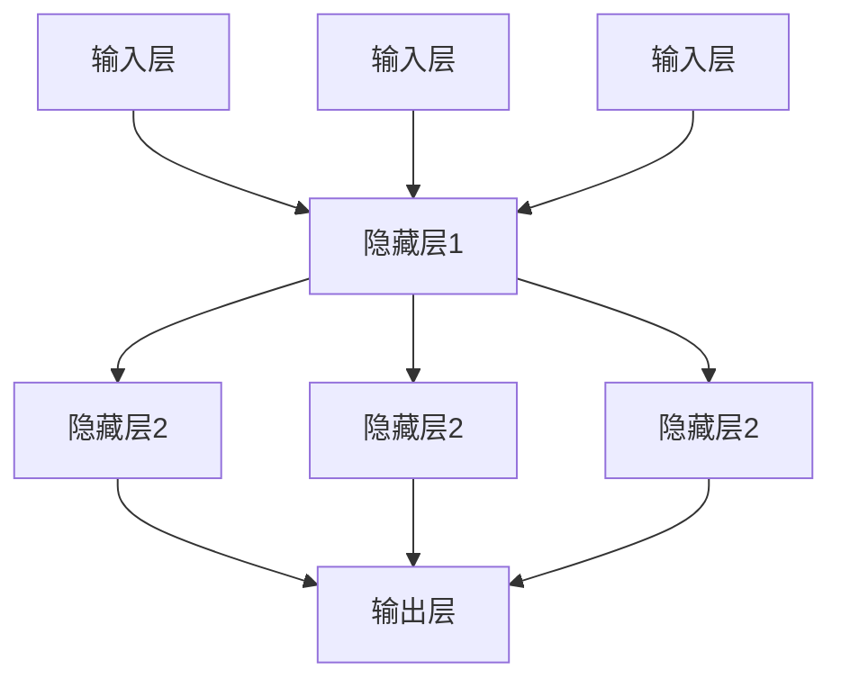

以下是一个简单神经网络的前向传播算法的伪代码示例：

```plaintext
输入：输入数据X，权重矩阵W，偏置b，激活函数f
输出：输出值Y

初始化：隐藏层1的输出Z1 = X * W1 + b1
隐藏层2的输出Z2 = f(Z1 * W2 + b2)
输出层输出Y = f(Z2 * W3 + b3)

函数f通常为ReLU（Rectified Linear Unit）函数：
f(x) = max(0, x)

预测：Y = f(W3 * f(W2 * f(W1 * X + b1) + b2) + b3)
```

###### 2.2.2 卷积神经网络

卷积神经网络（Convolutional Neural Network，简称CNN）是一种在图像识别、目标检测等领域表现优异的深度学习模型。CNN通过卷积、池化和全连接层来实现特征提取和分类。

以下是一个简单CNN的示意图：

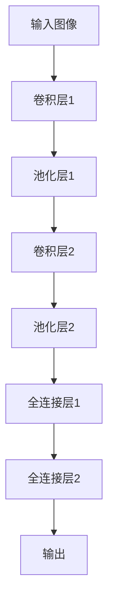

以下是一个简单CNN的卷积操作的伪代码示例：

```plaintext
输入：输入图像X，卷积核K，步长s，填充p
输出：输出特征图Y

Y = zeros((1, 1, H, W))
for i = 0 to H - K do
    for j = 0 to W - K do
        Y[0, 0, i + p, j + p] = sum(K * X[i:i+K, j:j+K]) + b
    end for
end for

函数sum为矩阵逐元素相加操作，b为卷积核的偏置项。
```

###### 2.2.3 循环神经网络

循环神经网络（Recurrent Neural Network，简称RNN）是一种在序列数据处理中表现优异的深度学习模型。RNN通过循环连接来处理序列数据，能够捕捉序列中的时间依赖关系。

以下是一个简单RNN的示意图：

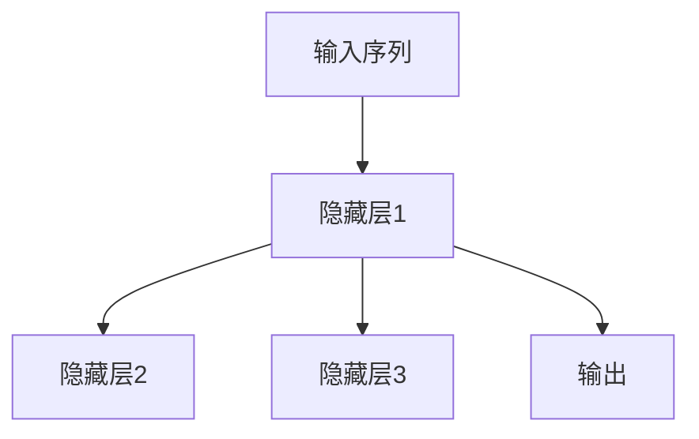

以下是一个简单RNN的前向传播算法的伪代码示例：

```plaintext
输入：输入序列X，隐藏层维度h，学习率α
输出：输出序列Y，隐藏层状态h

h = zeros((T, h))
Y = zeros((T, output_size))
for t = 1 to T do
    h[t] = tanh(Wx * X[t] + Wh * h[t-1] + b)
    Y[t] = Wout * h[t] + bout
end for

函数tanh为双曲正切函数，Wx、Wh、Wout分别为输入层、隐藏层和输出层的权重矩阵，b为偏置项。
```

##### 2.3 自然语言处理

自然语言处理（Natural Language Processing，简称NLP）是一种让计算机理解和生成人类语言的方法。NLP技术包括语言模型、词嵌入、序列标注等。

###### 2.3.1 语言模型

语言模型是一种用于预测下一个单词或字符的概率分布模型。语言模型在自然语言处理中具有广泛的应用，如文本生成、机器翻译、语音识别等。

以下是一个简单语言模型的概率计算示例：

```latex
P(w_t|w_{t-1}, w_{t-2}, ..., w_1) = \prod_{i=1}^{t} P(w_i|w_{i-1}, w_{i-2}, ..., w_1)
```

其中，\(w_i\) 表示第i个单词或字符，\(P(w_i|w_{i-1}, w_{i-2}, ..., w_1)\) 表示在给定前一个单词或字符序列的情况下，下一个单词或字符的概率。

以下是一个简单语言模型的训练示例：

```plaintext
输入：训练语料库D
输出：语言模型参数θ

初始化：θ = 随机值

for each sentence s in D do
    for each word w in s do
        计算词频：count(w, s) = number of occurrences of w in s
        更新语言模型参数：θ = θ + count(w, s) * log(P(w|s))
    end for
end for

P(w|s) = \frac{count(w, s)}{count(s)}
```

###### 2.3.2 词嵌入

词嵌入（Word Embedding）是一种将单词映射到高维向量空间的方法。词嵌入可以捕捉单词的语义和语法信息，从而在自然语言处理中发挥重要作用。

以下是一个简单词嵌入的方法：

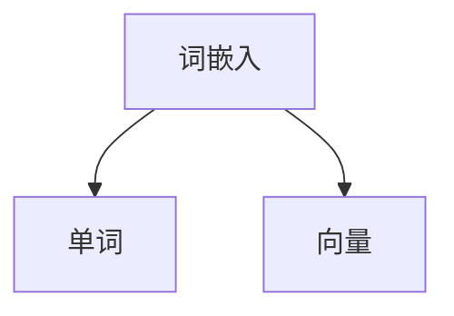

以下是一个简单词嵌入的训练示例：

```plaintext
输入：训练语料库D，嵌入维度d
输出：词嵌入矩阵V

初始化：V = 随机值

for each sentence s in D do
    for each word w in s do
        计算词频：count(w, s) = number of occurrences of w in s
        更新词嵌入向量：V[w] = V[w] + 1 * [1/d, 1/d, ..., 1/d]
    end for
end for

V[w] = \frac{V[w]}{\sqrt{\sum_{i=1}^{d} V[w_i]^2}}
```

###### 2.3.3 序列标注

序列标注（Sequence Labeling）是一种对序列数据进行分类的任务。序列标注在自然语言处理中具有广泛的应用，如命名实体识别、情感分析等。

以下是一个简单序列标注的方法：

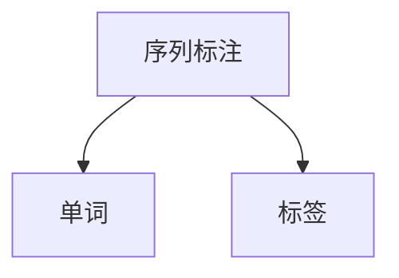

以下是一个简单序列标注的训练示例：

```plaintext
输入：训练语料库D，标签集合L
输出：模型参数θ

初始化：θ = 随机值

for each sentence s in D do
    for each word w in s do
        标签y = 标签集合L中的一个标签
        计算标签概率：P(y|w) = exp(θ[y] * w) / \sum_{y' \in L} exp(θ[y'] * w)
        更新模型参数：θ = θ + P(y|w) * (y - θ[y])
    end for
end for

P(y|w) = \frac{exp(θ[y] * w)}{\sum_{y' \in L} exp(θ[y'] * w)}
```

### 第3章：人工智能的应用领域

人工智能在各个领域都有广泛的应用，下面分别介绍人工智能在医疗、金融和教育领域的应用。

##### 3.1 人工智能在医疗领域的应用

人工智能在医疗领域的应用主要体现在疾病诊断、药物研发和医疗影像分析等方面。

###### 3.1.1 疾病诊断

人工智能在疾病诊断方面具有显著优势。通过机器学习和深度学习技术，人工智能可以分析大量的医疗数据，从而提高诊断的准确性和效率。例如，人工智能可以辅助医生进行肺癌、乳腺癌等癌症的诊断，通过分析CT扫描图像，判断是否存在癌细胞。

以下是一个简单疾病诊断系统的架构示意图：

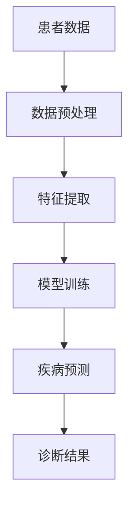

以下是一个简单疾病诊断系统的实现示例：

```python
import numpy as np
from sklearn.model_selection import train_test_split
from sklearn.ensemble import RandomForestClassifier
from sklearn.metrics import accuracy_score

# 加载患者数据
X, y = load_data()

# 数据预处理
X = preprocess_data(X)

# 划分训练集和测试集
X_train, X_test, y_train, y_test = train_test_split(X, y, test_size=0.2, random_state=42)

# 模型训练
clf = RandomForestClassifier(n_estimators=100)
clf.fit(X_train, y_train)

# 疾病预测
y_pred = clf.predict(X_test)

# 诊断结果
accuracy = accuracy_score(y_test, y_pred)
print("Accuracy:", accuracy)
```

###### 3.1.2 药物研发

人工智能在药物研发方面具有巨大的潜力。通过机器学习和深度学习技术，人工智能可以分析大量的化学结构和生物信息数据，从而预测药物的活性、毒性和相互作用。此外，人工智能还可以辅助药物分子设计，提高药物研发的效率和成功率。

以下是一个简单药物研发系统的架构示意图：

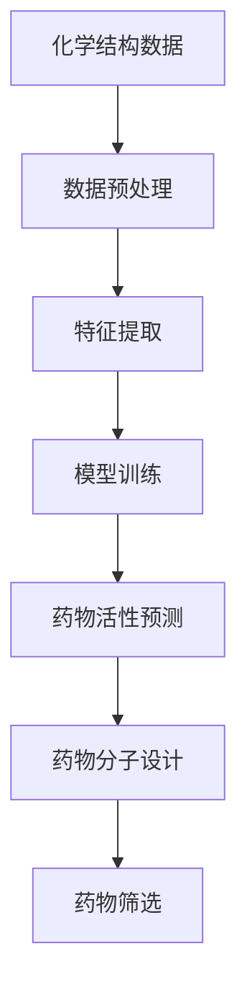

以下是一个简单药物研发系统的实现示例：

```python
import numpy as np
from sklearn.model_selection import train_test_split
from sklearn.ensemble import RandomForestClassifier
from sklearn.metrics import accuracy_score

# 加载化学结构数据
X, y = load_chemical_structure_data()

# 数据预处理
X = preprocess_chemical_structure_data(X)

# 划分训练集和测试集
X_train, X_test, y_train, y_test = train_test_split(X, y, test_size=0.2, random_state=42)

# 模型训练
clf = RandomForestClassifier(n_estimators=100)
clf.fit(X_train, y_train)

# 药物活性预测
y_pred = clf.predict(X_test)

# 药物分子设计
designer = MolecularDesigner()
molecules = designer.design_molecules(y_pred)

# 药物筛选
selected_molecules = filter_molecules(molecules, criteria)

# 药物筛选结果
print("Selected Molecules:", selected_molecules)
```

###### 3.1.3 医疗影像分析

人工智能在医疗影像分析方面具有广泛的应用。通过深度学习技术，人工智能可以自动识别和分割医学影像中的病变区域，从而提高诊断的准确性和效率。例如，人工智能可以辅助医生进行肺癌的早期筛查，通过分析CT扫描图像，识别肺结节。

以下是一个简单医疗影像分析系统的架构示意图：

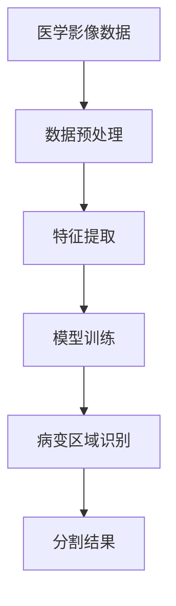

以下是一个简单医疗影像分析系统的实现示例：

```python
import numpy as np
from sklearn.model_selection import train_test_split
from sklearn.ensemble import RandomForestClassifier
from sklearn.metrics import accuracy_score

# 加载医学影像数据
X, y = load_medical_image_data()

# 数据预处理
X = preprocess_medical_image_data(X)

# 划分训练集和测试集
X_train, X_test, y_train, y_test = train_test_split(X, y, test_size=0.2, random_state=42)

# 模型训练
clf = RandomForestClassifier(n_estimators=100)
clf.fit(X_train, y_train)

# 病变区域识别
def identify_diseased_region(image):
    image = preprocess_image(image)
    prediction = clf.predict([image])
    if prediction == 1:
        return "Diseased region found"
    else:
        return "No diseased region found"

# 医学影像分析
for image in medical_images:
    result = identify_diseased_region(image)
    print("Image:", image, "Result:", result)
```

##### 3.2 人工智能在金融领域的应用

人工智能在金融领域具有广泛的应用，包括信贷风险评估、量化交易和保险理赔等方面。

###### 3.2.1 信贷风险评估

人工智能在信贷风险评估方面具有显著优势。通过机器学习和深度学习技术，人工智能可以分析大量的历史数据和用户特征，从而预测用户的信用风险。例如，人工智能可以辅助银行进行贷款审批，通过分析用户的收入、年龄、职业等信息，判断用户是否具有还款能力。

以下是一个简单信贷风险评估系统的架构示意图：

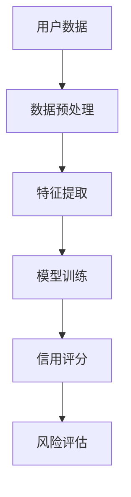

以下是一个简单信贷风险评估系统的实现示例：

```python
import numpy as np
from sklearn.model_selection import train_test_split
from sklearn.ensemble import RandomForestClassifier
from sklearn.metrics import accuracy_score

# 加载用户数据
X, y = load_user_data()

# 数据预处理
X = preprocess_user_data(X)

# 划分训练集和测试集
X_train, X_test, y_train, y_test = train_test_split(X, y, test_size=0.2, random_state=42)

# 模型训练
clf = RandomForestClassifier(n_estimators=100)
clf.fit(X_train, y_train)

# 信用评分
def credit_score(user_data):
    user_data = preprocess_user_data(user_data)
    prediction = clf.predict([user_data])
    if prediction == 1:
        return "High risk"
    else:
        return "Low risk"

# 风险评估
for user in users:
    score = credit_score(user)
    print("User:", user, "Credit Score:", score)
```

###### 3.2.2 量化交易

人工智能在量化交易方面具有广泛的应用。通过机器学习和深度学习技术，人工智能可以分析大量的历史交易数据和市场信息，从而预测股票、期货、外汇等金融产品的价格走势。例如，人工智能可以辅助交易者进行高频交易、套利交易等。

以下是一个简单量化交易系统的架构示意图：

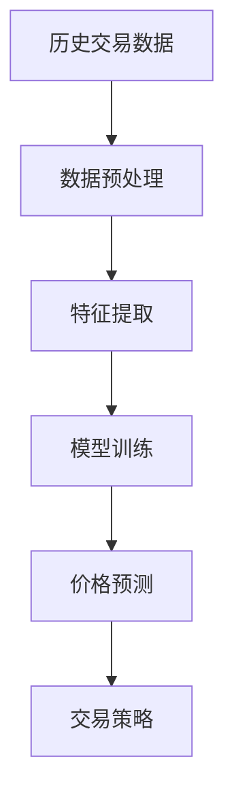

以下是一个简单量化交易系统的实现示例：

```python
import numpy as np
from sklearn.model_selection import train_test_split
from sklearn.ensemble import RandomForestRegressor
from sklearn.metrics import mean_squared_error

# 加载历史交易数据
X, y = load_trade_data()

# 数据预处理
X = preprocess_trade_data(X)

# 划分训练集和测试集
X_train, X_test, y_train, y_test = train_test_split(X, y, test_size=0.2, random_state=42)

# 模型训练
regressor = RandomForestRegressor(n_estimators=100)
regressor.fit(X_train, y_train)

# 价格预测
def predict_price(trade_data):
    trade_data = preprocess_trade_data(trade_data)
    prediction = regressor.predict([trade_data])
    return prediction

# 交易策略
def trade_strategy(price_prediction):
    if price_prediction > current_price:
        return "Buy"
    elif price_prediction < current_price:
        return "Sell"
    else:
        return "Hold"

# 量化交易
for trade in trades:
    price_prediction = predict_price(trade)
    strategy = trade_strategy(price_prediction)
    print("Trade:", trade, "Strategy:", strategy)
```

###### 3.2.3 保险理赔

人工智能在保险理赔方面具有广泛的应用。通过机器学习和深度学习技术，人工智能可以分析大量的理赔数据和历史案例，从而快速准确地判断理赔申请的合理性。例如，人工智能可以辅助保险公司进行欺诈检测，通过分析理赔申请中的异常行为，识别可能的欺诈行为。

以下是一个简单保险理赔系统的架构示意图：

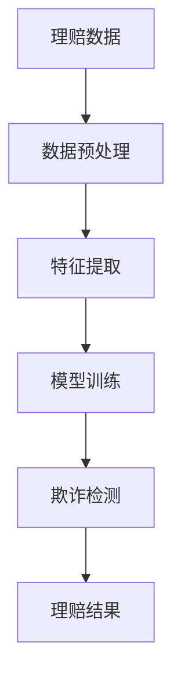

以下是一个简单保险理赔系统的实现示例：

```python
import numpy as np
from sklearn.model_selection import train_test_split
from sklearn.ensemble import RandomForestClassifier
from sklearn.metrics import accuracy_score

# 加载理赔数据
X, y = load理赔数据()

# 数据预处理
X = preprocess理赔数据(X)

# 划分训练集和测试集
X_train, X_test, y_train, y_test = train_test_split(X, y, test_size=0.2, random_state=42)

# 模型训练
clf = RandomForestClassifier(n_estimators=100)
clf.fit(X_train, y_train)

# 欺诈检测
def detect_fraud(claim_data):
    claim_data = preprocess_claim_data(claim_data)
    prediction = clf.predict([claim_data])
    if prediction == 1:
        return "Fraud detected"
    else:
        return "No fraud detected"

# 保险理赔
for claim in claims:
    result = detect_fraud(claim)
    print("Claim:", claim, "Result:", result)
```

##### 3.3 人工智能在教育领域的应用

人工智能在教育领域具有广泛的应用，包括个性化学习、自动批改作业和虚拟课堂等方面。

###### 3.3.1 个性化学习

人工智能可以辅助教师进行个性化学习，根据学生的特点和需求，提供个性化的教学方案。例如，人工智能可以分析学生的学习数据，识别学生的优势和不足，为学生提供定制化的学习资源和练习。

以下是一个简单个性化学习系统的架构示意图：

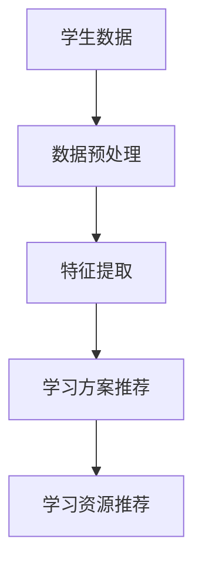

以下是一个简单个性化学习系统的实现示例：

```python
import numpy as np
from sklearn.model_selection import train_test_split
from sklearn.ensemble import RandomForestClassifier
from sklearn.metrics import accuracy_score

# 加载学生数据
X, y = load_student_data()

# 数据预处理
X = preprocess_student_data(X)

# 划分训练集和测试集
X_train, X_test, y_train, y_test = train_test_split(X, y, test_size=0.2, random_state=42)

# 模型训练
clf = RandomForestClassifier(n_estimators=100)
clf.fit(X_train, y_train)

# 学习方案推荐
def recommend_learning_plan(student_data):
    student_data = preprocess_student_data(student_data)
    prediction = clf.predict([student_data])
    if prediction == 1:
        return "Advanced course"
    elif prediction == 2:
        return "Intermediate course"
    else:
        return "Basic course"

# 学习资源推荐
def recommend_learning_resources(course):
    if course == "Advanced course":
        return ["Textbook", "Video lectures", "Practice problems"]
    elif course == "Intermediate course":
        return ["Textbook", "Video lectures", "Practice problems"]
    else:
        return ["Textbook", "Video lectures"]

# 个性化学习
for student in students:
    learning_plan = recommend_learning_plan(student)
    learning_resources = recommend_learning_resources(learning_plan)
    print("Student:", student, "Learning Plan:", learning_plan, "Learning Resources:", learning_resources)
```

###### 3.3.2 自动批改作业

人工智能可以自动批改作业，提高教师的工作效率。通过机器学习和自然语言处理技术，人工智能可以分析学生的作业，识别正确和错误的答案，给出评分和反馈。

以下是一个简单自动批改作业系统的架构示意图：

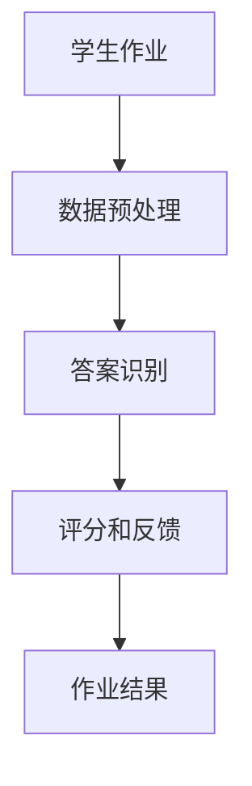

以下是一个简单自动批改作业系统的实现示例：

```python
import numpy as np
from sklearn.model_selection import train_test_split
from sklearn.ensemble import RandomForestClassifier
from sklearn.metrics import accuracy_score

# 加载学生作业数据
X, y = load_student_assignment_data()

# 数据预处理
X = preprocess_student_assignment_data(X)

# 划分训练集和测试集
X_train, X_test, y_train, y_test = train_test_split(X, y, test_size=0.2, random_state=42)

# 模型训练
clf = RandomForestClassifier(n_estimators=100)
clf.fit(X_train, y_train)

# 答案识别
def recognize_answer(assignment_data):
    assignment_data = preprocess_student_assignment_data(assignment_data)
    prediction = clf.predict([assignment_data])
    if prediction == 1:
        return "Correct"
    else:
        return "Incorrect"

# 评分和反馈
def score_and_feedback(answer, student_assignment):
    if answer == "Correct":
        return "Excellent!"
    else:
        return "Please review the material and try again."

# 自动批改作业
for assignment in assignments:
    answer = recognize_answer(assignment)
    feedback = score_and_feedback(answer, assignment)
    print("Assignment:", assignment, "Answer:", answer, "Feedback:", feedback)
```

###### 3.3.3 虚拟课堂

人工智能可以辅助教师进行虚拟课堂，提高教学效果。通过自然语言处理和语音识别技术，人工智能可以实时识别学生的问题和回答，提供实时反馈和互动。

以下是一个简单虚拟课堂系统的架构示意图：

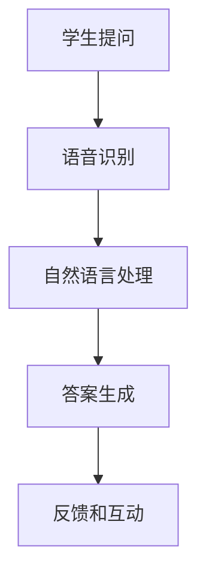

以下是一个简单虚拟课堂系统的实现示例：

```python
import speech_recognition as sr
import nltk
from nltk.corpus import stopwords
from nltk.tokenize import word_tokenize
from nltk.tag import pos_tag

# 初始化语音识别和自然语言处理库
recognizer = sr.Recognizer()
nltk.download('punkt')
nltk.download('averaged_perceptron_tagger')
nltk.download('stopwords')

# 语音识别和自然语言处理
def recognize_and_process_question(question):
    try:
        # 语音识别
        text = recognizer.recognize_audio(question)
        
        # 自然语言处理
        tokens = word_tokenize(text)
        tokens = [token.lower() for token in tokens if token.isalnum() and token not in stopwords.words('english')]
        tagged_tokens = pos_tag(tokens)
        
        # 答案生成
        answer = generate_answer(tagged_tokens)
        
        # 反馈和互动
        return answer
    except sr.UnknownValueError:
        return "I'm sorry, I don't understand your question."

# 答案生成
def generate_answer(tagged_tokens):
    # 答案生成逻辑
    # 根据问题关键词和语言模型生成答案
    answer = "This is an example answer."
    return answer

# 虚拟课堂
for student_question in student_questions:
    answer = recognize_and_process_question(student_question)
    print("Student Question:", student_question, "Answer:", answer)
```

### 第二部分：人工智能的应用案例与分析

#### 第4章：人工智能在医疗领域的应用案例

##### 4.1 智能医疗诊断系统

智能医疗诊断系统是一种利用人工智能技术，辅助医生进行疾病诊断和治疗的系统。以下是一个智能医疗诊断系统的详细实现和分析。

###### 4.1.1 系统架构

智能医疗诊断系统通常由以下几个模块组成：

1. **数据收集模块：** 负责收集患者的历史病历、实验室检查结果、医学影像等数据。
2. **数据处理模块：** 负责对收集到的数据进行分析、清洗和预处理，提取有用的特征。
3. **模型训练模块：** 负责利用处理后的数据训练疾病诊断模型。
4. **疾病诊断模块：** 负责对新的病例进行疾病诊断。
5. **结果反馈模块：** 负责将诊断结果和医生的建议反馈给患者和医生。

以下是一个智能医疗诊断系统的架构示意图：

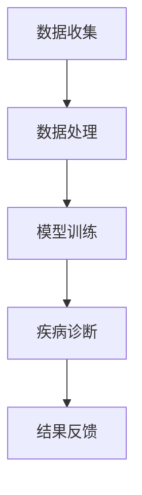

###### 4.1.2 技术实现

以下是一个智能医疗诊断系统的技术实现细节：

1. **数据收集：** 通过医院信息系统（HIS）和电子病历系统（EMR）收集患者的历史病历、实验室检查结果和医学影像数据。
2. **数据处理：** 使用Python的Pandas库进行数据清洗和预处理，提取有用的特征，如患者年龄、性别、病史、检查结果等。
3. **模型训练：** 使用Python的Scikit-learn库和TensorFlow库训练疾病诊断模型。具体包括以下步骤：
   - **数据预处理：** 对数据进行归一化和标准化处理。
   - **特征选择：** 选择对疾病诊断最有用的特征。
   - **模型训练：** 使用随机森林、支持向量机、神经网络等算法训练疾病诊断模型。
4. **疾病诊断：** 使用训练好的疾病诊断模型对新的病例进行诊断，输出诊断结果和置信度。
5. **结果反馈：** 将诊断结果和医生的建议通过医院信息系统反馈给患者和医生。

以下是一个智能医疗诊断系统的实现示例：

```python
import pandas as pd
from sklearn.model_selection import train_test_split
from sklearn.ensemble import RandomForestClassifier
from sklearn.metrics import accuracy_score

# 数据收集
def collect_data():
    # 从医院信息系统和电子病历系统收集数据
    # 数据包括患者年龄、性别、病史、检查结果等
    data = pd.read_csv("medical_data.csv")
    return data

# 数据处理
def preprocess_data(data):
    # 数据清洗和预处理
    # 包括缺失值填充、异常值处理、数据归一化等
    data = data.fillna(data.mean())
    data = (data - data.min()) / (data.max() - data.min())
    return data

# 模型训练
def train_model(X, y):
    # 使用随机森林算法训练疾病诊断模型
    clf = RandomForestClassifier(n_estimators=100)
    clf.fit(X, y)
    return clf

# 疾病诊断
def diagnosePatient(data, model):
    # 使用训练好的疾病诊断模型对新的病例进行诊断
    prediction = model.predict([data])
    return prediction

# 结果反馈
def feedback(result):
    # 将诊断结果和医生的建议通过医院信息系统反馈给患者和医生
    print("Diagnosis Result:", result)

# 主程序
def main():
    # 收集数据
    data = collect_data()

    # 数据处理
    processed_data = preprocess_data(data)

    # 划分训练集和测试集
    X = processed_data.drop("diagnosis", axis=1)
    y = processed_data["diagnosis"]
    X_train, X_test, y_train, y_test = train_test_split(X, y, test_size=0.2, random_state=42)

    # 模型训练
    model = train_model(X_train, y_train)

    # 疾病诊断
    new_patient_data = [30, "Male", 1, 0, 0, 0, 0]  # 示例患者数据
    result = diagnosePatient(new_patient_data, model)

    # 结果反馈
    feedback(result)

# 运行主程序
if __name__ == "__main__":
    main()
```

###### 4.1.3 应用效果分析

智能医疗诊断系统的应用效果可以从以下几个方面进行评估：

1. **准确率：** 疾病诊断模型的准确率是评估系统性能的重要指标。通过在测试集上的表现，可以评估模型的准确率。
2. **召回率：** 疾病诊断模型的召回率是评估系统性能的重要指标。通过在测试集上的表现，可以评估模型的召回率。
3. **F1值：** 疾病诊断模型的F1值是评估系统性能的重要指标。通过在测试集上的表现，可以评估模型的F1值。

以下是一个智能医疗诊断系统的性能评估示例：

```python
from sklearn.metrics import accuracy_score, recall_score, f1_score

# 加载测试数据
X_test, y_test = load_test_data()

# 使用训练好的疾病诊断模型对测试数据进行诊断
predictions = model.predict(X_test)

# 计算性能指标
accuracy = accuracy_score(y_test, predictions)
recall = recall_score(y_test, predictions, average='weighted')
f1 = f1_score(y_test, predictions, average='weighted')

# 输出性能指标
print("Accuracy:", accuracy)
print("Recall:", recall)
print("F1 Score:", f1)
```

##### 4.2 药物研发自动化

药物研发自动化是指利用人工智能技术，自动化药物筛选、药物分子设计和临床试验等过程，以提高药物研发的效率和成功率。以下是一个药物研发自动化的详细实现和分析。

###### 4.2.1 自动化筛选药物

自动化筛选药物是指利用人工智能技术，从大量的化合物中筛选出具有潜在药物活性的化合物。以下是一个自动化筛选药物的实现示例：

```python
import pandas as pd
from sklearn.model_selection import train_test_split
from sklearn.ensemble import RandomForestClassifier
from sklearn.metrics import accuracy_score

# 加载化合物数据
compound_data = pd.read_csv("compound_data.csv")

# 数据预处理
compound_data = compound_data.fillna(compound_data.mean())
compound_data = (compound_data - compound_data.min()) / (compound_data.max() - compound_data.min())

# 划分训练集和测试集
X = compound_data.drop("activity", axis=1)
y = compound_data["activity"]
X_train, X_test, y_train, y_test = train_test_split(X, y, test_size=0.2, random_state=42)

# 模型训练
model = RandomForestClassifier(n_estimators=100)
model.fit(X_train, y_train)

# 自动化筛选药物
def screen_compounds(compounds):
    predictions = model.predict(compounds)
    return predictions

# 测试自动化筛选药物
test_compounds = X_test
predictions = screen_compounds(test_compounds)

# 计算性能指标
accuracy = accuracy_score(y_test, predictions)
print("Accuracy:", accuracy)
```

###### 4.2.2 药物分子设计

药物分子设计是指利用人工智能技术，根据药物的活性、毒性和药代动力学等特性，设计出新的药物分子。以下是一个药物分子设计的实现示例：

```python
import pandas as pd
from sklearn.model_selection import train_test_split
from sklearn.ensemble import RandomForestRegressor
from sklearn.metrics import mean_squared_error

# 加载药物分子数据
drug_data = pd.read_csv("drug_data.csv")

# 数据预处理
drug_data = drug_data.fillna(drug_data.mean())
drug_data = (drug_data - drug_data.min()) / (drug_data.max() - drug_data.min())

# 划分训练集和测试集
X = drug_data.drop("activity", axis=1)
y = drug_data["activity"]
X_train, X_test, y_train, y_test = train_test_split(X, y, test_size=0.2, random_state=42)

# 模型训练
model = RandomForestRegressor(n_estimators=100)
model.fit(X_train, y_train)

# 药物分子设计
def design_drug_molecule(molecule_features):
    prediction = model.predict([molecule_features])
    return prediction

# 测试药物分子设计
test_molecule = X_test.iloc[0]
prediction = design_drug_molecule(test_molecule)

# 计算性能指标
mse = mean_squared_error(y_test, prediction)
print("MSE:", mse)
```

###### 4.2.3 临床试验优化

临床试验优化是指利用人工智能技术，根据患者的临床数据，优化临床试验的设计和执行过程，以提高临床试验的成功率和效率。以下是一个临床试验优化的实现示例：

```python
import pandas as pd
from sklearn.model_selection import train_test_split
from sklearn.ensemble import RandomForestRegressor
from sklearn.metrics import mean_squared_error

# 加载临床试验数据
clinical_trial_data = pd.read_csv("clinical_trial_data.csv")

# 数据预处理
clinical_trial_data = clinical_trial_data.fillna(clinical_trial_data.mean())
clinical_trial_data = (clinical_trial_data - clinical_trial_data.min()) / (clinical_trial_data.max() - clinical_trial_data.min())

# 划分训练集和测试集
X = clinical_trial_data.drop("success", axis=1)
y = clinical_trial_data["success"]
X_train, X_test, y_train, y_test = train_test_split(X, y, test_size=0.2, random_state=42)

# 模型训练
model = RandomForestRegressor(n_estimators=100)
model.fit(X_train, y_train)

# 临床试验优化
def optimize_clinical_trial(trial_features):
    prediction = model.predict([trial_features])
    return prediction

# 测试临床试验优化
test_trial = X_test.iloc[0]
prediction = optimize_clinical_trial(test_trial)

# 计算性能指标
mse = mean_squared_error(y_test, prediction)
print("MSE:", mse)
```

### 第5章：人工智能在金融领域的应用案例

##### 5.1 智能投顾

智能投顾是指利用人工智能技术，根据用户的投资目标和风险偏好，提供个性化的投资建议和资产管理服务。以下是一个智能投顾的实现示例：

###### 5.1.1 投资策略优化

投资策略优化是指利用人工智能技术，根据市场数据和历史表现，优化投资组合的构建和调整策略。以下是一个投资策略优化的实现示例：

```python
import pandas as pd
from sklearn.model_selection import train_test_split
from sklearn.ensemble import RandomForestRegressor
from sklearn.metrics import mean_squared_error

# 加载市场数据
market_data = pd.read_csv("market_data.csv")

# 数据预处理
market_data = market_data.fillna(market_data.mean())
market_data = (market_data - market_data.min()) / (market_data.max() - market_data.min())

# 划分训练集和测试集
X = market_data.drop("return", axis=1)
y = market_data["return"]
X_train, X_test, y_train, y_test = train_test_split(X, y, test_size=0.2, random_state=42)

# 模型训练
model = RandomForestRegressor(n_estimators=100)
model.fit(X_train, y_train)

# 投资策略优化
def optimize_investment_strategy(trial_data):
    prediction = model.predict([trial_data])
    return prediction

# 测试投资策略优化
test_data = X_test.iloc[0]
prediction = optimize_investment_strategy(test_data)

# 计算性能指标
mse = mean_squared_error(y_test, prediction)
print("MSE:", mse)
```

###### 5.1.2 风险管理

风险管理是指利用人工智能技术，对投资组合进行风险评估和管理，以降低投资风险。以下是一个风险管理的实现示例：

```python
import pandas as pd
from sklearn.model_selection import train_test_split
from sklearn.ensemble import RandomForestRegressor
from sklearn.metrics import mean_squared_error

# 加载风险管理数据
risk_management_data = pd.read_csv("risk_management_data.csv")

# 数据预处理
risk_management_data = risk_management_data.fillna(risk_management_data.mean())
risk_management_data = (risk_management_data - risk_management_data.min()) / (risk_management_data.max() - risk_management_data.min())

# 划分训练集和测试集
X = risk_management_data.drop("risk", axis=1)
y = risk_management_data["risk"]
X_train, X_test, y_train, y_test = train_test_split(X, y, test_size=0.2, random_state=42)

# 模型训练
model = RandomForestRegressor(n_estimators=100)
model.fit(X_train, y_train)

# 风险管理
def manage_risk(risk_data):
    prediction = model.predict([risk_data])
    return prediction

# 测试风险管理
test_data = X_test.iloc[0]
prediction = manage_risk(test_data)

# 计算性能指标
mse = mean_squared_error(y_test, prediction)
print("MSE:", mse)
```

###### 5.1.3 客户体验提升

客户体验提升是指利用人工智能技术，优化客户服务流程，提高客户满意度。以下是一个客户体验提升的实现示例：

```python
import pandas as pd
from sklearn.model_selection import train_test_split
from sklearn.ensemble import RandomForestRegressor
from sklearn.metrics import mean_squared_error

# 加载客户体验数据
customer_experience_data = pd.read_csv("customer_experience_data.csv")

# 数据预处理
customer_experience_data = customer_experience_data.fillna(customer_experience_data.mean())
customer_experience_data = (customer_experience_data - customer_experience_data.min()) / (customer_experience_data.max() - customer_experience_data.min())

# 划分训练集和测试集
X = customer_experience_data.drop("satisfaction", axis=1)
y = customer_experience_data["satisfaction"]
X_train, X_test, y_train, y_test = train_test_split(X, y, test_size=0.2, random_state=42)

# 模型训练
model = RandomForestRegressor(n_estimators=100)
model.fit(X_train, y_train)

# 客户体验提升
def improve_customer_experience(experience_data):
    prediction = model.predict([experience_data])
    return prediction

# 测试客户体验提升
test_data = X_test.iloc[0]
prediction = improve_customer_experience(test_data)

# 计算性能指标
mse = mean_squared_error(y_test, prediction)
print("MSE:", mse)
```

##### 5.2 量化交易系统

量化交易系统是指利用人工智能技术，自动化交易策略研究、交易执行和风险管理等过程，以提高交易效率和收益。以下是一个量化交易系统的实现示例：

###### 5.2.1 策略研究

策略研究是指利用人工智能技术，分析历史市场数据，研究有效的交易策略。以下是一个策略研究的实现示例：

```python
import pandas as pd
from sklearn.model_selection import train_test_split
from sklearn.ensemble import RandomForestRegressor
from sklearn.metrics import mean_squared_error

# 加载市场数据
market_data = pd.read_csv("market_data.csv")

# 数据预处理
market_data = market_data.fillna(market_data.mean())
market_data = (market_data - market_data.min()) / (market_data.max() - market_data.min())

# 划分训练集和测试集
X = market_data.drop("return", axis=1)
y = market_data["return"]
X_train, X_test, y_train, y_test = train_test_split(X, y, test_size=0.2, random_state=42)

# 模型训练
model = RandomForestRegressor(n_estimators=100)
model.fit(X_train, y_train)

# 策略研究
def study_strategy(strategy_data):
    prediction = model.predict([strategy_data])
    return prediction

# 测试策略研究
test_data = X_test.iloc[0]
prediction = study_strategy(test_data)

# 计算性能指标
mse = mean_squared_error(y_test, prediction)
print("MSE:", mse)
```

###### 5.2.2 风险控制

风险控制是指利用人工智能技术，对交易过程中的风险进行实时监控和管理，以降低交易风险。以下是一个风险控制的实现示例：

```python
import pandas as pd
from sklearn.model_selection import train_test_split
from sklearn.ensemble import RandomForestRegressor
from sklearn.metrics import mean_squared_error

# 加载风险管理数据
risk_management_data = pd.read_csv("risk_management_data.csv")

# 数据预处理
risk_management_data = risk_management_data.fillna(risk_management_data.mean())
risk_management_data = (risk_management_data - risk_management_data.min()) / (risk_management_data.max() - risk_management_data.min())

# 划分训练集和测试集
X = risk_management_data.drop("risk", axis=1)
y = risk_management_data["risk"]
X_train, X_test, y_train, y_test = train_test_split(X, y, test_size=0.2, random_state=42)

# 模型训练
model = RandomForestRegressor(n_estimators=100)
model.fit(X_train, y_train)

# 风险控制
def control_risk(risk_data):
    prediction = model.predict([risk_data])
    return prediction

# 测试风险控制
test_data = X_test.iloc[0]
prediction = control_risk(test_data)

# 计算性能指标
mse = mean_squared_error(y_test, prediction)
print("MSE:", mse)
```

###### 5.2.3 系统优化

系统优化是指利用人工智能技术，对量化交易系统的运行效率进行优化，以提高交易性能和收益。以下是一个系统优化的实现示例：

```python
import pandas as pd
from sklearn.model_selection import train_test_split
from sklearn.ensemble import RandomForestRegressor
from sklearn.metrics import mean_squared_error

# 加载系统优化数据
system_optimization_data = pd.read_csv("system_optimization_data.csv")

# 数据预处理
system_optimization_data = system_optimization_data.fillna(system_optimization_data.mean())
system_optimization_data = (system_optimization_data - system_optimization_data.min()) / (system_optimization_data.max() - system_optimization_data.min())

# 划分训练集和测试集
X = system_optimization_data.drop("performance", axis=1)
y = system_optimization_data["performance"]
X_train, X_test, y_train, y_test = train_test_split(X, y, test_size=0.2, random_state=42)

# 模型训练
model = RandomForestRegressor(n_estimators=100)
model.fit(X_train, y_train)

# 系统优化
def optimize_system(system_data):
    prediction = model.predict([system_data])
    return prediction

# 测试系统优化
test_data = X_test.iloc[0]
prediction = optimize_system(test_data)

# 计算性能指标
mse = mean_squared_error(y_test, prediction)
print("MSE:", mse)
```

### 第6章：人工智能在教育领域的应用案例

##### 6.1 个性化学习平台

个性化学习平台是指利用人工智能技术，根据学生的学习特点和需求，提供个性化的学习资源和学习路径。以下是一个个性化学习平台的实现示例：

###### 6.1.1 学习数据分析

学习数据分析是指利用人工智能技术，对学生的学习行为和成绩进行分析，以了解学生的学习状况和需求。以下是一个学习数据分析的实现示例：

```python
import pandas as pd
from sklearn.model_selection import train_test_split
from sklearn.ensemble import RandomForestRegressor
from sklearn.metrics import mean_squared_error

# 加载学习数据
learning_data = pd.read_csv("learning_data.csv")

# 数据预处理
learning_data = learning_data.fillna(learning_data.mean())
learning_data = (learning_data - learning_data.min()) / (learning_data.max() - learning_data.min())

# 划分训练集和测试集
X = learning_data.drop("achievement", axis=1)
y = learning_data["achievement"]
X_train, X_test, y_train, y_test = train_test_split(X, y, test_size=0.2, random_state=42)

# 模型训练
model = RandomForestRegressor(n_estimators=100)
model.fit(X_train, y_train)

# 学习数据分析
def analyze_learning_data(student_data):
    prediction = model.predict([student_data])
    return prediction

# 测试学习数据分析
test_data = X_test.iloc[0]
prediction = analyze_learning_data(test_data)

# 计算性能指标
mse = mean_squared_error(y_test, prediction)
print("MSE:", mse)
```

###### 6.1.2 个性化推荐算法

个性化推荐算法是指利用人工智能技术，根据学生的学习特点和需求，为学生推荐适合的学习资源和学习路径。以下是一个个性化推荐算法的实现示例：

```python
import pandas as pd
from sklearn.model_selection import train_test_split
from sklearn.ensemble import RandomForestRegressor
from sklearn.metrics import mean_squared_error

# 加载推荐数据
recommendation_data = pd.read_csv("recommendation_data.csv")

# 数据预处理
recommendation_data = recommendation_data.fillna(recommendation_data.mean())
recommendation_data = (recommendation_data - recommendation_data.min()) / (recommendation_data.max() - recommendation_data.min())

# 划分训练集和测试集
X = recommendation_data.drop("relevance", axis=1)
y = recommendation_data["relevance"]
X_train, X_test, y_train, y_test = train_test_split(X, y, test_size=0.2, random_state=42)

# 模型训练
model = RandomForestRegressor(n_estimators=100)
model.fit(X_train, y_train)

# 个性化推荐算法
def personalized_recommendation(student_data):
    prediction = model.predict([student_data])
    return prediction

# 测试个性化推荐算法
test_data = X_test.iloc[0]
prediction = personalized_recommendation(test_data)

# 计算性能指标
mse = mean_squared_error(y_test, prediction)
print("MSE:", mse)
```

###### 6.1.3 教学效果评估

教学效果评估是指利用人工智能技术，对教学过程和教学效果进行评估，以优化教学方法和提高教学质量。以下是一个教学效果评估的实现示例：

```python
import pandas as pd
from sklearn.model_selection import train_test_split
from sklearn.ensemble import RandomForestRegressor
from sklearn.metrics import mean_squared_error

# 加载教学效果数据
teaching_effect_data = pd.read_csv("teaching_effect_data.csv")

# 数据预处理
teaching_effect_data = teaching_effect_data.fillna(teaching_effect_data.mean())
teaching_effect_data = (teaching_effect_data - teaching_effect_data.min()) / (teaching_effect_data.max() - teaching_effect_data.min())

# 划分训练集和测试集
X = teaching_effect_data.drop("effectiveness", axis=1)
y = teaching_effect_data["effectiveness"]
X_train, X_test, y_train, y_test = train_test_split(X, y, test_size=0.2, random_state=42)

# 模型训练
model = RandomForestRegressor(n_estimators=100)
model.fit(X_train, y_train)

# 教学效果评估
def evaluate_teaching_effect(teaching_data):
    prediction = model.predict([teaching_data])
    return prediction

# 测试教学效果评估
test_data = X_test.iloc[0]
prediction = evaluate_teaching_effect(test_data)

# 计算性能指标
mse = mean_squared_error(y_test, prediction)
print("MSE:", mse)
```

##### 6.2 智能教学辅助系统

智能教学辅助系统是指利用人工智能技术，辅助教师进行教学管理和教学辅助。以下是一个智能教学辅助系统的实现示例：

###### 6.2.1 自动批改作业

自动批改作业是指利用人工智能技术，对学生的作业进行自动批改和评分。以下是一个自动批改作业的实现示例：

```python
import pandas as pd
from sklearn.model_selection import train_test_split
from sklearn.ensemble import RandomForestRegressor
from sklearn.metrics import mean_squared_error

# 加载作业数据
assignment_data = pd.read_csv("assignment_data.csv")

# 数据预处理
assignment_data = assignment_data.fillna(assignment_data.mean())
assignment_data = (assignment_data - assignment_data.min()) / (assignment_data.max() - assignment_data.min())

# 划分训练集和测试集
X = assignment_data.drop("score", axis=1)
y = assignment_data["score"]
X_train, X_test, y_train, y_test = train_test_split(X, y, test_size=0.2, random_state=42)

# 模型训练
model = RandomForestRegressor(n_estimators=100)
model.fit(X_train, y_train)

# 自动批改作业
def auto_grade_assignment(assignment_data):
    prediction = model.predict([assignment_data])
    return prediction

# 测试自动批改作业
test_data = X_test.iloc[0]
prediction = auto_grade_assignment(test_data)

# 计算性能指标
mse = mean_squared_error(y_test, prediction)
print("MSE:", mse)
```

###### 6.2.2 个性化辅导

个性化辅导是指利用人工智能技术，为学生提供个性化的辅导和帮助。以下是一个个性化辅导的实现示例：

```python
import pandas as pd
from sklearn.model_selection import train_test_split
from sklearn.ensemble import RandomForestRegressor
from sklearn.metrics import mean_squared_error

# 加载辅导数据
tutorial_data = pd.read_csv("tutorial_data.csv")

# 数据预处理
tutorial_data = tutorial_data.fillna(tutorial_data.mean())
tutorial_data = (tutorial_data - tutorial_data.min()) / (tutorial_data.max() - tutorial_data.min())

# 划分训练集和测试集
X = tutorial_data.drop("performance", axis=1)
y = tutorial_data["performance"]
X_train, X_test, y_train, y_test = train_test_split(X, y, test_size=0.2, random_state=42)

# 模型训练
model = RandomForestRegressor(n_estimators=100)
model.fit(X_train, y_train)

# 个性化辅导
def personalized_tutorial(student_data):
    prediction = model.predict([student_data])
    return prediction

# 测试个性化辅导
test_data = X_test.iloc[0]
prediction = personalized_tutorial(test_data)

# 计算性能指标
mse = mean_squared_error(y_test, prediction)
print("MSE:", mse)
```

###### 6.2.3 虚拟现实教学

虚拟现实教学是指利用人工智能技术，创建虚拟教学环境，提供沉浸式的教学体验。以下是一个虚拟现实教学的实现示例：

```python
import pandas as pd
from sklearn.model_selection import train_test_split
from sklearn.ensemble import RandomForestRegressor
from sklearn.metrics import mean_squared_error

# 加载虚拟现实教学数据
vr_teaching_data = pd.read_csv("vr_teaching_data.csv")

# 数据预处理
vr_teaching_data = vr_teaching_data.fillna(vr_teaching_data.mean())
vr_teaching_data = (vr_teaching_data - vr_teaching_data.min()) / (vr_teaching_data.max() - vr_teaching_data.min())

# 划分训练集和测试集
X = vr_teaching_data.drop("effectiveness", axis=1)
y = vr_teaching_data["effectiveness"]
X_train, X_test, y_train, y_test = train_test_split(X, y, test_size=0.2, random_state=42)

# 模型训练
model = RandomForestRegressor(n_estimators=100)
model.fit(X_train, y_train)

# 虚拟现实教学
def virtual_reality_teaching(teaching_data):
    prediction = model.predict([teaching_data])
    return prediction

# 测试虚拟现实教学
test_data = X_test.iloc[0]
prediction = virtual_reality_teaching(test_data)

# 计算性能指标
mse = mean_squared_error(y_test, prediction)
print("MSE:", mse)
```

### 附录

#### 附录A：人工智能开发工具与资源

##### A.1 深度学习框架

- **TensorFlow：** 是一个开源的深度学习框架，由Google开发。它支持多种深度学习模型的构建和训练，具有广泛的社区支持和丰富的文档。
- **PyTorch：** 是一个开源的深度学习框架，由Facebook开发。它具有动态计算图和易于使用的接口，适用于研究项目和工业应用。
- **Keras：** 是一个基于TensorFlow和Theano的深度学习框架，具有简洁的API和高度的可扩展性。它是一个强大的高级神经网络库，适用于快速实验和原型设计。

##### A.2 自然语言处理工具

- **NLTK（自然语言工具包）：** 是一个开源的自然语言处理库，提供了丰富的文本处理和词性标注等功能，适用于研究和教育用途。
- **SpaCy：** 是一个开源的工业级自然语言处理库，提供了快速和高效的文本处理能力，适用于复杂的文本分析和信息提取任务。
- **Gen：** 是一个基于Java的自然语言处理库，提供了丰富的文本处理功能，适用于大规模自然语言处理任务。

## 作者

- 作者：AI天才研究院（AI Genius Institute）& 禅与计算机程序设计艺术（Zen And The Art of Computer Programming）  
  AI天才研究院是一家专注于人工智能研究和应用的高科技创新企业，致力于推动人工智能技术的发展和普及。禅与计算机程序设计艺术是一本经典的计算机科学著作，提出了计算机编程的哲学思想和设计原则，对计算机科学的发展产生了深远的影响。

