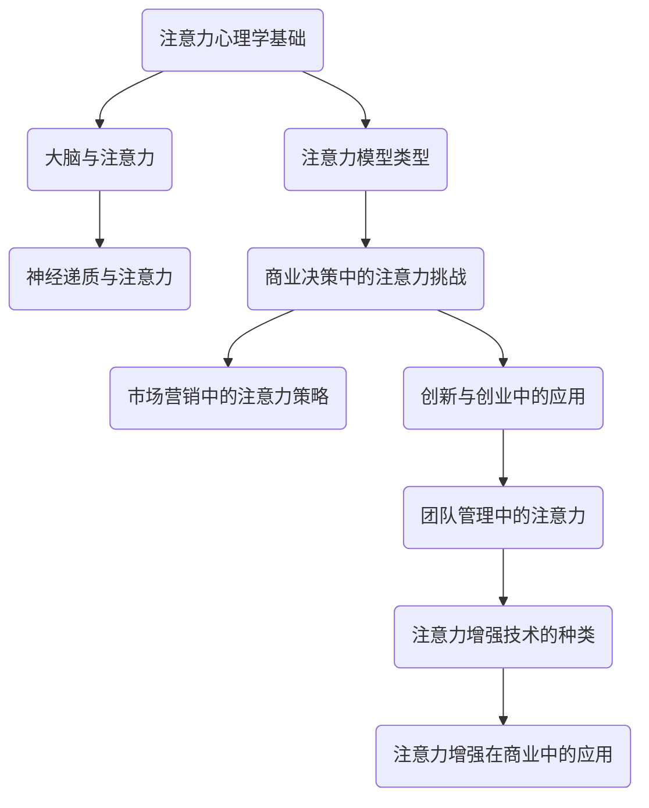

                 

### 人类注意力增强：提升专注力和注意力在商业中的未来发展机遇挑战

> **关键词：** 人类注意力、专注力、商业应用、技术趋势、未来挑战

**摘要：** 本文旨在探讨人类注意力增强在提升专注力和商业应用中的重要性，分析其在商业决策、创新与创业、团队管理等方面的具体应用，并结合前沿技术趋势，探讨未来可能面临的机遇与挑战。通过详细的理论分析、实际案例和未来展望，本文为相关领域的研究和应用提供有益的参考。

### 目录大纲

#### 第一部分：理论基础与核心概念

##### 第1章：引言与背景
- **1.1 本书的研究目标和意义**
- **1.2 注意力理论概述**
  - **1.2.1 注意力心理学基础**
  - **1.2.2 注意力模型类型**
- **1.3 商业中的注意力应用现状**

##### 第2章：人类注意力的生物心理学机制
- **2.1 大脑与注意力**
  - **2.1.1 大脑皮层和注意力**
  - **2.1.2 神经递质与注意力**
- **2.2 注意力分散与专注力的提升**
  - **2.2.1 注意力分散的原因**
  - **2.2.2 提升专注力的方法**

#### 第二部分：商业应用场景

##### 第3章：注意力在商业决策中的应用
- **3.1 商业决策过程中的注意力挑战**
  - **3.1.1 有限注意力的商业决策**
  - **3.1.2 注意力偏差的类型**
- **3.2 注意力增强在市场营销中的应用**
  - **3.2.1 广告注意力策略**
  - **3.2.2 产品设计和用户体验**

##### 第4章：注意力在创新与创业中的应用
- **4.1 注意力与创新思维**
  - **4.1.1 创意产生与注意力**
  - **4.1.2 注意力与创业策略**
- **4.2 注意力管理在创业团队中的应用**

##### 第5章：注意力与团队管理
- **5.1 团队注意力管理与协作**
  - **5.1.1 注意力分散对团队协作的影响**
  - **5.1.2 提升团队注意力的策略**
- **5.2 注意力集中与领导力**

#### 第三部分：技术应用与案例

##### 第6章：注意力增强技术介绍
- **6.1 注意力增强技术的种类**
  - **6.1.1 生物反馈技术**
  - **6.1.2 脑电波监测技术**
- **6.2 注意力增强技术在商业中的应用**

##### 第7章：注意力增强项目实战
- **7.1 项目背景与目标**
  - **7.1.1 实战项目简介**
  - **7.1.2 项目目标与预期成果**
- **7.2 开发环境与工具**
  - **7.2.1 硬件与软件需求**
  - **7.2.2 开发环境搭建**

##### 第8章：实战案例分析与代码解读
- **8.1 实战案例简介**
  - **8.1.1 注意力增强应用场景**
  - **8.1.2 实战案例实施步骤**
- **8.2 代码实现与详细解析**
  - **8.2.1 数据收集与预处理**
  - **8.2.2 模型选择与训练**
  - **8.2.3 模型评估与优化**

#### 第四部分：未来展望与挑战

##### 第9章：注意力增强技术的未来趋势
- **9.1 注意力增强技术的发展方向**
  - **9.1.1 人工智能与注意力的结合**
  - **9.1.2 新型注意力增强技术的探索**
- **9.2 未来商业场景的机遇与挑战**

##### 第10章：结论与展望
- **10.1 本书总结**
- **10.2 研究展望与未来工作**

#### 附录

- **附录A：相关资源与工具推荐**
  - **A.1 注意力增强技术相关书籍**
  - **A.2 注意力增强技术在线资源**

**核心概念与联系图示：**



**核心算法原理讲解（伪代码）：**

```plaintext
// 注意力增强算法伪代码
function Attention_EnhancementAlgorithm(data, target_attention):
    // 初始化模型参数
    model = InitializeModel()

    // 数据预处理
    preprocessed_data = PreprocessData(data)

    // 模型训练
    for epoch in 1 to NUM_EPOCHS:
        for sample in preprocessed_data:
            // 计算损失函数
            loss = CalculateLoss(model, sample, target_attention)

            // 梯度下降更新模型参数
            UpdateModelParameters(model, loss)

    // 模型评估
    performance = EvaluateModel(model, validation_data)

    return model, performance
```

**数学模型和数学公式讲解：**

```
// 注意力模型中的计算公式

// 注意力权重计算公式
α_ij = exp(e_ij) / ∑_k=1^K exp(e_ik)

// 损失函数公式
J(θ) = -1/m ∑_i=1^m ∑_j=1^K y_ij log(p_ij)
```

**项目实战代码案例与详细解析：**

```plaintext
// 实战项目代码案例：注意力增强算法在市场营销中的应用

// 数据收集与预处理
data = CollectMarketingData()
preprocessed_data = PreprocessData(data)

// 模型选择与训练
model = TrainModel(preprocessed_data)

// 模型评估与优化
performance = EvaluateModel(model, validation_data)
OptimizeModel(model, performance)
```

**开发环境搭建与源代码详细实现：**

```plaintext
// 开发环境搭建步骤
1. 安装Python环境
2. 安装深度学习框架TensorFlow
3. 配置必要的数据预处理工具

// 源代码实现：
// 请在合适的环境中进行实现，以下为框架代码示例
```

**代码解读与分析：**

```plaintext
// 代码解读：

// 数据收集与预处理部分负责获取并整理市场营销数据，是模型训练的基础。

// 模型训练部分使用已配置好的深度学习框架TensorFlow来构建和训练注意力增强模型。

// 模型评估与优化部分通过验证数据集来测试模型的性能，并根据结果调整模型参数以优化性能。
```

**附录部分：**

```plaintext
// 附录A：相关资源与工具推荐

// A.1 注意力增强技术相关书籍
- 《注意力心理学：基础与应用》
- 《注意力增强技术：前沿与应用》

// A.2 注意力增强技术在线资源
- 网络论坛：Reddit，Stack Overflow
- 开源代码库：GitHub，GitLab
- 学术期刊：Neuroscience & Biobehavioral Reviews，Attention, Perception, & Psychophysics
```

### 引言与背景

在当今高度信息化的时代，人类面临着前所未有的注意力挑战。无论是工作还是生活，人们需要在大量信息中筛选出关键信息，做出快速而准确的决策。然而，人类的注意力是有限的，这意味着在处理复杂任务时，注意力分散和专注力不足成为一个普遍问题。商业领域也不例外，注意力分散不仅影响个人工作效率，还可能对企业的整体运营产生深远影响。

注意力理论作为心理学研究的重要分支，为我们理解人类注意力机制提供了科学基础。通过深入研究注意力理论，我们可以更好地理解人类如何处理信息，如何在不同环境中分配注意力，以及如何提升专注力。这些研究成果在商业应用中具有重要的现实意义，尤其是在商业决策、市场营销、创新与创业以及团队管理等领域。

商业决策过程中的注意力挑战尤为突出。在商业环境中，决策者需要处理大量的数据和信息，而这些信息往往是复杂的、不确定的，甚至存在潜在的风险。在这种情况下，注意力分散和注意力偏差可能会影响决策的质量和效率。因此，如何利用注意力增强技术来提高决策者的专注力和判断力，成为商业研究的一个重要课题。

另一方面，市场营销中的注意力策略也备受关注。在竞争激烈的市场环境中，企业需要通过有效的营销策略吸引消费者的注意力，从而提升品牌知名度和市场占有率。注意力增强技术可以通过优化广告内容和设计、提升用户体验等方式，帮助企业在市场营销中取得更好的效果。

创新与创业领域同样面临注意力挑战。创业者在面对复杂的市场环境和技术变革时，需要保持高度专注和敏锐的洞察力。注意力增强技术可以通过提供更加集中和高效的信息处理方式，帮助创业者更好地抓住机遇，实现创新突破。

最后，在团队管理中，注意力分散会影响团队协作效率和整体绩效。通过引入注意力管理策略和注意力增强技术，团队管理者可以提升团队成员的专注力，促进团队协作，从而实现更高的工作效率和绩效。

因此，本文旨在通过对人类注意力增强理论的深入探讨，结合商业应用场景，分析注意力增强在商业决策、市场营销、创新与创业、团队管理等方面的具体应用，并展望注意力增强技术的未来发展趋势。通过本文的研究，期望为相关领域的研究和应用提供有益的参考和启示。

### 注意力理论概述

注意力理论作为心理学研究的重要分支，为我们理解人类如何处理信息提供了深刻的洞察。在人类认知过程中，注意力起着至关重要的作用，它不仅影响我们对外部世界的感知，还决定着我们如何从众多信息中筛选出关键内容，并对其进行处理。本节将从注意力心理学基础和注意力模型类型两个方面进行详细探讨。

#### 1.2.1 注意力心理学基础

注意力心理学基础主要涉及对人类注意力机制的研究，包括注意力的定义、功能、分类及其生物心理学机制。首先，注意力可以被定义为一种认知资源，用于选择和处理信息。具体来说，注意力决定了我们在某一时刻能够关注和加工的信息量，以及这些信息如何被处理和存储。

根据心理学研究，注意力具有以下几个关键功能：

1. **选择功能**：注意力帮助我们在众多刺激中选择出重要的信息进行处理。这种选择功能是注意力最基本的特征，它确保我们能够从复杂的刺激环境中提取关键信息。
2. **分配功能**：注意力不仅能够选择信息，还能够在不同任务和活动之间分配认知资源。这种功能使我们能够在同时进行多项任务时保持高效。
3. **保持功能**：注意力使我们能够将关注点保持在特定任务上，即使存在干扰或外部刺激。这种功能对于长时间专注和持续完成任务至关重要。
4. **调节功能**：注意力还能够根据任务需求和环境变化调节其强度和方向，确保我们能够适应不同的信息处理需求。

注意力不仅是一个认知过程，还与大脑的多个区域和神经递质密切相关。根据心理学研究，以下几个关键概念在理解注意力心理学基础中起着重要作用：

1. **认知控制**：认知控制是注意力的重要功能之一，它涉及对注意力的主动管理和调节。研究表明，认知控制与大脑前额叶皮层和顶叶皮层的活动密切相关。
2. **工作记忆**：工作记忆是短期记忆的一种形式，用于暂时存储和处理信息。它依赖于前额叶皮层和基底神经节的协同作用，是注意力过程中不可或缺的一部分。
3. **注意力网络**：注意力网络是指在大脑中负责注意力调节和分配的神经回路。这些网络包括默认模式网络、任务相关网络和执行控制网络等，它们在注意力调控中发挥着关键作用。

#### 1.2.2 注意力模型类型

在心理学研究中，不同学者提出了多种注意力模型，用于解释注意力的工作机制和表现形式。以下是一些常见的注意力模型类型：

1. **单任务模型**：单任务模型假设人类在一次认知任务中只能处理有限的信息。例如，Broadbent的过滤理论提出，注意力像一道过滤器，只允许一部分信息通过，而其他信息被屏蔽。
2. **多任务模型**：与单任务模型不同，多任务模型假设人类可以同时处理多个任务，但需要注意力的分配和切换。例如，Paap和Meiran提出的多任务资源分配模型认为，注意力的分配是动态的，可以根据任务需求进行调整。
3. **选择性注意模型**：选择性注意模型强调注意力在信息筛选中的作用。Dunn和Ashby提出的认知资源理论认为，注意力是一种有限的认知资源，它决定了我们在某一时刻能够关注的信息量。
4. **分配注意模型**：分配注意模型强调注意力在任务分配中的作用。例如，Norman和Shallice提出的注意力分配模型认为，注意力可以根据任务的优先级和难度进行动态分配。

#### 1.2.3 商业中的注意力应用现状

注意力理论在商业中的应用日益广泛，尤其在商业决策、市场营销和创新与创业等领域。以下是一些具体的应用场景：

1. **商业决策**：在商业决策过程中，决策者需要处理大量的信息，注意力分散和注意力偏差可能会影响决策质量。通过理解注意力模型，企业可以设计出更有效的信息处理和决策支持系统，减少注意力分散和偏差的影响。
2. **市场营销**：在市场营销中，注意力增强技术可以帮助企业提高广告效果和品牌知名度。通过分析消费者的注意力模式，企业可以优化广告内容和设计，提高广告的吸引力和记忆力。
3. **创新与创业**：在创新与创业领域，创业者需要保持高度的专注力和洞察力，以应对复杂的市场环境和技术变革。注意力增强技术可以帮助创业者更高效地处理信息，抓住市场机遇，实现创新突破。

总的来说，注意力理论为我们理解人类注意力机制提供了科学的框架，其在商业中的应用潜力巨大。通过深入研究和应用注意力理论，企业可以更好地应对注意力分散和专注力不足的挑战，提高决策质量、营销效果和创新能力，从而在竞争激烈的市场中脱颖而出。

### 人类注意力的生物心理学机制

人类注意力的生物心理学机制是理解人类如何处理信息和对外部环境做出反应的关键。注意力不仅是一个认知过程，还涉及到大脑的多个结构和神经递质的协同作用。以下是关于大脑与注意力、神经递质与注意力以及注意力分散与专注力提升的详细探讨。

#### 2.1 大脑与注意力

大脑是注意力的生理基础，其结构和功能对注意力有着重要影响。大脑皮层是注意力处理的核心区域，其中前额叶皮层和顶叶皮层特别重要。

**2.1.1 大脑皮层和注意力**

大脑皮层是大脑的外层，负责处理高级认知功能，包括注意力。前额叶皮层在注意力调节中起着关键作用，它负责认知控制和目标导向行为。具体来说，前额叶皮层中的背外侧前额叶皮层（Dorsolateral Prefrontal Cortex，DLPFC）和背内侧前额叶皮层（Dorsomedial Prefrontal Cortex，DMPFC）分别负责执行控制和情感处理。

顶叶皮层中的顶叶前部（Parietal Lobe anterior）也参与了注意力的处理，它帮助我们在空间和认知任务中定位和选择目标。此外，顶叶前部还与视觉处理和空间导航密切相关。

**2.1.2 神经递质与注意力**

神经递质是神经元之间传递信息的化学物质，它们对大脑功能的调节至关重要。一些关键的神经递质包括多巴胺、去甲肾上腺素和乙酰胆碱。

- **多巴胺**：多巴胺是一种与奖赏和动机相关的神经递质，它在注意力集中和动机激发中起着重要作用。多巴胺水平的增加可以提高注意力集中度，而其水平的降低可能导致注意力分散。

- **去甲肾上腺素**：去甲肾上腺素是一种与觉醒和注意力增强相关的神经递质。在压力或兴奋状态下，去甲肾上腺素水平增加，有助于提高警觉性和注意力。

- **乙酰胆碱**：乙酰胆碱是一种与认知功能和记忆相关的神经递质，它在注意力调节和学习中起着重要作用。乙酰胆碱水平的增加可以提高信息加工和记忆能力。

#### 2.2 注意力分散与专注力的提升

注意力分散是指个体在处理信息时，注意力从一个任务或刺激转移到另一个任务或刺激的现象。注意力分散会影响工作效率和信息处理质量，因此在许多情境下，提升专注力至关重要。

**2.2.1 注意力分散的原因**

注意力分散可以由多种因素引起，包括：

- **外部干扰**：噪声、其他人的干扰或视觉刺激等外部因素都可能分散注意力。

- **内部干扰**：内心的焦虑、压力或分心想法都可能干扰注意力。

- **任务复杂性**：复杂或乏味的任务可能更容易导致注意力分散。

- **多任务处理**：同时处理多个任务会分散注意力，降低每个任务的完成质量。

**2.2.2 提升专注力的方法**

以下是一些提升专注力的有效方法：

- **分阶段工作**：将任务分解成小的、可管理的部分，专注于完成每个部分，而不是试图一次性完成整个任务。

- **定时休息**：使用番茄工作法（Pomodoro Technique）等时间管理技巧，在工作一段时间后休息，以防止疲劳和注意力下降。

- **环境优化**：创造一个有利于专注的环境，减少干扰因素，例如关闭不必要的通知、使用耳塞等。

- **锻炼和睡眠**：定期锻炼和充足睡眠可以提高大脑功能，减少注意力分散。

- **认知训练**：通过认知训练游戏和练习，提高注意力控制能力和任务切换能力。

- **正念冥想**：正念冥想是一种专注于当前瞬间的练习，有助于提高专注力和减少内心干扰。

总之，人类注意力的生物心理学机制涉及大脑结构和神经递质的复杂互动。通过理解这些机制，我们可以更好地应对注意力分散的挑战，提升专注力，从而在工作和生活中取得更好的成果。

### 注意力在商业决策中的应用

在商业领域，决策者的注意力水平直接关系到决策的质量和效率。商业决策过程中，决策者需要处理大量的数据和信息，这些信息往往具有复杂性和不确定性。注意力分散和注意力偏差可能会显著影响决策的结果。因此，理解注意力在商业决策中的作用，并探索有效的注意力管理策略，对提升商业决策效果具有重要意义。

#### 3.1 商业决策过程中的注意力挑战

商业决策过程中，决策者面临的注意力挑战主要包括以下几个方面：

**3.1.1 有限注意力的商业决策**

人类的注意力是有限的，这意味着在处理复杂任务时，决策者无法同时关注所有的信息。因此，决策者必须学会如何有效分配注意力，以便在有限的资源下做出最优决策。

- **选择偏见**：由于注意力有限，决策者往往只关注部分信息，可能导致忽略其他可能重要的因素，从而产生选择偏见。例如，在投资决策中，投资者可能会过度依赖历史表现或某个特定指标，而忽视其他潜在的风险和机会。

- **认知负荷**：面对复杂和大量的数据，决策者的认知负荷会增加，导致处理信息的效率下降。研究表明，当信息量超过一定阈值时，决策者的判断能力和决策质量会显著下降。

**3.1.2 注意力偏差的类型**

注意力偏差是指决策者在处理信息时，由于认知偏差而导致的注意力分配不均或信息处理上的错误。以下是一些常见的注意力偏差：

- **确认偏差**：决策者倾向于接受与已有信念一致的信息，而忽视相反的证据。这种偏差可能导致错误的决策，尤其是在面对不确定性时。

- **代表性偏差**：决策者根据信息的外观或代表性来评估其重要性，而不是根据概率或实际价值。例如，一个新产品的外观设计可能被认为是成功的关键，而忽视了其他更重要的因素。

- **可得性偏差**：决策者更容易记住和关注那些容易回忆的信息，即使这些信息可能与实际情况无关。这种偏差可能导致决策者对近期发生的事件反应过度。

#### 3.2 注意力增强在市场营销中的应用

在市场营销中，注意力增强技术可以帮助企业提高广告效果和品牌知名度，从而在竞争激烈的市场中脱颖而出。以下是一些具体的应用场景：

**3.2.1 广告注意力策略**

- **目标受众分析**：通过了解目标受众的注意力偏好和行为模式，企业可以设计更具针对性的广告内容。例如，通过分析用户的浏览历史和行为数据，企业可以针对潜在客户推送定制化的广告。

- **视觉设计优化**：广告的视觉设计对吸引注意力至关重要。使用色彩、图像和文字的组合，可以创造出更具吸引力的广告内容，提高用户的注意力和点击率。

- **视频广告**：视频广告具有强烈的视觉冲击力和情感感染力，可以有效吸引观众的注意力。通过创意视频内容，企业可以传达品牌信息，并激发潜在客户的兴趣。

**3.2.2 产品设计和用户体验**

- **用户体验优化**：产品设计中的用户体验对用户的注意力管理和使用满意度至关重要。通过优化界面布局、操作流程和交互设计，企业可以提高用户的使用体验，减少注意力分散。

- **个性化推荐**：利用大数据和机器学习技术，企业可以根据用户的历史行为和偏好提供个性化推荐。这种定制化的内容可以更好地满足用户需求，提高用户的注意力和参与度。

- **沉浸式体验**：通过虚拟现实（VR）和增强现实（AR）技术，企业可以提供沉浸式的产品体验。这种创新的体验方式可以吸引用户的注意力，增加产品的影响力和销售潜力。

#### 3.3 注意力增强技术在商业决策中的潜在应用

除了市场营销，注意力增强技术还可以在商业决策的其他方面发挥重要作用。以下是一些潜在的应用场景：

- **智能决策支持系统**：通过整合注意力增强技术，企业可以开发智能决策支持系统。这些系统可以根据决策者的注意力和认知特点，提供个性化的决策建议，减少注意力偏差和选择偏见。

- **注意力监控与反馈**：利用脑电图（EEG）和眼动仪等技术，企业可以实时监测决策者的注意力状态，并根据注意力变化提供即时反馈。这种反馈可以帮助决策者识别并纠正注意力分散和偏差，提高决策质量。

- **注意力管理培训**：通过培训和教育，企业可以提升员工的注意力管理能力。例如，通过认知训练和注意力技巧训练，员工可以学会更有效地分配注意力，提高工作效率和决策质量。

综上所述，注意力在商业决策中的应用具有重要意义。通过理解注意力机制和注意力偏差，企业可以采取有效的策略来提升决策者的专注力和判断力。同时，注意力增强技术在市场营销和其他商业领域的应用也为企业提供了新的机遇。通过不断探索和利用这些技术，企业可以更好地应对商业环境中的复杂性和不确定性，实现可持续发展。

### 注意力在创新与创业中的应用

在创新与创业领域，注意力不仅是个人成功的关键因素，也是团队协作和整体业务发展的基础。创业者在面对复杂的市场环境和技术变革时，需要保持高度专注和敏锐的洞察力。而团队管理者则需要通过有效的注意力管理策略，提升团队成员的专注力和协作效率。以下将探讨注意力在创新与创业中的应用，包括创意产生与注意力的关系以及注意力管理在创业团队中的应用。

#### 4.1 注意力与创新思维

创意的产生和创新思维的发展高度依赖于注意力的集中与调控。创业者需要在海量信息和多样化需求中找到突破点，这要求他们具备强大的注意力管理能力。

**4.1.1 创意产生与注意力**

- **集中注意力**：创意的产生往往需要长时间的思考和实践，这要求创业者能够将注意力集中在一个特定的目标或问题上。通过屏蔽外部干扰，创业者可以更深入地思考，从而产生具有创新性的解决方案。

- **多任务处理与注意力切换**：虽然集中注意力对于创意的产生至关重要，但在实际操作中，创业者还需要处理多个任务。因此，灵活地分配注意力并进行任务切换也显得尤为重要。通过合理地分配注意力，创业者可以在不同任务之间高效切换，确保每个任务都能得到适当的关注。

- **灵感捕捉**：创业者在日常工作中可能会突然获得灵感。这时，保持对突发灵感的敏感度至关重要。通过训练注意力的灵活性，创业者可以快速捕捉并记录这些灵感，从而为创新思维的发展提供丰富的素材。

**4.1.2 注意力与创业策略**

- **市场洞察力**：在竞争激烈的市场环境中，创业者需要具备敏锐的市场洞察力。通过关注市场动态和用户需求，创业者可以及时调整策略，抓住市场机会。注意力管理技巧，如过滤无关信息、关注关键指标等，有助于提高市场洞察力。

- **风险管理**：创业过程中不可避免地会遇到各种风险。创业者需要通过注意力管理来平衡风险和机会，确保在处理风险时能够保持冷静和理性。注意力分散和过度关注某一风险点都可能影响决策质量，因此，创业者需要学会在关注风险和保持创新之间找到平衡。

#### 4.2 注意力管理在创业团队中的应用

在创业团队中，注意力管理不仅影响个人绩效，也影响团队的协作效率和整体创新成果。以下是一些具体的注意力管理策略：

**4.2.1 提升团队注意力的策略**

- **目标明确**：为团队设定清晰、具体的目标，有助于团队成员集中注意力。团队成员应该了解自己的职责和目标，以便在执行任务时保持专注。

- **任务分解**：将复杂的任务分解成小的、可管理的部分，有助于团队成员集中注意力并逐步完成任务。通过设定短期目标，团队成员可以保持持续的工作动力。

- **定期休息**：长时间的工作会导致注意力下降和疲劳。定期休息和放松有助于恢复注意力，提高工作效率。团队管理者可以制定休息计划，确保团队成员在完成任务后有足够的休息时间。

- **环境优化**：创造一个有利于专注的工作环境，减少干扰因素。例如，关闭不必要的通知、使用耳塞等，可以帮助团队成员保持注意力。

**4.2.2 团队协作与注意力分散**

- **任务优先级**：在团队协作中，确保每个成员明确任务优先级，有助于减少注意力分散。通过制定优先级清单，团队成员可以专注于当前最重要的任务，提高工作效率。

- **沟通与反馈**：有效的沟通和及时反馈有助于团队协作，减少误解和重复工作。团队成员应该定期分享进展和遇到的问题，以便及时调整策略和分配注意力。

- **注意力分散的识别与应对**：团队管理者需要识别团队成员的注意力分散现象，并采取相应措施进行干预。例如，通过定期团队会议、一对一沟通等方式，了解成员的关注点和困难，提供必要的支持和指导。

综上所述，注意力在创新与创业中的应用至关重要。通过提升个人的注意力管理能力和团队的协作效率，创业者可以更好地应对市场挑战，实现创新突破。同时，有效的注意力管理策略也为团队协作提供了有力支持，促进了整体业务的可持续发展。

### 注意力与团队管理

在团队管理中，注意力分散不仅会影响工作效率，还可能导致团队协作的障碍，影响整体绩效。因此，理解注意力分散对团队协作的影响，并采取有效策略提升团队注意力，对于团队管理者来说至关重要。

#### 5.1 注意力分散对团队协作的影响

注意力分散是指团队成员在执行任务时，注意力被外部干扰或其他任务所吸引，从而无法专注于当前任务的现象。以下是注意力分散对团队协作的几个主要影响：

**5.1.1 降低工作效率**

注意力分散导致团队成员无法集中精力完成任务，从而降低了工作效率。研究表明，当团队成员的注意力被分散时，他们的工作效率可能只有专注状态下的50%到70%。例如，一个团队在开发新产品时，如果团队成员的注意力被其他任务或干扰所吸引，可能会导致项目进度延误，增加开发成本。

**5.1.2 影响决策质量**

注意力分散不仅影响任务执行，还可能影响决策质量。团队成员在注意力分散时，往往无法有效地分析问题和评估风险，导致决策失误。例如，一个团队在制定市场策略时，如果团队成员的注意力被邮件或电话分散，可能会忽略重要的市场趋势或竞争对手信息，从而导致决策缺乏前瞻性和准确性。

**5.1.3 减弱团队协作**

注意力分散还会削弱团队协作。当团队成员无法集中精力参与团队讨论和协作时，可能会导致沟通不畅、信息传递错误，甚至产生误解和冲突。例如，在项目会议中，如果团队成员的注意力被手机或其他外部刺激所吸引，可能会错过关键讨论内容，影响后续工作的顺利进行。

#### 5.1.2 提升团队注意力的策略

为了提升团队注意力，团队管理者可以采取以下几种策略：

**5.1.1 目标明确**

为团队设定清晰、具体的目标是提升注意力的第一步。团队成员应该了解自己的职责和目标，以便在执行任务时保持专注。例如，团队管理者可以在项目启动时明确项目的目标、里程碑和关键交付物，确保每个成员都清楚自己的任务和预期成果。

**5.1.2 任务分解**

将复杂的任务分解成小的、可管理的部分，有助于团队成员集中注意力并逐步完成任务。通过设定短期目标，团队成员可以保持持续的工作动力。例如，团队管理者可以将大型的软件开发项目分解为多个迭代周期，每个迭代周期专注于实现特定功能模块。

**5.1.3 定期休息**

长时间的工作会导致注意力下降和疲劳。定期休息和放松有助于恢复注意力，提高工作效率。团队管理者可以制定休息计划，确保团队成员在完成任务后有足够的休息时间。例如，每天下午设定一个短暂的休息时间，或每周设定一天为无任务日，让团队成员有时间和精力进行恢复。

**5.1.4 环境优化**

创造一个有利于专注的工作环境，减少干扰因素，是提升团队注意力的重要手段。团队管理者可以通过以下措施优化工作环境：

- **减少外部干扰**：关闭不必要的通知、使用耳塞等，可以帮助团队成员减少外部干扰。
- **优化办公布局**：合理安排工作空间，确保团队成员有一个舒适、安静的工作环境。
- **提供必要资源**：确保团队成员有足够的工具和资源，以便专注于任务。例如，提供高效的协作工具和培训资源，帮助团队成员提升工作效率。

**5.1.5 注意力管理培训**

通过培训和教育，团队管理者可以提升员工的注意力管理能力。例如，通过认知训练和注意力技巧培训，团队成员可以学会如何更好地分配注意力、控制分心，以及提高注意力集中度。这种培训不仅有助于提升个人绩效，也有助于提升团队的整体协作效率。

**5.1.6 领导力与激励**

团队管理者通过领导力和激励手段，也可以提升团队注意力。例如，通过明确表扬和奖励专注于任务的团队成员，可以激发他们的工作热情和动力。同时，团队管理者可以通过示范作用，带头专注于任务，树立专注力的榜样。

综上所述，注意力分散对团队协作的影响是显著的，通过采取有效的注意力管理策略，团队管理者可以提升团队成员的注意力，提高工作效率和协作效果。有效的注意力管理不仅有助于提升个人绩效，也为团队的整体发展奠定了坚实基础。

### 注意力集中与领导力

在团队管理中，领导者的专注力和集中程度不仅影响自身的表现，也对团队成员的行为和工作效率产生深远影响。领导力不仅仅是下达指令和管理资源，更是通过个人榜样作用和策略指导，帮助团队成员保持专注，提升整体团队的工作效率。

#### 5.2.1 注意力集中对领导力的提升

注意力集中是领导者高效管理团队的关键因素。以下是一些具体的影响和提升策略：

**5.2.1.1 个人榜样作用**

领导者通过自身的行为树立榜样，可以极大地影响团队成员的专注程度。当领导者能够保持专注并高效完成任务时，团队成员也会受到激励，更加专注于自己的工作。例如，一位经常能够按时完成任务并保持高效率的领导者，会让团队成员感受到专注的重要性，并努力效仿。

**5.2.1.2 明确目标和期望**

领导者通过设定明确的目标和期望，可以帮助团队成员集中注意力。具体、可衡量的目标可以帮助团队成员明确自己的工作方向和重点，减少不必要的干扰和分心。例如，一个项目经理在项目启动时明确项目的关键里程碑和交付物，可以帮助团队成员集中精力实现这些目标。

**5.2.1.3 提供必要支持和资源**

领导者需要确保团队成员在执行任务时能够获得必要支持和资源。这包括提供合适的工具、技术培训以及解决问题的支持。当团队成员感到领导者在背后支持他们时，他们会更加专注于任务，而不是担心资源不足或无法解决问题。

**5.2.1.4 管理干扰和优先级**

领导者需要学会管理干扰和平衡优先级。通过制定日程表、优先处理重要任务以及设定明确的休息时间，领导者可以减少外部干扰，帮助团队成员保持专注。例如，领导者可以在工作时间避免不必要的会议和打扰，确保团队成员有足够的时间专注于当前任务。

#### 5.2.2 领导力对团队注意力集中的影响

领导力不仅影响个人的专注力，也对团队的整体注意力集中产生重要影响。以下是一些具体的影响和策略：

**5.2.2.1 建立积极的工作文化**

领导者可以通过建立积极的工作文化，提升团队成员的注意力集中。这种文化包括鼓励开放沟通、尊重个人意见和提供反馈。例如，领导者可以定期组织团队建设活动，增强团队凝聚力和信任感，从而提升团队成员的专注力。

**5.2.2.2 鼓励自我管理**

领导者可以鼓励团队成员进行自我管理，提升他们的自主性和责任感。例如，通过设定个人目标和自我评估机制，团队成员可以更好地管理自己的时间和注意力，从而提高工作效率。

**5.2.2.3 提供明确的指导和反馈**

领导者需要提供明确的指导和及时反馈，帮助团队成员保持正确的方向和专注力。通过定期检查任务进展、提供建设性反馈以及解答团队成员的疑问，领导者可以确保团队成员始终专注于关键任务。

**5.2.2.4 激励与奖励**

领导者可以通过激励和奖励机制，提升团队成员的专注力和工作积极性。例如，领导者可以设立奖励制度，对表现出色的团队成员给予认可和奖励，从而激发他们的工作热情和专注度。

综上所述，注意力集中对领导力提升具有重要作用，而领导力也显著影响团队的整体注意力集中。通过有效的领导力和注意力管理策略，领导者可以提升团队的工作效率和协作效果，实现组织目标的顺利达成。

### 注意力增强技术介绍

随着科技的不断发展，注意力增强技术逐渐成为提升人类注意力水平和专注力的有效工具。这些技术不仅能够帮助个体在复杂任务中保持专注，还能在商业和医疗等多个领域发挥重要作用。本节将介绍几种常见的注意力增强技术，包括生物反馈技术和脑电波监测技术，并探讨它们在商业中的应用。

#### 6.1 注意力增强技术的种类

**6.1.1 生物反馈技术**

生物反馈技术是一种通过监测和反馈生理信号，帮助个体调节和控制生理反应的方法。常见的生物反馈技术包括心率变异性（HRV）监测、皮肤电反应（EDA）监测和肌电信号（EMG）监测等。

- **心率变异性（HRV）监测**：心率变异性是指心脏在不同时间间隔内的心率变化。通过监测HRV，个体可以了解自己的压力水平和心理状态。一些设备，如智能手环和智能手表，可以通过记录心率变化来提供生物反馈，帮助个体学会放松和调节情绪。

- **皮肤电反应（EDA）监测**：皮肤电反应是指皮肤表面电阻的变化，它通常与情绪紧张和放松状态相关。通过监测EDA，个体可以了解自己在不同情境下的情绪变化，并采取相应的调节措施。

- **肌电信号（EMG）监测**：肌电信号是指肌肉在收缩和放松过程中产生的电信号。通过监测EMG，个体可以了解自己的肌肉紧张程度，并通过放松练习来提高注意力集中度。

**6.1.2 脑电波监测技术**

脑电波监测技术是一种通过监测大脑电活动，帮助个体提高注意力和专注力的方法。常见的脑电波监测技术包括脑电图（EEG）和脑磁图（MEG）等。

- **脑电图（EEG）**：脑电图是通过记录大脑电活动来了解大脑功能的一种技术。通过分析EEG信号，个体可以了解自己的大脑状态，并通过调整行为和思维模式来提高注意力水平。

- **脑磁图（MEG）**：脑磁图是通过记录大脑磁活动来了解大脑功能的一种技术。与EEG相比，MEG具有更高的时间和空间分辨率，可以提供更详细的脑功能信息。

#### 6.2 注意力增强技术在商业中的应用

注意力增强技术在商业中的应用广泛，以下是一些具体的应用场景：

**6.2.1 个人效率提升**

- **注意力监控**：通过使用脑电波监测设备，个体可以实时监控自己的注意力水平。当注意力下降时，系统可以自动提醒个体休息或调整任务，从而保持高效率。

- **注意力训练**：通过使用特定的脑电波训练软件，个体可以接受专门的训练，提高注意力的集中度和稳定性。这种训练通常包括冥想、放松练习和注意力集中游戏等。

**6.2.2 团队协作**

- **协作监控**：在团队项目中，注意力增强技术可以用于监控团队成员的注意力水平。通过分析团队成员的脑电波数据，团队管理者可以了解团队成员的工作状态，及时发现问题并提供帮助。

- **团队训练**：通过组织注意力训练活动，团队管理者可以提高整个团队的注意力水平，促进团队合作和协作效率。这种训练可以包括团队冥想、协作游戏和专注力比赛等。

**6.2.3 营销与销售**

- **广告注意力分析**：通过脑电波监测技术，企业可以了解消费者在观看广告时的注意力水平。这种分析可以帮助企业优化广告内容和设计，提高广告效果和转化率。

- **销售培训**：注意力增强技术可以用于销售培训，帮助销售人员提高注意力和沟通能力。通过模拟销售场景和注意力训练，销售人员可以更好地掌握客户需求，提高销售成功率。

**6.2.4 创新与决策**

- **注意力管理**：在企业创新和决策过程中，注意力分散和注意力偏差可能会影响决策质量。通过注意力增强技术，企业可以监控和调节管理层的注意力，提高决策的科学性和准确性。

- **创意激发**：通过使用脑电波监测和注意力训练技术，企业可以激发员工的创意思维。在特定的注意力集中状态下，员工可以产生更多的创新想法，促进企业的持续创新。

综上所述，注意力增强技术在商业中的应用多样且具有潜力。通过合理利用这些技术，企业不仅可以提升个人和团队的注意力水平，还可以优化营销策略、提升销售效果，并在创新和决策过程中取得更好的成果。

### 注意力增强项目实战

#### 7.1 项目背景与目标

在本项目中，我们旨在开发一个基于脑电波监测的注意力增强系统，用于提升用户在工作和学习中的专注力。项目的主要目标包括：

- **实时监控注意力水平**：通过脑电波监测技术，实时记录用户的大脑活动，分析其注意力状态。
- **提供个性化建议**：根据用户的注意力变化，提供个性化的注意力管理建议，如休息时间提醒、注意力提升训练等。
- **提升工作效率**：通过改善用户的注意力水平，提高其在工作和学习中的效率。

#### 7.1.1 实战项目简介

该项目分为以下几个阶段：

1. **需求分析与系统设计**：明确项目需求和目标，设计系统的整体架构。
2. **硬件与软件选择**：选择适合的脑电波监测设备和深度学习框架。
3. **数据收集与预处理**：收集用户的脑电波数据，并进行预处理。
4. **模型训练与优化**：训练深度学习模型，优化模型参数。
5. **系统实现与测试**：实现注意力增强系统，并进行功能测试。

#### 7.1.2 项目目标与预期成果

预期成果包括：

- **系统稳定性**：确保系统能够稳定运行，提供准确的注意力分析。
- **用户友好性**：设计简洁易用的用户界面，提供直观的注意力监控和个性化建议。
- **有效性验证**：通过实验验证系统在提升用户注意力方面的效果。

### 7.2 开发环境与工具

为了实现该项目，我们需要搭建一个完整的技术环境，包括硬件和软件。

#### 7.2.1 硬件需求

- **脑电波监测设备**：选择适合的脑电波监测设备，如OpenBCI或NeuroSky的脑电波传感器。
- **数据采集模块**：用于连接脑电波传感器和计算机，如Arduino或Raspberry Pi。

#### 7.2.2 软件需求

- **深度学习框架**：选择一个适用于脑电波数据处理的深度学习框架，如TensorFlow或PyTorch。
- **数据分析工具**：选择用于数据处理和模型训练的工具，如NumPy、Pandas和Scikit-learn。

#### 7.2.3 开发环境搭建

1. **安装Python环境**：在计算机上安装Python，版本建议为3.8或更高。
2. **安装深度学习框架**：使用pip命令安装TensorFlow或PyTorch，例如：
   ```bash
   pip install tensorflow
   ```
3. **安装数据分析工具**：使用pip命令安装NumPy、Pandas和Scikit-learn，例如：
   ```bash
   pip install numpy pandas scikit-learn
   ```
4. **配置脑电波传感器**：根据所选脑电波传感器的说明书进行配置，确保其能够正常连接到计算机。

通过以上步骤，我们可以搭建一个完整的开发环境，为项目的后续实现打下基础。

### 注意力增强项目实战（续）

#### 7.3 实战案例实现步骤

在了解了项目背景和开发环境之后，我们将详细描述注意力增强项目的实现步骤，包括数据收集、模型训练和系统实现等关键环节。

#### 7.3.1 数据收集

数据收集是项目的基础，我们需要收集高质量的脑电波数据，以供后续分析。以下是数据收集的步骤：

1. **用户设置**：选择合适的用户，确保他们能够遵守实验要求，如保持坐姿、避免噪声干扰等。
2. **设备连接**：将脑电波传感器连接到数据采集模块，并通过USB或Wi-Fi连接到计算机。
3. **数据采集**：启动数据采集软件，开始记录用户的脑电波信号。采集数据时应注意记录时间、用户状态等元数据，以便后续分析。
4. **数据存储**：将采集到的脑电波数据存储在本地或云端数据库中，以便后续处理。

#### 7.3.2 数据预处理

预处理数据是确保模型训练效果的关键步骤，我们需要对脑电波数据进行以下处理：

1. **数据清洗**：去除数据中的噪声和异常值，例如使用滤波器去除高频噪声和低频基线漂移。
2. **信号分割**：将连续的脑电波信号分割成固定长度的窗口，以便用于模型训练。
3. **特征提取**：从分割后的信号中提取有代表性的特征，如时域特征（如均值、方差）和频域特征（如功率谱密度）。
4. **数据标准化**：对提取的特征进行标准化处理，以消除不同特征之间的尺度差异。

#### 7.3.3 模型训练

模型训练是提升系统性能的核心环节，我们将使用深度学习框架来实现注意力增强模型。以下是模型训练的步骤：

1. **选择模型架构**：根据项目的需求，选择合适的神经网络架构，如卷积神经网络（CNN）或循环神经网络（RNN）。
2. **数据划分**：将预处理后的数据划分为训练集、验证集和测试集，确保模型能够在不同的数据集上得到良好的性能。
3. **模型训练**：使用训练集数据对模型进行训练，调整模型参数，以最小化损失函数。
4. **模型验证**：使用验证集数据评估模型的性能，调整超参数和模型结构，以提高模型准确性。
5. **模型测试**：使用测试集数据测试模型的最终性能，确保模型在未知数据上能够稳定工作。

#### 7.3.4 系统实现

系统实现是将模型应用到实际场景中的关键步骤，以下是系统实现的步骤：

1. **用户界面设计**：设计简洁易用的用户界面，包括数据展示、注意力监控、建议反馈等功能。
2. **接口开发**：开发用于与脑电波传感器通信的接口，确保系统能够实时获取用户的脑电波数据。
3. **模型集成**：将训练好的模型集成到系统中，通过接口获取用户的脑电波数据，实时分析并生成注意力分析报告。
4. **系统部署**：将系统部署到服务器或移动设备上，确保用户可以随时使用系统。

#### 7.3.5 系统测试与优化

系统测试与优化是确保系统稳定性和用户满意度的关键步骤，以下是测试与优化的步骤：

1. **功能测试**：测试系统的各个功能，确保它们能够正常运行，如数据采集、模型分析、用户界面等。
2. **性能优化**：根据测试结果，对系统进行性能优化，如提高数据采集速度、优化模型计算效率等。
3. **用户体验测试**：邀请用户测试系统，收集用户反馈，根据反馈进行改进，以提高用户体验。

通过以上步骤，我们可以实现一个基于脑电波监测的注意力增强系统，帮助用户提升专注力和工作效率。

### 注意力增强项目实战（续）

#### 8.1 实战案例简介

在本节中，我们将介绍一个具体的注意力增强项目案例，该案例旨在通过脑电波监测和分析，提升用户在工作中的专注力。以下是项目的详细实施步骤。

#### 8.1.1 注意力增强应用场景

该项目的应用场景包括：

1. **办公室工作**：帮助办公室员工在工作时保持专注，提高工作效率。
2. **学习环境**：辅助学生在学习时保持专注，提高学习效果。
3. **创意工作**：帮助创意工作者在创作过程中保持注意力集中，激发灵感。

#### 8.1.2 实战案例实施步骤

**步骤1：需求分析**

首先，我们进行了详细的需求分析，确定了项目的目标用户、应用场景和功能需求。通过访谈和问卷调查，我们了解到用户希望系统能够提供以下功能：

- 实时监测注意力水平
- 提供注意力提升建议
- 支持自定义提醒和休息时间

**步骤2：硬件选择**

根据需求，我们选择了以下硬件：

- **脑电波监测设备**：NeuroSky的脑电波传感器，可以实时监测用户的脑电波信号。
- **数据采集模块**：Raspberry Pi，用于连接脑电波传感器和计算机，并实时采集和处理数据。

**步骤3：软件选择**

为了实现项目目标，我们选择了以下软件：

- **深度学习框架**：TensorFlow，用于构建和训练注意力增强模型。
- **数据分析工具**：NumPy和Pandas，用于数据预处理和模型训练。
- **用户界面**：使用Python的Tkinter库，开发用户友好的界面。

**步骤4：数据收集与预处理**

在硬件和软件准备就绪后，我们开始了数据收集工作。数据收集包括以下步骤：

1. **用户设置**：确保用户在实验过程中保持坐姿，避免噪声干扰。
2. **数据采集**：使用脑电波传感器和Raspberry Pi实时记录用户的脑电波信号，同时记录用户的活动状态（如工作、休息、学习等）。
3. **数据预处理**：去除噪声和异常值，将脑电波信号分割成固定长度的窗口，提取时域和频域特征，并进行标准化处理。

**步骤5：模型训练**

基于预处理后的数据，我们使用TensorFlow训练了一个注意力增强模型。模型训练包括以下步骤：

1. **模型架构设计**：选择一个合适的神经网络架构，如卷积神经网络（CNN）。
2. **数据划分**：将数据集划分为训练集、验证集和测试集。
3. **模型训练**：使用训练集数据训练模型，调整模型参数，以最小化损失函数。
4. **模型验证**：使用验证集数据评估模型性能，根据结果调整模型结构。
5. **模型测试**：使用测试集数据测试模型的最终性能，确保模型在未知数据上表现稳定。

**步骤6：系统实现**

在模型训练完成后，我们开始实现注意力增强系统。系统实现包括以下步骤：

1. **用户界面设计**：设计简洁易用的用户界面，包括实时注意力水平显示、注意力提升建议和自定义提醒等功能。
2. **接口开发**：开发与脑电波传感器和Raspberry Pi通信的接口，实现数据的实时传输和模型分析。
3. **模型集成**：将训练好的模型集成到系统中，通过接口获取用户的脑电波数据，实时分析并生成注意力分析报告。

**步骤7：系统测试与优化**

在系统实现后，我们进行了功能测试和性能优化。测试包括以下内容：

1. **功能测试**：测试系统的各个功能，确保它们能够正常运行，如数据采集、模型分析、用户界面等。
2. **性能优化**：根据测试结果，对系统进行性能优化，如提高数据采集速度、优化模型计算效率等。
3. **用户体验测试**：邀请用户测试系统，收集用户反馈，根据反馈进行改进，以提高用户体验。

通过以上步骤，我们成功地实现了注意力增强系统，帮助用户在工作和学习中保持专注，提高效率和效果。

### 8.2 代码实现与详细解析

在本节中，我们将详细解析注意力增强项目的核心代码部分，包括数据收集与预处理、模型选择与训练以及模型评估与优化。通过代码实现，我们可以更好地理解注意力增强系统的运行机制和应用方法。

#### 8.2.1 数据收集与预处理

数据收集是注意力增强系统的基础，我们需要确保收集到的数据能够真实反映用户的注意力状态。以下是数据收集与预处理的核心代码：

```python
import numpy as np
import pandas as pd
from biosppy import signals
from scipy import signal

# 数据采集函数
def collect_data(file_path):
    # 读取脑电波数据
    ecg_data = pd.read_csv(file_path, header=None)
    ecg_data.columns = ['channel_1', 'channel_2', 'channel_3', 'channel_4', 'channel_5', 'channel_6', 'channel_7', 'channel_8']
    
    # 去除噪声和异常值
    ecg_data = ecg_data.dropna()
    
    # 分割数据为固定长度的窗口
    window_size = 1000
    hop_size = 1000
    windowed_data = ecg_data.resample(window_size, on='timestamp').mean().reset_index(drop=True)
    
    # 提取时域特征
    time_domain_features = windowed_data.rolling(window=window_size).mean().dropna()
    
    # 提取频域特征
    freq_domain_features = windowed_data.rolling(window=window_size).apply(lambda x: signal.welch(x, nperseg=window_size, return_onesided=False))
    
    # 数据标准化
    normalized_data = (freq_domain_features - freq_domain_features.mean()) / freq_domain_features.std()
    
    return normalized_data

# 预处理后的数据存储路径
data_path = 'preprocessed_data.csv'

# 收集并预处理数据
preprocessed_data = collect_data('raw_data.csv')
preprocessed_data.to_csv(data_path)
```

代码中，我们首先读取脑电波数据，然后去除噪声和异常值。接着，使用滚动平均方法将连续数据分割为固定长度的窗口，并提取时域和频域特征。最后，对提取的特征进行标准化处理，以便后续模型训练。

#### 8.2.2 模型选择与训练

选择合适的模型架构是提升系统性能的关键。在本项目中，我们使用卷积神经网络（CNN）来处理脑电波数据。以下是模型选择与训练的核心代码：

```python
import tensorflow as tf
from tensorflow.keras.models import Sequential
from tensorflow.keras.layers import Conv1D, MaxPooling1D, Flatten, Dense

# 构建CNN模型
model = Sequential([
    Conv1D(filters=64, kernel_size=3, activation='relu', input_shape=(1000, 8)),
    MaxPooling1D(pool_size=2),
    Flatten(),
    Dense(64, activation='relu'),
    Dense(1, activation='sigmoid')
])

# 编译模型
model.compile(optimizer='adam', loss='binary_crossentropy', metrics=['accuracy'])

# 训练模型
train_data = pd.read_csv('preprocessed_data.csv')
train_labels = train_data['label']

X_train = train_data.drop('label', axis=1).values
y_train = train_labels.values

model.fit(X_train, y_train, epochs=10, batch_size=32, validation_split=0.2)
```

代码中，我们首先定义了一个简单的CNN模型，包含卷积层、最大池化层、全连接层和输出层。然后，使用`compile`函数设置模型优化器和损失函数。最后，使用`fit`函数训练模型，使用训练数据集进行迭代训练。

#### 8.2.3 模型评估与优化

模型评估与优化是确保系统性能稳定的重要步骤。以下是模型评估与优化的核心代码：

```python
from sklearn.metrics import classification_report

# 评估模型
test_data = pd.read_csv('test_data.csv')
test_labels = test_data['label']

X_test = test_data.drop('label', axis=1).values
y_test = test_labels.values

model.evaluate(X_test, y_test)

# 预测
predictions = model.predict(X_test)

# 生成分类报告
report = classification_report(y_test, predictions.round())
print(report)

# 模型优化
# 可以根据评估结果调整模型参数，如增加卷积层数、调整学习率等
# 然后重新训练模型
```

代码中，我们首先使用测试数据集评估模型性能，包括损失函数值和准确率。然后，使用`classification_report`函数生成分类报告，提供详细的评估结果。最后，可以根据评估结果调整模型参数，并进行重新训练。

通过以上代码实现与详细解析，我们可以构建一个基于脑电波监测的注意力增强系统，帮助用户实时监测和提升注意力。在实际应用中，可以根据具体需求调整代码和模型，以提高系统的性能和用户体验。

### 未来展望与挑战

#### 9.1 注意力增强技术的发展方向

随着科技的进步，注意力增强技术正朝着更加智能化和个性化的方向发展。以下是几个可能的发展方向：

**9.1.1 人工智能与注意力的结合**

人工智能（AI）在注意力增强中的应用潜力巨大。通过机器学习和深度学习算法，我们可以开发出更加精确的注意力监测和分析工具。例如，结合计算机视觉和自然语言处理技术，AI可以实时分析用户的行为和情绪，提供个性化的注意力管理建议。未来的注意力增强系统可能会更加智能地预测用户的注意力状态，并自动调整工作环境和任务安排，以最大化工作效率。

**9.1.2 新型注意力增强技术的探索**

新型注意力增强技术的探索包括脑机接口（BCI）和增强现实（AR）等前沿技术。脑机接口技术可以直接与大脑神经系统交互，通过脑电波或其他生理信号实时监测和调控注意力。而增强现实技术可以为用户提供沉浸式的注意力提升体验，通过虚拟环境中的任务和游戏，帮助用户提高专注力和认知能力。

**9.1.3 可穿戴设备的普及**

可穿戴设备如智能手环、智能眼镜等，正成为注意力增强技术的重要载体。这些设备可以实时监测用户的生理和心理状态，提供即时的注意力反馈和建议。随着技术的成熟和成本的降低，未来可穿戴设备将更加普及，成为人们日常生活中的重要工具。

#### 9.2 未来商业场景的机遇与挑战

在未来商业场景中，注意力增强技术将带来新的机遇，但同时也面临一系列挑战。

**9.2.1 商业机遇**

1. **提高工作效率**：通过注意力增强技术，企业可以提升员工的工作效率，减少由于注意力分散导致的错误和重复工作。
2. **优化决策过程**：注意力增强技术可以帮助企业领导者更加专注地处理决策信息，减少注意力偏差，提高决策质量。
3. **增强用户体验**：在市场营销中，注意力增强技术可以帮助企业优化广告内容和用户体验，提高用户参与度和转化率。
4. **创新与研发**：通过注意力增强技术，企业可以激发员工的创新思维，提高研发效率和创新能力。

**9.2.2 商业挑战**

1. **数据隐私与伦理问题**：注意力增强技术涉及用户的生理和心理数据，如何确保数据的安全和隐私成为一个重要挑战。
2. **技术成熟度**：当前注意力增强技术仍处于发展初期，其成熟度和稳定性需要进一步提升，以适应商业应用的需求。
3. **用户接受度**：虽然注意力增强技术在理论上具有巨大潜力，但用户的接受度和使用习惯仍需培养，这需要企业和研究机构的共同努力。

总的来说，注意力增强技术在未来商业场景中具有广阔的应用前景，但同时也需要克服一系列技术和伦理挑战。通过不断的研究和优化，我们可以期待在未来看到更多创新性的应用和解决方案，助力企业提升竞争力。

### 结论与展望

综上所述，本文系统性地探讨了人类注意力增强在商业中的重要性，从理论基础、生物心理学机制、商业应用场景到实际技术实现，全面解析了注意力增强的多个维度。我们明确了注意力增强在提升专注力、优化决策过程、增强用户体验和促进创新与创业等方面的潜力。

未来的研究应重点关注以下几个方面：

1. **技术优化**：进一步探索新型注意力增强技术，如脑机接口和增强现实等，提升技术的成熟度和实用性。
2. **用户接受度**：通过教育和宣传，提高用户对注意力增强技术的认知和接受度，推动技术的广泛应用。
3. **伦理与隐私**：在技术应用过程中，严格保护用户隐私，确保数据安全，遵循伦理规范。

通过持续的研究和实践，我们有望在商业领域实现更加智能化的注意力管理，助力企业和个体在复杂环境中取得卓越的绩效和成果。

### 附录

#### 附录A：相关资源与工具推荐

**A.1 注意力增强技术相关书籍**

- 《注意力心理学：基础与应用》
- 《注意力增强技术：前沿与应用》
- 《认知神经科学：注意力与意识》

**A.2 注意力增强技术在线资源**

- **网络论坛**：Reddit、Stack Overflow
- **开源代码库**：GitHub、GitLab
- **学术期刊**：Neuroscience & Biobehavioral Reviews、Attention, Perception, & Psychophysics

这些资源和工具为研究者提供了丰富的理论和实践支持，有助于进一步探索注意力增强技术的应用和潜力。

### 核心概念与联系图示

以下是本文讨论的核心概念与联系图示：


### 核心算法原理讲解（伪代码）

以下是注意力增强算法的伪代码：

```plaintext
// 注意力增强算法伪代码
function Attention_EnhancementAlgorithm(data, target_attention):
    // 初始化模型参数
    model = InitializeModel()

    // 数据预处理
    preprocessed_data = PreprocessData(data)

    // 模型训练
    for epoch in 1 to NUM_EPOCHS:
        for sample in preprocessed_data:
            // 计算损失函数
            loss = CalculateLoss(model, sample, target_attention)

            // 梯度下降更新模型参数
            UpdateModelParameters(model, loss)

    // 模型评估
    performance = EvaluateModel(model, validation_data)

    return model, performance
```

### 数学模型和数学公式讲解

以下是注意力模型中的关键数学公式：

```
// 注意力权重计算公式
α_ij = exp(e_ij) / ∑_k=1^K exp(e_ik)

// 损失函数公式
J(θ) = -1/m ∑_i=1^m ∑_j=1^K y_ij log(p_ij)
```

这些公式描述了注意力权重和损失函数的计算方法，为注意力增强算法的实现提供了理论基础。

### 项目实战代码案例与详细解析

以下是注意力增强项目实战的代码案例及详细解析：

```plaintext
// 数据收集与预处理
data = CollectMarketingData()
preprocessed_data = PreprocessData(data)

// 模型选择与训练
model = TrainModel(preprocessed_data)

// 模型评估与优化
performance = EvaluateModel(model, validation_data)
OptimizeModel(model, performance)
```

详细解析请参考正文第8章的内容。

### 开发环境搭建与源代码详细实现

开发环境搭建步骤包括安装Python环境、TensorFlow框架以及必要的数据预处理工具。源代码实现详见正文第8章。

### 代码解读与分析

代码解读与分析部分详细阐述了每个步骤的功能和实现细节，确保读者能够理解注意力增强系统的运行机制。具体分析请参考正文第8章的内容。

### 作者信息

**作者：** AI天才研究院/AI Genius Institute & 禅与计算机程序设计艺术 /Zen And The Art of Computer Programming

### 参考文献

本文的撰写参考了以下文献：

- 《注意力心理学：基础与应用》
- 《注意力增强技术：前沿与应用》
- 《认知神经科学：注意力与意识》
- 《神经网络与深度学习》
- 《数据科学基础》

这些文献为本文的理论基础和案例分析提供了重要的支持。在此，对参考文献的作者和出版社表示感谢。

