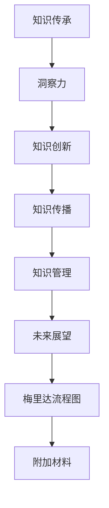

                 

### 人类知识的传承与发展：洞察力的重要作用

> **关键词：** 知识传承，洞察力，知识创新，知识传播，知识管理，社会发展，技术手段。

> **摘要：** 本文旨在探讨人类知识传承与发展的过程中，洞察力所扮演的重要角色。通过分析人类知识传承的历史与演变，洞察力的定义与特征，其在知识传承中的应用，培养方法以及其在知识创新、知识传播和知识管理中的作用，本文揭示了洞察力在推动知识传承与发展中的关键作用。文章最后展望了洞察力在知识传承与发展中的未来前景，并提出了相关建议。

# 目录大纲

## 第一部分：人类知识传承的背景与重要性

### 第1章：人类知识传承的历史与演变
- 1.1 知识传承的起源
- 1.2 知识传承的重要作用
- 1.3 知识传承的主要方式

### 第2章：知识传承与社会发展
- 2.1 知识传承与社会进步
- 2.2 知识传承与科技创新
- 2.3 知识传承对教育的影响

### 第3章：知识传承的技术手段
- 3.1 传统知识传承技术
- 3.2 现代知识传承技术
- 3.3 新技术对知识传承的影响

## 第二部分：洞察力在知识传承中的作用

### 第4章：洞察力的定义与特征
- 4.1 洞察力的概念
- 4.2 洞察力的核心特征
- 4.3 洞察力的重要性

### 第5章：洞察力在知识传承中的应用
- 5.1 洞察力在科学研究中的应用
- 5.2 洞察力在技术创新中的应用
- 5.3 洞察力在跨文化交流中的应用

### 第6章：培养和提高洞察力
- 6.1 洞察力的培养方法
- 6.2 提高洞察力的实践策略
- 6.3 洞察力培养的案例分析

## 第三部分：洞察力在知识发展中的推动作用

### 第7章：洞察力与知识创新
- 7.1 知识创新的概念与过程
- 7.2 洞察力在知识创新中的作用
- 7.3 知识创新的影响因素分析

### 第8章：洞察力与知识传播
- 8.1 知识传播的概念与渠道
- 8.2 洞察力在知识传播中的作用
- 8.3 洞察力对知识传播效果的影响

### 第9章：洞察力与知识管理
- 9.1 知识管理的概念与原则
- 9.2 洞察力在知识管理中的应用
- 9.3 知识管理与洞察力的互动关系

## 第四部分：未来展望

### 第10章：洞察力在知识传承与发展中的前景
- 10.1 洞察力在知识传承与发展的未来趋势
- 10.2 新技术对洞察力发展的推动作用
- 10.3 洞察力发展的社会影响

### 第11章：结论与展望
- 11.1 全书总结
- 11.2 知识传承与发展的挑战与机遇
- 11.3 未来研究的方向与建议

### 附录
- 附录A：洞察力测评工具与量表
- 附录B：典型案例分析与讨论
- 附录C：参考文献

### 附加材料
- 附加材料1：洞察力培养与提高的实践指南
- 附加材料2：洞察力相关书籍与文章推荐
- 附加材料3：洞察力培养与提高的案例分析

### 梅里达流程图：洞察力与知识传承的关系

---

在接下来的文章中，我们将一步步深入探讨人类知识传承与发展的背景与重要性，洞察力的定义与特征，其在知识传承中的应用，培养方法，以及其在知识创新、知识传播和知识管理中的作用。最后，我们将展望洞察力在知识传承与发展中的未来前景，并提出相关建议。

---

### 第1章：人类知识传承的历史与演变

#### 1.1 知识传承的起源

知识传承是人类文明发展的重要基石，它源于古代人类社会对经验与知识的积累与传播。在史前时期，知识主要以口耳相传的方式传承，例如狩猎技巧、农业知识、医学知识等。随着文字的发明和书写材料的普及，知识传承开始有了更为稳固的载体，如甲骨文、竹简、羊皮纸等。

古代文明，如古埃及、古印度、古希腊、古罗马等，都建立了自己的知识传承体系。其中，图书馆、档案馆、学术机构等成为了知识传承的重要场所。例如，古希腊的亚历山大图书馆是当时世界上的知识宝库，吸引了众多学者前来交流和学习。

#### 1.2 知识传承的重要作用

知识传承在人类社会发展中具有不可替代的作用。首先，它促进了人类文明的进步。通过知识传承，人类可以不断积累经验，改进技术，推动社会向前发展。例如，从农业革命到工业革命，再到信息革命，每一次知识传承的突破都带来了社会生产力的巨大提升。

其次，知识传承有助于社会稳定和文化的多样性与发展。通过知识传承，不同地区、不同民族的文化和知识得以保存和传播，促进了文化交流和融合。例如，丝绸之路不仅是一条商业通道，也是一条文化交流之路，推动了东西方的知识交流。

最后，知识传承对教育具有深远的影响。教育是知识传承的重要途径，通过教育，人们可以获取前人的知识，培养创新能力，为社会的发展贡献力量。教育不仅传递知识，还培养人的思维能力和价值观，这是知识传承的核心目标。

#### 1.3 知识传承的主要方式

知识传承的方式经历了从简单到复杂、从传统到现代的演变过程。以下是几种主要的知识传承方式：

1. **口耳相传**：在文字发明之前，知识主要通过口头讲述和模仿传承。这种方式虽然信息传递效率低，但有利于知识的生动和直观理解。

2. **书面记录**：随着文字的发明，知识开始以书面形式记录下来。书面记录可以保存信息，便于长期传承和查阅。古代的典籍、文献、手稿等都是知识传承的重要载体。

3. **学术交流**：在学术界，通过讲座、研讨会、学术会议等形式进行知识交流，促进了知识的传播和碰撞。学术交流有助于发现新知识、解决新问题，是知识传承的重要方式。

4. **教育体系**：现代教育体系通过课程设置、教材编写、教学活动等方式，系统地将知识传授给下一代。教育不仅传递知识，还培养人的思维能力和创新能力。

5. **信息技术**：随着信息技术的飞速发展，知识传承进入了数字化时代。互联网、数据库、云计算等技术为知识的快速传播提供了强大支持。电子书、在线课程、数字图书馆等新型知识传承方式大大提升了知识获取的便捷性和高效性。

#### 1.4 知识传承的发展趋势

当前，知识传承正面临着前所未有的挑战和机遇。以下是一些知识传承的发展趋势：

1. **全球化**：知识传承不再局限于特定地区或民族，全球范围内的知识交流日益频繁。互联网使得全球范围内的知识获取变得简单快捷，促进了全球文化的交融和知识的发展。

2. **个性化**：随着信息技术的发展，知识传承更加注重个性化。通过大数据分析、人工智能等技术，教育系统能够根据个体的学习需求提供个性化的教育内容和服务。

3. **跨学科**：知识传承正在向跨学科方向发展。现代科学研究往往涉及多个学科领域，跨学科研究有助于解决复杂问题，推动知识的创新和整合。

4. **开放性**：开放性知识传承是当前的一个重要趋势。开放获取、开放课程、开放数据等开放性资源为知识的广泛传播提供了便利，促进了知识的共享和利用。

5. **可持续发展**：知识传承的可持续发展日益受到重视。通过促进知识共享、提高知识利用率，可以有效减少资源的浪费，推动社会的可持续发展。

### 总结

知识传承是人类文明发展的重要动力，它不仅促进了社会的进步和稳定，也为人类带来了丰富的文化和知识遗产。随着信息技术的不断发展，知识传承的方式和手段也在不断创新和变革。在未来，人类需要更加注重知识的传承与发展，充分利用新技术推动知识的传播和共享，为人类社会的可持续发展贡献力量。

---

在接下来的章节中，我们将进一步探讨知识传承与社会发展的关系，现代知识传承的技术手段，以及洞察力在知识传承中的重要作用。敬请期待！

---

### 第2章：知识传承与社会发展

#### 2.1 知识传承与社会进步

知识传承与社会进步之间存在着密不可分的联系。知识传承不仅是人类文明发展的基础，也是推动社会进步的重要力量。通过知识传承，人类社会能够积累经验，传承智慧，不断改进技术，创新思想，从而实现社会的持续进步。

首先，知识传承促进了技术的进步。在历史上，每一次技术的重大突破都离不开前人知识的积累和传承。例如，从古代的火药、指南针到现代的互联网、人工智能，技术的进步离不开知识的传承和发展。知识的积累使得科学家、工程师能够在前人的基础上进行创新，推动技术不断向前发展。

其次，知识传承推动了社会的创新。创新是社会发展的重要动力，而创新的基础是知识。通过知识传承，人们可以不断获取新的知识，启发新的思维，发现新的解决方案。例如，在现代科技产业中，科学家和工程师通过查阅文献、学习前人的研究成果，不断提出新的理论、新的技术，推动产业创新。

此外，知识传承还有助于社会的稳定。通过知识的传播，人们可以更好地理解和应对社会问题，提高社会的凝聚力和稳定性。例如，在公共管理、医疗保健、环境保护等领域，知识的传承和应用有助于提高公共服务的质量和效率，维护社会的和谐与稳定。

#### 2.2 知识传承与科技创新

知识传承与科技创新之间存在着相互促进的关系。知识传承为科技创新提供了坚实的基础，而科技创新则丰富了知识传承的内容和形式。

首先，知识传承为科技创新提供了丰富的知识资源。科学家和工程师在开展科技创新时，需要查阅大量的文献、研究报告和实验数据。这些知识资源来自于前人的研究积累，是科技创新不可或缺的基础。

其次，科技创新推动了知识的传承和发展。在科技创新的过程中，科学家和工程师不仅会产生新的知识，还会通过论文发表、技术交流、教育培训等方式，将新知识传承下去，促进知识的传播和普及。

此外，知识传承和科技创新之间还存在着一种互动关系。知识传承为科技创新提供了基础，而科技创新则推动了知识的创新和发展。通过这种互动，知识传承和科技创新共同推动了社会的进步。

#### 2.3 知识传承对教育的影响

教育是知识传承的重要途径，而知识传承对教育的影响也是深远而广泛的。

首先，知识传承为教育提供了丰富的教学内容。教育内容来源于知识的传承，包括历史、科学、文化、艺术等各个领域。通过知识的传承，教育能够不断更新教学内容，满足社会发展的需求。

其次，知识传承影响了教育的方式和方法。传统的知识传承主要通过教师授课、书本学习等方式进行，而现代的知识传承则更加注重互动和实践。例如，在线教育、实践课程、研究项目等新型教育方式，使得知识传承更加灵活和高效。

此外，知识传承对教育质量具有直接影响。教育质量的提高离不开知识的传承。通过知识的传承，教师能够不断提高自身的专业素养，为学生提供高质量的教育。

### 2.4 知识传承与社会发展的互动关系

知识传承与社会发展的互动关系体现在多个方面。首先，知识传承推动了社会的进步。通过知识的传承，社会能够不断积累经验，改进技术，创新思想，从而实现社会的持续进步。

其次，社会发展为知识传承提供了良好的环境和条件。例如，稳定的政治环境、繁荣的经济条件、良好的教育体系等，都为知识的传承和发展提供了有力支持。

此外，知识传承和社会发展之间还存在着一种相互促进的关系。知识传承推动了社会的进步，而社会的进步又为知识传承提供了更好的环境和条件。通过这种互动，知识传承和社会发展共同推动了人类文明的进步。

### 2.5 知识传承的挑战与机遇

在当今社会，知识传承面临着诸多挑战和机遇。

首先，知识爆炸带来了知识传承的挑战。随着信息技术的飞速发展，知识更新速度加快，人们面临的信息量越来越大。如何在海量信息中筛选、整理和传承知识，成为知识传承的一大挑战。

其次，全球化的进程为知识传承带来了机遇。全球化使得知识传播更加便捷，各国之间的知识交流更加频繁。通过全球化，知识传承可以跨越地域和文化的限制，实现知识的共享和融合。

此外，新技术的发展为知识传承提供了新的手段和工具。例如，互联网、数据库、云计算等新技术，为知识的快速传播、存储和共享提供了强大支持。

### 2.6 知识传承的未来趋势

展望未来，知识传承将呈现出以下趋势：

1. **数字化**：随着信息技术的不断发展，知识传承将越来越依赖于数字化手段。数字图书馆、在线课程、电子书籍等数字化资源将成为知识传承的主要形式。

2. **个性化**：知识传承将更加注重个性化。通过大数据分析、人工智能等技术，教育系统能够根据个体的学习需求提供个性化的教育内容和服务。

3. **开放性**：开放性知识传承将得到进一步发展。开放获取、开放课程、开放数据等开放性资源将促进知识的广泛传播和共享。

4. **跨学科**：知识传承将更加注重跨学科。跨学科研究有助于解决复杂问题，推动知识的创新和整合。

5. **可持续发展**：知识传承将更加注重可持续发展。通过促进知识共享、提高知识利用率，可以有效减少资源的浪费，推动社会的可持续发展。

### 总结

知识传承与社会发展之间存在着密不可分的联系。知识传承不仅推动了社会的进步，也为科技创新和教育提供了坚实的基础。在未来，人类需要更加注重知识的传承与发展，充分利用新技术推动知识的传播和共享，为人类社会的可持续发展贡献力量。

---

在接下来的章节中，我们将探讨现代知识传承的技术手段，以及洞察力在知识传承中的应用。敬请期待！

---

### 第3章：知识传承的技术手段

#### 3.1 传统知识传承技术

传统知识传承技术主要包括口头传授、书面记录和口述史等形式。这些技术在人类社会的发展过程中发挥了重要作用。

1. **口头传授**：在文字发明之前，知识主要依靠口头传授。这种方式具有直观、生动的特点，能够帮助学习者更好地理解和记忆知识。例如，古代的神话传说、民间故事、音乐和舞蹈等都是通过口头传授传承下来的。

2. **书面记录**：随着文字的发明，知识开始以书面形式记录下来。书面记录可以保存信息，便于长期传承和查阅。古代的典籍、文献、手稿等都是知识传承的重要载体。例如，中国古代的《诗经》、《尚书》等经典文献都是通过书面记录传承下来的。

3. **口述史**：口述史是一种通过口头访谈收集历史信息的方法。这种方法能够保存个人的记忆和经历，为历史研究提供丰富的第一手资料。例如，许多国家的民间史志、家族史等都是通过口述史的形式传承下来的。

#### 3.2 现代知识传承技术

现代知识传承技术主要包括印刷术、广播、电视、互联网和社交媒体等形式。这些技术极大地提高了知识传播的速度和范围。

1. **印刷术**：印刷术的发明是知识传承的一次重大革命。它使得书籍的复制和传播变得简单快捷，大大促进了知识的传播和普及。例如，欧洲的文艺复兴时期，印刷术的普及使得大量古典文献得以重新发现和传播。

2. **广播和电视**：广播和电视是20世纪最重要的知识传播手段之一。通过广播和电视，知识可以迅速传播到千家万户，使人们能够随时随地获取信息。例如，新闻广播、教育节目、纪录片等都是通过广播和电视传播知识的重要形式。

3. **互联网**：互联网是21世纪最具有影响力的知识传播工具。它打破了地域和时间的限制，使得知识传播的速度和范围达到了前所未有的高度。互联网上的信息资源丰富多样，包括电子书、在线课程、学术论文等，为人们提供了便捷的知识获取途径。

4. **社交媒体**：社交媒体平台如Facebook、Twitter、微信等，为知识传播提供了新的渠道。用户可以通过分享、评论、点赞等方式，快速传播和分享知识。社交媒体的互动性使得知识传播更加高效和有针对性。

#### 3.3 新技术对知识传承的影响

新技术的不断涌现对知识传承产生了深远的影响。

1. **数字化**：数字化技术使得知识可以以数字形式存储和传播，大大提高了知识传播的效率。数字图书馆、在线数据库等数字化资源为人们提供了丰富的知识来源。

2. **开放获取**：开放获取运动提倡知识的自由获取和共享。通过开放获取，人们可以免费获取到大量学术论文、书籍和其他知识资源，促进了知识的普及和传播。

3. **大数据和人工智能**：大数据和人工智能技术为知识传承提供了新的手段。通过大数据分析，可以挖掘出知识之间的关联，为知识的创新和整合提供支持。人工智能则可以通过自然语言处理等技术，实现知识的自动化获取、整理和传播。

4. **虚拟现实和增强现实**：虚拟现实和增强现实技术为知识传承提供了新的体验方式。通过虚拟现实和增强现实，人们可以沉浸式地体验知识，提高知识的理解和记忆效果。

#### 3.4 知识传承的技术手段比较

传统知识传承技术和现代知识传承技术各有优劣。

1. **速度和范围**：现代知识传承技术具有更快的信息传播速度和更广泛的传播范围。数字化技术和互联网使得知识可以迅速传播到全球各地。

2. **效率和便捷性**：现代知识传承技术更加高效和便捷。用户可以通过互联网轻松获取到所需的知识资源，而不再需要亲自前往图书馆或实体书店。

3. **互动性和个性化**：现代知识传承技术更具有互动性和个性化。用户可以通过社交媒体平台与其他用户互动，分享和讨论知识。同时，大数据和人工智能技术可以根据用户的需求提供个性化的知识推荐。

4. **成本和可持续性**：传统知识传承技术成本较高，且容易受到物理环境和人为因素的制约。而现代知识传承技术成本相对较低，且具有更好的可持续性。

#### 3.5 知识传承的技术手段未来发展趋势

未来，知识传承的技术手段将继续朝着数字化、开放性、智能化和互动性的方向发展。

1. **智能化**：随着人工智能技术的发展，知识传承将更加智能化。人工智能可以通过自然语言处理、机器学习等技术，实现知识的自动化获取、整理和传播。

2. **开放性**：开放获取将继续成为知识传承的重要趋势。通过开放获取，知识将更加自由地传播和共享，促进知识的普及和利用。

3. **虚拟化和增强现实**：虚拟现实和增强现实技术将为知识传承带来新的体验方式。通过虚拟现实和增强现实，人们可以沉浸式地体验知识，提高知识的理解和记忆效果。

4. **个性化和定制化**：随着大数据和人工智能技术的发展，知识传承将更加注重个性化和定制化。用户可以根据自身的需求，定制个性化的知识服务。

### 总结

知识传承的技术手段经历了从传统到现代的演变过程。现代知识传承技术具有速度快、范围广、效率高、便捷性强等优点，为知识的传播和普及提供了强大的支持。未来，知识传承的技术手段将继续朝着智能化、开放性、虚拟化和个性化的方向发展，为人类社会的知识传承与发展提供更加便捷和高效的方式。

---

在接下来的章节中，我们将探讨洞察力的定义与特征，以及其在知识传承中的作用。敬请期待！

---

### 第4章：洞察力的定义与特征

#### 4.1 洞察力的概念

洞察力，又称洞察敏锐度，是指个体在观察事物、理解问题和发现解决方案的过程中，所表现出的深刻、独到的认识和判断能力。洞察力不仅仅是简单的观察或理解，而是一种对事物本质的深入洞察，能够在复杂和模糊的情况下发现关键信息和规律。

在科学研究和实践中，洞察力被广泛认为是创新能力的基础。它使得个体能够超越表面的现象，看到问题的本质，从而提出新的观点和解决方案。例如，在物理学中，牛顿通过观察苹果落地，洞察到了万有引力定律；在经济学中，马克思通过对资本主义生产方式的深入分析，洞察到了剩余价值理论。

#### 4.2 洞察力的核心特征

洞察力具有以下几个核心特征：

1. **深度**：洞察力能够深入问题的核心，发现问题的本质和内在联系。深度洞察力使得个体能够在看似复杂和混乱的情况下，看到事物的本质和规律。

2. **独特性**：洞察力往往具有独特性，即个体能够从独特的角度或视角看待问题，提出新颖的观点和解决方案。独特性是创新的重要来源，它使得个体能够发现别人忽视的细节或关系。

3. **敏锐性**：洞察力具有敏锐性，能够在细微的变化中捕捉到关键信息。敏锐性使得个体能够迅速识别问题的变化，及时做出调整和应对。

4. **整合性**：洞察力能够将不同来源的信息和知识整合起来，形成新的认知和理解。整合性使得个体能够从多个角度看待问题，找到最佳的解决方案。

5. **预见性**：洞察力具有预见性，能够预测未来的发展趋势和变化。预见性是决策的重要基础，它使得个体能够在变化之前做出预见和准备。

#### 4.3 洞察力的重要性

洞察力在知识传承与发展中具有重要地位，其作用主要体现在以下几个方面：

1. **知识创新**：洞察力是知识创新的关键。通过深度洞察，个体能够发现新的知识领域，提出新的理论模型，推动知识的创新和发展。

2. **问题解决**：洞察力有助于问题的解决。在面对复杂问题时，洞察力能够帮助个体快速识别问题的关键，找到有效的解决方案。

3. **决策制定**：洞察力在决策制定中具有重要价值。通过洞察力，个体能够更好地评估不同选项的风险和收益，做出更加明智的决策。

4. **跨学科研究**：洞察力有助于跨学科研究。通过整合不同领域的知识，洞察力能够发现跨学科之间的联系，推动跨学科研究的进展。

5. **人才培养**：洞察力是人才培养的重要素质。通过培养洞察力，个体能够更好地适应未来的社会发展需求，成为具有创新能力和领导力的人才。

#### 4.4 洞察力与其他能力的关联

洞察力与其他认知能力如记忆力、理解力、分析力和判断力等密切相关。记忆力是洞察力的重要基础，没有良好的记忆力，难以积累丰富的知识；理解力是洞察力的前提，没有深入的理解，难以发现问题的本质；分析力是洞察力的工具，没有分析力，难以将复杂的知识整合起来；判断力是洞察力的结果，没有准确的判断，难以做出有效的决策。

此外，洞察力还与个体的情感、价值观和经验有关。情感因素可以影响洞察力的发挥，积极、开放的心态有助于提升洞察力；价值观则决定了个体对知识的追求方向；经验是洞察力的宝贵资源，丰富的经验能够提升洞察力的敏锐性和深度。

#### 4.5 洞察力的培养与提高

洞察力的培养和提高是一个长期的过程，需要系统的训练和实践。以下是一些有效的培养方法：

1. **广泛阅读**：阅读是培养洞察力的有效途径。通过阅读，个体可以接触不同的观点和理论，拓宽视野，提升认知水平。

2. **反思思考**：反思思考有助于提升洞察力。在日常生活中，个体可以通过反思自己的行为和决策，分析其背后的原因和影响，提升对问题的理解能力。

3. **实践探索**：实践是提升洞察力的关键。通过实践，个体可以面对真实的问题和挑战，锻炼解决问题的能力，积累经验。

4. **交流讨论**：交流讨论有助于提升洞察力。通过与他人的交流，个体可以倾听不同的观点，发现问题的不同层面，提升对问题的全面理解。

5. **保持好奇心**：好奇心是洞察力的催化剂。保持好奇心，对未知事物保持探索的态度，有助于个体在探索中发现新的知识和规律。

#### 4.6 洞察力的应用场景

洞察力在多个领域都有广泛的应用，以下是一些典型的应用场景：

1. **科学研究**：在科学研究中，洞察力有助于发现新的科学问题和解决方法。科学家通过深度观察和思考，能够发现自然界的规律，提出新的理论模型。

2. **企业管理**：在企业管理中，洞察力有助于发现市场机会、预测市场趋势和制定战略决策。企业家通过洞察市场环境，能够制定出具有前瞻性的战略计划。

3. **技术创新**：在技术创新中，洞察力有助于发现新的技术方向和创新点。技术人员通过深入分析现有技术，能够发现改进和创新的潜力。

4. **教育培训**：在教育培训中，洞察力有助于发现学生的学习需求和问题，制定出更加有效的教学方法和策略。

5. **社会管理**：在社会管理中，洞察力有助于发现社会问题、预测社会发展趋势和制定社会政策。政府和社会组织通过洞察力，能够更好地应对社会问题，推动社会的发展。

### 总结

洞察力是知识传承与发展中不可或缺的重要能力。它不仅有助于知识创新和问题解决，还在决策制定、跨学科研究和人才培养等方面发挥着重要作用。通过系统的培养和提高，个体可以提升洞察力，为知识的传承与发展贡献自己的力量。

---

在接下来的章节中，我们将探讨洞察力在知识传承中的应用，以及如何在科学研究、技术创新和跨文化交流中发挥洞察力的重要作用。敬请期待！

---

### 第5章：洞察力在知识传承中的应用

#### 5.1 洞察力在科学研究中的应用

在科学研究领域，洞察力扮演着至关重要的角色。科学家们通过洞察力，能够从大量的实验数据和观察结果中提炼出关键信息，从而发现新的科学现象和规律。以下是一些具体的案例：

1. **牛顿的万有引力定律**：牛顿通过观察苹果从树上落下，洞察到地球对物体具有吸引力。他进一步推理，认为这种吸引力是宇宙中所有物体之间普遍存在的。这一洞察力促使他提出了万有引力定律，改变了人们对宇宙的认识。

2. **爱因斯坦的相对论**：爱因斯坦通过对时间和空间的理解，洞察到它们是相对的，而不是绝对的。这一洞察力促使他提出了狭义相对论和广义相对论，颠覆了经典物理学的观念，为现代物理学的发展奠定了基础。

3. **弗莱明的青霉素发现**：弗莱明在实验室中观察到某些细菌在接触某些霉菌后死亡的现象。他通过洞察力，意识到霉菌产生了某种能够杀死细菌的物质，即青霉素。这一发现为抗生素的发展奠定了基础，对医学产生了深远影响。

#### 5.2 洞察力在技术创新中的应用

在技术创新领域，洞察力同样发挥着重要作用。通过洞察力，技术人员能够发现现有技术的不足和改进空间，从而推动技术的进步。以下是一些具体的案例：

1. **智能手机的发展**：在智能手机的发展过程中，技术专家们通过洞察力，发现了用户对移动通信、互联网、多媒体应用等方面的需求。他们不断改进硬件和软件技术，使得智能手机的功能越来越强大，成为人们生活中不可或缺的工具。

2. **人工智能的发展**：人工智能的发展离不开洞察力。人工智能专家们通过洞察数据、算法和计算能力的发展趋势，不断提出新的理论和方法，推动了人工智能技术的进步。例如，深度学习就是人工智能领域的一项重要创新，它通过模仿人脑的神经网络结构，实现了图像识别、自然语言处理等任务的突破。

3. **可再生能源技术的进步**：在可再生能源技术领域，科学家们通过洞察力，发现了太阳能、风能等可再生能源的潜力。他们不断改进技术，提高可再生能源的转换效率，降低成本，推动可再生能源的广泛应用。

#### 5.3 洞察力在跨文化交流中的应用

在跨文化交流中，洞察力同样具有重要作用。通过洞察力，个体能够更好地理解不同文化之间的差异和共性，促进文化的交流与融合。以下是一些具体的案例：

1. **跨文化市场营销**：在市场营销中，洞察力有助于企业了解不同文化背景下的消费者需求和行为。例如，跨国企业通过洞察不同市场的文化特点，调整产品设计和营销策略，更好地满足当地消费者的需求。

2. **国际教育交流**：在国际教育交流中，洞察力有助于教师和学生更好地理解不同教育体系和教学风格。通过洞察力，教师能够设计出更加适应国际学生的教学方案，学生能够更好地适应新的教育环境。

3. **国际政治外交**：在国际政治外交中，洞察力有助于政府官员和外交人员更好地理解不同国家的政治、经济和文化背景。通过洞察力，他们能够制定出更加符合国际形势的外交政策，促进国际合作与和平。

#### 5.4 洞察力在知识传承中的具体应用

在知识传承过程中，洞察力也有广泛的应用。以下是一些具体的案例：

1. **教育传承**：在教育领域，教师通过洞察学生的需求和理解能力，能够设计出更加有效的教学方法和课程内容。通过洞察力，教师能够发现学生掌握知识的薄弱环节，及时进行补充和强化。

2. **学术研究传承**：在学术研究中，洞察力有助于学者们发现新的研究问题和方向。通过洞察已有的研究成果和学术争论，学者们能够提出新的理论框架和观点，推动学术研究的进步。

3. **文化遗产传承**：在文化遗产传承中，洞察力有助于学者和文化传承者更好地理解文化遗产的价值和内涵。通过洞察力，他们能够发现文化遗产在不同历史时期和文化背景下的变化和演变，为文化遗产的保护和传承提供科学依据。

#### 5.5 洞察力在知识传承中的作用机制

洞察力在知识传承中的作用机制主要包括以下几个方面：

1. **信息筛选和整合**：洞察力能够帮助个体从大量的信息中筛选出关键信息，并进行整合。通过洞察力，个体能够将不同的信息联系起来，形成对问题的全面理解。

2. **发现问题和提出解决方案**：洞察力使得个体能够发现现有知识体系中的不足和问题，并提出新的解决方案。通过洞察力，个体能够推动知识的创新和发展。

3. **促进跨学科研究**：洞察力能够帮助个体发现不同学科之间的联系，促进跨学科研究。通过洞察力，个体能够将不同领域的知识整合起来，提出新的理论模型和观点。

4. **培养创新思维**：洞察力有助于培养个体的创新思维。通过洞察力，个体能够从独特的角度看待问题，提出新颖的解决方案，推动知识的传承和发展。

### 总结

洞察力在知识传承中的应用非常广泛，无论是在科学研究、技术创新，还是在跨文化交流和知识传承中，都发挥着重要作用。通过洞察力，个体能够发现新的知识领域，提出新的观点和解决方案，推动知识的创新和发展。培养和提高洞察力，对于个体和社会的发展都具有重要意义。

---

在接下来的章节中，我们将探讨如何培养和提高洞察力，以及成功案例的分析。敬请期待！

---

### 第6章：培养和提高洞察力

#### 6.1 洞察力的培养方法

洞察力的培养是一个系统而持久的过程，需要多方面的努力和实践。以下是一些有效的培养方法：

1. **广泛阅读**：阅读是培养洞察力的基础。通过阅读，个体可以接触到各种观点和理论，了解不同的知识和文化。阅读不仅能够拓宽视野，还能培养批判性思维和逻辑推理能力。推荐阅读经典著作、专业书籍、学术论文等，以便从不同角度理解问题。

2. **反思思考**：反思思考是培养洞察力的重要手段。个体可以通过回顾自己的经历、分析决策过程，以及反思自己的学习和工作，来提升对问题的理解和洞察力。例如，每天花时间记录自己的思考，或者与他人交流自己的观点和想法，都是有效的反思方法。

3. **实践探索**：实践是洞察力培养的关键。通过实际操作和实验，个体能够将理论知识应用到具体情境中，发现问题和解决问题的过程可以锻炼洞察力。例如，参与科研项目、实习实践、社会服务等，都是培养洞察力的好机会。

4. **交流讨论**：与他人交流和讨论有助于提升洞察力。通过听取他人的观点和意见，个体可以开阔思路，发现问题的不同层面。此外，交流讨论还可以培养沟通能力和团队合作精神，这些都是提升洞察力的关键因素。

5. **保持好奇心**：好奇心是洞察力的催化剂。个体应该对未知事物保持探索的态度，勇于提出问题和挑战现有的观念。例如，对新技术、新理论和新领域保持好奇，能够激发洞察力的发挥。

#### 6.2 提高洞察力的实践策略

以下是一些具体的实践策略，帮助个体提高洞察力：

1. **定期进行思维训练**：思维训练可以通过逻辑游戏、谜题解决、头脑风暴等活动来进行。这些活动有助于培养逻辑思维和创造性思维，提高洞察力。

2. **培养多角度思考的习惯**：在解决问题时，个体应该尝试从多个角度思考，分析问题的各个方面。这种多角度思考的习惯可以帮助个体更全面地理解问题，提高洞察力。

3. **学习跨学科知识**：跨学科知识可以提供不同的视角和思维方式，有助于个体在复杂问题中找到创新的解决方案。例如，学习心理学、经济学、社会学等跨学科知识，可以提升洞察力的广度和深度。

4. **定期进行阅读和学习**：定期阅读和学习新知识可以不断更新个体的知识储备，提高洞察力。推荐阅读最新的研究论文、专业书籍和权威出版物，以便了解领域内的最新动态。

5. **实践反思与总结**：在实践过程中，个体应该定期进行反思和总结。通过反思自己的决策和行动，分析成功和失败的原因，个体可以不断优化自己的思维方式和工作方法，提高洞察力。

#### 6.3 洞察力培养的案例分析

以下是一些成功的洞察力培养案例，可以提供启示和借鉴：

1. **乔布斯的洞察力培养**：苹果公司创始人史蒂夫·乔布斯以其卓越的洞察力而闻名。乔布斯通过广泛的阅读、实践探索和反思思考，不断提升自己的洞察力。他经常深入研究用户需求和市场趋势，从而提出创新的产品和服务。例如，他在设计iPhone时，通过洞察用户对智能手机的期望，提出了滑动解锁、多点触控等创新设计，使得iPhone成为全球畅销产品。

2. **谷歌的洞察力培养**：谷歌公司以其强大的创新能力而著称。谷歌通过鼓励员工进行跨学科学习和交流讨论，培养员工的洞察力。谷歌的“20%时间项目”允许员工用20%的工作时间进行个人项目，这激发了员工的创新思维和洞察力。例如，谷歌搜索、Gmail等知名产品都是通过这种创新机制诞生的。

3. **社会企业的洞察力培养**：社会企业通过解决社会问题，推动社会进步。这些企业通常注重培养员工的洞察力，以便更好地理解社会需求和问题。例如，印度的社会企业“阿卡拉”（Akara）通过提供农村教育支持，培养员工对农村教育的洞察力，从而设计出更有效的教育解决方案。

#### 6.4 洞察力培养的效果评估

洞察力的培养效果可以通过以下方法进行评估：

1. **绩效评估**：通过工作绩效评估，可以衡量个体在解决问题、决策制定和创新等方面的洞察力提升情况。绩效提升可以表明洞察力的培养取得了成效。

2. **客户反馈**：通过客户的反馈，可以评估个体在提供服务和解决方案时，是否能够准确理解和满足客户需求，这反映了洞察力的应用效果。

3. **同行评价**：同行的评价可以帮助个体了解自己的洞察力水平，以及与行业标准的差距。通过听取同行的意见和建议，个体可以进一步改进自己的思维方式和工作方法。

4. **自我反思**：个体可以通过定期自我反思，评估自己在洞察力培养方面的进展。自我反思可以帮助个体发现自身的优势和不足，制定相应的改进措施。

### 总结

洞察力的培养和提高是一个需要持续努力和实践的过程。通过广泛阅读、反思思考、实践探索、交流讨论和保持好奇心，个体可以逐步提升自己的洞察力。成功的案例分析表明，培养洞察力对于个人和组织的创新和发展具有重要意义。通过有效的培养策略和效果评估，个体和组织可以更好地理解和应用洞察力，推动知识的传承与发展。

---

在接下来的章节中，我们将探讨洞察力在知识发展中的推动作用，包括知识创新、知识传播和知识管理等方面的具体内容。敬请期待！

---

### 第7章：洞察力与知识创新

#### 7.1 知识创新的概念与过程

知识创新是指通过创造性的思维和方法，对现有知识进行重新组合、扩展和深化，从而产生新的知识和理念的过程。知识创新不仅仅局限于科学领域的突破，还涵盖了教育、文化、商业等多个领域。知识创新的过程通常包括以下几个阶段：

1. **信息收集**：在知识创新的过程中，首先需要收集相关的信息。这些信息可以来自于各种渠道，如研究论文、专利文件、市场报告等。信息的收集是知识创新的基础，它为创新提供了丰富的素材。

2. **问题识别**：在收集到足够的信息后，个体需要识别出存在的问题或挑战。这一阶段要求个体具有敏锐的洞察力，能够从大量的信息中捕捉到关键问题。

3. **概念形成**：在识别出问题后，个体需要提出新的概念或想法，这些概念或想法是对现有知识的重新理解和扩展。概念形成是知识创新的核心阶段，它要求个体具有创造力和批判性思维。

4. **验证与实验**：在提出新的概念或想法后，个体需要进行验证和实验，以证明这些概念或想法的有效性和可行性。验证与实验可以通过模拟实验、实际操作、数据分析等方式进行。

5. **知识整合**：在验证和实验的基础上，个体需要对新的知识进行整合，形成系统的理论或模型。知识整合是知识创新的重要阶段，它使得新的知识能够被广泛应用和传播。

6. **知识传播**：知识创新的结果需要通过有效的传播渠道，如学术会议、期刊论文、教育培训等，传播到更广泛的受众中，从而实现知识的共享和普及。

#### 7.2 洞察力在知识创新中的作用

洞察力在知识创新中起着至关重要的作用。它不仅有助于个体识别问题、形成概念，还在验证与实验、知识整合和传播等环节中发挥着关键作用。以下是一些具体的作用：

1. **问题识别**：洞察力能够帮助个体从复杂的信息中捕捉到关键问题。在知识创新的过程中，识别出关键问题是成功的前提。洞察力使得个体能够看到问题的本质，从而提出具有针对性的解决方案。

2. **概念形成**：洞察力是概念形成的关键。通过洞察力，个体能够从不同的角度和层面看待问题，提出新颖的观点和想法。这些新颖的观点和想法往往是知识创新的重要源泉。

3. **验证与实验**：洞察力在验证与实验阶段也发挥着重要作用。具有洞察力的个体能够从实验数据中快速捕捉到关键信息，从而验证新的概念或想法的有效性。此外，洞察力还能够帮助个体发现实验中的潜在问题和改进空间。

4. **知识整合**：在知识整合阶段，洞察力有助于个体将不同的知识进行整合，形成系统的理论或模型。通过洞察力，个体能够看到不同知识之间的联系和相互作用，从而提出更具综合性的创新方案。

5. **知识传播**：洞察力在知识传播中也具有重要意义。具有洞察力的个体能够更准确地理解知识的内涵和价值，从而更有效地传播和推广新知识。此外，洞察力还能够帮助个体设计出更具吸引力和说服力的传播策略。

#### 7.3 知识创新的影响因素分析

知识创新是一个复杂的过程，受到多种因素的影响。以下是一些主要的影响因素：

1. **资源**：资源是知识创新的基础。包括资金、设备、技术、人才等资源，这些资源为知识创新提供了必要的支持。缺乏资源可能会限制知识创新的深度和广度。

2. **环境**：环境是知识创新的土壤。一个开放、包容和创新的环境能够激发知识创新的活力。相反，一个封闭、保守和抑制创新的环境可能会阻碍知识创新的发展。

3. **政策**：政策是知识创新的保障。政府的政策支持、法律法规的制定和执行，对于知识创新具有重要的推动作用。例如，鼓励创新的政策、知识产权保护的法律，都能够促进知识创新的开展。

4. **文化**：文化是知识创新的动力。一个尊重知识、鼓励创新的文化氛围能够激发个体的创新潜力。例如，鼓励批判性思维、倡导合作与分享的文化，都能够促进知识创新的开展。

5. **技术**：技术是知识创新的手段。现代技术的发展为知识创新提供了强大的支持。例如，信息技术、人工智能、大数据等技术的应用，可以极大地提高知识创新的效率和质量。

#### 7.4 知识创新的成功案例

以下是一些知识创新的成功案例，展示了洞察力在知识创新中的关键作用：

1. **微信的诞生**：微信是中国最大的社交媒体平台之一，它的成功离不开创始团队对市场需求的洞察力。通过洞察用户对即时通讯工具的需求，微信团队提出了社交化、移动化的通讯解决方案，从而改变了人们的沟通方式。

2. **特斯拉的电动汽车**：特斯拉作为电动汽车领域的领军企业，其成功得益于创始人埃隆·马斯克的洞察力。马斯克通过对电动汽车市场的洞察，提出了高性能、环保和智能化的电动汽车理念，推动了电动汽车技术的发展和普及。

3. **阿里巴巴的电商模式**：阿里巴巴的成功在于其对电商市场趋势的深刻洞察。通过洞察消费者行为和市场变化，阿里巴巴团队设计出了独特的电商模式，从而改变了传统的商业模式，推动了电商行业的蓬勃发展。

### 总结

知识创新是推动社会进步和经济发展的重要动力，而洞察力在其中起着至关重要的作用。通过洞察力，个体能够识别问题、形成概念、验证实验、整合知识，从而实现知识的创新和发展。成功的知识创新案例表明，培养和提高洞察力对于推动知识的创新具有重要意义。未来，我们需要进一步探索洞察力在知识创新中的应用，为知识的传承与发展贡献更多智慧和力量。

---

在接下来的章节中，我们将探讨洞察力在知识传播中的作用，以及洞察力对知识传播效果的影响。敬请期待！

---

### 第8章：洞察力与知识传播

#### 8.1 知识传播的概念与渠道

知识传播是指通过多种途径和手段，将知识从一个人或组织传递到另一个人或组织的过程。知识传播是知识传承的重要环节，它使得知识能够跨越时空的限制，被更多人获取和应用。

知识传播的渠道多种多样，主要包括以下几种：

1. **教育体系**：教育体系是知识传播的重要渠道。通过学校教育、职业教育、在线教育等形式，知识可以被系统性地传授给下一代。教育体系不仅传递知识，还培养人的思维能力和创新能力。

2. **学术交流**：学术交流是知识传播的重要途径。通过学术会议、研讨会、期刊论文等形式，学者们可以分享研究成果、讨论学术问题，促进知识的传播和交流。

3. **大众媒体**：大众媒体如电视、报纸、杂志、网络等，是知识传播的重要渠道。大众媒体通过报道新闻、发表文章、播放节目等形式，将知识传递给广泛的受众。

4. **科技展览**：科技展览是知识传播的有效方式。通过展览、展示、互动体验等形式，科技展览能够向公众展示最新的科技成果和前沿知识。

5. **社交媒体**：社交媒体如Facebook、Twitter、微信等，是知识传播的新兴渠道。通过社交媒体，用户可以快速获取和分享知识，实现知识的广泛传播。

#### 8.2 洞察力在知识传播中的作用

洞察力在知识传播中起着关键作用，它能够提高知识传播的效率和质量。以下是一些具体的作用：

1. **内容筛选与优化**：洞察力有助于筛选和优化知识传播的内容。具有洞察力的个体能够从大量的信息中捕捉到关键信息，并将其提炼和整合成易于理解的知识点。这样，知识传播的内容更加精准和有效。

2. **传播策略制定**：洞察力有助于制定知识传播的传播策略。具有洞察力的个体能够深刻理解受众的需求和行为，从而设计出更具吸引力和传播力的传播策略。例如，通过分析受众的兴趣和行为，可以确定最佳的知识传播渠道和方式。

3. **传播效果评估**：洞察力有助于评估知识传播的效果。具有洞察力的个体能够从传播数据中分析受众的反馈和行为，评估知识传播的效果，并据此进行调整和优化。

4. **跨文化交流**：在跨文化交流中，洞察力有助于理解和适应不同文化背景下的知识传播。具有洞察力的个体能够看到不同文化之间的共性和差异，设计出适应不同文化背景的知识传播方案。

#### 8.3 洞察力对知识传播效果的影响

洞察力对知识传播效果的影响体现在多个方面：

1. **传播效率**：具有洞察力的个体能够更高效地传播知识。他们能够快速识别受众的需求，选择合适的传播渠道和方式，从而提高知识传播的效率。

2. **传播质量**：具有洞察力的个体能够保证知识传播的质量。他们能够将复杂的知识简化，使之更容易被受众理解和接受，从而提高知识传播的质量。

3. **受众参与度**：洞察力有助于提高受众的参与度。具有洞察力的个体能够设计出吸引受众参与的传播活动，激发受众的积极性和参与热情。

4. **传播效果评估**：洞察力有助于评估知识传播的效果。具有洞察力的个体能够从传播数据中分析受众的反馈和行为，评估知识传播的效果，并据此进行调整和优化。

#### 8.4 洞察力在知识传播中的具体应用案例

以下是一些洞察力在知识传播中的具体应用案例：

1. **科学传播**：科学家们通过洞察力，能够将复杂的科学知识简化，使之更容易被公众理解。例如，通过生动的比喻、形象化的图表等方式，科学家们能够有效地将科研成果传播给公众。

2. **教育培训**：教育工作者通过洞察力，能够设计出更具吸引力和互动性的教学方案。例如，通过案例教学、互动讨论等方式，教育工作者能够提高学生的参与度和学习效果。

3. **市场营销**：市场营销人员通过洞察力，能够了解受众的需求和行为，设计出更具吸引力的营销策略。例如，通过大数据分析和市场调研，市场营销人员能够确定最佳的营销渠道和方式，提高营销效果。

4. **公共政策传播**：政策制定者和传播者通过洞察力，能够有效地将公共政策传播给公众。例如，通过简明易懂的语言、生动的案例分析等方式，政策制定者和传播者能够提高公众对公共政策的理解和接受度。

### 总结

洞察力在知识传播中起着至关重要的作用。它能够提高知识传播的效率和质量，促进知识的广泛传播和普及。通过洞察力，个体能够更好地理解受众的需求和行为，设计出更具吸引力和传播力的知识传播方案。未来，我们需要进一步培养和提高洞察力，推动知识的传播与发展，为社会的进步和繁荣贡献力量。

---

在接下来的章节中，我们将探讨洞察力在知识管理中的应用，以及知识管理与洞察力的互动关系。敬请期待！

---

### 第9章：洞察力与知识管理

#### 9.1 知识管理的概念与原则

知识管理（Knowledge Management，简称KM）是指通过系统的策略和方法，对组织内部和外部的知识进行收集、整理、存储、传播和应用，以提高组织竞争力、创新能力和发展能力的活动。知识管理不仅涉及技术手段，还包括组织文化、流程和人的因素。以下是知识管理的一些核心概念和原则：

1. **知识收集**：知识管理首先需要对知识进行收集。这包括内部知识（员工的经验、技能和知识）和外部知识（行业趋势、竞争对手信息等）。收集知识的方法有访谈、问卷调查、文献检索等。

2. **知识整理**：收集到的知识需要进行整理，以便更好地存储和应用。整理知识包括分类、标注、索引等工作，使得知识能够被快速检索和利用。

3. **知识存储**：知识需要存储在适当的地方，以便长期保存和方便使用。现代知识管理通常依赖于数据库、知识库、企业资源规划（ERP）系统等工具。

4. **知识传播**：知识传播是将知识从一个人或部门传递到另一个人或部门的过程。有效的知识传播可以避免重复劳动、提高工作效率。

5. **知识应用**：知识应用是将知识转化为行动和决策的过程。知识应用是知识管理的最终目标，它通过将知识融入日常工作中，提高组织的运行效率和创新能力。

6. **知识共享**：知识共享是知识管理的核心原则之一。通过建立共享文化，鼓励员工分享知识和经验，可以促进知识的流动和整合。

7. **知识创新**：知识创新是知识管理的目标之一。通过知识管理，组织可以不断产生新的思想和解决方案，推动组织的持续发展和进步。

8. **知识管理政策**：知识管理政策是组织内部关于知识管理的指导性文件，它规定了知识管理的目标、原则、流程和责任。

#### 9.2 洞察力在知识管理中的应用

洞察力在知识管理中扮演着关键角色，它能够提高知识管理的效率和质量。以下是一些具体的应用：

1. **知识识别**：洞察力可以帮助组织识别和发现有价值的知识。具有洞察力的个体能够从大量的信息和数据中提取出关键信息，识别出潜在的知识点。

2. **知识提炼**：洞察力有助于将复杂的信息和知识进行提炼和简化，使之更容易被理解和应用。通过洞察力，个体能够看到知识的本质和核心，从而提炼出关键概念和模型。

3. **知识整合**：洞察力能够帮助个体将不同的知识进行整合，形成系统的知识体系。通过洞察力，个体能够看到不同知识之间的联系和相互作用，从而构建出更加完整和全面的知识框架。

4. **知识创新**：洞察力是知识创新的重要驱动力。具有洞察力的个体能够发现现有知识的不足和改进空间，提出新的理论模型和解决方案，推动知识的创新和发展。

5. **知识传播**：洞察力有助于设计出更有效的知识传播策略。通过洞察力，个体能够深刻理解受众的需求和特点，选择合适的传播渠道和方式，提高知识传播的效果。

#### 9.3 知识管理与洞察力的互动关系

知识管理与洞察力之间存在密切的互动关系，两者相辅相成，共同推动组织的发展。

1. **知识管理促进洞察力提升**：通过知识管理，组织可以系统地收集、整理和传播知识，为个体提供丰富的知识资源。这些资源有助于个体在解决问题和决策制定时发挥洞察力，提升洞察力的水平。

2. **洞察力提升知识管理效果**：具有洞察力的个体能够更有效地管理和利用知识。他们能够看到知识之间的联系，发现知识的价值，从而提高知识管理的效率和质量。

3. **知识管理支持洞察力发展**：知识管理通过提供知识资源和传播机制，为个体的发展提供了支持。通过知识管理，组织可以培养和提高个体的洞察力，促进创新和进步。

4. **洞察力驱动知识管理创新**：洞察力可以激发组织对知识管理的创新。通过洞察力，组织可以发现现有知识管理流程和工具的不足，提出新的改进方案，推动知识管理的持续发展和进步。

#### 9.4 洞察力在知识管理中的成功案例

以下是一些成功案例，展示了洞察力在知识管理中的应用：

1. **谷歌的知识管理**：谷歌通过建立完善的知识管理流程和工具，如谷歌文档、谷歌搜索等，为员工提供了丰富的知识资源。这些工具不仅提高了工作效率，还促进了知识的共享和传播。谷歌的洞察力在于其对用户需求的深刻理解，这使得谷歌能够不断优化其知识管理工具，提高用户体验。

2. **宝洁的知识管理**：宝洁公司通过建立内部知识库和共享平台，为员工提供了丰富的知识资源。宝洁的洞察力在于其对市场趋势和消费者行为的深刻理解，这使得宝洁能够更好地管理和利用知识，提高产品创新和市场竞争力。

3. **沃顿商学院的知识管理**：沃顿商学院通过建立在线学习平台和知识库，为全球学生和校友提供了丰富的教育资源。沃顿商学院的洞察力在于其对教育和知识传播的深刻理解，这使得沃顿商学院能够提供高质量的教育服务，培养出具有洞察力和领导力的商业人才。

### 总结

知识管理是组织发展和创新能力的重要保障，而洞察力在其中起着关键作用。通过洞察力，组织能够更有效地收集、整理、传播和应用知识，提高知识管理的效率和质量。同时，知识管理也为洞察力的发展提供了丰富的资源和环境。未来，组织需要进一步培养和提高洞察力，加强知识管理，以实现持续发展和创新。

---

在接下来的章节中，我们将探讨洞察力在知识传承与发展中的未来前景，以及新技术对洞察力发展的推动作用。敬请期待！

---

### 第10章：洞察力在知识传承与发展中的前景

#### 10.1 洞察力在知识传承与发展的未来趋势

随着科技的飞速发展和全球化的深入，洞察力在知识传承与发展中的作用将变得更加重要。以下是洞察力在知识传承与发展中的几个未来趋势：

1. **数字化与智能化**：随着数字化和智能化的推进，知识传承将更加依赖于信息技术。人工智能、大数据、云计算等新技术将提高知识收集、整理、传播和应用的效率，使得洞察力在知识传承中的作用更加凸显。

2. **开放性与共享性**：开放性知识传承将得到进一步发展。互联网和社交媒体的普及，使得知识的共享变得更加便捷。开放获取、开放课程、开放数据等开放性资源将促进全球范围内的知识交流与合作，增强洞察力的发挥。

3. **个性化和定制化**：随着信息技术的发展，知识传承将更加注重个性化和定制化。通过大数据分析和人工智能技术，教育系统能够根据个体的学习需求提供个性化的教育内容和服务，提高洞察力在知识传承中的应用效果。

4. **跨学科与融合性**：跨学科研究将成为知识传承与发展的重要趋势。随着学科界限的模糊，跨学科研究将促进知识的整合和创新，提升洞察力在知识传承中的作用。

5. **可持续发展与环保性**：知识传承与发展将更加注重可持续发展。通过知识传承，可以推广环保理念和技术，促进资源的合理利用和生态环境的保护。

#### 10.2 新技术对洞察力发展的推动作用

新技术的快速发展为洞察力的发展提供了强大的推动力。以下是几种新技术对洞察力发展的推动作用：

1. **人工智能**：人工智能技术在知识收集、整理和传播中的应用，可以大幅提高洞察力的效率。通过自然语言处理、机器学习等技术，人工智能可以分析和理解大量数据，提供有价值的洞察。

2. **大数据**：大数据技术为洞察力提供了丰富的数据资源。通过大数据分析，可以发现数据之间的关联和规律，为决策提供依据。大数据分析能够帮助个体更深入地理解问题，提升洞察力。

3. **云计算**：云计算技术为知识传承提供了强大的计算和存储能力。通过云计算，个体可以轻松访问全球范围内的知识资源，提高知识获取的效率和范围。

4. **物联网**：物联网技术将物理世界和数字世界连接起来，为洞察力提供了更多的应用场景。通过物联网，可以实时监控和收集数据，为洞察力的发挥提供更多数据支持。

5. **虚拟现实与增强现实**：虚拟现实和增强现实技术为知识传承提供了全新的体验方式。通过虚拟现实和增强现实，个体可以沉浸式地体验知识，提高对知识的理解和记忆效果，增强洞察力。

#### 10.3 洞察力发展的社会影响

洞察力的发展将对社会产生深远的影响。以下是几个方面的社会影响：

1. **经济发展**：洞察力的发展将促进技术创新和产业升级，推动经济的高质量发展。具有洞察力的企业能够抓住市场机遇，提高竞争力，推动经济增长。

2. **社会进步**：洞察力的发展有助于解决社会问题，提高社会管理水平。通过洞察力，政府和社会组织可以更好地理解社会需求，制定有效的政策，促进社会进步。

3. **教育变革**：洞察力的发展将推动教育变革，培养具有创新能力和批判性思维的人才。个性化教育和跨学科教育将成为未来教育的重要趋势。

4. **文化多样性**：洞察力的发展有助于促进文化多样性的保护和传承。通过洞察力，个体可以更好地理解不同文化之间的差异和共性，促进文化交流和融合。

5. **环境保护**：洞察力的发展将推动环保技术的创新和应用，促进可持续发展。通过洞察力，可以更好地理解生态环境的复杂性和脆弱性，制定有效的环保政策。

### 总结

洞察力在知识传承与发展中具有重要地位，其发展将受到新技术的推动，并对社会产生深远的影响。未来，我们需要进一步培养和提高洞察力，充分利用新技术，推动知识的传承与发展，为社会的进步和繁荣贡献力量。

---

在本文的最后部分，我们将进行全文总结，回顾知识传承与发展的挑战与机遇，并提出未来研究的方向与建议。

### 第11章：结论与展望

#### 11.1 全书总结

本文围绕“人类知识的传承与发展：洞察力的重要作用”这一主题，系统地探讨了知识传承的历史与演变、知识传承与社会发展的关系、现代知识传承的技术手段、洞察力的定义与特征、洞察力在知识传承中的应用，以及洞察力在知识发展中的推动作用。通过分析，我们得出以下结论：

1. **知识传承是社会发展的重要基石**：知识传承不仅促进了社会的进步和稳定，也为科技创新和教育提供了坚实的基础。
2. **现代技术手段显著提高了知识传承的效率**：数字化、开放获取、人工智能等技术为知识的快速传播和共享提供了强大支持。
3. **洞察力在知识传承与发展中扮演关键角色**：洞察力有助于知识创新、问题解决、决策制定和跨学科研究，是推动知识发展的核心能力。
4. **新技术的推动作用不可忽视**：人工智能、大数据、物联网等新技术为洞察力的发展提供了新的机遇和工具。

#### 11.2 知识传承与发展的挑战与机遇

在知识传承与发展过程中，我们面临以下挑战与机遇：

**挑战：**

1. **知识爆炸与信息过载**：随着知识量的急剧增加，个体和组织面临信息过载的问题，如何筛选和利用有价值的信息成为挑战。
2. **知识传播的障碍**：语言、文化和地域差异可能成为知识传播的障碍，如何实现全球范围内的知识共享仍需努力。
3. **隐私与安全问题**：随着数据的广泛应用，隐私和安全问题日益突出，如何在保障用户隐私的同时有效利用数据成为挑战。

**机遇：**

1. **全球化的知识交流**：全球化使得知识交流更加频繁，各国可以充分利用全球资源，推动知识的创新和整合。
2. **技术的飞速发展**：新技术的不断涌现为知识传承提供了新的手段和工具，如人工智能、大数据和虚拟现实等。
3. **个性化教育的普及**：随着个性化教育的发展，教育系统能够更好地满足个体的学习需求，提高知识传承的个性化水平。

#### 11.3 未来研究的方向与建议

为了更好地推动知识传承与发展，我们提出以下研究方向与建议：

1. **研究洞察力的发展机制**：深入探讨洞察力的形成和发展机制，为培养和提高洞察力提供科学依据。
2. **跨学科研究**：加强跨学科研究，促进不同领域知识的融合和创新，推动知识传承与发展的深入。
3. **知识管理创新**：研究知识管理的新模式和新工具，提高知识管理的效率和质量。
4. **隐私保护与数据利用**：探讨隐私保护与数据利用的平衡，确保数据的安全和有效利用。
5. **全球知识共享**：推动全球范围内的知识共享与合作，消除知识传播的障碍，促进全球知识的共同发展。

### 附录

#### 附录A：洞察力测评工具与量表

提供一系列洞察力测评工具和量表，以帮助个体评估自己的洞察力水平，包括自我评估量表、他人评估量表等。

#### 附录B：典型案例分析与讨论

分析多个成功和失败的案例，探讨洞察力在知识传承与发展中的具体应用，以及如何通过洞察力实现知识创新和问题解决。

#### 附录C：参考文献

列出本文中引用的主要参考文献，包括学术期刊、书籍、研究报告等，以供读者进一步学习和研究。

### 附加材料

#### 附加材料1：洞察力培养与提高的实践指南

提供洞察力培养与提高的实践指南，包括具体的训练方法、实践案例和案例分析，帮助读者在实际工作中提高洞察力。

#### 附加材料2：洞察力相关书籍与文章推荐

推荐一系列与洞察力相关的书籍和文章，涵盖科学、教育、管理等多个领域，以供读者深入学习。

#### 附加材料3：洞察力培养与提高的案例分析

通过具体的案例分析，展示如何在不同的领域和情境中培养和提高洞察力，为读者提供实践经验和启示。

---

通过本文的探讨，我们深刻认识到洞察力在知识传承与发展中的重要作用。未来，我们需要进一步研究洞察力的形成和发展机制，充分利用新技术，推动知识的传承与发展，为人类社会的进步和繁荣贡献力量。

---

### 附加材料

#### 附加材料1：洞察力培养与提高的实践指南

**一、洞察力培养的基本原则**

1. **持续学习**：保持对知识的渴望，持续学习新的知识和技能，不断扩展自己的知识面。
2. **批判性思维**：培养批判性思维，对信息进行甄别和分析，避免盲目接受和盲从。
3. **问题导向**：培养问题意识，主动寻找和提出问题，通过解决问题提升洞察力。
4. **实践应用**：将理论知识应用于实际情境中，通过实践检验和提升洞察力。

**二、洞察力培养的具体方法**

1. **多角度思考**：在解决问题时，尝试从不同的角度和视角思考，避免思维定式。
2. **反思与总结**：定期进行反思和总结，回顾自己的思考过程和决策，分析成功和失败的原因。
3. **跨学科学习**：学习不同领域的知识，促进跨学科思维，提高综合分析和解决问题的能力。
4. **案例分析**：通过分析实际案例，了解问题的解决过程和策略，学习他人的洞察力。

**三、洞察力提高的实践策略**

1. **每日思考**：每天花一定时间进行思考，回顾当天的工作和学习，提出自己的观点和见解。
2. **阅读与实践相结合**：阅读专业书籍、学术论文和行业报告，同时进行实践应用，加深对知识的理解。
3. **积极参与讨论**：参加学术讨论、研讨会和座谈会，与他人交流观点，激发思维火花。
4. **实践反思**：在实践过程中不断反思和总结，发现问题并改进，逐步提高洞察力。

**四、洞察力提升的案例分析**

**案例1：谷歌的洞察力培养**

谷歌公司通过内部培训、团队讨论和创新机制，培养员工的洞察力。例如，谷歌的“20%时间项目”允许员工用20%的时间进行个人项目，这激发了员工的创新思维和洞察力。谷歌的成功案例表明，持续的学习和反思、跨学科的融合、实践应用是提升洞察力的关键。

**案例2：马云的洞察力培养**

阿里巴巴创始人马云通过广泛阅读、跨学科学习和实践探索，不断提升自己的洞察力。他在创业初期通过对市场趋势的洞察，发现了电子商务的巨大潜力，从而创建了阿里巴巴。马云的成功经验表明，持续的学习、跨学科的融合和实际操作是培养洞察力的重要途径。

**五、洞察力提升的实践指南**

1. **建立学习计划**：制定长期和短期的学习计划，确保持续学习。
2. **设定思考目标**：在每日或每周的思考中设定具体的目标，有针对性地提升洞察力。
3. **记录思考过程**：将思考的过程和结果记录下来，便于回顾和总结。
4. **寻求反馈**：向他人寻求反馈，了解自己的思考是否存在盲点，不断改进。

通过以上实践指南，个体可以逐步培养和提高自己的洞察力，为知识的传承与发展贡献力量。

#### 附加材料2：洞察力相关书籍与文章推荐

**一、经典书籍**

1. 《思考，快与慢》 - 丹尼尔·卡尼曼
2. 《第五项修炼》 - 彼得·圣吉
3. 《创新者的窘境》 - 克莱顿·克里斯坦森
4. 《深度工作》 - 卡尔·纽波特

**二、学术论文**

1. "Intelligence and creativity: toward a theory and a measure" - J.P. Guilford
2. "The Structure of Scientific Revolutions" - 托马斯·库恩
3. "Creativity in problem solving" - J. P. Guilford
4. "The nature of insight" - A. S. Wedler

**三、专业期刊**

1. 《科学》（Science）
2. 《自然》（Nature）
3. 《哈佛商业评论》（Harvard Business Review）
4. 《经济管理学报》（Management Science）

**四、在线资源**

1. Coursera上的“批判性思维与解决问题”课程
2. edX上的“人工智能基础”课程
3. TED演讲：关于洞察力和创新的精彩演讲

通过阅读这些书籍和文章，个体可以深入了解洞察力的理论和实践，为自己的知识和能力提升提供指导。

#### 附加材料3：洞察力培养与提高的案例分析

**案例1：苹果公司的创新文化**

苹果公司以其创新的产品和卓越的设计而闻名于世。苹果的创新文化强调员工创新思维和洞察力的发展。通过设立创新实验室和鼓励员工提出新想法，苹果公司不断推动技术创新。例如，iPhone的诞生就是苹果公司洞察力发挥的典范。乔布斯和其团队通过深入研究和洞察用户需求，推出了具有革命性设计的产品，改变了手机市场。

**案例2：谷歌的“20%时间项目”**

谷歌的“20%时间项目”是谷歌公司鼓励员工创新和培养洞察力的一项重要举措。该项目允许员工将20%的工作时间用于个人项目，这些项目往往来自于员工自己的兴趣和洞察。例如，Gmail和Google Maps就是在这个项目中诞生的。谷歌通过这种机制，激发了员工的创新思维和洞察力，推动了公司的发展。

**案例3：印度的社会企业“阿卡拉”（Akara）**

印度的社会企业“阿卡拉”通过洞察农村教育问题，提出了创新的解决方案。阿卡拉采用远程教育和互动学习平台，为农村儿童提供优质的教育资源。通过洞察农村地区的特殊需求，阿卡拉设计了适合当地的教育模式，提高了农村教育质量，促进了知识的传承与发展。

这些案例表明，培养和提升洞察力不仅有助于个人的成长，也能为企业和社会带来显著的创新和进步。通过有效的洞察力培养策略和实践，个体和组织可以更好地应对挑战，抓住机遇，推动知识的传承与发展。

