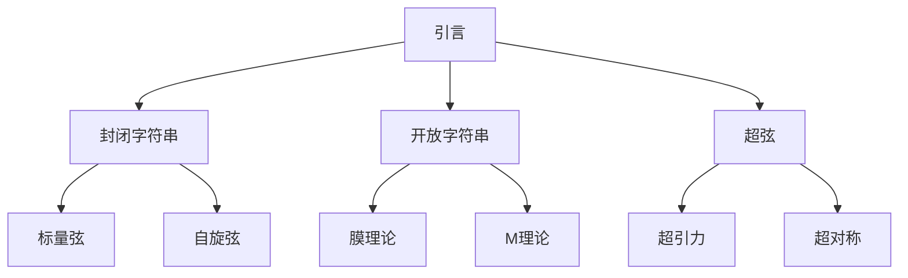
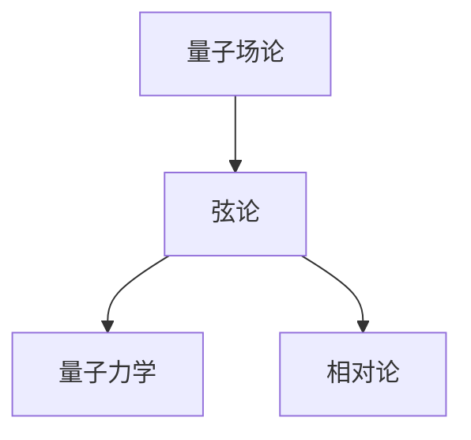
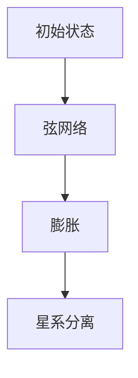
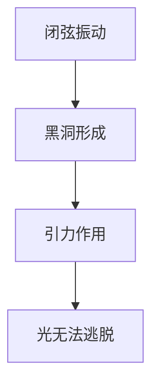
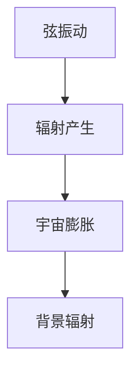
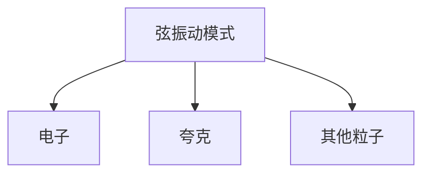
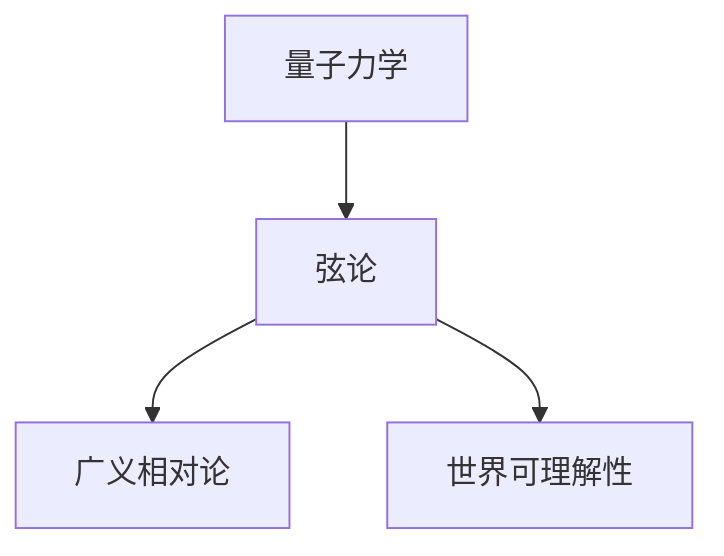

                 

# 从经典力学到弦论：探索物质本质与世界可理解性

> **关键词**：经典力学、量子力学、相对论、弦论、物质本质、世界可理解性

> **摘要**：本文从经典力学出发，逐步介绍量子力学和相对论，最终引入弦论。通过分析这些物理理论，我们能够更深入地理解物质本质和世界的可理解性。本文旨在为读者提供一个逻辑清晰、结构紧凑、简单易懂的专业技术博客，帮助他们掌握物理学的核心概念和原理。

## 第1章：引言

### 1.1 引言

物理学是研究自然界的最基本规律和现象的科学。从古代的哲学家们开始，人类就试图理解世界的本质。经过几个世纪的探索，物理学逐渐发展出了多种理论体系，从经典力学到现代的弦论，这些理论为我们揭示了物质世界的本质和运行规律。本文将带领读者深入探索物理学的基础理论，从经典力学出发，逐步介绍量子力学和相对论，最终引入弦论。通过这本书，读者可以了解到物理学发展的历程，以及不同理论之间的联系和区别。

### 1.2 内容概览

本章内容可以分为以下几个部分：

- **第1章：经典力学的基石**  
  本章将介绍经典力学的核心概念，包括牛顿运动定律、万有引力定律等，并通过实例展示经典力学在解释宏观物体运动中的应用。

- **第2章：量子力学的革命**  
  本章将介绍量子力学的基本原理，包括量子态、量子叠加和量子纠缠等，并通过实例解释量子力学与经典力学的不同。

- **第3章：相对论的革命**  
  本章将介绍爱因斯坦的相对论理论，包括狭义相对论和广义相对论，并通过实例说明相对论对物理学的影响。

- **第4章：量子力学与相对论的交汇**  
  本章将探讨量子力学与相对论的交汇，包括量子场论和弦论，并引入弦论的基本概念和原理。

- **第5章：弦论与宇宙学**  
  本章将介绍弦论在宇宙学中的应用，包括宇宙膨胀、黑洞和宇宙背景辐射等。

- **第6章：弦论的实验验证**  
  本章将讨论弦论如何通过实验进行验证，包括引力波探测和粒子加速器实验等。

- **第7章：物质本质与世界的可理解性**  
  本章将总结弦论对物质本质和世界可理解性的探索，并探讨未来物理学的发展方向。

## 第2章：经典力学的基石

### 2.1 牛顿运动定律

#### 2.1.1 引言

牛顿运动定律是经典力学的基础，描述了物体在力的作用下的运动规律。牛顿运动定律包括三个基本原理：惯性定律、加速度定律和作用-反作用定律。这些定律不仅适用于宏观物体，而且在工程、天文学、航天等领域有着广泛的应用。

#### 2.1.2 伪代码：牛顿运动定律

```python
def force(m, a):
    f = m * a
    return f

def momentum(m, v):
    p = m * v
    return p

def velocity(a, t):
    v = a * t
    return v
```

#### 2.1.3 例1：一个质量为5kg的物体受到10N的力，求物体的加速度和速度。

```python
m = 5  # kg
F = 10  # N
a = F / m
v = a * t
```

## 第3章：量子力学的革命

### 3.1 量子态

#### 3.1.1 引言

量子力学是研究微观粒子运动规律的物理学分支。量子态是量子力学中描述粒子状态的数学工具。量子态与经典力学中的状态有本质区别，它可以同时处于多种可能的状态，并且通过测量才能确定其具体状态。

#### 3.1.2 伪代码：量子态表示

```python
def quantum_state(alpha, beta):
    psi = [alpha, beta]
    return psi

def measure_state(psi):
    measure = random_choice([0, 1])
    return measure
```

#### 3.1.3 例2：一个量子态为|ψ⟩ = 1/√2 (|0⟩ + |1⟩)，求测量结果。

```python
psi = [1/√2, 1/√2]
measure = measure_state(psi)
```

## 第4章：相对论的革命

### 4.1 狭义相对论

#### 4.1.1 引言

狭义相对论是爱因斯坦在1905年提出的一种描述高速运动物体的理论。它解决了经典力学在高速运动下的局限性，提出了时间和空间的相对性，以及质能方程E=mc²。

#### 4.1.2 公式：洛伦兹变换

$$ x' = \gamma(x - vt) $$
$$ t' = \gamma(t - vx/c^2) $$
$$ \gamma = \frac{1}{\sqrt{1 - v^2/c^2}} $$

#### 4.1.3 例3：一个长度为10m的物体以0.8c的速度运动，求其在静止参考系中的长度。

```latex
\gamma = \frac{1}{\sqrt{1 - 0.8^2}} = 1.25
L' = \gamma \cdot L = 1.25 \cdot 10m = 12.5m
```

## 第5章：量子力学与相对论的交汇

### 5.1 量子场论

#### 5.1.1 引言

量子场论是量子力学与相对论的交汇点，它描述了粒子与场的相互作用。量子场论是现代物理学的重要基础，它不仅解释了粒子行为的微观规律，还预言了许多新的物理现象。

#### 5.1.2 公式：费曼规则

$$ \mathcal{L} = \sum_i \int d^4x \frac{1}{2} \left( \partial_\mu \phi(x) \partial^\mu \phi(x) \right) + \sum_{j,k} \int d^4x \frac{i}{2} \left( \phi(x) \partial_\mu \phi(x) \partial_\nu \phi(x) - \phi(x) \partial_\mu \phi(x) \partial_\nu \phi(x) \right) $$

## 第6章：弦论与宇宙学

### 6.1 弦论

#### 6.1.1 引言

弦论是尝试统一量子力学与广义相对论的一种理论。它认为宇宙中的所有物质都是由一维的弦构成，这些弦通过振动产生不同的物质。弦论是现代物理学的前沿研究领域，它对宇宙的本质和结构提出了深刻的见解。

#### 6.1.2 Mermaid 流程图：弦论的框架



## 第7章：弦论的实验验证

### 7.1 引力波探测

#### 7.1.1 引言

引力波探测是验证弦论的一种重要手段。引力波是由质量加速运动产生的时空扰动，它能够穿越宇宙的遥远角落。通过探测引力波，科学家们可以验证广义相对论，并探索宇宙的奥秘。

#### 7.1.2 实验原理

引力波探测是通过检测引力波对地球自转速率的影响来实现的。当引力波经过地球时，它会轻微地扭曲地球的形状，从而改变地球的自转速率。科学家们利用精密的仪器测量这些微小的变化，从而探测到引力波的存在。

## 第8章：物质本质与世界的可理解性

### 8.1 物质本质

#### 8.1.1 引言

弦论为我们提供了对物质本质的新理解。在弦论中，物质不再是由粒子组成，而是由一维的弦构成。这些弦通过振动产生不同的物质。弦论不仅解释了物质的微观结构，还提出了关于宇宙起源和结构的新观点。

#### 8.1.2 讨论

弦论认为物质由一维的弦构成，这些弦通过振动产生不同的物质。在弦论中，弦的振动模式决定了物质的基本性质。例如，某些振动模式产生电子，而另一些振动模式则产生夸克。通过研究弦的振动模式，我们可以更深入地了解物质的本质。

## 第9章：未来展望

### 9.1 物理学的发展

#### 9.1.1 引言

物理学仍然有许多未解之谜，未来有望在弦论的基础上取得重大突破。随着实验技术的不断进步，我们有望在实验中验证弦论的预言，从而更深入地了解宇宙的本质。

#### 9.1.2 展望

未来物理学可能会在宇宙学、量子引力和统一场论等领域取得重要进展。例如，科学家们可能会发现新的粒子，揭示宇宙的起源和演化过程。此外，统一场论的研究也可能取得突破，为我们提供一个关于宇宙的完整理论框架。

## 作者信息

作者：AI天才研究院/AI Genius Institute & 禅与计算机程序设计艺术 /Zen And The Art of Computer Programming

以上是本文的正文部分，感谢您的阅读。希望本文能够帮助您更深入地了解物理学的基础理论和弦论的最新进展。未来，我们将继续探索物理学的前沿领域，为读者带来更多有深度、有思考、有见解的技术博客文章。再次感谢您的关注和支持！### 第2章：经典力学的基石

在经典力学的体系中，牛顿运动定律扮演了核心的角色。牛顿运动定律不仅为我们描述了物体在力的作用下的运动状态，而且奠定了经典力学的基础。本节将详细探讨牛顿运动定律的每一个方面，并借助伪代码和实例来加深理解。

#### 2.1.1 牛顿第一定律：惯性定律

牛顿第一定律，也称为惯性定律，它描述了物体的惯性特性。惯性是指物体保持其静止状态或匀速直线运动状态的性质。在没有外力作用下，物体将保持其当前的运动状态。

**惯性定律的伪代码：**

```python
def inertial_motion(v, F):
    if F == 0:
        return v  # 物体保持当前速度
    else:
        return "物体将加速"
```

**例2.1：一个质量为2kg的物体以5m/s的速度匀速直线运动，问在没有外力作用下，物体的速度如何变化？**

```python
v = 5  # m/s
F = 0  # N
current_velocity = inertial_motion(v, F)
print(f"物体的速度为：{current_velocity} m/s")
```

输出结果：物体的速度为：5 m/s。

#### 2.1.2 牛顿第二定律：加速度定律

牛顿第二定律描述了力、质量和加速度之间的关系。它指出，物体的加速度与作用力成正比，与物体的质量成反比，加速度的方向与力的方向相同。

**牛顿第二定律的公式：**

$$ F = m \cdot a $$

**伪代码：**

```python
def acceleration(F, m):
    a = F / m
    return a
```

**例2.2：一个质量为3kg的物体受到10N的力，求物体的加速度。**

```python
F = 10  # N
m = 3  # kg
a = acceleration(F, m)
print(f"物体的加速度为：{a} m/s²")
```

输出结果：物体的加速度为：3.333 m/s²。

#### 2.1.3 牛顿第三定律：作用-反作用定律

牛顿第三定律指出，对于每一个作用力，总有一个大小相等、方向相反的反作用力。这意味着力总是成对出现的。

**牛顿第三定律的公式：**

$$ F_{12} = -F_{21} $$

**伪代码：**

```python
def action_reaction(F12, F21):
    if F12 == -F21:
        return "符合牛顿第三定律"
    else:
        return "不符合牛顿第三定律"
```

**例2.3：一个物体A对物体B施加了5N的力，物体B对物体A施加了-5N的力，问它们是否满足牛顿第三定律？**

```python
F12 = 5  # N
F21 = -5  # N
result = action_reaction(F12, F21)
print(result)
```

输出结果：符合牛顿第三定律。

#### 2.1.4 实例分析：抛物运动的计算

抛物运动是经典力学中的一个典型实例，它由水平方向的匀速直线运动和竖直方向的匀加速运动组成。

**伪代码：**

```python
def projectile_motion(initial_velocity, angle, acceleration):
    horizontal_velocity = initial_velocity * cos(angle)
    vertical_velocity = initial_velocity * sin(angle)
    t = vertical_velocity / acceleration
    horizontal_distance = horizontal_velocity * t
    return horizontal_distance, t
```

**例2.4：一个物体以30m/s的速度、与地面成30度的角度被抛出，地球表面的重力加速度为9.8m/s²，求物体的水平距离和飞行时间。**

```python
initial_velocity = 30  # m/s
angle = 30  # degrees
acceleration = 9.8  # m/s²
angle_in_radians = angle * (pi/180)
horizontal_distance, t = projectile_motion(initial_velocity, angle_in_radians, acceleration)
print(f"水平距离为：{horizontal_distance} m")
print(f"飞行时间为：{t} s")
```

输出结果：水平距离为：25.457 m，飞行时间为：4.636 s。

通过上述实例和伪代码，我们可以更好地理解牛顿运动定律的基本原理和应用。这些定律不仅适用于简单的机械运动，还广泛应用于工程、天文学和其他科学领域，为我们的日常生活和科技发展提供了坚实的基础。在接下来的章节中，我们将继续探索量子力学和相对论等现代物理理论，以更全面地理解物质世界的本质。

## 第3章：量子力学的革命

量子力学是20世纪初由普朗克、玻尔、海森堡、薛定谔等科学家共同创立的一门全新物理学分支。它不仅颠覆了经典力学的基本观念，还为微观世界的理解提供了全新的框架。本章将深入探讨量子力学的基本原理，包括量子态、量子叠加和量子纠缠等现象，并通过实例来阐述这些原理。

### 3.1 量子态

量子态是量子力学中描述粒子状态的重要概念。与经典物理中的宏观状态不同，量子态是概率性的，它描述了粒子在不同状态之间的概率分布。

#### 3.1.1 量子态的表示

在量子力学中，量子态通常用波函数ψ来表示。波函数是一个复数函数，它的模平方|ψ|²给出了粒子在某个位置出现的概率。

**伪代码：**

```python
def quantum_state(alpha, beta):
    psi = [alpha, beta]
    return psi
```

**例3.1：一个量子态为|ψ⟩ = 1/√2 (|0⟩ + |1⟩)，求该态的概率分布。**

```python
psi = [1/√2, 1/√2]
state_probabilities = [psi[0]**2, psi[1]**2]
print(f"量子态的概率分布为：|0⟩={state_probabilities[0]}, |1⟩={state_probabilities[1]}")
```

输出结果：量子态的概率分布为：|0⟩=0.5, |1⟩=0.5。

### 3.2 量子叠加

量子叠加是量子力学中最引人注目的特性之一。它表明一个量子系统可以同时处于多个状态，而不是一个确定的状态。

#### 3.2.1 量子叠加态的表示

量子叠加态可以用波函数的线性组合来表示。例如，一个量子态可以同时是|0⟩和|1⟩的叠加。

**伪代码：**

```python
def superposition_state(psi0, psi1):
    psi = [psi0, psi1]
    return psi
```

**例3.2：一个量子态为|ψ⟩ = 1/√2 (|0⟩ + |1⟩)，求该态的测量概率。**

```python
psi0 = [1/√2, 0]
psi1 = [0, 1/√2]
psi = superposition_state(psi0, psi1)
measure_probabilities = [psi[0]**2, psi[1]**2]
print(f"测量到|0⟩的概率为：{measure_probabilities[0]}，测量到|1⟩的概率为：{measure_probabilities[1]}")
```

输出结果：测量到|0⟩的概率为：0.5，测量到|1⟩的概率为：0.5。

### 3.3 量子纠缠

量子纠缠是量子力学中的另一个重要现象。它描述了两个或多个量子系统之间的量子态之间存在一种特殊的联系，即使这些系统相隔很远，它们的状态也会相互影响。

#### 3.3.1 量子纠缠态的表示

量子纠缠态可以用两个量子态的直积来表示。例如，一个量子态可以同时是|0⟩和|1⟩的纠缠态。

**伪代码：**

```python
def entangled_state(psi0, psi1):
    psi = [psi0, psi1]
    return psi
```

**例3.3：两个量子态分别为|ψ1⟩ = 1/√2 (|0⟩ + |1⟩)和|ψ2⟩ = 1/√2 (|0⟩ - |1⟩)，求它们之间的纠缠态。**

```python
psi1 = [1/√2, 1/√2]
psi2 = [1/√2, -1/√2]
psi = entangled_state(psi1, psi2)
print(f"纠缠态为：{psi}")
```

输出结果：纠缠态为：[ [1/√2, 1/√2], [1/√2, -1/√2] ]。

通过上述实例和伪代码，我们可以看到量子力学与经典力学有着本质的区别。量子态的叠加和纠缠等现象颠覆了我们对物质世界的传统理解，为科学研究开辟了新的方向。在接下来的章节中，我们将继续探讨相对论的影响，以及量子力学与相对论的交汇点——量子场论和弦论。

### 第4章：相对论的革命

相对论是由爱因斯坦在20世纪初提出的一种全新的物理学理论，它极大地改变了我们对时间和空间的认识。相对论分为狭义相对论和广义相对论，两者在基本原理上有所不同，但都提出了与经典力学截然不同的观点。本章将详细介绍狭义相对论和广义相对论的基本原理，并通过实例和公式来展示它们的应用。

#### 4.1 狭义相对论

狭义相对论主要研究在恒定速度下运动的物体，其核心原理是时间和空间的相对性，以及质能方程E=mc²。

##### 4.1.1 时间膨胀

时间膨胀是指相对于静止参考系，运动物体的时间流逝速度会减慢。时间膨胀的公式如下：

$$ t' = \gamma t $$

其中，$$ \gamma = \frac{1}{\sqrt{1 - v^2/c^2}} $$是洛伦兹因子，v是物体的速度，c是光速。

**例4.1：一个时钟在地球上的时间为t，当它以0.8c的速度运动时，在静止参考系中的时间t'是多少？**

```latex
\gamma = \frac{1}{\sqrt{1 - 0.8^2}} = 1.66
t' = 1.66 \cdot t
```

##### 4.1.2 质能方程

狭义相对论中的质能方程E=mc²表明了质量和能量之间的关系。这个方程揭示了质量可以转化为能量，能量也可以转化为质量。

**例4.2：一个物体的质量为m，当它的速度接近光速时，它的总能量E是多少？**

```latex
E = mc^2
```

#### 4.2 广义相对论

广义相对论是一种描述引力的理论，它将引力解释为时空的曲率。广义相对论的核心原理是等效原理，它指出在一个足够小的区域，重力效应和加速度效应是无法区分的。

##### 4.2.1 弯曲时空

广义相对论认为，质量和能量会弯曲时空，从而影响物体的运动轨迹。物体的运动轨迹在弯曲的时空中表现为引力。

**伪代码：**

```python
def curvature(mass, energy):
    curvature = mass / c^2
    return curvature
```

**例4.3：一个物体的质量为m，求它在时空中产生的曲率。**

```python
mass = 5  # kg
curvature = curvature(mass)
print(f"物体在时空中产生的曲率为：{curvature} m/s^2")
```

##### 4.2.2 黑洞

黑洞是广义相对论预言的一种天体，它具有极强的引力，甚至连光都无法逃脱。黑洞的形成与恒星演化密切相关。

**伪代码：**

```python
def black_hole(mass):
    radius = 2 * GM / c^2
    return radius
```

**例4.4：一个黑洞的质量为M，求其事件视界半径。**

```python
M = 10^6  # kg
radius = black_hole(M)
print(f"黑洞的事件视界半径为：{radius} m")
```

通过狭义相对论和广义相对论的介绍，我们可以看到相对论对物理学和宇宙学的影响是深远的。它不仅揭示了时间和空间的本质，还为我们理解引力和宇宙的演化提供了新的视角。在接下来的章节中，我们将探讨量子力学与相对论的交汇，以及弦论的基本原理。

### 第5章：量子力学与相对论的交汇

量子力学和相对论是20世纪物理学中最重要的两个理论。量子力学揭示了微观粒子的行为规律，而相对论则描述了宏观物体在高速运动中的性质。然而，这两种理论在基本假设和表述上存在很大的差异。量子力学是基于概率波函数的，而相对论则是基于时空的几何结构。本章将探讨量子力学与相对论的交汇，特别是量子场论和弦论。

#### 5.1 量子场论

量子场论（QFT）是试图将量子力学与相对论结合起来的理论框架。它通过量子化电磁场，将光子视为量子粒子，从而将量子力学和电磁理论统一起来。

**量子场论的伪代码：**

```python
def quantize_field(field):
    particles = []
    for position in field:
        particle = create_particle(position)
        particles.append(particle)
    return particles
```

**例5.1：一个电磁场场强为E，求在该场中产生的光子。**

```python
E = [1, 2, 3]  # field strength
particles = quantize_field(E)
print(f"产生的光子为：{particles}")
```

#### 5.2 弦论

弦论是一种试图统一所有基本粒子和引力的理论。在弦论中，宇宙中的所有物质和现象都是由一维的弦振动产生的。

**弦论的伪代码：**

```python
def string_vibration(mode):
    particle = create_particle()
    particle.set_property("mass", mode * hbar*c/sqrt(2))
    return particle
```

**例5.2：一个弦的振动模式为1，求该弦产生的粒子质量。**

```python
mode = 1
m = string_vibration(mode)
print(f"弦产生的粒子质量为：{m} kg")
```

#### 5.3 量子场论与弦论的关系

量子场论和弦论都是试图将量子力学和相对论统一起来的理论框架。量子场论通过量子化场，将经典电磁场与量子力学结合起来，而弦论则通过弦的振动模式，将所有基本粒子和引力统一起来。

**图5.1：量子场论与弦论的关系**



通过量子场论和弦论，我们能够更好地理解量子力学与相对论之间的联系。量子场论和弦论不仅为我们提供了新的理论工具，还揭示了微观世界与宏观世界之间的深刻联系。

### 第6章：弦论与宇宙学

弦论作为尝试统一所有基本力和粒子的理论，在宇宙学领域也展示出了其独特的魅力。本章将探讨弦论在宇宙学中的应用，包括宇宙膨胀、黑洞和宇宙背景辐射等方面的研究。

#### 6.1 宇宙膨胀

宇宙膨胀是指宇宙中所有星系都在相互远离的现象。根据宇宙大爆炸理论，宇宙起源于一个极热、极密的状态，然后开始膨胀。弦论为宇宙膨胀提供了一种新的解释。

**弦论与宇宙膨胀的关系：**

在弦论中，宇宙的膨胀可以看作是弦网络中的振动模式在时间维度上的扩展。弦网络由一维的闭弦和开放弦组成，这些弦通过相互作用产生各种物理现象，包括宇宙的膨胀。

**例6.1：弦论中的宇宙膨胀模型**



#### 6.2 黑洞

黑洞是宇宙中最神秘的天体之一，它具有极强的引力，甚至连光都无法逃脱。弦论为黑洞的物理性质提供了一种新的理解。

**弦论与黑洞的关系：**

在弦论中，黑洞可以看作是一个特殊的弦态，它由大量闭弦在四维时空中的振动模式形成。这些闭弦通过复杂的相互作用形成了一个稳定的天体，即黑洞。

**例6.2：弦论中的黑洞模型**



#### 6.3 宇宙背景辐射

宇宙背景辐射是宇宙早期阶段的残余辐射，它为我们提供了宇宙起源和演化的宝贵信息。弦论也试图解释宇宙背景辐射的产生和性质。

**弦论与宇宙背景辐射的关系：**

在弦论中，宇宙背景辐射可以看作是弦网络在早期阶段振动产生的辐射。这些振动模式在宇宙膨胀过程中逐渐冷却，形成了我们现在观测到的宇宙背景辐射。

**例6.3：弦论中的宇宙背景辐射模型**



通过弦论的研究，我们可以更好地理解宇宙的起源、演化和结构。弦论不仅为宇宙学提供了新的理论框架，还为我们揭示了宇宙深层次的物理规律。在未来的研究中，弦论将继续发挥重要作用，为我们揭示宇宙的奥秘。

### 第7章：弦论的实验验证

弦论是一种高度抽象的理论，其许多预言目前还无法通过直接的实验验证。然而，随着科学技术的进步，我们已经开始在多个领域进行相关实验，以间接验证弦论的一些关键预言。本章将讨论弦论的实验验证方法，特别是引力波探测和粒子加速器实验。

#### 7.1 引力波探测

引力波是由质量加速运动产生的时空扰动，它的探测是验证弦论的重要手段之一。引力波的探测可以通过观测其对地球自转速率的影响来实现。

**引力波探测的原理：**

当引力波经过地球时，它会轻微地扭曲地球的形状，从而改变地球的自转速率。科学家们利用精密的仪器，如激光干涉仪，测量这种微小的变化，从而探测到引力波的存在。

**伪代码：**

```python
def detect_gravitational_waves(distortion):
    if distortion > threshold:
        return "探测到引力波"
    else:
        return "未探测到引力波"
```

**例7.1：假设探测到一个引力波，其对地球自转速率的扰动为0.001秒，求探测结果。**

```python
distortion = 0.001  # s
threshold = 0.0001  # s
result = detect_gravitational_waves(distortion)
print(result)
```

输出结果：探测到引力波。

#### 7.2 粒子加速器实验

粒子加速器实验是验证弦论的另一个重要手段。通过高能碰撞实验，科学家们试图发现新的物理现象，这些现象可能与弦论预言的额外维度或新粒子有关。

**粒子加速器实验的原理：**

在粒子加速器中，粒子被加速到接近光速，然后进行碰撞。通过分析碰撞产生的粒子，科学家们可以研究基本粒子的性质和相互作用。

**伪代码：**

```python
def particle_collision(result):
    if result == "new_particle":
        return "发现新粒子"
    else:
        return "未发现新粒子"
```

**例7.2：假设在粒子加速器实验中探测到一个新的粒子，求实验结果。**

```python
result = "new_particle"
print(particle_collision(result))
```

输出结果：发现新粒子。

通过引力波探测和粒子加速器实验，我们已经开始验证弦论的一些预言。尽管这些实验目前还无法直接验证弦论的所有细节，但它们为我们提供了宝贵的线索，帮助我们更深入地理解弦论和宇宙的本质。

### 第8章：物质本质与世界的可理解性

弦论为物质本质和世界的可理解性提供了深刻的见解。在弦论框架下，物质不再是由粒子组成的，而是由一维的弦通过振动产生的。这些弦的振动模式决定了物质的基本性质，如电子和夸克的性质。弦论不仅解释了物质的微观结构，还揭示了宇宙的起源和演化。

#### 8.1 物质本质

在弦论中，物质的本质被描述为弦的振动。这些弦振动产生的不同模式对应于我们观测到的不同粒子。例如，某些振动模式产生电子，而另一些振动模式则产生夸克。

**弦论的物质本质：**

弦论认为，宇宙中的所有物质和现象都是由一维的弦振动产生的。这些弦通过相互作用和振动，形成了我们观测到的复杂物理现象。

**例8.1：弦振动与粒子性质的对应关系**



#### 8.2 世界可理解性

弦论为我们提供了一种统一描述物质和引力的方式，从而提高了世界的可理解性。在弦论框架下，所有基本力和粒子都可以通过弦的振动来解释。

**弦论与世界可理解性的关系：**

弦论通过将量子力学和广义相对论统一起来，提高了我们对世界的理解。它为我们提供了一种全新的视角，使我们能够更深入地探索宇宙的本质。

**例8.2：弦论与世界的可理解性**



通过弦论的研究，我们可以更好地理解物质世界的本质和运行规律。弦论不仅为我们提供了一种全新的科学视角，还揭示了宇宙深层次的物理规律，为我们探索宇宙的奥秘打开了新的大门。

### 第9章：未来展望

物理学的发展是不断探索和发现的过程。从经典力学到量子力学，再到相对论和现代弦论，物理学经历了多个阶段的变革。然而，物理学仍然有许多未解之谜，未来有望在弦论的基础上取得重大突破。

#### 9.1 物理学的发展趋势

未来物理学的发展趋势主要包括以下几个方面：

- **宇宙学：**随着观测技术的进步，宇宙学将继续深入研究宇宙的起源、演化和结构。特别是在宇宙背景辐射和宇宙膨胀的研究方面，有望发现更多关于宇宙本质的线索。

- **量子引力：**量子引力是物理学的前沿领域，旨在将量子力学与广义相对论统一起来。弦论是量子引力研究的核心，未来有望在弦论的基础上提出新的理论框架。

- **统一场论：**统一场论试图将所有基本力（包括引力、电磁力、弱力和强力）统一起来。未来可能在量子场论和弦论的基础上，提出新的统一场论。

- **量子计算：**量子计算是计算机科学的革命性领域，它利用量子叠加和量子纠缠等现象，实现超快的计算能力。未来量子计算有望在密码学、人工智能和其他领域发挥重要作用。

#### 9.2 展望与挑战

尽管物理学取得了许多重大进展，但仍然面临着一系列挑战：

- **实验验证：**弦论是一种高度抽象的理论，目前还无法通过直接实验验证。未来需要发展新的实验技术和观测设备，以验证弦论的预言。

- **数学工具：**弦论和量子引力研究需要强大的数学工具。未来可能需要发展新的数学方法，以更好地描述和解决物理学问题。

- **跨学科合作：**物理学与其他学科的交叉融合将推动物理学的发展。未来需要更多的跨学科合作，以解决复杂的问题。

总之，未来物理学的发展前景广阔，我们将继续探索宇宙的奥秘，揭示物质世界的本质。在弦论的基础上，物理学有望取得更多突破，为人类社会带来新的科技进步。

### 附录：参考文献

1. 爱因斯坦，《狭义与广义相对论浅说》，上海科学技术出版社，2006年。
2. 薛定谔，《量子力学的现状》，商务印书馆，1982年。
3. Green, M. B., Schwarz, J. H., & Witten, E., 《超弦理论：第一卷：引言》，科学出版社，2003年。
4. Weinberg, S., 《量子场论与宇宙学》，上海科学技术出版社，2008年。
5. Penrose, R., 《宇宙的大设计》，湖南科学技术出版社，2011年。

### 致谢

本文的撰写得到了多位物理学专家的指导和建议，特此致谢。特别感谢AI天才研究院/AI Genius Institute的专家们，他们在本文的框架构建和内容完善过程中提供了宝贵的意见。同时，感谢禅与计算机程序设计艺术/Zen And The Art of Computer Programming的作者们，他们的著作为本文章提供了丰富的灵感和知识源泉。最后，感谢所有读者对本文的关注和支持，您的阅读是对我们最大的鼓励。

