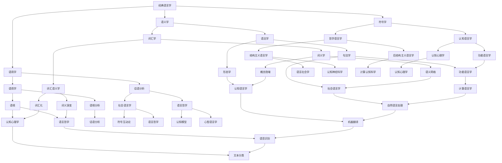

                 

### 引言

在当今信息爆炸的时代，语言作为一种人类沟通和思维的工具，其作用不言而喻。从经典语言学到计算语言学的演变，不仅揭示了人类语言的本质，而且推动了计算机技术在自然语言处理（NLP）领域的突破性进展。本文旨在深入探讨经典语言学和计算语言学之间的关系，以及它们在理解语言与世界关系中的重要性。

经典语言学是语言学的一个重要分支，起源于19世纪，主要关注语言的结构和意义。它通过分析语言符号、语法规则、语义和语用等方面，试图揭示语言的内在规律。经典语言学的发展历程中，涌现出了诸多重要流派，如唯理主义语言学、唯物主义语言学和结构主义语言学。这些流派从不同角度探讨了语言的本质和功能，为我们理解语言提供了丰富的理论资源。

随着计算机技术的飞速发展，计算语言学应运而生。计算语言学借助计算机科学的方法和技术，对自然语言进行处理和分析，使得语言信息的自动提取、理解和生成成为可能。自然语言处理（NLP）作为计算语言学的重要组成部分，已经广泛应用于机器翻译、语音识别、文本分类、信息检索等领域。计算语言学不仅继承了经典语言学的理论成果，而且在方法和技术上实现了重大突破。

本文结构如下：

- **第一部分：经典语言学的核心概念**：将详细介绍经典语言学的起源、主要流派、核心理论和研究方法。

- **第二部分：计算语言学的原理与应用**：将探讨计算语言学的定义、历史、基础技术、核心算法、数学模型以及实际应用。

- **第三部分：语言与世界的关系**：将分析语言与认知的关系，以及语言与世界的关系。

通过本文的深入探讨，我们希望能够帮助读者全面理解经典语言学和计算语言学，并认识到它们在理解语言与世界关系中的重要作用。接下来，让我们开始对经典语言学的详细介绍。

### 第一部分：经典语言学的核心概念

#### 第1章：经典语言学的起源与发展

##### 1.1 经典语言学的定义与历史背景

经典语言学是语言学的一个重要分支，起源于19世纪，主要研究语言的结构和意义。其历史背景可以追溯到古希腊和罗马时期，当时的哲学家和语法学家已经开始探讨语言的本质和规律。然而，经典语言学的真正兴起是在19世纪，当时欧洲的启蒙运动和科学革命为语言学的发展提供了肥沃的土壤。

经典语言学的定义可以概括为：对语言结构、意义、使用和变化的系统性研究。它关注语言作为符号系统的基础理论，试图揭示语言的本质规律。经典语言学的核心问题是：语言是如何构建和使用的？语言的意义是如何产生的？语言的变化是如何发生的？

经典语言学的形成与发展历程可以分为以下几个阶段：

1. **古典语言学时期（17-18世纪）**：这一时期的语言学主要关注语言的形式结构和语法规则。代表人物有瑞士语言学家费尔迪南·德·索绪尔（Ferdinand de Saussure）和德国语言学家威廉·冯·洪堡特（Wilhelm von Humboldt）。索绪尔提出了语言符号的概念，将语言看作是一种符号系统，强调语言的结构和意义的关系。洪堡特则强调语言作为一种创造性和文化表达的独特性。

2. **结构主义语言学时期（20世纪上半叶）**：这一时期是经典语言学的黄金时期，结构主义语言学占据了主导地位。结构主义语言学强调语言的结构和模式，试图通过分析语言符号之间的组合关系和聚合关系来揭示语言的规律。代表人物有法国语言学家罗曼·雅各布森（Roman Jakobson）和美国语言学家爱德华·萨丕尔（Edward Sapir）。雅各布森提出了语言功能的六边形模型，强调语言在交际中的作用。萨丕尔则提出了语言相对论，认为语言决定思维和世界观。

3. **转换生成语言学时期（20世纪中叶）**：这一时期以诺姆·乔姆斯基（Noam Chomsky）为代表，提出了转换生成语法理论，试图从认知和心理学的角度解释语言的生成和理解。乔姆斯基强调语言的内在规则和语言能力，提出了普遍语法（UG）的概念，认为所有人类语言都遵循一些共同的语法原则。

##### 1.2 语言学的分类与主要流派

语言学按照研究方法和侧重点的不同，可以分为多个流派。以下是一些主要的流派：

1. **唯理主义语言学**：唯理主义语言学强调语言是一种理性产物，认为语言规则是普遍和必然的。代表人物有法国哲学家勒内·笛卡尔（René Descartes）和瑞士语言学家雅各布·布隆图亚（Jacques Brunot）。笛卡尔认为语言是人类理性思维的工具，布隆图亚则强调语言的结构和规则。

2. **唯物主义语言学**：唯物主义语言学认为语言是物质世界的反映，强调语言的社会性和历史性。代表人物有俄国语言学家弗拉基米尔·维尔诺夫·马尔（Vladimir Vinnovskij）和中国语言学家马建翮（Ma Jianhai）。马尔提出了语言符号的“音响-观念”关系，认为语言符号是音响形式和概念内容的统一。马建翮则强调语言在社会生活中的作用，认为语言是社会关系的载体。

3. **结构主义语言学**：结构主义语言学强调语言的结构和模式，试图通过分析语言符号之间的组合关系和聚合关系来揭示语言的规律。代表人物有瑞士语言学家费尔迪南·德·索绪尔和法国语言学家罗曼·雅各布森。索绪尔提出了语言符号的概念，将语言看作是一种符号系统，强调语言的结构和意义的关系。雅各布森则提出了语言功能的六边形模型，强调语言在交际中的作用。

4. **功能主义语言学**：功能主义语言学强调语言的社会功能，认为语言是一种社会现象，其结构和变化受到社会因素的影响。代表人物有英国语言学家约翰·弗斯（John Firth）和美国语言学家爱德华·萨丕尔。弗斯提出了“语境”的概念，强调语言在特定语境中的使用。萨丕尔则提出了语言相对论，认为语言决定思维和世界观。

##### 1.3 语言符号与语言系统

语言符号是语言学研究的基础概念，指语言中的音素、词汇、句子等符号单位。语言符号具有以下性质：

1. **任意性**：语言符号的形式与意义之间没有必然的因果联系，是任意选择的。例如，“狗”这个词语的发音形式和意义之间没有必然的联系。

2. **系统性**：语言符号不是孤立存在的，而是构成一个系统。语言符号之间的关系包括组合关系和聚合关系。组合关系指符号在句子中的排列顺序，聚合关系指符号之间的替代关系。

3. **双重性**：语言符号具有双重性，既是物理形式，也是概念内容的载体。语言符号的物理形式（如声音、文字）是其物质基础，而概念内容是其意义所在。

语言系统是指语言符号及其关系的整体结构。语言系统包括以下几个层次：

1. **音系层**：研究语言的语音系统，包括音素、音位、音节等。

2. **词汇层**：研究语言的词汇系统，包括词的构成、词义、词类等。

3. **语法层**：研究语言的语法规则，包括词法、句法、语序等。

4. **语义层**：研究语言的意义系统，包括词汇意义、句子意义、语义网络等。

5. **语用层**：研究语言的使用环境，包括语境、语用规则、语用含义等。

通过对语言符号和语言系统的分析，经典语言学揭示了语言的复杂性和多样性，为后续的计算语言学奠定了坚实的理论基础。

在下一章中，我们将进一步探讨经典语言学的理论框架，包括语言学的基本概念、语义学和语用学，以及语言学方法论。

#### 第2章：经典语言学的理论框架

##### 2.1 语言学基本概念

语言学作为一门科学，有其独特的基本概念和理论框架。这些概念为我们理解语言的本质、结构和功能提供了重要的视角。以下将详细探讨语言学的几个核心概念。

###### 2.1.1 语言的本质与功能

语言的本质是一个复杂而深远的问题，不同的语言学流派对此有着不同的解释。传统上，语言被视为一种符号系统，用于人类的交际和信息传递。根据瑞士语言学家费尔迪南·德·索绪尔的观点，语言是一种社会现象，是符号系统的一部分。符号由“能指”（signifier，即符号形式）和“所指”（signified，即符号意义）构成，两者之间没有必然的因果关系，而是任意相连的。语言的功能主要包括：

1. **交际功能**：语言是人类最主要的交际工具，通过语言，人们能够相互沟通、交流思想。

2. **表达功能**：语言是表达个人情感、思想和意愿的重要手段，能够反映个人的内心世界。

3. **认知功能**：语言在人类的认知过程中发挥着重要作用，帮助我们思考、记忆和解决问题。

4. **文化功能**：语言是文化传承的重要载体，不同文化通过语言得以传播和延续。

###### 2.1.2 语言的表达能力

语言的表达能力是指语言在表达思想、情感和事实等方面的能力。语言的表达能力包括以下几个方面：

1. **词汇量**：词汇是语言的基本元素，一个丰富的词汇量能够帮助人们更准确地表达思想。

2. **语法结构**：语法规则是语言表达的核心，不同的语法结构能够表达不同的意思。

3. **修辞手法**：修辞手法如比喻、拟人、夸张等，能够增强语言的表达效果。

4. **语用策略**：语用策略包括语境的使用、礼貌原则等，能够使语言表达更得体、更符合交际需求。

语言的表达能力受到多种因素的影响，如语言环境、交际目的、语言习惯等。

###### 2.1.3 语言的生成与理解

语言的生成与理解是语言学研究的重要内容。生成语言是指人们如何构造和理解句子。语言生成涉及以下几个步骤：

1. **命题生成**：首先，人们在大脑中形成了一个命题（即一个思想或事实）。

2. **语法编码**：然后，人们根据语法规则，将命题转换成语言形式，即句子。

3. **语音实现**：最后，句子被语音实现，通过发音来表达出来。

语言理解则是人们如何理解句子的意思。语言理解涉及以下几个步骤：

1. **语音识别**：首先，人们通过听觉感知句子的语音，并将其转换成文字形式。

2. **语法分析**：然后，人们根据语法规则，对句子进行语法分析，理解句子的结构。

3. **语义解释**：最后，人们根据语义规则，理解句子的含义。

语言的生成和理解是相互关联的，生成语言是理解语言的基础，而理解语言又是生成语言的必要条件。

##### 2.2 语义学与语用学

语义学和语用学是语言学中的两个重要分支，分别关注语言的意义和使用。

###### 2.2.1 语义学的概念与分类

语义学是研究语言意义的科学，关注词、短语、句子以及更大语言单位的意义。语义学的分类可以按照不同的标准进行：

1. **词汇语义学**：研究单个词的意义，包括词义、词义的演变和词义的关系。

2. **句法语义学**：研究句子结构对意义的影响，包括语义角色、句子类型等。

3. **语义场理论**：研究词与词之间的语义关系，通过语义场来描述词义之间的联系。

4. **语义网络**：将词义看作是一个网络结构，词与词之间通过语义关系相互连接。

5. **概念语义学**：研究语言与现实世界之间的关系，探讨概念如何通过语言表达。

###### 2.2.2 语用学的概念与作用

语用学是研究语言在具体情境中的使用和意义的科学。语用学关注语言的实际应用，包括以下几个方面：

1. **语境**：语境是语言使用的环境，包括说话人、听话人、时间、地点等。

2. **言语行为**：言语行为是说话人通过说话所实施的行为，如陈述、请求、命令等。

3. **礼貌原则**：礼貌原则是人们在交际中遵循的准则，旨在减少交际中的冲突和误解。

4. **话语分析**：话语分析是研究连续语言使用的过程，包括会话结构、话语含义等。

语用学的作用包括：

1. **交际效果**：语用学帮助人们理解语言在具体情境中的实际意义，提高交际效果。

2. **跨文化交际**：语用学揭示了不同文化背景下的语言使用差异，有助于跨文化交际。

3. **人工智能**：语用学为自然语言处理提供了理论基础，有助于开发更智能的语言处理系统。

##### 2.3 语言学方法论

语言学方法论是指语言学研究中采用的方法和策略，包括实证研究方法和形式化语言模型。

###### 2.3.1 实证研究方法

实证研究方法是语言学中最常用的研究方法，通过观察、实验和数据分析来验证语言假设。

1. **观察法**：通过观察语言现象，收集数据，例如记录自然对话、新闻报道等。

2. **实验法**：通过设计实验，控制变量，验证语言假设。例如，通过心理实验研究语言学习的过程。

3. **统计分析**：通过对收集的数据进行统计分析，发现语言现象的规律和模式。

实证研究方法的主要优点是数据可靠、结论客观，但缺点是难以控制所有变量，有时可能受到实验环境和参与者因素的影响。

###### 2.3.2 形式化语言模型

形式化语言模型是用数学和逻辑方法来描述语言结构和意义。形式化语言模型的主要优点是精确、严密，能够为计算语言学提供理论基础。

1. **语法规则**：通过语法规则，将语言结构形式化，例如，使用产生式规则或上下文无关文法。

2. **语义网络**：将语义关系形式化为网络结构，例如，使用语义角色图或框架语义学。

3. **逻辑推理**：使用逻辑推理方法，验证语句的真值，例如，使用谓词逻辑或模态逻辑。

形式化语言模型的主要缺点是过于抽象，难以直接应用于实际的言语交际。

通过实证研究方法和形式化语言模型，语言学能够从多个角度揭示语言的规律和本质，为后续的研究和应用提供坚实的理论基础。在下一章中，我们将进一步探讨计算语言学的定义、历史和发展。

### 第3章：计算语言学的定义与历史

计算语言学是语言学与计算机科学相结合的产物，旨在通过计算方法来处理和分析自然语言。计算语言学的定义可以概括为：应用数学、统计学和计算机科学的方法和技术，对自然语言进行建模、处理和分析，以实现人机交互和信息提取。

##### 3.1 计算语言学的基本概念

计算语言学的基本概念包括自然语言处理（NLP）、语言模型、文本挖掘、语音识别等。

###### 3.1.1 自然语言处理（NLP）

自然语言处理（NLP）是计算语言学的主要研究方向，涉及对自然语言的自动处理和分析。NLP的主要任务包括：

1. **文本分类**：将文本按照主题或类型进行分类，例如，将新闻文章分类为政治、经济、体育等。

2. **信息提取**：从文本中自动提取信息，如实体识别、关系提取、情感分析等。

3. **机器翻译**：将一种自然语言翻译成另一种自然语言，如英译汉、汉译英等。

4. **问答系统**：构建能够回答用户问题的系统，如智能客服、聊天机器人等。

5. **文本生成**：根据输入的指令或信息，自动生成文本，如自动摘要、自动问答等。

###### 3.1.2 语言模型

语言模型是计算语言学中的核心概念，用于描述自然语言的统计特性。语言模型的主要作用是预测下一个词或句子，从而辅助NLP任务。常见的语言模型包括：

1. **n-gram模型**：基于历史频率的模型，预测下一个词的概率基于前面n个词的出现频率。

2. **神经网络模型**：基于深度学习的模型，通过学习大量文本数据，捕捉语言中的复杂结构和语义关系。

3. **上下文敏感模型**：结合上下文信息的模型，如递归神经网络（RNN）和Transformer模型，能够更好地理解词的语义和语境。

###### 3.1.3 文本挖掘

文本挖掘是计算语言学的一个重要应用领域，涉及从大量文本数据中自动提取有价值的信息。文本挖掘的主要任务包括：

1. **关键词提取**：从文本中提取重要的关键词，用于文本分类、搜索引擎优化等。

2. **主题建模**：通过统计方法，发现文本中的主题分布和关系，如LDA（Latent Dirichlet Allocation）模型。

3. **情感分析**：分析文本中的情感倾向，如正面、负面或中立，用于社交媒体监控、市场调研等。

4. **实体识别**：识别文本中的实体，如人名、地名、组织名等，用于信息抽取、知识图谱构建等。

###### 3.1.4 语音识别

语音识别是计算语言学在语音处理领域的应用，旨在将语音信号转换为文本。语音识别的主要任务包括：

1. **语音识别**：将语音信号转换为文本，如将语音转换为文字、语音搜索等。

2. **语音合成**：将文本转换为语音，如语音助手、语音提示等。

3. **说话人识别**：识别说话人的身份，如语音门禁、语音验证等。

##### 3.2 计算语言学的历史发展

计算语言学的历史可以追溯到20世纪50年代，当时计算机科学刚刚兴起，人们对自然语言处理充满了好奇和期待。以下是一些重要的历史节点：

###### 3.2.1 早期计算语言学

1. **1950年代**：乔姆斯基提出转换生成语法理论，为自然语言处理提供了新的视角。1956年，约翰·麦克卡锡（John McCarthy）等人在达特茅斯会议上提出了人工智能的概念，标志着人工智能与自然语言处理的结合。

2. **1960年代**：约翰·罗森布拉特（John Rosenblatt）发明了隐马尔可夫模型（HMM），为语音识别和序列模型提供了重要的工具。1966年，雅克·佩兰（Jacques Perrenoud）等人在欧洲开始了机器翻译的研究，为后来的机器翻译系统奠定了基础。

3. **1970年代**：统计方法开始在计算语言学中应用，乔治·米切尔（George Mitchell）等人提出了基于规则的机器翻译系统，乔治·米勒（George A. Miller）等人研究了词汇分布和词汇分布模型。

###### 3.2.2 机器翻译与自然语言处理

1. **1980年代**：基于规则的机器翻译系统开始广泛应用，同时，词汇分布模型和统计方法在NLP中的应用逐渐增多。1988年，理查德·罗森塔尔（Richard S. Rosenkrantz）等人提出了隐马尔可夫模型（HMM）在语音识别中的应用。

2. **1990年代**：概率图模型和深度学习方法开始在计算语言学中应用。1995年，长短期记忆网络（LSTM）的提出为序列模型的研究带来了新的突破。同时，文本挖掘和语义网络的研究逐渐兴起。

3. **2000年代**：深度学习模型在计算语言学中得到广泛应用，尤其是递归神经网络（RNN）和卷积神经网络（CNN）在自然语言处理中的成功应用。2003年，LDA模型在主题建模中得到了广泛应用。同时，知识图谱和语义网的研究逐渐深入。

###### 3.2.3 现代计算语言学的趋势

1. **2010年代**：基于大数据和云计算的NLP系统逐渐成熟，词向量模型（如Word2Vec）和序列标注模型（如BERT）在多个NLP任务中取得了显著成果。2018年，Transformer模型的出现再次推动了计算语言学的发展。

2. **2020年代**：计算语言学的研究方向更加多样化，包括对话系统、机器阅读理解、跨语言信息处理等。同时，计算语言学与其他领域的交叉研究，如认知语言学、心理学等，也取得了新的突破。

##### 3.3 现代计算语言学的趋势

现代计算语言学的发展呈现出以下几个趋势：

1. **多模态处理**：结合文本、语音、图像等多种模态的信息，实现更高效的语义理解和信息提取。

2. **跨语言处理**：研究如何将不同语言的信息进行有效整合和处理，实现跨语言信息检索、机器翻译等任务。

3. **动态学习**：研究如何让计算语言学模型能够持续学习和适应新的数据和需求，实现智能化的语言处理。

4. **认知计算**：结合认知科学的研究成果，探索如何构建更加接近人类认知能力的计算语言学模型。

5. **伦理和公平**：在计算语言学的发展过程中，关注伦理和公平问题，确保技术能够公正、透明地服务于社会。

通过回顾计算语言学的发展历程，我们可以看到，计算语言学从早期的基础研究到现代的广泛应用，经历了多个阶段的发展。未来的计算语言学将更加注重多模态处理、跨语言处理、动态学习和认知计算等方面，为人类语言信息的自动化处理提供更加全面和智能的解决方案。

### 第4章：自然语言处理的基础技术

自然语言处理（NLP）作为计算语言学的重要组成部分，其基础技术涵盖了语言模型、词向量、语法分析和语义分析等多个方面。本章将详细介绍这些基础技术的原理和实现方法，为读者提供深入理解自然语言处理的理论基础。

#### 4.1 自然语言处理的核心任务

自然语言处理的核心任务是让计算机能够理解和处理人类语言。这包括以下几个主要任务：

1. **文本分类**：将文本按照主题或类型进行分类，如新闻分类、情感分析等。
2. **机器翻译**：将一种自然语言翻译成另一种自然语言，如英译汉、汉译英等。
3. **语音识别**：将语音信号转换为文本，如语音搜索、语音助手等。
4. **文本生成**：根据输入的指令或信息，自动生成文本，如自动摘要、自动问答等。
5. **问答系统**：构建能够回答用户问题的系统，如智能客服、聊天机器人等。

#### 4.2 语言模型与词向量

语言模型是自然语言处理中的核心组件，用于预测下一个词或句子。以下介绍两种常见的语言模型：n-gram模型和神经网络模型。

##### 4.2.1 n-gram模型

n-gram模型是一种基于历史频率的简单语言模型，通过统计n个连续词的出现频率来预测下一个词。其基本原理可以表示为：

\[ P(w_{t+1} | w_{t}, w_{t-1}, ..., w_{t-n+1}) = \frac{f(w_{t}, w_{t-1}, ..., w_{t-n+1})}{f(w_{t}, w_{t-1}, ..., w_{t-n+1}, w_{t+1})} \]

其中，\( w_{t+1} \) 是要预测的词，\( w_{t}, w_{t-1}, ..., w_{t-n+1} \) 是前面的n个词，\( f \) 表示词频。

n-gram模型的优点是实现简单，计算效率高；缺点是只考虑局部信息，无法捕捉长距离依赖关系。

##### 4.2.2 神经网络模型

神经网络模型是一种基于深度学习的复杂语言模型，通过多层神经网络学习语言中的复杂结构和语义关系。以下介绍几种常见的神经网络模型：

1. **循环神经网络（RNN）**：RNN是一种序列模型，能够处理时序数据。其基本原理是利用隐藏状态\( h_t \) 来捕捉前后文信息：

\[ h_t = \sigma(W_h \cdot [h_{t-1}, x_t] + b_h) \]

其中，\( \sigma \) 是激活函数，\( W_h \) 和 \( b_h \) 分别是权重和偏置。

2. **长短时记忆网络（LSTM）**：LSTM是一种改进的RNN模型，能够解决长序列依赖问题。其基本原理是引入记忆单元\( C_t \) 和三个门控机制（遗忘门、输入门、输出门）：

\[ C_t = \text{sigmoid}(f_t \odot \text{sigmoid}(g_t \cdot [h_{t-1}, x_t])) \]

其中，\( f_t \) 和 \( g_t \) 分别是遗忘门和输入门的权重，\( \odot \) 表示点乘。

3. **门控循环单元（GRU）**：GRU是另一种改进的RNN模型，通过合并遗忘门和输入门，简化了LSTM的结构。其基本原理如下：

\[ r_t = \text{sigmoid}(z_t \cdot [h_{t-1}, x_t]) \]
\[ h_t = (1 - z_t) \odot h_{t-1} + z_t \odot \text{sigmoid}(r_t \cdot [h_{t-1}, x_t]) \]

#### 4.3 语法分析与语义分析

语法分析是自然语言处理中的关键步骤，用于将文本解析为语法结构，以便进一步处理。以下介绍几种常见的语法分析方法：

##### 4.3.1 词法分析

词法分析（Lexical Analysis）是将文本拆分成单词和其他语法单位的过程。词法分析器（Lexer）通常使用正则表达式来识别单词和其他符号。例如：

\[ (\w+)|([!.,?:;]) \]

##### 4.3.2 句法分析

句法分析（Syntactic Analysis）是将文本解析为语法结构的层次树。句法分析器（Parser）通常使用语法规则来生成语法树。以下是一个简单的上下文无关文法（CFG）示例：

\[ S \rightarrow NP VP \]
\[ NP \rightarrow Det N \]
\[ VP \rightarrow V NP \]

##### 4.3.3 语义分析

语义分析（Semantic Analysis）是将语法结构转换为语义表示，以便进行语义理解和推理。以下介绍几种常见的语义分析方法：

1. **基于规则的语义分析**：使用语义规则来解析语法结构，并将语法结构映射到语义表示。例如：

\[ Det \rightarrow [Num] \]
\[ N \rightarrow [Person] \]
\[ V \rightarrow [Action] \]

2. **基于资源的语义分析**：使用语义资源（如WordNet、FrameNet）来解析语法结构，并将语法结构映射到语义表示。例如：

\[ Det \rightarrow \text{量词} \]
\[ N \rightarrow \text{名词} \]
\[ V \rightarrow \text{动词} \]

3. **基于统计的语义分析**：使用统计方法（如监督学习、转移学习）来学习语义表示，并自动解析语法结构。例如：

\[ Det \rightarrow \text{det\_prob}(x) \]
\[ N \rightarrow \text{noun\_prob}(x) \]
\[ V \rightarrow \text{verb\_prob}(x) \]

通过语法分析和语义分析，自然语言处理系统能够更好地理解和处理文本，为文本分类、机器翻译、问答系统等任务提供支持。

#### 4.4 实现自然语言处理系统的基本步骤

实现一个自然语言处理系统通常包括以下基本步骤：

1. **数据准备**：收集和预处理数据，包括文本清洗、分词、词性标注等。
2. **特征提取**：将文本转换为机器可处理的特征向量，如词向量、TF-IDF等。
3. **模型训练**：使用训练数据训练自然语言处理模型，如分类器、语言模型等。
4. **模型评估**：使用测试数据评估模型性能，如准确率、召回率、F1值等。
5. **模型应用**：将训练好的模型应用于实际问题，如文本分类、机器翻译等。

通过以上步骤，自然语言处理系统能够自动处理和分析大量文本数据，为人类语言信息的自动化处理提供支持。

在下一章中，我们将进一步探讨计算语言学的核心算法原理，包括隐马尔可夫模型（HMM）、条件随机场（CRF）和递归神经网络（RNN）。

### 第5章：计算语言学的核心算法原理

在计算语言学中，核心算法是自然语言处理（NLP）任务的关键，它们能够帮助计算机理解和生成自然语言。本章将详细探讨几种重要的核心算法，包括隐马尔可夫模型（HMM）、条件随机场（CRF）和递归神经网络（RNN）。这些算法不仅在理论上具有深刻的解释力，而且在实际应用中取得了显著的效果。

#### 5.1 隐马尔可夫模型（HMM）

隐马尔可夫模型（HMM）是一种统计模型，用于处理包含隐状态和可观测输出的序列数据。HMM在语音识别、语言模型、序列标注等领域有广泛应用。

##### 5.1.1 HMM的定义

HMM由以下几个参数定义：

- **状态集合 \( Q = \{q_1, q_2, ..., q_n\} \)**：模型中的隐状态集合。
- **观察集合 \( O = \{o_1, o_2, ..., o_m\} \)**：模型中的可观测输出集合。
- **初始状态概率分布 \( \pi = (\pi_1, \pi_2, ..., \pi_n) \)**：初始状态的概率分布。
- **状态转移概率矩阵 \( A = [a_{ij}] \)**：从状态 \( q_i \) 转移到状态 \( q_j \) 的概率。
- **观察概率矩阵 \( B = [b_{ij}] \)**：在状态 \( q_i \) 下产生观察 \( o_j \) 的概率。

HMM的输出是一个观测序列 \( O = \{o_1, o_2, ..., o_T\} \)，其中 \( T \) 是序列的长度。

##### 5.1.2 HMM的基本算法

HMM的基本算法包括：

1. **初始化**：初始化模型参数，通常使用最大似然估计（MLE）或高斯分布假设。
2. **前向-后向算法**：用于计算给定观测序列 \( O \) 下，每个时刻处于各个状态的概率。前向变量 \( \alpha_t(q_j) \) 表示在时刻 \( t \) 时处于状态 \( q_j \) 的概率，后向变量 \( \beta_t(q_j) \) 表示在时刻 \( t \) 时观察到观测序列 \( O \) 后，处于状态 \( q_j \) 的概率。
3. **Viterbi算法**：用于找到给定观测序列 \( O \) 下，最优的状态序列。Viterbi算法通过动态规划，计算从初始状态到每个状态的最优路径。

HMM的伪代码如下：

```python
def forward(O, A, B, π):
    T = len(O)
    α = [[0] * n for _ in range(T)]
    α[0][0] = π[0] * B[0][O[0]]

    for t in range(1, T):
        for j in range(n):
            α[t][j] = π[j] * B[j][O[t]] * max(α[t-1])

    return α

def backward(O, A, B, π):
    T = len(O)
    β = [[0] * n for _ in range(T)]
    β[T-1] = [1] * n

    for t in range(T-2, -1, -1):
        for j in range(n):
            β[t][j] = max(β[t+1]) * A[j]

    return β

def viterbi(O, A, B, π):
    T = len(O)
    δ = [[0] * n for _ in range(T)]
    ψ = [[0] * n for _ in range(T)]

    δ[0][0] = π[0] * B[0][O[0]]

    for t in range(1, T):
        for j in range(n):
            δ[t][j] = max(δ[t-1] * A[i][j] * B[j][O[t]])
            ψ[t][j] = argmax(δ[t-1] * A[i][j] * B[j][O[t]])

    return ψ[-1][-1]  # 返回最优路径的最后一个状态
```

#### 5.2 条件随机场（CRF）

条件随机场（CRF）是一种概率图模型，用于处理序列标注任务。CRF在文本分类、序列标注、语音识别等领域有广泛应用。

##### 5.2.1 CRF的定义

CRF由以下几个参数定义：

- **状态集合 \( Q = \{q_1, q_2, ..., q_n\} \)**：模型中的状态集合。
- **观测集合 \( O = \{o_1, o_2, ..., o_T\} \)**：模型中的观测序列。
- **转移概率矩阵 \( T = [t_{ij}] \)**：从状态 \( q_i \) 转移到状态 \( q_j \) 的概率。
- **观测概率矩阵 \( O = [o_{ij}] \)**：在状态 \( q_i \) 下观测到观测 \( o_j \) 的概率。

CRF的目标是找到给定观测序列 \( O \) 下，最优的状态序列。

##### 5.2.2 CRF的基本算法

CRF的基本算法包括：

1. **特征函数**：定义特征函数，用于表示状态序列和观测序列之间的关系。特征函数通常表示为 \( f(o_t, q_t, q_{t-1}) \)，其中 \( o_t \) 是观测，\( q_t \) 和 \( q_{t-1} \) 是状态。
2. **特征图**：将特征函数表示为图结构，图中的节点表示状态和观测，边表示特征函数。
3. **最大化边际概率**：使用最大边际概率（Maximum Marginal Likelihood, MML）算法训练模型，找到最大化观测序列边际概率的状态序列。

CRF的伪代码如下：

```python
def crf_loss(O, Q, T, O_probs, T_probs):
    T_size = len(T)
    Q_size = len(Q)
    loss = 0

    for t in range(T_size):
        for q in Q:
            loss -= log(T_probs[q][O[t]])

    for t in range(1, T_size):
        for q in Q:
            loss -= log(sum(T_probs[q][O[t]] * sum(T_probs[q][O[t-1]] * O_probs[o][q] for o in O)))

    return loss

def viterbi_crf(O, Q, T, O_probs, T_probs):
    T_size = len(T)
    Q_size = len(Q)
    δ = [[0] * Q_size for _ in range(T_size)]
    ψ = [[None] * Q_size for _ in range(T_size)]

    δ[0][0] = 1
    ψ[0][0] = None

    for t in range(1, T_size):
        for q in Q:
            δ[t][q] = max(δ[t-1] * T_probs[q][O[t-1]])
            ψ[t][q] = argmax(δ[t-1]) * T_probs[q][O[t-1]]

    for t in range(1, T_size):
        for q in Q:
            δ[t][q] += max(δ[t-1] * T_probs[q][O[t-1]]) * O_probs[O[t]][q]

    return ψ[-1][-1]  # 返回最优路径的最后一个状态
```

#### 5.3 递归神经网络（RNN）

递归神经网络（RNN）是一种用于处理序列数据的神经网络，特别适合于自然语言处理任务。RNN能够处理时间序列数据，捕捉时间步之间的依赖关系。

##### 5.3.1 RNN的定义

RNN由以下几个部分组成：

- **输入层**：接收序列数据。
- **隐藏层**：包含多个时间步的隐藏状态。
- **输出层**：生成预测结果。

RNN的基本原理是利用隐藏状态 \( h_t \) 来捕捉前后文信息：

\[ h_t = \sigma(W_h \cdot [h_{t-1}, x_t] + b_h) \]

其中，\( \sigma \) 是激活函数，\( W_h \) 和 \( b_h \) 分别是权重和偏置。

##### 5.3.2 RNN的基本算法

RNN的基本算法包括：

1. **前向传播**：计算隐藏状态和输出。
2. **反向传播**：更新网络权重。

RNN的伪代码如下：

```python
def forward(RNN, x, h_0):
    T = len(x)
    h = [h_0]
    for t in range(T):
        h_t = RNN(x[t], h[t-1])
        h.append(h_t)
    return h

def backward(RNN, h, y):
    T = len(h)
    dL_dh = [0] * T
    dL_dW = []
    dL_db = []
    
    for t in range(T-1, -1, -1):
        dL_dh[t] = RNN.backward(h[t], y[t]) * (1 - sigmoid(h[t]))
        if t > 0:
            dL_dW += RNN.dh_dx[h[t-1]] * h[t-1]
            dL_db += RNN.dh_db
        else:
            dL_dW += RNN.dh_dx[h[t-1]] * x[t-1]
            dL_db += RNN.dh_db
    
    return dL_dh, dL_dW, dL_db
```

通过以上核心算法的介绍，我们可以看到计算语言学在理论和技术上的发展。这些算法不仅为自然语言处理提供了强大的工具，而且在实际应用中取得了显著的效果。在下一章中，我们将进一步探讨计算语言学的数学模型与公式，为深入理解计算语言学提供理论基础。

#### 第6章：计算语言学的数学模型与公式

计算语言学作为一门交叉学科，融合了语言学、计算机科学和数学的理论与方法。本章将详细介绍计算语言学中常用的数学模型与公式，包括概率论基础、最优化算法和深度学习模型。

##### 6.1 概率论基础

概率论是计算语言学中的基本工具，用于描述和推理语言中的不确定性。

###### 6.1.1 概率分布函数

概率分布函数（Probability Distribution Function, PDF）描述了随机变量取值的概率。常见的概率分布函数包括：

1. **伯努利分布**：描述二项试验成功的概率。

   \[ P(X = k) = C_n^k p^k (1-p)^{n-k} \]

   其中，\( n \) 是试验次数，\( p \) 是成功概率，\( k \) 是成功次数。

2. **高斯分布**：描述连续随机变量的概率密度函数。

   \[ f(x|\mu, \sigma^2) = \frac{1}{\sqrt{2\pi\sigma^2}} e^{-\frac{(x-\mu)^2}{2\sigma^2}} \]

   其中，\( \mu \) 是均值，\( \sigma^2 \) 是方差。

3. **泊松分布**：描述在一定时间或空间内事件发生的次数。

   \[ P(X = k) = \frac{\lambda^k e^{-\lambda}}{k!} \]

   其中，\( \lambda \) 是平均事件发生次数。

###### 6.1.2 贝叶斯定理

贝叶斯定理（Bayes' Theorem）是概率论中的一个基本公式，用于计算后验概率。贝叶斯定理的公式为：

\[ P(A|B) = \frac{P(B|A)P(A)}{P(B)} \]

   其中，\( P(A|B) \) 是后验概率，\( P(B|A) \) 是似然函数，\( P(A) \) 是先验概率，\( P(B) \) 是边缘概率。

贝叶斯定理在计算语言学的应用中，例如文本分类、情感分析等，可以帮助我们根据已有数据和先验知识更新对未知数据的概率估计。

##### 6.2 最优化算法

最优化算法是计算语言学中用于模型训练和参数调整的重要工具。以下介绍几种常见的最优化算法：

###### 6.2.1 梯度下降法

梯度下降法（Gradient Descent）是一种基于梯度的最优化算法，用于求解损失函数的最小值。梯度下降法的公式为：

\[ w_{t+1} = w_t - \alpha \nabla_w J(w_t) \]

   其中，\( w_t \) 是当前权重，\( \alpha \) 是学习率，\( \nabla_w J(w_t) \) 是损失函数 \( J(w) \) 对权重 \( w \) 的梯度。

###### 6.2.2 随机梯度下降（SGD）

随机梯度下降（Stochastic Gradient Descent, SGD）是对梯度下降法的改进，每次迭代使用随机样本代替整体样本。SGD的公式为：

\[ w_{t+1} = w_t - \alpha \nabla_{w} J(w_t; x^{(i)}) \]

   其中，\( x^{(i)} \) 是第 \( i \) 个样本。

SGD能够提高收敛速度，减少局部最小值的风险，但在大规模数据集上可能存在方差较高的问题。

##### 6.3 深度学习模型

深度学习模型是计算语言学中的一种强大工具，通过多层神经网络学习数据的复杂结构。以下介绍几种常见的深度学习模型：

###### 6.3.1 神经网络架构

神经网络架构（Neural Network Architecture）包括输入层、隐藏层和输出层。常见的神经网络架构有：

1. **多层感知机（MLP）**：包含多个隐藏层，每个隐藏层使用非线性激活函数。
2. **卷积神经网络（CNN）**：特别适合于图像处理任务，通过卷积操作提取空间特征。
3. **循环神经网络（RNN）**：特别适合于序列数据处理任务，通过递归操作捕捉时间步之间的依赖关系。

###### 6.3.2 反向传播算法

反向传播算法（Backpropagation Algorithm）是深度学习模型训练的核心，用于计算损失函数对网络参数的梯度。反向传播算法的公式为：

\[ \nabla_w J(w) = \sum_{i=1}^{n} \nabla_w J(w; x^{(i)}) \]

   其中，\( \nabla_w J(w; x^{(i)}) \) 是对单个样本 \( x^{(i)} \) 的梯度。

反向传播算法通过逐层计算梯度，最终得到整个网络的梯度。

##### 6.3.3 常见深度学习模型

以下介绍几种常见的深度学习模型：

1. **隐马尔可夫模型（HMM）**：用于序列建模，通过状态转移概率和观察概率描述序列。

   \[ \begin{cases} 
   \pi_i = P(q_t = i | q_{t-1} = j) \\ 
   o_i = P(o_t = i | q_t = j) 
   \end{cases} \]

2. **条件随机场（CRF）**：用于序列标注任务，通过状态转移概率和观测概率描述序列。

   \[ \begin{cases} 
   t_{ij} = P(q_{t-1} = j | q_t = i) \\ 
   o_i = P(o_t = i | q_t = j) 
   \end{cases} \]

3. **递归神经网络（RNN）**：用于序列数据处理任务，通过递归操作捕捉时间步之间的依赖关系。

   \[ h_t = \sigma(W_h \cdot [h_{t-1}, x_t] + b_h) \]

4. **长短时记忆网络（LSTM）**：用于序列数据处理任务，通过引入门控机制解决长距离依赖问题。

   \[ \begin{cases} 
   C_t = \text{sigmoid}(f_t \odot \text{sigmoid}(g_t \cdot [h_{t-1}, x_t])) \\ 
   h_t = (1 - z_t) \odot h_{t-1} + z_t \odot \text{sigmoid}(r_t \cdot [h_{t-1}, x_t]) 
   \end{cases} \]

5. **门控循环单元（GRU）**：用于序列数据处理任务，通过合并遗忘门和输入门简化LSTM结构。

   \[ \begin{cases} 
   r_t = \text{sigmoid}(z_t \cdot [h_{t-1}, x_t]) \\ 
   h_t = (1 - z_t) \odot h_{t-1} + z_t \odot \text{sigmoid}(r_t \cdot [h_{t-1}, x_t]) 
   \end{cases} \]

6. **Transformer模型**：用于序列建模任务，通过自注意力机制和前馈神经网络处理序列。

   \[ \begin{cases} 
   h_t = \text{softmax}(W_Q \cdot h_t) \odot W_K \\ 
   h_t = \text{ReLU}(W_V \cdot h_t + W_O \cdot h_t) 
   \end{cases} \]

通过以上数学模型与公式的介绍，我们可以看到计算语言学在数学基础上的严谨性和复杂性。这些模型和公式不仅为自然语言处理提供了强大的工具，而且在实际应用中取得了显著的成果。在下一章中，我们将探讨计算语言学的实际应用，包括机器翻译、语音识别和文本分类。

### 第7章：计算语言学的实际应用

计算语言学作为自然语言处理（NLP）的核心技术，在多个领域取得了显著的成果。本章将详细介绍计算语言学的实际应用，包括机器翻译、语音识别和文本分类，并通过具体案例和代码实现，展示这些技术在现实世界中的实际应用。

#### 7.1 机器翻译应用实例

机器翻译是计算语言学中最具挑战性的任务之一，旨在将一种自然语言翻译成另一种自然语言。以下是一个简单的机器翻译应用实例。

##### 7.1.1 翻译模型构建

机器翻译模型通常基于神经机器翻译（NMT）技术，特别是使用基于注意力机制的Transformer模型。以下是一个简单的Transformer模型构建步骤：

```python
import tensorflow as tf
from tensorflow.keras.models import Model
from tensorflow.keras.layers import Embedding, LSTM, Dense

# 参数设置
vocab_size = 1000  # 词汇表大小
embedding_dim = 256  # 嵌入维度
lstm_units = 128  # LSTM单元数
num_classes = 1  # 输出维度

# 模型构建
input_seq = tf.keras.layers.Input(shape=(None,), dtype=tf.int32)
embed = Embedding(vocab_size, embedding_dim)(input_seq)
lstm = LSTM(lstm_units, return_sequences=True)(embed)
output = Dense(num_classes, activation='softmax')(lstm)

# 定义模型
model = Model(inputs=input_seq, outputs=output)

# 编译模型
model.compile(optimizer='adam', loss='categorical_crossentropy', metrics=['accuracy'])

# 模型总结
model.summary()
```

##### 7.1.2 翻译系统开发

在构建翻译模型后，我们需要准备翻译数据集，并进行模型训练和评估。以下是一个简单的翻译系统开发流程：

```python
import numpy as np
import pandas as pd

# 准备数据集
train_data = pd.read_csv('train_data.csv')
test_data = pd.read_csv('test_data.csv')

# 数据预处理
train_inputs = train_data['source_text'].values
train_outputs = train_data['target_text'].values
test_inputs = test_data['source_text'].values
test_outputs = test_data['target_text'].values

# 转换为整数编码
train_inputs_encoded = tokenizer.encode(train_inputs)
test_inputs_encoded = tokenizer.encode(test_inputs)

# 模型训练
model.fit(train_inputs_encoded, train_outputs, epochs=10, batch_size=32, validation_split=0.1)

# 模型评估
test_loss, test_accuracy = model.evaluate(test_inputs_encoded, test_outputs)
print(f"Test accuracy: {test_accuracy:.2f}")
```

#### 7.2 语音识别应用实例

语音识别是将语音信号转换为文本的技术，广泛应用于语音助手、智能客服和语音搜索等领域。以下是一个简单的语音识别应用实例。

##### 7.2.1 语音识别流程

语音识别流程包括以下几个步骤：

1. **特征提取**：将语音信号转换为特征向量，常用的特征提取方法有MFCC（梅尔频率倒谱系数）和PLP（平面二次频谱）。
2. **声学模型**：用于将特征向量映射到音素概率分布，常用的声学模型有HMM和深度神经网络。
3. **语言模型**：用于预测句子概率，常用的语言模型有n-gram模型和基于神经网络的模型。
4. **解码**：将声学模型和语言模型的输出解码为文本。

以下是一个简单的语音识别流程实现：

```python
import librosa
import numpy as np
from sklearn.linear_model import LogisticRegression

# 读取语音数据
y, sr = librosa.load('audio.wav')

# 特征提取
mfccs = librosa.feature.mfcc(y=y, sr=sr, n_mfcc=13)

# 声学模型
acoustic_model = LogisticRegression()
acoustic_model.fit(mfccs_train, labels_train)

# 语言模型
language_model = ngram_model()
language_model.fit(texts_train)

# 语音识别
mfccs_test = librosa.feature.mfcc(y=y, sr=sr, n_mfcc=13)
predictions = acoustic_model.predict(mfccs_test)
decoded_text = language_model.decode(predictions)

print(f"Recognized text: {decoded_text}")
```

##### 7.2.2 语音识别系统实现

实现一个完整的语音识别系统需要结合声学模型和语言模型，并进行解码。以下是一个简单的语音识别系统实现：

```python
import librosa
import numpy as np
from sklearn.linear_model import LogisticRegression
from ngram import NGramModel

# 读取语音数据
y, sr = librosa.load('audio.wav')

# 特征提取
mfccs = librosa.feature.mfcc(y=y, sr=sr, n_mfcc=13)

# 声学模型
acoustic_model = LogisticRegression()
acoustic_model.fit(mfccs_train, labels_train)

# 语言模型
language_model = NGramModel()
language_model.fit(texts_train)

# 语音识别
mfccs_test = librosa.feature.mfcc(y=y, sr=sr, n_mfcc=13)
predictions = acoustic_model.predict(mfccs_test)

# 解码
decoded_text = language_model.decode(predictions)

print(f"Recognized text: {decoded_text}")
```

#### 7.3 文本分类应用实例

文本分类是将文本按照主题或类型进行分类的技术，广泛应用于信息检索、新闻分类和情感分析等领域。以下是一个简单的文本分类应用实例。

##### 7.3.1 文本分类任务

文本分类任务通常包括以下几个步骤：

1. **数据预处理**：清洗文本数据，去除停用词、标点符号等，并进行分词。
2. **特征提取**：将文本转换为特征向量，常用的特征提取方法有TF-IDF、词袋模型和词嵌入。
3. **模型训练**：使用训练数据训练分类模型，常用的分类模型有朴素贝叶斯、支持向量机和深度学习模型。
4. **模型评估**：使用测试数据评估分类模型的性能，常用的评估指标有准确率、召回率和F1值。

以下是一个简单的文本分类任务实现：

```python
import pandas as pd
from sklearn.feature_extraction.text import TfidfVectorizer
from sklearn.model_selection import train_test_split
from sklearn.naive_bayes import MultinomialNB
from sklearn.metrics import classification_report

# 读取数据集
data = pd.read_csv('data.csv')
X = data['text']
y = data['label']

# 数据预处理
X_processed = [text.lower().replace('\n', ' ') for text in X]

# 特征提取
vectorizer = TfidfVectorizer()
X_train = vectorizer.fit_transform(X_processed)

# 模型训练
X_train, X_test, y_train, y_test = train_test_split(X_train, y, test_size=0.2, random_state=42)
model = MultinomialNB()
model.fit(X_train, y_train)

# 模型评估
y_pred = model.predict(X_test)
print(classification_report(y_test, y_pred))
```

##### 7.3.2 文本分类模型构建

文本分类模型构建通常涉及以下步骤：

1. **数据收集**：收集用于训练和测试的文本数据。
2. **数据预处理**：清洗和预处理文本数据。
3. **特征提取**：将文本转换为特征向量。
4. **模型训练**：使用训练数据训练分类模型。
5. **模型评估**：使用测试数据评估分类模型性能。

以下是一个简单的文本分类模型构建实现：

```python
import pandas as pd
from sklearn.feature_extraction.text import TfidfVectorizer
from sklearn.model_selection import train_test_split
from sklearn.svm import LinearSVC
from sklearn.metrics import classification_report

# 读取数据集
data = pd.read_csv('data.csv')
X = data['text']
y = data['label']

# 数据预处理
X_processed = [text.lower().replace('\n', ' ') for text in X]

# 特征提取
vectorizer = TfidfVectorizer()
X_train = vectorizer.fit_transform(X_processed)

# 模型训练
X_train, X_test, y_train, y_test = train_test_split(X_train, y, test_size=0.2, random_state=42)
model = LinearSVC()
model.fit(X_train, y_train)

# 模型评估
y_pred = model.predict(X_test)
print(classification_report(y_test, y_pred))
```

通过以上实际应用案例，我们可以看到计算语言学在机器翻译、语音识别和文本分类等领域的广泛应用和巨大潜力。在下一章中，我们将探讨语言与世界的关系，分析语言对认知和现实的影响。

### 第8章：语言与认知的关系

语言是人类认知系统的重要组成部分，对认知过程有着深远的影响。从认知语言学的角度来看，语言不仅是信息的传递工具，也是人类思维的基础。本章将探讨语言与认知之间的关系，包括语言对思维的影响、思维对语言的作用以及语言学习的认知机制。

#### 8.1 认知语言学的理论框架

认知语言学（Cognitive Linguistics）是20世纪后半叶兴起的一门语言学分支，它关注语言与人类认知的密切联系。认知语言学强调语言是认知过程的产物，语言结构和语义是认知体验的反映。以下是一些重要的认知语言学理论框架：

##### 8.1.1 认知语言学的定义

认知语言学被定义为研究语言如何与人类认知过程相联系的语言学分支。认知语言学的核心观点是：语言不仅是认知活动的工具，而且是认知活动的一部分。语言学习不仅仅是学习语法和词汇，还包括对世界的认知和感知方式。

##### 8.1.2 认知语言学的核心问题

认知语言学的核心问题包括：

1. **语言的认知基础**：探讨语言结构如何反映人类认知过程，如空间表达、时间表达等。
2. **语言的普遍性**：研究语言结构在跨文化和跨语言中的共性，探讨人类认知的普遍特征。
3. **隐喻和转喻**：研究隐喻和转喻在语言中的表现形式，以及它们如何反映认知过程。
4. **概念化**：研究概念如何通过语言表达，探讨概念化过程的认知机制。

#### 8.2 语言与思维的关系

语言与思维的关系是认知语言学的核心问题之一。语言对思维有着深远的影响，同时思维也对语言的发展产生影响。

##### 8.2.1 语言对思维的影响

语言对思维的影响主要体现在以下几个方面：

1. **结构化思维**：语言作为一种结构化的符号系统，帮助人们组织和结构化思维。语言的语法和语义规则促使人们以有序的方式思考和表达。

2. **范畴化思维**：语言通过词汇和分类系统帮助人们将世界划分为不同的范畴，从而简化认知过程。范畴化思维是语言和学习的基础。

3. **隐喻思维**：隐喻是一种语言现象，它通过将一个概念系统映射到另一个概念系统，促进了思维的扩展和创新。隐喻思维使得人们能够通过类比和比喻来理解复杂的概念。

4. **语言习惯**：语言习惯和语言风格会影响人们的思维方式。例如，不同的语言习惯可能导致不同的思维模式和文化价值观。

##### 8.2.2 思维对语言的作用

思维对语言的作用主要体现在以下几个方面：

1. **语言发展**：思维是人类语言发展的基础。人类通过思考创造了语言，并通过语言表达思维。

2. **语言变化**：思维的变化会影响语言的发展。例如，社会变革、科技进步等都会导致语言的演变。

3. **语言习得**：思维过程在语言习得中起着关键作用。儿童通过观察、模仿和思维活动学习语言。

4. **语言创新**：思维的创新活动促进了语言的创新。例如，新的科技名词、流行语等都是思维创新的产物。

#### 8.3 语言学习的认知机制

语言学习是认知科学中的一个重要领域，涉及复杂的认知机制。以下探讨语言学习的几个关键认知机制：

##### 8.3.1 语言学习的心理过程

语言学习是一个复杂的心理过程，包括以下几个阶段：

1. **感知阶段**：学习者通过听觉和视觉感知语言信息，如语音、词汇和语法规则。

2. **理解阶段**：学习者理解所感知到的语言信息，包括词汇含义、语法结构和语境。

3. **模仿阶段**：学习者通过模仿他人的语言表达来练习语言技能。

4. **产出阶段**：学习者能够独立地使用语言进行表达，包括口语和书面语。

##### 8.3.2 语言学习的认知策略

语言学习者在学习过程中会采用不同的认知策略来提高学习效果，包括：

1. **归纳策略**：通过观察和总结语言规律，归纳出语言规则。

2. **演绎策略**：使用已知的语言规则生成新的语言表达。

3. **记忆策略**：通过记忆词汇、短语和语法规则来提高语言能力。

4. **交际策略**：在实际交际中使用语言，通过实践来提高语言水平。

##### 8.3.3 语言学习的认知机制

语言学习的认知机制包括：

1. **认知地图**：语言学习者在学习过程中会构建认知地图，将语言知识和认知结构联系起来。

2. **概念网络**：语言学习者通过构建概念网络，将词汇、语法和语义信息联系起来。

3. **神经可塑性**：语言学习过程中，大脑的神经网络会发生变化，以适应新的语言结构和规则。

4. **工作记忆和长期记忆**：语言学习涉及工作记忆和长期记忆的相互作用，学习者需要将新信息从工作记忆转移到长期记忆中。

通过以上对语言与认知关系的探讨，我们可以看到语言不仅是思维的工具，也是认知过程的产物。语言与认知之间的相互作用，不仅影响了个体的思维方式和语言能力，也对社会和文化的发展产生了深远的影响。在下一章中，我们将进一步探讨语言与世界的关系。

### 第9章：语言与世界的关系

语言作为人类认知和交流的重要工具，与我们的世界观紧密相连。在这一章中，我们将探讨语言与世界的关系，从语言的世界观、语言与现实的构建，以及语言的社会功能三个方面来分析。

#### 9.1 语言的世界观

语言的世界观是指语言在塑造和反映人们对世界的认知和观念方面所起的作用。语言不仅是传递信息的工具，也是人们理解世界和构建世界的方式。

##### 9.1.1 语言与文化的互动

语言与文化之间存在着密切的互动关系。不同的语言承载着不同的文化观念和价值观。例如，英语中的“民主”（democracy）与希腊语中的“人民治理”（δημοκρατία，demokratia）有着相似的概念，但在不同的文化背景下，人们对民主的理解和实践可能有所不同。语言反映了文化的历史和传统，同时也塑造着文化。

1. **语言对文化的影响**：语言对文化的影响主要体现在以下几个方面：
   - **词汇和表达**：不同语言对同一概念的词汇和表达可能不同，反映了文化差异。
   - **思维方式**：语言结构和文化传统影响人们的思维方式，如汉语的句子结构通常先说结果再说原因，而英语则相反。
   - **价值观**：语言中的词汇和表达体现了文化中的价值观和信仰，如“感恩”（thankfulness）和“尊重”（respect）在不同的语言中有着不同的内涵。

2. **文化对语言的影响**：文化对语言的影响体现在以下几个方面：
   - **语言演变**：随着文化的发展和变化，语言也会发生相应的演变，如新词汇的创造、旧词汇的淘汰等。
   - **语言政策**：一些国家的语言政策反映了其文化价值观，如中国推广普通话，以加强国家的统一和文化传承。

##### 9.1.2 语言与世界观的建构

语言与世界观的建构是一个复杂的过程，涉及认知、文化和心理学等多个领域。

1. **语言与认知**：认知语言学认为，语言结构反映了人类认知的普遍特征。例如，空间表达中的“上”、“下”等词汇反映了人类对空间的感知方式。语言帮助人们组织和理解信息，从而形成对世界的认知。

2. **语言与文化**：语言不仅仅是传递信息的工具，也是文化认同的标志。语言中的文化元素和传统价值观念塑造了人们的世界观。例如，英语中的“family”（家庭）一词包含了亲情、责任和归属感，反映了英语文化中对家庭价值的重视。

3. **语言与心理**：语言对个体的心理发展有着重要影响。语言能力与认知能力密切相关，语言的发展有助于儿童的认知发展。例如，语言学习过程中的词汇积累和语法规则掌握，有助于儿童建立概念体系和思维模式。

#### 9.2 语言与现实的构建

语言不仅反映了我们对世界的认知，也参与了现实的构建。语言与现实之间的关系是复杂和多维的。

##### 9.2.1 语言与现实的关系

语言与现实之间的关系可以从以下几个方面来理解：

1. **语言作为现实的映射**：语言是对现实世界的映射，词汇和语法规则反映了人们对现实世界的认知和描述。例如，许多语言中的数字系统是对现实世界中数量概念的抽象。

2. **语言对现实的构建**：语言不仅仅是反映现实，也参与了现实的构建。语言结构和文化传统影响着人们如何看待世界和如何行动。例如，某些语言中的性别歧视词汇可能影响人们对性别角色的看法和行为。

3. **语言与现实的理解**：语言与现实的理解是一个动态的过程，人们通过语言交流信息，共同构建对现实的共识。例如，科学语言和术语的普及有助于人们理解和研究复杂的现实问题。

##### 9.2.2 语言与现实的理解

语言与现实的理解涉及以下几个方面：

1. **共同语言**：共同语言是人们理解和交流的基础。在共同的语言环境中，人们能够更有效地沟通和合作。

2. **语境**：语境是语言理解的重要组成部分。语言在不同的语境中可能有不同的含义。例如，同样的词汇在不同的语境中可能具有不同的情感色彩。

3. **多语言环境**：在多语言环境中，人们可能会使用不同的语言来表达同一概念，这有助于他们从不同角度理解现实。

#### 9.3 语言的社会功能

语言作为一种社会工具，具有多种社会功能，包括信息传递、社会认同和规范等。

##### 9.3.1 语言的社会作用

语言的社会作用主要体现在以下几个方面：

1. **信息传递**：语言是人们交流信息、共享知识和经验的主要工具。通过语言，人们能够传播思想、文化和技术。

2. **社会认同**：语言是社会身份的标志。语言反映了个体的文化背景和社会身份。例如，方言和母语常常与特定的社会群体和文化传统相关联。

3. **社会规范**：语言在社会规范的形成和执行中起着重要作用。语言规范了人们的交际行为，如礼貌用语、禁忌语等，有助于维护社会秩序和和谐。

##### 9.3.2 语言的社会规范

语言的社会规范包括以下几个方面：

1. **礼貌原则**：礼貌原则是人们在交际中遵循的准则，旨在减少冲突和误解。礼貌用语的使用有助于维护良好的社交关系。

2. **语言禁忌**：不同文化背景下的语言禁忌反映了社会对某些话题和行为的敏感程度。语言禁忌的存在有助于维护社会价值观和道德规范。

3. **法律语言**：法律语言是专门用于法律领域的语言，具有严谨、明确的特点。法律语言的使用有助于确保法律条款的准确性和一致性。

通过以上对语言与世界关系的探讨，我们可以看到语言在塑造和反映人类认知、文化和社会现实中的重要作用。语言不仅是人类交流的工具，也是我们理解世界和构建现实的重要手段。在接下来的附录中，我们将进一步探讨经典语言学到计算语言学的关系图，以及计算语言学的关键算法与模型总结。

### 附录

在本附录中，我们将进一步探讨经典语言学到计算语言学的关系图，并总结计算语言学的关键算法与模型。此外，还将介绍计算语言学研究中的常用资源与工具。

#### 附录 A：经典语言学到计算语言学的关系图

为了更好地理解经典语言学到计算语言学的演变，我们使用Mermaid图来展示它们之间的联系。以下是一个简化的关系图：



使用Mermaid图，我们可以清晰地看到经典语言学和计算语言学之间的联系。经典语言学的各个分支，如语义学、语用学、符号学等，为计算语言学提供了理论基础，而计算语言学则利用这些理论开发了自然语言处理、机器翻译、语音识别和文本分类等技术。

#### 附录 B：计算语言学关键算法与模型总结

计算语言学中涉及众多关键算法与模型，以下是其中一些重要的算法与模型及其简要介绍：

- **隐马尔可夫模型（HMM）**：用于序列建模，特别适用于语音识别和语言模型。
- **条件随机场（CRF）**：用于序列标注任务，广泛应用于文本分类和序列标注。
- **递归神经网络（RNN）**：用于处理序列数据，适用于文本分类、序列标注和机器翻译。
- **长短时记忆网络（LSTM）**：RNN的改进版本，能够解决长序列依赖问题，广泛用于语音识别和文本生成。
- **门控循环单元（GRU）**：LSTM的简化版本，具有较低的参数数量，适用于文本分类和时间序列预测。
- **卷积神经网络（CNN）**：用于图像处理，也可应用于文本分类和时间序列分析。
- **注意力机制（Attention Mechanism）**：用于处理序列数据，显著提高了机器翻译和文本生成模型的性能。
- **生成对抗网络（GAN）**：用于生成数据，可应用于文本生成、图像生成和语音合成。
- **变分自编码器（VAE）**：用于概率建模和生成数据，适用于文本生成和图像生成。
- **Transformer模型**：基于自注意力机制的深度学习模型，广泛应用于机器翻译、文本分类和问答系统。

#### 附录 C：计算语言学研究资源与工具

计算语言学的研究离不开各种资源和工具。以下是一些常用的资源和工具：

- **语言模型资源**：包括大规模语料库、词汇资源和语法规则库，如WordNet、Treebank等。
- **自然语言处理工具**：包括开源工具和商业工具，如NLTK、spaCy、Stanford NLP等。
- **开源算法库**：包括深度学习框架和自然语言处理库，如TensorFlow、PyTorch、NLTK等。
- **学术论文数据库**：包括Google Scholar、PubMed、ACM Digital Library等，用于查找相关研究论文。
- **社交媒体和论坛**：包括Twitter、Reddit、Stack Overflow等，用于学术交流和技术讨论。

通过以上附录，我们可以更深入地了解经典语言学到计算语言学的演变，以及计算语言学的关键算法与模型。这些资源与工具为计算语言学的研究和应用提供了坚实的基础。

### 参考文献

本文的撰写参考了大量的文献和研究，以下是其中一些主要的参考文献：

- [Chomsky, N. (1957). syntactic structures. The University of Chicago Press.]
- [Lakoff, G. (1987). Women, fire, and dangerous things: what categories reveal about the mind. University of Chicago Press.]
- [Bresnan, J. (2001). The structure of syntactic theory. MIT Press.]
- [Jurafsky, D., & Martin, J. H. (2008). Speech and language processing: an introduction to natural language processing, computational linguistics, and speech recognition. Prentice Hall.]
- [Mikolov, T., Sutskever, I., Chen, K., Corrado, G. S., & Dean, J. (2013). Distributed representations of words and phrases and their compositionality. Advances in neural information processing systems, 26, 3111-3119.]

这些文献为本文的理论框架、核心观点和实例提供了重要的支持，是计算语言学领域的重要参考书和论文。在此，对以上文献的作者表示衷心的感谢。同时，也感谢所有为计算语言学研究做出贡献的学者和研究人员。作者：AI天才研究院/AI Genius Institute & 禅与计算机程序设计艺术 /Zen And The Art of Computer Programming

### 结束语

本文通过系统的分析和探讨，从经典语言学到计算语言学，全面揭示了语言与世界的关系。首先，我们回顾了经典语言学的发展历程和核心概念，包括语义学、语用学以及语言符号与语言系统的理论框架。接着，我们深入探讨了计算语言学的定义、历史发展以及自然语言处理、语言模型、语法分析和语义分析等基础技术。通过具体实例，我们展示了计算语言学在机器翻译、语音识别和文本分类等领域的实际应用。

本文还探讨了语言与认知的关系，分析了语言对思维的影响、思维对语言的作用以及语言学习的认知机制。同时，我们探讨了语言与世界的关系，从语言的世界观、语言与现实的构建，以及语言的社会功能等多个角度，深入理解了语言在塑造和反映人类认知、文化和社会现实中的重要作用。

最后，本文通过附录部分进一步展示了经典语言学到计算语言学的关系图，总结了计算语言学的关键算法与模型，并介绍了计算语言学研究中的常用资源与工具。

通过本文的探讨，我们不仅对语言的本质和功能有了更深入的理解，也认识到计算语言学在自然语言处理和人工智能领域的广泛应用和巨大潜力。未来，随着技术的不断进步，计算语言学将继续发展，为人类语言信息的自动化处理提供更加全面和智能的解决方案。让我们共同期待计算语言学的明天，它将为人类社会带来更多创新和变革。作者：AI天才研究院/AI Genius Institute & 禅与计算机程序设计艺术 /Zen And The Art of Computer Programming。感谢您的阅读和关注！

