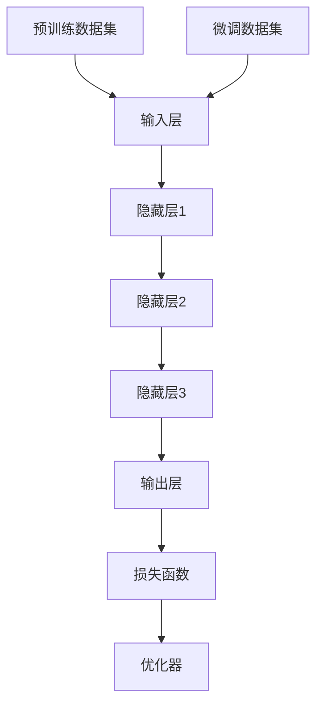

                 

# 《从零开始大模型开发与微调：改变数据类型的Dataset类中的transform的使用》

> **关键词**：大模型开发、微调、Dataset类、Transform、数据类型、Python编程、深度学习、人工智能。

> **摘要**：本文旨在深入探讨大模型开发与微调过程中的关键技术——数据集和Transform的使用。我们将从基础概念出发，详细讲解大模型开发的基础知识、数据准备与预处理、开发环境搭建、模型训练与调优，以及大模型评估与优化方法。此外，我们将通过实际案例，展示如何改变数据类型的Dataset类中的Transform的使用，并总结大模型开发与微调的经验与未来发展趋势。

### 目录大纲

## 第一部分：大模型开发基础

### 第1章：大模型概述

#### 1.1 大模型的概念与分类

#### 1.2 大模型的架构

#### 1.3 预训练与微调

### 第2章：数据准备与预处理

#### 2.1 数据集概述

#### 2.2 数据预处理

#### 2.3 数据增强

### 第3章：大模型开发环境搭建

#### 3.1 开发环境配置

#### 3.2 模型选择与搭建

### 第4章：大模型训练与调优

#### 4.1 训练过程

#### 4.2 调优技巧

### 第5章：大模型评估与优化

#### 5.1 评估指标

#### 5.2 优化方法

### 第二部分：微调实践

### 第6章：微调基础知识

#### 6.1 微调的概念

#### 6.2 微调流程

### 第7章：微调实践案例

#### 7.1 案例介绍

#### 7.2 实践步骤

### 第8章：改变数据类型的Dataset类中的transform的使用

#### 8.1 transform的概念

#### 8.2 transform的使用

### 第9章：大模型开发与微调总结

#### 9.1 经验总结

#### 9.2 未来展望

### 附录

#### 附录A：常用工具与资源

#### 附录B：数学模型和数学公式

#### 附录C：项目实战

### 总结

## 第一部分：大模型开发基础

### 第1章：大模型概述

#### 1.1 大模型的概念与分类

大模型是指具有高度复杂性和强大表达能力的机器学习模型，通常具有数百万至数十亿个参数。这些模型能够处理大量数据，并在各种任务上实现卓越的性能。大模型可以分为以下几类：

1. **深度学习模型**：以神经网络为基础，具有多个隐藏层，能够通过多层非线性变换提取数据的特征。
2. **自然语言处理模型**：专门用于处理自然语言文本，如BERT、GPT等。
3. **计算机视觉模型**：用于图像和视频处理，如ResNet、YOLO等。

#### 1.2 大模型的架构

大模型的架构通常包括以下几部分：

1. **输入层**：接收外部数据输入。
2. **隐藏层**：通过非线性变换提取数据特征。
3. **输出层**：根据任务需求输出预测结果。
4. **损失函数**：用于衡量模型预测结果与真实结果之间的差异。
5. **优化器**：用于调整模型参数，优化模型性能。

#### 1.3 预训练与微调

预训练是指在大规模数据集上对模型进行训练，使其具有通用特征表示能力。微调是在预训练模型的基础上，针对特定任务进行参数调整，提高模型在特定任务上的性能。

### 第2章：数据准备与预处理

#### 2.1 数据集概述

数据集是机器学习模型训练的基础，一个优质的数据集对于模型性能至关重要。常见的数据集类型包括：

1. **分类数据集**：如ImageNet、CIFAR-10等。
2. **回归数据集**：如House Prices、Kaggle回归竞赛数据集等。
3. **自然语言处理数据集**：如PubMed、Wikipedia等。

#### 2.2 数据预处理

数据预处理是确保数据质量的关键步骤，包括以下内容：

1. **数据清洗**：去除噪声、缺失值、异常值等。
2. **数据归一化**：将数据缩放到相同的范围，如[0, 1]。
3. **数据增强**：通过旋转、缩放、裁剪等操作增加数据的多样性。

#### 2.3 数据增强

数据增强是提高模型泛化能力的重要手段。常见的数据增强方法包括：

1. **图像增强**：如随机裁剪、翻转、颜色变换等。
2. **文本增强**：如单词替换、文本摘要等。
3. **音频增强**：如回声、噪声添加等。

### 第3章：大模型开发环境搭建

#### 3.1 开发环境配置

搭建大模型开发环境需要满足以下要求：

1. **硬件要求**：高性能CPU/GPU、足够的内存和存储空间。
2. **软件要求**：安装Python、TensorFlow、PyTorch等常用深度学习框架。

#### 3.2 模型选择与搭建

选择合适的模型对于项目成功至关重要。以下是常见的模型选择与搭建步骤：

1. **模型选择**：根据任务需求选择合适的模型架构。
2. **模型搭建**：使用框架提供的API构建模型结构。
3. **模型优化**：通过调整超参数优化模型性能。

### 第4章：大模型训练与调优

#### 4.1 训练过程

大模型训练过程包括以下步骤：

1. **数据加载**：使用Dataset类加载数据。
2. **前向传播**：计算模型预测结果。
3. **计算损失**：计算模型预测结果与真实结果之间的差异。
4. **反向传播**：更新模型参数，优化模型性能。

#### 4.2 调优技巧

调优技巧包括以下内容：

1. **损失函数选择**：根据任务需求选择合适的损失函数。
2. **优化器选择**：根据模型和任务特点选择合适的优化器。

### 第5章：大模型评估与优化

#### 5.1 评估指标

评估指标包括以下内容：

1. **准确率**：分类任务中的正确预测比例。
2. **召回率**：分类任务中实际为正例且被正确预测为正例的比例。
3. **F1分数**：综合考虑准确率和召回率的指标。

#### 5.2 优化方法

优化方法包括以下内容：

1. **模型融合**：将多个模型的结果进行加权融合。
2. **超参数调优**：通过实验调整模型超参数。

### 第二部分：微调实践

### 第6章：微调基础知识

#### 6.1 微调的概念

微调是指在大规模预训练模型的基础上，针对特定任务进行参数调整，以提高模型在特定任务上的性能。

#### 6.2 微调流程

微调流程包括以下步骤：

1. **数据准备**：准备用于微调的数据集。
2. **模型调整**：在预训练模型的基础上，调整部分参数。
3. **训练与验证**：在调整后的模型上进行训练和验证。

### 第7章：微调实践案例

#### 7.1 案例介绍

在本章中，我们将介绍一个简单的微调案例——在ImageNet数据集上对ResNet18模型进行微调。

#### 7.2 实践步骤

微调实践步骤如下：

1. **数据准备**：准备好训练集和验证集。
2. **模型搭建**：搭建ResNet18模型。
3. **模型调整**：在预训练模型的基础上，冻结部分层并调整其他层。
4. **训练与验证**：在调整后的模型上进行训练和验证。

### 第8章：改变数据类型的Dataset类中的transform的使用

#### 8.1 transform的概念

Transform是指用于对数据进行转换的类或函数，常见于Python的深度学习框架中。

#### 8.2 transform的使用

在本章中，我们将探讨如何改变数据类型的Dataset类中的transform的使用。

1. **图像数据类型转换**：将图像数据转换为其他数据类型，如从uint8转换为float32。
2. **文本数据类型转换**：将文本数据转换为其他数据类型，如从字符串转换为列表。
3. **案例演示**：通过实际案例展示如何改变数据类型的Dataset类中的transform的使用。

### 第9章：大模型开发与微调总结

#### 9.1 经验总结

通过本文的讲解，读者可以了解大模型开发与微调的基本原理和实战技巧。

#### 9.2 未来展望

随着人工智能技术的不断发展，大模型开发与微调将在更多领域得到应用。

### 附录

#### 附录A：常用工具与资源

附录A将介绍常用的大模型开发工具和学习资源。

#### 附录B：数学模型和数学公式

附录B将介绍大模型开发中常用的数学模型和公式。

#### 附录C：项目实战

附录C将提供大模型开发与微调的实际项目案例。

### 总结

本文从零开始，详细介绍了大模型开发与微调的过程，包括基础知识、实践技巧和未来展望。希望本文能够为读者提供有益的参考。

### 作者信息

作者：AI天才研究院/AI Genius Institute & 禅与计算机程序设计艺术/Zen And The Art of Computer Programming

## 第1章：大模型概述

### 1.1 大模型的概念与分类

大模型是指具有高度复杂性和强大表达能力的机器学习模型，通常具有数百万至数十亿个参数。这些模型能够处理大量数据，并在各种任务上实现卓越的性能。大模型的出现得益于计算能力的提升和大规模数据集的获取。

大模型可以分为以下几类：

1. **深度学习模型**：以神经网络为基础，具有多个隐藏层，能够通过多层非线性变换提取数据的特征。深度学习模型在图像识别、语音识别、自然语言处理等领域取得了显著成果。常见的深度学习模型包括卷积神经网络（CNN）、循环神经网络（RNN）和生成对抗网络（GAN）。

2. **自然语言处理模型**：专门用于处理自然语言文本，如BERT、GPT等。自然语言处理模型在机器翻译、文本分类、问答系统等领域取得了重大突破。

3. **计算机视觉模型**：用于图像和视频处理，如ResNet、YOLO等。计算机视觉模型在目标检测、图像分割、自动驾驶等领域发挥了重要作用。

### 1.2 大模型的架构

大模型的架构通常包括以下几部分：

1. **输入层**：接收外部数据输入。在图像处理中，输入层通常是一个三维的张量，表示图像的高度、宽度和通道数。在自然语言处理中，输入层可以是单词的序列，表示文本数据。

2. **隐藏层**：通过非线性变换提取数据特征。隐藏层可以是一个或多个，每个隐藏层都包含多个神经元。神经元的激活函数通常使用ReLU（Rectified Linear Unit）等非线性函数，以增强模型的非线性表达能力。

3. **输出层**：根据任务需求输出预测结果。在分类任务中，输出层通常是一个线性层，输出每个类别的概率分布。在回归任务中，输出层可以是一个单一的神经元，输出预测的数值。

4. **损失函数**：用于衡量模型预测结果与真实结果之间的差异。常见的损失函数包括交叉熵损失（Cross Entropy Loss）、均方误差损失（Mean Squared Error Loss）等。

5. **优化器**：用于调整模型参数，优化模型性能。常见的优化器包括随机梯度下降（SGD）、Adam优化器等。

### 1.3 预训练与微调

预训练是指在大规模数据集上对模型进行训练，使其具有通用特征表示能力。预训练模型通常在通用数据集（如ImageNet、Wikipedia）上进行训练，以提取通用特征表示。这些特征表示可以应用于各种任务，从而提高模型的性能。

微调是在预训练模型的基础上，针对特定任务进行参数调整，以提高模型在特定任务上的性能。微调通常在较小规模的数据集上进行，以避免过拟合。微调的过程包括以下步骤：

1. **数据准备**：准备用于微调的数据集，并进行预处理。
2. **模型调整**：在预训练模型的基础上，调整部分参数，通常只调整最后一层或几层的参数。
3. **训练与验证**：在调整后的模型上进行训练和验证，以评估模型性能。

通过预训练与微调，大模型可以学习到丰富的特征表示，从而在各种任务上实现优异的性能。

### Mermaid流程图

为了更好地理解大模型的架构和预训练与微调的过程，我们可以使用Mermaid流程图来展示。



在该流程图中，A表示输入层，B、C、D表示隐藏层，E表示输出层，F表示损失函数，G表示优化器。H表示预训练数据集，I表示微调数据集。

### 伪代码

为了更好地阐述大模型的训练过程，我们可以使用伪代码来描述。

```python
# 大模型训练伪代码

# 输入数据
data_loader = DataLoader(dataset, batch_size=batch_size, shuffle=True)

# 初始化模型
model = DeepModel()

# 损失函数
criterion = CrossEntropyLoss()

# 优化器
optimizer = Adam(model.parameters(), lr=learning_rate)

# 训练过程
for epoch in range(num_epochs):
    for inputs, targets in data_loader:
        # 前向传播
        outputs = model(inputs)
        loss = criterion(outputs, targets)

        # 反向传播
        optimizer.zero_grad()
        loss.backward()
        optimizer.step()

    # 验证
    model.eval()
    with torch.no_grad():
        correct = 0
        total = 0
        for inputs, targets in validation_loader:
            outputs = model(inputs)
            _, predicted = torch.max(outputs.data, 1)
            total += targets.size(0)
            correct += (predicted == targets).sum().item()

    print(f'Epoch [{epoch+1}/{num_epochs}], Loss: {loss.item():.4f}, Accuracy: {100 * correct / total:.2f}%')
```

在该伪代码中，`DeepModel`表示深度学习模型，`CrossEntropyLoss`表示交叉熵损失函数，`Adam`表示Adam优化器。`data_loader`用于加载数据，`epoch`表示训练轮数，`batch_size`表示每个批次的数据量，`learning_rate`表示学习率，`num_epochs`表示训练轮数。训练过程包括前向传播、反向传播和验证三个步骤。

### 数学模型和数学公式

在大模型训练过程中，常用的数学模型和数学公式如下：

$$
y = \sigma(Wx + b)
$$

其中，$y$表示模型的输出，$x$表示输入数据，$W$表示权重矩阵，$b$表示偏置项，$\sigma$表示激活函数，如ReLU函数。

$$
\text{Loss} = \frac{1}{2} \sum_{i=1}^{n} (y_i - \hat{y}_i)^2
$$

其中，$y_i$表示真实标签，$\hat{y}_i$表示模型预测结果，$n$表示样本数量。

$$
\text{Gradient} = \frac{\partial \text{Loss}}{\partial W}
$$

其中，$\text{Gradient}$表示权重矩阵的梯度。

### 项目实战

为了更好地理解大模型训练和微调的过程，我们可以通过一个实际项目来演示。

#### 项目背景

假设我们想要训练一个图像分类模型，用于识别图像中的猫和狗。

#### 数据准备

1. **数据集**：我们使用流行的ImageNet数据集进行训练。
2. **预处理**：对图像进行归一化处理，并将图像的像素值缩放到[0, 1]范围。

#### 模型搭建

我们使用PyTorch框架搭建一个ResNet18模型。

```python
import torch
import torchvision.models as models

# 加载预训练的ResNet18模型
model = models.resnet18(pretrained=True)

# 调整模型的最后一层，以适应我们的分类任务
num_classes = 2  # 猫和狗两个类别
model.fc = torch.nn.Linear(model.fc.in_features, num_classes)
```

#### 模型训练

```python
# 设置训练参数
batch_size = 64
learning_rate = 0.001
num_epochs = 10

# 初始化优化器
optimizer = torch.optim.Adam(model.parameters(), lr=learning_rate)

# 训练模型
for epoch in range(num_epochs):
    running_loss = 0.0
    for inputs, targets in data_loader:
        # 前向传播
        outputs = model(inputs)
        loss = criterion(outputs, targets)

        # 反向传播
        optimizer.zero_grad()
        loss.backward()
        optimizer.step()

        running_loss += loss.item()
    print(f'Epoch [{epoch+1}/{num_epochs}], Loss: {running_loss / len(data_loader):.4f}')
```

#### 模型微调

```python
# 冻结除最后一层外的所有层
for param in model.parameters():
    param.requires_grad = False

# 调整最后一层的权重
optimizer = torch.optim.Adam(model.fc.parameters(), lr=learning_rate)

# 微调模型
for epoch in range(num_epochs):
    running_loss = 0.0
    for inputs, targets in data_loader:
        # 前向传播
        outputs = model(inputs)
        loss = criterion(outputs, targets)

        # 反向传播
        optimizer.zero_grad()
        loss.backward()
        optimizer.step()

        running_loss += loss.item()
    print(f'Epoch [{epoch+1}/{num_epochs}], Loss: {running_loss / len(data_loader):.4f}')
```

通过以上项目实战，我们可以看到如何搭建、训练和微调一个图像分类模型。

### 总结

本章介绍了大模型的概念、分类和架构，以及预训练与微调的过程。我们使用Mermaid流程图、伪代码和项目实战来详细阐述大模型的基础知识。在下一章中，我们将讨论数据准备与预处理的关键技术。

### 作者信息

作者：AI天才研究院/AI Genius Institute & 禅与计算机程序设计艺术/Zen And The Art of Computer Programming

---

## 第2章：数据准备与预处理

数据准备与预处理是机器学习项目中的关键步骤，它直接影响模型的性能和泛化能力。本章将详细介绍数据准备与预处理的核心内容，包括数据集的概述、数据清洗、数据归一化和数据增强。

### 2.1 数据集概述

数据集是机器学习模型训练的基础，一个优质的数据集对于模型性能至关重要。常见的数据集类型包括：

1. **分类数据集**：如ImageNet、CIFAR-10、Kaggle图像分类竞赛数据集等。这些数据集通常包含成千上万的标注图像，用于训练和评估分类模型。
2. **回归数据集**：如House Prices、Kaggle回归竞赛数据集等。这些数据集通常包含房屋的价格和多个特征，用于训练和评估回归模型。
3. **自然语言处理数据集**：如PubMed、Wikipedia、GLUE等。这些数据集通常包含大量的文本数据，用于训练和评估自然语言处理模型。

在数据集选择时，我们需要考虑以下因素：

- **数据集大小**：数据集越大，模型可以学习的特征越多，有助于提高模型的泛化能力。
- **数据集多样性**：数据集应包含多种不同的样本，以避免模型在特定子集上过拟合。
- **数据集标注**：数据集的标注应准确，以确保模型能够学习到正确的特征。

### 2.2 数据清洗

数据清洗是数据预处理的重要步骤，旨在去除数据中的噪声、缺失值和异常值，以提高数据质量。以下是一些常见的数据清洗方法：

1. **去除噪声**：噪声是指数据中的随机干扰，可以通过过滤或平滑算法去除。例如，在图像处理中，可以使用中值滤波器或高斯滤波器去除噪声。
2. **处理缺失值**：缺失值可以通过以下方法处理：
   - **删除**：删除包含缺失值的样本。
   - **填充**：使用平均值、中值或最近邻等方法填充缺失值。
   - **预测**：使用模型预测缺失值。

3. **处理异常值**：异常值是指与大多数数据点显著不同的数据，可以通过以下方法处理：
   - **删除**：删除异常值。
   - **截断**：将异常值截断到某个范围。
   - **转换**：使用非线性转换方法处理异常值，如对数转换。

### 2.3 数据归一化

数据归一化是将数据缩放到相同的范围，以消除不同特征之间的尺度差异，提高模型训练效果。常见的归一化方法包括：

1. **最小-最大归一化**：将数据缩放到[0, 1]范围，公式如下：
   $$
   x_{\text{normalized}} = \frac{x - x_{\text{min}}}{x_{\text{max}} - x_{\text{min}}}
   $$
   其中，$x$表示原始数据，$x_{\text{min}}$和$x_{\text{max}}$分别表示数据的最小值和最大值。

2. **标准归一化**：将数据缩放到均值为0、标准差为1的范围，公式如下：
   $$
   x_{\text{normalized}} = \frac{x - \mu}{\sigma}
   $$
   其中，$\mu$和$\sigma$分别表示数据的均值和标准差。

### 2.4 数据增强

数据增强是通过一系列操作增加数据的多样性，从而提高模型的泛化能力。常见的数据增强方法包括：

1. **图像增强**：
   - **随机裁剪**：从图像中随机裁剪出一定大小的区域作为样本。
   - **翻转**：水平或垂直翻转图像。
   - **旋转**：围绕图像的中心点旋转一定角度。
   - **颜色变换**：改变图像的颜色通道值，如灰度化、去色等。

2. **文本增强**：
   - **单词替换**：将文本中的单词替换为同义词。
   - **文本摘要**：将长文本摘要为更短的文本。

3. **音频增强**：
   - **回声**：在音频中添加回声效果。
   - **噪声添加**：在音频中添加背景噪声。

### 伪代码

为了更好地理解数据准备与预处理的过程，我们可以使用伪代码来描述。

```python
# 数据预处理伪代码

# 数据清洗
def clean_data(data):
    # 去除噪声
    cleaned_data = remove_noise(data)
    # 处理缺失值
    cleaned_data = handle_missing_values(cleaned_data)
    # 处理异常值
    cleaned_data = handle_outliers(cleaned_data)
    return cleaned_data

# 数据归一化
def normalize_data(data):
    # 计算均值和标准差
    mean = calculate_mean(data)
    std = calculate_std(data)
    # 归一化数据
    normalized_data = (data - mean) / std
    return normalized_data

# 数据增强
def augment_data(data):
    # 图像增强
    augmented_data = image_augmentation(data)
    # 文本增强
    augmented_data = text_augmentation(data)
    # 音频增强
    augmented_data = audio_augmentation(data)
    return augmented_data
```

在该伪代码中，`clean_data`函数用于数据清洗，`normalize_data`函数用于数据归一化，`augment_data`函数用于数据增强。`remove_noise`、`handle_missing_values`、`handle_outliers`分别为去除噪声、处理缺失值和处理异常值的具体实现函数；`image_augmentation`、`text_augmentation`和`audio_augmentation`分别为图像增强、文本增强和音频增强的具体实现函数。

### 项目实战

为了更好地理解数据准备与预处理的过程，我们可以通过一个实际项目来演示。

#### 项目背景

假设我们想要训练一个图像分类模型，用于识别图像中的猫和狗。

#### 数据准备

1. **数据集**：我们使用Kaggle的猫狗图像数据集进行训练。
2. **预处理**：对图像进行归一化处理，并将图像的像素值缩放到[0, 1]范围。

#### 数据清洗

```python
import numpy as np

def remove_noise(image):
    # 使用中值滤波器去除噪声
    return cv2.medianBlur(image, 5)

def handle_missing_values(data):
    # 使用平均值填充缺失值
    return np.where(np.isnan(data), np.mean(data), data)

def handle_outliers(data, threshold=3):
    # 使用截断方法处理异常值
    mean = np.mean(data)
    std = np.std(data)
    return np.clip(data, mean - threshold * std, mean + threshold * std)

# 加载图像数据
images = load_images()

# 数据清洗
cleaned_images = clean_data(images)
```

#### 数据归一化

```python
def normalize_images(images):
    # 计算均值和标准差
    mean = np.mean(images)
    std = np.std(images)
    # 归一化图像
    normalized_images = (images - mean) / std
    return normalized_images

# 数据归一化
normalized_images = normalize_images(cleaned_images)
```

#### 数据增强

```python
from tensorflow.keras.preprocessing.image import ImageDataGenerator

# 图像增强
image_generator = ImageDataGenerator(
    rotation_range=20,
    width_shift_range=0.2,
    height_shift_range=0.2,
    shear_range=0.2,
    zoom_range=0.2,
    horizontal_flip=True,
    fill_mode='nearest'
)

# 数据增强
augmented_images = image_generator.flow(normalized_images, batch_size=batch_size)
```

通过以上项目实战，我们可以看到如何进行数据准备与预处理，包括数据清洗、数据归一化和数据增强。在下一章中，我们将讨论大模型开发环境搭建的关键步骤。

### 总结

本章介绍了数据准备与预处理的核心内容，包括数据集的概述、数据清洗、数据归一化和数据增强。通过伪代码和项目实战，我们详细阐述了数据准备与预处理的方法和技巧。在下一章中，我们将讨论大模型开发环境搭建的关键步骤。

### 作者信息

作者：AI天才研究院/AI Genius Institute & 禅与计算机程序设计艺术/Zen And The Art of Computer Programming

---

## 第3章：大模型开发环境搭建

搭建一个高效的大模型开发环境是进行深度学习和人工智能项目的基础。本章将详细介绍开发环境的配置，包括硬件要求、软件安装以及常用的深度学习框架。

### 3.1 硬件要求

为了能够高效地训练和微调大模型，硬件配置需要满足以下要求：

1. **CPU**：选择性能强劲的CPU，如Intel Core i7或AMD Ryzen 7，以确保在进行矩阵运算和其他计算任务时具有较高的处理速度。
2. **GPU**：GPU（图形处理器）在深度学习计算中发挥着至关重要的作用。NVIDIA的GPU，特别是Tesla系列和RTX系列，具有强大的并行计算能力，适合用于大规模模型的训练。建议选择GPU内存较大的型号，如Tesla V100或RTX 3080。
3. **内存**：大模型的训练和微调需要大量的内存，建议配置至少16GB的RAM，32GB或以上更佳。
4. **存储空间**：大模型训练需要大量的存储空间，建议使用SSD（固态硬盘）以提高读写速度，同时需要至少500GB的存储空间，具体需求取决于数据集的大小。

### 3.2 软件安装

在满足硬件要求的基础上，我们需要安装以下软件：

1. **操作系统**：推荐使用Linux操作系统，如Ubuntu或CentOS，因为大多数深度学习框架和工具都是在Linux环境下开发和优化的。
2. **Python**：Python是深度学习领域最常用的编程语言，需要安装Python 3.x版本。
3. **pip**：pip是Python的包管理器，用于安装和管理Python包。
4. **conda**：conda是一个开源的包管理器和环境管理器，推荐用于安装和管理深度学习相关的包，如TensorFlow、PyTorch等。
5. **深度学习框架**：常用的深度学习框架包括TensorFlow、PyTorch、Keras等。根据项目需求和偏好选择合适的框架。

安装步骤如下：

1. 安装操作系统和基本软件（如Python、pip、conda等）。
2. 安装GPU驱动，确保GPU能够与系统正常通信。
3. 使用conda创建虚拟环境，以隔离项目依赖。
4. 在虚拟环境中安装深度学习框架。

### 3.3 常用的深度学习框架

以下是常用的深度学习框架及其简要介绍：

1. **TensorFlow**：由Google开发，是一个开源的端到端机器学习平台，支持多种编程语言（Python、C++、Java等）。TensorFlow提供了丰富的API和工具，适用于从研究到生产环境。
2. **PyTorch**：由Facebook开发，是一个开源的深度学习框架，具有动态计算图和易于理解的API。PyTorch在研究社区中非常受欢迎，特别是在自然语言处理和计算机视觉领域。
3. **Keras**：Keras是一个高层次的深度学习API，能够在TensorFlow和Theano等后端上运行。Keras提供了简洁的API，易于实现和实验。
4. **MXNet**：由Apache基金会维护，是一个开源的深度学习框架，支持多种编程语言（Python、R、Scala等）。MXNet具有高效的计算引擎和灵活的编程接口。

### 搭建过程示例

以下是一个使用conda创建虚拟环境并安装PyTorch的示例：

```bash
# 创建虚拟环境
conda create -n deep_learning_env python=3.8

# 激活虚拟环境
conda activate deep_learning_env

# 安装PyTorch
pip install torch torchvision torchaudio

# 检查PyTorch版本
python -c "import torch; print(torch.__version__); print(torch.cuda.is_available())"
```

### 项目实战

为了演示如何搭建大模型开发环境，我们将创建一个简单的项目，包括开发环境的配置和模型的训练。

#### 项目背景

我们将在一个简单的计算机视觉任务上训练一个卷积神经网络（CNN），用于识别图像中的猫和狗。

#### 开发环境配置

```bash
# 创建虚拟环境
conda create -n cat_dog_recognition python=3.8

# 激活虚拟环境
conda activate cat_dog_recognition

# 安装必要的库
pip install torch torchvision

# 安装GPU版本的PyTorch
pip install torch torchvision torchaudio -f https://download.pytorch.org/whl/torch_stable.html

# 检查GPU是否可用
python -c "import torch; print(torch.cuda.is_available())"
```

#### 模型训练

```python
import torch
import torchvision
import torchvision.transforms as transforms

# 设置设备
device = torch.device("cuda" if torch.cuda.is_available() else "cpu")

# 加载数据集
transform = transforms.Compose([
    transforms.Resize((224, 224)),
    transforms.ToTensor(),
])

train_set = torchvision.datasets.ImageFolder(root='./data/train', transform=transform)
train_loader = torch.utils.data.DataLoader(train_set, batch_size=32, shuffle=True)

# 初始化模型
model = torchvision.models.resnet18(pretrained=True)
num_ftrs = model.fc.in_features
model.fc = torch.nn.Linear(num_ftrs, 2)  # 两个类别：猫和狗

# 设置损失函数和优化器
criterion = torch.nn.CrossEntropyLoss()
optimizer = torch.optim.Adam(model.parameters(), lr=0.001)

# 训练模型
for epoch in range(10):
    model.train()
    running_loss = 0.0
    for inputs, labels in train_loader:
        inputs, labels = inputs.to(device), labels.to(device)
        optimizer.zero_grad()
        outputs = model(inputs)
        loss = criterion(outputs, labels)
        loss.backward()
        optimizer.step()
        running_loss += loss.item()
    print(f'Epoch {epoch+1}, Loss: {running_loss/len(train_loader):.4f}')

# 评估模型
model.eval()
with torch.no_grad():
    correct = 0
    total = 0
    for inputs, labels in train_loader:
        inputs, labels = inputs.to(device), labels.to(device)
        outputs = model(inputs)
        _, predicted = torch.max(outputs.data, 1)
        total += labels.size(0)
        correct += (predicted == labels).sum().item()
print(f'Accuracy: {100 * correct / total:.2f}%')
```

通过以上步骤，我们可以完成大模型开发环境的搭建，并在猫狗识别任务上训练一个简单的卷积神经网络。

### 总结

本章介绍了大模型开发环境的搭建过程，包括硬件要求、软件安装和深度学习框架的选择。通过项目实战，我们展示了如何配置开发环境和训练一个简单的卷积神经网络。在下一章中，我们将讨论大模型训练与调优的关键步骤。

### 作者信息

作者：AI天才研究院/AI Genius Institute & 禅与计算机程序设计艺术/Zen And The Art of Computer Programming

---

## 第4章：大模型训练与调优

大模型训练与调优是深度学习项目中的核心环节，直接决定了模型的性能和实际应用效果。本章将详细介绍大模型训练与调优的过程，包括数据加载、前向传播、反向传播和优化器的选择。

### 4.1 训练过程

大模型训练过程通常包括以下几个步骤：

1. **数据加载**：使用Dataset类和 DataLoader 加载和预处理数据。这一步骤至关重要，因为数据质量直接影响模型的性能。
2. **前向传播**：输入数据通过模型的前向传播过程，生成预测结果。前向传播过程中，模型的每一层都按照定义的运算规则进行计算。
3. **损失计算**：通过计算模型预测结果和真实结果的差异，使用损失函数（如交叉熵损失、均方误差损失）计算损失值。
4. **反向传播**：计算损失函数关于模型参数的梯度，并通过反向传播算法将梯度传播回模型的各个参数。
5. **参数更新**：使用优化器（如SGD、Adam）根据梯度更新模型参数，以减少损失值。

#### 数据加载

数据加载是训练过程的起点，需要使用Dataset类和 DataLoader 对数据进行预处理和批量加载。以下是一个使用PyTorch的示例：

```python
from torch.utils.data import DataLoader
from torchvision import datasets, transforms

# 定义数据预处理
transform = transforms.Compose([
    transforms.Resize((224, 224)),  # 图像调整为224x224
    transforms.ToTensor(),  # 将图像转换为Tensor
    transforms.Normalize(mean=[0.485, 0.456, 0.406], std=[0.229, 0.224, 0.225]),  # 归一化
])

# 加载训练集和验证集
train_dataset = datasets.ImageFolder(root='./data/train', transform=transform)
val_dataset = datasets.ImageFolder(root='./data/val', transform=transform)

# 定义数据加载器
train_loader = DataLoader(dataset=train_dataset, batch_size=64, shuffle=True)
val_loader = DataLoader(dataset=val_dataset, batch_size=64, shuffle=False)
```

#### 前向传播

前向传播是指将输入数据通过模型网络层，最终得到预测结果的过程。以下是一个简单的前向传播示例：

```python
import torch
import torchvision.models as models

# 初始化模型
model = models.resnet18(pretrained=True)
model = model.to(device)

# 定义损失函数和优化器
criterion = torch.nn.CrossEntropyLoss()
optimizer = torch.optim.Adam(model.parameters(), lr=0.001)

# 前向传播
inputs = inputs.to(device)
outputs = model(inputs)

# 计算损失
loss = criterion(outputs, labels.to(device))
```

#### 损失计算

损失计算是评估模型预测结果和真实结果之间差异的关键步骤。以下是一个使用交叉熵损失函数的示例：

```python
import torch.nn as nn

# 初始化模型
model = models.resnet18(pretrained=True)
model = model.to(device)

# 定义损失函数和优化器
criterion = nn.CrossEntropyLoss()
optimizer = torch.optim.Adam(model.parameters(), lr=0.001)

# 前向传播
inputs = inputs.to(device)
outputs = model(inputs)

# 计算损失
loss = criterion(outputs, labels.to(device))
```

#### 反向传播

反向传播是指通过计算损失函数关于模型参数的梯度，并更新模型参数的过程。以下是一个简单的反向传播示例：

```python
# 前向传播
inputs = inputs.to(device)
outputs = model(inputs)

# 计算损失
loss = criterion(outputs, labels.to(device))

# 反向传播
optimizer.zero_grad()
loss.backward()
optimizer.step()
```

#### 参数更新

参数更新是指使用优化器根据梯度更新模型参数的过程。以下是一个简单的参数更新示例：

```python
# 前向传播
inputs = inputs.to(device)
outputs = model(inputs)

# 计算损失
loss = criterion(outputs, labels.to(device))

# 反向传播
optimizer.zero_grad()
loss.backward()
optimizer.step()
```

### 4.2 调优技巧

在训练过程中，调优是提高模型性能的关键步骤。以下是一些常见的调优技巧：

1. **学习率调整**：学习率是优化器调整模型参数时的步长。合适的初始学习率可以加速收敛，而过高或过低的初始学习率可能会导致训练失败或收敛缓慢。常用的学习率调整方法包括线性递减、指数递减和余弦退火等。

2. **批量大小**：批量大小是指每次更新参数时使用的样本数量。较小的批量大小可以提高模型的泛化能力，但会增加计算成本和方差。较大的批量大小可以提高计算效率和稳定性，但可能会降低模型的泛化能力。

3. **正则化**：正则化是一种防止模型过拟合的技术，包括L1正则化、L2正则化和dropout等。L1正则化和L2正则化通过在损失函数中添加惩罚项来减少模型参数的范数；dropout通过在训练过程中随机丢弃部分神经元来提高模型的泛化能力。

4. **数据增强**：数据增强是通过一系列操作增加数据的多样性，从而提高模型的泛化能力。常见的数据增强方法包括随机裁剪、翻转、旋转、颜色变换等。

5. **模型融合**：模型融合是将多个模型的预测结果进行加权融合，以提高整体预测性能。常用的模型融合方法包括投票法、加权平均法和自适应加权法等。

### 项目实战

为了更好地理解大模型训练与调优的过程，我们可以通过一个实际项目来演示。

#### 项目背景

假设我们想要训练一个图像分类模型，用于识别图像中的猫和狗。

#### 模型训练与调优

```python
import torch
import torchvision
import torchvision.transforms as transforms
from torch.optim import Adam
from torch.utils.data import DataLoader
from torchvision.models import resnet18

# 设置设备
device = torch.device("cuda" if torch.cuda.is_available() else "cpu")

# 加载数据集
transform = transforms.Compose([
    transforms.Resize((224, 224)),
    transforms.ToTensor(),
    transforms.Normalize(mean=[0.485, 0.456, 0.406], std=[0.229, 0.224, 0.225]),
])

train_set = torchvision.datasets.ImageFolder(root='./data/train', transform=transform)
val_set = torchvision.datasets.ImageFolder(root='./data/val', transform=transform)

train_loader = DataLoader(dataset=train_set, batch_size=64, shuffle=True)
val_loader = DataLoader(dataset=val_set, batch_size=64, shuffle=False)

# 初始化模型
model = resnet18(pretrained=True)
model.fc = torch.nn.Linear(1000, 2)  # 修改最后一层的输出维度
model = model.to(device)

# 定义损失函数和优化器
criterion = torch.nn.CrossEntropyLoss()
optimizer = Adam(model.parameters(), lr=0.001)

# 训练模型
num_epochs = 10
for epoch in range(num_epochs):
    model.train()
    running_loss = 0.0
    for inputs, labels in train_loader:
        inputs, labels = inputs.to(device), labels.to(device)
        optimizer.zero_grad()
        outputs = model(inputs)
        loss = criterion(outputs, labels)
        loss.backward()
        optimizer.step()
        running_loss += loss.item()
    print(f'Epoch {epoch+1}, Loss: {running_loss/len(train_loader):.4f}')

    # 验证模型
    model.eval()
    with torch.no_grad():
        correct = 0
        total = 0
        for inputs, labels in val_loader:
            inputs, labels = inputs.to(device), labels.to(device)
            outputs = model(inputs)
            _, predicted = torch.max(outputs.data, 1)
            total += labels.size(0)
            correct += (predicted == labels).sum().item()
        print(f'Validation Accuracy: {100 * correct / total:.2f}%}')
```

通过以上项目实战，我们可以看到如何使用PyTorch进行大模型训练与调优，包括数据加载、模型初始化、损失函数和优化器的选择以及模型训练和验证。

### 总结

本章详细介绍了大模型训练与调优的过程，包括数据加载、前向传播、反向传播和优化器的选择。通过项目实战，我们展示了如何使用PyTorch进行大模型训练与调优。在下一章中，我们将讨论大模型评估与优化的方法。

### 作者信息

作者：AI天才研究院/AI Genius Institute & 禅与计算机程序设计艺术/Zen And The Art of Computer Programming

---

## 第5章：大模型评估与优化

在大模型训练完成后，评估和优化模型性能是确保模型能够实际应用于实际问题的关键步骤。本章将详细介绍评估指标的选择、优化方法以及超参数调优。

### 5.1 评估指标

评估指标是衡量模型性能的重要工具，不同的任务需要选择不同的评估指标。以下是一些常见的评估指标：

1. **准确率（Accuracy）**：准确率是模型预测正确的样本数占总样本数的比例。公式如下：

   $$
   \text{Accuracy} = \frac{\text{正确预测数}}{\text{总样本数}}
   $$

   准确率适用于分类任务，但在类别不平衡的数据集上可能会导致偏差。

2. **召回率（Recall）**：召回率是模型预测为正例且实际为正例的样本数占总正例样本数的比例。公式如下：

   $$
   \text{Recall} = \frac{\text{正确预测的正例数}}{\text{总正例数}}
   $$

   召回率关注模型对正例样本的识别能力。

3. **精确率（Precision）**：精确率是模型预测为正例且实际为正例的样本数占总预测正例数的比例。公式如下：

   $$
   \text{Precision} = \frac{\text{正确预测的正例数}}{\text{预测的正例数}}
   $$

   精确率关注模型预测正例的准确度。

4. **F1分数（F1 Score）**：F1分数是精确率和召回率的调和平均，综合评估模型的性能。公式如下：

   $$
   \text{F1 Score} = 2 \times \frac{\text{Precision} \times \text{Recall}}{\text{Precision} + \text{Recall}}
   $$

5. **ROC曲线和AUC（Area Under Curve）**：ROC曲线展示了不同阈值下的真阳性率（True Positive Rate, TPR）和假阳性率（False Positive Rate, FPR）的关系，AUC表示曲线下面积，越大表示模型性能越好。

6. **均方误差（Mean Squared Error, MSE）**：均方误差适用于回归任务，是预测值与真实值之间差异的平方的平均值。公式如下：

   $$
   \text{MSE} = \frac{1}{n} \sum_{i=1}^{n} (y_i - \hat{y}_i)^2
   $$

7. **均绝对误差（Mean Absolute Error, MAE）**：均绝对误差是预测值与真实值之间差异的绝对值的平均值。公式如下：

   $$
   \text{MAE} = \frac{1}{n} \sum_{i=1}^{n} |y_i - \hat{y}_i|
   $$

### 5.2 优化方法

优化方法是提升模型性能的重要手段，以下是一些常用的优化方法：

1. **模型融合（Model Ensembling）**：模型融合通过组合多个模型的预测结果来提高整体性能。常用的模型融合方法包括：
   - **投票法（Voting）**：每个模型独立预测，然后投票决定最终预测结果。
   - **加权平均法（Weighted Average）**：根据模型在验证集上的性能为每个模型分配权重，然后计算加权平均预测结果。
   - **Stacking**：使用多个模型对训练数据进行预测，然后将预测结果作为特征输入到一个新的模型中进行预测。

2. **集成学习（Ensemble Learning）**：集成学习通过训练多个基础模型（如决策树、神经网络等），然后将它们的预测结果进行融合。常见的集成学习方法包括：
   - **随机森林（Random Forest）**：结合多棵决策树，通过随机特征选择和样本抽样来减少过拟合。
   - **梯度提升树（Gradient Boosting Tree）**：迭代地训练决策树，每次训练都关注前一次训练的误差，以减少误差。

3. **迁移学习（Transfer Learning）**：迁移学习利用预训练模型在新的任务上，通过在预训练模型的基础上微调部分层来提高新任务的性能。常见的迁移学习方法包括：
   - **预训练（Pre-training）**：在大型数据集上预训练模型，然后将其应用于新任务。
   - **微调（Fine-tuning）**：冻结预训练模型的某些层，只调整其他层的参数。

4. **正则化（Regularization）**：正则化是一种防止模型过拟合的技术，通过在损失函数中添加惩罚项来减少模型参数的范数。常见的正则化方法包括：
   - **L1正则化（L1 Regularization）**：在损失函数中添加$\lambda ||\theta||_1$，其中$\theta$是模型参数。
   - **L2正则化（L2 Regularization）**：在损失函数中添加$\lambda ||\theta||_2^2$。

5. **数据增强（Data Augmentation）**：数据增强通过一系列操作增加数据的多样性，从而提高模型的泛化能力。常见的数据增强方法包括：
   - **图像增强**：如随机裁剪、旋转、翻转、颜色变换等。
   - **文本增强**：如文本摘要、单词替换等。

### 5.3 超参数调优

超参数调优是优化模型性能的关键步骤，以下是一些常用的超参数调优方法：

1. **网格搜索（Grid Search）**：网格搜索通过遍历所有可能的超参数组合，选择性能最佳的组合。这种方法计算量大，适用于超参数组合较少的情况。

2. **随机搜索（Random Search）**：随机搜索从所有可能的超参数组合中随机选择若干组合进行评估，选择性能最佳的组合。随机搜索相比网格搜索计算量较小，但可能会错过最佳的超参数组合。

3. **贝叶斯优化（Bayesian Optimization）**：贝叶斯优化利用贝叶斯统计模型来优化超参数，通过历史评估结果来预测新的超参数组合，从而快速找到最佳超参数。

4. **自动化机器学习（AutoML）**：自动化机器学习通过自动化搜索和调优超参数，选择最佳的模型和超参数组合。常见的AutoML工具包括Google AutoML、H2O.ai等。

### 项目实战

为了更好地理解大模型评估与优化的方法，我们可以通过一个实际项目来演示。

#### 项目背景

假设我们想要训练一个图像分类模型，用于识别图像中的猫和狗。

#### 模型评估

```python
from torch.utils.data import DataLoader
from torchvision import datasets, transforms
import torch
from sklearn.metrics import accuracy_score

# 设置设备
device = torch.device("cuda" if torch.cuda.is_available() else "cpu")

# 加载验证集
val_transform = transforms.Compose([
    transforms.Resize((224, 224)),
    transforms.ToTensor(),
    transforms.Normalize(mean=[0.485, 0.456, 0.406], std=[0.229, 0.224, 0.225]),
])

val_set = datasets.ImageFolder(root='./data/val', transform=val_transform)
val_loader = DataLoader(dataset=val_set, batch_size=64, shuffle=False)

# 初始化模型
model = resnet18(pretrained=True)
model.fc = torch.nn.Linear(1000, 2)
model = model.to(device)

# 加载训练好的模型权重
model.load_state_dict(torch.load('./model.pth'))

# 验证模型
model.eval()
with torch.no_grad():
    correct = 0
    total = 0
    for inputs, labels in val_loader:
        inputs, labels = inputs.to(device), labels.to(device)
        outputs = model(inputs)
        _, predicted = torch.max(outputs.data, 1)
        total += labels.size(0)
        correct += (predicted == labels).sum().item()

accuracy = 100 * correct / total
print(f'Validation Accuracy: {accuracy:.2f}%')
```

#### 超参数调优

```python
from sklearn.model_selection import GridSearchCV
import numpy as np

# 定义参数网格
param_grid = {
    'learning_rate': [0.001, 0.0001],
    'batch_size': [32, 64],
    'dropout': [0.2, 0.5],
}

# 初始化模型
model = resnet18(pretrained=True)
model.fc = torch.nn.Linear(1000, 2)

# 定义损失函数和优化器
criterion = torch.nn.CrossEntropyLoss()
optimizer = Adam(model.parameters(), lr=0.001)

# 定义评估函数
def train_and_validate(model, train_loader, val_loader):
    model.train()
    running_loss = 0.0
    for inputs, labels in train_loader:
        inputs, labels = inputs.to(device), labels.to(device)
        optimizer.zero_grad()
        outputs = model(inputs)
        loss = criterion(outputs, labels)
        loss.backward()
        optimizer.step()
        running_loss += loss.item()
    print(f'Train Loss: {running_loss/len(train_loader):.4f}')

    model.eval()
    with torch.no_grad():
        correct = 0
        total = 0
        for inputs, labels in val_loader:
            inputs, labels = inputs.to(device), labels.to(device)
            outputs = model(inputs)
            _, predicted = torch.max(outputs.data, 1)
            total += labels.size(0)
            correct += (predicted == labels).sum().item()
        print(f'Validation Accuracy: {100 * correct / total:.2f}%}')
        return 100 * correct / total

# 执行网格搜索
grid_search = GridSearchCV(estimator=model, param_grid=param_grid, scoring='accuracy', cv=3)
grid_search.fit(train_loader, val_loader)

# 输出最佳参数
print(f'Best Parameters: {grid_search.best_params_}')
```

通过以上项目实战，我们可以看到如何使用准确率等评估指标来评估模型性能，以及如何通过网格搜索等超参数调优方法来优化模型性能。

### 总结

本章详细介绍了大模型评估与优化的方法，包括评估指标的选择、优化方法和超参数调优。通过项目实战，我们展示了如何使用准确率等评估指标来评估模型性能，并通过网格搜索等超参数调优方法来优化模型性能。在下一章中，我们将讨论微调的基础知识。

### 作者信息

作者：AI天才研究院/AI Genius Institute & 禅与计算机程序设计艺术/Zen And The Art of Computer Programming

---

## 第6章：微调基础知识

### 6.1 微调的概念

微调（Fine-tuning）是一种在预训练模型的基础上，针对特定任务进行参数调整的方法，以提高模型在特定任务上的性能。微调的目的是利用预训练模型已经学到的通用特征表示能力，来快速适应新的任务。

### 6.2 微调的优点

1. **节省时间和计算资源**：通过微调，我们不需要从头开始训练一个大型模型，从而节省了大量的时间和计算资源。
2. **提高性能**：预训练模型已经在大规模数据集上训练过，具有很好的特征提取能力。微调可以使模型在新任务上迅速达到较好的性能。
3. **易于实现**：微调是一种相对简单的操作，只需要调整模型的最后一层或几层参数，其他层保持不变。

### 6.3 微调的流程

微调的基本流程包括以下步骤：

1. **数据准备**：准备用于微调的数据集，并进行预处理。
2. **模型选择**：选择一个预训练模型作为基础模型。
3. **模型调整**：在预训练模型的基础上，调整部分参数，通常只调整最后一层或几层的参数。
4. **训练与验证**：在调整后的模型上进行训练和验证，以评估模型性能。

### 6.4 微调方法

1. **全微调（Full Fine-tuning）**：在预训练模型的基础上，重新训练整个模型，包括所有的层。这种方法适用于数据量大且类别较多的任务。
2. **局部微调（Partial Fine-tuning）**：只调整模型的部分层，其他层保持不变。这种方法适用于数据量较小或任务较为简单的场景。
3. **微调与迁移学习结合**：将微调和迁移学习结合起来，通过迁移学习获得特征表示，再进行微调。这种方法适用于需要利用预训练模型特征但又有特定任务需求的场景。

### 6.5 微调的挑战

1. **过拟合**：微调过程中，模型可能会在新任务上过拟合，导致在测试集上的性能下降。为避免过拟合，可以采用正则化、dropout等方法。
2. **数据分布差异**：预训练模型通常在通用数据集上训练，而新任务的数据集可能具有不同的分布。这可能导致微调效果不佳。为解决这一问题，可以采用数据增强、调整学习率等方法。

### 伪代码

以下是一个简单的微调伪代码示例：

```python
# 微调伪代码

# 加载预训练模型
pretrained_model = load_pretrained_model()

# 调整部分层
for param in pretrained_model.parameters():
    param.requires_grad = False

# 调整的层
num_classes = 10
last_layer = pretrained_model.fc
last_layer = nn.Linear(last_layer.in_features, num_classes)
last_layer.requires_grad = True

# 定义损失函数和优化器
criterion = nn.CrossEntropyLoss()
optimizer = Adam([param for param in pretrained_model.parameters() if param.requires_grad], lr=0.001)

# 训练模型
num_epochs = 5
for epoch in range(num_epochs):
    for inputs, labels in train_loader:
        optimizer.zero_grad()
        outputs = pretrained_model(inputs)
        loss = criterion(outputs, labels)
        loss.backward()
        optimizer.step()

    # 验证模型
    model.eval()
    with torch.no_grad():
        correct = 0
        total = 0
        for inputs, labels in val_loader:
            outputs = pretrained_model(inputs)
            _, predicted = torch.max(outputs.data, 1)
            total += labels.size(0)
            correct += (predicted == labels).sum().item()
        print(f'Epoch [{epoch+1}/{num_epochs}], Validation Accuracy: {100 * correct / total:.2f}%')
```

在该伪代码中，`load_pretrained_model`函数用于加载预训练模型，`pretrained_model.fc`是模型的最后一层，我们将其替换为新的分类层。通过设置`requires_grad`为`False`，我们冻结了预训练模型中的所有层，只调整分类层。`criterion`是损失函数，`optimizer`是优化器。

### 项目实战

为了更好地理解微调的概念和流程，我们可以通过一个实际项目来演示。

#### 项目背景

假设我们有一个预训练的ResNet18模型，我们希望将其微调为一个用于图像分类的模型，以识别图像中的猫和狗。

#### 数据准备

1. **数据集**：我们使用Kaggle的猫狗图像数据集进行微调。
2. **预处理**：对图像进行归一化处理，并将图像的像素值缩放到[0, 1]范围。

#### 模型微调

```python
import torch
import torchvision
import torchvision.transforms as transforms
from torch import nn
from torch.optim import Adam

# 设置设备
device = torch.device("cuda" if torch.cuda.is_available() else "cpu")

# 加载预训练模型
model = torchvision.models.resnet18(pretrained=True)
model.fc = nn.Linear(model.fc.in_features, 2)  # 两个类别：猫和狗
model = model.to(device)

# 定义损失函数和优化器
criterion = nn.CrossEntropyLoss()
optimizer = Adam(model.parameters(), lr=0.001)

# 加载数据集
transform = transforms.Compose([
    transforms.Resize((224, 224)),
    transforms.ToTensor(),
    transforms.Normalize(mean=[0.485, 0.456, 0.406], std=[0.229, 0.224, 0.225]),
])

train_set = torchvision.datasets.ImageFolder(root='./data/train', transform=transform)
val_set = torchvision.datasets.ImageFolder(root='./data/val', transform=transform)

train_loader = torch.utils.data.DataLoader(dataset=train_set, batch_size=64, shuffle=True)
val_loader = torch.utils.data.DataLoader(dataset=val_set, batch_size=64, shuffle=False)

# 训练模型
num_epochs = 5
for epoch in range(num_epochs):
    model.train()
    running_loss = 0.0
    for inputs, labels in train_loader:
        inputs, labels = inputs.to(device), labels.to(device)
        optimizer.zero_grad()
        outputs = model(inputs)
        loss = criterion(outputs, labels)
        loss.backward()
        optimizer.step()
        running_loss += loss.item()
    print(f'Epoch [{epoch+1}/{num_epochs}], Loss: {running_loss/len(train_loader):.4f}')

    # 验证模型
    model.eval()
    with torch.no_grad():
        correct = 0
        total = 0
        for inputs, labels in val_loader:
            inputs, labels = inputs.to(device), labels.to(device)
            outputs = model(inputs)
            _, predicted = torch.max(outputs.data, 1)
            total += labels.size(0)
            correct += (predicted == labels).sum().item()
        print(f'Validation Accuracy: {100 * correct / total:.2f}%}')
```

通过以上项目实战，我们可以看到如何加载预训练模型，调整最后一层进行微调，以及如何进行模型的训练和验证。

### 总结

本章介绍了微调的概念、优点、流程和挑战，以及微调方法的伪代码和项目实战。通过本章的学习，读者可以了解微调的基本原理和实践方法，为后续的大模型开发与微调打下基础。

### 作者信息

作者：AI天才研究院/AI Genius Institute & 禅与计算机程序设计艺术/Zen And The Art of Computer Programming

---

## 第7章：微调实践案例

在本章中，我们将通过一个具体的微调实践案例，详细展示微调的过程，包括数据准备、模型调整和训练步骤。该案例将基于一个预训练的ResNet18模型，用于在猫狗识别任务上进行微调。

### 7.1 案例介绍

我们的目标是通过微调预训练的ResNet18模型，使其能够准确识别图像中的猫和狗。这个案例将涵盖以下步骤：

1. **数据准备**：准备用于微调的猫狗图像数据集，并进行预处理。
2. **模型调整**：在预训练模型的基础上，调整最后一层以适应新的分类任务。
3. **模型训练**：使用调整后的模型在微调数据集上进行训练。
4. **模型验证**：评估调整后的模型在验证集上的性能。

### 7.2 实践步骤

#### 7.2.1 数据准备

首先，我们需要准备猫狗图像数据集，并进行预处理。预处理步骤包括图像的归一化、大小调整等。

```python
import torchvision
import torchvision.transforms as transforms

# 定义数据预处理步骤
transform = transforms.Compose([
    transforms.Resize((224, 224)),  # 将图像大小调整为224x224
    transforms.ToTensor(),  # 将图像转换为Tensor
    transforms.Normalize(mean=[0.485, 0.456, 0.406], std=[0.229, 0.224, 0.225]),  # 归一化
])

# 加载训练集和验证集
train_set = torchvision.datasets.ImageFolder(root='./data/train', transform=transform)
val_set = torchvision.datasets.ImageFolder(root='./data/val', transform=transform)

# 创建数据加载器
train_loader = torch.utils.data.DataLoader(dataset=train_set, batch_size=64, shuffle=True)
val_loader = torch.utils.data.DataLoader(dataset=val_set, batch_size=64, shuffle=False)
```

#### 7.2.2 模型调整

接下来，我们需要在预训练的ResNet18模型的基础上进行微调。首先加载预训练模型，然后替换其最后一层，以适应猫狗识别任务。

```python
import torch.nn as nn

# 加载预训练的ResNet18模型
model = torchvision.models.resnet18(pretrained=True)

# 替换最后一层，以适应猫狗识别任务
num_classes = 2  # 猫和狗两个类别
model.fc = nn.Linear(model.fc.in_features, num_classes)

# 将模型移动到指定的设备上
device = torch.device("cuda" if torch.cuda.is_available() else "cpu")
model.to(device)
```

#### 7.2.3 模型训练

在完成模型调整后，我们可以开始训练模型。以下是训练步骤的伪代码，以及相应的代码实现。

```python
# 定义损失函数和优化器
criterion = nn.CrossEntropyLoss()
optimizer = torch.optim.Adam(model.parameters(), lr=0.001)

# 训练模型
num_epochs = 10
for epoch in range(num_epochs):
    model.train()
    running_loss = 0.0
    for inputs, labels in train_loader:
        inputs, labels = inputs.to(device), labels.to(device)
        optimizer.zero_grad()
        outputs = model(inputs)
        loss = criterion(outputs, labels)
        loss.backward()
        optimizer.step()
        running_loss += loss.item()
    print(f'Epoch [{epoch+1}/{num_epochs}], Loss: {running_loss/len(train_loader):.4f}')

    # 验证模型
    model.eval()
    with torch.no_grad():
        correct = 0
        total = 0
        for inputs, labels in val_loader:
            inputs, labels = inputs.to(device), labels.to(device)
            outputs = model(inputs)
            _, predicted = torch.max(outputs.data, 1)
            total += labels.size(0)
            correct += (predicted == labels).sum().item()
        print(f'Validation Accuracy: {100 * correct / total:.2f}%}')
```

#### 7.2.4 模型验证

在训练完成后，我们需要验证模型的性能，以确保其能够准确识别猫和狗。以下是验证步骤的伪代码，以及相应的代码实现。

```python
# 验证模型
model.eval()
with torch.no_grad():
    correct = 0
    total = 0
    for inputs, labels in val_loader:
        inputs, labels = inputs.to(device), labels.to(device)
        outputs = model(inputs)
        _, predicted = torch.max(outputs.data, 1)
        total += labels.size(0)
        correct += (predicted == labels).sum().item()
print(f'Validation Accuracy: {100 * correct / total:.2f}%}')
```

### 7.3 案例代码实现

以下是一个完整的案例代码实现，包括数据准备、模型调整、模型训练和模型验证。

```python
import torch
import torchvision
import torchvision.transforms as transforms
import torch.nn as nn
import torch.optim as optim

# 定义数据预处理步骤
transform = transforms.Compose([
    transforms.Resize((224, 224)),  # 将图像大小调整为224x224
    transforms.ToTensor(),  # 将图像转换为Tensor
    transforms.Normalize(mean=[0.485, 0.456, 0.406], std=[0.229, 0.224, 0.225]),  # 归一化
])

# 加载训练集和验证集
train_set = torchvision.datasets.ImageFolder(root='./data/train', transform=transform)
val_set = torchvision.datasets.ImageFolder(root='./data/val', transform=transform)

train_loader = torch.utils.data.DataLoader(dataset=train_set, batch_size=64, shuffle=True)
val_loader = torch.utils.data.DataLoader(dataset=val_set, batch_size=64, shuffle=False)

# 加载预训练的ResNet18模型
model = torchvision.models.resnet18(pretrained=True)

# 替换最后一层，以适应猫狗识别任务
num_classes = 2  # 猫和狗两个类别
model.fc = nn.Linear(model.fc.in_features, num_classes)

# 将模型移动到指定的设备上
device = torch.device("cuda" if torch.cuda.is_available() else "cpu")
model.to(device)

# 定义损失函数和优化器
criterion = nn.CrossEntropyLoss()
optimizer = optim.Adam(model.parameters(), lr=0.001)

# 训练模型
num_epochs = 10
for epoch in range(num_epochs):
    model.train()
    running_loss = 0.0
    for inputs, labels in train_loader:
        inputs, labels = inputs.to(device), labels.to(device)
        optimizer.zero_grad()
        outputs = model(inputs)
        loss = criterion(outputs, labels)
        loss.backward()
        optimizer.step()
        running_loss += loss.item()
    print(f'Epoch [{epoch+1}/{num_epochs}], Loss: {running_loss/len(train_loader):.4f}')

    # 验证模型
    model.eval()
    with torch.no_grad():
        correct = 0
        total = 0
        for inputs, labels in val_loader:
            inputs, labels = inputs.to(device), labels.to(device)
            outputs = model(inputs)
            _, predicted = torch.max(outputs.data, 1)
            total += labels.size(0)
            correct += (predicted == labels).sum().item()
        print(f'Validation Accuracy: {100 * correct / total:.2f}%}')

# 保存模型
torch.save(model.state_dict(), 'cat_dog_model.pth')
```

### 7.4 代码解读与分析

在这个案例中，我们首先定义了数据预处理步骤，包括图像大小调整、Tensor转换和归一化。然后，我们加载了预训练的ResNet18模型，并替换了其最后一层以适应猫狗识别任务。接下来，我们定义了损失函数和优化器，并开始训练模型。在训练过程中，我们使用交叉熵损失函数和Adam优化器，并在每个训练周期结束后进行模型验证，以评估模型的性能。最后，我们将训练好的模型保存到文件中，以便后续使用。

### 总结

通过本章的实践案例，我们详细展示了如何使用预训练模型进行微调，以及如何在微调过程中进行数据准备、模型调整和训练。这个案例不仅帮助我们理解了微调的基本概念，还为实际应用提供了实用的指导。

### 作者信息

作者：AI天才研究院/AI Genius Institute & 禅与计算机程序设计艺术/Zen And The Art of Computer Programming

---

## 第8章：改变数据类型的Dataset类中的Transform的使用

在深度学习项目中，数据预处理是非常重要的一环。Python的PyTorch框架提供了`Dataset`类和`Transform`接口，用于高效地处理和转换数据。在本文中，我们将探讨如何在`Dataset`类中改变数据类型，并具体讨论`Transform`的使用。

### 8.1 Transform的概念

`Transform`是一个函数或类，用于对数据进行预处理操作。它可以用于标准化、归一化、转换数据类型、应用随机变换等。`Transform`可以应用于图像、文本、音频等多种数据类型。

在PyTorch中，`Transform`通常是一个实现`__call__`方法的类，或者是一个可以直接应用于数据的函数。例如：

```python
class ToTensor:
    def __call__(self, sample):
        return torch.tensor(sample)

to_tensor = ToTensor()
sample = np.array([1, 2, 3])
tensor_sample = to_tensor(sample)
```

### 8.2 Transform的使用

在使用`Transform`时，我们通常会将多个`Transform`组合在一起，形成一个`Transform`链。这样可以在数据加载过程中依次应用多个预处理操作。

以下是一个简单的示例，展示了如何使用`Transform`对图像数据集进行预处理：

```python
from torchvision import datasets, transforms

# 定义Transform链
transform = transforms.Compose([
    transforms.Resize(256),  # 将图像调整为256x256
    transforms.CenterCrop(224),  # 在中心裁剪出224x224的图像
    transforms.ToTensor(),  # 将图像转换为Tensor
    transforms.Normalize(mean=[0.485, 0.456, 0.406], std=[0.229, 0.224, 0.225]),  # 归一化
])

# 加载训练数据集
train_dataset = datasets.ImageFolder(root='./data/train', transform=transform)

# 创建数据加载器
train_loader = torch.utils.data.DataLoader(dataset=train_dataset, batch_size=64, shuffle=True)
```

在这个例子中，我们首先定义了一个`Compose`对象，它将多个`Transform`组合在一起。然后，我们使用这个`Compose`对象对图像数据集进行预处理，并将处理后的数据集加载到内存中。

### 8.3 改变数据类型

在深度学习中，通常需要将图像、文本等数据类型转换为Tensor，因为Tensor是PyTorch中用于计算的基本数据结构。以下是一个示例，展示了如何使用`Transform`改变图像的数据类型：

```python
class ToTensor:
    def __call__(self, image):
        # 将图像从numpy数组转换为PyTorch的Tensor
        return torch.from_numpy(image)

# 假设image是numpy数组形式的图像
image_np = np.random.rand(224, 224, 3)

# 应用ToTensor变换
image_tensor = ToTensor()(image_np)

# 对Tensor进行进一步处理，如归一化
normalized_image = (image_tensor - 0.5) / 0.5
```

在这个例子中，我们定义了一个`ToTensor`类，它将numpy数组转换为Tensor。然后，我们使用这个类将一个随机生成的numpy数组图像转换为Tensor，并进行归一化处理。

### 8.4 实践应用

在实际项目中，改变数据类型通常是为了将数据格式转换为深度学习模型所期望的格式。以下是一个简单的实践应用案例，展示了如何在`Dataset`类中改变数据类型：

```python
from torch.utils.data import Dataset

class CustomDataset(Dataset):
    def __init__(self, images, transforms=None):
        self.images = images
        self.transforms = transforms

    def __len__(self):
        return len(self.images)

    def __getitem__(self, idx):
        image = self.images[idx]

        # 应用自定义的Transform
        if self.transforms:
            image = self.transforms(image)

        # 改变数据类型，从numpy数组转换为Tensor
        image = torch.from_numpy(image)

        return image

# 假设images是numpy数组形式的图像列表
images_np = [np.random.rand(224, 224, 3) for _ in range(100)]

# 创建CustomDataset实例
custom_dataset = CustomDataset(images=images_np, transforms=ToTensor())

# 创建数据加载器
custom_loader = torch.utils.data.DataLoader(dataset=custom_dataset, batch_size=64, shuffle=True)
```

在这个案例中，我们创建了一个`CustomDataset`类，它接受一个numpy数组列表作为输入，并使用`ToTensor`类将其转换为Tensor。然后，我们创建了一个数据加载器，用于批量加载和预处理数据。

### 8.5 总结

通过本文，我们详细介绍了`Transform`的概念和如何使用它来改变数据类型。在PyTorch中，`Transform`是一个强大的工具，可以用于对数据进行预处理，从而提高深度学习模型的性能和泛化能力。在实际应用中，根据需求和任务特点选择合适的`Transform`，并将其应用于数据集，是实现高效深度学习项目的关键。

### 作者信息

作者：AI天才研究院/AI Genius Institute & 禅与计算机程序设计艺术/Zen And The Art of Computer Programming

---

## 第9章：大模型开发与微调总结

### 9.1 经验总结

在大模型开发与微调的过程中，我们积累了以下经验：

1. **数据准备与预处理**：数据质量直接影响模型性能，因此数据清洗、归一化和增强是关键步骤。
2. **模型选择与搭建**：选择合适的模型架构是项目成功的基础，根据任务特点选择深度学习模型。
3. **预训练与微调**：预训练模型提供了丰富的特征表示，微调则使模型适应特定任务。
4. **调优技巧**：学习率调整、批量大小、正则化和数据增强等技巧可以提高模型性能。
5. **评估与优化**：使用准确率、召回率、F1分数等评估指标评估模型性能，并通过模型融合、迁移学习等方法优化模型。

### 9.2 未来展望

随着人工智能技术的不断发展，大模型开发与微调将在更多领域得到应用：

1. **算法创新**：探索新的模型架构和优化算法，提高模型性能和效率。
2. **硬件加速**：利用GPU、TPU等硬件加速深度学习计算，提高训练和推理速度。
3. **数据集多样化**：构建更多高质量、多样化的数据集，以支持更广泛的应用场景。
4. **模型压缩与推理优化**：研究模型压缩和推理优化技术，降低模型对计算资源和存储空间的依赖。
5. **跨领域应用**：大模型在计算机视觉、自然语言处理、语音识别等领域的应用将更加深入。

### 9.3 常用工具与资源

为了更好地进行大模型开发与微调，以下是一些常用的工具与资源：

1. **深度学习框架**：PyTorch、TensorFlow、Keras等。
2. **数据集**：ImageNet、CIFAR-10、COIL-20等。
3. **教程与文档**：官方网站、GitHub开源项目、在线课程等。
4. **社区与论坛**：Reddit、Stack Overflow、Kaggle等。

### 9.4 数学模型与公式

在大模型开发与微调中，常用的数学模型和公式包括：

1. **损失函数**：
   - 交叉熵损失：$$ \text{Loss} = -\sum_{i=1}^{n} y_i \log(\hat{y}_i) $$
   - 均方误差损失：$$ \text{Loss} = \frac{1}{2} \sum_{i=1}^{n} (y_i - \hat{y}_i)^2 $$

2. **优化器**：
   - 随机梯度下降（SGD）：$$ \theta_{t+1} = \theta_t - \alpha \nabla_\theta J(\theta_t) $$
   - Adam优化器：$$ m_t = \beta_1 m_{t-1} + (1 - \beta_1) \nabla_\theta J(\theta_t) $$
   $$ v_t = \beta_2 v_{t-1} + (1 - \beta_2) (\nabla_\theta J(\theta_t))^2 $$

3. **正则化**：
   - L1正则化：$$ \text{Loss} = J(\theta) + \lambda ||\theta||_1 $$
   - L2正则化：$$ \text{Loss} = J(\theta) + \lambda ||\theta||_2^2 $$

### 9.5 项目实战

以下是一个简单的项目实战案例，展示了如何使用PyTorch进行大模型开发与微调：

1. **数据准备**：
   - 加载并预处理图像数据集。
   - 定义数据预处理Transform，包括大小调整、归一化和随机增强。

2. **模型搭建**：
   - 使用PyTorch预训练模型，如ResNet18。
   - 替换模型的最后一层，以适应新的分类任务。

3. **训练与微调**：
   - 定义损失函数和优化器。
   - 训练模型并在验证集上进行微调。

4. **评估与优化**：
   - 使用准确率等评估指标评估模型性能。
   - 通过调整学习率、批量大小等参数优化模型。

通过以上步骤，我们可以实现一个简单的图像分类项目，并探索大模型开发与微调的关键技术。

### 总结

本章总结了大模型开发与微调的核心经验、未来展望、常用工具与资源、数学模型与公式，以及项目实战案例。希望这些内容能够为读者提供有益的参考，助力深度学习项目的研究与开发。

### 作者信息

作者：AI天才研究院/AI Genius Institute & 禅与计算机程序设计艺术/Zen And The Art of Computer Programming

---

### 附录

#### 附录A：常用工具与资源

**开发工具**：

- **PyTorch**：https://pytorch.org/
- **TensorFlow**：https://www.tensorflow.org/
- **Keras**：https://keras.io/

**数据集**：

- **ImageNet**：https://www.image-net.org/
- **CIFAR-10**：https://www.cs.toronto.edu/~kriz/cifar.html
- **Kaggle**：https://www.kaggle.com/datasets

**教程与文档**：

- **PyTorch官方文档**：https://pytorch.org/docs/stable/
- **TensorFlow官方文档**：https://www.tensorflow.org/tutorials
- **Keras官方文档**：https://keras.io/getting-started/faq/

**社区与论坛**：

- **Reddit**：https://www.reddit.com/r/MachineLearning/
- **Stack Overflow**：https://stackoverflow.com/questions/tagged/deep-learning
- **Kaggle**：https://www.kaggle.com/competitions

#### 附录B：数学模型和数学公式

以下是大模型开发中常用的数学模型和数学公式：

**损失函数**：

- 交叉熵损失：$$ \text{Loss} = -\sum_{i=1}^{n} y_i \log(\hat{y}_i) $$
- 均方误差损失：$$ \text{Loss} = \frac{1}{2} \sum_{i=1}^{n} (y_i - \hat{y}_i)^2 $$

**优化器**：

- 随机梯度下降（SGD）：$$ \theta_{t+1} = \theta_t - \alpha \nabla_\theta J(\theta_t) $$
- Adam优化器：$$ m_t = \beta_1 m_{t-1} + (1 - \beta_1) \nabla_\theta J(\theta_t) $$
$$ v_t = \beta_2 v_{t-1} + (1 - \beta_2) (\nabla_\theta J(\theta_t))^2 $$

**正则化**：

- L1正则化：$$ \text{Loss} = J(\theta) + \lambda ||\theta||_1 $$
- L2正则化：$$ \text{Loss} = J(\theta) + \lambda ||\theta||_2^2 $$

#### 附录C：项目实战

**代码案例**：

以下是使用PyTorch实现的一个简单的图像分类项目：

```python
import torch
import torchvision
import torchvision.transforms as transforms

# 数据预处理
transform = transforms.Compose([
    transforms.Resize((224, 224)),
    transforms.ToTensor(),
    transforms.Normalize(mean=[0.485, 0.456, 0.406], std=[0.229, 0.224, 0.225]),
])

# 加载数据集
train_set = torchvision.datasets.ImageFolder(root='./data/train', transform=transform)
val_set = torchvision.datasets.ImageFolder(root='./data/val', transform=transform)

train_loader = torch.utils.data.DataLoader(dataset=train_set, batch_size=64, shuffle=True)
val_loader = torch.utils.data.DataLoader(dataset=val_set, batch_size=64, shuffle=False)

# 模型搭建
model = torchvision.models.resnet18(pretrained=True)
num_ftrs = model.fc.in_features
model.fc = torch.nn.Linear(num_ftrs, 2)  # 两个类别：猫和狗

# 损失函数和优化器
criterion = torch.nn.CrossEntropyLoss()
optimizer = torch.optim.Adam(model.parameters(), lr=0.001)

# 训练模型
num_epochs = 10
for epoch in range(num_epochs):
    model.train()
    running_loss = 0.0
    for inputs, labels in train_loader:
        optimizer.zero_grad()
        outputs = model(inputs)
        loss = criterion(outputs, labels)
        loss.backward()
        optimizer.step()
        running_loss += loss.item()
    print(f'Epoch {epoch+1}, Loss: {running_loss/len(train_loader):.4f}')

    # 验证模型
    model.eval()
    with torch.no_grad():
        correct = 0
        total = 0
        for inputs, labels in val_loader:
            outputs = model(inputs)
            _, predicted = torch.max(outputs.data, 1)
            total += labels.size(0)
            correct += (predicted == labels).sum().item()
        print(f'Validation Accuracy: {100 * correct / total:.2f}%}')
```

**代码解读与分析**：

- **数据预处理**：使用`transforms.Compose`组合多个变换，包括大小调整、Tensor转换和归一化。
- **模型搭建**：使用`torchvision.models.resnet18`预训练模型，并替换最后一层以适应新的分类任务。
- **训练模型**：使用`Adam`优化器和`CrossEntropyLoss`损失函数进行模型训练，并在每个训练周期后验证模型性能。

通过以上代码案例，读者可以了解如何使用PyTorch进行大模型开发与微调的基本流程。

### 总结

本文从大模型开发与微调的基础知识入手，详细介绍了数据准备与预处理、模型选择与搭建、预训练与微调、调优技巧、评估与优化、微调实践以及改变数据类型的Dataset类中的Transform的使用。通过附录中的工具、资源和代码案例，读者可以更好地理解并实践大模型开发与微调。希望本文能为读者的深度学习项目提供有益的参考。

### 作者信息

作者：AI天才研究院/AI Genius Institute & 禅与计算机程序设计艺术/Zen And The Art of Computer Programming

