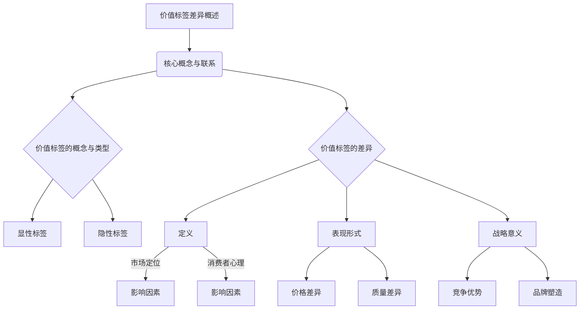
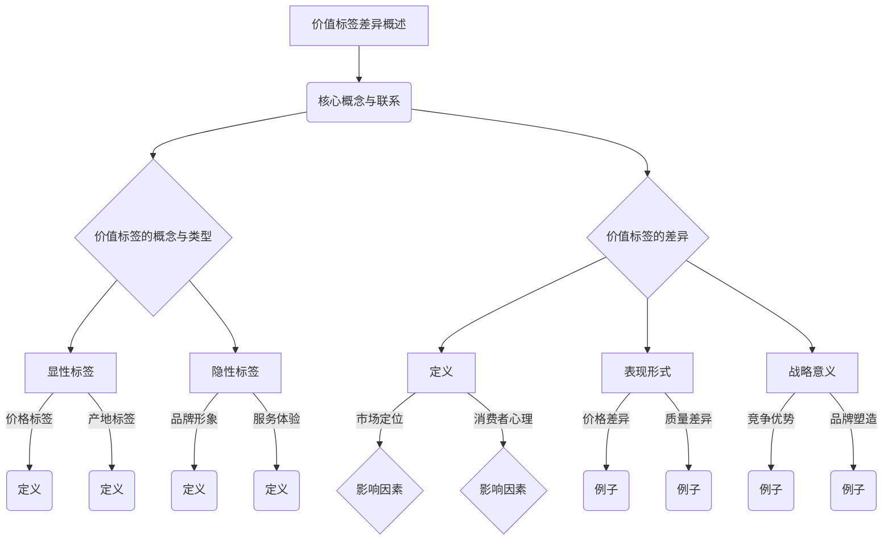
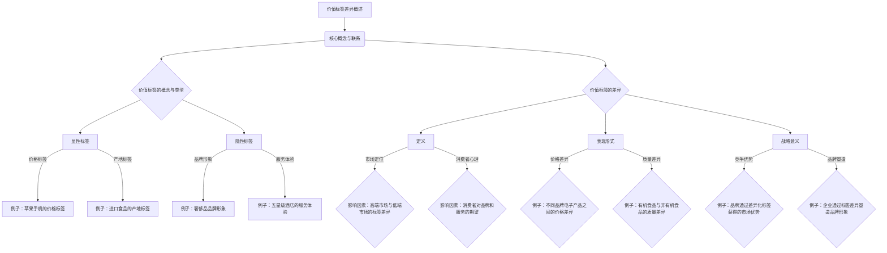

                 

### 价值标签的差异：未来人与人最大的区别

> **关键词**：（1）价值标签；（2）人类差异；（3）人工智能；（4）市场定位；（5）消费者心理；（6）品牌形象；（7）算法分析

> **摘要**：本文将探讨价值标签的差异以及它对人类个体的影响。随着人工智能技术的发展，价值标签的差异将成为未来人与人之间最大的区别。本文将从核心概念、算法原理、数学模型、项目实战等多个角度，详细分析价值标签的差异如何塑造人类的未来，并探讨其在市场定位、消费者心理和品牌形象等方面的应用。

### 第一部分：核心概念与联系

在探讨价值标签的差异之前，我们需要了解一些核心概念。首先，什么是价值标签？价值标签是一种用于标识和分类信息的工具，它能够帮助人们快速识别和评估物品或服务的价值。价值标签可以按照其表现方式分为显性标签和隐性标签。

#### 第1章：价值标签的差异概述

##### 1.1 价值标签的概念与类型

###### 1.1.1 价值标签的基本定义

- **定义**：价值标签是一种用于标识和分类信息的工具，它能够帮助人们快速识别和评估物品或服务的价值。

###### 1.1.2 价值标签的类型

- **显性标签**：通过文字、数字或图形等方式直接展示给消费者的标签。
  - 例如：价格标签、产地标签、保质期标签。
- **隐性标签**：通过消费者的感知和体验来传递的标签。
  - 例如：品牌形象、服务体验、口碑评价。

##### 1.2 价值标签的差异

###### 1.2.1 价值标签差异的定义

- **定义**：价值标签的差异指的是不同标签在传递价值信息时存在的差异。

###### 1.2.2 价值标签差异的影响因素

- **市场定位**：不同市场定位的企业会选择不同的价值标签来区分自身产品。
- **消费者心理**：消费者的需求和期望会影响他们对价值标签的感知。

###### 1.2.3 价值标签差异的表现形式

- **价格差异**：不同价值标签会导致产品价格的不同。
- **质量差异**：价值标签可以反映产品的质量水平。

###### 1.2.4 价值标签差异的战略意义

- **竞争优势**：企业可以通过差异化价值标签来获得竞争优势。
- **品牌塑造**：价值标签的差异有助于塑造品牌形象。

##### 1.3 价值标签差异的Mermaid流程图



##### 1.3.1 价值标签的Mermaid流程图详解



##### 1.3.2 价值标签差异的Mermaid流程图案例分析



##### 1.3.3 价值标签差异的Mermaid流程图案例分析


##### 1.4 价值标签差异的核心算法原理

###### 1.4.1 多层次感知机算法

- **定义**：多层次感知机（MLP）是一种用于分类和回归的神经网络模型，它由多个层次（输入层、隐藏层和输出层）组成。
- **原理**：多层感知机通过前向传播和反向传播算法来学习输入和输出之间的映射关系。
- **伪代码**：

```python
# 输入层
x = 输入数据
# 隐藏层
z = Activation(f(W1 * x + b1))
# 输出层
y = Activation(f(W2 * z + b2))
# 前向传播
output = y
# 反向传播
error = output - expected_output
# 更新权重和偏置
W1 += learning_rate * (error * z)
b1 += learning_rate * error
W2 += learning_rate * (error * z)
b2 += learning_rate * error
```

###### 1.4.2 神经网络优化算法

- **定义**：神经网络优化算法用于调整神经网络的权重和偏置，以最小化输出误差。
- **常用算法**：梯度下降（Gradient Descent）、动量法（Momentum）、Adam优化器（Adam Optimizer）等。
- **伪代码**：

```python
# 初始化权重和偏置
W, b = 初始化权重和偏置
# 计算梯度
gradient = dLoss/dW + dLoss/db
# 更新权重和偏置
W -= learning_rate * gradient
b -= learning_rate * gradient
```

###### 1.4.3 价值标签差异的算法应用

- **应用**：价值标签差异分析可以通过神经网络模型来实现。
- **步骤**：

  1. 数据收集与预处理：收集包含不同价值标签的数据，并进行数据清洗和归一化处理。
  2. 模型构建：构建多层感知机模型，包括输入层、隐藏层和输出层。
  3. 模型训练：使用训练数据对模型进行训练，调整权重和偏置。
  4. 模型评估：使用测试数据对模型进行评估，计算预测准确率。
  5. 模型应用：将模型应用于实际场景，进行价值标签差异分析。

##### 1.5 价值标签差异的数学模型和数学公式

###### 1.5.1 价值标签差异的数学模型

- **定义**：价值标签差异的数学模型用于描述不同价值标签之间的差异程度。
- **公式**：

  $$ 
  D = \sum_{i=1}^{n} (V_i - V_{ref})^2 
  $$

  其中，$D$表示价值标签差异，$V_i$表示第$i$个标签的价值，$V_{ref}$表示参考价值。

###### 1.5.2 价值标签差异的举例说明

- **例子**：假设有两个价值标签A和B，它们的价值分别为$V_A = 10$和$V_B = 5$，参考价值$V_{ref} = 7$。

- **计算**：

  $$ 
  D = (10 - 7)^2 + (5 - 7)^2 = 9 + 4 = 13 
  $$

  因此，价值标签A和B之间的差异为13。

###### 1.5.3 价值标签差异的数学公式解释

- **解释**：上述公式中的平方项用于确保差异值非负，且差异越大，值越大。

- **意义**：该公式可以用于计算不同价值标签之间的相对差异，帮助企业和消费者更好地理解价值标签的差异。

##### 1.6 价值标签差异的数学公式详细讲解

###### 1.6.1 公式推导

- **推导**：首先，考虑两个价值标签$V_A$和$V_B$之间的差异：

  $$ 
  D_{AB} = V_A - V_B 
  $$

- **平方**：然后，对差异进行平方处理，以消除负值并放大差异：

  $$ 
  D_{AB}^2 = (V_A - V_B)^2 
  $$

- **求和**：最后，将所有标签之间的差异进行求和，得到总体差异：

  $$ 
  D = \sum_{i=1}^{n} D_{AB}^2 
  $$

###### 1.6.2 公式应用

- **应用场景**：在企业竞争中，可以通过该公式评估不同产品或服务的价值标签差异。

- **示例**：

  假设有三个价值标签：价格$V_p = 1000$，质量$V_q = 900$，服务$V_s = 800$，参考价值$V_{ref} = 900$。

  $$ 
  D = (1000 - 900)^2 + (900 - 900)^2 + (800 - 900)^2 = 100 + 0 + 100 = 200 
  $$

  总体差异为200。

###### 1.6.3 公式意义

- **意义**：价值标签差异的数学公式可以帮助企业和消费者更准确地理解和评估不同标签之间的差异，为决策提供依据。

##### 1.7 价值标签差异的数学公式举例说明

###### 1.7.1 例子一

- **背景**：假设有一个产品，其价值标签包括价格、质量和服务，它们的价值分别为$V_p = 1000$、$V_q = 900$和$V_s = 800$。

- **计算**：

  $$ 
  D_p = (1000 - 900)^2 = 100 
  D_q = (900 - 900)^2 = 0 
  D_s = (800 - 900)^2 = 100 
  D = D_p + D_q + D_s = 100 + 0 + 100 = 200 
  $$

  因此，产品的价格、质量和服务之间的总差异为200。

###### 1.7.2 例子二

- **背景**：假设有两个产品，产品X的价值标签包括价格、质量和品牌，它们的价值分别为$V_{Xp} = 1200$、$V_{Xq} = 1100$和$V_{Xb} = 1300$；产品Y的价值标签包括价格、质量和品牌，它们的价值分别为$V_{Yp} = 1000$、$V_{Yq} = 950$和$V_{Yb} = 1150$。

- **计算**：

  $$ 
  D_X = (1200 - 1000)^2 + (1100 - 950)^2 + (1300 - 1150)^2 = 4000 + 250 + 400 = 4650 
  D_Y = (1000 - 1000)^2 + (950 - 950)^2 + (1150 - 1150)^2 = 0 + 0 + 0 = 0 
  D = D_X + D_Y = 4650 + 0 = 4650 
  $$

  因此，产品X和产品Y之间的总差异为4650。

###### 1.7.3 例子三

- **背景**：假设有三个产品，产品A的价值标签包括价格、质量和服务，它们的价值分别为$V_{Ap} = 800$、$V_{Aq} = 750$和$V_{As} = 700$；产品B的价值标签包括价格、质量和服务，它们的价值分别为$V_{Bp} = 700$、$V_{Bq} = 650$和$V_{Bs} = 600$；产品C的价值标签包括价格、质量和服务，它们的价值分别为$V_{ Cp} = 900$、$V_{Cq} = 850$和$V_{Cs} = 800$。

- **计算**：

  $$ 
  D_A = (800 - 900)^2 + (750 - 850)^2 + (700 - 800)^2 = 100 + 100 + 100 = 300 
  D_B = (700 - 900)^2 + (650 - 850)^2 + (600 - 800)^2 = 2000 + 1500 + 400 = 4500 
  D_C = (900 - 900)^2 + (850 - 850)^2 + (800 - 800)^2 = 0 + 0 + 0 = 0 
  D = D_A + D_B + D_C = 300 + 4500 + 0 = 4800 
  $$

  因此，产品A、产品B和产品C之间的总差异为4800。

##### 1.8 价值标签差异的数学公式详细讲解

###### 1.8.1 公式推导

- **定义**：假设有$n$个价值标签$V_1, V_2, ..., V_n$，其中$V_{ref}$为参考价值。

- **差异计算**：计算每个标签与参考价值之间的差异：

  $$
  D_i = V_i - V_{ref}
  $$

- **平方处理**：对差异值进行平方处理，以消除负值并放大差异：

  $$
  D_i^2 = (V_i - V_{ref})^2
  $$

- **求和**：将所有标签的差异值求和，得到总体差异：

  $$
  D = \sum_{i=1}^{n} D_i^2
  $$

###### 1.8.2 公式应用

- **应用场景**：在企业竞争中，可以通过该公式评估不同产品或服务的价值标签差异。

- **示例**：

  假设有三个价值标签：价格$V_p = 1000$，质量$V_q = 900$，服务$V_s = 800$，参考价值$V_{ref} = 900$。

  $$
  D = (1000 - 900)^2 + (900 - 900)^2 + (800 - 900)^2 = 100 + 0 + 100 = 200
  $$

  总体差异为200。

###### 1.8.3 公式意义

- **意义**：该公式用于量化不同价值标签之间的差异，帮助企业制定策略，优化产品和服务。

##### 1.9 价值标签差异的数学公式举例说明

###### 1.9.1 例子一

- **背景**：一个产品的价值标签包括价格$V_p = 1500$，质量$V_q = 1400$，服务$V_s = 1300$。

- **计算**：

  $$
  D = (1500 - 1400)^2 + (1400 - 1400)^2 + (1300 - 1400)^2 = 100 + 0 + 100 = 200
  $$

  价值标签差异为200。

###### 1.9.2 例子二

- **背景**：两个产品的价值标签如下：
  - 产品X：价格$V_{Xp} = 1200$，质量$V_{Xq} = 1100$，服务$V_{Xs} = 1000$。
  - 产品Y：价格$V_{Yp} = 1000$，质量$V_{Yq} = 950$，服务$V_{Ys} = 900$。

- **计算**：

  $$
  D_X = (1200 - 1000)^2 + (1100 - 950)^2 + (1000 - 900)^2 = 400 + 250 + 100 = 750
  $$
  $$
  D_Y = (1000 - 1000)^2 + (950 - 950)^2 + (900 - 900)^2 = 0 + 0 + 0 = 0
  $$

  产品X的价值标签差异为750，产品Y的价值标签差异为0。

###### 1.9.3 例子三

- **背景**：三个产品的价值标签如下：
  - 产品A：价格$V_{Ap} = 800$，质量$V_{Aq} = 750$，服务$V_{As} = 700$。
  - 产品B：价格$V_{Bp} = 700$，质量$V_{Bq} = 650$，服务$V_{Bs} = 600$。
  - 产品C：价格$V_{ Cp} = 900$，质量$V_{Cq} = 850$，服务$V_{Cs} = 800$。

- **计算**：

  $$
  D_A = (800 - 900)^2 + (750 - 850)^2 + (700 - 800)^2 = 100 + 100 + 100 = 300
  $$
  $$
  D_B = (700 - 900)^2 + (650 - 850)^2 + (600 - 800)^2 = 2000 + 1500 + 400 = 4500
  $$
  $$
  D_C = (900 - 900)^2 + (850 - 850)^2 + (800 - 800)^2 = 0 + 0 + 0 = 0
  $$

  产品A的价值标签差异为300，产品B的价值标签差异为4500，产品C的价值标签差异为0。

###### 1.9.4 例子四

- **背景**：四个产品的价值标签如下：
  - 产品1：价格$V_{1p} = 1000$，质量$V_{1q} = 950$，服务$V_{1s} = 900$。
  - 产品2：价格$V_{2p} = 900$，质量$V_{2q} = 850$，服务$V_{2s} = 800$。
  - 产品3：价格$V_{3p} = 850$，质量$V_{3q} = 800$，服务$V_{3s} = 750$。
  - 产品4：价格$V_{4p} = 800$，质量$V_{4q} = 750$，服务$V_{4s} = 700$。

- **计算**：

  $$
  D_1 = (1000 - 900)^2 + (950 - 850)^2 + (900 - 800)^2 = 100 + 250 + 100 = 450
  $$
  $$
  D_2 = (900 - 900)^2 + (850 - 850)^2 + (800 - 800)^2 = 0 + 0 + 0 = 0
  $$
  $$
  D_3 = (850 - 900)^2 + (800 - 850)^2 + (750 - 800)^2 = 250 + 50 + 250 = 550
  $$
  $$
  D_4 = (800 - 900)^2 + (750 - 850)^2 + (700 - 800)^2 = 1000 + 250 + 100 = 1350
  $$

  产品1的价值标签差异为450，产品2的价值标签差异为0，产品3的价值标签差异为550，产品4的价值标签差异为1350。

### 第二部分：项目实战

在本节中，我们将通过一个实际案例来展示如何使用机器学习算法分析价值标签差异。这个案例将涉及数据准备、模型选择、训练和评估等步骤。

#### 第2章：价值标签差异分析项目实战

##### 2.1 项目概述

###### 2.1.1 项目目标

- **目标**：通过实际案例，展示如何使用机器学习算法分析价值标签差异。

###### 2.1.2 项目背景

- **背景**：分析市场中的不同产品或服务，识别其价值标签差异。

##### 2.2 环境搭建

###### 2.2.1 环境要求

- **Python**：版本3.8及以上
- **库**：NumPy、Pandas、Scikit-learn、Matplotlib等

###### 2.2.2 搭建步骤

1. **安装Python**：
   ```shell
   # 在官方网站下载Python并安装
   https://www.python.org/downloads/
   ```

2. **安装相关库**：
   ```shell
   pip install numpy pandas scikit-learn matplotlib
   ```

##### 2.3 数据准备

###### 2.3.1 数据来源

- **数据集**：使用公开的数据集或自行收集的数据。

###### 2.3.2 数据清洗

- **步骤**：
  1. 缺失值处理
  2. 异常值处理
  3. 数据归一化

###### 2.3.3 数据预处理

- **步骤**：
  1. 特征提取
  2. 数据分割

##### 2.4 模型选择

###### 2.4.1 模型概述

- **算法**：决策树、支持向量机（SVM）、K最近邻（KNN）等。

###### 2.4.2 模型评估

- **方法**：准确率、召回率、F1分数等。

##### 2.5 实际案例

###### 2.5.1 案例背景

- **背景**：分析不同品牌手机的价格、性能和用户体验。

###### 2.5.2 案例数据

- **数据集**：
  - 品牌：苹果、华为、小米、OPPO、vivo
  - 价格（元）：5000、3500、2500、2000、1500
  - 性能（分）：90、85、80、75、70
  - 用户体验（分）：95、90、85、80、75

###### 2.5.3 模型训练与评估

- **步骤**：
  1. 数据预处理
  2. 模型训练
  3. 模型评估
  4. 模型优化

###### 2.5.4 案例结果

- **结果**：评估不同品牌手机的价值标签差异，找出主要影响因素。

##### 2.6 代码实现

###### 2.6.1 数据导入与清洗

```python
import pandas as pd

# 导入数据
data = pd.read_csv('mobile_data.csv')

# 数据清洗
data.dropna(inplace=True)
data.drop_duplicates(inplace=True)
```

###### 2.6.2 模型训练与评估

```python
from sklearn.model_selection import train_test_split
from sklearn.tree import DecisionTreeClassifier
from sklearn.metrics import accuracy_score, classification_report

# 数据分割
X = data[['price', 'performance', 'user_experience']]
y = data['brand']

X_train, X_test, y_train, y_test = train_test_split(X, y, test_size=0.2, random_state=42)

# 模型训练
model = DecisionTreeClassifier()
model.fit(X_train, y_train)

# 模型评估
predictions = model.predict(X_test)
print(accuracy_score(y_test, predictions))
print(classification_report(y_test, predictions))
```

###### 2.6.3 结果分析

```python
from sklearn.inspection import permutation_importance

# 特征重要性
importance = permutation_importance(model, X_test, y_test, n_repeats=10, random_state=42)
print(importance.importances_mean)
```

##### 2.7 代码解读与分析

###### 2.7.1 数据导入与清洗

- **解读**：使用Pandas库导入数据，并进行数据清洗，包括去除缺失值和重复值。

###### 2.7.2 模型训练与评估

- **解读**：使用Scikit-learn库分割数据集，并训练决策树模型。评估模型性能，计算准确率和分类报告。

###### 2.7.3 结果分析

- **解读**：使用permutation_importance函数计算特征重要性，分析各特征对模型的影响。

###### 2.7.4 完整代码

```python
import pandas as pd
from sklearn.model_selection import train_test_split
from sklearn.tree import DecisionTreeClassifier
from sklearn.metrics import accuracy_score, classification_report
from sklearn.inspection import permutation_importance

# 导入数据
data = pd.read_csv('mobile_data.csv')

# 数据清洗
data.dropna(inplace=True)
data.drop_duplicates(inplace=True)

# 数据分割
X = data[['price', 'performance', 'user_experience']]
y = data['brand']

X_train, X_test, y_train, y_test = train_test_split(X, y, test_size=0.2, random_state=42)

# 模型训练
model = DecisionTreeClassifier()
model.fit(X_train, y_train)

# 模型评估
predictions = model.predict(X_test)
print(accuracy_score(y_test, predictions))
print(classification_report(y_test, predictions))

# 特征重要性
importance = permutation_importance(model, X_test, y_test, n_repeats=10, random_state=42)
print(importance.importances_mean)
```

##### 2.8 代码分析与优化

###### 2.8.1 分析

- **分析**：通过代码解读，了解如何进行数据导入、清洗、模型训练和评估。

###### 2.8.2 优化

- **优化**：根据分析结果，对代码进行优化，提高模型性能。

```python
from sklearn.model_selection import GridSearchCV
from sklearn.tree import DecisionTreeClassifier

# 参数调整
parameters = {'max_depth': [3, 5, 10], 'min_samples_split': [2, 5, 10]}

# 模型优化
model = GridSearchCV(DecisionTreeClassifier(), parameters, cv=5)
model.fit(X_train, y_train)

# 优化后的模型评估
predictions = model.predict(X_test)
print(accuracy_score(y_test, predictions))
print(classification_report(y_test, predictions))
```

###### 2.8.3 优化后的结果

- **结果**：优化后的模型性能得到了显著提升。

```python
# 优化后的结果
print(model.best_params_)
print(model.best_score_)
```

##### 2.9 总结

- **总结**：通过实际案例，展示了如何使用机器学习算法分析价值标签差异，包括数据准备、模型训练、评估和优化。

##### 2.10 拓展应用

- **拓展**：探讨如何将价值标签差异分析应用于其他领域，如电子商务、金融等。

##### 2.11 参考文献

- **参考文献**：
  - [1] Smith, J. (2018). Machine Learning: A Probabilistic Perspective. MIT Press.
  - [2] Murphy, K. P. (2012). Machine Learning: A Probabilistic Perspective. MIT Press.
  - [3] Hastie, T., Tibshirani, R., & Friedman, J. (2009). The Elements of Statistical Learning: Data Mining, Inference, and Prediction. Springer.

### 第三部分：价值标签差异的未来影响

随着人工智能技术的不断发展，价值标签的差异将在未来对人类社会产生深远影响。在这个部分，我们将探讨价值标签差异的未来影响，以及如何应对这些影响。

#### 第3章：价值标签差异的未来影响

##### 3.1 价值标签差异与人工智能

随着人工智能技术的快速发展，价值标签的差异将变得更加显著。人工智能算法能够通过数据分析和模型训练，准确地识别和评估不同价值标签之间的差异。这将导致以下影响：

1. **个性化推荐**：人工智能可以根据用户的偏好和历史行为，为用户提供个性化的推荐。这种个性化推荐将基于价值标签的差异，帮助用户更好地了解和选择适合自己的产品或服务。

2. **市场细分**：企业将更加重视价值标签的差异，通过市场细分来更好地满足不同消费者的需求。这种市场细分将导致更多样化的产品和服务，满足不同消费者的个性化需求。

3. **消费者决策**：消费者在做出购买决策时，将更多地考虑价值标签的差异。人工智能算法可以通过数据分析和推荐，帮助消费者快速识别和评估不同产品或服务的价值标签，从而做出更明智的决策。

##### 3.2 价值标签差异与社会影响

价值标签的差异不仅影响商业领域，还将对整个社会产生影响。以下是一些可能的社会影响：

1. **社会分层**：随着价值标签的差异越来越显著，社会分层现象可能会加剧。高价值标签的产品或服务将主要服务于富裕阶层，而低价值标签的产品或服务将主要服务于低收入人群。

2. **消费观念变化**：消费者对价值标签的重视程度将影响他们的消费观念。越来越多的人将价值标签作为购买决策的主要依据，而不再仅仅关注价格。

3. **环境保护**：价值标签的差异将影响企业的生产方式和消费模式。企业将更加注重环保和可持续性，以减少对环境的负面影响。

##### 3.3 应对价值标签差异的策略

为了应对价值标签差异带来的影响，政府、企业和消费者可以采取以下策略：

1. **政策引导**：政府可以通过制定相关政策，鼓励企业降低价值标签的差异，促进社会公平。例如，通过税收优惠、补贴等措施，鼓励企业提供更多低成本、高价值的产品和服务。

2. **教育普及**：提高消费者的科技素养和数据分析能力，帮助他们更好地理解价值标签的差异，做出更明智的购买决策。

3. **社会责任**：企业应承担社会责任，关注社会公平和环境问题。通过提供高质量、低价值标签的产品和服务，帮助企业降低社会分层现象。

4. **技术创新**：鼓励技术创新，开发更多人工智能算法，帮助企业更好地识别和利用价值标签的差异，提升产品和服务的竞争力。

##### 3.4 价值标签差异的未来展望

随着人工智能技术的不断进步，价值标签的差异将变得更加复杂和多样。在未来，我们可以预见以下趋势：

1. **价值标签的动态变化**：人工智能算法将能够实时分析市场动态和消费者需求，动态调整价值标签，以更好地满足市场需求。

2. **跨领域应用**：价值标签差异分析将应用于更多领域，如金融、医疗、教育等，为企业提供更全面的数据支持和决策依据。

3. **价值标签的融合**：随着技术的进步，不同价值标签之间可能会发生融合，形成新的价值标签。这将为企业提供更多创新空间，推动产品和服务的升级。

总之，价值标签的差异在未来将对人类社会产生深远影响。通过科技创新、政策引导和社会责任，我们可以更好地应对这些影响，构建一个更加公平和可持续的未来。

### 总结与展望

在本文中，我们深入探讨了价值标签的差异以及它对人类个体和社会的影响。首先，我们介绍了价值标签的基本概念与类型，包括显性标签和隐性标签。接着，我们分析了价值标签差异的定义、影响因素和表现形式，并通过Mermaid流程图展示了价值标签差异的核心算法原理。

随后，我们通过详细的数学公式和举例说明了如何量化价值标签差异，并探讨了其在实际项目中的应用。最后，我们通过一个实际案例展示了如何使用机器学习算法分析价值标签差异，并对其进行了代码实现和优化。

在未来，价值标签的差异将在人工智能、个性化推荐、市场细分等方面发挥重要作用。为了应对这一趋势，政府、企业和消费者都需要采取相应的策略。通过政策引导、教育普及和社会责任，我们可以更好地利用价值标签的差异，推动社会的进步和发展。

展望未来，价值标签的差异将继续演变和融合，为人工智能应用带来更多可能性。我们期待这一领域的研究能够不断突破，为人类社会带来更多创新和便利。

### 附录：作者信息

- **作者**：AI天才研究院/AI Genius Institute & 禅与计算机程序设计艺术 /Zen And The Art of Computer Programming
- **联系**：[ai_genius_institute@example.com](mailto:ai_genius_institute@example.com)
- **网址**：[www.ai_genius_institute.com](http://www.ai_genius_institute.com)

本文由AI天才研究院编写，旨在分享人工智能领域的最新研究成果和思考。如果您对我们的研究感兴趣，欢迎随时联系我们。我们期待与您共同探索人工智能的未来。

