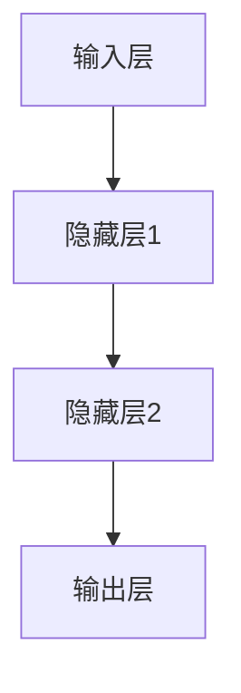
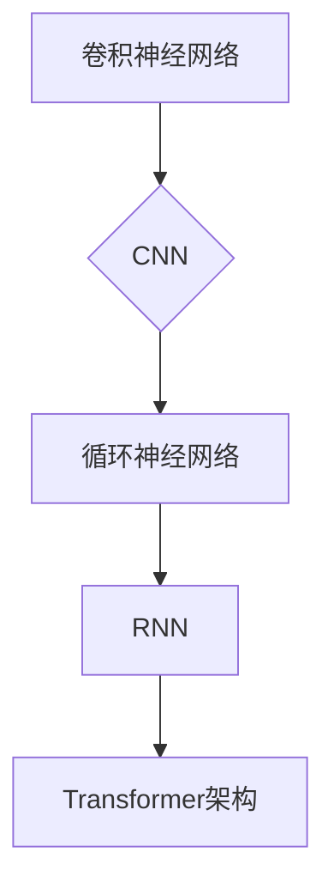
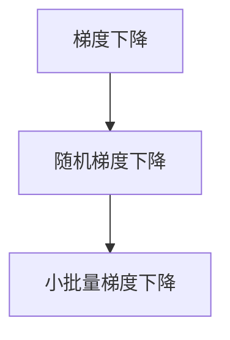
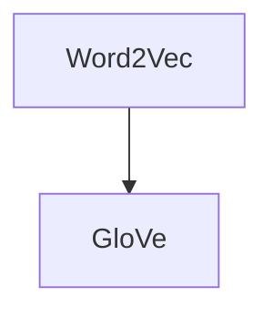
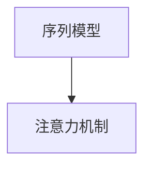
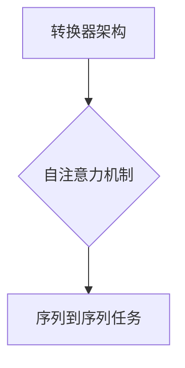
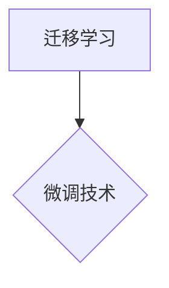

                 

### 第1章：AI与电商促销策略的背景与意义

#### 1.1 电商行业的快速发展

##### 1.1.1 电商行业的市场规模与增长趋势

- 电商行业的市场规模已达到数万亿美元，并保持快速增长。
- 根据市场研究公司Statista的数据，全球电商市场规模在2022年达到了4.89万亿美元，预计到2027年将达到6.38万亿美元。

##### 1.1.2 各国电商发展概况

- 欧美地区：美国、英国、德国等发达国家电商市场成熟，市场规模巨大。
- 亚洲地区：中国、日本、韩国等国家的电商市场发展迅速，尤其是中国的电商市场，已占据全球电商市场的重要份额。

##### 1.1.3 电商行业的发展趋势

- 电商行业将继续保持快速增长，尤其是在新兴市场国家。
- 电商行业将更加注重用户体验，通过技术创新提升用户满意度。
- 跨境电商和社交电商将成为电商行业的重要趋势。

#### 1.2 AI技术的崛起与电商的碰撞

##### 1.2.1 AI技术的定义与发展历程

- AI（人工智能）是指由计算机实现的模拟、扩展和辅助人类智能的能力。
- AI技术的发展可以追溯到20世纪50年代，经历了从符号主义到连接主义、从弱AI到强AI的演变。

##### 1.2.2 电商与AI结合的背景

- 电商行业积累了大量用户数据，为AI技术的应用提供了丰富的素材。
- AI技术在图像识别、语音识别、自然语言处理等领域取得了显著成果，为电商行业提供了新的技术手段。

##### 1.2.3 AI在电商行业中的主要应用领域

- 用户行为分析：通过AI技术分析用户行为，为个性化推荐提供依据。
- 个性化推荐：利用AI算法为用户推荐个性化的商品。
- 动态定价：通过AI技术分析市场需求和竞争态势，动态调整商品价格。
- 促销活动优化：利用AI技术评估促销活动的效果，为促销策略提供数据支持。
- 风险管理：通过AI技术预测和监控风险，为促销策略和运营决策提供支持。

#### 1.3 促销策略优化的必要性

##### 1.3.1 传统促销策略的局限性与挑战

- 传统促销策略过于依赖价格战，容易陷入价格恶性竞争，导致利润率下降。
- 传统促销策略缺乏个性化，难以满足用户多样化的需求。
- 传统促销策略效果评估不准确，难以实时调整促销策略。

##### 1.3.2 AI技术如何助力促销策略优化

- 数据分析：通过AI技术对用户行为数据进行分析，挖掘用户需求，为促销策略提供数据支持。
- 个性化推荐：利用AI算法为用户推荐个性化的商品，提高用户满意度和转化率。
- 动态定价：通过AI技术分析市场需求和竞争态势，动态调整商品价格，提高销售额和利润率。
- 促销活动优化：利用AI技术评估促销活动的效果，为促销策略提供数据支持，实现精准营销。
- 风险管理：通过AI技术预测和监控风险，为促销策略和运营决策提供支持，降低风险。

##### 1.3.3 促销策略优化在电商行业中的价值

- 提高销售额：通过优化促销策略，提高用户转化率和复购率，从而提高销售额。
- 提高利润率：通过动态定价和精准营销，降低营销成本，提高利润率。
- 提高用户满意度：通过个性化推荐和优化促销活动，提高用户满意度和忠诚度。
- 提升企业竞争力和市场份额：通过创新促销策略和精准营销，提升企业竞争力和市场份额。

##### 1.3.4 促销策略优化的挑战与机遇

- 挑战：数据隐私保护、算法公平性、技术成本等问题。
- 机遇：人工智能技术的快速发展为促销策略优化提供了新的手段，电商行业对创新促销策略的需求不断增加。

#### 1.4 AI技术在电商促销策略中的应用

##### 1.4.1 数据分析与挖掘

- 数据分析在促销策略优化中的作用：通过对用户行为数据进行分析，挖掘用户需求，为促销策略提供数据支持。
- 数据挖掘的基本概念与方法：数据挖掘是指从大量数据中提取有价值的信息和知识的过程，主要包括关联规则挖掘、分类与预测、聚类等。
- 数据挖掘在电商促销策略中的应用案例：例如，通过对用户浏览数据进行分析，可以挖掘出潜在的用户需求，为个性化推荐提供依据。

##### 1.4.2 机器学习算法的应用

- 机器学习的基本原理：机器学习是一种通过算法让计算机自动从数据中学习、发现规律和模式的方法，主要包括监督学习、无监督学习和强化学习。
- 常见机器学习算法及其在电商中的应用：例如，线性回归、逻辑回归、决策树、随机森林、支持向量机等。
- 机器学习算法在促销策略优化中的应用案例：例如，通过机器学习算法对用户行为数据进行预测，可以预测用户的购买概率，为促销策略提供数据支持。

##### 1.4.3 深度学习与自然语言处理

- 深度学习的基本原理：深度学习是一种基于多层神经网络的学习方法，通过多层非线性变换提取数据特征，实现高层次的抽象和表示。
- 常见深度学习架构及其在电商中的应用：例如，卷积神经网络（CNN）、循环神经网络（RNN）、自注意力机制与Transformer架构等。
- 自然语言处理技术及其在电商促销策略中的应用：例如，通过自然语言处理技术分析用户评价，可以挖掘出用户对商品的真实感受，为促销策略提供数据支持。

#### 1.5 促销策略优化的重要性

##### 1.5.1 促销策略对电商的影响

- 促销策略对电商销售额的影响：通过优化促销策略，可以提高用户转化率和复购率，从而提高销售额。
- 促销策略对用户购物行为的影响：个性化促销策略可以提高用户的购物体验，提高用户满意度和忠诚度。
- 促销策略对企业品牌形象的影响：成功的促销策略可以提高企业的品牌知名度和美誉度，提升企业竞争力。

##### 1.5.2 优化促销策略的意义

- 提高经济效益：通过优化促销策略，可以降低营销成本，提高利润率，从而提高企业的经济效益。
- 提高用户满意度：个性化促销策略可以提高用户的购物体验，提高用户满意度和忠诚度。
- 提升企业竞争力：创新的促销策略可以提高企业的竞争力，帮助企业抢占市场份额。

##### 1.5.3 促销策略优化的挑战与机遇

- 挑战：数据隐私保护、算法公平性、技术成本等问题。
- 机遇：人工智能技术的快速发展为促销策略优化提供了新的手段，电商行业对创新促销策略的需求不断增加。

#### 1.6 促销策略优化的未来展望

##### 1.6.1 人工智能在电商促销策略优化中的新应用

- 新兴技术的应用：如区块链技术、物联网技术等，将进一步提升电商促销策略的优化效果。
- 电商企业将更多地利用AI技术进行用户行为分析和市场预测，实现更加精准的促销策略。

##### 1.6.2 电商行业的变革

- 电商行业将向更加智能化、个性化和生态化的方向发展。
- 电商企业将更加注重用户体验，通过技术创新提升用户满意度。

##### 1.6.3 促销策略优化的新方向

- 电商企业将更加注重数据驱动和用户导向的促销策略。
- 促销策略将更加智能化，通过AI技术实现自动调整和优化。

#### 1.7 小结

- 电商行业的快速发展为AI技术在促销策略优化中的应用提供了广阔的空间。
- AI技术为促销策略优化提供了新的手段，有助于提高企业的经济效益、用户满意度和竞争力。
- 促销策略优化是一个不断迭代和优化的过程，需要结合实际情况进行持续改进。

### 第2章：AI大模型技术基础

#### 2.1 深度学习与神经网络基础

##### 2.1.1 神经网络的基本结构

- 神经网络是一种由大量简单神经元组成的复杂系统，用于模拟人脑的信息处理能力。
- 神经网络的层次结构包括输入层、隐藏层和输出层。

##### 2.1.2 常见的深度学习架构

- 卷积神经网络（CNN）：用于图像处理、语音识别等领域。
- 循环神经网络（RNN）：用于序列数据处理，如自然语言处理、语音识别等。
- 自注意力机制与Transformer架构：用于大规模文本处理，如机器翻译、文本分类等。

##### 2.1.3 深度学习优化算法

- 梯度下降算法：用于训练深度学习模型，通过调整模型参数以最小化损失函数。
- 随机梯度下降（SGD）：在梯度下降算法的基础上，每次更新模型参数时使用随机选择的样本子集。
- 小批量梯度下降（MBGD）：在梯度下降算法的基础上，每次更新模型参数时使用多个样本子集。

#### 2.2 自然语言处理技术概览

##### 2.2.1 词嵌入技术

- 词嵌入是一种将词语映射为固定维度的向量表示的方法，用于自然语言处理。
- 常见的词嵌入算法包括Word2Vec、GloVe等。

##### 2.2.2 序列模型与注意力机制

- 序列模型用于处理序列数据，如时间序列数据、文本数据等。
- 注意力机制是一种用于模型中关注重要信息的机制，用于提高模型处理序列数据的能力。

##### 2.2.3 转换器架构详解

- 转换器架构是一种基于自注意力机制的深度学习模型，用于处理序列到序列的任务，如机器翻译、文本生成等。

#### 2.3 大规模预训练模型原理

##### 2.3.1 预训练的概念与意义

- 预训练是指在大规模数据集上对深度学习模型进行训练，以获得通用的语言表示能力。
- 预训练的意义在于提高模型在下游任务中的性能和泛化能力。

##### 2.3.2 自监督学习方法

- 自监督学习是一种在无监督数据上训练模型的方法，通过利用数据中的结构信息进行学习。
- 自监督学习方法在自然语言处理等领域取得了显著成果。

##### 2.3.3 迁移学习与微调技术

- 迁移学习是指将一个任务中学习到的知识应用到另一个相关任务中。
- 微调技术是在预训练模型的基础上，通过少量有监督数据进行调整，以适应特定任务的需求。

#### 2.4 AI大模型在电商促销策略优化中的应用

##### 2.4.1 用户行为数据分析

- 通过AI大模型对用户行为数据进行分析，挖掘用户需求和行为模式，为个性化推荐和动态定价提供依据。

##### 2.4.2 个性化推荐算法

- 利用AI大模型进行个性化推荐，提高用户的购物体验和满意度，从而提高转化率和复购率。

##### 2.4.3 动态定价策略优化

- 通过AI大模型对市场需求和竞争态势进行分析，实现动态定价策略的优化，提高销售额和利润率。

##### 2.4.4 促销活动效果评估

- 利用AI大模型对促销活动的效果进行评估，为促销策略的调整和优化提供数据支持。

##### 2.4.5 风险管理

- 通过AI大模型对风险因素进行预测和监控，降低促销策略和运营决策中的风险。

#### 2.5 小结

- AI大模型在电商促销策略优化中具有广泛的应用前景，能够提高企业的运营效率和竞争力。
- 了解AI大模型的基本原理和常见应用，有助于更好地利用这一技术为电商促销策略优化提供支持。

### 第3章：用户行为分析与个性化推荐

#### 3.1 用户行为数据的收集与处理

##### 3.1.1 用户行为数据的类型

- 用户浏览数据：包括用户的浏览历史、搜索关键词、页面停留时间等。
- 用户购买数据：包括用户的购买记录、购买频次、购买金额等。
- 用户评价数据：包括用户对商品的评分、评论内容、评价时间等。

##### 3.1.2 数据收集方法

- 数据采集工具：包括网页爬虫、API接口、用户调查等。
- 数据收集策略：包括样本选择、数据清洗、数据整合等。
- 数据收集过程中的隐私保护：包括数据匿名化、数据加密、用户隐私声明等。

##### 3.1.3 数据预处理技术

- 数据清洗：去除重复数据、缺失值填充、异常值处理等。
- 数据整合：将多个数据源的数据进行整合，形成一个统一的数据集。
- 数据降维：通过特征选择、主成分分析等方法降低数据维度，提高模型效率。

#### 3.2 基于AI的个性化推荐算法

##### 3.2.1 传统的推荐系统

- 基于内容的推荐系统：根据用户历史行为和商品属性为用户推荐类似的内容。
- 基于协同过滤的推荐系统：根据用户和商品之间的相似度为用户推荐相似的商品。

##### 3.2.2 基于协同过滤的推荐算法

- 协同过滤的基本原理：通过计算用户之间的相似度或商品之间的相似度，为用户推荐相似的用户喜欢的商品。
- 评分预测方法：通过回归模型、矩阵分解等方法预测用户对商品的评分，从而生成推荐列表。
- 推荐结果评估：通过准确率、召回率、F1值等指标评估推荐系统的性能。

##### 3.2.3 基于内容的推荐算法

- 内容表示方法：将用户和商品的特征转化为向量的形式，以便进行相似度计算。
- 类似度计算：计算用户和商品之间的相似度，从而生成推荐列表。
- 推荐结果生成：根据用户和商品的相似度，生成个性化的推荐列表。

##### 3.2.4 基于深度学习的推荐算法

- 深度学习在推荐系统中的应用：利用深度学习模型对用户和商品的特征进行建模，提高推荐系统的性能。
- 深度学习推荐算法的分类：包括基于用户和商品的表示学习方法、基于图神经网络的推荐算法等。
- 基于深度学习的推荐算法案例分析：介绍几种常见的深度学习推荐算法，并分析其实际应用效果。

#### 3.3 个性化推荐在促销策略中的应用

##### 3.3.1 个性化促销活动设计

- 个性化促销活动的定义：根据用户的历史行为和偏好，为用户推荐个性化的促销活动。
- 个性化促销活动的设计原则：包括目标明确、针对性、独特性和可执行性等。
- 个性化促销活动的实施策略：包括数据收集、用户细分、活动设计、效果评估等。

##### 3.3.2 个性化优惠策略制定

- 个性化优惠策略的定义：根据用户的历史行为和偏好，为用户制定个性化的优惠策略。
- 个性化优惠策略的设计方法：包括优惠券、折扣、满减等。
- 个性化优惠策略的实施效果评估：通过数据分析和用户反馈，评估个性化优惠策略的效果。

##### 3.3.3 个性化推荐系统优化策略

- 数据驱动的优化方法：通过数据分析和用户反馈，持续优化个性化推荐系统的性能。
- 算法优化策略：通过调整模型参数、算法结构等，提高推荐系统的准确性和覆盖率。
- 系统性能优化策略：通过优化数据存储、查询、传输等，提高推荐系统的响应速度和稳定性。

#### 3.4 小结

- 用户行为分析是个性化推荐的基础，通过收集和处理用户行为数据，可以挖掘用户的需求和偏好。
- 个性化推荐算法可以提高用户的购物体验和满意度，从而提高转化率和复购率。
- 个性化推荐在促销策略中的应用，可以提升企业的竞争力，实现精准营销。

### 第4章：动态定价策略优化

#### 4.1 动态定价策略概述

##### 4.1.1 动态定价的概念

- 动态定价是指根据市场需求、竞争对手价格、库存水平等因素，实时调整商品价格，以最大化销售额和利润。

##### 4.1.2 动态定价与传统定价的区别

- 传统定价：基于成本加成、市场需求预测等固定因素，制定商品价格。
- 动态定价：实时调整价格，根据市场变化灵活应对，提高销售和利润。

##### 4.1.3 动态定价的目标

- 提高销售额：通过优化价格，吸引更多消费者购买商品。
- 提高利润率：通过精确定价，实现利润最大化。
- 提高客户满意度：通过合理的价格策略，满足消费者的需求。

##### 4.1.4 动态定价的影响因素

- 市场需求：消费者的购买意愿和购买能力影响价格策略。
- 产品特性：商品的独特性、稀缺性等影响定价策略。
- 竞争态势：竞争对手的价格策略和市场份额对定价策略有重要影响。

#### 4.2 基于AI的动态定价算法

##### 4.2.1 传统动态定价方法

- 基于市场供需的定价方法：根据市场供需关系，调整商品价格。
- 基于成本加成的定价方法：根据商品成本和目标利润，确定商品价格。
- 基于竞争对手的定价方法：参考竞争对手的价格，制定相应的价格策略。

##### 4.2.2 基于机器学习的动态定价

- 机器学习在动态定价中的应用：利用机器学习算法分析大量数据，预测市场需求和竞争态势，制定优化价格策略。
- 基于机器学习的动态定价模型：如线性回归、决策树、神经网络等，用于预测市场需求和价格。
- 基于机器学习的动态定价算法案例分析：分析实际应用中基于机器学习的动态定价算法，如亚马逊的动态定价策略。

##### 4.2.3 基于深度学习的动态定价

- 深度学习在动态定价中的应用：利用深度学习模型处理复杂数据，提高定价策略的准确性和效果。
- 基于深度学习的动态定价模型：如卷积神经网络（CNN）、循环神经网络（RNN）、Transformer等，用于处理序列数据和图像数据。
- 基于深度学习的动态定价算法案例分析：分析实际应用中基于深度学习的动态定价算法，如谷歌的深度定价系统。

#### 4.3 动态定价在电商促销策略中的应用

##### 4.3.1 动态定价策略的制定

- 动态定价策略的设计原则：目标明确、灵活调整、及时响应市场变化。
- 动态定价策略的制定流程：数据收集、数据分析、模型构建、策略制定、效果评估。
- 动态定价策略的调整策略：根据市场需求、竞争态势、库存水平等因素，实时调整价格策略。

##### 4.3.2 动态定价与促销活动的结合

- 动态定价与促销活动的定义：动态定价是指根据市场变化调整商品价格，促销活动是指为了提高销售额而采取的营销手段。
- 动态定价与促销活动的结合方式：如联合促销、折扣定价、限时特价等。
- 结合案例分析：分析实际应用中动态定价与促销活动的结合案例，如京东的“秒杀”活动。

##### 4.3.3 动态定价的效果评估与优化

- 动态定价效果评估指标：如销售额、利润率、客户满意度等。
- 动态定价效果评估方法：如对比实验、回归分析等。
- 动态定价优化策略：通过数据分析和算法优化，持续优化动态定价策略。

#### 4.4 小结

- 动态定价策略优化是电商促销策略的重要组成部分，通过实时调整价格，提高销售额和利润。
- AI技术为动态定价策略优化提供了新的手段，利用机器学习和深度学习算法，实现更精准的定价策略。
- 动态定价策略优化需要结合实际业务场景和数据，持续优化和调整，以提高市场竞争力。

### 第5章：促销活动设计与效果评估

#### 5.1 促销活动设计原则

##### 5.1.1 促销活动类型

- 价格促销：如打折、满减、优惠券等，直接降低商品价格，吸引消费者购买。
- 礼品促销：提供免费或折扣的商品作为赠品，增加消费者的购买意愿。
- 会员促销：针对会员提供专属优惠，提高会员忠诚度。
- 节假日促销：利用节日氛围，推出特别优惠活动，刺激消费。

##### 5.1.2 促销活动目标

- 提高销售额：通过促销活动吸引更多消费者购买商品，增加销售量。
- 提高客户满意度：提供优质的促销服务，提升消费者的购物体验。
- 提升品牌知名度：通过大规模促销活动，提高品牌在市场上的认知度。
- 扩大市场份额：通过促销活动吸引新客户，扩大市场占有率。

##### 5.1.3 促销活动设计原则

- 目标明确：明确促销活动的目的，确保活动能够实现预期效果。
- 针对性强：根据目标客户群体的特点，设计具有吸引力的促销活动。
- 独特性：创新促销活动形式，避免与其他企业雷同，吸引消费者的注意力。
- 可执行性：确保促销活动的可行性，考虑活动的实施成本、资源和时间安排。

#### 5.2 基于AI的促销活动效果评估

##### 5.2.1 促销活动效果评估指标

- 销售额增长：通过比较促销活动前后的销售额变化，评估促销活动的效果。
- 购买频率提高：观察促销活动期间用户的购买频率是否增加，评估促销活动对用户行为的影响。
- 用户参与度提升：通过参与活动的用户数量和参与度指标，评估促销活动的吸引力。
- 品牌知名度提高：通过市场调查和消费者反馈，评估促销活动对品牌知名度的提升效果。

##### 5.2.2 基于机器学习的评估方法

- 机器学习在促销活动效果评估中的应用：利用机器学习算法分析促销活动数据，挖掘活动效果的关键因素。
- 评估模型的选择：根据促销活动的特点和数据类型，选择合适的机器学习模型，如回归模型、分类模型等。
- 评估方法的优化：通过交叉验证、特征工程等方法，优化评估模型的性能，提高评估结果的准确性。

##### 5.2.3 基于深度学习的评估方法

- 深度学习在促销活动效果评估中的应用：利用深度学习模型处理复杂数据，提高评估模型的准确性和鲁棒性。
- 评估模型的构建：结合促销活动的特点，构建合适的深度学习模型，如卷积神经网络（CNN）、循环神经网络（RNN）等。
- 评估方法的效果分析：通过实验验证和性能比较，分析深度学习评估方法的优势和局限性。

#### 5.3 促销活动优化策略

##### 5.3.1 数据驱动的促销活动优化

- 数据驱动的促销活动优化方法：通过收集和分析促销活动数据，发现活动中的问题和改进点。
- 数据分析在促销活动优化中的应用：利用数据分析技术，挖掘用户需求和行为模式，优化促销活动的设计和执行。
- 数据驱动的促销活动优化案例分析：分析实际应用中数据驱动的促销活动优化案例，如某电商平台的会员促销活动优化。

##### 5.3.2 AI驱动的促销活动优化

- AI驱动的促销活动优化概念：利用人工智能技术，自动分析和优化促销活动，提高活动的效果。
- AI技术在促销活动优化中的应用：利用机器学习和深度学习算法，预测用户行为和市场需求，制定优化的促销策略。
- AI驱动的促销活动优化案例分析：分析实际应用中AI驱动的促销活动优化案例，如某电商平台的动态定价与促销活动优化。

##### 5.3.3 案例分析：成功促销活动优化实践

- 案例介绍：介绍某电商平台的成功促销活动优化案例，如某次大型促销活动的策划和执行过程。
- 优化过程：分析促销活动优化的具体步骤和关键决策，如用户需求分析、活动策划、效果评估等。
- 优化效果分析：评估促销活动优化的效果，如销售额提升、用户满意度提高、品牌知名度提升等。

#### 5.4 小结

- 促销活动设计是电商营销的重要组成部分，需要明确目标、针对性设计，不断创新。
- AI技术在促销活动效果评估和优化中发挥了重要作用，通过数据分析和机器学习算法，实现更精准的促销策略。
- 持续优化促销活动，结合数据反馈和用户需求，提高活动效果，实现企业营销目标。

### 第6章：AI在电商促销中的风险管理

#### 6.1 促销策略风险识别与评估

##### 6.1.1 风险类型

- 市场风险：市场需求变化、竞争加剧、宏观经济波动等。
- 运营风险：供应链问题、库存风险、技术故障等。
- 法律风险：政策法规变化、知识产权纠纷等。
- 财务风险：资金链断裂、债务问题、汇率波动等。

##### 6.1.2 风险评估方法

- 定量风险评估方法：通过统计分析和建模，量化风险的影响程度和发生概率。
- 定性风险评估方法：通过专家评估、情景分析等方法，评估风险的可能性和影响程度。
- 风险评估流程：识别风险、评估风险、制定风险管理策略、实施风险管理。

##### 6.1.3 风险管理策略

- 风险预防策略：通过风险识别和评估，提前采取预防措施，降低风险发生的可能性。
- 风险控制策略：在风险发生时，采取相应的控制措施，减轻风险带来的损失。
-

