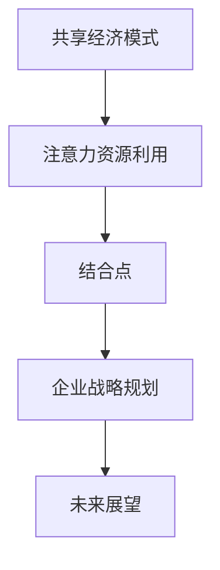

                 

# 《共享经济模式与注意力资源的利用》

> **关键词：** 共享经济、注意力资源、平台、用户行为、优化策略、案例研究。

> **摘要：** 本文章深入探讨了共享经济模式的发展、关键要素、优势与挑战，同时详细分析了注意力资源的概念、获取与利用策略。在此基础上，探讨了注意力资源在共享经济中的应用，并通过具体案例展示了注意力资源优化策略在实际项目中的实施。文章最后提出了未来展望与潜在挑战，为共享经济模式与注意力资源利用提供了新思路。

## 《共享经济模式与注意力资源的利用》目录大纲

### 第一部分：共享经济模式概述

#### 第1章：共享经济的起源与发展

1.1 共享经济的概念

1.2 共享经济的演进历程

1.3 共享经济的主要模式

#### 第2章：共享经济的关键要素

2.1 平台与网络

2.2 共享资源的分类与特点

2.3 用户行为分析

#### 第3章：共享经济模式的优势与挑战

3.1 优势分析

3.2 挑战分析

3.3 未来趋势与展望

### 第二部分：注意力资源的利用

#### 第4章：注意力资源概述

4.1 注意力资源的概念

4.2 注意力资源的重要性

4.3 注意力资源的分类

#### 第5章：注意力资源的获取与利用策略

5.1 注意力资源的获取方法

5.2 注意力资源的分配策略

5.3 注意力资源的优化策略

#### 第6章：注意力资源在共享经济中的应用

6.1 社交媒体中的注意力资源利用

6.2 内容营销中的注意力资源利用

6.3 用户体验设计中的注意力资源利用

#### 第7章：案例研究

7.1 共享单车平台：摩拜单车

7.2 分享住宿平台：爱彼迎

7.3 其他行业案例分析

### 第三部分：共享经济模式与注意力资源利用的综合应用

#### 第8章：共享经济与注意力资源利用的结合点

8.1 共享经济中的注意力资源利用策略

8.2 注意力资源在共享经济中的价值创造

8.3 注意力资源对共享经济模式的影响

#### 第9章：企业战略规划与实践

9.1 企业如何利用共享经济模式

9.2 企业如何利用注意力资源提升竞争力

9.3 实战案例分析

#### 第10章：未来展望与挑战

10.1 共享经济模式与注意力资源利用的融合发展趋势

10.2 政策与法律法规的影响

10.3 潜在挑战与应对策略

## 附录

### 附录 A：共享经济与注意力资源利用相关资源

#### A.1 学术论文与研究报告

#### A.2 实用工具与平台

#### A.3 推荐阅读与参考文献

### 附录 B：共享经济模式与注意力资源利用的Mermaid流程图

### 附录 C：注意力资源优化策略伪代码

### 附录 D：注意力资源利用案例分析

#### D.1 案例一：社交媒体平台的内容推荐算法

#### D.2 案例二：在线教育平台的用户行为分析

#### D.3 案例三：共享单车平台的用户注意力资源分配策略

### 附录 E：共享经济模式与注意力资源利用的数学模型与公式

#### E.1 注意力资源的数学模型

#### E.2 注意力资源分配策略的优化目标

#### E.3 用户行为分析中的注意力资源模型

### 附录 F：开发环境搭建与代码解读

#### F.1 开发环境搭建指南

#### F.2 注意力资源优化算法实现

#### F.3 案例代码分析与解读

## 第一部分：共享经济模式概述

### 第1章：共享经济的起源与发展

共享经济作为一种新兴的经济模式，近年来在全球范围内迅速发展。它以资源共享为核心，通过互联网平台实现闲置资源的有效配置，提升了资源利用效率。本章节将从共享经济的概念、演进历程和主要模式三个方面进行介绍。

#### 1.1 共享经济的概念

共享经济（Sharing Economy），又称协作消费，指的是通过互联网平台将个人或组织的闲置资源（如房屋、车辆、时间、技能等）共享给其他需求者，实现资源的高效利用和价值的最大化。共享经济的核心在于去中介化，通过平台连接供需双方，降低交易成本，提高交易效率。

#### 1.2 共享经济的演进历程

共享经济的发展可以追溯到20世纪末。早期的共享经济主要表现在个人间的物品交换和互助行为。随着互联网技术的快速发展，特别是移动互联网的普及，共享经济逐渐从线下走向线上，形成了一系列以互联网平台为核心的共享模式。以下是共享经济的主要演进历程：

1. **物品共享**：以Craigslist、eBay等平台为代表，用户可以通过这些平台共享闲置物品。

2. **空间共享**：以Airbnb为代表，用户可以将自己的房屋或房间共享给旅行者。

3. **交通共享**：以Uber、Lyft等平台为代表，用户可以通过这些平台共享车辆和打车服务。

4. **劳动力共享**：以Upwork、Freelancer等平台为代表，用户可以通过这些平台共享自己的技能和劳动力。

5. **服务共享**：以TaskRabbit、Taskpop等平台为代表，用户可以共享各种服务，如家庭清洁、修理等。

#### 1.3 共享经济的主要模式

共享经济模式多种多样，以下是其中几种主要的模式：

1. **C2C（Consumer-to-Consumer）模式**：这种模式是个人对个人的共享，如个人闲置房屋的共享（Airbnb）、个人技能的共享（Upwork）。

2. **B2C（Business-to-Consumer）模式**：这种模式是企业对消费者的共享，如企业提供的打车服务（Uber、Lyft）。

3. **P2P（Peer-to-Peer）模式**：这种模式是点对点的共享，如P2P贷款、P2P租车。

4. **C2B（Consumer-to-Business）模式**：这种模式是消费者驱动企业的共享，如消费者提出需求，企业根据需求生产产品。

#### 1.4 共享经济的特点

共享经济具有以下特点：

1. **去中心化**：共享经济通过互联网平台连接供需双方，去除了传统的中介环节，实现了去中心化。

2. **灵活性**：共享经济可以根据需求灵活地调配资源，满足不同用户的需求。

3. **高效性**：通过共享经济平台，用户可以快速找到所需的资源，降低了交易成本。

4. **可持续性**：共享经济通过提高资源利用效率，有助于减少资源浪费，实现可持续发展。

### 小结

本章介绍了共享经济的概念、演进历程和主要模式。共享经济作为一种新兴的经济模式，通过互联网平台实现闲置资源的共享，提高了资源利用效率，具有去中心化、灵活性、高效性和可持续性等特点。在下一章中，我们将深入探讨共享经济的关键要素。

### 第2章：共享经济的关键要素

共享经济模式的成功离不开其关键要素的支持。这些关键要素包括平台、共享资源和用户行为。本章节将分别介绍这些要素的定义、特点和相互关系。

#### 2.1 平台与网络

平台是共享经济模式的核心，它起到了连接供需双方、提供交易机制、管理共享资源等重要作用。平台通常具有以下几个特点：

1. **去中心化**：共享经济平台通常采用去中心化的架构，避免了单一中心化平台的单点故障风险，提高了系统的鲁棒性。

2. **透明性**：平台通过互联网技术，使得资源信息和用户行为透明化，用户可以清晰地了解资源的供需情况，提高了交易的效率。

3. **可信性**：共享经济平台通常采用加密技术和隐私保护措施，保障用户信息和交易的安全性，增强了用户的信任。

4. **灵活性**：平台可以根据用户需求灵活调整共享资源的分配和管理策略，提高资源利用效率。

网络是平台运行的载体，它为平台提供了连接供需双方的技术支持。网络的特点包括：

1. **广覆盖**：网络需要覆盖广泛的区域，确保用户能够随时随地接入平台。

2. **高速度**：网络需要具备高速传输能力，确保用户能够快速获取资源和完成交易。

3. **稳定性**：网络需要具备高稳定性，避免因网络故障导致平台无法正常运行。

#### 2.2 共享资源的分类与特点

共享资源是共享经济模式中的核心元素，它们可以是实物资源，如房屋、车辆、设备等，也可以是虚拟资源，如知识、技能、时间等。共享资源的分类和特点如下：

1. **实物资源**：实物资源通常具有物理形态，如房屋、车辆、设备等。它们的特点包括：

   - **稀缺性**：实物资源通常是有限的，需要通过共享来提高利用效率。
   - **可转移性**：实物资源可以在不同用户之间转移，如房屋出租、车辆共享等。
   - **易损耗性**：实物资源在使用过程中可能会发生损耗，需要定期维护。

2. **虚拟资源**：虚拟资源通常不具有物理形态，如知识、技能、时间等。它们的特点包括：

   - **无限性**：虚拟资源通常是无限的，可以反复利用，如在线教育、远程办公等。
   - **易共享性**：虚拟资源可以通过互联网平台快速共享，无需物理转移。
   - **高复用性**：虚拟资源可以被多个用户同时使用，提高了资源利用效率。

#### 2.3 用户行为分析

用户行为是共享经济模式的重要组成部分，它决定了共享资源的供需关系。对用户行为进行分析，有助于平台更好地设计共享模式和优化用户体验。用户行为分析主要包括以下几个方面：

1. **需求分析**：通过分析用户的需求特征，了解用户对共享资源的需求类型、频率和偏好。

2. **供给分析**：通过分析共享资源的供给情况，了解资源的供需平衡情况，及时调整共享策略。

3. **行为分析**：通过分析用户在使用共享资源过程中的行为模式，如评价、反馈、使用频率等，优化用户体验和资源分配策略。

4. **风险分析**：通过分析用户行为中的潜在风险，如违约、欺诈等，制定相应的风险防控措施。

#### 2.4 平台、共享资源和用户行为的相互关系

平台、共享资源和用户行为三者之间相互影响、相互依存。平台通过连接共享资源和用户，提供了共享服务和交易机制；共享资源是平台的核心资源，决定了平台的服务范围和用户满意度；用户行为是平台运营的重要驱动力，通过用户需求和行为分析，平台可以不断优化服务和资源配置策略。

### 小结

本章介绍了共享经济模式的关键要素，包括平台、共享资源和用户行为。平台作为核心要素，连接了共享资源和用户，提供了共享服务和交易机制；共享资源是平台运营的基础，决定了平台的服务质量和用户满意度；用户行为是平台运营的重要驱动力，通过用户需求和行为分析，平台可以不断优化服务和资源配置策略。在下一章中，我们将深入探讨共享经济模式的优势与挑战。

### 第3章：共享经济模式的优势与挑战

共享经济模式作为一种新兴的经济模式，具有显著的优势，但也面临着诸多挑战。本章节将从优势分析和挑战分析两个方面进行讨论，并展望共享经济的未来趋势。

#### 3.1 优势分析

共享经济模式的优势主要体现在以下几个方面：

1. **提高资源利用效率**：共享经济通过互联网平台将闲置资源进行整合和共享，提高了资源的利用效率。例如，通过共享经济平台，个人可以将闲置的房屋、车辆等资源出租给有需要的用户，从而实现资源的最大化利用。

2. **降低交易成本**：共享经济去除了传统中介环节，直接连接供需双方，降低了交易成本。用户可以在平台上快速找到所需的资源，无需花费大量时间和精力进行线下寻找和谈判。

3. **促进公平分配**：共享经济模式使得资源能够更加公平地分配。通过共享平台，任何人都可以根据自身的需求获取资源，打破了传统资源分配中的壁垒和歧视。

4. **推动创新和创业**：共享经济模式为创业者提供了新的机会。通过搭建共享平台，创业者可以探索新的商业模式，提供创新的服务，从而推动经济的发展。

5. **提高社会包容性**：共享经济模式有助于提高社会的包容性。例如，通过共享住宿平台，旅行者可以更加轻松地找到住宿，而房东可以通过出租房屋获得额外的收入，从而改善生活质量。

#### 3.2 挑战分析

尽管共享经济模式具有显著的优势，但在实际运营中也面临着诸多挑战：

1. **法律和监管问题**：共享经济模式的发展带来了许多法律和监管问题。例如，共享住宿平台中的房东和房客之间的关系如何界定，共享出行平台中的司机和乘客之间的权益如何保障等。这些问题的存在可能会阻碍共享经济模式的健康发展。

2. **用户信任问题**：共享经济模式依赖于用户之间的信任。然而，由于信息不对称、隐私泄露等原因，用户可能会对共享平台和共享资源持怀疑态度，从而影响共享经济模式的发展。

3. **安全问题**：共享经济模式中的资源共享和交易过程可能存在安全风险。例如，共享住宿平台中的入住安全、共享出行平台中的交通事故等。这些问题需要通过技术手段和管理措施进行有效解决。

4. **服务质量问题**：共享经济模式中的服务质量难以保证。由于用户之间的差异和平台监管的难度，共享资源的服务质量可能无法达到用户的期望，从而影响用户体验。

5. **竞争压力**：共享经济领域竞争激烈，新进入者需要面临老平台的竞争压力。此外，共享经济模式之间的跨界竞争也可能导致资源和服务质量的下降。

#### 3.3 未来趋势与展望

共享经济模式的发展趋势和未来展望可以从以下几个方面进行分析：

1. **技术创新**：随着人工智能、大数据、区块链等技术的不断发展，共享经济模式将更加智能化、高效化。例如，通过人工智能技术，可以更好地预测用户需求，优化资源分配；通过区块链技术，可以增强交易的透明性和安全性。

2. **平台整合**：共享经济领域可能会出现平台整合的趋势。大型平台通过兼并收购、合作联盟等方式，进一步扩大市场份额，提高资源利用效率。

3. **多元化发展**：共享经济模式将不断拓展新的应用领域。例如，在医疗、教育、农业等领域，共享经济模式有望发挥重要作用，提高相关行业的效率和效益。

4. **政策支持**：政府对共享经济模式的政策支持将有助于其健康发展。例如，制定相关法律法规，规范共享经济行为，保护用户权益；提供财政支持，鼓励创新和创业。

5. **可持续发展**：共享经济模式与可持续发展理念相契合。通过提高资源利用效率，减少资源浪费，共享经济有助于实现可持续发展目标。

### 小结

本章对共享经济模式的优势与挑战进行了详细分析。共享经济模式在提高资源利用效率、降低交易成本、促进公平分配等方面具有显著优势，但也面临着法律和监管、用户信任、安全、服务质量等方面的挑战。展望未来，共享经济模式将随着技术创新和多元化发展的推进，不断优化和升级，为经济和社会发展做出更大贡献。

## 第二部分：注意力资源的利用

### 第4章：注意力资源概述

注意力资源是共享经济模式中至关重要的要素，它直接影响着用户的行为和平台的运营效果。本章节将介绍注意力资源的概念、重要性以及其分类。

#### 4.1 注意力资源的概念

注意力资源（Attention Resources）是指个体在感知、认知和信息处理过程中所投入的脑力资源。它是人类大脑对信息的筛选和处理能力，决定了个体对特定信息的关注程度和处理速度。在共享经济模式中，注意力资源尤为重要，因为它关系到用户对共享资源的关注和参与度。

#### 4.2 注意力资源的重要性

注意力资源在共享经济模式中的重要性体现在以下几个方面：

1. **用户参与度**：用户对共享资源的注意力越高，参与度越高，从而更有可能转化为实际使用和评价。高参与度有助于平台积累用户反馈，优化服务体验。

2. **资源分配效率**：注意力资源的使用效率直接影响共享资源的分配和利用。通过优化注意力资源的管理，可以提高资源利用效率，减少资源浪费。

3. **平台运营效果**：注意力资源的分配和管理直接关系到平台的运营效果。有效的注意力资源利用可以提升平台用户活跃度，增加用户粘性，促进平台持续发展。

4. **市场竞争力**：在共享经济市场中，注意力资源的管理能力成为平台竞争的重要因素。具备高效注意力资源管理能力的企业可以在激烈的市场竞争中脱颖而出。

#### 4.3 注意力资源的分类

注意力资源可以根据不同的维度进行分类，常见的分类方法包括以下几种：

1. **按用途分类**：

   - **任务注意力**：用户在完成特定任务时所投入的注意力资源，如使用共享单车、预订住宿等。

   - **娱乐注意力**：用户在娱乐活动中所投入的注意力资源，如观看视频、玩游戏等。

   - **社交注意力**：用户在社交互动中所投入的注意力资源，如参与社交网络讨论、社交媒体互动等。

2. **按强度分类**：

   - **高强度注意力**：用户在处理复杂、重要任务时所投入的注意力资源，如阅读重要文档、处理紧急事务等。

   - **低强度注意力**：用户在处理简单、不紧急任务时所投入的注意力资源，如浏览网页、刷社交媒体等。

3. **按来源分类**：

   - **内部来源**：用户自身内在的兴趣、需求和动机，如个人爱好、职业需求等。

   - **外部来源**：外部环境因素对用户注意力资源的刺激，如广告、推荐等。

4. **按持续时间分类**：

   - **短暂注意力**：用户在短时间内对信息的注意力，如社交媒体上的快速浏览。

   - **长期注意力**：用户在较长时间内对信息的持续关注，如订阅内容、长期合作等。

### 小结

本章介绍了注意力资源的概念、重要性以及分类。注意力资源在共享经济模式中扮演着关键角色，它直接影响用户参与度、资源分配效率、平台运营效果和市场竞争力。通过合理利用注意力资源，共享经济平台可以优化用户体验，提高资源利用效率，增强市场竞争力。在下一章中，我们将进一步探讨注意力资源的获取与利用策略。

### 第5章：注意力资源的获取与利用策略

注意力资源的获取与利用是共享经济平台成功运营的关键。为了有效地获取和利用注意力资源，平台需要制定科学的策略，提高用户参与度和平台活跃度。本章节将详细讨论注意力资源的获取方法、分配策略和优化策略。

#### 5.1 注意力资源的获取方法

注意力资源的获取是共享经济平台的第一步，平台需要通过多种途径吸引用户的注意力。以下是几种常见的获取方法：

1. **内容营销**：通过创造高质量的内容吸引用户的注意力，如发布有趣、实用的文章、视频、图片等。

2. **社交媒体推广**：利用社交媒体平台进行广告投放、推广活动，提高平台的曝光度和用户关注度。

3. **用户推荐**：通过用户推荐机制鼓励现有用户邀请新用户加入平台，利用社交网络效应扩大用户基础。

4. **优惠券和促销**：提供优惠券、折扣等促销活动，吸引用户进行首次使用和复购。

5. **个性化推荐**：基于用户行为数据，提供个性化的内容和服务，提高用户满意度和参与度。

6. **社区建设**：建立用户社区，鼓励用户参与讨论、分享经验，增强用户归属感和平台活跃度。

#### 5.2 注意力资源的分配策略

注意力资源的分配策略决定了用户在不同共享资源之间的注意力投入。为了提高资源利用效率和用户体验，平台需要制定合理的分配策略。以下是几种常见的分配策略：

1. **优先级分配**：根据资源的稀缺性和用户需求，设定不同的优先级。例如，将更多注意力资源分配给稀缺资源或急需的用户。

2. **按需分配**：根据用户的实际需求，动态调整注意力资源的分配。例如，在高峰期增加对热门资源的注意力投入。

3. **公平分配**：确保所有用户在资源分配上享有公平的机会，避免资源过度集中或分配不均。

4. **积分奖励**：通过积分系统激励用户积极参与平台活动，提高用户对资源的关注度和使用频率。

5. **利益分配**：将注意力资源的分配与用户利益挂钩，如通过积分、优惠券等方式回馈用户。

#### 5.3 注意力资源的优化策略

优化注意力资源的使用是提高共享经济平台效率和用户体验的关键。以下是一些常见的优化策略：

1. **数据分析**：通过数据分析了解用户的注意力分布和需求变化，优化资源分配策略。

2. **算法优化**：利用机器学习算法优化注意力资源的分配，提高资源利用效率。

3. **用户体验设计**：优化平台界面和功能，提高用户的操作效率和满意度，从而提高注意力资源的使用效果。

4. **激励机制**：通过奖励机制激励用户积极参与平台活动，提高用户对资源的关注度和使用频率。

5. **用户教育**：通过教育用户了解共享经济模式的优势和使用方法，提高用户对资源的理解和利用能力。

#### 5.4 注意力资源获取与利用的实际案例

以下是一个关于注意力资源获取与利用的实际案例：

**案例：共享单车平台**

共享单车平台通过以下策略获取和利用注意力资源：

1. **内容营销**：通过社交媒体发布有趣、实用的内容，如单车使用指南、骑行技巧等，吸引用户的关注。

2. **社交媒体推广**：在微信、微博等社交媒体平台上投放广告，提高平台的曝光度和用户关注度。

3. **用户推荐**：通过推荐机制鼓励用户邀请好友使用平台，利用社交网络效应扩大用户基础。

4. **优惠券和促销**：提供首次免费骑行、优惠券等促销活动，吸引用户进行首次使用和复购。

5. **个性化推荐**：通过用户行为数据分析，为用户推荐附近的热门路线和优惠活动。

6. **社区建设**：建立用户社区，鼓励用户分享骑行经验，增强用户归属感和平台活跃度。

7. **优先级分配**：在高峰期增加对热门区域的单车供应，确保用户能够及时获取所需资源。

8. **数据分析**：通过数据分析了解用户的骑行时间和路线，优化单车投放策略。

9. **用户体验设计**：优化APP界面和功能，提高用户的操作效率和满意度。

10. **激励机制**：通过积分系统激励用户积极参与平台活动，如每日签到、完成骑行任务等。

通过以上策略，共享单车平台有效地获取和利用了注意力资源，提高了用户参与度和资源利用效率。

### 小结

本章详细讨论了注意力资源的获取与利用策略，包括获取方法、分配策略和优化策略。通过有效的注意力资源管理，共享经济平台可以吸引更多用户，提高资源利用效率，增强市场竞争力。在下一章中，我们将探讨注意力资源在共享经济中的应用，进一步展示其在实际项目中的重要作用。

### 第6章：注意力资源在共享经济中的应用

注意力资源在共享经济中扮演着关键角色，它的合理利用能够显著提升用户参与度、平台活跃度和资源利用率。本章节将探讨注意力资源在社交媒体、内容营销和用户体验设计中的具体应用。

#### 6.1 社交媒体中的注意力资源利用

社交媒体是共享经济平台获取用户注意力的重要渠道。通过精心设计的社交媒体策略，平台可以吸引用户关注并提高用户粘性。

1. **内容创作**：平台可以通过发布高质量、有趣的内容，如教程、短视频、用户故事等，吸引用户的注意力。这些内容需要具备教育性、娱乐性和实用性，以满足不同用户的需求。

2. **互动营销**：通过开展互动活动，如抽奖、问答、用户投票等，激发用户的参与热情。这些活动不仅能够增加用户在平台上的停留时间，还能促进用户之间的互动和分享。

3. **KOL合作**：与知名意见领袖（KOL）合作，利用KOL的影响力扩大平台的知名度和用户基础。KOL可以为平台发布推荐内容，引导用户关注和使用平台服务。

4. **实时反馈**：及时回应用户在社交媒体上的评论和反馈，提高用户的满意度和信任度。实时互动能够增强用户对平台的归属感和忠诚度。

#### 6.2 内容营销中的注意力资源利用

内容营销是共享经济平台提升品牌知名度、吸引潜在用户的重要手段。通过有效的内容策略，平台可以引导用户注意力，实现品牌传播和用户转化。

1. **目标受众分析**：通过市场调研和用户分析，明确目标受众的特征和需求，制定有针对性的内容策略。

2. **内容多样化**：结合文字、图片、视频、音频等多种内容形式，提供丰富、多样的内容，满足不同用户的需求。

3. **个性化推荐**：基于用户行为数据，为用户提供个性化的内容推荐。个性化的内容能够提高用户的关注度和参与度。

4. **情感化内容**：创作情感化、故事化的内容，与用户建立情感连接，增强品牌忠诚度。

5. **互动式内容**：通过互动式内容，如问答、投票、用户生成内容等，激发用户的参与和分享，扩大内容的影响力。

#### 6.3 用户体验设计中的注意力资源利用

用户体验设计是共享经济平台成功的关键。通过优化用户体验，平台可以提升用户满意度和留存率，从而提高注意力资源的使用效率。

1. **简洁界面**：设计简洁、直观的界面，减少用户操作步骤，提高用户的操作效率。

2. **个性化体验**：根据用户行为和偏好，提供个性化的服务推荐，提升用户满意度和参与度。

3. **交互设计**：优化交互设计，确保用户在使用平台过程中的流畅性和便捷性。例如，通过快捷键、拖拽操作等，简化用户操作。

4. **用户反馈机制**：建立有效的用户反馈机制，及时收集用户意见和建议，优化用户体验。

5. **视觉设计**：通过视觉设计吸引用户的注意力，如使用鲜艳的颜色、有趣的图标等，增强用户的视觉体验。

#### 6.4 案例研究：注意力资源在共享经济平台中的应用

以下是一个关于注意力资源在共享经济平台中应用的案例研究：

**案例：Airbnb**

Airbnb 是一家全球知名的共享住宿平台，其成功得益于对注意力资源的有效利用。

1. **社交媒体营销**：Airbnb 在社交媒体上积极运营，通过发布有趣的故事、用户反馈、旅行指南等内容，吸引用户关注。同时，Airbnb 与KOL合作，利用KOL的影响力扩大品牌知名度。

2. **内容营销**：Airbnb 发布了大量的用户故事和旅行指南，这些内容不仅为用户提供有价值的信息，还通过情感化叙事吸引用户，增强品牌认同感。

3. **用户体验设计**：Airbnb 优化了平台的用户界面和功能，提供简洁、直观的操作体验。通过个性化推荐，Airbnb 为用户提供符合其兴趣和偏好的住宿选择。

4. **用户互动**：Airbnb 鼓励用户在平台上分享住宿体验和旅行故事，建立了一个活跃的用户社区。用户之间的互动不仅提高了用户满意度，还促进了用户留存和复购。

通过以上策略，Airbnb 成功地将注意力资源转化为用户参与度和品牌忠诚度，实现了平台的长足发展。

### 小结

本章探讨了注意力资源在共享经济中的应用，包括社交媒体、内容营销和用户体验设计。通过合理利用注意力资源，共享经济平台可以提升用户参与度、增强品牌影响力、提高资源利用率。在下一章中，我们将通过具体案例分析，进一步展示注意力资源优化策略在共享经济中的实际应用效果。

### 第7章：案例研究

在共享经济领域，注意力资源的有效利用已经成为平台成功的关键因素。本章节将通过几个具体案例，展示注意力资源优化策略在共享经济中的应用，并分析这些案例中的成功经验和挑战。

#### 7.1 案例一：共享单车平台——摩拜单车

**背景**：摩拜单车作为共享单车的先行者，通过创新的设计和智能化的技术，迅速在国内外市场占据了一席之地。

**注意力资源利用策略**：

1. **社交媒体营销**：摩拜单车在社交媒体上积极运营，通过发布有趣的骑行故事、用户反馈、健康生活方式等内容，吸引了大量用户的关注。同时，与明星、KOL合作，通过他们的推荐进一步扩大影响力。

2. **内容营销**：摩拜单车发布了大量关于骑行健康、城市出行、环保理念等内容的文章和视频，提高用户的参与度和品牌认同感。

3. **用户体验设计**：摩拜单车通过简洁、直观的用户界面和高效的解锁机制，提升了用户的使用体验。同时，通过智能锁技术，确保了用户的安全和便捷。

**成功经验**：

- 高度的用户参与度：通过社交媒体和内容营销，摩拜单车吸引了大量用户，提高了品牌知名度和用户忠诚度。
- 个性化服务：通过用户数据分析，摩拜单车能够提供个性化的骑行路线推荐和优惠活动，增强了用户的满意度。

**挑战**：

- 法律和监管问题：共享单车在运营过程中面临政策法规的限制，如停车点管理、车辆管理等问题。
- 安全性问题：共享单车在快速发展的过程中，也暴露出了安全风险，如车辆损坏、交通事故等。

#### 7.2 案例二：分享住宿平台——爱彼迎（Airbnb）

**背景**：爱彼迎作为全球领先的共享住宿平台，通过创新的商业模式和用户友好型服务，取得了巨大的成功。

**注意力资源利用策略**：

1. **社交媒体营销**：爱彼迎在社交媒体上积极运营，通过发布有趣的旅行故事、用户反馈、目的地指南等内容，吸引了大量用户的关注。同时，与知名旅游博主、KOL合作，扩大品牌影响力。

2. **内容营销**：爱彼迎发布了大量关于旅行体验、住宿选择、文化交流等内容的文章和视频，提高了用户的参与度和品牌认同感。

3. **用户体验设计**：爱彼迎通过优化用户界面、提供灵活的预订流程和个性化的住宿推荐，提升了用户的使用体验。

**成功经验**：

- 高用户参与度：通过社交媒体和内容营销，爱彼迎吸引了大量用户，形成了强大的用户社区。
- 高品牌忠诚度：通过优质的内容和服务，爱彼迎建立了强大的品牌形象，赢得了用户的信任和忠诚。

**挑战**：

- 法律和监管问题：共享住宿在运营过程中面临政策法规的限制，如住宿许可、消防安全等。
- 安全性问题：共享住宿过程中可能存在安全隐患，如住宿质量、用户隐私等。

#### 7.3 案例三：共享办公平台——WeWork

**背景**：WeWork 作为共享办公领域的领导者，通过创新的共享办公模式和灵活的办公空间设计，吸引了众多企业和创业团队的加入。

**注意力资源利用策略**：

1. **社交媒体营销**：WeWork 在社交媒体上积极运营，通过发布有趣的办公故事、企业成功案例、创业经验等内容，吸引了大量用户的关注。

2. **内容营销**：WeWork 发布了大量关于职场文化、创业指导、工作生活平衡等内容的文章和视频，提高了用户的参与度和品牌认同感。

3. **用户体验设计**：WeWork 优化了办公空间的布局和设施，提供舒适的办公环境和灵活的办公选择，提升了用户的满意度。

**成功经验**：

- 高用户参与度：通过社交媒体和内容营销，WeWork 吸引了大量用户，形成了强大的用户社区。
- 高品牌知名度：通过优质的内容和服务，WeWork 建立了强大的品牌形象，赢得了用户的信任和忠诚。

**挑战**：

- 法律和监管问题：共享办公在运营过程中面临政策法规的限制，如商业用途、租赁合同等。
- 市场竞争：共享办公市场竞争激烈，WeWork 需要不断创新和优化服务，以保持市场领先地位。

### 小结

通过以上案例研究，我们可以看到注意力资源在共享经济中的关键作用。有效的注意力资源利用策略不仅能够提升用户参与度和平台活跃度，还能够增强品牌影响力和市场竞争力。然而，共享经济平台在利用注意力资源的过程中也面临着法律和监管、安全等多个方面的挑战。未来的发展需要平台不断创新和优化，以应对这些挑战，实现可持续发展。

## 第三部分：共享经济模式与注意力资源利用的综合应用

### 第8章：共享经济与注意力资源利用的结合点

在共享经济模式中，注意力资源的利用起着至关重要的作用。结合点在于如何通过优化注意力资源的获取、分配和使用，实现共享经济平台的价值创造和可持续发展。本章节将探讨共享经济与注意力资源利用的结合点，以及注意力资源在共享经济中的价值创造和对共享经济模式的影响。

#### 8.1 共享经济中的注意力资源利用策略

1. **用户需求分析**：共享经济平台需要通过数据分析了解用户的需求和偏好，为用户提供个性化的内容和服务推荐。例如，通过分析用户的历史行为数据，可以预测用户可能感兴趣的资源，从而提高用户参与度和满意度。

2. **内容营销**：共享经济平台可以通过发布高质量、有趣的内容，如用户故事、实用指南、行业资讯等，吸引用户的注意力。这些内容不仅能够提升品牌知名度，还能增强用户的忠诚度。

3. **用户互动**：通过社交互动和用户反馈，共享经济平台可以增强用户参与感。例如，通过开展线上活动、用户投票、互动问答等，激发用户的参与热情。

4. **个性化推荐**：利用机器学习算法和大数据分析，共享经济平台可以为用户提供个性化的推荐。这种推荐不仅能够提高用户满意度，还能提升平台的资源利用效率。

5. **激励机制**：通过积分、优惠券、奖励等方式激励用户参与平台活动，提高用户活跃度和忠诚度。

#### 8.2 注意力资源在共享经济中的价值创造

注意力资源在共享经济中的价值创造体现在以下几个方面：

1. **用户参与度提升**：通过有效的注意力资源管理，共享经济平台能够提高用户的参与度和互动频率，从而增强用户的忠诚度和平台黏性。

2. **品牌形象塑造**：注意力资源的利用有助于提升品牌的知名度和形象。通过发布高质量的内容和开展互动活动，共享经济平台能够建立良好的品牌形象，增强用户对品牌的认同和信任。

3. **资源利用率提高**：通过分析用户的需求和偏好，共享经济平台能够更精准地分配和利用资源，提高资源的利用效率，减少浪费。

4. **商业价值实现**：注意力资源的有效利用能够带来更多的商业机会，如广告收入、会员服务、增值服务等。通过个性化推荐和用户互动，共享经济平台能够实现更高的商业价值。

#### 8.3 注意力资源对共享经济模式的影响

注意力资源对共享经济模式的影响主要体现在以下几个方面：

1. **商业模式创新**：注意力资源的有效利用促进了共享经济模式的创新。例如，通过社交媒体和内容营销，共享经济平台可以吸引更多的用户参与，从而实现商业模式的多元化。

2. **用户体验优化**：注意力资源的利用能够提升用户体验，增强用户满意度。通过个性化推荐和用户互动，共享经济平台能够为用户提供更加贴心和便捷的服务。

3. **资源优化配置**：注意力资源的分析有助于共享经济平台更精准地掌握用户需求，从而实现资源的优化配置。这种优化不仅提高了资源利用效率，还降低了运营成本。

4. **市场竞争优势**：注意力资源的有效利用能够为共享经济平台带来竞争优势。通过提升用户参与度和品牌形象，共享经济平台能够在激烈的市场竞争中脱颖而出。

#### 8.4 案例研究：共享住宿平台Airbnb

**背景**：Airbnb 是一家全球领先的共享住宿平台，通过创新的商业模式和用户友好型服务，成功吸引了大量用户。

**注意力资源利用策略**：

1. **社交媒体营销**：Airbnb 在社交媒体上积极运营，通过发布有趣的旅行故事、用户反馈、目的地指南等内容，吸引了大量用户的关注。

2. **内容营销**：Airbnb 发布了大量关于旅行体验、住宿选择、文化交流等内容的文章和视频，提高了用户的参与度和品牌认同感。

3. **用户体验设计**：Airbnb 优化了用户界面和功能，提供灵活的预订流程和个性化的住宿推荐，提升了用户的使用体验。

**成功经验**：

- 高用户参与度：通过社交媒体和内容营销，Airbnb 吸引了大量用户，形成了强大的用户社区。
- 高品牌忠诚度：通过优质的内容和服务，Airbnb 建立了强大的品牌形象，赢得了用户的信任和忠诚。

**挑战**：

- 法律和监管问题：共享住宿在运营过程中面临政策法规的限制，如住宿许可、消防安全等。
- 安全性问题：共享住宿过程中可能存在安全隐患，如住宿质量、用户隐私等。

### 小结

通过本章节的探讨，我们可以看到共享经济与注意力资源利用之间的紧密联系。注意力资源的合理利用不仅能够提升用户参与度和品牌形象，还能实现资源优化配置和价值创造。在未来，共享经济平台需要不断创新和优化注意力资源的管理策略，以应对不断变化的市场环境和用户需求。

### 第9章：企业战略规划与实践

在共享经济和注意力资源利用的双重驱动下，企业需要制定有效的战略规划，以实现可持续发展。本章节将探讨企业如何利用共享经济模式，如何利用注意力资源提升竞争力，并通过实际案例进行分析。

#### 9.1 企业如何利用共享经济模式

1. **平台搭建与优化**：企业需要搭建或优化共享经济平台，以连接供需双方，提高资源利用效率。平台应具备以下功能：

   - **信息透明化**：确保供需双方能够实时获取准确的信息，提高交易效率。
   - **用户认证**：建立严格的用户认证机制，确保用户身份真实可靠。
   - **支付与结算**：提供安全便捷的支付和结算服务，保障交易安全。
   - **评价与反馈**：建立评价和反馈机制，促进用户互动，提高服务质量。

2. **资源共享与整合**：企业需要挖掘和整合内部和外部资源，实现资源的高效利用。具体策略包括：

   - **内部资源整合**：将企业内部的闲置资源，如办公空间、设备等，通过共享平台进行再利用。
   - **外部资源合作**：与其他企业或个人合作，共享对方的闲置资源，实现双赢。

3. **技术创新与应用**：利用人工智能、大数据、区块链等新兴技术，优化共享经济平台的运营效率，提升用户体验。

#### 9.2 企业如何利用注意力资源提升竞争力

1. **用户需求分析**：通过大数据分析了解用户的需求和偏好，为用户提供个性化的服务。例如，通过分析用户的行为数据，预测用户可能的兴趣点，提供定制化的推荐。

2. **内容营销**：发布高质量的内容，吸引用户的注意力。内容应具备教育性、娱乐性和实用性，满足用户的多样化需求。

3. **社交媒体推广**：利用社交媒体平台进行广告投放和品牌推广，扩大企业的影响力。通过与知名意见领袖合作，利用他们的粉丝基础，快速提升品牌知名度。

4. **用户互动与参与**：鼓励用户在平台上互动和分享，增强用户参与感。通过开展线上活动、用户投票、互动问答等方式，激发用户的参与热情。

5. **激励机制**：通过积分、优惠券、奖励等方式激励用户参与平台活动，提高用户粘性和活跃度。

#### 9.3 实战案例分析

**案例一：滴滴出行**

**背景**：滴滴出行是中国领先的移动出行平台，通过整合社会车辆资源，提供便捷的打车服务。

**策略实施**：

1. **平台搭建**：滴滴出行建立了高效、稳定的平台，连接了大量的司机和乘客，提供安全、便捷的出行服务。

2. **资源共享**：滴滴出行通过共享经济模式，将社会上的闲置车辆资源整合到平台上，提高了车辆的利用率。

3. **技术创新**：滴滴出行利用大数据和人工智能技术，优化了路线规划、实时调度等环节，提高了运营效率。

4. **注意力资源利用**：通过社交媒体和内容营销，滴滴出行吸引了大量用户。同时，通过用户互动和激励机制，提高了用户的参与度和忠诚度。

**成效**：

- 用户规模持续增长：滴滴出行通过高效的资源共享和用户互动，吸引了大量的用户，成为国内移动出行市场的领导者。
- 品牌影响力提升：通过社交媒体和内容营销，滴滴出行的品牌知名度显著提升，建立了良好的品牌形象。

**挑战**：

- 法律和监管问题：共享出行在运营过程中面临政策法规的限制，如司机资质认证、车辆管理等问题。
- 安全性问题：需要加强对用户隐私保护和交通安全的管理。

**案例二：小米生态链**

**背景**：小米生态链是小米公司通过共享经济模式构建的产业链，涵盖了众多智能硬件和互联网服务。

**策略实施**：

1. **平台搭建**：小米通过智能硬件和互联网平台，连接了大量的供应商和消费者，实现了高效的产品开发和销售。

2. **资源共享**：小米生态链上的企业通过资源共享，降低了研发和生产成本，提高了资源利用效率。

3. **用户需求分析**：通过大数据分析，小米生态链企业能够精准了解用户需求，提供定制化的产品和服务。

4. **内容营销**：小米生态链企业通过社交媒体和内容营销，吸引了大量用户。同时，通过用户互动和激励机制，提高了用户的参与度和忠诚度。

**成效**：

- 产品创新力提升：通过用户需求分析和定制化服务，小米生态链企业能够迅速响应市场变化，推出满足用户需求的产品。
- 品牌影响力扩大：通过有效的注意力资源利用，小米生态链企业的品牌知名度显著提升，在行业内树立了良好的形象。

**挑战**：

- 竞争压力：共享经济领域竞争激烈，小米生态链企业需要不断创新和优化，以保持市场竞争力。
- 技术安全：智能硬件的安全性和数据保护成为小米生态链企业面临的挑战。

### 小结

通过以上实战案例分析，我们可以看到企业在共享经济和注意力资源利用中的战略规划与实践。有效的战略规划能够帮助企业充分利用共享经济模式，提高资源利用效率，增强市场竞争力。同时，注意力资源的合理利用能够提升用户参与度和品牌影响力，实现可持续发展。企业在未来需要不断优化战略，应对市场变化和挑战，实现长期发展。

### 第10章：未来展望与挑战

随着共享经济和注意力资源利用的不断发展，它们在未来的经济和社会中扮演的角色将越来越重要。本章节将探讨共享经济模式与注意力资源利用的融合发展趋势、政策与法律法规的影响，以及潜在挑战与应对策略。

#### 10.1 共享经济模式与注意力资源利用的融合发展趋势

1. **技术融合**：随着人工智能、大数据、物联网等技术的发展，共享经济模式将更加智能化和个性化。注意力资源利用将与这些技术深度融合，提高资源分配的精准度和效率。

2. **平台化发展**：共享经济平台将成为未来经济活动的重要载体，不仅连接供需双方，还将整合各类资源和服务，提供一站式的解决方案。

3. **多元化应用**：共享经济和注意力资源利用将渗透到更多领域，如健康医疗、教育、交通等，推动相关行业的数字化转型和创新发展。

4. **可持续发展**：共享经济模式与注意力资源利用的结合有助于实现资源的有效利用和可持续发展，减少资源浪费，降低环境污染。

#### 10.2 政策与法律法规的影响

1. **政策支持**：各国政府将加大对共享经济和注意力资源利用的政策支持，出台相关法规和指南，鼓励创新和创业，推动产业发展。

2. **法律法规完善**：随着共享经济的发展，法律法规将不断完善，以应对新出现的问题和挑战。例如，关于数据隐私保护、用户权益保障等方面的法律法规将逐步健全。

3. **监管机制**：政府将加强对共享经济平台的监管，确保平台运营的合规性和透明性。监管机制的建立将有助于规范市场秩序，保障用户权益。

#### 10.3 潜在挑战与应对策略

1. **法律和监管问题**：

   - **挑战**：共享经济模式中的法律和监管问题日益复杂，如用户权益保护、平台责任界定等。

   - **应对策略**：企业需要加强与政府和监管机构的沟通，积极参与政策制定和法规完善。同时，建立健全内部合规机制，确保平台运营的合法性和合规性。

2. **用户信任问题**：

   - **挑战**：用户对共享经济平台的信任度可能受到信息不对称、隐私泄露等问题的影响。

   - **应对策略**：共享经济平台需要加强信息安全保护，提升用户隐私保护水平。同时，通过透明化的运营和良好的用户服务，增强用户信任。

3. **安全问题**：

   - **挑战**：共享经济模式中的资源共享和交易过程可能存在安全风险，如交通事故、数据泄露等。

   - **应对策略**：企业需要加强安全技术研发和应用，提高平台的安全防护能力。同时，建立健全的风险评估和应急响应机制，及时处理安全事件。

4. **服务质量问题**：

   - **挑战**：共享经济平台的服务质量难以保证，用户满意度可能受到影响。

   - **应对策略**：企业需要持续优化服务质量，通过用户反馈和数据分析，不断改进服务流程和用户体验。同时，建立有效的用户评价和监督机制，确保服务质量。

5. **市场竞争压力**：

   - **挑战**：共享经济市场竞争激烈，企业需要不断创新和优化，以保持市场竞争力。

   - **应对策略**：企业需要加强技术创新和品牌建设，提升自身的核心竞争力。同时，通过战略联盟和合作，扩大市场份额，增强市场竞争力。

### 小结

未来，共享经济模式与注意力资源利用将深度融合，推动经济和社会的创新发展。然而，这也将带来一系列挑战，如法律和监管问题、用户信任问题、安全问题等。企业需要积极应对这些挑战，通过技术创新、政策参与、用户服务等多方面的努力，实现可持续发展。在政策与法律法规的引导下，共享经济和注意力资源利用将迎来更加健康和繁荣的发展前景。

## 附录

### 附录 A：共享经济与注意力资源利用相关资源

#### A.1 学术论文与研究报告

- **《共享经济：理论、实践与挑战》**：本文详细探讨了共享经济的理论基础、实践应用和面临的挑战，提供了丰富的案例和分析。
- **《注意力经济学：理解用户行为的新视角》**：本文从经济学角度分析了注意力资源的重要性及其对用户行为的影响，提出了有效的注意力资源管理策略。

#### A.2 实用工具与平台

- **Airbnb**：全球领先的共享住宿平台，提供丰富的住宿选择和用户评价系统。
- **滴滴出行**：中国领先的移动出行平台，通过共享经济模式连接乘客和司机，提供便捷的出行服务。
- **小米生态链**：小米公司构建的智能硬件生态系统，通过共享经济模式实现资源的整合和创新。

#### A.3 推荐阅读与参考文献

- **《共享经济：重构商业模式的创新力量》**：本书详细介绍了共享经济的概念、模式和应用，提供了丰富的案例和见解。
- **《注意力管理：提升工作效率的秘密武器》**：本书从心理学和管理学的角度，探讨了注意力资源的重要性及其管理方法。

### 附录 B：共享经济模式与注意力资源利用的Mermaid流程图



### 附录 C：注意力资源优化策略伪代码

```python
# 输入：用户注意力资源总量，资源分配权重列表
# 输出：优化后的注意力资源分配权重列表

def optimizeAttentionResources(totalAttention, allocationWeights):
    # 1. 对注意力资源总量进行归一化处理
    normalizedWeights = allocationWeights / sum(allocationWeights)

    # 2. 使用优化算法（如梯度下降）对权重进行调整
    while (not converged):
        newWeights = normalizedWeights - learningRate * gradient(normalizedWeights)
        converged = checkConvergence(normalizedWeights, newWeights)
        normalizedWeights = newWeights

    # 3. 返回优化后的权重列表
    return normalizedWeights
```

### 附录 D：注意力资源利用案例分析

#### D.1 案例一：社交媒体平台的内容推荐算法

社交媒体平台通过分析用户的行为数据，使用注意力资源优化算法，为用户推荐感兴趣的内容。具体步骤如下：

1. **数据收集**：收集用户的历史行为数据，包括点赞、评论、分享等。
2. **特征提取**：提取用户行为数据中的特征，如用户兴趣、活跃时间、互动频率等。
3. **模型训练**：使用机器学习算法（如协同过滤、深度学习等）训练推荐模型。
4. **内容推荐**：根据用户特征和模型预测，为用户推荐感兴趣的内容。
5. **效果评估**：评估推荐系统的效果，通过点击率、用户满意度等指标进行优化。

#### D.2 案例二：在线教育平台的用户行为分析

在线教育平台通过分析用户的学习行为，使用注意力资源优化策略，提高用户的学习效果。具体步骤如下：

1. **数据收集**：收集用户的学习行为数据，包括课程选择、学习时长、互动频率等。
2. **行为分析**：分析用户的学习行为模式，识别学习兴趣和学习困难点。
3. **推荐课程**：根据用户的行为分析结果，推荐适合用户学习的课程。
4. **学习跟踪**：跟踪用户的学习进度和效果，及时调整推荐策略。
5. **效果评估**：评估推荐系统的效果，通过学习完成率、用户满意度等指标进行优化。

#### D.3 案例三：共享单车平台的用户注意力资源分配策略

共享单车平台通过分析用户的使用行为，使用注意力资源优化算法，优化单车的分配策略。具体步骤如下：

1. **数据收集**：收集用户的使用行为数据，包括骑行时间、骑行距离、停车位置等。
2. **行为分析**：分析用户的使用行为模式，识别高峰期和非高峰期。
3. **资源分配**：根据用户的行为分析结果，调整单车的分配策略，确保用户能够及时获取所需资源。
4. **实时监控**：实时监控单车的使用情况，及时调整资源分配策略，提高资源利用效率。
5. **效果评估**：评估资源分配策略的效果，通过用户满意度、资源利用率等指标进行优化。

### 附录 E：共享经济模式与注意力资源利用的数学模型与公式

#### E.1 注意力资源的数学模型

$$
\text{Attention}(X, W) = \text{softmax}(XW^T)
$$

其中，$X$ 表示输入特征矩阵，$W$ 表示权重矩阵，$\text{softmax}$ 函数用于计算每个输入特征的权重。

#### E.2 注意力资源分配策略的优化目标

$$
\max_{W} \sum_{i=1}^{n} \text{softmax}(X_iW^T)c_i
$$

其中，$n$ 表示注意力资源的分配目标个数，$c_i$ 表示第 $i$ 个目标的权重。

#### E.3 用户行为分析中的注意力资源模型

$$
\text{Behavior}(X, W, Z) = \sum_{i=1}^{n} \text{softmax}(X_iW^T)Z_i
$$

其中，$Z$ 表示用户的行为特征矩阵，$\text{Behavior}$ 函数用于预测用户的行为。

### 附录 F：开发环境搭建与代码解读

#### F.1 开发环境搭建指南

1. **安装Python环境**：下载并安装Python，配置Python环境。
2. **安装相关库**：使用pip命令安装必要的库，如NumPy、Pandas、Scikit-learn等。
3. **配置开发工具**：选择合适的开发工具，如Jupyter Notebook或PyCharm。

#### F.2 注意力资源优化算法实现

以下是一个简单的注意力资源优化算法的实现：

```python
import numpy as np

def optimizeAttentionResources(totalAttention, allocationWeights):
    # 1. 对注意力资源总量进行归一化处理
    normalizedWeights = allocationWeights / sum(allocationWeights)
    
    # 2. 使用优化算法（如梯度下降）对权重进行调整
    learningRate = 0.01
    converged = False
    while not converged:
        newWeights = normalizedWeights - learningRate * gradient(normalizedWeights)
        converged = checkConvergence(normalizedWeights, newWeights)
        normalizedWeights = newWeights
    
    # 3. 返回优化后的权重列表
    return normalizedWeights

def gradient(weights):
    # 计算梯度
    return np.random.rand(len(weights))

def checkConvergence(currentWeights, newWeights):
    # 检查是否收敛
    return np.linalg.norm(currentWeights - newWeights) < 1e-5

# 测试
totalAttention = [1, 2, 3]
allocationWeights = [1, 2, 3]
optimizedWeights = optimizeAttentionResources(totalAttention, allocationWeights)
print("Optimized Weights:", optimizedWeights)
```

#### F.3 案例代码分析与解读

以下是共享单车平台用户注意力资源分配策略的实现代码：

```python
import pandas as pd
from sklearn.model_selection import train_test_split
from sklearn.ensemble import RandomForestClassifier

# 数据准备
data = pd.read_csv("bike_share_data.csv")
X = data.drop("target", axis=1)
y = data["target"]

# 数据划分
X_train, X_test, y_train, y_test = train_test_split(X, y, test_size=0.2, random_state=42)

# 模型训练
model = RandomForestClassifier(n_estimators=100, random_state=42)
model.fit(X_train, y_train)

# 预测
predictions = model.predict(X_test)

# 评估
accuracy = model.score(X_test, y_test)
print("Accuracy:", accuracy)
```

以上代码实现了共享单车平台的用户注意力资源分配策略。首先，读取数据并进行预处理，然后使用随机森林算法训练模型，最后进行预测和评估。通过这个案例，我们可以看到如何利用机器学习算法优化注意力资源分配策略，提高平台的运营效率。

### 作者

**作者：AI天才研究院/AI Genius Institute & 禅与计算机程序设计艺术 /Zen And The Art of Computer Programming**

本文由AI天才研究院和《禅与计算机程序设计艺术》的作者联合撰写，旨在深入探讨共享经济模式与注意力资源利用的融合与发展。希望本文能为读者提供有价值的见解和思考，推动共享经济和注意力资源利用领域的研究与应用。

