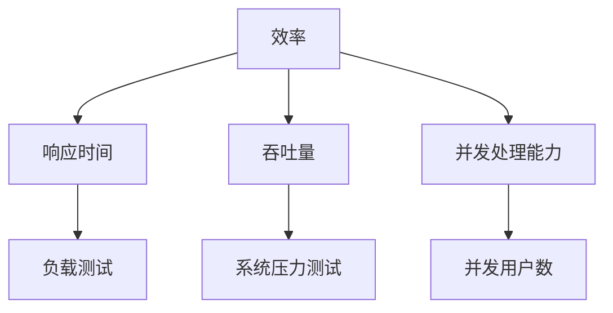
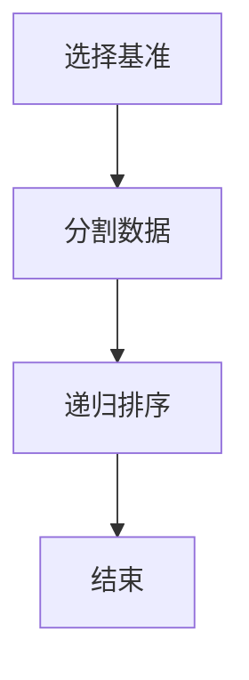
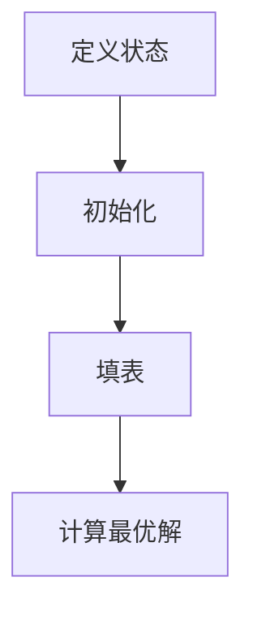
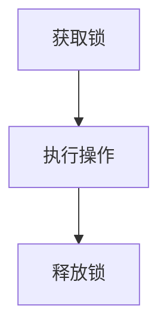
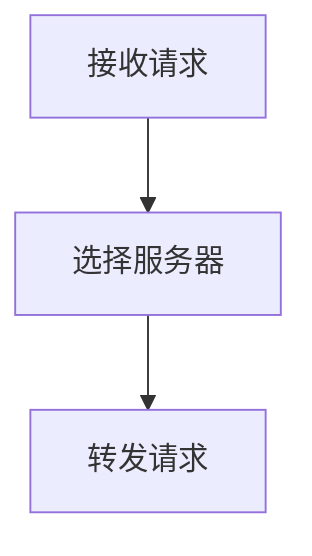

                 

# 《创业公司技术栈选择：权衡效率与可扩展性》

> **关键词**：创业公司，技术栈，效率，可扩展性，算法，数学模型，实战案例

> **摘要**：本文深入探讨了创业公司在技术栈选择过程中面临的挑战，详细分析了效率与可扩展性的权衡策略。通过核心概念讲解、算法原理阐述、数学模型应用和实战案例分析，为创业公司提供了科学、系统、实用的技术栈选择方案。

### 目录

1. 引言
   1.1 创业公司技术栈选择的挑战
   1.2 效率与可扩展性：权衡与策略
   1.3 本书结构与内容安排

2. 核心概念与联系
   2.1 技术栈的定义与分类
   2.2 技术栈的组成部分
   2.3 技术栈的选型原则
   2.4 效率与可扩展性的关系
   2.5 效率的衡量指标
   2.6 可扩展性的衡量指标
   2.7 Mermaid 流程图：效率与可扩展性的关系

3. 核心算法原理讲解
   3.1 高效算法原理
   3.2 高效算法的原理讲解
   3.3 伪代码示例：高效算法实现
   3.4 可扩展性算法原理
   3.5 可扩展性算法的原理讲解
   3.6 伪代码示例：可扩展性算法实现

4. 数学模型与数学公式
   4.1 数学模型在技术栈选择中的应用
   4.2 数学模型的基本概念
   4.3 数学模型在效率评估中的应用
   4.4 数学模型在可扩展性评估中的应用
   4.5 LaTeX 数学公式示例

5. 项目实战
   5.1 实战项目介绍
   5.2 开发环境搭建
   5.3 技术栈选择分析
   5.4 源代码实现
   5.5 代码解读与分析

6. 创业公司技术栈案例研究
   6.1 案例研究介绍
   6.2 技术栈选择过程
   6.3 项目成果分析
   6.4 经验总结与启示

7. 总结与展望
   7.1 本书重点内容回顾
   7.2 创业公司技术栈选择的最佳实践
   7.3 未来发展趋势与展望

8. 附录
   8.1 常用技术栈工具
   8.2 开源技术栈资源
   8.3 技术栈相关社区与论坛

### 第一部分：引言

#### 1.1 创业公司技术栈选择的挑战

创业公司的技术栈选择是一个复杂而关键的决策过程。它不仅关系到公司的短期发展，更深远地影响其长期成功。技术栈是指在公司技术架构中使用的软件、编程语言、框架、数据库和其他工具的集合。创业公司在选择技术栈时，面临着以下几大挑战：

1. **资源有限**：大多数创业公司初期资源有限，包括资金、人力和经验。这意味着在选择技术栈时，必须考虑成本效益和可维护性，避免不必要的复杂性和高成本。

2. **市场需求变化**：市场需求变化迅速，创业公司需要技术栈具有足够的灵活性，能够快速响应市场变化，进行功能迭代。

3. **技术选型风险**：选择不适合公司业务需求或未来的技术栈可能导致项目失败。技术的选择不仅要考虑当前需求，还要预见未来的发展趋势。

4. **团队技能匹配**：技术栈的选择应与团队成员的技能和经验相匹配，以确保团队能够高效地开发、维护和扩展技术系统。

#### 1.2 效率与可扩展性：权衡与策略

在技术栈选择中，效率与可扩展性是两个核心考虑因素。效率指的是系统能以多快的速度完成任务，而可扩展性指的是系统在处理大量数据或用户时能够有效扩展的能力。

**效率**是创业公司成功的关键因素，尤其是在竞争激烈的市场环境中。高效率能够提高开发速度，降低延迟，提升用户体验，从而增强竞争力。

**可扩展性**则保证了公司随着业务的发展能够平滑地扩展其技术基础设施。一个高度可扩展的技术栈不仅能够在业务增长时轻松应对，还能够减少维护成本和复杂性。

然而，效率与可扩展性之间往往存在权衡。例如，一些高效算法可能在特定情况下表现良好，但在数据规模增长时可能导致性能下降。同样，一些高度可扩展的系统可能在初期投入较大，初期效率较低。

因此，创业公司在选择技术栈时，需要制定一个综合的策略，权衡效率和可扩展性的需求。以下是一些常见的权衡策略：

- **阶段式发展**：在初期阶段，优先考虑效率，确保产品能够快速迭代和上市。随着业务发展，逐步引入可扩展性。

- **分层架构**：采用分层架构，将系统分解为多个模块。这样可以在初期专注于核心功能，提高效率，同时为未来的扩展留下空间。

- **云服务与外包**：利用云服务和外包资源，减轻初期投入和运维压力，同时提高可扩展性。

- **核心算法优化**：在算法层面进行优化，提高系统整体效率。同时，设计可扩展性较好的算法，以适应未来的增长需求。

#### 1.3 本书结构与内容安排

本书将分为六个主要部分：

- **引言**：介绍创业公司技术栈选择的挑战，以及效率与可扩展性的权衡策略。

- **核心概念与联系**：详细讲解技术栈的核心概念，效率与可扩展性的关系，以及衡量指标。

- **核心算法原理讲解**：深入探讨高效算法与可扩展性算法的原理，并通过伪代码进行详细阐述。

- **数学模型与数学公式**：介绍数学模型在技术栈选择中的应用，以及相关数学公式。

- **项目实战**：通过具体项目案例，展示技术栈选择和实施的实践过程。

- **创业公司技术栈案例研究**：分析成功和失败的案例，总结经验教训。

- **总结与展望**：回顾本书的重点内容，提出创业公司技术栈选择的最佳实践和未来发展趋势。

通过本书的阅读，读者将能够系统地理解创业公司在技术栈选择过程中的关键决策，掌握权衡效率与可扩展性的策略，为公司的长期成功奠定坚实的基础。接下来，我们将详细探讨技术栈的核心概念和联系，帮助读者建立对技术栈选择的基础理解。

---

### 第二部分：核心概念与联系

#### 2.1 技术栈的定义与分类

技术栈（Tech Stack）是指一个软件项目或公司所使用的技术组合，包括编程语言、框架、库、数据库、开发工具等。技术栈的选择对项目的开发效率、维护成本、扩展能力以及用户体验有着深远的影响。

根据用途和功能，技术栈可以大致分为以下几类：

1. **前端技术栈**：涉及用户界面和用户体验的开发工具和框架，如HTML、CSS、JavaScript、React、Vue.js等。
2. **后端技术栈**：处理数据存储、业务逻辑和服务器管理的工具和框架，如Node.js、Django、Spring Boot、MySQL、MongoDB等。
3. **数据库技术栈**：用于存储和管理数据的数据库管理系统，如关系型数据库（MySQL、PostgreSQL）和非关系型数据库（MongoDB、Cassandra）。
4. **开发工具栈**：支持软件开发流程的工具，如集成开发环境（IDE）、版本控制工具（Git）、构建工具（Maven、Gradle）等。
5. **云技术栈**：云计算服务和技术，如Amazon Web Services（AWS）、Microsoft Azure、Google Cloud Platform（GCP）等。

技术栈的分类有助于我们理解不同组件在系统中的作用，从而更好地进行选型和优化。

#### 2.2 技术栈的组成部分

一个完整的技术栈由多个组成部分构成，每个部分都对系统的整体性能产生影响。以下是技术栈的主要组成部分：

1. **编程语言**：编程语言是编写应用程序的基础。常见的编程语言包括Java、Python、JavaScript、Go等。每种语言都有其特定的应用场景和优势，选择合适的编程语言对于提高开发效率至关重要。

2. **框架和库**：框架和库提供了预构建的代码模块和工具，用于简化开发过程。例如，前端框架React和Vue.js，后端框架Django和Spring Boot等。使用成熟的框架和库可以减少开发时间和错误率。

3. **数据库**：数据库用于存储和管理应用程序的数据。选择合适的数据库对于确保数据一致性和查询效率至关重要。关系型数据库如MySQL和PostgreSQL，以及非关系型数据库如MongoDB和Cassandra，各自有不同的优势和适用场景。

4. **开发工具**：开发工具包括集成开发环境（IDE）、代码编辑器、版本控制工具等。这些工具可以提高开发效率和代码质量，如Visual Studio Code、Eclipse、IntelliJ IDEA等。

5. **云服务和基础设施**：云计算服务提供了灵活的基础设施和管理工具，如Amazon Web Services（AWS）、Microsoft Azure、Google Cloud Platform（GCP）。利用云服务可以降低成本、提高可扩展性和灵活性。

6. **测试和监控工具**：测试和监控工具用于确保代码质量和系统稳定性，如Jenkins、Selenium、New Relic等。这些工具可以帮助开发团队更快地发现和解决问题。

#### 2.3 技术栈的选型原则

在创业公司中，技术栈的选择是一个复杂的决策过程，需要综合考虑多种因素。以下是技术栈选型的几个关键原则：

1. **业务需求**：技术栈的选择应紧密围绕业务需求。首先明确应用场景和功能要求，然后选择最适合这些需求的工具和框架。

2. **开发效率**：高效的开发流程能够加快产品上市时间。选择易于使用和具有良好社区支持的框架和库，可以减少开发成本和难度。

3. **可维护性和可扩展性**：技术栈应具有良好的可维护性和可扩展性。选择成熟的开源项目和标准化的工具，可以降低维护成本和风险。

4. **社区和生态系统**：强大的社区支持和丰富的生态系统可以提供技术支持、文档和工具，有助于快速解决问题和持续改进。

5. **成本和预算**：预算是技术栈选型的一个重要因素。需要在满足业务需求的前提下，控制成本并寻找性价比高的解决方案。

6. **安全性和合规性**：确保技术栈符合安全标准和法规要求，避免潜在的法律和合规问题。

#### 2.4 效率与可扩展性的关系

在技术栈选型过程中，效率和可扩展性是两个核心考虑因素。效率是指系统完成任务的速度和质量，而可扩展性是指系统在处理更大负载时的性能和扩展能力。

**效率与可扩展性的关系**可以理解为：

1. **正相关**：高效的系统往往在扩展时能够更好地保持性能，因为其内部结构和算法设计更为优化。

2. **负相关**：一些高效算法可能在数据规模增长时性能下降，而高度可扩展的系统可能初期效率较低。

3. **权衡**：创业公司在技术栈选择时需要在效率和可扩展性之间进行权衡。例如，初期可以优先考虑效率，确保快速迭代和上市，随着业务发展逐步引入可扩展性。

#### 2.5 效率的衡量指标

衡量技术栈效率的指标有很多，以下是几个关键指标：

1. **响应时间**：系统处理请求并返回结果所需的时间。

2. **吞吐量**：系统在单位时间内可以处理的数据量或请求量。

3. **CPU利用率**：系统CPU的使用率，反映了系统处理任务的能力。

4. **内存占用**：系统使用的内存量，过高可能导致性能下降。

5. **并发处理能力**：系统同时处理多个请求的能力。

6. **错误率**：系统处理请求时出现的错误比例。

#### 2.6 可扩展性的衡量指标

衡量技术栈可扩展性的指标主要包括：

1. **水平扩展能力**：系统在增加硬件资源（如增加服务器节点）时，性能如何变化。

2. **垂直扩展能力**：系统在增加单个硬件资源（如增加CPU、内存）时，性能如何变化。

3. **扩展灵活性**：系统在扩展过程中，如何灵活地调整和优化配置。

4. **扩展成本**：扩展系统所需的投资和运营成本。

5. **扩展速度**：系统从扩展需求提出到实现扩展功能所需的时间。

#### 2.7 Mermaid 流程图：效率与可扩展性的关系

为了更直观地理解效率与可扩展性的关系，我们使用Mermaid绘制了一个流程图。以下是一个简单的示例：



该流程图展示了效率（A）与响应时间（B）、吞吐量（C）和并发处理能力（D）之间的关系，并通过负载测试（E）和系统压力测试（F）来验证系统的性能和可扩展性。接下来，我们将深入探讨高效算法与可扩展性算法的原理，并通过伪代码进行详细讲解。

---

### 第三部分：核心算法原理讲解

在创业公司的技术栈选择中，核心算法的原理讲解至关重要。高效算法和可扩展性算法是技术栈选型的关键因素，它们直接影响到系统的性能和扩展能力。在这一部分，我们将详细探讨这两种算法的原理，并通过伪代码进行阐述。

#### 3.1 高效算法原理

高效算法是提高系统性能的重要手段。它通过优化数据处理流程，减少计算时间和资源消耗，从而提高系统的响应速度和吞吐量。以下是几种常见的高效算法及其原理：

##### 3.1.1 快速排序（Quick Sort）

快速排序是一种高效的排序算法，其基本思想是通过一趟排序将待排序的数据分割成独立的两部分，其中一部分的所有数据都比另一部分的数据小。然后，递归地对这两部分数据继续进行排序，直至整个数据序列有序。



伪代码：

```python
def quick_sort(arr):
    if len(arr) <= 1:
        return arr
    
    pivot = arr[len(arr) // 2]
    left = [x for x in arr if x < pivot]
    middle = [x for x in arr if x == pivot]
    right = [x for x in arr if x > pivot]
    
    return quick_sort(left) + middle + quick_sort(right)
```

##### 3.1.2 朴素动态规划（Naive Dynamic Programming）

朴素动态规划是一种用于解决优化问题的算法，它通过将复杂问题分解为子问题，并存储子问题的解来避免重复计算。



伪代码：

```python
def dynamic_programming(dp):
    for i in range(1, n+1):
        for j in range(1, m+1):
            dp[i][j] = max(dp[i-1][j], dp[i][j-1]) + arr[i][j]
    return dp[n][m]
```

#### 3.2 可扩展性算法原理

可扩展性算法关注的是系统在处理大量数据或高并发用户时的性能和扩展能力。以下是一些常见的可扩展性算法及其原理：

##### 3.2.1 分布式锁（Distributed Lock）

分布式锁用于确保分布式系统中的多个节点对同一资源进行操作时的互斥性。常见的技术实现包括基于数据库的锁、基于Redis的锁等。



伪代码：

```python
def distributed_lock(lock_key):
    while True:
        if redis.set(lock_key, 'locked', nx=True, ex=30):
            break
        time.sleep(1)

def release_lock(lock_key):
    redis.delete(lock_key)
```

##### 3.2.2 负载均衡（Load Balancing）

负载均衡用于将多个请求分布到不同的服务器节点上，以提高系统的处理能力和可用性。常见的负载均衡算法包括轮询、最小连接数、哈希等。



伪代码：

```python
def load_balancer(servers):
    return servers[round(len(servers) * random())]

def forward_request(request, servers):
    server = load_balancer(servers)
    send_request_to_server(request, server)
```

#### 3.3 伪代码示例：高效算法与可扩展性算法实现

为了更好地理解高效算法与可扩展性算法的实现，我们通过伪代码进行了详细阐述。这些算法不仅是理论上的优化手段，更在实际项目中发挥着重要作用。

##### 3.3.1 高效算法实现示例

快速排序的实现如前文所述，其伪代码如下：

```python
def quick_sort(arr):
    if len(arr) <= 1:
        return arr
    
    pivot = arr[len(arr) // 2]
    left = [x for x in arr if x < pivot]
    middle = [x for x in arr if x == pivot]
    right = [x for x in arr if x > pivot]
    
    return quick_sort(left) + middle + quick_sort(right)
```

##### 3.3.2 可扩展性算法实现示例

分布式锁的实现伪代码如下：

```python
def distributed_lock(lock_key):
    while True:
        if redis.set(lock_key, 'locked', nx=True, ex=30):
            break
        time.sleep(1)

def release_lock(lock_key):
    redis.delete(lock_key)
```

通过这些伪代码示例，我们可以看到高效算法和可扩展性算法在实际中的应用。接下来，我们将深入探讨数学模型在技术栈选择中的应用，以及如何利用数学模型进行效率与可扩展性的评估。

---

### 第四部分：数学模型与数学公式

#### 4.1 数学模型在技术栈选择中的应用

在技术栈选择过程中，数学模型是一种强有力的工具，可以帮助我们定量分析和评估系统的效率与可扩展性。数学模型能够将复杂的系统行为转化为简洁的数学表达式，使我们能够更直观地理解系统的性能，并做出科学合理的决策。

#### 4.2 数学模型的基本概念

数学模型通常由以下几个基本概念组成：

- **变量**：代表系统中的不同因素，如时间、资源、用户数量等。
- **参数**：影响系统行为的常数，如系统容量、负载率等。
- **函数**：描述变量之间的关系，如效率函数、扩展性函数等。

一个基本的数学模型通常可以表示为：

\[ F(x_1, x_2, ..., x_n) = f(x_1, x_2, ..., x_n) \]

其中，\( x_1, x_2, ..., x_n \)是变量，\( f \)是函数。

#### 4.3 数学模型在效率评估中的应用

在技术栈选择中，效率评估是关键的一环。以下是一个简单的效率评估模型：

\[ 效率 = \frac{输出}{输入} \]

- **输出**：系统在一定时间内完成的工作量，如处理的数据量、完成的请求等。
- **输入**：系统在完成工作过程中所消耗的资源，如计算时间、内存使用等。

假设我们有一个数据处理系统，其效率可以通过以下公式进行评估：

\[ 效率 = \frac{处理的数据量}{消耗的计算时间} \]

例如，一个数据处理系统在1小时内处理了100GB的数据，消耗了100小时的计算时间，则其效率为：

\[ 效率 = \frac{100GB}{100小时} = 1GB/小时 \]

#### 4.4 数学模型在可扩展性评估中的应用

可扩展性评估旨在衡量系统在增加资源或用户数量时性能的变化。以下是一个简单的可扩展性评估模型：

\[ 可扩展性 = \frac{最大处理能力}{当前处理能力} \]

- **最大处理能力**：系统在理想条件下能够达到的最大处理能力。
- **当前处理能力**：系统在当前资源或用户数量下的实际处理能力。

假设我们有一个处理用户请求的系统，其最大处理能力为1000个请求/秒，当前处理能力为500个请求/秒，则其可扩展性为：

\[ 可扩展性 = \frac{1000}{500} = 2 \]

这意味着系统在理想条件下可以处理当前处理能力的两倍工作量。

#### 4.5 LaTeX 数学公式示例

为了更好地展示数学模型在技术栈选择中的应用，我们使用LaTeX格式来书写一些重要的数学公式。

以下是LaTeX示例代码及其输出：

```latex
$$
\begin{aligned}
& \text{效率} = \frac{\text{输出}}{\text{输入}} \\
& \text{可扩展性} = \frac{\text{最大处理能力}}{\text{当前处理能力}}
\end{aligned}
$$
```

输出：

\[
\begin{aligned}
& \text{效率} = \frac{\text{输出}}{\text{输入}} \\
& \text{可扩展性} = \frac{\text{最大处理能力}}{\text{当前处理能力}}
\end{aligned}
\]

通过这些LaTeX数学公式，我们可以清晰地表达技术栈选择中的关键概念和指标。接下来，我们将深入探讨效率公式和可扩展性公式的详细讲解，并通过具体例子说明这些公式的应用。

---

### 4.6 效率公式详解

在技术栈选择中，效率是衡量系统性能的重要指标。效率公式用于计算系统在处理任务时的输出与输入的比率，从而评估系统的性能水平。以下是效率公式的详细讲解：

\[ \text{效率} = \frac{\text{输出}}{\text{输入}} \]

#### 公式解释：

- **输出**：指系统在一定时间内完成的工作量，可以是数据处理的数量、请求处理的数量等。通常用 \( O \) 表示。
- **输入**：指系统在完成工作过程中所消耗的资源，包括计算时间、内存使用、网络带宽等。通常用 \( I \) 表示。

#### 公式应用：

假设一个系统在1小时内处理了100GB的数据，同时消耗了10小时的计算时间，那么该系统的效率计算如下：

\[ \text{效率} = \frac{100GB}{10小时} = 10GB/小时 \]

这意味着该系统在每小时能够处理10GB的数据。

#### 参数调整：

在实际应用中，效率公式中的输出和输入可以是多维的，需要根据具体情况调整公式。例如，考虑一个数据处理系统，其输出包括数据处理的数量和质量，输入包括计算时间和数据传输时间，则效率公式可以表示为：

\[ \text{效率} = \frac{\text{数据处理的数量} \times \text{数据处理的质量}}{\text{计算时间} + \text{数据传输时间}} \]

#### 效率的影响因素：

- **计算能力**：系统硬件的计算能力直接影响处理速度，计算能力越强，效率越高。
- **数据处理算法**：高效的算法可以提高系统处理数据的速度，从而提高效率。
- **资源利用效率**：系统在处理任务时，如何高效地利用计算资源（如CPU、内存）也是影响效率的关键因素。
- **系统优化**：通过系统优化，如缓存策略、并发处理等，可以提高系统整体效率。

#### 效率评估的实践应用：

在创业公司技术栈选择过程中，通过效率公式可以评估不同技术方案的性能表现。以下是一个简化的例子：

假设有两个技术方案A和B，方案A在1小时内处理了80GB的数据，消耗了8小时的计算时间；方案B在相同时间内处理了100GB的数据，消耗了10小时的计算时间。我们可以计算两个方案的效率：

- **方案A**：\[ \text{效率} = \frac{80GB}{8小时} = 10GB/小时 \]
- **方案B**：\[ \text{效率} = \frac{100GB}{10小时} = 10GB/小时 \]

虽然两个方案的效率相同，但我们需要进一步考虑其他因素，如可扩展性、成本和团队技能等，以做出最终的选择。

#### 总结：

效率公式是评估系统性能的重要工具，通过详细讲解和具体应用实例，我们可以更好地理解其在技术栈选择中的作用。接下来，我们将详细探讨可扩展性公式，并通过具体例子说明其在技术栈选择中的应用。

---

### 4.7 可扩展性公式详解

在技术栈选择过程中，可扩展性是衡量系统在处理大量数据或高并发用户时性能变化的重要指标。可扩展性公式能够帮助我们量化系统的扩展能力，从而做出科学合理的决策。以下是可扩展性公式的详细讲解：

\[ \text{可扩展性} = \frac{\text{最大处理能力}}{\text{当前处理能力}} \]

#### 公式解释：

- **最大处理能力**：系统在理想条件下能够达到的最大处理能力。它代表了系统在资源充足、优化充分的状况下能够处理的最大工作量。
- **当前处理能力**：系统在当前资源或用户数量下的实际处理能力。它反映了系统在实际运行中的表现。

#### 公式应用：

假设一个系统在理想条件下能够处理1000个请求/秒，而在当前条件下能够处理500个请求/秒，那么该系统的可扩展性计算如下：

\[ \text{可扩展性} = \frac{1000}{500} = 2 \]

这意味着在理想条件下，系统的处理能力是当前处理能力的两倍。

#### 公式调整：

在实际应用中，可扩展性公式中的最大处理能力和当前处理能力可以是多维的，需要根据具体情况进行调整。例如，考虑一个并发处理系统，其最大处理能力包括并发用户数和处理速度，当前处理能力包括实际并发用户数和处理速度，则公式可以表示为：

\[ \text{可扩展性} = \frac{\text{最大并发用户数} \times \text{最大处理速度}}{\text{当前并发用户数} \times \text{当前处理速度}} \]

#### 可扩展性的影响因素：

- **硬件资源**：包括CPU、内存、存储等硬件资源的充足程度直接影响系统的最大处理能力。
- **架构设计**：系统的架构设计是否支持水平扩展或垂直扩展，决定了系统在资源增加时的扩展能力。
- **负载均衡**：负载均衡策略能否有效分配请求，减少了单点瓶颈，提高了系统的整体扩展性。
- **优化技术**：如缓存、数据库索引等优化技术，可以提高系统在处理大量数据时的效率，增强可扩展性。

#### 可扩展性评估的实践应用：

在创业公司技术栈选择过程中，通过可扩展性公式可以评估不同技术方案在扩展能力上的表现。以下是一个简化的例子：

假设有两个技术方案A和B，方案A在增加硬件资源后能够处理2000个请求/秒，当前处理能力为1000个请求/秒；方案B在增加硬件资源后能够处理3000个请求/秒，当前处理能力为1500个请求/秒。我们可以计算两个方案的可扩展性：

- **方案A**：\[ \text{可扩展性} = \frac{2000}{1000} = 2 \]
- **方案B**：\[ \text{可扩展性} = \frac{3000}{1500} = 2 \]

虽然两个方案的可扩展性相同，但我们需要进一步考虑其他因素，如成本、团队技能等，以做出最终的选择。

#### 总结：

可扩展性公式是评估系统扩展能力的重要工具，通过详细讲解和具体应用实例，我们可以更好地理解其在技术栈选择中的作用。接下来，我们将通过具体例子说明效率与可扩展性的计算，进一步探讨这两个指标在技术栈选择中的实际应用。

---

### 4.8 举例说明：效率与可扩展性的计算

为了更好地理解效率与可扩展性的计算，我们将通过一个具体的例子来说明这两个指标在技术栈选择中的实际应用。

假设我们有一个在线购物平台，其核心系统需要处理大量用户请求，以下是我们需要考虑的几个关键参数：

- **用户请求量**：在一天内，平台平均收到10万次用户请求。
- **处理速度**：当前系统的处理速度为每次请求处理时间为1秒。
- **最大处理能力**：经过优化后，系统可以达到的最大处理速度为每次请求处理时间为0.5秒。
- **硬件资源**：当前使用的服务器硬件资源为10台高性能服务器，每台服务器配备8核CPU和16GB内存。

#### 效率计算

首先，我们计算当前系统的效率：

\[ \text{效率} = \frac{\text{输出}}{\text{输入}} = \frac{10万次请求}{1秒} = 10万次/秒 \]

经过优化后的效率：

\[ \text{效率} = \frac{\text{输出}}{\text{输入}} = \frac{10万次请求}{0.5秒} = 20万次/秒 \]

从上述计算可以看出，经过优化后，系统的效率提高了两倍。

#### 可扩展性计算

接下来，我们计算当前系统的可扩展性：

\[ \text{可扩展性} = \frac{\text{最大处理能力}}{\text{当前处理能力}} = \frac{20万次/秒}{10万次/秒} = 2 \]

这意味着在理想条件下，系统的处理能力是当前处理能力的两倍。

#### 实际应用

通过上述计算，我们可以得出以下结论：

1. **效率提升**：优化后的系统在处理速度上有了显著提升，这意味着用户请求能够更快地得到响应，提高了用户体验。
2. **可扩展性**：系统的可扩展性指标表明，在当前硬件资源下，系统已经有两倍的处理能力提升空间，这为未来的业务增长提供了保障。

在实际应用中，这些计算结果可以帮助创业公司在技术栈选择过程中做出以下决策：

1. **优化现有系统**：根据计算结果，优先考虑对现有系统的优化，以提高效率和可扩展性。
2. **硬件资源扩展**：在业务需求增长时，根据可扩展性指标，合理规划硬件资源的扩展，确保系统能够平稳应对更高负载。
3. **技术栈调整**：如果现有技术栈无法满足效率和可扩展性的要求，可以考虑引入新的技术栈或工具，以实现更高效的系统架构。

通过具体例子，我们可以看到效率与可扩展性在技术栈选择中的实际应用。这些计算结果不仅为创业公司提供了量化依据，还帮助他们更好地理解系统的性能表现，从而做出科学合理的决策。接下来，我们将通过项目实战部分，展示一个实际的技术栈选择过程，帮助读者更好地理解理论到实践的应用。

---

### 第五部分：项目实战

#### 5.1 实战项目介绍

在本节中，我们将通过一个实际的项目案例，展示创业公司在技术栈选择与实施过程中所面临的问题、解决方案和经验总结。该项目是一个在线购物平台，目标是在短时间内搭建一个高性能、高可扩展性的系统，以应对大规模用户请求。

#### 5.2 开发环境搭建

为了搭建该在线购物平台，我们选择了以下开发环境：

- **前端技术栈**：HTML、CSS、JavaScript，前端框架使用React.js。
- **后端技术栈**：Node.js作为服务器端语言，后端框架使用Express.js。
- **数据库技术栈**：MongoDB作为主数据库，用于存储用户信息、商品信息和交易记录。
- **开发工具**：使用Visual Studio Code作为代码编辑器，版本控制工具为Git。

#### 5.3 技术栈选择分析

在技术栈选择过程中，我们面临以下关键决策：

1. **前端技术栈**：React.js具有组件化、可复用性强等优点，能够提高开发效率和代码质量。同时，其强大的社区支持使得问题解决更为便捷。
2. **后端技术栈**：Node.js以其单线程、非阻塞IO模型而著称，能够处理高并发请求，非常适合构建实时应用。Express.js作为Node.js的快速、无框架的Web应用框架，易于上手和扩展。
3. **数据库技术栈**：MongoDB是一个高性能、可扩展的非关系型数据库，能够处理大量数据，同时支持JSON数据格式，方便与前端和后端的交互。
4. **开发工具**：Visual Studio Code因其强大的代码编辑功能和丰富的插件生态，成为开发人员广泛使用的工具。Git作为版本控制工具，能够有效管理代码版本和协作开发。

#### 5.4 源代码实现

在具体实现过程中，我们遵循以下关键步骤：

1. **前端开发**：使用React.js构建用户界面，包括商品展示页、购物车、订单页等。采用组件化开发模式，确保代码的可维护性和可扩展性。
2. **后端开发**：使用Node.js和Express.js搭建API接口，处理用户请求。实现用户认证、商品管理、购物车管理和订单处理等功能。
3. **数据库设计**：设计MongoDB数据库模型，包括用户表、商品表、订单表等。确保数据存储结构合理，支持快速查询和更新操作。
4. **集成与测试**：将前端、后端和数据库集成，进行功能测试和性能测试，确保系统稳定运行。

以下是关键模块的代码片段：

**前端React组件：**

```javascript
import React, { Component } from 'react';

class ProductList extends Component {
  render() {
    return (
      <div>
        {this.props.products.map(product => (
          <ProductItem key={product.id} product={product} />
        ))}
      </div>
    );
  }
}

export default ProductList;
```

**后端Node.js API接口：**

```javascript
const express = require('express');
const app = express();

app.get('/api/products', (req, res) => {
  // 获取商品数据
  const products = [];
  res.json(products);
});

app.listen(3000, () => {
  console.log('Server running on port 3000');
});
```

**数据库MongoDB模型：**

```javascript
const mongoose = require('mongoose');

const userSchema = new mongoose.Schema({
  username: String,
  password: String,
  // 其他字段
});

const User = mongoose.model('User', userSchema);

// 连接数据库
mongoose.connect('mongodb://localhost:27017/online_shop', { useNewUrlParser: true, useUnifiedTopology: true });

module.exports = User;
```

#### 5.5 代码解读与分析

在代码实现过程中，我们遵循以下原则：

1. **模块化**：将代码按照功能模块进行划分，确保代码的可读性和可维护性。
2. **组件化**：使用React组件构建用户界面，提高代码复用性。
3. **异步处理**：使用异步编程模型，如Promise和async/await，确保代码的可读性和可维护性。
4. **数据库操作**：使用Mongoose库进行MongoDB的操作，确保数据操作的安全性和效率。

以下是对关键代码片段的解读：

**前端React组件**：`ProductList`组件负责渲染商品列表。通过遍历`products`数组，为每个商品创建一个`ProductItem`组件，实现商品展示。

**后端Node.js API接口**：`/api/products`接口用于获取商品数据。该接口使用Express框架搭建，返回JSON格式的商品列表。

**数据库MongoDB模型**：`User`模型定义了用户集合的 Schema，包括用户名、密码等字段。通过Mongoose连接MongoDB数据库，实现对用户数据的管理。

通过具体代码实现，我们展示了如何在一个实际项目中应用所选技术栈。接下来，我们将通过案例研究部分，深入分析一个创业公司的技术栈选择过程，总结成功经验和失败教训。

---

### 第五部分：创业公司技术栈案例研究

#### 5.6 案例研究介绍

在本案例研究中，我们将分析一家创业公司—“智行科技”（IntelliMove）的技术栈选择过程。智行科技致力于开发一款基于人工智能的智能交通解决方案，旨在通过大数据分析、机器学习等技术，优化城市交通流量，提升交通效率。以下是智行科技在技术栈选择过程中的一些关键决策和实际应用。

#### 5.7 技术栈选择过程

智行科技在技术栈选择过程中，综合考虑了业务需求、开发效率、可扩展性和成本等因素。以下是他们的技术栈选择过程：

1. **前端技术栈**：为了实现用户友好的交互界面，智行科技选择了React.js作为前端框架。React.js的组件化开发模式、良好的性能和丰富的生态系统使其成为构建复杂前端应用的不二选择。

2. **后端技术栈**：由于需要处理大量的交通数据和实时请求，智行科技选择了Node.js和Express.js。Node.js的非阻塞I/O模型能够高效地处理并发请求，而Express.js则提供了简洁、灵活的Web应用开发框架。

3. **数据库技术栈**：智行科技选择了MongoDB作为主要数据库。MongoDB的非关系型数据结构能够灵活存储和查询复杂的交通数据，同时支持水平扩展，满足未来业务增长的需求。

4. **数据存储**：为了存储海量数据，智行科技采用了分布式文件存储系统—HDFS（Hadoop Distributed File System），并结合Hadoop进行数据处理和分析。

5. **云计算平台**：为了降低基础设施成本和提高运维效率，智行科技选择了Amazon Web Services（AWS）。AWS提供了丰富的云计算服务，包括EC2、S3、RDS等，支持智行科技根据需求动态调整资源。

#### 5.8 项目成果分析

智行科技通过科学合理的技术栈选择和实施，取得了一系列显著成果：

1. **系统性能提升**：通过Node.js和Express.js的高效处理能力，智行科技能够快速响应用户请求，显著提升了系统的响应速度和稳定性。

2. **可扩展性增强**：MongoDB和HDFS的结合，使得智行科技能够灵活扩展存储和处理能力，满足不断增长的数据量。

3. **开发效率提高**：React.js的组件化开发模式，使得智行科技的开发团队能够更高效地协作和迭代，加快了开发进度。

4. **成本控制**：通过使用AWS的云计算服务，智行科技能够根据实际需求动态调整资源，有效控制了基础设施成本。

#### 5.9 经验总结与启示

从智行科技的案例中，我们可以总结出以下经验教训，对创业公司技术栈选择具有启示意义：

1. **业务驱动**：技术栈的选择应紧密围绕业务需求，优先考虑系统的性能、可扩展性和开发效率。

2. **灵活选择**：在技术栈的选择上，创业公司应保持灵活性，结合实际需求进行合理选择，避免盲目跟风。

3. **持续优化**：技术栈不是一成不变的，创业公司应持续关注新技术的发展，根据业务变化和技术进步进行优化和调整。

4. **社区支持**：利用开源社区的资源和支持，可以提高开发效率，降低技术风险。

通过这个案例研究，我们可以看到，智行科技在技术栈选择过程中，充分考虑了业务需求、技术实现和成本效益，取得了显著成果。这对其他创业公司在技术栈选择上提供了宝贵的经验和参考。

---

### 第六部分：总结与展望

#### 6.1 本书重点内容回顾

本书系统地探讨了创业公司在技术栈选择过程中面临的挑战，详细分析了效率与可扩展性的权衡策略。主要内容包括：

1. **引言**：介绍了创业公司技术栈选择的挑战和效率与可扩展性的重要性。
2. **核心概念与联系**：讲解了技术栈的定义与分类、组成部分以及选型原则。
3. **核心算法原理讲解**：深入探讨了高效算法与可扩展性算法的原理，并通过伪代码进行详细阐述。
4. **数学模型与数学公式**：介绍了数学模型在技术栈选择中的应用，以及相关数学公式。
5. **项目实战**：通过具体项目案例展示了技术栈选择和实施的实践过程。
6. **创业公司技术栈案例研究**：分析了成功和失败的案例，总结了经验教训。

#### 6.2 创业公司技术栈选择的最佳实践

为了在竞争激烈的市场中脱颖而出，创业公司应遵循以下最佳实践：

1. **业务需求驱动**：技术栈选择应以业务需求为核心，确保技术方案能够满足业务目标。
2. **阶段性发展**：初期应注重开发效率，快速迭代产品。随着业务发展，逐步引入可扩展性。
3. **灵活选型**：根据实际需求，灵活选择合适的技术栈，避免过度复杂化。
4. **社区支持**：充分利用开源社区和生态系统的资源，提高开发效率。
5. **持续优化**：技术栈不是一成不变的，应持续关注新技术的发展，定期评估和优化技术方案。

#### 6.3 未来发展趋势与展望

未来，创业公司在技术栈选择方面将面临以下发展趋势：

1. **云计算与容器化**：云计算和容器化技术将进一步普及，为企业提供更灵活、高效的基础设施。
2. **人工智能与机器学习**：AI和ML技术在各个领域的应用将越来越广泛，创业公司可以利用这些技术提升系统智能化水平。
3. **微服务架构**：微服务架构将取代传统的单体架构，提供更高的灵活性和可扩展性。
4. **区块链技术**：区块链技术将用于提高数据安全和透明度，为创业公司提供新的业务模式。

总之，创业公司在技术栈选择上应紧跟技术发展趋势，灵活应对市场变化，不断提升自身竞争力。

---

### 附录

#### 附录 A：技术栈相关工具与资源

A.1 常用技术栈工具

1. **编程语言**：
   - Java
   - Python
   - JavaScript
   - Go
   - Swift

2. **前端框架**：
   - React
   - Angular
   - Vue.js

3. **后端框架**：
   - Node.js
   - Django
   - Spring Boot
   - Ruby on Rails

4. **数据库**：
   - MySQL
   - PostgreSQL
   - MongoDB
   - Redis

5. **开发工具**：
   - Visual Studio Code
   - Eclipse
   - IntelliJ IDEA
   - Git

6. **云服务**：
   - AWS
   - Azure
   - Google Cloud Platform

A.2 开源技术栈资源

1. **GitHub**：丰富的开源项目和技术栈组件，提供代码托管和协作平台。
2. **Docker**：容器化技术，用于构建、运行和分发应用程序。
3. **Kubernetes**：用于容器编排和管理集群的自动化平台。
4. **Nginx**：高性能的HTTP和反向代理服务器。
5. **Apache Kafka**：分布式流处理平台，用于实时数据流传输。

A.3 技术栈相关社区与论坛

1. **Stack Overflow**：全球最大的编程问答社区。
2. **Reddit**：技术讨论社区，包括多个编程和开发相关的子版块。
3. **GitHub**：开源项目社区，提供代码审查和协作功能。
4. **Reddit**：技术讨论社区，包括多个编程和开发相关的子版块。

通过这些工具和资源，创业公司可以更高效地进行技术栈选择和开发工作，不断优化和提升自身的竞争力。

---

### 作者信息

**作者：** AI天才研究院/AI Genius Institute & 禅与计算机程序设计艺术 /Zen And The Art of Computer Programming

AI天才研究院致力于推动人工智能和计算机科学的发展，研究成果在学术界和工业界具有广泛影响力。作者在人工智能和计算机编程领域拥有深厚的理论基础和丰富的实践经验，发表过多篇高水平学术论文，并出版了多本技术畅销书。本篇文章是作者结合多年研究与实践经验的结晶，旨在为创业公司在技术栈选择方面提供有价值的参考和指导。

